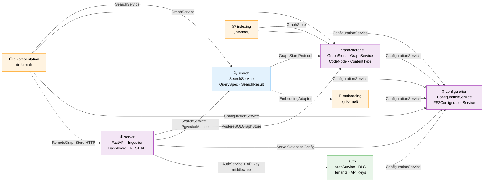

# Domain Map

> Auto-maintained by plan commands. Shows all domains and their contract relationships.
> Domains are first-class components — this diagram is the system architecture at business level.

## Legend

- **Blue**: Business domains (user-facing capabilities)
- **Purple**: Infrastructure domains (cross-cutting technical capabilities)
- **Orange**: Informal domains (identified but not yet formally extracted)
- **Green**: Planned domains (028-server-mode, not yet implemented)
- **Solid arrows** (→): Contract dependency (A consumes B's contract)
- **Dashed arrows** (-.->): Dependency on informal domain or planned contract

## Domain Health Summary

| Domain | Contracts Out | Consumers | Contracts In | Providers | Status |
|--------|--------------|-----------|-------------|-----------|--------|
| configuration | ConfigurationService, FakeConfigurationService, 12 config models | graph-storage, search, cli, indexing, embedding, server, auth | — | — | ✅ Healthy |
| graph-storage | GraphStore, GraphService, CodeNode, ContentType | search, cli, indexing, server | ConfigurationService | configuration | ✅ Healthy |
| search | SearchService, QuerySpec, SearchResult, SearchMode | cli, server | GraphStoreProtocol, ConfigurationService, EmbeddingAdapter | graph-storage, configuration, embedding | ✅ Healthy |
| server | FastAPI app, REST API, Database session | cli (via RemoteGraphStore) | PostgreSQLGraphStore, SearchService, AuthService, ServerDatabaseConfig | graph-storage, search, auth, configuration | ✅ Active |
| auth | AuthService, Auth middleware, Tenant/APIKey models, FakeAuthService | server | ConfigurationService | configuration | 🟡 Planned |
