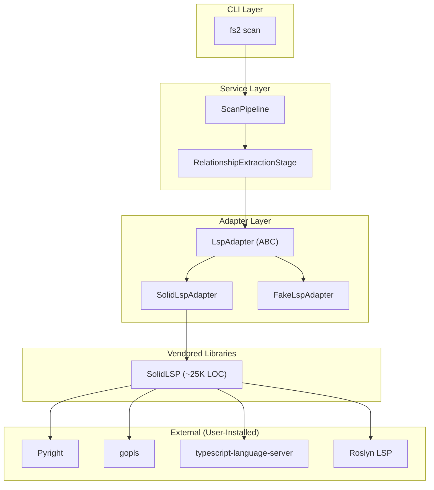
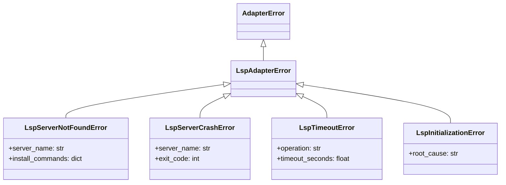

# LSP Adapter Architecture

This guide explains the LSP integration architecture for contributors who want to understand, maintain, or extend the LSP functionality in fs2.

## Table of Contents

1. [Architecture Overview](#architecture-overview)
2. [Component Diagram](#component-diagram)
3. [LspAdapter ABC Interface](#lspadapter-abc-interface)
4. [SolidLspAdapter Implementation](#solidlspadapter-implementation)
5. [Exception Hierarchy](#exception-hierarchy)
6. [Testing Strategy](#testing-strategy)
7. [Adding Language Support](#adding-language-support)
8. [Common Patterns](#common-patterns)

---

## Architecture Overview

LSP integration follows fs2's Clean Architecture principles:

- **ABC Interface** (`LspAdapter`) — Language-agnostic contract in `core/adapters/`
- **Implementation** (`SolidLspAdapter`) — Wraps vendored SolidLSP library
- **Configuration** (`LspConfig`) — Pydantic model in `config/objects.py`
- **Exception Translation** — All SolidLSP errors become domain exceptions

### Key Design Decisions

1. **Vendored SolidLSP** — ~25K LOC copied to `src/fs2/vendors/solidlsp/` for isolation
2. **No per-language branching** — SolidLSP abstracts all language differences
3. **Graceful degradation** — LSP failures never break scanning
4. **Domain-only types** — ABC uses `CodeEdge`, not LSP protocol types

---

## Component Diagram



---

## LspAdapter ABC Interface

Location: `src/fs2/core/adapters/lsp_adapter.py`

```python
from abc import ABC, abstractmethod
from pathlib import Path
from fs2.core.models.code_edge import CodeEdge

class LspAdapter(ABC):
    """Language-agnostic interface for LSP operations."""

    @abstractmethod
    def initialize(self, language: str, root_path: Path) -> None:
        """
        Initialize the LSP server for a language and project.
        
        Args:
            language: Language identifier (e.g., "python", "typescript")
            root_path: Project root directory (where pyproject.toml, etc. lives)
        
        Raises:
            LspServerNotFoundError: Server binary not installed
            LspInitializationError: Server failed to start
        """
        ...

    @abstractmethod
    def shutdown(self) -> None:
        """
        Gracefully stop the LSP server.
        
        Idempotent — safe to call multiple times or if not initialized.
        Never raises exceptions.
        """
        ...

    @abstractmethod
    def get_references(
        self, file_path: Path, line: int, column: int
    ) -> list[CodeEdge]:
        """
        Find all references to the symbol at the given position.
        
        Args:
            file_path: Relative path from project root
            line: 0-indexed line number
            column: 0-indexed column number
        
        Returns:
            List of CodeEdge with edge_type=REFERENCES, confidence=1.0
        
        Raises:
            LspTimeoutError: Operation exceeded timeout
        """
        ...

    @abstractmethod
    def get_definition(
        self, file_path: Path, line: int, column: int
    ) -> list[CodeEdge]:
        """
        Find the definition of the symbol at the given position.
        
        Args:
            file_path: Relative path from project root
            line: 0-indexed line number
            column: 0-indexed column number
        
        Returns:
            List of CodeEdge with edge_type=CALLS, confidence=1.0
        
        Raises:
            LspTimeoutError: Operation exceeded timeout
        """
        ...

    @abstractmethod
    def is_ready(self) -> bool:
        """Check if the LSP server is initialized and responsive."""
        ...
```

### Contract Notes

- **0-indexed positions** — LSP protocol uses 0-indexed line/column
- **Relative paths** — File paths are relative to `root_path` passed to `initialize()`
- **CodeEdge only** — No LSP protocol types leak through the interface
- **Confidence 1.0** — All LSP results have maximum confidence (type-aware)

---

## SolidLspAdapter Implementation

Location: `src/fs2/core/adapters/lsp_adapter_solidlsp.py`

### Key Methods

```python
class SolidLspAdapter(LspAdapter):
    def __init__(self, config: ConfigurationService):
        self._lsp_config = config.require(LspConfig)
        self._server: SolidLanguageServer | None = None
        self._project_root: Path | None = None

    def initialize(self, language: str, root_path: Path) -> None:
        # 1. Pre-check: is the server binary installed?
        binary = self._get_server_binary(language)
        if not shutil.which(binary):
            raise LspServerNotFoundError(binary, INSTALL_COMMANDS[language])
        
        # 2. Create SolidLSP server instance
        lang_enum = self._get_language_enum(language)
        self._server = SolidLanguageServer.create(
            code_language=lang_enum,
            workspace_path=str(root_path)
        )
        self._project_root = root_path

    def get_definition(self, file_path: Path, line: int, column: int) -> list[CodeEdge]:
        # Query LSP
        locations = self._server.request_definition(
            file_path=str(file_path),
            line=line,
            character=column
        )
        
        # Translate to domain model
        return [self._translate_definition(loc) for loc in locations]

    def _translate_definition(self, location: dict) -> CodeEdge:
        """Translate LSP Location to CodeEdge."""
        return CodeEdge(
            source_node_id=self._location_to_node_id(location),
            target_node_id=self._current_node_id,  # Call site
            edge_type=EdgeType.CALLS,
            confidence=1.0,
            resolution_rule="lsp:definition",
            source_line=location["range"]["start"]["line"]
        )
```

### Vendored SolidLSP

Location: `src/fs2/vendors/solidlsp/`

The vendored code is a modified copy of [Serena's SolidLSP](https://github.com/oraios-ai/serena):

- **Import paths changed**: `solidlsp.*` → `fs2.vendors.solidlsp.*`
- **Stub modules** for `serena.*` and `sensai.*` dependencies
- **Upstream tracking**: `VENDOR_VERSION` file records source commit
- **Lint excluded**: `pyproject.toml` excludes vendors/ from all lint rules

---

## Exception Hierarchy

Location: `src/fs2/core/adapters/exceptions.py`



### Actionable Error Messages

All exceptions include platform-specific fix instructions:

```python
class LspServerNotFoundError(LspAdapterError):
    def __init__(self, server_name: str, install_commands: dict[str, str]):
        system = platform.system()
        cmd = install_commands.get(system, install_commands.get('default'))
        super().__init__(f"'{server_name}' not found. Install with:\n  {cmd}")
```

---

## Testing Strategy

### Test Files

| File | Purpose | Type |
|------|---------|------|
| `tests/unit/adapters/test_lsp_adapter.py` | ABC contract tests | Unit |
| `tests/unit/adapters/test_lsp_adapter_fake.py` | FakeLspAdapter behavior | Unit |
| `tests/unit/adapters/test_lsp_type_translation.py` | LSP → CodeEdge | Unit |
| `tests/integration/test_lsp_pyright.py` | Pyright integration | Integration |
| `tests/integration/test_lsp_typescript.py` | TypeScript integration | Integration |
| `tests/integration/test_lsp_gopls.py` | Go integration | Integration |
| `tests/integration/test_lsp_roslyn.py` | C# integration | Integration |

### Running Tests

```bash
# Unit tests (fast, no LSP servers needed)
pytest tests/unit/adapters/test_lsp_*.py -v

# Integration tests (requires LSP servers)
pytest tests/integration/test_lsp_*.py -v

# Skip if server not installed
pytest tests/integration/test_lsp_pyright.py -v
# Skipped: Pyright not installed

# All LSP tests
pytest -k lsp -v
```

### FakeLspAdapter for Unit Tests

```python
from fs2.core.adapters.lsp_adapter_fake import FakeLspAdapter

def test_service_with_lsp():
    fake = FakeLspAdapter(config_service)
    fake.set_definition_response([
        CodeEdge(
            source_node_id="method:src/app.py:App.main",
            target_node_id="method:src/lib.py:Lib.helper",
            edge_type=EdgeType.CALLS,
            confidence=1.0
        )
    ])
    
    service = MyService(lsp_adapter=fake)
    result = service.process()
    
    assert fake.call_history[-1]["method"] == "get_definition"
```

---

## Adding Language Support

### Step 1: Check if SolidLSP Already Supports It

Most languages are already supported! Check:

```bash
ls src/fs2/vendors/solidlsp/language_servers/
# Look for your_language_language_server.py
```

If the file exists, the language is supported. Just install the LSP server binary.

### Step 2: If Not Supported, Add Language Server Config

Create `src/fs2/vendors/solidlsp/language_servers/new_language_server.py`:

```python
from fs2.vendors.solidlsp.ls_config import LanguageServerConfig

class NewLanguageServer(LanguageServerConfig):
    language_id = "newlang"
    file_patterns = ["*.new", "*.nlang"]
    
    def get_server_command(self) -> list[str]:
        return ["newlang-lsp", "--stdio"]
```

Register in `Language` enum:

```python
# src/fs2/vendors/solidlsp/ls_config.py
class Language(Enum):
    # ... existing languages
    NEWLANG = "newlang"
```

### Step 3: Add Integration Tests

```python
# tests/integration/test_lsp_newlang.py
import shutil
import pytest

pytestmark = pytest.mark.skipif(
    not shutil.which('newlang-lsp'),
    reason="newlang-lsp not installed"
)

class TestNewLangIntegration:
    @pytest.fixture
    def newlang_project(self, tmp_path):
        (tmp_path / "lib.new").write_text("func helper() {}")
        (tmp_path / "app.new").write_text("import lib\nfunc main() { lib.helper() }")
        return tmp_path

    def test_get_definition_cross_file(self, newlang_project, config_service):
        adapter = SolidLspAdapter(config_service)
        adapter.initialize("newlang", newlang_project)
        try:
            edges = adapter.get_definition(
                newlang_project / "app.new", line=1, column=10
            )
            assert len(edges) >= 1
            assert edges[0].edge_type == EdgeType.CALLS
        finally:
            adapter.shutdown()
```

### Step 4: Document

Update `docs/how/user/lsp-guide.md`:
- Add to Supported Languages table
- Add install command

---

## Common Patterns

### Graceful Degradation

```python
def extract_relationships(self, file: Path) -> list[CodeEdge]:
    edges = []
    
    # Text extraction always runs
    edges.extend(self._text_extractor.extract(file))
    
    # LSP extraction is optional
    try:
        if self._lsp_adapter and self._lsp_adapter.is_ready():
            edges.extend(self._lsp_extract(file))
    except LspAdapterError as e:
        logger.warning(f"LSP extraction failed: {e}")
        # Continue without LSP edges
    
    return edges
```

### ConfigurationService Injection

```python
class SolidLspAdapter(LspAdapter):
    def __init__(self, config: ConfigurationService):
        # Get our config from registry — no concept leakage
        self._lsp_config = config.require(LspConfig)
```

### Node ID Format

```python
def _location_to_node_id(self, location: dict) -> str:
    """Convert LSP Location to tree-sitter compatible node ID."""
    path = location.get("relativePath") or location["uri"]
    # Format: "file:relative/path.py"
    return f"file:{path}"
```

---

## See Also

- [Adding Services and Adapters](adding-services-adapters.md) — General adapter patterns
- [LSP User Guide](../user/lsp-guide.md) — End-user documentation
- [Architecture Overview](architecture.md) — fs2 architecture
