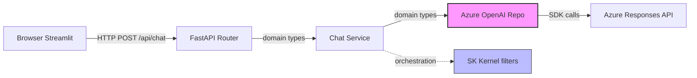
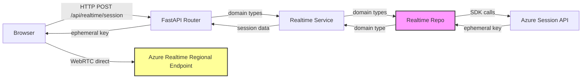
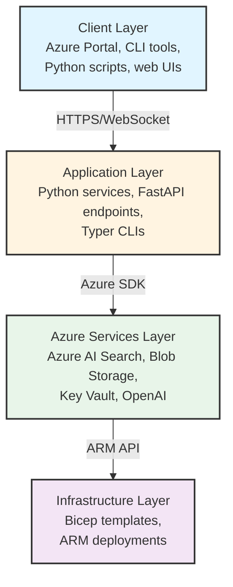
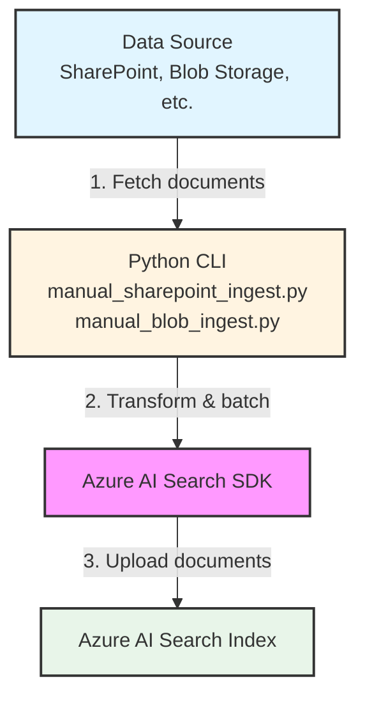
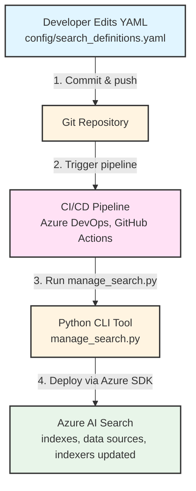
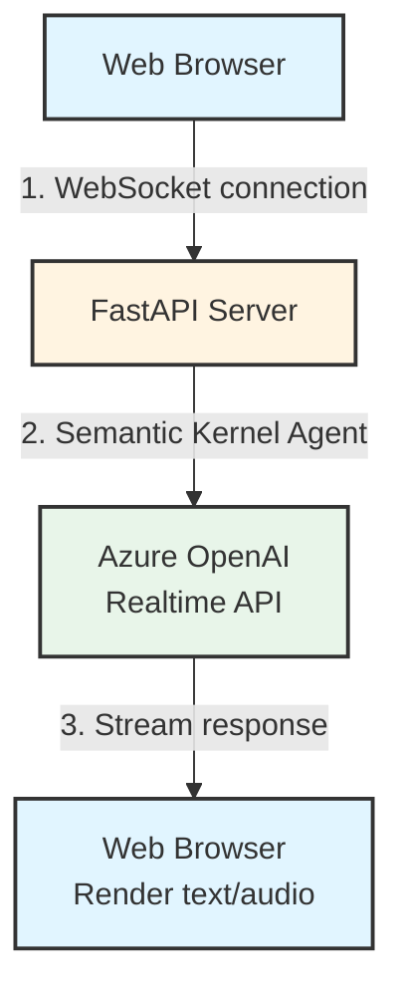
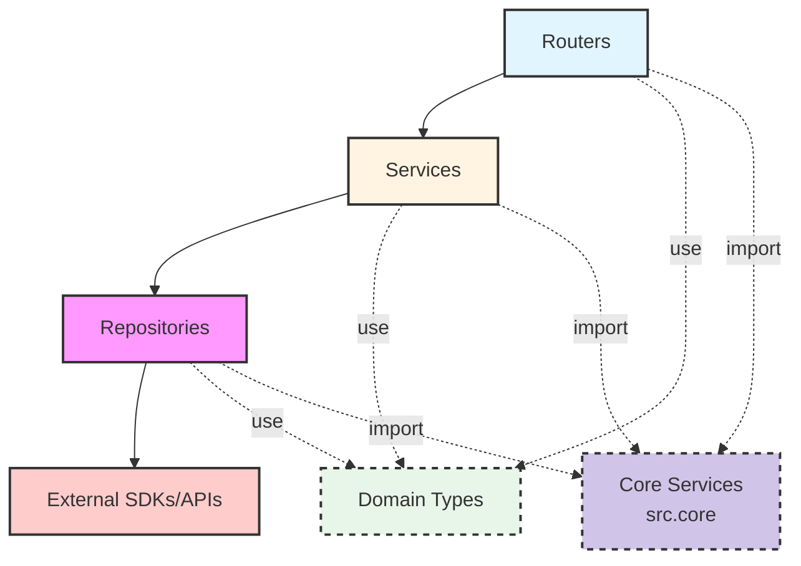

Project Path: rules-idioms-architecture

Source Tree:

```txt
rules-idioms-architecture
├── SHARED_CORE_LIBRARY.md
├── architecture.md
├── configuration.md
├── constitution.md
├── idioms.md
└── rules.md

```

`rules-idioms-architecture/SHARED_CORE_LIBRARY.md`:

```md
# Shared Core Library Pattern

**Status**: ✅ Implemented  
**Created**: 2025-11-07  
**Related**: Phase 4 Task T030, architecture.md § Shared Core Library

## Overview

The `src/core/` directory provides framework-agnostic infrastructure services shared between backend (FastAPI) and UI (Streamlit) applications.

### Design Principles

1. **Framework Agnostic**: No dependencies on FastAPI, Streamlit, or application-specific frameworks
2. **Zero Application Dependencies**: Core MUST NOT import from `src.backend` or `src.ui` (prevents circular dependencies)
3. **Infrastructure Only**: Logging, configuration, validation utilities - NOT business logic
4. **Shared by Design**: Both backend and UI import from `src.core` for consistent behavior

---

## Directory Structure

```
src/
├── core/                          # Shared infrastructure services
│   ├── __init__.py                # Exports: configure_logging, get_logger
│   └── logging_service.py         # Centralized logging configuration
├── backend/
│   └── app/
│       ├── main.py                # Imports: from src.core.logging_service
│       ├── services/              # Imports: from src.core.logging_service
│       ├── repos/                 # Imports: from src.core.logging_service
│       └── sk/                    # Imports: from src.core.logging_service
└── ui/
    └── app.py                     # Imports: from src.core.logging_service
```

---

## Current Core Services

### 1. Logging Service (`src/core/logging_service.py`)

**Purpose**: Centralized logging configuration shared between backend and UI

**Exports**:
- `configure_logging(level: str, format_type: str) -> None`: Configure root logger
- `get_logger(name: str) -> logging.Logger`: Injectable logger factory

**Key Features**:
- **Root logger approach**: Uses `logging.getLogger()` directly (not `basicConfig()`)
- **Race condition safe**: Works regardless of import order
- **Third-party suppression**: Automatically suppresses verbose azure, httpx, openai, streamlit logs
- **Injectable**: `get_logger()` enables dependency injection and testing

**Usage Example**:

```python
# Backend entry point: src/backend/app/main.py
from src.core.logging_service import configure_logging, get_logger

# Configure FIRST (before any other imports)
configure_logging(level="DEBUG", format_type="text")

logger = get_logger(__name__)
logger.info("Backend application starting")
```

```python
# UI entry point: src/ui/app.py
from src.core.logging_service import configure_logging, get_logger

configure_logging(level="INFO", format_type="text")

logger = get_logger(__name__)
logger.info("UI application starting")
```

```python
# Any module (backend or UI)
from src.core.logging_service import get_logger

logger = get_logger(__name__)

def process_data():
    logger.debug("Processing started")
    logger.info("Processed 100 items")
```

---

## Future Core Services

### Planned Services

**Configuration Utilities** (`src/core/config_utils.py` - future):
- Environment variable parsing with validation
- `.env` file loading with precedence rules
- Shared configuration schemas (Azure connection strings, API endpoints)

**Shared Types** (`src/core/types.py` - future):
- Common data structures used across backend and UI
- `@dataclass` for immutability (JSON serialization support)
- Examples: `TimeRange`, `PaginationParams`, `ErrorResponse`

**Validation Utilities** (`src/core/validation.py` - future):
- Reusable validators (email, URL, Azure resource ID format)
- Shared Pydantic models for API contracts
- Custom validation decorators

---

## Adding New Core Services

### When to Add

**Add to core when**:
- Functionality needed by both backend AND UI
- Infrastructure concerns (not business logic)
- Framework-agnostic utilities

**Do NOT add to core when**:
- Business logic (belongs in `services/` layer)
- Application-specific concerns (route handlers, Streamlit widgets)
- Framework-specific code (FastAPI dependencies, Streamlit caching)
- Only used by one application (keep in backend/app or ui/)

### Process

1. **Create module**: `src/core/<service_name>.py`
2. **Write implementation**: Pure Python, no framework imports
3. **Export from `__init__.py`**: Add to `__all__` for convenience
4. **Document in architecture.md**: Add to "Current Core Services" section
5. **Update imports**: Backend and UI import from `src.core`
6. **Add tests**: Validate framework independence (no FastAPI/Streamlit imports)

### Example - Adding Date Utilities

```python
# src/core/date_utils.py
"""Framework-agnostic date/time utilities."""
from datetime import datetime, timezone

def utc_now() -> datetime:
    """Return current UTC timestamp (timezone-aware)."""
    return datetime.now(timezone.utc)

def format_iso(dt: datetime) -> str:
    """Format datetime as ISO 8601 string."""
    return dt.isoformat()
```

```python
# src/core/__init__.py
from .logging_service import configure_logging, get_logger
from .date_utils import utc_now, format_iso

__all__ = [
    "configure_logging",
    "get_logger",
    "utc_now",
    "format_iso",
]
```

```python
# Usage in backend or UI
from src.core import get_logger, utc_now

logger = get_logger(__name__)
logger.info("Request received at %s", utc_now())
```

---

## Testing Core Services

### Framework Independence Tests

Core services MUST have tests that validate framework independence:

```python
# tests/core/test_logging_service.py
def test_get_logger_returns_standard_logger():
    """Logging service returns stdlib logger (no framework coupling)."""
    from src.core.logging_service import get_logger
    import logging
    
    logger = get_logger("test")
    assert isinstance(logger, logging.Logger)
    assert logger.name == "test"

def test_configure_logging_root_logger():
    """configure_logging() configures root logger (not basicConfig)."""
    from src.core.logging_service import configure_logging
    import logging
    
    configure_logging(level="WARNING")
    root = logging.getLogger()
    assert root.level == logging.WARNING
```

### No Application Imports Test

```python
# tests/core/test_imports.py
def test_core_has_no_app_imports():
    """Core services must not import from backend or UI."""
    import ast
    from pathlib import Path
    
    core_dir = Path("src/core")
    for py_file in core_dir.glob("*.py"):
        if py_file.name == "__init__.py":
            continue
        
        source = py_file.read_text()
        tree = ast.parse(source)
        
        for node in ast.walk(tree):
            if isinstance(node, ast.ImportFrom):
                # Fail if importing from src.backend or src.ui
                assert not node.module.startswith("src.backend")
                assert not node.module.startswith("src.ui")
```

---

## Architecture Rules

### Dependency Direction

```mermaid
graph TB
    CoreServices[Core Services<br/>src.core]
    
    Backend[Backend<br/>src.backend.app] -.->|imports| CoreServices
    UI[UI<br/>src.ui] -.->|imports| CoreServices
    
    CoreServices -.->|uses| StdLib[Python stdlib<br/>Third-party utils]
    
    CoreServices -.X->|NEVER imports| Backend
    CoreServices -.X->|NEVER imports| UI
    
    style CoreServices fill:#d1c4e9,stroke:#333,stroke-width:2px
    style Backend fill:#e1f5ff,stroke:#333,stroke-width:2px
    style UI fill:#fff4e1,stroke:#333,stroke-width:2px
    style StdLib fill:#e8f5e9,stroke:#333,stroke-width:2px
```

### Allowed Dependencies

**Core Services MAY import**:
- Python standard library (`logging`, `sys`, `datetime`, `pathlib`, etc.)
- Generic third-party libraries (`pydantic`, `typing_extensions`, `tenacity`)

**Backend/UI MAY import**:
- Core services (`from src.core import ...`)
- Standard library
- Framework-specific libraries (FastAPI, Streamlit)

**Core Services MUST NOT import**:
- `src.backend` (any module)
- `src.ui` (any module)
- FastAPI (`from fastapi import ...`)
- Streamlit (`import streamlit as st`)
- Application-specific code

### Enforcement

**Code Review Checklist**:
- [ ] No `from src.backend` or `from src.ui` in `src/core/`
- [ ] No `from fastapi` or `import streamlit` in `src/core/`
- [ ] Core service has tests validating framework independence
- [ ] Core service documented in architecture.md
- [ ] Both backend and UI can import service without errors

**Automated Checks (Future)**:
- `import-linter` tool to enforce dependency rules
- Pre-commit hooks to block forbidden imports
- CI/CD checks for circular dependencies

---

## Benefits

### For Developers

- **Single source of truth**: Logging configuration identical in backend and UI
- **No duplication**: Write infrastructure code once, use everywhere
- **Easy testing**: Mock core services instead of entire frameworks
- **Clear boundaries**: Framework-agnostic code separated from application code

### For Codebase

- **Consistency**: Same logging format, same validation rules across applications
- **Maintainability**: Update logging once, affects both backend and UI
- **Flexibility**: Add new applications (CLI tools, notebooks) that use same core services
- **Testability**: Core services isolated, easy to unit test without framework overhead

---

## Migration Path

### Existing Code with Local Logging

**Before** (logging in each application):
```python
# src/backend/app/main.py
import logging
logging.basicConfig(level=logging.DEBUG)
logger = logging.getLogger(__name__)
```

**After** (shared core service):
```python
# src/backend/app/main.py
from src.core.logging_service import configure_logging, get_logger

configure_logging(level="DEBUG", format_type="text")
logger = get_logger(__name__)
```

**Steps**:
1. Keep existing logging code working (don't break anything)
2. Add `src/core/logging_service.py`
3. Update backend `main.py` to use core service
4. Update UI `app.py` to use core service
5. Update all modules to use `from src.core.logging_service import get_logger`
6. Remove old logging configuration code

---

## Related Documentation

- **Architecture**: [architecture.md § Shared Core Library](./architecture.md#shared-core-library)
- **Rules**: [rules.md § Shared Core Library](./rules.md#shared-core-library)
- **Phase 4 Tasks**: [tasks/phase-4/tasks.md](../plans/001-realtime-chatbot/tasks/phase-4/tasks.md)

---

**End of Shared Core Library Documentation**

*This pattern enables consistent infrastructure across backend and UI while maintaining clean architectural boundaries.*

```

`rules-idioms-architecture/architecture.md`:

```md
# System Architecture

**Aligned with:** [Constitution v1.0.0](../rules/constitution.md)  
**Last Updated:** 2025-11-07

This document describes the high-level structure of systems in the Woodside Research project, including component boundaries, interaction contracts, and technology-agnostic architectural principles.

---

## Project-Specific Architectures

### Realtime Chatbot (001-realtime-chatbot)

This section documents the architecture for the Semantic Kernel Realtime Chatbot POC, demonstrating multimodal AI interaction patterns.

#### Directory Structure

```
/workspaces/woodside-research/
├── src/
│   ├── core/                         # Shared services and utilities (NEW)
│   │   ├── __init__.py
│   │   └── logging_service.py        # Centralized logging configuration
│   ├── backend/                      # FastAPI application
│   │   ├── app/
│   │   │   ├── __init__.py
│   │   │   ├── main.py               # FastAPI app + CORS setup
│   │   │   ├── config.py             # Pydantic Settings
│   │   │   ├── routers/
│   │   │   │   ├── __init__.py
│   │   │   │   ├── chat.py           # POST /api/chat endpoint
│   │   │   │   └── realtime.py       # POST /api/realtime/session endpoint
│   │   │   ├── services/
│   │   │   │   ├── __init__.py
│   │   │   │   ├── chat_service.py   # Text chat business logic
│   │   │   │   └── realtime_service.py # Ephemeral key minting
│   │   │   ├── repos/
│   │   │   │   ├── __init__.py
│   │   │   │   ├── types.py          # Domain types (@dataclass)
│   │   │   │   ├── llm_repo.py       # LLMRepository protocol
│   │   │   │   ├── azure_openai_repo.py # Responses API implementation
│   │   │   │   └── realtime_repo.py  # Session API implementation
│   │   │   └── sk/
│   │   │       ├── __init__.py
│   │   │       ├── kernel.py         # SK Kernel singleton
│   │   │       └── filters.py        # SK filter registration
│   └── ui/                           # Streamlit application
│       ├── app.py                    # Main Streamlit app
│       └── components/
│           └── webrtc_client.html    # WebRTC JS component
├── Justfile                          # Command automation
├── pyproject.toml                    # Dependencies and project metadata (UV)
├── uv.lock                           # Locked dependencies (gitignored for apps)
├── .env                              # Local configuration (not committed)
└── .env.example                      # Template for required env vars
```

#### Layer Responsibilities

**Core Services Layer** (`src/core/`) - **NEW**:
- Shared utilities and infrastructure services
- Used by both backend and UI applications
- No business logic (infrastructure only)
- Examples: logging service, configuration utilities, shared types
- MUST have zero dependencies on application layers
- MUST be framework-agnostic (usable by FastAPI, Streamlit, CLI scripts)

**Router Layer** (`routers/`):
- API endpoint definitions (FastAPI routes)
- Request/response validation (Pydantic models)
- HTTP-level error handling
- MUST NOT contain business logic
- MUST NOT import SDK types

**Service Layer** (`services/`):
- Business logic orchestration
- Session/state management
- Cross-repository coordination
- MAY use Semantic Kernel for AI orchestration
- MUST use domain types from `repos/types.py`

**Repository Layer** (`repos/`):
- SDK isolation boundary
- Azure/OpenAI API clients
- Domain type ↔ SDK type translation
- Retry logic with exponential backoff
- MUST NOT leak SDK types above this layer

**Domain Types** (`repos/types.py`):
- Cross-layer data contracts
- `@dataclass` for immutability and clarity
- No external dependencies (pure Python)
- Example: `ChatMessage`, `EphemeralSession`

#### Communication Flows

**Text Chat Mode**:


**Voice Mode**:


#### Key Design Patterns

1. **Repository Pattern**: SDK isolation prevents tight coupling to external libraries (cloud providers, third-party APIs)
2. **Protocol Interfaces**: Python `Protocol` defines repository contracts without inheritance
3. **Ephemeral Sessions**: Fresh key minted per voice interaction (~1min TTL for security)
4. **Separate Mode Sessions**: Text and voice maintain independent state (no cross-mode persistence)
5. **SK Filter Hooks**: Placeholder infrastructure for future conversation interception (Azure AI Search, Magentic orchestration)

#### Boundary Enforcement Summary

**What Lives Where:**

| Layer | Allowed Imports | Responsibilities | Output Types |
|-------|----------------|------------------|--------------|
| **Core Services** | Standard library, third-party utils only | Infrastructure services, shared utilities | Framework-agnostic types |
| **Routers** | Services, Domain Types, Core Services, Pydantic | HTTP/API concerns, validation | Pydantic models, dicts |
| **Services** | Repository Protocols, Domain Types, Core Services, SK | Business logic, orchestration | Domain types, primitives |
| **Repositories** | Domain Types, Core Services, SDKs | SDK interaction, translation | Domain types only |
| **Domain Types** | Standard library only | Data structures | N/A (data definitions) |

**Critical Rules:**
- ✅ Core services are shared between backend and UI (import from `src.core`)
- ✅ Only repositories import SDKs (e.g., `from openai import`, `from azure.search import`)
- ✅ Exception: Services may import Semantic Kernel (`from semantic_kernel import`)
- ✅ Core services MUST be framework-agnostic (no FastAPI/Streamlit dependencies)
- ❌ Services MUST NOT import SDKs directly
- ❌ Routers MUST NOT import repositories or SDKs
- ❌ Core services MUST NOT import from backend or UI layers (creates circular dependencies)
- ❌ SDK types (e.g., `ChatCompletion`, `SearchResults`) MUST NOT appear in service/router signatures
- ✅ All cross-layer data uses domain types from `repos/types.py`

---

## Architectural Principles

### 1. Infrastructure and Application Separation

**Principle:** Infrastructure provisioning and application logic maintain distinct boundaries with independent lifecycles.

**Rationale:** Infrastructure changes (scaling, networking, resource creation) have different risk profiles and approval workflows than application logic changes. Separating these concerns enables independent evolution, clearer ownership, and safer deployments.

**Implementation:**

- Infrastructure definitions live in `infra/` (Bicep templates)
- Application code lives in `src/` or service-specific directories
- Infrastructure deploys first, outputs feed into application configuration
- Application deployment is independent of infrastructure deployment (except for breaking changes)

### 2. Managed Identities Over Secrets

**Principle:** Azure resources authenticate using managed identities and RBAC instead of connection strings or API keys.

**Rationale:** Managed identities eliminate credential sprawl, reduce attack surface, and simplify secret rotation. RBAC provides fine-grained access control auditable through Azure logs.

**Implementation:**

- Azure AI Search uses system-assigned managed identity
- Storage access granted via `Storage Blob Data Reader` role assignment
- Application code uses `DefaultAzureCredential` (works locally via `az login`, works in Azure via managed identity)
- Admin keys retrieved at runtime only when managed identity is insufficient

### 3. Configuration as Code

**Principle:** All data plane resources (indexes, data sources, indexers, skillsets) are defined in version-controlled YAML files and deployed via automation.

**Rationale:** Configuration drift causes production incidents. Declarative configuration enables review, rollback, and reproducibility. GitOps workflows ensure all changes are auditable.

**Implementation:**

- Data plane definitions in `config/search_definitions.yaml` or equivalent
- Python scripts apply configuration via Azure SDK
- CI/CD pipelines sync configuration on every merge to main
- Manual changes via Azure Portal are discouraged (not reflected in source control)

### 4. Environment Parity

**Principle:** Development, staging, and production environments use identical code and configuration structure, differing only in scale and parameter values.

**Rationale:** "Works on my machine" bugs are preventable. Environment parity reduces deployment risk and makes testing more representative of production behavior.

**Implementation:**

- Dev container ensures local environment matches CI/CD environment
- Bicep parameter files per environment (dev.bicepparam, prod.bicepparam) with same structure
- Environment-specific values (SKU, replica count, location) parameterized
- Application code reads environment variables; logic identical across environments

---

## System Components

### Component Overview

The Woodside Research project follows a layered architecture:



### Infrastructure Layer

**Responsibility:** Provision and configure Azure resources.

**Technologies:** Bicep, Azure Resource Manager (ARM)

**Key Components:**

- `infra/main.bicep` – Entry point for subscription-level deployment
- `infra/modules/` – Reusable Bicep modules (search service, storage access, RBAC assignments)
- `infra/config/<env>.bicepparam` – Environment-specific parameters

**Deployment:** Via Azure CLI (`az deployment sub create`) or Azure DevOps pipeline

**Boundaries:**

- MUST NOT contain application logic
- MUST output resource identifiers (IDs, endpoints) for application layer consumption
- MAY assign RBAC roles and configure network rules
- Lifecycle: Changes monthly or less frequently; requires approval

### Azure Services Layer

**Responsibility:** Managed Azure PaaS services that provide search, storage, and AI capabilities.

**Key Services:**

- **Azure AI Search:** Full-text search, vector search, skillsets for enrichment
- **Azure Blob Storage:** Document storage for indexing
- **Azure Key Vault:** Secret storage (optional, for admin keys or third-party credentials)
- **Azure OpenAI:** Realtime API for conversational AI (used in specific features)

**Access Patterns:**

- Application layer calls services via Azure SDK (Python)
- Authentication via `DefaultAzureCredential` (managed identity in Azure, `az login` locally)
- Data plane operations (create index, upload documents) use service-specific APIs

**Boundaries:**

- Services do not directly communicate with each other (application orchestrates)
- RBAC controls access (no shared admin keys across services)
- Secrets retrieved at runtime, never hardcoded

### Application Layer

**Responsibility:** Implement business logic, orchestrate Azure services, expose APIs or CLIs.

**Technologies:** Python 3.11+, FastAPI, Typer, Azure SDK

**Key Components:**

- **CLI Tools** (Typer):
  - `scripts/manage_search.py` – Deploy and manage Azure AI Search data plane
  - `scripts/manual_blob_ingest.py` – Ad-hoc document ingestion from Blob Storage
  - `scripts/manual_sharepoint_ingest.py` – Ad-hoc document ingestion from SharePoint
- **Web Services** (FastAPI):
  - Realtime chatbot backend (WebSocket endpoints for text/voice)
  - API endpoints for search query proxying (future)
- **Shared Libraries:**
  - Configuration loaders (YAML, environment variables)
  - Azure SDK wrappers (consistent error handling, retry logic)

**Deployment:** Via `pip install` + systemd/Docker, or Azure App Service

**Boundaries:**

- MUST NOT manage infrastructure (no ARM API calls to create resources)
- MAY retrieve runtime secrets (admin keys, Key Vault secrets)
- MUST validate inputs and fail fast with clear error messages
- Lifecycle: Changes weekly or daily; deployed independently of infrastructure

### Client Layer

**Responsibility:** User interfaces for humans or automated systems.

**Key Components:**

- **Azure Portal:** Manual resource inspection, monitoring
- **CLI Scripts:** Developers and CI/CD pipelines invoke Typer-based tools
- **Web UIs:** Browser-based interfaces (HTML/JavaScript, Streamlit, or similar)
- **Jupyter Notebooks:** Exploratory data analysis, debugging (for research)

**Boundaries:**

- Clients do not directly call Azure service APIs (application layer proxies when needed)
- Authentication propagates from client → application → Azure (no credential sharing)
- Clients are stateless or use session tokens (no secrets in client code)

---

## Data Flow Patterns

### Document Ingestion Flow



**Steps:**

1. **Fetch:** Python script authenticates to data source (SharePoint Graph API, Blob Storage SDK) and retrieves documents
2. **Transform:** Documents mapped to index schema (field extraction, chunking, metadata enrichment)
3. **Batch:** Documents grouped into batches (default 100 per batch) for efficiency
4. **Upload:** Batches sent to Azure AI Search via `SearchClient.upload_documents()`
5. **Retry:** Transient failures retried with exponential backoff (via `tenacity`)

**Error Handling:**

- Fetch failures: Abort with clear message (auth error, network issue)
- Transform failures: Log document ID and skip (continue processing remaining documents)
- Upload failures: Retry 3 times; log failed document IDs

### Configuration Deployment Flow



**Steps:**

1. Developer edits `config/search_definitions.yaml` and commits to Git
2. CI/CD pipeline triggers on merge to main branch
3. Pipeline runs `manage_search.py deploy --config config/search_definitions.yaml`
4. Script authenticates via `DefaultAzureCredential` (service principal in CI)
5. Script fetches current state from Azure AI Search
6. Script computes diff (new, updated, deleted resources)
7. Script applies changes (create new indexes, update existing, skip unchanged)
8. Script logs summary (created: 2, updated: 1, skipped: 3)

**Rollback:** Revert Git commit and re-run pipeline

### Realtime Chatbot Flow (Example Feature)



**Steps:**

1. User clicks "Chat" or "Voice" button in browser
2. JavaScript opens WebSocket connection to FastAPI `/ws/chat` endpoint
3. FastAPI creates Semantic Kernel agent with Azure OpenAI realtime client
4. User message (text or audio) sent over WebSocket
5. Agent processes message, calls Azure OpenAI realtime API
6. Agent streams response back to browser over WebSocket
7. Browser renders text or plays audio response

**Session Management:**

- Each button click creates a new ephemeral session
- Session destroyed when user clicks "Stop" or closes browser
- No session persistence or history (POC scope)

---

## Cross-Cutting Concerns

### Logging Strategy

**Objective**: Consistent, structured logging across all components with centralized configuration shared between backend and UI.

#### Logging Architecture

**Centralized Logging Service Pattern** (`src/core/logging_service.py`):
- Shared logging infrastructure for backend (FastAPI) and UI (Streamlit)
- Root logger configuration (avoids `logging.basicConfig()` race conditions)
- Injectable logger factory via `get_logger(name)` function
- Single source of truth for log format, levels, and third-party suppression

**Logger Hierarchy**:
```
root (DEBUG in dev, INFO in prod)
├── src.backend.app (inherits from root)
│   ├── src.backend.app.routers
│   ├── src.backend.app.services
│   ├── src.backend.app.repos
│   └── src.backend.app.sk
├── src.ui (inherits from root)
│   └── src.ui.components
├── uvicorn (INFO)
├── azure (WARNING - suppressed)
├── httpx (WARNING - suppressed)
└── openai (WARNING - suppressed)
```

#### Implementation Pattern

**Core Logging Service** (`src/core/logging_service.py`):
```python
"""
Centralized logging configuration for all applications.

Shared between backend (FastAPI) and UI (Streamlit) to ensure
consistent log format, levels, and third-party suppression.
"""
import logging
import sys
from typing import Optional

def configure_logging(level: str = "DEBUG", format_type: str = "text") -> None:
    """
    Configure root logger for entire application.
    
    Uses root logger directly (not basicConfig) to avoid race conditions
    when imported modules have already configured logging.
    
    Args:
        level: Root logging level (DEBUG, INFO, WARNING, ERROR)
        format_type: "text" for human-readable, "json" for structured
    """
    root_logger = logging.getLogger()
    root_logger.setLevel(getattr(logging, level.upper()))
    
    # Clear existing handlers to ensure clean configuration
    root_logger.handlers.clear()
    
    # Add stdout handler with formatter
    handler = logging.StreamHandler(sys.stdout)
    if format_type == "json":
        handler.setFormatter(JSONFormatter())  # Structured logging for prod
    else:
        formatter = logging.Formatter(
            '%(asctime)s - %(name)s - %(levelname)s - %(message)s',
            datefmt='%Y-%m-%d %H:%M:%S'
        )
        handler.setFormatter(formatter)
    
    root_logger.addHandler(handler)
    
    # Suppress verbose third-party logs
    logging.getLogger("azure").setLevel(logging.WARNING)
    logging.getLogger("httpx").setLevel(logging.WARNING)
    logging.getLogger("openai").setLevel(logging.WARNING)
    logging.getLogger("uvicorn.access").setLevel(logging.WARNING)
    logging.getLogger("streamlit").setLevel(logging.INFO)

def get_logger(name: str) -> logging.Logger:
    """
    Injectable logger factory for dependency injection.
    
    Returns standard logging.Logger configured by configure_logging().
    Use this instead of logging.getLogger(__name__) directly to enable
    testing with mock loggers.
    
    Args:
        name: Logger name (typically __name__)
    
    Returns:
        Configured logger instance
    
    Example:
        >>> from src.core.logging_service import get_logger
        >>> logger = get_logger(__name__)
        >>> logger.info("Service started")
    """
    return logging.getLogger(name)

class JSONFormatter(logging.Formatter):
    """Format log records as JSON for structured logging (production)."""
    import json
    from datetime import datetime
    
    def format(self, record: logging.LogRecord) -> str:
        log_data = {
            "timestamp": datetime.utcnow().isoformat(),
            "level": record.levelname,
            "logger": record.name,
            "message": record.getMessage(),
            "module": record.module,
            "function": record.funcName,
            "line": record.lineno,
        }
        
        if record.exc_info:
            log_data["exception"] = self.formatException(record.exc_info)
        
        if hasattr(record, "extra"):
            log_data.update(record.extra)
        
        return json.dumps(log_data)
```

**Backend Entry Point** (`src/backend/app/main.py`):
```python
from src.core.logging_service import configure_logging, get_logger
from .config import settings

# Configure logging FIRST (before any other imports that might log)
configure_logging(level=settings.LOG_LEVEL, format_type=settings.LOG_FORMAT)

logger = get_logger(__name__)

# Now safe to create app and import other modules
app = FastAPI()
logger.info("FastAPI application initialized")
```

**UI Entry Point** (`src/ui/app.py`):
```python
from src.core.logging_service import configure_logging, get_logger

# Configure logging FIRST
configure_logging(level="DEBUG")  # Or read from environment variable

logger = get_logger(__name__)
logger.info("Streamlit application started")
```

**Module-Level Logger Pattern** (all modules):
```python
# At top of each module file
from src.core.logging_service import get_logger

logger = get_logger(__name__)

# Usage in code
logger.debug("Processing request with %d messages", len(messages))
logger.info("Session created: %s", session_id)
logger.warning("Rate limit approaching: %d/%d", current, limit)
logger.error("Failed to mint ephemeral key", exc_info=True)
```

**Configuration Settings** (`src/backend/app/config.py`):
```python
class Settings(BaseSettings):
    LOG_LEVEL: str = "INFO"  # DEBUG for dev, INFO for prod
    LOG_FORMAT: str = "json"  # "text" or "json" for structured logging
```

#### Structured Logging (Production)

For production deployments requiring structured logs (Azure Monitor, ELK stack), the `JSONFormatter` is already included in the core logging service. Simply set `format_type="json"`:

```python
from src.core.logging_service import configure_logging

# Production configuration
configure_logging(level="INFO", format_type="json")
```

**Contextual Logging Example**:
```python
from src.core.logging_service import get_logger

logger = get_logger(__name__)

# Add request context to logs
logger.info("Chat request processed", extra={
    "user_id": user_id,
    "session_id": session_id,
    "message_count": len(messages),
    "response_time_ms": elapsed_ms
})
```

#### Logging Guidelines

**MUST**:
- Use `get_logger(__name__)` from `src.core.logging_service` (not `logging.getLogger` directly)
- Call `configure_logging()` in application entry point BEFORE any other imports
- Log at appropriate levels:
  - DEBUG: Detailed diagnostic information (function entry/exit, variable values)
  - INFO: General informational messages (session created, request completed)
  - WARNING: Recoverable issues (rate limit approaching, retry triggered)
  - ERROR: Unrecoverable errors (API failure, invalid configuration)
- Include exception info for errors: `logger.error("...", exc_info=True)`
- Sanitize sensitive data (API keys, user PII) before logging

**SHOULD**:
- Use lazy formatting: `logger.debug("Value: %s", value)` not `f"Value: {value}"`
- Log structured data with `extra` parameter for production
- Configure separate log levels for development vs production
- Use correlation IDs for request tracing in distributed systems

**MUST NOT**:
- Log secrets, API keys, passwords, or tokens
- Use `print()` statements in application code (use logger instead)
- Log excessive data in tight loops (impacts performance)
- Log at DEBUG level in production (use INFO or higher)

---

## Shared Core Library

**Objective**: Provide reusable, framework-agnostic infrastructure services shared between backend and UI applications.

### Design Principles

**Framework Agnostic**:
- Core services MUST NOT depend on FastAPI, Streamlit, or application-specific frameworks
- Core services MAY depend on third-party utilities (e.g., `pydantic` for validation)
- Core services MUST be usable by CLI scripts, notebooks, and any Python application

**Zero Application Dependencies**:
- Core services MUST NOT import from `src.backend` or `src.ui` (prevents circular dependencies)
- Application layers import from core, never the reverse
- Enforced via import linting rules (future: import-linter tool)

**Infrastructure Only**:
- Core services provide infrastructure concerns (logging, config, shared types)
- Core services MUST NOT contain business logic
- Examples: logging service, configuration loaders, date/time utilities, validation schemas

### Current Core Services

**Logging Service** (`src/core/logging_service.py`):
- Centralized logging configuration shared between backend and UI
- Root logger control (avoids `basicConfig()` race conditions)
- Injectable logger factory (`get_logger(name)`)
- Structured logging support (JSON formatter for production)

**Usage**:
```python
from src.core.logging_service import configure_logging, get_logger

# In main.py or app.py (entry point)
configure_logging(level="DEBUG", format_type="text")

# In any module
logger = get_logger(__name__)
logger.info("Service started")
```

### Future Core Services

**Configuration Utilities** (`src/core/config_utils.py` - future):
- Environment variable parsing with validation
- `.env` file loading with precedence rules
- Shared configuration schemas (Azure connection strings, API endpoints)

**Shared Types** (`src/core/types.py` - future):
- Common data structures used across backend and UI
- `@dataclass` for immutability (JSON serialization support)
- Examples: `TimeRange`, `PaginationParams`, `ErrorResponse`

**Validation Utilities** (`src/core/validation.py` - future):
- Reusable validators (email, URL, Azure resource ID format)
- Shared Pydantic models for API contracts
- Custom validation decorators

### Adding New Core Services

**When to Add**:
- Functionality needed by both backend and UI
- Infrastructure concerns (not business logic)
- Framework-agnostic utilities

**When NOT to Add**:
- Business logic (belongs in services layer)
- Application-specific concerns (route handlers, Streamlit widgets)
- Framework-specific code (FastAPI dependencies, Streamlit caching)

**Process**:
1. Create new module in `src/core/<service_name>.py`
2. Document in this architecture file (add to "Current Core Services")
3. Export from `src/core/__init__.py` for convenience
4. Update imports in backend/UI to use new service
5. Add tests to validate framework independence

**Example - Adding Date Utilities**:
```python
# src/core/date_utils.py
"""Framework-agnostic date/time utilities."""
from datetime import datetime, timezone
from typing import Optional

def utc_now() -> datetime:
    """Return current UTC timestamp (timezone-aware)."""
    return datetime.now(timezone.utc)

def format_iso(dt: datetime) -> str:
    """Format datetime as ISO 8601 string."""
    return dt.isoformat()

def parse_iso(s: str) -> datetime:
    """Parse ISO 8601 string to datetime."""
    return datetime.fromisoformat(s)
```

```python
# src/core/__init__.py
"""Shared infrastructure services."""
from .logging_service import configure_logging, get_logger
from .date_utils import utc_now, format_iso, parse_iso

__all__ = [
    "configure_logging",
    "get_logger",
    "utc_now",
    "format_iso",
    "parse_iso",
]
```

```python
# Usage in backend or UI
from src.core import get_logger, utc_now

logger = get_logger(__name__)
logger.info("Request received at %s", utc_now())
```

### Core Library Testing

**Framework Independence Tests**:
```python
# tests/core/test_logging_service.py
def test_get_logger_returns_standard_logger():
    """Logging service returns stdlib logger (no framework coupling)."""
    from src.core.logging_service import get_logger
    import logging
    
    logger = get_logger("test")
    assert isinstance(logger, logging.Logger)
    assert logger.name == "test"

def test_configure_logging_root_logger():
    """configure_logging() configures root logger (not basicConfig)."""
    from src.core.logging_service import configure_logging
    import logging
    
    configure_logging(level="WARNING")
    root = logging.getLogger()
    assert root.level == logging.WARNING
```

**No Application Imports**:
```python
# tests/core/test_imports.py
def test_core_has_no_app_imports():
    """Core services must not import from backend or UI."""
    import ast
    from pathlib import Path
    
    core_dir = Path("src/core")
    for py_file in core_dir.glob("*.py"):
        if py_file.name == "__init__.py":
            continue
        
        source = py_file.read_text()
        tree = ast.parse(source)
        
        for node in ast.walk(tree):
            if isinstance(node, ast.ImportFrom):
                # Fail if importing from src.backend or src.ui
                assert not node.module.startswith("src.backend")
                assert not node.module.startswith("src.ui")
```

---

### Dependency Injection Strategy (Updated)

**Objective**: Explicit, testable dependencies with centralized configuration and minimal magic.

#### Design Philosophy

**Python Pragmatic Approach**:
- Favor explicit constructor injection over implicit containers
- Use dependency inversion (protocols) for testability
- Apply containers sparingly for complex applications
- POCs use singleton pattern; production uses dependency injection containers

#### Pattern Selection by Context

**POC/Demo Projects** (like realtime chatbot):
- **Pattern**: Module-level singletons with factory functions
- **Rationale**: Simplicity, no container overhead, sufficient for local development
- **Example**: `get_kernel()` singleton in `sk/kernel.py`

**Production Services**:
- **Pattern**: Dependency injection container (e.g., `dependency-injector`, `punq`)
- **Rationale**: Testability, lifecycle management, configuration flexibility
- **Example**: See "Production DI Pattern" below

#### POC Singleton Pattern

**Kernel/Client Singletons** (`app/sk/kernel.py`):
```python
from semantic_kernel import Kernel
from .filters import register_filters

_kernel: Kernel | None = None

def get_kernel() -> Kernel:
    """
    Return singleton Semantic Kernel instance with registered filters.
    
    Singleton pattern for POC simplicity. For production, use DI container.
    """
    global _kernel
    if _kernel is None:
        _kernel = Kernel()
        register_filters(_kernel)
    return _kernel
```

**Service-Level Injection** (`app/services/chat_service.py`):
```python
from ..repos.llm_repo import LLMRepository
from ..repos.azure_openai_repo import AzureOpenAIResponsesRepo

class ChatService:
    def __init__(self, repo: LLMRepository | None = None):
        """
        Initialize chat service with optional repository injection.
        
        Args:
            repo: LLM repository implementation. Defaults to Azure OpenAI.
        """
        self.repo = repo or AzureOpenAIResponsesRepo()  # Default for POC
        self.history: list[ChatMessage] = []
```

**Router Usage**:
```python
from ..services.chat_service import ChatService

router = APIRouter()

# Module-level singleton for POC (in-memory state)
_service = ChatService()

@router.post("")
async def chat(req: ChatRequest):
    return await _service.chat(req.messages)
```

**Benefits**:
- No external dependencies (no DI library)
- Explicit, readable initialization
- Easy to mock for tests: `ChatService(repo=MockRepo())`
- Sufficient for single-user local development

**Limitations**:
- Singletons make parallel testing difficult
- No lifecycle management (startup/shutdown hooks)
- Tight coupling to default implementations

#### Production DI Container Pattern

For production services requiring testability, use a lightweight DI container.

**Container Choice**: `dependency-injector` (Pythonic, FastAPI integration)

**Installation**:
```bash
pip install dependency-injector
```

**Container Definition** (`app/container.py`):
```python
from dependency_injector import containers, providers
from .config import Settings
from .repos.azure_openai_repo import AzureOpenAIResponsesRepo
from .repos.realtime_repo import AzureRealtimeRepo
from .services.chat_service import ChatService
from .services.realtime_service import RealtimeService
from .sk.kernel import get_kernel

class Container(containers.DeclarativeContainer):
    """Application dependency injection container."""
    
    # Configuration
    config = providers.Singleton(Settings)
    
    # Repositories (singleton instances)
    llm_repo = providers.Singleton(AzureOpenAIResponsesRepo)
    realtime_repo = providers.Singleton(AzureRealtimeRepo)
    
    # Semantic Kernel (singleton)
    kernel = providers.Singleton(get_kernel)
    
    # Services (factory pattern - new instance per call)
    chat_service = providers.Factory(
        ChatService,
        repo=llm_repo,
    )
    realtime_service = providers.Factory(
        RealtimeService,
        repo=realtime_repo,
    )
```

**FastAPI Integration** (`app/main.py`):
```python
from fastapi import FastAPI, Depends
from .container import Container

def create_app() -> FastAPI:
    app = FastAPI()
    
    # Initialize container
    container = Container()
    app.container = container  # Attach to app for access in routes
    
    return app

app = create_app()
```

**Router with DI** (`app/routers/chat.py`):
```python
from fastapi import APIRouter, Depends
from dependency_injector.wiring import inject, Provide
from ..services.chat_service import ChatService
from ..container import Container

router = APIRouter()

@router.post("")
@inject
async def chat(
    req: ChatRequest,
    service: ChatService = Depends(Provide[Container.chat_service])
):
    """Chat endpoint with injected service."""
    return await service.chat(req.messages)
```

**Wiring Configuration** (`app/main.py`):
```python
from .routers import chat, realtime

app = create_app()
app.container.wire(modules=[chat, realtime])  # Enable DI in routers
```

**Testing with DI**:
```python
import pytest
from unittest.mock import AsyncMock
from app.container import Container
from app.services.chat_service import ChatService

@pytest.fixture
def container():
    container = Container()
    container.llm_repo.override(AsyncMock())  # Replace with mock
    yield container
    container.reset_override()

def test_chat_service(container):
    service = container.chat_service()
    # Test with mocked repository
```

#### Dependency Injection Guidelines

**MUST**:
- Use constructor injection (dependencies passed to `__init__`)
- Define protocol interfaces for dependency contracts
- Provide default implementations in constructor for POC convenience
- Document lifetime (singleton, transient, scoped) in container

**SHOULD**:
- Use DI container for production applications (testability, lifecycle)
- Use singleton pattern for POCs (simplicity, no external deps)
- Inject logger instances for context-aware logging (production)
- Avoid service locator pattern (implicit dependencies)

**MUST NOT**:
- Use global mutable state without singleton factory pattern
- Hard-code dependencies without injection point
- Mix DI patterns (pick one: singleton vs container)
- Over-engineer POCs with heavy DI frameworks

#### Logger Injection Pattern (Production)

For production applications, loggers come from the centralized core service:

```python
from logging import Logger
from dependency_injector import containers, providers
from src.core.logging_service import get_logger

class Container(containers.DeclarativeContainer):
    # Logger factory with module name
    logger_factory = providers.Factory(
        get_logger,
        name=providers.Arg("name")
    )

# Usage in services
class ChatService:
    def __init__(self, repo: LLMRepository, logger: Logger):
        self.repo = repo
        self.logger = logger
    
    async def chat(self, messages: list[ChatMessage]) -> str:
        self.logger.info("Processing chat request", extra={"msg_count": len(messages)})
        # ...
```

**POC Alternative** (module-level logger from core):
```python
from src.core.logging_service import get_logger

logger = get_logger(__name__)

class ChatService:
    async def chat(self, messages: list[ChatMessage]) -> str:
        logger.info("Processing chat request with %d messages", len(messages))
        # No injection needed - uses centralized core service
```

---

## Component Interaction Contracts

### Application → Azure AI Search

**Protocol:** HTTPS (REST API via Azure SDK)

**Authentication:** `DefaultAzureCredential` or `AzureKeyCredential`

**Operations:**

- **Create Index:** POST `/indexes/<name>` with schema JSON
- **Upload Documents:** POST `/indexes/<name>/docs/index` with batch JSON
- **Search:** GET `/indexes/<name>/docs?search=<query>`
- **List Indexers:** GET `/indexers`

**Contract:**

- Application MUST handle `ResourceNotFoundError` (404) when index doesn't exist
- Application MUST batch uploads (default 100 documents per request)
- Application SHOULD retry on `ServiceUnavailableError` (503) with exponential backoff
- Application MUST NOT exceed rate limits (10 requests/sec for basic SKU)

**Example (Python):**

```python
from azure.search.documents import SearchClient
from azure.core.exceptions import ResourceNotFoundError

try:
    client.create_index(index_schema)
except ResourceAlreadyExistsError:
    print("Index already exists, skipping creation")
```

### Application → Azure Blob Storage

**Protocol:** HTTPS (REST API via Azure SDK)

**Authentication:** `DefaultAzureCredential`

**Operations:**

- **List Blobs:** GET `/containers/<name>/blobs`
- **Download Blob:** GET `/containers/<name>/blobs/<blob_name>`
- **Upload Blob:** PUT `/containers/<name>/blobs/<blob_name>`

**Contract:**

- Application MUST have `Storage Blob Data Reader` role for read operations
- Application MUST handle `BlobNotFoundError` when blob doesn't exist
- Application SHOULD use streaming download for large blobs (>10 MB)
- Application MUST set `content_type` when uploading blobs

### CI/CD Pipeline → Azure Resource Manager

**Protocol:** HTTPS (ARM REST API via Azure CLI)

**Authentication:** Service Principal (Azure DevOps service connection)

**Operations:**

- **What-If:** POST `/subscriptions/<sub>/providers/Microsoft.Resources/deployments/<name>/whatIf`
- **Deploy:** PUT `/subscriptions/<sub>/providers/Microsoft.Resources/deployments/<name>`

**Contract:**

- Pipeline MUST run `what-if` before deploying (catch breaking changes)
- Pipeline MUST have `Contributor` role on subscription (or resource group)
- Pipeline MUST have `User Access Administrator` role to assign RBAC (if deploying role assignments)
- Pipeline SHOULD fail if deployment duration exceeds 30 minutes (timeout)

---

## Technology-Specific Implementation Notes

### Python Stack

**Core Libraries:**

- `azure-identity`: Authentication (`DefaultAzureCredential`)
- `azure-search-documents`: Azure AI Search SDK
- `azure-storage-blob`: Blob Storage SDK
- `typer`: CLI framework
- `fastapi`: Web framework for APIs
- `pyyaml`: Configuration file parsing
- `tenacity`: Retry logic with exponential backoff

**Dependency Management:**

- Use **UV** for environment and dependency management
- Define dependencies in `pyproject.toml` with pinned minimum versions (e.g., `azure-identity>=1.17.1`)
- UV automatically creates and manages virtual environments (`.venv/`)
- Update dependencies quarterly or when security patches released
- Test dependency updates in dev environment before promoting to production

**Async vs Sync:**

- Use sync SDK methods for CLI tools (simpler, adequate performance)
- Use async SDK methods for web services (better concurrency under load)
- Example: `SearchClient` (sync) vs `SearchAsyncClient` (async)

### Bicep Infrastructure

**Module Design:**

- Each module encapsulates a logical resource group (e.g., `search-service.bicep`, `storage-account.bicep`)
- Modules expose outputs (resource IDs, endpoints) for downstream consumption
- Modules accept parameters for environment-specific values (SKU, location, tags)

**Parameter Files:**

- One `.bicepparam` file per environment (dev, staging, prod)
- Structure identical across environments; values differ
- Secrets referenced from Key Vault, not hardcoded in parameter files

**Deployment Scope:**

- Subscription-level deployment (creates resource groups)
- Alternative: Resource-group-level deployment (when RG pre-exists)

---

## Security Boundaries

### Network Boundaries

**Current State (as of 2025-11-07):**

- All Azure services expose public endpoints (HTTPS)
- Access controlled via Azure Entra ID (managed identity) and RBAC
- No VNet integration or private endpoints (future consideration)

**Future Considerations:**

- Private endpoints for Azure AI Search and Blob Storage
- VNet integration for FastAPI services (Azure App Service)
- Azure Front Door or API Management for public-facing APIs

### Identity Boundaries

**Principals:**

- **Developer Identity:** Azure Entra ID user account (used via `az login`)
- **Service Identity:** Managed identity for Azure resources (system-assigned)
- **CI/CD Identity:** Service principal for Azure DevOps service connection

**Access Patterns:**

- Developers access Azure Portal and run CLI tools locally
- Services (Azure AI Search) access Blob Storage via managed identity
- CI/CD pipelines deploy infrastructure and data plane via service principal

**Least Privilege:**

- Developers: `Reader` on resources, `Contributor` on dev resource group
- Search Service: `Storage Blob Data Reader` on storage account
- CI/CD: `Contributor` on subscription, `User Access Administrator` for RBAC assignments

### Data Boundaries

**Data Classification:** (Project-specific; update as needed)

- **Public:** Documentation, code samples
- **Internal:** Configuration files, architecture diagrams
- **Confidential:** Environment variables (`.env`), admin keys, connection strings

**Data at Rest:**

- Azure AI Search indexes: Encrypted by default (Microsoft-managed keys)
- Blob Storage: Encrypted by default (Microsoft-managed keys)
- Customer-managed keys (CMK): Not currently implemented (future option)

**Data in Transit:**

- All Azure service communication over HTTPS (TLS 1.2+)
- WebSocket connections (FastAPI) over WSS (TLS)

---

## Anti-Patterns and Reviewer Checklists

### Anti-Patterns to Avoid

**Infrastructure Anti-Patterns:**

- ❌ Hardcoding resource names without parameterization
- ❌ Creating resources in Bicep without tags (hinders cost tracking)
- ❌ Storing secrets in parameter files or Bicep outputs
- ❌ Using admin keys when managed identity is available
- ❌ Deploying infrastructure manually via Portal (not reproducible)

**Application Anti-Patterns:**

- ❌ Calling ARM API from application code (infrastructure concerns leak)
- ❌ Silently swallowing exceptions (errors should be visible)
- ❌ Hardcoding Azure endpoints or resource IDs (use environment variables)
- ❌ Using `sleep()` for polling (use SDK polling methods or exponential backoff)
- ❌ Ignoring SDK rate limits (leads to throttling errors)

**Testing Anti-Patterns:**

- ❌ Tests with network dependencies (use mocks or fixtures)
- ❌ Tests that depend on execution order (each test must be independent)
- ❌ Flaky tests that pass/fail intermittently (fix or delete)
- ❌ Tests without clear documentation (Test Doc blocks missing)
- ❌ Over-mocking internals (tests become brittle and lose value)

### Code Review Checklist

**For Infrastructure Changes (Bicep):**

- [ ] Parameters are environment-specific (no hardcoded dev/prod values)
- [ ] Secrets are not in parameter files
- [ ] Resources have tags for cost tracking and organization
- [ ] Outputs include resource IDs and endpoints (for application consumption)
- [ ] `what-if` output reviewed and approved
- [ ] RBAC assignments use least-privilege roles

**For Application Changes (Python):**

- [ ] No secrets in source code (check for connection strings, API keys)
- [ ] Type hints used for function signatures
- [ ] Tests updated (or manual test plan documented for POCs)
- [ ] Error messages are clear and actionable
- [ ] Dependencies updated in `pyproject.toml` if new libraries added
- [ ] Alignment with constitution principles (reference by number if applicable)

**For Configuration Changes (YAML):**

- [ ] Schema is valid (run validation script if available)
- [ ] Breaking changes flagged (index schema changes, field deletions)
- [ ] Rollback plan documented (how to revert if deployment fails)

---

## Deployment Architecture

### Local Development

```
┌─────────────────────────────────────────┐
│ Dev Container                            │
│  - Azure CLI (authenticated via az login)│
│  - Python 3.11+                          │
│  - UV (environment manager)              │
│  - Dependencies from pyproject.toml      │
│  - Justfile commands (install, run, test)│
└─────────────────────────────────────────┘
         │
         ↓ (HTTPS)
┌─────────────────────────────────────────┐
│ Azure Services (dev environment)         │
│  - Azure AI Search (basic SKU)           │
│  - Blob Storage (dev account)            │
└─────────────────────────────────────────┘
```

**Characteristics:**

- Developers run code locally inside dev container
- Code connects to dev Azure resources (separate from production)
- Authentication via `az login` (uses developer's Azure Entra ID identity)
- No secrets in code; read from `.env` file (gitignored)

### CI/CD Environment

```
┌─────────────────────────────────────────┐
│ Azure DevOps Pipeline                    │
│  - Ubuntu VM (vmImage: ubuntu-latest)   │
│  - Azure CLI (upgraded to latest)        │
│  - Python 3.11+                          │
│  - Service Principal authentication      │
└─────────────────────────────────────────┘
         │
         ↓ (ARM API for infra, SDK for data plane)
┌─────────────────────────────────────────┐
│ Azure Subscription                       │
│  - Resource Group created/updated        │
│  - Azure AI Search deployed              │
│  - RBAC assignments applied              │
└─────────────────────────────────────────┘
```

**Characteristics:**

- Pipeline runs on Azure-hosted agents (no self-hosted runners)
- Service principal authenticates to Azure (credentials stored in Azure DevOps)
- Infrastructure deployed first (Bicep → ARM), then data plane (Python scripts)
- Pipeline fails fast on errors; no silent failures

### Production Environment (Future)

```
┌─────────────────────────────────────────┐
│ Azure App Service (or Container Instance)│
│  - FastAPI application                   │
│  - Managed identity enabled              │
│  - Health check endpoint                 │
└─────────────────────────────────────────┘
         │
         ↓ (HTTPS with managed identity)
┌─────────────────────────────────────────┐
│ Azure Services (production)              │
│  - Azure AI Search (standard SKU, 2 reps)│
│  - Blob Storage (prod account, redundant)│
│  - Key Vault (for third-party secrets)   │
└─────────────────────────────────────────┘
```

**Characteristics:**

- Application runs in Azure (not local)
- Managed identity authenticates to Azure services (no secrets in app config)
- Standard SKU for higher availability (replicas, partitions)
- Geo-redundant storage for data durability
- Monitoring and alerting (Azure Monitor, Application Insights)

---

## Evolution and Change Management

### When to Update This Document

- New Azure service added to architecture (e.g., Cosmos DB, Event Grid)
- Component boundaries change (e.g., new microservice introduced)
- Security boundaries change (e.g., private endpoints enabled)
- Major technology shift (e.g., migrate from Python to .NET)

### Architecture Decision Records (ADRs)

For significant architectural decisions, consider capturing an ADR in `docs/architecture/adr/`:

```
docs/architecture/adr/
├── 001-use-managed-identities.md
├── 002-separate-infra-and-app-deployments.md
└── 003-adopt-tests-as-documentation.md
```

**ADR Format:**

- **Title:** Short descriptive name
- **Status:** Proposed, Accepted, Deprecated, Superseded
- **Context:** Problem statement and constraints
- **Decision:** What we decided and why
- **Consequences:** Benefits and trade-offs

---

**End of Architecture Document**

*This architecture reflects the current state of the Woodside Research project. For normative rules, see [rules.md](./rules.md). For common patterns, see [idioms.md](./idioms.md). For governance, see [constitution.md](../rules/constitution.md).*

```

`rules-idioms-architecture/configuration.md`:

```md
# Configuration Patterns

This document describes the configuration system architecture, patterns, and idioms used in MAF Accelerator.

## Table of Contents

1. [Architecture Overview](#architecture-overview)
2. [Core Principles](#core-principles)
3. [Configuration Sources and Precedence](#configuration-sources-and-precedence)
4. [File Structure](#file-structure)
5. [Pydantic Models Pattern](#pydantic-models-pattern)
6. [Security Validation](#security-validation)
7. [Environment Variable Expansion](#environment-variable-expansion)
8. [Singleton Pattern](#singleton-pattern)
9. [Dependency Injection](#dependency-injection)
10. [Testing Strategies](#testing-strategies)
11. [Migration Guide](#migration-guide)
12. [Usage Examples](#usage-examples)

---

## Architecture Overview

The MAF Accelerator configuration system is built on **Pydantic Settings** with custom extensions for:

- **Multi-source loading** (YAML + .env + environment variables)
- **Hierarchical structure** (`azure.openai.*` instead of flat keys)
- **Security validation** (detect and reject literal secrets)
- **Placeholder expansion** (`${ENV_VAR}` placeholders resolve at runtime)
- **Convention over configuration** (fixed paths, no bootstrap env vars)

### Key Components

```
src/config/
├── __init__.py              # Singleton export (production use)
├── models.py                # Pydantic models (testable, isolated)
├── template_generator.py   # YAML template generator CLI
└── migrate_env.py           # Migration script (.env → YAML)

tests/
├── unit/config/             # Unit tests (fresh instances)
└── integration/config/      # Integration tests (real files)
```

---

## Core Principles

### 1. Convention Over Configuration

**Fixed paths eliminate bootstrap paradox:**

```python
# ✅ Good: Fixed conventional paths
.env                          # Environment variables (secrets)
.mafaccelerate/config.yaml   # Hierarchical configuration

# ❌ Bad: Bootstrap env vars
CONFIG_PATH=.mafaccelerate/config.yaml  # Creates chicken-and-egg problem
```

**Rationale:** If config file path comes from environment, how do you know which .env file to load? Fixed paths break the cycle.

### 2. Hierarchical Structure

**Nested models over flat keys:**

```python
# ✅ Good: Hierarchical (self-documenting)
settings.azure.openai.endpoint
settings.azure.openai.api_key

# ❌ Bad: Flat keys (namespace pollution)
settings.azure_openai_endpoint
settings.azure_openai_api_key
```

**Rationale:** Hierarchical structure scales better, provides better IDE autocomplete, and naturally groups related configuration.

### 3. Security by Default

**Reject literal secrets in configuration files:**

```yaml
# ❌ Bad: Literal secret in config.yaml (REJECTED by validator)
azure:
  openai:
    api_key: your-actual-api-key-here-64-chars-long-EXAMPLE-NOT-REAL-xxxxxxxxxxxxxx

# ✅ Good: Placeholder in config.yaml (ACCEPTED)
azure:
  openai:
    api_key: ${AZURE_OPENAI_API_KEY}
```

**Rationale:** Configuration files are often committed to version control. Using placeholders ensures secrets stay in `.env` (which should be `.gitignore`d).

### 4. Test-Driven Development

**Write tests FIRST, then implementation:**

```python
# Step 1: Write test (RED phase)
def test_env_var_expansion():
    settings = MAFSettings(...)
    assert settings.azure.openai.api_key == "expanded-value"

# Step 2: Implement feature (GREEN phase)
def _expand_string(value: str) -> str:
    return re.sub(r"\$\{([A-Z_][A-Z0-9_]*)\}", replacer, value)

# Step 3: Run tests (verify GREEN)
pytest tests/unit/config/
```

**Rationale:** TDD ensures code is testable, catches regressions early, and documents expected behavior.

---

## Configuration Sources and Precedence

### Precedence Order (Highest to Lowest)

```
1. init_settings      (Programmatic overrides: MAFSettings(azure=...))
2. env_settings       (Environment variables: MAFACCEL_AZURE__OPENAI__ENDPOINT=...)
3. YAML config        (.mafaccelerate/config.yaml)
4. dotenv_settings    (.env file)
5. Model defaults     (MAFSettings field defaults)
```

### Implementation

```python
class MAFSettings(BaseSettings):
    @classmethod
    def settings_customise_sources(cls, ...) -> Tuple[...]:
        """Inject YAML source between env vars and .env."""
        return (
            init_settings,
            env_settings,
            YamlConfigSettingsSource(settings_cls),  # ← Custom YAML source
            dotenv_settings,
            file_secret_settings,
        )
```

### Examples

**Example 1: YAML overrides .env**

`.env`:
```bash
MAFACCEL_AZURE__OPENAI__ENDPOINT=https://from-dotenv.com
```

`.mafaccelerate/config.yaml`:
```yaml
azure:
  openai:
    endpoint: https://from-yaml.com  # ← Wins (higher precedence)
```

Result: `settings.azure.openai.endpoint == "https://from-yaml.com"`

**Example 2: Env var overrides YAML**

`.mafaccelerate/config.yaml`:
```yaml
azure:
  openai:
    endpoint: https://from-yaml.com
```

Shell:
```bash
export MAFACCEL_AZURE__OPENAI__ENDPOINT=https://from-shell.com  # ← Wins
```

Result: `settings.azure.openai.endpoint == "https://from-shell.com"`

---

## File Structure

### Pydantic Models (`src/config/models.py`)

**Separation of concerns:**

```python
# models.py - Pydantic models (testable, no singleton)
class OpenAIConfig(BaseModel):
    endpoint: str
    api_key: Optional[str]
    # ... validators, field descriptions

class MAFSettings(BaseSettings):
    azure: AzureConfig
    # ... custom settings sources, validators
```

**Why separate models from singleton?**

- Tests can create fresh instances: `MAFSettings()`
- Singleton validation runs at import time (fail-fast)
- Better testability and isolation

### Singleton Export (`src/config/__init__.py`)

**Production-ready singleton:**

```python
# __init__.py - Singleton export
from src.config.models import MAFSettings

# Singleton instance - validation runs at import time
settings = MAFSettings()

__all__ = ["settings", "MAFSettings"]
```

**Usage in production code:**

```python
# ✅ Production: Import singleton
from src.config import settings

endpoint = settings.azure.openai.endpoint

# ✅ Tests: Import models directly
from src.config.models import MAFSettings

settings = MAFSettings()  # Fresh instance for testing
```

---

## Pydantic Models Pattern

### Field Descriptions

**Use Pydantic `Field()` for documentation:**

```python
class OpenAIConfig(BaseModel):
    endpoint: str = Field(
        ...,  # Required field
        description="Azure OpenAI endpoint URL (e.g., https://your-resource.openai.azure.com)"
    )

    timeout: int = Field(
        default=30,
        description="Request timeout in seconds"
    )
```

**Benefits:**

- Self-documenting code
- Template generator can extract descriptions as YAML comments
- IDE tooltips show field documentation

### Nested Configuration

**Double-underscore delimiter for environment variables:**

```python
# Environment variable:
MAFACCEL_AZURE__OPENAI__ENDPOINT=https://test.com

# Maps to nested structure:
settings.azure.openai.endpoint

# Pydantic Settings configuration:
model_config = SettingsConfigDict(
    env_prefix="MAFACCEL_",
    env_nested_delimiter="__",  # ← Double-underscore
)
```

**Why double-underscore?**

- Single underscore already used in field names (`api_key`, `deployment_name`)
- Double-underscore clearly indicates nesting: `AZURE__OPENAI` → `azure.openai`
- Standard convention in Pydantic Settings

### Extra Fields Policy

```python
# ✅ Configuration models: Forbid extra fields (strict validation)
class OpenAIConfig(BaseModel):
    model_config = ConfigDict(extra="forbid")

# ✅ Root settings: Ignore extra fields (backward compatibility)
class MAFSettings(BaseSettings):
    model_config = SettingsConfigDict(
        extra="ignore",  # Allow non-MAFACCEL_* vars in .env
    )
```

**Rationale:**

- `extra="forbid"` catches typos in nested configs
- `extra="ignore"` allows existing .env files with non-MAF variables

---

## Security Validation

### Literal Secret Detection

**Field validators run BEFORE expansion:**

```python
@field_validator("api_key")
@classmethod
def validate_no_literal_secrets(cls, v: Optional[str]) -> Optional[str]:
    """Reject literal secrets, allow ${ENV_VAR} placeholders."""

    # Allow placeholders (will expand later)
    if v and v.startswith("${") and v.endswith("}"):
        return v

    # Detect literal secret patterns
    patterns = [
        r"^sk-[a-zA-Z0-9]{20,}",              # OpenAI keys
        r"^[a-zA-Z0-9]{64,}$",                 # Azure keys (64+ chars)
        r"(secret|token|key)[_-]?[a-zA-Z0-9]{20,}",  # Generic patterns
    ]

    for pattern in patterns:
        if re.search(pattern, v, re.IGNORECASE):
            raise ValueError("Literal secret detected. Use ${ENV_VAR} placeholder.")

    return v
```

**Validator Execution Order:**

```
1. @field_validator       → Validates raw YAML/env values (BEFORE expansion)
   ├─ Detects literal secrets in config.yaml
   └─ Allows ${ENV_VAR} placeholders

2. @model_validator       → Expands ${ENV_VAR} placeholders (AFTER validation)
   ├─ Reads from os.environ
   └─ Substitutes placeholders with actual values
```

**Why this order matters:**

- If expansion happened first, validator couldn't distinguish literal secrets from expanded placeholders
- Validation must see raw config file content to detect security violations

### Supported Secret Patterns

| Pattern | Example | Detection Regex |
|---------|---------|----------------|
| OpenAI API keys | `sk-1234567890abcdef...` | `^sk-[a-zA-Z0-9]{20,}` |
| Azure API keys | `4AcL3ZMvG...` (64+ chars) | `^[a-zA-Z0-9]{64,}$` |
| Generic secrets | `secret_abc123...`, `token-xyz789...` | `(secret\|token\|key)[_-]?[a-zA-Z0-9]{20,}` |

---

## Environment Variable Expansion

### Placeholder Syntax

**`${VAR_NAME}` format:**

```yaml
azure:
  openai:
    endpoint: https://my-resource.openai.azure.com
    api_key: ${AZURE_OPENAI_API_KEY}  # ← Placeholder
```

**Expansion rules:**

- Pattern: `${[A-Z_][A-Z0-9_]*}` (uppercase, underscores only)
- Reads from `os.environ` at runtime
- Raises `KeyError` if variable not defined (fail-fast)
- Supports multiple placeholders: `${PREFIX}-${SUFFIX}`

### Implementation

```python
@staticmethod
def _expand_string(value: str) -> str:
    """Expand ${ENV_VAR} placeholders."""
    pattern = r"\$\{([A-Z_][A-Z0-9_]*)\}"

    def replacer(match: re.Match) -> str:
        var_name = match.group(1)
        if var_name not in os.environ:
            raise KeyError(
                f"Environment variable '{var_name}' referenced in config "
                f"but not defined. Please set {var_name} in your environment."
            )
        return os.environ[var_name]

    return re.sub(pattern, replacer, value)
```

### Dotenv Loading

**.env file loaded into `os.environ` at module import time:**

```python
# Top of models.py
from dotenv import load_dotenv, find_dotenv

# Load .env once at module import
_dotenv_path = find_dotenv(usecwd=True)
if _dotenv_path:
    load_dotenv(dotenv_path=_dotenv_path, override=False)
```

**Why load at module level?**

- Ensures placeholders can resolve from .env
- Happens once (not on every `MAFSettings()` instantiation)
- Tests can override via `monkeypatch.setenv()`

---

## Singleton Pattern

### Production Usage

**Module-level singleton for fail-fast validation:**

```python
# src/config/__init__.py
from src.config.models import MAFSettings

# Singleton instance created at import time
# Validation runs immediately (fail-fast if misconfigured)
settings = MAFSettings()
```

**Benefits:**

- Configuration errors caught at import time (not at runtime)
- Multiple imports return same instance (memory efficient)
- Matches "settings object" pattern from other frameworks

### Test Isolation

**Tests import models directly:**

```python
# ✅ Tests: Fresh instances
from src.config.models import MAFSettings

def test_config():
    # Create fresh instance (not singleton)
    settings = MAFSettings(
        azure=AzureConfig(
            openai=OpenAIConfig(...)
        )
    )

    assert settings.azure.openai.endpoint == "expected"
```

**Why separate imports?**

- Tests need isolation (fresh instances per test)
- Production needs singleton (shared state)
- Same models, different usage patterns

---

## Dependency Injection

### Service Constructor Pattern

**Pass config via constructor (not global import):**

```python
# ✅ Good: Dependency injection
class MyService:
    def __init__(self, config: MAFSettings):
        self.config = config
        self.endpoint = config.azure.openai.endpoint

# Production usage
from src.config import settings
service = MyService(config=settings)

# Test usage
from src.config.models import MAFSettings
test_config = MAFSettings(...)
service = MyService(config=test_config)
```

```python
# ❌ Bad: Global import (hard to test)
from src.config import settings

class MyService:
    def __init__(self):
        self.endpoint = settings.azure.openai.endpoint  # ← Hardcoded dependency
```

**Benefits of DI:**

- Easy to test (inject mock config)
- Explicit dependencies (visible in constructor)
- Supports multiple configurations (e.g., different tenants)

---

## Testing Strategies

### Unit Tests

**Test Pydantic models in isolation:**

```python
from src.config.models import MAFSettings, OpenAIConfig

def test_required_fields():
    """Required fields raise ValidationError when missing."""
    with pytest.raises(ValidationError) as exc:
        OpenAIConfig()  # Missing required fields

    errors = exc.value.errors()
    assert "endpoint" in {err["loc"][0] for err in errors}
```

**Mock environment for precedence tests:**

```python
def test_env_var_overrides_defaults(monkeypatch):
    """Environment variables take precedence over defaults."""
    monkeypatch.setenv("MAFACCEL_AZURE__OPENAI__ENDPOINT", "https://override.com")

    settings = MAFSettings()
    assert settings.azure.openai.endpoint == "https://override.com"
```

### Integration Tests

**Test with real files in tmp_path:**

```python
def test_yaml_precedence(tmp_path, monkeypatch):
    """YAML config overrides .env file."""
    # Create .env
    (tmp_path / ".env").write_text("MAFACCEL_AZURE__OPENAI__ENDPOINT=from-env")

    # Create YAML (higher precedence)
    yaml_dir = tmp_path / ".mafaccelerate"
    yaml_dir.mkdir()
    (yaml_dir / "config.yaml").write_text("""
azure:
  openai:
    endpoint: from-yaml
    """)

    monkeypatch.chdir(tmp_path)
    settings = MAFSettings()

    assert settings.azure.openai.endpoint == "from-yaml"
```

### Test Isolation with Monkeypatch

**Always use `monkeypatch` fixture:**

```python
def test_config(monkeypatch):
    # ✅ Good: monkeypatch automatically cleans up
    monkeypatch.setenv("API_KEY", "test-value")
    monkeypatch.chdir(tmp_path)

    # Test runs with isolated environment
    settings = MAFSettings()

    # After test: monkeypatch auto-restores os.environ

# ❌ Bad: Manual os.environ manipulation (pollutes other tests)
def test_config_bad():
    os.environ["API_KEY"] = "test-value"
    # Forgot to clean up - affects other tests!
```

---

## Migration Guide

### From .env-only to YAML + .env

**Step 1: Run migration script**

```bash
python -m src.config.migrate_env
```

**What it does:**

1. Reads `.env` file
2. Extracts `AZURE_OPENAI_*` variables
3. Generates `.mafaccelerate/config.yaml` with placeholders
4. Leaves `.env` untouched (backward compatibility)

**Step 2: Review generated config**

```yaml
# .mafaccelerate/config.yaml (generated)
azure:
  openai:
    endpoint: https://jordoopenai2.openai.azure.com  # From .env
    api_version: 2024-10-01-preview
    deployment_name: gpt-5-mini  # From .env
    api_key: ${AZURE_OPENAI_API_KEY}  # Placeholder → .env
```

**Step 3: Verify secrets stay in .env**

```bash
# .env (unchanged)
AZURE_OPENAI_API_KEY=4AcL3ZMvG...  # Secret stays here
```

**Step 4: Update code (optional)**

```python
# Old code (still works via compatibility adapter)
from src.core.settings import Settings
endpoint = Settings.azure_openai_endpoint

# New code (recommended)
from src.config import settings
endpoint = settings.azure.openai.endpoint
```

### Backward Compatibility Adapter

**Old code continues working:**

```python
# src/core/settings.py (compatibility adapter)
class _SettingsCompatibilityAdapter:
    @property
    def azure_openai_endpoint(self) -> str:
        return _new_settings.azure.openai.endpoint

Settings = _SettingsCompatibilityAdapter()
```

**Flattens hierarchical structure to match old interface:**

```
Old: Settings.azure_openai_endpoint
New: settings.azure.openai.endpoint
Adapter: Settings.azure_openai_endpoint → settings.azure.openai.endpoint
```

---

## Usage Examples

### Basic Usage

```python
from src.config import settings

# Access configuration
endpoint = settings.azure.openai.endpoint
api_version = settings.azure.openai.api_version
deployment = settings.azure.openai.deployment_name
```

### Service with DI

```python
from src.config import settings
from src.config.models import MAFSettings

class OpenAIService:
    def __init__(self, config: MAFSettings):
        self.config = config
        self.client = OpenAI(
            endpoint=config.azure.openai.endpoint,
            api_key=config.azure.openai.api_key,
        )

# Production
service = OpenAIService(config=settings)

# Testing
test_config = MAFSettings(azure=...)
test_service = OpenAIService(config=test_config)
```

### Generate Configuration Template

```bash
# Generate template with field descriptions and examples
python -m src.config.template_generator

# Output: .mafaccelerate/config.yaml.template
# Copy and customize:
cp .mafaccelerate/config.yaml.template .mafaccelerate/config.yaml
```

### Override Configuration in Tests

```python
def test_with_custom_config(monkeypatch):
    """Override configuration for testing."""
    monkeypatch.setenv("MAFACCEL_AZURE__OPENAI__ENDPOINT", "https://test.com")
    monkeypatch.setenv("MAFACCEL_AZURE__OPENAI__DEPLOYMENT_NAME", "test-model")

    from src.config.models import MAFSettings
    settings = MAFSettings()

    assert settings.azure.openai.endpoint == "https://test.com"
    assert settings.azure.openai.deployment_name == "test-model"
```

---

## Best Practices

### DO

✅ Use fixed conventional paths (`.env`, `.mafaccelerate/config.yaml`)
✅ Use `${ENV_VAR}` placeholders for secrets in YAML
✅ Keep secrets in `.env` (add to `.gitignore`)
✅ Validate configuration at import time (fail-fast)
✅ Use dependency injection (pass config to constructors)
✅ Write tests with `monkeypatch` for isolation
✅ Use hierarchical structure (`azure.openai.endpoint`)
✅ Add `Field(description="...")` to document fields

### DON'T

❌ Don't use bootstrap environment variables for config paths
❌ Don't put literal secrets in `config.yaml`
❌ Don't commit `.env` to version control
❌ Don't use global imports in services (`from src.config import settings`)
❌ Don't manually modify `os.environ` in tests (use `monkeypatch`)
❌ Don't use flat keys (`azure_openai_endpoint`)
❌ Don't skip field descriptions

---

## Troubleshooting

### Error: "Environment variable 'X' referenced in config but not defined"

**Cause:** YAML has `${X}` placeholder but `X` not in `.env` or environment

**Fix:**

```bash
# Option 1: Add to .env
echo "X=value" >> .env

# Option 2: Set in shell
export X=value

# Option 3: Use MAFACCEL_* prefix
export MAFACCEL_AZURE__OPENAI__API_KEY=value
```

### Error: "Literal secret detected in api_key field"

**Cause:** Literal secret in YAML file (security violation)

**Fix:**

```yaml
# ❌ Before (rejected)
api_key: sk-1234567890abcdef...

# ✅ After (accepted)
api_key: ${AZURE_OPENAI_API_KEY}
```

Then add to `.env`:

```bash
AZURE_OPENAI_API_KEY=sk-1234567890abcdef...
```

### Tests Pass Individually But Fail in Suite

**Cause:** `os.environ` pollution (one test affects another)

**Fix:** Always use `monkeypatch` fixture:

```python
# ✅ Good
def test_config(monkeypatch):
    monkeypatch.setenv("KEY", "value")
    # Auto-cleanup after test

# ❌ Bad
def test_config():
    os.environ["KEY"] = "value"
    # Pollutes other tests!
```

---

## References

- [Pydantic Settings Documentation](https://docs.pydantic.dev/latest/concepts/pydantic_settings/)
- [Python-dotenv Documentation](https://github.com/theskumar/python-dotenv)
- [Twelve-Factor App: Config](https://12factor.net/config)
- [OWASP: Secrets Management](https://cheatsheetseries.owasp.org/cheatsheets/Secrets_Management_Cheat_Sheet.html)

```

`rules-idioms-architecture/constitution.md`:

```md
# Woodside Research Engineering Constitution

**Version:** 1.1.0  
**Ratified:** 2025-11-07  
**Last Amended:** 2025-11-07

<!--
Sync Impact Report (v1.1.0)

Version Bump: MINOR (new complexity-first estimation guidance)
Rationale: Adopted Complexity Score (CS 1-5) system to replace time/duration estimates with standardized complexity scoring across all planning artifacts

Affected Sections:
- New Section 9: Complexity-First Estimation Policy (REQUIRED)
- Updated governance process to reference CS scoring

Supporting Documents Status:
✅ docs/rules-idioms-architecture/rules.md - Updated with CS requirements
✅ docs/rules-idioms-architecture/idioms.md - Updated with CS calibration examples
✅ docs/rules-idioms-architecture/architecture.md - No changes required

Outstanding TODOs:
- Update existing plans to adopt CS scoring (see docs/complexity-migration-summary.md)
-->

## Guiding Principles

### 1. Maintainability First

**Statement:** We build opinionated, easy-to-maintain implementations over feature-rich complexity.

**Rationale:** Research projects evolve rapidly. Code that is simple to understand, modify, and extend enables faster iteration and reduces cognitive overhead for all contributors. Opinionated choices reduce decision fatigue and create consistent patterns across the codebase.

**Enforcement:** Code reviews MUST challenge unnecessary abstraction. Implementations SHOULD favor explicit over implicit behavior. Documentation MUST explain the "why" behind opinionated choices.

### 2. Developer Experience Matters

**Statement:** Reliable onboarding and ergonomic tooling are first-class concerns.

**Rationale:** Dev containers, automation scripts (Justfile), and clear quick-start documentation reduce setup friction from hours to minutes. When developers can focus on problem-solving instead of environment configuration, velocity and satisfaction increase.

**Enforcement:** All projects MUST include dev container definitions with required tooling pre-installed. Quick-start commands (install, run, test) MUST work on first try. Onboarding documentation MUST be tested with new contributors.

### 3. Security-Conscious by Default

**Statement:** Secrets stay out of source control; access follows least-privilege principles.

**Rationale:** Security incidents are costly and preventable. Managed identities and role-based access control (RBAC) eliminate credential sprawl. Environment-based configuration separates secrets from code.

**Enforcement:** Repositories MUST NOT contain secrets, credentials, or connection strings. Infrastructure MUST use managed identities where supported. Admin keys MUST be rotated regularly and retrieved only at runtime via secure mechanisms.

### 4. Separation of Concerns

**Statement:** Infrastructure and application logic maintain clear boundaries with distinct deployment lifecycles.

**Rationale:** Infrastructure changes (scaling, networking, resource creation) have different risk profiles than application logic changes. Separating these concerns allows independent evolution, clearer ownership, and safer deployments.

**Enforcement:** Infrastructure definitions (Bicep, Terraform) MUST live in dedicated directories (e.g., `infra/`). Application code MUST NOT embed infrastructure logic. Deployment pipelines SHOULD separate infrastructure provisioning from application deployment stages.

### 5. Documentation as Practice

**Statement:** Documentation is written for three audiences: quick-start users, technical evaluators, and future maintainers.

**Rationale:** Different stakeholders need different levels of detail at different times. READMEs serve quick-start users. Architecture docs serve evaluators. Inline comments serve maintainers. Hybrid documentation strategies accommodate all audiences without duplication.

**Enforcement:** Projects MUST include a README with quick-start commands and prerequisites. Non-trivial architectural decisions MUST be documented in `docs/` with rationale. Code MUST include inline comments explaining "why" for non-obvious logic.

### 6. Pragmatic Quality Standards

**Statement:** Quality rigor matches context—POCs favor manual verification; production systems demand automated testing and observability.

**Rationale:** Over-engineering POCs wastes time; under-testing production code risks outages. Test-Driven Development (TDD) adds value for complex logic but not for simple configuration. Tests must "pay rent" by serving as executable documentation.

**Enforcement:** Specs MUST declare testing strategy (Manual Only, Targeted Automation, Comprehensive). POCs MAY skip automated tests when environmental dependencies (browser APIs, hardware, network) dominate. Production code MUST include automated tests with clear documentation blocks (Test Doc format).

### 7. Modern Tooling Baseline

**Statement:** We adopt current stable versions of Azure SDKs, Python (3.11+), and CLI tooling.

**Rationale:** Modern tooling provides better security, performance, and developer ergonomics. Staying current reduces technical debt and simplifies dependency management. Type hints and static analysis improve code quality.

**Enforcement:** New projects MUST use Python 3.11 or later. Dependencies MUST be pinned to stable versions (>=1.0 releases preferred). Tooling updates SHOULD occur quarterly unless security issues require immediate action.

## Quality & Verification Strategy

### Philosophy

We prove software is safe to release through a combination of automated testing, manual verification, and clear error visibility. Quality is contextual—POCs and demos favor pragmatic manual verification, while production systems require comprehensive automated test coverage.

### Testing Principles

1. **Tests as Documentation (TAD):** Tests serve dual purposes—verification and comprehension. Every test must document why it exists, what contract it asserts, and how to use the API under test.

2. **Quality Over Coverage:** Coverage percentages are a weak proxy for test value. Tests must "pay rent" by catching real bugs, documenting behavior, or preventing regressions.

3. **Smart TDD Application:** Test-Driven Development (test-first) adds value for complex logic, algorithms, and critical paths. It may be skipped for simple operations, configuration changes, or trivial wrappers.

4. **Scratch → Promote Workflow:** Fast iteration happens in `tests/scratch/` (excluded from CI). Only tests that prove durable value move to `tests/unit/` or `tests/integration/` with complete documentation.

### Testing Tools & Approaches

**For Python projects:**

- **Unit testing:** pytest with Test Doc comment blocks (see Rules for format)
- **Scratch testing:** `tests/scratch/` for exploration; excluded from CI via `.gitignore` or pytest config
- **Fixtures:** Realistic test data in `tests/fixtures/`; prefer real data over mocks when practical
- **Static analysis:** Consider mypy, ruff, or pylint for type checking and linting

**General practices:**

- Manual verification is appropriate for POCs with environmental dependencies (browser APIs, microphone access, network conditions)
- Automated tests are required for production code paths
- Tests MUST NOT use network calls; mock or fixture external dependencies
- Tests MUST be deterministic; no flaky tests tolerated in main suites

### Code Review & Static Analysis

- Pull requests MUST receive review from at least one other contributor
- Reviewers SHOULD check alignment with constitution principles
- Linters and formatters SHOULD run automatically in CI
- Type hints SHOULD be used in Python code; static analysis MAY be enforced

### Error Handling & Observability

- Critical path errors MUST provide clear, actionable messages to users
- Errors SHOULD NOT be silently swallowed; visibility over recovery
- Debug-level logging is acceptable for POCs; structured logging preferred for production
- Production systems SHOULD include health checks and monitoring

## Delivery Practices

### Planning & Documentation

- Features begin with a specification (see `docs/plans/<NN>-<slug>/<slug>-spec.md` pattern)
- Specifications MUST include: Summary, Goals, Non-Goals, Acceptance Criteria, Risks & Assumptions, Testing Strategy, Documentation Strategy
- Clarifications are captured in the spec as decisions are made
- Architectural diagrams and detailed setup live in `docs/how/` or `docs/architecture/`

### Version Control & Branching

- Main branch (`main` or `master`) is the source of truth
- Feature branches SHOULD be short-lived (days, not weeks)
- Commit messages SHOULD follow conventional commits format (e.g., `feat:`, `fix:`, `docs:`)
- Breaking changes MUST be clearly marked and communicated

### Infrastructure as Code

- Infrastructure definitions use Bicep (Azure) with parameter files per environment (e.g., `infra/config/dev.bicepparam`, `infra/config/prod.bicepparam`)
- Infrastructure changes MUST be tested with `az deployment sub what-if` before applying
- Infrastructure MUST NOT include secrets; use Key Vault references or runtime retrieval
- Bicep modules SHOULD be reusable and well-documented

### Continuous Integration & Deployment

- CI/CD pipelines use Azure DevOps (or equivalent)
- Pipelines MUST separate infrastructure provisioning from application deployment
- Deployments to production MUST require manual approval
- Pipeline definitions live in repository root (e.g., `azure-data-pipeline.yml`)

### Definition of Done

A feature is "done" when:

1. Acceptance criteria from the spec are met
2. Testing strategy (manual or automated) is executed and documented
3. Documentation (README and/or `docs/`) is updated
4. Code review is complete and approved
5. Changes are merged to main branch
6. Deployment (if applicable) succeeds in target environment

## 9. Complexity-First Estimation Policy (REQUIRED)

### Philosophy

**Statement:** We estimate work using complexity scoring (CS 1-5), never time or duration.

**Rationale:** Time estimates are inaccurate, create false commitments, and vary wildly by individual skill. Complexity is objective, calibratable, and focuses conversation on scope, risk, and unknowns instead of false precision about "how long."

**Enforcement:** All task planning artifacts MUST use CS 1-5 scoring. Time/duration language (hours, days, weeks, "quick", "fast", ETA) is prohibited in plans, specifications, and task definitions.

### The CS 1-5 Rubric

Work is scored across **6 factors** (0-2 points each, totaling 0-12 points), which maps to a final CS 1-5 score:

| Factor | 0 Points | 1 Point | 2 Points |
|--------|----------|---------|----------|
| **Surface Area (S)** | One file | Multiple files | Many files, cross-cutting changes |
| **Integration (I)** | Internal only | One external system | Multiple externals/unstable dependencies |
| **Data/State (D)** | No schema changes | Minor tweaks | Non-trivial migration/transformation |
| **Novelty (N)** | Well-specified, familiar | Some ambiguity/learning | Unclear requirements/significant discovery |
| **Non-Functional (F)** | Standard gates | Moderate constraints (perf, security) | Strict/critical constraints (SLA, compliance) |
| **Testing/Rollout (T)** | Unit tests only | Integration/e2e tests | Feature flags, staged rollout, monitoring |

**Scoring Formula:**

```
Total Points (P) = S + I + D + N + F + T  (range: 0-12)

CS Mapping:
- P = 0-2  → CS-1 (Trivial)
- P = 3-4  → CS-2 (Small)
- P = 5-7  → CS-3 (Medium)
- P = 8-9  → CS-4 (Large)
- P = 10-12 → CS-5 (Epic)
```

### Required Output Format

Task plans MUST document CS scores using this JSON-compatible format in task tables:

```json
{
  "task_id": "T042",
  "title": "Implement user authentication",
  "complexity_score": 4,
  "breakdown": {
    "surface_area": 2,
    "integration": 2,
    "data_state": 1,
    "novelty": 1,
    "non_functional": 1,
    "testing_rollout": 1
  },
  "total_points": 8,
  "rationale": "Multiple files (routers, middleware, database). Integrates with Azure AD (external). Minor schema changes (user table). Some ambiguity in RBAC requirements. Standard security constraints. Requires integration tests and staged rollout."
}
```

Task tables SHOULD include breakdown in Notes column:
```
Notes: CS-4 (S=2, I=2, D=1, N=1, F=1, T=1) - Multiple files, Azure AD integration, user table schema, RBAC ambiguity
```

### Enforcement Rules

1. **CS ≥ 4 (Large/Epic) Requires:**
   - Feature flags for safe rollout
   - Staged deployment strategy
   - Rollback plan documented
   - Monitoring/alerting defined

2. **CS-5 (Epic) Additional Requirements:**
   - Break into smaller tasks if possible (prefer multiple CS-3/4 over one CS-5)
   - Explicit risk mitigation plan
   - Stakeholder approval before starting

3. **Prohibited Language:**
   - ❌ "This will take 2 hours"
   - ❌ "Quick win, just 30 minutes"
   - ❌ "Estimated 3 days"
   - ❌ "Fast follow-up"
   - ✅ "This is CS-2 (small scope, low risk)"
   - ✅ "CS-4 with high novelty factor"

### Calibration Examples

**CS-1 (Trivial | P=0-2)**
- Single-file documentation update
- Rename variable across one module
- Add logging statement
- *Example:* "Fix typo in README" → S=0, I=0, D=0, N=0, F=0, T=0 → P=0 → CS-1

**CS-3 (Medium | P=5-7)**
- New API endpoint with existing service
- Add validation logic with database query
- Create Streamlit page with 3 components
- *Example:* "Add /users endpoint" → S=1 (router + service), I=1 (database), D=1 (new table), N=1 (some ambiguity), F=1 (auth required), T=1 (integration tests) → P=6 → CS-3

**CS-5 (Epic | P=10-12)**
- New microservice with migration
- Multi-phase data transformation
- Complex integration with 3+ systems
- *Example:* "Migrate auth to Azure AD" → S=2 (many files), I=2 (Azure AD + legacy), D=2 (user migration), N=2 (unclear rollback), F=2 (security critical), T=2 (phased rollout, monitoring) → P=12 → CS-5

### Scoring Process

1. **Score independently:** Each team member scores the task
2. **Compare and discuss:** Highlight score differences ≥2 CS levels
3. **Converge:** Discuss outliers, update scoring based on shared understanding
4. **Document:** Record final CS with breakdown in task definition
5. **Retrospective:** After completion, validate score accuracy for calibration

### Benefits

- **Objective Communication:** "CS-4" means the same to everyone after calibration
- **Focus on Risk:** Conversation shifts from "how long" to "what's hard"
- **Scope Clarity:** High novelty scores trigger earlier discovery work
- **Predictable Patterns:** Team velocity measured in "CS points per sprint" stabilizes faster than "story points"

## Governance

### Amendment Process

1. Proposed changes to this constitution are submitted via pull request
2. PR description MUST include rationale and affected sections
3. Constitution amendments require approval from at least two project maintainers
4. Version bump follows semantic versioning:
   - MAJOR: Breaking changes to principles or governance
   - MINOR: New principles or materially expanded guidance
   - PATCH: Clarifications or formatting adjustments
5. Approved changes update the "Last Amended" date

### Supporting Documents

This constitution is authoritative, with supporting detail in:

- `docs/rules-idioms-architecture/rules.md` – Normative MUST/SHOULD statements
- `docs/rules-idioms-architecture/idioms.md` – Recurring patterns and examples
- `docs/rules-idioms-architecture/architecture.md` – System structure and boundaries

Supporting documents MUST remain aligned with this constitution. Conflicts are resolved in favor of the constitution.

### Review Cadence

- Quarterly review (or before major initiatives) to ensure principles remain relevant
- Review checks for: outdated guidance, missing coverage, conflicts with practice
- Updates follow the amendment process above

### Compliance Tracking

- Code reviews SHOULD reference constitution principles when applicable (e.g., "Per Principle 3, secrets must not be in source control")
- Retrospectives MAY identify areas where practice diverges from doctrine
- Persistent divergence triggers either a practice change or a constitution amendment

---

*This constitution establishes the engineering culture and practices for the Woodside Research project. It is a living document that evolves with the team's needs and learnings.*

```

`rules-idioms-architecture/idioms.md`:

```md
# Engineering Idioms

**Aligned with:** [Constitution v1.1.0](../rules/constitution.md)  
**Last Updated:** 2025-11-07

This document captures recurring patterns, conventions, and language-specific examples that make code consistent and maintainable across the Woodside Research project. These idioms reflect "how we do things" and complement the normative rules.

---

## Repository Structure Patterns

### Standard Python Project Layout

```
project-name/
├── .devcontainer/
│   └── devcontainer.json          # Dev container configuration
├── docs/
│   ├── plans/                     # Feature specifications
│   │   └── 001-feature-name/
│   │       ├── feature-spec.md
│   │       └── research.md
│   ├── how/                       # How-to guides and setup docs
│   └── architecture/              # Architecture decision records
├── infra/
│   ├── main.bicep                 # Infrastructure entry point
│   ├── main.json                  # Compiled ARM template
│   ├── config/
│   │   ├── dev.bicepparam         # Dev environment parameters
│   │   └── prod.bicepparam        # Prod environment parameters
│   └── modules/                   # Reusable Bicep modules
├── src/                           # Application source code
│   └── module_name/
│       ├── __init__.py
│       ├── main.py
│       └── utils.py
├── tests/
│   ├── scratch/                   # Exploration tests (excluded from CI)
│   ├── unit/                      # Unit tests
│   ├── integration/               # Integration tests
│   └── fixtures/                  # Test data
├── .env.example                   # Environment variable template
├── .gitignore
├── Justfile                       # Task automation
├── README.md                      # Quick-start documentation
├── pyproject.toml                 # Project metadata and dependencies (UV)
├── uv.lock                        # Locked dependencies (gitignored for apps)
└── azure-data-pipeline.yml        # CI/CD pipeline
```

**Key Conventions:**

- Infrastructure lives in `infra/`, application code in `src/`
- Documentation splits into `README.md` (quick-start), `docs/how/` (detailed guides), `docs/plans/` (specs)
- Test exploration happens in `tests/scratch/` (excluded from CI); production tests in `tests/unit/` and `tests/integration/`
- Environment-specific config in `infra/config/<env>.bicepparam`
- Use **UV** for dependency management; `pyproject.toml` defines dependencies

---

## Complexity Scoring Idioms

### CS Calibration Examples

These examples help calibrate team understanding of the CS 1-5 scale:

**CS-1 (Trivial | P=0-2)**
- **Example 1: Fix documentation typo**
  - S=0 (single file: README.md)
  - I=0 (no external systems)
  - D=0 (no data changes)
  - N=0 (obvious fix, no ambiguity)
  - F=0 (no non-functional concerns)
  - T=0 (no tests needed, just review)
  - **Total: P=0 → CS-1**
  
- **Example 2: Add debug logging statement**
  - S=0 (single function in one file)
  - I=0 (no integration impact)
  - D=0 (no state changes)
  - N=0 (clear where to add)
  - F=0 (standard logging)
  - T=0 (no test changes)
  - **Total: P=0 → CS-1**

**CS-3 (Medium | P=5-7)**
- **Example 1: Add new API endpoint with existing service**
  - S=1 (router file + update service file)
  - I=1 (database query via existing repo)
  - D=1 (new table/collection, simple schema)
  - N=1 (some API design decisions)
  - F=1 (authentication required)
  - T=1 (integration tests needed)
  - **Total: P=6 → CS-3**

- **Example 2: Create Streamlit page with components**
  - S=1 (new page + 2-3 component files)
  - I=1 (calls existing backend API)
  - D=0 (no backend data changes)
  - N=1 (layout/UX decisions to make)
  - F=1 (responsive design considerations)
  - T=2 (manual UI testing required)
  - **Total: P=6 → CS-3**

**CS-5 (Epic | P=10-12)**
- **Example 1: Migrate authentication to Azure AD**
  - S=2 (many files: middleware, config, DB, frontend, deployment)
  - I=2 (Azure AD + legacy auth system during transition)
  - D=2 (user table migration, token storage, session handling)
  - N=2 (rollback strategy unclear, user migration path ambiguous)
  - F=2 (security-critical, compliance requirements, zero downtime)
  - T=2 (phased rollout, feature flags, monitoring dashboards)
  - **Total: P=12 → CS-5**

- **Example 2: New microservice with data pipeline**
  - S=2 (entire service codebase, infra, CI/CD)
  - I=2 (message queue, 3 downstream systems, monitoring)
  - D=2 (new database, schema versioning, backfill historical data)
  - N=2 (performance unknowns, scale requirements unclear)
  - F=2 (SLA commitments, alerting, on-call runbooks)
  - T=2 (load testing, staged rollout, canary deployment)
  - **Total: P=12 → CS-5**

### Complexity Language Guide

**Preferred language** (focuses on scope/risk/unknowns):
- ✅ "This is **CS-3**: medium scope, moderate risk"
- ✅ "High **novelty factor** (N=2) - need discovery work first"
- ✅ "**Cross-cutting changes** across services (S=2)"
- ✅ "**Significant unknowns** in integration approach"
- ✅ "**Broad surface area** touching 5+ components"
- ✅ "**Critical constraints** (security, compliance)"
- ✅ "Requires **staged rollout** and **feature flags**"

**Avoid time/velocity language** (creates false commitments):
- ❌ "This will take **2 hours**"
- ❌ "**Quick win**, just 30 minutes"
- ❌ "**Estimated 3 days**"
- ❌ "**Fast follow-up** after release"
- ❌ "**Trivial** change" (without CS score)
- ❌ "**ETA next week**"
- ❌ "This is **faster than** the previous feature"

**When discussing scope changes:**
- ✅ "Scope expanded from CS-2 to CS-4 (added integration complexity)"
- ❌ "This will take twice as long now"

**When planning sprints/iterations:**
- ✅ "Team completed 8 CS points this sprint (2×CS-3, 1×CS-2)"
- ❌ "Team velocity is 5 story points per week"

**When explaining delays:**
- ✅ "Novelty factor was higher than estimated (N=2 vs planned N=1)"
- ❌ "It took longer than expected"

**When prioritizing:**
- ✅ "Let's tackle the CS-2 tasks first to reduce risk"
- ❌ "Let's do the quick wins first"

### Task Documentation Pattern

**Pattern: Inline CS breakdown in Notes column**

```markdown
| ID | Task | CS | Notes |
|----|------|----|-------|
| T01 | Fix README typo | CS-1 | S=0, I=0, D=0, N=0, F=0, T=0 → P=0 → Single file change |
| T02 | Add /users endpoint | CS-3 | S=1, I=1, D=1, N=1, F=1, T=1 → P=6 → Router + service + DB + tests |
| T03 | Migrate to Azure AD | CS-5 | S=2, I=2, D=2, N=2, F=2, T=2 → P=12 → See risk mitigation plan (doc link) |
```

**Pattern: Separate CS breakdown section**

```markdown
## Task T03: Migrate to Azure AD (CS-5)

**Complexity Breakdown:**
- **Surface Area (S=2):** Changes span middleware, services, database, frontend, infra
- **Integration (I=2):** Azure AD integration + maintain legacy auth during migration
- **Data/State (D=2):** User table migration with 10K+ users, token storage refactor
- **Novelty (N=2):** Rollback strategy unclear, user migration UX ambiguous
- **Non-Functional (F=2):** Security-critical, compliance audit required, zero downtime
- **Testing/Rollout (T=2):** Feature flags, phased rollout (5% → 20% → 100%), monitoring

**Total Points:** 12 → **CS-5 (Epic)**

**Risk Mitigation:**
- Break into phases: Phase 1 (Azure AD setup), Phase 2 (dual-auth), Phase 3 (migration), Phase 4 (cleanup)
- Feature flag: `azure_ad_enabled` (default: false)
- Rollback: Keep legacy auth for 2 weeks post-migration
```

---

## Python Coding Idioms

### Imports Organization

Group imports into three sections with blank lines between:

```python
# Standard library
import json
import os
from pathlib import Path
from typing import Optional

# Third-party packages
import yaml
from azure.identity import DefaultAzureCredential
from azure.search.documents import SearchClient
from typer import Typer

# Local application imports
from src.indexer import create_index
from src.utils import load_config
```

### Type Hints Usage

**Function Signatures:**

```python
def create_index(
    name: str,
    schema: dict[str, Any],
    endpoint: str,
    credential: DefaultAzureCredential
) -> SearchClient:
    """Create a search index with the given schema."""
    # Implementation
```

**Optional Values:**

```python
from typing import Optional

def find_document(doc_id: str) -> Optional[dict]:
    """Return document or None if not found."""
    # Implementation
```

**Type Aliases for Clarity:**

```python
from typing import TypeAlias

DocumentBatch: TypeAlias = list[dict[str, Any]]
IndexSchema: TypeAlias = dict[str, Any]

def upload_batch(batch: DocumentBatch, client: SearchClient) -> int:
    """Upload a batch of documents and return count of successful uploads."""
    # Implementation
```

### Configuration Loading

**Pattern: Environment Variables with Defaults**

```python
import os
from pathlib import Path
from dotenv import load_dotenv

# Load .env file in local development
load_dotenv()

SEARCH_SERVICE_NAME = os.getenv('SEARCH_SERVICE_NAME')
if not SEARCH_SERVICE_NAME:
    raise ValueError('SEARCH_SERVICE_NAME environment variable is required')

AZURE_SUBSCRIPTION_ID = os.getenv('AZURE_SUBSCRIPTION_ID', 'default-sub-id')
LOG_LEVEL = os.getenv('LOG_LEVEL', 'INFO')
```

**Pattern: YAML Configuration Files**

```python
import yaml
from pathlib import Path

def load_search_definitions(config_path: Path) -> dict:
    """Load search index definitions from YAML config."""
    with config_path.open('r', encoding='utf-8') as f:
        return yaml.safe_load(f)

# Usage
config = load_search_definitions(Path('config/search_definitions.yaml'))
```

### Error Handling Idioms

**Pattern: Actionable Error Messages (Fail Fast with Guidance)**

Errors should tell users **what broke**, **why**, and **what to do** using the format:
```
[Component] What failed and why.
→ Action: Step-by-step resolution guidance
```

```python
# ❌ WRONG - Vague error without actionable guidance
def deploy_index(config: dict) -> None:
    """Deploy search index from configuration."""
    if 'name' not in config:
        raise ValueError("Configuration missing 'name' field")  # What do I do?
    
    if 'fields' not in config:
        raise ValueError(f"Index has no fields")  # Where do I add fields?

# ✅ CORRECT - Clear, actionable error messages
def deploy_index(config: dict) -> None:
    """Deploy search index from configuration."""
    if 'name' not in config:
        raise ValueError(
            "Index configuration missing required 'name' field.\n"
            "→ Action: Add 'name' field to your index definition:\n"
            "  1. Open config/search_definitions.yaml\n"
            "  2. Add 'name: your-index-name' to the index section\n"
            "  3. Example format:\n"
            "     indexes:\n"
            "       - name: documents\n"
            "         fields: [...]\n"
        )
    
    if 'fields' not in config or not config['fields']:
        raise ValueError(
            f"Index '{config.get('name', 'unnamed')}' has no fields defined.\n"
            "→ Action: Add at least one field to the index:\n"
            "  1. Open config/search_definitions.yaml\n"
            "  2. Under the '{config.get('name', 'index')}' index, add fields:\n"
            "     fields:\n"
            "       - name: content\n"
            "         type: Edm.String\n"
            "         searchable: true\n"
            "  3. See Azure Search docs for field types:\n"
            "     https://learn.microsoft.com/azure/search/search-what-is-an-index#field-attributes\n"
        )
```

**Pattern: Environment Variable Validation with Helpful Errors**

```python
from pydantic import Field, ValidationError
from pydantic_settings import BaseSettings

class Settings(BaseSettings):
    """Application settings loaded from environment variables."""
    
    AZURE_OPENAI_ENDPOINT: str = Field(
        ...,
        description="Azure OpenAI endpoint URL (format: https://<resource>.openai.azure.com/)"
    )
    AZURE_OPENAI_API_KEY: str = Field(
        ...,
        description="Azure OpenAI API key (find in Azure Portal → Keys and Endpoint)"
    )
    AZURE_OPENAI_REGION: str = Field(
        ...,
        description="Azure region (lowercase, e.g., 'eastus2'). Must match resource location."
    )
    
    class Config:
        env_file = ".env"

def load_settings() -> Settings:
    """Load settings with actionable error handling."""
    try:
        return Settings()
    except ValidationError as e:
        # Parse missing fields
        missing = [error["loc"][0] for error in e.errors()]
        
        raise RuntimeError(
            f"Configuration validation failed. Missing: {', '.join(missing)}\n"
            f"→ Action: Set up your .env file:\n"
            f"  1. Copy template: cp .env.example .env\n"
            f"  2. Fill in Azure credentials (Azure Portal → Your OpenAI Resource → Keys and Endpoint)\n"
            f"  3. Ensure AZURE_OPENAI_ENDPOINT starts with 'https://' and ends with '/'\n"
            f"  4. Ensure AZURE_OPENAI_REGION is lowercase (e.g., 'eastus2' not 'EastUS2')\n"
            f"  5. See .env.example for format examples\n"
        ) from e

# Usage
settings = load_settings()  # Fails fast with clear fix instructions
```

**Pattern: API Error Handling with Troubleshooting Guidance**

```python
import httpx

async def call_azure_api(endpoint: str, api_key: str) -> dict:
    """Call Azure API with comprehensive error handling."""
    try:
        async with httpx.AsyncClient() as client:
            response = await client.post(
                endpoint,
                headers={"api-key": api_key},
                timeout=30.0
            )
            response.raise_for_status()
            return response.json()
            
    except httpx.HTTPStatusError as e:
        if e.response.status_code == 401:
            raise RuntimeError(
                "Azure API authentication failed (401 Unauthorized).\n"
                "→ Action: Verify your API key:\n"
                "  1. Check AZURE_OPENAI_API_KEY in .env matches Azure Portal\n"
                "  2. Ensure key hasn't expired or been regenerated\n"
                "  3. Find current key: Azure Portal → Your Resource → Keys and Endpoint\n"
                f"  4. Endpoint attempted: {endpoint}\n"
            ) from e
        elif e.response.status_code == 404:
            raise RuntimeError(
                "Azure API endpoint not found (404).\n"
                "→ Action: Verify your configuration:\n"
                "  1. Check AZURE_OPENAI_ENDPOINT in .env matches your resource URL\n"
                "  2. Ensure URL format: https://<resource>.openai.azure.com/\n"
                "  3. Verify deployment name exists in Azure Portal\n"
                f"  4. Endpoint attempted: {endpoint}\n"
            ) from e
        elif e.response.status_code == 429:
            raise RuntimeError(
                "Azure API rate limit exceeded (429 Too Many Requests).\n"
                "→ Action: Retry after delay or check quota:\n"
                "  1. Wait 60 seconds and retry\n"
                "  2. Check quota: Azure Portal → Your Resource → Quotas\n"
                "  3. Consider requesting quota increase if frequently hitting limits\n"
            ) from e
        else:
            raise RuntimeError(
                f"Azure API request failed ({e.response.status_code}).\n"
                f"Response: {e.response.text[:200]}\n"
                f"→ Action: Check Azure service health in Azure Portal or try again later.\n"
            ) from e
            
    except httpx.RequestError as e:
        raise RuntimeError(
            "Network error connecting to Azure API.\n"
            "→ Action: Verify connectivity:\n"
            f"  1. Check endpoint URL: {endpoint}\n"
            f"  2. Test with curl: curl -I {endpoint}\n"
            "  3. Verify network/firewall settings if behind corporate proxy\n"
            "  4. Check Azure service status: https://status.azure.com\n"
        ) from e
```

**Pattern: Retry with Exponential Backoff**

```python
from tenacity import retry, stop_after_attempt, wait_exponential

@retry(
    stop=stop_after_attempt(3),
    wait=wait_exponential(multiplier=1, min=2, max=10)
)
def upload_documents(client: SearchClient, documents: list[dict]) -> None:
    """Upload documents with retry on transient failures."""
    result = client.upload_documents(documents)
    
    if result.failed_count > 0:
        failed_keys = [doc.key for doc in result.results if not doc.succeeded]
        raise RuntimeError(f"Failed to upload {len(failed_keys)} documents: {failed_keys}")
```

**Pattern: Context Managers for Resources**

```python
from contextlib import contextmanager
from typing import Iterator

@contextmanager
def azure_search_client(endpoint: str, index: str) -> Iterator[SearchClient]:
    """Context manager for Azure Search client with credential cleanup."""
    credential = DefaultAzureCredential()
    client = SearchClient(endpoint=endpoint, index_name=index, credential=credential)
    
    try:
        yield client
    finally:
        # Cleanup if needed
        credential.close()

# Usage
with azure_search_client(endpoint, 'my-index') as client:
    results = client.search('query')
```

### CLI Patterns with Typer

**Pattern: Command-Line Interface with Rich Output**

```python
from pathlib import Path
from typing import Optional

import typer
from rich.console import Console
from rich.table import Table

app = typer.Typer()
console = Console()

@app.command()
def deploy(
    config: Path = typer.Option(
        Path('config/search_definitions.yaml'),
        help='Path to search definitions YAML file'
    ),
    dry_run: bool = typer.Option(
        False,
        '--dry-run',
        help='Preview changes without applying them'
    ),
    verbose: bool = typer.Option(
        False,
        '--verbose',
        help='Enable verbose logging'
    )
) -> None:
    """Deploy search indexes from configuration."""
    console.print(f'[bold]Loading configuration from {config}...[/bold]')
    
    if dry_run:
        console.print('[yellow]DRY RUN MODE - No changes will be applied[/yellow]')
    
    # Implementation
    console.print('[green]✓[/green] Deployment complete')

if __name__ == '__main__':
    app()
```

**Pattern: Progress Indication for Long Operations**

```python
from rich.progress import track

documents = load_documents_from_storage()

for doc in track(documents, description='Indexing documents...'):
    index_document(doc)
```

### Logging Patterns

**Pattern: Centralized Configuration at Startup**

```python
# backend/app/main.py
import logging
import sys
from .config import settings

def configure_logging() -> None:
    """Configure application-wide logging."""
    logging.basicConfig(
        level=getattr(logging, settings.LOG_LEVEL.upper()),
        format='%(asctime)s - %(name)s - %(levelname)s - %(message)s',
        handlers=[logging.StreamHandler(sys.stdout)]
    )
    
    # Suppress verbose third-party logs
    logging.getLogger("azure").setLevel(logging.WARNING)
    logging.getLogger("httpx").setLevel(logging.INFO)
    logging.getLogger("uvicorn.access").setLevel(logging.WARNING)
    
    # Application namespace
    logging.getLogger("app").setLevel(logging.DEBUG if settings.DEBUG else logging.INFO)

# Call at startup
configure_logging()
```

**Pattern: Module-Level Logger Usage**

```python
# backend/app/services/chat_service.py
import logging

logger = logging.getLogger(__name__)

class ChatService:
    async def chat(self, messages: list[ChatMessage]) -> str:
        logger.debug("Processing %d messages with history length %d", 
                     len(messages), len(self.history))
        
        try:
            response = await self.repo.text_complete(self.history)
            logger.info("Chat response generated: %d chars", len(response))
            return response
        except Exception as e:
            logger.error("Failed to generate chat response", exc_info=True)
            raise
```

**Pattern: Structured Logging for Production**

```python
# Production environment with JSON logging
import logging
import json
from datetime import datetime

class JSONFormatter(logging.Formatter):
    def format(self, record: logging.LogRecord) -> str:
        log_data = {
            "timestamp": datetime.utcnow().isoformat(),
            "level": record.levelname,
            "logger": record.name,
            "message": record.getMessage(),
            "module": record.module,
        }
        if record.exc_info:
            log_data["exception"] = self.formatException(record.exc_info)
        if hasattr(record, "extra"):
            log_data.update(record.extra)
        return json.dumps(log_data)

# Usage with contextual fields
logger.info("Chat request completed", extra={
    "session_id": session_id,
    "message_count": len(messages),
    "response_time_ms": elapsed_ms
})
```

### Dependency Injection Patterns

**REQUIRED: Use DI Container with Constructor Injection**

All services and repositories MUST use constructor injection managed by a dependency injection container. This is not optional—it ensures:
- Explicit dependencies (no hidden globals or singletons)
- Testability (easy mocking and dependency replacement)
- Proper lifecycle management (singleton vs factory)
- Clear dependency graphs

**Never use:**
- Global singletons
- Service locator patterns
- Direct instantiation in constructors (e.g., `self.repo = AzureOpenAIResponsesRepo()`)

**Pattern: Constructor Injection (Required)**

```python
# backend/app/services/chat_service.py
from ..repos.llm_repo import LLMRepository

class ChatService:
    def __init__(self, repo: LLMRepository):
        """
        Initialize with injected repository.
        
        Args:
            repo: LLM repository injected by DI container.
        """
        self.repo = repo

# Services are NEVER instantiated directly
# WRONG: service = ChatService()
# RIGHT: Injected via DI container or dependency parameter
```

**Pattern: DI Container Setup (Required)**

```python
# backend/app/container.py
from dependency_injector import containers, providers
from .config import Settings
from .repos.azure_openai_repo import AzureOpenAIResponsesRepo
from .services.chat_service import ChatService

class Container(containers.DeclarativeContainer):
    """
    Application dependency injection container.
    
    This is the ONLY place where dependencies are wired together.
    All services and repositories must be registered here.
    """
    
    config = providers.Singleton(Settings)
    
    # Repositories (singleton - shared connection pools)
    llm_repo = providers.Singleton(AzureOpenAIResponsesRepo)
    
    # Services (factory - new instance per request)
    chat_service = providers.Factory(
        ChatService,
        repo=llm_repo  # Constructor injection
    )

# backend/app/main.py
from .container import Container

app = FastAPI()
container = Container()
app.container = container

# Wire routers for automatic injection
container.wire(modules=[chat, realtime])
```

**Pattern: FastAPI Route with DI (Required)**

```python
# backend/app/routers/chat.py
from fastapi import APIRouter, Depends
from dependency_injector.wiring import inject, Provide
from ..services.chat_service import ChatService
from ..container import Container

router = APIRouter()

@router.post("")
@inject
async def chat(
    req: ChatRequest,
    service: ChatService = Depends(Provide[Container.chat_service])
):
    """
    Chat endpoint with injected service.
    
    Service is automatically injected by the DI container.
    Never instantiate ChatService directly.
    """
    return await service.chat(req.messages)
```

**Pattern: Testing with DI Container (Required)**

```python
# tests/unit/test_chat_service.py
import pytest
from unittest.mock import AsyncMock
from app.container import Container

@pytest.fixture
def container():
    """
    Override container with test dependencies.
    
    This is the correct way to test services—override dependencies
    at the container level, never instantiate services directly.
    """
    container = Container()
    container.llm_repo.override(AsyncMock())  # Replace with mock
    yield container
    container.reset_override()

def test_chat_service(container):
    """Service obtained from container with mocked dependencies."""
    service = container.chat_service()
    # Service uses mocked repository injected by container
    assert service.repo is not None
```

---

## Azure SDK Patterns

### Authentication Patterns

**Pattern: DefaultAzureCredential (Recommended)**

```python
from azure.identity import DefaultAzureCredential
from azure.search.documents import SearchClient

credential = DefaultAzureCredential()
client = SearchClient(
    endpoint='https://myservice.search.windows.net',
    index_name='my-index',
    credential=credential
)
```

Works in multiple environments:
- Local dev: Uses `az login` credentials
- CI/CD: Uses managed identity or service principal
- No secrets in code

**Pattern: Admin Key (Use Sparingly)**

```python
from azure.core.credentials import AzureKeyCredential
from azure.search.documents import SearchClient

# Retrieve key at runtime only
admin_key = get_admin_key_from_keyvault()  # Or runtime API call
credential = AzureKeyCredential(admin_key)

client = SearchClient(
    endpoint='https://myservice.search.windows.net',
    index_name='my-index',
    credential=credential
)
```

**Pattern: Retrieving Admin Keys at Runtime**

```python
import subprocess
import json

def get_search_admin_key(service_name: str, resource_group: str) -> str:
    """Retrieve admin key via Azure CLI (requires search contributor role)."""
    result = subprocess.run(
        [
            'az', 'search', 'admin-key', 'show',
            '--service-name', service_name,
            '--resource-group', resource_group,
            '--query', 'primaryKey',
            '--output', 'json'
        ],
        capture_output=True,
        text=True,
        check=True
    )
    return json.loads(result.stdout)
```

### Batch Operations Pattern

**Pattern: Chunked Batch Upload**

```python
def batch_upload_documents(
    client: SearchClient,
    documents: list[dict],
    batch_size: int = 100
) -> tuple[int, int]:
    """Upload documents in batches, returning (success_count, failure_count)."""
    success_count = 0
    failure_count = 0
    
    for i in range(0, len(documents), batch_size):
        batch = documents[i:i + batch_size]
        
        try:
            result = client.upload_documents(batch)
            success_count += len(batch) - result.failed_count
            failure_count += result.failed_count
        except Exception as e:
            console.print(f'[red]Batch upload failed: {e}[/red]')
            failure_count += len(batch)
    
    return success_count, failure_count
```

---

## Testing Patterns

### Test Fixture Patterns

**Pattern: Shared Fixtures with pytest**

```python
# tests/conftest.py
import pytest
from pathlib import Path
from unittest.mock import Mock

@pytest.fixture
def sample_invoice_text() -> str:
    """Return realistic invoice text for parsing tests."""
    return """
    Invoice #12345
    Date: 2025-11-07
    Total: 1,234.56 AUD
    """

@pytest.fixture
def mock_search_client() -> Mock:
    """Return mock SearchClient for testing indexing logic."""
    mock = Mock()
    mock.upload_documents.return_value = Mock(succeeded_count=10, failed_count=0)
    return mock

# tests/unit/test_indexer.py
def test_given_documents_when_indexing_then_calls_client(mock_search_client):
    """Test Doc: ..."""
    documents = [{'id': '1', 'content': 'test'}]
    
    indexer = Indexer(mock_search_client)
    indexer.upload(documents)
    
    mock_search_client.upload_documents.assert_called_once_with(documents)
```

**Pattern: Fixture Files for Complex Data**

```python
# tests/fixtures/sample_index_schema.json
{
  "name": "test-index",
  "fields": [
    {"name": "id", "type": "Edm.String", "key": true},
    {"name": "content", "type": "Edm.String", "searchable": true}
  ]
}

# tests/unit/test_schema_validation.py
import json
from pathlib import Path

def load_fixture(filename: str) -> dict:
    """Load JSON fixture from tests/fixtures/."""
    fixture_path = Path(__file__).parent.parent / 'fixtures' / filename
    with fixture_path.open('r') as f:
        return json.load(f)

def test_given_valid_schema_when_validating_then_passes():
    """Test Doc: ..."""
    schema = load_fixture('sample_index_schema.json')
    assert validate_schema(schema) is True
```

### Test Doc Block Pattern (Canonical)

```python
def test_given_expired_token_when_refreshing_then_raises_auth_error():
    """
    Test Doc:
    - Why: Regression guard for auth bug (#789 - expired tokens not detected)
    - Contract: refresh_token() raises AuthenticationError when token is expired
    - Usage Notes: Pass token with exp claim in past; function checks exp before calling Azure
    - Quality Contribution: Prevents silent auth failures; documents token expiry handling
    - Worked Example: token with exp=2024-01-01 -> raises AuthenticationError("Token expired")
    """
    # Arrange
    expired_token = create_token_with_expiry(datetime(2024, 1, 1))
    
    # Act & Assert
    with pytest.raises(AuthenticationError, match='Token expired'):
        refresh_token(expired_token)
```

### Scratch Test Pattern

```python
# tests/scratch/test_explore_azure_search_api.py
"""
Scratch tests for exploring Azure Search API behavior.
These tests are excluded from CI and are used for fast iteration.
"""

def test_can_connect_to_search_service():
    """Quick probe: verify connection to search service works."""
    client = SearchClient(endpoint=ENDPOINT, index_name='test', credential=DefaultAzureCredential())
    result = client.get_document(key='1')
    print(f"Document: {result}")  # Prints for quick feedback

def test_batch_upload_performance():
    """Explore: how fast are batch uploads?"""
    import time
    documents = [{'id': str(i), 'content': f'doc {i}'} for i in range(1000)]
    
    start = time.time()
    client.upload_documents(documents)
    elapsed = time.time() - start
    
    print(f"Uploaded 1000 docs in {elapsed:.2f}s")
```

**Workflow:**

1. Write scratch tests in `tests/scratch/` for fast exploration
2. If a test reveals critical behavior, promote it to `tests/unit/` with Test Doc block
3. Delete scratch tests that don't add durable value

---

## Bicep Infrastructure Patterns

### Parameterized Module Pattern

```bicep
// infra/modules/search-service.bicep
@description('Name of the search service')
param searchServiceName string

@description('Location for the search service')
param location string = resourceGroup().location

@description('SKU tier')
@allowed(['basic', 'standard', 'standard2', 'standard3'])
param sku string = 'basic'

@description('Number of replicas')
@minValue(1)
@maxValue(12)
param replicaCount int = 1

@description('Number of partitions')
@allowed([1, 2, 3, 4, 6, 12])
param partitionCount int = 1

@description('Tags for resource organization')
param tags object = {}

resource searchService 'Microsoft.Search/searchServices@2023-11-01' = {
  name: searchServiceName
  location: location
  tags: tags
  sku: {
    name: sku
  }
  identity: {
    type: 'SystemAssigned'
  }
  properties: {
    replicaCount: replicaCount
    partitionCount: partitionCount
    hostingMode: 'default'
  }
}

@description('Resource ID of the search service')
output searchServiceId string = searchService.id

@description('Endpoint URL for the search service')
output searchServiceEndpoint string = 'https://${searchService.name}.search.windows.net'

@description('Principal ID of the managed identity')
output principalId string = searchService.identity.principalId
```

**Usage in main.bicep:**

```bicep
module search 'modules/search-service.bicep' = {
  name: 'search-deployment'
  params: {
    searchServiceName: searchServiceName
    location: location
    sku: 'standard'
    replicaCount: 2
    partitionCount: 1
    tags: tags
  }
}
```

### RBAC Assignment Pattern

```bicep
// infra/modules/storage-blob-access.bicep
@description('Principal ID to grant access (e.g., managed identity)')
param principalId string

@description('Storage account resource ID')
param storageAccountId string

var storageBlobDataReaderRoleId = '2a2b9908-6ea1-4ae2-8e65-a410df84e7d1'

resource roleAssignment 'Microsoft.Authorization/roleAssignments@2022-04-01' = {
  name: guid(storageAccountId, principalId, storageBlobDataReaderRoleId)
  scope: storageAccount
  properties: {
    roleDefinitionId: subscriptionResourceId('Microsoft.Authorization/roleDefinitions', storageBlobDataReaderRoleId)
    principalId: principalId
    principalType: 'ServicePrincipal'
  }
}

resource storageAccount 'Microsoft.Storage/storageAccounts@2023-01-01' existing = {
  name: last(split(storageAccountId, '/'))
}
```

---

## CI/CD Pipeline Patterns

### Azure DevOps Pipeline (Bicep + Python)

```yaml
# azure-data-pipeline.yml
trigger:
  branches:
    include:
      - main

pool:
  vmImage: 'ubuntu-latest'

variables:
  AZURE_SERVICE_CONNECTION: 'azure-service-connection'
  PYTHON_VERSION: '3.11'

stages:
  - stage: Infrastructure
    displayName: 'Deploy Infrastructure'
    jobs:
      - job: DeployBicep
        displayName: 'Deploy Bicep Templates'
        steps:
          - task: AzureCLI@2
            displayName: 'Install latest Azure CLI'
            inputs:
              azureSubscription: $(AZURE_SERVICE_CONNECTION)
              scriptType: 'bash'
              scriptLocation: 'inlineScript'
              inlineScript: |
                az upgrade --yes
                az bicep version
          
          - task: AzureCLI@2
            displayName: 'Preview Infrastructure Changes'
            inputs:
              azureSubscription: $(AZURE_SERVICE_CONNECTION)
              scriptType: 'bash'
              scriptLocation: 'inlineScript'
              inlineScript: |
                az deployment sub what-if \
                  --location australiaeast \
                  --template-file infra/main.bicep \
                  --parameters @infra/config/dev.bicepparam
          
          - task: AzureCLI@2
            displayName: 'Deploy Infrastructure'
            inputs:
              azureSubscription: $(AZURE_SERVICE_CONNECTION)
              scriptType: 'bash'
              scriptLocation: 'inlineScript'
              inlineScript: |
                az deployment sub create \
                  --location australiaeast \
                  --template-file infra/main.bicep \
                  --parameters @infra/config/dev.bicepparam

  - stage: DataPlane
    displayName: 'Deploy Data Plane'
    dependsOn: Infrastructure
    jobs:
      - job: ConfigureSearch
        displayName: 'Configure Search Service'
        steps:
          - task: UsePythonVersion@0
            inputs:
              versionSpec: $(PYTHON_VERSION)
          
          - script: |
              curl -LsSf https://astral.sh/uv/install.sh | sh
              export PATH="$HOME/.cargo/bin:$PATH"
              uv sync
            displayName: 'Install UV and Dependencies'
          
          - task: AzureCLI@2
            displayName: 'Deploy Search Definitions'
            inputs:
              azureSubscription: $(AZURE_SERVICE_CONNECTION)
              scriptType: 'bash'
              scriptLocation: 'inlineScript'
              inlineScript: |
                uv run python search-service/scripts/manage_search.py deploy \
                  --config search-service/config/search_definitions.yaml
            env:
              SEARCH_SERVICE_NAME: $(SEARCH_SERVICE_NAME)
              AZURE_SUBSCRIPTION_ID: $(AZURE_SUBSCRIPTION_ID)
              SEARCH_RESOURCE_GROUP: $(SEARCH_RESOURCE_GROUP)
```

---

## Documentation Patterns

### README.md Structure

```markdown
# Project Name

Brief one-paragraph summary of what this project does.

## Quick Start

### Prerequisites

- Python 3.11+
- UV (https://docs.astral.sh/uv/)
- Azure CLI
- Access to Azure subscription with Contributor role

### Installation

\`\`\`bash
# Open in dev container (VS Code) - UV pre-installed
# Or install UV and dependencies:
curl -LsSf https://astral.sh/uv/install.sh | sh
uv sync
\`\`\`

### Running the Application

\`\`\`bash
just install  # Runs uv sync
just run      # Runs via uv run
\`\`\`

## Project Structure

- `infra/` – Bicep infrastructure definitions
- `src/` – Application source code
- `tests/` – Test suites
- `docs/` – Detailed documentation

## Configuration

Copy `.env.example` to `.env` and populate values:

\`\`\`bash
SEARCH_SERVICE_NAME=my-search-service
AZURE_SUBSCRIPTION_ID=<your-sub-id>
\`\`\`

## Documentation

See `docs/how/` for detailed setup guides and architecture documentation.

## Contributing

Pull requests are welcome. Please ensure tests pass and documentation is updated.
```

### Detailed Documentation Pattern (docs/how/)

```markdown
# Setting Up Azure Search Service

## Overview

This guide walks through deploying the Azure AI Search infrastructure and configuring the data plane.

## Prerequisites

- Azure CLI installed and authenticated (`az login`)
- Contributor role on target subscription
- Python 3.11+ with dependencies installed

## Step 1: Configure Parameters

Edit `infra/config/dev.bicepparam`:

\`\`\`bicep
param resourceGroupName = 'rg-search-dev'
param searchServiceName = 'srch-myproject-dev'
param sku = 'basic'
\`\`\`

## Step 2: Deploy Infrastructure

\`\`\`bash
az deployment sub create \
  --location australiaeast \
  --template-file infra/main.bicep \
  --parameters @infra/config/dev.bicepparam
\`\`\`

## Step 3: Verify Deployment

\`\`\`bash
az search service show \
  --name srch-myproject-dev \
  --resource-group rg-search-dev
\`\`\`

## Troubleshooting

### Error: "Resource group not found"

Ensure `createResourceGroup` is set to `true` in parameters file.

### Error: "Insufficient permissions"

Verify your account has Contributor role on the subscription.
```

---

**End of Idioms Document**

*These patterns reflect current practices in the Woodside Research project. For normative rules, see [rules.md](./rules.md). For architectural guidance, see [architecture.md](./architecture.md).*

```

`rules-idioms-architecture/rules.md`:

```md
# Engineering Rules

**Aligned with:** [Constitution v1.1.0](../rules/constitution.md)  
**Last Updated:** 2025-11-07

This document contains normative MUST/SHOULD statements that operationalize the principles in the constitution. These rules are enforceable through code review and automated tooling where applicable.

---

## Source Control & Branching

### Repository Hygiene

**MUST:**

- Keep secrets, credentials, API keys, and connection strings out of source control
- Use `.gitignore` to exclude environment files (`.env`, `.env.local`), IDE configurations, and build artifacts
- Include a `.env.example` template showing required environment variables without real values
- Commit message subjects SHOULD be 50 characters or less
- Commit messages SHOULD follow conventional commits format: `type(scope): description`
  - Types: `feat`, `fix`, `docs`, `style`, `refactor`, `test`, `chore`, `ci`
  - Example: `feat(search): add blob storage data source`

**SHOULD:**

- Write atomic commits (one logical change per commit)
- Reference issue/work item numbers in commit messages when applicable
- Keep feature branches short-lived (merge within 1-2 weeks)

**MUST NOT:**

- Commit generated files or build artifacts unless necessary for deployment
- Force-push to shared branches (main, develop) without team coordination
- Commit large binary files without justification; use Git LFS if required

### Branching Strategy

**MUST:**

- Maintain a single source-of-truth branch (`main` or `master`)
- Create feature branches from the latest main branch
- Name branches descriptively: `feature/<short-description>`, `fix/<issue-number>`, `docs/<topic>`

**SHOULD:**

- Delete feature branches after merging to keep repository clean
- Rebase feature branches on main before opening pull requests (to ensure clean history)
- Use draft pull requests for work-in-progress that needs early feedback

---

## Layered Architecture & Boundaries

### Shared Core Library

The core library (`src/core/`) provides framework-agnostic infrastructure services shared between backend and UI applications.

**MUST:**

- **Core services MUST be framework-agnostic** (no FastAPI, Streamlit, or application-specific dependencies)
- **Core services MUST NOT import from `src.backend` or `src.ui`** (prevents circular dependencies)
- Core services MUST contain only infrastructure concerns (logging, configuration, validation)
- Core services MUST use pure Python or generic third-party libraries (e.g., `pydantic`, `typing_extensions`)
- Both backend and UI applications MUST import core services via `from src.core import ...`

**MUST NOT:**

- Include business logic in core services (belongs in service layer)
- Import application layers (`src.backend.app`, `src.ui.components`) from core
- Add framework-specific dependencies (FastAPI decorators, Streamlit widgets) to core
- Create core services that are only used by one application (keep application-specific)

**Current Core Services**:

- `logging_service.py`: Centralized logging configuration with `configure_logging()` and `get_logger()`

**Future Core Services** (examples):

- `config_utils.py`: Shared configuration parsing and validation
- `types.py`: Common data structures (TimeRange, PaginationParams, etc.)
- `validation.py`: Reusable validators (email, URL, Azure resource ID format)

**Example (Correct Core Service)**:

```python
# ✅ CORRECT - Framework-agnostic logging service
# src/core/logging_service.py
import logging
import sys

def configure_logging(level: str = "DEBUG") -> None:
    """Configure root logger (works for any Python app)."""
    root_logger = logging.getLogger()
    root_logger.setLevel(getattr(logging, level.upper()))
    # ... configuration code

def get_logger(name: str) -> logging.Logger:
    """Injectable logger factory."""
    return logging.getLogger(name)
```

```python
# ✅ CORRECT - Backend imports from core
# src/backend/app/main.py
from src.core.logging_service import configure_logging, get_logger

configure_logging(level="DEBUG")
logger = get_logger(__name__)
```

```python
# ✅ CORRECT - UI imports from core
# src/ui/app.py
from src.core.logging_service import configure_logging, get_logger

configure_logging(level="INFO")
logger = get_logger(__name__)
```

**Example (Incorrect - Framework Coupling)**:

```python
# ❌ INCORRECT - FastAPI dependency in core
# src/core/http_utils.py
from fastapi import HTTPException  # Breaks framework independence!

def handle_error(msg: str):
    raise HTTPException(status_code=500, detail=msg)
```

---

### Repository Layer Boundary (SDK Isolation)

The repository layer is the **exclusive boundary** for external SDK and API interactions. This boundary prevents vendor lock-in, enables testability, and maintains clean architecture.

**MUST:**

- **All external SDK/API interactions MUST occur only in the repository layer** (`repos/`)
- Repository implementations MUST translate between external SDK types and internal domain types
- Domain types MUST be defined in `repos/types.py` using `@dataclass` (no external dependencies)
- Repository interfaces MUST use Python `Protocol` or abstract base classes
- Services, routers, and all layers to the left of repos MUST use only domain types

**MUST NOT:**

- Import SDK packages outside of repository layer (e.g., no `from openai import` in services/routers)
- Return SDK types from repository methods (convert to domain types first)
- Accept SDK types as repository method parameters (use domain types)
- Leak SDK exceptions outside repository layer (catch and convert to domain exceptions)

**Exception**: Semantic Kernel (SK) may be used in service layer for orchestration, as it's an application framework rather than a data access SDK. This includes SK's Azure connectors (e.g., `azure-ai-inference` via `semantic-kernel[azure]` extras) for orchestration purposes. However, **prefer repository pattern for data access**: isolate direct SDK calls (OpenAI, httpx, Azure SDKs) in `repos/` where possible. SK Azure connectors in services are acceptable when used for orchestration (filters, kernel services), not as a bypass for repository abstraction.

**Example (Repository Implementation):**

```python
# ✅ CORRECT - SDK isolated in repository
# repos/azure_openai_repo.py
from openai import AsyncOpenAI  # SDK import allowed here
from openai.types.chat import ChatCompletion  # SDK type allowed here
from .types import ChatMessage  # Domain type

class AzureOpenAIResponsesRepo:
    def __init__(self):
        self.client = AsyncOpenAI(...)  # SDK client here
    
    async def text_complete(self, messages: list[ChatMessage]) -> str:
        # Convert domain → SDK
        sdk_messages = [{"role": m.role, "content": m.content} for m in messages]
        
        # Call SDK
        response: ChatCompletion = await self.client.chat.completions.create(
            model="gpt-4",
            messages=sdk_messages
        )
        
        # Convert SDK → domain (return plain string, not ChatCompletion)
        return response.choices[0].message.content or ""
```

```python
# ✅ CORRECT - Service uses domain types only
# services/chat_service.py
from ..repos.types import ChatMessage  # Domain type only
from ..repos.llm_repo import LLMRepository  # Protocol only

class ChatService:
    def __init__(self, repo: LLMRepository):
        self.repo = repo  # Depends on protocol, not concrete implementation
    
    async def chat(self, messages: list[ChatMessage]) -> str:
        # No SDK knowledge - works with domain types
        return await self.repo.text_complete(messages)
```

```python
# ❌ WRONG - SDK type leaked to service layer
# services/chat_service.py
from openai.types.chat import ChatCompletion  # SDK import in service!

class ChatService:
    async def chat(self, messages: list[dict]) -> ChatCompletion:  # SDK type!
        return await self.repo.text_complete(messages)
```

### Service Layer Composition

The service layer orchestrates business logic by composing repository operations. Services are the compositional layer that coordinates what needs to happen.

**MUST:**

- Services MUST compose repository operations to fulfill business requirements
- Services MUST contain business logic, orchestration, and workflow coordination
- Services MUST use domain types from `repos/types.py` for all data
- Services MUST depend on repository protocols (interfaces), not concrete implementations
- Services MAY use Semantic Kernel for AI orchestration and filter hooks
- Services MAY manage in-memory state (conversation history, session data) for POCs
- Services MUST handle domain-level error handling and validation

**SHOULD:**

- Keep services focused on a single business capability (chat, realtime sessions, search)
- Use dependency injection for repository dependencies (constructor parameters)
- Document business rules and workflows in service docstrings
- Return domain types or primitives (str, int, bool), never SDK types

**Example (Service Composition):**

```python
# ✅ CORRECT - Service composes repositories
# services/chat_service.py
from ..repos.llm_repo import LLMRepository
from ..repos.search_repo import SearchRepository
from ..repos.types import ChatMessage, SearchResult
from ..sk.kernel import get_kernel

class ChatService:
    def __init__(
        self, 
        llm_repo: LLMRepository,
        search_repo: SearchRepository | None = None
    ):
        """
        Chat service with optional search augmentation.
        
        Business logic: If search_repo provided, enrich responses with search results.
        """
        self.llm_repo = llm_repo
        self.search_repo = search_repo
        self.history: list[ChatMessage] = []
        self.kernel = get_kernel()  # SK allowed in service layer
    
    async def chat(self, messages: list[ChatMessage]) -> str:
        """
        Process chat with optional search augmentation.
        
        Business logic:
        1. Check if query needs search (future: use SK filter)
        2. If search needed, fetch results and inject into context
        3. Generate response with LLM
        4. Update conversation history
        """
        self.history.extend(messages)
        
        # Business logic: Detect if search needed
        if self._needs_search(messages[-1].content) and self.search_repo:
            search_results = await self.search_repo.search(messages[-1].content)
            augmented_messages = self._augment_with_search(self.history, search_results)
            response = await self.llm_repo.text_complete(augmented_messages)
        else:
            response = await self.llm_repo.text_complete(self.history)
        
        # Update history
        self.history.append(ChatMessage(role="assistant", content=response))
        return response
    
    def _needs_search(self, query: str) -> bool:
        """Business rule: Detect search intent."""
        search_keywords = ["find", "search", "lookup", "what is", "tell me about"]
        return any(kw in query.lower() for kw in search_keywords)
    
    def _augment_with_search(
        self, 
        messages: list[ChatMessage], 
        results: list[SearchResult]
    ) -> list[ChatMessage]:
        """Business logic: Inject search results into context."""
        context = "\n".join([f"- {r.title}: {r.content}" for r in results])
        system_msg = ChatMessage(
            role="system",
            content=f"Relevant search results:\n{context}"
        )
        return [system_msg] + messages
```

```python
# ❌ WRONG - Service bypasses repository, calls SDK directly
# services/chat_service.py
from openai import AsyncOpenAI  # SDK in service layer!

class ChatService:
    def __init__(self):
        self.client = AsyncOpenAI(...)  # Direct SDK usage!
    
    async def chat(self, messages: list[dict]) -> str:
        # Bypasses repository abstraction
        response = await self.client.chat.completions.create(...)
        return response.choices[0].message.content
```

### Router Layer Constraints

Routers handle HTTP concerns only and delegate to services.

**MUST:**

- Routers MUST handle only HTTP/API concerns (request/response, validation, status codes)
- Routers MUST delegate all business logic to service layer
- Routers MUST use Pydantic models for request/response validation
- Routers MUST convert Pydantic models to domain types before calling services
- Routers MUST handle HTTP-level errors (400, 401, 403, 404, 500)

**MUST NOT:**

- Import SDK packages in routers
- Import repository implementations in routers (use services only)
- Contain business logic in routers
- Directly call repository methods from routers

**Example (Router Delegation):**

```python
# ✅ CORRECT - Router delegates to service
# routers/chat.py
from fastapi import APIRouter, HTTPException
from pydantic import BaseModel
from ..services.chat_service import ChatService
from ..repos.types import ChatMessage

router = APIRouter()
_service = ChatService()  # Or inject via DI

class ChatRequest(BaseModel):
    messages: list[dict]  # Pydantic for HTTP validation

@router.post("")
async def chat(req: ChatRequest):
    """HTTP endpoint - delegates to service."""
    try:
        # Convert Pydantic → domain types
        domain_messages = [
            ChatMessage(role=m["role"], content=m["content"])
            for m in req.messages
        ]
        
        # Delegate to service
        response = await _service.chat(domain_messages)
        
        # Return HTTP response
        return {"reply": response}
    except Exception as e:
        # HTTP-level error handling
        raise HTTPException(status_code=500, detail=str(e))
```

```python
# ❌ WRONG - Router contains business logic
# routers/chat.py
from ..repos.azure_openai_repo import AzureOpenAIResponsesRepo  # Direct repo usage!

@router.post("")
async def chat(req: ChatRequest):
    repo = AzureOpenAIResponsesRepo()  # Business logic in router!
    
    # Orchestration in router (should be in service)
    if "search" in req.messages[-1]["content"]:
        results = await search_repo.search(...)
        messages = augment_with_search(req.messages, results)
    
    return await repo.text_complete(messages)
```

### Domain Types Convention

**MUST:**

- Define all cross-layer data structures in `repos/types.py`
- Use `@dataclass` for domain types (immutable with `frozen=True` when appropriate)
- Domain types MUST NOT depend on external SDKs (pure Python types only)
- Use explicit field types (no `Any` unless truly needed)
- Document field meanings and constraints in docstrings

**Example (Domain Types):**

```python
# ✅ CORRECT - Pure domain types
# repos/types.py
from dataclasses import dataclass
from datetime import datetime

@dataclass(frozen=True)
class ChatMessage:
    """A single message in a conversation."""
    role: str  # "user" | "assistant" | "system"
    content: str

@dataclass
class SearchResult:
    """A document from search results."""
    title: str
    content: str
    score: float
    source_url: str | None = None

@dataclass
class EphemeralSession:
    """WebRTC ephemeral session credentials."""
    session_id: str
    client_secret: str
    expires_at: datetime
```

### Layer Dependency Rules

**MUST follow these dependency directions:**



**Allowed dependencies:**
- Core Services MAY import: Standard library, generic third-party libraries (pydantic, typing_extensions)
- Routers MAY import: Services, Domain Types, Core Services, Pydantic models
- Services MAY import: Repository protocols, Domain Types, Core Services, SK (orchestration framework including Azure connectors)
- Repositories MAY import: Domain Types, Core Services, External SDKs/APIs
- Domain Types MAY import: Nothing (pure Python only)

**Guidance on SK Azure Integration:**
- SK Azure connectors (from `semantic-kernel[azure]` extras) MAY be used in services for **orchestration** (e.g., kernel services, filters, AI service registration)
- **Prefer repository pattern** for direct data access (API calls, SDK interactions should still go through repos/ where practical)
- SK connectors are acceptable when they provide **orchestration value** (e.g., automatic retry, streaming, function calling) beyond simple API wrapping
- If SK connector just wraps an API call with no orchestration benefit, use repository pattern instead

**Forbidden dependencies:**
- Core Services MUST NOT import: Backend or UI application layers (src.backend.app, src.ui)
- Routers MUST NOT import: Repositories (direct), SDKs
- Services MUST NOT import: SDKs directly for data access (except SK and SK Azure connectors for orchestration)
- Domain Types MUST NOT import: SDKs, Repositories, Services, Routers

**Clarification**: Services should route data access through repositories, but may use SK Azure connectors when orchestration features (filters, streaming, retry logic) provide value beyond simple API calls.

### Common Boundary Violations (Anti-Patterns)

**❌ VIOLATION 1: SDK Type Leakage in Service**

```python
# services/chat_service.py
from openai.types.chat import ChatCompletion  # SDK type leaked!

async def chat(self, messages: list[dict]) -> ChatCompletion:
    return await self.repo.text_complete(messages)  # Returns SDK type
```

**✅ CORRECT:**
```python
# services/chat_service.py
from ..repos.types import ChatMessage  # Domain type only

async def chat(self, messages: list[ChatMessage]) -> str:
    return await self.repo.text_complete(messages)  # Returns string
```

---

**❌ VIOLATION 2: Service Bypasses Repository**

```python
# services/chat_service.py
from openai import AsyncOpenAI  # Direct SDK usage!

class ChatService:
    def __init__(self):
        self.client = AsyncOpenAI(...)  # Bypasses repo layer
    
    async def chat(self, messages: list[dict]) -> str:
        response = await self.client.chat.completions.create(...)
        return response.choices[0].message.content
```

**✅ CORRECT:**
```python
# services/chat_service.py
from ..repos.llm_repo import LLMRepository  # Protocol
from ..repos.types import ChatMessage

class ChatService:
    def __init__(self, repo: LLMRepository):
        self.repo = repo  # Uses repository abstraction
    
    async def chat(self, messages: list[ChatMessage]) -> str:
        return await self.repo.text_complete(messages)
```

---

**❌ VIOLATION 3: Router Contains Business Logic**

```python
# routers/chat.py
from ..repos.azure_openai_repo import AzureOpenAIResponsesRepo  # Direct repo!

@router.post("")
async def chat(req: ChatRequest):
    repo = AzureOpenAIResponsesRepo()
    
    # Business logic in router!
    if "search" in req.messages[-1]["content"]:
        results = await search_repo.search(...)
        messages = augment_with_search(req.messages, results)
    
    return await repo.text_complete(messages)
```

**✅ CORRECT:**
```python
# routers/chat.py
from ..services.chat_service import ChatService
from ..repos.types import ChatMessage

@router.post("")
async def chat(req: ChatRequest):
    # Convert HTTP → domain
    domain_messages = [ChatMessage(role=m["role"], content=m["content"]) 
                       for m in req.messages]
    
    # Delegate to service (business logic lives there)
    response = await _service.chat(domain_messages)
    
    return {"reply": response}
```

---

**❌ VIOLATION 4: Domain Types Depend on SDK**

```python
# repos/types.py
from openai.types.chat import ChatCompletionMessage  # SDK dependency!

@dataclass
class ChatMessage:
    sdk_message: ChatCompletionMessage  # Wraps SDK type
```

**✅ CORRECT:**
```python
# repos/types.py
# No external imports - pure Python

@dataclass
class ChatMessage:
    role: str  # Own fields, no SDK dependency
    content: str
```

---

**❌ VIOLATION 5: Repository Returns SDK Exception**

```python
# repos/azure_openai_repo.py
from openai import BadRequestError  # SDK exception

async def text_complete(self, messages: list[ChatMessage]) -> str:
    response = await self.client.chat.completions.create(...)
    # SDK exception propagates to caller!
    return response.choices[0].message.content
```

**✅ CORRECT:**
```python
# repos/azure_openai_repo.py
from openai import BadRequestError
from ..exceptions import LLMError  # Domain exception

async def text_complete(self, messages: list[ChatMessage]) -> str:
    try:
        response = await self.client.chat.completions.create(...)
        return response.choices[0].message.content or ""
    except BadRequestError as e:
        # Convert SDK exception → domain exception
        raise LLMError(f"Invalid request: {e}") from e

---

## Error Handling & Messages

### Actionable Error Messages

**Core Principle**: Error messages must guide users toward resolution, not just state what failed. Every error should answer: **"What broke? Why? What should I do now?"**

**MUST:**

- Include actionable guidance in every error message (how to fix, where to look, what to check)
- Reference specific configuration files, environment variables, or documentation when applicable
- Use consistent error message format: `[Context] What failed. Why it failed. → Action: What to do.`
- Validate configuration and environment at application startup (fail fast with clear messages)
- Log errors with sufficient context for debugging (stack traces, request IDs, variable values)

**MUST NOT:**

- Show generic errors like "Configuration error" or "Invalid input" without specifics
- Expose internal implementation details or stack traces to end users (log them instead)
- Use jargon or abbreviations unfamiliar to the target audience
- Swallow exceptions silently (always log or re-raise with context)

**Example (Configuration Validation):**

```python
# ❌ WRONG - Generic, unhelpful error
from pydantic_settings import BaseSettings

class Settings(BaseSettings):
    AZURE_OPENAI_ENDPOINT: str
    AZURE_OPENAI_API_KEY: str
    AZURE_OPENAI_REGION: str
    
# When AZURE_OPENAI_ENDPOINT is missing:
# ValidationError: 1 validation error for Settings
# AZURE_OPENAI_ENDPOINT
#   field required (type=value_error.missing)
# ❌ User doesn't know what to do!

# ✅ CORRECT - Actionable error with guidance
from pydantic import Field, ValidationError
from pydantic_settings import BaseSettings

class Settings(BaseSettings):
    AZURE_OPENAI_ENDPOINT: str = Field(
        ...,
        description="Azure OpenAI resource endpoint URL (format: https://<resource>.openai.azure.com/)"
    )
    AZURE_OPENAI_API_KEY: str = Field(
        ...,
        description="Azure OpenAI API key (find in Azure Portal → Keys and Endpoint)"
    )
    AZURE_OPENAI_REGION: str = Field(
        ...,
        description="Azure OpenAI region (lowercase, e.g., 'eastus2', 'swedencentral'). Must match Azure resource location."
    )
    
    class Config:
        env_file = ".env"

# Wrap validation with actionable error handling
def load_settings() -> Settings:
    """Load and validate application settings from .env file."""
    try:
        return Settings()
    except ValidationError as e:
        # Parse validation errors and provide actionable messages
        missing_fields = []
        for error in e.errors():
            field = error["loc"][0]
            missing_fields.append(field)
        
        error_msg = (
            f"Configuration validation failed. Missing required environment variables: {', '.join(missing_fields)}\n\n"
            f"→ Action: Create/update .env file in project root:\n"
            f"  1. Copy .env.example to .env: cp .env.example .env\n"
            f"  2. Fill in Azure credentials (find in Azure Portal → Your OpenAI Resource → Keys and Endpoint)\n"
            f"  3. Ensure AZURE_OPENAI_ENDPOINT starts with 'https://' and ends with '/'\n"
            f"  4. Ensure AZURE_OPENAI_REGION matches your Azure resource location (lowercase, no spaces)\n\n"
            f"See .env.example for format examples and required variables.\n"
        )
        raise RuntimeError(error_msg) from e

# Usage in main.py
settings = load_settings()  # Fails fast with actionable message if .env is missing/incomplete
```

**Example (API Call Errors):**

```python
# ❌ WRONG - Vague error without guidance
async def mint_ephemeral_key() -> EphemeralSession:
    response = await client.post(url, headers=headers, json=body)
    response.raise_for_status()  # Raises generic HTTPError
    return parse_session(response.json())

# When it fails:
# HTTPError: 401 Client Error: Unauthorized for url: https://...
# ❌ User doesn't know if API key is wrong, endpoint is wrong, or region is wrong

# ✅ CORRECT - Specific error with troubleshooting guidance
async def mint_ephemeral_key() -> EphemeralSession:
    """Mint ephemeral WebRTC session key from Azure OpenAI Realtime API."""
    try:
        response = await client.post(url, headers=headers, json=body)
        response.raise_for_status()
        return parse_session(response.json())
    except httpx.HTTPStatusError as e:
        if e.response.status_code == 401:
            raise RuntimeError(
                f"Azure OpenAI authentication failed (401 Unauthorized).\n"
                f"→ Action: Verify .env configuration:\n"
                f"  • AZURE_OPENAI_API_KEY is correct (check Azure Portal → Keys and Endpoint)\n"
                f"  • AZURE_OPENAI_ENDPOINT matches your resource URL\n"
                f"  • API key hasn't expired or been regenerated\n"
                f"Endpoint attempted: {url}"
            ) from e
        elif e.response.status_code == 404:
            raise RuntimeError(
                f"Azure OpenAI Realtime API endpoint not found (404).\n"
                f"→ Action: Verify .env configuration:\n"
                f"  • AZURE_OPENAI_REGION matches your Azure resource location (e.g., 'eastus2', not 'EastUS2')\n"
                f"  • Region is lowercase with no spaces\n"
                f"  • Your Azure resource supports Realtime API (check deployment in Azure Portal)\n"
                f"Endpoint attempted: {url}"
            ) from e
        elif e.response.status_code == 429:
            raise RuntimeError(
                f"Azure OpenAI rate limit exceeded (429 Too Many Requests).\n"
                f"→ Action: Retry after a short delay or check your Azure quota:\n"
                f"  • View quota in Azure Portal → Your OpenAI Resource → Quotas\n"
                f"  • Realtime API has lower rate limits than standard chat\n"
                f"  • Consider requesting quota increase if needed\n"
            ) from e
        else:
            raise RuntimeError(
                f"Azure OpenAI API call failed ({e.response.status_code}).\n"
                f"Response: {e.response.text}\n"
                f"→ Action: Check Azure OpenAI service health and deployment status in Azure Portal.\n"
            ) from e
    except httpx.RequestError as e:
        raise RuntimeError(
            f"Network error connecting to Azure OpenAI.\n"
            f"→ Action: Verify network connectivity and endpoint URL:\n"
            f"  • Can you reach the endpoint? Try: curl {url}\n"
            f"  • Is AZURE_OPENAI_ENDPOINT correct in .env?\n"
            f"  • Check firewall/proxy settings if behind corporate network\n"
        ) from e
```

**Example (User Input Validation):**

```python
# ❌ WRONG - Minimal validation feedback
def validate_region(region: str) -> None:
    if region.upper() != region.lower():
        raise ValueError("Invalid region")
    # ❌ User doesn't know what makes a region valid

# ✅ CORRECT - Specific validation with examples
VALID_REGIONS = ["eastus", "eastus2", "westus", "westus3", "swedencentral", "uksouth"]

def validate_region(region: str) -> None:
    """Validate Azure OpenAI region matches expected format."""
    if not region:
        raise ValueError(
            "AZURE_OPENAI_REGION cannot be empty.\n"
            f"→ Action: Set region in .env (e.g., AZURE_OPENAI_REGION=eastus2)\n"
            f"Valid regions: {', '.join(VALID_REGIONS)}"
        )
    
    if region != region.lower():
        raise ValueError(
            f"AZURE_OPENAI_REGION must be lowercase. Got: '{region}'\n"
            f"→ Action: Change to lowercase in .env (e.g., 'eastus2' not 'EastUS2')\n"
            f"Valid regions: {', '.join(VALID_REGIONS)}"
        )
    
    if region not in VALID_REGIONS:
        raise ValueError(
            f"AZURE_OPENAI_REGION '{region}' not recognized.\n"
            f"→ Action: Verify region matches your Azure resource location.\n"
            f"Valid regions: {', '.join(VALID_REGIONS)}\n"
            f"Find your region in Azure Portal → Your OpenAI Resource → Overview → Location"
        )
```

### Error Context Logging

**MUST:**

- Log errors with full context before raising/returning to user
- Include request IDs, user IDs, timestamps, and relevant variable values
- Use structured logging (extra fields) for machine-readable error tracking
- Log stack traces for unexpected errors (`exc_info=True`)

**Example:**

```python
import logging

logger = logging.getLogger(__name__)

async def process_chat(messages: list[ChatMessage], user_id: str) -> str:
    """Process chat request with comprehensive error logging."""
    try:
        logger.debug("Processing chat request", extra={
            "user_id": user_id,
            "message_count": len(messages)
        })
        
        response = await repo.text_complete(messages)
        
        logger.info("Chat request completed", extra={
            "user_id": user_id,
            "response_length": len(response)
        })
        
        return response
        
    except Exception as e:
        # Log full context before re-raising
        logger.error(
            "Chat request failed",
            exc_info=True,  # Include stack trace
            extra={
                "user_id": user_id,
                "message_count": len(messages),
                "error_type": type(e).__name__,
                "error_message": str(e)
            }
        )
        
        # Re-raise with actionable message for user
        raise RuntimeError(
            f"Chat processing failed due to {type(e).__name__}.\n"
            f"→ Action: Check application logs for details. Contact support if issue persists.\n"
            f"Error ID: {generate_error_id()}"
        ) from e
```

### Critical Path Error Handling

**MUST** handle errors in these critical paths with specific guidance:

1. **Configuration Loading** (startup) - Fail fast with .env fix instructions
2. **Authentication Failures** (API key) - Point to Azure Portal for key verification
3. **Network Errors** (connectivity) - Suggest endpoint verification and network diagnostics
4. **Resource Not Found** (404) - Verify deployment names and region configuration
5. **Rate Limiting** (429) - Explain quota limits and suggest retry strategies
6. **Microphone Permission** (browser) - Clear message about allowing microphone access

**SHOULD** handle (but don't over-engineer):

- Validation errors (let framework handle with improved messages)
- Minor UI issues (log and continue, don't block user)
- Non-critical service degradation (log warning, use fallback)

**Error Message Template**:

```
[Component] What failed and why.
→ Action: Step-by-step resolution guidance:
  • Specific check 1 (with example)
  • Specific check 2 (with command or location)
  • Specific check 3 (with reference link)
```

---

## Complexity Scoring & Estimation

### Mandatory CS 1-5 Scoring

**MUST:**

- Use Complexity Score (CS 1-5) for all task estimation
- Score tasks using the 6-factor rubric from Constitution Section 9:
  - Surface Area (S): 0-2 points
  - Integration (I): 0-2 points
  - Data/State (D): 0-2 points
  - Novelty (N): 0-2 points
  - Non-Functional (F): 0-2 points
  - Testing/Rollout (T): 0-2 points
- Document CS breakdown in task definitions (Notes column or separate section)
- Total points (0-12) map to CS 1-5 per constitution formula

**MUST NOT:**

- Use time-based estimates (hours, days, weeks)
- Use velocity-implying language ("quick", "fast", "slow", "trivial" without CS score)
- Promise ETAs or delivery dates based on time estimates
- Compare tasks using duration ("this takes longer than that")

**Example Task Documentation:**

```markdown
| Task | CS | Notes |
|------|----|-------|
| Add logging to auth service | CS-1 | S=0, I=0, D=0, N=0, F=0, T=0 → P=0 → Single file, no integration |
| Create /users API endpoint | CS-3 | S=1, I=1, D=1, N=1, F=1, T=1 → P=6 → Multiple files, DB integration, validation logic |
| Migrate auth to Azure AD | CS-5 | S=2, I=2, D=2, N=2, F=2, T=2 → P=12 → Cross-cutting, multiple systems, data migration, high risk |
```

### CS ≥ 4 Enforcement (Large/Epic Tasks)

**MUST for CS-4 (Large):**

- Implement feature flags for safe rollout
- Define staged deployment strategy (dev → staging → prod)
- Document rollback procedure
- Set up monitoring/alerting for new functionality

**MUST for CS-5 (Epic):**

- All CS-4 requirements above
- Break into smaller tasks if possible (prefer multiple CS-3/4 over single CS-5)
- Write explicit risk mitigation plan
- Obtain stakeholder approval before starting work
- Consider phased implementation (MVP → iteration)

**SHOULD:**

- Re-score tasks after discovery work reduces novelty
- Use CS-3 as the "sweet spot" for most work (medium scope, manageable risk)
- Flag CS-5 tasks in planning for team discussion before committing

### Scoring Process

**MUST:**

- Score tasks during planning (before work starts)
- Document scoring rationale in task notes
- Revisit scores during retrospectives for calibration
- Update scores if scope changes significantly

**SHOULD:**

- Score collaboratively (multiple team members compare scores)
- Discuss score differences ≥2 CS levels
- Track actual complexity vs estimated for calibration
- Build team-specific calibration examples over time

---

## Coding Standards
```

---

## Coding Standards

### Python Conventions

**MUST:**

- Use Python 3.11 or later for new projects
- Follow PEP 8 style guidelines (automated with `ruff` or `black`)
- Use type hints for function signatures and complex variables
- Structure imports in three groups (standard library, third-party, local) with blank lines between groups
- Pin dependencies in `pyproject.toml` with minimum versions (e.g., `azure-identity>=1.17.1`)
- Use descriptive variable and function names (no single-letter names except loop counters)

**SHOULD:**

- Use f-strings for string formatting (not `%` or `.format()`)
- Prefer pathlib over `os.path` for file system operations
- Use context managers (`with` statements) for file and resource handling
- Document public APIs with docstrings (Google or NumPy style)
- Group related functions into modules; avoid monolithic files over 500 lines

**MUST NOT:**

- Use `import *` (star imports)
- Shadow built-in names (e.g., `list`, `dict`, `id`, `type`)
- Leave commented-out code in production branches

### Naming Conventions

**MUST:**

- Use `snake_case` for functions, methods, variables, and module names
- Use `PascalCase` for class names
- Use `UPPER_SNAKE_CASE` for constants
- Prefix private/internal methods with single underscore (`_internal_method`)

**SHOULD:**

- Name boolean variables with `is_`, `has_`, `can_` prefixes (e.g., `is_valid`, `has_permission`)
- Use verbs for functions that perform actions (e.g., `create_index`, `fetch_documents`)
- Use nouns for functions that return values (e.g., `search_results`, `user_profile`)

---

## Testing & Verification

### Testing Philosophy (Tests as Documentation - TAD)

**Core Principle:** Tests serve dual purposes—verification and comprehension. Every test must document why it exists, what contract it asserts, and how the API is used.

**MUST:**

- Tests "pay rent" by providing comprehension value, catching real bugs, or preventing regressions
- Apply TDD (test-first) intelligently: use for complex logic, algorithms, and critical paths; skip for trivial operations
- Write tests that explain the "why" and "what" of the code under test

**SHOULD:**

- Think of tests as executable documentation that teaches future developers
- Prefer tests that expose intent and invariants over tests that mechanically verify implementation details

### Test Quality Standards

Every test in production test suites (`tests/unit/`, `tests/integration/`) **MUST** include:

1. **Why it exists:** Business reason, bug number, or regression guard
2. **Contract being asserted:** Plain-English description of the invariant or behavior
3. **Usage notes:** How to call the API, parameter meanings, gotchas
4. **Quality contribution:** What failures this test catches (e.g., "Catches rounding/locale drift")
5. **Worked example:** Representative input/output summary for quick understanding

**Test Doc Format (Python):**

```python
def test_given_iso_date_when_parsing_then_returns_normalized_cents():
    """
    Test Doc:
    - Why: Regression guard for rounding bug (#482 - AUD cents truncated)
    - Contract: Returns total_cents:int and timezone-aware datetime with exact cents precision
    - Usage Notes: Pass currency='AUD'; strict=True raises on unknown fields
    - Quality Contribution: Prevents silent money loss; showcases canonical API call pattern
    - Worked Example: "1,234.56 AUD" -> 123_456; "2025-10-11+10:00" -> aware datetime(Australia/Brisbane)
    """
    # Arrange
    invoice_text = "Total: 1,234.56 AUD\nDate: 2025-10-11+10:00"
    
    # Act
    result = parse_invoice(invoice_text, currency='AUD', strict=True)
    
    # Assert
    assert result.total_cents == 123_456
    assert result.date.tzinfo == ZoneInfo("Australia/Brisbane")
    assert result.date.date() == date(2025, 10, 11)
```

**MUST:**

- Use clear test names following Given-When-Then or equivalent behavioral format:
  - `test_given_<context>_when_<action>_then_<outcome>()`
  - Example: `test_given_expired_token_when_refreshing_then_raises_auth_error()`
- Structure tests with Arrange-Act-Assert phases (or Given-When-Then)
- Include all five Test Doc fields for promoted tests

**SHOULD:**

- Keep tests focused on one behavior or invariant per test function
- Use descriptive assertion messages that explain what went wrong
- Prefer real data fixtures over mocks when practical (see Mock Usage Policy below)

### Scratch → Promote Workflow (TAD Approach)

**Purpose:** Enable fast exploration without cluttering production test suites with low-value tests.

**MUST:**

- Probe/exploration tests MAY be written in `tests/scratch/` directory
- `tests/scratch/` MUST be excluded from CI (via `.gitignore` or pytest configuration):
  ```gitignore
  # In .gitignore
  tests/scratch/
  ```
- Tests MUST be promoted from `tests/scratch/` to `tests/unit/` or `tests/integration/` only if they add durable value
- Promoted tests MUST include complete Test Doc comment blocks with all 5 required fields

**Promotion Heuristic (keep test if it meets one or more):**

- **Critical Path:** Exercises core business logic or API contracts
- **Opaque Behavior:** Documents non-obvious behavior that would surprise developers
- **Regression-Prone:** Covers areas with history of bugs or fragile logic
- **Edge Case:** Validates boundary conditions (empty input, max values, error paths)

**SHOULD:**

- Delete scratch tests that don't meet promotion criteria
- Capture learning notes from scratch experiments in commit messages or PR descriptions
- Review scratch tests weekly; promote valuable ones, delete the rest

**Example Workflow:**

1. Write fast probe test in `tests/scratch/test_explore_invoice_parsing.py`
2. Iterate until behavior is clear
3. If test reveals critical behavior → promote to `tests/unit/test_invoice_parsing.py` with Test Doc
4. If test was just exploration → delete and document findings in commit message

### Test-Driven Development (TDD) Guidance

**SHOULD use TDD (test-first) for:**

- Complex business logic or algorithms
- Public APIs with multiple consumers
- Critical paths (authentication, data integrity, financial calculations)
- Modules with high regression risk

**MAY skip TDD for:**

- Simple CRUD operations
- Configuration file changes
- Trivial wrappers or adapters
- One-off scripts or POC code

**When using TDD:**

- Follow RED-GREEN-REFACTOR cycle:
  1. RED: Write failing test that documents expected behavior
  2. GREEN: Write minimal code to pass the test
  3. REFACTOR: Clean up code and test without changing behavior
- Tests written first MUST document expected behavior clearly in Test Doc block
- Avoid dogmatic TDD; apply when it improves design, not as ritual

### Test Reliability & Quality

**MUST:**

- Tests MUST NOT use network calls (mock external APIs or use fixtures)
- Tests MUST NOT use `sleep()` or timers (use time mocking/freezing libraries like `freezegun`)
- Tests MUST be deterministic (same input → same output, every run)
- Tests MUST NOT depend on execution order (each test is independent)
- Flaky tests (intermittent failures) MUST be fixed or removed immediately

**SHOULD:**

- Tests SHOULD complete reasonably fast (unit tests <100ms, integration tests <5s as guidelines)
- Use `pytest.mark.slow` for tests that take >5 seconds
- Isolate slow tests so fast tests can run frequently during development

### Test Organization

**Directory Structure:**

```
tests/
├── scratch/              # Fast probes, excluded from CI
│   └── test_explore_*.py
├── unit/                 # Isolated component tests
│   └── test_*.py         # With Test Doc blocks
├── integration/          # Multi-component tests
│   └── test_*.py         # With Test Doc blocks
├── e2e/                  # Full-system tests (if applicable)
│   └── test_*.py
└── fixtures/             # Shared test data
    └── sample_data.json
```

**MUST:**

- Place unit tests in `tests/unit/` (tests isolated components with mocks/stubs)
- Place integration tests in `tests/integration/` (tests multiple components together)
- Place end-to-end tests in `tests/e2e/` or `tests/acceptance/` (tests full system)
- Place shared test data in `tests/fixtures/` with realistic examples preferred

**SHOULD:**

- Mirror source structure in test directories (e.g., `src/search/indexer.py` → `tests/unit/search/test_indexer.py`)
- Use fixture files for complex test data; prefer JSON or YAML over code

### Mock Usage Policy

**Project-Specific Policy:** (Default: Targeted)

- **Avoid Mocks:** Prefer real implementations and fixtures whenever practical
- **Targeted Mocks (Default):** Mock external dependencies (network, filesystem, databases); use real objects for internal logic
- **Liberal Mocks:** Mock freely across boundaries (applies only if explicitly set in project spec)

**MUST:**

- When mocking, document WHY the real dependency isn't used
- Mocks SHOULD be simple and behavior-focused, not implementation-focused
- Prefer real data/fixtures over mocks for input data
- Mock external services (Azure APIs, network calls, third-party APIs)

**SHOULD:**

- Use `unittest.mock.patch` or `pytest-mock` for mocking in Python
- Avoid mocking internals of the module under test (tests become brittle)
- Prefer dependency injection to make mocking easier

**Example (Targeted Mock Approach):**

```python
@patch('azure.search.documents.SearchClient.upload_documents')
def test_given_valid_documents_when_indexing_then_uploads_to_azure(mock_upload):
    """
    Test Doc:
    - Why: Verify indexing logic without hitting live Azure Search (cost/speed/isolation)
    - Contract: Indexer calls SearchClient.upload_documents with transformed documents
    - Usage Notes: Mock returns success response; test focuses on transformation logic
    - Quality Contribution: Catches transformation bugs without Azure dependencies
    - Worked Example: Input: [raw_doc] -> Output: SearchClient called with transformed_doc
    """
    mock_upload.return_value = Mock(succeeded_count=1)
    
    # Test uses real transformation logic, mocks only Azure call
    indexer.index_documents([raw_document])
    
    mock_upload.assert_called_once()
```

### Testing POCs and Demos

**Context-Sensitive Testing:** POCs and demos with environmental dependencies (browser APIs, microphone, network conditions) MAY use manual testing only.

**For Manual Testing Projects:**

**MUST:**

- Document manual test scenarios in the spec or `docs/testing/manual-test-plan.md`
- Manual test plan MUST include: setup steps, test cases, expected results, failure handling
- Execute manual tests before declaring feature complete

**SHOULD:**

- Record manual test results (pass/fail, observations) in PR descriptions
- Update manual test plan as features evolve

**Example Manual Test Scenarios (from spec):**

1. **Chat Mode:** Start app with `just dev`, click "Chat" button, type question, verify text response
2. **Voice Mode:** Click "Voice" button, speak into microphone, verify audio response within 2 seconds
3. **Error Handling:** Deny microphone permission, verify clear error message displayed

---

## Tooling & Automation

### Required Tooling (Python Projects)

**MUST:**

- Use **UV** for Python environment and dependency management
- Use `pyproject.toml` for dependency definitions with pinned minimum versions
- Use `pytest` for test execution (run via `uv run pytest`)
- Include a dev container (`.devcontainer/devcontainer.json`) with UV and required tooling pre-installed
- Provide automation via `Justfile` for common commands (install, run, test, lint)
- Configure centralized logging at application entry point (see Architecture doc)
- Use module-level loggers: `logger = logging.getLogger(__name__)`

**SHOULD:**

- Use `ruff` or `black` for code formatting (automated in CI)
- Use `mypy` for static type checking (may be enforced per project)
- Use `pre-commit` hooks for automated checks before commits
- Use `typer` or `click` for CLI tools (over argparse)

### Justfile Commands (MUST provide)

```justfile
# Install dependencies using UV
install:
    uv sync

# Run the application
run:
    uv run python main.py

# Run tests
test:
    uv run pytest tests/unit tests/integration

# Run linter/formatter
lint:
    uv run ruff check .
    uv run mypy .

# Run tests with coverage
coverage:
    uv run pytest --cov=src --cov-report=html tests/unit tests/integration
```

**MUST:**

- Use **UV** as the standard Python environment and dependency manager for all projects
- Justfile commands MUST work on first try after cloning repository
- Commands MUST fail fast with clear error messages if prerequisites are missing
- Include help text (`just --list` shows available commands)
- Use `pyproject.toml` for dependency management (not `requirements.txt`)

### CI/CD Requirements (not implemented yet)

**MUST:**

- CI pipeline MUST run on every pull request
- CI MUST execute tests (if automated tests exist)
- CI SHOULD run linters and type checkers
- Deployment to production MUST require manual approval
- Secrets MUST be stored in CI/CD secret management (Azure Key Vault, GitHub Secrets)

**SHOULD:**

- Use Azure DevOps YAML pipelines or GitHub Actions
- Separate infrastructure deployment from application deployment stages
- Run `az deployment sub what-if` before deploying Bicep changes
- Cache dependencies to speed up CI runs

---

## Infrastructure as Code (Bicep)

### Bicep Module Standards

**MUST:**

- Infrastructure definitions MUST live in `infra/` directory
- Parameter files MUST be environment-specific (e.g., `infra/config/dev.bicepparam`, `infra/config/prod.bicepparam`)
- Parameters MUST NOT contain secrets (use Key Vault references or runtime retrieval)
- Modules SHOULD be reusable across environments (parameterize resource names, SKUs, locations)

**SHOULD:**

- Use descriptive resource names with environment prefixes/suffixes
- Include tags for cost tracking and resource organization
- Document module parameters with `@description()` metadata
- Group related resources into modules (e.g., `modules/search-service.bicep`)

**Example:**

```bicep
@description('The name of the search service')
param searchServiceName string

@description('The SKU of the search service')
@allowed(['basic', 'standard', 'standard2'])
param sku string = 'basic'

resource searchService 'Microsoft.Search/searchServices@2023-11-01' = {
  name: searchServiceName
  location: resourceGroup().location
  sku: {
    name: sku
  }
  properties: {
    replicaCount: 1
    partitionCount: 1
  }
}
```

### Deployment Process

**MUST:**

1. Preview changes with `az deployment sub what-if` before deploying
2. Deploy with `az deployment sub create` (subscription-level) or `az deployment group create` (resource-group-level)
3. Verify outputs match expectations (resource IDs, endpoints)
4. Test data plane operations after infrastructure changes

**SHOULD:**

- Store deployment outputs (resource IDs, endpoints) in CI/CD variables for application configuration
- Use managed identities for resource access (avoid creating admin keys)
- Rotate admin keys regularly if they must be used

---

## Logging Standards

### Centralized Configuration (Shared Core Service)

**MUST:**

- **Use centralized logging service** from `src.core.logging_service` (shared between backend and UI)
- Call `configure_logging()` at application entry point BEFORE any other imports that might log
- Set log level and format via `configure_logging(level="DEBUG", format_type="text")`
- **Use root logger approach** (not `basicConfig()`) to avoid race conditions with import-time logging
- Suppress verbose third-party logs (azure, httpx, openai, streamlit) to WARNING

**Example:**
```python
# Backend entry point: src/backend/app/main.py
from src.core.logging_service import configure_logging, get_logger

# Configure FIRST (before any other imports)
configure_logging(level="DEBUG", format_type="text")

logger = get_logger(__name__)
logger.info("Backend application starting")

# ... rest of application code
```

```python
# UI entry point: src/ui/app.py
from src.core.logging_service import configure_logging, get_logger

# Configure FIRST
configure_logging(level="INFO", format_type="text")

logger = get_logger(__name__)
logger.info("UI application starting")

# ... rest of Streamlit app
```

### Module-Level Loggers (Injectable Pattern)

**MUST:**

- **Import logger from core service**: `from src.core.logging_service import get_logger`
- Use module-level logger in every module: `logger = get_logger(__name__)`
- Never use root logger directly in application code
- Use appropriate log levels:
  - DEBUG: Diagnostic information (function entry/exit, variable values)
  - INFO: General informational messages (request completed, session created)
  - WARNING: Recoverable issues (rate limit approaching, retry triggered)
  - ERROR: Unrecoverable errors (API failure, configuration missing)

**Example:**
```python
from src.core.logging_service import get_logger

logger = get_logger(__name__)

def process_request(data):
    logger.debug("Processing request with %d items", len(data))
    try:
        result = do_work(data)
        logger.info("Request processed successfully")
        return result
    except Exception as e:
        logger.error("Request processing failed", exc_info=True)
        raise
```

**Why get_logger() instead of logging.getLogger()?**
- Enables dependency injection (can mock in tests)
- Centralized configuration ensures consistency
- Documents intent (using shared core service)
- Returns standard `logging.Logger` for compatibility

### Logging Best Practices

**MUST:**

- Sanitize sensitive data before logging (no API keys, passwords, tokens, PII)
- Use lazy formatting: `logger.debug("Value: %s", value)` not f-strings
- Include `exc_info=True` when logging exceptions
- Use structured logging (extra fields) for production environments

**MUST NOT:**

- Use `print()` statements in application code (use logger instead)
- Log excessively in tight loops (impacts performance)
- Log at DEBUG level in production (use INFO or higher)
- Log entire request/response bodies without sanitization

**Example (Structured Logging for Production):**
```python
logger.info("Chat request processed", extra={
    "user_id": user_id,
    "message_count": len(messages),
    "response_time_ms": elapsed_ms
})
```

---

## Dependency Injection Standards

### POC/Demo Pattern (Singleton)

For proof-of-concept and demo projects, use module-level singletons:

**MUST:**

- Use factory functions for singletons: `def get_kernel() -> Kernel:`
- Provide optional dependency injection in constructors for testability
- Default to concrete implementation if no dependency provided

**Example:**
```python
# Singleton factory (app/sk/kernel.py)
_kernel: Kernel | None = None

def get_kernel() -> Kernel:
    global _kernel
    if _kernel is None:
        _kernel = Kernel()
        register_filters(_kernel)
    return _kernel

# Service with optional injection (app/services/chat_service.py)
class ChatService:
    def __init__(self, repo: LLMRepository | None = None):
        self.repo = repo or AzureOpenAIResponsesRepo()  # Default
```

### Production Pattern (DI Container)

For production services, use a dependency injection container:

**SHOULD:**

- Use `dependency-injector` library for FastAPI projects
- Define container in `app/container.py` with explicit lifetimes
- Wire container to router modules for automatic injection
- Use `@inject` decorator and `Depends(Provide[...])` pattern

**Example:**
```python
# Container definition (app/container.py)
from dependency_injector import containers, providers

class Container(containers.DeclarativeContainer):
    config = providers.Singleton(Settings)
    llm_repo = providers.Singleton(AzureOpenAIResponsesRepo)
    chat_service = providers.Factory(ChatService, repo=llm_repo)

# Router usage (app/routers/chat.py)
@router.post("")
@inject
async def chat(
    req: ChatRequest,
    service: ChatService = Depends(Provide[Container.chat_service])
):
    return await service.chat(req.messages)
```

### Dependency Guidelines

**MUST:**

- Use constructor injection (dependencies passed to `__init__`)
- Define protocol interfaces for dependency contracts
- Document lifetime (singleton vs factory) in container or docstring

**MUST NOT:**

- Use global mutable state without singleton factory pattern
- Hard-code dependencies without injection point
- Use service locator pattern (anti-pattern)

---

## Code Review Standards

### Reviewer Checklist

**MUST verify:**

- **Layer Boundaries & Architecture**:
  - [ ] No SDK imports outside repository layer (check `from openai`, `from azure.`, etc. in services/routers)
  - [ ] Exception: Semantic Kernel allowed in service layer only
  - [ ] Repository methods return domain types only (no SDK types like `ChatCompletion`, `SearchResult` from azure.search)
  - [ ] Repository methods accept domain types only (no SDK types in parameters)
  - [ ] Services depend on repository protocols (interfaces), not concrete implementations
  - [ ] Routers delegate to services only (no direct repository calls)
  - [ ] Routers contain no business logic (only HTTP concerns)
  - [ ] Domain types in `repos/types.py` have no external dependencies
- **General Quality**:
  - [ ] No secrets or credentials in code
  - [ ] Alignment with constitution principles (reference by number when applicable)
  - [ ] Tests exist and follow Test Doc format (if automated testing applies)
  - [ ] Documentation updated (README, `docs/`, inline comments)
  - [ ] Commit messages are clear and follow conventional commits format
  - [ ] No unrelated changes mixed into the PR

**SHOULD check:**

- Type hints used for function signatures
- Error handling is appropriate for the context
- Code is readable and maintainable (no overly clever solutions)
- Dependencies are justified and up-to-date
- Services compose repositories logically for business requirements

### Pull Request Requirements

**MUST:**

- PR title SHOULD follow conventional commits format
- PR description MUST explain: what changed, why, how to test
- PR MUST link to related work item or issue (if applicable)
- PR MUST pass CI checks before merging
- PR MUST receive approval from at least one other contributor

**SHOULD:**

- Keep PRs small (< 400 lines of changes preferred)
- Include screenshots or recordings for UI changes
- Add comments to explain non-obvious changes
- Respond to review feedback promptly

---

## Security & Secrets Management

### Secrets Handling

**MUST:**

- Store secrets in environment variables (loaded from `.env` in local dev)
- Include `.env.example` template with placeholder values
- Add `.env` to `.gitignore`
- Rotate secrets regularly (quarterly or after exposure)
- Use Azure Key Vault or similar for production secrets
- Retrieve secrets at runtime only (never hardcode)

**MUST NOT:**

- Commit `.env` files to source control
- Log secrets in application logs
- Include secrets in error messages
- Store secrets in plain text files outside of `.env`

### Access Control

**MUST:**

- Use managed identities for Azure resource access when possible
- Follow least-privilege principle (grant minimum required permissions)
- Use role-based access control (RBAC) over access keys
- Document required permissions in README or `docs/setup.md`

**Example (Azure Search):**

```python
from azure.identity import DefaultAzureCredential
from azure.search.documents import SearchClient

credential = DefaultAzureCredential()
client = SearchClient(endpoint=endpoint, index_name=index, credential=credential)
```

---

## Documentation Standards

### README Requirements

**MUST include:**

- Project summary (one paragraph)
- Prerequisites (tools, accounts, permissions)
- Quick-start commands (install, run, test)
- Project structure overview
- Links to detailed documentation in `docs/`

**SHOULD include:**

- Badges (build status, coverage, license)
- Troubleshooting section
- Contributing guidelines (or link to CONTRIBUTING.md)

### Inline Documentation

**MUST:**

- Document public functions/classes with docstrings
- Explain "why" for non-obvious logic (not "what" - code shows what)
- Document function parameters, return types, and exceptions in docstrings

**SHOULD:**

- Use Google-style or NumPy-style docstrings consistently
- Include examples in docstrings for complex APIs
- Document assumptions and constraints

**Example (Google-style docstring):**

```python
def parse_invoice(text: str, currency: str = 'USD', strict: bool = False) -> Invoice:
    """Parse invoice text and extract structured data.
    
    Args:
        text: Raw invoice text (UTF-8 encoded)
        currency: Three-letter currency code (default: USD)
        strict: If True, raise on unknown fields; if False, ignore them
        
    Returns:
        Invoice object with total_cents (int), date (datetime), and currency (str)
        
    Raises:
        ValueError: If text is empty or currency code is invalid
        ParseError: If strict=True and unknown fields are present
        
    Example:
        >>> invoice = parse_invoice("Total: 1,234.56 AUD", currency='AUD')
        >>> invoice.total_cents
        123456
    """
```

---

**End of Rules Document**

*These rules operationalize the constitution. For architectural guidance, see [architecture.md](./architecture.md). For common patterns, see [idioms.md](./idioms.md).*

```