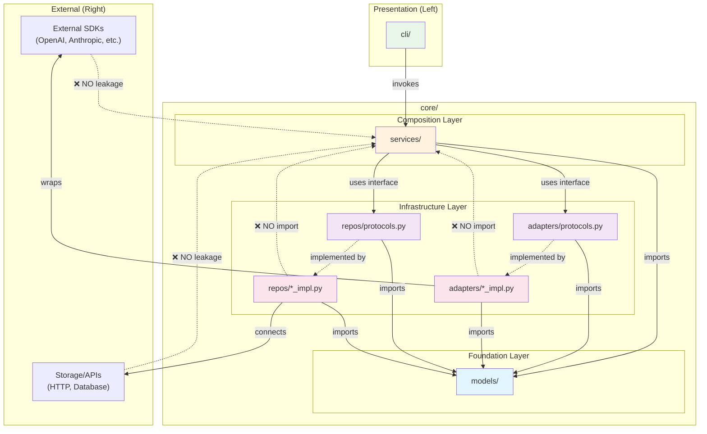

# Project Skeleton: Clean Architecture Foundation

**Mode**: Full

> **PROJECT IDENTITY**
> - **Name**: Flowspace2 (short: **fs2**)
> - **Purpose**: Ground-up rebuild of Flowspace with Clean Architecture
> - **Env Prefix**: `FS2_` (e.g., `FS2_AZURE__OPENAI__ENDPOINT`)
> - **Config Dir**: `.fs2/` (e.g., `.fs2/config.yaml`)

📚 This specification incorporates patterns from `sample-constitution.md` and `codebase.md` reference materials.

## Summary

Establish a Python project skeleton implementing Clean Architecture principles with strict dependency boundaries. The scaffold provides a foundation for building applications where **Services** compose **Adapters** and **Repositories** through interface injection, with zero concept leakage from infrastructure to business logic.

**WHY**: LLM coding agents make "field decisions" when architecture is implicit. By encoding dependency rules, layer boundaries, and testing patterns into the scaffold structure, we prevent agents from introducing circular dependencies, leaking vendor types into business logic, or bypassing the composition layer.

## Goals

- **G1**: Establish directory structure with `src/` (application) and `tests/` (verification) separation
- **G2**: Create `cli` and `core` modules with clear responsibilities (core includes services, adapters, repos, and models)
- **G3**: Implement strict left-to-right dependency flow: Services → {Adapters, Repos} → External Systems
- **G4**: Prevent right-to-left concept leakage through Protocol-based interfaces
- **G5**: Provide typed, hierarchical configuration with multiple source precedence
- **G6**: Enable Test-Driven Development through injectable interfaces and test doubles
- **G7**: Create canonical documentation test demonstrating full composition pattern
- **G8**: Provide Justfile commands for common development workflows
- **G9**: Implement CLI module with Rich output and Typer argument parsing

## Non-Goals

- **NG1**: Full DI container implementation (POC uses manual injection; container is optional)
- **NG2**: Specific LLM provider implementations beyond interface definition
- **NG3**: Database or persistence layer implementation (only interface patterns)
- **NG4**: Production deployment configuration
- **NG5**: Authentication/authorization patterns

## Complexity

**Score**: CS-3 (medium)

**Breakdown**: S=1, I=1, D=0, N=1, F=1, T=2

| Dimension | Score | Rationale |
|-----------|-------|-----------|
| Surface Area (S) | 1 | Multiple modules (cli, core, config) but well-bounded |
| Integration (I) | 1 | Pydantic ecosystem only; no external APIs |
| Data/State (D) | 0 | No schema or migrations; in-memory only |
| Novelty (N) | 1 | Well-specified from reference materials; some patterns need adaptation |
| Non-Functional (F) | 1 | Standard typing; security validation in config only |
| Testing/Rollout (T) | 2 | TDD-first approach; canonical test as documentation |

**Total**: 6 → CS-3

**Confidence**: 0.85

**Assumptions**:
- Python 3.12+ with modern typing support
- `uv` package manager already configured
- FlowSpace py_sample_repo patterns are authoritative

**Dependencies**:
- pydantic>=2.0
- pydantic-settings>=2.0
- python-dotenv
- pyyaml
- pytest
- rich (terminal formatting/output)
- typer (CLI argument parsing, type-hint based)

**Risks**:
- Pattern adaptation from py_sample_repo may reveal edge cases
- Test structure precedent may conflict with existing pytest conventions

**Phases**:
1. Project structure and configuration system
2. Core interfaces (Protocol definitions)
3. Logger adapter implementation
4. Canonical documentation test
5. Justfile and documentation

## Testing Strategy

**Approach**: Full TDD
**Rationale**: Foundational scaffold establishing patterns; tests serve as executable documentation for future development

**Focus Areas**:
- Configuration system (precedence, validation, placeholder expansion)
- Logger adapter (interface compliance, fake implementation)
- Dependency flow (import rules, no concept leakage)
- Canonical documentation test (composition pattern demonstration)

**Excluded**:
- CLI argument parsing (Typer handles; minimal custom logic)
- Directory structure creation (verified by existence checks)

**Mock Usage**: Targeted mocks (B)
- **Policy**: Prefer Fakes (real interface implementations) over mocks
- **Allowed**: Environment variables, file system (YAML loading) during config TDD
- **Avoid**: Mocking adapters/repos — implement Fake versions instead
- **Rationale**: Fakes provide higher confidence; mocks risk false positives

## Documentation Strategy

**Location**: Hybrid (README + docs/how/)
**Rationale**: Scaffold needs both quick-start and in-depth architectural guidance

**Content Split**:
| Location | Content |
|----------|---------|
| README.md | Project overview, quick-start, installation, basic usage |
| docs/how/architecture.md | Full project architecture, layer responsibilities, dependency flow |
| docs/how/configuration.md | How config system works, precedence, YAML, env vars |
| docs/how/tdd.md | How TDD works in this project, test structure, fakes pattern |
| docs/how/di.md | How DI works, Protocol interfaces, injection patterns |

**Target Audience**: Developers and AI agents working in the codebase
**Maintenance**: Update docs when architectural patterns change; canonical test serves as living documentation

## Acceptance Criteria

### AC1: Directory Structure
**Given** a new checkout of the repository
**When** the scaffold is complete
**Then** the following structure exists:
```
src/
└── fs2/                      # Named package (avoids 'src' namespace conflicts)
    ├── __init__.py
    ├── cli/
    │   └── __init__.py
    ├── core/
    │   ├── __init__.py
    │   ├── models/
    │   │   └── __init__.py       # Domain models (dataclasses, value objects)
    │   ├── services/
    │   │   └── __init__.py
    │   ├── adapters/
    │   │   ├── __init__.py
    │   │   └── protocols.py      # Adapter interfaces
    │   └── repos/
    │       ├── __init__.py
    │       └── protocols.py      # Repository interfaces
    └── config/
        ├── __init__.py           # Singleton export
        └── models.py             # Pydantic config models

tests/
├── conftest.py
├── scratch/                  # Fast exploration tests
├── unit/
│   ├── config/
│   ├── adapters/
│   └── services/             # Service composition tests (tests as documentation)
└── docs/                     # Canonical documentation tests
```

**Note**: The `src/fs2/` layout follows Python packaging best practices—`src/` is the container directory (not a package), while `fs2/` is the actual importable package. This prevents namespace conflicts when the package is installed.

### AC2: CLI Module
**Given** the cli module
**When** implementing command-line interface
**Then**:
- Typer is used for argument parsing with type hints
- Rich is used for formatted terminal output (tables, panels, syntax highlighting)
- CLI commands invoke Services (never Adapters/Repos directly)
- A ConsoleAdapter wraps Rich for testability (can inject FakeConsoleAdapter)
- Basic commands exist: `--version`, `--help`

### AC3: Dependency Flow Enforcement
**Given** the core module structure
**When** examining import statements
**Then**:
- `models/` is the base layer — MUST NOT import from services, adapters, or repos
- `services/` MAY import from `models/`, `adapters/protocols.py`, and `repos/protocols.py`
- `services/` MUST NOT import from adapter/repo implementations
- `adapters/` MAY import from `models/` only (plus external SDKs in implementations)
- `repos/` MAY import from `models/` only (plus external libs in implementations)
- `adapters/` and `repos/` MUST NOT import from `services/`
- Only implementation modules MAY import external SDKs



**Flow Rules Summary**:
| From | To | Allowed? |
|------|----|----------|
| cli | services | ✅ Yes |
| services | models | ✅ Yes |
| services | adapters/protocols | ✅ Yes |
| services | repos/protocols | ✅ Yes |
| services | adapter implementations | ❌ No |
| adapters | models | ✅ Yes |
| adapters | services | ❌ No |
| repos | models | ✅ Yes |
| repos | services | ❌ No |
| models | anything in core | ❌ No |

### AC4: ABC-Based Interfaces
**Given** the adapter and repository modules
**When** defining contracts
**Then**:
- All interfaces use `abc.ABC` with `@abstractmethod` for explicit contracts
- Implementations MUST inherit from the ABC base class
- Interface methods use only domain types (no vendor SDK types)
- Each interface has a corresponding fake implementation for testing (inherits from ABC)

### AC5: Domain Models
**Given** the core/models module
**When** defining domain types
**Then**:
- Models use `@dataclass(frozen=True)` for immutable value objects
- Models contain no business logic (pure data containers)
- Models are the shared language across all layers (services, adapters, repos)
- Models MUST NOT import from services, adapters, or repos (zero dependencies on other core modules)
- All layers MAY import from models

### AC6: Configuration System
**Given** the configuration module
**When** loading settings
**Then**:
- Precedence order: programmatic → env vars → YAML → .env → defaults
- Nested config accessible via `settings.section.subsection.key`
- Environment variables use `FS2_` prefix with `__` delimiter
- YAML file at `.fs2/config.yaml` is optional (graceful fallback)
- Placeholder expansion `${ENV_VAR}` works in YAML values
- Literal secrets are rejected before placeholder expansion
- Validation errors raise `ConfigurationError` with actionable messages (which env var to set, which file to edit)

### AC7: Logger Adapter
**Given** a LogAdapter protocol
**When** implemented
**Then**:
- Interface defines `debug()`, `info()`, `warning()`, `error()` methods
- Interface accepts structured context (dict/kwargs)
- ConsoleLogAdapter implementation exists for development
- FakeLogAdapter exists for testing with captured messages

### AC8: Canonical Documentation Test
**Given** the tests/docs/ directory
**When** running `pytest tests/docs/`
**Then** a single test file demonstrates:
- Composing a SampleService with SampleAdapter + LogAdapter + Config
- Injecting FakeLogAdapter and FakeSampleAdapter for test isolation
- Test Doc block with: Why, Contract, Usage Notes, Quality Contribution, Worked Example
- Given-When-Then naming convention
- Arrange-Act-Assert structure

### AC9: TDD Coverage
**Given** the test suite
**When** running `pytest tests/unit/`
**Then**:
- Configuration system has tests for:
  - Precedence order (env overrides YAML)
  - Placeholder expansion
  - Security validation (literal secret rejection)
  - Missing optional config graceful handling
  - `ConfigurationError` messages are actionable (include fix instructions)
- Logger adapter has tests for:
  - Message capture in FakeLogAdapter
  - Structured context passing
  - Log level filtering

### AC10: Justfile Commands
**Given** a Justfile in project root
**When** running `just --list`
**Then** these commands are available:
- `just test` - Run all tests
- `just test-unit` - Run unit tests only
- `just test-docs` - Run documentation tests only
- `just test-scratch` - Run scratch/exploration tests
- `just lint` - Run linting (ruff)
- `just typecheck` - Run type checking (pyright/mypy)

### AC11: Documentation Readiness
**Given** the completed scaffold
**When** reviewing documentation
**Then**:
- README.md explains architecture and layer responsibilities
- Each Protocol interface has docstring explaining contract
- Configuration model fields have descriptions
- Canonical test serves as executable usage documentation

## Risks & Assumptions

### Risks
| Risk | Impact | Mitigation |
|------|--------|------------|
| Protocol vs ABC choice | Medium | Use Protocol for structural typing; document when ABC preferred |
| Config precedence bugs | High | Comprehensive TDD for each source priority |
| Circular import potential | Medium | Strict import rules in protocols.py files |

### Assumptions
- Python 3.12+ provides adequate typing support for Protocol
- pydantic-settings 2.x API matches reference patterns
- pytest is the standard test runner
- Developers understand Clean Architecture concepts

## Open Questions

- **OQ1**: Is there a preferred DI container for future production use (dependency-injector, etc.)? *(Deferred — not needed for scaffold)*
- ~~**OQ2**: Should config validation errors raise custom domain exceptions?~~ → **Resolved: Custom `ConfigurationError` with actionable messages**
- ~~**OQ3**: Naming convention preference: `LogAdapter` vs `LoggingAdapter` vs `Logger`?~~ → **Resolved: `LogAdapter`**

## ADR Seeds (Optional)

### ADR-001: Interface Pattern Choice ✅ RESOLVED
**Decision**: `abc.ABC` with `@abstractmethod`

**Rationale**:
- Runtime enforcement catches missing methods immediately
- Explicit contracts help AI agents understand requirements
- Clear inheritance hierarchy aids code navigation
- `TypeError` at instantiation is better than silent failures

**Pattern**:
```python
from abc import ABC, abstractmethod

class LogAdapter(ABC):
    @abstractmethod
    def info(self, msg: str, **context: Any) -> None: ...

    @abstractmethod
    def error(self, msg: str, **context: Any) -> None: ...

class ConsoleLogAdapter(LogAdapter):  # MUST inherit
    def info(self, msg: str, **context: Any) -> None:
        print(f"INFO: {msg}")

    def error(self, msg: str, **context: Any) -> None:
        print(f"ERROR: {msg}")
```

**Stakeholders**: Development team, future AI agents

### ADR-002: Configuration Architecture
**Decision Drivers**:
- Fail-fast vs graceful degradation for missing config
- Test isolation requirements
- Production vs development defaults

**Candidate Alternatives**:
- A: Singleton with module-level instantiation (fail-fast)
- B: Lazy singleton with factory function
- C: Context-based injection (no singleton)

**Stakeholders**: Operations, Testing

## Clarifications

### Session 2025-11-26

**Q1: Workflow Mode**
- **Selected**: Full (B)
- **Rationale**: CS-3 complexity with 5 phases; foundational scaffold requires comprehensive gates

**Q2: Testing Strategy**
- **Selected**: Full TDD (A)
- **Rationale**: Foundational scaffold; tests establish patterns for future development

**Q3: Mock Usage**
- **Selected**: Targeted mocks (B)
- **Rationale**: Prefer Fakes over mocks; allow mocking for env vars/file system in config TDD only

**Q4: Documentation Strategy**
- **Selected**: Hybrid (C)
- **README.md**: Overview, quick-start, installation, basic usage
- **docs/how/**: Full architecture, config, TDD, DI guides

**Q5: Adapter Naming Convention**
- **Selected**: `LogAdapter` (A)
- **Rationale**: Consistent `*Adapter` suffix pattern for all adapters

**Q6: Config Validation Errors**
- **Selected**: Custom exceptions (B)
- **Rationale**: Errors must be informative and actionable; include which env var to set, which config file to edit

**Q7: Interface Pattern**
- **Selected**: ABC with `@abstractmethod`
- **Rationale**: Runtime enforcement, explicit contracts, helps AI agents understand requirements

---

### Coverage Summary

| Category | Status | Notes |
|----------|--------|-------|
| Workflow Mode | ✅ Resolved | Full mode |
| Testing Strategy | ✅ Resolved | Full TDD |
| Mock Usage | ✅ Resolved | Targeted (fakes preferred) |
| Documentation Strategy | ✅ Resolved | Hybrid (README + docs/how/) |
| Naming Convention | ✅ Resolved | `*Adapter` suffix |
| Config Exceptions | ✅ Resolved | Custom `ConfigurationError` (actionable) |
| Interface Pattern | ✅ Resolved | ABC with `@abstractmethod` |
| DI Container | ⏸️ Deferred | Future concern, not needed for scaffold |
