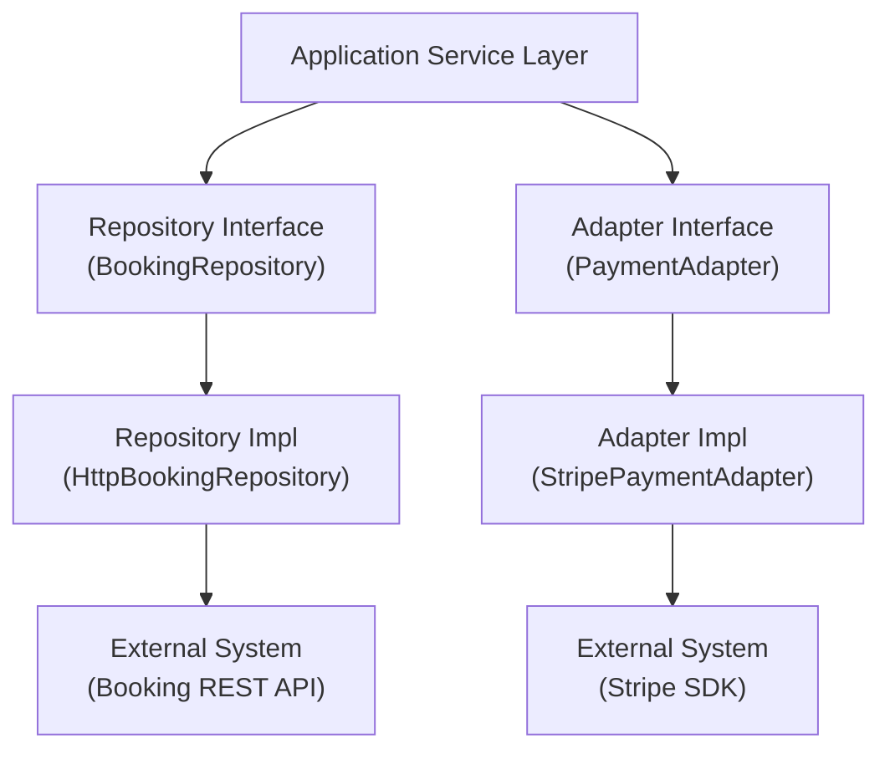
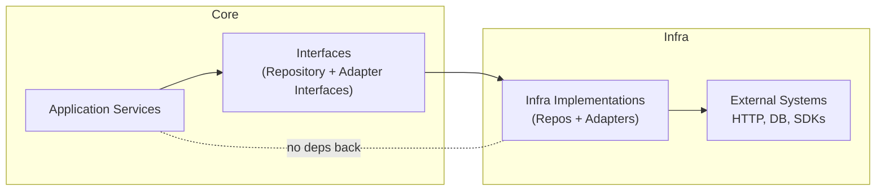

# On the importance of project rules and architecture when coding with agents

When coding with a LLM coding agent, have you ever ended up with two loggers in your codebase? Even worse, ever ended up with external dependencies and concepts strewn throughout your codebase like a marbled cake making it near on impossible to isolate and test individual concepts and creating a dependency nightmare??

Coding agents are fine tuned and then further prompted on top to solve problems, and to keep going until they do. It would be frustrating for the user if they stopped every two turns to ask if they should keep going if there was any doubt. Even then, I've written my fair share of "don't stop until you've finished" prompting. This can be risky however, as you might find yourself having to unpick a bunch of "field decisions" that the agent has made in order to satisfy its goals…

The agent also has a very narrow looking glass, its context, through which it can see. It might take the initiative to go and look at how prior implementations are done to ensure that it follows them - you may prompt it to. But given the context window size limits and the often diffuse nature of architecture throughout the code base, its much better to be entirely explicit when it comes to "this is how you do things in this codebase".

Enter the concept of the project constitution. The constitution or what ever name you give it (rules, architecture, guides etc) is a concept that has made it way to spec driven development recently (in SpecKit it's particularly prominent). It is the explicit statement about how to work with your codebase, why things are like they are and how to make the most out of it.

## What makes a good constitution?

There is *a lot* that you could put in there, and tools like SpecKit will guide you through how to do this. Basically anything that you don't want the agent to guess how to do should be in here. Architecture (obvious), how to structure for TDD, how DI works and more. These are all things that you might have written down in a regular project anyway right… maybe? What ever you put in here, it should be concrete, have examples and a human readable narrative on why its important and what quality contribution each rule or idiom provides to the codebase - its raison d'être. This series of documents will be your **project-level engineering playbook, architecture and standards guide.**

You may break these up, have template files, examples folders etc... 

Importantly this will evolve over time! You need to keep this up to date. Added a new logger, update it. Changed your DI system? Update it!

Most importantly though, this is to stop the agent from making up stuff as it goes along to solve implementation problems. There should be no doubt about how things are to be implemented in our codebase. 

I'll give a concrete example from one of our codebases.

## TDD

We start with TDD. We would have a detailed section on how to use TDD to achieve goals, by isolating small testable elements of code, using the project dependency system to inject dependencies, use test implementations etc as needed. We would also describe our mocking policy (mocks can be dangerous shortcut for coding agents... I've seen it think it was finished and it was 100% mocked!)

The section would have samples on how to do all this, but importantly it would describe the nature of tests - their vibe... Why would we need one, what is its quality contribution? 

On top of this, we ask that all tests are usable as documentation - they represent a high fidelity view on how to use something. I don't know about you, but when I'm exploring a codebase I go straight to the tests to see how stuff works and if those tests explicitly walk you though how things work as well as actually testing the codebase then that's an extra help on your way. Also, your future self and your future agent self (context) will also really like this. 

## Concept flows and rules

The main concept in our system is based around a clean architecture design, with restrictions around external deps, and concept leakage back "to the left". 

### Application Service

The orchestration / composition layer. Services coordinate use cases by calling repositories and adapters, applying business rules, and returning domain objects. They're pure Python - no HTTP clients, no vendor SDKs, no framework imports. If you can't test it without spinning up infrastructure, it doesn't belong here.

### Repo / Repository

The data access abstraction. Define interfaces in your core module, implementations in infrastructure. The interface knows nothing about HTTP or SQL - it speaks domain language (`find_by_id`, `save`). The implementation does the dirty work of talking to APIs and databases, then maps everything back to domain types before returning.

### Application Adapters

The vendor SDK wrapper. Same pattern as repositories, but for third-party services like Stripe or SendGrid. The adapter interface exposes only domain types (`PaymentRequest`, `PaymentResult`). The implementation translates between your domain and whatever weird types the vendor SDK uses. Vendor types never leak past the adapter boundary.

### Concept Leakage

From left to right, ApplicationServices can know about Repos and Adapters but they cannot skip a level and know about data access or external deps... The repos and adapters MUST be swappable (via injection) without causing any need to modify the ApplicationServices. 

From right to left there should be absolutely no concept leakage - the repos and adapters should never know about each other or the ApplicationServices, or any other concept in the application that is not injected (e.g. a logger is fine.) Particular care should be made to avoid any orchestration or composition in this layer. 


## Why go to all this trouble? 

Well now we can easily create new services, new external dependencies etc. Importantly we can follow TDD - the agent can isolate code to work on it and quickly run isolated elements to get them working. 

An of course you get all the benefits of a fully tested codebase - given this is how we develop, you end up with pretty high test coverage, which is even more important when an agent is working in teh codebase to spot accidental regressions. 

## How to use it all?

You need to prompt your spec flow to ensure that during the architecture phase it reads all these and integrates them in to the planning phase. It needs to be fully decided and baked in to the implemtnation plan before it starts implementing. Then you need to keep it honest - why did you do that? Why is that test like that etc... make sure its doing it as you expect - It may still go off course!

I have examples [here](https://github.com/jakkaj/tools/tree/main/agents/commands) that are in an easy to follow ordered list of commands that will help build the specs etc, but tools like SpecKit can help you though all this too. 

## Full Listing

### Layer Overview



### TDD Example: Testing with Injected Dependencies

This architecture enables clean test-driven development. Because services depend on **interfaces** (not concrete implementations), we can inject test doubles that behave predictably without hitting real APIs or databases.

```python
from datetime import datetime

# Test doubles implement the same interfaces as production code
class FakeBookingRepository(BookingRepository):
    """In-memory repository for testing - no HTTP, no database."""
    def __init__(self):
        self._bookings: dict[str, Booking] = {}

    def find_by_id(self, booking_id: BookingId) -> Booking | None:
        return self._bookings.get(booking_id.value)

    def save(self, booking: Booking) -> None:
        self._bookings[booking.id.value] = booking


class FakePaymentAdapter(PaymentAdapter):
    """Predictable payment adapter for testing - no Stripe SDK."""
    def __init__(self, should_succeed: bool = True):
        self._should_succeed = should_succeed
        self.charges: list[PaymentRequest] = []

    def charge(self, request: PaymentRequest) -> PaymentResult:
        self.charges.append(request)
        return PaymentResult(
            transaction_id="fake-txn-123",
            success=self._should_succeed,
        )


def test_given_valid_booking_command_when_creating_booking_then_charges_payment_and_persists():
    """
    Test Doc:
    - Why: Verifies the core booking creation flow orchestrates payment and persistence correctly
    - Contract: create_booking charges payment via adapter, then saves confirmed booking via repository
    - Usage Notes: Inject FakeBookingRepository and FakePaymentAdapter; command requires user_id, departure, origin, destination
    - Quality Contribution: Critical path - booking creation is the primary user journey
    - Worked Example: SYD→MEL booking for user-1 on 2025-06-15 → payment charged, booking saved with same ID
    """

    # Arrange - construct fakes and inject into real service
    fake_repo = FakeBookingRepository()
    fake_payments = FakePaymentAdapter(should_succeed=True)

    service = BookingApplicationServiceImpl(
        bookings=fake_repo,
        payments=fake_payments,
    )

    command = CreateBookingCommand(
        user_id="user-1",
        departure=datetime(2025, 6, 15, 10, 0),
        origin="SYD",
        destination="MEL",
    )

    # Act
    booking = service.create_booking(command)

    # Assert - payment was charged with correct booking
    assert len(fake_payments.charges) == 1
    assert fake_payments.charges[0].booking_id == booking.id

    # Assert - booking was persisted
    saved = fake_repo.find_by_id(booking.id)
    assert saved is not None
    assert saved.user_id == "user-1"
```

**Why this matters for agents:** When generating tests, create simple fake implementations of repository/adapter interfaces. Never instantiate real HTTP clients or vendor SDKs in tests. The service under test should be the real implementation; only its dependencies are fakes.

### Tests as Documentation

Tests are the most reliable form of documentation because they're executable and enforced by CI. Every test should make readers say: *"Oh, that's how this works!"*

Each test includes a **Test Doc** block with five fields:

- **Why** — Why does this test exist?
- **Contract** — What behavior does the code guarantee?
- **Usage Notes** — How do I actually use this?
- **Quality Contribution** — What value does this test add?
- **Worked Example** — Show me a real scenario

The **Quality Contribution** must map to one of: *critical path* (core user journey), *opaque behavior* (complex logic), *regression-prone* (bug fix), or *edge case* (boundary condition).

**Naming convention:** Use Given-When-Then format to describe behavior:
```
test_given_<precondition>_when_<action>_then_<outcome>
```

**Structure:** Arrange-Act-Assert with clear phase separation.

---

### Application Service

**Role:** Orchestrate use cases, enforce business rules, call repositories/adapters. Pure language code; no framework, HTTP, or SDKs.

This is the "Composable" layer where we bring concepts together.  

```python
from dataclasses import dataclass
from datetime import datetime
from abc import ABC, abstractmethod

# Domain command + IDs used at the boundary of the application layer
@dataclass
class BookingId:
    value: str

@dataclass
class CreateBookingCommand:
    user_id: str
    departure: datetime
    origin: str
    destination: str

# Application service interface
class BookingApplicationService(ABC):
    @abstractmethod
    def create_booking(self, command: CreateBookingCommand) -> "Booking":
        pass

    @abstractmethod
    def get_booking(self, booking_id: BookingId) -> "Booking | None":
        pass

class BookingApplicationServiceImpl(BookingApplicationService):
    def __init__(
        self,
        bookings: "BookingRepository",
        payments: "PaymentAdapter",
    ):
        self._bookings = bookings
        self._payments = payments

    def create_booking(self, command: CreateBookingCommand) -> "Booking":
        # Validation & business rules
        # (no HTTP, no SDK types)
        self._validate_command(command)

        provisional = Booking.provisional(
            user_id=command.user_id,
            departure=command.departure,
            origin=command.origin,
            destination=command.destination,
        )

        # Orchestration via adapters/repositories
        payment_result = self._payments.charge(
            PaymentRequest.for_booking(provisional),
        )

        confirmed = provisional.confirm(payment_result)
        self._bookings.save(confirmed)
        return confirmed

    def get_booking(self, booking_id: BookingId) -> "Booking | None":
        return self._bookings.find_by_id(booking_id)

    def _validate_command(self, command: CreateBookingCommand) -> None:
        # Pure validation; raise domain-level errors only
        pass
```

#### Rules (ApplicationService) — for agents

**MUST** be testable with no framework (no web frameworks, no HTTP clients, no SDKs).

**MUST** depend only on domain types (entities, value objects, commands), repository **interfaces**, and adapter **interfaces**.

**MUST NOT** import DI frameworks, platform APIs, HTTP clients, or vendor SDKs. Must not return or accept transport/vendor types (e.g. `requests.Response`, `StripeSession`).

**MAY** combine results from multiple repositories/adapters and apply business rules.

---

### Repository

**Role:** Provide a stable data-access interface; implementations talk to databases/APIs.

```python
# Interface lives in the application/domain module
from abc import ABC, abstractmethod
from typing import Optional
import httpx

class BookingRepository(ABC):
    @abstractmethod
    async def find_by_id(self, booking_id: BookingId) -> Optional["Booking"]:
        pass

    @abstractmethod
    async def save(self, booking: "Booking") -> None:
        pass

# Implementation lives in an infrastructure module
class HttpBookingRepository(BookingRepository):
    def __init__(self, client: httpx.AsyncClient):
        self._client = client

    async def find_by_id(self, booking_id: BookingId) -> Optional["Booking"]:
        response = await self._client.get(
            f"https://api.example.com/bookings/{booking_id.value}"
        )
        if response.status_code == 404:
            return None
        # Map HTTP/JSON → domain
        return Booking.from_dict(response.json())

    async def save(self, booking: "Booking") -> None:
        await self._client.post(
            "https://api.example.com/bookings",
            json=booking.to_dict(),
            headers={"Content-Type": "application/json"},
        )
```

#### Rules (Repositories) — for agents

Interfaces **MUST** live in the core/application module.

Implementations **MUST** live in an infrastructure module.

Implementations **MAY** import HTTP clients, DB drivers, file APIs, etc.

Repositories **MUST NOT** import application-service modules (creating circular dependencies), expose HTTP/DB-specific types in their public API (no `Response`, `Row`, etc.), or contain presentation concerns (formatting messages, localization).

---

### Application Adapter (new example)

**Role:** Wrap vendor SDKs with an app-specific interface so the rest of the app never sees vendor types.

```python
# Interface visible to application services
from abc import ABC, abstractmethod
from dataclasses import dataclass

class PaymentAdapter(ABC):
    @abstractmethod
    async def charge(self, request: "PaymentRequest") -> "PaymentResult":
        pass

# Domain-facing request/result types
@dataclass
class PaymentRequest:
    booking_id: BookingId
    amount: "Money"

    @classmethod
    def for_booking(cls, booking: "Booking") -> "PaymentRequest":
        return cls(
            booking_id=booking.id,
            amount=booking.total_price,
        )

@dataclass
class PaymentResult:
    transaction_id: str
    success: bool

# Infrastructure implementation wrapping a vendor SDK
class StripePaymentAdapter(PaymentAdapter):
    def __init__(self, stripe: "StripeClient"):
        self._stripe = stripe  # vendor SDK type

    async def charge(self, request: PaymentRequest) -> PaymentResult:
        session = await self._stripe.charge(
            amount_cents=request.amount.cents,
            metadata={"booking_id": request.booking_id.value},
        )

        return PaymentResult(
            transaction_id=session.id,
            success=session.status == "succeeded",
        )
```

#### Rules (Adapters) — for agents

Interfaces **MUST** expose only domain/application types.

Implementations **MAY** import vendor SDKs and platform APIs.

Vendor types **MUST NOT** leak across the adapter boundary — no `StripeSession` or `FirebaseUser` in method signatures or return types.

Adapters **MUST NOT** depend on application services (creating circular dependencies).

---

### Dependency & Concept Flow Rules



#### External dependency rules

**ONLY** infrastructure implementations (repositories/adapters) may import HTTP clients, DB drivers, file APIs, and vendor SDKs.

Application services **MUST** depend on **interfaces**, never on concrete infra classes.

External systems **MUST NOT** be referenced directly in core — no vendor SDK imports in application services, no HTTP `Response` or database-specific types in public APIs of interfaces.

#### Internal dependency rules & concept boundaries

**Allowed directions:** ApplicationService → Repository/Adapter interfaces → Infra implementations → External systems.

**Disallowed directions:** Repositories/Adapters → ApplicationService (no callbacks upwards). ApplicationService → DI framework or infrastructure implementations directly.

**Concept flow:** Transport/vendor concepts (HTTP responses, SQL rows, SDK entities) MUST NOT appear in application services; map them to domain types inside infra implementations. Domain concepts (e.g. `Booking`, `PaymentResult`) MAY flow outward — Infra → ApplicationService is allowed. They should be the only shared language across layers.

This slice is intended to be dropped into instructions for an LLM coding agent so it knows **where** to generate code, **what** it may import in each layer, and **which concepts must not cross which boundaries**.