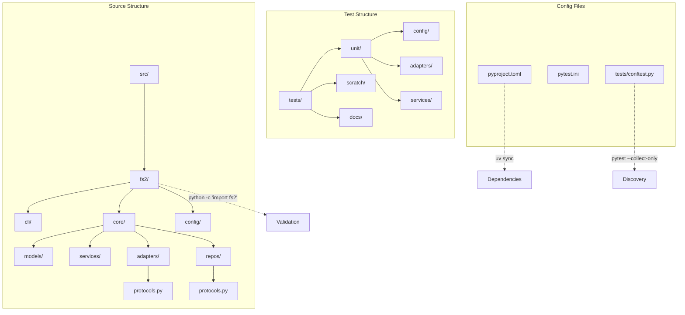
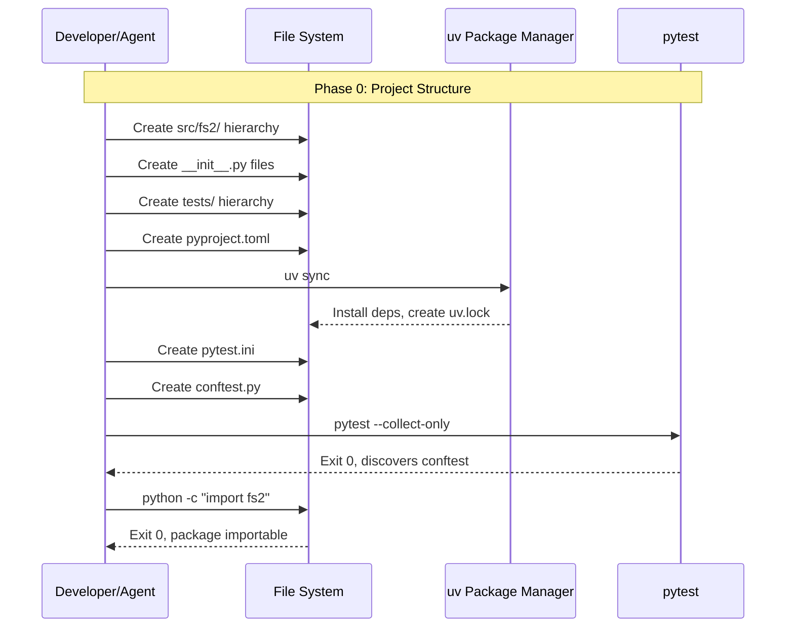

# Phase 0: Project Structure & Dependencies — Tasks + Alignment Brief

**Phase Slug**: `phase-0-project-structure`
**Created**: 2025-11-26
**Spec**: [project-skele-spec.md](/workspaces/flow_squared/docs/plans/002-project-skele/project-skele-spec.md)
**Plan**: [project-skele-plan.md](/workspaces/flow_squared/docs/plans/002-project-skele/project-skele-plan.md)
**Plan Tasks**: 0.1–0.8

---

## Tasks

| Status | ID | Task | CS | Type | Dependencies | Absolute Path(s) | Validation | Subtasks | Notes |
|--------|-----|------|-----|------|--------------|------------------|------------|----------|-------|
| [ ] | T001 | Create `src/` and `src/fs2/` directories | 1 | Setup | – | `/workspaces/flow_squared/src/`, `/workspaces/flow_squared/src/fs2/` | Directories exist | – | Foundation for all source |
| [ ] | T002 | Create `src/fs2/cli/` package with `__init__.py` | 1 | Setup | T001 | `/workspaces/flow_squared/src/fs2/cli/`, `/workspaces/flow_squared/src/fs2/cli/__init__.py` | `import fs2.cli` succeeds | – | Presentation layer |
| [ ] | T003 | Create `src/fs2/core/` package with `__init__.py` | 1 | Setup | T001 | `/workspaces/flow_squared/src/fs2/core/`, `/workspaces/flow_squared/src/fs2/core/__init__.py` | `import fs2.core` succeeds | – | Core business logic root |
| [ ] | T004 | Create `src/fs2/core/models/` package with `__init__.py` | 1 | Setup | T003 | `/workspaces/flow_squared/src/fs2/core/models/`, `/workspaces/flow_squared/src/fs2/core/models/__init__.py` | `import fs2.core.models` succeeds | – | Domain models (frozen dataclasses) |
| [ ] | T005 | Create `src/fs2/core/services/` package with `__init__.py` | 1 | Setup | T003 | `/workspaces/flow_squared/src/fs2/core/services/`, `/workspaces/flow_squared/src/fs2/core/services/__init__.py` | `import fs2.core.services` succeeds | – | Composition layer |
| [ ] | T006 | Create `src/fs2/core/adapters/` package with `__init__.py` and `protocols.py` (with docstring) | 1 | Setup | T003 | `/workspaces/flow_squared/src/fs2/core/adapters/`, `/workspaces/flow_squared/src/fs2/core/adapters/__init__.py`, `/workspaces/flow_squared/src/fs2/core/adapters/protocols.py` | `import fs2.core.adapters` succeeds | – | ABC interfaces (per Finding 09); see Protocols Skeleton below |
| [ ] | T007 | Create `src/fs2/core/repos/` package with `__init__.py` and `protocols.py` (with docstring) | 1 | Setup | T003 | `/workspaces/flow_squared/src/fs2/core/repos/`, `/workspaces/flow_squared/src/fs2/core/repos/__init__.py`, `/workspaces/flow_squared/src/fs2/core/repos/protocols.py` | `import fs2.core.repos` succeeds | – | Repository interfaces; see Protocols Skeleton below |
| [ ] | T008 | Create `src/fs2/config/` package with `__init__.py` | 1 | Setup | T001 | `/workspaces/flow_squared/src/fs2/config/`, `/workspaces/flow_squared/src/fs2/config/__init__.py` | `import fs2.config` succeeds | – | Cross-cutting config |
| [ ] | T009 | Create `src/fs2/__init__.py` root package marker | 1 | Setup | T001 | `/workspaces/flow_squared/src/fs2/__init__.py` | `import fs2` succeeds | – | Makes fs2 a package |
| [ ] | T010 | Create `tests/` root directory | 1 | Setup | – | `/workspaces/flow_squared/tests/` | Directory exists | – | Test root |
| [ ] | T011 | Create `tests/unit/` with subdirectories `config/`, `adapters/`, `services/` | 1 | Setup | T010 | `/workspaces/flow_squared/tests/unit/`, `/workspaces/flow_squared/tests/unit/config/`, `/workspaces/flow_squared/tests/unit/adapters/`, `/workspaces/flow_squared/tests/unit/services/` | All directories exist | – | Unit test organization |
| [ ] | T012 | Create `tests/scratch/` directory | 1 | Setup | T010 | `/workspaces/flow_squared/tests/scratch/` | Directory exists | – | Fast exploration tests |
| [ ] | T013 | Create `tests/docs/` directory | 1 | Setup | T010 | `/workspaces/flow_squared/tests/docs/` | Directory exists | – | Canonical documentation tests |
| [ ] | T014 | Create `pyproject.toml` with dependencies and Python >=3.12 constraint | 2 | Setup | – | `/workspaces/flow_squared/pyproject.toml` | File valid TOML, contains all deps | – | See Dependencies section below |
| [ ] | T015 | Run `uv sync --extra dev` to install all dependencies | 1 | Setup | T014 | `/workspaces/flow_squared/uv.lock` | Exit code 0, all packages installed (including pytest) | – | [P] can run after T014 |
| [ ] | T016 | Create `pytest.ini` with markers (unit, integration, docs) | 1 | Setup | T010 | `/workspaces/flow_squared/pytest.ini` | Markers registered, no warnings | – | Per Finding 12 |
| [ ] | T017 | Create `tests/conftest.py` skeleton with pytest configuration | 1 | Setup | T010, T016 | `/workspaces/flow_squared/tests/conftest.py` | pytest discovers conftest | – | Per Finding 12 |
| [ ] | T018 | Validate pytest discovery | 1 | Integration | T015, T017 | – | `pytest --collect-only` exits 0 | – | Final validation |
| [ ] | T019 | Validate all `fs2` subpackages import successfully | 1 | Integration | T009, T015 | – | `python -c "import fs2; import fs2.core; import fs2.config; import fs2.cli"` exits 0 | – | Final validation |

**Total Tasks**: 19
**Complexity Summary**: 18 × CS-1 (trivial) + 1 × CS-2 (small) = **Phase CS-1** (trivial overall)

### Parallelization Guidance

```
T001 ──┬──> T002 ──────────────────────────────────────────────────────────────┐
       ├──> T003 ──┬──> T004                                                   │
       │           ├──> T005                                                   │
       │           ├──> T006 (protocols.py)                                    │
       │           └──> T007 (protocols.py)                                    │
       ├──> T008                                                               │
       └──> T009 ─────────────────────────────────────────────────────────────>├──> T019
                                                                               │
T010 ──┬──> T011                                                               │
       ├──> T012                                                               │
       ├──> T013                                                               │
       └──────────────────────────────────────────────────────────────────────>├──> T017 ──> T018
                                                                               │
T014 ────────────────────────────────────────────────────────────────────────>├──> T015 ──> T018, T019
                                                                               │
T016 ─────────────────────────────────────────────────────────────────────────>└──> T017
```

**Parallel Groups**:
- **Group A** [P]: T001, T010, T014, T016 (independent roots)
- **Group B** [P]: T002-T009 (after T001), T011-T013 (after T010)
- **Group C** [P]: T015 (after T014), T017 (after T010+T016)
- **Group D**: T018, T019 (final validation, sequential)

---

## Alignment Brief

### Objective Recap

Create the foundational project structure for Flowspace2 (fs2), establishing:
1. Clean Architecture directory layout encoding layer boundaries
2. Python package structure enabling imports
3. Dependency management via `uv` and `pyproject.toml`
4. Pytest infrastructure with markers for test categorization

### Behavior Checklist (mapped to AC)

- [ ] **AC1**: Directory structure matches spec (`src/fs2/{cli,core/{models,services,adapters,repos},config}/`, `tests/{scratch,unit,docs}/`)
- [ ] **AC1**: All `__init__.py` files present for package imports
- [ ] **AC1**: `protocols.py` placeholder files in `adapters/` and `repos/`
- [ ] **AC10** (partial): pytest.ini with markers ready for `just test-unit`, etc.

### Non-Goals (Scope Boundaries)

❌ **NOT doing in this phase**:
- Configuration system implementation (Phase 1)
- ABC interface definitions (Phase 2)
- Any business logic or service code
- CLI commands or Rich/Typer setup (deferred until core is ready)
- `.fs2/config.yaml` file creation (Phase 1)
- Test fixtures beyond conftest.py skeleton
- Documentation files in `docs/how/` (Phase 5)
- Justfile commands (Phase 5)

### Critical Findings Affecting This Phase

| Finding | Constraint/Requirement | Addressed By |
|---------|----------------------|--------------|
| **Finding 09**: Module Structure Encodes Layers | Directory structure must reflect logical layers: cli → services → {adapters, repos} → external | T002-T008 create this structure |
| **Finding 12**: Pytest Fixtures Mirror Domain | conftest.py with markers; test-specific fixtures in test files | T016, T017 |

### ADR Decision Constraints

**N/A** — No ADRs exist for this project.

### Invariants & Guardrails

- **Import Rule**: `fs2.config` MUST NOT import from `fs2.core` (established but not tested until Phase 1)
- **Package Rule**: Every directory under `src/fs2/` must have `__init__.py`
- **Test Rule**: No test code in `src/`; no production code in `tests/`

### Inputs to Read

| File | Purpose |
|------|---------|
| `/workspaces/flow_squared/docs/plans/002-project-skele/project-skele-spec.md` | AC1 directory structure definition |
| `/workspaces/flow_squared/docs/plans/002-project-skele/project-skele-plan.md` § Phase 0 | Task definitions, deliverables |

### Visual Alignment Aids

#### Flow Diagram: Directory Creation Sequence



#### Sequence Diagram: Setup Flow



### Test Plan

**Approach**: Lightweight (no TDD for scaffolding)
**Rationale**: Phase 0 creates structure only; validation via commands, not test code

| Validation | Command | Expected |
|------------|---------|----------|
| Dependencies installed | `uv sync --extra dev` | Exit 0, no errors |
| Pytest discovery | `pytest --collect-only` | Exit 0, finds conftest.py |
| Package importable | `python -c "import fs2; import fs2.core; import fs2.config; import fs2.cli"` | Exit 0 |
| Markers registered | `pytest --markers` | Shows `unit`, `integration`, `docs` |

### Step-by-Step Implementation Outline

| Step | Tasks | Action |
|------|-------|--------|
| 1 | T001, T010, T014, T016 | Create root directories and config files (parallel) |
| 2 | T002-T009 | Create src/fs2/ subdirectories with __init__.py |
| 3 | T011-T013 | Create tests/ subdirectories |
| 4 | T015 | Run `uv sync --extra dev` |
| 5 | T017 | Create conftest.py skeleton |
| 6 | T018-T019 | Final validation |

### Commands to Run

```bash
# Create directories (Step 1-3)
mkdir -p /workspaces/flow_squared/src/fs2/{cli,core/{models,services,adapters,repos},config}
mkdir -p /workspaces/flow_squared/tests/{scratch,unit/{config,adapters,services},docs}

# Create __init__.py files (Step 2)
touch /workspaces/flow_squared/src/fs2/__init__.py
touch /workspaces/flow_squared/src/fs2/cli/__init__.py
touch /workspaces/flow_squared/src/fs2/core/__init__.py
touch /workspaces/flow_squared/src/fs2/core/{models,services,adapters,repos}/__init__.py
touch /workspaces/flow_squared/src/fs2/config/__init__.py

# Create protocol files with docstrings (Step 2)
# See "Protocols Skeleton" section for file contents
# adapters/protocols.py and repos/protocols.py need docstring content, not empty files

# Install dependencies (Step 4)
cd /workspaces/flow_squared && uv sync --extra dev

# Validation (Step 6)
pytest --collect-only
python -c "import fs2; import fs2.core; import fs2.config; import fs2.cli; print('OK')"
pytest --markers | grep -E "(unit|integration|docs)"
```

### Dependencies Specification (for pyproject.toml)

```toml
[project]
name = "fs2"
version = "0.1.0"
description = "Flowspace2 - Clean Architecture Python scaffold"
requires-python = ">=3.12"
dependencies = [
    "pydantic>=2.0",
    "pydantic-settings>=2.0",
    "python-dotenv>=1.0",
    "pyyaml>=6.0",
    "rich>=13.0",
    "typer>=0.9",
]

[project.optional-dependencies]
dev = [
    "pytest>=7.0",
    "pytest-cov>=4.0",
    "ruff>=0.1",
]

[build-system]
requires = ["hatchling"]
build-backend = "hatchling.build"

[tool.hatch.build.targets.wheel]
packages = ["src/fs2"]
```

### pytest.ini Content

```ini
[pytest]
testpaths = tests
python_files = test_*.py
python_classes = Test*
python_functions = test_*
markers =
    unit: Unit tests (fast, isolated)
    integration: Integration tests (may touch filesystem)
    docs: Documentation/canonical tests
addopts = -v --tb=short
```

### conftest.py Skeleton

```python
"""
Shared pytest configuration and fixtures for fs2.

Per Critical Finding 12: Fixtures mirror domain structure.
- Shared fixtures here (domain types, fakes)
- Test-specific fixtures in test files
"""
import pytest


def pytest_configure(config):
    """Register custom markers."""
    # Markers are defined in pytest.ini, this is for programmatic access
    pass


# Placeholder for future fixtures (Phase 1+)
# @pytest.fixture
# def sample_config():
#     from fs2.config.models import FS2Settings
#     return FS2Settings()
```

### Protocols Skeleton (T006, T007)

#### adapters/protocols.py

```python
"""
Adapter protocol definitions (ABC interfaces).

This module defines abstract base classes for all adapters in the system.
Adapters wrap external SDKs and services, exposing only domain types.

Architecture Rules:
- Adapters MUST NOT import from services (no upward dependencies)
- Adapters MUST NOT expose vendor SDK types in their interfaces
- All adapters inherit from ABC with @abstractmethod decorators
- Each adapter has a corresponding Fake implementation for testing

Phase 2 will add:
- LogAdapter: Logging interface (debug, info, warning, error)

See: docs/plans/002-project-skele/project-skele-spec.md § AC4, AC7
"""
```

#### repos/protocols.py

```python
"""
Repository protocol definitions (ABC interfaces).

This module defines abstract base classes for all repositories in the system.
Repositories provide data access abstractions, hiding storage implementation details.

Architecture Rules:
- Repositories MUST NOT import from services (no upward dependencies)
- Repositories MUST NOT expose database/HTTP types in their interfaces
- Interface methods use domain language (find_by_id, save) not SQL/HTTP
- All repositories inherit from ABC with @abstractmethod decorators
- Each repository has a corresponding Fake implementation for testing

Phase 2+ will add repository interfaces as needed.

See: docs/plans/002-project-skele/project-skele-spec.md § AC4
"""
```

### Risks & Unknowns

| Risk | Severity | Mitigation |
|------|----------|------------|
| Dependency version conflicts | Low | Pin minimum versions in pyproject.toml |
| uv not available | Low | Devcontainer includes uv; fallback: `pip install` |
| pytest marker warnings | Low | Explicit marker registration in pytest.ini |

### Ready Check

- [ ] All 19 tasks have clear validation criteria
- [ ] Absolute paths specified for all file operations
- [ ] Dependencies list complete (pydantic, pydantic-settings, pytest, rich, typer, pyyaml, python-dotenv)
- [ ] pytest.ini content defined with markers
- [ ] conftest.py skeleton documented
- [ ] ADR constraints mapped to tasks (N/A - no ADRs exist)
- [ ] Critical Findings 09 and 12 addressed in task design

**Awaiting GO/NO-GO before implementation.**

---

## Phase Footnote Stubs

> **NOTE**: Footnotes will be added during implementation by `/plan-6a-update-progress`.
> **Numbering Authority**: plan-6a-update-progress is the single source of truth for footnote numbering.

| Footnote | Task | Description |
|----------|------|-------------|
| *(empty)* | – | *(populated during implementation)* |

---

## Evidence Artifacts

Implementation will produce:
- **Execution Log**: `/workspaces/flow_squared/docs/plans/002-project-skele/tasks/phase-0-project-structure/execution.log.md`
- **Created Files**: All files listed in Absolute Path(s) column

---

## Directory Layout

```
docs/plans/002-project-skele/
├── project-skele-spec.md
├── project-skele-plan.md
└── tasks/
    └── phase-0-project-structure/
        ├── tasks.md                  # This file
        └── execution.log.md          # Created by /plan-6-implement-phase
```

---

## Critical Insights Discussion

**Session**: 2025-11-26
**Context**: Phase 0 Tasks Dossier pre-implementation review
**Analyst**: AI Clarity Agent
**Reviewer**: Development Team
**Format**: Water Cooler Conversation (5 Critical Insights)

### Insight 1: Package Name "src" Will Cause Installation Conflicts

**Did you know**: The original pyproject.toml specified `packages = ["src"]`, meaning the installed package would literally be called `src` - a generic name that conflicts with any other project using the common `src/` layout.

**Implications**:
- Environment pollution when fs2 is installed
- CI/CD fragility on shared runners
- IDE autocomplete confusion
- Namespace conflicts with other projects

**Options Considered**:
- Option A: Rename to `fs2` package (restructure directories)
- Option B: Use `package-dir` mapping (keep src/, map to fs2)
- Option C: Accept `src` package name (document risk)

**AI Recommendation**: Option B initially, refined to `src/fs2/` structure
- Reasoning: Keeps familiar src/ layout convention while providing unique fs2 namespace

**Discussion Summary**:
User confirmed the `src/fs2/` structure as the cleanest approach. This is the canonical way to use src-layout with a named package.

**Decision**: Restructure to `src/fs2/` package layout

**Action Items**:
- [x] Updated all task paths (T001-T009, T019)
- [x] Updated pyproject.toml specification
- [x] Updated spec AC1 with explanatory note
- [x] Updated CLAUDE.md architecture diagram

**Affects**: T001-T009, T019, pyproject.toml, project-skele-spec.md AC1, CLAUDE.md

---

### Insight 2: Dev Dependencies Won't Be Installed by Default

**Did you know**: T015 specified `uv sync` but pytest is in `[project.optional-dependencies].dev`, meaning T018's validation (`pytest --collect-only`) would fail because pytest wouldn't be installed.

**Implications**:
- Validation would fail on first run
- Agent would waste cycles debugging missing pytest
- Task success criteria incomplete

**Options Considered**:
- Option A: Use `uv sync --all-extras`
- Option B: Use `uv sync --extra dev`
- Option C: Move pytest to core dependencies

**AI Recommendation**: Option B (`uv sync --extra dev`)
- Reasoning: Explicit, standard Python practice, keeps production installs lean

**Discussion Summary**:
User confirmed Option B. Also noted that the app will be installed via `uvx` from GitHub, reinforcing the importance of proper package structure.

**Decision**: Use `uv sync --extra dev` for dependency installation

**Action Items**:
- [x] Updated T015 task description and validation
- [x] Updated Commands to Run section
- [x] Updated Test Plan table

**Affects**: T015, Commands to Run, Test Plan

---

### Insight 3: Import Validation Scope Is Too Narrow

**Did you know**: T019 only validated `import fs2` but the Test Plan said to validate all subpackages. This mismatch meant task validation was weaker than needed to prove structure works.

**Implications**:
- False positive - T019 could pass while subpackages are broken
- Delayed failure - problems discovered in Phase 1 instead of Phase 0
- Inconsistency between Test Plan and task validation

**Options Considered**:
- Option A: Expand T019 to validate all subpackages
- Option B: Add separate validation tasks per subpackage
- Option C: Keep T019 minimal, trust per-task validations

**AI Recommendation**: Option A (Expand T019)
- Reasoning: Comprehensive final validation, matches Test Plan, simple fix

**Discussion Summary**:
User confirmed Option A for comprehensive validation.

**Decision**: Expand T019 to validate all fs2 subpackages

**Action Items**:
- [x] Updated T019 validation criteria
- [x] Updated Test Plan table
- [x] Updated Commands to Run section

**Affects**: T019, Test Plan, Commands to Run

---

### Insight 4: Test Directory Structure Extends Beyond Spec

**Did you know**: T011 creates `tests/unit/services/` but the spec's AC1 only showed `tests/unit/config/` and `tests/unit/adapters/`. The tasks were creating more structure than the spec required.

**Implications**:
- Spec/Tasks mismatch
- Either spec incomplete or tasks over-scoped

**Options Considered**:
- Option A: Update spec to match tasks (add services/)
- Option B: Remove services/ from tasks to match spec
- Option C: Expand both to include all layers
- Option D: Keep discrepancy, document it

**AI Recommendation**: Option A (Update spec to add services/)
- Reasoning: Services layer is critical, spec was likely incomplete

**Discussion Summary**:
User strongly agreed - tests are not just for testing but for demonstrating how to use the system. "Tests as documentation" is a core principle. The canonical test shows full service composition.

**Decision**: Update spec AC1 to include `services/` directory

**Action Items**:
- [x] Updated project-skele-spec.md AC1 with services/ and annotation

**Affects**: project-skele-spec.md AC1

---

### Insight 5: Empty protocols.py Files Will Confuse Future Agents

**Did you know**: T006 and T007 create empty `protocols.py` files. When a future agent opens these files, they'll see nothing and wonder why they exist.

**Implications**:
- No context for file purpose
- Agent confusion - might delete or add unrelated code
- Phase 2 setup unclear

**Options Considered**:
- Option A: Add placeholder docstrings explaining purpose
- Option B: Keep files empty, document in README
- Option C: Don't create protocols.py in Phase 0

**AI Recommendation**: Option A (Add placeholder docstrings)
- Reasoning: Self-documenting, prevents mistakes, bridges Phase 0 → Phase 2

**Discussion Summary**:
User confirmed Option A for self-documenting code.

**Decision**: Add explanatory docstrings to protocols.py files

**Action Items**:
- [x] Updated T006/T007 task descriptions
- [x] Added Protocols Skeleton section with docstring content
- [x] Updated Commands to Run section

**Affects**: T006, T007, Protocols Skeleton section, Commands to Run

---

## Session Summary

**Insights Surfaced**: 5 critical insights identified and discussed
**Decisions Made**: 5 decisions reached through collaborative discussion
**Action Items Created**: 0 remaining (all applied immediately)
**Files Updated**:
- `tasks/phase-0-project-structure/tasks.md` (this file) - extensive updates
- `project-skele-spec.md` - AC1 directory structure
- `CLAUDE.md` - architecture diagram

**Shared Understanding Achieved**: ✓

**Confidence Level**: High - All structural issues resolved before implementation

**Next Steps**:
Ready for GO/NO-GO approval, then `/plan-6-implement-phase --phase "Phase 0: Project Structure & Dependencies"`

**Notes**:
- User confirmed app will be installed via `uvx` from GitHub, validating package naming decision
- "Tests as documentation" principle strongly endorsed for services/ directory inclusion
