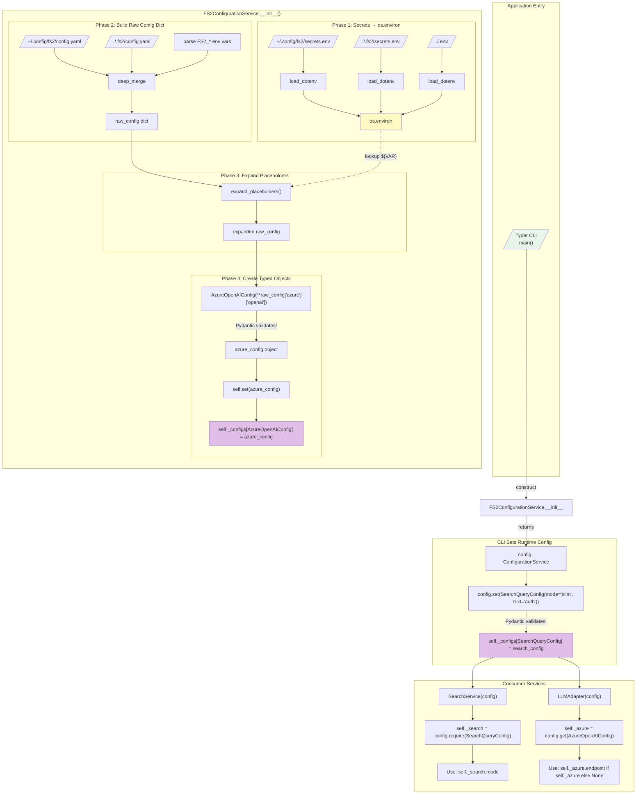
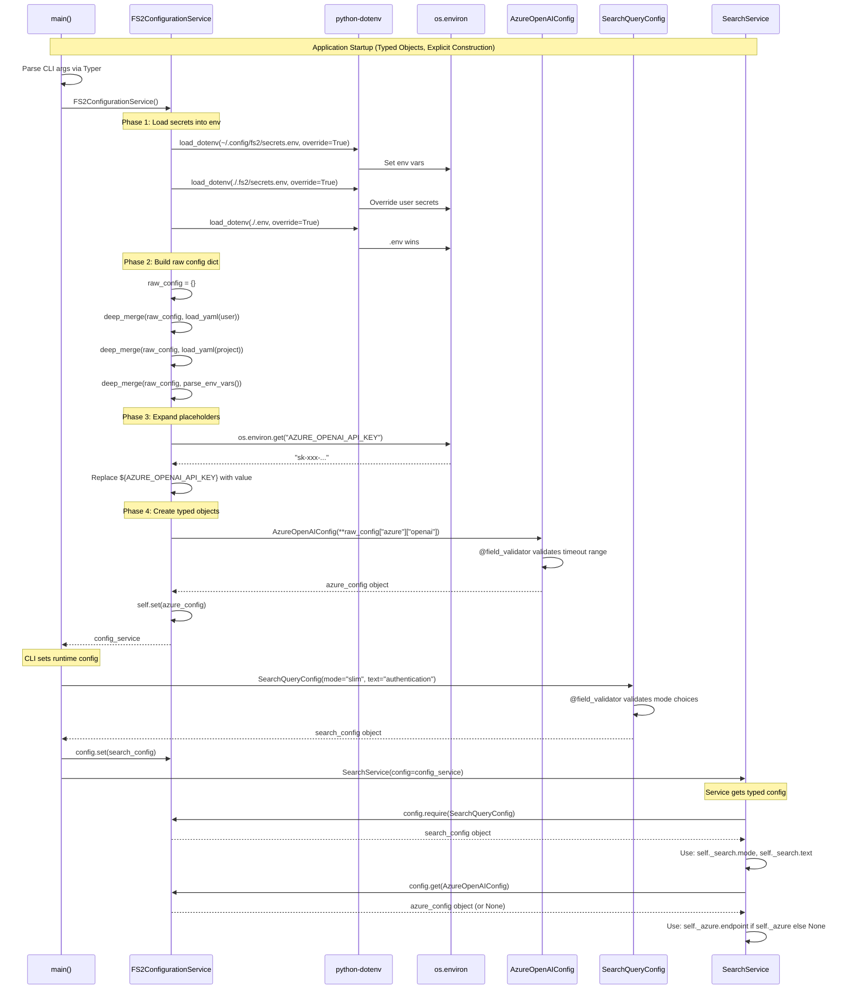
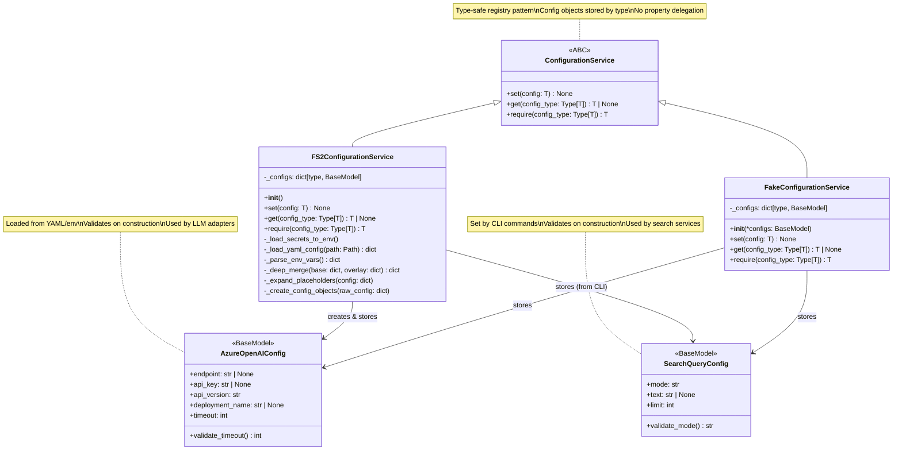

# Subtask 001: ConfigurationService with Multi-Source Loading

**Subtask Slug**: `001-subtask-configuration-service-multi-source`
**Created**: 2025-11-26
**Updated**: 2025-11-27
**Parent Plan**: [project-skele-plan.md](/workspaces/flow_squared/docs/plans/002-project-skele/project-skele-plan.md)
**Parent Phase**: Phase 1: Configuration System
**Parent Dossier**: [tasks.md](./tasks.md)

---

## Parent Context

**Parent Plan:** [View Plan](../../project-skele-plan.md)
**Parent Phase:** Phase 1: Configuration System
**Parent Task(s):** This subtask extends the completed Phase 1 configuration system
- [T007-T008: YAML Source](./tasks.md) - Extends to multi-file support
- [T010: settings_customise_sources](./tasks.md) - **REPLACED** by ConfigurationService orchestration
**Plan Task Reference:** [Phase 1 Tasks 1.7-1.10](../../project-skele-plan.md#phase-1-configuration-system)

**Why This Subtask:**
The Phase 1 configuration system is functional but too basic for production use. The current implementation relies on Pydantic-settings magic with import-time singleton creation. Production requirements demand:
1. **Explicit construction** - No import-time side effects, no singletons
2. **ConfigurationService owns the pipeline** - Orchestrates all loading, not Pydantic-settings
3. **Secrets via dotenv into os.environ** - Then `${VAR}` expansion uses environment
4. **Multi-source YAML** - User-global (`~/.config/fs2/`) and project-local (`./.fs2/`)
5. **CLI override integration** - Passed directly to ConfigurationService constructor
6. **Full DI** - Services receive ConfigurationService, never instantiate config themselves

**Created:** 2025-11-26
**Updated:** 2025-11-27 (Major architecture revision - unified typed-object config model)
**Requested By:** Development Team

---

## Architecture Decision: Unified Typed-Object Config Model

> **Key Evolution:**
> Through workshop sessions, we've moved from property delegation to a unified typed-object model.
> ALL config - whether from YAML/env or CLI - is accessed via typed Pydantic config objects.
>
> **Core Principle:** ConfigurationService is a typed object registry. Services request config by type:
> - `config.get(AzureOpenAIConfig)` - Returns Azure config (from YAML/env)
> - `config.get(SearchQueryConfig)` - Returns search config (from CLI)
> - `config.require(SomeConfig)` - Get or raise actionable error
>
> No property access like `config.azure.openai.timeout` - everything goes through typed objects.

### Loading Pipeline (FS2ConfigurationService.__init__)

```
┌─────────────────────────────────────────────────────────────┐
│           FS2ConfigurationService.__init__()                 │
│           (Loads YAML/env, creates typed objects)            │
├─────────────────────────────────────────────────────────────┤
│                                                             │
│  PHASE 1: Load secrets into os.environ (lowest → highest)   │
│  ─────────────────────────────────────────────────────────  │
│  # Load in priority order - each override=True overwrites   │
│  load_dotenv(~/.config/fs2/secrets.env, override=True)      │
│  load_dotenv(./.fs2/secrets.env, override=True)             │
│  load_dotenv(./.env, override=True)                         │
│  # .env wins over everything (standard dotenv behavior)     │
│                                                             │
│  PHASE 2: Build raw config dict (lowest → highest)          │
│  ─────────────────────────────────────────────────────────  │
│  raw_config = {}                                            │
│  deep_merge(raw_config, load_yaml(~/.config/fs2/config.yaml))│
│  deep_merge(raw_config, load_yaml(./.fs2/config.yaml))      │
│  deep_merge(raw_config, parse_env_vars(FS2_*))              │
│  # CLI sets FS2_* env vars before construction              │
│                                                             │
│  PHASE 3: Expand ${VAR} placeholders                        │
│  ─────────────────────────────────────────────────────────  │
│  expand_placeholders(raw_config)  # Modifies in-place       │
│  For each string value with ${VAR}:                         │
│    - Look up VAR in os.environ                              │
│    - If found → replace with value                          │
│    - If missing → leave unexpanded (consumer validates)     │
│                                                             │
│  PHASE 4: Create typed config objects (with validation!)    │
│  ─────────────────────────────────────────────────────────  │
│  self._configs: dict[type, BaseModel] = {}                  │
│                                                             │
│  # Azure config (if present in YAML/env)                    │
│  if "azure" in raw_config and "openai" in raw_config["azure"]:│
│      azure_cfg = AzureOpenAIConfig(**raw_config["azure"]["openai"])│
│      self.set(azure_cfg)  # Validates on construction!      │
│                                                             │
│  # Other configs from YAML...                               │
│  # (CLI configs set via config.set() after construction)    │
│                                                             │
└─────────────────────────────────────────────────────────────┘
```

### Precedence Order (Lowest → Highest Priority)

| Priority | Source | Description |
|----------|--------|-------------|
| 1 (lowest) | Config object defaults | Field defaults in Pydantic models (e.g., `timeout: int = 30`) |
| 2 | User YAML | `~/.config/fs2/config.yaml` |
| 3 | Project YAML | `./.fs2/config.yaml` |
| 4 (highest) | Environment vars | `FS2_*` from os.environ (use for CLI overrides too) |

> **CLI Overrides**: Set `FS2_*` env vars before constructing ConfigurationService.
> Example: `FS2_AZURE__OPENAI__TIMEOUT=120 fs2 serve`
>
> **Typed Objects**: After loading, create typed config objects with Pydantic validation.
> Example: `AzureOpenAIConfig(**raw_config["azure"]["openai"])`

### Secrets Precedence (Loaded into os.environ)

| Priority | Source | Description |
|----------|--------|-------------|
| 1 (lowest) | OS environment | Already set before app starts (base layer) |
| 2 | User secrets | `~/.config/fs2/secrets.env` |
| 3 | Project secrets | `./.fs2/secrets.env` |
| 4 (highest) | Working dir .env | `./.env` (wins over everything, standard dotenv behavior) |

---

## Research Findings Summary

### From py_sample_repo Analysis

1. **Placeholder Pattern**: `${ENV_VAR}` with secrets in environment - no `SecretStr` usage
2. **DI Pattern**: Services receive config via constructor injection
3. **Graceful Fallback**: Missing files return `{}`, don't crash

### From Serena Analysis

1. **XDG Paths**: `~/.serena/` with `os.environ.get('XDG_CONFIG_HOME')` fallback
2. **Factory Pattern**: `SerenaConfig.from_config_file()` with smart path resolution
3. **Project Detection**: Per-project config overrides user config

### Key Design Decisions (Updated)

| Decision | Rationale |
|----------|-----------|
| **Typed-object registry** | ConfigurationService stores config objects by type, not properties |
| **set/get/require API** | `config.get(AzureOpenAIConfig)` - explicit, type-safe access |
| **No property delegation** | Removed - all access via typed objects |
| **Pydantic validation on construction** | `AzureOpenAIConfig(**dict)` validates immediately |
| **No ValidationRule pattern** | Use Pydantic `@field_validator` decorators instead |
| **No singleton** | Explicit construction via DI, no import-time side effects |
| **Secrets into os.environ** | python-dotenv loads secrets, `${VAR}` expansion uses env |
| **XDG Base Directory** | Standard location `~/.config/fs2/` for user config |
| **CLI sets typed objects** | `config.set(SearchQueryConfig(mode=mode, text=query))` |
| **FS2_* convention only** | No manual env var mapping - `FS2_X__Y__Z` → `x.y.z` by convention |
| **`__config_path__` on objects** | Each config object declares where it lives (e.g., `"azure.openai"`) |

### Environment Variable Mapping Convention

**No manual mapping required.** The system uses a pure convention-based approach:

```
FS2_AZURE__OPENAI__TIMEOUT=120
    ^^^^^^^^^^^^^^^^^^^^^^
    │
    └── Lowercased, __ becomes . → azure.openai.timeout
```

**Convention Rules:**
1. **Prefix**: All config env vars start with `FS2_`
2. **Nesting**: Double underscore `__` = nested level (`.`)
3. **Case**: Env var is UPPER, config path is lower
4. **No mapping files**: Convention is the contract

**Examples:**
| Environment Variable | Config Path | Goes Into |
|---------------------|-------------|-----------|
| `FS2_AZURE__OPENAI__TIMEOUT` | `azure.openai.timeout` | `AzureOpenAIConfig.timeout` |
| `FS2_AZURE__OPENAI__ENDPOINT` | `azure.openai.endpoint` | `AzureOpenAIConfig.endpoint` |
| `FS2_LOGGING__LEVEL` | `logging.level` | `LoggingConfig.level` |

**Config Object Path Declaration:**
```python
class AzureOpenAIConfig(BaseModel):
    """Azure OpenAI settings."""

    __config_path__ = "azure.openai"  # Where to find this in raw_config

    endpoint: str | None = None
    api_key: str | None = None
    timeout: int = 30
```

**Loading Flow:**
```
1. FS2_AZURE__OPENAI__TIMEOUT=120 in environment
2. _parse_env_vars() → {"azure": {"openai": {"timeout": "120"}}}
3. deep_merge into raw_config
4. AzureOpenAIConfig.__config_path__ = "azure.openai"
5. data = raw_config["azure"]["openai"]
6. AzureOpenAIConfig(**data) → validates, coerces "120" to 120
```

---

## Tasks

| Status | ID | Task | CS | Type | Dependencies | Absolute Path(s) | Validation | Notes |
|--------|-----|------|-----|------|--------------|------------------|------------|-------|
| [ ] | ST001 | Write tests for XDG path resolution | 2 | Test | – | `/workspaces/flow_squared/tests/unit/config/test_config_paths.py` | Tests: XDG_CONFIG_HOME set, not set, home fallback | New file |
| [ ] | ST002 | Implement `paths.py` with XDG helpers | 2 | Core | ST001 | `/workspaces/flow_squared/src/fs2/config/paths.py` | ST001 tests pass; returns Path objects | `get_user_config_dir()`, `get_project_config_dir()` |
| [ ] | ST003 | Write tests for secrets loading into env | 2 | Test | ST002 | `/workspaces/flow_squared/tests/unit/config/test_secrets_loading.py` | Tests: user/project/dotenv loading, precedence, .env wins | New file |
| [ ] | ST004 | Implement `_load_secrets_to_env()` helper | 2 | Core | ST003 | `/workspaces/flow_squared/src/fs2/config/loaders.py` | ST003 tests pass; uses python-dotenv | Loads all secrets.env files |
| [ ] | ST005 | Write tests for YAML loading helpers | 2 | Test | ST004 | `/workspaces/flow_squared/tests/unit/config/test_yaml_loading.py` | Tests: user YAML, project YAML, missing graceful | New file |
| [ ] | ST006 | Implement `_load_yaml_config()` helpers | 2 | Core | ST005 | `/workspaces/flow_squared/src/fs2/config/loaders.py` | ST005 tests pass; returns dict or {} | Graceful on missing/invalid |
| [ ] | ST007 | Write tests for FS2_* env var parsing convention | 2 | Test | ST006 | `/workspaces/flow_squared/tests/unit/config/test_env_parsing.py` | Tests: `FS2_X__Y__Z` → `x.y.z`, case conversion, nested dict | New file |
| [ ] | ST008 | Implement `_parse_env_vars()` with convention | 2 | Core | ST007 | `/workspaces/flow_squared/src/fs2/config/loaders.py` | ST007 tests pass; `FS2_AZURE__OPENAI__TIMEOUT` → `{"azure":{"openai":{"timeout":"120"}}}` | Convention: `__` = nesting, lowercase |
| [ ] | ST009 | Write tests for deep merge utility | 2 | Test | ST008 | `/workspaces/flow_squared/tests/unit/config/test_deep_merge.py` | Tests: leaf-level merge, nested dicts, list handling | New file |
| [ ] | ST010 | Implement `_deep_merge()` utility | 2 | Core | ST009 | `/workspaces/flow_squared/src/fs2/config/loaders.py` | ST009 tests pass; recursive dict merge | Overlay wins at leaf level |
| [ ] | ST011 | Write tests for placeholder expansion | 2 | Test | ST010 | `/workspaces/flow_squared/tests/unit/config/test_placeholder_expansion.py` | Tests: expansion, missing leaves unexpanded | New file |
| [ ] | ST012 | Implement `_expand_placeholders()` | 2 | Core | ST011 | `/workspaces/flow_squared/src/fs2/config/loaders.py` | ST011 tests pass; expands or leaves unexpanded | Simple string replacement |
| [ ] | ST013 | Write tests for AzureOpenAIConfig | 2 | Test | ST012 | `/workspaces/flow_squared/tests/unit/config/test_config_objects.py` | Tests: `__config_path__="azure.openai"`, field validation, timeout range | New file |
| [ ] | ST014 | Implement AzureOpenAIConfig | 2 | Core | ST013 | `/workspaces/flow_squared/src/fs2/config/objects.py` | ST013 tests pass; `__config_path__`, timeout validator | Pydantic BaseModel |
| [ ] | ST015 | Write tests for SearchQueryConfig | 2 | Test | ST014 | `/workspaces/flow_squared/tests/unit/config/test_config_objects.py` | Tests: `__config_path__=None` (CLI-only), mode choices | Same file as ST013 |
| [ ] | ST016 | Implement SearchQueryConfig | 2 | Core | ST015 | `/workspaces/flow_squared/src/fs2/config/objects.py` | ST015 tests pass; `__config_path__=None`, mode validator | Pydantic BaseModel |
| [ ] | ST017 | Write tests for config type registry | 2 | Test | ST016 | `/workspaces/flow_squared/tests/unit/config/test_config_objects.py` | Tests: `YAML_CONFIG_TYPES` list, auto-load by `__config_path__` | Same file |
| [ ] | ST018 | Implement config type registry | 1 | Core | ST017 | `/workspaces/flow_squared/src/fs2/config/objects.py` | ST017 tests pass; `YAML_CONFIG_TYPES = [AzureOpenAIConfig]` | List of types to auto-load |
| [ ] | ST019 | Write tests for ConfigurationService ABC | 2 | Test | ST018 | `/workspaces/flow_squared/tests/unit/config/test_configuration_service.py` | Tests: set/get/require methods, type safety | New file |
| [ ] | ST020 | Implement ConfigurationService ABC | 2 | Core | ST019 | `/workspaces/flow_squared/src/fs2/config/service.py` | ST019 tests pass; generic T typing | Abstract base class |
| [ ] | ST021 | Write tests for FS2ConfigurationService | 3 | Test | ST020 | `/workspaces/flow_squared/tests/unit/config/test_configuration_service.py` | Tests: full pipeline, typed objects from `__config_path__`, get/set | Orchestration tests |
| [ ] | ST022 | Implement FS2ConfigurationService | 3 | Core | ST021 | `/workspaces/flow_squared/src/fs2/config/service.py` | ST021 tests pass; loads YAML/env, creates typed objects by `__config_path__` | The orchestrator |
| [ ] | ST023 | Write tests for FakeConfigurationService | 2 | Test | ST022 | `/workspaces/flow_squared/tests/unit/config/test_configuration_service.py` | Tests: constructor with typed objects, get/set | For DI in tests |
| [ ] | ST024 | Implement FakeConfigurationService | 2 | Core | ST023 | `/workspaces/flow_squared/src/fs2/config/service.py` | ST023 tests pass; accepts *configs in constructor | Test double |
| [ ] | ST025 | Update `__init__.py` exports | 2 | Core | ST024 | `/workspaces/flow_squared/src/fs2/config/__init__.py` | Exports ConfigurationService, config objects | Breaking change |
| [ ] | ST026 | Write tests for CLI integration pattern | 2 | Test | ST025 | `/workspaces/flow_squared/tests/unit/config/test_cli_integration.py` | Tests: CLI sets config via set(), service gets via get() | New file |
| [ ] | ST027 | Update example configs and docs | 2 | Doc | ST026 | `.fs2/config.yaml.example`, `.fs2/secrets.env.example` | Files document typed-object pattern, FS2_* convention | User-facing |
| [ ] | ST028 | Validate all tests pass with coverage | 1 | Integration | ST027 | – | `pytest tests/unit/config/ -v --cov=fs2.config --cov-fail-under=80` | Final check |

**Total Tasks**: 28
**Complexity Summary**: 23 x CS-2 + 2 x CS-3 + 3 x CS-1 = **Subtask CS-3** (medium overall)

### Parallelization Guidance

```
ST001 ──> ST002 ──┬──> ST003 ──> ST004
                 │
                 ├──> ST005 ──> ST006
                 │
                 ├──> ST007 ──> ST008
                 │
                 └──> ST009 ──> ST010
                                   │
                                   v
                ST011 ──> ST012 ──┬──> ST013 ──> ST014 ──┐
                                   │                      │
                                   └──> ST015 ──> ST016 ──┤
                                                          v
                                        ST017 ──> ST018 (registry)
                                                          │
                                                          v
                        ST019 ──> ST020 ──> ST021 ──> ST022 ──> ST023 ──> ST024
                                                                            │
                                                                            v
                                        ST025 ──> ST026 ──> ST027 ──> ST028
```

**Potential Parallelism**:
1. **After ST002**: ST003-004, ST005-006, ST007-008, ST009-010 (4 parallel tracks)
2. **After ST012**: ST013-014 and ST015-016 (2 parallel tracks for config objects)

---

## Alignment Brief

### Objective Recap

Implement a typed-object based ConfigurationService that:
1. **Typed object registry** - `config.get(TypedConfig)` instead of property access
2. **Pydantic validation** - Config objects validate on construction via `@field_validator`
3. **Explicit construction** - No singletons, no import-time side effects
4. **Loads secrets into os.environ** - Via python-dotenv, then `${VAR}` expansion
5. **Supports multi-source YAML** - User-global and project-local configs
6. **CLI integration** - `config.set(SearchQueryConfig(...))` for runtime params
7. **Clean separation** - YAML/env configs vs CLI configs, both via typed objects

### Behavior Checklist

- [ ] **No singleton**: `from fs2.config import settings` is REMOVED
- [ ] **Typed object access**: `config.get(AzureOpenAIConfig)` - no property delegation
- [ ] **set/get/require API**: Type-safe methods for config access
- [ ] **Explicit construction**: `FS2ConfigurationService()` loads YAML/env
- [ ] **XDG Compliance**: User config at `~/.config/fs2/config.yaml`
- [ ] **Project Override**: `./.fs2/config.yaml` takes precedence over user
- [ ] **Secrets to env**: All `secrets.env` files loaded via python-dotenv
- [ ] **Placeholder expansion**: `${VAR}` resolved from os.environ
- [ ] **No concept leakage**: Config doesn't know what's "required" - consumers validate
- [ ] **Pydantic validation**: Config objects validate on construction
- [ ] **CLI via set()**: `config.set(SearchQueryConfig(mode="slim"))`
- [ ] **Consumer gets config**: `self._search = config.require(SearchQueryConfig)`
- [ ] **FakeConfigurationService**: Test double accepts typed objects in constructor

### Non-Goals (Scope Boundaries)

- **NOT doing in this subtask**:
  - Remote configuration servers
  - Encrypted secrets storage (use external vault)
  - Hot-reload capability (restart required)
  - CLI argument parsing (Typer handles that)
  - Full Typer command implementation
  - Migration scripts for existing configs
  - Nested placeholder expansion (`${${VAR}}`)
  - Comprehensive config object library (only AzureOpenAIConfig + SearchQueryConfig as examples)

### Critical Findings Affecting This Subtask

| Finding | Source | Impact |
|---------|--------|--------|
| **Singleton race condition** | /didyouknow Insight #1 | Eliminated singletons entirely |
| **ConfigurationService owns pipeline** | Architecture workshop | No Pydantic-settings magic |
| **Secrets via dotenv to env** | Architecture workshop | `${VAR}` uses os.environ |
| **No concept leakage** | /didyouknow Insight #5 | Consumers validate required fields, not config |
| **XDG Pattern** | Serena analysis | `~/.config/fs2/` with XDG_CONFIG_HOME fallback |

### Invariants & Guardrails

- **Import Rule**: `fs2.config` MUST NOT import from `fs2.core`
- **No Singleton Rule**: No module-level `settings` instance
- **Path Rule**: All paths centralized in `paths.py`
- **Secrets Rule**: All secrets loaded via python-dotenv, never parsed manually
- **Test Isolation**: Use `monkeypatch` for env vars, `tmp_path` for files

### Inputs to Read

| File | Purpose |
|------|---------|
| `/workspaces/flow_squared/src/fs2/config/models.py` | Current FS2Settings (to be refactored) |
| `/workspaces/flow_squared/src/fs2/config/__init__.py` | Current exports (to be updated) |
| Phase 1 execution log | Understanding existing implementation |

---

## Visual Alignment Aids

### Flow Diagram: Typed-Object Config Pipeline



### Sequence Diagram: Typed-Object Config Flow



### Class Diagram: Typed-Object Config Architecture



---

## Test Plan (Full TDD)

**Approach**: Full TDD - Write tests FIRST (RED), implement minimal code (GREEN), refactor
**Mock Policy**: Targeted mocks (monkeypatch for env vars, tmp_path for file system)

### Test Files Structure

| Test File | Tests | Purpose |
|-----------|-------|---------|
| `test_config_paths.py` | 4-5 | XDG path resolution, home fallback |
| `test_secrets_loading.py` | 6-8 | Secrets loaded to env, precedence, .env wins |
| `test_yaml_loading.py` | 4-5 | YAML loading, missing graceful |
| `test_env_parsing.py` | 4-5 | FS2_* parsing, nested keys |
| `test_deep_merge.py` | 5-6 | Leaf-level merge, nested dicts |
| `test_placeholder_expansion.py` | 4-5 | Expansion, missing leaves unexpanded |
| `test_config_objects.py` | 8-10 | AzureOpenAIConfig, SearchQueryConfig validation |
| `test_configuration_service.py` | 10-12 | ABC, set/get/require, FS2 impl, Fake impl |
| `test_cli_integration.py` | 4-5 | CLI pattern: construct → set() → service get() |

**Total Estimated Tests**: ~50-60 tests

### Key Test Examples

```python
# tests/unit/config/test_secrets_loading.py

@pytest.mark.unit
def test_given_dotenv_file_when_loading_secrets_then_dotenv_wins(
    monkeypatch, tmp_path
):
    """.env file overrides everything (standard dotenv behavior)."""
    # Arrange: Create multiple secrets files
    user_secrets = tmp_path / ".config" / "fs2" / "secrets.env"
    user_secrets.parent.mkdir(parents=True)
    user_secrets.write_text("MY_SECRET=from_user\n")

    project_secrets = tmp_path / ".fs2" / "secrets.env"
    project_secrets.parent.mkdir(parents=True)
    project_secrets.write_text("MY_SECRET=from_project\n")

    dotenv_file = tmp_path / ".env"
    dotenv_file.write_text("MY_SECRET=from_dotenv\n")

    monkeypatch.setenv("HOME", str(tmp_path))
    monkeypatch.chdir(tmp_path)

    # Act
    from fs2.config.loaders import load_secrets_to_env
    load_secrets_to_env()

    # Assert: .env wins
    assert os.environ["MY_SECRET"] == "from_dotenv"
```

```python
# tests/unit/config/test_config_objects.py

@pytest.mark.unit
def test_given_invalid_timeout_when_constructing_azure_config_then_validation_error():
    """AzureOpenAIConfig validates timeout range on construction."""
    # Act & Assert
    with pytest.raises(ValueError) as exc_info:
        AzureOpenAIConfig(
            endpoint="https://example.openai.azure.com",
            timeout=500  # Invalid: exceeds 300
        )

    assert "Timeout must be 1-300 seconds" in str(exc_info.value)


@pytest.mark.unit
def test_given_invalid_mode_when_constructing_search_config_then_validation_error():
    """SearchQueryConfig validates mode choices on construction."""
    # Act & Assert
    with pytest.raises(ValueError) as exc_info:
        SearchQueryConfig(mode="invalid", text="query")

    assert "Mode must be: slim, normal, detailed" in str(exc_info.value)
```

```python
# tests/unit/config/test_configuration_service.py

@pytest.mark.unit
def test_given_typed_config_when_set_and_get_then_retrieves_by_type(tmp_path, monkeypatch):
    """ConfigurationService stores and retrieves typed config objects."""
    # Arrange
    monkeypatch.setenv("HOME", str(tmp_path))
    monkeypatch.chdir(tmp_path)

    from fs2.config.service import FS2ConfigurationService
    from fs2.config.objects import SearchQueryConfig

    config = FS2ConfigurationService()

    # Act: Set a typed config
    search_config = SearchQueryConfig(mode="slim", text="auth", limit=20)
    config.set(search_config)

    # Assert: Get it back by type
    retrieved = config.get(SearchQueryConfig)
    assert retrieved is not None
    assert retrieved.mode == "slim"
    assert retrieved.text == "auth"
    assert retrieved.limit == 20


@pytest.mark.unit
def test_given_missing_config_when_require_then_actionable_error():
    """ConfigurationService.require() raises actionable error if config not set."""
    # Arrange
    from fs2.config.service import FakeConfigurationService
    from fs2.config.objects import SearchQueryConfig

    config = FakeConfigurationService()  # Empty

    # Act & Assert
    with pytest.raises(MissingConfigurationError) as exc_info:
        config.require(SearchQueryConfig)

    error = exc_info.value
    assert "SearchQueryConfig" in str(error)
    assert "config.set(SearchQueryConfig(...))" in str(error)  # Actionable!
```

```python
# tests/unit/config/test_cli_integration.py

@pytest.mark.unit
def test_given_cli_flow_when_set_then_service_can_get(tmp_path, monkeypatch):
    """Full CLI integration: construct → set() → service get()."""
    # Arrange: Simulate CLI flow
    monkeypatch.setenv("HOME", str(tmp_path))
    monkeypatch.chdir(tmp_path)

    from fs2.config.service import FS2ConfigurationService
    from fs2.config.objects import SearchQueryConfig

    # Simulate CLI command
    config = FS2ConfigurationService()
    config.set(SearchQueryConfig(mode="normal", text="authentication"))

    # Act: Service consumes config
    class MockSearchService:
        def __init__(self, config):
            self._search = config.require(SearchQueryConfig)

        def execute(self):
            return f"Searching for '{self._search.text}' in {self._search.mode} mode"

    service = MockSearchService(config)

    # Assert
    assert service.execute() == "Searching for 'authentication' in normal mode"
```

---

## Commands to Run

```bash
# Activate virtual environment
cd /workspaces/flow_squared
source .venv/bin/activate

# Run specific test file during TDD
pytest tests/unit/config/test_config_paths.py -v

# Run all config tests
pytest tests/unit/config/ -v

# Run with coverage
pytest tests/unit/config/ -v --cov=fs2.config --cov-report=term-missing

# Final validation (ST026)
pytest tests/unit/config/ -v --cov=fs2.config --cov-fail-under=80
```

---

## Risks & Unknowns

| Risk | Severity | Mitigation |
|------|----------|------------|
| **Breaking change** (no singleton) | High | Clear documentation, update all examples |
| XDG path edge cases (Docker, WSL) | Medium | Test with mocked home, document container behavior |
| Circular placeholder detection | Low | Single-pass expansion, detect remaining `${` after expansion |
| python-dotenv edge cases | Low | Trust dotenv's battle-tested parsing |
| Service activation heuristics | Medium | Start simple: endpoint set → api_key required |

---

## Ready Check

- [x] All 28 tasks have clear validation criteria
- [x] Absolute paths specified for all file operations
- [x] Test file names follow pytest discovery pattern
- [x] Architecture decision documented (typed-object registry)
- [x] Singleton elimination explicitly called out
- [x] Secrets flow clarified (dotenv → os.environ → expansion)
- [x] Typed-object pattern defined (set/get/require)
- [x] Pydantic validation via @field_validator
- [x] TDD cycle explicit in task flow
- [x] Breaking changes identified
- [x] FakeConfigurationService for test DI
- [x] All diagrams updated for typed-object model
- [x] Test examples show new pattern
- [x] Config objects (AzureOpenAIConfig, SearchQueryConfig) specified
- [x] FS2_* env var convention documented (no manual mapping)
- [x] `__config_path__` pattern for auto-loading from YAML/env
- [x] `YAML_CONFIG_TYPES` registry for auto-loadable configs

**GO/NO-GO Status**: ✅ **READY FOR IMPLEMENTATION** — Comprehensive update complete

**Next Step**: Run `/plan-6-implement-phase --phase "Phase 1: Configuration System" --subtask 001-subtask-configuration-service-multi-source`

---

## Phase Footnote Stubs

> **Numbering Authority**: plan-6a-update-progress is the single source of truth for footnote numbering.

| Footnote | Tasks | Description | Date | Type |
|----------|-------|-------------|------|------|
| (populated by plan-6a-update-progress after implementation) | | | | |

---

## Evidence Artifacts

**Execution Log**: `001-subtask-configuration-service-multi-source.execution.log.md` (created by /plan-6-implement-phase)
**Status**: NOT STARTED

**Expected Files to Create**:
- `src/fs2/config/paths.py` - XDG path resolution helpers
- `src/fs2/config/loaders.py` - Loading helpers (secrets, YAML, env, merge, expand)
- `src/fs2/config/objects.py` - Typed config objects (AzureOpenAIConfig, SearchQueryConfig)
- `src/fs2/config/service.py` - ConfigurationService ABC and implementations
- `tests/unit/config/test_config_paths.py` - Path resolution tests
- `tests/unit/config/test_secrets_loading.py` - Secrets to env tests
- `tests/unit/config/test_yaml_loading.py` - YAML loading tests
- `tests/unit/config/test_env_parsing.py` - FS2_* parsing tests
- `tests/unit/config/test_deep_merge.py` - Merge utility tests
- `tests/unit/config/test_placeholder_expansion.py` - Expansion tests
- `tests/unit/config/test_config_objects.py` - Typed config object tests
- `tests/unit/config/test_configuration_service.py` - Service tests (set/get/require)
- `tests/unit/config/test_cli_integration.py` - CLI integration pattern tests
- `.fs2/secrets.env.example` - Example secrets file

**Expected Files to Modify**:
- `src/fs2/config/__init__.py` - Remove singleton, export ConfigurationService + config objects
- `.fs2/config.yaml.example` - Document typed-object pattern

---

## After Subtask Completion

**This subtask replaces/enhances:**
- Parent Phase: Phase 1: Configuration System
- Plan Tasks: 1.7-1.10 (YAML source and precedence) - **SUPERSEDED**

**When all ST### tasks complete:**

1. **Record completion** in parent execution log
2. **Update parent dossier** (tasks.md) with note about architecture change
3. **Resume main work:** Proceed to Phase 2

**Quick Links:**
- [Parent Dossier](./tasks.md)
- [Parent Plan](../../project-skele-plan.md)
- [Parent Execution Log](./execution.log.md)

---

## Critical Insights Discussion

**Session**: 2025-11-27
**Context**: ConfigurationService Multi-Source Loading Subtask Dossier
**Analyst**: AI Clarity Agent
**Reviewer**: Development Team
**Format**: Water Cooler Conversation (Insight #1 of 5 - session interrupted for architecture revision)

### Insight 1: Singleton Import Timing Race Condition

**Did you know**: The module-level `settings` singleton is instantiated at import time, creating a race condition where CLI overrides are ignored if any module imports `from fs2.config import settings` before CLI parsing completes.

**Implications**:
- CLI overrides silently ignored if imports happen in wrong order
- Order of imports becomes load-bearing (extremely fragile)
- Tests importing `settings` get stale values
- Latent bug that appears inconsistently

**Options Considered**:
- Option A: Lazy Singleton - `get_settings()` function
- Option B: Module-Level Factory with Reset
- Option C: Eliminate Singleton, Use ConfigurationService Only
- Option D: Deferred Proxy Pattern

**AI Recommendation**: Option D (Deferred Proxy Pattern)
- Reasoning: Backward compatible while solving timing issue

**Discussion Summary**:
User rejected proxy pattern complexity. Preferred explicit construction with no singleton - ConfigurationService owns the entire pipeline, constructs FS2Settings internally. Services receive config via DI, never import a global.

**Decision**: Eliminate singleton entirely. ConfigurationService owns loading pipeline. No import-time side effects. Full DI pattern.

**Action Items**:
- [x] Rewrite subtask dossier with new architecture
- [ ] Implement ConfigurationService as pipeline orchestrator
- [ ] Remove `settings` singleton from `__init__.py`
- [ ] Update all documentation

**Affects**: Entire subtask architecture - major revision

---

### Insight 2: Dotenv Override Logic Precedence

**Did you know**: The original design incorrectly stated "OS env vars always win" when using `override=True` with dotenv.

**Implications**:
- Original design would have OS env vars overwritten by .env files
- CI/CD secrets could be replaced by local dev secrets
- Debugging would be difficult

**Options Considered**:
- Option A: Snapshot and Restore Pattern
- Option B: Reverse Load Order
- Option C: Never Use override=True
- Option D: Custom Loading with Explicit Merge

**AI Recommendation**: Option A (Snapshot and Restore)
- Reasoning: Clear mental model, OS always wins

**Discussion Summary**:
User clarified that .env SHOULD win over OS env - this is standard dotenv behavior that developers expect.

**Decision**: .env wins over everything. Load order: user secrets → project secrets → .env, all with `override=True`.

**Action Items**:
- [x] Update secrets precedence table
- [x] Update loading pipeline diagram

**Affects**: ST003-ST004 (secrets loading)

---

### Insight 3: Existing Phase 1 Tests Will Break

**Did you know**: All 46 existing Phase 1 config tests will fail when FS2Settings changes from BaseSettings to BaseModel.

**Implications**:
- Tests using `from fs2.config import settings` get ImportError
- Tests expecting auto-loading get empty defaults
- Test fixtures need complete rework
- Hidden work not captured in original 23 tasks

**Options Considered**:
- Option A: Add Explicit Refactor Task
- Option B: Fold into ST013-ST014
- Option C: Deprecation Period with Compatibility Shim

**AI Recommendation**: Option A (Add Explicit Task)
- Reasoning: Honest accounting, clear scope, no hidden surprises

**Discussion Summary**:
User agreed tests must be fixed.

**Decision**: Add ST022 "Refactor existing Phase 1 tests for new architecture" (CS-3).

**Action Items**:
- [x] Add ST022 to task list
- [x] Renumber subsequent tasks

**Affects**: Task count (23 → 24), complexity summary

---

### Insight 4: CLI Override Dotted Notation

**Did you know**: The design showed `cli_overrides={"azure.openai.timeout": 40}` but no task implemented converting dotted keys to nested dicts.

**Implications**:
- Flat keys won't merge correctly with nested config
- CLI overrides would silently fail

**Options Considered**:
- Option A: Add Normalize Helper to ST018
- Option B: Add Dedicated Task
- Option C: Require Typer to Pass Nested Dict

**AI Recommendation**: Option A (Include in ST018)
- Reasoning: ConfigurationService's job to normalize inputs

**Discussion Summary**:
User clarified CLI overrides aren't needed - use `FS2_*` env vars for CLI overrides. Standard pattern, already handled.

**Decision**: Defer CLI override dict parsing. Use `FS2_AZURE__OPENAI__TIMEOUT=120 fs2 serve` pattern.

**Action Items**:
- [x] Remove `cli_overrides` parameter from ConfigurationService
- [x] Update precedence table (env vars now highest)
- [x] Update class diagram

**Affects**: ST017-ST018, ConfigurationService API

---

### Insight 5: Service Activation Detection (Replaced by Insight 6)

**Did you know**: The "service activation" logic (endpoint set → api_key required) represents concept leakage into the config system.

**Implications**:
- Config would need to understand service-specific semantics
- Violates Clean Architecture (config knows about LLM adapters)
- Makes config system harder to maintain/extend

**Options Considered**:
- Option A: Simple Rule - Endpoint Only
- Option B: Field Metadata Approach
- Option C: Explicit Activation Config

**AI Recommendation**: Option A (Simple Rule)
- Reasoning: YAGNI, clear mental model

**Discussion Summary**:
User strongly rejected all options. Config system should NOT have any service-activation logic. Consumers (e.g., LLMAdapter) validate their own required fields and raise actionable errors.

**Decision**: Remove service activation concept entirely. Config just loads values. Consumers validate their own requirements.

**Action Items**:
- [x] Update placeholder expansion (missing → leave unexpanded)
- [x] Remove service-activation language from dossier
- [x] Add "No concept leakage" to behavior checklist
- [x] Simplify ST011/ST012 (CS-3 → CS-2)

**Affects**: ST011-ST012, behavior checklist, architectural invariants

---

### Insight 6: Unified Typed-Object Model (REPLACES ValidationRule Pattern)

**Did you know**: The ValidationRule pattern (Insight 6 from original discussion) has been completely replaced by a unified typed-object model using Pydantic.

**Resolution**: ALL config - whether from YAML/env or CLI - is accessed via typed Pydantic config objects.

**New Pattern**:
```python
# Config object with Pydantic validation
class SearchQueryConfig(BaseModel):
    mode: str = "normal"
    text: str | None = None
    limit: int = 10

    @field_validator("mode")
    @classmethod
    def validate_mode(cls, v):
        if v not in ("slim", "normal", "detailed"):
            raise ValueError("Mode must be: slim, normal, detailed")
        return v

# CLI sets typed object
@app.command()
def query(query: str, mode: str = "normal", limit: int = 10):
    config = FS2ConfigurationService()  # Loads YAML/env
    config.set(SearchQueryConfig(mode=mode, text=query, limit=limit))  # Validates!
    SearchService(config=config).execute()

# Service gets typed object
class SearchService:
    def __init__(self, config: ConfigurationService):
        self._config = config
        self._search = config.require(SearchQueryConfig)  # Fail fast

    def execute(self):
        # Use validated fields
        mode = self._search.mode
        text = self._search.text
```

**Benefits**:
- Single pattern for all config (YAML/env and CLI)
- Pydantic handles all validation (field_validator)
- Type-safe access (no magic strings)
- Self-documenting config objects
- Fail-fast on construction (validation happens at set() time)

**Action Items**:
- [x] Replace ValidationRule with typed config objects
- [x] Update tasks to reflect new pattern
- [x] Update test examples
- [x] Update class diagram

**Affects**: Entire subtask - unified architecture

---

## Session Summary

**Architecture Evolution**: Multiple workshop sessions leading to unified typed-object model

**Key Insights**: 6 critical insights identified and resolved
**Decisions Made**: Moved from property delegation → typed-object registry pattern
**Major Changes**:
- Replaced property access with set/get/require API
- Replaced ValidationRule with Pydantic @field_validator
- Added typed config objects (AzureOpenAIConfig, SearchQueryConfig)
- Updated all diagrams (flow, sequence, class)
- Revised task list (24 → 26 tasks)

**Shared Understanding Achieved**: ✓

**Confidence Level**: High - Unified pattern, clear boundaries, type-safe

**Next Steps**:
Proceed with implementation: `/plan-6-implement-phase --subtask 001-subtask-configuration-service-multi-source`

---

## Directory Layout

```
docs/plans/002-project-skele/
├── project-skele-spec.md
├── project-skele-plan.md
└── tasks/
    ├── phase-0-project-structure/
    │   ├── tasks.md
    │   └── execution.log.md
    └── phase-1-configuration-system/
        ├── tasks.md                                          # Parent dossier
        ├── execution.log.md                                  # Phase 1 log
        ├── 001-subtask-configuration-service-multi-source.md # THIS FILE
        └── 001-subtask-configuration-service-multi-source.execution.log.md  # Created by plan-6
```
