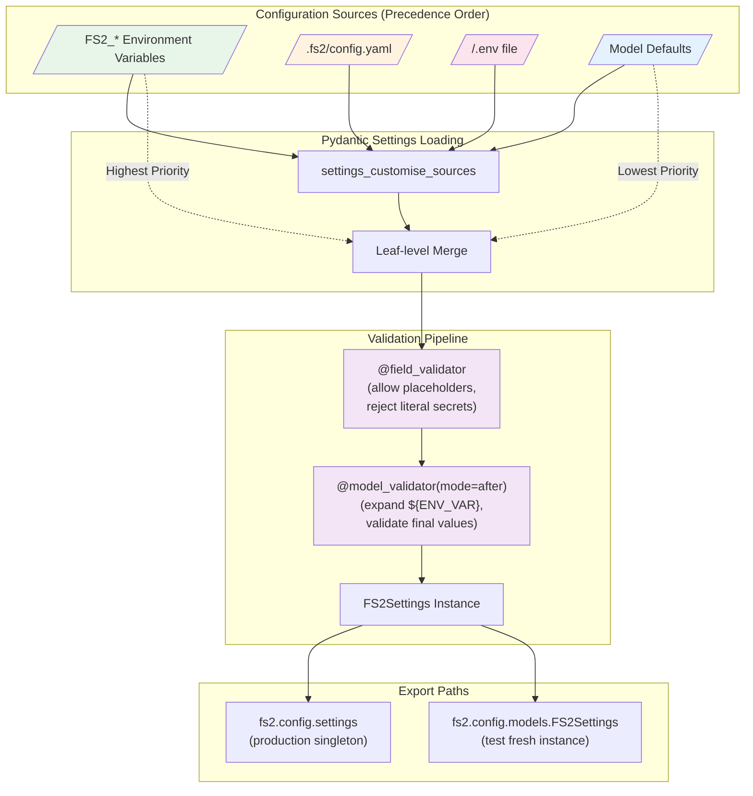
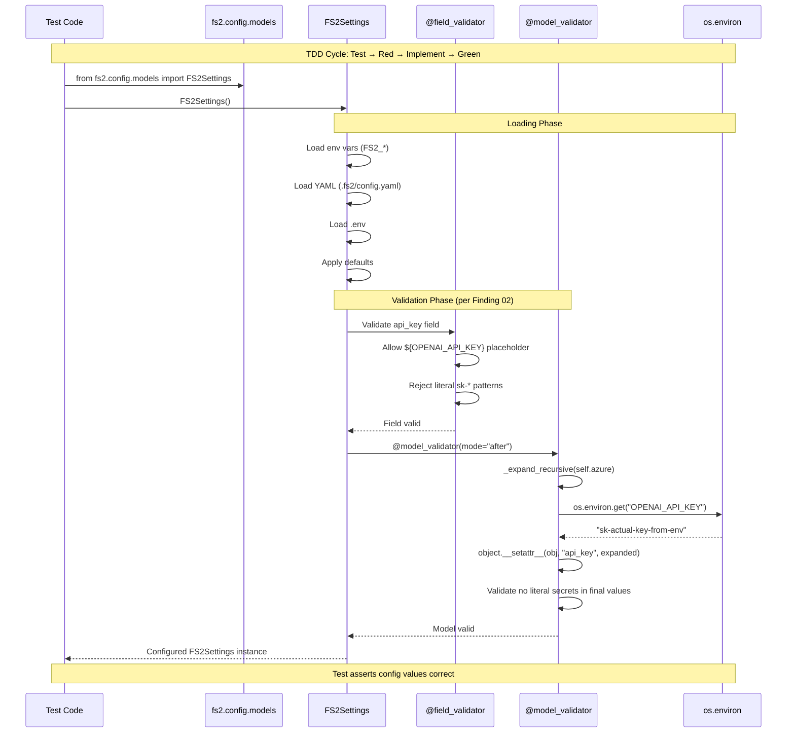
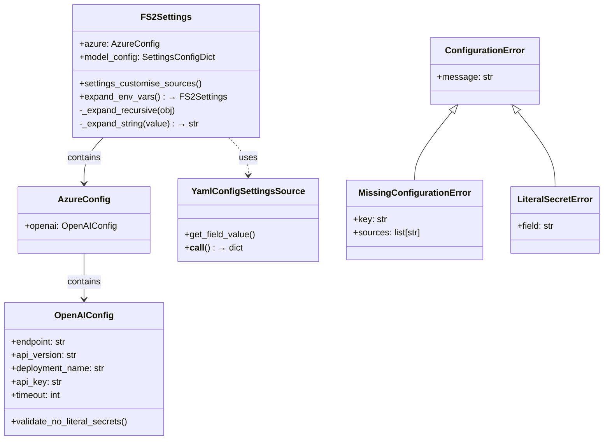

# Phase 1: Configuration System — Tasks + Alignment Brief

**Phase Slug**: `phase-1-configuration-system`
**Created**: 2025-11-26
**Spec**: [project-skele-spec.md](/workspaces/flow_squared/docs/plans/002-project-skele/project-skele-spec.md)
**Plan**: [project-skele-plan.md](/workspaces/flow_squared/docs/plans/002-project-skele/project-skele-plan.md)
**Plan Tasks**: 1.1–1.22

---

## Tasks

| Status | ID | Task | CS | Type | Dependencies | Absolute Path(s) | Validation | Subtasks | Notes |
|--------|-----|------|-----|------|--------------|------------------|------------|----------|-------|
| [x] | T001 | Write tests for FS2Settings basic loading with defaults | 2 | Test | – | `/workspaces/flow_squared/tests/unit/config/test_config_models.py` | Tests fail (RED), cover: FS2Settings instantiation, default values | – | TDD step 1; Plan 1.1 | [^7] log#phase-1-complete |
| [x] | T002 | Implement FS2Settings BaseSettings class with model_config | 2 | Core | T001 | `/workspaces/flow_squared/src/fs2/config/models.py` | T001 tests pass (GREEN); SettingsConfigDict with env_prefix, delimiter | – | Per Finding 04; Plan 1.2 | [^7] log#phase-1-complete |
| [x] | T003 | Write tests for nested config structure (azure.openai.*) | 2 | Test | T002 | `/workspaces/flow_squared/tests/unit/config/test_nested_config.py` | Tests fail (RED), cover: nested attribute access | – | TDD step 1; Plan 1.3 | [^7] log#phase-1-complete |
| [x] | T004 | Implement nested BaseModel classes (OpenAIConfig, AzureConfig) | 2 | Core | T003 | `/workspaces/flow_squared/src/fs2/config/models.py` | T003 tests pass (GREEN) | – | Nested structure; Plan 1.4 | [^7] log#phase-1-complete |
| [x] | T005 | Write tests for env var precedence over defaults | 2 | Test | T004 | `/workspaces/flow_squared/tests/unit/config/test_config_precedence.py` | Tests fail (RED), cover: FS2_* env vars override defaults | – | TDD step 1; Plan 1.5 | [^7] log#phase-1-complete |
| [x] | T006 | Implement env var loading with FS2_ prefix and __ delimiter | 2 | Core | T005 | `/workspaces/flow_squared/src/fs2/config/models.py` | T005 tests pass (GREEN) | – | Per Finding 04; Plan 1.6 | [^7] log#phase-1-complete |
| [x] | T007 | Write tests for YAML config source | 2 | Test | T006 | `/workspaces/flow_squared/tests/unit/config/test_yaml_source.py` | Tests fail (RED), cover: YAML loading, missing file graceful | – | TDD step 1; Plan 1.7 | [^7] log#phase-1-complete |
| [x] | T008 | Implement YamlConfigSettingsSource (custom PydanticBaseSettingsSource) | 3 | Core | T007 | `/workspaces/flow_squared/src/fs2/config/models.py` | T007 tests pass (GREEN) | – | Per py_sample_repo pattern; Plan 1.8 | [^7] log#phase-1-complete |
| [x] | T009 | Write tests for full precedence order (env > YAML > .env > defaults) | 2 | Test | T008 | `/workspaces/flow_squared/tests/unit/config/test_config_precedence.py` | Tests fail (RED), cover: all 4 sources in order | – | TDD step 1; Plan 1.9 | [^7] log#phase-1-complete |
| [x] | T010 | Implement settings_customise_sources with correct order | 2 | Core | T009 | `/workspaces/flow_squared/src/fs2/config/models.py` | T009 tests pass (GREEN) | – | Plan 1.10 | [^7] log#phase-1-complete |
| [x] | T011 | Write tests for leaf-level override behavior | 2 | Test | T010 | `/workspaces/flow_squared/tests/unit/config/test_config_precedence.py` | Tests fail (RED), cover: partial nested override preserves sibling fields | – | Per Finding 08; Plan 1.11 | [^7] log#phase-1-complete |
| [x] | T012 | Validate leaf-level merge behavior (no new code if T010 already handles) | 1 | Core | T011 | – | T011 tests pass (GREEN) | – | Plan 1.12 | [^7] log#phase-1-complete |
| [x] | T013 | Write tests for placeholder expansion ${ENV_VAR} | 2 | Test | T012 | `/workspaces/flow_squared/tests/unit/config/test_env_expansion.py` | Tests fail (RED), cover: ${VAR} expands, missing raises | – | TDD step 1; Plan 1.13 | [^7] log#phase-1-complete |
| [x] | T014 | Implement recursive placeholder expansion in @model_validator | 3 | Core | T013 | `/workspaces/flow_squared/src/fs2/config/models.py` | T013 tests pass (GREEN) | – | Per Finding 10; Plan 1.14 | [^7] log#phase-1-complete |
| [x] | T015 | Write tests for literal secret detection (sk-*, 64+ char rejection) | 2 | Test | T014 | `/workspaces/flow_squared/tests/unit/config/test_security_validation.py` | Tests fail (RED), cover: literal secrets rejected | – | TDD step 1; Plan 1.15 | [^7] log#phase-1-complete |
| [x] | T016 | Implement security field_validators (two-stage validation) | 2 | Core | T015 | `/workspaces/flow_squared/src/fs2/config/models.py` | T015 tests pass (GREEN) | – | Per Finding 02; Plan 1.16 | [^7] log#phase-1-complete |
| [x] | T017 | Write tests for ConfigurationError actionable messages | 2 | Test | T016 | `/workspaces/flow_squared/tests/unit/config/test_config_errors.py` | Tests fail (RED), cover: errors include fix instructions | – | TDD step 1; Plan 1.17 | [^7] log#phase-1-complete |
| [x] | T018 | Implement ConfigurationError hierarchy (MissingConfigurationError, LiteralSecretError) | 2 | Core | T017 | `/workspaces/flow_squared/src/fs2/config/exceptions.py` | T017 tests pass (GREEN) | – | Per Finding 05; Plan 1.18 | [^7] log#phase-1-complete |
| [x] | T019 | Write tests for singleton vs fresh instance import paths | 2 | Test | T018 | `/workspaces/flow_squared/tests/unit/config/test_singleton_pattern.py` | Tests fail (RED), cover: import path isolation | – | Per Finding 01; Plan 1.19 | [^7] log#phase-1-complete |
| [x] | T020 | Implement singleton in __init__.py with dual import path | 1 | Core | T019 | `/workspaces/flow_squared/src/fs2/config/__init__.py` | T019 tests pass (GREEN) | – | Per Finding 01; Plan 1.20 | [^7] log#phase-1-complete |
| [x] | T021 | Create .fs2/config.yaml example with comments | 1 | Doc | T020 | `/workspaces/flow_squared/.fs2/config.yaml.example` | File exists with documented structure | – | Plan 1.21 | [^7] log#phase-1-complete |
| [x] | T022 | Validate all Phase 1 tests pass with coverage check | 1 | Integration | T021 | – | `pytest tests/unit/config/ -v --cov=fs2.config --cov-fail-under=80` exits 0 | – | Final validation; Plan 1.22 | [^7] log#phase-1-complete |

**Total Tasks**: 22
**Complexity Summary**: 16 × CS-2 (small) + 4 × CS-3 (medium) + 2 × CS-1 (trivial) = **Phase CS-3** (medium overall)

### Active Subtasks

| Subtask ID | Status | Description |
|------------|--------|-------------|
| [001-subtask-configuration-service-multi-source](./001-subtask-configuration-service-multi-source.md) | Pending | Multi-source config loading (XDG paths), secrets separation, injectable ConfigurationService |

### Parallelization Guidance

```
Note: TDD approach requires sequential test→impl pairs. Limited parallelism.

T001 ──> T002 ──> T003 ──> T004 ──> T005 ──> T006 ──> T007 ──> T008
                                                               │
                                                               v
T009 ──> T010 ──> T011 ──> T012 ──> T013 ──> T014 ──> T015 ──> T016
                                                               │
                                                               v
                                    T017 ──> T018 ──> T019 ──> T020 ──> T021 ──> T022
```

**Sequential Nature**: TDD requires test-first, then implementation. Each test→impl pair must complete before the next.

**Potential Parallelism**:
- T021 (example config) can start after T008 (YAML source implemented)
- T017-T018 (error hierarchy) can proceed while T019-T020 (singleton) are independent features

---

## Alignment Brief

### Prior Phases Review

#### Phase 0: Project Structure & Dependencies — Summary

**Executed**: 2025-11-26
**Status**: COMPLETE (19/19 tasks)
**Approach**: Lightweight (validation via commands)

##### A. Deliverables Created

| Deliverable | Path | Purpose |
|-------------|------|---------|
| Package root | `/workspaces/flow_squared/src/fs2/__init__.py` | Root importable package |
| Config package | `/workspaces/flow_squared/src/fs2/config/__init__.py` | Configuration system home (Phase 1 target) |
| Core packages | `/workspaces/flow_squared/src/fs2/core/{models,services,adapters,repos}/__init__.py` | Clean Architecture layers |
| CLI package | `/workspaces/flow_squared/src/fs2/cli/__init__.py` | Presentation layer |
| Protocols stubs | `/workspaces/flow_squared/src/fs2/core/{adapters,repos}/protocols.py` | ABC interface placeholders with docstrings |
| Test structure | `/workspaces/flow_squared/tests/{unit/{config,adapters,services},scratch,docs}/` | Test organization |
| Build config | `/workspaces/flow_squared/pyproject.toml` | Dependencies, hatchling build |
| Test config | `/workspaces/flow_squared/pytest.ini` | Markers: unit, integration, docs |
| Fixtures | `/workspaces/flow_squared/tests/conftest.py` | Shared pytest configuration |

##### B. Lessons Learned

1. **Package structure matters**: `src/fs2/` layout prevents namespace conflicts vs bare `src/`
2. **Dev dependencies explicit**: `uv sync --extra dev` required for pytest
3. **Validation scope**: Import all subpackages, not just root

##### C. Technical Discoveries

- **pytest exit code 5**: Expected when no tests collected (empty suite)
- **hatchling build**: `packages = ["src/fs2"]` for proper wheel builds
- **Marker registration**: pytest.ini markers immediately visible

##### D. Dependencies Exported to Phase 1

| Export | Location | Used By |
|--------|----------|---------|
| `fs2.config` package | `src/fs2/config/__init__.py` | T020 (singleton export) |
| tests/unit/config/ directory | `tests/unit/config/` | All test tasks (T001-T019) |
| tests/conftest.py | `tests/conftest.py` | Shared fixtures, pytest_configure |
| pyproject.toml deps | `pyproject.toml` | pydantic-2.12.4, pydantic-settings-2.12.0 |
| pytest markers | `pytest.ini` | `@pytest.mark.unit` for config tests |

##### E. Critical Findings Applied in Phase 0

| Finding | Action Taken |
|---------|--------------|
| Finding 09 (Module Structure) | Created `src/fs2/{cli,core/{models,services,adapters,repos},config}/` hierarchy |
| Finding 12 (Pytest Fixtures) | Created `tests/conftest.py` with markers; test structure mirrors domain |

##### F. Incomplete/Blocked Items

None. All 19 tasks completed.

##### G. Test Infrastructure Created

- `tests/conftest.py` with `pytest_configure()` hook
- pytest markers: `unit`, `integration`, `docs`
- Test directories: `tests/unit/config/`, `tests/unit/adapters/`, `tests/unit/services/`

##### H. Technical Debt

None introduced. Clean scaffold.

##### I. Architectural Decisions

- **src/fs2/ layout**: Named package under src/ for proper namespace isolation
- **protocols.py stubs**: Placeholder files with architecture guidance docstrings

##### J. Scope Changes

None. Phase 0 executed as planned.

##### K. Key Log References

- [execution.log.md](/workspaces/flow_squared/docs/plans/002-project-skele/tasks/phase-0-project-structure/execution.log.md) § Evidence
- Footnotes [^1]-[^6] in plan document

---

### Objective Recap

Implement a Pydantic-settings configuration system with:
1. Multi-source precedence (env → YAML → .env → defaults)
2. Nested configuration (`settings.azure.openai.endpoint`)
3. Runtime placeholder expansion (`${ENV_VAR}`)
4. Security validation (literal secret rejection)
5. Actionable error messages with fix instructions
6. Singleton pattern with test isolation via dual import paths

### Behavior Checklist (mapped to AC)

- [ ] **AC6**: Precedence order: env vars → YAML → .env → defaults
- [ ] **AC6**: Nested config accessible via `settings.section.subsection.key`
- [ ] **AC6**: Environment variables use `FS2_` prefix with `__` delimiter
- [ ] **AC6**: YAML file at `.fs2/config.yaml` is optional (graceful fallback)
- [ ] **AC6**: Placeholder expansion `${ENV_VAR}` works in YAML values
- [ ] **AC6**: Literal secrets rejected before placeholder expansion
- [ ] **AC9**: ConfigurationError messages include fix instructions
- [ ] **AC9**: Test coverage > 80% for config module

### Non-Goals (Scope Boundaries)

❌ **NOT doing in this phase**:
- CLI module implementation (Phase 5)
- ABC interface definitions for adapters (Phase 2)
- Logger adapter implementation (Phase 3)
- Canonical documentation test (Phase 4)
- Justfile commands (Phase 5)
- Production-ready YAML schema (only example file)
- Migration from any existing config system (greenfield)
- Thread-safe singleton patterns (single-threaded POC)
- Config hot-reload capability (restart required)
- Encrypted secrets support (use env vars or vault)
- Remote config sources (local files only)

### Critical Findings Affecting This Phase

| Finding | Title | Constraint/Requirement | Addressed By |
|---------|-------|----------------------|--------------|
| **01** | Singleton Config + Test Isolation | Dual import paths: `from fs2.config import settings` (singleton) vs `from fs2.config.models import FS2Settings` (fresh) | T019, T020 |
| **02** | Validator Execution Order | `@field_validator` runs BEFORE `@model_validator(mode="after")`; allow placeholders in field validators, expand in model validator | T015, T016 |
| **04** | Double-Underscore Delimiter | Use `env_nested_delimiter='__'` not `_`; env prefix `FS2_` must be UPPERCASE with trailing underscore | T002, T006 |
| **05** | Custom ConfigurationError | Errors must include actionable guidance (which env var to set, which file to edit) | T017, T018 |
| **08** | Leaf-Level Override | Env var overrides single field, not entire section; test explicitly | T011, T012 |
| **10** | Recursive Placeholder Expansion | Use `object.__setattr__()` and recurse into nested BaseModel fields | T013, T014 |
| **11** | Config Must NOT Import Core | Zero imports from `fs2.core.*` in config module; use `print()` for config-time logging | All config tasks |
| **12** | Pytest Fixtures Mirror Domain | Shared fixtures in conftest.py; test-specific fixtures in test files | All test tasks |

### ADR Decision Constraints

**N/A** — No ADRs exist for this project.

### Invariants & Guardrails

- **Import Rule**: `fs2.config` MUST NOT import from `fs2.core` (Finding 11)
- **Security Rule**: Literal API keys (sk-*, 64+ chars) MUST be rejected with actionable error
- **Test Isolation**: Each test gets fresh FS2Settings instance via `from fs2.config.models import FS2Settings`
- **Memory Budget**: Config object < 1MB (no large default blobs)
- **Startup Time**: Config loading < 100ms on SSD

### Inputs to Read

| File | Purpose |
|------|---------|
| `/workspaces/flow_squared/docs/plans/002-project-skele/project-skele-spec.md` § AC6 | Configuration system requirements |
| `/workspaces/flow_squared/docs/plans/002-project-skele/project-skele-plan.md` § Phase 1 | Task definitions, test examples |
| `/workspaces/flow_squared/docs/plans/002-project-skele/project-skele-plan.md` § Critical Findings 01,02,04,05,08,10,11 | Implementation constraints |
| `/workspaces/flow_squared/src/fs2/config/__init__.py` | Current package state (empty) |
| `/workspaces/flow_squared/tests/conftest.py` | Existing pytest configuration |

### Visual Alignment Aids

#### Flow Diagram: Configuration Loading Pipeline



#### Sequence Diagram: Config Loading with Placeholder Expansion



#### Class Diagram: Configuration Model Structure



### Test Plan (Full TDD per spec)

**Approach**: Full TDD — Write tests FIRST (RED), implement minimal code (GREEN), refactor
**Mock Policy**: Targeted mocks (monkeypatch for env vars allowed); prefer Fakes over mocks

#### Test Files Structure

| Test File | Tests | Purpose |
|-----------|-------|---------|
| `test_config_models.py` | 3-4 | Basic FS2Settings instantiation, type validation, BaseSettings inheritance |
| `test_nested_config.py` | 3-4 | Nested attribute access (azure.openai.*), double-underscore parsing |
| `test_config_precedence.py` | 5-6 | Env > YAML > .env > defaults, leaf-level override |
| `test_yaml_source.py` | 3-4 | YAML loading, missing file graceful, invalid YAML error |
| `test_env_expansion.py` | 5-6 | ${VAR} expansion, missing var error, partial expansion, **type preservation** (per Insight #1 decision) |
| `test_security_validation.py` | 3-4 | Literal secret rejection (sk-*, 64+ char), placeholder allowed |
| `test_config_errors.py` | 3-4 | Actionable messages, MissingConfigurationError, LiteralSecretError |
| `test_singleton_pattern.py` | 2-3 | Singleton import path, fresh instance import path |

**Total Estimated Tests**: ~28-34 tests

#### Key Test Examples (from Plan)

```python
# tests/unit/config/test_config_precedence.py

@pytest.mark.unit
def test_given_env_var_when_loading_config_then_env_overrides_default(monkeypatch):
    """
    Purpose: Proves environment variables take precedence over defaults
    Quality Contribution: Prevents production misconfigurations
    Acceptance Criteria:
    - Default timeout is 30
    - FS2_AZURE__OPENAI__TIMEOUT=60 overrides to 60
    """
    # Arrange
    monkeypatch.setenv('FS2_AZURE__OPENAI__TIMEOUT', '60')

    # Act
    from fs2.config.models import FS2Settings
    config = FS2Settings()

    # Assert
    assert config.azure.openai.timeout == 60


@pytest.mark.unit
def test_given_yaml_and_env_when_loading_then_env_wins_leaf_level(monkeypatch, tmp_path):
    """
    Purpose: Proves leaf-level override (not atomic section replacement)
    Quality Contribution: Catches precedence bugs early
    Acceptance Criteria:
    - YAML has endpoint=yaml-ep, timeout=30
    - ENV has endpoint=env-override
    - Result: endpoint=env-override, timeout=30 (not lost!)
    """
    # Arrange
    yaml_content = """
    azure:
      openai:
        endpoint: yaml-ep
        timeout: 30
    """
    config_dir = tmp_path / ".fs2"
    config_dir.mkdir()
    config_file = config_dir / "config.yaml"
    config_file.write_text(yaml_content)

    monkeypatch.setenv('FS2_AZURE__OPENAI__ENDPOINT', 'env-override')
    monkeypatch.chdir(tmp_path)

    # Act
    from fs2.config.models import FS2Settings
    config = FS2Settings()

    # Assert
    assert config.azure.openai.endpoint == 'env-override'
    assert config.azure.openai.timeout == 30  # Preserved from YAML!
```

```python
# tests/unit/config/test_config_errors.py

@pytest.mark.unit
def test_given_literal_secret_when_loading_then_raises_actionable_error():
    """
    Purpose: Proves literal secrets are rejected with helpful message
    Quality Contribution: Prevents secrets in config files
    """
    from fs2.config.models import FS2Settings
    from fs2.config.exceptions import LiteralSecretError
    import pytest

    with pytest.raises(LiteralSecretError) as exc_info:
        FS2Settings(azure={"openai": {"api_key": "sk-1234567890abcdef"}})

    assert "Use placeholder" in str(exc_info.value)
    assert "${" in str(exc_info.value)
```

#### Non-Happy-Path Coverage Checklist

- [ ] Missing YAML file → returns {} (graceful)
- [ ] Invalid YAML syntax → raises ConfigurationError
- [ ] Circular placeholder references → detected and rejected
- [ ] Missing env var in placeholder → raises with actionable message
- [ ] Empty config values → validated appropriately
- [ ] Case sensitivity in nested keys → tested per Pydantic behavior

### Step-by-Step Implementation Outline

| Step | Tasks | Action |
|------|-------|--------|
| 1 | T001-T002 | Basic FS2Settings with model_config |
| 2 | T003-T004 | Nested BaseModel classes |
| 3 | T005-T006 | Env var loading with FS2_ prefix |
| 4 | T007-T008 | YamlConfigSettingsSource |
| 5 | T009-T010 | settings_customise_sources |
| 6 | T011-T012 | Leaf-level override validation |
| 7 | T013-T014 | Placeholder expansion |
| 8 | T015-T016 | Security validators |
| 9 | T017-T018 | ConfigurationError hierarchy |
| 10 | T019-T020 | Singleton pattern |
| 11 | T021 | Example config file |
| 12 | T022 | Final validation with coverage |

### Commands to Run

```bash
# Activate virtual environment
cd /workspaces/flow_squared
source .venv/bin/activate

# Run specific test file during TDD
pytest tests/unit/config/test_config_models.py -v

# Run all config tests
pytest tests/unit/config/ -v

# Run with coverage
pytest tests/unit/config/ -v --cov=fs2.config --cov-report=term-missing

# Final validation (T022)
pytest tests/unit/config/ -v --cov=fs2.config --cov-fail-under=80

# Lint config module
ruff check src/fs2/config/

# Type check (if pyright installed)
# pyright src/fs2/config/
```

### Implementation Reference: py_sample_repo Patterns

The FlowSpace py_sample_repo provides authoritative patterns for this implementation:

#### YamlConfigSettingsSource Pattern
```python
# Reference: class:src/config/models.py:YamlConfigSettingsSource
class YamlConfigSettingsSource(PydanticBaseSettingsSource):
    """Custom settings source to load from .fs2/config.yaml."""

    def get_field_value(self, field_name: str, field_info: Any) -> tuple[Any, str, bool]:
        return None, field_name, False  # Placeholder, not used

    def __call__(self) -> Dict[str, Any]:
        """Load YAML config file if it exists."""
        config_path = Path(".fs2/config.yaml")
        if not config_path.exists():
            return {}
        try:
            with open(config_path) as f:
                return yaml.safe_load(f) or {}
        except yaml.YAMLError:
            return {}  # Graceful fallback
```

#### Recursive Placeholder Expansion Pattern
```python
# Reference: method:src/config/models.py:MAFSettings._expand_recursive
@staticmethod
def _expand_recursive(obj: Any) -> None:
    """Recursively expand ${ENV_VAR} placeholders in nested objects."""
    for field_name, field_value in vars(obj).items():
        if isinstance(field_value, str):
            expanded = MAFSettings._expand_string(field_value)
            object.__setattr__(obj, field_name, expanded)
        elif isinstance(field_value, BaseModel):
            MAFSettings._expand_recursive(field_value)
```

#### Security Validation Pattern
```python
# Reference: method:src/config/models.py:OpenAIConfig.validate_no_literal_secrets
@field_validator('api_key')
@classmethod
def validate_no_literal_secrets(cls, v: Optional[str]) -> Optional[str]:
    """Security validation: Reject literal secrets in config files."""
    if v is None or not v:
        return v
    # Allow ${ENV_VAR} placeholders
    if re.match(r'^\$\{.*\}$', v):
        return v
    # Reject known secret patterns
    if v.startswith('sk-') or len(v) > 64:
        raise ValueError("Use placeholder: ${OPENAI_API_KEY}")
    return v
```

### Risks & Unknowns

| Risk | Severity | Mitigation |
|------|----------|------------|
| Pydantic-settings API mismatch | Medium | Reference py_sample_repo patterns; use pydantic-settings 2.12.0 |
| Precedence bugs | High | Comprehensive TDD per source; explicit leaf-level tests |
| Validator order issues | High | Two-stage validation pattern per Finding 02 |
| YAML parsing edge cases | Low | Use yaml.safe_load; graceful fallback to {} |
| Test isolation pollution | Medium | Always use fresh instances via models.py import |

---

## Critical Insights Discussion

**Session**: 2025-11-26
**Context**: Phase 1 Configuration System tasks dossier pre-implementation review
**Analyst**: AI Clarity Agent
**Reviewer**: Development Team
**Format**: Water Cooler Conversation (5 Critical Insights)

### Insight 1: Type Coercion vs Placeholder Expansion

**Did you know**: Placeholders like `${FS2_TIMEOUT}` in non-string fields will fail Pydantic validation BEFORE the model validator can expand them—this is **by design** in the py_sample_repo pattern.

**Implications**:
- `_expand_recursive()` only operates on string fields: `if isinstance(field_value, str)`
- Typed fields (int, bool, float) must use direct env var override, not YAML placeholders
- Pydantic-settings handles type coercion: `"60"` (string env var) → `60` (int field)

**Options Considered**:
- Option A: Document String-Only Placeholders - CS-1 (trivial)
- Option B: Pre-expand in YamlConfigSettingsSource - CS-3 (medium)
- Option C: Use `str` Types with Post-Validators - CS-2 (small)
- Option D: Environment Variable Override Pattern - CS-1 (trivial)

**AI Recommendation**: Option D - Environment Variable Override Pattern
- Reasoning: This is exactly how py_sample_repo handles it (see `test_expansion_preserves_types`). Proven pattern with clear separation: string fields use YAML placeholders, typed fields use env var overrides.

**Discussion Summary**:
Investigated py_sample_repo implementation. Found explicit test confirming typed fields don't need expansion—they receive values directly from env vars with Pydantic handling coercion.

**Decision**: Follow py_sample_repo pattern (Option D)

**Action Items**:
- [x] Add `test_expansion_preserves_types` style test to T013 validation criteria
- [x] Document limitation in example config file (T021)
- [x] Update test count in test plan table

**Affects**: T013, T014 (placeholder expansion), T021 (example config)

---

### Insight 2: Test Isolation via Import Path is a Hidden Footgun

**Did you know**: A single accidental import of `from fs2.config import settings` anywhere in test code—including `conftest.py`, fixtures, or transitive imports—will silently create the singleton and pollute your entire test suite?

**Implications**:
- Singleton is created at import time with whatever env vars exist then
- Pytest collects tests and imports `conftest.py` first
- Tests pass in isolation but fail randomly in full suite runs
- No enforcement mechanism exists in base pattern

**Options Considered**:
- Option A: Documentation Only - CS-1 (trivial)
- Option B: Test-Time Warning in conftest.py - CS-2 (small)
- Option C: Lazy Singleton with Cache Clear - CS-3 (medium)
- Option D: Import Guard in Tests Directory - CS-2 (small)

**AI Recommendation**: Option B - Test-Time Warning + Documentation
- Reasoning: Non-invasive, educational, catches accidental violations without changing production semantics.

**Discussion Summary**:
User confirmed Option B. Warning in `pytest_configure` will alert developers if singleton was imported before tests run.

**Decision**: Add singleton import warning to `tests/conftest.py`

**Action Items**:
- [ ] Add `pytest_configure` warning check to conftest.py (during T019-T020 implementation)
- [ ] Document import path rule in example config comments (T021)

**Affects**: T019, T020 (singleton pattern), tests/conftest.py

**Implementation Pattern**:
```python
# tests/conftest.py enhancement
import sys

def pytest_configure(config):
    """Register custom markers and warn about singleton pollution."""
    if "fs2.config" in sys.modules:
        _mod = sys.modules["fs2.config"]
        if hasattr(_mod, "settings") and _mod.settings is not None:
            import warnings
            warnings.warn(
                "fs2.config.settings singleton was imported before tests! "
                "This may cause test pollution. "
                "Use 'from fs2.config.models import FS2Settings' in tests.",
                UserWarning
            )
```

---

### Insight 3: CWD-Relative Config Path Creates Environment Brittleness

**Did you know**: The `YamlConfigSettingsSource` looks for `.fs2/config.yaml` relative to the current working directory, which varies between IDE test runners, CI, and containers?

**Implications**:
- VS Code vs PyCharm may use different CWDs for test execution
- CI pipelines depend on `working-directory` settings
- Container deployments often have `/app` as CWD
- Tests must use `monkeypatch.chdir(tmp_path)` consistently

**Options Considered**:
- Option A: Follow py_sample_repo Pattern (CWD-relative) - CS-1 (trivial)
- Option B: Environment Variable Override (`FS2_CONFIG_PATH`) - CS-2 (small)
- Option C: Project Root Detection (find `pyproject.toml`) - CS-3 (medium)
- Option D: Multiple Search Paths - CS-4 (large)

**AI Recommendation**: Option A - Follow py_sample_repo Pattern
- Reasoning: KISS principle, proven pattern, matches Finding 11 (no bootstrap env vars).

**Discussion Summary**:
User confirmed Option A. Additionally noted that **future production config location will be `~/.config/fs2/`** (XDG Base Directory spec), not local `.fs2/`. Current implementation should not preclude this migration.

**Decision**: Keep CWD-relative `.fs2/config.yaml` for scaffold; document future `~/.config/fs2` path

**Action Items**:
- [ ] Document CWD requirement in example config (T021)
- [ ] Add code comment in `YamlConfigSettingsSource` noting future `~/.config/fs2` migration
- [ ] Ensure path resolution is isolated to single location (easy to change later)

**Affects**: T007, T008 (YAML source), T021 (example config)

**Future-Proofing Note**:
```python
# In YamlConfigSettingsSource.__call__()
# NOTE: Current scaffold uses CWD-relative .fs2/config.yaml
# Future production will use ~/.config/fs2/config.yaml (XDG spec)
# Keep path resolution in this single location for easy migration
CONFIG_PATH = Path(".fs2/config.yaml")  # TODO: migrate to ~/.config/fs2/
```

---

### Insight 4: The 64-Character Secret Detection is Field-Scoped

**Did you know**: The `len(v) > 64` check for literal secrets only applies to fields explicitly named as secret-bearing (like `api_key`), not all string fields—so long URLs and base64 certs in other fields are unaffected?

**Implications**:
- Validator is decorated with `@field_validator('api_key')` — not global
- A 100-char string in `endpoint` field passes validation (no security check)
- A 100-char string in `api_key` field fails (correctly flagged as suspicious)
- Pattern matching (`sk-*`, `ghp_*`) provides additional detection

**Options Considered**:
- Option A: Follow py_sample_repo Pattern (Field-Scoped) - CS-1 (trivial)
- Option B: Pattern-Based Detection Only (no length check) - CS-1 (trivial)
- Option C: Configurable Threshold - CS-2 (small)
- Option D: Allowlist for Long Values - CS-3 (medium)

**AI Recommendation**: Option A - Field-Scoped validation
- Reasoning: Already how py_sample_repo works. Semantic correctness—long strings in `api_key` ARE suspicious.

**Discussion Summary**:
User confirmed Option A. The 64-char check is intentionally scoped to secret-bearing fields only.

**Decision**: Apply secret validation only to `api_key` and similar fields

**Action Items**:
- [ ] Ensure `@field_validator('api_key')` scope is clear in implementation (T015-T016)
- [ ] Document which fields have security validation in example config (T021)

**Affects**: T015, T016 (security validation)

---

### Insight 5: Two-Stage Validation Requires Post-Expansion Security Re-check

**Did you know**: Because `@field_validator` runs BEFORE `@model_validator`, a placeholder like `${API_KEY}` could expand to `sk-real-secret-here` and that expanded value would never be security-validated unless you explicitly re-check?

**Implications**:
- Field validator sees `${AZURE_OPENAI_API_KEY}` → allows it (placeholder)
- Model validator expands to `sk-abc123...` → must re-validate!
- Without post-expansion check, malicious config could bypass security
- py_sample_repo DOES re-validate after expansion (defense in depth)

**Options Considered**:
- Option A: Follow py_sample_repo Pattern (Two-Stage Check) - CS-2 (small)
- Option B: Post-Expansion Only - CS-1 (trivial)
- Option C: Shared Validation Function - CS-2 (small)

**AI Recommendation**: Option C - Shared Validation Function
- Reasoning: DRY principle, defense in depth, better error messages at each stage.

**Discussion Summary**:
User confirmed Option C. Extract `_is_literal_secret()` helper, call from both field and model validators with context-appropriate error messages.

**Decision**: Implement shared `_is_literal_secret()` function with two-stage validation

**Action Items**:
- [ ] Create `_is_literal_secret(value: str) -> bool` helper in models.py (T016)
- [ ] Field validator: "Literal secret in config file. Use ${ENV_VAR}."
- [ ] Model validator: "Expanded value appears to be literal secret."
- [ ] Test both validation stages explicitly (T015)

**Affects**: T015, T016 (security validation), T014 (expansion)

**Implementation Pattern**:
```python
# src/fs2/config/models.py

def _is_literal_secret(value: str | None) -> bool:
    """Check if value looks like a literal secret (not a placeholder)."""
    if not value or value.startswith("${"):
        return False
    return value.startswith("sk-") or len(value) > 64

class OpenAIConfig(BaseModel):
    api_key: str | None = None

    @field_validator('api_key')
    @classmethod
    def validate_no_literal_in_config(cls, v: str | None) -> str | None:
        if _is_literal_secret(v):
            raise ValueError(
                "Literal secret detected in config. "
                "Use placeholder: ${AZURE_OPENAI_API_KEY}"
            )
        return v

class FS2Settings(BaseSettings):
    @model_validator(mode="after")
    def expand_and_revalidate(self) -> "FS2Settings":
        self._expand_recursive(self.azure)
        # Re-validate after expansion
        if _is_literal_secret(self.azure.openai.api_key):
            raise ValueError(
                "Expanded value appears to be literal secret. "
                "Check your environment variable value."
            )
        return self
```

---

### Session 1 Summary

**Insights Surfaced**: 5 critical insights identified and discussed
**Decisions Made**: 5 decisions reached through collaborative discussion
**Action Items Created**: 12 follow-up tasks identified

**Key Decisions Recap (Session 1)**:
1. **Type Coercion**: Placeholders for string fields only; typed fields use env var override (Option D)
2. **Test Isolation**: Add `pytest_configure` warning for singleton pollution (Option B)
3. **Config Path**: CWD-relative for scaffold; future migration to `~/.config/fs2` (Option A)
4. **Secret Detection**: Field-scoped validation on `api_key` only (Option A)
5. **Two-Stage Validation**: Shared `_is_literal_secret()` with defense in depth (Option C)

---

### Insight 6: The `.env` File Loading Has a Hidden Order-of-Operations Trap

**Did you know**: python-dotenv's `load_dotenv()` must be called BEFORE Pydantic-settings reads environment variables, but if called at module import time, it happens before tests can use `monkeypatch.setenv()`?

**Implications**:
- `.env` is loaded when module is first imported
- `monkeypatch.setenv()` runs later (in test function body)
- With `override=False`, monkeypatch wins (direct `os.environ` access)
- But tests may accidentally inherit `.env` values if not explicitly overriding

**Options Considered**:
- Option A: Load at Import with override=False - CS-1 (trivial)
- Option B: Lazy Loading in FS2Settings.__init__ - CS-2 (small)
- Option C: Test Fixture that Clears .env State - CS-2 (small)
- Option D: Conditional Loading Based on Environment - CS-2 (small)

**AI Recommendation**: Option A + Option C combined
- Reasoning: Production behavior preserved, tests get explicit isolation via fixture.

**Discussion Summary**:
User confirmed A+C. Load `.env` at module import with `override=False` for production, add conftest.py fixture for test isolation.

**Decision**: Implement both patterns

**Action Items**:
- [ ] Add `load_dotenv(override=False)` at top of models.py (T002)
- [ ] Add `clean_config_env` fixture to conftest.py that clears FS2_* vars
- [ ] Document fixture usage in test examples

**Affects**: T002 (models.py), conftest.py, all config tests

**Implementation Pattern**:
```python
# src/fs2/config/models.py (top of file)
from dotenv import load_dotenv, find_dotenv

# Load .env once at module import (production behavior)
# override=False means monkeypatch.setenv() in tests will win
_dotenv_path = find_dotenv(usecwd=True)
if _dotenv_path:
    load_dotenv(dotenv_path=_dotenv_path, override=False)
```

```python
# tests/conftest.py addition
import os
import pytest

@pytest.fixture
def clean_config_env(monkeypatch):
    """Clear all FS2_* environment variables for test isolation.

    Use this fixture in config tests to ensure no .env pollution.
    """
    for key in list(os.environ.keys()):
        if key.startswith("FS2_"):
            monkeypatch.delenv(key, raising=False)
    yield
```

---

### Insight 7: Missing Required Config Fields Have Two Failure Modes

**Did you know**: A missing required field can fail via Pydantic's `ValidationError` OR your custom `ConfigurationError`, and users will see different error messages depending on which triggers first?

**Implications**:
- Pydantic already handles "field required" with good error messages
- Adding `@field_validator` for required fields duplicates this logic
- Users may see different exception types for similar problems
- py_sample_repo only uses custom errors for semantic issues (secrets, placeholders)

**Options Considered**:
- Option A: Let Pydantic Handle Missing Fields - CS-1 (trivial)
- Option B: Translate All Errors to ConfigurationError - CS-2 (small)
- Option C: Hybrid - ConfigurationError for Semantic Only - CS-1 (trivial)

**AI Recommendation**: Option C - Hybrid approach
- Reasoning: Pydantic errors are already good for structural issues. Custom errors add value only for semantic validation.

**Discussion Summary**:
User confirmed Option C. Clear separation of concerns.

**Decision**: Use ConfigurationError only for semantic validation

**Action Items**:
- [ ] Document error type split in exceptions.py docstring (T018)
- [ ] Don't add validators for "field required" - let Pydantic handle it
- [ ] Use ConfigurationError/LiteralSecretError for: literal secrets, missing env var in placeholder

**Affects**: T017, T018 (error hierarchy)

**Error Type Guidelines**:
| Error Type | Use For | Example |
|------------|---------|---------|
| `pydantic.ValidationError` | Missing required field, wrong type | `endpoint: Field required` |
| `LiteralSecretError` | Literal secret in config | `Use ${AZURE_OPENAI_API_KEY}` |
| `MissingConfigurationError` | Missing env var in placeholder expansion | `Set AZURE_OPENAI_API_KEY in environment` |

---

### Insight 8: The 80% Coverage Requirement May Not Measure What Matters

**Did you know**: T022's `--cov-fail-under=80` measures line coverage, but configuration code has critical security branches that might not be exercised even at 80%?

**Implications**:
- Line coverage can be gamed by testing trivial code paths
- Security validation (`_is_literal_secret`) must be thoroughly tested
- Placeholder expansion edge cases (missing vars, multiple vars) are critical
- YAML error handling is important for production resilience

**Options Considered**:
- Option A: Keep 80% Line Coverage - CS-1 (trivial)
- Option B: Branch Coverage Instead - CS-1 (trivial)
- Option C: Coverage + Explicit Critical Path Tests - CS-2 (small)
- Option D: No Coverage Gate - CS-1 (trivial)

**AI Recommendation**: Option C - 80% coverage + critical path checklist
- Reasoning: Quantitative baseline + qualitative safety net for security-critical code.

**Discussion Summary**:
User confirmed Option C. Keep 80% gate but add explicit checklist for critical paths.

**Decision**: Add critical path checklist to T022 validation criteria

**Action Items**:
- [ ] Update T022 validation to include critical path checklist
- [ ] Ensure security code has explicit test coverage (not just line hits)

**Affects**: T022 (final validation)

**Critical Path Checklist for T022**:
In addition to `--cov-fail-under=80`, verify these specific paths are tested:

| Critical Path | Test Coverage Required |
|---------------|----------------------|
| `_is_literal_secret()` | placeholder allowed, `sk-*` rejected, 64+ char rejected |
| `_expand_string()` | single var expansion, multiple vars, missing var raises error |
| `YamlConfigSettingsSource` | missing file returns `{}`, valid file loads, invalid YAML returns `{}` |
| Two-stage validation | field validator allows placeholder, model validator re-validates after expansion |
| Precedence order | env > YAML > .env > defaults (explicit test per source) |
| Leaf-level override | partial nested override preserves sibling fields |

---

### Insight 9: The TDD RED Phase Requires Importable Code That Doesn't Exist Yet

**Did you know**: When you write T001's test FIRST, `from fs2.config.models import FS2Settings` will raise `ImportError` because the class doesn't exist—this is a collection error, not a test failure (RED)?

**Implications**:
- Pure "test first" means pytest can't even collect the test
- ImportError looks different than assertion failure in pytest output
- Developers may be confused about what "RED" means
- Need a pragmatic approach to TDD workflow

**Options Considered**:
- Option A: Accept Import Errors as "RED" - CS-1 (trivial)
- Option B: Create Stub Files First - CS-1 (trivial)
- Option C: Use pytest.importorskip - CS-1 (trivial)
- Option D: Document the Two-Step RED - CS-1 (trivial)

**AI Recommendation**: Option B - Create stub files first
- Reasoning: Cleaner pytest output, true assertion failures, matches real-world TDD practice.

**Discussion Summary**:
User confirmed Option B. Create minimal stubs so tests can import and fail on assertions (true RED).

**Decision**: Create stub files before writing tests

**Action Items**:
- [ ] Add T000.5 (implicit): Create `models.py` stub with empty `FS2Settings` class before T001
- [ ] Add T000.6 (implicit): Create `exceptions.py` stub before T017
- [ ] Document this pattern in execution log

**Affects**: T001, T017 (first tests that need new classes)

**Implementation Pattern**:
```python
# src/fs2/config/models.py (initial stub - created before T001)
"""Pydantic configuration models for fs2.

This module will contain:
- FS2Settings: Root configuration with multi-source loading
- AzureConfig, OpenAIConfig: Nested configuration models
- YamlConfigSettingsSource: Custom YAML loader
"""

class FS2Settings:
    """Stub - to be replaced with BaseSettings implementation in T002."""
    pass
```

```python
# src/fs2/config/exceptions.py (initial stub - created before T017)
"""Configuration error hierarchy for fs2.

Provides actionable error messages for configuration issues.
"""

class ConfigurationError(Exception):
    """Base configuration error - stub."""
    pass
```

**TDD Workflow Clarification**:
1. Create minimal stub (class exists, can be imported)
2. Write test (imports work, assertion fails = TRUE RED)
3. Implement feature (assertion passes = GREEN)
4. Refactor if needed

---

### Insight 10: The Example Config File Location Creates a Chicken-and-Egg Problem

**Did you know**: T021 creates `.fs2/config.yaml.example` in the project root, but this creates a `.fs2/` directory in the repo that might confuse users about where their actual config should go?

**Implications**:
- `.fs2/` in repo root looks like a real config directory
- Git tracking is awkward (track example, ignore actual config)
- Tests use `monkeypatch.chdir(tmp_path)` so won't see repo's `.fs2/`
- Need clear `.gitignore` rules to prevent confusion

**Options Considered**:
- Option A: Put Example in `.fs2/config.yaml.example` (Current Plan) - CS-2 (small)
- Option B: Put Example in `docs/` or Project Root - CS-1 (trivial)
- Option C: Put Example in `.fs2.example/config.yaml` - CS-1 (trivial)
- Option D: Generate Example via CLI Command - CS-3 (medium)

**AI Recommendation**: Option A - Current plan with clear `.gitignore`
- Reasoning: Matches py_sample_repo pattern, discoverable location, tests are isolated via tmp_path.

**Discussion Summary**:
User confirmed Option A. Keep `.fs2/config.yaml.example` in repo with proper gitignore.

**Decision**: Create `.fs2/config.yaml.example` with `.gitignore` rules

**Action Items**:
- [ ] Create `.fs2/` directory and `config.yaml.example` (T021)
- [ ] Add `.gitignore` rules for config files
- [ ] Document that `.fs2/config.yaml.example` is a template to copy

**Affects**: T021 (example config)

**`.gitignore` Addition**:
```gitignore
# fs2 Configuration
# Track the example, ignore actual user config
.fs2/config.yaml
!.fs2/config.yaml.example
```

**Example File Header**:
```yaml
# .fs2/config.yaml.example
#
# Copy this file to .fs2/config.yaml and customize for your environment.
# cp .fs2/config.yaml.example .fs2/config.yaml
#
# IMPORTANT: Never commit .fs2/config.yaml - it may contain secrets via placeholders.
# The actual secrets should be in .env (which is also gitignored).
#
# Future: Config location will migrate to ~/.config/fs2/config.yaml
```

---

### Session 2 Summary

**Insights Surfaced**: 5 additional critical insights (6-10)
**Decisions Made**: 5 more decisions reached
**Action Items Created**: 10+ additional follow-up tasks
**Total Insights**: 10 (Session 1: 5, Session 2: 5)

**Key Decisions Recap (Session 2)**:
6. **`.env` Loading**: Load at import with `override=False` + `clean_config_env` fixture (Option A+C)
7. **Error Type Split**: Pydantic for structural, ConfigurationError for semantic only (Option C)
8. **Coverage Quality**: 80% line coverage + critical path checklist (Option C)
9. **TDD Stubs**: Create stub files before tests for clean RED phase (Option B)
10. **Example Config**: Keep in `.fs2/config.yaml.example` with gitignore rules (Option A)

---

### Combined Session Summary

**Total Insights**: 10 critical insights across 2 sessions
**Total Decisions**: 10 decisions reached through collaborative discussion
**Total Action Items**: 22+ follow-up tasks identified
**Areas Updated**: T002, T007, T008, T013-T022, conftest.py, .gitignore

**Shared Understanding Achieved**: ✓

**Confidence Level**: High - All insights align with py_sample_repo patterns and address edge cases

---

### Ready Check

- [x] All 22 tasks have clear validation criteria
- [x] Absolute paths specified for all file operations
- [x] Test file names follow pytest discovery pattern (`test_*.py`)
- [x] Critical Findings 01, 02, 04, 05, 08, 10, 11, 12 addressed in task design
- [x] py_sample_repo patterns documented for reference
- [x] TDD cycle (RED → GREEN → REFACTOR) explicit in task flow
- [x] ADR constraints mapped to tasks (N/A - no ADRs exist)
- [x] Critical Insights Discussion completed (10 insights, 10 decisions)
- [x] Implementation patterns documented for all insights
- [x] Test isolation strategies defined (clean_config_env fixture, singleton warning)

**GO/NO-GO Status**: ✅ **GO** — Ready for implementation

**Next Step**: Run `/plan-6-implement-phase --phase "Phase 1: Configuration System"`

---

## Phase Footnote Stubs

> **Numbering Authority**: plan-6a-update-progress is the single source of truth for footnote numbering.

| Footnote | Tasks | Description | Date | Type |
|----------|-------|-------------|------|------|
| (populated by plan-6a-update-progress after implementation) | | | | |

[^7]: Phase 1 Complete - Configuration System (22 tasks, 46 tests, 95% coverage)
  - `file:src/fs2/config/__init__.py` - Singleton export
  - `file:src/fs2/config/models.py` - FS2Settings, nested configs, YAML source
  - `file:src/fs2/config/exceptions.py` - ConfigurationError hierarchy
  - `file:tests/unit/config/test_config_models.py` - 5 tests
  - `file:tests/unit/config/test_nested_config.py` - 4 tests
  - `file:tests/unit/config/test_config_precedence.py` - 9 tests
  - `file:tests/unit/config/test_yaml_source.py` - 4 tests
  - `file:tests/unit/config/test_env_expansion.py` - 6 tests
  - `file:tests/unit/config/test_security_validation.py` - 7 tests
  - `file:tests/unit/config/test_config_errors.py` - 7 tests
  - `file:tests/unit/config/test_singleton_pattern.py` - 4 tests
  - `file:.fs2/config.yaml.example` - Example config
  - `file:tests/conftest.py` - clean_config_env fixture

---

## Evidence Artifacts

**Execution Log**: [execution.log.md](./execution.log.md) (created by /plan-6-implement-phase)
**Status**: NOT STARTED

**Expected Files to Create**:
- `src/fs2/config/models.py` — Pydantic configuration models
- `src/fs2/config/exceptions.py` — ConfigurationError hierarchy
- `src/fs2/config/__init__.py` — Singleton export (update existing)
- `tests/unit/config/test_config_models.py` — Basic model tests
- `tests/unit/config/test_nested_config.py` — Nested config tests
- `tests/unit/config/test_config_precedence.py` — Precedence tests
- `tests/unit/config/test_yaml_source.py` — YAML source tests
- `tests/unit/config/test_env_expansion.py` — Expansion tests
- `tests/unit/config/test_security_validation.py` — Security tests
- `tests/unit/config/test_config_errors.py` — Error tests
- `tests/unit/config/test_singleton_pattern.py` — Singleton tests
- `.fs2/config.yaml.example` — Example configuration

---

## Directory Layout

```
docs/plans/002-project-skele/
├── project-skele-spec.md
├── project-skele-plan.md
└── tasks/
    ├── phase-0-project-structure/
    │   ├── tasks.md
    │   └── execution.log.md          # Complete
    └── phase-1-configuration-system/
        ├── tasks.md                  # This file
        └── execution.log.md          # Created by /plan-6-implement-phase
```
