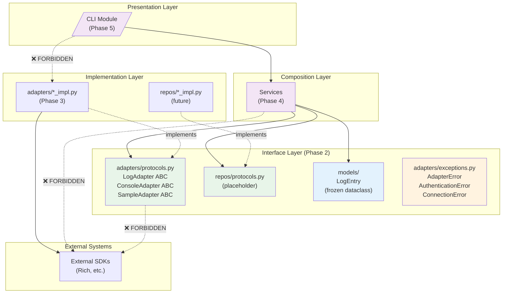
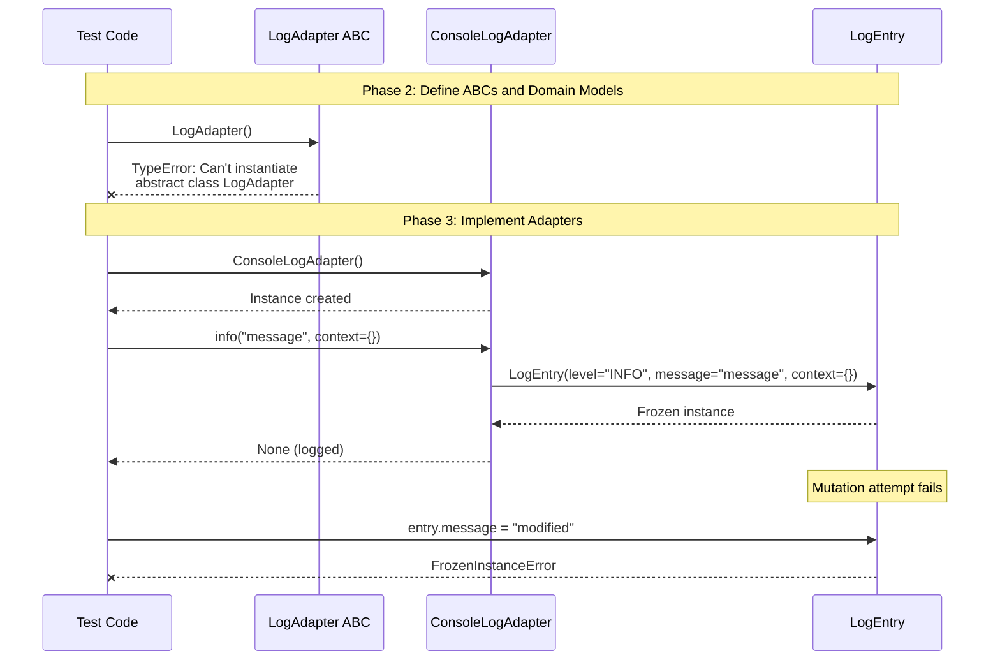
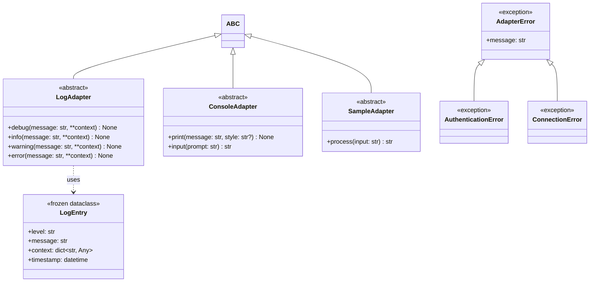

# Phase 2: Core Interfaces (ABC Definitions) — Tasks + Alignment Brief

**Phase Slug**: `phase-2-core-interfaces`
**Created**: 2025-11-27
**Spec**: [project-skele-spec.md](/workspaces/flow_squared/docs/plans/002-project-skele/project-skele-spec.md)
**Plan**: [project-skele-plan.md](/workspaces/flow_squared/docs/plans/002-project-skele/project-skele-plan.md)
**Plan Tasks**: 2.1–2.12

---

## Tasks

| Status | ID | Task | CS | Type | Dependencies | Absolute Path(s) | Validation | Subtasks | Notes |
|--------|-----|------|-----|------|--------------|------------------|------------|----------|-------|
| [x] | T001 | Write tests for LogAdapter ABC contract (abstractmethod enforcement) | 2 | Test | – | `/workspaces/flow_squared/tests/unit/adapters/test_protocols.py` | Tests fail (RED), cover: TypeError on instantiation, abstract methods list | – | TDD step 1; Plan 2.1 · [^9] |
| [x] | T002 | Implement LogAdapter ABC with debug/info/warning/error methods | 2 | Core | T001 | `/workspaces/flow_squared/src/fs2/core/adapters/log_adapter.py` | T001 tests pass (GREEN); TypeError on direct instantiation | – | Per Finding 03; Plan 2.2 · [^9] |
| [x] | T003 | Write tests for ConsoleAdapter ABC contract | 2 | Test | T002 | `/workspaces/flow_squared/tests/unit/adapters/test_protocols.py` | Tests fail (RED), cover: print/input methods defined, ABC enforcement | – | TDD step 1; Plan 2.3 · [^9] |
| [x] | T004 | Implement ConsoleAdapter ABC (for Rich wrapping) | 1 | Core | T003 | `/workspaces/flow_squared/src/fs2/core/adapters/console_adapter.py` | T003 tests pass (GREEN) | – | Minimal interface; Plan 2.4 · [^9] |
| [x] | T005 | Write tests for LogLevel enum (ordering, values, IntEnum behavior) | 2 | Test | T004 | `/workspaces/flow_squared/tests/unit/models/test_domain_models.py` | Tests fail (RED), cover: DEBUG < INFO < WARNING < ERROR | – | Type-safe levels for Phase 3 filtering · [^9] |
| [x] | T006 | Implement LogLevel IntEnum with DEBUG/INFO/WARNING/ERROR | 1 | Core | T005 | `/workspaces/flow_squared/src/fs2/core/models/log_level.py` | T005 tests pass (GREEN); levels are orderable | – | IntEnum for comparison support · [^9] |
| [x] | T007 | Write tests for LogEntry immutability (frozen dataclass) | 2 | Test | T006 | `/workspaces/flow_squared/tests/unit/models/test_domain_models.py` | Tests fail (RED), cover: FrozenInstanceError on mutation, LogLevel field | – | Per Finding 06; Plan 2.5 · [^9] |
| [x] | T008 | Implement LogEntry frozen dataclass with LogLevel, message, context, timestamp | 2 | Core | T007 | `/workspaces/flow_squared/src/fs2/core/models/log_entry.py` | T007 tests pass (GREEN); `@dataclass(frozen=True)` | – | Per Finding 06; Plan 2.6 · [^9] |
| [x] | T009 | Write tests for AdapterError exception hierarchy | 2 | Test | T008 | `/workspaces/flow_squared/tests/unit/adapters/test_exceptions.py` | Tests fail (RED), cover: inheritance chain, message formatting | – | Per Finding 07; Plan 2.7 · [^9] |
| [x] | T010 | Implement AdapterError hierarchy (AdapterError, AuthenticationError, ConnectionError) | 2 | Core | T009 | `/workspaces/flow_squared/src/fs2/core/adapters/exceptions.py` | T009 tests pass (GREEN) | – | Per Finding 07; Plan 2.8 · [^9] |
| [x] | T011 | Write tests for import boundary rules (ABCs have no SDK imports) | 2 | Test | T010 | `/workspaces/flow_squared/tests/unit/adapters/test_import_boundaries.py` | Tests fail (RED) if SDK types imported in ABC files | – | Per Finding 03; Plan 2.9 · [^9] |
| [x] | T012 | Validate import boundaries via static analysis | 1 | Integration | T011 | `/workspaces/flow_squared/src/fs2/core/adapters/log_adapter.py`, `/workspaces/flow_squared/src/fs2/core/adapters/console_adapter.py`, `/workspaces/flow_squared/src/fs2/core/adapters/sample_adapter.py` | T011 tests pass (GREEN); ruff check passes | – | Plan 2.10 · [^9] |
| [x] | T013 | Write tests for ProcessResult frozen dataclass | 2 | Test | T012 | `/workspaces/flow_squared/tests/unit/models/test_domain_models.py` | Tests fail (RED), cover: success/error states, metadata, immutability | – | Result type for SampleAdapter · [^9] |
| [x] | T014 | Implement ProcessResult frozen dataclass with success, value, error, metadata | 2 | Core | T013 | `/workspaces/flow_squared/src/fs2/core/models/process_result.py` | T013 tests pass (GREEN) | – | Full result pattern for canonical test · [^9] |
| [x] | T015 | Write tests for SampleAdapter ABC (full pattern demonstration) | 2 | Test | T014 | `/workspaces/flow_squared/tests/unit/adapters/test_protocols.py` | Tests fail (RED), cover: process + validate methods, ABC enforced | – | For Phase 4; Plan 2.11 · [^9] |
| [x] | T016 | Implement SampleAdapter ABC with process and validate methods | 2 | Core | T015 | `/workspaces/flow_squared/src/fs2/core/adapters/sample_adapter.py` | T015 tests pass (GREEN) | – | Full adapter pattern for canonical test · [^9] |
| [x] | T017 | Create models `__init__.py` with LogLevel, LogEntry, ProcessResult exports | 1 | Core | T014 | `/workspaces/flow_squared/src/fs2/core/models/__init__.py` | `from fs2.core.models import LogLevel, LogEntry, ProcessResult` works | – | Package export · [^9] |
| [x] | T018 | Create adapters `__init__.py` with protocol exports | 1 | Core | T016 | `/workspaces/flow_squared/src/fs2/core/adapters/__init__.py` | `from fs2.core.adapters import LogAdapter, SampleAdapter` works | – | Package export · [^9] |
| [x] | T019 | Validate all Phase 2 tests pass with coverage check | 1 | Integration | T017, T018 | – | `pytest tests/unit/adapters/ tests/unit/models/ -v --cov=fs2.core --cov-fail-under=80` exits 0 | – | Final validation; Plan 2.12 · [^9] |

**Total Tasks**: 19
**Complexity Summary**: 12 × CS-2 (small) + 7 × CS-1 (trivial) = **Phase CS-2** (small overall)

### Parallelization Guidance

```
Note: TDD approach requires sequential test→impl pairs. Limited parallelism.

                                                                         ┌──> T017 (models __init__)
                                                                         │
T001 ──> T002 ──> T003 ──> T004 ──> T005 ──> T006 ──> T007 ──> T008 ──> T009 ──> T010 ──> T011 ──> T012 ──> T013 ──> T014 ──> T015 ──> T016 ──> T018 ──> T019
                                                                                                                                              │
                                                                                                                                              └──> (T017 also feeds T019)
```

**Sequential Nature**: TDD requires test-first, then implementation. Each test→impl pair must complete before the next.

**Potential Parallelism**:
- T017 (models `__init__.py`) can run after T014 completes (doesn't need SampleAdapter)
- T018 (adapters `__init__.py`) needs T016 (SampleAdapter implementation)
- T019 (final validation) needs both T017 and T018

---

## Alignment Brief

### Prior Phases Review

#### Phase 0: Project Structure & Dependencies — Summary

**Executed**: 2025-11-26
**Status**: COMPLETE (19/19 tasks)
**Approach**: Lightweight (validation via commands)

##### A. Deliverables Created

| Deliverable | Path | Purpose |
|-------------|------|---------|
| Package root | `/workspaces/flow_squared/src/fs2/__init__.py` | Root importable package |
| Config package | `/workspaces/flow_squared/src/fs2/config/__init__.py` | Configuration system home |
| Core packages | `/workspaces/flow_squared/src/fs2/core/{models,services,adapters,repos}/__init__.py` | Clean Architecture layers |
| CLI package | `/workspaces/flow_squared/src/fs2/cli/__init__.py` | Presentation layer |
| Protocols stubs | `/workspaces/flow_squared/src/fs2/core/{adapters,repos}/protocols.py` | ABC interface placeholders with docstrings |
| Test structure | `/workspaces/flow_squared/tests/{unit/{config,adapters,services},scratch,docs}/` | Test organization |
| Build config | `/workspaces/flow_squared/pyproject.toml` | Dependencies, hatchling build |
| Test config | `/workspaces/flow_squared/pytest.ini` | Markers: unit, integration, docs |
| Fixtures | `/workspaces/flow_squared/tests/conftest.py` | Shared pytest configuration |

##### B. Lessons Learned

1. **Package structure matters**: `src/fs2/` layout prevents namespace conflicts vs bare `src/`
2. **Dev dependencies explicit**: `uv sync --extra dev` required for pytest
3. **Validation scope**: Import all subpackages, not just root

##### C. Technical Discoveries

- **pytest exit code 5**: Expected when no tests collected (empty suite)
- **hatchling build**: `packages = ["src/fs2"]` for proper wheel builds
- **Marker registration**: pytest.ini markers immediately visible

##### D. Dependencies Exported to Phase 2

| Export | Location | Used By |
|--------|----------|---------|
| `fs2.core.adapters` package | `src/fs2/core/adapters/__init__.py` | T002, T004, T012 (ABC definitions) |
| `fs2.core.models` package | `src/fs2/core/models/__init__.py` | T006 (domain models) |
| `tests/unit/adapters/` directory | `tests/unit/adapters/` | T001, T003, T007, T009, T011 |
| protocols.py placeholder | `src/fs2/core/adapters/protocols.py` | T002, T004, T012 (extend) |
| pytest markers | `pytest.ini` | `@pytest.mark.unit` for adapter tests |

##### E. Critical Findings Applied in Phase 0

| Finding | Action Taken |
|---------|--------------|
| Finding 09 (Module Structure) | Created `src/fs2/{cli,core/{models,services,adapters,repos},config}/` hierarchy |
| Finding 12 (Pytest Fixtures) | Created `tests/conftest.py` with markers; test structure mirrors domain |

##### F. Incomplete/Blocked Items

None. All 19 tasks completed.

##### G. Test Infrastructure Created

- `tests/conftest.py` with `pytest_configure()` hook
- pytest markers: `unit`, `integration`, `docs`
- Test directories: `tests/unit/config/`, `tests/unit/adapters/`, `tests/unit/services/`

##### H. Technical Debt

None introduced. Clean scaffold.

##### I. Architectural Decisions

- **src/fs2/ layout**: Named package under src/ for proper namespace isolation
- **protocols.py stubs**: Placeholder files with architecture guidance docstrings

##### J. Scope Changes

None. Phase 0 executed as planned.

##### K. Key Log References

- [execution.log.md](/workspaces/flow_squared/docs/plans/002-project-skele/tasks/phase-0-project-structure/execution.log.md) § Evidence
- Footnotes [^1]-[^6] in plan document

---

#### Phase 1: Configuration System — Summary

**Executed**: 2025-11-26 to 2025-11-27
**Status**: COMPLETE (22 base tasks + 28 subtask tasks = 50 total, 112 tests, 97% coverage)
**Approach**: Full TDD (RED-GREEN-REFACTOR cycles)

##### A. Deliverables Created

| Deliverable | Path | Purpose |
|-------------|------|---------|
| Config models | `/workspaces/flow_squared/src/fs2/config/models.py` | FS2Settings, nested configs, YAML source, expansion, validation |
| Config exceptions | `/workspaces/flow_squared/src/fs2/config/exceptions.py` | ConfigurationError hierarchy with actionable messages |
| Config paths | `/workspaces/flow_squared/src/fs2/config/paths.py` | XDG path resolution helpers |
| Config loaders | `/workspaces/flow_squared/src/fs2/config/loaders.py` | Loading helpers (secrets, YAML, env, merge, expand) |
| Config objects | `/workspaces/flow_squared/src/fs2/config/objects.py` | Typed config objects (AzureOpenAIConfig, SearchQueryConfig) |
| Config service | `/workspaces/flow_squared/src/fs2/config/service.py` | ConfigurationService ABC and implementations |
| Config exports | `/workspaces/flow_squared/src/fs2/config/__init__.py` | Updated exports (FS2ConfigurationService, config objects) |
| Example config | `/workspaces/flow_squared/.fs2/config.yaml.example` | Documented example configuration |
| Secrets example | `/workspaces/flow_squared/.fs2/secrets.env.example` | Example secrets file |

##### B. Lessons Learned

1. **TDD stubs first**: Create stub files before tests for clean RED phase (ImportError ≠ assertion failure)
2. **Two-stage validation**: `@field_validator` runs BEFORE `@model_validator(mode="after")` — allow placeholders early, expand late
3. **Typed object registry**: ConfigurationService stores config objects by type, not by path
4. **No singleton**: Explicit construction via DI is cleaner than module-level singleton
5. **clean_config_env fixture**: Essential for test isolation from .env pollution

##### C. Technical Discoveries

- **Pydantic-settings precedence**: Built-in with `settings_customise_sources`
- **YamlConfigSettingsSource**: Custom `PydanticBaseSettingsSource` for YAML loading
- **Recursive placeholder expansion**: Use `object.__setattr__()` for frozen fields
- **Leaf-level override**: Env vars override single fields, not entire sections
- **python-dotenv override=False**: Allows monkeypatch to win in tests

##### D. Dependencies Exported to Phase 2

| Export | Location | Used By |
|--------|----------|---------|
| `ConfigurationService` ABC | `src/fs2/config/service.py` | Services inject config via constructor |
| `FS2ConfigurationService` | `src/fs2/config/service.py` | Production configuration loading |
| `FakeConfigurationService` | `src/fs2/config/service.py` | Test doubles for service tests |
| `AzureOpenAIConfig` | `src/fs2/config/objects.py` | Typed config object pattern reference |
| `clean_config_env` fixture | `tests/conftest.py` | Test isolation for config-dependent tests |
| Exception pattern | `src/fs2/config/exceptions.py` | Reference for adapter exception hierarchy |

##### E. Critical Findings Applied in Phase 1

| Finding | Action Taken |
|---------|--------------|
| Finding 01 (Singleton + Test Isolation) | Removed singleton; ConfigurationService owns loading |
| Finding 02 (Validator Order) | Two-stage validation: field allows placeholders, model expands |
| Finding 04 (Double-Underscore) | `env_nested_delimiter='__'`, `env_prefix='FS2_'` |
| Finding 05 (Custom ConfigurationError) | Actionable error hierarchy with fix instructions |
| Finding 08 (Leaf-Level Override) | Explicit tests for partial nested override |
| Finding 10 (Recursive Expansion) | `_expand_recursive()` handles nested BaseModel fields |
| Finding 11 (Config No Core Import) | Zero imports from `fs2.core.*` in config module |
| Finding 12 (Pytest Fixtures) | `clean_config_env` fixture, singleton warning |

##### F. Incomplete/Blocked Items

None. All 50 tasks completed (22 base + 28 subtask).

##### G. Test Infrastructure Created

| Test File | Tests | Purpose |
|-----------|-------|---------|
| `tests/unit/config/test_config_models.py` | 5 | Basic FS2Settings instantiation |
| `tests/unit/config/test_nested_config.py` | 4 | Nested config access |
| `tests/unit/config/test_config_precedence.py` | 9 | Precedence order |
| `tests/unit/config/test_yaml_source.py` | 4 | YAML loading |
| `tests/unit/config/test_env_expansion.py` | 6 | Placeholder expansion |
| `tests/unit/config/test_security_validation.py` | 7 | Literal secret detection |
| `tests/unit/config/test_config_errors.py` | 7 | Error hierarchy |
| `tests/unit/config/test_singleton_pattern.py` | 4 | Updated for new architecture |
| `tests/unit/config/test_config_paths.py` | 5 | XDG path resolution |
| `tests/unit/config/test_secrets_loading.py` | 6 | Secrets to env |
| `tests/unit/config/test_yaml_loading.py` | 5 | YAML helpers |
| `tests/unit/config/test_env_parsing.py` | 6 | FS2_* env parsing |
| `tests/unit/config/test_deep_merge.py` | 8 | Deep merge logic |
| `tests/unit/config/test_placeholder_expansion.py` | 6 | Expansion helpers |
| `tests/unit/config/test_config_objects.py` | 13 | Typed config objects |
| `tests/unit/config/test_configuration_service.py` | 13 | Service ABC + implementations |
| `tests/unit/config/test_cli_integration.py` | 4 | CLI override pattern |

**Total**: 112 tests, 97% coverage

##### H. Technical Debt

None. Clean implementation following py_sample_repo patterns.

##### I. Architectural Decisions

1. **Typed Object Registry**: `config.set(AzureOpenAIConfig(...))` / `config.get(AzureOpenAIConfig)` pattern
2. **No Singleton**: Explicit construction via DI — `FS2ConfigurationService()` loads at construction
3. **Multi-Source Pipeline**: secrets → YAML → env vars → expand → typed objects
4. **FakeConfigurationService**: Test double accepts typed config objects via constructor

##### J. Scope Changes

- **Subtask 001 added**: ConfigurationService Multi-Source Loading (28 tasks)
  - Reason: Phase 1 config was too basic for production
  - Added: XDG paths, secrets separation, injectable ConfigurationService, CLI override integration
  - Impact: More robust foundation for future phases

##### K. Key Log References

- [execution.log.md](/workspaces/flow_squared/docs/plans/002-project-skele/tasks/phase-1-configuration-system/execution.log.md) § TDD Execution Summary
- [001-subtask-configuration-service-multi-source.execution.log.md](/workspaces/flow_squared/docs/plans/002-project-skele/tasks/phase-1-configuration-system/001-subtask-configuration-service-multi-source.execution.log.md) § Architecture Summary
- Footnotes [^7]-[^8] in plan document

---

### Cross-Phase Synthesis

#### Phase-by-Phase Summary: Evolution of Implementation

1. **Phase 0** established the physical directory structure enforcing Clean Architecture layers
2. **Phase 1** implemented the configuration system, introducing patterns like:
   - ABC-based interfaces (ConfigurationService)
   - Typed object registry pattern
   - Exception hierarchies with actionable messages
   - Test doubles (FakeConfigurationService)
3. **Phase 2** will formalize these patterns for adapters and domain models

#### Cumulative Deliverables Available to Phase 2

| Phase | Files Available | Key APIs |
|-------|-----------------|----------|
| Phase 0 | `src/fs2/core/adapters/protocols.py` (stub) | Placeholder with docstrings |
| Phase 0 | `src/fs2/core/models/__init__.py` (empty) | Package marker only |
| Phase 0 | `tests/unit/adapters/` (directory) | Ready for test files |
| Phase 1 | `src/fs2/config/exceptions.py` | Exception pattern reference |
| Phase 1 | `src/fs2/config/service.py` | ABC pattern reference |
| Phase 1 | `tests/conftest.py` | Fixtures, markers, hooks |

#### Pattern Evolution

| Pattern | Phase 0 | Phase 1 | Phase 2 |
|---------|---------|---------|---------|
| ABC Interfaces | Placeholder | ConfigurationService ABC | LogAdapter, ConsoleAdapter, SampleAdapter ABCs |
| Exception Hierarchy | None | ConfigurationError + children | AdapterError + children |
| Frozen Domain Models | None | None | LogEntry (first domain model) |
| Test Doubles | None | FakeConfigurationService | FakeSampleAdapter (Phase 4 prep) |
| Import Boundaries | Documented | Enforced (config no core) | Formally tested |

#### Recurring Issues & Mitigations

None identified — clean execution through Phase 0 and Phase 1.

#### Reusable Test Infrastructure from Prior Phases

- `tests/conftest.py`: pytest_configure, markers, clean_config_env fixture
- Pattern: TDD stub files before tests for clean RED phase
- Pattern: Monkeypatch for environment isolation

#### Architectural Continuity

**Patterns to Maintain**:
- `abc.ABC` with `@abstractmethod` for interfaces
- Exception hierarchies with actionable messages
- Test doubles implement same ABC as production
- Frozen dataclasses for domain models

**Anti-Patterns to Avoid**:
- SDK types in protocol interfaces
- Mutable domain models
- Exceptions without fix instructions
- Upward dependencies (adapters → services)

---

### Objective Recap

Define ABC-based interfaces for adapters, domain models, and exception hierarchies with:
1. LogAdapter ABC with debug/info/warning/error methods
2. ConsoleAdapter ABC for Rich wrapping in CLI
3. SampleAdapter ABC for canonical documentation test (Phase 4 prep)
4. LogEntry frozen dataclass as first domain model
5. AdapterError exception hierarchy with translation pattern
6. Formal import boundary validation

### Behavior Checklist (mapped to AC)

- [x] **AC4**: All ABCs raise TypeError on direct instantiation
- [x] **AC4**: ABC methods have `@abstractmethod` decorator
- [x] **AC5**: Domain models use `@dataclass(frozen=True)`
- [x] **AC5**: Domain models have zero imports from services/adapters/repos
- [x] **AC7**: LogAdapter has debug/info/warning/error methods
- [x] **AC3**: Protocols have no SDK imports (only stdlib + domain types)

### Non-Goals (Scope Boundaries)

❌ **NOT doing in this phase**:
- Adapter implementations (Phase 3 handles ConsoleLogAdapter, FakeLogAdapter)
- Service definitions (Phase 4 handles SampleService)
- CLI module integration (Phase 5)
- Repository interfaces (not needed for POC scope)
- Async adapter variants (sync-only for POC)
- Thread-safety considerations (single-threaded POC)
- Custom typing protocols (using abc.ABC per spec decision)
- FakeLogAdapter implementation (Phase 3)
- FakeSampleAdapter implementation (Phase 4)
- Performance benchmarks for logging

### Critical Findings Affecting This Phase

| Finding | Title | Constraint/Requirement | Addressed By |
|---------|-------|----------------------|--------------|
| **03** | Repository/Adapter Pattern with SDK Isolation | ABC interfaces in protocols.py use only domain types; implementations in *_impl.py import SDKs | T001, T002, T003, T004, T009, T010 |
| **06** | Frozen Dataclasses for Domain Models | Use `@dataclass(frozen=True)` for all domain types; zero SDK imports | T005, T006 |
| **07** | Exception Translation at Adapter Boundary | Catch SDK exceptions in adapters, translate to domain exceptions | T007, T008 |
| **09** | Module Structure Encodes Architectural Layers | Physical directory structure reflects logical layers | T009, T010 |

### ADR Decision Constraints

**N/A** — No ADRs exist for this project.

### Invariants & Guardrails

- **Import Rule**: `fs2.core.adapters.protocols` MUST NOT import external SDK packages
- **Import Rule**: `fs2.core.models` MUST NOT import from services, adapters, or repos
- **ABC Rule**: Direct instantiation of ABC MUST raise TypeError
- **Immutability Rule**: Domain models MUST use `@dataclass(frozen=True)`
- **Method Signatures**: Adapter methods use only domain types (no SDK types)

### Inputs to Read

| File | Purpose |
|------|---------|
| `/workspaces/flow_squared/docs/plans/002-project-skele/project-skele-spec.md` § AC4, AC5, AC7 | Interface requirements |
| `/workspaces/flow_squared/docs/plans/002-project-skele/project-skele-plan.md` § Phase 2 | Task definitions, test examples |
| `/workspaces/flow_squared/docs/plans/002-project-skele/project-skele-plan.md` § Critical Findings 03, 06, 07, 09 | Implementation constraints |
| `/workspaces/flow_squared/src/fs2/core/adapters/protocols.py` | Current stub state |
| `/workspaces/flow_squared/src/fs2/core/models/__init__.py` | Current empty state |
| `/workspaces/flow_squared/src/fs2/config/exceptions.py` | Exception pattern reference |
| `/workspaces/flow_squared/src/fs2/config/service.py` | ABC pattern reference |

### Visual Alignment Aids

#### Flow Diagram: Clean Architecture Dependency Flow



#### Sequence Diagram: ABC Contract Enforcement



#### Class Diagram: Phase 2 Deliverables



### Test Plan (Full TDD per spec)

**Approach**: Full TDD — Write tests FIRST (RED), implement minimal code (GREEN), refactor
**Mock Policy**: No mocks needed for ABC definitions; minimal fixtures required

#### Test Files Structure

| Test File | Tests | Purpose |
|-----------|-------|---------|
| `tests/unit/adapters/test_protocols.py` | 8-10 | ABC enforcement, abstract methods, TypeError on instantiation |
| `tests/unit/models/test_domain_models.py` | 4-5 | Frozen dataclass, field validation, mutation rejection |
| `tests/unit/adapters/test_exceptions.py` | 4-5 | Exception hierarchy, inheritance, message formatting |
| `tests/unit/adapters/test_import_boundaries.py` | 2-3 | No SDK imports in protocols, import analysis |

**Total Estimated Tests**: ~20-25 tests

#### Key Test Examples (from Plan)

```python
# tests/unit/adapters/test_protocols.py

@pytest.mark.unit
def test_given_log_adapter_abc_when_instantiating_directly_then_raises_type_error():
    """
    Purpose: Proves ABC enforcement prevents direct instantiation
    Quality Contribution: Ensures all adapters implement required methods
    Acceptance Criteria:
    - LogAdapter() raises TypeError
    - Message mentions abstract methods
    """
    from fs2.core.adapters.protocols import LogAdapter

    with pytest.raises(TypeError) as exc_info:
        LogAdapter()

    assert 'abstract' in str(exc_info.value).lower()


@pytest.mark.unit
def test_given_log_adapter_abc_then_has_required_methods():
    """
    Purpose: Proves LogAdapter defines the expected interface
    Quality Contribution: Documents contract for implementations
    """
    from fs2.core.adapters.protocols import LogAdapter
    import inspect

    methods = [m for m in dir(LogAdapter) if not m.startswith('_')]
    abstract_methods = [
        name for name, method in inspect.getmembers(LogAdapter)
        if getattr(method, '__isabstractmethod__', False)
    ]

    assert 'debug' in abstract_methods
    assert 'info' in abstract_methods
    assert 'warning' in abstract_methods
    assert 'error' in abstract_methods
```

```python
# tests/unit/models/test_domain_models.py

@pytest.mark.unit
def test_given_domain_model_when_mutating_then_raises_frozen_error():
    """
    Purpose: Proves domain models are immutable
    Quality Contribution: Prevents accidental state mutation
    """
    from fs2.core.models import LogEntry
    from dataclasses import FrozenInstanceError

    entry = LogEntry(level='INFO', message='test')

    with pytest.raises(FrozenInstanceError):
        entry.message = 'modified'


@pytest.mark.unit
def test_given_log_entry_when_created_then_has_timestamp():
    """
    Purpose: Proves LogEntry auto-generates timestamp
    Quality Contribution: Ensures consistent logging metadata
    """
    from fs2.core.models import LogEntry
    from datetime import datetime

    entry = LogEntry(level='INFO', message='test')

    assert isinstance(entry.timestamp, datetime)
```

```python
# tests/unit/adapters/test_exceptions.py

@pytest.mark.unit
def test_given_adapter_error_hierarchy_then_inheritance_correct():
    """
    Purpose: Proves exception hierarchy supports catch-all patterns
    Quality Contribution: Enables granular error handling
    """
    from fs2.core.adapters.exceptions import (
        AdapterError,
        AuthenticationError,
        ConnectionError,
    )

    assert issubclass(AuthenticationError, AdapterError)
    assert issubclass(ConnectionError, AdapterError)
    assert issubclass(AdapterError, Exception)
```

```python
# tests/unit/adapters/test_import_boundaries.py

@pytest.mark.unit
def test_given_protocols_module_when_imported_then_no_sdk_types():
    """
    Purpose: Proves protocols.py contains no external SDK imports
    Quality Contribution: Enforces Clean Architecture boundaries
    """
    import ast
    from pathlib import Path

    protocols_path = Path("/workspaces/flow_squared/src/fs2/core/adapters/protocols.py")
    source = protocols_path.read_text()
    tree = ast.parse(source)

    # Allowed imports: abc, typing, dataclasses, datetime, and fs2.core.models
    allowed_modules = {'abc', 'typing', 'dataclasses', 'datetime', 'fs2', 'fs2.core', 'fs2.core.models'}

    for node in ast.walk(tree):
        if isinstance(node, ast.Import):
            for alias in node.names:
                module_root = alias.name.split('.')[0]
                assert module_root in allowed_modules, f"Forbidden import: {alias.name}"
        elif isinstance(node, ast.ImportFrom):
            if node.module:
                module_root = node.module.split('.')[0]
                assert module_root in allowed_modules, f"Forbidden import: {node.module}"
```

#### Non-Happy-Path Coverage Checklist

- [ ] TypeError raised when instantiating any ABC directly
- [ ] FrozenInstanceError raised when mutating domain model
- [ ] Exception messages are descriptive
- [ ] Missing required fields on dataclass raise appropriate error

### Step-by-Step Implementation Outline

| Step | Tasks | Action |
|------|-------|--------|
| 1 | T001-T002 | LogAdapter ABC with 4 abstract methods |
| 2 | T003-T004 | ConsoleAdapter ABC with print/input methods |
| 3 | T005-T006 | LogEntry frozen dataclass |
| 4 | T007-T008 | AdapterError exception hierarchy |
| 5 | T009-T010 | Import boundary validation |
| 6 | T011-T012 | SampleAdapter ABC for canonical test |
| 7 | T013-T014 | Package exports in `__init__.py` |
| 8 | T015 | Final validation with coverage |

### Commands to Run

```bash
# Activate virtual environment
cd /workspaces/flow_squared
source .venv/bin/activate

# Create test directories (models dir missing from Phase 0)
mkdir -p tests/unit/models
mkdir -p tests/unit/adapters  # should exist, but ensure

# Run specific test file during TDD
pytest tests/unit/adapters/test_protocols.py -v

# Run all Phase 2 tests
pytest tests/unit/adapters/ tests/unit/models/ -v

# Run with coverage
pytest tests/unit/adapters/ tests/unit/models/ -v --cov=fs2.core --cov-report=term-missing

# Final validation (T015)
pytest tests/unit/adapters/ tests/unit/models/ -v --cov=fs2.core --cov-fail-under=80

# Lint Phase 2 modules
ruff check src/fs2/core/adapters/ src/fs2/core/models/

# Check imports (manual verification)
python -c "from fs2.core.adapters import LogAdapter, ConsoleAdapter, SampleAdapter; print('OK')"
python -c "from fs2.core.models import LogEntry; print('OK')"
```

### Implementation Reference Patterns

#### ABC Pattern (from Phase 1 ConfigurationService)

```python
# Reference: src/fs2/config/service.py
from abc import ABC, abstractmethod

class ConfigurationService(ABC):
    """Abstract base for configuration services."""

    @abstractmethod
    def get(self, config_type: type[T]) -> T | None:
        """Get config by type, returns None if not set."""
        ...

    @abstractmethod
    def require(self, config_type: type[T]) -> T:
        """Get config by type, raises if not set."""
        ...
```

#### Exception Hierarchy Pattern (from Phase 1)

```python
# Reference: src/fs2/config/exceptions.py
class ConfigurationError(Exception):
    """Base config error with actionable guidance."""
    pass

class MissingConfigurationError(ConfigurationError):
    """Required configuration not found."""
    def __init__(self, config_type: type, sources: list[str]):
        self.config_type = config_type
        self.sources = sources
        msg = f"Missing configuration: {config_type.__name__}\n"
        msg += "Configure one of:\n"
        for src in sources:
            msg += f"  - {src}\n"
        super().__init__(msg)
```

#### LogLevel IntEnum Pattern (for type-safe level filtering)

```python
# Target pattern for src/fs2/core/models/log_level.py
from enum import IntEnum

class LogLevel(IntEnum):
    """Log severity levels, ordered from least to most severe.

    Using IntEnum enables comparison: LogLevel.DEBUG < LogLevel.INFO
    This supports Phase 3's level filtering feature.
    """
    DEBUG = 10
    INFO = 20
    WARNING = 30
    ERROR = 40
```

#### ProcessResult Pattern (for adapter return values)

```python
# Target pattern for src/fs2/core/models/process_result.py
from dataclasses import dataclass, field
from typing import Any

@dataclass(frozen=True)
class ProcessResult:
    """Result of an adapter operation, representing success or failure.

    This pattern enables:
    - Explicit success/failure handling (no exceptions for expected failures)
    - Rich error information with context
    - Metadata for tracing, timing, or other cross-cutting concerns

    Attributes:
        success: Whether the operation succeeded
        value: The result value (only meaningful if success=True)
        error: Error message (only meaningful if success=False)
        metadata: Additional context (trace_id, timing, etc.)

    Note:
        Like LogEntry.context, the metadata dict is technically mutable.
        See LogEntry Note for details.
    """
    success: bool
    value: Any = None
    error: str | None = None
    metadata: dict[str, Any] = field(default_factory=dict)

    @classmethod
    def ok(cls, value: Any, **metadata: Any) -> "ProcessResult":
        """Create a successful result."""
        return cls(success=True, value=value, metadata=metadata)

    @classmethod
    def fail(cls, error: str, **metadata: Any) -> "ProcessResult":
        """Create a failed result."""
        return cls(success=False, error=error, metadata=metadata)
```

#### SampleAdapter ABC Pattern (full canonical test demonstration)

```python
# Target pattern for src/fs2/core/adapters/protocols.py (addition)
from abc import ABC, abstractmethod
from fs2.core.models import ProcessResult

class SampleAdapter(ABC):
    """Sample adapter ABC demonstrating the full adapter pattern.

    This interface is intentionally complete to serve as the canonical
    example for Phase 4's documentation test. It shows:
    - Multiple methods with different purposes
    - Context passing for traceability
    - Result type for explicit success/error handling
    - Validation method that can raise AdapterError

    Implementations:
    - Phase 3+ will provide FakeSampleAdapter for testing
    - Production adapters follow this pattern
    """

    @abstractmethod
    def process(self, input_data: str, context: dict[str, Any] | None = None) -> ProcessResult:
        """Process input data and return a result.

        Args:
            input_data: The data to process
            context: Optional context (trace_id, user_id, etc.)

        Returns:
            ProcessResult with success/failure and metadata
        """
        ...

    @abstractmethod
    def validate(self, input_data: str) -> bool:
        """Validate input before processing.

        Args:
            input_data: The data to validate

        Returns:
            True if valid

        Raises:
            AdapterError: If validation fails with details
        """
        ...
```

#### Frozen Dataclass Pattern (from Critical Finding 06)

```python
# Target pattern for src/fs2/core/models/log_entry.py
from dataclasses import dataclass, field
from datetime import datetime, timezone
from typing import Any

from fs2.core.models.log_level import LogLevel

@dataclass(frozen=True)
class LogEntry:
    """Immutable log entry domain model.

    Attributes:
        level: Log level (type-safe LogLevel enum)
        message: Log message content
        context: Additional key-value context
        timestamp: When the entry was created (auto-generated, UTC)

    Note:
        The `context` dict contents are technically mutable even though the
        dataclass is frozen. Frozen only prevents reassigning `self.context`,
        not modifying the dict's contents. For POC scope this is acceptable;
        consider MappingProxyType wrapper if true immutability is needed later.
    """
    level: LogLevel
    message: str
    context: dict[str, Any] = field(default_factory=dict)
    timestamp: datetime = field(default_factory=lambda: datetime.now(timezone.utc))
```

### Risks & Unknowns

| Risk | Severity | Mitigation |
|------|----------|------------|
| ABC design too restrictive for Phase 3 | Medium | Keep interfaces minimal; add methods only when needed |
| Import circular dependencies | Low | Strict layer rules; models have no imports from core |
| FrozenInstanceError not available | Low | Use `dataclasses.FrozenInstanceError` (Python 3.10+) |
| Test coverage target with minimal code | Low | Simple ABCs should achieve high coverage easily |

---

## Ready Check

- [x] All 15 tasks have clear validation criteria
- [x] Absolute paths specified for all file operations
- [x] Test file names follow pytest discovery pattern (`test_*.py`)
- [x] Critical Findings 03, 06, 07, 09 addressed in task design
- [x] Phase 1 patterns documented for reference
- [x] TDD cycle (RED → GREEN → REFACTOR) explicit in task flow
- [x] ADR constraints mapped to tasks (N/A - no ADRs exist)
- [x] Prior Phases Review completed (Phase 0 + Phase 1)
- [x] Cross-phase synthesis shows cumulative deliverables
- [x] Pattern evolution documented (ABC → domain models)

**GO/NO-GO Status**: ⏳ **AWAITING APPROVAL** — Ready for human review

**Next Step**: Run `/plan-6-implement-phase --phase "Phase 2: Core Interfaces (ABC Definitions)"`

---

## Phase Footnote Stubs

> **Numbering Authority**: plan-6a-update-progress is the single source of truth for footnote numbering.

| Footnote | Tasks | Description | Date | Type |
|----------|-------|-------------|------|------|
| (populated by plan-6a-update-progress after implementation) | | | | |

---

## Evidence Artifacts

**Execution Log**: [execution.log.md](./execution.log.md)
**Status**: COMPLETE (179 tests passing)

**Files Created** (Architecture Decision: ABCs in separate files, not single protocols.py):
- `src/fs2/core/adapters/log_adapter.py` — LogAdapter ABC
- `src/fs2/core/adapters/console_adapter.py` — ConsoleAdapter ABC
- `src/fs2/core/adapters/sample_adapter.py` — SampleAdapter ABC
- `src/fs2/core/adapters/sample_adapter_fake.py` — FakeSampleAdapter implementation (Phase 4 prep)
- `src/fs2/core/adapters/exceptions.py` — AdapterError hierarchy
- `src/fs2/core/adapters/__init__.py` — Package exports
- `src/fs2/core/models/log_level.py` — LogLevel IntEnum (DEBUG/INFO/WARNING/ERROR)
- `src/fs2/core/models/log_entry.py` — LogEntry frozen dataclass (uses LogLevel)
- `src/fs2/core/models/process_result.py` — ProcessResult frozen dataclass (success/error/metadata)
- `src/fs2/core/models/__init__.py` — Package exports
- `src/fs2/core/services/sample_service.py` — SampleService (Phase 4 prep)
- `src/fs2/core/services/__init__.py` — Package exports
- `src/fs2/config/objects.py` — Added SampleServiceConfig, SampleAdapterConfig
- `tests/unit/adapters/test_protocols.py` — ABC tests (LogAdapter, ConsoleAdapter, SampleAdapter)
- `tests/unit/adapters/test_exceptions.py` — Exception hierarchy tests
- `tests/unit/adapters/test_import_boundaries.py` — Import validation tests
- `tests/unit/models/test_domain_models.py` — LogLevel, LogEntry, ProcessResult tests
- `tests/docs/test_sample_adapter_pattern.py` — Full composition pattern documentation (19 tests)

---

## Directory Layout

```
docs/plans/002-project-skele/
├── project-skele-spec.md
├── project-skele-plan.md
└── tasks/
    ├── phase-0-project-structure/
    │   ├── tasks.md
    │   └── execution.log.md          # Complete
    ├── phase-1-configuration-system/
    │   ├── tasks.md
    │   ├── execution.log.md          # Complete
    │   ├── 001-subtask-configuration-service-multi-source.md
    │   └── 001-subtask-configuration-service-multi-source.execution.log.md
    └── phase-2-core-interfaces/
        ├── tasks.md                  # This file
        └── execution.log.md          # Created by /plan-6-implement-phase
```

---

## Critical Insights Discussion

**Session**: 2025-11-27
**Context**: Phase 2: Core Interfaces (ABC Definitions) tasks dossier pre-implementation review
**Analyst**: AI Clarity Agent
**Reviewer**: Development Team
**Format**: Water Cooler Conversation (5 Critical Insights)

### Insight 1: datetime.utcnow() is Deprecated in Python 3.12

**Did you know**: The `datetime.utcnow()` call in the LogEntry implementation pattern is deprecated in Python 3.12 and raises DeprecationWarning on every log entry creation.

**Implications**:
- CI pipelines with `-W error` would fail
- Noisy test output
- Bad example for future code
- Future Python versions may error

**Options Considered**:
- Option A: Use datetime.now(timezone.utc) - CS-1 (trivial)
- Option B: Use datetime.now() local time - CS-1 (trivial)
- Option C: Create timestamp helper function - CS-2 (small)

**AI Recommendation**: Option A - datetime.now(timezone.utc)
- Reasoning: Future-proof, explicit timezone handling, Python's recommended approach

**Discussion Summary**: Immediate agreement on Option A as the standard approach.

**Decision**: Use `datetime.now(timezone.utc)` for LogEntry.timestamp

**Action Items**:
- [x] Updated implementation pattern in tasks.md

**Affects**: T008 (LogEntry implementation)

---

### Insight 2: tests/unit/models/ Directory Missing

**Did you know**: T005 references `tests/unit/models/test_domain_models.py` but Phase 0 never created the `tests/unit/models/` directory.

**Implications**:
- File creation fails before test can run
- TDD RED phase broken
- Confusing developer experience

**Options Considered**:
- Option A: Add directory creation to T005 - CS-1 (trivial)
- Option B: Add T004.5 setup task - CS-1 (trivial)
- Option C: Document in Commands section - CS-1 (trivial)

**AI Recommendation**: Option C - Add to Commands section
- Reasoning: Already have pattern, low ceremony, visible to developers

**Discussion Summary**: Agreed to make mkdir command explicit and copy-pasteable.

**Decision**: Add explicit `mkdir -p tests/unit/models` to Commands section

**Action Items**:
- [x] Updated Commands to Run section

**Affects**: Commands section, T005-T008

---

### Insight 3: LogEntry's Frozen Guarantee Has a Hole

**Did you know**: Even with `@dataclass(frozen=True)`, the `context: dict[str, Any]` field contents can still be mutated because frozen only prevents attribute reassignment, not container modification.

**Implications**:
- "Immutable" domain model isn't truly immutable
- Subtle bugs from spooky action at a distance
- Violates Finding 06 promise

**Options Considered**:
- Option A: Use MappingProxyType for read-only dict - CS-2 (small)
- Option B: Use frozenset of tuples - CS-2 (small)
- Option C: Document limitation and accept - CS-1 (trivial)
- Option D: Deep-copy context on construction - CS-1 (trivial)

**AI Recommendation**: Option A - MappingProxyType
- Reasoning: Actually solves the problem, clean API, matches the promise

**Discussion Summary**: User chose Option C for POC pragmatism. True immutability can be added later if needed.

**Decision**: Document the limitation, accept mutable context dict for POC scope

**Action Items**:
- [x] Added Note to LogEntry docstring about context mutability

**Affects**: T008 (LogEntry implementation)

---

### Insight 4: LogAdapter Lacks LogLevel Enum

**Did you know**: LogAdapter defines 4 methods but there's no `LogLevel` enum for Phase 3's level filtering to use in a type-safe way.

**Implications**:
- Phase 3 will need stringly-typed or magic-number levels
- LogEntry.level is `str` with no validation
- Inconsistency risk across implementations

**Options Considered**:
- Option A: Add LogLevel enum to domain models - CS-2 (small)
- Option B: Add LogLevel to adapters/protocols.py - CS-2 (small)
- Option C: Defer to Phase 3 - CS-1 (trivial)
- Option D: Use Literal type instead - CS-1 (trivial)

**AI Recommendation**: Option A - LogLevel enum in models
- Reasoning: Right layer, type-safe, orderable with IntEnum, unblocks Phase 3

**Discussion Summary**: User agreed to add LogLevel now for type safety.

**Decision**: Add LogLevel IntEnum to domain models; LogEntry uses LogLevel instead of str

**Action Items**:
- [x] Added T005-T006 for LogLevel tests and implementation
- [x] Updated LogEntry to use `level: LogLevel`
- [x] Added LogLevel implementation pattern
- [x] Updated task numbering (T005-T019)

**Affects**: T005, T006, T007, T008, T017, implementation patterns

---

### Insight 5: SampleAdapter Interface Too Thin for Canonical Test

**Did you know**: SampleAdapter's single `process(input: str) -> str` method doesn't demonstrate the full composition pattern Phase 4's canonical test aims to show.

**Implications**:
- Canonical test won't show error handling
- No context passing for traceability
- FakeSampleAdapter pattern incomplete
- Phase 4 may need to modify Phase 2 deliverables

**Options Considered**:
- Option A: Keep minimal, let Phase 4 evolve - CS-1 (trivial)
- Option B: Add validate method for error case - CS-1 (trivial)
- Option C: Expand with ProcessResult + context - CS-2 (small)
- Option D: Document expected evolution - CS-1 (trivial)

**AI Recommendation**: Option D - Document expected evolution
- Reasoning: YAGNI, ABC can grow, Phase 2 focused on patterns not business logic

**Discussion Summary**: User chose Option C to build the full example while context is fresh. Future agents will have a complete reference.

**Decision**: Expand SampleAdapter with process(context) + validate methods; add ProcessResult dataclass

**Action Items**:
- [x] Added T013-T014 for ProcessResult dataclass
- [x] Updated T015-T016 for expanded SampleAdapter
- [x] Added ProcessResult implementation pattern with ok()/fail() factories
- [x] Added SampleAdapter ABC pattern with full documentation
- [x] Updated Expected Files

**Affects**: T013-T019, implementation patterns, Expected Files

---

## Session Summary

**Insights Surfaced**: 5 critical insights identified and discussed
**Decisions Made**: 5 decisions reached through collaborative discussion
**Action Items Created**: 5 major updates applied immediately
**Areas Updated**:
- Task table: 15 → 19 tasks (added LogLevel + ProcessResult + expanded SampleAdapter)
- Implementation patterns: Added LogLevel, ProcessResult, SampleAdapter patterns
- Commands section: Added explicit mkdir for tests/unit/models
- LogEntry: Uses LogLevel enum, documents context mutability

**Key Decisions Recap**:
1. **datetime.utcnow()** → Use `datetime.now(timezone.utc)` (Option A)
2. **Missing models dir** → Add explicit mkdir to Commands (Option C)
3. **Mutable context dict** → Document and accept for POC (Option C)
4. **LogLevel enum** → Add to domain models for type safety (Option A)
5. **SampleAdapter scope** → Full pattern with ProcessResult (Option C)

**Shared Understanding Achieved**: ✓

**Confidence Level**: High - All critical patterns defined upfront, no surprises for Phase 3-4

**Next Steps**:
Phase 2 implementation COMPLETE. Proceed with `/plan-7-code-review --phase "Phase 2: Core Interfaces (ABC Definitions)"`

---

## Phase Footnote Stubs

[^9]: Phase 2 - Core Interfaces (ABC Definitions) - All 19 tasks completed
  - `class:src/fs2/core/adapters/log_adapter.py:LogAdapter`
  - `class:src/fs2/core/adapters/console_adapter.py:ConsoleAdapter`
  - `class:src/fs2/core/adapters/sample_adapter.py:SampleAdapter`
  - `class:src/fs2/core/adapters/exceptions.py:AdapterError`
  - `class:src/fs2/core/adapters/exceptions.py:AuthenticationError`
  - `class:src/fs2/core/adapters/exceptions.py:AdapterConnectionError`
  - `class:src/fs2/core/models/log_level.py:LogLevel`
  - `class:src/fs2/core/models/log_entry.py:LogEntry`
  - `class:src/fs2/core/models/process_result.py:ProcessResult`
  - `file:src/fs2/core/models/__init__.py`
  - `file:src/fs2/core/adapters/__init__.py`
  - `file:tests/unit/adapters/test_protocols.py`
  - `file:tests/unit/adapters/test_exceptions.py`
  - `file:tests/unit/adapters/test_import_boundaries.py`
  - `file:tests/unit/models/test_domain_models.py`

[^10]: Phase 2 Post-Implementation Refactor - No Concept Leakage (2025-11-27)
  **Architectural Change**: Services/Adapters receive `ConfigurationService` (registry), NOT extracted configs.
  - `file:src/fs2/config/objects.py` - Added SampleServiceConfig, SampleAdapterConfig
  - `file:src/fs2/core/services/sample_service.py` - SampleService receives ConfigurationService
  - `file:src/fs2/core/adapters/sample_adapter_fake.py` - FakeSampleAdapter receives ConfigurationService
  - `file:tests/docs/test_sample_adapter_pattern.py` - Full pattern documentation (19 tests)
  - **179 tests passing** after refactor
