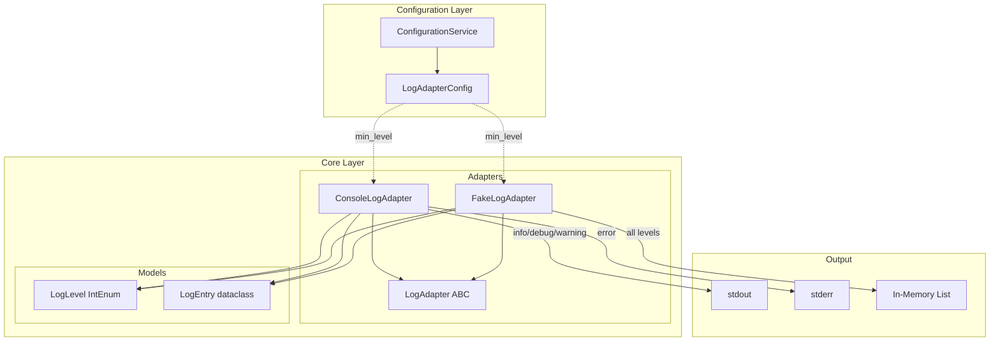
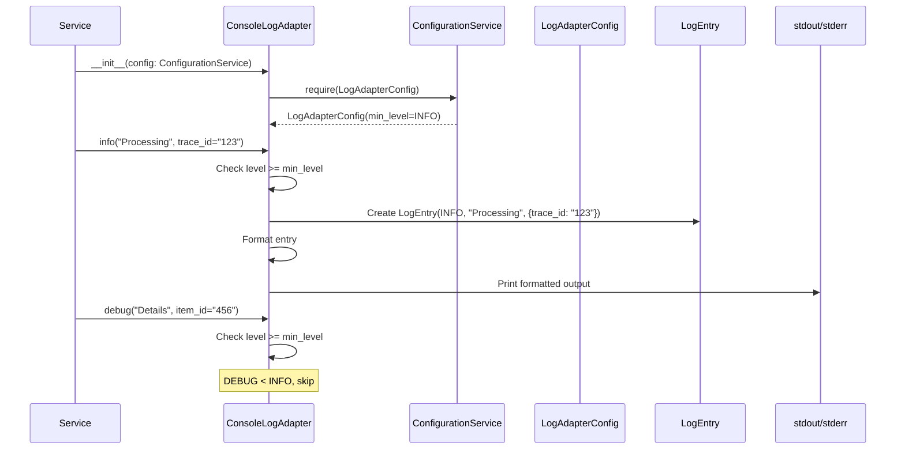
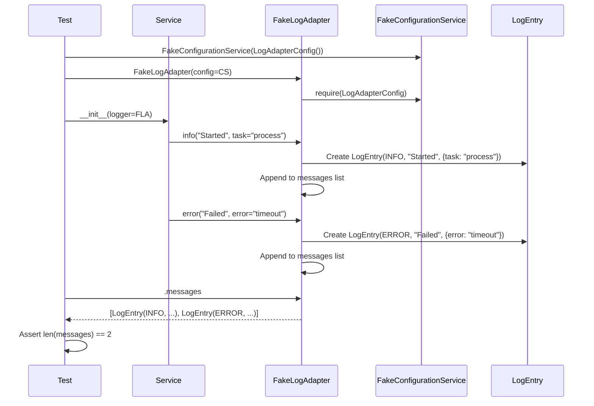

# Phase 3: Logger Adapter Implementation - Tasks + Alignment Brief

**Phase**: Phase 3: Logger Adapter Implementation
**Slug**: phase-3-logger-adapter-implementation
**Spec**: [project-skele-spec.md](/workspaces/flow_squared/docs/plans/002-project-skele/project-skele-spec.md)
**Plan**: [project-skele-plan.md](/workspaces/flow_squared/docs/plans/002-project-skele/project-skele-plan.md)
**Date**: 2025-11-27
**Status**: ✅ COMPLETE

---

## Tasks

| Status | ID | Task | CS | Type | Dependencies | Absolute Path(s) | Validation | Subtasks | Notes |
|--------|-----|------|-----|------|--------------|------------------|------------|----------|-------|
| [x] | T001 | Write tests for ConsoleLogAdapter.info() output format | 2 | Test | – | `/workspaces/flow_squared/tests/unit/adapters/test_log_adapter_console.py` | Test verifies INFO level, message, formatted context in stdout | – | TDD RED phase |
| [x] | T002 | Implement ConsoleLogAdapter.info() | 2 | Core | T001 | `/workspaces/flow_squared/src/fs2/core/adapters/log_adapter_console.py` | T001 tests pass; format: `YYYY-MM-DD HH:MM:SS INFO: message key=value` | – | TDD GREEN phase; silent error swallow |
| [x] | T003 | Write tests for ConsoleLogAdapter.error() stderr output | 2 | Test | T002 | `/workspaces/flow_squared/tests/unit/adapters/test_log_adapter_console.py` | Test verifies ERROR output to stderr (not stdout) | – | TDD RED phase |
| [x] | T004 | Implement ConsoleLogAdapter.error() | 2 | Core | T003 | `/workspaces/flow_squared/src/fs2/core/adapters/log_adapter_console.py` | T003 tests pass; ERROR writes to stderr | – | TDD GREEN phase |
| [x] | T005 | Write tests for ConsoleLogAdapter.debug() and warning() | 1 | Test | T004 | `/workspaces/flow_squared/tests/unit/adapters/test_log_adapter_console.py` | Tests verify all 4 methods exist and produce correct output | – | TDD RED phase |
| [x] | T006 | Implement ConsoleLogAdapter.debug() and warning() | 1 | Core | T005 | `/workspaces/flow_squared/src/fs2/core/adapters/log_adapter_console.py` | T005 tests pass; all 4 log levels functional | – | TDD GREEN phase |
| [x] | T007 | Write tests for FakeLogAdapter message capture | 2 | Test | – | `/workspaces/flow_squared/tests/unit/adapters/test_log_adapter_fake.py` | Tests verify messages stored as LogEntry, retrievable via .messages property | – | TDD RED phase; [P] eligible (different file from T001) |
| [x] | T008 | Implement FakeLogAdapter with message capture | 2 | Core | T007 | `/workspaces/flow_squared/src/fs2/core/adapters/log_adapter_fake.py` | T007 tests pass; .messages returns list[LogEntry] | – | TDD GREEN phase; silent error swallow |
| [x] | T009 | Write tests for structured context in both adapters | 2 | Test | T006, T008 | `/workspaces/flow_squared/tests/unit/adapters/test_log_adapter_console.py`, `/workspaces/flow_squared/tests/unit/adapters/test_log_adapter_fake.py` | Tests verify **kwargs captured in context, formatted in output | – | TDD RED phase |
| [x] | T010 | Implement context handling in both adapters | 2 | Core | T009 | `/workspaces/flow_squared/src/fs2/core/adapters/log_adapter_console.py`, `/workspaces/flow_squared/src/fs2/core/adapters/log_adapter_fake.py` | T009 tests pass; context dict populated from **kwargs | – | TDD GREEN phase |
| [x] | T011 | Write tests for log level filtering (min_level config) | 2 | Test | T010 | `/workspaces/flow_squared/tests/unit/adapters/test_log_adapter_console.py`, `/workspaces/flow_squared/tests/unit/adapters/test_log_adapter_fake.py` | Tests verify debug messages filtered when min_level=INFO | – | TDD RED phase |
| [x] | T012 | Implement level filtering with LogAdapterConfig | 2 | Core | T011 | `/workspaces/flow_squared/src/fs2/core/adapters/log_adapter_console.py`, `/workspaces/flow_squared/src/fs2/core/adapters/log_adapter_fake.py`, `/workspaces/flow_squared/src/fs2/config/objects.py` | T011 tests pass; LogAdapterConfig.min_level controls filtering | – | TDD GREEN phase; LogAdapterConfig(min_level only) |
| [x] | T013 | Write tests for ConfigurationService injection pattern | 2 | Test | T012 | `/workspaces/flow_squared/tests/unit/adapters/test_log_adapter_console.py`, `/workspaces/flow_squared/tests/unit/adapters/test_log_adapter_fake.py` | Tests verify adapters receive ConfigurationService, get own config internally | – | No concept leakage pattern |
| [x] | T014 | Update adapters to receive ConfigurationService | 2 | Core | T013 | `/workspaces/flow_squared/src/fs2/core/adapters/log_adapter_console.py`, `/workspaces/flow_squared/src/fs2/core/adapters/log_adapter_fake.py` | T013 tests pass; __init__ takes ConfigurationService, calls require() | – | Per footnote [^10] pattern |
| [x] | T015 | Write tests for ABC inheritance validation | 1 | Test | T014 | `/workspaces/flow_squared/tests/unit/adapters/test_log_adapter_console.py`, `/workspaces/flow_squared/tests/unit/adapters/test_log_adapter_fake.py` | Tests verify isinstance(adapter, LogAdapter) == True | – | ABC contract enforcement |
| [x] | T016 | Validate isinstance checks pass for both adapters | 1 | Core | T015 | `/workspaces/flow_squared/src/fs2/core/adapters/log_adapter_console.py`, `/workspaces/flow_squared/src/fs2/core/adapters/log_adapter_fake.py` | T015 tests pass; both inherit from LogAdapter ABC | – | Final inheritance check |
| [x] | T017 | Update package exports in __init__.py | 1 | Core | T016 | `/workspaces/flow_squared/src/fs2/core/adapters/__init__.py` | ConsoleLogAdapter, FakeLogAdapter importable from fs2.core.adapters | – | Public API |
| [x] | T018 | Write integration test for adapter + service composition | 2 | Integration | T017 | `/workspaces/flow_squared/tests/unit/adapters/test_log_adapter_integration.py` | Test shows service using FakeLogAdapter via DI, messages captured | – | Validates full pattern |
| [x] | T019 | Run full test suite and validate no regressions | 1 | Validation | T018 | – | `pytest` passes (all tests), coverage >80% on new code | – | Final validation |

**Total Tasks**: 19
**Complexity Distribution**: CS-1 (4 tasks), CS-2 (15 tasks)
**Overall Phase Complexity**: CS-2 (Small) - Clear requirements, established patterns

---

## Alignment Brief

### Objective Recap

Phase 3 implements the LogAdapter ABC defined in Phase 2 with two concrete implementations:
1. **ConsoleLogAdapter** - Development logging with formatted output to stdout/stderr
2. **FakeLogAdapter** - Test double that captures LogEntry instances for assertions

Both adapters must:
- Inherit from LogAdapter ABC (Phase 2)
- Use LogLevel and LogEntry domain models (Phase 2)
- Receive ConfigurationService via constructor (no concept leakage)
- Support structured context via **kwargs
- Implement level filtering based on configuration
- **Never propagate internal errors** - logging failures must be silently swallowed (industry standard)

### Output Format (ConsoleLogAdapter)

```
YYYY-MM-DD HH:MM:SS LEVEL: message key=value key2=value2
```

**Examples**:
```
2025-11-27 14:32:01 INFO: Processing request trace_id=abc123 user_id=42
2025-11-27 14:32:01 ERROR: Connection failed host=api.example.com retries=3
2025-11-27 14:32:01 DEBUG: Cache hit key=user:123
```

### Behavior Checklist (from Plan AC7)

- [ ] LogAdapter ABC with debug/info/warning/error methods (Phase 2 ✅)
- [ ] ConsoleLogAdapter writes to stdout (info/debug/warning) and stderr (error)
- [ ] FakeLogAdapter captures messages as LogEntry instances
- [ ] FakeLogAdapter.messages property returns list[LogEntry]
- [ ] Context dict populated from **kwargs in log methods
- [ ] Level filtering: debug filtered when min_level >= INFO
- [ ] Both adapters pass isinstance(adapter, LogAdapter) check

### Non-Goals (Scope Boundaries)

❌ **NOT doing in this phase**:
- Thread-safety guarantees (documented limitation per plan)
- Rich terminal formatting (deferred - plain text sufficient for POC)
- Log rotation or file output (ConsoleLogAdapter only)
- Async logging support (single-threaded assumption)
- Log aggregation or forwarding
- Performance benchmarking
- Custom log format configuration (hardcoded format sufficient)

### Critical Findings Affecting This Phase

| Finding | Title | Constraint/Requirement | Tasks Addressing |
|---------|-------|----------------------|------------------|
| 03 | SDK Isolation | Adapters use only domain types (LogLevel, LogEntry), no external SDK imports | T001-T018 (all implementation) |
| 07 | Exception Translation | Catch stdlib exceptions, translate to AdapterError if needed | T001-T016 (error handling) |
| 12 | Pytest Fixtures | Test files mirror src structure, shared fixtures in conftest.py | T007, T018 (test organization) |

**No ADRs exist** - Skip ADR constraint mapping.

### Invariants & Guardrails

| Invariant | Enforcement |
|-----------|-------------|
| LogAdapter ABC inheritance | isinstance() tests in T015-T016 |
| No SDK imports in adapter files | Import boundary tests (existing from Phase 2) |
| ConfigurationService injection | Tests verify __init__ signature (T013-T014) |
| LogEntry immutability | Frozen dataclass (Phase 2) |
| LogLevel ordering | IntEnum comparison (Phase 2) |

### Inputs to Read

| File | Purpose |
|------|---------|
| `/workspaces/flow_squared/src/fs2/core/adapters/log_adapter.py` | LogAdapter ABC interface |
| `/workspaces/flow_squared/src/fs2/core/models/log_level.py` | LogLevel IntEnum definition |
| `/workspaces/flow_squared/src/fs2/core/models/log_entry.py` | LogEntry frozen dataclass |
| `/workspaces/flow_squared/src/fs2/core/adapters/sample_adapter_fake.py` | Reference pattern for FakeLogAdapter |
| `/workspaces/flow_squared/src/fs2/config/service.py` | ConfigurationService ABC |
| `/workspaces/flow_squared/tests/docs/test_sample_adapter_pattern.py` | Canonical test patterns |

### Visual Alignment Aids

#### System Flow Diagram



#### Sequence Diagram - Logging Flow



#### Sequence Diagram - FakeLogAdapter Capture



### Test Plan (Full TDD)

**Testing Approach**: Full TDD (per plan § 4)
**Mock Policy**: Targeted mocks (prefer Fakes) - use FakeConfigurationService, monkeypatch for stdout/stderr

#### Test File Organization

| Test File | Purpose | Fixtures Needed |
|-----------|---------|-----------------|
| `test_log_adapter_console.py` | ConsoleLogAdapter behavior | FakeConfigurationService, capsys |
| `test_log_adapter_fake.py` | FakeLogAdapter message capture | FakeConfigurationService |
| `test_log_adapter_integration.py` | End-to-end composition | FakeConfigurationService, FakeLogAdapter |

#### Named Tests with Rationale

**T001-T002: ConsoleLogAdapter.info()**
```python
def test_given_console_log_adapter_when_info_called_then_outputs_to_stdout(capsys):
    """
    Purpose: Proves ConsoleLogAdapter.info() writes formatted output to stdout
    Quality Contribution: Validates basic logging contract
    Acceptance Criteria:
    - Output contains "INFO"
    - Output contains message text
    - Output written to stdout (not stderr)
    """

def test_given_console_log_adapter_when_info_called_with_context_then_context_formatted():
    """
    Purpose: Proves structured context is included in output
    Quality Contribution: Enables trace correlation via context
    """
```

**T003-T004: ConsoleLogAdapter.error()**
```python
def test_given_console_log_adapter_when_error_called_then_outputs_to_stderr(capsys):
    """
    Purpose: Proves ERROR level uses stderr for visibility
    Quality Contribution: Error messages stand out in terminal
    """
```

**T007-T008: FakeLogAdapter message capture**
```python
def test_given_fake_log_adapter_when_info_called_then_message_captured_as_log_entry():
    """
    Purpose: Proves FakeLogAdapter stores messages as LogEntry instances
    Quality Contribution: Enables test assertions on logging behavior
    """

def test_given_fake_log_adapter_when_multiple_calls_then_all_messages_captured():
    """
    Purpose: Proves message history is complete
    Quality Contribution: Tests can verify logging sequence
    """

def test_given_fake_log_adapter_then_messages_property_returns_list():
    """
    Purpose: Proves .messages API exists and returns list[LogEntry]
    Quality Contribution: Documents public API
    """
```

**T011-T012: Level filtering**
```python
def test_given_min_level_info_when_debug_called_then_message_not_captured():
    """
    Purpose: Proves level filtering works
    Quality Contribution: Allows log verbosity control
    """

def test_given_min_level_debug_when_debug_called_then_message_captured():
    """
    Purpose: Proves DEBUG not filtered when min_level=DEBUG
    Quality Contribution: Validates filtering threshold
    """
```

**T013-T014: ConfigurationService injection**
```python
def test_given_console_log_adapter_then_receives_configuration_service():
    """
    Purpose: Proves no concept leakage - receives registry not config
    Quality Contribution: Enforces architectural pattern from footnote [^10]
    """
```

**T018: Integration test**
```python
def test_given_service_with_fake_log_adapter_when_operation_then_logs_captured():
    """
    Purpose: Proves full composition pattern works
    Quality Contribution: End-to-end validation of DI pattern
    """
```

#### Fixtures

**Shared fixtures** (add to `tests/conftest.py`):
```python
from dataclasses import dataclass

@dataclass
class TestContext:
    """Pre-wired dependencies for tests.

    Provides a ready-to-use DI container with common test dependencies.
    Tests can use this directly or extract individual components.
    """
    config: FakeConfigurationService
    logger: FakeLogAdapter

@pytest.fixture
def test_context():
    """Pre-configured test context with logger and config.

    Usage:
        def test_something(test_context):
            service = SomeService(config=test_context.config, logger=test_context.logger)
            service.do_work()
            assert len(test_context.logger.messages) == 1
    """
    from fs2.config.objects import LogAdapterConfig
    from fs2.config.service import FakeConfigurationService
    from fs2.core.adapters.log_adapter_fake import FakeLogAdapter

    config = FakeConfigurationService(
        LogAdapterConfig(min_level=LogLevel.DEBUG),
    )
    logger = FakeLogAdapter(config)
    return TestContext(config=config, logger=logger)
```

### Step-by-Step Implementation Outline

| Step | Task | Action | Validation |
|------|------|--------|------------|
| 1 | T001 | Write test_log_adapter_console.py with info() test | pytest collects, test FAILS (ImportError) |
| 2 | T002 | Create log_adapter_console.py, implement info() | T001 test PASSES |
| 3 | T003 | Add error() test with stderr check | Test FAILS |
| 4 | T004 | Implement error() with sys.stderr | T003 test PASSES |
| 5 | T005 | Add debug/warning tests | Tests FAIL |
| 6 | T006 | Implement debug/warning | T005 tests PASS |
| 7 | T007 | Write test_log_adapter_fake.py with capture test | Test FAILS (ImportError) |
| 8 | T008 | Create log_adapter_fake.py, implement capture | T007 test PASSES |
| 9 | T009 | Add context tests to both test files | Tests FAIL |
| 10 | T010 | Implement context handling in both adapters | T009 tests PASS |
| 11 | T011 | Add level filtering tests | Tests FAIL |
| 12 | T012 | Add LogAdapterConfig, implement filtering | T011 tests PASS |
| 13 | T013 | Add ConfigurationService injection tests | Tests FAIL |
| 14 | T014 | Update __init__ to receive ConfigurationService | T013 tests PASS |
| 15 | T015 | Add isinstance validation tests | Tests FAIL (if not inheriting) |
| 16 | T016 | Ensure both inherit from LogAdapter | T015 tests PASS |
| 17 | T017 | Update __init__.py exports | Imports work from fs2.core.adapters |
| 18 | T018 | Write integration test | Test PASSES |
| 19 | T019 | Run full test suite | All tests pass, coverage >80% |

### Commands to Run

```bash
# Environment setup (already done in devcontainer)
cd /workspaces/flow_squared
uv sync --all-extras

# Run Phase 3 tests only
pytest tests/unit/adapters/test_log_adapter_console.py tests/unit/adapters/test_log_adapter_fake.py -v

# Run all adapter tests
pytest tests/unit/adapters/ -v

# Run with coverage
pytest tests/unit/adapters/ -v --cov=fs2.core.adapters --cov-report=term-missing

# Run full test suite (regression check)
pytest --tb=short

# Lint check
ruff check src/fs2/core/adapters/

# Format and fix
just fft
```

### Risks/Unknowns

| Risk | Severity | Likelihood | Mitigation |
|------|----------|------------|------------|
| capsys fixture incompatibility | LOW | LOW | pytest built-in, well-documented |
| stderr capture edge cases | LOW | MEDIUM | Use capsys.readouterr() pattern from pytest docs |
| LogAdapterConfig circular import | MEDIUM | LOW | Use TYPE_CHECKING pattern from FakeSampleAdapter |
| Level filtering edge cases | LOW | LOW | LogLevel IntEnum comparison is straightforward |

### Ready Check

- [ ] Prior phases reviewed (Phase 1 + Phase 2 synthesis below)
- [ ] Critical findings mapped to tasks (03, 07, 12 addressed)
- [ ] ADR constraints mapped to tasks - **N/A (no ADRs exist)**
- [ ] Visual aids reviewed (flow + sequence diagrams)
- [ ] Test plan complete with named tests
- [ ] Non-goals defined (no thread safety, no Rich, no file output)
- [ ] Commands to run documented

---

## Prior Phases Review

### Cross-Phase Synthesis

#### Phase-by-Phase Summary

**Phase 1: Configuration System** (Complete)
- Delivered ConfigurationService pattern replacing singleton
- 112 tests, 97% coverage
- Key outcome: Typed-object registry with `get(T)`, `set(T)`, `require(T)` API
- Subtask 001 expanded scope for production readiness

**Phase 2: Core Interfaces** (Complete)
- Delivered ABCs for LogAdapter, ConsoleAdapter, SampleAdapter
- Domain models: LogLevel (IntEnum), LogEntry (frozen), ProcessResult (frozen)
- Exception hierarchy: AdapterError, AuthenticationError, AdapterConnectionError
- 48 tests + 19 doc tests, 100% coverage
- Post-phase refactor established "No Concept Leakage" pattern

#### Cumulative Deliverables (organized by phase)

**From Phase 1** (Configuration):
| File | Purpose |
|------|---------|
| `/workspaces/flow_squared/src/fs2/config/service.py` | ConfigurationService ABC, FS2ConfigurationService, FakeConfigurationService |
| `/workspaces/flow_squared/src/fs2/config/objects.py` | AzureOpenAIConfig, SearchQueryConfig, SampleServiceConfig, SampleAdapterConfig |
| `/workspaces/flow_squared/src/fs2/config/loaders.py` | load_yaml_config(), parse_env_vars(), deep_merge(), expand_placeholders() |
| `/workspaces/flow_squared/src/fs2/config/paths.py` | get_user_config_dir(), get_project_config_dir() |
| `/workspaces/flow_squared/src/fs2/config/exceptions.py` | ConfigurationError, MissingConfigurationError, LiteralSecretError |

**From Phase 2** (Core Interfaces):
| File | Purpose |
|------|---------|
| `/workspaces/flow_squared/src/fs2/core/adapters/log_adapter.py` | LogAdapter ABC (debug/info/warning/error) |
| `/workspaces/flow_squared/src/fs2/core/adapters/console_adapter.py` | ConsoleAdapter ABC |
| `/workspaces/flow_squared/src/fs2/core/adapters/sample_adapter.py` | SampleAdapter ABC |
| `/workspaces/flow_squared/src/fs2/core/adapters/sample_adapter_fake.py` | FakeSampleAdapter implementation |
| `/workspaces/flow_squared/src/fs2/core/adapters/exceptions.py` | AdapterError, AuthenticationError, AdapterConnectionError |
| `/workspaces/flow_squared/src/fs2/core/models/log_level.py` | LogLevel IntEnum (DEBUG=10, INFO=20, WARNING=30, ERROR=40) |
| `/workspaces/flow_squared/src/fs2/core/models/log_entry.py` | LogEntry frozen dataclass |
| `/workspaces/flow_squared/src/fs2/core/models/process_result.py` | ProcessResult with ok()/fail() factories |
| `/workspaces/flow_squared/src/fs2/core/services/sample_service.py` | SampleService demonstrating composition |

#### Complete Dependency Tree

```
Phase 3 depends on:
├── Phase 2: Core Interfaces
│   ├── LogAdapter ABC (must inherit from)
│   ├── LogLevel IntEnum (use for level parameter)
│   ├── LogEntry frozen dataclass (store captured messages)
│   ├── AdapterError (base for exceptions)
│   └── FakeSampleAdapter (reference pattern)
│
└── Phase 1: Configuration System
    ├── ConfigurationService ABC (receive via __init__)
    ├── FakeConfigurationService (use in tests)
    ├── YAML_CONFIG_TYPES (register LogAdapterConfig)
    └── __config_path__ pattern (for LogAdapterConfig)
```

#### Pattern Evolution

| Pattern | Phase 1 | Phase 2 | Phase 3 (Continue) |
|---------|---------|---------|-------------------|
| ABC Interfaces | ConfigurationService ABC | LogAdapter, SampleAdapter ABCs | Implement LogAdapter ABC |
| Test Doubles | FakeConfigurationService | FakeSampleAdapter | FakeLogAdapter |
| DI Injection | Components receive registry | No concept leakage established | Apply to log adapters |
| Config Objects | AzureOpenAIConfig, etc. | SampleServiceConfig, SampleAdapterConfig | LogAdapterConfig |
| TYPE_CHECKING | Used in service.py | Used in sample_adapter_fake.py | Use in log_adapter_*.py |

#### Recurring Issues (from both phases)

1. **Import Timing**: Singleton eliminated in Phase 1; Pattern now established - no import-time side effects
2. **Footnote Path Updates**: Phase 2 had path mismatches (protocols.py vs separate files) - fixed
3. **Context Dict Mutability**: LogEntry.context is mutable dict despite frozen - documented limitation

#### Cross-Phase Learnings

1. **TDD Stub Pattern**: Create minimal stub files before tests to avoid ImportError confusion (Phase 1)
2. **File-per-ABC**: Separate files superior to monolithic protocols.py (Phase 2)
3. **No Concept Leakage**: Always pass ConfigurationService, not extracted configs (Phase 2 refactor)
4. **TYPE_CHECKING Imports**: Prevents circular imports for type hints (Phase 1, Phase 2)

#### Foundation for Phase 3

Phase 3 builds directly upon:
- **LogAdapter ABC**: Defined in Phase 2, ready for implementation
- **LogLevel/LogEntry**: Domain models for log data
- **ConfigurationService Pattern**: DI pattern from Phase 1
- **FakeSampleAdapter Pattern**: Reference for FakeLogAdapter implementation
- **Test Structure**: Mirror src structure, use FakeConfigurationService

#### Reusable Test Infrastructure (from any prior phase)

| Fixture/Pattern | Source | Use in Phase 3 |
|-----------------|--------|----------------|
| `clean_config_env` | Phase 1 conftest.py | Isolate config tests |
| `FakeConfigurationService` | Phase 1 service.py | DI in all tests |
| ABC instantiation test pattern | Phase 2 test_protocols.py | Verify inheritance |
| Frozen mutation test pattern | Phase 2 test_domain_models.py | N/A (using existing) |
| Import boundary test pattern | Phase 2 test_import_boundaries.py | Validate no SDK imports |

#### Architectural Continuity

**Patterns to Maintain**:
- ConfigurationService injection (not extracted configs)
- TYPE_CHECKING for ConfigurationService import
- ABC file naming: `{name}_adapter.py` for ABC, `{name}_adapter_{impl}.py` for implementation
- Test file naming: `test_{name}_adapter_{impl}.py`
- Frozen dataclasses for domain models

**Anti-Patterns to Avoid**:
- Singleton patterns (eliminated in Phase 1)
- Monolithic protocols.py (split in Phase 2)
- Direct config injection (concept leakage - fixed in Phase 2)
- Import-time side effects
- Magic string config access

#### Critical Findings Timeline

| Finding | Phase Applied | How |
|---------|--------------|-----|
| 01: Singleton Test Isolation | Phase 1 (eliminated singleton) | ConfigurationService pattern |
| 02: Validator Execution Order | Phase 1 | Two-stage validation |
| 03: SDK Isolation | Phase 2 | ABCs use only domain types |
| 04: Double-Underscore Delimiter | Phase 1 | FS2_* env convention |
| 05: Actionable Errors | Phase 1 | ConfigurationError hierarchy |
| 06: Frozen Dataclasses | Phase 2 | LogEntry, ProcessResult |
| 07: Exception Translation | Phase 2 | AdapterError hierarchy |
| 08: Leaf-Level Override | Phase 1 | deep_merge() function |
| 09: Module Structure | Phase 2 | Separate ABC files |
| 10: Recursive Placeholder | Phase 1 | expand_placeholders() |
| 11: Config Not Import Core | Phase 1 | Import boundary enforcement |
| 12: Pytest Fixtures | Phase 1, 2 | Test structure mirrors src |

**Phase 3 continues**: Findings 03, 07, 12

---

## Phase Footnote Stubs

> Footnotes will be added by plan-6 during implementation. Do not create tags here.

| Diff Path | Footnote Tag | Plan Ledger Entry | Status |
|-----------|--------------|-------------------|--------|
| (to be populated by plan-6) | | | |

---

## Evidence Artifacts

**Execution Log**: `execution.log.md` (created by /plan-6)
- Location: `/workspaces/flow_squared/docs/plans/002-project-skele/tasks/phase-3-logger-adapter-implementation/execution.log.md`
- Content: TDD cycles, implementation decisions, test results

**Coverage Report**: Captured in execution log
- Target: >80% on new code
- Modules: `fs2.core.adapters.log_adapter_console`, `fs2.core.adapters.log_adapter_fake`

---

## Directory Layout

```
docs/plans/002-project-skele/
├── project-skele-spec.md
├── project-skele-plan.md
└── tasks/
    ├── phase-0-project-structure/
    │   ├── tasks.md
    │   └── execution.log.md
    ├── phase-1-configuration-system/
    │   ├── tasks.md
    │   ├── execution.log.md
    │   ├── 001-subtask-configuration-service-multi-source.md
    │   └── 001-subtask-configuration-service-multi-source.execution.log.md
    ├── phase-2-core-interfaces/
    │   ├── tasks.md
    │   └── execution.log.md
    └── phase-3-logger-adapter-implementation/
        ├── tasks.md           # This file
        └── execution.log.md   # Created by /plan-6
```

---

## Files to Create/Modify

| File | Action | Purpose |
|------|--------|---------|
| `/workspaces/flow_squared/src/fs2/core/adapters/log_adapter_console.py` | CREATE | ConsoleLogAdapter implementation |
| `/workspaces/flow_squared/src/fs2/core/adapters/log_adapter_fake.py` | CREATE | FakeLogAdapter implementation |
| `/workspaces/flow_squared/src/fs2/config/objects.py` | MODIFY | Add LogAdapterConfig |
| `/workspaces/flow_squared/src/fs2/core/adapters/__init__.py` | MODIFY | Export ConsoleLogAdapter, FakeLogAdapter |
| `/workspaces/flow_squared/tests/unit/adapters/test_log_adapter_console.py` | CREATE | ConsoleLogAdapter tests |
| `/workspaces/flow_squared/tests/unit/adapters/test_log_adapter_fake.py` | CREATE | FakeLogAdapter tests |
| `/workspaces/flow_squared/tests/unit/adapters/test_log_adapter_integration.py` | CREATE | Integration tests |
| `/workspaces/flow_squared/tests/conftest.py` | MODIFY | Add TestContext dataclass + test_context fixture |

---

## Critical Insights Discussion

**Session**: 2025-11-27
**Context**: Phase 3: Logger Adapter Implementation Tasks + Alignment Brief
**Analyst**: Claude (AI Clarity Agent)
**Reviewer**: Development Team
**Format**: Water Cooler Conversation (5 Critical Insights)

### Insight 1: Logging Must Never Throw Exceptions

**Did you know**: Standard logging practice requires log methods to never propagate exceptions to the caller, yet our tasks didn't specify error handling behavior.

**Implications**:
- Any log call could be a crash point if context serialization fails
- stdout/stderr could raise (disk full, broken pipe)
- A "harmless" debug log could bring down production

**Options Considered**:
- Option A: Silent Swallow - wrap in try/except, silently ignore failures
- Option B: Fallback with Warning - catch and output simplified fallback to stderr
- Option C: Strict Mode - default silent, optional `strict=True` that raises

**AI Recommendation**: Option A (Silent Swallow)
- Reasoning: Industry standard (Python logging does this), simplest, cannot break callers

**Discussion Summary**: User agreed that logging should never crash the caller. Silent swallow is the right approach for infrastructure code.

**Decision**: Logging methods silently swallow internal errors

**Action Items**:
- [x] Updated tasks.md - added "never propagate internal errors" to requirements
- [x] Updated T002, T008 notes to include "silent error swallow"

**Affects**: T002, T004, T006, T008 (all implementation tasks)

---

### Insight 2: LogAdapterConfig - Required or Optional?

**Did you know**: T014 specifies `config.require(LogAdapterConfig)` which would crash if LogAdapterConfig isn't registered, creating friction for simple test cases.

**Implications**:
- Every test would need to register LogAdapterConfig
- Quick scripts/prototypes become verbose
- Unlike SampleAdapter, logging has sensible defaults (min_level=DEBUG)

**Options Considered**:
- Option A: Always Required - use `require()`, crash if not registered
- Option B: Optional with Defaults - use `get() or LogAdapterConfig()`
- Option C: Required for Console, Optional for Fake

**AI Recommendation**: Option B (Optional with Defaults)
- Reasoning: Logging should "just work", reduces test friction

**Discussion Summary**: User pointed out that in real usage, the DI composition root creates everything - LogAdapterConfig comes from YAML automatically. The friction is only in tests. Solution: create a `TestContext` fixture that pre-wires config + logger.

**Decision**: Keep `require()` for consistency; add `TestContext` fixture to reduce boilerplate

**Action Items**:
- [x] Updated tasks.md - replaced individual fixtures with TestContext pattern
- [x] Updated "Files to Create/Modify" table

**Affects**: T013, T014 (keep require pattern), conftest.py (add TestContext)

---

### Insight 3: FakeLogAdapter Needs a clear() Method?

**Did you know**: FakeLogAdapter stores every log message in memory with no way to reset between test phases.

**Implications**:
- Could be useful for multi-phase test assertions
- But fixtures create fresh instances per test anyway

**Options Considered**:
- Option A: Add `clear()` method for explicit control
- Option B: Skip it - rely on fixture isolation

**AI Recommendation**: Option A (Add clear())
- Reasoning: Useful for multi-phase tests

**Discussion Summary**: User chose to keep it simple - YAGNI. Tests can snapshot counts if needed.

**Decision**: No `clear()` method - rely on fixture isolation

**Action Items**: None (we just don't add it)

**Affects**: Nothing - decision was to not add the feature

---

### Insight 4: What's the Output Format?

**Did you know**: Tasks say "formatted output" but don't specify the actual format, which tests need to assert on.

**Implications**:
- Tests need to know what to assert
- Format affects readability and parseability
- Different formats suit different use cases

**Options Considered**:
- Option A: Simple Python-style - `2025-11-27 14:32:01 INFO: message key=value`
- Option B: Structured key=value - `timestamp=... level=INFO message="..."`
- Option C: JSON - `{"timestamp": "...", "level": "INFO", ...}`
- Option D: Minimal - `[INFO] message {key=value}`

**AI Recommendation**: Option D (Minimal)
- Reasoning: Human-readable, scannable, no timestamp clutter for dev use

**Discussion Summary**: User preferred Option A - classic Python-style with timestamp for log correlation.

**Decision**: Format is `YYYY-MM-DD HH:MM:SS LEVEL: message key=value key2=value2`

**Action Items**:
- [x] Updated tasks.md - added "Output Format" section with spec and examples
- [x] Updated T002 validation to reference the format

**Affects**: T001-T006 (tests and implementation)

---

### Insight 5: LogAdapterConfig - What Fields?

**Did you know**: T012 says "add LogAdapterConfig" but doesn't specify what fields beyond min_level.

**Implications**:
- Could anticipate future needs (timestamp_format, include_timestamp)
- Or keep minimal and extend later

**Options Considered**:
- Minimal: just `min_level: LogLevel = LogLevel.DEBUG`
- Extended: add `include_timestamp`, `timestamp_format`

**AI Recommendation**: Minimal
- Reasoning: TDD - only implement what's tested; YAGNI

**Discussion Summary**: User agreed - keep minimal, extend later if needed.

**Decision**: LogAdapterConfig has only `min_level` field

**Action Items**:
- [x] Updated T012 notes to clarify "min_level only"

**Affects**: T012 (LogAdapterConfig implementation)

---

## Session Summary

**Insights Surfaced**: 5 critical insights identified and discussed
**Decisions Made**: 5 decisions reached through collaborative discussion
**Action Items Created**: 0 remaining (all applied during session)
**Updates Applied**: 6 edits to tasks.md throughout session

**Shared Understanding Achieved**: ✓

**Confidence Level**: High - All design decisions made, clear implementation path

**Next Steps**:
Run `/plan-6-implement-phase --phase "Phase 3: Logger Adapter Implementation"` to begin TDD implementation
