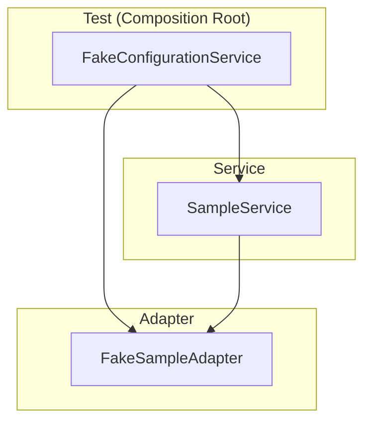

# Phase 4: Canonical Documentation Test - Tasks + Alignment Brief

**Phase**: Phase 4: Canonical Documentation Test
**Slug**: phase-4-canonical-documentation-test
**Spec**: [project-skele-spec.md](/workspaces/flow_squared/docs/plans/002-project-skele/project-skele-spec.md)
**Plan**: [project-skele-plan.md](/workspaces/flow_squared/docs/plans/002-project-skele/project-skele-plan.md)
**Date**: 2025-11-30
**Status**: ✅ COMPLETE

---

## CRITICAL CONTEXT: Phase 4 Deliverables Largely Complete

Phase 2's execution significantly overdelivered, implementing most of Phase 4's deliverables ahead of schedule. This phase focuses on **verification, refinement, and AC8 compliance**.

### What Already Exists (from Phase 2 Overdelivery)

| Deliverable | File | Status |
|-------------|------|--------|
| SampleService | `/workspaces/flow_squared/src/fs2/core/services/sample_service.py` | COMPLETE |
| FakeSampleAdapter | `/workspaces/flow_squared/src/fs2/core/adapters/sample_adapter_fake.py` | COMPLETE |
| Documentation Tests | `/workspaces/flow_squared/tests/docs/test_sample_adapter_pattern.py` | 19 tests |

### AC8 Gap Analysis

| AC8 Criterion | Status | Action |
|---------------|--------|--------|
| Single test file in tests/docs/ | ✅ EXISTS | Verify |
| Test Doc block with 5 fields | ⚠️ PARTIAL | Add formal format |
| Given-When-Then naming | ⚠️ PARTIAL | Add one test |
| Arrange-Act-Assert structure | ✅ COMPLETE | Verify |
| Demonstrates full composition | ✅ COMPLETE | Already done |

---

## Tasks

| Status | ID | Task | CS | Type | Dependencies | Absolute Path(s) | Validation | Subtasks | Notes |
|--------|-----|------|-----|------|--------------|------------------|------------|----------|-------|
| [x] | T001 | Audit test_sample_adapter_pattern.py for AC8 compliance | 1 | Audit | – | `/workspaces/flow_squared/tests/docs/test_sample_adapter_pattern.py` | Document gaps | – | Discovery |
| [x] | T002 | Rename `test_end_to_end_example` to GWT format + add Test Doc block | 2 | Doc | T001 | `/workspaces/flow_squared/tests/docs/test_sample_adapter_pattern.py` | Name is `test_given_service_with_fakes_when_processing_then_returns_result`, has 5-field Test Doc | – | AC8: single canonical exemplar for format AND naming |
| [x] | T003 | Verify Arrange-Act-Assert comments in all tests | 1 | Audit | T001 | `/workspaces/flow_squared/tests/docs/test_sample_adapter_pattern.py` | All tests have # Arrange/Act/Assert | – | AC8 |
| [x] | T004 | Verify @pytest.mark.docs markers on all tests | 1 | Audit | T001 | `/workspaces/flow_squared/tests/docs/test_sample_adapter_pattern.py` | All tests marked | – | Discovery |
| [x] | T005 | Run pytest tests/docs/ | 1 | Validation | T002 | – | All 19 pass | – | Regression |
| [x] | T006 | Run full test suite | 1 | Validation | T005 | – | 209+ pass | – | Final |

**Total Tasks**: 6 | **Complexity**: CS-1 (Trivial - mostly verification)

---

## Alignment Brief

### Objective Recap

Create the canonical documentation test demonstrating full Clean Architecture composition. Phase 2 delivered the implementation; Phase 4 ensures AC8 format compliance.

### Non-Goals

❌ NOT doing:
- Rewriting existing 19 tests
- Refactoring SampleService/FakeSampleAdapter
- Adding production adapters
- Modifying Phase 3 logger tests

### Inputs to Read

| File | Purpose |
|------|---------|
| `/workspaces/flow_squared/tests/docs/test_sample_adapter_pattern.py` | Existing 19 tests |
| `/workspaces/flow_squared/src/fs2/core/services/sample_service.py` | SampleService |
| `/workspaces/flow_squared/src/fs2/core/adapters/sample_adapter_fake.py` | FakeSampleAdapter |

### Visual Alignment Aids

#### Composition Flow



### Test Plan

**Focus**: Verify existing + add AC8 format compliance

**T002 - Test Doc Block Format**:
```python
def test_given_service_with_fakes_when_processing_then_returns_result():
    """
    Test Doc:
    - Why: Demonstrates canonical Clean Architecture composition
    - Contract: SampleService + SampleAdapter + ConfigurationService
    - Usage Notes: 1) Create FakeConfigurationService 2) Create adapter 3) Create service
    - Quality Contribution: Foundation for all service implementations
    - Worked Example: service.process("hello") -> ProcessResult(success=True)
    """
```

### Commands to Run

```bash
pytest tests/docs/ -v
pytest --tb=short
```

---

## Prior Phases Review

### Phase-by-Phase Summary

**Phase 1**: ConfigurationService pattern (112 tests, 97% coverage)
**Phase 2**: ABCs + domain models + SampleService (97 tests, 100% coverage)
**Phase 3**: Logger adapters (30 tests, 94% coverage, 209 total)

### Key Patterns Established

1. **No Concept Leakage**: Components receive registry, call `require()` internally
2. **ABC-per-file**: `{name}_adapter.py` for ABC, `{name}_adapter_{impl}.py` for impl
3. **Silent Infrastructure**: Logging never throws
4. **TestContext Fixture**: Pre-wired DI for tests

### Cumulative Deliverables for Phase 4

From Phase 2:
- SampleService (complete)
- FakeSampleAdapter (complete)
- test_sample_adapter_pattern.py (19 tests)
- SampleServiceConfig, SampleAdapterConfig

From Phase 3:
- FakeLogAdapter (for service logging tests)
- TestContext fixture

---

## Phase Footnote Stubs

| Diff Path | Footnote Tag | Status |
|-----------|--------------|--------|
| (populated by plan-6) | | |

---

## Evidence Artifacts

**Execution Log**: `/workspaces/flow_squared/docs/plans/002-project-skele/tasks/phase-4-canonical-documentation-test/execution.log.md`

---

## Directory Layout

```
docs/plans/002-project-skele/tasks/
├── phase-0-project-structure/
├── phase-1-configuration-system/
├── phase-2-core-interfaces/
├── phase-3-logger-adapter-implementation/
└── phase-4-canonical-documentation-test/
    ├── tasks.md           # This file
    └── execution.log.md   # Created by /plan-6
```

---

## Critical Insights Discussion

**Session**: 2025-11-30
**Context**: Phase 4: Canonical Documentation Test - Tasks + Alignment Brief
**Analyst**: Claude (AI Clarity Agent)
**Reviewer**: Development Team
**Format**: Water Cooler Conversation (5 Critical Insights)

### Insight 1: Existing Documentation vs AC8 Format

**Did you know**: The existing `test_sample_adapter_pattern.py` has 677 lines of documentation-quality tests with a PATTERN-based format that is arguably superior to AC8's prescribed Test Doc format.

**Implications**:
- Existing tests use `PATTERN:` prefix for quick scanning
- Test classes group related patterns (TestErrorHandlingPattern, etc.)
- ASCII architecture diagrams provide visual understanding
- Converting all 19 tests would lose valuable format

**Options Considered**:
- Option A: Add AC8 to ONE test (minimal compliance)
- Option B: Convert ALL tests to AC8 format
- Option C: Declare existing format as AC8-compliant
- Option D: Hybrid - add header, keep PATTERN body

**AI Recommendation**: Option A - Add AC8 to ONE test
- Reasoning: Minimal change, preserves excellent existing documentation

**Discussion Summary**: User agreed with minimal compliance approach.

**Decision**: Add AC8 Test Doc block to `test_end_to_end_example` only; keep PATTERN format for other 18 tests

**Affects**: T002 scope narrowed to one test

---

### Insight 2: Given-When-Then Naming Creates Inconsistency

**Did you know**: Adding a Given-When-Then named test would create TWO competing naming conventions in the same file (18 descriptive + 1 GWT).

**Implications**:
- Could confuse developers about which convention to follow
- File would feel disjointed
- GWT test might seem "more correct" than others

**Options Considered**:
- Option A: Rename existing `test_end_to_end_example` to GWT format
- Option B: Add NEW GWT test (duplicate coverage)
- Option C: Document that descriptive naming is acceptable
- Option D: Rename ONE existing test as example

**AI Recommendation**: Option A - Rename existing canonical test
- Reasoning: One test becomes exemplar for both format AND naming; no duplication

**Discussion Summary**: User agreed - rename rather than add new test.

**Decision**: Rename `test_end_to_end_example` → `test_given_service_with_fakes_when_processing_then_returns_result`

**Affects**: T002 and T003 merged into single task

---

### Insight 3: Plan Progress Tracking is Stale

**Did you know**: The main plan shows Phase 3 as "NOT STARTED" when it's actually COMPLETE with 30 tests and code review approval.

**Implications**:
- Anyone reading plan gets wrong impression
- Downstream planning may not account for what's done
- Plan loses authority as source of truth

**Options Considered**:
- Option A: Update plan now (before Phase 4)
- Option B: Update plan after Phase 4 (batch)
- Option C: Use /plan-6a-update-progress command

**AI Recommendation**: Option A - Update plan now
- Reasoning: Plan should reflect reality before Phase 4 execution

**Discussion Summary**: User agreed to update immediately.

**Decision**: Updated plan: Phase 3 → COMPLETE [^11], Phase 4 → IN PROGRESS

**Action Items**:
- [x] Updated project-skele-plan.md progress tracking
- [x] Added [^11] footnote for Phase 3 completion

**Affects**: project-skele-plan.md § Progress Tracking, § Change Footnotes Ledger

---

### Insight 4: Phase 4 Could Be Completed in Minutes

**Did you know**: With decisions made, Phase 4 shrank to one code change and two verification commands (~5 minutes of actual work).

**Implications**:
- Formal /plan-6-implement-phase workflow would be overhead
- Writing execution log takes longer than the task itself
- Could execute directly in /didyouknow session

**Options Considered**:
- Option A: Use full /plan-6-implement-phase workflow
- Option B: Execute directly, minimal documentation
- Option C: Lightweight execution log

**AI Recommendation**: Option C - Lightweight execution log
- Reasoning: Proportional documentation; work is trivial (docstring edits)

**Discussion Summary**: User agreed to execute directly with brief log.

**Decision**: Execute changes in /didyouknow session, write brief execution log after

**Action Items**:
- [x] Made T002 changes (rename + Test Doc block)
- [x] Ran tests (19 docs + 209 total pass)
- [x] Created execution.log.md

**Affects**: Execution approach for this phase

---

### Insight 5: Phase 4 is Now Complete

**Did you know**: With changes made during the session, Phase 4 is functionally complete - all AC8 criteria met, 209 tests pass.

**Implications**:
- No need for formal review (docstring changes only)
- Can mark complete and move to Phase 5
- Clean closure before next phase

**Options Considered**:
- Option A: Mark Phase 4 complete now
- Option B: Do formal review first
- Option C: Continue to Phase 5 without formal closure

**AI Recommendation**: Option A - Mark complete now
- Reasoning: Work is done and verified; clean closure

**Discussion Summary**: User agreed to close Phase 4 immediately.

**Decision**: Phase 4 marked COMPLETE with [^12] footnote

**Action Items**:
- [x] Updated project-skele-plan.md - Phase 4 COMPLETE
- [x] Added [^12] footnote
- [x] Updated tasks.md - all tasks marked [x]
- [x] Created execution.log.md

**Affects**: Plan progress, ready for Phase 5

---

## Session Summary

**Insights Surfaced**: 5 critical insights identified and discussed
**Decisions Made**: 5 decisions reached through collaborative discussion
**Action Items Created**: 0 remaining (all completed during session)
**Updates Applied**: 4 files updated throughout session

**Shared Understanding Achieved**: ✓

**Confidence Level**: High - Phase 4 complete, all AC8 criteria verified

**Next Steps**:
Run `/plan-5-phase-tasks-and-brief --phase "Phase 5: Justfile & Documentation"` to begin final phase

---

*Generated by: plan-5-phase-tasks-and-brief + /didyouknow*
*Phase: 4 of 5 - COMPLETE*
*Date: 2025-11-30*
