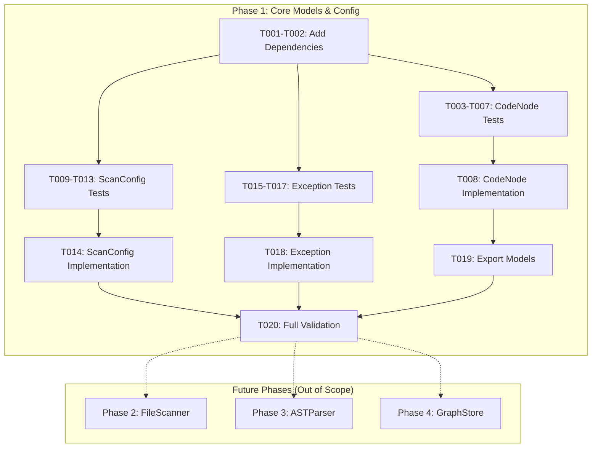
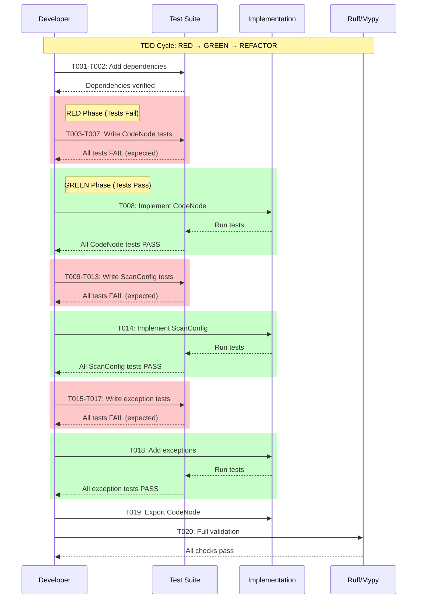

# Phase 1: Core Models and Configuration

**Phase**: Phase 1 - Core Models and Configuration
**Slug**: phase-1
**Spec**: [../../file-scanning-spec.md](../../file-scanning-spec.md)
**Plan**: [../../file-scanning-plan.md](../../file-scanning-plan.md)
**Created**: 2025-12-12
**Status**: READY FOR IMPLEMENTATION

---

## Tasks

| Status | ID | Task | CS | Type | Dependencies | Absolute Path(s) | Validation | Subtasks | Notes |
|--------|-----|------|-----|------|--------------|------------------|------------|----------|-------|
| [ ] | T001 | Add networkx, tree-sitter-language-pack, pathspec to dependencies | 1 | Setup | – | `/workspaces/flow_squared/pyproject.toml` | `uv pip install -e .` succeeds; all three packages importable | – | Pin: networkx>=3.0, tree-sitter-language-pack>=0.0.1, pathspec>=0.12 |
| [ ] | T002 | Verify dependencies install and import correctly | 1 | Setup | T001 | `/workspaces/flow_squared/pyproject.toml` | Python REPL: `import networkx, tree_sitter_language_pack, pathspec` succeeds | – | Run `uv sync` after adding deps |
| [ ] | T003 | Write test: CodeNode is frozen dataclass | 1 | Test | T002 | `/workspaces/flow_squared/tests/unit/models/test_code_node.py` | Test exists, FAILS (module not found) | – | Per Critical Finding 09; tests-first TDD |
| [ ] | T004 | Write test: CodeNode.node_id format validation | 1 | Test | T002 | `/workspaces/flow_squared/tests/unit/models/test_code_node.py` | Test exists, FAILS | – | Per AC7: `{type}:{path}:{symbol}` |
| [ ] | T005 | Write test: CodeNode truncated flag and truncated_at_line | 1 | Test | T002 | `/workspaces/flow_squared/tests/unit/models/test_code_node.py` | Test exists, FAILS | – | Per Critical Finding 12 and AC6 |
| [ ] | T006 | Write test: CodeNode factory methods (create_file, create_class, create_method) | 1 | Test | T002 | `/workspaces/flow_squared/tests/unit/models/test_code_node.py` | Test exists, FAILS | – | Per Critical Finding 09: ok()/fail() pattern |
| [ ] | T007 | Write test: CodeNode optional fields (smart_content, embedding placeholders) | 1 | Test | T002 | `/workspaces/flow_squared/tests/unit/models/test_code_node.py` | Test exists, FAILS | – | Placeholders for future phases |
| [ ] | T008 | Implement CodeNode frozen dataclass to pass all tests | 2 | Core | T003, T004, T005, T006, T007 | `/workspaces/flow_squared/src/fs2/core/models/code_node.py` | All T003-T007 tests pass; `uv run pytest tests/unit/models/test_code_node.py -v` green | – | Frozen dataclass with all fields |
| [ ] | T009 | Write test: ScanConfig loads from YAML with scan_paths | 1 | Test | T002 | `/workspaces/flow_squared/tests/unit/config/test_scan_config.py` | Test exists, FAILS | – | Per AC1 |
| [ ] | T010 | Write test: ScanConfig defaults (max_file_size_kb=500, respect_gitignore=True) | 1 | Test | T002 | `/workspaces/flow_squared/tests/unit/config/test_scan_config.py` | Test exists, FAILS | – | Sensible defaults |
| [ ] | T011 | Write test: ScanConfig follow_symlinks default False | 1 | Test | T002 | `/workspaces/flow_squared/tests/unit/config/test_scan_config.py` | Test exists, FAILS | – | Per Critical Finding 06 |
| [ ] | T012 | Write test: ScanConfig sample_lines_for_large_files field | 1 | Test | T002 | `/workspaces/flow_squared/tests/unit/config/test_scan_config.py` | Test exists, FAILS | – | Per Critical Finding 12 |
| [ ] | T013 | Write test: ScanConfig validation (scan_paths non-empty, max_file_size_kb > 0) | 1 | Test | T002 | `/workspaces/flow_squared/tests/unit/config/test_scan_config.py` | Test exists, FAILS | – | Pydantic @field_validator |
| [ ] | T014 | Implement ScanConfig Pydantic model to pass all tests | 2 | Core | T009, T010, T011, T012, T013 | `/workspaces/flow_squared/src/fs2/config/objects.py` | All T009-T013 tests pass; ScanConfig in YAML_CONFIG_TYPES | – | Add to YAML_CONFIG_TYPES registry |
| [ ] | T015 | Write test: FileScannerError extends AdapterError with actionable message | 1 | Test | T002 | `/workspaces/flow_squared/tests/unit/adapters/test_exceptions.py` | Test exists, FAILS | – | Per Critical Finding 10 |
| [ ] | T016 | Write test: ASTParserError extends AdapterError with actionable message | 1 | Test | T002 | `/workspaces/flow_squared/tests/unit/adapters/test_exceptions.py` | Test exists, FAILS | – | Per Critical Finding 10 |
| [ ] | T017 | Write test: GraphStoreError extends AdapterError with actionable message | 1 | Test | T002 | `/workspaces/flow_squared/tests/unit/adapters/test_exceptions.py` | Test exists, FAILS | – | Per Critical Finding 10 |
| [ ] | T018 | Add FileScannerError, ASTParserError, GraphStoreError to exceptions.py | 1 | Core | T015, T016, T017 | `/workspaces/flow_squared/src/fs2/core/adapters/exceptions.py` | All T015-T017 tests pass | – | Exception docstrings with usage examples |
| [ ] | T019 | Export CodeNode from fs2.core.models.__init__.py | 1 | Core | T008 | `/workspaces/flow_squared/src/fs2/core/models/__init__.py` | `from fs2.core.models import CodeNode` works | – | Add to __all__ |
| [ ] | T020 | Run full test suite and lint check | 1 | Integration | T001-T019 | `/workspaces/flow_squared/` | `uv run pytest tests/unit/ -v` all pass; `uv run ruff check src/fs2/` clean | – | Final validation |

---

## Alignment Brief

### Objective Recap

Phase 1 establishes the foundational domain models and configuration types that all subsequent phases depend on. This phase creates:

1. **CodeNode**: The core data structure representing any code element (file, class, method, function) in the graph
2. **ScanConfig**: Pydantic configuration model for controlling scan behavior
3. **Domain Exceptions**: Type-specific errors for file scanning, AST parsing, and graph storage

### Behavior Checklist (Mapped to Acceptance Criteria)

- [ ] **AC1 (Configuration Loading)**: ScanConfig loads `scan_paths`, `max_file_size_kb`, `respect_gitignore` from YAML
- [ ] **AC6 (Large File Handling)**: CodeNode has `truncated: bool` and `truncated_at_line: int | None` fields
- [ ] **AC7 (Node ID Format)**: CodeNode.node_id follows `{type}:{path}:{symbol}` format

### Non-Goals (Scope Boundaries)

This phase explicitly does **NOT** include:

- File system traversal or directory scanning (Phase 2)
- Tree-sitter parsing or AST extraction (Phase 3)
- NetworkX graph operations or persistence (Phase 4)
- Service orchestration or composition (Phase 5)
- CLI commands or Rich progress bars (Phase 6)
- Smart content generation or LLM summaries (future feature)
- Embedding generation or vector operations (future feature)
- Cross-file relationship detection (future feature)
- Performance optimization or caching (deferred)

### Critical Findings Affecting This Phase

| Finding | Constraint/Requirement | Addressed By |
|---------|------------------------|--------------|
| **01: ConfigurationService Registry Pattern** | ScanConfig must work with `config.require(ScanConfig)` pattern | T014: Pydantic model with `__config_path__` |
| **06: Symlink Handling** | Default `follow_symlinks=False` in ScanConfig | T011, T014: Explicit field with default |
| **09: Frozen Dataclass Domain Models** | CodeNode must be `@dataclass(frozen=True)` | T003, T008: Frozen dataclass implementation |
| **11: Node ID Uniqueness** | Format `{type}:{path}:{symbol}` with counter for anonymous nodes | T004, T008: node_id validation |
| **12: Large File Truncation** | `truncated: bool` field, `sample_lines_for_large_files` config | T005, T012, T008, T014 |

### ADR Decision Constraints

No ADRs exist for this feature. N/A.

### Invariants & Guardrails

- **Immutability**: All domain models must be frozen dataclasses (no mutation after creation)
- **No SDK Types**: Domain models use Python built-in types only (str, int, bool, list, dict)
- **Actionable Errors**: All exceptions include clear remediation guidance in docstrings
- **Clean Imports**: All public types exportable from package roots

### Inputs to Read

| Path | Purpose |
|------|---------|
| `/workspaces/flow_squared/src/fs2/config/objects.py` | Pattern for ScanConfig (Pydantic + __config_path__) |
| `/workspaces/flow_squared/src/fs2/core/models/process_result.py` | Pattern for frozen dataclass with factories |
| `/workspaces/flow_squared/src/fs2/core/adapters/exceptions.py` | Pattern for domain exceptions |
| `/workspaces/flow_squared/src/fs2/core/models/__init__.py` | Export pattern for models |
| `/workspaces/flow_squared/pyproject.toml` | Current dependencies to extend |

### Visual Alignment Aids

#### System Flow Diagram



#### Implementation Sequence Diagram



### Test Plan (Full TDD - Avoid Mocks)

Per spec: **Full TDD approach** with **no mocks** (fakes only where needed).

#### Test File Structure

```
tests/
├── unit/
│   ├── models/
│   │   └── test_code_node.py      # T003-T007 tests
│   ├── config/
│   │   └── test_scan_config.py    # T009-T013 tests
│   └── adapters/
│       └── test_exceptions.py     # T015-T017 tests (extend existing)
```

#### Named Tests with Rationale

**tests/unit/models/test_code_node.py**

| Test Name | Rationale | Expected Output |
|-----------|-----------|-----------------|
| `test_given_code_node_when_created_then_is_frozen` | Proves immutability per Constitution P5 | `AttributeError` on mutation |
| `test_given_method_node_when_created_then_node_id_format_correct` | Verifies AC7 node_id format | ID matches `{type}:{path}:{symbol}` |
| `test_given_large_file_when_truncated_then_flag_set` | Verifies AC6 truncation support | `truncated=True`, `truncated_at_line=N` |
| `test_given_file_when_create_file_factory_then_node_type_is_file` | Factory method correctness | `node_type="file"` |
| `test_given_class_when_create_class_factory_then_node_type_is_class` | Factory method correctness | `node_type="class"` |
| `test_given_method_when_create_method_factory_then_node_type_is_method` | Factory method correctness | `node_type="method"` |
| `test_given_code_node_when_smart_content_none_then_accepted` | Optional placeholder fields | No error, defaults to None |

**tests/unit/config/test_scan_config.py**

| Test Name | Rationale | Expected Output |
|-----------|-----------|-----------------|
| `test_given_yaml_with_scan_paths_when_loaded_then_paths_available` | AC1 configuration loading | Paths list accessible |
| `test_given_no_config_when_defaults_then_sensible_values` | Usability | `max_file_size_kb=500`, `respect_gitignore=True` |
| `test_given_scan_config_when_default_then_follow_symlinks_false` | Critical Finding 06 | `follow_symlinks=False` |
| `test_given_scan_config_when_default_then_sample_lines_present` | Critical Finding 12 | `sample_lines_for_large_files` has default |
| `test_given_empty_scan_paths_when_validated_then_error` | Input validation | `ValidationError` raised |
| `test_given_negative_max_file_size_when_validated_then_error` | Input validation | `ValidationError` raised |

**tests/unit/adapters/test_exceptions.py** (extend existing)

| Test Name | Rationale | Expected Output |
|-----------|-----------|-----------------|
| `test_file_scanner_error_is_adapter_error` | Exception hierarchy | `isinstance(e, AdapterError)` |
| `test_ast_parser_error_is_adapter_error` | Exception hierarchy | `isinstance(e, AdapterError)` |
| `test_graph_store_error_is_adapter_error` | Exception hierarchy | `isinstance(e, AdapterError)` |

#### Fixtures

- No mocks required
- Use `FakeConfigurationService` from existing test infrastructure for config tests
- Use `tmp_path` pytest fixture for any file-based tests (none in Phase 1)

### Step-by-Step Implementation Outline

| Step | Task IDs | Description |
|------|----------|-------------|
| 1 | T001, T002 | Add dependencies and verify installation |
| 2 | T003-T007 | Write ALL CodeNode tests first (expect failures) |
| 3 | T008 | Implement CodeNode to make tests pass |
| 4 | T009-T013 | Write ALL ScanConfig tests first (expect failures) |
| 5 | T014 | Implement ScanConfig to make tests pass |
| 6 | T015-T017 | Write ALL exception tests first (expect failures) |
| 7 | T018 | Add exceptions to make tests pass |
| 8 | T019 | Export CodeNode from models package |
| 9 | T020 | Run full validation suite |

### Commands to Run (Copy/Paste)

```bash
# Environment setup
cd /workspaces/flow_squared
uv sync

# After T001-T002: Verify dependencies
uv run python -c "import networkx; import tree_sitter_language_pack; import pathspec; print('OK')"

# After T003-T007: Run CodeNode tests (expect FAIL)
uv run pytest tests/unit/models/test_code_node.py -v

# After T008: Run CodeNode tests (expect PASS)
uv run pytest tests/unit/models/test_code_node.py -v

# After T009-T013: Run ScanConfig tests (expect FAIL)
uv run pytest tests/unit/config/test_scan_config.py -v

# After T014: Run ScanConfig tests (expect PASS)
uv run pytest tests/unit/config/test_scan_config.py -v

# After T015-T017: Run exception tests (expect FAIL)
uv run pytest tests/unit/adapters/test_exceptions.py -v

# After T018: Run exception tests (expect PASS)
uv run pytest tests/unit/adapters/test_exceptions.py -v

# After T020: Full validation
uv run pytest tests/unit/ -v
uv run ruff check src/fs2/
uv run ruff format --check src/fs2/
```

### Risks/Unknowns

| Risk | Severity | Mitigation |
|------|----------|------------|
| tree-sitter-language-pack Python 3.12 compatibility | Medium | Verify import in T002 before proceeding; check package docs |
| Pydantic v2 field_validator syntax | Low | Follow existing SampleAdapterConfig pattern exactly |
| CodeNode field explosion | Low | Keep minimal; placeholder fields for future (smart_content, embedding) |

### Ready Check

- [ ] Plan file read and understood
- [ ] Spec acceptance criteria mapped to tasks
- [ ] Critical Findings 01, 06, 09, 11, 12 addressed in task design
- [ ] ADR constraints mapped to tasks (N/A - no ADRs exist)
- [ ] TDD order enforced (all test tasks before implementation tasks)
- [ ] No mocks in test plan (fakes only)
- [ ] All file paths are absolute
- [ ] Commands copy/paste ready
- [ ] Visual diagrams reviewed

**Awaiting explicit GO/NO-GO from human sponsor.**

---

## Phase Footnote Stubs

| ID | Description | File:Line | Added By |
|----|-------------|-----------|----------|
| | *(To be populated during plan-6 implementation)* | | |

---

## Evidence Artifacts

Implementation evidence will be written to:

- **Execution Log**: `/workspaces/flow_squared/docs/plans/003-fs2-base/tasks/phase-1/execution.log.md`
- **Test Results**: Captured in execution log with pass/fail counts
- **Lint Output**: Captured in execution log

---

## Directory Layout

```
docs/plans/003-fs2-base/
├── file-scanning-spec.md
├── file-scanning-plan.md
└── tasks/
    └── phase-1/
        ├── tasks.md              # This file
        └── execution.log.md      # Created by /plan-6-implement-phase
```
