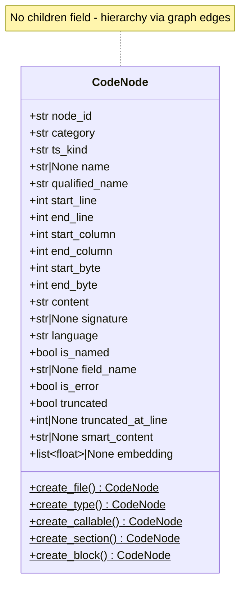
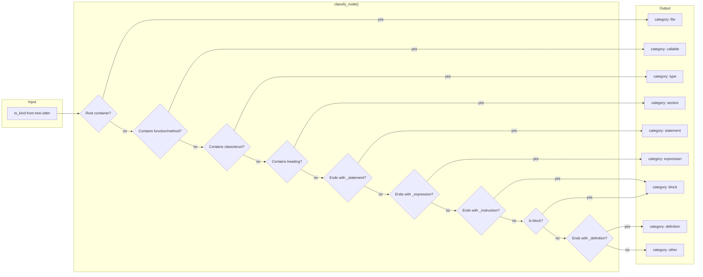
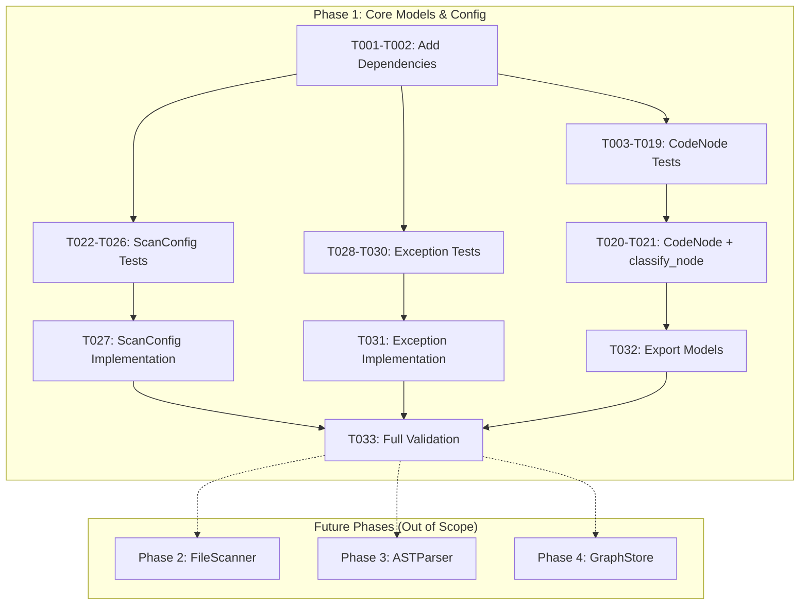

# Phase 1: Core Models and Configuration

**Phase**: Phase 1 - Core Models and Configuration
**Slug**: phase-1
**Spec**: [../../file-scanning-spec.md](../../file-scanning-spec.md)
**Plan**: [../../file-scanning-plan.md](../../file-scanning-plan.md)
**Created**: 2025-12-14
**Status**: COMPLETED

---

## Tasks

| Status | ID | Task | CS | Type | Dependencies | Absolute Path(s) | Validation | Subtasks | Notes |
|--------|-----|------|-----|------|--------------|------------------|------------|----------|-------|
| [x] | T001 | Add networkx, tree-sitter-language-pack, pathspec to dependencies | 1 | Setup | – | `/workspaces/flow_squared/pyproject.toml` | `uv sync` succeeds; all three packages importable | – | Pin: networkx>=3.0, tree-sitter-language-pack>=0.13.0, pathspec>=0.12 |
| [x] | T002 | Verify dependencies install and import correctly | 1 | Setup | T001 | `/workspaces/flow_squared/pyproject.toml` | Python: `import networkx, tree_sitter_language_pack, pathspec` succeeds | – | Run `uv sync` after adding deps |
| [x] | T003 | Write test: CodeNode is frozen dataclass with immutability | 1 | Test | T002 | `/workspaces/flow_squared/tests/unit/models/test_code_node.py` | Test exists, FAILS (module not found) | – | Per Critical Finding 09 |
| [x] | T004 | Write test: CodeNode has both ts_kind (grammar-specific) and category (universal) | 1 | Test | T002 | `/workspaces/flow_squared/tests/unit/models/test_code_node.py` | Test exists, FAILS | – | Dual classification system |
| [x] | T005 | Write test: CodeNode.node_id format (named + anonymous@line) | 1 | Test | T002 | `/workspaces/flow_squared/tests/unit/models/test_code_node.py` | Test exists, FAILS | – | Named: `{cat}:{path}:{qname}`, Anon: `{cat}:{path}:{name}@{line}` |
| [x] | T006 | Write test: CodeNode has both byte offsets AND line/column positions | 1 | Test | T002 | `/workspaces/flow_squared/tests/unit/models/test_code_node.py` | Test exists, FAILS | – | Bytes for slicing, lines for UI |
| [x] | T007 | Write test: CodeNode content and signature fields | 1 | Test | T002 | `/workspaces/flow_squared/tests/unit/models/test_code_node.py` | Test exists, FAILS | – | Full source + first line |
| [x] | T008 | Write test: CodeNode naming fields (name, qualified_name) | 1 | Test | T002 | `/workspaces/flow_squared/tests/unit/models/test_code_node.py` | Test exists, FAILS | – | Hierarchical naming |
| [x] | T009 | Write test: CodeNode metadata fields (language, is_named, field_name) | 1 | Test | T002 | `/workspaces/flow_squared/tests/unit/models/test_code_node.py` | Test exists, FAILS | – | Tree-sitter metadata |
| [x] | T010 | Write test: CodeNode is_error flag for parse errors | 1 | Test | T002 | `/workspaces/flow_squared/tests/unit/models/test_code_node.py` | Test exists, FAILS | – | YAGNI: only is_error, not has_error/is_missing |
| [x] | T011 | Write test: CodeNode truncation fields (truncated, truncated_at_line) | 1 | Test | T002 | `/workspaces/flow_squared/tests/unit/models/test_code_node.py` | Test exists, FAILS | – | Per Critical Finding 12 and AC6 |
| [REMOVED] | T012 | ~~Write test: CodeNode children field~~ | – | – | – | – | – | – | REMOVED: Graph edges handle hierarchy, not embedded children |
| [x] | T013 | Write test: CodeNode placeholder fields (smart_content, embedding) | 1 | Test | T002 | `/workspaces/flow_squared/tests/unit/models/test_code_node.py` | Test exists, FAILS | – | Future phase placeholders |
| [x] | T014 | Write test: CodeNode factory create_file() sets category and formats node_id | 1 | Test | T002 | `/workspaces/flow_squared/tests/unit/models/test_code_node.py` | Test exists, FAILS | – | Factory encapsulates ID logic |
| [x] | T015 | Write test: CodeNode factory create_type() for class/struct/interface | 1 | Test | T002 | `/workspaces/flow_squared/tests/unit/models/test_code_node.py` | Test exists, FAILS | – | Universal "type" category |
| [x] | T016 | Write test: CodeNode factory create_callable() for function/method | 1 | Test | T002 | `/workspaces/flow_squared/tests/unit/models/test_code_node.py` | Test exists, FAILS | – | Universal "callable" category |
| [x] | T017 | Write test: CodeNode factory create_section() for markdown headings | 1 | Test | T002 | `/workspaces/flow_squared/tests/unit/models/test_code_node.py` | Test exists, FAILS | – | Markup support |
| [x] | T018 | Write test: CodeNode factory create_block() for terraform/dockerfile | 1 | Test | T002 | `/workspaces/flow_squared/tests/unit/models/test_code_node.py` | Test exists, FAILS | – | IaC support |
| [x] | T019 | Write test: classify_node() maps ts_kind to category via patterns | 2 | Test | T002 | `/workspaces/flow_squared/tests/unit/models/test_code_node.py` | Test exists, FAILS | – | Language-agnostic classification |
| [x] | T020 | Implement CodeNode frozen dataclass with all fields | 3 | Core | T003-T018 | `/workspaces/flow_squared/src/fs2/core/models/code_node.py` | All T003-T018 tests pass | – | ~20 fields, frozen dataclass |
| [x] | T021 | Implement classify_node() utility function | 2 | Core | T019 | `/workspaces/flow_squared/src/fs2/core/models/code_node.py` | T019 test passes | – | Pattern-based, no per-language code |
| [x] | T022 | Write test: ScanConfig loads from YAML with scan_paths | 1 | Test | T002 | `/workspaces/flow_squared/tests/unit/config/test_scan_config.py` | Test exists, FAILS | – | Per AC1 |
| [x] | T023 | Write test: ScanConfig defaults (max_file_size_kb=500, respect_gitignore=True) | 1 | Test | T002 | `/workspaces/flow_squared/tests/unit/config/test_scan_config.py` | Test exists, FAILS | – | Sensible defaults |
| [x] | T024 | Write test: ScanConfig follow_symlinks default False | 1 | Test | T002 | `/workspaces/flow_squared/tests/unit/config/test_scan_config.py` | Test exists, FAILS | – | Per Critical Finding 06 |
| [x] | T025 | Write test: ScanConfig sample_lines_for_large_files field | 1 | Test | T002 | `/workspaces/flow_squared/tests/unit/config/test_scan_config.py` | Test exists, FAILS | – | Per Critical Finding 12 |
| [x] | T026 | Write test: ScanConfig validation (scan_paths list, max_file_size_kb > 0) | 1 | Test | T002 | `/workspaces/flow_squared/tests/unit/config/test_scan_config.py` | Test exists, FAILS | – | Pydantic @field_validator |
| [x] | T027 | Implement ScanConfig Pydantic model to pass all tests | 2 | Core | T022-T026 | `/workspaces/flow_squared/src/fs2/config/objects.py` | All T022-T026 tests pass; ScanConfig in YAML_CONFIG_TYPES | – | Add to YAML_CONFIG_TYPES registry |
| [x] | T028 | Write test: FileScannerError extends AdapterError | 1 | Test | T002 | `/workspaces/flow_squared/tests/unit/adapters/test_exceptions.py` | Test exists, FAILS | – | Per Critical Finding 10 |
| [x] | T029 | Write test: ASTParserError extends AdapterError | 1 | Test | T002 | `/workspaces/flow_squared/tests/unit/adapters/test_exceptions.py` | Test exists, FAILS | – | Per Critical Finding 10 |
| [x] | T030 | Write test: GraphStoreError extends AdapterError | 1 | Test | T002 | `/workspaces/flow_squared/tests/unit/adapters/test_exceptions.py` | Test exists, FAILS | – | Per Critical Finding 10 |
| [x] | T031 | Add FileScannerError, ASTParserError, GraphStoreError to exceptions.py | 1 | Core | T028-T030 | `/workspaces/flow_squared/src/fs2/core/adapters/exceptions.py` | All T028-T030 tests pass | – | Exception docstrings |
| [x] | T032 | Export CodeNode and classify_node from fs2.core.models.__init__.py | 1 | Core | T020, T021 | `/workspaces/flow_squared/src/fs2/core/models/__init__.py` | `from fs2.core.models import CodeNode, classify_node` works | – | Add to __all__ |
| [x] | T033 | Run full test suite and lint check | 1 | Integration | T001-T032 | `/workspaces/flow_squared/` | `uv run pytest tests/unit/ -v` all pass; `uv run ruff check src/fs2/` clean | – | Final validation |

---

## Alignment Brief

### Objective Recap

Phase 1 establishes the foundational domain models and configuration types that all subsequent phases depend on. This phase creates:

1. **CodeNode**: Universal code node representing ANY structural element from ANY language
2. **classify_node()**: Language-agnostic classification utility using pattern matching
3. **ScanConfig**: Pydantic configuration model for controlling scan behavior
4. **Domain Exceptions**: Type-specific errors for file scanning, AST parsing, and graph storage

### CodeNode Design Specification

Based on research from Universal AST Parser plan and initial_exploration prototype, CodeNode uses a **dual classification system**:

```python
@dataclass(frozen=True)
class CodeNode:
    """
    Universal code node representing any structural element from any language.

    Design Principles:
    - Language-agnostic: Works for Python, JavaScript, Markdown, Terraform, etc.
    - Dual classification: ts_kind (grammar-specific) + category (universal)
    - Hierarchical: Children are nested CodeNode objects
    - Content-rich: Full source text for embeddings and AI
    """

    # === Identity ===
    node_id: str
    # Format: {category}:{file_path}:{qualified_name_or_position}
    # Named nodes use qualified_name, anonymous use @line for idempotency
    # Examples:
    #   "callable:src/calc.py:Calculator.add"   # Named - qualified_name
    #   "type:src/models.py:User"               # Named - qualified_name
    #   "section:README.md:Installation"        # Named - qualified_name
    #   "expression:main.py:lambda@42"          # Anonymous - @line number

    # === Classification (DUAL) ===
    category: str
    # Universal taxonomy for language-agnostic queries
    # Values: "file", "type", "callable", "section", "block",
    #         "definition", "statement", "expression", "literal", "other"

    ts_kind: str
    # Original tree-sitter node type from grammar
    # Examples: "class_definition", "function_declaration", "atx_heading"
    # Preserved for grammar-specific logic when universal abstraction insufficient

    # === Naming ===
    name: str | None
    # Simple name: "add", "User", "Installation"
    # None for anonymous nodes (lambdas, expressions)

    qualified_name: str
    # Hierarchical name within file: "Calculator.add", "User", "lambda#0"
    # Built by traversing parent chain, joined by '.'

    # === Location (BOTH formats) ===
    start_line: int        # 1-indexed for humans
    end_line: int
    start_column: int
    end_column: int
    start_byte: int        # 0-indexed for slicing source bytes
    end_byte: int

    # === Content ===
    content: str
    # Full source text of this node (includes all children)
    # Used for embeddings, AI summaries, display
    # NOTE: Intentionally duplicated across hierarchy levels

    signature: str | None
    # First line(s) of declaration for quick reference
    # Examples:
    #   Python: "def add(self, a: int, b: int) -> int:"
    #   Markdown: "## Installation"
    #   Terraform: 'resource "aws_instance" "web" {'

    # === Metadata ===
    language: str
    # Source language/grammar: "python", "javascript", "markdown", "hcl"

    is_named: bool
    # Tree-sitter distinction: True = structural node, False = punctuation
    # Typically only is_named=True nodes become CodeNodes

    field_name: str | None
    # Relationship to parent: "name", "body", "parameters", "condition"
    # Provided by tree-sitter for nodes accessed via parent fields

    # === Error Flag ===
    is_error: bool = False     # This node is an ERROR node (unparseable chunk)
    # YAGNI: has_error and is_missing removed - add later if needed

    # === Large File Handling ===
    truncated: bool = False
    truncated_at_line: int | None = None

    # === NO CHILDREN FIELD ===
    # Hierarchy is represented via graph edges (child_of), NOT embedded children.
    # Each CodeNode is a unique entity; relationships live in GraphStore.
    # To find children: graph.predecessors(node_id, edge_type='child_of')
    # To find parent: graph.successors(node_id, edge_type='child_of')

    # === Future Placeholders ===
    smart_content: str | None = None   # AI-generated summary
    embedding: list[float] | None = None  # Vector representation
```

### Classification Logic (Language-Agnostic)

The `classify_node()` function derives `category` from `ts_kind` using **only pattern matching** - no per-language code:

```python
def classify_node(ts_kind: str) -> str:
    """
    Map tree-sitter node type to universal category.

    100% language-agnostic via suffix/substring patterns.
    Works for any language tree-sitter can parse, including new ones.
    """
    # Root containers (direct match)
    if ts_kind in ('module', 'program', 'source_file', 'document',
                   'compilation_unit', 'translation_unit', 'config_file', 'stream'):
        return 'file'

    # Substring patterns - tree-sitter grammars follow naming conventions
    if any(x in ts_kind for x in ('function', 'method', 'lambda', 'procedure')):
        return 'callable'

    if any(x in ts_kind for x in ('class', 'struct', 'interface', 'enum', 'type_alias')):
        return 'type'

    if 'heading' in ts_kind:
        return 'section'

    # Suffix patterns
    if ts_kind.endswith('_statement'):
        return 'statement'

    if ts_kind.endswith('_expression'):
        return 'expression'

    if ts_kind.endswith('_instruction'):  # Dockerfile
        return 'block'

    if ts_kind == 'block' or ts_kind.endswith('_block'):
        return 'block'

    if ts_kind.endswith(('_definition', '_declaration', '_item', '_specifier')):
        return 'definition'

    # Fallback - downstream can still use ts_kind for queries
    return 'other'
```

### Factory Methods

Factories encapsulate `node_id` formatting and `category` assignment:

| Factory | Category | node_id Format |
|---------|----------|----------------|
| `create_file()` | `"file"` | `file:{path}` |
| `create_type()` | `"type"` | `type:{path}:{qualified_name}` |
| `create_callable()` | `"callable"` | `callable:{path}:{qualified_name}` |
| `create_section()` | `"section"` | `section:{path}:{qualified_name}` |
| `create_block()` | `"block"` | `block:{path}:{qualified_name}` |

Anonymous nodes use line position: `expression:{path}:lambda@42` (idempotent, no counter state needed)

### Behavior Checklist (Mapped to Acceptance Criteria)

- [ ] **AC1 (Configuration Loading)**: ScanConfig loads `scan_paths`, `max_file_size_kb`, `respect_gitignore` from YAML
- [ ] **AC6 (Large File Handling)**: CodeNode has `truncated: bool` and `truncated_at_line: int | None` fields
- [ ] **AC7 (Node ID Format)**: CodeNode.node_id follows `{category}:{path}:{qualified_name}` format

### Non-Goals (Scope Boundaries)

This phase explicitly does **NOT** include:

- File system traversal or directory scanning (Phase 2)
- Tree-sitter parsing or AST extraction (Phase 3)
- NetworkX graph operations or persistence (Phase 4)
- Service orchestration or composition (Phase 5)
- CLI commands or Rich progress bars (Phase 6)
- Smart content generation or LLM summaries (future feature)
- Embedding generation or vector operations (future feature)
- Cross-file relationship detection (future feature)
- Performance optimization or caching (deferred)
- Per-language classification code (not needed - pattern matching works)

### Critical Findings Affecting This Phase

| Finding | Constraint/Requirement | Addressed By |
|---------|------------------------|--------------|
| **01: ConfigurationService Registry Pattern** | ScanConfig must work with `config.require(ScanConfig)` pattern | T027: Pydantic model with `__config_path__` |
| **06: Symlink Handling** | Default `follow_symlinks=False` in ScanConfig | T024, T027: Explicit field with default |
| **09: Frozen Dataclass Domain Models** | CodeNode must be `@dataclass(frozen=True)` | T003, T020: Frozen dataclass implementation |
| **11: Node ID Uniqueness** | Position-based for anonymous nodes (idempotent) | T005, T020: node_id with `@line` suffix |
| **12: Large File Truncation** | `truncated: bool` field, `sample_lines_for_large_files` config | T011, T025, T020, T027 |
| **Universal AST Parser Research** | Dual classification (ts_kind + category); hierarchy via graph | T004, T019-T021; T012 REMOVED |

### ADR Decision Constraints

No ADRs exist for this feature. N/A.

### Invariants & Guardrails

- **Immutability**: All domain models must be frozen dataclasses (no mutation after creation)
- **No SDK Types**: Domain models use Python built-in types only (str, int, bool, list, dict)
- **Language-Agnostic**: No per-language code in classification - patterns only
- **Dual Classification**: Always store BOTH ts_kind (original) and category (derived)
- **Graph-Based Hierarchy**: Hierarchy via graph edges (`child_of`), NOT embedded children
- **Unique Entities**: Each CodeNode has unique `node_id` (flowspace ID) for graph identity
- **Actionable Errors**: All exceptions include clear remediation guidance in docstrings
- **Clean Imports**: All public types exportable from package roots

### Inputs to Read

| Path | Purpose |
|------|---------|
| `/workspaces/flow_squared/src/fs2/config/objects.py` | Pattern for ScanConfig (Pydantic + __config_path__) |
| `/workspaces/flow_squared/src/fs2/core/models/process_result.py` | Pattern for frozen dataclass with factories |
| `/workspaces/flow_squared/src/fs2/core/adapters/exceptions.py` | Pattern for domain exceptions |
| `/workspaces/flow_squared/src/fs2/core/models/__init__.py` | Export pattern for models |
| `/workspaces/flow_squared/pyproject.toml` | Current dependencies to extend |
| `/workspaces/flow_squared/docs/plans/001-universal-ast-parser/` | Research findings on AST structure |
| `/workspaces/flow_squared/initial_exploration/FINDINGS.md` | Prototype learnings |

### Visual Alignment Aids

#### CodeNode Structure Diagram



#### Classification Flow



#### System Flow Diagram



### Test Plan (Full TDD - Avoid Mocks)

Per spec: **Full TDD approach** with **no mocks** (fakes only where needed).

#### Test File Structure

```
tests/
├── unit/
│   ├── models/
│   │   └── test_code_node.py      # T003-T021 tests (17 test tasks)
│   ├── config/
│   │   └── test_scan_config.py    # T022-T026 tests
│   └── adapters/
│       └── test_exceptions.py     # T028-T030 tests (extend existing)
```

#### Named Tests with Rationale

**tests/unit/models/test_code_node.py**

| Test Name | Task | Rationale | Expected Output |
|-----------|------|-----------|-----------------|
| `test_code_node_is_frozen_dataclass` | T003 | Proves immutability per Constitution P5 | `AttributeError` on mutation |
| `test_code_node_has_dual_classification` | T004 | Verifies ts_kind AND category both stored | Both fields accessible |
| `test_code_node_node_id_format` | T005 | Verifies AC7 format `{category}:{path}:{qualified_name}` | ID matches format |
| `test_code_node_has_byte_and_line_positions` | T006 | Both byte offsets and line/col available | All 6 position fields set |
| `test_code_node_content_and_signature` | T007 | Content = full source, signature = first line | Both fields populated |
| `test_code_node_name_and_qualified_name` | T008 | Simple name + hierarchical qualified name | "add" and "Calculator.add" |
| `test_code_node_metadata_fields` | T009 | language, is_named, field_name present | All metadata accessible |
| `test_code_node_is_error_flag` | T010 | is_error flag for ERROR nodes | `is_error` defaults to False |
| `test_code_node_truncation_fields` | T011 | truncated + truncated_at_line for large files | Per AC6 |
| ~~`test_code_node_children_are_nested`~~ | ~~T012~~ | ~~REMOVED - hierarchy via graph edges~~ | ~~N/A~~ |
| `test_code_node_placeholder_fields` | T013 | smart_content, embedding default to None | Future compatibility |
| `test_create_file_sets_category_and_node_id` | T014 | Factory sets category="file" | node_id = "file:{path}" |
| `test_create_type_for_class_struct_interface` | T015 | Factory handles all type kinds | category="type" |
| `test_create_callable_for_function_method` | T016 | Factory handles all callable kinds | category="callable" |
| `test_create_section_for_markdown_heading` | T017 | Factory handles markup sections | category="section" |
| `test_create_block_for_terraform_dockerfile` | T018 | Factory handles IaC blocks | category="block" |
| `test_classify_node_patterns` | T019 | Pattern matching works across languages | Correct category for each ts_kind |

**tests/unit/config/test_scan_config.py**

| Test Name | Task | Rationale | Expected Output |
|-----------|------|-----------|-----------------|
| `test_scan_config_loads_from_yaml` | T022 | AC1 configuration loading | Paths list accessible |
| `test_scan_config_defaults` | T023 | Usability | `max_file_size_kb=500`, `respect_gitignore=True` |
| `test_scan_config_follow_symlinks_default_false` | T024 | Critical Finding 06 | `follow_symlinks=False` |
| `test_scan_config_sample_lines_field` | T025 | Critical Finding 12 | `sample_lines_for_large_files` has default |
| `test_scan_config_validation` | T026 | Input validation | `ValidationError` for invalid values |

**tests/unit/adapters/test_exceptions.py** (extend existing)

| Test Name | Task | Rationale | Expected Output |
|-----------|------|-----------|-----------------|
| `test_file_scanner_error_is_adapter_error` | T028 | Exception hierarchy | `isinstance(e, AdapterError)` |
| `test_ast_parser_error_is_adapter_error` | T029 | Exception hierarchy | `isinstance(e, AdapterError)` |
| `test_graph_store_error_is_adapter_error` | T030 | Exception hierarchy | `isinstance(e, AdapterError)` |

#### Test Examples (Write First!)

```python
# tests/unit/models/test_code_node.py

import pytest
from dataclasses import FrozenInstanceError
from fs2.core.models.code_node import CodeNode, classify_node


class TestCodeNodeStructure:
    """Tests for CodeNode dataclass structure and immutability."""

    def test_code_node_is_frozen_dataclass(self):
        """
        Purpose: Proves CodeNode immutability per Constitution P5.
        Quality Contribution: Prevents accidental mutation across async contexts.
        Acceptance Criteria: Mutation raises FrozenInstanceError/AttributeError.
        """
        node = CodeNode(
            node_id="callable:src/calc.py:Calculator.add",
            category="callable",
            ts_kind="function_definition",
            name="add",
            qualified_name="Calculator.add",
            start_line=10,
            end_line=15,
            start_column=4,
            end_column=20,
            start_byte=200,
            end_byte=350,
            content="def add(self, a, b):\n    return a + b",
            signature="def add(self, a, b):",
            language="python",
            is_named=True,
            field_name="body",
        )

        with pytest.raises((FrozenInstanceError, AttributeError)):
            node.name = "changed"

    def test_code_node_has_dual_classification(self):
        """
        Purpose: Verifies both ts_kind (grammar-specific) and category (universal) stored.
        Quality Contribution: Enables language-agnostic queries while preserving grammar detail.
        Acceptance Criteria: Both fields accessible with different values.
        """
        node = CodeNode(
            node_id="type:src/models.py:User",
            category="type",                    # Universal
            ts_kind="class_definition",         # Grammar-specific (Python)
            name="User",
            qualified_name="User",
            start_line=1,
            end_line=20,
            start_column=0,
            end_column=0,
            start_byte=0,
            end_byte=400,
            content="class User:\n    pass",
            signature="class User:",
            language="python",
            is_named=True,
            field_name=None,
        )

        assert node.category == "type"
        assert node.ts_kind == "class_definition"
        assert node.category != node.ts_kind  # Different values

    def test_code_node_has_byte_and_line_positions(self):
        """
        Purpose: Verifies both byte offsets (for slicing) and line/col (for UI) available.
        Quality Contribution: Supports both programmatic access and human display.
        Acceptance Criteria: All 6 position fields set and accessible.
        """
        node = CodeNode(
            node_id="callable:src/main.py:process",
            category="callable",
            ts_kind="function_definition",
            name="process",
            qualified_name="process",
            start_line=42,          # 1-indexed for humans
            end_line=50,
            start_column=0,
            end_column=15,
            start_byte=1200,        # 0-indexed for slicing
            end_byte=1500,
            content="def process(): ...",
            signature="def process():",
            language="python",
            is_named=True,
            field_name=None,
        )

        # Line positions (1-indexed)
        assert node.start_line == 42
        assert node.end_line == 50
        assert node.start_column == 0
        assert node.end_column == 15

        # Byte positions (0-indexed)
        assert node.start_byte == 1200
        assert node.end_byte == 1500

    # T012 REMOVED: Children are represented via graph edges, not embedded field.
    # Hierarchy test moved to Phase 4 (GraphStore) integration tests.


class TestCodeNodeFactories:
    """Tests for CodeNode factory methods."""

    def test_create_file_sets_category_and_node_id(self):
        """
        Purpose: Verifies create_file() sets category="file" and formats node_id.
        Quality Contribution: Encapsulates ID formatting logic in factory.
        Acceptance Criteria: node_id = "file:{path}", category = "file".
        """
        node = CodeNode.create_file(
            file_path="src/main.py",
            language="python",
            ts_kind="module",
            start_byte=0,
            end_byte=1000,
            content="# Main module\nimport os\n...",
        )

        assert node.category == "file"
        assert node.node_id == "file:src/main.py"
        assert node.ts_kind == "module"
        assert node.language == "python"

    def test_create_callable_for_function_method(self):
        """
        Purpose: Verifies create_callable() handles functions, methods, lambdas.
        Quality Contribution: Universal callable creation regardless of ts_kind.
        Acceptance Criteria: category = "callable", node_id formatted correctly.
        """
        node = CodeNode.create_callable(
            file_path="src/utils.py",
            language="python",
            ts_kind="function_definition",
            name="helper",
            qualified_name="helper",
            start_line=10,
            end_line=15,
            start_column=0,
            end_column=0,
            start_byte=200,
            end_byte=350,
            content="def helper(): pass",
            signature="def helper():",
        )

        assert node.category == "callable"
        assert node.node_id == "callable:src/utils.py:helper"

    def test_create_section_for_markdown_heading(self):
        """
        Purpose: Verifies create_section() handles markdown headings.
        Quality Contribution: Supports markup documentation parsing.
        Acceptance Criteria: category = "section" for heading nodes.
        """
        node = CodeNode.create_section(
            file_path="docs/README.md",
            language="markdown",
            ts_kind="atx_heading",
            name="Installation",
            qualified_name="Installation",
            start_line=5,
            end_line=5,
            start_column=0,
            end_column=15,
            start_byte=50,
            end_byte=65,
            content="## Installation",
            signature="## Installation",
        )

        assert node.category == "section"
        assert node.node_id == "section:docs/README.md:Installation"


class TestClassifyNode:
    """Tests for classify_node() pattern matching function."""

    def test_classify_root_containers(self):
        """
        Purpose: Verifies root container types map to "file" category.
        Quality Contribution: Consistent file-level classification across languages.
        """
        assert classify_node("module") == "file"           # Python
        assert classify_node("program") == "file"          # JavaScript
        assert classify_node("source_file") == "file"      # Go, Rust
        assert classify_node("document") == "file"         # Markdown
        assert classify_node("compilation_unit") == "file" # Java

    def test_classify_callables(self):
        """
        Purpose: Verifies function/method types map to "callable" category.
        Quality Contribution: Language-agnostic callable queries.
        """
        assert classify_node("function_definition") == "callable"   # Python
        assert classify_node("function_declaration") == "callable"  # JS, Go
        assert classify_node("method_definition") == "callable"     # Python
        assert classify_node("method_declaration") == "callable"    # Java
        assert classify_node("lambda") == "callable"                # Python
        assert classify_node("arrow_function") == "callable"        # JS (contains "function")

    def test_classify_types(self):
        """
        Purpose: Verifies class/struct/interface types map to "type" category.
        Quality Contribution: Language-agnostic type queries.
        """
        assert classify_node("class_definition") == "type"      # Python
        assert classify_node("class_declaration") == "type"     # JS, Java
        assert classify_node("struct_item") == "type"           # Rust
        assert classify_node("interface_declaration") == "type" # TS
        assert classify_node("enum_declaration") == "type"      # Many languages

    def test_classify_sections(self):
        """
        Purpose: Verifies heading types map to "section" category.
        Quality Contribution: Markup document structure support.
        """
        assert classify_node("atx_heading") == "section"    # Markdown
        assert classify_node("setext_heading") == "section" # Markdown

    def test_classify_blocks(self):
        """
        Purpose: Verifies block/instruction types map to "block" category.
        Quality Contribution: IaC (Terraform, Dockerfile) support.
        """
        assert classify_node("block") == "block"            # HCL/Terraform
        assert classify_node("FROM_instruction") == "block" # Dockerfile
        assert classify_node("RUN_instruction") == "block"  # Dockerfile
        assert classify_node("if_block") == "block"         # Various

    def test_classify_fallback_to_other(self):
        """
        Purpose: Verifies unknown types return "other" category.
        Quality Contribution: Graceful handling of unrecognized node types.
        """
        assert classify_node("unknown_thing") == "other"
        assert classify_node("xyz123") == "other"
```

#### Fixtures

- No mocks required
- Use `FakeConfigurationService` from existing test infrastructure for config tests
- Use `tmp_path` pytest fixture for any file-based tests (none in Phase 1)

### Step-by-Step Implementation Outline

| Step | Task IDs | Description |
|------|----------|-------------|
| 1 | T001-T002 | Add dependencies and verify installation |
| 2 | T003-T019 | Write ALL CodeNode tests first (expect failures) |
| 3 | T020-T021 | Implement CodeNode and classify_node to make tests pass |
| 4 | T022-T026 | Write ALL ScanConfig tests first (expect failures) |
| 5 | T027 | Implement ScanConfig to make tests pass |
| 6 | T028-T030 | Write ALL exception tests first (expect failures) |
| 7 | T031 | Add exceptions to make tests pass |
| 8 | T032 | Export CodeNode and classify_node from models package |
| 9 | T033 | Run full validation suite |

### Commands to Run (Copy/Paste)

```bash
# Environment setup
cd /workspaces/flow_squared
uv sync

# After T001-T002: Verify dependencies
uv run python -c "import networkx; import tree_sitter_language_pack; import pathspec; print('OK')"

# After T003-T019: Run CodeNode tests (expect FAIL)
uv run pytest tests/unit/models/test_code_node.py -v

# After T020-T021: Run CodeNode tests (expect PASS)
uv run pytest tests/unit/models/test_code_node.py -v

# After T022-T026: Run ScanConfig tests (expect FAIL)
uv run pytest tests/unit/config/test_scan_config.py -v

# After T027: Run ScanConfig tests (expect PASS)
uv run pytest tests/unit/config/test_scan_config.py -v

# After T028-T030: Run exception tests (expect FAIL)
uv run pytest tests/unit/adapters/test_exceptions.py -v

# After T031: Run exception tests (expect PASS)
uv run pytest tests/unit/adapters/test_exceptions.py -v

# After T033: Full validation
uv run pytest tests/unit/ -v
uv run ruff check src/fs2/
uv run ruff format --check src/fs2/
```

### Risks/Unknowns

| Risk | Severity | Mitigation |
|------|----------|------------|
| tree-sitter-language-pack Python 3.12 compatibility | Low | Package v0.13.0 supports Python 3.10+; verify in T002 |
| Pattern matching misses edge cases | Medium | classify_node returns "other" as fallback; can refine patterns later |
| Nested children serialization | Low | Frozen dataclass with list works; test in T012 |
| Large number of CodeNode fields (~20) | Low | All fields have clear purpose; frozen ensures no creep |

### Ready Check

- [ ] Plan file read and understood
- [ ] Spec acceptance criteria mapped to tasks
- [ ] Critical Findings 01, 06, 09, 11, 12 addressed in task design
- [ ] Universal AST Parser research incorporated (dual classification, nested children)
- [ ] ADR constraints mapped to tasks (N/A - no ADRs exist)
- [ ] TDD order enforced (all test tasks before implementation tasks)
- [ ] No mocks in test plan (fakes only)
- [ ] All file paths are absolute
- [ ] Commands copy/paste ready
- [ ] Visual diagrams reviewed
- [ ] classify_node() is 100% language-agnostic (no per-language code)

**Awaiting explicit GO/NO-GO from human sponsor.**

---

## Phase Footnote Stubs

| ID | Description | FlowSpace IDs | Added By |
|----|-------------|---------------|----------|
| [^1] | Task 1.1 - Dependencies | `file:pyproject.toml` | plan-6a |
| [^2] | Tasks 1.2-1.3 - CodeNode | `class:src/fs2/core/models/code_node.py:CodeNode`, `function:src/fs2/core/models/code_node.py:classify_node`, `file:tests/unit/models/test_code_node.py` | plan-6a |
| [^3] | Tasks 1.4-1.5 - ScanConfig | `class:src/fs2/config/objects.py:ScanConfig`, `file:tests/unit/config/test_scan_config.py` | plan-6a |
| [^4] | Tasks 1.6-1.7 - Exceptions | `class:src/fs2/core/adapters/exceptions.py:FileScannerError`, `class:src/fs2/core/adapters/exceptions.py:ASTParserError`, `class:src/fs2/core/adapters/exceptions.py:GraphStoreError`, `file:tests/unit/adapters/test_exceptions.py` | plan-6a |
| [^5] | Task 1.8 - Model exports | `file:src/fs2/core/models/__init__.py` | plan-6a |

---

## Evidence Artifacts

Implementation evidence will be written to:

- **Execution Log**: `/workspaces/flow_squared/docs/plans/003-fs2-base/tasks/phase-1/execution.log.md`
- **Test Results**: Captured in execution log with pass/fail counts
- **Lint Output**: Captured in execution log

---

## Directory Layout

```
docs/plans/003-fs2-base/
├── file-scanning-spec.md
├── file-scanning-plan.md
└── tasks/
    └── phase-1/
        ├── tasks.md              # This file
        └── execution.log.md      # Created by /plan-6-implement-phase
```

---

## Critical Insights Discussion

**Session**: 2025-12-14
**Context**: Phase 1 Tasks Review (CodeNode Redesign)
**Format**: Water Cooler Conversation

### Insight 1: Full Content Duplication Acceptable

**Did you know**: Storing full source code at every hierarchy level (file, class, method) creates intentional duplication.

**Decision**: Keep full content duplication (Option B) - proven pattern from existing Flowspace, enables full-text search at any level.

**Affects**: T007 (content field), T020 (implementation)

---

### Insight 2: tree-sitter-language-pack is Mature

**Did you know**: tree-sitter-language-pack v0.13.0 (Nov 2025) is actively maintained with 165+ languages, not an unstable v0.0.x package.

**Decision**: Proceed with tree-sitter-language-pack, pin version >=0.13.0

**Affects**: T001 (dependency pinning)

---

### Insight 3: CodeNode Needs Dual Classification

**Did you know**: The Universal AST Parser research reveals CodeNode needs BOTH `ts_kind` (grammar-specific like "class_definition") AND `category` (universal like "type").

**Decision**: Implement dual classification system with pattern-based classify_node() function.

**Affects**: T004, T019-T021 (new tasks for dual classification)

---

### Insight 4: Classification Must Be Language-Agnostic

**Did you know**: The classify_node() function can work with ANY language (including new ones) using only suffix/substring patterns - no per-language mapping code needed.

**Decision**: Implement 100% language-agnostic classification via pattern matching with "other" fallback.

**Affects**: T019, T021 (classify_node implementation)

---

### Insight 5: Hierarchy Via Graph Edges, Not Embedded Children

**Session**: 2025-12-14 (continuation)

**Did you know**: The original design had `children: list[CodeNode]` embedded in each CodeNode, duplicating the hierarchy that will already be stored in GraphStore edges.

**Implications**:
- `children` list is mutable, breaking frozen contract
- Hierarchy stored twice (embedded + graph edges)
- Single source of truth unclear

**Options Considered**:
- Option A: Use tuple instead of list (partial fix)
- Option B: Remove children entirely, use graph edges

**AI Recommendation**: Option B - Remove children field

**Discussion Summary**: User clarified that graph edges WILL include `child_of` relationships (e.g., `Calculator.add --[child_of]--> Calculator`). Each CodeNode is a unique entity with a flowspace ID. Graph is the sole source of truth for hierarchy.

**Decision**: Remove `children` field from CodeNode. Hierarchy represented via graph `child_of` edges.

**Action Items**:
- [x] Remove T012 (children test task)
- [x] Update CodeNode design spec (remove children field)
- [x] Update Mermaid diagram
- [x] Update test examples
- [x] Update Invariants section

**Affects**: T012 (removed), T020 (CodeNode implementation), Phase 4 (GraphStore)

---

### Insight 6: Simplify Error Flags to Just is_error

**Did you know**: The original design had three error flags: `has_error` (this or descendants), `is_error` (this node), and `is_missing` (placeholder inserted). With hierarchy now in the graph, `has_error` requires graph traversal anyway.

**Options Considered**:
- Option A: Keep all three flags (full tree-sitter fidelity)
- Option B: Keep only `is_error` (YAGNI/KISS)

**AI Recommendation**: Option A (keep all for completeness)

**Discussion Summary**: User applied YAGNI and KISS principles - only `is_error` needed now. Others can be added later if actual use case emerges.

**Decision**: Keep only `is_error: bool`. Remove `has_error` and `is_missing`.

**Affects**: T010 (simplified test), T020 (fewer fields in CodeNode)

---

### Insight 7: Factory Methods - Keep Verbose, Explicit Parameters

**Did you know**: Factory methods like `create_callable()` still require ~15 parameters - they only auto-set `category` and `node_id`. This seems like little value for the API surface.

**Options Considered**:
- Option A: Keep as-is (explicit, factories own ID format)
- Option B: Remove factories, direct construction only
- Option C: Factory takes tree-sitter node (couples to TS types)

**AI Recommendation**: Option A

**Discussion Summary**: Factories are valuable for centralizing node_id format (`{category}:{path}:{qname}`). Verbosity is intentional - makes data explicit. Phase 3's ASTParser will wrap these with its own helpers.

**Decision**: Keep factories as-is. Explicit parameters are documentation.

**Affects**: None (confirms current design)

---

### Insight 8: Anonymous Node IDs Use Line Position (Idempotent)

**Did you know**: The original node_id format used counters for anonymous nodes (`lambda#0`, `lambda#1`), but nobody was specified to track the counter state.

**Options Considered**:
- Option A: Caller passes counter (Phase 3 tracks)
- Option B: Position-based (`lambda@42` - line number)
- Option C: Content hash suffix

**AI Recommendation**: Option B (position-based)

**Discussion Summary**: User chose Option B for idempotency - same parse produces same IDs, no state to track, debuggable.

**Decision**: Anonymous nodes use `@line` suffix: `expression:main.py:lambda@42`

**Affects**: T005 (node_id format test), T020 (factory implementation)

---

### Insight 9: Keep signature Field (Memory is Cheap)

**Did you know**: For single-line nodes (headings, short functions), `signature` equals `content` - storing the same string twice.

**Options Considered**:
- Option A: Keep as-is (consistent API, set once at parse)
- Option B: Make optional/computed (less memory)
- Option C: Remove entirely (YAGNI)

**AI Recommendation**: Option A

**Discussion Summary**: Consistent with earlier "just store it all" decision for content duplication. Memory is cheap, API is consistent, no None checks needed.

**Decision**: Keep signature field as-is.

**Affects**: None (confirms current design)

---

## Session Summary

**Previous Session**: 4 insights (content duplication, tree-sitter maturity, dual classification, language-agnostic patterns)
**Current Session**: 5 insights (#5-9)
- #5: Hierarchy via graph edges → children field REMOVED
- #6: Simplified error flags → only `is_error` (YAGNI)
- #7: Keep factories as-is → explicit params are documentation
- #8: Position-based IDs → `@line` for anonymous nodes (idempotent)
- #9: Keep signature field → memory is cheap, consistent API

**Changes Made**:
- T012 REMOVED (no children field)
- T010 simplified (only is_error)
- T005 updated (position-based anonymous IDs)
- CodeNode spec updated (~17 fields now, down from ~20)

**Total Active Tasks**: 32

**Shared Understanding Achieved**: ✓

**Confidence Level**: High - CodeNode design simplified via YAGNI/KISS, single source of truth for hierarchy in graph.
