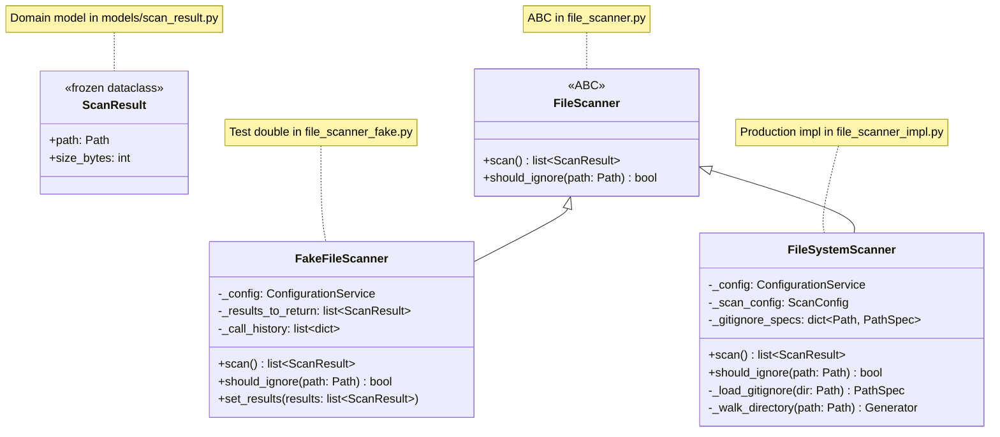
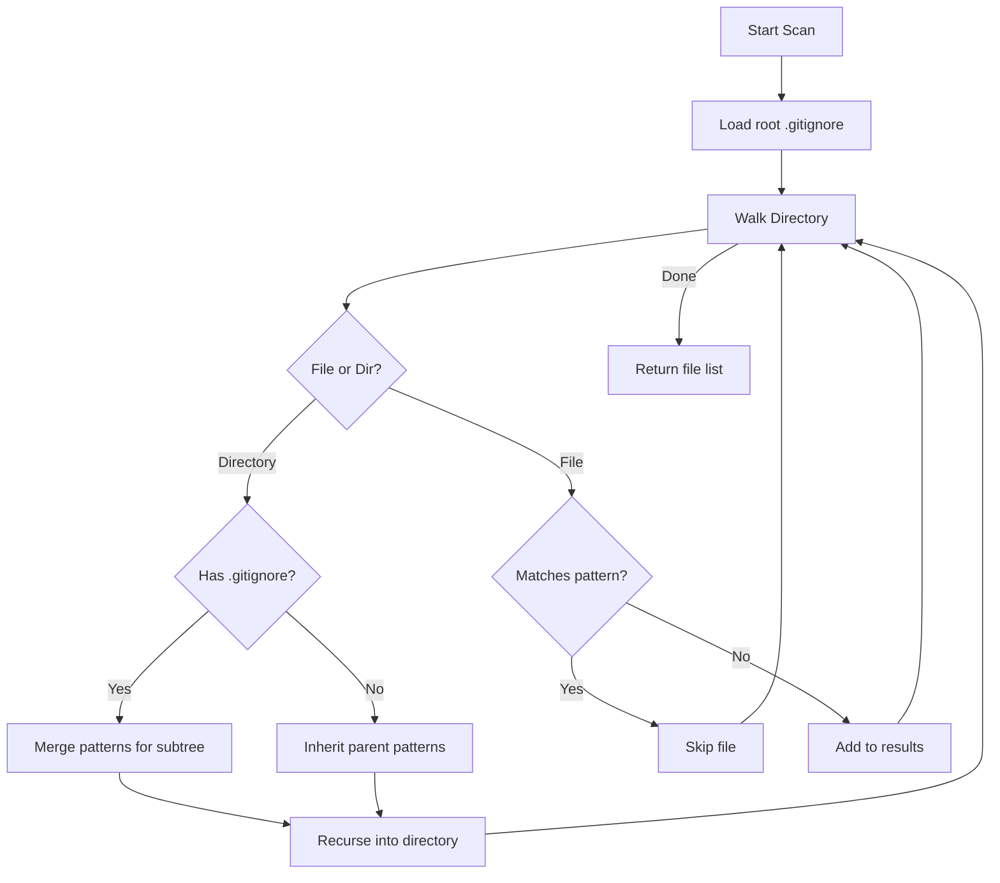
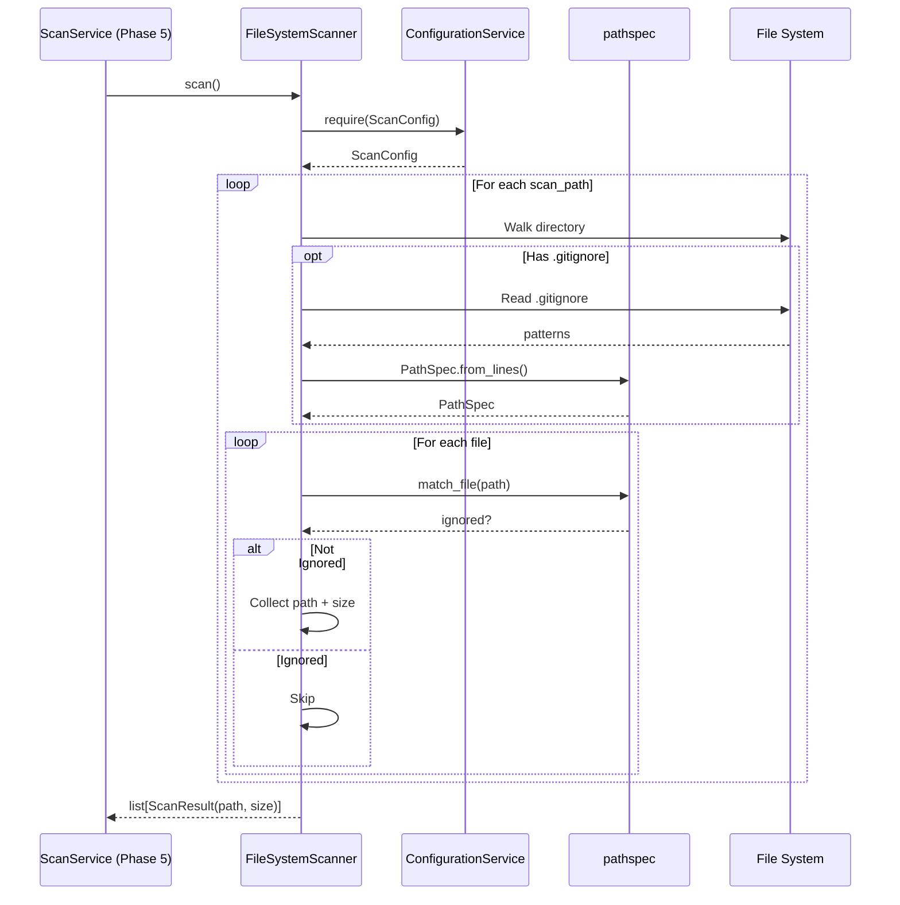

# Phase 2: File Scanner Adapter – Tasks & Alignment Brief

**Phase**: Phase 2 - File Scanner Adapter
**Slug**: phase-2
**Spec**: [../../file-scanning-spec.md](../../file-scanning-spec.md)
**Plan**: [../../file-scanning-plan.md](../../file-scanning-plan.md)
**Created**: 2025-12-15
**Status**: COMPLETED (2025-12-15)

---

## Executive Briefing

### Purpose
This phase implements the file scanning adapter that discovers source files in a codebase while respecting gitignore patterns. Without this capability, the scanning pipeline cannot identify which files to parse. This is the first of three adapters (FileScanner → ASTParser → GraphStore) that form the scanning infrastructure.

### What We're Building
A `FileScanner` adapter with three components:
- **FileScanner ABC** - Abstract interface defining the scanning contract
- **FakeFileScanner** - Test double for unit testing dependent components
- **FileSystemScanner** - Production implementation with pathspec-based gitignore handling

The FileSystemScanner will:
- Recursively traverse directories specified in `ScanConfig.scan_paths`
- Respect root `.gitignore` patterns (AC2)
- Scope nested `.gitignore` patterns to their subtrees (AC3)
- Skip symlinks by default (Critical Finding 06)
- Translate OS errors to `FileScannerError` (Critical Finding 10)
- Return `list[ScanResult]` containing path and file size for Phase 3 truncation decisions

### User Value
Users configure scan paths in `.fs2/config.yaml` and run `fs2 scan`. The scanner discovers all relevant source files while automatically excluding build artifacts, dependencies, and other ignored files per project conventions.

### Example
**Input**: `ScanConfig(scan_paths=["./src", "./lib"], respect_gitignore=True)`

**Root .gitignore**:
```
*.pyc
node_modules/
.git/
```

**Output**: `[Path("src/main.py"), Path("src/utils.py"), Path("lib/helpers.py")]`
- Excludes: `src/__pycache__/main.pyc`, `node_modules/*`, `.git/*`

---

## Tasks

| Status | ID | Task | CS | Type | Dependencies | Absolute Path(s) | Validation | Subtasks | Notes |
|--------|-----|------|-----|------|--------------|------------------|------------|----------|-------|
| [x] | T000a | Write test: ScanResult frozen dataclass with path and size_bytes fields | 1 | Test | – | `/workspaces/flow_squared/tests/unit/models/test_scan_result.py` | PASS (5 tests) | – | Domain model for scan output |
| [x] | T000b | Implement ScanResult frozen dataclass | 1 | Core | T000a | `/workspaces/flow_squared/src/fs2/core/models/scan_result.py` | PASS | – | `path: Path`, `size_bytes: int` |
| [x] | T000c | Export ScanResult from models package | 1 | Core | T000b | `/workspaces/flow_squared/src/fs2/core/models/__init__.py` | PASS | – | Add to `__all__` |
| [x] | T001 | Write test: FileScanner ABC cannot be instantiated directly | 1 | Test | T000c | `/workspaces/flow_squared/tests/unit/adapters/test_file_scanner.py` | PASS | – | ABC instantiation guard |
| [x] | T002 | Write test: FileScanner ABC defines scan() abstract method returning list[ScanResult] | 1 | Test | T000c | `/workspaces/flow_squared/tests/unit/adapters/test_file_scanner.py` | PASS | – | Verify return type includes ScanResult |
| [x] | T003 | Write test: FileScanner ABC defines should_ignore() abstract method | 1 | Test | – | `/workspaces/flow_squared/tests/unit/adapters/test_file_scanner.py` | PASS | – | For pathspec queries |
| [x] | T004 | Implement FileScanner ABC with scan() -> list[ScanResult] and should_ignore() methods | 1 | Core | T001-T003 | `/workspaces/flow_squared/src/fs2/core/adapters/file_scanner.py` | PASS (4 tests) | – | Per CF02; imports ScanResult; docstring: should_ignore requires scan() first |
| [x] | T005 | Write test: FakeFileScanner can be constructed with ConfigurationService | 1 | Test | T004 | `/workspaces/flow_squared/tests/unit/adapters/test_file_scanner_fake.py` | PASS | – | Per Critical Finding 01 |
| [x] | T006 | Write test: FakeFileScanner.scan() returns configured list[ScanResult] | 1 | Test | T004 | `/workspaces/flow_squared/tests/unit/adapters/test_file_scanner_fake.py` | PASS | – | Configurable fake with ScanResult |
| [x] | T007 | Write test: FakeFileScanner records call history for verification | 1 | Test | T004 | `/workspaces/flow_squared/tests/unit/adapters/test_file_scanner_fake.py` | PASS | – | Test double pattern |
| [x] | T008 | Write test: FakeFileScanner.should_ignore() returns configured result | 1 | Test | T004 | `/workspaces/flow_squared/tests/unit/adapters/test_file_scanner_fake.py` | PASS | – | For gitignore queries |
| [x] | T009 | Implement FakeFileScanner with configurable results and call history | 2 | Core | T005-T008 | `/workspaces/flow_squared/src/fs2/core/adapters/file_scanner_fake.py` | PASS (8 tests) | – | Receives ConfigurationService |
| [x] | T010 | Write test: FileSystemScanner can be constructed with ConfigurationService | 1 | Test | T004 | `/workspaces/flow_squared/tests/unit/adapters/test_file_scanner_impl.py` | PASS | – | Per Critical Finding 01 |
| [x] | T011 | Write test: FileSystemScanner extracts ScanConfig internally | 1 | Test | T004 | `/workspaces/flow_squared/tests/unit/adapters/test_file_scanner_impl.py` | PASS | – | Registry pattern |
| [x] | T012 | Write test: FileSystemScanner.scan() returns list[ScanResult] from scan_paths | 2 | Test | T004 | `/workspaces/flow_squared/tests/unit/adapters/test_file_scanner_impl.py` | PASS | – | Basic traversal; verify path and size_bytes |
| [x] | T013 | Write test: FileSystemScanner respects root .gitignore (AC2) | 2 | Test | T004 | `/workspaces/flow_squared/tests/unit/adapters/test_file_scanner_impl.py` | PASS | – | Per spec AC2 |
| [x] | T014 | Write test: FileSystemScanner scopes nested .gitignore to subtree (AC3) | 3 | Test | T004 | `/workspaces/flow_squared/tests/unit/adapters/test_file_scanner_impl.py` | PASS | – | Per spec AC3, Critical Finding 04 |
| [x] | T014b | Write test: Nested .gitignore negation cannot un-exclude parent-excluded files | 2 | Test | T004 | `/workspaces/flow_squared/tests/unit/adapters/test_file_scanner_impl.py` | PASS | – | Per Critical Finding 04 negation semantics |
| [x] | T015 | Write test: FileSystemScanner does NOT follow directory symlinks by default | 2 | Test | T004 | `/workspaces/flow_squared/tests/unit/adapters/test_file_scanner_impl.py` | PASS | – | Per Critical Finding 06 |
| [x] | T015b | Write test: FileSystemScanner does NOT include file symlinks by default | 2 | Test | T004 | `/workspaces/flow_squared/tests/unit/adapters/test_file_scanner_impl.py` | PASS | – | Consistent symlink handling |
| [x] | T016 | Write test: FileSystemScanner follows symlinks when configured | 1 | Test | T004 | `/workspaces/flow_squared/tests/unit/adapters/test_file_scanner_impl.py` | PASS | – | follow_symlinks=True (both file and dir) |
| [x] | T017 | Write test: FileSystemScanner logs warning when symlink skipped | 1 | Test | T004 | `/workspaces/flow_squared/tests/unit/adapters/test_file_scanner_impl.py` | PASS | – | Observability |
| [x] | T018 | Write test: FileSystemScanner handles empty directory | 1 | Test | T004 | `/workspaces/flow_squared/tests/unit/adapters/test_file_scanner_impl.py` | PASS | – | Edge case |
| [x] | T019 | Write test: FileSystemScanner raises FileScannerError for non-existent path | 1 | Test | T004 | `/workspaces/flow_squared/tests/unit/adapters/test_file_scanner_impl.py` | PASS | – | Error handling |
| [x] | T020 | Write test: FileSystemScanner includes file with no read permission | 2 | Test | T004 | `/workspaces/flow_squared/tests/unit/adapters/test_file_scanner_impl.py` | PASS | – | Unix stat() works on owned files |
| [x] | T020b | Write test: FileSystemScanner translates directory read PermissionError, skips subtree | 2 | Test | T004 | `/workspaces/flow_squared/tests/unit/adapters/test_file_scanner_impl.py` | PASS | – | Per Critical Finding 10 (dir-level) |
| [x] | T021 | Write test: FileSystemScanner continues scan after permission errors | 2 | Test | T004 | `/workspaces/flow_squared/tests/unit/adapters/test_file_scanner_impl.py` | PASS | – | Graceful degradation (AC10) |
| [x] | T022 | Write test: FileSystemScanner handles malformed .gitignore | 1 | Test | T004 | `/workspaces/flow_squared/tests/unit/adapters/test_file_scanner_impl.py` | PASS | – | Robustness |
| [x] | T023 | Write test: FileSystemScanner.should_ignore() checks path against patterns | 1 | Test | T004 | `/workspaces/flow_squared/tests/unit/adapters/test_file_scanner_impl.py` | PASS | – | Query interface (after scan()) |
| [x] | T023b | Write test: should_ignore() raises FileScannerError if scan() not called | 1 | Test | T004 | `/workspaces/flow_squared/tests/unit/adapters/test_file_scanner_impl.py` | PASS | – | Lifecycle contract enforcement |
| [x] | T024 | Write test: ScanResult.size_bytes matches actual file size | 1 | Test | T004 | `/workspaces/flow_squared/tests/unit/adapters/test_file_scanner_impl.py` | PASS | – | Verify size_bytes accuracy for Phase 3 truncation |
| [x] | T025 | Implement FileSystemScanner with pathspec gitignore handling | 3 | Core | T010-T024 | `/workspaces/flow_squared/src/fs2/core/adapters/file_scanner_impl.py` | PASS (25 tests) | – | Depth-first walk, per Critical Finding 04 |
| [x] | T026 | Add exception translation for OS errors | 1 | Core | T025 | `/workspaces/flow_squared/src/fs2/core/adapters/file_scanner_impl.py` | PASS | – | Per Critical Finding 10 |
| [x] | T027 | Export FileScanner, FakeFileScanner from adapters package | 1 | Core | T004, T009 | `/workspaces/flow_squared/src/fs2/core/adapters/__init__.py` | PASS | – | Clean module exports |
| [x] | T028 | Run full test suite and lint check | 1 | Integration | T001-T027 | `/workspaces/flow_squared/` | 278 tests pass, ruff clean | – | Final validation |

---

## Alignment Brief

### Prior Phase Review (Phase 1 Complete)

#### Phase-by-Phase Summary

**Phase 1: Core Models and Configuration** (COMPLETED 2025-12-15)
- Established foundational domain models and configuration types
- Full TDD approach: 46 new tests added, all passing
- Final test count: 236 tests passing, ruff lint clean

#### Cumulative Deliverables from Phase 1

| File | Type | What It Provides |
|------|------|------------------|
| `/workspaces/flow_squared/src/fs2/core/models/code_node.py` | Implementation | `CodeNode` frozen dataclass (17 fields), `classify_node()` function, 5 factory methods |
| `/workspaces/flow_squared/src/fs2/config/objects.py` | Configuration | `ScanConfig` Pydantic model (lines 176-234) with validators |
| `/workspaces/flow_squared/src/fs2/core/adapters/exceptions.py` | Exceptions | `FileScannerError`, `ASTParserError`, `GraphStoreError` (lines 52-107) |
| `/workspaces/flow_squared/src/fs2/core/models/__init__.py` | Exports | `CodeNode`, `classify_node` exported |
| `/workspaces/flow_squared/pyproject.toml` | Dependencies | networkx>=3.0, tree-sitter-language-pack>=0.13.0, pathspec>=0.12 |

#### Dependencies Available for Phase 2

**From Phase 1 - Use These Directly**:
```python
# Configuration (per Critical Finding 01)
from fs2.config.service import ConfigurationService, FakeConfigurationService
from fs2.config.objects import ScanConfig

# Exceptions (per Critical Finding 10)
from fs2.core.adapters.exceptions import FileScannerError

# ScanConfig fields available:
#   scan_paths: list[str] = ["."]
#   max_file_size_kb: int = 500
#   respect_gitignore: bool = True
#   follow_symlinks: bool = False  # Per Critical Finding 06
#   sample_lines_for_large_files: int = 1000
```

**External Dependencies (already installed)**:
```python
import pathspec  # For gitignore pattern matching
from pathlib import Path  # For file paths
```

#### Lessons Learned from Phase 1

1. **TDD RED-GREEN-REFACTOR Effective**: Writing 46 tests first caught pattern matching bug early
2. **Pattern Matching Order Matters**: In `classify_node()`, suffix patterns must be checked before substring patterns to avoid false matches like `"FROM_instruction"` matching `"struct"`
3. **Frozen Dataclass Tests**: Use `pytest.raises((FrozenInstanceError, AttributeError))` for compatibility
4. **Pydantic Validators**: Must `return v` after validation checks

#### Technical Discoveries from Phase 1

1. **FrozenInstanceError vs AttributeError**: Different Python versions raise different exceptions
2. **tree-sitter-language-pack v0.13.0**: Works cleanly on Python 3.12
3. **pathspec v0.12.1**: Supports modern gitignore semantics (to be used in Phase 2)

#### Architectural Patterns from Phase 1

| Pattern | Description | Example |
|---------|-------------|---------|
| Frozen Dataclasses | Domain models immutable | `@dataclass(frozen=True)` |
| ConfigurationService Registry | Components receive `ConfigurationService`, extract own config | `config.require(ScanConfig)` |
| Domain Exceptions | Translate OS errors to domain errors | `FileScannerError(AdapterError)` |
| ABC + Fake + Impl | Three files per adapter | `file_scanner.py`, `_fake.py`, `_impl.py` |
| Test Docstrings | Purpose/Quality/Acceptance format | See test_code_node.py |

#### Key Log References from Phase 1

- [Execution Log](/workspaces/flow_squared/docs/plans/003-fs2-base/tasks/phase-1/execution.log.md)
- [Pattern Matching Fix](/workspaces/flow_squared/docs/plans/003-fs2-base/tasks/phase-1/execution.log.md#L49) - suffix before substring
- [Change Footnotes [^1]-[^5]](/workspaces/flow_squared/docs/plans/003-fs2-base/file-scanning-plan.md#L958-L977)

---

### Objective Recap

Phase 2 creates the file scanning adapter per the plan's deliverables:
- `FileScanner` ABC in `src/fs2/core/adapters/file_scanner.py`
- `FakeFileScanner` in `src/fs2/core/adapters/file_scanner_fake.py`
- `FileSystemScanner` impl in `src/fs2/core/adapters/file_scanner_impl.py`

### Behavior Checklist (Mapped to Acceptance Criteria)

- [ ] **AC2 (Root .gitignore)**: Root .gitignore patterns respected → T013
- [ ] **AC3 (Nested .gitignore)**: Nested patterns scoped to subtree → T014
- [ ] **AC10 (Error Handling)**: Permission errors logged, scan continues → T020, T021

### Non-Goals (Scope Boundaries)

This phase explicitly does **NOT** include:

- File content reading or parsing (Phase 3)
- CodeNode creation (Phase 3)
- Graph operations (Phase 4)
- Service orchestration (Phase 5)
- CLI commands (Phase 6)
- File size checking beyond returning sizes for Phase 3 to use
- Recursive symlink loop detection (follow_symlinks=False is default)
- Custom gitignore pattern override (beyond standard .gitignore)
- Parallel/async directory traversal (sequential is sufficient for MVP)
- File type filtering by extension (handled in Phase 3)

### Critical Findings Affecting This Phase

| Finding | Constraint/Requirement | Addressed By |
|---------|------------------------|--------------|
| **01: ConfigurationService Registry Pattern** | FileSystemScanner receives `ConfigurationService`, calls `config.require(ScanConfig)` internally | T010, T011, T025 |
| **02: Adapter ABC with Dual Implementation** | Create ABC, Fake, and Impl files | T004, T009, T025 |
| **04: Pathspec Gitignore Negation Semantics** | Depth-first directory walk, merge .gitignore at each level | T014, T025 |
| **06: Symlink Handling** | Default `follow_symlinks=False`, log warning when skipped | T015, T016, T017, T025 |
| **10: Exception Translation** | `PermissionError` → `FileScannerError` with actionable message | T019, T020, T026 |
| **12: Large File Truncation** | Return file sizes so Phase 3 can check against `max_file_size_kb` | T024, T025 |

### ADR Decision Constraints

No ADRs exist for this feature. N/A.

### Invariants & Guardrails

- **No SDK Types in ABC**: `FileScanner` uses `Path` from stdlib only, not pathspec types
- **ConfigurationService Injection**: Never accept `ScanConfig` directly in constructor
- **Exception Translation**: All OS errors become `FileScannerError` at adapter boundary
- **Immutable Results**: Return new `list[Path]` each call, no internal mutation
- **Actionable Errors**: All exceptions include root cause and recovery steps
- **Clean Imports**: All public types exported from `fs2.core.adapters`

### Inputs to Read

| Path | Purpose |
|------|---------|
| `/workspaces/flow_squared/src/fs2/core/adapters/sample_adapter.py` | ABC pattern to follow |
| `/workspaces/flow_squared/src/fs2/core/adapters/sample_adapter_fake.py` | Fake pattern to follow |
| `/workspaces/flow_squared/src/fs2/core/adapters/exceptions.py` | FileScannerError to raise |
| `/workspaces/flow_squared/src/fs2/config/objects.py` | ScanConfig fields to use |
| `/workspaces/flow_squared/src/fs2/config/service.py` | ConfigurationService interface |
| `/workspaces/flow_squared/tests/unit/models/test_code_node.py` | Test docstring pattern |

### Visual Alignment Aids

#### Adapter Architecture Diagram



#### Gitignore Pattern Merging Flow



#### Scanning Sequence Diagram



### Test Plan (Full TDD - Avoid Mocks)

Per spec: **Full TDD approach** with **no mocks** (fakes only where needed).

#### Test File Structure

```
tests/unit/
├── models/
│   └── test_scan_result.py        # T000a: ScanResult dataclass tests
└── adapters/
    ├── test_file_scanner.py       # T001-T003: ABC tests
    ├── test_file_scanner_fake.py  # T005-T008: Fake tests
    └── test_file_scanner_impl.py  # T010-T024: Implementation tests
```

#### Named Tests with Rationale

**tests/unit/models/test_scan_result.py** (Domain Model Tests)

| Test Name | Task | Rationale | Expected Output |
|-----------|------|-----------|-----------------|
| `test_scan_result_is_frozen_dataclass` | T000a | Ensures immutability | Modification raises error |
| `test_scan_result_has_path_and_size_bytes` | T000a | Verifies API contract | Fields accessible |

**tests/unit/adapters/test_file_scanner.py** (ABC Tests)

| Test Name | Task | Rationale | Expected Output |
|-----------|------|-----------|-----------------|
| `test_file_scanner_abc_cannot_be_instantiated` | T001 | Proves ABC contract enforced | `TypeError` on instantiation |
| `test_file_scanner_abc_defines_scan_method` | T002 | Verifies method signature | `scan` in abstract methods |
| `test_file_scanner_abc_defines_should_ignore_method` | T003 | Verifies method signature | `should_ignore` in abstract methods |

**tests/unit/adapters/test_file_scanner_fake.py** (Fake Tests)

| Test Name | Task | Rationale | Expected Output |
|-----------|------|-----------|-----------------|
| `test_fake_file_scanner_accepts_configuration_service` | T005 | Per Critical Finding 01 | Construction succeeds |
| `test_fake_file_scanner_returns_configured_results` | T006 | Configurable test double | Returns set ScanResults |
| `test_fake_file_scanner_records_call_history` | T007 | Verification in tests | `call_history` populated |
| `test_fake_file_scanner_should_ignore_returns_configured_result` | T008 | For gitignore queries | Returns set result |

**tests/unit/adapters/test_file_scanner_impl.py** (Implementation Tests)

| Test Name | Task | Rationale | Expected Output |
|-----------|------|-----------|-----------------|
| `test_file_system_scanner_accepts_configuration_service` | T010 | Per Critical Finding 01 | Construction succeeds |
| `test_file_system_scanner_extracts_scan_config_internally` | T011 | Registry pattern | Uses `config.require()` |
| `test_file_system_scanner_returns_scan_results_from_scan_paths` | T012 | Basic traversal | Returns list[ScanResult] |
| `test_file_system_scanner_respects_root_gitignore` | T013 | AC2 compliance | Excludes ignored files |
| `test_file_system_scanner_scopes_nested_gitignore_to_subtree` | T014 | AC3 compliance | Only affects subtree |
| `test_nested_gitignore_negation_cannot_unexclude_parent` | T014b | Critical Finding 04 negation | Parent exclusion wins |
| `test_file_system_scanner_does_not_follow_directory_symlinks` | T015 | Critical Finding 06 | Dir symlinks not traversed |
| `test_file_system_scanner_does_not_include_file_symlinks` | T015b | Consistent handling | File symlinks skipped |
| `test_file_system_scanner_follows_symlinks_when_configured` | T016 | Configurable | Both file and dir symlinks followed |
| `test_file_system_scanner_logs_warning_for_skipped_symlink` | T017 | Observability | Warning logged |
| `test_file_system_scanner_handles_empty_directory` | T018 | Edge case | Returns empty list |
| `test_file_system_scanner_raises_error_for_nonexistent_path` | T019 | Error handling | `FileScannerError` |
| `test_file_system_scanner_translates_file_stat_permission_error` | T020 | Critical Finding 10 (file) | `FileScannerError` logged, file skipped |
| `test_file_system_scanner_translates_directory_permission_error` | T020b | Critical Finding 10 (dir) | Subtree skipped with warning |
| `test_file_system_scanner_continues_after_permission_errors` | T021 | AC10 graceful | Scan continues with siblings |
| `test_file_system_scanner_handles_malformed_gitignore` | T022 | Robustness | No crash |
| `test_file_system_scanner_should_ignore_checks_patterns` | T023 | Query interface | Returns bool |
| `test_should_ignore_raises_if_scan_not_called` | T023b | Lifecycle contract | `FileScannerError` raised |
| `test_scan_result_size_bytes_matches_actual` | T024 | For Phase 3 | ScanResult.size_bytes accurate |

#### Test Examples (Write First!)

```python
# tests/unit/models/test_scan_result.py

import pytest
from dataclasses import FrozenInstanceError
from pathlib import Path


@pytest.mark.unit
class TestScanResult:
    """Tests for ScanResult domain model (T000a)."""

    def test_scan_result_is_frozen_dataclass(self):
        """
        Purpose: Verifies ScanResult is immutable.
        Quality Contribution: Ensures domain model consistency.
        Acceptance Criteria: Modification raises error.

        Task: T000a
        """
        from fs2.core.models import ScanResult

        result = ScanResult(path=Path("src/main.py"), size_bytes=1024)

        with pytest.raises((AttributeError, FrozenInstanceError)):
            result.size_bytes = 2048

    def test_scan_result_has_path_and_size_bytes(self):
        """
        Purpose: Verifies ScanResult has required fields.
        Quality Contribution: Ensures API contract.
        Acceptance Criteria: Both fields accessible.

        Task: T000a
        """
        from fs2.core.models import ScanResult

        result = ScanResult(path=Path("src/main.py"), size_bytes=1024)

        assert result.path == Path("src/main.py")
        assert result.size_bytes == 1024


# tests/unit/adapters/test_file_scanner.py

import pytest
from abc import ABC


@pytest.mark.unit
class TestFileScannerABC:
    """Tests for FileScanner ABC contract (T001-T003)."""

    def test_file_scanner_abc_cannot_be_instantiated(self):
        """
        Purpose: Proves ABC cannot be directly instantiated.
        Quality Contribution: Enforces interface-only contract.
        Acceptance Criteria: TypeError raised on instantiation.

        Task: T001
        """
        from fs2.core.adapters.file_scanner import FileScanner

        with pytest.raises(TypeError, match="Can't instantiate abstract class"):
            FileScanner()

    def test_file_scanner_abc_defines_scan_method(self):
        """
        Purpose: Verifies scan() is an abstract method.
        Quality Contribution: Ensures implementations provide scan().
        Acceptance Criteria: scan in __abstractmethods__.

        Task: T002
        """
        from fs2.core.adapters.file_scanner import FileScanner

        assert "scan" in FileScanner.__abstractmethods__

    def test_file_scanner_abc_defines_should_ignore_method(self):
        """
        Purpose: Verifies should_ignore() is an abstract method.
        Quality Contribution: Ensures implementations provide pattern checking.
        Acceptance Criteria: should_ignore in __abstractmethods__.

        Task: T003
        """
        from fs2.core.adapters.file_scanner import FileScanner

        assert "should_ignore" in FileScanner.__abstractmethods__


# tests/unit/adapters/test_file_scanner_fake.py

import pytest
from pathlib import Path


@pytest.mark.unit
class TestFakeFileScanner:
    """Tests for FakeFileScanner test double (T005-T008)."""

    def test_fake_file_scanner_accepts_configuration_service(self):
        """
        Purpose: Verifies FakeFileScanner follows ConfigurationService pattern.
        Quality Contribution: Ensures consistent DI across all adapters.
        Acceptance Criteria: Construction with ConfigurationService succeeds.

        Task: T005
        """
        from fs2.config.service import FakeConfigurationService
        from fs2.config.objects import ScanConfig
        from fs2.core.adapters.file_scanner_fake import FakeFileScanner

        config = FakeConfigurationService(ScanConfig())
        scanner = FakeFileScanner(config)

        assert scanner is not None

    def test_fake_file_scanner_returns_configured_results(self):
        """
        Purpose: Verifies FakeFileScanner returns pre-configured ScanResult list.
        Quality Contribution: Enables deterministic testing of dependent code.
        Acceptance Criteria: scan() returns exactly the configured ScanResults.

        Task: T006
        """
        from fs2.config.service import FakeConfigurationService
        from fs2.config.objects import ScanConfig
        from fs2.core.adapters.file_scanner_fake import FakeFileScanner
        from fs2.core.models import ScanResult

        config = FakeConfigurationService(ScanConfig())
        scanner = FakeFileScanner(config)

        expected_results = [
            ScanResult(path=Path("src/main.py"), size_bytes=1024),
            ScanResult(path=Path("lib/utils.py"), size_bytes=512),
        ]
        scanner.set_results(expected_results)

        result = scanner.scan()

        assert result == expected_results

    def test_fake_file_scanner_records_call_history(self):
        """
        Purpose: Verifies FakeFileScanner tracks method calls for verification.
        Quality Contribution: Enables assertions on adapter usage in tests.
        Acceptance Criteria: call_history contains scan call after scan().

        Task: T007
        """
        from fs2.config.service import FakeConfigurationService
        from fs2.config.objects import ScanConfig
        from fs2.core.adapters.file_scanner_fake import FakeFileScanner

        config = FakeConfigurationService(ScanConfig())
        scanner = FakeFileScanner(config)

        scanner.scan()

        assert len(scanner.call_history) == 1
        assert scanner.call_history[0]["method"] == "scan"


# tests/unit/adapters/test_file_scanner_impl.py

import sys
import pytest
from pathlib import Path


@pytest.mark.unit
class TestFileSystemScannerConstruction:
    """Tests for FileSystemScanner construction and config (T010-T011)."""

    def test_file_system_scanner_accepts_configuration_service(self):
        """
        Purpose: Verifies FileSystemScanner follows ConfigurationService pattern.
        Quality Contribution: Ensures consistent DI across all adapters.
        Acceptance Criteria: Construction with ConfigurationService succeeds.

        Task: T010
        """
        from fs2.config.service import FakeConfigurationService
        from fs2.config.objects import ScanConfig
        from fs2.core.adapters.file_scanner_impl import FileSystemScanner

        config = FakeConfigurationService(ScanConfig())
        scanner = FileSystemScanner(config)

        assert scanner is not None


@pytest.mark.unit
class TestFileSystemScannerGitignore:
    """Tests for gitignore handling (T013-T014, T022)."""

    def test_file_system_scanner_respects_root_gitignore(self, tmp_path):
        """
        Purpose: Verifies AC2 - root .gitignore patterns respected.
        Quality Contribution: Ensures ignored files don't pollute scan results.
        Acceptance Criteria: *.log files excluded, other files included.

        Task: T013
        """
        from fs2.config.service import FakeConfigurationService
        from fs2.config.objects import ScanConfig
        from fs2.core.adapters.file_scanner_impl import FileSystemScanner

        # Arrange
        (tmp_path / ".gitignore").write_text("*.log\nnode_modules/\n")
        (tmp_path / "app.py").write_text("print('hello')")
        (tmp_path / "debug.log").write_text("log data")
        (tmp_path / "node_modules").mkdir()
        (tmp_path / "node_modules" / "pkg.js").write_text("module")

        config = FakeConfigurationService(
            ScanConfig(scan_paths=[str(tmp_path)], respect_gitignore=True)
        )
        scanner = FileSystemScanner(config)

        # Act
        results = scanner.scan()

        # Assert
        file_names = [r.path.name for r in results]
        assert "app.py" in file_names
        assert "debug.log" not in file_names
        assert "pkg.js" not in file_names

    def test_file_system_scanner_scopes_nested_gitignore_to_subtree(self, tmp_path):
        """
        Purpose: Verifies AC3 - nested .gitignore scoping.
        Quality Contribution: Prevents over-exclusion from nested patterns.
        Acceptance Criteria: Pattern in vendor/ only affects vendor/ subtree.

        Task: T014
        """
        from fs2.config.service import FakeConfigurationService
        from fs2.config.objects import ScanConfig
        from fs2.core.adapters.file_scanner_impl import FileSystemScanner

        # Arrange
        (tmp_path / "src").mkdir()
        (tmp_path / "src" / "vendor").mkdir()
        (tmp_path / "src" / "vendor" / ".gitignore").write_text("*.generated.py\n")
        (tmp_path / "src" / "vendor" / "lib.py").write_text("# lib")
        (tmp_path / "src" / "vendor" / "lib.generated.py").write_text("# generated")
        (tmp_path / "src" / "main.generated.py").write_text("# not in vendor")

        config = FakeConfigurationService(
            ScanConfig(scan_paths=[str(tmp_path)], respect_gitignore=True)
        )
        scanner = FileSystemScanner(config)

        # Act
        results = scanner.scan()

        # Assert
        file_names = [r.path.name for r in results]
        assert "lib.py" in file_names
        assert "lib.generated.py" not in file_names  # Excluded by nested
        assert "main.generated.py" in file_names     # Not affected by vendor/.gitignore

    def test_nested_gitignore_negation_cannot_unexclude_parent(self, tmp_path):
        """
        Purpose: Verifies Critical Finding 04 - negation cannot override parent.
        Quality Contribution: Documents unintuitive gitignore behavior.
        Acceptance Criteria: !pattern in nested .gitignore does NOT unexclude.

        Task: T014b
        """
        from fs2.config.service import FakeConfigurationService
        from fs2.config.objects import ScanConfig
        from fs2.core.adapters.file_scanner_impl import FileSystemScanner

        # Arrange
        # Root excludes all .log files
        (tmp_path / ".gitignore").write_text("*.log\n")
        (tmp_path / "app.py").write_text("# app")

        # Nested logs/ tries to un-exclude important.log
        (tmp_path / "logs").mkdir()
        (tmp_path / "logs" / ".gitignore").write_text("!important.log\n")
        (tmp_path / "logs" / "debug.log").write_text("debug")
        (tmp_path / "logs" / "important.log").write_text("important")  # User expects this included!

        config = FakeConfigurationService(
            ScanConfig(scan_paths=[str(tmp_path)], respect_gitignore=True)
        )
        scanner = FileSystemScanner(config)

        # Act
        results = scanner.scan()

        # Assert - BOTH log files excluded despite !important.log
        # This is per gitignore semantics: negation cannot un-exclude parent exclusions
        file_names = [r.path.name for r in results]
        assert "app.py" in file_names
        assert "debug.log" not in file_names      # Excluded by root (expected)
        assert "important.log" not in file_names  # ALSO excluded! (Critical Finding 04)


@pytest.mark.unit
class TestFileSystemScannerSymlinks:
    """Tests for symlink handling (T015-T017)."""

    def test_file_system_scanner_does_not_follow_directory_symlinks(self, tmp_path):
        """
        Purpose: Verifies Critical Finding 06 - directory symlinks not traversed.
        Quality Contribution: Prevents infinite loops from circular symlinks.
        Acceptance Criteria: Symlinked directory content not included.

        Task: T015
        """
        from fs2.config.service import FakeConfigurationService
        from fs2.config.objects import ScanConfig
        from fs2.core.adapters.file_scanner_impl import FileSystemScanner

        # Arrange
        real_dir = tmp_path / "real"
        real_dir.mkdir()
        (real_dir / "real_file.py").write_text("# real")

        symlink_dir = tmp_path / "linked"
        symlink_dir.symlink_to(real_dir)

        config = FakeConfigurationService(
            ScanConfig(scan_paths=[str(tmp_path)], follow_symlinks=False)
        )
        scanner = FileSystemScanner(config)

        # Act
        results = scanner.scan()

        # Assert - should only find the real file, not via symlink traversal
        file_names = [r.path.name for r in results]
        assert "real_file.py" in file_names
        # Count should be 1, not 2 (would be 2 if following dir symlinks)
        assert file_names.count("real_file.py") == 1

    def test_file_system_scanner_does_not_include_file_symlinks(self, tmp_path):
        """
        Purpose: Verifies file symlinks treated same as directory symlinks.
        Quality Contribution: Consistent behavior, avoids duplicate content.
        Acceptance Criteria: File symlinks not included in results.

        Task: T015b
        """
        from fs2.config.service import FakeConfigurationService
        from fs2.config.objects import ScanConfig
        from fs2.core.adapters.file_scanner_impl import FileSystemScanner

        # Arrange
        real_file = tmp_path / "real_file.py"
        real_file.write_text("# real content")

        symlink_file = tmp_path / "linked_file.py"
        symlink_file.symlink_to(real_file)

        config = FakeConfigurationService(
            ScanConfig(scan_paths=[str(tmp_path)], follow_symlinks=False)
        )
        scanner = FileSystemScanner(config)

        # Act
        results = scanner.scan()

        # Assert - only real file included, symlink skipped
        file_names = [r.path.name for r in results]
        assert "real_file.py" in file_names
        assert "linked_file.py" not in file_names  # File symlink skipped


@pytest.mark.unit
class TestFileSystemScannerErrorHandling:
    """Tests for error handling (T018-T022)."""

    def test_file_system_scanner_raises_error_for_nonexistent_path(self, tmp_path):
        """
        Purpose: Verifies FileScannerError raised for non-existent path.
        Quality Contribution: Clear error for configuration mistakes.
        Acceptance Criteria: FileScannerError with path in message.

        Task: T019
        """
        from fs2.config.service import FakeConfigurationService
        from fs2.config.objects import ScanConfig
        from fs2.core.adapters.file_scanner_impl import FileSystemScanner
        from fs2.core.adapters.exceptions import FileScannerError

        config = FakeConfigurationService(
            ScanConfig(scan_paths=[str(tmp_path / "nonexistent")])
        )
        scanner = FileSystemScanner(config)

        with pytest.raises(FileScannerError, match="nonexistent"):
            scanner.scan()

    @pytest.mark.skipif(sys.platform == "win32", reason="chmod not reliable on Windows")
    def test_file_system_scanner_translates_file_stat_permission_error(self, tmp_path):
        """
        Purpose: Verifies file-level PermissionError translated to FileScannerError.
        Quality Contribution: Graceful handling when can't stat a file.
        Acceptance Criteria: File skipped, scan continues, warning logged.

        Task: T020
        """
        import os
        from fs2.config.service import FakeConfigurationService
        from fs2.config.objects import ScanConfig
        from fs2.core.adapters.file_scanner_impl import FileSystemScanner

        # Arrange
        (tmp_path / "readable.py").write_text("# readable")
        unreadable = tmp_path / "unreadable.py"
        unreadable.write_text("# unreadable")
        os.chmod(unreadable, 0o000)  # Remove all permissions

        try:
            config = FakeConfigurationService(
                ScanConfig(scan_paths=[str(tmp_path)])
            )
            scanner = FileSystemScanner(config)

            # Act - should NOT raise, just skip the unreadable file
            results = scanner.scan()

            # Assert - readable file included, unreadable skipped
            file_names = [r.path.name for r in results]
            assert "readable.py" in file_names
            assert "unreadable.py" not in file_names  # Skipped due to permission
        finally:
            os.chmod(unreadable, 0o644)  # Restore for cleanup

    @pytest.mark.skipif(sys.platform == "win32", reason="chmod not reliable on Windows")
    def test_file_system_scanner_translates_directory_permission_error(self, tmp_path):
        """
        Purpose: Verifies directory-level PermissionError skips entire subtree.
        Quality Contribution: Graceful handling when can't read a directory.
        Acceptance Criteria: Subtree skipped, scan continues with siblings.

        Task: T020b
        """
        import os
        from fs2.config.service import FakeConfigurationService
        from fs2.config.objects import ScanConfig
        from fs2.core.adapters.file_scanner_impl import FileSystemScanner

        # Arrange
        (tmp_path / "accessible").mkdir()
        (tmp_path / "accessible" / "file.py").write_text("# accessible")

        restricted = tmp_path / "restricted"
        restricted.mkdir()
        (restricted / "secret.py").write_text("# secret")
        os.chmod(restricted, 0o000)  # Can't list directory contents

        try:
            config = FakeConfigurationService(
                ScanConfig(scan_paths=[str(tmp_path)])
            )
            scanner = FileSystemScanner(config)

            # Act - should NOT raise, just skip the restricted subtree
            results = scanner.scan()

            # Assert - accessible files found, restricted subtree skipped
            file_names = [r.path.name for r in results]
            assert "file.py" in file_names
            assert "secret.py" not in file_names  # Entire subtree skipped
        finally:
            os.chmod(restricted, 0o755)  # Restore for cleanup

    def test_should_ignore_raises_if_scan_not_called(self, tmp_path):
        """
        Purpose: Verifies should_ignore() requires scan() to be called first.
        Quality Contribution: Enforces explicit lifecycle contract.
        Acceptance Criteria: FileScannerError raised with helpful message.

        Task: T023b
        """
        from fs2.config.service import FakeConfigurationService
        from fs2.config.objects import ScanConfig
        from fs2.core.adapters.file_scanner_impl import FileSystemScanner
        from fs2.core.adapters.exceptions import FileScannerError

        # Arrange - create scanner but DON'T call scan()
        (tmp_path / "test.py").write_text("# test")
        config = FakeConfigurationService(
            ScanConfig(scan_paths=[str(tmp_path)])
        )
        scanner = FileSystemScanner(config)

        # Act & Assert - should_ignore() without scan() raises
        with pytest.raises(FileScannerError, match="scan.*first|not.*loaded"):
            scanner.should_ignore(tmp_path / "test.py")
```

#### Fixtures

- **`tmp_path`** (pytest built-in): Create temporary directories for file system tests
- **`FakeConfigurationService`** (existing): Inject configuration for adapter construction
- **No mocks**: Use real pathspec, real file system operations via tmp_path

### Step-by-Step Implementation Outline

| Step | Task IDs | Description |
|------|----------|-------------|
| 0 | T000a | Write ScanResult dataclass test first (expect failure) |
| 0b | T000b-T000c | Implement ScanResult and export from models |
| 1 | T001-T003 | Write ALL FileScanner ABC tests first (expect failures) |
| 2 | T004 | Implement FileScanner ABC to make tests pass |
| 3 | T005-T008 | Write ALL FakeFileScanner tests first (expect failures) |
| 4 | T009 | Implement FakeFileScanner to make tests pass |
| 5 | T010-T024, T014b, T015b, T020b, T023b | Write ALL FileSystemScanner tests first (expect failures) |
| 6 | T025 | Implement FileSystemScanner with gitignore handling |
| 7 | T026 | Add exception translation for OS errors |
| 8 | T027 | Export adapters from package |
| 9 | T028 | Run full validation suite |

### Commands to Run (Copy/Paste)

```bash
# Environment setup
cd /workspaces/flow_squared
uv sync

# After T001-T003: Run ABC tests (expect FAIL)
uv run pytest tests/unit/adapters/test_file_scanner.py -v

# After T004: Run ABC tests (expect PASS)
uv run pytest tests/unit/adapters/test_file_scanner.py -v

# After T005-T008: Run Fake tests (expect FAIL)
uv run pytest tests/unit/adapters/test_file_scanner_fake.py -v

# After T009: Run Fake tests (expect PASS)
uv run pytest tests/unit/adapters/test_file_scanner_fake.py -v

# After T010-T024: Run Impl tests (expect FAIL)
uv run pytest tests/unit/adapters/test_file_scanner_impl.py -v

# After T025-T026: Run Impl tests (expect PASS)
uv run pytest tests/unit/adapters/test_file_scanner_impl.py -v

# After T028: Full validation
uv run pytest tests/unit/ -v
uv run ruff check src/fs2/
uv run ruff format --check src/fs2/
```

### Risks/Unknowns

| Risk | Severity | Mitigation |
|------|----------|------------|
| pathspec edge cases (negation, nested patterns) | Medium | Extensive tests in T013, T014, T022 |
| Symlink loops with follow_symlinks=True | Low | Default is False; document in docstring |
| Platform-specific path handling (Windows) | Low | Use pathlib.Path throughout |
| Permission error behavior varies by OS | Medium | Test with tmp_path + chmod where possible |

### Ready Check

- [ ] Plan file read and understood
- [ ] Spec acceptance criteria mapped to tasks (AC2, AC3, AC10)
- [ ] Critical Findings 01, 02, 04, 06, 10, 12 addressed in task design
- [ ] Phase 1 review incorporated (patterns, dependencies, lessons)
- [ ] ADR constraints mapped to tasks (N/A - no ADRs exist)
- [ ] TDD order enforced (all test tasks before implementation tasks)
- [ ] No mocks in test plan (fakes only)
- [ ] All file paths are absolute
- [ ] Commands copy/paste ready
- [ ] Visual diagrams reviewed
- [ ] No time estimates (CS 1-5 only)

**Awaiting explicit GO/NO-GO from human sponsor.**

---

## Phase Footnote Stubs

| ID | Description | FlowSpace IDs | Added By |
|----|-------------|---------------|----------|
| – | (To be populated by plan-6a after implementation) | – | – |

---

## Evidence Artifacts

Implementation evidence will be written to:

- **Execution Log**: `/workspaces/flow_squared/docs/plans/003-fs2-base/tasks/phase-2/execution.log.md`
- **Test Results**: Captured in execution log with pass/fail counts
- **Lint Output**: Captured in execution log

---

## Directory Layout

```
docs/plans/003-fs2-base/
├── file-scanning-spec.md
├── file-scanning-plan.md
└── tasks/
    ├── phase-1/
    │   ├── tasks.md
    │   └── execution.log.md
    └── phase-2/
        ├── tasks.md              # This file
        └── execution.log.md      # Created by /plan-6-implement-phase
```

---

## Critical Insights Discussion

**Session**: 2025-12-15
**Context**: Phase 2: File Scanner Adapter - Tasks & Alignment Brief
**Analyst**: AI Clarity Agent
**Reviewer**: Development Team
**Format**: Water Cooler Conversation (5 Critical Insights)

### Insight 1: The Return Type Design Gap

**Did you know**: The `scan()` method's return type was inconsistent - ABC said `list[Path]` but Phase 3 needs file sizes for large file truncation.

**Implications**:
- ABC contract said "return paths only"
- Phase 3 needs file sizes for `max_file_size_kb` truncation decisions
- Without sizes, Phase 3 would re-stat every file (inefficient)
- The `ScanResult` type in sequence diagram didn't exist

**Options Considered**:
- Option A: Keep `list[Path]`, let Phase 3 re-stat - simple but inefficient
- Option B: Return `list[tuple[Path, int]]` - efficient but less ergonomic
- Option C: Create `ScanResult` dataclass - self-documenting, extensible
- Option D: Add separate `scan_with_sizes()` method - backwards compatible but duplicates code

**AI Recommendation**: Option C (ScanResult Dataclass)
- Reasoning: Aligns with existing `CodeNode` pattern, self-documenting fields, extensible for future needs

**Discussion Summary**: User agreed that a proper domain model is cleaner than tuples and aligns with Phase 1 patterns.

**Decision**: Create `ScanResult(path: Path, size_bytes: int)` frozen dataclass as new domain model

**Action Items**:
- [x] Added T000a-T000c tasks for ScanResult
- [x] Updated ABC signature to return `list[ScanResult]`
- [x] Updated all test examples to use `ScanResult`

**Affects**: Tasks T000a-T000c (new), T002, T004, T006, T012, T024; class diagram; test examples

---

### Insight 2: The Nested Gitignore Negation Gap

**Did you know**: Critical Finding 04 warns about negation patterns (`!important.log`) in nested `.gitignore` files, but T014 didn't test this edge case.

**Implications**:
- T014 only tested positive pattern scoping
- Negation in nested gitignore CANNOT un-exclude parent exclusions
- Users might expect `!pattern` to work and file bugs
- Without a test, we might accidentally "fix" this and break gitignore compliance

**Options Considered**:
- Option A: Add negation test to T014 - single test, but mixes concepts
- Option B: Create new test T014b - single-responsibility, clear naming
- Option C: Document but don't test - no regression protection
- Option D: Add test + runtime warning - better UX but more work

**AI Recommendation**: Option B (Create New Test T014b)
- Reasoning: Isolated tests are easier to understand, explicit documentation of unintuitive behavior

**Discussion Summary**: User chose isolated test for clarity and maintainability.

**Decision**: Create T014b specifically for negation edge case testing

**Action Items**:
- [x] Added T014b task
- [x] Added test example with detailed comments

**Affects**: Task table (T014b), Named Tests table, test examples

---

### Insight 3: The `should_ignore()` Lifecycle Ambiguity

**Did you know**: The `should_ignore()` method requires loaded gitignore patterns, but what happens if called before `scan()`?

**Implications**:
- `scan()` loads `.gitignore` patterns during traversal
- `should_ignore()` needs those patterns to work
- Calling `should_ignore()` before `scan()` has undefined behavior
- Phase 5's `ScanService` might want to call these methods independently

**Options Considered**:
- Option A: Lazy load on first call - hidden side effect, complex
- Option B: Require `scan()` first, raise if not - explicit, simple
- Option C: Remove from ABC - less testable
- Option D: Add explicit `load_patterns()` method - more API surface

**AI Recommendation**: Option B (Require `scan()` First)
- Reasoning: Explicit is better than implicit, simple implementation, clear error message

**Discussion Summary**: User agreed explicit contracts prevent confusion.

**Decision**: `should_ignore()` raises `FileScannerError` if `scan()` not called first

**Action Items**:
- [x] Added T023b task for lifecycle enforcement
- [x] Updated T004 notes to document contract
- [x] Added test example

**Affects**: Tasks T004, T023b (new); test examples

---

### Insight 4: Symlink to FILE vs Symlink to DIRECTORY

**Did you know**: T015 only tested directory symlinks, but file symlinks are a different case that might behave differently.

**Implications**:
- Directory symlink affects traversal (do we enter it?)
- File symlink affects collection (do we include it in results?)
- If both real file and symlink included, Phase 3 parses same content twice
- `follow_symlinks=False` might still see file symlinks in `iterdir()` results

**Options Considered**:
- Option A: Treat file symlinks same as directory - consistent, avoids duplicates
- Option B: Always include file symlinks - more user-friendly but inconsistent
- Option C: Document current behavior - no new logic
- Option D: Skip both with different warnings - clear but noisy

**AI Recommendation**: Option A (Treat File Symlinks Same as Directory Symlinks)
- Reasoning: Consistent mental model ("symlinks are skipped unless configured"), avoids duplicates

**Discussion Summary**: User chose consistency - simple mental model is easier to document.

**Decision**: Skip all symlinks when `follow_symlinks=False`, include all when `True`

**Action Items**:
- [x] Added T015b task for file symlinks
- [x] Updated T015/T016 descriptions for clarity
- [x] Added test example

**Affects**: Tasks T015 (updated), T015b (new), T016 (updated); test examples

---

### Insight 5: The Permission Error Granularity Problem

**Did you know**: T020/T021 tested permission errors, but didn't distinguish between directory-level vs file-level errors, which have very different implications.

**Implications**:
- Directory error = can't enumerate contents = miss entire subtrees
- File error = can enumerate but can't stat = just skip that file
- AC10 says "scan continues" but unclear which scenarios
- `ScanResult` needs `size_bytes` - if can't stat, can't get size

**Options Considered**:
- Option A: Split into 4 tests - crystal clear but might be overkill
- Option B: Keep 2 tests with comments - fewer tasks
- Option C: Focus on file errors only - pragmatic
- Option D: Add T020b for directory errors - covers both explicitly

**AI Recommendation**: Option D (Add T020b for Directory Permission)
- Reasoning: Directory errors are more severe, different messaging needed

**Discussion Summary**: User agreed directory errors deserve explicit handling since they can cause entire subtrees to be missed.

**Decision**: T020 for file stat errors, T020b for directory listing errors

**Action Items**:
- [x] Updated T020 to clarify file stat errors
- [x] Added T020b for directory permission errors
- [x] Added test examples with platform-specific skip markers

**Affects**: Tasks T020 (updated), T020b (new), T021 (updated); test examples

---

## Session Summary

**Insights Surfaced**: 5 critical insights identified and discussed
**Decisions Made**: 5 decisions reached through collaborative discussion
**Action Items Created**: 8 new tasks added (T000a-c, T014b, T015b, T020b, T023b)
**Areas Updated**:
- Task table: 8 new tasks, 5 updated tasks
- Named Tests table: 8 new test names
- Test examples: 6 new comprehensive tests
- Class diagram: Added `ScanResult`, updated return types
- Step-by-Step Implementation Outline: Updated task sequence

**Shared Understanding Achieved**: Yes

**Confidence Level**: High - Key design gaps identified and resolved before implementation

**Next Steps**:
When ready, run `/plan-6-implement-phase --phase "Phase 2" --plan "/workspaces/flow_squared/docs/plans/003-fs2-base/file-scanning-plan.md"`

**Notes**:
- All test examples updated to use `ScanResult` return type
- Permission tests include `@pytest.mark.skipif` for Windows compatibility
- Total tasks increased from 28 to 36 due to additional edge case coverage
