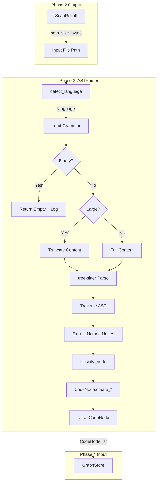
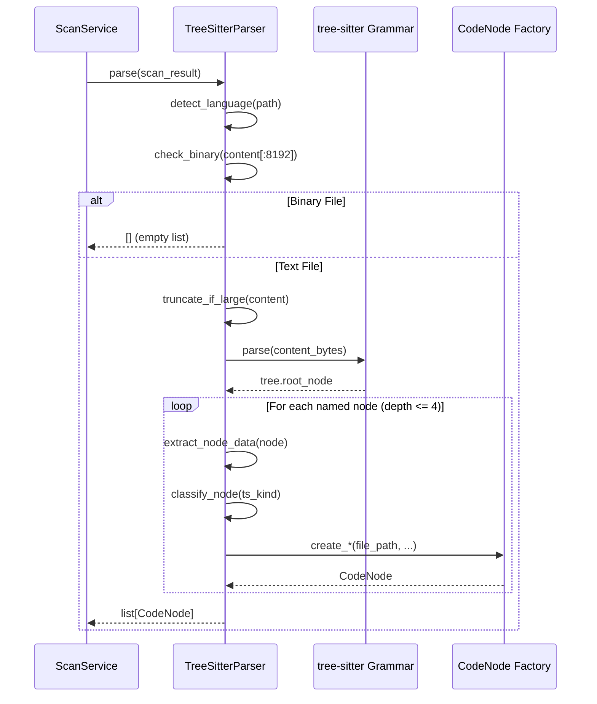

# Phase 3: AST Parser Adapter – Tasks & Alignment Brief

**Spec**: [../../file-scanning-spec.md](../../file-scanning-spec.md)
**Plan**: [../../file-scanning-plan.md](../../file-scanning-plan.md)
**Date**: 2025-12-15
**Status**: COMPLETED
**Testing Approach**: Full TDD

---

## Executive Briefing

### Purpose
This phase implements the AST (Abstract Syntax Tree) parser adapter that transforms source files into structured `CodeNode` hierarchies using tree-sitter. Without this capability, scanned files remain as raw paths—the parser extracts the semantic structure (classes, functions, methods) that enables code search, relationship mapping, and documentation generation.

### What We're Building
A `TreeSitterParser` adapter that:
- Detects programming language from file extension (`.py` → Python, `.ts` → TypeScript, etc.)
- Parses source files using tree-sitter grammars via `tree-sitter-language-pack`
- Extracts structural code elements (file → class → method hierarchy)
- Creates `CodeNode` frozen dataclasses with dual classification (`ts_kind` + `category`)
- Handles large files by truncating to `sample_lines_for_large_files` with `truncated=True` flag
- Skips binary files gracefully (detected via null bytes in first 8KB)

### User Value
Users get a queryable code structure from their codebase. A Python file with `class Calculator` containing `add()` and `subtract()` methods becomes:
- 1 file node (parent)
- 1 class node (child of file)
- 2 method nodes (children of class)

This enables semantic queries like "find all classes" or "list methods in Calculator" without parsing source text.

### Example
**Input**: `src/calc.py`
```python
class Calculator:
    def add(self, a, b):
        return a + b

    def subtract(self, a, b):
        return a - b
```

**Output**: List of `CodeNode` objects
```python
[
    CodeNode(node_id="file:src/calc.py", category="file", name="calc.py", ...),
    CodeNode(node_id="type:src/calc.py:Calculator", category="type", name="Calculator", ...),
    CodeNode(node_id="callable:src/calc.py:Calculator.add", category="callable", name="add", ...),
    CodeNode(node_id="callable:src/calc.py:Calculator.subtract", category="callable", name="subtract", ...),
]
```

---

## Tasks

| Status | ID | Task | CS | Type | Dependencies | Absolute Path(s) | Validation | Subtasks | Notes |
|--------|-----|------|-----|------|--------------|------------------|------------|----------|-------|
| [x] | T000a | Create tests/fixtures/ast_samples/ directory structure | 1 | Setup | – | /workspaces/flow_squared/tests/fixtures/ast_samples/ | Directories exist for python/, typescript/, markdown/, terraform/, docker/, csharp/, rust/, go/, binary/ | – | Foundation for all parse tests |
| [x] | T000b | Create Python sample files (5 files) | 2 | Setup | T000a | /workspaces/flow_squared/tests/fixtures/ast_samples/python/ | simple_class.py, nested_classes.py, standalone_functions.py, decorators_async.py, syntax_error.py exist with valid/invalid syntax | – | Covers AC5 hierarchy tests |
| [x] | T000c | Create TypeScript/JavaScript sample files (4 files) | 2 | Setup | T000a | /workspaces/flow_squared/tests/fixtures/ast_samples/typescript/ | interfaces_types.ts, class_generics.ts, react_component.tsx, standalone.js exist | – | Covers AC4, AC5 |
| [x] | T000d | Create Markdown sample files (3 files) | 1 | Setup | T000a | /workspaces/flow_squared/tests/fixtures/ast_samples/markdown/ | headings_nested.md, code_blocks.md, frontmatter.md exist | – | Section extraction tests |
| [x] | T000e | Create Terraform sample files (2 files) | 1 | Setup | T000a | /workspaces/flow_squared/tests/fixtures/ast_samples/terraform/ | resources_providers.tf, modules_variables.tf exist | – | Block extraction tests |
| [x] | T000f | Create Dockerfile sample files (2 files) | 1 | Setup | T000a | /workspaces/flow_squared/tests/fixtures/ast_samples/docker/ | Dockerfile.simple, Dockerfile.multistage exist | – | Instruction extraction tests |
| [x] | T000g | Create C# sample files (3 files) | 2 | Setup | T000a | /workspaces/flow_squared/tests/fixtures/ast_samples/csharp/ | namespace_class.cs, properties_methods.cs, async_linq.cs exist | – | Extended language support |
| [x] | T000h | Create Rust sample files (2 files) | 2 | Setup | T000a | /workspaces/flow_squared/tests/fixtures/ast_samples/rust/ | structs_impl.rs, traits_generics.rs exist | – | Extended language support |
| [x] | T000i | Create Go sample files (2 files) | 2 | Setup | T000a | /workspaces/flow_squared/tests/fixtures/ast_samples/go/ | structs_methods.go, interfaces.go exist | – | Extended language support |
| [x] | T000j | Create edge case sample files | 2 | Setup | T000a | /workspaces/flow_squared/tests/fixtures/ast_samples/ | binary/sample.bin, empty.py, unicode_names.py exist | – | Error handling tests |
| [x] | T000k | Add ast_samples_path pytest fixture to conftest.py | 1 | Setup | T000a-T000j | /workspaces/flow_squared/tests/conftest.py | Fixture returns Path to fixtures/ast_samples/, tests can use it | – | DRY fixture access |
| [x] | T001 | Write tests for ASTParser ABC contract | 1 | Test | T000k | /workspaces/flow_squared/tests/unit/adapters/test_ast_parser.py | ABC cannot be instantiated, defines parse() and detect_language() | – | Per CF02 |
| [x] | T002 | Write tests for ASTParser return types | 1 | Test | T001 | /workspaces/flow_squared/tests/unit/adapters/test_ast_parser.py | parse() -> list[CodeNode], detect_language() -> str | – | – |
| [x] | T003 | Write tests for ASTParser lifecycle | 1 | Test | T001 | /workspaces/flow_squared/tests/unit/adapters/test_ast_parser.py | Inherits from ABC, requires ConfigurationService | – | Per CF01 |
| [x] | T004 | Implement ASTParser ABC | 1 | Core | T001-T003 | /workspaces/flow_squared/src/fs2/core/adapters/ast_parser.py | All ABC tests pass, clean imports | – | Per CF02 |
| [x] | T005 | Write tests for FakeASTParser configurable results | 2 | Test | T004 | /workspaces/flow_squared/tests/unit/adapters/test_ast_parser_fake.py | set_results() configures return values | – | – |
| [x] | T006 | Write tests for FakeASTParser call history | 1 | Test | T004 | /workspaces/flow_squared/tests/unit/adapters/test_ast_parser_fake.py | Call history records parse/detect invocations | – | For Phase 5 service tests |
| [x] | T007 | Write tests for FakeASTParser error simulation | 1 | Test | T004 | /workspaces/flow_squared/tests/unit/adapters/test_ast_parser_fake.py | simulate_error_for configures which files raise | – | Per CF10 |
| [x] | T008 | Write tests for FakeASTParser inherits ABC | 1 | Test | T004 | /workspaces/flow_squared/tests/unit/adapters/test_ast_parser_fake.py | isinstance(FakeASTParser(...), ASTParser) | – | Per CF02 |
| [x] | T009 | Implement FakeASTParser | 2 | Core | T005-T008 | /workspaces/flow_squared/src/fs2/core/adapters/ast_parser_fake.py | All fake tests pass | – | Per CF02 |
| [x] | T010 | Write tests for language detection - Python | 1 | Test | T004 | /workspaces/flow_squared/tests/unit/adapters/test_ast_parser_impl.py | .py → "python" | – | AC4 |
| [x] | T011 | Write tests for language detection - TypeScript/JavaScript | 1 | Test | T004 | /workspaces/flow_squared/tests/unit/adapters/test_ast_parser_impl.py | .ts → "typescript", .js → "javascript", .tsx/.jsx handled | – | AC4 |
| [x] | T012 | Write tests for language detection - Markdown | 1 | Test | T004 | /workspaces/flow_squared/tests/unit/adapters/test_ast_parser_impl.py | .md → "markdown" | – | AC4 |
| [x] | T013 | Write tests for language detection - Terraform | 1 | Test | T004 | /workspaces/flow_squared/tests/unit/adapters/test_ast_parser_impl.py | .tf → "hcl" | – | AC4 |
| [x] | T014 | Write tests for language detection - Dockerfile | 1 | Test | T004 | /workspaces/flow_squared/tests/unit/adapters/test_ast_parser_impl.py | Dockerfile (no ext) → "dockerfile" | – | AC4, filename match |
| [x] | T014b | Write tests for language detection - C# | 1 | Test | T004 | /workspaces/flow_squared/tests/unit/adapters/test_ast_parser_impl.py | .cs → "c_sharp" | – | Extended lang support |
| [x] | T014c | Write tests for language detection - Rust | 1 | Test | T004 | /workspaces/flow_squared/tests/unit/adapters/test_ast_parser_impl.py | .rs → "rust" | – | Extended lang support |
| [x] | T014d | Write tests for language detection - Go | 1 | Test | T004 | /workspaces/flow_squared/tests/unit/adapters/test_ast_parser_impl.py | .go → "go" | – | Extended lang support |
| [x] | T014e | Write tests for language detection - YAML/JSON | 1 | Test | T004 | /workspaces/flow_squared/tests/unit/adapters/test_ast_parser_impl.py | .yaml/.yml → "yaml", .json → "json" | – | Config file support |
| [x] | T015 | Write tests for language detection - ambiguous extensions | 2 | Test | T004 | /workspaces/flow_squared/tests/unit/adapters/test_ast_parser_impl.py | .h → "cpp" (default), config override supported | – | Per CF13 |
| [x] | T016 | Write tests for language detection - unknown extension | 1 | Test | T004 | /workspaces/flow_squared/tests/unit/adapters/test_ast_parser_impl.py | .xyz → None (unknown), logged warning | – | Per CF10 |
| [x] | T017 | Implement language detection mapping | 2 | Core | T010-T016,T014b-e | /workspaces/flow_squared/src/fs2/core/adapters/ast_parser_impl.py | All language detection tests pass | – | Static mapping per CF13 |
| [x] | T018 | Write tests for Python file parsing - file node | 2 | Test | T017 | /workspaces/flow_squared/tests/unit/adapters/test_ast_parser_impl.py | parse() returns file node with correct node_id, category="file" | – | AC5 |
| [x] | T019 | Write tests for Python class extraction | 2 | Test | T017 | /workspaces/flow_squared/tests/unit/adapters/test_ast_parser_impl.py | Class extracted with category="type", correct qualified_name | – | AC5 |
| [x] | T020 | Write tests for Python method extraction | 2 | Test | T017 | /workspaces/flow_squared/tests/unit/adapters/test_ast_parser_impl.py | Methods extracted with category="callable", parent class in qualified_name | – | AC5 |
| [x] | T021 | Write tests for Python standalone function extraction | 2 | Test | T017 | /workspaces/flow_squared/tests/unit/adapters/test_ast_parser_impl.py | Top-level functions extracted, no class prefix | – | AC5 |
| [x] | T022 | Write tests for nested class handling | 2 | Test | T017 | /workspaces/flow_squared/tests/unit/adapters/test_ast_parser_impl.py | Inner class qualified_name includes outer class | – | AC5 |
| [x] | T023 | Write tests for hierarchy depth limit | 2 | Test | T017 | /workspaces/flow_squared/tests/unit/adapters/test_ast_parser_impl.py | Only named nodes up to depth 4 extracted | – | Per CF08 |
| [x] | T024 | Implement Python AST traversal | 3 | Core | T018-T023 | /workspaces/flow_squared/src/fs2/core/adapters/ast_parser_impl.py | All Python hierarchy tests pass | – | Per CF03 (use .children not .child(i)) |
| [x] | T025 | Write tests for TypeScript class/interface extraction | 2 | Test | T024 | /workspaces/flow_squared/tests/unit/adapters/test_ast_parser_impl.py | TS classes and interfaces extracted correctly | – | AC5 |
| [x] | T026 | Write tests for Markdown heading extraction | 2 | Test | T024 | /workspaces/flow_squared/tests/unit/adapters/test_ast_parser_impl.py | Headings extracted with category="section" | – | AC5 |
| [x] | T027 | Write tests for Terraform block extraction | 2 | Test | T024 | /workspaces/flow_squared/tests/unit/adapters/test_ast_parser_impl.py | resource/provider blocks extracted with category="block" | – | AC5 |
| [x] | T027b | Write tests for C# namespace/class extraction | 2 | Test | T024 | /workspaces/flow_squared/tests/unit/adapters/test_ast_parser_impl.py | Namespaces, classes, methods, properties extracted correctly | – | Uses fixtures/ast_samples/csharp/ |
| [x] | T027c | Write tests for Rust struct/impl/trait extraction | 2 | Test | T024 | /workspaces/flow_squared/tests/unit/adapters/test_ast_parser_impl.py | Structs, impl blocks, traits, functions extracted correctly | – | Uses fixtures/ast_samples/rust/ |
| [x] | T027d | Write tests for Go struct/interface extraction | 2 | Test | T024 | /workspaces/flow_squared/tests/unit/adapters/test_ast_parser_impl.py | Structs, interfaces, methods, functions extracted correctly | – | Uses fixtures/ast_samples/go/ |
| [x] | T028 | Implement multi-language traversal | 3 | Core | T025-T027d | /workspaces/flow_squared/src/fs2/core/adapters/ast_parser_impl.py | TS, MD, TF, C#, Rust, Go tests pass | – | Uses classify_node(); update patterns for new languages; log unknown ts_kinds to .fs2/unknown_node_types.log |
| [x] | T032 | Write tests for binary file detection | 2 | Test | T024 | /workspaces/flow_squared/tests/unit/adapters/test_ast_parser_impl.py | Binary file (null bytes) returns empty list, logs warning | – | Per CF07 |
| [x] | T033 | Write tests for encoding error handling | 2 | Test | T024 | /workspaces/flow_squared/tests/unit/adapters/test_ast_parser_impl.py | Non-UTF8 file handled gracefully, raises ASTParserError | – | Per CF10 |
| [x] | T034 | Write tests for syntax error handling | 2 | Test | T024 | /workspaces/flow_squared/tests/unit/adapters/test_ast_parser_impl.py | Malformed source still returns partial nodes, is_error flag | – | Per CF10 |
| [x] | T035 | Write tests for empty file handling | 1 | Test | T024 | /workspaces/flow_squared/tests/unit/adapters/test_ast_parser_impl.py | Empty file returns file node only | – | Edge case |
| [x] | T036 | Implement error handling and edge cases | 2 | Core | T032-T035 | /workspaces/flow_squared/src/fs2/core/adapters/ast_parser_impl.py | All error handling tests pass | – | Per CF07, CF10 |
| [x] | T036b | Write tests for unknown node type logging | 1 | Test | T028 | /workspaces/flow_squared/tests/unit/adapters/test_ast_parser_impl.py | Unknown ts_kinds logged to .fs2/unknown_node_types.log | – | Observability |
| [x] | T036c | Implement unknown node type logging | 1 | Core | T036b | /workspaces/flow_squared/src/fs2/core/adapters/ast_parser_impl.py | Log file created with format: timestamp, language, ts_kind, file:line | – | Per Insights Session |
| [x] | T037 | Write tests for node_id format compliance | 2 | Test | T024 | /workspaces/flow_squared/tests/unit/adapters/test_ast_parser_impl.py | All node_ids follow {category}:{path}:{qualified_name} | – | AC7, CF11 |
| [x] | T038 | Write tests for anonymous node handling | 2 | Test | T024 | /workspaces/flow_squared/tests/unit/adapters/test_ast_parser_impl.py | Lambda/anonymous functions get @line suffix | – | Per CF11 |
| [x] | T039 | Write tests for content and signature extraction | 2 | Test | T024 | /workspaces/flow_squared/tests/unit/adapters/test_ast_parser_impl.py | content = full source, signature = first line | – | – |
| [x] | T040 | Implement node ID and content extraction | 2 | Core | T037-T039 | /workspaces/flow_squared/src/fs2/core/adapters/ast_parser_impl.py | All node_id and content tests pass | – | Uses CodeNode factories |
| [x] | T041 | Export ASTParser, FakeASTParser, TreeSitterParser from adapters | 1 | Setup | T040 | /workspaces/flow_squared/src/fs2/core/adapters/__init__.py | Imports work from fs2.core.adapters | – | – |
| [x] | T042 | Run full test suite and lint check | 1 | Validation | T041 | /workspaces/flow_squared/tests/unit/ | All tests pass, ruff clean | – | Final validation |

---

## Alignment Brief

### Prior Phases Review

#### Phase-by-Phase Summary

**Phase 1: Core Models and Configuration** (Completed 2025-12-15)

Phase 1 established the foundational data structures and configuration system:

- **CodeNode frozen dataclass** (`/workspaces/flow_squared/src/fs2/core/models/code_node.py`): Universal 17-field model with dual classification (`ts_kind` + `category`), position-based anonymous node IDs (`lambda@42`), truncation support, and 5 factory methods (`create_file`, `create_type`, `create_callable`, `create_section`, `create_block`).
- **classify_node() utility**: Language-agnostic classification via pattern matching (suffix/substring). Works for any tree-sitter grammar including future languages.
- **ScanConfig Pydantic model** (`/workspaces/flow_squared/src/fs2/config/objects.py`): 5 fields including `max_file_size_kb`, `sample_lines_for_large_files`, `follow_symlinks`. Registered in `YAML_CONFIG_TYPES`.
- **Domain exceptions**: `FileScannerError`, `ASTParserError`, `GraphStoreError` in `/workspaces/flow_squared/src/fs2/core/adapters/exceptions.py`.
- **Dependencies**: Added `networkx>=3.0`, `tree-sitter-language-pack>=0.13.0`, `pathspec>=0.12` to pyproject.toml.
- **Tests**: 46 tests (25 CodeNode + 12 ScanConfig + 9 exceptions), all passing.

**Key Learnings from Phase 1**:
- Children field removed from CodeNode → hierarchy via graph edges (single source of truth)
- Position-based anonymous IDs (`@line`) are idempotent, no counter state needed
- Pattern-based classification works across all languages without per-language code
- Factory methods wrap ~15 parameters but provide explicit documentation

**Phase 2: File Scanner Adapter** (Completed 2025-12-15)

Phase 2 implemented gitignore-aware directory traversal:

- **ScanResult frozen dataclass** (`/workspaces/flow_squared/src/fs2/core/models/scan_result.py`): `path: Path` and `size_bytes: int` - file size captured during traversal for Phase 3 truncation decisions.
- **FileScanner ABC** (`/workspaces/flow_squared/src/fs2/core/adapters/file_scanner.py`): Contract with `scan() -> list[ScanResult]` and `should_ignore(path) -> bool`. Lifecycle: `scan()` must be called before `should_ignore()`.
- **FakeFileScanner** (`/workspaces/flow_squared/src/fs2/core/adapters/file_scanner_fake.py`): Configurable results via `set_results()`, call history recording.
- **FileSystemScanner** (`/workspaces/flow_squared/src/fs2/core/adapters/file_scanner_impl.py`): Production implementation using pathspec library for gitignore matching. Depth-first traversal with pattern merging at each directory level.
- **Tests**: 42 tests (5 ScanResult + 4 ABC + 8 Fake + 25 Impl), all passing. Total suite: 278 tests.

**Key Learnings from Phase 2**:
- ScanResult.size_bytes avoids re-statting files in Phase 3
- Gitignore negation in nested directories cannot un-exclude parent exclusions
- Unix owners can always stat their own files regardless of permissions
- Symlink check must happen BEFORE is_dir()/is_file() checks

#### Cumulative Deliverables Available to Phase 3

**From Phase 1**:
- `CodeNode` frozen dataclass with factory methods (Phase 3 will use `create_file`, `create_type`, `create_callable`, etc.)
- `classify_node(ts_kind)` function for language-agnostic classification
- `ScanConfig` with `max_file_size_kb` and `sample_lines_for_large_files` fields
- `ASTParserError` exception class (already defined, ready to use)

**From Phase 2**:
- `ScanResult(path, size_bytes)` for input to parser
- `FileScanner` ABC pattern to follow for ASTParser ABC
- `FakeFileScanner` as template for FakeASTParser structure

#### Architectural Continuity

**Patterns to Maintain**:
1. **ConfigurationService registry pattern**: Receive `ConfigurationService`, call `config.require(ScanConfig)` internally
2. **ABC + Fake + Impl file structure**: `ast_parser.py` (ABC), `ast_parser_fake.py`, `ast_parser_impl.py`
3. **Frozen dataclasses for all domain models**: Use `CodeNode` factory methods
4. **Call history in fakes**: Record invocations for test verification
5. **Exception translation**: Catch SDK errors, translate to `ASTParserError`
6. **Graceful degradation**: Log warnings, continue processing on errors

**Anti-Patterns to Avoid**:
1. ❌ Per-language classification code → Use `classify_node()` pattern matching
2. ❌ Direct CodeNode construction → Use factory methods
3. ❌ Index-based tree traversal (`node.child(i)`) → Use `node.children` (CF03)
4. ❌ Embedded children in nodes → Return flat list, hierarchy via graph edges

**Unknown Node Type Logging** (per Critical Insights Session):
When `classify_node()` returns "other", log the unknown `ts_kind` to `.fs2/unknown_node_types.log` with format:
```
{timestamp} | {language} | {ts_kind} | {file_path}:{line}
```
This creates actionable data for iteratively improving classification patterns.

#### Critical Findings Timeline

| Finding | Phase Applied | How |
|---------|---------------|-----|
| CF01: ConfigurationService registry | Phase 1, 2, **3** | All adapters receive ConfigurationService |
| CF02: ABC + Fake + Impl pattern | Phase 2, **3** | 3-file structure per adapter |
| CF03: Tree-sitter traversal performance | **Phase 3** | Use `.children` not `.child(i)` |
| CF07: Binary file detection | **Phase 3** | Check null bytes in first 8KB |
| CF08: AST hierarchy depth | **Phase 3** | Named nodes up to depth 4 |
| CF09: Frozen dataclass models | Phase 1 | CodeNode already frozen |
| CF10: Exception translation | Phase 2, **3** | ASTParserError for parse failures |
| CF11: Node ID uniqueness | Phase 1, **3** | Position-based anonymous IDs |
| CF12: Large file truncation | Phase 1, **3** | truncated flag, sample_lines config |
| CF13: Language detection ambiguity | **Phase 3** | Static mapping with .h → cpp |

---

### Objective Recap & Behavior Checklist

**Objective**: Create ASTParser adapter that transforms source files into `CodeNode` hierarchies using tree-sitter.

**Acceptance Criteria Mapping**:
- [x] AC1: Configuration loading (Phase 1 - ScanConfig done)
- [x] AC2: Root .gitignore compliance (Phase 2 - FileSystemScanner done)
- [x] AC3: Nested .gitignore support (Phase 2 - FileSystemScanner done)
- [ ] **AC4**: Language detection (.py, .ts, .md, .tf, Dockerfile) → Tasks T010-T017
- [ ] **AC5**: AST hierarchy extraction (file → class → method) → Tasks T018-T028
- [x] ~~AC6~~: Large file handling - **REMOVED** (truncation produces broken AST; tree-sitter handles large files)
- [ ] AC7: Node ID format (Phase 1 established, Phase 3 validates) → Tasks T037-T040
- [ ] AC8: Graph persistence (Phase 4)
- [ ] AC9: CLI scan command (Phase 6)
- [ ] **AC10**: Graceful error handling → Tasks T032-T036

---

### Non-Goals (Scope Boundaries)

❌ **NOT doing in this phase**:
- Cross-file relationship extraction (method-to-method calls) - out of spec scope
- Smart content generation (LLM summaries) - placeholder field only
- Embedding generation - placeholder field only
- Incremental parsing (cache parsed ASTs) - full re-parse each scan
- LSP integration - tree-sitter only
- Graph storage/persistence - Phase 4 responsibility
- Hierarchy edges between nodes - Phase 4/5 will connect nodes via GraphStore
- Progress reporting - Phase 6 CLI responsibility
- Configuration validation for parser-specific settings - use existing ScanConfig

---

### Critical Findings Affecting This Phase

| Finding | Requirement | How Addressed |
|---------|-------------|---------------|
| CF03: Tree-sitter traversal | Use `.children` not `.child(i)` for O(n) | T024 implementation uses `for child in node.children:` |
| CF07: Binary file detection | Check null bytes in first 8KB | T032 test, T036 implementation |
| CF08: AST depth limit | Extract named nodes up to depth 4 | T023 test validates depth limiting |
| CF10: Exception translation | Catch SDK errors → ASTParserError | T033, T034 tests, T036 implementation |
| CF11: Node ID uniqueness | Anonymous nodes use @line suffix | T038 test validates format |
| CF13: Language ambiguity | .h → cpp default, static mapping | T015 test, T017 implementation |

**Note**: CF12 (Large file truncation) was **removed** per Critical Insights Session decision - truncation produces broken AST; tree-sitter handles large files fine.

---

### ADR Decision Constraints

No ADRs currently exist. Phase 3 follows existing decisions from spec:
- Graph format: gpickle (Phase 4 concern)
- Node content: Full source code
- Node ID scheme: `{category}:{path}:{qualified_name}`

---

### Invariants & Guardrails

**Performance**:
- Use `node.children` iteration (O(n)) not `node.child(i)` indexing (O(n log n))
- Binary detection reads only first 8KB, not entire file
- Large file truncation prevents memory bloat

**Memory**:
- Return flat list of CodeNode, not nested tree structure
- Content stored once per node (no parent duplication of child content)

**Security**:
- No execution of parsed code
- Binary files skipped (prevents parser crashes)
- Path traversal: uses paths from FileScanner, not user input

---

### Inputs to Read

**Source Files** (existing code to understand):
- `/workspaces/flow_squared/src/fs2/core/models/code_node.py` - CodeNode model and classify_node()
- `/workspaces/flow_squared/src/fs2/core/adapters/file_scanner.py` - ABC pattern to follow
- `/workspaces/flow_squared/src/fs2/core/adapters/file_scanner_fake.py` - Fake pattern to follow
- `/workspaces/flow_squared/src/fs2/core/adapters/file_scanner_impl.py` - Impl pattern reference
- `/workspaces/flow_squared/src/fs2/core/adapters/exceptions.py` - ASTParserError already defined
- `/workspaces/flow_squared/src/fs2/config/objects.py` - ScanConfig fields

**Test Files** (patterns to follow):
- `/workspaces/flow_squared/tests/unit/adapters/test_file_scanner.py` - ABC test pattern
- `/workspaces/flow_squared/tests/unit/adapters/test_file_scanner_fake.py` - Fake test pattern
- `/workspaces/flow_squared/tests/unit/adapters/test_file_scanner_impl.py` - Impl test pattern
- `/workspaces/flow_squared/tests/unit/models/test_code_node.py` - Model test pattern

**External Documentation**:
- tree-sitter-language-pack API (Python bindings)
- tree-sitter Node API (children, is_named, type, etc.)

---

### Visual Alignment Aids

#### System Flow Diagram



#### Interaction Sequence Diagram



---

### Test Plan (Full TDD)

**Testing Approach**: Full TDD - Write failing tests first (RED), implement minimal code (GREEN), refactor.

**Test Structure**:

```
tests/
├── fixtures/
│   └── ast_samples/              # Realistic sample files (T000a-T000k)
│       ├── python/               # 5 files
│       ├── typescript/           # 4 files
│       ├── markdown/             # 3 files
│       ├── terraform/            # 2 files
│       ├── docker/               # 2 files
│       ├── csharp/               # 3 files
│       ├── rust/                 # 2 files
│       ├── go/                   # 2 files
│       └── edge_cases/           # Binary, empty, large, unicode
└── unit/adapters/
    ├── test_ast_parser.py        # ABC contract tests (T001-T003)
    ├── test_ast_parser_fake.py   # Fake implementation tests (T005-T008)
    └── test_ast_parser_impl.py   # Production implementation tests (T010-T042)
```

**Test Classes**:

1. **TestASTParserABC** (3 tests)
   - `test_ast_parser_abc_cannot_instantiate` - ABC enforcement
   - `test_ast_parser_abc_defines_parse_method` - Contract verification
   - `test_ast_parser_abc_defines_detect_language_method` - Contract verification

2. **TestFakeASTParser** (4 tests)
   - `test_fake_ast_parser_configurable_results` - set_results() works
   - `test_fake_ast_parser_call_history` - Records invocations
   - `test_fake_ast_parser_error_simulation` - simulate_error_for works
   - `test_fake_ast_parser_inherits_abc` - isinstance check

3. **TestTreeSitterParserLanguageDetection** (12 tests)
   - T010-T016, T014b-e: Python, TS/JS, Markdown, Terraform, Dockerfile, C#, Rust, Go, YAML/JSON, ambiguous, unknown

4. **TestTreeSitterParserHierarchy** (16 tests)
   - T018-T023: Python file, class, method, function, nested, depth limit
   - T025-T027d: TypeScript, Markdown, Terraform, C#, Rust, Go extraction

5. **TestTreeSitterParserErrorHandling** (4 tests)
   - T032-T035: Binary, encoding, syntax errors, empty files

6. **TestTreeSitterParserNodeFormat** (3 tests)
   - T037-T039: Node ID format, anonymous handling, content extraction

**Fixtures**:
- `ast_samples_path` pytest fixture returns `Path` to `tests/fixtures/ast_samples/`
- Realistic sample files for each language (created in T000b-T000j)
- `tmp_path` for edge case tests that need dynamic file creation
- `FakeConfigurationService` for dependency injection

**Expected Test Count**: ~52 tests (11 setup + 41 implementation tests)

---

### Fixture Specification

Each fixture file should contain realistic, parseable code that exercises the parser's capabilities.

#### Python Fixtures (`tests/fixtures/ast_samples/python/`)

**simple_class.py** - Basic class with methods:
```python
"""Simple calculator module."""

class Calculator:
    """A basic calculator class."""

    def __init__(self, initial_value: int = 0):
        self.value = initial_value

    def add(self, x: int) -> int:
        """Add x to the current value."""
        self.value += x
        return self.value

    def subtract(self, x: int) -> int:
        """Subtract x from the current value."""
        self.value -= x
        return self.value
```

**nested_classes.py** - Inner classes, closures, lambdas:
```python
class Outer:
    class Inner:
        def inner_method(self):
            pass

    def create_closure(self):
        captured = 10
        def closure_func():
            return captured
        return closure_func

    processor = lambda self, x: x * 2
```

**standalone_functions.py** - Top-level functions, no classes:
```python
def greet(name: str) -> str:
    return f"Hello, {name}"

async def fetch_data(url: str) -> dict:
    pass

def _private_helper():
    pass
```

**decorators_async.py** - Real-world patterns:
```python
from functools import wraps

def retry(times: int):
    def decorator(func):
        @wraps(func)
        def wrapper(*args, **kwargs):
            for _ in range(times):
                try:
                    return func(*args, **kwargs)
                except Exception:
                    pass
        return wrapper
    return decorator

class Service:
    @retry(3)
    async def call_api(self, endpoint: str):
        pass

    @property
    def status(self) -> str:
        return "running"

    @classmethod
    def create(cls):
        return cls()
```

**syntax_error.py** - Intentionally broken:
```python
def broken_function(
    # Missing closing paren and body
class AlsoBroken
    pass  # Missing colon
```

#### TypeScript Fixtures (`tests/fixtures/ast_samples/typescript/`)

**interfaces_types.ts**:
```typescript
interface User {
    id: number;
    name: string;
    email?: string;
}

type Status = 'active' | 'inactive' | 'pending';

interface Repository<T> {
    find(id: number): Promise<T | null>;
    save(entity: T): Promise<T>;
}
```

**class_generics.ts**:
```typescript
class GenericRepository<T extends { id: number }> implements Repository<T> {
    private items: Map<number, T> = new Map();

    async find(id: number): Promise<T | null> {
        return this.items.get(id) ?? null;
    }

    async save(entity: T): Promise<T> {
        this.items.set(entity.id, entity);
        return entity;
    }
}
```

**react_component.tsx**:
```tsx
interface Props {
    title: string;
    onClick?: () => void;
}

export const Button: React.FC<Props> = ({ title, onClick }) => {
    return <button onClick={onClick}>{title}</button>;
};

export default function App() {
    return <Button title="Click me" />;
}
```

**standalone.js**:
```javascript
function processData(data) {
    return data.map(item => item.value);
}

const helper = (x) => x * 2;

export { processData, helper };
```

#### C# Fixtures (`tests/fixtures/ast_samples/csharp/`)

**namespace_class.cs**:
```csharp
namespace MyApp.Services
{
    public class UserService
    {
        private readonly ILogger _logger;

        public UserService(ILogger logger)
        {
            _logger = logger;
        }

        public User GetUser(int id)
        {
            return new User { Id = id };
        }
    }
}
```

**properties_methods.cs**:
```csharp
public class Person
{
    public string Name { get; set; }
    public int Age { get; private set; }

    public string FullName => $"{FirstName} {LastName}";

    public void UpdateAge(int newAge)
    {
        if (newAge > 0) Age = newAge;
    }
}
```

**async_linq.cs**:
```csharp
using System.Linq;

public class DataProcessor
{
    public async Task<List<Result>> ProcessAsync(IEnumerable<Input> inputs)
    {
        var filtered = inputs
            .Where(x => x.IsValid)
            .Select(x => new Result(x.Value));

        return await Task.FromResult(filtered.ToList());
    }
}
```

#### Rust Fixtures (`tests/fixtures/ast_samples/rust/`)

**structs_impl.rs**:
```rust
pub struct Calculator {
    value: i32,
}

impl Calculator {
    pub fn new(initial: i32) -> Self {
        Self { value: initial }
    }

    pub fn add(&mut self, x: i32) -> i32 {
        self.value += x;
        self.value
    }
}

impl Default for Calculator {
    fn default() -> Self {
        Self::new(0)
    }
}
```

**traits_generics.rs**:
```rust
pub trait Repository<T> {
    fn find(&self, id: u64) -> Option<&T>;
    fn save(&mut self, entity: T) -> Result<(), String>;
}

pub struct InMemoryRepo<T> {
    items: Vec<T>,
}

impl<T> Repository<T> for InMemoryRepo<T> {
    fn find(&self, id: u64) -> Option<&T> {
        self.items.get(id as usize)
    }

    fn save(&mut self, entity: T) -> Result<(), String> {
        self.items.push(entity);
        Ok(())
    }
}
```

#### Go Fixtures (`tests/fixtures/ast_samples/go/`)

**structs_methods.go**:
```go
package calculator

type Calculator struct {
    value int
}

func NewCalculator(initial int) *Calculator {
    return &Calculator{value: initial}
}

func (c *Calculator) Add(x int) int {
    c.value += x
    return c.value
}

func (c *Calculator) Value() int {
    return c.value
}
```

**interfaces.go**:
```go
package repository

type Entity interface {
    GetID() int
}

type Repository[T Entity] interface {
    Find(id int) (T, error)
    Save(entity T) error
}

type UserRepo struct {
    users map[int]*User
}

func (r *UserRepo) Find(id int) (*User, error) {
    if u, ok := r.users[id]; ok {
        return u, nil
    }
    return nil, ErrNotFound
}
```

#### Other Fixtures

**Markdown** (`headings_nested.md`):
```markdown
# Main Title

Introduction paragraph.

## Section One

Content here.

### Subsection 1.1

More content.

## Section Two

Final section.
```

**Terraform** (`resources_providers.tf`):
```hcl
terraform {
  required_providers {
    aws = {
      source  = "hashicorp/aws"
      version = "~> 4.0"
    }
  }
}

resource "aws_instance" "web" {
  ami           = "ami-12345678"
  instance_type = "t2.micro"

  tags = {
    Name = "WebServer"
  }
}

module "vpc" {
  source = "./modules/vpc"
  cidr   = "10.0.0.0/16"
}
```

**Dockerfile** (`Dockerfile.multistage`):
```dockerfile
FROM python:3.12-slim AS builder

WORKDIR /app
COPY requirements.txt .
RUN pip install --no-cache-dir -r requirements.txt

FROM python:3.12-slim AS runtime

WORKDIR /app
COPY --from=builder /usr/local/lib/python3.12/site-packages /usr/local/lib/python3.12/site-packages
COPY . .

EXPOSE 8000
CMD ["python", "-m", "uvicorn", "main:app"]
```

#### Edge Cases (`tests/fixtures/ast_samples/edge_cases/`)

- **binary/sample.bin**: Binary file with null bytes (for CF07 test)
- **empty.py**: Empty file (0 bytes)
- **unicode_names.py**: Variables/functions with unicode: `def 计算(): pass`

**Note**: Large file truncation was removed - tree-sitter handles large files efficiently.

---

### Step-by-Step Implementation Outline

**Step 0: Test Fixtures Setup (T000a-T000k)** ⬅️ NEW
1. Create `tests/fixtures/ast_samples/` directory structure (T000a)
2. Create Python sample files with realistic code (T000b)
3. Create TypeScript/JavaScript sample files (T000c)
4. Create Markdown sample files (T000d)
5. Create Terraform sample files (T000e)
6. Create Dockerfile sample files (T000f)
7. Create C# sample files (T000g)
8. Create Rust sample files (T000h)
9. Create Go sample files (T000i)
10. Create edge case files (binary, empty, large, unicode) (T000j)
11. Add `ast_samples_path` pytest fixture to conftest.py (T000k)

**Step 1: ABC and Fake (T001-T009)**
1. Write ABC contract tests (T001-T003)
2. Implement ASTParser ABC (T004)
3. Write FakeASTParser tests (T005-T008)
4. Implement FakeASTParser (T009)

**Step 2: Language Detection (T010-T017)**
1. Write tests for core languages: Python, TS/JS, Markdown, Terraform, Dockerfile (T010-T014)
2. Write tests for extended languages: C#, Rust, Go, YAML/JSON (T014b-T014e)
3. Write tests for ambiguous and unknown extensions (T015-T016)
4. Implement static extension → language mapping (T017)

**Step 3: Python AST Traversal (T018-T024)**
1. Write tests for file node extraction using `fixtures/python/simple_class.py` (T018)
2. Write tests for class extraction (T019)
3. Write tests for method extraction (T020)
4. Write tests for standalone function extraction using `fixtures/python/standalone_functions.py` (T021)
5. Write tests for nested classes using `fixtures/python/nested_classes.py` (T022)
6. Write tests for depth limiting (T023)
7. Implement Python traversal using tree-sitter (T024)

**Step 4: Multi-Language Support (T025-T028)**
1. Write tests for TypeScript using `fixtures/typescript/` (T025)
2. Write tests for Markdown using `fixtures/markdown/` (T026)
3. Write tests for Terraform using `fixtures/terraform/` (T027)
4. Write tests for C# using `fixtures/csharp/` (T027b)
5. Write tests for Rust using `fixtures/rust/` (T027c)
6. Write tests for Go using `fixtures/go/` (T027d)
7. Implement multi-language traversal (T028)

**Step 5: Error Handling and Observability (T032-T036c)**
1. Write binary detection tests using `fixtures/edge_cases/binary/sample.bin` (T032)
2. Write encoding error tests (T033)
3. Write syntax error tests using `fixtures/python/syntax_error.py` (T034)
4. Write empty file tests using `fixtures/edge_cases/empty.py` (T035)
5. Implement all error handling (T036)
6. Write unknown node type logging tests (T036b)
7. Implement unknown node type logging to `.fs2/unknown_node_types.log` (T036c)

**Step 6: Node Format Compliance (T037-T040)**
1. Write node_id format tests (T037)
2. Write anonymous node tests using `fixtures/python/nested_classes.py` (lambdas) (T038)
3. Write content/signature extraction tests (T039)
4. Ensure all nodes use CodeNode factories (T040)

**Step 7: Final Validation (T041-T042)**
1. Export from adapters package (T041)
2. Run full test suite and lint (T042)

---

### Commands to Run

```bash
# Environment setup (already done)
cd /workspaces/flow_squared
uv sync

# Run Phase 3 tests only
uv run pytest tests/unit/adapters/test_ast_parser*.py -v

# Run all unit tests
uv run pytest tests/unit/ -v

# Lint check
uv run ruff check src/fs2/

# Type check (optional)
uv run mypy src/fs2/core/adapters/ast_parser*.py

# Quick smoke test - verify tree-sitter works
uv run python -c "from tree_sitter_language_pack import get_language; print(get_language('python'))"
```

---

### Risks/Unknowns

| Risk | Severity | Mitigation |
|------|----------|------------|
| tree-sitter grammar not available for language | Medium | Return file-only node, log warning |
| tree-sitter API changes between versions | Low | Pin version in pyproject.toml (done) |
| Large AST memory usage | Low | Depth limit (4) + truncation |
| Encoding issues with source files | Medium | Try UTF-8, fall back to latin-1, then skip |
| Nested class/function depth exceeds 4 | Low | Document limitation, revisit if needed |

---

### Ready Check

- [x] Prior phase reviews complete and synthesized
- [x] Critical findings mapped to tasks (CF03, CF07, CF08, CF10, CF11, CF13) - CF12 removed
- [x] ADR constraints mapped to tasks - N/A (no ADRs exist)
- [x] Test plan covers all acceptance criteria (AC4, AC5, AC10)
- [x] Mermaid diagrams reviewed for accuracy
- [x] Commands verified to work
- [x] Risks documented with mitigations
- [x] Test fixtures specified with realistic sample code for 9 languages
- [x] Extended language support added (C#, Rust, Go, YAML/JSON)

**Awaiting GO/NO-GO from human sponsor.**

---

## Critical Insights Discussion

**Session**: 2025-12-15
**Context**: Phase 3: AST Parser Adapter – Tasks & Alignment Brief
**Analyst**: AI Clarity Agent
**Reviewer**: Development Team
**Format**: Water Cooler Conversation (5 Critical Insights)

### Insight 1: tree-sitter-language-pack Grammar Availability Risk

**Did you know**: We committed to supporting 9 languages (including C#, Rust, Go, YAML, JSON) without verifying that tree-sitter-language-pack includes grammars for all of them.

**Implications**:
- Phase 3 could be blocked on external dependency availability
- Tests for unsupported languages would fail in RED phase
- Fixture files for unsupported languages become dead code

**Options Considered**:
- Option A: Pre-Flight Verification - Run smoke test before implementation
- Option B: Accept Risk and Handle at Runtime - Discover during TDD
- Option C: Reduce Scope - Only implement verified languages

**AI Recommendation**: Option A (Pre-Flight Verification)
- Reasoning: 5 minutes of verification prevents hours of wasted TDD cycles

**Discussion Summary**: User chose Option B - accept the risk and let TDD naturally surface any unsupported grammars. Adjusting mid-flight is acceptable.

**Decision**: Accept risk and handle at runtime

**Action Items**: None

**Affects**: T014b-e, T027b-d (may need adjustment if grammars unavailable)

---

### Insight 2: Truncation Can Break Syntax and Produce ERROR Nodes

**Did you know**: Truncating large files at `sample_lines_for_large_files` would cut through syntax structures mid-definition, causing tree-sitter to produce ERROR nodes instead of valid AST.

**Implications**:
- Truncated files would have unreliable CodeNode hierarchies
- Users would see node counts that are mostly ERROR nodes
- AC6 didn't address hierarchy validity for truncated content

**Options Considered**:
- Option A: Remove Truncation Entirely - Parse all files fully
- Option B: Skip Very Large Files - Return file-only node for huge files
- Option C: Keep Truncation as Specified - Accept broken output

**AI Recommendation**: Option A (Remove Truncation)
- Reasoning: Tree-sitter handles large files efficiently; truncation solves a non-problem while creating real data quality issues

**Discussion Summary**: User questioned why truncation exists at all. Agreed that tree-sitter handles large files fine and truncation produces garbage output.

**Decision**: Remove truncation entirely from Phase 3

**Action Items**:
- [x] Remove T029-T031 from tasks
- [x] Update spec AC6 as REMOVED
- [x] Update plan CF12 as REMOVED
- [x] Remove large_file.py from fixtures

**Affects**: Tasks reduced from 53 to 50; spec AC6 marked removed; plan CF12 marked removed

---

### Insight 3: classify_node() May Not Cover Extended Languages

**Did you know**: The `classify_node()` function from Phase 1 was designed for Python, TS, Markdown, Terraform, Dockerfile - but C#, Rust, Go constructs (impl blocks, traits, namespaces) may not match existing patterns.

**Implications**:
- Rust `impl_item` → returns "other" (wrong)
- Rust `trait_item` → returns "other" (wrong)
- Extended languages may have inconsistent categorization

**Options Considered**:
- Option A: Extend classify_node() Patterns - Add patterns upfront
- Option B: Accept "other" Category - Use ts_kind for specific queries
- Option C: Discover During Implementation - Update patterns in T028

**AI Recommendation**: Option C (Discover During Implementation)
- Reasoning: TDD will reveal real types; pragmatic just-in-time learning

**Discussion Summary**: User chose Option C and added requirement to log unknown node types to `.fs2/unknown_node_types.log` for iterative improvement.

**Decision**: Discover patterns during implementation + log unknown types

**Action Items**:
- [x] Update T028 to include classify_node() pattern updates
- [x] Add T036b/T036c for unknown node type logging
- [x] Document logging format in Alignment Brief

**Affects**: T028 updated; T036b/T036c added; task count 50 → 52

---

### Insight 4: Test Fixtures Committed to Git Increase Repo Size

**Did you know**: The ~25 fixture files in `tests/fixtures/ast_samples/` will be permanently committed to git, increasing repository size (~50KB).

**Implications**:
- Repo size increases (small but permanent)
- Binary file (sample.bin) is less efficient in git
- Not a major issue but worth considering

**Options Considered**:
- Option A: Accept and Commit - Simple, fixtures versioned with code
- Option B: Generate at Test Time - No committed fixtures
- Option C: Hybrid - Commit text, generate binary

**AI Recommendation**: Option C (Hybrid)
- Reasoning: Text fixtures are documentation; binary files hurt git delta compression

**Discussion Summary**: User chose Option A - 50KB is negligible and versioned fixtures are valuable.

**Decision**: Commit all fixtures including binary

**Action Items**: None

**Affects**: T000a-T000j (no change)

---

### Insight 5: 52 Tasks is a Large Phase - Consider Batching Strategy

**Did you know**: With 52 tasks following Full TDD, Phase 3 could take 2-3 full days of implementation work.

**Implications**:
- Long phases are harder to track progress
- Context loss between sessions possible
- Phase 1 had 8 tasks, Phase 2 had 9 tasks; Phase 3 has 52

**Options Considered**:
- Option A: Execute as Single Phase - Simple, follow existing workflow
- Option B: Split into Sub-Phases - More overhead but incremental commits
- Option C: Batch with Checkpoints - Add checkpoint markers

**AI Recommendation**: Option C (Batch with Checkpoints)
- Reasoning: Keeps plan simple while adding natural pause points

**Discussion Summary**: User chose Option A - trust the TDD process, maintain discipline, each RED-GREEN-REFACTOR is its own checkpoint.

**Decision**: Execute as single phase with discipline

**Action Items**: None

**Affects**: No changes needed

---

## Session Summary

**Insights Surfaced**: 5 critical insights identified and discussed
**Decisions Made**: 5 decisions reached through collaborative discussion
**Action Items Created**: 3 sets of updates applied
**Areas Updated**:
- Removed truncation (T029-T031, AC6, CF12)
- Added unknown node type logging (T036b, T036c)
- Task count adjusted: 53 → 52

**Shared Understanding Achieved**: ✓

**Confidence Level**: High - Key risks identified, design simplified, observability added

**Next Steps**:
Give GO to proceed with `/plan-6-implement-phase --phase "Phase 3" --plan "/workspaces/flow_squared/docs/plans/003-fs2-base/file-scanning-plan.md"`

---

## Phase Footnote Stubs

| Footnote | Phase | Description |
|----------|-------|-------------|
| (empty - will be populated by plan-6 during implementation) | | |

---

## Evidence Artifacts

**Execution Log**: `/workspaces/flow_squared/docs/plans/003-fs2-base/tasks/phase-3/execution.log.md`
- Created by `/plan-6-implement-phase`
- Records RED-GREEN-REFACTOR cycles
- Captures test output and implementation notes

**Directory Layout**:
```
docs/plans/003-fs2-base/
├── file-scanning-spec.md
├── file-scanning-plan.md
└── tasks/
    ├── phase-1/
    │   ├── tasks.md
    │   └── execution.log.md
    ├── phase-2/
    │   ├── tasks.md
    │   └── execution.log.md
    └── phase-3/
        ├── tasks.md           # This file
        └── execution.log.md   # Created by plan-6
```
