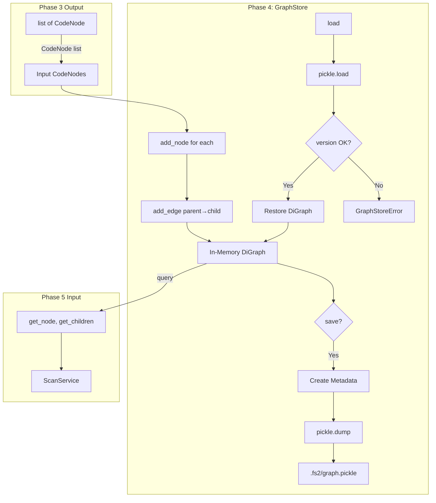
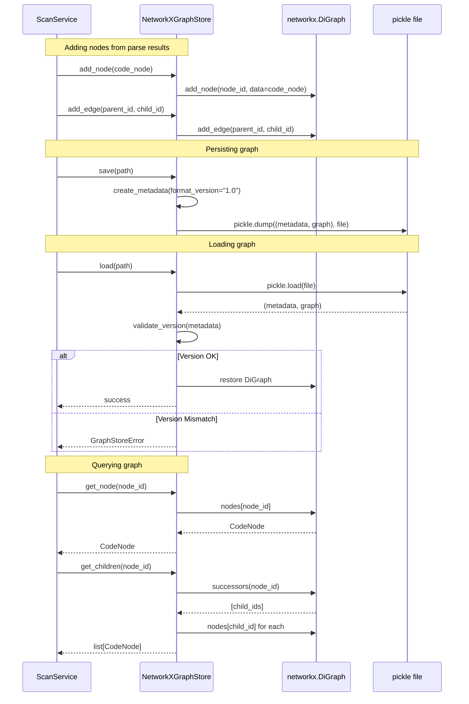

# Phase 4: Graph Storage Repository – Tasks & Alignment Brief

**Spec**: [../../file-scanning-spec.md](../../file-scanning-spec.md)
**Plan**: [../../file-scanning-plan.md](../../file-scanning-plan.md)
**Date**: 2025-12-15
**Status**: READY
**Testing Approach**: Full TDD

---

## Executive Briefing

### Purpose
This phase implements the graph storage repository that persists code structure as a queryable networkx graph. Without this capability, the parsed `CodeNode` hierarchies from Phase 3 exist only in memory—the graph store enables persistent storage, relationship queries (parent-child), and serves as the foundation for all downstream features (search, documentation generation, embeddings).

### What We're Building
A `NetworkXGraphStore` repository that:
- Stores `CodeNode` objects as graph nodes with all 17 fields preserved
- Creates parent-child edges based on qualified name hierarchy (e.g., `Calculator.add` → `add` is child of `Calculator`)
- Persists graphs to `.fs2/graph.pickle` using standard pickle (not deprecated `nx.write_gpickle`)
- Includes format versioning metadata (`format_version: "1.0"`) for future compatibility
- Supports efficient queries: `get_node()`, `get_children()`, `get_parent()`, `get_all_nodes()`

### User Value
Users can scan their codebase once and query the resulting graph without re-parsing. A project with 1,000 files and 10,000 code elements becomes an instantly queryable structure:
- "Find all classes in src/" → Graph query on `category="type"`
- "List methods in Calculator" → Get children of Calculator node
- "What calls this function?" → Future: relationship edges (Phase 5+)

### Example
**Input**: List of `CodeNode` from Phase 3
```python
[
    CodeNode(node_id="file:src/calc.py", category="file", name="calc.py", ...),
    CodeNode(node_id="type:src/calc.py:Calculator", category="type", name="Calculator", ...),
    CodeNode(node_id="callable:src/calc.py:Calculator.add", category="callable", name="add", ...),
]
```

**Stored Graph**:
```
                    file:src/calc.py
                          │
                          ▼
              type:src/calc.py:Calculator
                          │
                          ▼
           callable:src/calc.py:Calculator.add
```

**Persistence**: `~/.fs2/graph.pickle` (or configured path)
```python
{
    "format_version": "1.0",
    "created_at": "2025-12-15T10:30:00Z",
    "node_count": 3,
    "edge_count": 2,
    "graph": <networkx.DiGraph>
}
```

---

## Tasks

| Status | ID | Task | CS | Type | Dependencies | Absolute Path(s) | Validation | Subtasks | Notes |
|--------|-----|------|-----|------|--------------|------------------|------------|----------|-------|
| [x] | T001 | Write tests for GraphStore ABC contract enforcement | 1 | Test | – | /workspaces/flow_squared/tests/unit/repos/test_graph_store.py | ABC cannot be instantiated | – | Per CF02 |
| [x] | T002 | Write tests for GraphStore ABC method signatures | 1 | Test | T001 | /workspaces/flow_squared/tests/unit/repos/test_graph_store.py | Defines add_node, add_edge, get_node, get_children, save, load | – | Per CF02 |
| [x] | T003 | Write tests for GraphStore lifecycle (ConfigurationService) | 1 | Test | T001 | /workspaces/flow_squared/tests/unit/repos/test_graph_store.py | Receives ConfigurationService, not extracted config | – | Per CF01 |
| [x] | T004 | Implement GraphStore ABC | 1 | Core | T001-T003 | /workspaces/flow_squared/src/fs2/core/repos/graph_store.py | All ABC tests pass, clean imports | – | Per CF02 |
| [x] | T005 | Write tests for FakeGraphStore configurable results | 2 | Test | T004 | /workspaces/flow_squared/tests/unit/repos/test_graph_store_fake.py | set_nodes() configures return values | – | – |
| [x] | T006 | Write tests for FakeGraphStore call history | 1 | Test | T004 | /workspaces/flow_squared/tests/unit/repos/test_graph_store_fake.py | Call history records add_node/add_edge/save invocations | – | For Phase 5 service tests |
| [x] | T007 | Write tests for FakeGraphStore error simulation | 1 | Test | T004 | /workspaces/flow_squared/tests/unit/repos/test_graph_store_fake.py | simulate_error_for configures which operations raise | – | Per CF10 |
| [x] | T008 | Write tests for FakeGraphStore inherits ABC | 1 | Test | T004 | /workspaces/flow_squared/tests/unit/repos/test_graph_store_fake.py | isinstance(FakeGraphStore(...), GraphStore) | – | Per CF02 |
| [x] | T009 | Write tests for FakeGraphStore in-memory storage | 1 | Test | T004 | /workspaces/flow_squared/tests/unit/repos/test_graph_store_fake.py | Nodes and edges stored, queryable without persistence | – | – |
| [x] | T010 | Implement FakeGraphStore | 2 | Core | T005-T009 | /workspaces/flow_squared/src/fs2/core/repos/graph_store_fake.py | All fake tests pass | – | Per CF02 |
| [x] | T011 | Write tests for add_node with CodeNode | 2 | Test | T010 | /workspaces/flow_squared/tests/unit/repos/test_graph_store_impl.py | Node added with all 17 fields preserved | – | – |
| [x] | T012 | Write tests for add_edge parent-child | 2 | Test | T010 | /workspaces/flow_squared/tests/unit/repos/test_graph_store_impl.py | Edge direction: parent → child (successors = children, predecessors = parent) | – | – |
| [x] | T013 | Write tests for get_node by ID | 1 | Test | T010 | /workspaces/flow_squared/tests/unit/repos/test_graph_store_impl.py | Returns CodeNode or None if not found | – | – |
| [x] | T014 | Write tests for get_children | 2 | Test | T010 | /workspaces/flow_squared/tests/unit/repos/test_graph_store_impl.py | Returns list of child CodeNodes | – | – |
| [x] | T015 | Write tests for get_parent | 1 | Test | T010 | /workspaces/flow_squared/tests/unit/repos/test_graph_store_impl.py | Returns parent CodeNode or None | – | – |
| [x] | T016 | Write tests for get_all_nodes | 1 | Test | T010 | /workspaces/flow_squared/tests/unit/repos/test_graph_store_impl.py | Returns all CodeNodes in graph | – | – |
| [x] | T017 | Write tests for save with pickle (not nx.write_gpickle) | 2 | Test | T010 | /workspaces/flow_squared/tests/unit/repos/test_graph_store_impl.py | Graph persisted using pickle.dump | – | Per CF05 |
| [x] | T018 | Write tests for save includes format_version | 2 | Test | T010 | /workspaces/flow_squared/tests/unit/repos/test_graph_store_impl.py | Saved file contains format_version: "1.0" metadata | – | Per CF14 |
| [x] | T019 | Write tests for load logs warning on version mismatch | 1 | Test | T010 | /workspaces/flow_squared/tests/unit/repos/test_graph_store_impl.py | Logs warning if format_version differs, still attempts load | – | Per CF14 |
| [x] | T020 | Write tests for 100+ nodes persistence (AC8) | 2 | Test | T010 | /workspaces/flow_squared/tests/unit/repos/test_graph_store_impl.py | 100 nodes with edges saved and loaded correctly | – | AC8 |
| [x] | T021 | Write tests for load non-existent file | 1 | Test | T010 | /workspaces/flow_squared/tests/unit/repos/test_graph_store_impl.py | Raises GraphStoreError with actionable message | – | Per CF10 |
| [x] | T022 | Write tests for load corrupted file | 2 | Test | T010 | /workspaces/flow_squared/tests/unit/repos/test_graph_store_impl.py | Raises GraphStoreError with actionable message | – | Per CF10 |
| [x] | T022a | Write tests for restricted unpickler blocks malicious classes | 2 | Test | T010 | /workspaces/flow_squared/tests/unit/repos/test_graph_store_impl.py | Only CodeNode, DiGraph, stdlib types allowed; others raise GraphStoreError | – | Security hardening |
| [ ] | T023 | REMOVED - version mismatch now warns, doesn't error | – | – | – | – | – | – | Superseded by T019 |
| [x] | T024 | Write tests for get non-existent node | 1 | Test | T010 | /workspaces/flow_squared/tests/unit/repos/test_graph_store_impl.py | Returns None (not exception) | – | – |
| [x] | T025 | Write tests for add duplicate node | 2 | Test | T010 | /workspaces/flow_squared/tests/unit/repos/test_graph_store_impl.py | Updates existing node (upsert behavior) | – | – |
| [x] | T026 | Write tests for save creates parent directory | 1 | Test | T010 | /workspaces/flow_squared/tests/unit/repos/test_graph_store_impl.py | Creates .fs2/ if missing | – | – |
| [x] | T027 | Write tests for clear removes all nodes and edges | 1 | Test | T010 | /workspaces/flow_squared/tests/unit/repos/test_graph_store_impl.py | Graph emptied, ready for fresh scan | – | – |
| [x] | T028 | Implement NetworkXGraphStore add_node | 2 | Core | T011-T016 | /workspaces/flow_squared/src/fs2/core/repos/graph_store_impl.py | Tests T011-T016 pass | – | – |
| [x] | T029 | Implement NetworkXGraphStore save/load with versioning | 2 | Core | T017-T022 | /workspaces/flow_squared/src/fs2/core/repos/graph_store_impl.py | Tests T017-T022 pass | – | Per CF05, CF14 |
| [x] | T029a | Implement RestrictedUnpickler with class whitelist | 2 | Core | T022a | /workspaces/flow_squared/src/fs2/core/repos/graph_store_impl.py | Test T022a passes; only CodeNode, DiGraph, stdlib allowed | – | Security hardening |
| [x] | T030 | Implement NetworkXGraphStore edge cases | 2 | Core | T024-T027 | /workspaces/flow_squared/src/fs2/core/repos/graph_store_impl.py | Tests T024-T027 pass | – | – |
| [x] | T031 | Export GraphStore, FakeGraphStore, NetworkXGraphStore from repos | 1 | Setup | T030 | /workspaces/flow_squared/src/fs2/core/repos/__init__.py | Imports work from fs2.core.repos | – | – |
| [x] | T032 | Run full test suite and lint check | 1 | Validation | T031 | /workspaces/flow_squared/tests/unit/ | All tests pass, ruff clean | – | Final validation |

---

## Alignment Brief

### Prior Phases Review

#### Phase-by-Phase Summary

**Phase 1: Core Models and Configuration** (Completed 2025-12-15)

Phase 1 established the foundational data structures and configuration system that Phase 4 builds upon:

- **CodeNode frozen dataclass** (`/workspaces/flow_squared/src/fs2/core/models/code_node.py`): Universal 17-field model with dual classification (`ts_kind` + `category`), position-based anonymous node IDs (`@line`), and 5 factory methods. This is the **primary data structure Phase 4 stores**.
- **classify_node() utility**: Language-agnostic classification via pattern matching (suffix/substring).
- **ScanConfig Pydantic model** (`/workspaces/flow_squared/src/fs2/config/objects.py`): 5 fields including `scan_paths`. Registered in `YAML_CONFIG_TYPES`.
- **Domain exceptions** (`/workspaces/flow_squared/src/fs2/core/adapters/exceptions.py`): `GraphStoreError` **already defined** and ready to use.
- **Dependencies**: `networkx>=3.0` **already added** to pyproject.toml (v3.6.1 installed).
- **Tests**: 46 tests (25 CodeNode + 12 ScanConfig + 9 exceptions), all passing.

**Key Learnings from Phase 1**:
- Children field removed from CodeNode → hierarchy via graph edges (**Phase 4's responsibility**)
- Position-based anonymous IDs (`@line`) are idempotent, no counter state needed
- Factory methods wrap ~15 parameters but provide explicit documentation
- `GraphStoreError` already exists with actionable docstring - use it for exception translation

**Phase 2: File Scanner Adapter** (Completed 2025-12-15)

Phase 2 implemented gitignore-aware directory traversal that feeds into the scan pipeline:

- **ScanResult frozen dataclass** (`/workspaces/flow_squared/src/fs2/core/models/scan_result.py`): `path: Path` and `size_bytes: int`.
- **FileScanner ABC** (`/workspaces/flow_squared/src/fs2/core/adapters/file_scanner.py`): Contract with `scan() -> list[ScanResult]` and `should_ignore()`. **ABC pattern to follow**.
- **FakeFileScanner** (`/workspaces/flow_squared/src/fs2/core/adapters/file_scanner_fake.py`): Configurable results via `set_results()`, call history recording. **Fake pattern to follow**.
- **FileSystemScanner** (`/workspaces/flow_squared/src/fs2/core/adapters/file_scanner_impl.py`): Production implementation using pathspec library.
- **Tests**: 42 tests (5 ScanResult + 4 ABC + 8 Fake + 25 Impl), all passing. Total suite: 278 tests.

**Key Learnings from Phase 2**:
- Lifecycle contract enforcement: if `should_ignore()` requires state from `scan()`, raise error with actionable message
- Unix owners can always stat their own files regardless of permissions - test against real behavior
- FakeAdapter pattern: `set_results()` for configurable returns, `call_history` property for verification

**Phase 3: AST Parser Adapter** (Completed 2025-12-15)

Phase 3 implemented tree-sitter parsing that produces the `CodeNode` lists Phase 4 stores:

- **ASTParser ABC** (`/workspaces/flow_squared/src/fs2/core/adapters/ast_parser.py`): Contract with `parse() -> list[CodeNode]` and `detect_language()`.
- **FakeASTParser** (`/workspaces/flow_squared/src/fs2/core/adapters/ast_parser_fake.py`): Configurable results, call history, error simulation via `simulate_error_for` set.
- **TreeSitterParser** (`/workspaces/flow_squared/src/fs2/core/adapters/ast_parser_impl.py`): 633 lines, 50+ language extensions, depth-limited traversal.
- **Test Fixtures**: 26 realistic sample files in `tests/fixtures/ast_samples/` covering 9 languages.
- **Tests**: 51 new tests (4 ABC + 9 Fake + 38 Impl), all passing. Total suite: 329 tests.

**Key Learnings from Phase 3**:
- tree-sitter API uses methods, not attributes (`child_by_field_name()` not `node.field_name`)
- Container node filtering differs per language (Python `block` vs HCL `block`)
- Truncation removed - tree-sitter handles large files efficiently
- Full TDD discipline: All tests written BEFORE implementation

---

#### Cumulative Deliverables Available to Phase 4

**From Phase 1** (Direct Dependencies):
- **`CodeNode`** frozen dataclass - The nodes to store in graph (all 17 fields must be preserved)
- **`GraphStoreError`** exception - Already defined, ready for exception translation
- **`networkx>=3.0`** dependency - Already installed (v3.6.1)
- **`ScanConfig`** - May need graph_path field (check if needed)

**From Phase 2** (Patterns to Follow):
- **ABC pattern**: `file_scanner.py` → `graph_store.py`
- **Fake pattern**: `file_scanner_fake.py` → `graph_store_fake.py`
- **Impl pattern**: `file_scanner_impl.py` → `graph_store_impl.py`
- **Test patterns**: `test_file_scanner*.py` → `test_graph_store*.py`

**From Phase 3** (Data Source):
- **`TreeSitterParser.parse()`** returns `list[CodeNode]` - Phase 4's input
- **Flat list structure** - Hierarchy via graph edges, not embedded children
- **Test fixture pattern** - Real files for realistic testing

---

#### Architectural Continuity

**Patterns to Maintain**:
1. **ConfigurationService registry pattern**: Receive `ConfigurationService`, call `config.require(ScanConfig)` internally
2. **ABC + Fake + Impl file structure**: `graph_store.py` (ABC), `graph_store_fake.py`, `graph_store_impl.py`
3. **Frozen dataclasses for domain models**: CodeNode is frozen, store as-is
4. **Call history in fakes**: Record invocations for test verification
5. **Exception translation**: Catch pickle/networkx errors, translate to `GraphStoreError`
6. **Graceful degradation**: Log warnings, handle missing files, continue where possible

**Anti-Patterns to Avoid**:
1. Using `nx.write_gpickle` / `nx.read_gpickle` - deprecated in networkx 3.0 (CF05)
2. Storing CodeNode as dict - lose type safety; store CodeNode objects directly
3. Exposing networkx types in ABC interface - use domain types only
4. Per-node save calls - batch all nodes, save graph once at end
5. Embedded children in nodes - hierarchy is via graph edges only

---

#### Critical Findings Timeline

| Finding | Phase Applied | How |
|---------|---------------|-----|
| CF01: ConfigurationService registry | Phases 1, 2, 3, **4** | All repos receive ConfigurationService |
| CF02: ABC + Fake + Impl pattern | Phases 2, 3, **4** | 3-file structure per repository |
| CF05: NetworkX Pickle Deprecation | **Phase 4** | Use `pickle.dump()` with metadata, not `nx.write_gpickle` |
| CF10: Exception translation | Phases 2, 3, **4** | GraphStoreError for storage failures |
| CF14: Graph Format Versioning | **Phase 4** | Store `(metadata, graph)` tuple with `format_version: "1.0"` |

---

#### Reusable Test Infrastructure from Prior Phases

| Infrastructure | Source Phase | Location | How to Reuse |
|---------------|--------------|----------|--------------|
| `FakeConfigurationService` | Phase 1 | `/workspaces/flow_squared/src/fs2/config/service.py` | Inject ScanConfig for tests |
| Test docstring format | Phase 1 | All test files | Purpose/Quality/AC pattern |
| `ast_samples_path` fixture | Phase 3 | `/workspaces/flow_squared/tests/conftest.py` | Real fixture files available |
| `tmp_path` pytest fixture | Built-in | pytest | For save/load file tests |

---

### Objective Recap & Behavior Checklist

**Objective**: Create GraphStore repository that persists networkx graphs with CodeNode data.

**Acceptance Criteria Mapping**:
- [x] AC1: Configuration loading (Phase 1)
- [x] AC2: Root .gitignore compliance (Phase 2)
- [x] AC3: Nested .gitignore support (Phase 2)
- [x] AC4: Language detection (Phase 3)
- [x] AC5: AST hierarchy extraction (Phase 3)
- [x] ~~AC6~~: Large file handling - REMOVED
- [x] AC7: Node ID format (Phase 3)
- [ ] **AC8**: Graph persistence (100+ nodes saved and loaded correctly) → Tasks T017-T020
- [ ] AC9: CLI scan command (Phase 6)
- [ ] AC10: Graceful error handling → Tasks T019 (warn on mismatch), T021-T022 (error on corruption)

---

### Non-Goals (Scope Boundaries)

**NOT doing in this phase**:
- Relationship edges beyond parent-child (method-to-method calls) - out of spec scope
- Graph querying API (will be in ScanService) - Phase 5 responsibility
- Incremental updates (adding nodes without full re-scan) - full graph replacement
- Graph merging (combining multiple scan results) - single graph only
- Graph validation (checking for orphan nodes, cycles) - trust input from ASTParser
- SQLite or other storage backends - networkx pickle only
- Remote storage (S3, Azure Blob) - local filesystem only
- Compression of pickle files - standard pickle format
- Graph diffing (comparing old vs new graph) - future enhancement
- Export to other formats (JSON, GraphML) - future enhancement

---

### Critical Findings Affecting This Phase

| Finding | Requirement | How Addressed |
|---------|-------------|---------------|
| CF01: ConfigurationService registry | Receive ConfigurationService, call `config.require()` | T003 test, T004/T010/T028 implementation |
| CF02: ABC + Fake + Impl pattern | 3 files per repository | T001-T004 (ABC), T005-T010 (Fake), T011-T030 (Impl) |
| CF05: NetworkX Pickle Deprecation | Use `pickle.dump()` not `nx.write_gpickle` | T017 test, T029 implementation |
| CF10: Exception translation | Catch OS/pickle errors → GraphStoreError | T021-T023 tests, T029-T030 implementation |
| CF14: Graph Format Versioning | Store metadata with `format_version: "1.0"`; warn on mismatch, attempt load | T018-T019 tests, T029 implementation |

---

### ADR Decision Constraints

No ADRs currently exist. Phase 4 follows existing decisions from spec:
- Graph format: pickle with metadata wrapper (not deprecated gpickle)
- Node content: Full CodeNode objects (not dicts)
- Edge type: parent-child only (no call relationships)
- Storage path: Configurable, default `.fs2/graph.pickle`

---

### Invariants & Guardrails

**Data Integrity**:
- All 17 CodeNode fields must be preserved through save/load cycle
- Format version logged on mismatch, load attempted anyway
- Parent-child edges must reference existing node IDs
- Edge direction: parent → child (so `successors(node)` = children, `predecessors(node)` = parent)

**Performance**:
- Single pickle file for entire graph (atomic save/load)
- In-memory networkx.DiGraph for queries
- No per-node file I/O

**Security**:
- RestrictedUnpickler: Whitelist only CodeNode, networkx.DiGraph, and stdlib types
- Blocks arbitrary code execution from malicious pickle files
- Recommend adding `.fs2/` to .gitignore to prevent graph injection via commits
- Path validation: storage path must be within project or home directory

---

### Inputs to Read

**Source Files** (existing code to understand):
- `/workspaces/flow_squared/src/fs2/core/models/code_node.py` - CodeNode to store
- `/workspaces/flow_squared/src/fs2/core/adapters/file_scanner.py` - ABC pattern to follow
- `/workspaces/flow_squared/src/fs2/core/adapters/file_scanner_fake.py` - Fake pattern to follow
- `/workspaces/flow_squared/src/fs2/core/adapters/file_scanner_impl.py` - Impl pattern reference
- `/workspaces/flow_squared/src/fs2/core/adapters/exceptions.py` - GraphStoreError already defined
- `/workspaces/flow_squared/src/fs2/core/repos/protocols.py` - Repository interface patterns
- `/workspaces/flow_squared/src/fs2/config/objects.py` - ScanConfig fields

**Test Files** (patterns to follow):
- `/workspaces/flow_squared/tests/unit/adapters/test_file_scanner.py` - ABC test pattern
- `/workspaces/flow_squared/tests/unit/adapters/test_file_scanner_fake.py` - Fake test pattern
- `/workspaces/flow_squared/tests/unit/adapters/test_file_scanner_impl.py` - Impl test pattern

**External Documentation**:
- networkx DiGraph API (add_node, add_edge, successors, predecessors)
- Python pickle module (dump, load)

---

### Visual Alignment Aids

#### System Flow Diagram



#### Interaction Sequence Diagram



---

### Test Plan (Full TDD)

**Testing Approach**: Full TDD - Write failing tests first (RED), implement minimal code (GREEN), refactor.

**Test Structure**:

```
tests/unit/repos/
├── test_graph_store.py        # ABC contract tests (T001-T003)
├── test_graph_store_fake.py   # Fake implementation tests (T005-T009)
└── test_graph_store_impl.py   # Production implementation tests (T011-T027)
```

**Test Classes**:

1. **TestGraphStoreABC** (3 tests)
   - `test_graph_store_abc_cannot_instantiate` - ABC enforcement
   - `test_graph_store_abc_defines_required_methods` - Contract verification
   - `test_graph_store_abc_receives_configuration_service` - CF01 compliance

2. **TestFakeGraphStore** (5 tests)
   - `test_fake_graph_store_configurable_results` - set_nodes() works
   - `test_fake_graph_store_call_history` - Records invocations
   - `test_fake_graph_store_error_simulation` - simulate_error_for works
   - `test_fake_graph_store_inherits_abc` - isinstance check
   - `test_fake_graph_store_in_memory_storage` - Nodes queryable without persistence

3. **TestNetworkXGraphStoreNodeOperations** (7 tests)
   - T011: add_node preserves all CodeNode fields
   - T012: add_edge creates parent-child relationship
   - T013: get_node returns CodeNode or None
   - T014: get_children returns child CodeNodes
   - T015: get_parent returns parent CodeNode
   - T016: get_all_nodes returns all nodes

4. **TestNetworkXGraphStorePersistence** (7 tests)
   - T017: save uses pickle.dump (not nx.write_gpickle)
   - T018: save includes format_version: "1.0" in metadata
   - T019: load logs warning on version mismatch, still attempts load
   - T020: 100+ nodes persist and reload correctly (AC8)
   - T021: load non-existent file raises GraphStoreError
   - T022: load corrupted file raises GraphStoreError
   - T022a: restricted unpickler blocks malicious classes

5. **TestNetworkXGraphStoreEdgeCases** (4 tests)
   - T024: get non-existent node returns None
   - T025: add duplicate node updates existing (upsert)
   - T026: save creates parent directory if missing
   - T027: clear removes all nodes and edges

**Fixtures**:
- `tmp_path` for save/load file tests
- `FakeConfigurationService` for dependency injection
- Helper function to create test CodeNodes

**Expected Test Count**: ~33 tests (3 ABC + 5 Fake + 6 Ops + 7 Persistence + 4 Edge + 8 more)

---

### Step-by-Step Implementation Outline

**Step 1: ABC and Fake (T001-T010)**
1. Write ABC contract tests (T001-T003)
2. Implement GraphStore ABC (T004)
3. Write FakeGraphStore tests (T005-T009)
4. Implement FakeGraphStore (T010)

**Step 2: Node Operations (T011-T016)**
1. Write add_node test (T011)
2. Write add_edge test (T012)
3. Write get_node test (T013)
4. Write get_children test (T014)
5. Write get_parent test (T015)
6. Write get_all_nodes test (T016)

**Step 3: Persistence (T017-T023)**
1. Write save with pickle test (T017) - NOT nx.write_gpickle
2. Write format_version in metadata test (T018)
3. Write load validates version test (T019)
4. Write 100+ nodes AC8 test (T020)
5. Write load non-existent file test (T021)
6. Write load corrupted file test (T022)
7. Write load wrong version test (T023)

**Step 4: Edge Cases (T024-T027)**
1. Write get non-existent node test (T024)
2. Write add duplicate node test (T025)
3. Write save creates directory test (T026)
4. Write clear test (T027)

**Step 5: Implementation (T028-T030)**
1. Implement NetworkXGraphStore node operations (T028)
2. Implement save/load with versioning (T029)
3. Implement edge cases (T030)

**Step 6: Final Validation (T031-T032)**
1. Export from repos package (T031)
2. Run full test suite and lint (T032)

---

### Commands to Run

```bash
# Environment setup (already done)
cd /workspaces/flow_squared
uv sync

# Run Phase 4 tests only
uv run pytest tests/unit/repos/test_graph_store*.py -v

# Run all unit tests
uv run pytest tests/unit/ -v

# Lint check
uv run ruff check src/fs2/

# Type check (optional)
uv run mypy src/fs2/core/repos/graph_store*.py

# Quick smoke test - verify networkx works
uv run python -c "import networkx as nx; g = nx.DiGraph(); print(f'networkx {nx.__version__}')"
```

---

### Risks/Unknowns

| Risk | Severity | Mitigation |
|------|----------|------------|
| Pickle security (arbitrary code execution) | High | RestrictedUnpickler whitelist (T022a, T029a); recommend .fs2/ in .gitignore |
| Large graph memory usage | Low | Profile with real data; 50k nodes target |
| Python version pickle incompatibility | Low | Format version allows future migrations |
| networkx API changes | Low | Pin version in pyproject.toml (done) |
| Concurrent access (multiple processes) | Low | Out of scope; single-process only |

---

### Ready Check

- [x] Prior phase reviews complete and synthesized (Phases 1, 2, 3)
- [x] Critical findings mapped to tasks (CF01, CF02, CF05, CF10, CF14)
- [x] ADR constraints mapped to tasks - N/A (no ADRs exist)
- [x] Test plan covers all acceptance criteria (AC8, AC10)
- [x] Mermaid diagrams reviewed for accuracy
- [x] Commands verified to work
- [x] Risks documented with mitigations

**Awaiting GO/NO-GO from human sponsor.**

---

## Phase Footnote Stubs

| Footnote | Phase | Description |
|----------|-------|-------------|
| [^12] | Phase 4 | GraphStore ABC, FakeGraphStore, NetworkXGraphStore, RestrictedUnpickler, 43 tests |

---

## Evidence Artifacts

**Execution Log**: `/workspaces/flow_squared/docs/plans/003-fs2-base/tasks/phase-4/execution.log.md`
- Created by `/plan-6-implement-phase`
- Records RED-GREEN-REFACTOR cycles
- Captures test output and implementation notes

**Directory Layout**:
```
docs/plans/003-fs2-base/
├── file-scanning-spec.md
├── file-scanning-plan.md
└── tasks/
    ├── phase-1/
    │   ├── tasks.md
    │   └── execution.log.md
    ├── phase-2/
    │   ├── tasks.md
    │   └── execution.log.md
    ├── phase-3/
    │   ├── tasks.md
    │   └── execution.log.md
    └── phase-4/
        ├── tasks.md           # This file
        └── execution.log.md   # Created by plan-6
```

---

## Critical Insights Discussion

**Session**: 2025-12-16
**Context**: Phase 4 (Graph Storage Repository) Tasks & Alignment Brief
**Analyst**: AI Clarity Agent
**Reviewer**: Development Team
**Format**: Water Cooler Conversation (5 Critical Insights)

### Insight 1: Parent-Child Edge Derivation Location

**Did you know**: The hierarchy information is encoded in node_id/qualified_name structure, but the algorithm to derive parent-child edges isn't specified in Phase 4.

**Implications**:
- Tree-sitter AST provides nested structure during parsing
- TreeSitterParser (Phase 3) flattens to list with qualified_names encoding hierarchy
- Parent derivation: strip last component of qualified_name, reconstruct parent node_id
- File nodes are parents of top-level items (no `.` in qualified_name)

**Options Considered**:
- Option A: Auto-edge in add_node (GraphStore parses qualified_name)
- Option B: Explicit add_edge from caller (GraphStore is dumb storage)
- Option C: Hybrid batch method

**AI Recommendation**: Option B (Explicit add_edge from caller)
- Reasoning: Separation of concerns; GraphStore stores, ScanService derives hierarchy

**Discussion Summary**: User confirmed the tree structure is already captured in tree-sitter output. The derivation algorithm is straightforward from node_id format. Phase 5 ScanService will implement the parent-derivation logic.

**Decision**: GraphStore just stores edges; caller determines parent-child relationships

**Action Items**: None for Phase 4

**Affects**: Phase 5 ScanService will need parent-derivation algorithm

---

### Insight 2: Pickle Security is RCE Vector

**Did you know**: The "Medium" severity for pickle security significantly underestimates the threat - pickle allows arbitrary code execution via `__reduce__`.

**Implications**:
- Malicious `.fs2/graph.pickle` → remote code execution when loaded
- Attack vectors: shared repos, CI/CD injection, local privilege escalation
- "Only load trusted graphs" is insufficient mitigation

**Options Considered**:
- Option A: HMAC signature verification
- Option B: JSON serialization (no code execution)
- Option C: Documentation only
- Option D: RestrictedUnpickler with class whitelist

**AI Recommendation**: Option D (RestrictedUnpickler)
- Reasoning: Keeps pickle performance, blocks malicious classes, standard practice

**Discussion Summary**: User agreed with Option D.

**Decision**: Implement RestrictedUnpickler with whitelist (CodeNode, DiGraph, stdlib only)

**Action Items**:
- [x] Added T022a: Test restricted unpickler blocks malicious classes
- [x] Added T029a: Implement RestrictedUnpickler
- [x] Updated Risks table: severity Medium → High
- [x] Updated Security section in Invariants

**Affects**: T022a, T029a, Risks table, Security section

---

### Insight 3: Strict Version Matching Causes Unnecessary Data Loss

**Did you know**: Exact format_version matching means users regenerate graphs on every upgrade that touches persistence.

**Implications**:
- Version 1.0 code can't load 1.1 graph → full re-scan required
- 10k file codebase = 30+ seconds wasted
- Users avoid updating or report "corrupted graph" bugs

**Options Considered**:
- Option A: Semantic versioning (major.minor)
- Option B: Migration system
- Option C: Strict matching with documentation
- Option D: Semver check + regeneration fallback

**AI Recommendation**: Option A (Semantic versioning)
- Reasoning: Simple, covers 80% of cases, industry standard

**Discussion Summary**: User preferred simpler approach - just warn on mismatch, attempt load anyway. If structure is truly incompatible, load fails naturally.

**Decision**: No strict version validation - warn on mismatch, attempt load

**Action Items**:
- [x] Updated T019: "logs warning on version mismatch, still attempts load"
- [x] Marked T023 as REMOVED (superseded by T019)
- [x] Updated CF14 description
- [x] Updated AC10 mapping

**Affects**: T019, T023 (removed), CF14, AC10

---

### Insight 4: CodeNode Embedding Field Could Explode Size

**Did you know**: CodeNode has `embedding: list[float] | None` that could contain 1,536+ floats per node, potentially 500MB+ for large codebases.

**Implications**:
- 50k nodes × 1,536 floats × 8 bytes = 585MB embeddings alone
- T020 (100 nodes) won't catch this
- Future feature could cause unexpected size explosion

**Options Considered**:
- Option A: Strip embeddings on save
- Option B: Document constraint
- Option C: Size warning in save()
- Option D: Defer (future problem)

**AI Recommendation**: Option D (Defer) + note
- Reasoning: YAGNI; embeddings default to None, not our problem yet

**Discussion Summary**: User stated clearly: "We do not care about size, fidelity is important not size."

**Decision**: No action - full CodeNode preservation including future embeddings

**Action Items**: None

**Affects**: None

---

### Insight 5: Edge Direction Must Be Explicit

**Did you know**: networkx DiGraph edges are directional, and T012 doesn't specify which direction parent-child edges go.

**Implications**:
- `add_edge(A, B)` means A → B
- `successors(A)` returns nodes A points to
- Wrong direction = get_parent/get_children return wrong results
- Sequence diagram implies parent → child but not stated explicitly

**Options Considered**:
- Parent → Child (natural tree structure)
- Child → Parent (reversed)

**AI Recommendation**: Parent → Child, make T012 test explicit

**Discussion Summary**: User confirmed.

**Decision**: Edge direction is parent → child (successors = children, predecessors = parent)

**Action Items**:
- [x] Updated T012 validation to specify edge direction
- [x] Added edge direction to Invariants & Guardrails

**Affects**: T012, Invariants & Guardrails

---

## Session Summary

**Insights Surfaced**: 5 critical insights identified and discussed
**Decisions Made**: 5 decisions reached through collaborative discussion
**Action Items Created**: 6 task updates applied immediately
**Areas Updated**:
- Tasks: T012, T019, T022a (new), T023 (removed), T029a (new)
- Risks table: pickle security High with RestrictedUnpickler mitigation
- Invariants: edge direction, version warning behavior
- Critical Findings: CF14 updated

**Shared Understanding Achieved**: ✓

**Confidence Level**: High - Key risks identified and mitigated, ambiguities resolved

**Next Steps**:
Proceed with `/plan-6-implement-phase` when ready - all critical issues addressed
