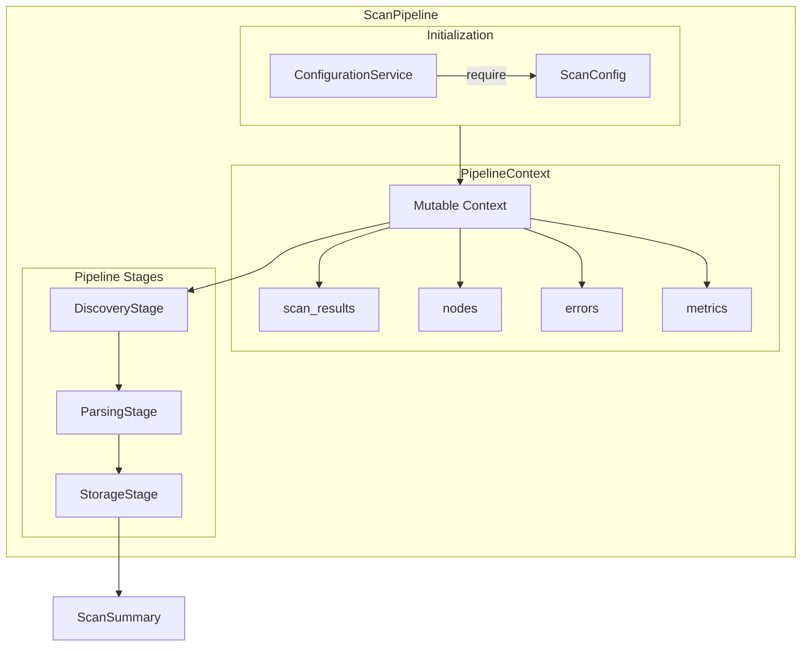
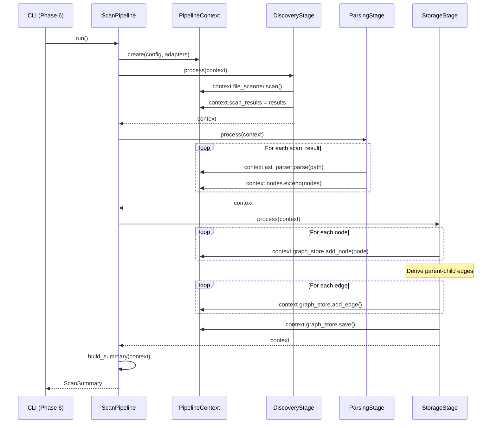

# Phase 5: Scan Service Orchestration – Tasks & Alignment Brief

**Spec**: [../../file-scanning-spec.md](../../file-scanning-spec.md)
**Plan**: [../../file-scanning-plan.md](../../file-scanning-plan.md)
**Date**: 2025-12-16
**Testing Strategy**: Full TDD

---

## Executive Briefing

### Purpose
This phase implements a **pipeline-based scanning architecture** that orchestrates file discovery, AST parsing, and graph storage as discrete, composable stages. The pipeline design enables future enhancement stages (smart content, embeddings, relationship extraction) to plug in seamlessly without modifying core orchestration logic.

### What We're Building

A **ScanPipeline** orchestrator with a **PipelineStage** protocol:

```
PipelineContext flows through stages:
┌────────────┐    ┌────────────┐    ┌────────────┐    ┌────────────┐
│ Discovery  │ →  │  Parsing   │ →  │ Enhancement│ →  │  Storage   │
│   Stage    │    │   Stage    │    │  Stage(s)  │    │   Stage    │
└────────────┘    └────────────┘    └────────────┘    └────────────┘
     ↓                 ↓                  ↓                 ↓
  Populates        Populates          Enriches          Persists
  scan_results     nodes              nodes             to graph
```

**Components**:
- `PipelineStage` Protocol - Contract for all stages (name, process)
- `PipelineContext` - Mutable context flowing through stages
- `DiscoveryStage` - Wraps FileScanner, discovers files
- `ParsingStage` - Wraps ASTParser, extracts CodeNodes
- `StorageStage` - Wraps GraphStore, persists nodes and edges
- `ScanPipeline` - Orchestrates stages sequentially
- `ScanSummary` - Final result with metrics

### User Value
Users get a scan system designed for extensibility. Today it discovers, parses, and stores. Tomorrow it can add LLM summaries, vector embeddings, or cross-file relationship analysis—all as new stages that plug into the same pipeline without changing existing code.

### Example
**Input**: ScanConfig with `scan_paths: ["./src"]`, 50 Python files
**Pipeline Execution**:
1. **DiscoveryStage**: FileScanner finds 50 files → context.scan_results
2. **ParsingStage**: ASTParser extracts ~200 nodes → context.nodes
3. **StorageStage**: GraphStore stores nodes + edges → persisted
**Output**: `ScanSummary(success=True, files_scanned=50, nodes_created=200, errors=[])`

---

## Architectural Design

### PipelineStage Protocol

```python
from typing import Protocol

class PipelineStage(Protocol):
    """Protocol defining the contract for pipeline stages.

    All stages receive and return a PipelineContext, enabling:
    - Sequential composition (output of one is input to next)
    - Independent testing (mock context in, assert context out)
    - Future extensibility (new stages implement same protocol)
    """

    @property
    def name(self) -> str:
        """Human-readable stage name for logging and metrics."""
        ...

    def process(self, context: "PipelineContext") -> "PipelineContext":
        """Process the context and return updated context.

        Stages should:
        - Read what they need from context
        - Add their outputs to context
        - Collect errors in context.errors (don't raise for partial failures)
        - Return the (possibly mutated) context
        """
        ...
```

### PipelineContext Dataclass

```python
from dataclasses import dataclass, field
from pathlib import Path
from typing import Any

@dataclass
class PipelineContext:
    """Mutable context that flows through pipeline stages.

    Each stage reads from and writes to this context:
    - DiscoveryStage: writes scan_results
    - ParsingStage: reads scan_results, writes nodes
    - StorageStage: reads nodes, writes to graph_store

    Errors are collected (not raised) to enable continuation.
    Metrics track per-stage performance and counts.
    """

    # Configuration (set at pipeline start)
    scan_config: "ScanConfig"
    graph_path: Path = field(default_factory=lambda: Path(".fs2/graph.pickle"))

    # Stage outputs (populated as pipeline runs)
    scan_results: list["ScanResult"] = field(default_factory=list)
    nodes: list["CodeNode"] = field(default_factory=list)

    # Error collection (append, don't raise)
    errors: list[str] = field(default_factory=list)

    # Metrics per stage
    metrics: dict[str, Any] = field(default_factory=dict)

    # Injected adapters (set by pipeline before running)
    file_scanner: "FileScanner | None" = None
    ast_parser: "ASTParser | None" = None
    graph_store: "GraphStore | None" = None
```

### Stage Implementations

**DiscoveryStage**:
- Calls `context.file_scanner.scan()`
- Populates `context.scan_results`
- Handles FileScannerError → appends to context.errors

**ParsingStage**:
- Iterates `context.scan_results`
- Calls `context.ast_parser.parse(path)` for each
- Populates `context.nodes`
- Handles ASTParserError per file → appends to context.errors, continues

**StorageStage**:
- Iterates `context.nodes`
- Calls `context.graph_store.add_node(node)` for each
- Derives parent-child edges from `qualified_name` structure
- Calls `context.graph_store.add_edge(parent_id, child_id)`
- Calls `context.graph_store.save(context.graph_path)`
- Handles GraphStoreError → appends to context.errors

### ScanPipeline Orchestrator

```python
class ScanPipeline:
    """Orchestrates pipeline stages sequentially.

    Usage:
        pipeline = ScanPipeline(
            config=config_service,
            file_scanner=scanner,
            ast_parser=parser,
            graph_store=store,
        )
        summary = pipeline.run()

    The pipeline:
    1. Creates PipelineContext with injected adapters
    2. Runs each stage in order (Discovery → Parsing → Storage)
    3. Collects errors without stopping
    4. Returns ScanSummary with final metrics
    """

    def __init__(
        self,
        config: "ConfigurationService",
        file_scanner: "FileScanner",
        ast_parser: "ASTParser",
        graph_store: "GraphStore",
        stages: list["PipelineStage"] | None = None,
    ):
        self._scan_config = config.require(ScanConfig)
        self._file_scanner = file_scanner
        self._ast_parser = ast_parser
        self._graph_store = graph_store

        # Default stages if not provided
        self._stages = stages or [
            DiscoveryStage(),
            ParsingStage(),
            StorageStage(),
        ]

    def run(self) -> "ScanSummary":
        # Build context with adapters
        context = PipelineContext(
            scan_config=self._scan_config,
            file_scanner=self._file_scanner,
            ast_parser=self._ast_parser,
            graph_store=self._graph_store,
        )

        # Run each stage sequentially
        for stage in self._stages:
            context = stage.process(context)

        # Build summary from final context
        return ScanSummary(
            success=len(context.errors) == 0,
            files_scanned=len(context.scan_results),
            nodes_created=len(context.nodes),
            errors=context.errors,
            metrics=context.metrics,
        )
```

### Future Extensibility

Adding a new enhancement stage (e.g., SmartContentStage):

```python
class SmartContentStage:
    """Future stage that enriches nodes with LLM-generated summaries."""

    @property
    def name(self) -> str:
        return "smart_content"

    def process(self, context: PipelineContext) -> PipelineContext:
        for node in context.nodes:
            # Generate smart_content via LLM
            # Update node (would need mutable nodes or new list)
            pass
        return context

# Register in pipeline:
pipeline = ScanPipeline(
    config=config,
    file_scanner=scanner,
    ast_parser=parser,
    graph_store=store,
    stages=[
        DiscoveryStage(),
        ParsingStage(),
        SmartContentStage(),  # ← New stage slots in
        EmbeddingStage(),     # ← Another future stage
        StorageStage(),
    ],
)
```

---

## Tasks

| Status | ID | Task | CS | Type | Dependencies | Absolute Path(s) | Validation | Subtasks | Notes |
|--------|-----|------|-----|------|--------------|------------------|------------|----------|-------|
| [ ] | T001 | Write tests for PipelineContext dataclass | 1 | Test | – | `/workspaces/flow_squared/tests/unit/services/test_pipeline_context.py` | Tests verify all fields, default factories | – | Mutable context |
| [ ] | T002 | Implement PipelineContext dataclass | 1 | Core | T001 | `/workspaces/flow_squared/src/fs2/core/services/pipeline_context.py` | T001 tests pass | – | scan_results, nodes, errors, metrics, adapters |
| [ ] | T003 | Write tests for PipelineStage protocol | 1 | Test | T002 | `/workspaces/flow_squared/tests/unit/services/test_pipeline_stage.py` | Tests verify protocol contract | – | Protocol with name + process |
| [ ] | T004 | Define PipelineStage Protocol | 1 | Core | T003 | `/workspaces/flow_squared/src/fs2/core/services/pipeline_stage.py` | T003 tests pass | – | typing.Protocol |
| [ ] | T005 | Write tests for DiscoveryStage | 2 | Test | T004 | `/workspaces/flow_squared/tests/unit/services/test_discovery_stage.py` | Tests verify scan_results populated, errors collected | – | Wraps FileScanner |
| [ ] | T006 | Implement DiscoveryStage | 2 | Core | T005 | `/workspaces/flow_squared/src/fs2/core/services/stages/discovery_stage.py` | T005 tests pass | – | Calls file_scanner.scan() |
| [ ] | T007 | Write tests for ParsingStage | 2 | Test | T006 | `/workspaces/flow_squared/tests/unit/services/test_parsing_stage.py` | Tests verify nodes populated, per-file errors collected | – | Wraps ASTParser |
| [ ] | T008 | Implement ParsingStage | 2 | Core | T007 | `/workspaces/flow_squared/src/fs2/core/services/stages/parsing_stage.py` | T007 tests pass | – | Iterates scan_results, calls parse() |
| [ ] | T009 | Write tests for StorageStage edge derivation | 2 | Test | T008 | `/workspaces/flow_squared/tests/unit/services/test_storage_stage.py` | Tests verify parent-child edges from qualified_name | – | E.g., Calculator child of file |
| [ ] | T010 | Write tests for StorageStage persistence | 2 | Test | T009 | `/workspaces/flow_squared/tests/unit/services/test_storage_stage.py` | Tests verify add_node, add_edge, save calls | – | Uses FakeGraphStore |
| [ ] | T011 | Implement StorageStage | 2 | Core | T010 | `/workspaces/flow_squared/src/fs2/core/services/stages/storage_stage.py` | T009-T010 tests pass | – | Edge derivation + persistence |
| [ ] | T012 | Write tests for ScanSummary model | 1 | Test | T011 | `/workspaces/flow_squared/tests/unit/models/test_scan_summary.py` | Tests verify frozen, fields, factory | – | Frozen dataclass |
| [ ] | T013 | Implement ScanSummary frozen dataclass | 1 | Core | T012 | `/workspaces/flow_squared/src/fs2/core/models/scan_summary.py` | T012 tests pass | – | success, files_scanned, nodes_created, errors, metrics |
| [ ] | T014 | Write tests for ScanPipeline orchestration | 2 | Test | T013 | `/workspaces/flow_squared/tests/unit/services/test_scan_pipeline.py` | Tests verify stages run in order, context flows | – | Uses mock stages |
| [ ] | T015 | Write tests for ScanPipeline DI pattern | 2 | Test | T014 | `/workspaces/flow_squared/tests/unit/services/test_scan_pipeline.py` | Tests verify config.require(), adapter injection | – | Per CF01, CF15 |
| [ ] | T016 | Write tests for ScanPipeline error aggregation | 1 | Test | T015 | `/workspaces/flow_squared/tests/unit/services/test_scan_pipeline.py` | Tests verify errors collected from all stages | – | Per AC10 |
| [ ] | T017 | Write tests for ScanPipeline custom stages | 1 | Test | T016 | `/workspaces/flow_squared/tests/unit/services/test_scan_pipeline.py` | Tests verify custom stage list overrides defaults | – | Extensibility test |
| [ ] | T018 | Implement ScanPipeline | 3 | Core | T017 | `/workspaces/flow_squared/src/fs2/core/services/scan_pipeline.py` | All T014-T017 tests pass | – | Orchestrates stages sequentially |
| [ ] | T019 | Export pipeline components from services __init__.py | 1 | Core | T018 | `/workspaces/flow_squared/src/fs2/core/services/__init__.py` | Imports work from fs2.core.services | – | Create if needed |
| [ ] | T020 | Export ScanSummary from models __init__.py | 1 | Core | T013 | `/workspaces/flow_squared/src/fs2/core/models/__init__.py` | Import works | – | – |
| [ ] | T021 | Write integration test: full pipeline with real adapters | 3 | Integration | T019 | `/workspaces/flow_squared/tests/integration/test_scan_pipeline_integration.py` | Real FileSystemScanner + TreeSitterParser + NetworkXGraphStore | – | End-to-end |
| [ ] | T022 | Write integration test: verify AC1 config loading | 2 | Integration | T021 | `/workspaces/flow_squared/tests/integration/test_scan_pipeline_integration.py` | ScanConfig from context used | – | AC1 |
| [ ] | T023 | Write integration test: verify AC5 hierarchy | 2 | Integration | T022 | `/workspaces/flow_squared/tests/integration/test_scan_pipeline_integration.py` | File → Class → Method edges | – | AC5 |
| [ ] | T024 | Write integration test: verify AC7 node IDs | 1 | Integration | T023 | `/workspaces/flow_squared/tests/integration/test_scan_pipeline_integration.py` | IDs match format | – | AC7 |
| [ ] | T025 | Write integration test: verify AC8 persistence | 2 | Integration | T024 | `/workspaces/flow_squared/tests/integration/test_scan_pipeline_integration.py` | Save + load recovers all | – | AC8 |
| [ ] | T026 | Write integration test: verify AC10 error handling | 2 | Integration | T025 | `/workspaces/flow_squared/tests/integration/test_scan_pipeline_integration.py` | Binary file → warning, scan continues | – | AC10 |
| [ ] | T027 | Run full test suite and lint | 1 | Validation | T026 | – | All tests pass, ruff clean | – | – |
| [ ] | T028 | Update plan progress tracking | 1 | Doc | T027 | `/workspaces/flow_squared/docs/plans/003-fs2-base/file-scanning-plan.md` | Phase 5 marked complete | – | – |

---

## Alignment Brief

### Prior Phases Review

#### Phase-by-Phase Summary: Evolution of the Implementation

**Phase 1 → Phase 2 → Phase 3 → Phase 4** represents a bottom-up construction:

1. **Phase 1 (Core Models)** established the foundational vocabulary:
   - `CodeNode` frozen dataclass with 17 fields (dual classification: ts_kind + category)
   - `ScanConfig` Pydantic model for configuration
   - Domain exceptions: `FileScannerError`, `ASTParserError`, `GraphStoreError`
   - Pattern: Frozen dataclasses with factory methods

2. **Phase 2 (File Scanner)** added file discovery capability:
   - `ScanResult` frozen dataclass (path, size_bytes)
   - `FileScanner` ABC with `scan() -> list[ScanResult]`
   - `FileSystemScanner` with pathspec gitignore handling
   - Pattern: ABC + Fake + Impl three-file structure

3. **Phase 3 (AST Parser)** added code understanding:
   - `ASTParser` ABC with `parse() -> list[CodeNode]`, `detect_language()`
   - `TreeSitterParser` with 50+ language extensions
   - Flat node list output (hierarchy via qualified_name)
   - Pattern: Graceful degradation (unknown → empty list)

4. **Phase 4 (Graph Storage)** added persistence layer:
   - `GraphStore` ABC with add_node, add_edge, get_children, save, load
   - `NetworkXGraphStore` with RestrictedUnpickler security
   - Edge direction: parent → child (successors = children)
   - Pattern: Format versioning with warn-on-mismatch

**Phase 5** introduces the **pipeline architecture** that composes these into a staged workflow.

#### Cumulative Deliverables (Organized by Phase of Origin)

**From Phase 1** (Core Models):
| Deliverable | Purpose for Phase 5 |
|-------------|---------------------|
| `CodeNode` | Stored in context.nodes, persisted to graph |
| `ScanConfig` | Extracted via config.require(), stored in context |
| `FileScannerError` | Caught in DiscoveryStage, appended to context.errors |
| `ASTParserError` | Caught in ParsingStage, appended to context.errors |
| `GraphStoreError` | Caught in StorageStage, appended to context.errors |

**From Phase 2** (File Scanner):
| Deliverable | Purpose for Phase 5 |
|-------------|---------------------|
| `ScanResult` | Stored in context.scan_results by DiscoveryStage |
| `FileScanner` ABC | Injected into context, used by DiscoveryStage |
| `FakeFileScanner` | Unit testing DiscoveryStage |
| `FileSystemScanner` | Integration testing |

**From Phase 3** (AST Parser):
| Deliverable | Purpose for Phase 5 |
|-------------|---------------------|
| `ASTParser` ABC | Injected into context, used by ParsingStage |
| `FakeASTParser` | Unit testing ParsingStage |
| `TreeSitterParser` | Integration testing |

**From Phase 4** (Graph Storage):
| Deliverable | Purpose for Phase 5 |
|-------------|---------------------|
| `GraphStore` ABC | Injected into context, used by StorageStage |
| `FakeGraphStore` | Unit testing StorageStage |
| `NetworkXGraphStore` | Integration testing |

#### Pattern Evolution Across Phases

| Pattern | Phases 1-4 | Phase 5 (New) |
|---------|------------|---------------|
| ConfigurationService registry | Applied consistently | Applied in ScanPipeline |
| ABC + Fake + Impl | Adapters follow this | **Stages use Protocol** (simpler) |
| Frozen dataclass models | CodeNode, ScanResult | ScanSummary, **PipelineContext is mutable** |
| Exception translation | At adapter boundaries | **Collected in context.errors** |
| Call history in Fakes | For verification | Stages are tested via context assertions |

#### Architectural Continuity

**Patterns to Maintain**:
1. **DI via constructor**: ScanPipeline receives adapters
2. **ConfigurationService registry**: `config.require(ScanConfig)`
3. **Domain exceptions**: Catch at stage boundaries
4. **Hierarchy via edges**: Derived from qualified_name in StorageStage

**New Patterns Introduced**:
1. **Pipeline Stage Protocol**: Composable, testable stages
2. **Mutable Context**: PipelineContext flows through stages
3. **Error Collection**: Append to context.errors, don't raise
4. **Extensible Stage List**: Pipeline accepts custom stages

**Anti-Patterns to Avoid**:
1. ❌ Stages directly instantiating adapters (use context.adapter)
2. ❌ Raising exceptions for partial failures (collect in context.errors)
3. ❌ Stages depending on each other directly (communicate via context)
4. ❌ Hardcoded stage order in Stage implementations (Pipeline controls order)

---

### Objective Recap and Behavior Checklist

**Primary Objective**: Create pipeline-based scanning architecture with composable stages.

**Behavior Checklist**:
- [ ] PipelineContext carries config, adapters, results, errors through stages
- [ ] DiscoveryStage populates context.scan_results via file_scanner.scan()
- [ ] ParsingStage populates context.nodes via ast_parser.parse() per file
- [ ] StorageStage persists nodes and derives parent-child edges
- [ ] All stages collect errors in context.errors (continuation pattern)
- [ ] ScanPipeline runs stages sequentially, returns ScanSummary
- [ ] Custom stages can be injected via stages parameter
- [ ] ScanSummary captures files_scanned, nodes_created, errors, metrics

---

### Non-Goals (Scope Boundaries)

❌ **NOT doing in this phase**:
- CLI integration (Phase 6)
- Progress bar / rich output (Phase 6)
- SmartContentStage or EmbeddingStage (future enhancement)
- RelationshipStage for cross-file analysis (future enhancement)
- Parallel stage execution (sequential is sufficient)
- Stage dependency resolution (always run in order)
- Config-driven stage enable/disable (always run all registered stages)

---

### Critical Findings Affecting This Phase

| Finding | What It Constrains/Requires | Tasks Addressing It |
|---------|----------------------------|---------------------|
| **CF01: ConfigurationService Registry** | ScanPipeline receives ConfigurationService, calls config.require(ScanConfig) | T015, T018 |
| **CF10: Exception Translation** | Stages catch adapter exceptions, append to context.errors | T005, T007, T010, T016 |
| **CF15: Service Composition Pattern** | ScanPipeline receives adapters via constructor, injects into context | T015, T018 |

---

### Visual Alignment Aids

#### Pipeline Flow Diagram



#### Sequence Diagram



---

### Test Plan (Full TDD)

#### Unit Tests

| Component | Test File | Key Tests |
|-----------|-----------|-----------|
| PipelineContext | test_pipeline_context.py | Fields, defaults, mutability |
| PipelineStage | test_pipeline_stage.py | Protocol compliance |
| DiscoveryStage | test_discovery_stage.py | Populates scan_results, collects errors |
| ParsingStage | test_parsing_stage.py | Populates nodes, per-file error handling |
| StorageStage | test_storage_stage.py | Edge derivation, persistence, error handling |
| ScanSummary | test_scan_summary.py | Frozen, fields, from_context factory |
| ScanPipeline | test_scan_pipeline.py | Stage ordering, DI, error aggregation, custom stages |

#### Integration Tests

| Test | Purpose | Fixtures |
|------|---------|----------|
| test_full_pipeline | End-to-end with real adapters | ast_samples/python/ |
| test_config_loading | AC1 verification | tmp_path config |
| test_hierarchy_extraction | AC5 verification | simple_class.py |
| test_node_id_format | AC7 verification | simple_class.py |
| test_persistence | AC8 verification | Full scan + reload |
| test_error_handling | AC10 verification | sample.bin in path |

---

### Step-by-Step Implementation Outline

**Step 1: Core Pipeline Infrastructure (T001-T004)**
1. PipelineContext dataclass (mutable, carries all state)
2. PipelineStage Protocol (name property, process method)

**Step 2: Discovery Stage (T005-T006)**
1. Tests for DiscoveryStage with FakeFileScanner
2. Implementation that populates context.scan_results

**Step 3: Parsing Stage (T007-T008)**
1. Tests for ParsingStage with FakeASTParser
2. Implementation that populates context.nodes

**Step 4: Storage Stage (T009-T011)**
1. Tests for edge derivation logic
2. Tests for persistence with FakeGraphStore
3. Implementation with add_node, add_edge, save

**Step 5: ScanSummary Model (T012-T013)**
1. Tests for frozen dataclass
2. Implementation with success, counts, errors, metrics

**Step 6: ScanPipeline Orchestrator (T014-T018)**
1. Tests for stage ordering
2. Tests for DI pattern
3. Tests for error aggregation
4. Tests for custom stage injection
5. Implementation

**Step 7: Exports and Integration (T019-T026)**
1. Package exports
2. Integration tests with real adapters

**Step 8: Validation (T027-T028)**
1. Full test suite
2. Lint check
3. Progress tracking update

---

### Commands to Run

```bash
# Run Phase 5 unit tests
uv run pytest tests/unit/services/test_pipeline_*.py tests/unit/services/test_*_stage.py tests/unit/models/test_scan_summary.py -v

# Run integration tests
uv run pytest tests/integration/test_scan_pipeline_integration.py -v

# Run all tests
uv run pytest -v

# Lint check
uv run ruff check src/fs2/

# Type check
uv run mypy src/fs2/core/services/
```

---

### Risks/Unknowns

| Risk | Severity | Mitigation |
|------|----------|------------|
| Edge derivation complexity | Medium | Thorough tests for nested qualified_names |
| Mutable context vs frozen models | Low | Document intentional mutability in PipelineContext |
| Stage ordering flexibility | Low | Default stages + custom override pattern |

---

### Ready Check

- [ ] Prior phases 1-4 all complete and passing (372 tests)
- [ ] All Fake adapters have call_history property
- [ ] ast_samples/python/ fixtures exist for integration tests
- [ ] ScanConfig has all needed fields
- [ ] ADR constraints mapped to tasks - N/A (no ADRs)
- [ ] Pipeline architecture approved by stakeholder

**Awaiting explicit GO/NO-GO before implementation.**

---

## Phase Footnote Stubs

*Footnotes will be added by plan-6 during execution.*

| Footnote | Task(s) | Description | Added By |
|----------|---------|-------------|----------|
| – | – | – | – |

---

## Evidence Artifacts

**Execution Log**: `./execution.log.md` (created by /plan-6)

**Files to be Created**:
```
src/fs2/core/services/
├── __init__.py                    # Package exports
├── pipeline_context.py            # PipelineContext dataclass
├── pipeline_stage.py              # PipelineStage Protocol
├── scan_pipeline.py               # ScanPipeline orchestrator
└── stages/
    ├── __init__.py
    ├── discovery_stage.py         # DiscoveryStage
    ├── parsing_stage.py           # ParsingStage
    └── storage_stage.py           # StorageStage

src/fs2/core/models/
└── scan_summary.py                # ScanSummary dataclass

tests/unit/services/
├── test_pipeline_context.py
├── test_pipeline_stage.py
├── test_discovery_stage.py
├── test_parsing_stage.py
├── test_storage_stage.py
└── test_scan_pipeline.py

tests/unit/models/
└── test_scan_summary.py

tests/integration/
└── test_scan_pipeline_integration.py
```

---

## Directory Layout

```
docs/plans/003-fs2-base/
├── file-scanning-spec.md
├── file-scanning-plan.md
└── tasks/
    ├── phase-1/
    │   ├── tasks.md
    │   └── execution.log.md
    ├── phase-2/
    │   ├── tasks.md
    │   └── execution.log.md
    ├── phase-3/
    │   ├── tasks.md
    │   └── execution.log.md
    ├── phase-4/
    │   ├── tasks.md
    │   └── execution.log.md
    └── phase-5/
        ├── tasks.md          ← This file
        └── execution.log.md  ← Created by /plan-6
```
