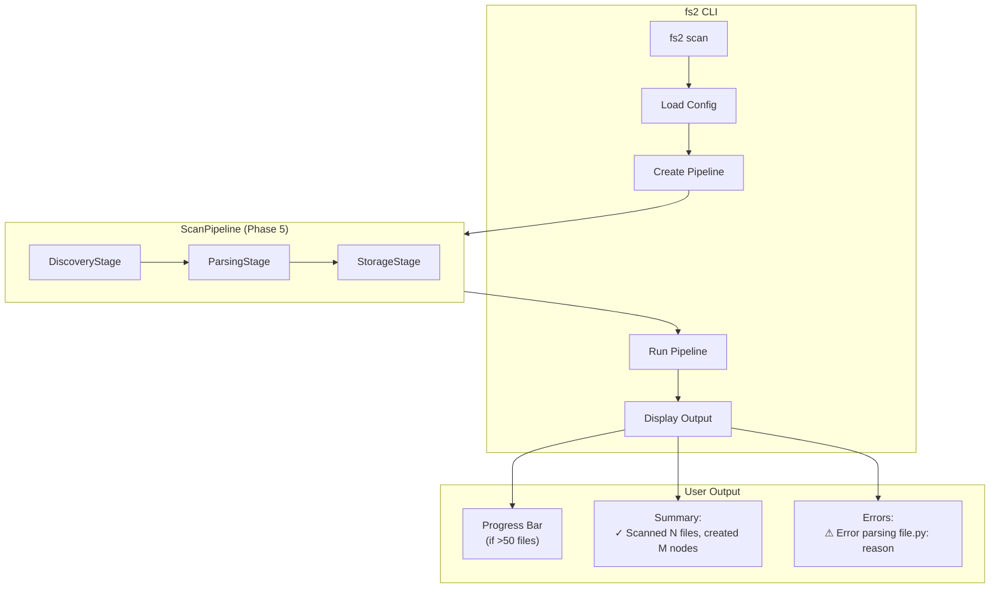
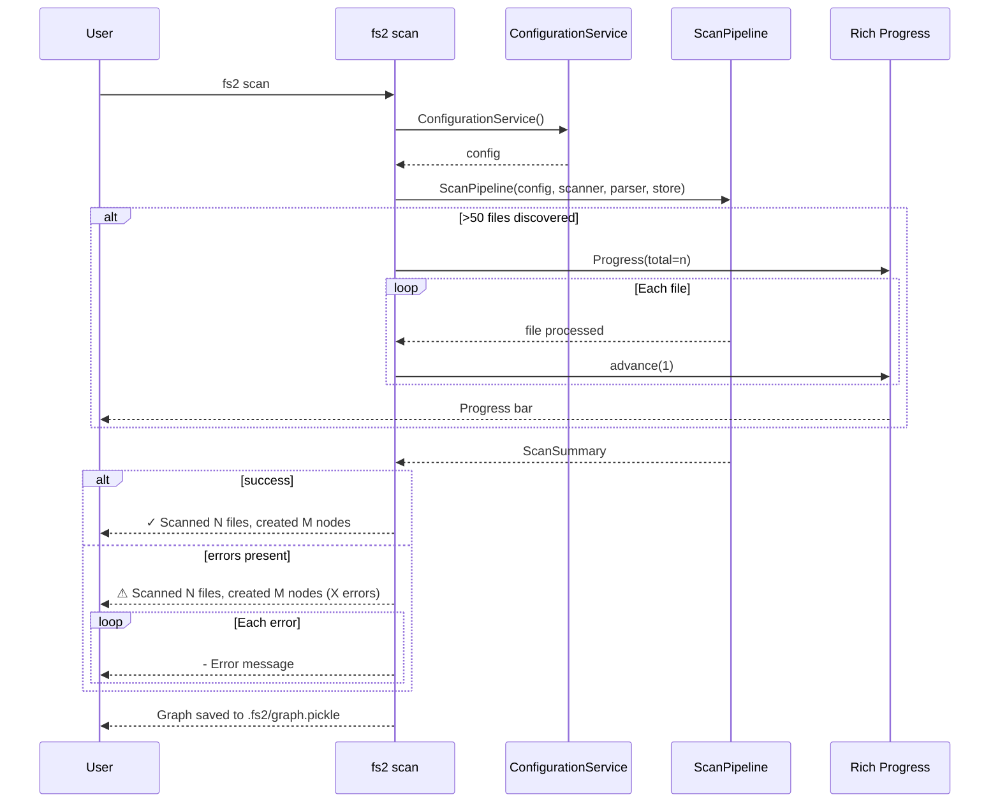

# Phase 6: CLI Command and Documentation – Tasks & Alignment Brief

**Spec**: [../../file-scanning-spec.md](../../file-scanning-spec.md)
**Plan**: [../../file-scanning-plan.md](../../file-scanning-plan.md)
**Date**: 2025-12-16
**Testing Strategy**: Full TDD

---

## Executive Briefing

### Purpose
This phase exposes the file scanning pipeline to users via a **`fs2 scan`** CLI command with Rich progress bars and comprehensive documentation. It's the user-facing culmination of Phases 1-5, transforming the internal pipeline into an accessible tool developers can run from their terminal.

### What We're Building

A **Typer CLI command** with **Rich progress bars**:

```bash
# User runs scan
$ fs2 scan

# Output with progress
Scanning src/... ━━━━━━━━━━━━━━━━━━━━ 100% 0:00:05

✓ Scanned 50 files, created 200 nodes
  Graph saved to .fs2/graph.pickle
```

**Components**:
- `fs2 scan` Typer command in `src/fs2/cli/scan.py`
- Rich progress bar for scans with >50 files
- ScanSummary display with file/node counts
- Error reporting for partial failures
- README.md quick-start section
- `docs/how/scanning.md` detailed guide

### User Value
Users can scan their codebase with a single command, see real-time progress, and get a clear summary of results. The generated graph enables all downstream features (search, documentation, embeddings).

### Example

**Before Phase 6**: No way to invoke scanning from command line.

**After Phase 6**:
```bash
# First-time setup (required)
$ fs2 init
✓ Created .fs2/config.yaml with defaults

# View/edit config (optional)
$ cat .fs2/config.yaml
scan:
  scan_paths:
    - "."
  respect_gitignore: true
  max_file_size_kb: 500

# Run scan
$ fs2 scan
Discovering files...
Parsing 127 files...

✓ Scanned 127 files, created 543 nodes
  Graph saved to .fs2/graph.pickle

# Verbose mode for debugging
$ fs2 scan --verbose
Discovering files...
  Found 127 files
Parsing src/main.py...
Parsing src/utils.py...
...

✓ Scanned 127 files, created 543 nodes
  Graph saved to .fs2/graph.pickle

# Partial errors (exit 0 - partial success)
$ fs2 scan
Discovering files...
Parsing 127 files...

⚠ Scanned 127 files, created 541 nodes (2 errors)
  - Error parsing src/broken.py: UnicodeDecodeError
  - Error parsing src/legacy.py: Syntax error at line 42
  Graph saved to .fs2/graph.pickle
$ echo $?
0

# No files found (exit 0 with warning)
$ fs2 scan
Discovering files...

⚠ No files found in configured scan paths.
  Check scan_paths in .fs2/config.yaml
$ echo $?
0

# Without init (exit 1 - config error)
$ fs2 scan
Error: No configuration found. Run `fs2 init` first.
$ echo $?
1

# Total failure (exit 2 - all files errored)
$ fs2 scan
Discovering files...
Parsing 50 files...

✗ Scan failed: All 50 files had errors
  - Error parsing src/a.py: ...
  ...
$ echo $?
2
```

---

## Tasks

| Status | ID | Task | CS | Type | Dependencies | Absolute Path(s) | Validation | Subtasks | Notes |
|--------|-----|------|-----|------|--------------|------------------|------------|----------|-------|
| [x] | T001 | Write tests for Typer app structure | 1 | Test | – | `/workspaces/flow_squared/tests/unit/cli/test_scan_cli.py` | Tests verify app instance, scan command registered | – | Typer app [^14] |
| [x] | T002 | Create Typer app and register scan command | 1 | Core | T001 | `/workspaces/flow_squared/src/fs2/cli/main.py` | T001 tests pass | – | app = typer.Typer() |
| [x] | T003 | Write tests for scan command invocation | 2 | Test | T002 | `/workspaces/flow_squared/tests/unit/cli/test_scan_cli.py` | Tests verify command runs, calls ScanPipeline | – | CliRunner |
| [x] | T004 | Write tests for AC9 output format | 2 | Test | T003 | `/workspaces/flow_squared/tests/unit/cli/test_scan_cli.py` | Output includes "Scanned N files, created M nodes" | – | AC9 |
| [x] | T005 | Implement scan command with basic output | 2 | Core | T004 | `/workspaces/flow_squared/src/fs2/cli/scan.py` | T003-T004 tests pass | – | Compose pipeline |
| [x] | T006 | Write tests for error display + exit codes | 2 | Test | T005 | `/workspaces/flow_squared/tests/unit/cli/test_scan_cli.py` | Exit 0=success, 1=config err, 2=total fail | – | AC10 |
| [x] | T006a | Write tests for zero-files warning | 1 | Test | T006 | `/workspaces/flow_squared/tests/unit/cli/test_scan_cli.py` | "No files found" warning when 0 files | – | UX |
| [x] | T007 | Implement error display + exit codes | 2 | Core | T006a | `/workspaces/flow_squared/src/fs2/cli/scan.py` | T006-T006a tests pass | – | Exit codes + distinct messages |
| [x] | T008 | Write tests for progress spinner (>50 files) | 1 | Test | T007 | `/workspaces/flow_squared/tests/unit/cli/test_scan_cli.py` | Spinner shown for >50 files | – | Two-phase: discover/parse |
| [x] | T009 | Implement Rich spinner for large scans | 2 | Core | T008 | `/workspaces/flow_squared/src/fs2/cli/scan.py` | T008 tests pass | – | "Discovering..." then "Parsing..." |
| [x] | T010 | Write tests for --verbose flag | 2 | Test | T009 | `/workspaces/flow_squared/tests/unit/cli/test_scan_cli.py` | Verbose shows per-file output | – | DEBUG logging |
| [x] | T011 | Implement --verbose flag with Rich logging | 2 | Core | T010 | `/workspaces/flow_squared/src/fs2/cli/scan.py` | T010 tests pass | – | Per-file: "Parsing src/foo.py..." |
| [x] | T012 | Write tests for TTY auto-detection | 1 | Test | T011 | `/workspaces/flow_squared/tests/unit/cli/test_scan_cli.py` | Spinner auto-disabled when not TTY | – | sys.stdout.isatty() |
| [x] | T012a | Write tests for --no-progress/--progress flags | 2 | Test | T012 | `/workspaces/flow_squared/tests/unit/cli/test_scan_cli.py` | CLI flags override TTY detection | – | Env var: FS2_SCAN__NO_PROGRESS |
| [x] | T012b | Implement progress config + TTY detection | 2 | Core | T012a | `/workspaces/flow_squared/src/fs2/cli/scan.py` | T012-T012a tests pass | – | ScanCommandConfig model, CLI > env > TTY |
| [x] | T013 | Write tests for missing config error | 1 | Test | T012b | `/workspaces/flow_squared/tests/unit/cli/test_scan_cli.py` | Missing config says "Run `fs2 init` first" | – | UX |
| [x] | T014 | Implement missing config error message | 1 | Core | T013 | `/workspaces/flow_squared/src/fs2/cli/scan.py` | T013 tests pass | – | Point to init |
| [x] | T014a | Write tests for `fs2 init` command | 2 | Test | T014 | `/workspaces/flow_squared/tests/unit/cli/test_init_cli.py` | Creates .fs2/config.yaml with defaults | – | Bootstrap |
| [x] | T014b | Implement `fs2 init` command | 2 | Core | T014a | `/workspaces/flow_squared/src/fs2/cli/init.py` | T014a tests pass | – | scan_paths=["."], respect_gitignore=True |
| [x] | T014c | Write tests for init when config exists | 1 | Test | T014b | `/workspaces/flow_squared/tests/unit/cli/test_init_cli.py` | Warns but doesn't overwrite | – | Safety |
| [x] | T015 | Register scan and init commands in app | 1 | Core | T014c | `/workspaces/flow_squared/src/fs2/cli/main.py` | `fs2 scan --help` and `fs2 init --help` work | – | app.command() |
| [x] | T016 | Add CLI entry point to pyproject.toml | 1 | Setup | T015 | `/workspaces/flow_squared/pyproject.toml` | `fs2` command available | – | [project.scripts] |
| [x] | T017 | Survey existing docs/how/ structure | 1 | Doc | – | `/workspaces/flow_squared/docs/how/` | Document existing structure | – | Discovery step |
| [x] | T018 | Draft README.md scanning section | 2 | Doc | T017 | `/workspaces/flow_squared/README.md` | Config example, basic usage | – | Quick-start |
| [x] | T019 | Create docs/how/scanning.md guide | 3 | Doc | T018 | `/workspaces/flow_squared/docs/how/scanning.md` | Node types, graph format, troubleshooting | – | Detailed guide |
| [x] | T020 | Write integration test: CLI end-to-end | 2 | Integration | T016 | `/workspaces/flow_squared/tests/integration/test_cli_integration.py` | Full scan via subprocess, verify output | – | E2E, NO_COLOR=1 |
| [x] | T021 | Write integration test: Rich visual rendering | 2 | Integration | T020 | `/workspaces/flow_squared/tests/integration/test_cli_integration.py` | Subprocess with TTY, verify Rich output | – | Real terminal test |
| [x] | T022 | Run full test suite | 1 | Validation | T021 | – | All tests pass (475+ tests) | – | log#phase-6-complete |
| [x] | T023 | Run lint and type checks | 1 | Validation | T022 | – | ruff clean, mypy clean | – | log#phase-6-complete |
| [x] | T024 | Final AC1-AC10 verification | 2 | Validation | T023 | – | All acceptance criteria pass | – | log#phase-6-complete |
| [x] | T025 | Update plan progress tracking | 1 | Doc | T024 | `/workspaces/flow_squared/docs/plans/003-fs2-base/file-scanning-plan.md` | Phase 6 marked complete | – | log#phase-6-complete |

---

## Alignment Brief

### Prior Phases Review

#### Phase-by-Phase Summary: Evolution of the Implementation

The file scanning feature was built across **5 phases** in a bottom-up progression:

**Phase 1 → Phase 2 → Phase 3 → Phase 4 → Phase 5** represents systematic layered construction:

1. **Phase 1 (Core Models and Configuration)** - 2025-12-15
   - Established domain vocabulary: `CodeNode` frozen dataclass with 20 fields (dual classification: ts_kind + category)
   - `ScanConfig` Pydantic model with scan_paths, max_file_size_kb, respect_gitignore, follow_symlinks
   - Domain exceptions: `FileScannerError`, `ASTParserError`, `GraphStoreError`
   - Added dependencies: networkx>=3.0, tree-sitter-language-pack>=0.13.0, pathspec>=0.12
   - **Tests**: 46 tests (25 CodeNode + 12 ScanConfig + 9 exceptions)

2. **Phase 2 (File Scanner Adapter)** - 2025-12-15
   - File discovery capability with gitignore compliance
   - `ScanResult` frozen dataclass (path, size_bytes)
   - `FileScanner` ABC with `scan() -> list[ScanResult]`, `should_ignore()`
   - `FileSystemScanner` with pathspec gitignore handling, depth-first traversal
   - Graceful permission error handling (log and continue)
   - **Tests**: 42 tests (5 ScanResult + 4 ABC + 8 Fake + 25 Impl)

3. **Phase 3 (AST Parser Adapter)** - 2025-12-15
   - Code understanding via tree-sitter multi-language parsing
   - `ASTParser` ABC with `parse() -> list[CodeNode]`, `detect_language()`
   - `TreeSitterParser` supporting 50+ language extensions
   - `parent_node_id` field set during traversal (no post-hoc derivation)
   - Binary file detection (first 8KB null byte check)
   - **Tests**: 51 tests (4 ABC + 9 Fake + 38 Impl)
   - **Fixtures**: 26 sample files across 9 languages

4. **Phase 4 (Graph Storage Repository)** - 2025-12-16
   - Persistence layer with networkx graph
   - `GraphStore` ABC with add_node, add_edge, get_children, save, load
   - `NetworkXGraphStore` with `RestrictedUnpickler` for security
   - Format versioning with metadata tuple `(metadata, graph)`
   - Edge direction: parent → child (successors = children)
   - **Tests**: 43 tests (12 ABC + 12 Fake + 19 Impl)

5. **Phase 5 (Scan Service Orchestration)** - 2025-12-16
   - Pipeline architecture composing all adapters
   - `PipelineStage` Protocol (name, process)
   - `PipelineContext` mutable context (scan_results, nodes, errors, metrics)
   - `DiscoveryStage`, `ParsingStage`, `StorageStage` implementations
   - `ScanPipeline` orchestrator with custom stage injection
   - `ScanSummary` frozen result dataclass
   - Error collection pattern (append to context.errors, continue)
   - **Tests**: 84 tests (66 unit + 10 model + 8 integration)
   - **Total**: 475 tests passing

**Phase 6** provides the **user interface** to invoke this entire stack.

#### Cumulative Deliverables (Available to Phase 6)

**From All Prior Phases**:

| Component | Module | Phase | Purpose for CLI |
|-----------|--------|-------|-----------------|
| `ScanConfig` | `fs2.config.objects` | 1 | Load user configuration |
| `CodeNode` | `fs2.core.models` | 1 | Display node statistics |
| `ScanResult` | `fs2.core.models` | 2 | Track scanned files |
| `ScanSummary` | `fs2.core.models` | 5 | Format output message |
| `FileSystemScanner` | `fs2.core.adapters` | 2 | File discovery |
| `TreeSitterParser` | `fs2.core.adapters` | 3 | AST extraction |
| `NetworkXGraphStore` | `fs2.core.repos` | 4 | Graph persistence |
| `ScanPipeline` | `fs2.core.services` | 5 | **Main entry point for CLI** |
| `ConfigurationService` | `fs2.config` | – | Configuration loading |

**CLI Composition Pattern** (from Phase 5):
```python
from fs2.config.service import ConfigurationService
from fs2.core.adapters import FileSystemScanner, TreeSitterParser
from fs2.core.repos import NetworkXGraphStore
from fs2.core.services import ScanPipeline

# In CLI scan command:
config = ConfigurationService()
pipeline = ScanPipeline(
    config=config,
    file_scanner=FileSystemScanner(config),
    ast_parser=TreeSitterParser(config),
    graph_store=NetworkXGraphStore(config),
)
summary = pipeline.run()
```

#### Pattern Evolution Across All Phases

| Pattern | Phases 1-4 | Phase 5 | Phase 6 (New) |
|---------|------------|---------|---------------|
| ConfigurationService registry | Adapters extract own config | Pipeline extracts ScanConfig | CLI creates ConfigurationService |
| ABC + Fake + Impl | File/AST/Graph adapters | Protocol for stages | **None needed** (CLI is thin) |
| Frozen dataclasses | Domain models | ScanSummary | Output formatting only |
| Exception translation | At adapter boundaries | Collected in context.errors | **User-friendly messages** |
| Error handling | Log and continue | Aggregate in summary | **Display with ⚠ symbol** |
| Progress feedback | None | Metrics per stage | **Rich progress bar** |

#### Reusable Test Infrastructure from Prior Phases

**Fixtures Available**:
- `FakeConfigurationService` - Inject test config
- `FakeFileScanner`, `FakeASTParser`, `FakeGraphStore` - Test doubles with call history
- `simple_python_project` fixture (Phase 5) - Creates tmp_path with calculator.py/utils.py
- `ast_samples_path` fixture (Phase 3) - Path to 26 sample files

**Pytest Patterns Established**:
```python
# CLI testing with typer
from typer.testing import CliRunner
from fs2.cli.main import app

runner = CliRunner()

def test_scan_command(tmp_path, monkeypatch):
    """Test CLI command invocation."""
    monkeypatch.chdir(tmp_path)
    result = runner.invoke(app, ["scan"])
    assert result.exit_code == 0
    assert "Scanned" in result.stdout
```

#### Critical Findings Timeline

| Finding | Phase Applied | How It Affects Phase 6 |
|---------|---------------|------------------------|
| CF01: ConfigurationService registry | 1-5 | CLI creates ConfigurationService, passes to pipeline |
| CF06: follow_symlinks=False default | 2 | No action needed (inherited default) |
| CF10: Exception translation | 2-5 | CLI receives clean error messages in ScanSummary.errors |
| CF12: ~~Truncation~~ (REMOVED) | 3 | No truncation logic needed in CLI |
| CF14: Format versioning | 4 | CLI doesn't need to handle (GraphStore internal) |
| CF15: Service composition | 5 | CLI composes ScanPipeline with adapters |

---

### Objective Recap and Behavior Checklist

**Primary Objective**: Expose file scanning via CLI with progress feedback and documentation.

**Behavior Checklist**:
- [ ] `fs2 scan` command invokes ScanPipeline with real adapters
- [ ] Output shows "Scanned N files, created M nodes" (AC9)
- [ ] Progress bar displayed for >50 files (per spec Q8)
- [ ] Progress bar hidden for small scans (<50 files)
- [ ] `--no-progress` flag disables progress bar
- [ ] Errors displayed with ⚠ symbol, scan continues (AC10)
- [ ] Invalid config shows helpful error message pointing to docs
- [ ] README.md includes quick-start scanning section
- [ ] docs/how/scanning.md provides detailed reference

---

### Non-Goals (Scope Boundaries)

❌ **NOT doing in this phase**:
- Incremental scanning (delta detection) - future work
- `fs2 scan --watch` file watcher mode - future work
- Custom stage injection via CLI flags - future work
- Graph query commands (`fs2 query`) - separate feature
- JSON output format (`--format json`) - future work
- Config override flags (`--scan-paths`, `--max-size`) - future work
- Parallel scanning (`--parallel`) - future work

✅ **Added via Critical Insights Session**:
- `--verbose` / `-v` flag for detailed per-file logging (T010-T011)

---

### Critical Findings Affecting This Phase

| Finding | What It Constrains/Requires | Tasks Addressing It |
|---------|----------------------------|---------------------|
| **AC9: CLI Output Format** | Output must include "Scanned N files, created M nodes" | T004, T005 |
| **AC10: Graceful Error Handling** | Errors displayed but scan continues | T006, T007 |
| **Spec Q8: Progress Bar Threshold** | Show progress for >50 files | T008, T009, T010 |

---

### ADR Decision Constraints

No ADRs exist for this project. This section is N/A.

---

### Visual Alignment Aids

#### CLI Flow Diagram



#### Sequence Diagram



---

### Test Plan (Full TDD)

#### Testing Pattern: Rich + CliRunner

**Unit tests**: Use `NO_COLOR=1` env var for plain text assertions
```python
def test_scan_output(tmp_path, monkeypatch):
    monkeypatch.setenv("NO_COLOR", "1")  # Disable Rich formatting
    result = runner.invoke(app, ["scan"])
    assert "Scanned" in result.stdout  # Plain text, no ANSI codes
```

**Integration tests**: Subprocess for real terminal behavior
```python
def test_rich_renders_in_terminal(tmp_path):
    result = subprocess.run(["uv", "run", "fs2", "scan"],
                           capture_output=True, cwd=tmp_path)
    assert result.returncode == 0
```

#### Unit Tests

| Component | Test File | Key Tests |
|-----------|-----------|-----------|
| Typer App | test_scan_cli.py | App instance, command registration |
| Scan Command | test_scan_cli.py | Invocation, pipeline called, output format |
| Exit Codes | test_scan_cli.py | Exit 0/1/2 for success/config err/total fail |
| Error Display | test_scan_cli.py | Errors shown, zero-files warning |
| Progress/Verbose | test_scan_cli.py | Spinner threshold, --verbose, --no-progress |
| TTY Detection | test_scan_cli.py | Auto-disable spinner when not TTY |
| Init Command | test_init_cli.py | Creates config, warns if exists |
| Config Errors | test_scan_cli.py | Missing config → "Run fs2 init first" |

**Test Examples**:

```python
# tests/unit/cli/test_scan_cli.py
import pytest
from typer.testing import CliRunner
from fs2.cli.main import app

runner = CliRunner()

def test_given_scan_command_when_run_then_outputs_summary(tmp_path, monkeypatch):
    """
    Purpose: Verifies AC9 - CLI output format.
    Quality Contribution: Ensures users see clear scan results.
    Acceptance Criteria: Output includes "Scanned N files, created M nodes".
    """
    # Arrange
    (tmp_path / "test.py").write_text("x = 1")
    (tmp_path / ".fs2").mkdir()
    (tmp_path / ".fs2" / "config.yaml").write_text(
        f"scan:\n  scan_paths:\n    - '{tmp_path}'"
    )
    monkeypatch.chdir(tmp_path)

    # Act
    result = runner.invoke(app, ["scan"])

    # Assert
    assert result.exit_code == 0
    assert "Scanned" in result.stdout
    assert "files" in result.stdout
    assert "nodes" in result.stdout


def test_given_parse_error_when_scanning_then_shows_warning(tmp_path, monkeypatch):
    """
    Purpose: Verifies AC10 - graceful error display.
    Quality Contribution: Ensures errors visible without stopping scan.
    Acceptance Criteria: Warning symbol ⚠ shown, error listed.
    """
    # Arrange - create file that will cause parse error
    (tmp_path / "broken.py").write_text("def broken(\n    # missing paren")
    (tmp_path / "good.py").write_text("x = 1")
    (tmp_path / ".fs2").mkdir()
    (tmp_path / ".fs2" / "config.yaml").write_text(
        f"scan:\n  scan_paths:\n    - '{tmp_path}'"
    )
    monkeypatch.chdir(tmp_path)

    # Act
    result = runner.invoke(app, ["scan"])

    # Assert - scan still succeeds but shows warning
    assert "Scanned" in result.stdout  # Completed
    assert "error" in result.stdout.lower() or "⚠" in result.stdout


def test_given_many_files_when_scanning_then_shows_progress(tmp_path, monkeypatch):
    """
    Purpose: Verifies progress bar threshold (>50 files).
    Quality Contribution: Ensures progress feedback for large scans.
    Acceptance Criteria: Progress bar elements visible.
    """
    # Arrange - create 55 files
    (tmp_path / ".fs2").mkdir()
    for i in range(55):
        (tmp_path / f"file_{i}.py").write_text(f"x = {i}")
    (tmp_path / ".fs2" / "config.yaml").write_text(
        f"scan:\n  scan_paths:\n    - '{tmp_path}'"
    )
    monkeypatch.chdir(tmp_path)

    # Act
    result = runner.invoke(app, ["scan"])

    # Assert - some progress indication
    assert result.exit_code == 0
    assert "Scanned 55 files" in result.stdout or "55" in result.stdout


def test_given_no_progress_flag_when_scanning_then_hides_bar(tmp_path, monkeypatch):
    """
    Purpose: Verifies --no-progress flag for CI/scripts.
    Quality Contribution: Enables clean output for automation.
    Acceptance Criteria: No progress bar in output.
    """
    # Arrange
    (tmp_path / "test.py").write_text("x = 1")
    (tmp_path / ".fs2").mkdir()
    (tmp_path / ".fs2" / "config.yaml").write_text(
        f"scan:\n  scan_paths:\n    - '{tmp_path}'"
    )
    monkeypatch.chdir(tmp_path)

    # Act
    result = runner.invoke(app, ["scan", "--no-progress"])

    # Assert
    assert result.exit_code == 0
    assert "━" not in result.stdout  # No progress bar characters
```

#### Integration Tests

| Test | Purpose | Fixtures |
|------|---------|----------|
| test_cli_end_to_end | Full scan via CLI subprocess | tmp_path with Python files |
| test_cli_progress_visual | Progress bar appears for large scan | 55+ files |

---

### Step-by-Step Implementation Outline

**Step 1: Typer App Setup (T001-T002)**
1. Create `src/fs2/cli/main.py` with Typer app instance
2. Register basic scan command placeholder

**Step 2: Scan Command Core (T003-T007)**
1. Implement scan command that creates ScanPipeline
2. Format ScanSummary for output (AC9)
3. Display errors with ⚠ symbol (AC10)

**Step 3: Progress Bar (T008-T012)**
1. Add Rich progress bar (conditional on >50 files)
2. Implement --no-progress flag

**Step 4: Config Error Handling (T013-T014)**
1. Catch config loading errors
2. Show helpful message pointing to docs

**Step 5: Entry Point (T015-T016)**
1. Register scan command in app
2. Add [project.scripts] entry point

**Step 6: Documentation (T017-T019)**
1. Survey existing docs structure
2. Update README.md with quick-start
3. Create docs/how/scanning.md guide

**Step 7: Integration & Validation (T020-T025)**
1. Integration tests
2. Full test suite
3. Lint and type checks
4. AC1-AC10 verification
5. Progress tracking update

---

### Commands to Run

```bash
# Run Phase 6 unit tests
uv run pytest tests/unit/cli/test_scan_cli.py -v

# Run integration tests
uv run pytest tests/integration/test_cli_integration.py -v

# Run all tests
uv run pytest -v

# Lint check
uv run ruff check src/fs2/

# Type check
uv run mypy src/fs2/cli/

# Test CLI entry point (after T016)
uv run fs2 scan --help
uv run fs2 scan
```

---

### Risks/Unknowns

| Risk | Severity | Mitigation |
|------|----------|------------|
| Rich progress bar terminal compatibility | Low | Test on common terminals, add --no-progress fallback |
| CLI test isolation | Low | Use tmp_path and monkeypatch.chdir() |
| Entry point installation | Low | Test via `uv run fs2` after pyproject.toml update |

---

### Ready Check

- [x] Prior phases 1-5 all complete and passing (475 tests)
- [x] ScanPipeline API ready (`run() -> ScanSummary`)
- [x] Rich and Typer dependencies already in pyproject.toml
- [x] CLI module structure exists (`src/fs2/cli/__init__.py`)
- [x] docs/how/ directory exists with 6 existing guides
- [x] ADR constraints mapped to tasks - N/A (no ADRs)

**GO**: Ready for implementation

---

## Phase Footnote Stubs

| Footnote | Task(s) | Description | Added By |
|----------|---------|-------------|----------|
| [^14] | T001-T025 | Phase 6 - CLI Command and Documentation (32 tests) | plan-6-implement-phase |

[^14]: Phase 6 - CLI Command and Documentation (32 tests)
  - `file:src/fs2/cli/main.py` - Typer app with command registration
  - `file:src/fs2/cli/scan.py` - Scan command implementation
  - `file:src/fs2/cli/init.py` - Init command implementation
  - `file:src/fs2/__main__.py` - Entry point for python -m fs2
  - `file:docs/how/scanning.md` - Scanning guide
  - `file:tests/unit/cli/test_scan_cli.py` - Scan CLI tests (20 tests)
  - `file:tests/unit/cli/test_init_cli.py` - Init CLI tests (7 tests)
  - `file:tests/integration/test_fs2_cli_integration.py` - CLI integration tests (5 tests)

---

## Evidence Artifacts

**Execution Log**: `./execution.log.md` (created by /plan-6)

**Files to be Created**:
```
src/fs2/cli/
├── __init__.py              # Existing (minimal)
├── main.py                  # Typer app + command registration
├── scan.py                  # Scan command implementation
└── init.py                  # Init command (creates .fs2/config.yaml)

tests/unit/cli/
├── test_scan_cli.py         # Scan CLI unit tests
└── test_init_cli.py         # Init CLI unit tests

tests/integration/
└── test_cli_integration.py  # CLI integration tests

docs/how/
└── scanning.md              # Detailed scanning guide

README.md                    # Updated with scanning section
pyproject.toml               # Updated with entry point
```

---

## Directory Layout

```
docs/plans/003-fs2-base/
├── file-scanning-spec.md
├── file-scanning-plan.md
└── tasks/
    ├── phase-1/
    │   ├── tasks.md
    │   └── execution.log.md
    ├── phase-2/
    │   ├── tasks.md
    │   └── execution.log.md
    ├── phase-3/
    │   ├── tasks.md
    │   └── execution.log.md
    ├── phase-4/
    │   ├── tasks.md
    │   └── execution.log.md
    ├── phase-5/
    │   ├── tasks.md
    │   └── execution.log.md
    └── phase-6/
        ├── tasks.md          ← This file
        └── execution.log.md  ← Created by /plan-6
```

---

## Critical Insights Discussion

**Session**: 2025-12-16
**Context**: Phase 6 CLI Command and Documentation Tasks
**Analyst**: AI Clarity Agent
**Reviewer**: Development Team
**Format**: Water Cooler Conversation (5 Critical Insights)

### Insight 1: Progress Bar Architecture Gap

**Did you know**: The tasks assumed per-file progress callbacks that don't exist in Phase 5's ScanPipeline - it processes files in batch stages with no events.

**Implications**:
- Original T008-T012 were underscoped (CS-1/2 but required Phase 5 changes)
- ScanPipeline.run() is blocking with no per-file callbacks
- Progress bar as designed would require architectural changes

**Options Considered**:
- Option A: Modify Phase 5 to add progress callbacks
- Option B: Two-phase spinner approach ("Discovering..." then "Parsing...")
- Option C: Wrap ScanPipeline with custom stages
- Option D: Accept batch-only progress

**AI Recommendation**: Option B - Two-phase spinner
- Reasoning: Minimal Phase 5 changes, still gives progress feedback

**Discussion Summary**: User agreed with Option B but requested `--verbose` mode that shows per-file output via DEBUG logging for power users who need visibility.

**Decision**: Option B + `--verbose` flag for detailed per-file logging

**Action Items**:
- [x] Update T008-T012 to spinner approach
- [x] Add T010-T011 for --verbose flag implementation

**Affects**: Tasks T008-T012, Non-Goals section

---

### Insight 2: Directory Bootstrap Problem

**Did you know**: Running `fs2 scan` in a fresh project with no `.fs2/` directory would fail with confusing errors or silently scan nothing.

**Implications**:
- First-time users get poor experience
- No guidance on what config file to create
- "0 files scanned" gives no explanation

**Options Considered**:
- Option A: Auto-create minimal config on first run
- Option B: Require explicit `fs2 init` command first
- Option C: Interactive prompt on missing config
- Option D: Sensible defaults with warning

**AI Recommendation**: Option D - Sensible defaults with warning
- Reasoning: Zero friction, transparent, scriptable

**Discussion Summary**: User preferred explicit initialization over magic behavior.

**Decision**: Option B - Require `fs2 init` before scanning

**Action Items**:
- [x] Add T014a-T014c for `fs2 init` command
- [x] Update T013-T014 for "Run `fs2 init` first" error

**Affects**: Tasks T013-T014, added T014a-T014c, Example section

---

### Insight 3: Rich Terminal Detection for CI/CD

**Did you know**: Rich progress spinners can produce garbled output when stdout is piped or in CI/CD environments.

**Implications**:
- CI pipelines need `--no-progress` flag
- Redirected output looks bad without explicit flag
- Tests may behave differently than production

**Options Considered**:
- Option A: Auto-detect TTY and disable Rich when not interactive
- Option B: Keep manual `--no-progress` only
- Option C: Environment variable override

**AI Recommendation**: Option A - Auto-detect TTY
- Reasoning: Standard practice, zero configuration for CI

**Discussion Summary**: User agreed with auto-detection but wanted override capability via the existing config system (env var → CLI var pattern).

**Decision**: Auto-detect TTY + env var (`FS2_SCAN__NO_PROGRESS`) + CLI flags (`--no-progress`/`--progress`)

**Action Items**:
- [x] Add T012 for TTY auto-detection
- [x] Add T012a-T012b for config system integration

**Affects**: Tasks T012-T012b, uses existing ConfigurationService pattern

---

### Insight 4: Error State UX Ambiguity

**Did you know**: The output format "Scanned 0 files, created 0 nodes" doesn't distinguish between config errors, empty directories, or total failures.

**Implications**:
- Users can't tell if scan_paths are wrong
- No distinction between partial and total failure
- Scripts can't programmatically detect error types

**Options Considered**:
- Option A: Distinct messages for zero-file scenarios
- Option B: Always show scan paths in summary
- Option C: Warning for suspicious zero results
- Option D: Exit codes + distinct messages

**AI Recommendation**: Option D - Exit codes + distinct messages
- Reasoning: Scriptable for CI, human-friendly, standard CLI practice

**Discussion Summary**: User agreed with structured exit codes.

**Decision**: Exit codes: 0=success, 1=config error, 2=total failure

**Action Items**:
- [x] Add T006 for exit code tests
- [x] Add T006a for zero-files warning
- [x] Update example with exit code scenarios

**Affects**: Tasks T006-T007, Example section

---

### Insight 5: CliRunner + Rich Testing Complexity

**Did you know**: Testing Rich output with Typer's CliRunner can cause flaky tests due to ANSI escape codes and terminal emulation differences.

**Implications**:
- Tests checking for emoji/symbols may fail
- Spinner tests particularly tricky
- CI vs local behavior differences

**Options Considered**:
- Option A: Use `force_terminal=False` in tests
- Option B: Test semantic content, not formatting
- Option C: Use Rich's `export_text()` for assertions
- Option D: Combination approach (unit + integration)

**AI Recommendation**: Option D - Combination approach
- Reasoning: Fast unit tests with `NO_COLOR=1`, one integration test for visual verification

**Discussion Summary**: User agreed with the combination approach.

**Decision**: Unit tests use `NO_COLOR=1`, integration test verifies real Rich rendering

**Action Items**:
- [x] Update Test Plan with testing pattern
- [x] Update T020-T021 for subprocess-based integration tests

**Affects**: Test Plan section, T020-T021

---

## Session Summary

**Insights Surfaced**: 5 critical insights identified and discussed
**Decisions Made**: 5 decisions reached through collaborative discussion
**Action Items Created**: 15+ task updates applied
**Areas Updated**:
- Tasks table (T006-T014c restructured)
- Example section (init workflow, exit codes)
- Non-Goals section (verbose now in scope)
- Test Plan section (Rich testing pattern)
- Files to be Created (added init.py, test_init_cli.py)

**Shared Understanding Achieved**: ✓

**Confidence Level**: High - Key architectural decisions made, testing strategy clear

**Next Steps**:
Run `/plan-6-implement-phase --phase 6` to begin implementation
