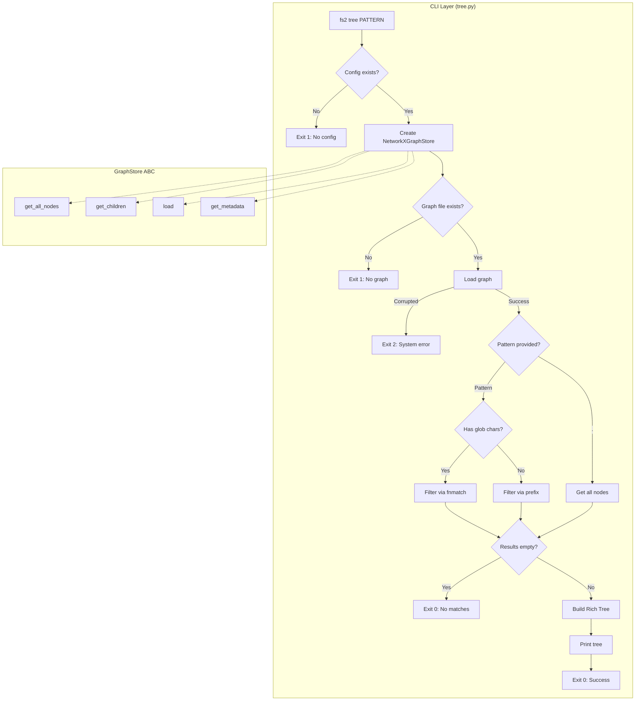
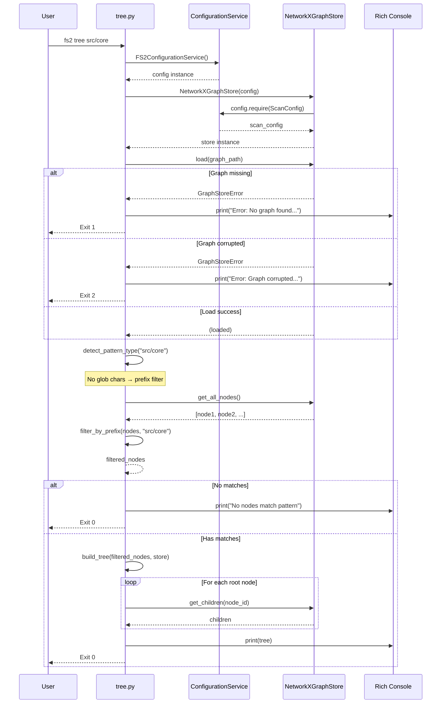

# Phase 1: Core Tree Command with Path Filtering – Tasks & Alignment Brief

**Spec**: [../../tree-command-spec.md](../../tree-command-spec.md)
**Plan**: [../../tree-command-plan.md](../../tree-command-plan.md)
**Date**: 2025-12-17

---

## Executive Briefing

### Purpose
This phase delivers the foundational `fs2 tree` CLI command that displays code structure from the persisted graph as a hierarchical tree. It enables users to visualize file→class→method relationships at a glance, filtered by path or glob pattern, with proper error handling and exit codes.

### What We're Building
A new CLI command `fs2 tree [PATTERN]` that:
- Loads the persisted graph from `.fs2/graph.pickle`
- Displays hierarchical code structure using Rich Tree API
- Supports path prefix filtering (`fs2 tree src/core`)
- Supports glob pattern filtering (`fs2 tree "*.py"`)
- Shows appropriate error messages for missing graph or empty results
- Returns correct exit codes (0=success, 1=user error, 2=system error)

### User Value
Users can quickly understand code structure without reading source files:
- Explore unfamiliar codebases at a glance
- Verify scan results match expectations
- Get visual hierarchy of files, classes, and methods
- Filter to specific paths or file types

### Example
```bash
$ fs2 tree src/core

📁 src/core/
├── 📄 adapters/file_scanner.py
│   ├── 📦 FileScanner [15-45]
│   │   ├── ƒ scan [20-35]
│   │   └── ƒ _walk_directory [37-45]
│   └── 📦 FileScannerError [48-52]
├── 📄 models/code_node.py
│   ├── ƒ classify_node [21-84]
│   └── 📦 CodeNode [87-166]
└── 📄 services/scan_pipeline.py
    └── 📦 ScanPipeline [25-150]

✓ Found 12 nodes in 3 files
```

---

## Tasks

| Status | ID | Task | CS | Type | Dependencies | Absolute Path(s) | Validation | Subtasks | Notes |
|--------|------|------|-----|------|--------------|------------------|------------|----------|-------|
| [x] | T001 | Write tests for TreeConfig creation and YAML loading | 1 | Test | – | /workspaces/flow_squared/tests/unit/config/test_tree_config.py | Tests verify TreeConfig loads defaults, from YAML, from env vars | – | Per Discovery 03 [^6] [log#t001-t002](./execution.log.md#t001-t002) |
| [x] | T002 | Create TreeConfig in config/objects.py | 1 | Core | T001 | /workspaces/flow_squared/src/fs2/config/objects.py | TreeConfig with graph_path field; added to YAML_CONFIG_TYPES | – | Per Discovery 03 [^6] [log#t001-t002](./execution.log.md#t001-t002) |
| [x] | T003 | Write tests for GraphStore.get_metadata() | 2 | Test | – | /workspaces/flow_squared/tests/unit/repos/test_graph_store.py | Tests cover: metadata after load, error if not loaded, all fields present | – | Per Discovery 05 [^6] [log#t003-t006](./execution.log.md#t003-t006) |
| [x] | T004 | Extend GraphStore ABC with get_metadata() abstract method | 1 | Core | T003 | /workspaces/flow_squared/src/fs2/core/repos/graph_store.py | Abstract method added with proper docstring | – | Per Discovery 05 [^6] [log#t003-t006](./execution.log.md#t003-t006) |
| [x] | T005 | Implement get_metadata() in NetworkXGraphStore | 2 | Core | T004 | /workspaces/flow_squared/src/fs2/core/repos/graph_store_impl.py | Returns dict with format_version, created_at, node_count, edge_count | – | Store `self._metadata` during load(); raise if not loaded [^6] [log#t003-t006](./execution.log.md#t003-t006) |
| [x] | T006 | Implement get_metadata() in FakeGraphStore | 1 | Core | T004 | /workspaces/flow_squared/src/fs2/core/repos/graph_store_fake.py | Returns configurable metadata; records call history | – | Add set_metadata() helper [^6] [log#t003-t006](./execution.log.md#t003-t006) |
| [x] | T007 | Write tests for tree CLI registration and --help | 1 | Test | – | /workspaces/flow_squared/tests/unit/cli/test_tree_cli.py | Tests verify command exists in app, --help shows usage | – | Per Discovery 04 [^6] [log#t007-t013](./execution.log.md#t007-t013) |
| [x] | T008 | Create tree.py skeleton with Typer options | 2 | Core | T007, T002 | /workspaces/flow_squared/src/fs2/cli/tree.py | tree function accepts pattern, --detail, --depth, --verbose | – | Per Discovery 04, 07 [^6] [log#t007-t013](./execution.log.md#t007-t013) |
| [x] | T009 | Register tree command in main.py | 1 | Core | T008 | /workspaces/flow_squared/src/fs2/cli/main.py | app.command(name="tree")(tree) pattern | – | Follow scan.py pattern [^6] [log#t007-t013](./execution.log.md#t007-t013) |
| [x] | T010 | Write tests for missing graph error (AC7) | 2 | Test | T008 | /workspaces/flow_squared/tests/unit/cli/test_tree_cli.py | Tests verify exit code 1 and error message when graph missing | – | [^6] [log#t007-t013](./execution.log.md#t007-t013) |
| [x] | T011 | Implement graph loading with error handling | 2 | Core | T010, T005 | /workspaces/flow_squared/src/fs2/cli/tree.py | Check path.exists() first→exit 1; GraphStoreError from load()→exit 2 | – | Per Discovery 09; Insight #5 [^6] [log#t007-t013](./execution.log.md#t007-t013) |
| [x] | T012 | Write tests for basic tree display (AC1) | 2 | Test | T011 | /workspaces/flow_squared/tests/unit/cli/test_tree_cli.py | Tests verify Rich Tree output with icons, names, line ranges | – | [^6] [log#t007-t013](./execution.log.md#t007-t013) |
| [x] | T013 | Implement basic tree traversal and display | 3 | Core | T012 | /workspaces/flow_squared/src/fs2/cli/tree.py | Displays hierarchy with virtual 📁 folders for common path prefixes; icons per category | – | Per Discovery 08, 12, 13; virtual folder grouping [^6] [log#t007-t013](./execution.log.md#t007-t013) |
| [x] | T014 | Write tests for exact node_id match (short-circuit) | 2 | Test | T013 | /workspaces/flow_squared/tests/unit/cli/test_tree_cli.py | Tests verify exact node_id returns that node + children | – | Direct lookup optimization [^6] [log#t014-t017](./execution.log.md#t014-t017) |
| [x] | T015 | Write tests for substring filtering (AC2) | 2 | Test | T013 | /workspaces/flow_squared/tests/unit/cli/test_tree_cli.py | Tests verify partial match on node_id (paths, names work) | – | Unified node_id matching [^6] [log#t014-t017](./execution.log.md#t014-t017) |
| [x] | T016 | Write tests for glob pattern filtering (AC3) | 2 | Test | T015 | /workspaces/flow_squared/tests/unit/cli/test_tree_cli.py | Tests verify glob patterns (*, ?) via fnmatch on node_id | – | Per Discovery 06 [^6] [log#t014-t017](./execution.log.md#t014-t017) |
| [x] | T017 | Implement unified pattern filtering with root bucket | 3 | Core | T014, T015, T016 | /workspaces/flow_squared/src/fs2/cli/tree.py | 1) Match nodes, 2) Build root bucket (remove children when ancestor matched), 3) Group by path prefix for virtual folders | – | Root bucket algorithm; see Insight #3 [^6] [log#t014-t017](./execution.log.md#t014-t017) |
| [x] | T018 | Write tests for empty results (AC8) | 1 | Test | T017 | /workspaces/flow_squared/tests/unit/cli/test_tree_cli.py | Tests verify "No nodes match pattern" message and exit 0 | – | Per Discovery 16 [^6] [log#t018-t021](./execution.log.md#t018-t021) |
| [x] | T019 | Implement empty results handling | 1 | Core | T018 | /workspaces/flow_squared/src/fs2/cli/tree.py | Shows message; exits 0 | – | [^6] [log#t018-t021](./execution.log.md#t018-t021) |
| [x] | T020 | Write tests for empty graph edge case | 1 | Test | T019 | /workspaces/flow_squared/tests/unit/cli/test_tree_cli.py | Tests verify "Found 0 nodes in 0 files" when graph empty | – | Per Discovery 16 [^6] [log#t018-t021](./execution.log.md#t018-t021) |
| [x] | T021 | Implement empty graph handling | 1 | Core | T020 | /workspaces/flow_squared/src/fs2/cli/tree.py | Shows "Found 0 nodes in 0 files"; exits 0 | – | [^6] [log#t018-t021](./execution.log.md#t018-t021) |
| [x] | T022 | Write tests for exit code 2 (system error) | 1 | Test | T011 | /workspaces/flow_squared/tests/unit/cli/test_tree_cli.py | Tests verify exit 2 for corrupted graph | – | Per Discovery 09 [^6] [log#t022-t023](./execution.log.md#t022-t023) |
| [x] | T023 | Implement exit code 2 for system errors | 1 | Core | T022 | /workspaces/flow_squared/src/fs2/cli/tree.py | GraphStoreError from load() (file exists but corrupted) → exit 2 | – | Per Insight #5 [^6] [log#t022-t023](./execution.log.md#t022-t023) |
| [x] | T024 | Write integration tests with real graph | 2 | Integration | T021 | /workspaces/flow_squared/tests/integration/test_tree_cli_integration.py | End-to-end test: scan fixture project, then tree | – | [^6] [log#t024-t025](./execution.log.md#t024-t025) |
| [x] | T025 | Add session-scoped scanned_fixtures_graph fixture | 3 | Setup | T024 | /workspaces/flow_squared/tests/conftest.py, /workspaces/flow_squared/tests/fixtures/ | Scans tests/fixtures ONCE per session with real ScanPipeline; returns store, graph_path, paths | – | High-fidelity real graph for all tree tests [^6] [log#t024-t025](./execution.log.md#t024-t025) |
| [x] | T026 | Refactor and clean up Phase 1 code | 2 | Polish | T024, T025 | /workspaces/flow_squared/src/fs2/cli/tree.py | Lint passes; test coverage >80%; docstrings complete | – | [^6] [log#t026](./execution.log.md#t026) |

---

## Alignment Brief

### Objective Recap

Phase 1 delivers the core `fs2 tree` command with path/glob filtering. This establishes the foundation for Phase 2 (detail levels, depth limiting) and Phase 3 (file-type-specific handling, freshness).

### Acceptance Criteria Coverage

| AC | Description | Covered By |
|----|-------------|------------|
| AC1 | Basic tree display | T012, T013 |
| AC2 | Path filtering | T014, T015 |
| AC3 | Glob pattern filtering | T016, T017 |
| AC7 | Missing graph error | T010, T011 |
| AC8 | Empty results | T018, T019 |
| AC13 | Exit codes 0/1/2 | T010, T011, T022, T023 |
| AC14 | --help output | T007, T008 |

### Non-Goals (Scope Boundaries)

❌ **NOT doing in this phase**:
- `--detail min|max` formatting (Phase 2)
- `--depth N` limiting with hidden child indicator (Phase 2)
- Summary line with node/file counts (Phase 2)
- Verbose logging setup (Phase 2)
- Scan freshness timestamp in summary (Phase 3)
- Dockerfile/Markdown/data file special handling (Phase 3)
- Loading spinner for large graphs (Phase 3)
- Large graph warning (Phase 3)
- README documentation updates (Phase 3)
- Performance optimization for wide trees (Future)
- `--output json` for scripting (Future)

### Critical Findings Affecting This Phase

| Finding | What It Constrains | Addressed By |
|---------|-------------------|--------------|
| Discovery 01: GraphStore ABC with DI | CLI creates impl, passes via ABC type hint | T008, T011 |
| Discovery 02: No Concept Leakage | Never call config.require(ScanConfig) in CLI | T008, T011 |
| Discovery 03: Need TreeConfig | Create TreeConfig with graph_path field | T001, T002 |
| Discovery 04: Command Registration | Use app.command(name="tree")(tree) pattern | T008, T009 |
| Discovery 05: get_metadata() Extension | Extend GraphStore ABC with get_metadata() | T003-T006 |
| Discovery 06: Pattern Matching | Unified node_id matching: 1) exact→short-circuit, 2) glob→fnmatch, 3) substring | T014-T017 |
| Discovery 07: Typer Options Pattern | Use Annotated[type, typer.Option(...)] | T008 |
| Discovery 08: Rich Tree API | Use Tree() and .add() for hierarchy | T013 |
| Discovery 09: Exit Codes | 0=success, 1=user error, 2=system error | T010, T011, T022, T023 |
| Discovery 12: Use get_children() | Always use GraphStore API, not parent_node_id | T013 |
| Discovery 13: Icon Conventions | Map category to icon per spec | T013 |
| Discovery 16: Empty Graph | Valid state, show "Found 0 nodes" | T020, T021 |

### ADR Decision Constraints

No ADRs reference this feature. None applicable.

### Invariants & Guardrails

| Invariant | Enforcement |
|-----------|-------------|
| Graph must be loaded before display | Check in tree() function |
| Exit codes follow 0/1/2 convention | Test assertions |
| Icons match spec (📄 📦 ƒ etc.) | Constant mapping, test assertions |
| Tree traversal uses get_children() only | Code review, no parent_node_id usage |
| No concept leakage | config.require() only in adapter/repo, not CLI |

### Inputs to Read

| File | Purpose |
|------|---------|
| `/workspaces/flow_squared/src/fs2/cli/scan.py` | Reference for CLI patterns |
| `/workspaces/flow_squared/src/fs2/cli/main.py` | Command registration |
| `/workspaces/flow_squared/src/fs2/core/repos/graph_store.py` | ABC to extend |
| `/workspaces/flow_squared/src/fs2/core/repos/graph_store_impl.py` | Impl to extend |
| `/workspaces/flow_squared/src/fs2/core/repos/graph_store_fake.py` | Fake to extend |
| `/workspaces/flow_squared/src/fs2/config/objects.py` | Config pattern to follow |
| `/workspaces/flow_squared/src/fs2/core/models/code_node.py` | CodeNode model |

---

### Visual Alignment: Flow Diagram



### Visual Alignment: Sequence Diagram



---

### Test Plan (Full TDD)

Per spec Testing Strategy: Full TDD with FakeGraphStore (avoid mocks entirely).

#### Unit Tests

| Test Class | Test Method | Purpose | Fixture | Expected Output |
|------------|-------------|---------|---------|-----------------|
| `TestTreeConfig` | `test_given_defaults_when_created_then_has_graph_path` | Verify default graph_path | – | graph_path=".fs2/graph.pickle" |
| `TestTreeConfig` | `test_given_yaml_with_path_when_loaded_then_uses_custom` | Verify YAML override | config.yaml | graph_path from YAML |
| `TestTreeConfig` | `test_given_env_var_when_loaded_then_overrides_yaml` | Verify env precedence | FS2_TREE__GRAPH_PATH | env var value |
| `TestGraphStoreMetadata` | `test_given_loaded_graph_when_get_metadata_then_returns_dict` | Verify metadata access | loaded graph | dict with keys |
| `TestGraphStoreMetadata` | `test_given_no_load_when_get_metadata_then_raises_error` | Verify error case | fresh store | GraphStoreError |
| `TestTreeRegistration` | `test_given_cli_app_when_inspected_then_tree_registered` | Verify command exists | – | "tree" in commands |
| `TestTreeHelp` | `test_given_help_flag_when_invoked_then_shows_usage` | Verify --help | – | pattern, --detail in output |
| `TestTreeMissingGraph` | `test_given_no_graph_when_tree_then_exit_one` | AC7 | config only | exit 1, error msg |
| `TestTreeCorruptedGraph` | `test_given_corrupted_graph_when_tree_then_exit_two` | AC13 | corrupted file | exit 2, error msg |
| `TestTreeBasicDisplay` | `test_given_scanned_graph_when_tree_then_shows_hierarchy` | AC1 | FakeGraphStore | tree output |
| `TestTreeBasicDisplay` | `test_given_nodes_when_tree_then_shows_icons_per_category` | AC1 | FakeGraphStore | 📄 📦 ƒ icons |
| `TestTreeBasicDisplay` | `test_given_nodes_when_tree_then_shows_line_ranges` | AC1 | FakeGraphStore | [start-end] format |
| `TestTreeBasicDisplay` | `test_given_multiple_files_when_tree_then_groups_by_virtual_folder` | AC1 | FakeGraphStore | 📁 prefix grouping |
| `TestTreeRootBucket` | `test_given_child_and_parent_match_when_filtered_then_only_parent_in_roots` | Root bucket | FakeGraphStore | parent is root, child removed |
| `TestTreeRootBucket` | `test_given_sibling_matches_when_filtered_then_both_in_roots` | Root bucket | FakeGraphStore | both siblings as roots |
| `TestTreeExactMatch` | `test_given_exact_node_id_when_tree_then_returns_node_and_children` | Direct lookup | FakeGraphStore | single node + children |
| `TestTreeExactMatch` | `test_given_exact_node_id_when_tree_then_short_circuits` | Optimization | FakeGraphStore | no further filtering |
| `TestTreeSubstringFilter` | `test_given_path_pattern_when_tree_then_matches_via_node_id` | AC2 | FakeGraphStore | nodes containing pattern |
| `TestTreeSubstringFilter` | `test_given_name_pattern_when_tree_then_matches_via_node_id` | AC2 | FakeGraphStore | nodes containing name |
| `TestTreeGlobFilter` | `test_given_glob_when_tree_then_filters_by_fnmatch` | AC3 | FakeGraphStore | only matching nodes |
| `TestTreeGlobFilter` | `test_given_complex_glob_when_tree_then_matches_correctly` | AC3 | FakeGraphStore | correct matches |
| `TestTreeEmptyResults` | `test_given_no_matches_when_tree_then_shows_message` | AC8 | FakeGraphStore | "No nodes match" |
| `TestTreeEmptyResults` | `test_given_no_matches_when_tree_then_exit_zero` | AC8 | FakeGraphStore | exit 0 |
| `TestTreeEmptyGraph` | `test_given_empty_graph_when_tree_then_shows_zero_nodes` | Edge | FakeGraphStore | "Found 0 nodes" |

#### Integration Tests

| Test Class | Test Method | Purpose | Fixture | Expected Output |
|------------|-------------|---------|---------|-----------------|
| `TestTreeIntegration` | `test_given_scanned_project_when_tree_then_shows_structure` | E2E | scanned_project | real tree output |
| `TestTreeIntegration` | `test_given_scanned_project_when_tree_src_then_filters` | E2E filter | scanned_project | filtered output |

#### Test Fixtures

| Fixture | Location | Scope | Description |
|---------|----------|-------|-------------|
| `scanned_fixtures_graph` | conftest.py | session | Real ScanPipeline output from tests/fixtures; returns store, graph_path, paths |
| `fake_graph_store` | conftest.py | function | FakeGraphStore with controlled nodes for unit tests |
| `sample_nodes` | conftest.py | function | List of CodeNodes for controlled unit testing |
| `config_with_tree` | conftest.py | function | ConfigurationService with TreeConfig |

**Note**: `scanned_fixtures_graph` is the primary fixture for tree command tests. It provides high-fidelity real graph data. Use `fake_graph_store` only when you need controlled/predictable data for specific edge cases.

---

### Step-by-Step Implementation Outline

1. **T001-T002**: Create TreeConfig
   - Write test for defaults, YAML, env var loading
   - Add TreeConfig to config/objects.py
   - Register in YAML_CONFIG_TYPES

2. **T003-T006**: Extend GraphStore with get_metadata()
   - Write tests for metadata access
   - Add abstract method to GraphStore ABC
   - Implement in NetworkXGraphStore (store metadata on load)
   - Implement in FakeGraphStore (configurable)

3. **T007-T009**: Create tree command skeleton
   - Write tests for command registration and --help
   - Create tree.py with Typer options
   - Register in main.py

4. **T010-T011**: Implement graph loading
   - Write tests for missing graph error
   - Implement loading with error handling

5. **T012-T013**: Implement basic tree display
   - Write tests for tree output format and virtual folder grouping
   - Implement traversal with Rich Tree
   - Group files by common path prefix into virtual 📁 nodes

6. **T014-T017**: Implement unified pattern filtering with root bucket
   - Write tests for exact node_id match (short-circuit + children)
   - Write tests for substring filtering (paths, names via node_id)
   - Write tests for glob filtering (fnmatch on node_id)
   - Write tests for root bucket (child removed when ancestor matched)
   - Implement: match → root bucket → virtual folder grouping → render

7. **T018-T023**: Handle edge cases
   - Write tests for empty results
   - Implement empty results message
   - Write tests for empty graph
   - Implement empty graph handling
   - Write tests for exit code 2
   - Implement system error handling

8. **T024-T026**: Integration and polish
   - Write integration tests
   - Add scanned_project fixture
   - Refactor, lint, achieve >80% coverage

---

### Commands to Run

```bash
# Environment setup (from project root)
cd /workspaces/flow_squared
uv sync

# Run Phase 1 unit tests
pytest tests/unit/config/test_tree_config.py -v
pytest tests/unit/repos/test_graph_store.py -v
pytest tests/unit/cli/test_tree_cli.py -v

# Run specific test classes
pytest tests/unit/cli/test_tree_cli.py::TestTreeRegistration -v
pytest tests/unit/cli/test_tree_cli.py::TestTreeMissingGraph -v
pytest tests/unit/cli/test_tree_cli.py::TestTreeBasicDisplay -v
pytest tests/unit/cli/test_tree_cli.py::TestTreePathFilter -v
pytest tests/unit/cli/test_tree_cli.py::TestTreeGlobFilter -v

# Run integration tests
pytest tests/integration/test_tree_cli_integration.py -v

# Run all Phase 1 tests together
pytest tests/unit/config/test_tree_config.py tests/unit/repos/test_graph_store.py tests/unit/cli/test_tree_cli.py tests/integration/test_tree_cli_integration.py -v

# Lint and format check
ruff check src/fs2/cli/tree.py src/fs2/config/objects.py src/fs2/core/repos/graph_store.py
ruff format --check src/fs2/cli/tree.py src/fs2/config/objects.py src/fs2/core/repos/graph_store.py

# Coverage verification (>80% target)
pytest tests/unit/cli/test_tree_cli.py tests/unit/config/test_tree_config.py tests/unit/repos/test_graph_store.py --cov=src/fs2/cli/tree --cov=src/fs2/config/objects --cov=src/fs2/core/repos/graph_store --cov-report=term-missing --cov-fail-under=80

# Type checking (if using mypy)
mypy src/fs2/cli/tree.py --ignore-missing-imports

# Full validation
just lint && pytest tests/unit/config/test_tree_config.py tests/unit/repos/test_graph_store.py tests/unit/cli/test_tree_cli.py -v
```

---

### Risks & Unknowns

| Risk | Severity | Mitigation |
|------|----------|------------|
| get_metadata() on unloaded graph | Medium | Test first; raise clear error |
| Pattern matching edge cases (Windows paths) | Low | Use rfind() parsing per Discovery 10 if needed |
| Rich Tree rendering performance | Low | Defer optimization; typical codebases are fine |
| TreeConfig vs ScanConfig confusion | Low | Clear docstrings; different __config_path__ |

---

### Ready Check

- [ ] Spec reviewed and understood (tree-command-spec.md)
- [ ] Plan reviewed and understood (tree-command-plan.md)
- [ ] Critical Findings mapped to tasks (IDs noted in Notes column)
- [ ] ADR constraints mapped to tasks (N/A - no ADRs exist)
- [ ] Test fixtures identified (fake_graph_store, sample_nodes, scanned_project)
- [ ] Non-Goals explicitly documented (detail levels, depth, freshness → Phase 2/3)
- [ ] Mermaid diagrams reviewed for accuracy
- [ ] Commands ready to copy/paste

**Awaiting explicit GO/NO-GO from human sponsor.**

---

## Phase Footnote Stubs

| Footnote | Description | Added By | Date |
|----------|-------------|----------|------|
| [^1] | (Reserved for plan-6 entries) | – | – |
| [^2] | (Reserved for plan-6 entries) | – | – |
| [^3] | (Reserved for plan-6 entries) | – | – |
| [^4] | (Reserved for plan-6 entries) | – | – |
| [^5] | (Reserved for plan-6 entries) | – | – |
| [^6] | Phase 1 complete - TreeConfig, GraphStore.get_metadata(), tree CLI with pattern filtering, rules.md R9 CLI standards | AI Agent | 2025-12-17 |

---

## Evidence Artifacts

### Execution Log
- Location: `/workspaces/flow_squared/docs/plans/004-tree-command/tasks/phase-1-core-tree-command-with-path-filtering/execution.log.md`
- Created by: `/plan-6-implement-phase`
- Contents: Task completion records, decisions, deviations, test results

### Supporting Files
- Test fixtures will be added to `/workspaces/flow_squared/tests/conftest.py`
- New test file: `/workspaces/flow_squared/tests/unit/cli/test_tree_cli.py`
- New test file: `/workspaces/flow_squared/tests/unit/config/test_tree_config.py`
- Extended test file: `/workspaces/flow_squared/tests/unit/repos/test_graph_store.py`
- New integration test: `/workspaces/flow_squared/tests/integration/test_tree_cli_integration.py`

---

## Directory Layout

```
docs/plans/004-tree-command/
├── tree-command-spec.md
├── tree-command-plan.md
└── tasks/
    └── phase-1-core-tree-command-with-path-filtering/
        ├── tasks.md                    # This file
        └── execution.log.md            # Created by /plan-6
```

---

**End of Phase 1 Tasks & Alignment Brief**

---

## Critical Insights Discussion

**Session**: 2025-12-17
**Context**: Phase 1 Tasks & Alignment Brief for fs2 tree command
**Analyst**: AI Clarity Agent
**Reviewer**: Development Team
**Format**: Water Cooler Conversation (5 Critical Insights)

### Insight 1: Metadata Availability Gap

**Did you know**: `get_metadata()` will return nothing useful for a graph that was just scanned but not yet reloaded, because `load()` currently discards metadata after validation.

**Implications**:
- Phase 3 freshness feature ("scanned 2h ago") requires `created_at` from metadata
- NetworkXGraphStore.load() reads metadata but doesn't store it
- Without fix, freshness would silently fail

**Options Considered**:
- Option A: Store metadata in load() as instance variable
- Option B: Track metadata during graph construction too
- Option C: Require load() before get_metadata()
- Option D: Hybrid - compute what we can, stored for what we loaded

**AI Recommendation**: Option A
- Reasoning: Tree command always loads first; simple 3-line fix

**Decision**: Option A - Store `self._metadata` during load()

**Action Items**:
- [x] Updated T005 notes with implementation detail

**Affects**: T005 (NetworkXGraphStore.get_metadata implementation)

---

### Insight 2: Pattern Matching - Unified Node ID Matching

**Did you know**: Filtering on node_id naturally handles paths, names, and partial node IDs because node_id format is `{category}:{file_path}:{qualified_name}`.

**Implications**:
- Users typing `src/core` get nodes in that path (path embedded in node_id)
- Users typing `Calculator` get nodes with that name
- Exact node_id match can short-circuit and show that node + children
- No need for separate `--node_filter` flag

**Options Considered**:
- Option A: Positional PATTERN → file path, --node_filter → node_id
- Option B: Keep node_id matching, add --path-filter
- Option C: Single unified node_id matching (exact → glob → substring)

**AI Recommendation**: Option C (after workshop)
- Reasoning: Node IDs are first-class in FlowSpace; unified matching covers all cases

**Decision**: Single PATTERN with unified node_id matching
- Exact match → short-circuit, return node + children
- Glob pattern (`*?[]`) → fnmatch on node_id
- Substring → partial match on node_id

**Action Items**:
- [x] Updated T014-T017 for unified filtering
- [x] Updated test plan with new test classes
- [x] Added `--node_filter` to rules.md R9 as convention (for other commands)

**Affects**: T014-T017, Discovery 06 explanation, Test Plan

---

### Insight 3: Tree Root Discovery and Virtual Folder Grouping

**Did you know**: After filtering nodes, we need a "root bucket" algorithm to find tree roots, and virtual folder grouping to match spec examples.

**Implications**:
- When child and parent both match, only parent should be root
- Multiple files in same directory should be grouped under virtual 📁 folder
- Algorithm: match → build root bucket → group by path prefix → render

**Options Considered**:
- Option A: Matched nodes as roots (no context above)
- Option B: Always anchor to file nodes
- Option C: Virtual directory grouping (matches spec examples)

**AI Recommendation**: Initially A, then C after discussion
- Reasoning: Spec examples show 📁 folder grouping

**Decision**: Option C - Root bucket algorithm + virtual folder grouping
- Root bucket: remove children from bucket when ancestor is matched
- Virtual folders: group files by common path prefix

**Action Items**:
- [x] Updated T013 for virtual folder grouping
- [x] Updated T017 to CS-3 with root bucket algorithm
- [x] Added TestTreeRootBucket test class

**Affects**: T013, T017, Test Plan

---

### Insight 4: Session-Scoped Real Graph Fixture

**Did you know**: FakeGraphStore with flat node lists won't properly test tree traversal, but we have `tests/fixtures/ast_samples/` with rich, real code samples.

**Implications**:
- Real graph from actual scan is higher fidelity than fake data
- Session-scoped fixture scans once, shares to all tests
- Tests always in sync with actual scan behavior
- No fake data maintenance needed

**Options Considered**:
- Option A: Add set_hierarchy() to FakeGraphStore
- Option B: Require explicit add_edge() in tests
- Option C: Session-scoped fixture with real ScanPipeline
- Combined A+C approach

**AI Recommendation**: Option C (session-scoped real fixture)
- Reasoning: High fidelity, always in sync, tests/fixtures already has great content

**Decision**: Session-scoped `scanned_fixtures_graph` fixture
- Scans `tests/fixtures/ast_samples/` once per pytest session
- Returns real store, graph_path, paths
- FakeGraphStore still available for controlled edge case tests

**Action Items**:
- [x] Updated T025 for session-scoped fixture
- [x] Updated Test Fixtures table with scope column

**Affects**: T025, Test Fixtures section

---

### Insight 5: Exit Code 1 vs 2 Boundary

**Did you know**: `GraphStoreError` is used for both user errors and system errors, but checking file existence first cleanly separates them.

**Implications**:
- Missing file = user error (exit 1) - user needs to run scan
- Corruption = system error (exit 2) - something went wrong
- String parsing on error messages is fragile

**Options Considered**:
- Option A: Subclass GraphStoreError
- Option B: Add error_code attribute
- Option C: Check path.exists() before load()
- Option D: Accept current behavior

**AI Recommendation**: Option C
- Reasoning: Simple, no GraphStore changes, correct semantics

**Decision**: Option C - Check existence before load()
- `if not path.exists()` → exit 1 (user error)
- `GraphStoreError` from load() → exit 2 (system error)

**Action Items**:
- [x] Updated T011 with existence check detail
- [x] Updated T023 with corruption-only scope

**Affects**: T011, T023

---

## Session Summary

**Insights Surfaced**: 5 critical insights identified and discussed
**Decisions Made**: 5 decisions reached through collaborative discussion
**Action Items Created**: 0 remaining (all completed during session)
**Files Updated**:
- `/workspaces/flow_squared/docs/plans/004-tree-command/tasks/phase-1-core-tree-command-with-path-filtering/tasks.md` (this file)
- `/workspaces/flow_squared/docs/rules-idioms-architecture/rules.md` (added --node_filter convention)

**Shared Understanding Achieved**: ✓

**Confidence Level**: High - All major algorithms clarified, edge cases addressed

**Next Steps**:
1. Review updated tasks.md
2. Provide **GO** to proceed with `/plan-6-implement-phase`
