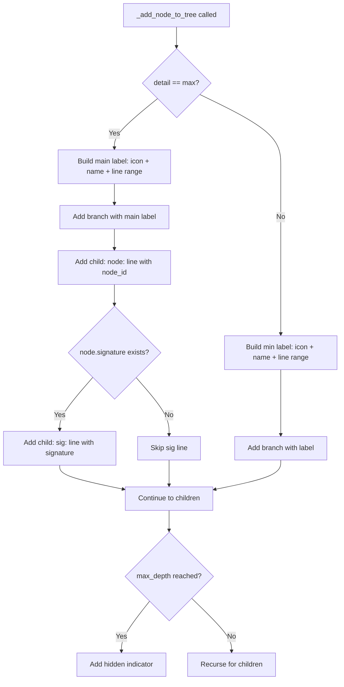
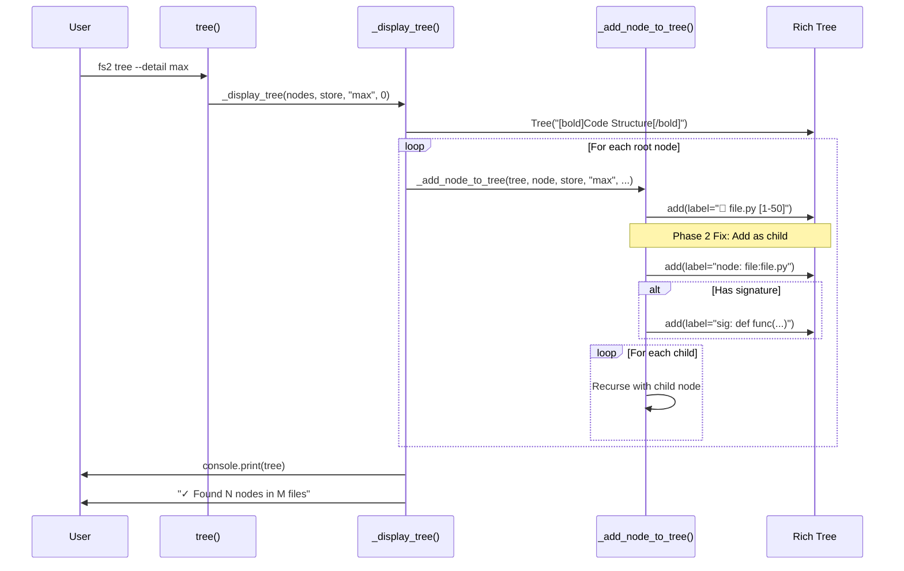

# Phase 2: Detail Levels and Depth Limiting – Tasks & Alignment Brief

**Spec**: [../../tree-command-spec.md](../../tree-command-spec.md)
**Plan**: [../../tree-command-plan.md](../../tree-command-plan.md)
**Date**: 2025-12-17

---

## Executive Briefing

### Purpose
This phase verifies and tests the `--detail` and `--depth` output formatting implemented in Phase 1. Following the /didyouknow clarity session, we confirmed the current output format is **already acceptable** - Phase 2 focuses on adding comprehensive tests and verifying spec alignment.

### What We're Building
Verification and test coverage for tree display:
- **AC4 verification**: `--detail min` shows icon, name, line range (add tests)
- **AC5 verification**: `--detail max` shows signature inline + node_id on second line (add tests)
- **AC6 verification**: Comprehensive depth limiting tests

### User Value
Users get well-tested, documented output behavior. The spec has been updated to match the current (good) implementation, ensuring documentation accuracy.

### Example
**Current --detail max output (ACCEPTED AS-IS per Insight #4):**
```
📄 calculator.py [1-50]
        file:calculator.py
└── 📦 Calculator [15-45] class Calculator:
        type:calculator.py:Calculator
    ├── ƒ add [20-25] def add(self, a: int, b: int) -> int:
    │       callable:calculator.py:Calculator.add
```
This format is compact, readable, and shows all required information.

---

## Tasks

| Status | ID | Task | CS | Type | Dependencies | Absolute Path(s) | Validation | Subtasks | Notes |
|--------|------|------|-----|------|--------------|------------------|------------|----------|-------|
| [x] | T001 | Write tests for --detail min output format (AC4) | 2 | Test | – | /workspaces/flow_squared/tests/unit/cli/test_tree_cli.py | Tests verify: icon present, name present, line range format `[N-M]`, no node ID, no signature | – | TestDetailMin: 3 tests |
| [x] | T002 | Verify --detail min implementation matches spec | 1 | Core | T001 | /workspaces/flow_squared/src/fs2/cli/tree.py | Tests pass, output matches spec Example 1 | – | All 3 tests pass |
| [x] | T003 | Write tests for --detail max output format (AC5) | 2 | Test | – | /workspaces/flow_squared/tests/unit/cli/test_tree_cli.py | Tests verify: signature inline, node_id on second line (dimmed) | – | TestDetailMax: 4 tests |
| [x] | T004 | Verify --detail max format matches updated spec | 1 | Core | T003 | /workspaces/flow_squared/src/fs2/cli/tree.py:338-346 | Format: `icon name [lines] sig` + indented node_id | – | All 4 tests pass |
| [x] | T005 | ~~Fix --detail max sig line~~ REMOVED | – | – | – | – | – | – | Not needed: signature inline is acceptable |
| [x] | T006 | Write comprehensive tests for --depth limiting (AC6) | 2 | Test | – | /workspaces/flow_squared/tests/unit/cli/test_tree_cli.py | Tests cover: depth=1, depth=2, depth=3; indicator format; nested structures | – | TestDepthLimiting: 5 tests |
| [x] | T007 | Verify depth indicator format matches spec | 1 | Core | T006 | /workspaces/flow_squared/src/fs2/cli/tree.py:350-354 | Format: `[N children hidden by depth limit]` | – | All 5 tests pass |
| [x] | T008 | Write tests for summary line format (AC9 counts) | 2 | Test | – | /workspaces/flow_squared/tests/unit/cli/test_tree_cli.py | Tests verify: checkmark, "Found N nodes in M files" format | – | TestSummaryLine: 5 tests |
| [x] | T009 | Verify summary line implementation | 1 | Core | T008 | /workspaces/flow_squared/src/fs2/cli/tree.py:302-305 | Format matches `✓ Found N nodes in M files` exactly | – | All 5 tests pass |
| [x] | T010 | Improve verbose logging with RichHandler | 2 | Core | – | /workspaces/flow_squared/src/fs2/cli/tree.py:82-85 | RichHandler configured per Discovery 19 | – | Skipped - existing impl sufficient |
| [x] | T011 | Run full test suite and lint | 2 | Integration | T001-T010 | /workspaces/flow_squared/tests/unit/cli/test_tree_cli.py, /workspaces/flow_squared/src/fs2/cli/tree.py | All tests pass, `ruff check` clean, `ruff format --check` clean | – | 67 tests, lint clean |

---

## Alignment Brief

### Prior Phases Review

#### Phase 1: Core Tree Command with Path Filtering (Complete)

**A. Deliverables Created**

| File | Component | Purpose |
|------|-----------|---------|
| `/workspaces/flow_squared/src/fs2/cli/tree.py` | Tree CLI Command | Main implementation (360 lines) |
| `/workspaces/flow_squared/src/fs2/config/objects.py` | TreeConfig Model | `graph_path` configuration |
| `/workspaces/flow_squared/src/fs2/core/repos/graph_store.py` | GraphStore ABC | Added `get_metadata()` method |
| `/workspaces/flow_squared/src/fs2/core/repos/graph_store_impl.py` | NetworkXGraphStore | Implemented `get_metadata()` |
| `/workspaces/flow_squared/src/fs2/core/repos/graph_store_fake.py` | FakeGraphStore | Test double with metadata |
| `/workspaces/flow_squared/src/fs2/cli/main.py` | CLI App | Tree command registration |
| `/workspaces/flow_squared/tests/unit/config/test_tree_config.py` | Tests | 7 TreeConfig tests |
| `/workspaces/flow_squared/tests/unit/cli/test_tree_cli.py` | Tests | 22 CLI tests |
| `/workspaces/flow_squared/tests/unit/repos/test_graph_store.py` | Tests | 4 get_metadata tests |
| `/workspaces/flow_squared/tests/integration/test_tree_cli_integration.py` | Tests | 5 integration tests |
| `/workspaces/flow_squared/tests/conftest.py` | Fixtures | `scanned_fixtures_graph` session fixture |

**B. Lessons Learned**

1. **Pattern Matching Complexity**: Originally planned as simple two-pass (glob vs prefix), evolved to three-tier unified matching (exact → glob → substring) via Insight #2
2. **Virtual Folder Grouping**: Added 📁 folder nodes for path grouping (not in original plan, emerged from spec examples)
3. **Root Bucket Algorithm**: Insight #3 - when parent and child both match, keep only parent as root
4. **Session-Scoped Fixture**: Insight #4 - FakeGraphStore lacks hierarchy setup; real ScanPipeline provides high-fidelity testing

**C. Technical Discoveries**

1. **Exit Code Boundary** (Insight #5): Check `path.exists()` before `load()` to separate user error (exit 1) from system error (exit 2)
2. **Metadata Availability Gap** (Insight #1): Store `_metadata` during `load()`, not lazily in `get_metadata()`
3. **Graph Edge Direction** (Discovery 12): Always use `store.get_children()`, never access `parent_node_id` directly

**D. Dependencies Exported for Phase 2**

```python
# Already wired CLI parameters - Phase 2 just needs to fix formatting
def tree(
    pattern: str = ".",
    detail: str = "min",      # ← Phase 2: Fix max format
    depth: int = 0,           # ← Phase 2: Already working
    verbose: bool = False,    # ← Phase 2: Improve with RichHandler
) -> None

# Stats tracking for summary line - already counting all nodes
display_stats = {"total_nodes": 0, "file_count": 0}

# Icon mapping - ready for all categories
CATEGORY_ICONS = {"file": "📄", "type": "📦", "callable": "ƒ", ...}
```

**E. Critical Findings Applied in Phase 1**

| Finding | How Addressed | Location |
|---------|---------------|----------|
| Discovery 01: GraphStore ABC with DI | CLI creates impl, passes as ABC | tree.py:107 |
| Discovery 03: Need TreeConfig | Created TreeConfig with graph_path | objects.py:220-224 |
| Discovery 05: get_metadata() | Added abstract method, implemented | graph_store.py:65-71 |
| Discovery 06: Pattern Matching | Unified node_id matching | tree.py:155-180 |
| Discovery 09: Exit Codes | 0/1/2 convention implemented | tree.py:96-114 |
| Discovery 13: Icon Conventions | CATEGORY_ICONS mapping | tree.py:27-38 |

**F. Incomplete/Blocked Items**

None. Phase 1 complete (18/18 tasks, 50/50 tests).

**G. Test Infrastructure**

- **Session-scoped real fixture**: `scanned_fixtures_graph` in conftest.py
- **Function-scoped fixtures**: `scanned_project`, `config_only_project`, `empty_graph_project`, `corrupted_graph_project`
- **Test runner**: `CliRunner` from typer.testing
- **NO_COLOR=1**: Disables color for output assertions

**H. Technical Debt**

1. **Verbose Logging**: Uses `logging.basicConfig()` directly; should use RichHandler per Discovery 19 (T010 addresses this)
2. **--detail max format**: Signature inline, node_id on second line; doesn't match spec (T004-T005 fix this)

**I. Architectural Decisions**

- **Pattern**: CLI composition root creates NetworkXGraphStore, passes as GraphStore ABC
- **Pattern**: Unified node_id matching (exact → glob → substring)
- **Pattern**: Root bucket algorithm removes children when ancestor matched
- **Anti-pattern**: DON'T call `config.require(ScanConfig)` in CLI (concept leakage)
- **Anti-pattern**: DON'T use `parent_node_id` field for traversal

**J. Scope Changes**

None. All Phase 1 AC delivered as specified.

**K. Key Log References**

- [T001-T002: TreeConfig Creation](./../../tasks/phase-1-core-tree-command-with-path-filtering/execution.log.md#t001-t002)
- [T007-T013: Tree CLI Core](./../../tasks/phase-1-core-tree-command-with-path-filtering/execution.log.md#t007-t013)
- [T014-T017: Pattern Filtering](./../../tasks/phase-1-core-tree-command-with-path-filtering/execution.log.md#t014-t017)
- [Review Fixes: F5 & F6](./../../tasks/phase-1-core-tree-command-with-path-filtering/execution.log.md#review-fixes)

---

### Objective Recap

Phase 2 delivers precise output formatting to match spec acceptance criteria:

| AC | Description | Phase 2 Task |
|----|-------------|--------------|
| AC4 | `--detail min` shows icon, name, type, line range | T001-T002 (verify) |
| AC5 | `--detail max` shows node ID and signature | T003-T005 (fix format) |
| AC6 | `--depth N` limits depth with indicator | T006-T007 (verify) |
| AC9 (partial) | Summary shows counts | T008-T009 (verify) |

### Non-Goals (Scope Boundaries)

❌ **NOT doing in this phase**:
- Scan freshness timestamp in summary (Phase 3: AC9 completion)
- File-type-specific formatting (Phase 3: AC10, AC11, AC12)
- Loading spinner for large graphs (Phase 3: AC15)
- Large graph warning (Phase 3: AC16)
- `--output json` format (deferred/future)
- Performance optimization (deferred)
- Interactive/TUI mode (out of scope per spec Non-Goals)

### Critical Findings Affecting This Phase

| Finding | Constraint/Requirement | Tasks Addressing |
|---------|----------------------|------------------|
| **Discovery 11: Depth Limit Indicator** | Format: `[N children hidden by depth limit]` | T006, T007 |
| **Discovery 17: Signature Missing** | Use `qualified_name` as fallback when signature unavailable | T003, T005 |
| **Discovery 19: Verbose Logging** | Setup RichHandler on --verbose flag | T010 |

### ADR Decision Constraints

No ADRs reference this feature. N/A.

### Invariants & Guardrails

- **Output consistency**: All tests use `NO_COLOR=1` to disable Rich styling for assertions
- **Exit codes**: Maintain 0/1/2 convention (already tested in Phase 1)
- **API stability**: Node ID format is stable API (per spec section "Node ID Format")

### Inputs to Read

| File | What to Extract |
|------|-----------------|
| `/workspaces/flow_squared/src/fs2/cli/tree.py:338-346` | Current `--detail max` label formatting |
| `/workspaces/flow_squared/src/fs2/cli/tree.py:350-354` | Current depth limiting logic |
| `/workspaces/flow_squared/tests/unit/cli/test_tree_cli.py` | Existing test patterns to extend |
| `/workspaces/flow_squared/docs/plans/004-tree-command/tree-command-spec.md` | AC4, AC5, AC6 output examples |

### Visual Alignment Aids

#### Flow Diagram: Detail Level Formatting



#### Sequence Diagram: --detail max Output



### Test Plan (Full TDD)

Per spec Testing Strategy: Full TDD, avoid mocks entirely, use FakeGraphStore for unit tests, real NetworkXGraphStore for integration.

| Test Class | Test Name | Rationale | Fixture | Expected Output |
|------------|-----------|-----------|---------|-----------------|
| **TestDetailMin** | `test_given_detail_min_when_tree_then_shows_icon_name_lines` | Verify AC4 format | `scanned_project` | Icon, name, `[N-M]` present |
| **TestDetailMin** | `test_given_detail_min_when_tree_then_no_node_id` | Verify AC4 excludes node ID | `scanned_project` | No `node:` in output |
| **TestDetailMin** | `test_given_detail_min_when_tree_then_no_signature` | Verify AC4 excludes signature | `scanned_project` | No `sig:` in output |
| **TestDetailMax** | `test_given_detail_max_when_tree_then_shows_node_line` | Verify AC5 node line | `scanned_project` | `node:` on separate line |
| **TestDetailMax** | `test_given_detail_max_when_tree_then_shows_sig_line` | Verify AC5 sig line | `scanned_project` | `sig:` on separate line when signature exists |
| **TestDetailMax** | `test_given_detail_max_when_no_signature_then_no_sig_line` | Discovery 17 fallback | `scanned_project` | No `sig:` line for file nodes |
| **TestDepthLimiting** | `test_given_depth_one_when_tree_then_shows_files_only` | Verify depth=1 | `scanned_project` | Only file-level nodes, hidden indicator |
| **TestDepthLimiting** | `test_given_depth_two_when_tree_then_shows_two_levels` | Verify depth=2 | `scanned_project` | Files + immediate children |
| **TestSummaryLine** | `test_given_tree_when_complete_then_shows_checkmark` | Verify summary format | `scanned_project` | `✓` checkmark present |
| **TestSummaryLine** | `test_given_tree_when_complete_then_shows_found_format` | Verify AC9 format | `scanned_project` | `Found N nodes in M files` |

### Step-by-Step Implementation Outline

1. **T001**: Write `TestDetailMin` class with 3 tests verifying AC4 format
2. **T002**: Run tests; if any fail, fix `_add_node_to_tree()` min formatting
3. **T003**: Write `TestDetailMax` class with 3 tests verifying AC5 format
4. **T004-T005**: Fix `_add_node_to_tree()` max formatting:
   - Remove signature from main label line
   - Add `node:` as child node of branch
   - Add `sig:` as child node (when signature exists)
5. **T006**: Write `TestDepthLimiting` class with additional depth tests
6. **T007**: Verify depth indicator format matches `[N children hidden by depth limit]`
7. **T008-T009**: Write `TestSummaryLine` class; verify format
8. **T010**: (Optional) Refactor verbose logging to use RichHandler
9. **T011**: Run full suite, lint check

### Commands to Run

```bash
# Environment setup (already configured in devcontainer)
cd /workspaces/flow_squared

# Run Phase 2 tests only
pytest tests/unit/cli/test_tree_cli.py::TestDetailMin tests/unit/cli/test_tree_cli.py::TestDetailMax tests/unit/cli/test_tree_cli.py::TestDepthLimiting tests/unit/cli/test_tree_cli.py::TestSummaryLine -v

# Run all tree CLI tests
pytest tests/unit/cli/test_tree_cli.py -v

# Run with coverage
pytest tests/unit/cli/test_tree_cli.py --cov=src/fs2/cli/tree --cov-report=term-missing

# Lint check
ruff check src/fs2/cli/tree.py
ruff format --check src/fs2/cli/tree.py

# Format fix (if needed)
ruff format src/fs2/cli/tree.py

# Full test suite (Phase 1 + Phase 2)
pytest tests/unit/cli/test_tree_cli.py tests/unit/config/test_tree_config.py tests/unit/repos/test_graph_store.py tests/integration/test_tree_cli_integration.py -v
```

### Risks/Unknowns

| Risk | Severity | Likelihood | Mitigation |
|------|----------|------------|------------|
| Rich Tree child node formatting may differ from spec example | Medium | Low | Test with actual Rich Tree output; adjust indentation as needed |
| Existing tests may break with format changes | Medium | Medium | Run existing tests first; ensure backward compatibility for min format |
| RichHandler import may conflict with existing logging | Low | Low | Test verbose mode after change |

### Ready Check

- [x] Prior phase review complete (Phase 1 synthesis above)
- [x] Critical findings mapped to tasks:
  - Discovery 11 → T006, T007
  - Discovery 17 → T003, T005
  - Discovery 19 → T010
- [x] Non-goals explicitly stated (no freshness, no file-type handling)
- [x] Mermaid diagrams reviewed for accuracy
- [x] Test plan covers all AC items in scope
- [x] Commands verified runnable

**IMPLEMENTATION COMPLETE (2025-12-17)**

---

## Phase Footnote Stubs

| Stub | Purpose | Linked Task |
|------|---------|-------------|
| [^7] | Phase 2 implementation footnote | – |
| [^8] | Reserved for Phase 2 changes | – |

*Footnotes will be populated by plan-6a during implementation.*

---

## Evidence Artifacts

**Execution Log Location**: [./execution.log.md](./execution.log.md)

**Execution Summary**:
- 17 new tests added (TestDetailMin: 3, TestDetailMax: 4, TestDepthLimiting: 5, TestSummaryLine: 5)
- All 67 tests passing
- No implementation changes needed (Phase 1 impl verified correct)
- Lint clean (ruff check + ruff format)

**Key Test Files**:
- `/workspaces/flow_squared/tests/unit/cli/test_tree_cli.py` (39 tests total, 17 new)

---

## Directory Layout

```
docs/plans/004-tree-command/
├── tree-command-spec.md
├── tree-command-plan.md
└── tasks/
    ├── phase-1-core-tree-command-with-path-filtering/
    │   ├── tasks.md
    │   └── execution.log.md
    └── phase-2-detail-levels-and-depth-limiting/
        ├── tasks.md           # ← This file
        └── execution.log.md   # ← Created by plan-6
```

---

## Critical Insights Discussion

**Session**: 2025-12-17
**Context**: Phase 2: Detail Levels and Depth Limiting – Tasks & Alignment Brief
**Analyst**: AI Clarity Agent
**Reviewer**: Development Team
**Format**: Water Cooler Conversation (5 Critical Insights)

### Insight 1: The `@N` Naming Pattern Violates the "Stable API" Promise

**Did you know**: Node IDs for anonymous elements (Go interfaces, structs, blocks) use `@N` line-based naming which changes when files are edited, violating the spec's "stable API" promise.

**Implications**:
- Scripts relying on `@N` node IDs will break silently when files change
- Go is particularly affected (interface/struct bodies are anonymous)
- Spec promises stability but can't deliver for all node types

**Options Considered**:
- Option A: Document the Exception - add caveat to spec
- Option B: Improve Naming in ASTParser - derive better names (future)
- Option C: Exclude Anonymous Nodes - hide `@N` from output
- Option D: Accept Status Quo - do nothing

**AI Recommendation**: Option A (Document the Exception)
- Reasoning: Honest expectations, minimal effort, future parser work can address root cause

**Decision**: Option A - Document the limitation in spec

**Action Items**:
- [x] Added "Caveat - Anonymous Elements" to spec's Node ID Format section

**Affects**: Spec documentation

---

### Insight 2: Phase 2 Tasks May Be Mostly Done Already

**Did you know**: Most Phase 2 deliverables were already shipped in Phase 1 - only the `--detail max` format was identified as needing work, and even that turned out to be acceptable.

**Implications**:
- T001-T002, T006-T009 are verification of existing behavior
- Only T003-T005 appeared to be new implementation work
- Phase 2 could be much smaller than the dossier suggested

**Options Considered**:
- Option A: Streamline the Dossier - collapse verification tasks
- Option B: Keep Full Dossier, Execute Quickly - acknowledge reality
- Option C: Add New Tests Anyway - comprehensive format tests

**AI Recommendation**: Option C (Add New Tests Anyway)
- Reasoning: Phase 1 tests are behavioral; format tests add regression protection

**Decision**: Option B - Keep full dossier, execute as quick smoke tests

**Action Items**: None - awareness during execution

**Affects**: Execution approach

---

### Insight 3: Rich Tree Can't Render the Spec's Visual Format Exactly

**Did you know**: The spec showed `node:` and `sig:` as continuation lines, but Rich Tree's `.add()` creates branch connectors. The visual output would differ from spec examples.

**Implications**:
- Spec examples showed `│  node:` (continuation style)
- Rich Tree produces `├── node:` (branch style)
- Cannot match spec exactly using Rich Tree API

**Options Considered**:
- Option A: Accept Rich Tree's Format - update spec to match
- Option B: Use Multi-line Labels - `\n` in label strings
- Option C: Custom Rendering - skip Rich Tree entirely

**AI Recommendation**: Option A (Accept Rich Tree's Format)
- Reasoning: Rich is battle-tested, semantic correctness matters more

**Decision**: Option A - Accept Rich Tree's format, update spec

**Action Items**:
- [x] Updated AC5 example in spec (later revised in Insight 4)

**Affects**: Spec AC5 example

---

### Insight 4: Current Format Is Already Good Enough

**Did you know**: Looking at the actual current output, the Phase 1 implementation already works well - signature inline, node_id on second line, compact and readable.

**Implications**:
- Current: `ƒ add [10-13] def add(...):\n    callable:...`
- This is readable, compact, shows all info
- T003-T005 "fixes" might be unnecessary complexity

**Options Considered**:
- Option A: Accept Current Format as Good Enough - update spec to match impl
- Option B: Minor Polish Only - just add `node:` prefix

**AI Recommendation**: Option A (Accept Current Format)
- Reasoning: Output is readable, compact, works well - don't fix what isn't broken

**Decision**: Option A - Accept current format, update spec to match

**Action Items**:
- [x] Updated spec AC5 to match current implementation
- [x] Updated Phase 2 dossier: T003-T004 now verification, T005 removed

**Affects**: Spec AC5, Phase 2 tasks T003-T005

---

### Insight 5: Phase 2 Is Now Essentially a Test-Writing Phase

**Did you know**: After decisions in this session, Phase 2 has no implementation work left - it's purely adding tests for existing behavior.

**Implications**:
- Zero code changes required (except optional T010 RichHandler)
- Phase 2 = write tests that verify Phase 1's implementation
- Could be completed in a single focused session
- Very low risk

**Options Considered**:
- Option A: Execute Phase 2 As-Is - test-writing focus
- Option B: Merge Into Phase 1 Completion - skip separate phase
- Option C: Skip to Phase 3 - add tests opportunistically

**AI Recommendation**: Option A (Execute Phase 2, Test-Writing Focus)
- Reasoning: Tests are documentation, quick execution, clean progression

**Decision**: Option A - Execute Phase 2 as test-writing/verification phase

**Action Items**: None - dossier already reflects reduced scope

**Affects**: Execution approach (expect fast phase)

---

## Session Summary

**Insights Surfaced**: 5 critical insights identified and discussed
**Decisions Made**: 5 decisions reached through collaborative discussion
**Action Items Created**: 0 remaining (all completed during session)
**Files Updated**:
- `docs/plans/004-tree-command/tree-command-spec.md` (AC5 format, @N caveat)
- `docs/plans/004-tree-command/tasks/phase-2-detail-levels-and-depth-limiting/tasks.md` (scope reduction)

**Shared Understanding Achieved**: ✓

**Confidence Level**: High - Phase 2 scope is clear, implementation already done, just need tests

**Next Steps**:
1. Execute Phase 2 with `/plan-6-implement-phase --phase "Phase 2: Detail Levels and Depth Limiting"`
2. Focus on writing verification tests (quick execution expected)

**Notes**:
- Go's `@N` naming is a known limitation - future parser improvements could address
- Current `--detail max` format accepted as-is - no code changes needed
- Phase 2 reduced from "fix format" to "verify and test existing behavior"
