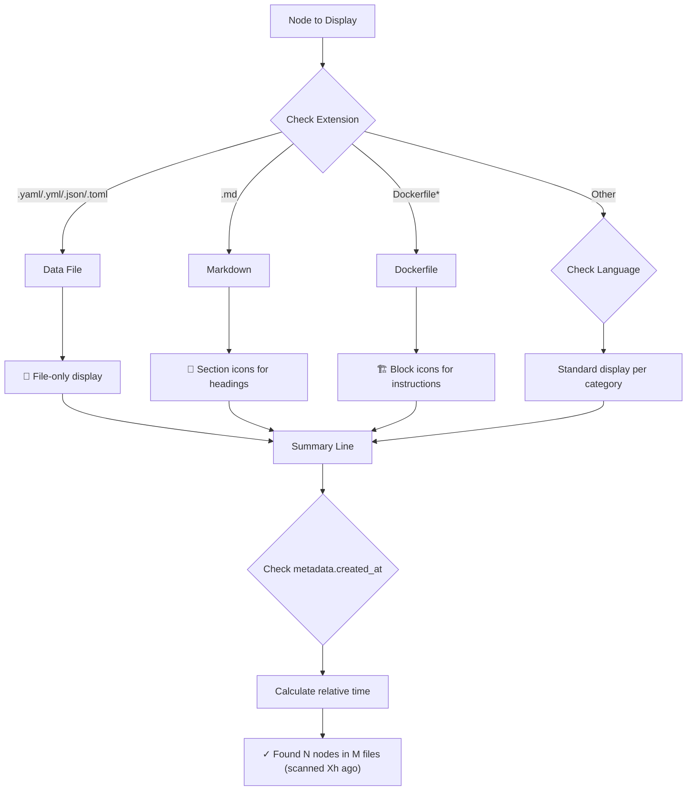
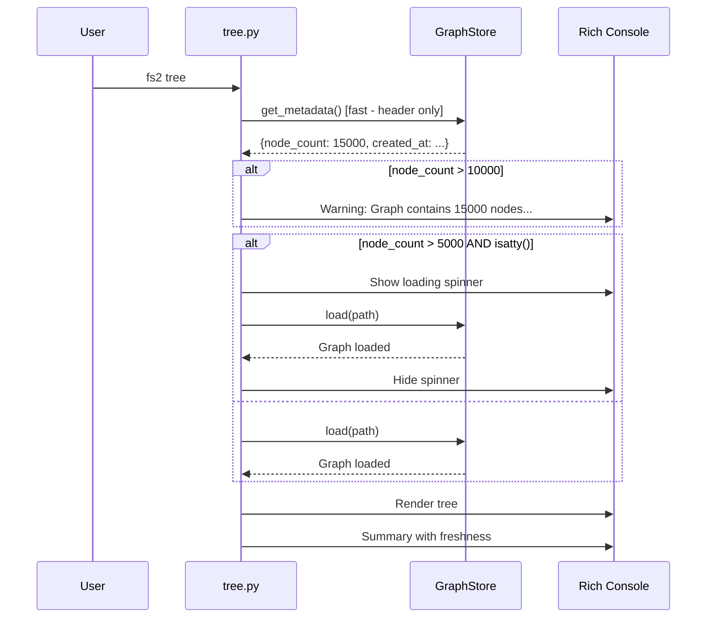

# Phase 3: File-Type-Specific Handling and Polish – Tasks & Alignment Brief

**Spec**: [../../tree-command-spec.md](../../tree-command-spec.md)
**Plan**: [../../tree-command-plan.md](../../tree-command-plan.md)
**Date**: 2025-12-17
**Status**: ⏭️ SKIPPED (2025-12-17) - User decision; dossier retained for future reference

---

## Executive Briefing

### Purpose
This phase completes the `fs2 tree` command by adding file-type-specific display formatting, user feedback mechanisms for large graphs, and the scan freshness indicator. It transforms the functional tree command into a polished, production-ready tool that handles special file types (Dockerfiles, Markdown, data files) appropriately and provides clear feedback when processing large codebases.

### What We're Building
The final polish layer for `fs2 tree` that:
- Displays Dockerfile instructions with `🏗️` block icons showing stages (FROM, RUN, COPY, CMD)
- Renders Markdown documents with `📝` section icons for heading hierarchy
- Shows YAML/JSON/TOML data files as file-only nodes with guidance to use `jq`/`yq`
- Appends scan freshness timestamp to summary line: "(scanned 2h ago)"
- Shows loading spinner for graphs >5K nodes in TTY mode
- Displays warning before loading graphs >10K nodes

### User Value
- **Dockerfile users**: See build structure at a glance without reading the file
- **Documentation maintainers**: Navigate README/docs structure visually
- **Data file users**: Clear guidance that tree shows structure, not data (use jq/yq)
- **Large codebase users**: Loading feedback prevents confusion; warnings set expectations
- **All users**: Scan freshness ensures awareness of data currency

### Example
**Before Phase 3** (Dockerfile):
```
📄 Dockerfile [1-32]
├── 📦 FROM [1-1]        # Wrong icon, no instruction context
├── 📦 RUN [7-7]
```

**After Phase 3** (Dockerfile):
```
📄 Dockerfile [1-32]
├── 🏗️ FROM python:3.12-slim AS base [1-1]
├── 🏗️ RUN pip install -r requirements.txt [7-7]

✓ Found 9 nodes in 1 file (scanned 15m ago)
```

---

## Tasks

| Status | ID | Task | CS | Type | Dependencies | Absolute Path(s) | Validation | Subtasks | Notes |
|--------|-----|------|----|------|--------------|------------------|------------|----------|-------|
| [ ] | T001 | Write tests for Dockerfile instruction display (AC10) | 2 | Test | – | `/workspaces/flow_squared/tests/unit/cli/test_tree_cli.py` | Tests verify FROM, RUN, COPY show with 🏗️ icon; signature includes instruction type | – | Fixture needs Dockerfile |
| [ ] | T002 | Implement Dockerfile-specific formatting | 2 | Core | T001 | `/workspaces/flow_squared/src/fs2/cli/tree.py` | Tests pass; FROM/RUN/COPY rendered correctly | – | Check node.language == "dockerfile" |
| [ ] | T003 | Write tests for Markdown heading display (AC11) | 2 | Test | – | `/workspaces/flow_squared/tests/unit/cli/test_tree_cli.py` | Tests verify heading hierarchy with 📝 icon | – | Fixture needs README.md |
| [ ] | T004 | Implement Markdown heading formatting | 2 | Core | T003 | `/workspaces/flow_squared/src/fs2/cli/tree.py` | Tests pass; headings rendered correctly | – | Per Discovery 14: use file extension |
| [ ] | T005 | Write tests for data file display (AC12) | 2 | Test | – | `/workspaces/flow_squared/tests/unit/cli/test_tree_cli.py` | Tests verify YAML/JSON/TOML show file-only; no children | – | Per Discovery 14 |
| [ ] | T006 | Implement data file detection and display | 2 | Core | T005 | `/workspaces/flow_squared/src/fs2/cli/tree.py` | Tests pass; data files show file node only | – | Extension-based detection |
| [ ] | T007 | Write tests for scan freshness in summary (AC9 complete) | 2 | Test | – | `/workspaces/flow_squared/tests/unit/cli/test_tree_cli.py` | Tests verify "(scanned Xh ago)" or "(scanned Xm ago)" format | – | Uses get_metadata()['created_at'] |
| [ ] | T008 | Implement freshness calculation from metadata | 2 | Core | T007 | `/workspaces/flow_squared/src/fs2/cli/tree.py` | Tests pass; relative time displayed in summary | – | humanize time delta |
| [ ] | T009 | Write tests for loading spinner (AC15) | 1 | Test | – | `/workspaces/flow_squared/tests/unit/cli/test_tree_cli.py` | Tests verify spinner context shown for large graphs | – | Per Discovery 18; TTY detection |
| [ ] | T010 | Implement loading spinner with TTY detection | 2 | Core | T009 | `/workspaces/flow_squared/src/fs2/cli/tree.py` | Tests pass; Rich Status spinner for >5K nodes in TTY | – | Use sys.stdout.isatty() |
| [ ] | T011 | Write tests for large graph warning (AC16) | 1 | Test | – | `/workspaces/flow_squared/tests/unit/cli/test_tree_cli.py` | Tests verify warning shown for >10K nodes | – | Uses get_metadata()['node_count'] |
| [ ] | T012 | Implement large graph warning | 1 | Core | T011 | `/workspaces/flow_squared/src/fs2/cli/tree.py` | Tests pass; warning before loading | – | Console warning message |
| [ ] | T013 | Run full test suite and lint | 2 | Integration | T001-T012 | `/workspaces/flow_squared/tests/unit/cli/test_tree_cli.py`, `/workspaces/flow_squared/tests/integration/test_tree_cli_integration.py` | All tests pass; lint clean; coverage >80% | – | Final validation |
| [ ] | T014 | Update README with tree command examples | 1 | Doc | T013 | `/workspaces/flow_squared/README.md` | README mentions `fs2 tree` with 2-3 examples | – | Brief mention only |

**Total Tasks**: 14
**Total CS Points**: 24 (CS-2 average per task)
**Complexity Distribution**: 2x CS-1, 12x CS-2

---

## Alignment Brief

### Prior Phases Review

This section synthesizes the comprehensive reviews of Phase 1 and Phase 2, providing essential context for Phase 3 implementation.

#### Phase-by-Phase Summary

**Phase 1: Core Tree Command with Path Filtering** (Complete)
- Built foundational `fs2 tree` command with full CLI infrastructure
- Implemented unified pattern matching (exact → glob → substring on node_id)
- Created TreeConfig and extended GraphStore ABC with `get_metadata()`
- Delivered 50 tests (39 unit + 6 config + 5 integration)
- Established session-scoped real scan fixture pattern
- Applied 12 Critical Discoveries (01-13, 16)

**Phase 2: Detail Levels and Depth Limiting** (Complete)
- Pure verification phase - Phase 1 implementation already matched updated spec
- Added 17 comprehensive tests across 4 test classes (TestDetailMin, TestDetailMax, TestDepthLimiting, TestSummaryLine)
- Total tests after Phase 2: 67 passing
- No code changes to tree.py required
- Validated Discovery 11 (depth indicator format) and Discovery 17 (missing signature handling)

#### Cumulative Deliverables from Prior Phases

**Implementation Files (Phase 1)**:
| File | Purpose | Key APIs |
|------|---------|----------|
| `/workspaces/flow_squared/src/fs2/cli/tree.py` | Main tree command (372 lines) | `tree()`, `_filter_nodes()`, `_build_root_bucket()`, `_display_tree()`, `_add_node_to_tree()`, `CATEGORY_ICONS` |
| `/workspaces/flow_squared/src/fs2/config/objects.py` | TreeConfig model | `TreeConfig.graph_path` |
| `/workspaces/flow_squared/src/fs2/core/repos/graph_store.py` | GraphStore ABC extension | `get_metadata() -> dict` |
| `/workspaces/flow_squared/src/fs2/core/repos/graph_store_impl.py` | NetworkXGraphStore impl | `get_metadata()` returns format_version, created_at, node_count, edge_count |
| `/workspaces/flow_squared/src/fs2/core/repos/graph_store_fake.py` | FakeGraphStore for tests | `set_metadata()`, `get_metadata()` |
| `/workspaces/flow_squared/src/fs2/cli/main.py` | CLI registration | `app.command(name="tree")(tree)` |

**Test Files (Phases 1 + 2)**:
| File | Tests | Coverage |
|------|-------|----------|
| `/workspaces/flow_squared/tests/unit/cli/test_tree_cli.py` | 39 tests | 13 test classes |
| `/workspaces/flow_squared/tests/unit/config/test_tree_config.py` | 7 tests | TreeConfig validation |
| `/workspaces/flow_squared/tests/unit/repos/test_graph_store.py` | 16 tests | get_metadata() on both impls |
| `/workspaces/flow_squared/tests/integration/test_tree_cli_integration.py` | 5 tests | End-to-end with real graph |

#### Complete Dependency Tree

```
Phase 3 depends on:
├── Phase 2 (Verification)
│   ├── TestDetailMin (3 tests) - AC4 verified
│   ├── TestDetailMax (4 tests) - AC5 verified
│   ├── TestDepthLimiting (5 tests) - AC6 verified
│   └── TestSummaryLine (5 tests) - AC9 partial verified
│
└── Phase 1 (Foundation)
    ├── TreeConfig → Phase 3 may extend if needed
    ├── GraphStore.get_metadata() → Phase 3 uses for freshness + warning
    │   └── Returns: {format_version, created_at, node_count, edge_count}
    ├── _display_tree() → Phase 3 modifies for file-type formatting
    ├── _add_node_to_tree() → Phase 3 modifies for icons/signatures
    ├── CATEGORY_ICONS → Phase 3 uses existing 🏗️ and 📝 icons
    └── Session-scoped fixture → Phase 3 extends for Dockerfile/Markdown
```

#### Pattern Evolution Across Phases

| Pattern | Phase 1 | Phase 2 | Phase 3 (Expected) |
|---------|---------|---------|-------------------|
| TDD Approach | Full RED-GREEN-REFACTOR | Verification only (GREEN immediate) | Full TDD for new features |
| Fixture Strategy | Session-scoped real scan | Reused Phase 1 fixtures | Extend with Dockerfile/MD fixtures |
| Icon Handling | CATEGORY_ICONS constant | Unchanged | May need category detection logic |
| Summary Line | "Found N nodes in M files" | Verified format | Add "(scanned Xh ago)" |

#### Recurring Issues and Technical Debt

1. **RichHandler for Verbose Logging** (Optional, deferred from Phase 2 T010)
   - Current: Uses `logging.basicConfig()` directly
   - Ideal: Use `RichHandler(console=console, show_path=False)`
   - Impact: Low - existing verbose mode works fine

2. **Go's Anonymous Elements** (Documented limitation)
   - `@N` line-based naming is unstable across edits
   - Spec documents this caveat
   - No action needed for Phase 3

3. **Test Fixture Creation Time** (~200ms per scanned_project call)
   - Could move to session-scoped in conftest.py
   - Consider if Phase 3 adds significant fixture overhead

#### Cross-Phase Learnings

1. **Spec-First Clarity**: The `/didyouknow` session before Phase 2 revealed the Phase 1 implementation already matched the updated spec. Always validate spec alignment before implementation work.

2. **Test-Writing as Valid Phase Outcome**: Phase 2 demonstrated that verification-only phases provide value. Don't force implementation changes just to "do TDD properly."

3. **Rich Tree Format Constraints**: Rich Tree's `.add()` creates branch connectors, not continuation lines. Accept library constraints rather than fighting the API.

4. **NO_COLOR Required for Assertions**: All CLI tests need `monkeypatch.setenv("NO_COLOR", "1")` to disable Rich styling.

5. **Regex-Based Format Verification**: Use regex patterns for format compliance testing - robust to minor output variations.

#### Reusable Test Infrastructure

**Fixtures Available** (from Phase 1):
- `scanned_project` - Real project with calculator.py, utils.py, models/item.py
- `config_only_project` - Config but no graph (missing graph tests)
- `empty_graph_project` - Empty graph file (zero-node edge case)
- `corrupted_graph_project` - Invalid pickle (exit code 2 tests)
- `_scanned_fixtures_graph_session` - Session-scoped real scan of ast_samples/

**Fixtures Needed for Phase 3**:
- Dockerfile fixture with FROM, RUN, COPY, CMD instructions
- Markdown fixture with heading hierarchy
- YAML/JSON/TOML fixture (data files)
- Large graph fixture (>10K nodes) for AC16 testing

**Test Patterns to Reuse**:
```python
# Pattern 1: NO_COLOR for clean assertions
monkeypatch.setenv("NO_COLOR", "1")

# Pattern 2: Regex-based format verification
import re
match = re.search(r"scanned \d+[mhd] ago", stdout, re.IGNORECASE)

# Pattern 3: TDD docstrings
"""
Purpose: [what truth this test proves]
Quality Contribution: [how this prevents bugs]
Acceptance Criteria: [measurable assertions]
Task ID: T00X
"""
```

#### Critical Findings Timeline

| Phase | Finding | How Applied |
|-------|---------|-------------|
| Phase 1 | Discovery 01-04: DI, Concept Leakage, TreeConfig, Registration | All implemented in tree.py, config/objects.py |
| Phase 1 | Discovery 05: get_metadata() | Extended GraphStore ABC; Phase 3 uses for freshness |
| Phase 1 | Discovery 06: Pattern Matching | Unified algorithm; no Phase 3 impact |
| Phase 1 | Discovery 08: Rich Tree API | Used correctly; Phase 3 extends formatting |
| Phase 1 | Discovery 12: Use get_children() | Correct traversal; Phase 3 unchanged |
| Phase 1 | Discovery 13: Icon Conventions | CATEGORY_ICONS defined; Phase 3 uses existing |
| Phase 2 | Discovery 11: Depth Indicator | Verified format `[N children hidden]` |
| Phase 2 | Discovery 17: Missing Signature | Graceful handling verified |
| **Phase 3** | **Discovery 14: File Type Detection** | Extension-based detection for Dockerfile/MD/data files |
| **Phase 3** | **Discovery 18: Loading Spinner** | Rich Status spinner with TTY detection |

---

### Non-Goals (Scope Boundaries)

❌ **NOT doing in this phase**:
- Performance optimization for graph loading (future work per Discovery 15)
- Interactive TUI navigation (spec non-goal)
- Data file internal structure (tree-sitter limitation; use jq/yq)
- Cross-file relationships (spec non-goal)
- Real-time file watching (spec non-goal)
- Wide tree pagination (defer to future)
- Configurable icons via TreeConfig (not requested)
- --output json format (spec Q2 deferred)

---

### Critical Findings Affecting This Phase

#### Discovery 14: File Type Detection by Extension (High Impact)
**Problem**: `language` field may be unreliable for file type detection
**Root Cause**: Tree-sitter grammar names vary; extension is stable
**Solution**: Use file extension as primary, language as fallback
**Constrains**: T002, T004, T006
**Implementation**:
```python
def get_file_type(node: CodeNode) -> str:
    ext = Path(node.name or "").suffix.lower()
    if ext in {".yaml", ".yml", ".json", ".toml"}:
        return "datafile"
    if ext == ".md":
        return "markdown"
    if node.name and node.name.lower().startswith("dockerfile"):
        return "dockerfile"
    return node.language or "unknown"
```

#### Discovery 18: Loading Spinner and TTY Detection (Medium Impact)
**Problem**: AC15 requires loading spinner for >200ms loads
**Root Cause**: Need spinner library choice and TTY detection
**Solution**: Use Rich Status spinner; auto-detect TTY
**Constrains**: T009, T010
**Implementation**:
```python
from rich.status import Status
import sys

if node_count > 5000 and sys.stdout.isatty():
    with Status("[bold green]Loading graph...", console=console):
        store.load(path)
else:
    store.load(path)
```

#### Discovery 05: GraphStore get_metadata() (Used in Phase 3)
**Available API**:
```python
metadata = store.get_metadata()
# Returns: {
#   "format_version": str,
#   "created_at": datetime,
#   "node_count": int,
#   "edge_count": int
# }
```
**Used by**: T007/T008 (freshness), T011/T012 (large graph warning)

---

### ADR Decision Constraints

No ADRs affect this phase. Appendix B of the plan confirms: "No ADRs found in docs/adr/ for tree command."

---

### Invariants & Guardrails

| Constraint | Budget | Validation |
|------------|--------|------------|
| Test coverage | >80% | `pytest --cov-fail-under=80` |
| Exit codes | 0/1/2 | All error paths tested |
| No concept leakage | CLI only knows TreeConfig | Code review |
| Zero mocks | FakeGraphStore only | Test inspection |
| TTY safety | Non-TTY still works | Test without TTY |

---

### Inputs to Read

Before implementation, read these files for context:

| File | Purpose | Key Lines |
|------|---------|-----------|
| `/workspaces/flow_squared/src/fs2/cli/tree.py` | Current implementation | All (372 lines) - modify for file-type formatting |
| `/workspaces/flow_squared/src/fs2/cli/tree.py:27-38` | CATEGORY_ICONS | Verify 🏗️ (block) and 📝 (section) exist |
| `/workspaces/flow_squared/src/fs2/cli/tree.py:249-315` | _display_tree() | Add freshness to summary |
| `/workspaces/flow_squared/src/fs2/cli/tree.py:317-372` | _add_node_to_tree() | Modify icon/signature logic |
| `/workspaces/flow_squared/src/fs2/core/repos/graph_store.py:154-167` | get_metadata() | Available metadata fields |
| `/workspaces/flow_squared/tests/unit/cli/test_tree_cli.py` | Test patterns | Fixture patterns, NO_COLOR usage |

---

### Visual Alignment Aids

#### Flow Diagram: File-Type Detection Logic



#### Sequence Diagram: Large Graph Flow



---

### Test Plan (Full TDD per Spec)

#### Test Classes to Create

**TestDockerfileDisplay** (T001)
```python
class TestDockerfileDisplay:
    """AC10: Dockerfile shows instructions with 🏗️ icon."""

    def test_given_dockerfile_when_tree_then_shows_block_icon(self, dockerfile_project):
        """Task ID: T001-1. Verifies 🏗️ icon for Dockerfile instructions."""

    def test_given_dockerfile_when_tree_then_shows_from_instruction(self, dockerfile_project):
        """Task ID: T001-2. Verifies FROM instruction displayed."""

    def test_given_dockerfile_when_tree_then_shows_run_copy_cmd(self, dockerfile_project):
        """Task ID: T001-3. Verifies RUN, COPY, CMD instructions displayed."""
```

**TestMarkdownDisplay** (T003)
```python
class TestMarkdownDisplay:
    """AC11: Markdown shows heading hierarchy with 📝 icon."""

    def test_given_markdown_when_tree_then_shows_section_icon(self, markdown_project):
        """Task ID: T003-1. Verifies 📝 icon for Markdown headings."""

    def test_given_markdown_when_tree_then_shows_heading_hierarchy(self, markdown_project):
        """Task ID: T003-2. Verifies nested heading structure."""
```

**TestDataFileDisplay** (T005)
```python
class TestDataFileDisplay:
    """AC12: Data files (YAML/JSON/TOML) show file-only."""

    def test_given_yaml_when_tree_then_shows_file_only(self, datafile_project):
        """Task ID: T005-1. Verifies YAML has no children."""

    def test_given_json_when_tree_then_shows_file_only(self, datafile_project):
        """Task ID: T005-2. Verifies JSON has no children."""

    def test_given_toml_when_tree_then_shows_file_only(self, datafile_project):
        """Task ID: T005-3. Verifies TOML has no children."""
```

**TestScanFreshness** (T007)
```python
class TestScanFreshness:
    """AC9 complete: Summary shows scan freshness timestamp."""

    def test_given_tree_when_complete_then_shows_scanned_ago(self, scanned_project):
        """Task ID: T007-1. Verifies 'scanned Xh ago' or 'scanned Xm ago' format."""

    def test_given_recent_scan_when_tree_then_shows_minutes(self, recent_scan_project):
        """Task ID: T007-2. Verifies minutes for recent scans."""

    def test_given_old_scan_when_tree_then_shows_days(self, old_scan_project):
        """Task ID: T007-3. Verifies days for old scans."""
```

**TestLoadingSpinner** (T009)
```python
class TestLoadingSpinner:
    """AC15: Loading spinner for large graphs."""

    def test_given_large_graph_tty_when_tree_then_shows_spinner(self, large_graph_project, monkeypatch):
        """Task ID: T009-1. Verifies spinner shown for >5K nodes in TTY."""

    def test_given_large_graph_no_tty_when_tree_then_no_spinner(self, large_graph_project, monkeypatch):
        """Task ID: T009-2. Verifies no spinner when not TTY."""
```

**TestLargeGraphWarning** (T011)
```python
class TestLargeGraphWarning:
    """AC16: Warning for graphs >10K nodes."""

    def test_given_huge_graph_when_tree_then_shows_warning(self, huge_graph_project):
        """Task ID: T011-1. Verifies warning message for >10K nodes."""

    def test_given_small_graph_when_tree_then_no_warning(self, scanned_project):
        """Task ID: T011-2. Verifies no warning for small graphs."""
```

#### Fixtures to Create

```python
@pytest.fixture
def dockerfile_project(tmp_path, monkeypatch):
    """Project with Dockerfile for AC10 testing."""
    # Create Dockerfile with FROM, RUN, COPY, CMD
    # Scan and return tmp_path

@pytest.fixture
def markdown_project(tmp_path, monkeypatch):
    """Project with README.md for AC11 testing."""
    # Create README.md with heading hierarchy
    # Scan and return tmp_path

@pytest.fixture
def datafile_project(tmp_path, monkeypatch):
    """Project with YAML/JSON/TOML for AC12 testing."""
    # Create config.yaml, data.json, settings.toml
    # Scan and return tmp_path

@pytest.fixture
def large_graph_project(tmp_path, monkeypatch):
    """Project with >5K nodes for AC15 testing."""
    # Create graph with ~6000 nodes programmatically

@pytest.fixture
def huge_graph_project(tmp_path, monkeypatch):
    """Project with >10K nodes for AC16 testing."""
    # Create graph with ~10500 nodes programmatically
```

---

### Step-by-Step Implementation Outline

| Step | Task IDs | Description | Validation |
|------|----------|-------------|------------|
| 1 | T001 | Write 3 Dockerfile display tests | Tests fail (RED) |
| 2 | T002 | Implement Dockerfile formatting | Tests pass (GREEN) |
| 3 | T003 | Write 2 Markdown display tests | Tests fail (RED) |
| 4 | T004 | Implement Markdown formatting | Tests pass (GREEN) |
| 5 | T005 | Write 3 data file tests | Tests fail (RED) |
| 6 | T006 | Implement data file detection | Tests pass (GREEN) |
| 7 | T007 | Write 3 freshness tests | Tests fail (RED) |
| 8 | T008 | Implement freshness calculation | Tests pass (GREEN) |
| 9 | T009 | Write 2 spinner tests | Tests fail (RED) |
| 10 | T010 | Implement loading spinner | Tests pass (GREEN) |
| 11 | T011 | Write 2 warning tests | Tests fail (RED) |
| 12 | T012 | Implement large graph warning | Tests pass (GREEN) |
| 13 | T013 | Run full suite, lint, coverage | All green, >80% |
| 14 | T014 | Update README.md | Manual verification |

---

### Commands to Run

```bash
# Environment setup (already done in devcontainer)
cd /workspaces/flow_squared

# Run specific Phase 3 test class (as you implement)
uv run pytest tests/unit/cli/test_tree_cli.py::TestDockerfileDisplay -v
uv run pytest tests/unit/cli/test_tree_cli.py::TestMarkdownDisplay -v
uv run pytest tests/unit/cli/test_tree_cli.py::TestDataFileDisplay -v
uv run pytest tests/unit/cli/test_tree_cli.py::TestScanFreshness -v
uv run pytest tests/unit/cli/test_tree_cli.py::TestLoadingSpinner -v
uv run pytest tests/unit/cli/test_tree_cli.py::TestLargeGraphWarning -v

# Run all tree CLI tests
uv run pytest tests/unit/cli/test_tree_cli.py -v

# Run full test suite (all phases)
uv run pytest tests/unit/cli/test_tree_cli.py tests/unit/config/test_tree_config.py tests/unit/repos/test_graph_store.py tests/integration/test_tree_cli_integration.py -v

# Lint and format check
uv run ruff check src/fs2/cli/tree.py tests/unit/cli/test_tree_cli.py
uv run ruff format --check src/fs2/cli/tree.py tests/unit/cli/test_tree_cli.py

# Fix lint issues if any
uv run ruff check src/fs2/cli/tree.py tests/unit/cli/test_tree_cli.py --fix
uv run ruff format src/fs2/cli/tree.py tests/unit/cli/test_tree_cli.py

# Coverage verification (>80% target)
uv run pytest tests/unit/cli/test_tree_cli.py --cov=src/fs2/cli/tree --cov-report=term-missing --cov-fail-under=80

# Manual verification commands
fs2 tree Dockerfile                    # AC10: Dockerfile display
fs2 tree README.md                     # AC11: Markdown display
fs2 tree config.yaml                   # AC12: Data file display
fs2 tree                               # Verify freshness in summary
```

---

### Risks and Unknowns

| Risk | Severity | Likelihood | Mitigation |
|------|----------|------------|------------|
| Dockerfile fixture AST structure differs from expectation | Medium | Medium | Read actual Dockerfile AST node structure from graph first |
| Markdown heading detection logic varies by tree-sitter grammar | Medium | Medium | Per Discovery 14, use extension; inspect actual nodes |
| TTY detection mock complexity in tests | Low | Medium | Use monkeypatch for sys.stdout.isatty() |
| Large graph fixture creation is slow | Low | Low | Create programmatically with minimal nodes |
| Time formatting edge cases (seconds, weeks) | Low | Low | Use humanize library or simple thresholds |

---

### Ready Check

- [ ] All tasks have absolute paths
- [ ] Critical findings mapped to tasks (Discovery 14 → T002,T004,T006; Discovery 18 → T009,T010; Discovery 05 → T007,T011)
- [ ] Test plan covers all Phase 3 acceptance criteria (AC9, AC10, AC11, AC12, AC15, AC16)
- [ ] Prior phases fully reviewed and synthesized
- [ ] Non-goals clearly stated
- [ ] Visual diagrams capture flow and interactions
- [ ] Commands are copy-paste ready
- [ ] Risks identified with mitigations
- [ ] ADR constraints mapped to tasks (N/A - no ADRs exist)

---

## Phase Footnote Stubs

| Footnote | Description | Status |
|----------|-------------|--------|
| [^8] | [To be added by plan-6 during implementation] | Pending |

---

## Evidence Artifacts

- **Execution Log**: `./execution.log.md` (created by /plan-6)
- **Test Output**: Captured in execution log per task
- **Coverage Report**: Terminal output in T013
- **README Diff**: Shown in T014 evidence

---

## Directory Layout

```
docs/plans/004-tree-command/
├── tree-command-spec.md
├── tree-command-plan.md
└── tasks/
    ├── phase-1-core-tree-command-with-path-filtering/
    │   ├── tasks.md
    │   └── execution.log.md
    ├── phase-2-detail-levels-and-depth-limiting/
    │   ├── tasks.md
    │   └── execution.log.md
    └── phase-3-file-type-specific-handling-and-polish/
        ├── tasks.md            # This file
        └── execution.log.md    # Created by /plan-6
```
