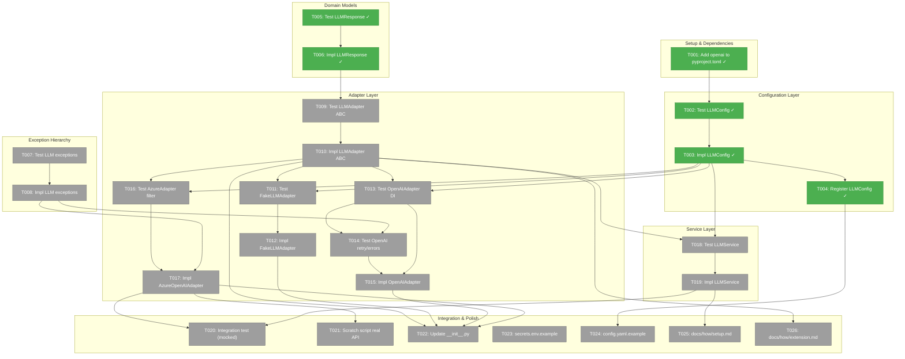
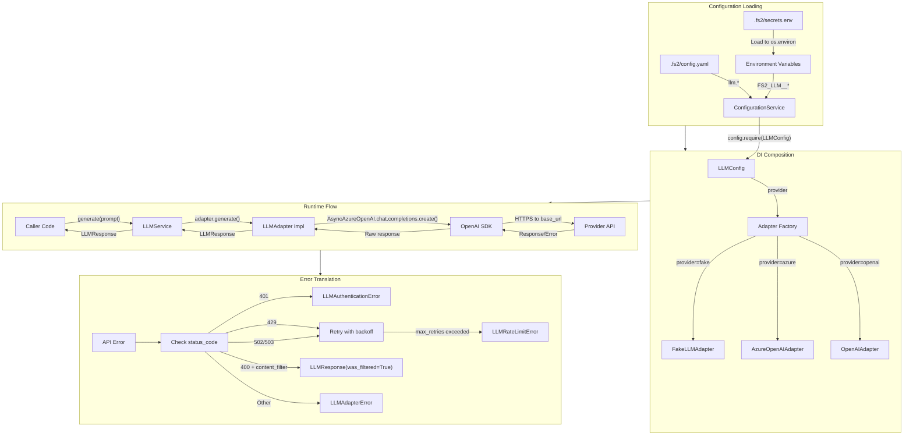
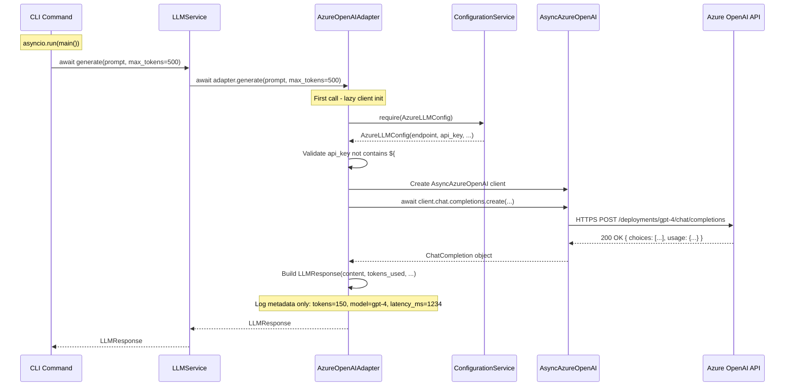
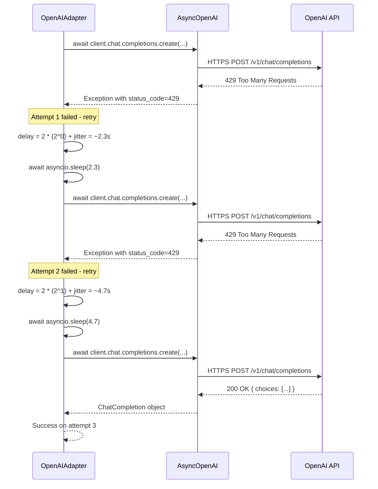
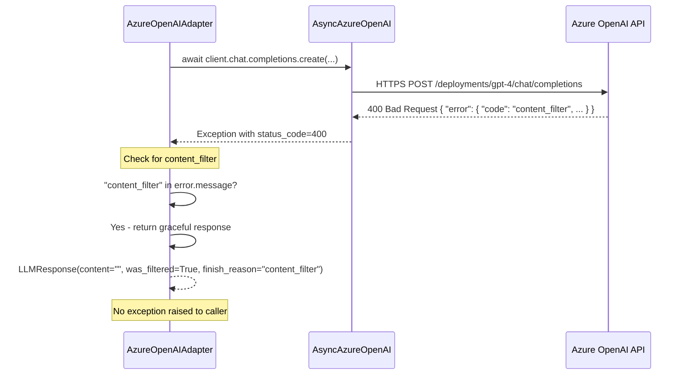

# LLMService Implementation – Tasks & Alignment Brief

**Mode**: Simple (Single Phase)
**Spec**: [llm-service-spec.md](./llm-service-spec.md)
**Plan**: [llm-service-plan.md](./llm-service-plan.md)
**Research**: [research-dossier.md](./research-dossier.md)
**Date**: 2025-12-18
**Complexity**: CS-3 (Medium)

---

## Executive Briefing

### Purpose
This implementation adds a foundational LLM service to fs2 that provides provider-agnostic access to large language models. The service enables "smart content" generation capabilities—semantic summaries, code analysis, and intelligent insights—while maintaining fs2's Clean Architecture principles and establishing the project-wide async pattern.

### What We're Building
An `LLMService` with swappable provider adapters that:
- Abstracts OpenAI and Azure OpenAI behind a common `LLMAdapter` ABC
- Enforces two-layer API key security (Pydantic validator rejects literals; runtime expands `${ENV_VAR}` placeholders)
- Provides automatic retry with exponential backoff for transient failures (429 rate limits, 502/503 server errors)
- Returns structured `LLMResponse` with content, token usage, model info, and content filter status
- Offers `FakeLLMAdapter` with `set_response()` pattern for deterministic testing

### User Value
Developers can integrate LLM-powered features (code summarization, semantic search, intelligent documentation) without coupling to a specific provider. Switching from OpenAI to Azure OpenAI requires only a config change—no code modifications. The async-all-the-way architecture ensures efficient I/O handling for future concurrent operations.

### Example
**Config** (`.fs2/config.yaml`):
```yaml
llm:
  provider: azure
  api_key: ${AZURE_OPENAI_API_KEY}
  base_url: https://myinstance.openai.azure.com/
  azure_deployment_name: gpt-4
  azure_api_version: 2024-12-01-preview
  model: gpt-4              # For logging/display purposes
  temperature: 0.1
  max_tokens: 1024
  timeout: 120              # Request timeout in seconds
  max_retries: 3            # Retry count for transient errors
```

**Usage**:
```python
# Composition root
config = FS2ConfigurationService()
llm_config = config.require(LLMConfig)
adapter = AzureOpenAIAdapter(config)  # Gets LLMConfig internally
service = LLMService(config, adapter)

# Generate content
response = await service.generate("Summarize this Python function: def add(a, b): return a + b")
# LLMResponse(content="This function adds two numbers...", tokens_used=42, model="gpt-4", ...)
```

---

## Objectives & Scope

### Objective
Implement LLMService with provider adapters following fs2 Clean Architecture patterns, with Full TDD approach and async-all-the-way design.

**Behavior Checklist**:
- [ ] Provider switching via config only (AC1)
- [ ] Literal API keys rejected with actionable error (AC2)
- [ ] `${ENV_VAR}` placeholders expanded at runtime (AC3)
- [ ] FakeLLMAdapter supports `set_response()` and `call_history` (AC4)
- [ ] Exponential backoff retry on 429/502/503 (AC5)
- [ ] Azure content filter returns `was_filtered=True` (AC6)
- [ ] Status-code-based exception translation (AC7)
- [ ] LLMResponse contains all required fields (AC8)
- [ ] Adapters receive ConfigurationService, not extracted config (AC9)
- [ ] All adapter methods are `async def` (AC10)

### Goals

- Create single `LLMConfig` at path `llm` with:
  - `provider`: Adapter selection (azure, openai, fake)
  - `api_key`: With `${ENV_VAR}` placeholder validation
  - `base_url`: Provider endpoint URL
  - `azure_deployment_name`, `azure_api_version`: Azure-specific fields
  - `model`: For logging/display purposes
  - `temperature`, `max_tokens`: Generation parameters
  - `timeout`, `max_retries`: Retry configuration
- Implement `LLMResponse` frozen dataclass with required fields
- Add `LLMAdapterError` exception hierarchy to existing `exceptions.py`
- Create `LLMAdapter` ABC with async `generate()` method
- Implement `FakeLLMAdapter` with `set_response()` pattern
- Implement `OpenAIAdapter` with retry logic and status-code exception translation
- Implement `AzureOpenAIAdapter` with content filter handling
- Create `LLMService` factory that composes adapters via DI
- Write comprehensive tests (TDD) with mocked SDK for CI reliability
- Document setup and extension patterns in `docs/how/`

### Non-Goals

- **Streaming responses**: Initial implementation returns complete responses only (Future: streaming support)
- **Embedding generation**: Separate `EmbeddingAdapter` will be added in a future phase
- **Multiple simultaneous providers**: One active provider at a time (no load balancing/failover)
- **Cost tracking/budgeting**: Token usage is reported but not enforced
- **Ollama/local models**: Focus on cloud providers first; local models deferred
- **Prompt templating**: Callers provide complete prompts; no templating service
- **Sync wrapper methods**: Async-all-the-way; no `generate_sync()` convenience methods
- **SDK exception type imports**: Status-code-based error detection only; no coupling to SDK exception hierarchy

---

## Architecture Map

### Component Diagram
<!-- Status: grey=pending, orange=in-progress, green=completed, red=blocked -->
<!-- Updated by plan-6 during implementation -->



### Task-to-Component Mapping

| Task | Component(s) | Files | Status | Comment |
|------|-------------|-------|--------|---------|
| T001 | Dependency + Test Infra | `/workspaces/flow_squared/pyproject.toml` | ✅ | Add `openai>=1.0.0` + `pytest-asyncio>=0.23`; configure `asyncio_mode = "auto"` |
| T002 | Config Test | `/workspaces/flow_squared/tests/unit/config/test_llm_config.py` | ✅ | TDD: LLMConfig with all fields + secret validation |
| T003 | Config Impl | `/workspaces/flow_squared/src/fs2/config/objects.py` | ✅ | LLMConfig at path `llm` with unified fields |
| T004 | Config Registry | `/workspaces/flow_squared/src/fs2/config/objects.py` | ✅ | Add LLMConfig to YAML_CONFIG_TYPES |
| T005 | Model Test | `/workspaces/flow_squared/tests/unit/models/test_llm_response.py` | ✅ | TDD: LLMResponse frozen dataclass |
| T006 | Model Impl | `/workspaces/flow_squared/src/fs2/core/models/llm_response.py` | ✅ | Frozen dataclass with all AC8 fields |
| T007 | Exception Test | `/workspaces/flow_squared/tests/unit/adapters/test_llm_exceptions.py` | Pending | TDD: LLMAdapterError hierarchy |
| T008 | Exception Impl | `/workspaces/flow_squared/src/fs2/core/adapters/exceptions.py` | Pending | Add 4 exception classes |
| T009 | ABC Test | `/workspaces/flow_squared/tests/unit/adapters/test_llm_adapter.py` | Pending | TDD: LLMAdapter interface contract |
| T010 | ABC Impl | `/workspaces/flow_squared/src/fs2/core/adapters/llm_adapter.py` | Pending | Abstract `async def generate()` |
| T011 | Fake Test | `/workspaces/flow_squared/tests/unit/adapters/test_llm_adapter_fake.py` | Pending | TDD: set_response(), call_history |
| T012 | Fake Impl | `/workspaces/flow_squared/src/fs2/core/adapters/llm_adapter_fake.py` | Pending | FakeLLMAdapter with set_response pattern |
| T013 | OpenAI Test | `/workspaces/flow_squared/tests/unit/adapters/test_llm_adapter_openai.py` | Pending | TDD: DI pattern, ConfigurationService |
| T014 | OpenAI Test | `/workspaces/flow_squared/tests/unit/adapters/test_llm_adapter_openai.py` | Pending | TDD: retry logic, status-code translation |
| T015 | OpenAI Impl | `/workspaces/flow_squared/src/fs2/core/adapters/llm_adapter_openai.py` | Pending | AsyncOpenAI with retry and error handling |
| T016 | Azure Test | `/workspaces/flow_squared/tests/unit/adapters/test_llm_adapter_azure.py` | Pending | TDD: content filter handling |
| T017 | Azure Impl | `/workspaces/flow_squared/src/fs2/core/adapters/llm_adapter_azure.py` | Pending | AsyncAzureOpenAI with filter detection |
| T018 | Service Test | `/workspaces/flow_squared/tests/unit/services/test_llm_service.py` | Pending | TDD: factory pattern, adapter composition |
| T019 | Service Impl | `/workspaces/flow_squared/src/fs2/core/services/llm_service.py` | Pending | LLMService with factory method |
| T020 | Integration | `/workspaces/flow_squared/tests/integration/test_llm_integration.py` | Pending | Full flow with mocked SDK |
| T021 | Dev Script | `/workspaces/flow_squared/tests/scratch/test_azure_real.py` | Pending | Manual real API testing |
| T022 | Exports | `/workspaces/flow_squared/src/fs2/core/adapters/__init__.py` | Pending | Export all LLM adapters |
| T023 | Config Example | `/workspaces/flow_squared/.fs2/secrets.env.example` | Pending | Example secrets file |
| T024 | Config Example | `/workspaces/flow_squared/.fs2/config.yaml.example` | Pending | LLM config section |
| T025 | Documentation | `/workspaces/flow_squared/docs/how/llm-service-setup.md` | Pending | Setup guide |
| T026 | Documentation | `/workspaces/flow_squared/docs/how/llm-adapter-extension.md` | Pending | Extension guide |

---

## Tasks

| Status | ID | Task | CS | Type | Dependencies | Absolute Path(s) | Validation | Subtasks | Notes |
|--------|-----|------|----|------|--------------|------------------|------------|----------|-------|
| [x] | T001 | Add `openai>=1.0.0` and `pytest-asyncio>=0.23` to dependencies; configure async test mode | 2 | Setup | -- | `/workspaces/flow_squared/pyproject.toml` | `uv sync` succeeds; `import openai` works; async tests execute (not skipped) | -- | Finding 13, Insight 01 |
| [x] | T002 | Write tests for LLMConfig with all fields + secret validation | 2 | Test | T001 | `/workspaces/flow_squared/tests/unit/config/test_llm_config.py` | Tests fail (RED); reject `sk-*` literals, accept `${VAR}`; all fields validated | -- | TDD: R1-01 |
| [x] | T003 | Implement LLMConfig in objects.py | 2 | Core | T002 | `/workspaces/flow_squared/src/fs2/config/objects.py` | T002 tests pass (GREEN); config at path `llm`; cross-field validation: azure_* required when provider=azure | -- | Finding 01, 11, Insight 02 |
| [x] | T004 | Register LLMConfig in YAML_CONFIG_TYPES | 1 | Core | T003 | `/workspaces/flow_squared/src/fs2/config/objects.py` | Config auto-loaded from YAML | -- | Lines 266-273 |
| [x] | T005 | Write tests for LLMResponse frozen dataclass | 1 | Test | -- | `/workspaces/flow_squared/tests/unit/models/test_llm_response.py` | Tests fail (RED); immutable, all fields present | -- | TDD |
| [x] | T006 | Implement LLMResponse dataclass | 1 | Core | T005 | `/workspaces/flow_squared/src/fs2/core/models/llm_response.py` | T005 tests pass (GREEN); frozen=True | -- | Finding 04 |
| [x] | T007 | Write tests for LLM exception hierarchy | 1 | Test | -- | `/workspaces/flow_squared/tests/unit/adapters/test_llm_exceptions.py` | Tests fail (RED); inheritance verified | -- | TDD: R1-03 |
| [x] | T008 | Add LLMAdapterError hierarchy to exceptions.py | 2 | Core | T007 | `/workspaces/flow_squared/src/fs2/core/adapters/exceptions.py` | T007 tests pass (GREEN); 4 exception classes | -- | Finding 04 |
| [x] | T009 | Write tests for LLMAdapter ABC interface | 2 | Test | T006 | `/workspaces/flow_squared/tests/unit/adapters/test_llm_adapter.py` | Tests fail (RED); async generate(), provider_name | -- | TDD: AC10 |
| [x] | T010 | Implement LLMAdapter ABC | 2 | Core | T009,T006 | `/workspaces/flow_squared/src/fs2/core/adapters/llm_adapter.py` | T009 tests pass (GREEN); abstract methods defined | -- | AC10 |
| [x] | T011 | Write tests for FakeLLMAdapter (set_response pattern) | 2 | Test | T010,T003 | `/workspaces/flow_squared/tests/unit/adapters/test_llm_adapter_fake.py` | Tests fail (RED); set_response() controls output, tracks calls, default placeholder | -- | TDD: AC4, Finding 09 |
| [x] | T012 | Implement FakeLLMAdapter | 2 | Core | T011,T003 | `/workspaces/flow_squared/src/fs2/core/adapters/llm_adapter_fake.py` | T011 tests pass (GREEN); call_history, set_response(), set_error() | -- | AC4 |
| [x] | T013 | Write tests for OpenAIAdapter with DI pattern | 2 | Test | T010,T003 | `/workspaces/flow_squared/tests/unit/adapters/test_llm_adapter_openai.py` | Tests fail (RED); receives ConfigurationService | -- | TDD: R1-02, AC9 |
| [x] | T014 | Write tests for OpenAIAdapter retry logic + status-code translation | 2 | Test | T013,T008 | `/workspaces/flow_squared/tests/unit/adapters/test_llm_adapter_openai.py` | Tests fail (RED); backoff on 429, status_code→domain exception (no SDK imports) | -- | TDD: R1-07, AC5, AC7 |
| [x] | T015 | Implement OpenAIAdapter with retry and error translation | 3 | Core | T013,T014,T008 | `/workspaces/flow_squared/src/fs2/core/adapters/llm_adapter_openai.py` | T013+T014 tests pass (GREEN); AsyncOpenAI client; `getattr(e, 'status_code', None)`; reject empty api_key | -- | AC5, AC7, Finding 05, Insight 03, Insight 04 |
| [x] | T016 | Write tests for AzureOpenAIAdapter with content filter | 2 | Test | T010,T003 | `/workspaces/flow_squared/tests/unit/adapters/test_llm_adapter_azure.py` | Tests fail (RED); content filter returns was_filtered=True | -- | TDD: R1-08, AC6 |
| [x] | T017 | Implement AzureOpenAIAdapter with content filter handling | 3 | Core | T016,T008 | `/workspaces/flow_squared/src/fs2/core/adapters/llm_adapter_azure.py` | T016 tests pass (GREEN); AsyncAzureOpenAI; `base_url`→`azure_endpoint`; reject empty; case-insensitive content_filter/filtering check | -- | AC6, Finding 06, Insight 02, 04, 05 |
| [x] | T018 | Write tests for LLMService factory pattern | 2 | Test | T010,T003 | `/workspaces/flow_squared/tests/unit/services/test_llm_service.py` | Tests fail (RED); receives registry + adapter | -- | TDD: AC1, AC9 |
| [x] | T019 | Implement LLMService | 2 | Core | T018 | `/workspaces/flow_squared/src/fs2/core/services/llm_service.py` | T018 tests pass (GREEN); factory composes adapter | -- | AC1, AC9 |
| [x] | T020 | Integration test with mocked SDK (full flow) | 2 | Test | T017,T019 | `/workspaces/flow_squared/tests/integration/test_llm_integration.py` | Full service→adapter→SDK flow works; SDK mocked | -- | AC8 |
| [x] | T021 | Create scratch script for real Azure API testing | 1 | Dev | T017 | `/workspaces/flow_squared/tests/scratch/test_azure_real.py` | Manual dev script; not in CI; documents real API test process | -- | Dev workflow |
| [x] | T022 | Update adapters/__init__.py exports | 1 | Core | T010,T012,T015,T017 | `/workspaces/flow_squared/src/fs2/core/adapters/__init__.py` | All LLM adapters importable from package | -- | Cleanup |
| [x] | T023 | Create .fs2/secrets.env.example with LLM vars | 1 | Config | -- | `/workspaces/flow_squared/.fs2/secrets.env.example` | Example file exists with placeholder vars | -- | Setup |
| [x] | T024 | Update .fs2/config.yaml.example with LLM section | 1 | Config | T004 | `/workspaces/flow_squared/.fs2/config.yaml.example` | LLM config section documented | -- | Setup |
| [x] | T025 | Create docs/how/llm-service-setup.md | 2 | Docs | T019 | `/workspaces/flow_squared/docs/how/llm-service-setup.md` | Environment config, API keys, provider switching documented | -- | Doc Strategy |
| [x] | T026 | Create docs/how/llm-adapter-extension.md | 2 | Docs | T010 | `/workspaces/flow_squared/docs/how/llm-adapter-extension.md` | How to add new providers (ABC pattern) documented | -- | Doc Strategy |

---

## Alignment Brief

### Critical Findings Affecting This Implementation

| # | Finding | Constraint/Requirement | Addressed By |
|---|---------|------------------------|--------------|
| 01 | Two-Layer Security Model | `@field_validator("api_key")` must reject `sk-*` prefix and strings >64 chars without `${` | T002, T003 |
| 02 | ConfigurationService DI Pattern | Constructor takes `ConfigurationService`, calls `config.require(LLMConfig)` internally | T012, T013, T015, T016, T017, T018 |
| 03 | Async-First Design | All adapter methods `async def`; CLI uses `asyncio.run()` | T009, T010, T012, T015, T017, T019 |
| 04 | Exception Translation Boundary | Status-code-based detection (401, 429, 400+content_filter); NO SDK exception imports | T007, T008, T014, T015, T016, T017 |
| 05 | Exponential Backoff | `delay = base * (2^attempt) + random.uniform(0, 1)` for 429/502/503 | T014, T015 |
| 06 | Azure Content Filter | Detect via `status_code=400` + "content_filter" in message; return `was_filtered=True` | T016, T017 |
| 07 | Unified LLMConfig | Single config at path `llm` with provider, api_key, base_url, azure_*, model, temperature, max_tokens, timeout, max_retries | T002, T003, T004 |
| 09 | FakeLLMAdapter set_response() | `set_response()` controls output; default returns placeholder; tracks `call_history` | T011, T012 |
| 10 | Logging Security | NEVER log prompt/response content; log only metadata | T015, T017 |
| 11 | Timeout Default 120s | `timeout: int = 120` with range 1-600 | T003 |

### Invariants & Guardrails

**Security**:
- API keys NEVER logged (not even masked)
- Literal secrets rejected at config construction time
- Unexpanded `${VAR}` placeholders fail at adapter init

**Performance**:
- Timeout default: 120 seconds (configurable 1-600s)
- Max retries default: 3 (for 429/502/503)
- Backoff base: 2 seconds

**Architecture**:
- No SDK exception types imported into adapter code
- No sync wrapper methods; async-all-the-way
- Adapters receive `ConfigurationService`, never extracted configs

### Inputs to Read

**Before Starting**:
| File | Purpose |
|------|---------|
| `/workspaces/flow_squared/src/fs2/core/adapters/sample_adapter.py` | ABC pattern reference |
| `/workspaces/flow_squared/src/fs2/core/adapters/sample_adapter_fake.py` | Fake implementation pattern |
| `/workspaces/flow_squared/src/fs2/core/adapters/exceptions.py` | Exception hierarchy structure |
| `/workspaces/flow_squared/src/fs2/config/objects.py` | Config class patterns |
| `/workspaces/flow_squared/src/fs2/config/service.py` | ConfigurationService ABC and DI |
| `/workspaces/flow_squared/src/fs2/core/models/process_result.py` | Frozen dataclass pattern |
| `/workspaces/flow_squared/tests/unit/config/test_security_validation.py` | Secret validation test patterns |

---

## Visual Alignment Aids

### System State Flow Diagram



### LLMConfig Fields

```yaml
llm:
  # Provider selection
  provider: azure              # azure | openai | fake

  # Authentication
  api_key: ${AZURE_OPENAI_API_KEY}  # Must use ${ENV_VAR} placeholder

  # Endpoint
  base_url: https://instance.openai.azure.com/

  # Azure-specific (ignored for OpenAI provider)
  azure_deployment_name: gpt-4
  azure_api_version: 2024-12-01-preview

  # Model info (for logging/display)
  model: gpt-4

  # Generation parameters
  temperature: 0.1
  max_tokens: 1024

  # Resilience
  timeout: 120                 # Request timeout (1-600s)
  max_retries: 3               # Retry count for 429/502/503
```

### Sequence Diagram: Successful Generate Call



### Sequence Diagram: Rate Limit with Retry



### Sequence Diagram: Azure Content Filter



---

## Test Plan (Full TDD)

### Testing Strategy
- **Write tests FIRST** for each component (RED phase)
- **Implement minimal code** to pass tests (GREEN phase)
- **Refactor** while keeping tests green
- **Mock OpenAI SDK** for all unit/integration tests
- **Real API testing** only via manual scratch scripts

### Named Tests by Component

#### T002/T003: LLMConfig Tests
| Test Name | Purpose | Fixture | Expected |
|-----------|---------|---------|----------|
| `test_llm_config_rejects_sk_prefix_literal` | Reject `sk-*` API keys | `api_key="sk-1234567890"` | `ValueError` with "placeholder" suggestion |
| `test_llm_config_rejects_long_literal` | Reject 65+ char literals | `api_key="a"*65` | `ValueError` |
| `test_llm_config_accepts_placeholder` | Allow `${VAR}` syntax | `api_key="${AZURE_OPENAI_API_KEY}"` | Config created |
| `test_llm_config_accepts_short_literal` | Allow short, non-sk literals | `api_key="abc123"` | Config created |
| `test_llm_config_timeout_default_120` | Default timeout is 120s | No timeout arg | `config.timeout == 120` |
| `test_llm_config_timeout_validation` | Range 1-600 enforced | `timeout=0`, `timeout=601` | `ValueError` |
| `test_llm_config_provider_required` | Provider is required | No provider | `ValidationError` |
| `test_llm_config_provider_validation` | Provider must be azure/openai/fake | `provider="invalid"` | `ValueError` |
| `test_llm_config_base_url_optional` | base_url can be None | No base_url | Config created |
| `test_llm_config_azure_fields_optional_for_openai` | Azure fields optional when provider=openai | `provider="openai"`, no azure_* | Config created |
| `test_llm_config_azure_fields_required_for_azure` | Azure fields required when provider=azure | `provider="azure"`, no azure_* | `ValueError`: "azure_deployment_name required" |
| `test_llm_config_azure_fields_present_passes` | Azure config with all fields | `provider="azure"` + all azure_* | Config created |
| `test_llm_config_temperature_default` | Default temperature | No temperature | `config.temperature == 0.1` |
| `test_llm_config_max_tokens_default` | Default max_tokens | No max_tokens | `config.max_tokens == 1024` |
| `test_llm_config_max_retries_default` | Default max_retries | No max_retries | `config.max_retries == 3` |

#### T005/T006: LLMResponse Tests
| Test Name | Purpose | Fixture | Expected |
|-----------|---------|---------|----------|
| `test_llm_response_is_frozen` | Immutability | Create and modify | `FrozenInstanceError` |
| `test_llm_response_has_all_fields` | AC8 compliance | Create response | All 6 fields present |
| `test_llm_response_was_filtered_default_false` | Default not filtered | No was_filtered arg | `was_filtered == False` |

#### T007/T008: Exception Hierarchy Tests
| Test Name | Purpose | Fixture | Expected |
|-----------|---------|---------|----------|
| `test_llm_adapter_error_inherits_adapter_error` | Hierarchy correct | Create exception | `isinstance(e, AdapterError)` |
| `test_llm_authentication_error_inherits_llm_error` | Hierarchy correct | Create exception | `isinstance(e, LLMAdapterError)` |
| `test_llm_rate_limit_error_inherits_llm_error` | Hierarchy correct | Create exception | `isinstance(e, LLMAdapterError)` |
| `test_llm_content_filter_error_inherits_llm_error` | Hierarchy correct | Create exception | `isinstance(e, LLMAdapterError)` |

#### T009/T010: LLMAdapter ABC Tests
| Test Name | Purpose | Fixture | Expected |
|-----------|---------|---------|----------|
| `test_llm_adapter_cannot_instantiate` | ABC enforcement | Direct instantiation | `TypeError` |
| `test_llm_adapter_generate_is_async` | Async interface | Inspect method | `asyncio.iscoroutinefunction` |
| `test_llm_adapter_has_provider_name` | Property exists | Abstract property | Present in ABC |

#### T011/T012: FakeLLMAdapter Tests
| Test Name | Purpose | Fixture | Expected |
|-----------|---------|---------|----------|
| `test_fake_adapter_default_returns_placeholder` | Default behavior | No set_response() | Placeholder content |
| `test_fake_adapter_set_response_controls_output` | Custom response | `adapter.set_response("custom")` | Returns "custom" |
| `test_fake_adapter_tracks_call_history` | Call recording | Multiple generate() calls | All calls in history |
| `test_fake_adapter_set_error_raises_exception` | Error simulation | `adapter.set_error(LLMRateLimitError)` | Raises that error |
| `test_fake_adapter_receives_configuration_service` | DI pattern | Pass ConfigurationService | No error |

#### T013/T014/T015: OpenAIAdapter Tests
| Test Name | Purpose | Fixture | Expected |
|-----------|---------|---------|----------|
| `test_openai_adapter_receives_config_service` | DI pattern | Mock ConfigurationService | Adapter created |
| `test_openai_adapter_rejects_unexpanded_placeholder` | Runtime validation | `api_key="${VAR}"` unexpanded | `LLMAdapterError` |
| `test_openai_adapter_rejects_empty_api_key` | Empty key validation | `api_key=""` (expanded but empty) | `LLMAdapterError`: "API key is empty" |
| `test_openai_adapter_retries_on_429` | Retry logic | Mock SDK returns 429 twice | 3 SDK calls |
| `test_openai_adapter_backoff_is_exponential` | Backoff timing | Mock SDK returns 429 | Delays ~2s, ~4s |
| `test_openai_adapter_translates_401_to_auth_error` | Exception mapping | Mock SDK returns 401 | `LLMAuthenticationError` |
| `test_openai_adapter_translates_429_to_rate_limit_error` | Exception mapping | Mock SDK returns 429 (max retries) | `LLMRateLimitError` |
| `test_openai_adapter_handles_missing_status_code` | Connection errors | Mock exception without status_code | `LLMAdapterError` (not retry) |
| `test_openai_adapter_no_sdk_exception_imports` | No coupling | Inspect imports | No `from openai import *Error` |
| `test_openai_adapter_uses_base_url_from_config` | Config usage | LLMConfig with base_url | Correct endpoint used |
| `test_openai_adapter_uses_temperature_and_max_tokens` | Config usage | LLMConfig with params | Correct API call |

#### T016/T017: AzureOpenAIAdapter Tests
| Test Name | Purpose | Fixture | Expected |
|-----------|---------|---------|----------|
| `test_azure_adapter_receives_config_service` | DI pattern | Mock ConfigurationService | Adapter created |
| `test_azure_adapter_rejects_empty_api_key` | Empty key validation | `api_key=""` | `LLMAdapterError`: "API key is empty" |
| `test_azure_adapter_rejects_empty_base_url` | Empty endpoint validation | `base_url=""` | `LLMAdapterError`: "base_url is empty" |
| `test_azure_adapter_content_filter_returns_was_filtered` | Graceful handling | Mock 400 + "content_filter" | `was_filtered=True` |
| `test_azure_adapter_content_filter_format2_innererror` | Nested format | Mock 400 + innererror.code="content_filter" | `was_filtered=True` |
| `test_azure_adapter_content_filter_format3_message` | Message format | Mock 400 + "content filtering" in message | `was_filtered=True` |
| `test_azure_adapter_content_filter_case_insensitive` | Case handling | Mock 400 + "Content_Filter" (mixed case) | `was_filtered=True` |
| `test_azure_adapter_content_filter_no_exception` | No crash | Mock 400 + content_filter | No exception |
| `test_azure_adapter_uses_deployment_name` | Config usage | LLMConfig with azure_deployment_name | Correct API call |
| `test_azure_adapter_uses_api_version` | Config usage | LLMConfig with azure_api_version | Correct API call |
| `test_azure_adapter_uses_base_url` | Config usage | LLMConfig with base_url | Correct endpoint |

#### T018/T019: LLMService Tests
| Test Name | Purpose | Fixture | Expected |
|-----------|---------|---------|----------|
| `test_llm_service_receives_config_and_adapter` | DI pattern | Mock both | Service created |
| `test_llm_service_delegates_to_adapter` | Composition | Mock adapter | Adapter.generate() called |
| `test_llm_service_factory_creates_openai` | Factory method | `provider=openai` | OpenAIAdapter |
| `test_llm_service_factory_creates_azure` | Factory method | `provider=azure` | AzureOpenAIAdapter |
| `test_llm_service_factory_creates_fake` | Factory method | `provider=fake` | FakeLLMAdapter |

#### T020: Integration Tests
| Test Name | Purpose | Fixture | Expected |
|-----------|---------|---------|----------|
| `test_full_flow_service_to_sdk_mocked` | End-to-end | Mock SDK | LLMResponse with all fields |
| `test_full_flow_config_to_response` | Full LLMConfig→Response | Full config, mock SDK | Correct provider used |

---

## Step-by-Step Implementation Outline

### Phase 1: Foundation (T001-T008)
1. **T001**: Add `openai>=1.0.0` + `pytest-asyncio>=0.23` to `pyproject.toml`; configure `asyncio_mode = "auto"` → `uv sync`; verify async tests run
2. **T002→T003**: TDD LLMConfig with all fields + secret validation
3. **T004**: Register LLMConfig in YAML_CONFIG_TYPES
4. **T005→T006**: TDD LLMResponse frozen dataclass
5. **T007→T008**: TDD LLMAdapterError hierarchy (add to existing exceptions.py)

### Phase 2: ABC & Fake (T009-T012)
6. **T009→T010**: TDD LLMAdapter ABC with async generate()
7. **T011→T012**: TDD FakeLLMAdapter with set_response() pattern

### Phase 3: Real Adapters (T013-T017)
8. **T013**: Write OpenAIAdapter DI tests (ConfigurationService pattern)
9. **T014**: Write OpenAIAdapter retry and status-code translation tests
10. **T015**: Implement OpenAIAdapter (make T013+T014 pass)
11. **T016**: Write AzureOpenAIAdapter content filter tests
12. **T017**: Implement AzureOpenAIAdapter (make T016 pass)

### Phase 4: Service & Integration (T018-T021)
13. **T018→T019**: TDD LLMService with factory pattern
14. **T020**: Integration test with mocked SDK
15. **T021**: Create scratch script for manual real API testing

### Phase 5: Polish (T022-T026)
16. **T022**: Update `adapters/__init__.py` exports
17. **T023**: Create `secrets.env.example`
18. **T024**: Update `config.yaml.example` with LLM section
19. **T025**: Write `docs/how/llm-service-setup.md`
20. **T026**: Write `docs/how/llm-adapter-extension.md`

---

## Commands to Run

### Environment Setup
```bash
# Install dependencies (including openai and pytest-asyncio)
cd /workspaces/flow_squared
uv sync

# Verify openai import
uv run python -c "import openai; print(openai.__version__)"

# Verify async tests work (should NOT be skipped)
uv run pytest tests/unit/adapters/test_llm_adapter.py -v
# Expected: async tests show "PASSED" or "FAILED", NOT "skipped"
```

### Async Test Pattern (Established by T001)
```python
# pyproject.toml addition:
# [tool.pytest.ini_options]
# asyncio_mode = "auto"

# Test file pattern:
import pytest

@pytest.mark.unit
async def test_async_adapter_method():
    """Async tests just work - no special decorator needed."""
    adapter = FakeLLMAdapter(config)
    response = await adapter.generate("test prompt")
    assert response.content == "expected"
```

**Key Points**:
- `asyncio_mode = "auto"` means all `async def test_*` functions run automatically
- No need for `@pytest.mark.asyncio` decorator on every test
- This pattern applies to ALL future async tests in fs2

### Test Runner
```bash
# Run all tests
uv run pytest

# Run specific test file (TDD cycle)
uv run pytest tests/unit/config/test_llm_config.py -v

# Run with coverage
uv run pytest --cov=fs2 --cov-report=term-missing

# Run only unit tests
uv run pytest tests/unit/ -v

# Run only integration tests
uv run pytest tests/integration/ -v
```

### Linters
```bash
# Ruff check
uv run ruff check src/ tests/

# Ruff format check
uv run ruff format --check src/ tests/

# Ruff fix
uv run ruff check --fix src/ tests/
```

### Type Checking (if pyright/mypy added)
```bash
# Not currently configured, but would be:
# uv run mypy src/
```

### Real API Testing (Manual)
```bash
# Set environment variable
export AZURE_OPENAI_API_KEY="your-key-here"

# Run scratch script
uv run python tests/scratch/test_azure_real.py
```

---

## Risks & Mitigations

| Risk | Likelihood | Impact | Mitigation |
|------|------------|--------|------------|
| OpenAI SDK breaking changes | Low | Low | Status-code-based error handling; no SDK exception imports |
| Azure content filter false positives | Medium | Low | Return `was_filtered=True`; log for debugging |
| API key exposure in logs | Medium | High | Never log content; only metadata |
| Rate limit exhaustion | Medium | Medium | Exponential backoff with jitter; configurable max_retries |
| Env var not set at runtime | High (dev) | Low | Clear error message with fix instructions |
| Async-all-the-way refactor scope | Medium | Medium | Establishes project-wide pattern; document well |
| SDK version incompatibility | Low | Medium | Pin to `openai>=1.0.0`; test on upgrade |

---

## Ready Check

- [ ] Unified `LLMConfig` at path `llm` understood (not 3 separate configs)
- [ ] Config fields clear: provider, api_key, base_url, azure_*, model, temperature, max_tokens, timeout, max_retries
- [ ] Existing codebase patterns understood (sample_adapter.py, exceptions.py, objects.py)
- [ ] Test fixtures identified (FakeConfigurationService, mock SDK)
- [ ] Mermaid diagrams reviewed for accuracy
- [ ] Async-all-the-way implications understood
- [ ] Two-layer security model clear (Pydantic validator + runtime expansion)
- [ ] Status-code-based error detection pattern clear (no SDK exception imports)

**Ready for implementation: GO / NO-GO**

---

## Phase Footnote Stubs

_Footnotes will be added by plan-6 during implementation to track changes, decisions, and deviations._

| Footnote | Task | Date | Description |
|----------|------|------|-------------|
| | | | |

---

## Evidence Artifacts

**Execution Log**: `/workspaces/flow_squared/docs/plans/007-llm-service/execution.log.md`
- Created by plan-6 during implementation
- Contains timestamped narrative of all implementation decisions
- Links to commits and test results

**Supporting Files**:
- Test files in `tests/unit/` and `tests/integration/`
- Scratch scripts in `tests/scratch/`
- Documentation in `docs/how/`

---

## Discoveries & Learnings

_Populated during implementation by plan-6. Log anything of interest to your future self._

| Date | Task | Type | Discovery | Resolution | References |
|------|------|------|-----------|------------|------------|
| 2025-12-18 | T001 | gotcha | pytest.ini takes precedence over pyproject.toml for pytest config | Added `asyncio_mode = auto` to pytest.ini instead | execution.log.md#task-t001 |

**Types**: `gotcha` | `research-needed` | `unexpected-behavior` | `workaround` | `decision` | `debt` | `insight`

**What to log**:
- Things that didn't work as expected
- External research that was required
- Implementation troubles and how they were resolved
- Gotchas and edge cases discovered
- Decisions made during implementation
- Technical debt introduced (and why)
- Insights that future phases should know about

_See also: `execution.log.md` for detailed narrative._

---

## Directory Layout

```
docs/plans/007-llm-service/
├── llm-service-spec.md         # Feature specification
├── llm-service-plan.md         # Implementation plan with tasks
├── research-dossier.md         # Research findings from flowspace
├── tasks.md                    # This file - detailed alignment brief
└── execution.log.md            # Created by plan-6 during implementation
```

---

**Dossier Status**: Complete
**Next Step**: Await GO/NO-GO, then run `/plan-6-implement-phase --plan "docs/plans/007-llm-service/llm-service-plan.md"`

---

## Critical Insights Discussion

**Session**: 2025-12-18
**Context**: LLMService Implementation Tasks & Alignment Brief v1.1
**Analyst**: AI Clarity Agent
**Reviewer**: Development Team
**Format**: Water Cooler Conversation (5 Critical Insights)

### Insight 1: Missing Async Test Infrastructure

**Did you know**: fs2 has zero async test patterns, and pytest won't execute `async def test_*` functions without `pytest-asyncio`.

**Implications**:
- Every async adapter test (T009-T020) would silently skip or error
- Tests appear to pass but never actually run
- Establishes project-wide async testing pattern

**Options Considered**:
- Option A: Expand T001 to include pytest-asyncio (Recommended)
- Option B: Create separate T001a task
- Option C: Use pytest-trio instead

**AI Recommendation**: Option A
- Reasoning: One-liner addition; T001 already about setup; all async tests depend on it

**Discussion Summary**: User agreed with Option A and emphasized documenting the pattern well since fs2 will rely on it going forward.

**Decision**: Expand T001 to include `pytest-asyncio>=0.23` and configure `asyncio_mode = "auto"`

**Action Items**:
- [x] T001 updated with pytest-asyncio + config
- [x] Added "Async Test Pattern" documentation section

**Affects**: T001, all async tests (T009-T020), project-wide async testing

---

### Insight 2: Azure and OpenAI Clients Have Different Initialization

**Did you know**: `AsyncAzureOpenAI` uses `azure_endpoint` parameter (not `base_url`), and requires `azure_deployment` and `api_version` - completely different from `AsyncOpenAI`.

**Implications**:
- Unified config `base_url` must be mapped to `azure_endpoint` by Azure adapter
- Azure-specific fields must be validated when `provider=azure`
- Adapters handle SDK differences internally

**Options Considered**:
- Option A: Adapter-specific field mapping (Current implicit plan)
- Option B: Provider-specific config sections
- Option C: Document the mapping clearly
- Option D: Rename to provider-neutral terms

**AI Recommendation**: Option A + C Combined
- Reasoning: Clean user-facing config; complexity hidden in adapters

**Discussion Summary**: User confirmed A + C. Flowspace search confirmed this matches their proven pattern (`base_url` → `azure_endpoint` mapping in adapter).

**Decision**: Unified config with adapter-specific mapping; document in setup guide; add validation for azure_* fields when provider=azure

**Action Items**:
- [x] Added azure field validation tests
- [x] T003 updated with cross-field validation note
- [x] T017 updated with mapping note

**Affects**: T002, T003, T017, T025 (docs)

---

### Insight 3: Status Code Access Isn't Guaranteed on All Exceptions

**Did you know**: Not all OpenAI SDK exceptions have a `status_code` attribute - `APIConnectionError` and `APITimeoutError` don't have one.

**Implications**:
- `e.status_code` would raise `AttributeError` on connection errors
- Need defensive attribute access pattern
- Connection errors should become generic errors (not retry)

**Options Considered**:
- Option A: Defensive `getattr(e, 'status_code', None)` check
- Option B: Catch specific exception patterns by name
- Option C: Separate try blocks for different error types

**AI Recommendation**: Option A
- Reasoning: Simple, Pythonic, matches flowspace pattern

**Discussion Summary**: User agreed with Option A - safe and clean.

**Decision**: Use `getattr(e, 'status_code', None)` for all exception handling

**Action Items**:
- [x] Added `test_openai_adapter_handles_missing_status_code` test
- [x] T015 updated with pattern note

**Affects**: T014, T015, T017

---

### Insight 4: Empty Environment Variable Creates Silent Auth Failure

**Did you know**: If `AZURE_OPENAI_API_KEY=""` (set but empty), the two-layer security passes but the API call fails with a cryptic 401 error.

**Implications**:
- Pydantic validator passes (it's a placeholder)
- Runtime expansion succeeds (var exists)
- API call fails with unhelpful error
- User has no idea the problem is an empty key

**Options Considered**:
- Option A: Validate non-empty at adapter init
- Option B: Validate in Pydantic model validator
- Option C: Trust the API error

**AI Recommendation**: Option A
- Reasoning: Clear error message; matches flowspace pattern; fails before API call

**Discussion Summary**: User agreed with Option A - fail fast with clear message.

**Decision**: Validate `if not api_key:` and `if not base_url:` at adapter init, raise `LLMAdapterError` with clear message

**Action Items**:
- [x] Added empty key/url tests for both adapters
- [x] T015 and T017 updated with validation notes

**Affects**: T013, T015, T016, T017

---

### Insight 5: Content Filter Detection via String Matching Is Fragile

**Did you know**: Azure returns content filter errors in multiple formats ("content_filter", "content filtering", nested in `innererror.code`) and with varying case.

**Implications**:
- Simple `"content_filter" in str(e)` misses some formats
- Case-sensitive check misses "Content_Filter"
- Different API versions may use different formats

**Options Considered**:
- Option A: Case-insensitive multi-pattern check
- Option B: Check error code first, then message fallback
- Option C: Simple string contains (current plan)

**AI Recommendation**: Option A
- Reasoning: Catches all known formats; still simple one-liner; low false positive risk

**Discussion Summary**: User agreed with Option A - robust detection.

**Decision**: Use `str(e).lower()` and check for both "content_filter" and "content filtering"

**Action Items**:
- [x] Added 4 content filter format tests
- [x] T017 updated with detection pattern note

**Affects**: T016, T017

---

## Session Summary

**Insights Surfaced**: 5 critical insights identified and discussed
**Decisions Made**: 5 decisions reached through collaborative discussion
**Action Items Created**: All completed inline during session
**Areas Updated**:
- T001: pytest-asyncio + async test pattern
- T002/T003: Azure field cross-validation
- T013-T017: Multiple implementation refinements
- Test plan: 8 new test cases added

**Shared Understanding Achieved**: ✓

**Confidence Level**: High - All key architectural decisions made with clear rationale and flowspace reference patterns confirmed.

**Notes**:
- Async-all-the-way pattern now documented for project-wide use
- All 5 insights improve robustness and user experience
- Flowspace patterns confirmed via MCP search for Insights 2 and 3
