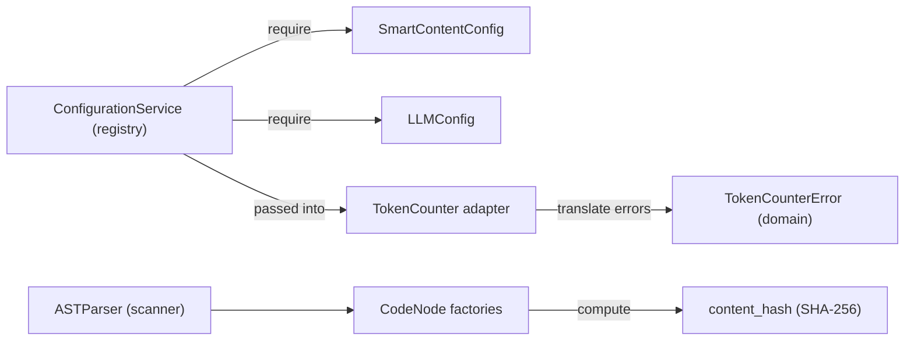
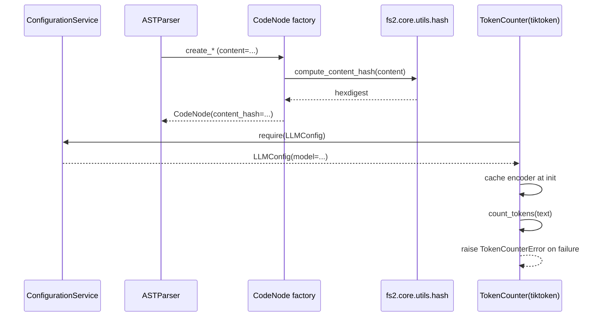

# Phase 1: Foundation & Infrastructure – Tasks & Alignment Brief

**Spec**: [../../smart-content-spec.md](../../smart-content-spec.md)  
**Plan**: [../../smart-content-plan.md](../../smart-content-plan.md)  
**Date**: 2025-12-18

---

## Executive Briefing

### Purpose
This phase establishes the shared foundation for Smart Content generation: configuration, token counting, hashing, and the `CodeNode` model extension needed for hash-based regeneration. Later phases build on these primitives to render prompts, call the LLM, and batch-process nodes safely.

### What We're Building
- `SmartContentConfig` loaded via the ConfigurationService registry pattern (`config.require(...)`) and configurable via `.fs2/config.yaml` + `FS2_*` env vars
- A `TokenCounter` adapter (ABC + Fake + tiktoken implementation) with strict exception translation
- A small hash utility for consistent SHA-256 content hashing
- A `content_hash` field on `CodeNode` with factory methods producing consistent hashes
- A Smart Content exception hierarchy to standardize failures across templates, token counting, and processing

### User Value
- Smart content becomes safely configurable without code changes (workers, token limits, truncation threshold)
- Hash-based regeneration becomes possible without copying graph data or mutating frozen models
- Token counting and error handling become consistent and testable (fakes over mocks)

### Example
- **Before**: A `CodeNode` only contains raw `content` and optional `smart_content`; no reliable “did content change?” signal exists.
- **After**: A `CodeNode` also contains a stable `content_hash`, enabling later phases to skip unchanged nodes and regenerate only when needed.

---

## Objectives & Scope

### Objective
Deliver the foundational building blocks (config, adapters, hashing, model field) required by Phases 2–5, in a way that complies with Clean Architecture rules (registry config, ABC adapters, exception translation, immutable models, fakes over mocks).

### Goals
- ✅ Add `SmartContentConfig` to `src/fs2/config/objects.py` and register it for YAML/env loading
- ✅ Introduce a `TokenCounter` adapter with Fake + tiktoken implementations and domain-level error translation
- ✅ Add deterministic SHA-256 hashing utilities for `content_hash`
- ✅ Extend `CodeNode` with `content_hash` and ensure factories produce consistent hashes
- ✅ Establish Smart Content exception types used by later phases

### Non-Goals (Scope Boundaries)
- ❌ No SmartContentService behavior (LLM calls, template rendering, truncation logic) — deferred to Phases 2–4
- ❌ No batch processing / worker pool implementation — deferred to Phase 4
- ❌ No CLI changes — deferred to Phase 5
- ❌ No prompt/template files — deferred to Phase 2
- ❌ No graph mutation/storage semantics — service remains stateless in later phases (Phase 3+)

---

## Architecture Map

### Component Diagram

```mermaid
flowchart TD
    classDef pending fill:#9E9E9E,stroke:#757575,color:#fff
    classDef inprogress fill:#FF9800,stroke:#F57C00,color:#fff
    classDef completed fill:#4CAF50,stroke:#388E3C,color:#fff
    classDef blocked fill:#F44336,stroke:#D32F2F,color:#fff

    style Phase fill:#F5F5F5,stroke:#E0E0E0
    style Files fill:#F5F5F5,stroke:#E0E0E0

    subgraph Phase["Phase 1: Foundation & Infrastructure"]
        T001["T001: SmartContentConfig tests ✓"]:::completed
        T002["T002: Implement SmartContentConfig ✓"]:::completed
        T003["T003: TokenCounter ABC/Fake tests ✓"]:::completed
        T004["T004: TokenCounterError + translation tests ✓"]:::completed
        T005["T005: Implement TokenCounter (ABC/Fake/tiktoken) ✓"]:::completed
        T006["T006: Hash utility tests ✓"]:::completed
        T007["T007: Implement hash utilities ✓"]:::completed
        T008["T008: CodeNode content_hash tests ✓"]:::completed
        T009["T009: Implement CodeNode content_hash ✓"]:::completed
        T010["T010: Update CodeNode call sites ✓"]:::completed
        T011["T011: Smart content exception hierarchy ✓"]:::completed

        T001 --> T002
        T003 --> T005
        T004 --> T005
        T006 --> T007
        T008 --> T009 --> T010
    end

    subgraph Files["Files"]
        F01["/workspaces/flow_squared/src/fs2/config/objects.py ✓"]:::completed
        F02["/workspaces/flow_squared/tests/unit/config/test_smart_content_config.py ✓"]:::completed

        F03["/workspaces/flow_squared/src/fs2/core/adapters/token_counter_adapter.py ✓"]:::completed
        F04["/workspaces/flow_squared/src/fs2/core/adapters/token_counter_adapter_fake.py ✓"]:::completed
        F05["/workspaces/flow_squared/src/fs2/core/adapters/token_counter_adapter_tiktoken.py ✓"]:::completed
        F06["/workspaces/flow_squared/src/fs2/core/adapters/exceptions.py ✓"]:::completed
        F07["/workspaces/flow_squared/tests/unit/adapters/test_token_counter.py ✓"]:::completed

        F08["/workspaces/flow_squared/src/fs2/core/utils/__init__.py ✓"]:::completed
        F09["/workspaces/flow_squared/src/fs2/core/utils/hash.py ✓"]:::completed
        F10["/workspaces/flow_squared/tests/unit/models/test_hash_utils.py ✓"]:::completed

        F11["/workspaces/flow_squared/src/fs2/core/models/code_node.py ✓"]:::completed
        F12["/workspaces/flow_squared/tests/unit/models/test_code_node.py ✓"]:::completed
        F13["/workspaces/flow_squared/src/fs2/core/adapters/ast_parser_fake.py"]:::pending
        F14["/workspaces/flow_squared/src/fs2/core/adapters/ast_parser_impl.py"]:::pending
        F15["/workspaces/flow_squared/tests/unit/repos/test_graph_store_impl.py ✓"]:::completed
        F16["/workspaces/flow_squared/tests/unit/services/test_get_node_service.py ✓"]:::completed

        F17["/workspaces/flow_squared/src/fs2/core/services/smart_content/__init__.py ✓"]:::completed
        F18["/workspaces/flow_squared/src/fs2/core/services/smart_content/exceptions.py ✓"]:::completed
        F22["/workspaces/flow_squared/tests/unit/services/test_smart_content_exceptions.py ✓"]:::completed

        F19["/workspaces/flow_squared/src/fs2/core/adapters/__init__.py ✓"]:::completed
        F20["/workspaces/flow_squared/pyproject.toml ✓"]:::completed
        F21["/workspaces/flow_squared/uv.lock ✓"]:::completed
    end

    T001 -.-> F02
    T002 -.-> F01

    T003 -.-> F07
    T004 -.-> F06
    T005 -.-> F03
    T005 -.-> F04
    T005 -.-> F05
    T005 -.-> F06
    T005 -.-> F07
    T005 -.-> F19
    T005 -.-> F20
    T005 -.-> F21

    T006 -.-> F10
    T007 -.-> F08
    T007 -.-> F09

    T008 -.-> F12
    T009 -.-> F11
    T009 -.-> F09
    T010 -.-> F13
    T010 -.-> F14
    T010 -.-> F15
    T010 -.-> F16
    T010 -.-> F12

    T011 -.-> F17
    T011 -.-> F18
    T011 -.-> F22
```

<!-- Status: grey=pending, orange=in-progress, green=completed, red=blocked -->
<!-- Updated by plan-6 during implementation -->



### Task-to-Component Mapping

<!-- Status: ⬜ Pending | 🟧 In Progress | ✅ Complete | 🔴 Blocked -->

| Task | Component(s) | Files | Status | Comment |
|------|-------------|-------|--------|---------|
| T001 | Config | `/workspaces/flow_squared/tests/unit/config/test_smart_content_config.py` | ✅ Complete | Define config contract via failing tests |
| T002 | Config | `/workspaces/flow_squared/src/fs2/config/objects.py` | ✅ Complete | Implement SmartContentConfig per registry pattern |
| T003 | Token counting | `/workspaces/flow_squared/tests/unit/adapters/test_token_counter.py` | ✅ Complete | TDD the adapter interface + fake behavior |
| T004 | Error translation | `/workspaces/flow_squared/src/fs2/core/adapters/exceptions.py` | ✅ Complete | Add TokenCounterError and codify translation contract |
| T005 | Token counting | `/workspaces/flow_squared/src/fs2/core/adapters/token_counter_adapter*.py` | ✅ Complete | Implement ABC/Fake/tiktoken with caching + translation |
| T006 | Hashing | `/workspaces/flow_squared/tests/unit/models/test_hash_utils.py` | ✅ Complete | TDD the SHA-256 helper behavior |
| T007 | Hashing | `/workspaces/flow_squared/src/fs2/core/utils/hash.py` | ✅ Complete | Implement shared hashing used by CodeNode factories |
| T008 | Models | `/workspaces/flow_squared/tests/unit/models/test_code_node.py` | ✅ Complete | Add tests for new content_hash field and factory behavior |
| T009 | Models | `/workspaces/flow_squared/src/fs2/core/models/code_node.py` | ✅ Complete | Add content_hash field + factory computation (frozen model safe) |
| T010 | Integration surface | `src/fs2/**` + `tests/**` call sites | ✅ Complete | Update direct CodeNode construction to satisfy new field |
| T011 | Smart content domain | `/workspaces/flow_squared/src/fs2/core/services/smart_content/*.py` | ✅ Complete | Provide SmartContentError hierarchy for later phases |

---

## Tasks

| Status | ID | Task | CS | Type | Dependencies | Absolute Path(s) | Validation | Subtasks | Notes |
|--------|----|------|----|------|--------------|------------------|------------|----------|-------|
| [x] | T001 | Write failing tests for `SmartContentConfig` defaults and validation | 2 | Test | – | /workspaces/flow_squared/tests/unit/config/test_smart_content_config.py | Tests assert defaults (workers, token limits, input cap) and reject invalid values (e.g., workers < 1) | – | Plan §Phase 1 task 1.1; Per Critical Discovery 01, 06 · log#task-t001-smartcontentconfig-tests [^1] |
| [x] | T002 | Implement `SmartContentConfig` in `config/objects.py` and register in `YAML_CONFIG_TYPES` | 2 | Core | T001 | /workspaces/flow_squared/src/fs2/config/objects.py | Config loads via `ConfigurationService.require(SmartContentConfig)` from YAML/env; all T001 tests pass | – | Plan §Phase 1 task 1.2; Per Critical Discovery 01, 06 · log#task-t002-implement-smartcontentconfig [^2] |
| [x] | T003 | Write failing tests for `TokenCounter` ABC contract and `FakeTokenCounter` configurability | 2 | Test | – | /workspaces/flow_squared/tests/unit/adapters/test_token_counter.py | Tests enforce ABC inheritance, `count_tokens(text)` contract, call-history capture, and configurable return behavior without `unittest.mock` | – | Plan §Phase 1 task 1.3; Per Critical Discovery 02 · log#task-t003-token-counter-abc-fake-tests [^3] |
| [x] | T004 | Extend adapter exception hierarchy with `TokenCounterError` and write tests asserting exception translation expectations | 2 | Test | T003 | /workspaces/flow_squared/src/fs2/core/adapters/exceptions.py, /workspaces/flow_squared/tests/unit/adapters/test_token_counter.py | Tests confirm `TokenCounterError` exists and tiktoken failures are translated (no raw SDK exceptions cross adapter boundary) | – | Plan §Phase 1 task 1.11 + Discovery 12 alignment; Per Critical Discovery 12 · log#task-t004-token-counter-error-translation-tests [^4] |
| [x] | T005 | Implement `TokenCounter` ABC, `FakeTokenCounter`, and `TiktokenTokenCounter` (encoder cached; exceptions translated) | 3 | Core | T002, T003, T004 | /workspaces/flow_squared/src/fs2/core/adapters/token_counter_adapter.py, /workspaces/flow_squared/src/fs2/core/adapters/token_counter_adapter_fake.py, /workspaces/flow_squared/src/fs2/core/adapters/token_counter_adapter_tiktoken.py, /workspaces/flow_squared/src/fs2/core/adapters/exceptions.py, /workspaces/flow_squared/src/fs2/core/adapters/__init__.py, /workspaces/flow_squared/pyproject.toml, /workspaces/flow_squared/uv.lock | All token counter tests pass; tiktoken encoder is cached per instance; adapter raises `TokenCounterError` on tokenizer failures | – | Naming follows `*_adapter*.py` convention (per repo rules); Plan §Phase 1 tasks 1.4–1.6; Per Critical Discovery 02, 05, 12 · log#task-t005-implement-token-counter-adapters [^5] |
| [x] | T006 | Write failing tests for shared SHA-256 hashing helpers (empty content, unicode, deterministic output) | 1 | Test | – | /workspaces/flow_squared/tests/unit/models/test_hash_utils.py | Tests assert stable hex output, correct behavior for empty and unicode content | – | Plan §Phase 1 task 1.7; Per Critical Discovery 03 · log#task-t006-hash-utility-tests [^6] |
| [x] | T007 | Implement hash utilities in `fs2.core.utils.hash` and create the `utils` package | 1 | Core | T006 | /workspaces/flow_squared/src/fs2/core/utils/__init__.py, /workspaces/flow_squared/src/fs2/core/utils/hash.py | All T006 tests pass; functions are importable and used by CodeNode factories | – | Plan §Phase 1 task 1.8 · log#task-t007-implement-hash-utilities [^7] |
| [x] | T008 | Add failing tests asserting `CodeNode` includes `content_hash` and factory methods populate it consistently | 2 | Test | T007 | /workspaces/flow_squared/tests/unit/models/test_code_node.py | Tests confirm `content_hash` field exists; factory methods set it based on `content`; immutability preserved | – | Plan §Phase 1 task 1.9; Per Critical Discovery 03 · log#task-t008-codenode-content-hash-tests [^8] |
| [x] | T009 | Add `content_hash` field to `CodeNode` and update all factory methods to compute it via hash utils | 3 | Core | T008 | /workspaces/flow_squared/src/fs2/core/models/code_node.py, /workspaces/flow_squared/src/fs2/core/utils/hash.py, /workspaces/flow_squared/tests/unit/models/test_code_node.py | Model remains frozen; factories produce correct `content_hash`; CodeNode unit tests pass | – | Plan §Phase 1 task 1.10; Per Critical Discovery 03 · log#task-t009-implement-codenode-content-hash [^9] |
| [x] | T010 | Migrate direct `CodeNode(...)` call sites to factories where feasible; keep direct constructors only where the test purpose is dataclass-structure coverage | 3 | Integration | T009 | /workspaces/flow_squared/tests/unit/models/test_code_node.py, /workspaces/flow_squared/tests/unit/repos/test_graph_store_impl.py, /workspaces/flow_squared/tests/unit/services/test_get_node_service.py | Unit tests pass without missing-field errors; `test_graph_store_impl.py` + `test_get_node_service.py` use `CodeNode.create_*` factories or compute `content_hash` via `fs2.core.utils.hash` (no duplicated hash logic) | – | Decision: `content_hash` is required (no transitional `None`); prefer factories to reduce churn · log#task-t010-update-codenode-call-sites [^10] |
| [x] | T011 | Create Smart Content service-layer exception hierarchy (`SmartContentError`, `TemplateError`, `SmartContentProcessingError`) without duplicating adapter exceptions | 1 | Core | – | /workspaces/flow_squared/src/fs2/core/services/smart_content/__init__.py, /workspaces/flow_squared/src/fs2/core/services/smart_content/exceptions.py, /workspaces/flow_squared/tests/unit/services/test_smart_content_exceptions.py | Exceptions are importable and used by SmartContentService in later phases; adapter exceptions (e.g., `TokenCounterError`) remain only in `fs2.core.adapters.exceptions` and may be caught/wrapped by services | – | Strict layering decision: no re-export/duplication of adapter exceptions; per repo rules and Critical Discovery 12 · log#task-t011-smart-content-exceptions [^11] |

---

## Alignment Brief

### Prior Phases Review
N/A (Phase 1 is foundational).

### Plan Task Mapping
- Plan `1.1–1.2` → T001–T002
- Plan `1.3–1.6` → T003–T005
- Plan `1.7–1.8` → T006–T007
- Plan `1.9–1.10` → T008–T010
- Plan `1.11` → T004 + T011 (adapter boundary vs smart-content domain)

### Critical Findings Affecting This Phase

| Finding | What It Constrains / Requires | Addressed By |
|---------|-------------------------------|--------------|
| Critical Discovery 01: ConfigurationService registry pattern | Services/components accept `ConfigurationService` and call `config.require(TheirConfig)` internally (no concept leakage) | T002 |
| (Config Keying) Smart content YAML path | `SmartContentConfig.__config_path__` MUST be `"smart_content"` so `.fs2/config.yaml` uses `smart_content:` and env vars use `FS2_SMART_CONTENT__...` | T001–T002 |
| Critical Discovery 02: Adapter ABC + implementation split | Token counting must be an adapter ABC; fakes implement the ABC; services import ABC only | T003, T005 |
| Critical Discovery 03: Frozen dataclass immutability | `CodeNode` must remain frozen; updates are via new instances; factories must set fields up front | T008–T010 |
| Critical Discovery 05: tiktoken model-specific caching | Token counter implementation caches tokenizer/encoder once per instance | T005 |
| Critical Discovery 06: Configurable worker pool size | `SmartContentConfig` must include configurable `max_workers` (default 50) | T001–T002 |
| Critical Discovery 12: Exception translation boundary | Adapter implementations translate SDK/library exceptions to domain exceptions | T004–T005 |

### ADR Decision Constraints
N/A (no `docs/adr/` entries found for this feature at planning time).

### Invariants & Guardrails
- Services and adapters follow strict dependency flow (CLI → services → adapters/repos), with no adapter importing from services (per `docs/rules-idioms-architecture/rules.md`).
- Adapters translate external/library exceptions to domain exceptions at the boundary.
- No `unittest.mock` for adapters/repos; use fakes that inherit from ABCs.
- `CodeNode` remains immutable; do not mutate instances in-place.

### Inputs to Read
- `/workspaces/flow_squared/docs/plans/008-smart-content/smart-content-plan.md`
- `/workspaces/flow_squared/docs/plans/008-smart-content/smart-content-spec.md`
- `/workspaces/flow_squared/src/fs2/config/objects.py`
- `/workspaces/flow_squared/src/fs2/core/adapters/exceptions.py`
- `/workspaces/flow_squared/src/fs2/core/models/code_node.py`
- `/workspaces/flow_squared/tests/unit/models/test_code_node.py`

### Visual Alignment Aids

#### Flow (data + responsibilities)


#### Sequence (expected interaction order in Phase 1 surfaces)


### Test Plan (TDD; fakes over mocks)
- `tests/unit/config/test_smart_content_config.py`
  - Defaults match spec (workers, input cap, token limits)
  - Validation rejects invalid worker counts
  - YAML/env integration via `ConfigurationService` patterns already present in config tests
- `tests/unit/adapters/test_token_counter.py`
  - ABC contract enforced (inherits from `abc.ABC`)
  - `FakeTokenCounter` provides configurable responses + call history
  - `TiktokenTokenCounter` caches encoder; translates exceptions to `TokenCounterError` (via monkeypatch)
- `tests/unit/models/test_hash_utils.py`
  - Deterministic SHA-256 hexdigest for representative strings (including unicode)
- `tests/unit/models/test_code_node.py`
  - `content_hash` field exists and is populated by factories
  - No mutation of frozen instances (existing invariants remain valid)
  - Direct `CodeNode(...)` construction remains only for dataclass-structure tests (not for general node creation)

### Step-by-Step Implementation Outline (maps 1:1 to tasks)
- T001 → T002: Lock config semantics via tests, then implement `SmartContentConfig`.
- T003 → T005 (and T004): Define the token counter contract, then implement fake + tiktoken with strict translation + caching.
- T006 → T007: Define hashing behavior, then implement shared utility.
- T008 → T010: Add tests for the new model field, update factories, then update all call sites.
- T011: Add smart content exception hierarchy for later phases.

### Commands to Run (copy/paste)
- `just test-unit`
- `just lint`
- `just test`

### Risks / Unknowns
- `tiktoken` availability: `tiktoken` is a required dependency and is expected to be installed via `uv` for dev/CI; treat missing installs as environment misconfiguration (tests should fail loudly).
- `content_hash` model change impacts direct `CodeNode(...)` constructors in unit tests; prefer factories in production code, but keep a small number of direct constructors in `tests/unit/models/test_code_node.py` for dataclass-structure coverage.
- Existing serialized graph artifacts (if any) may not deserialize into a changed dataclass shape; validate expected behavior when Phase 5 introduces CLI usage.

### Ready Check (await explicit GO/NO-GO)
- [ ] Phase objective and non-goals accepted
- [ ] Critical findings mapped to tasks (table above)
- [ ] Tasks include absolute paths and measurable validation
- [ ] No ADR constraints missing (N/A if none exist)
- [ ] No time estimates or duration language present

---

## Phase Footnote Stubs

_Populated during implementation by plan-6._

| ID | Footnote | Type | Affects | Notes |
|----|----------|------|---------|-------|
| [^1] | Task 1.1 / T001 - Add SmartContentConfig contract tests | test | `file:tests/unit/config/test_smart_content_config.py`<br>`function:tests/unit/config/test_smart_content_config.py:test_given_no_args_when_constructed_then_has_spec_defaults`<br>`function:tests/unit/config/test_smart_content_config.py:test_given_config_when_checking_path_then_returns_smart_content`<br>`function:tests/unit/config/test_smart_content_config.py:test_given_invalid_max_workers_when_constructed_then_validation_error`<br>`function:tests/unit/config/test_smart_content_config.py:test_given_yaml_when_loaded_then_uses_yaml_values`<br>`function:tests/unit/config/test_smart_content_config.py:test_given_env_var_when_loaded_then_env_overrides_yaml` | Defines defaults, validation, and YAML/env binding expectations |
| [^2] | Task 1.2 / T002 - Add SmartContentConfig to config registry | config | `class:src/fs2/config/objects.py:SmartContentConfig`<br>`file:src/fs2/config/objects.py` | Adds `__config_path__="smart_content"` and registers in `YAML_CONFIG_TYPES` |
| [^3] | Task 1.3 / T003 - Add TokenCounterAdapter contract tests | test | `file:tests/unit/adapters/test_token_counter.py`<br>`class:tests/unit/adapters/test_token_counter.py:TestTokenCounterAdapterContract`<br>`class:tests/unit/adapters/test_token_counter.py:TestFakeTokenCounterAdapter`<br>`function:tests/unit/adapters/test_token_counter.py:test_given_token_counter_adapter_when_checked_then_is_abc`<br>`function:tests/unit/adapters/test_token_counter.py:test_given_fake_adapter_when_counting_then_records_call_history` | Defines adapter ABC contract and fake behavior (call history + configurable counts) |
| [^4] | Task 1.11 (partial) / T004 - Add TokenCounterError + translation tests | adapter | `class:src/fs2/core/adapters/exceptions.py:TokenCounterError`<br>`file:src/fs2/core/adapters/exceptions.py`<br>`file:tests/unit/adapters/test_token_counter.py` | Establishes adapter-boundary exception type and failing translation test |
| [^5] | Tasks 1.4–1.6 / T005 - Implement TokenCounterAdapter family + add required dependency | adapter | `class:src/fs2/core/adapters/token_counter_adapter.py:TokenCounterAdapter`<br>`class:src/fs2/core/adapters/token_counter_adapter_fake.py:FakeTokenCounterAdapter`<br>`class:src/fs2/core/adapters/token_counter_adapter_tiktoken.py:TiktokenTokenCounterAdapter`<br>`file:src/fs2/core/adapters/token_counter_adapter.py`<br>`file:src/fs2/core/adapters/token_counter_adapter_fake.py`<br>`file:src/fs2/core/adapters/token_counter_adapter_tiktoken.py`<br>`file:src/fs2/core/adapters/__init__.py`<br>`file:pyproject.toml`<br>`file:uv.lock` | Implements ABC + fake + tiktoken adapter; adds required `tiktoken` dependency and offline-safe tests |
| [^6] | Task 1.7 / T006 - Add hash utility contract tests | test | `file:tests/unit/models/test_hash_utils.py`<br>`function:tests/unit/models/test_hash_utils.py:test_given_known_text_when_hashing_then_matches_sha256_hexdigest`<br>`function:tests/unit/models/test_hash_utils.py:test_given_empty_text_when_hashing_then_matches_sha256_empty`<br>`function:tests/unit/models/test_hash_utils.py:test_given_unicode_text_when_hashing_then_uses_utf8` | Defines deterministic SHA-256 helper behavior (empty + unicode) |
| [^7] | Task 1.8 / T007 - Implement hash utility module | core | `function:src/fs2/core/utils/hash.py:compute_content_hash`<br>`file:src/fs2/core/utils/hash.py`<br>`file:src/fs2/core/utils/__init__.py` | Adds `fs2.core.utils` package and implements SHA-256 hashing helper |
| [^8] | Task 1.9 / T008 - Add CodeNode content_hash contract tests | test | `file:tests/unit/models/test_code_node.py`<br>`function:tests/unit/models/test_code_node.py:test_create_file_when_called_then_populates_content_hash` | Adds failing factory test asserting `content_hash` is populated |
| [^9] | Task 1.10 / T009 - Add CodeNode content_hash field + factory population | model | `class:src/fs2/core/models/code_node.py:CodeNode`<br>`file:src/fs2/core/models/code_node.py`<br>`file:src/fs2/core/utils/hash.py` | Adds required `content_hash` field and computes it in all factories via `compute_content_hash()` |
| [^10] | Follow-through / T010 - Update remaining CodeNode constructors | integration | `file:tests/unit/services/test_get_node_service.py`<br>`file:tests/unit/repos/test_graph_store_impl.py` | Replaces direct constructors with factories/dataclasses.replace; updates graph store tests to include content_hash |
| [^11] | Task 1.11 (complete) / T011 - Add smart content service exception hierarchy | service | `file:src/fs2/core/services/smart_content/exceptions.py`<br>`file:src/fs2/core/services/smart_content/__init__.py`<br>`file:tests/unit/services/test_smart_content_exceptions.py`<br>`class:src/fs2/core/services/smart_content/exceptions.py:SmartContentError`<br>`class:src/fs2/core/services/smart_content/exceptions.py:TemplateError`<br>`class:src/fs2/core/services/smart_content/exceptions.py:SmartContentProcessingError` | Adds `SmartContentError`/`TemplateError`/`SmartContentProcessingError` without duplicating adapter exceptions |
| | | | | |

---

## Evidence Artifacts

- Execution log (written by plan-6): `/workspaces/flow_squared/docs/plans/008-smart-content/tasks/phase-1-foundation-and-infrastructure/execution.log.md`
- This dossier: `/workspaces/flow_squared/docs/plans/008-smart-content/tasks/phase-1-foundation-and-infrastructure/tasks.md`

---

## Discoveries & Learnings

_Populated during implementation by plan-6. Log anything of interest to your future self._

| Date | Task | Type | Discovery | Resolution | References |
|------|------|------|-----------|------------|------------|
| 2025-12-18 | T001 | unexpected-behavior | `uv run ...` failed with `Permission denied` accessing `/home/vscode/.cache/uv/...`; `pytest` direct invocation worked | Use `pytest` directly for evidence runs in this environment; revisit `uv` cache permissions if needed | log#task-t001-smartcontentconfig-tests |
| 2025-12-18 | T003 | workaround | `uv` works if `UV_CACHE_DIR` points to a workspace-writable directory; this also ensures dependencies (e.g., tree-sitter pack) are present | Use `UV_CACHE_DIR=/workspaces/flow_squared/.uv_cache uv run ...` for test runs | log#task-t003-token-counter-abc-fake-tests |
| 2025-12-18 | T005 | gotcha | `tiktoken` encoder initialization can trigger network fetches for encoding assets; tests must not make network calls | In tests, replace `tiktoken` with a fake module via `sys.modules` injection to enforce offline determinism | log#task-t005-implement-token-counter-adapters |

**Types**: `gotcha` | `research-needed` | `unexpected-behavior` | `workaround` | `decision` | `debt` | `insight`

_See also: `execution.log.md` for detailed narrative._

---

## Directory Layout

```
docs/plans/008-smart-content/
  ├── smart-content-plan.md
  ├── smart-content-spec.md
  └── tasks/
      └── phase-1-foundation-and-infrastructure/
          ├── tasks.md
          └── execution.log.md  # created by /plan-6
```

---

## Critical Insights Discussion

**Session**: 2025-12-18
**Context**: Phase 1 Foundation & Infrastructure tasks dossier
**Analyst**: AI Clarity Agent
**Reviewer**: Development Team
**Format**: Water Cooler Conversation (5 Critical Insights)

### Insight 1: SmartContentConfig YAML Key Binding Must Match `__config_path__`

**Did you know**: If `SmartContentConfig.__config_path__` doesn’t match the documented YAML key (`smart_content:`), config can silently fail to bind and later phases “work” on defaults.

**Implications**:
- Users set `smart_content:` in `.fs2/config.yaml` but see no effect (e.g., workers never change).
- Tests can pass unless they explicitly cover YAML/env binding for this config.
- Docs/examples become misleading immediately if keying drifts.

**Options Considered**:
- Option A: Keep canonical key `smart_content` (recommended)
- Option B: Move to dotted/nested key and update docs
- Option C: Support aliases (compat loader logic)

**AI Recommendation**: Option A
- Reasoning: Matches existing plan/spec/examples and avoids silent misbinding.

**Discussion Summary**:
Team chose to keep `smart_content` as the canonical config key to avoid introducing new conventions and to align with existing documentation.

**Decision**: Use YAML `smart_content:` and env `FS2_SMART_CONTENT__...`; implement `__config_path__ = "smart_content"`.

**Action Items**:
- [ ] Ensure Phase 1 tests validate YAML/env binding for `SmartContentConfig`

**Affects**: Phase 1 `T001–T002`; plan/spec config examples

---

### Insight 2: `content_hash` Required Field Forces Immediate Constructor Migration

**Did you know**: Making `content_hash` a required `CodeNode` field will break every direct `CodeNode(...)` call site immediately, so the model change is coupled to a compatibility sweep.

**Implications**:
- A “small” model tweak can cascade into unrelated test failures until all constructors are migrated.
- Keeping `content_hash` optional would push complexity into later phases (handling `None` everywhere).
- Factories already compute consistent fields; direct constructors should be rare.

**Options Considered**:
- Option A: Strict required field (recommended)
- Option B: Transitional optional `content_hash`
- Option C: Required + compatibility helper

**AI Recommendation**: Option A
- Reasoning: Matches spec’s invariant that hashes should always be present and prevents `None` spread.

**Discussion Summary**:
Team confirmed strict required `content_hash`, with a strong preference to migrate tests to factories where possible and keep direct constructors only for dataclass-structure tests.

**Decision**: `content_hash` is required from day one; migrate to factories wherever feasible.

**Action Items**:
- [ ] Update `test_graph_store_impl.py` and `test_get_node_service.py` to use CodeNode factories
- [ ] Keep direct `CodeNode(...)` construction primarily in `test_code_node.py` for structure coverage

**Affects**: Phase 1 `T008–T010`

---

### Insight 3: TokenCounter File Naming Must Follow Adapter Conventions

**Did you know**: Naming TokenCounter files as `token_counter.py`/`*_fake.py` would diverge from the repo’s adapter conventions (`*_adapter*.py`) and create avoidable inconsistency.

**Implications**:
- Makes navigation and tooling harder in a convention-heavy repo.
- Risks future convention enforcement failures.
- Encourages “one-off” architectural decisions, which the team wants to avoid.

**Options Considered**:
- Option A: Use `token_counter_adapter*.py` (recommended)
- Option B: Keep `token_counter*.py`
- Option C: Hybrid naming

**AI Recommendation**: Option A
- Reasoning: Matches existing `llm_adapter*` family and documented rules.

**Discussion Summary**:
Team insisted on following established conventions, not inventing new patterns during feature work.

**Decision**: Use `token_counter_adapter.py`, `token_counter_adapter_fake.py`, `token_counter_adapter_tiktoken.py`.

**Action Items**:
- [ ] Ensure Phase 1 dossier and plan references use `token_counter_adapter*.py`

**Affects**: Phase 1 `T005`; plan critical discovery examples

---

### Insight 4: `tiktoken` Must Be Treated as a Required Dependency

**Did you know**: If we treat `tiktoken` as optional, Phase 1 can end up with flaky “skip vs fail” behavior that undermines the repo’s deterministic test expectations.

**Implications**:
- Optional dep handling often hides real coverage gaps across environments.
- Determinism improves when we fail loudly on missing required deps.
- This sets expectations for truncation/token logic tests in later phases.

**Options Considered**:
- Option A: Make `tiktoken` required (recommended)
- Option B: Optional + skip tests
- Option C: Optional + strict runtime error when selected

**AI Recommendation**: Option A
- Reasoning: Token counting/truncation is core behavior; `uv` should install required deps consistently.

**Discussion Summary**:
Team confirmed `tiktoken` is definitely required and should always be installed by `uv`.

**Decision**: `tiktoken` is required; missing installs are environment misconfiguration and tests should fail.

**Action Items**:
- [ ] Ensure `pyproject.toml` includes `tiktoken` as a dependency (and locked by `uv`)

**Affects**: Phase 1 TokenCounter tests; dependency management

---

### Insight 5: Strict Exception Layering Prevents Boundary Drift

**Did you know**: If we blur adapter exceptions and service exceptions (e.g., re-export `TokenCounterError` from smart-content exceptions), later phases can accidentally violate the adapter/service boundary.

**Implications**:
- Incorrect imports become “sticky” and hard to unwind.
- Violates the repo’s boundary rules and complicates error handling semantics.
- Makes it unclear what layer owns translation vs orchestration.

**Options Considered**:
- Option A: Strict layering (recommended)
- Option B: Re-export adapter exceptions from smart-content exceptions
- Option C: Duplicate exception names/types

**AI Recommendation**: Option A
- Reasoning: Clean boundaries and rule compliance; services may catch/wrap adapter exceptions without duplication.

**Discussion Summary**:
Team agreed to strict layering: adapter exceptions live in adapter layer only; smart-content service exceptions are separate and may wrap adapter errors.

**Decision**: Enforce strict exception layering; no duplication/re-export.

**Action Items**:
- [ ] Ensure Phase 1 `T011` explicitly avoids duplicating adapter exceptions

**Affects**: Phase 1 `T004–T005` (adapter errors) and `T011` (service errors); plan/spec guidance

---

## Session Summary

**Insights Surfaced**: 5
**Decisions Made**: 5
**Action Items Created**: 5
**Areas Requiring Updates**:
- Dependency manifest must include `tiktoken`
- Phase 1 implementation should prefer factories for most test nodes

**Shared Understanding Achieved**: ✓

**Confidence Level**: High

**Next Steps**:
- Apply the Phase 1 action items during `/plan-6-implement-phase --phase "Phase 1: Foundation & Infrastructure" --plan "/workspaces/flow_squared/docs/plans/008-smart-content/smart-content-plan.md"`
