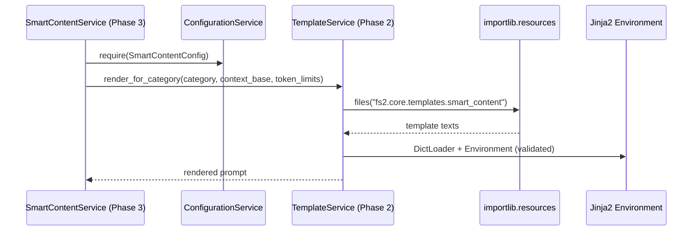

# Phase 2: Template System – Tasks & Alignment Brief

**Spec**: [smart-content-spec.md](../../smart-content-spec.md)  
**Plan**: [smart-content-plan.md](../../smart-content-plan.md)  
**Date**: 2025-12-18

## Executive Briefing

### Purpose
This phase introduces a package-safe Jinja2 template system for Smart Content prompt generation.
It standardizes how we turn a `CodeNode` into a prompt and ensures the correct token limit is injected per category.

### What We’re Building
A `TemplateService` plus a `fs2.core.templates.smart_content` template package that:
- Loads templates via `importlib.resources` (works when installed as a wheel)
- Validates template syntax at initialization
- Maps node categories to template names (per AC11)
- Renders templates with a stable context contract (per AC8), including `max_tokens` from `SmartContentConfig.token_limits`

### User Value
Smart content generation becomes consistent and testable: every node category reliably produces a deterministic prompt shape, and prompt budgets are centralized in config instead of hard-coded across services.

### Example
**Input**: `category="callable"`, `qualified_name="MyClass.my_func"`, `content="def my_func(): ..."`  
**Output**: Rendered prompt from `smart_content_callable.j2` containing `MyClass.my_func` and a `max_tokens` value pulled from config (default `150` for `callable`).

---

## Objectives & Scope

### Objective
Implement the template infrastructure and `TemplateService` so later phases can generate prompts correctly.

### Goals
- ✅ Package templates under `src/fs2/core/templates/smart_content/` and load them via `importlib.resources` (Critical Discovery 04)
- ✅ Provide a `TemplateService` that maps categories→templates (AC11) and renders with required context vars (AC8)
- ✅ Validate templates at initialization and fail early with a service-layer `TemplateError` (Critical Discovery 09)
- ✅ Keep token limit injection config-driven via `SmartContentConfig.token_limits` (Phase 1 dependency)
- ✅ Add/lock `jinja2` as a required dependency installed via `uv` (per repo convention)

### Non-Goals
- ❌ SmartContentService prompt orchestration and LLM calls (Phase 3)
- ❌ Batch processing / worker pool (Phase 4)
- ❌ Relationship context injection (imports/call graphs) in templates (deferred in spec)
- ❌ Prompt quality tuning beyond a sensible baseline (tune later if needed)
- ❌ Repo-wide lint cleanup unrelated to Phase 2 touched files

---

## Architecture Map

### Component Diagram

```mermaid
flowchart TD
    classDef pending fill:#9E9E9E,stroke:#757575,color:#fff
    classDef inprogress fill:#FF9800,stroke:#F57C00,color:#fff
    classDef completed fill:#4CAF50,stroke:#388E3C,color:#fff
    classDef blocked fill:#F44336,stroke:#D32F2F,color:#fff

    style Phase fill:#F5F5F5,stroke:#E0E0E0
    style Files fill:#F5F5F5,stroke:#E0E0E0

    subgraph Phase["Phase 2: Template System"]
        T001["T001: Review Phase 1 exports ✓"]:::completed
        T002["T002: Add Jinja2 dependency + package data ✓"]:::completed
        T003["T003: Add templates package structure ✓"]:::completed
        T004["T004: Write TemplateService init tests ✓"]:::completed
        T005["T005: Write category mapping tests (AC11) ✓"]:::completed
        T006["T006: Write rendering context tests (AC8) ✓"]:::completed
        T007["T007: Implement TemplateService loader + API ✓"]:::completed
        T008["T008: Implement template syntax validation ✓"]:::completed
        T009["T009: Add template files (6) ✓"]:::completed
        T010["T010: Integration test: load+render all templates ✓"]:::completed

        T001 --> T002 --> T003 --> T004 --> T007 --> T008 --> T009 --> T010
        T004 --> T005 --> T007
        T004 --> T006 --> T007
    end

    subgraph Files["Files"]
        F1["/workspaces/flow_squared/pyproject.toml ✓"]:::completed
        F2["/workspaces/flow_squared/uv.lock ✓"]:::completed

        F3["/workspaces/flow_squared/src/fs2/core/templates/__init__.py ✓"]:::completed
        F4["/workspaces/flow_squared/src/fs2/core/templates/smart_content/__init__.py ✓"]:::completed
        F5["/workspaces/flow_squared/src/fs2/core/templates/smart_content/smart_content_file.j2 ✓"]:::completed
        F6["/workspaces/flow_squared/src/fs2/core/templates/smart_content/smart_content_type.j2 ✓"]:::completed
        F7["/workspaces/flow_squared/src/fs2/core/templates/smart_content/smart_content_callable.j2 ✓"]:::completed
        F8["/workspaces/flow_squared/src/fs2/core/templates/smart_content/smart_content_section.j2 ✓"]:::completed
        F9["/workspaces/flow_squared/src/fs2/core/templates/smart_content/smart_content_block.j2 ✓"]:::completed
        F10["/workspaces/flow_squared/src/fs2/core/templates/smart_content/smart_content_base.j2 ✓"]:::completed

        F11["/workspaces/flow_squared/src/fs2/core/services/smart_content/template_service.py ✓"]:::completed
        F12["/workspaces/flow_squared/src/fs2/core/services/smart_content/__init__.py ✓"]:::completed

        F13["/workspaces/flow_squared/tests/unit/services/test_template_service.py ✓"]:::completed
    end

    T002 -.-> F1
    T002 -.-> F2
    T002 -.-> F3
    T002 -.-> F4

    T003 -.-> F3
    T003 -.-> F4

    T004 -.-> F13
    T005 -.-> F13
    T006 -.-> F13

    T007 -.-> F11
    T007 -.-> F12
    T008 -.-> F11

    T009 -.-> F5
    T009 -.-> F6
    T009 -.-> F7
    T009 -.-> F8
    T009 -.-> F9
    T009 -.-> F10

    T010 -.-> F13
    T010 -.-> F5
    T010 -.-> F6
    T010 -.-> F7
    T010 -.-> F8
    T010 -.-> F9
    T010 -.-> F10
```

<!-- Status: grey=pending, orange=in-progress, green=completed, red=blocked -->
<!-- Updated by plan-6 during implementation -->



### Task-to-Component Mapping

<!-- Status: ⬜ Pending | 🟧 In Progress | ✅ Complete | 🔴 Blocked -->

| Task | Component(s) | Files | Status | Comment |
|------|-------------|-------|--------|---------|
| T001 | Alignment | Phase 1 artifacts | ✅ Complete | Confirmed Phase 1 exports (config + TemplateError contract) |
| T002 | Dependencies + Packaging | Packaging | ✅ Complete | Added `jinja2` dependency + Hatch include rules for `.j2` package data |
| T003 | Templates Package | Templates | ✅ Complete | Added template packages so `importlib.resources` can resolve `fs2.core.templates.smart_content` |
| T004 | Tests | TemplateService | ✅ Complete | Added RED tests for init-time loading + missing/syntax error handling |
| T005 | Tests | Mapping | ✅ Complete | Added RED tests for AC11 category mapping + token-limit mapping |
| T006 | Tests | Rendering | ✅ Complete | Added RED tests for AC8 context contract + strict undefined rendering |
| T007 | Core | TemplateService | ✅ Complete | Implemented TemplateService loader + mapping + render APIs |
| T008 | Core | Validation | ✅ Complete | Init-time template compilation/validation verified; failures surface as `TemplateError` |
| T009 | Templates | Prompt files | ✅ Complete | Added six `.j2` templates (5 specialized + 1 base fallback) |
| T010 | Integration | End-to-end | ✅ Complete | Added end-to-end test + installed-artifact smoke check evidence |

---

## Tasks

| Status | ID | Task | CS | Type | Dependencies | Absolute Path(s) | Validation | Subtasks | Notes |
|--------|----|------|----|------|--------------|------------------|------------|----------|-------|
| [x] | T001 | Review Phase 1 deliverables for reuse (SmartContentConfig defaults, `TemplateError` availability, conventions) | 1 | Setup | – | /workspaces/flow_squared/src/fs2/config/objects.py, /workspaces/flow_squared/src/fs2/core/services/smart_content/exceptions.py, /workspaces/flow_squared/docs/plans/008-smart-content/tasks/phase-1-foundation-and-infrastructure/tasks.md, /workspaces/flow_squared/docs/plans/008-smart-content/tasks/phase-1-foundation-and-infrastructure/execution.log.md | Alignment brief includes the reused symbols + constraints to follow | – | Links to prior phase are captured in Alignment Brief · log#task-t001-review-phase-1-exports |
| [x] | T002 | Add `jinja2` dependency and ensure templates are included in installed artifacts (uv/uvx) | 3 | Setup | T001 | /workspaces/flow_squared/pyproject.toml, /workspaces/flow_squared/uv.lock | `uv run python -c "import jinja2"` succeeds; `uv build` + `uv pip install dist/*.whl` env proves `importlib.resources.files("fs2.core.templates.smart_content")` contains `.j2` entries | – | Per spec dependency note; per Critical Discovery 04 (package-safe loading); install-path smoke check added per sponsor decision · log#task-t002-add-jinja2-dependency-package-data [^12] |
| [x] | T003 | Create templates package structure for `fs2.core.templates.smart_content` | 2 | Core | T002 | /workspaces/flow_squared/src/fs2/core/templates/__init__.py, /workspaces/flow_squared/src/fs2/core/templates/smart_content/__init__.py | `importlib.resources.files(\"fs2.core.templates.smart_content\")` resolves without error | – | Package structure is required before adding `.j2` files · log#task-t003-add-templates-package-structure [^13] |
| [x] | T004 | Write failing tests: TemplateService init loads templates, raises `TemplateError` for missing templates, validates syntax at init | 3 | Test | T001, T002, T003 | /workspaces/flow_squared/tests/unit/services/test_template_service.py | Tests fail with clear messages until TemplateService exists and enforces validation behavior | – | Per Critical Discovery 04 + 09; errors must be service-layer `TemplateError` (no leaking `jinja2.TemplateNotFound`) · log#task-t004-write-templateservice-init-tests [^14] |
| [x] | T005 | Write failing tests: category→template mapping + token limit mapping (AC11) including fallback categories | 2 | Test | T001, T004 | /workspaces/flow_squared/tests/unit/services/test_template_service.py | Tests prove all 9 categories map to the expected template: specialized templates for `file`, `type`, `callable`, `section`, `block`; fallback to `smart_content_base.j2` for remaining categories; token limit resolved via `SmartContentConfig.token_limits` | – | Per AC11; explicit fallback mapping per sponsor decision · log#task-t005-write-category-mapping-tests-ac11 [^15] |
| [x] | T006 | Write failing tests: render contract exposes AC8 context variables and injects `max_tokens` (token limits from `ConfigurationService.require(SmartContentConfig)`) | 2 | Test | T001, T004 | /workspaces/flow_squared/tests/unit/services/test_template_service.py | Tests verify rendered prompt includes key fields and `max_tokens` is present for each category render path; tests construct TemplateService with `FakeConfigurationService` and confirm `SmartContentConfig.token_limits` is the source of truth | – | Per AC8; follow repo service patterns (config required internally); keep tests deterministic (no network) · log#task-t006-write-rendering-context-tests-ac8 [^16] |
| [x] | T007 | Implement TemplateService: accept `ConfigurationService`, call `require(SmartContentConfig)`, load templates via `importlib.resources` + `jinja2.DictLoader`, map categories, render templates | 3 | Core | T004, T005, T006 | /workspaces/flow_squared/src/fs2/core/services/smart_content/template_service.py, /workspaces/flow_squared/src/fs2/core/services/smart_content/__init__.py | All TemplateService unit tests pass; Jinja2 uses strict undefined behavior so missing AC8 vars surface as `TemplateError`; token limits always come from `SmartContentConfig.token_limits`; public API does not require filesystem paths | – | Per Critical Discovery 04; follow repo conventions (ConfigurationService + FakeConfigurationService in tests); strict undefined per sponsor decision · log#task-t007-implement-templateservice-loader-api [^17] |
| [x] | T008 | Implement syntax validation: pre-compile/parse all templates at init; wrap failures as `TemplateError` including template name | 3 | Core | T007 | /workspaces/flow_squared/src/fs2/core/services/smart_content/template_service.py | Dedicated tests prove syntax errors are caught at init (not first render) and surfaced as `TemplateError` | – | Per Critical Discovery 09 · log#task-t008-implement-template-syntax-validation |
| [x] | T009 | Add 6 Jinja2 template files (file/type/callable/section/block/base) with a stable prompt baseline and `max_tokens` placeholder | 2 | Doc | T003 | /workspaces/flow_squared/src/fs2/core/templates/smart_content/smart_content_file.j2, /workspaces/flow_squared/src/fs2/core/templates/smart_content/smart_content_type.j2, /workspaces/flow_squared/src/fs2/core/templates/smart_content/smart_content_callable.j2, /workspaces/flow_squared/src/fs2/core/templates/smart_content/smart_content_section.j2, /workspaces/flow_squared/src/fs2/core/templates/smart_content/smart_content_block.j2, /workspaces/flow_squared/src/fs2/core/templates/smart_content/smart_content_base.j2 | Each template renders for representative context without undefined-variable errors; prompt text references `max_tokens` and primary context vars | – | Keep template content simple and policy-neutral; quality tuning later · log#task-t009-add-template-files-6 [^18] |
| [x] | T010 | Write integration test: all templates load and render end-to-end for representative categories | 2 | Integration | T007, T008, T009 | /workspaces/flow_squared/tests/unit/services/test_template_service.py | A single test iterates through template names + categories and asserts render does not raise and includes minimal expected markers | – | Mirrors plan task 2.12; proves package-data + importlib loading · log#task-t010-integration-test-load-render-all-templates [^19] |

---

## Alignment Brief

### Prior Phases Review (Phase 1: Foundation & Infrastructure)

This Phase 2 work builds directly on Phase 1’s config + exception layering + model constraints.

**Source artifacts**
- Dossier: `/workspaces/flow_squared/docs/plans/008-smart-content/tasks/phase-1-foundation-and-infrastructure/tasks.md`
- Execution log: `/workspaces/flow_squared/docs/plans/008-smart-content/tasks/phase-1-foundation-and-infrastructure/execution.log.md`

**A) Deliverables Created (Phase 1)**
- Config:
  - `/workspaces/flow_squared/src/fs2/config/objects.py` — `class:fs2.config.objects.SmartContentConfig`
    - Key fields used by Phase 2: `token_limits` (category→tokens) and future `max_workers`/`max_input_tokens`
- Adapter layer:
  - `/workspaces/flow_squared/src/fs2/core/adapters/token_counter_adapter.py` — `TokenCounterAdapter` (ABC)
  - `/workspaces/flow_squared/src/fs2/core/adapters/token_counter_adapter_fake.py` — `FakeTokenCounterAdapter`
  - `/workspaces/flow_squared/src/fs2/core/adapters/token_counter_adapter_tiktoken.py` — `TiktokenTokenCounterAdapter`
  - `/workspaces/flow_squared/src/fs2/core/adapters/exceptions.py` — `TokenCounterError`
- Model layer:
  - `/workspaces/flow_squared/src/fs2/core/models/code_node.py` — required `content_hash` field (frozen dataclass)
- Utilities:
  - `/workspaces/flow_squared/src/fs2/core/utils/hash.py` — `compute_content_hash(text)->sha256`
- Service layer:
  - `/workspaces/flow_squared/src/fs2/core/services/smart_content/exceptions.py` — `SmartContentError`, `TemplateError`, `SmartContentProcessingError`
  - `/workspaces/flow_squared/src/fs2/core/services/smart_content/__init__.py` — exports for later imports

**B) Lessons Learned**
- `uv` needs `UV_CACHE_DIR` set to a workspace-writable directory in this environment (captured in Phase 1 Discoveries table).
- For installed-package compatibility, Phase 2 must not rely on filesystem paths for templates; use `importlib.resources` (Critical Discovery 04).

**C) Technical Discoveries / Gotchas**
- Layering is strict: adapter exceptions remain in adapter layer; service layer defines service exceptions and may wrap adapter errors (Critical Discovery 12).
- `CodeNode` is frozen: later phases must use `dataclasses.replace()` for updates (Critical Discovery 03).

**D) Dependencies Exported (Phase 1 → Phase 2)**
- `SmartContentConfig.token_limits` is the single source of truth for per-category token limits (used by TemplateService render paths in Phase 2).
- `TemplateError` exists as the service-layer template failure type (Phase 2 should raise this, not `jinja2` exceptions).

**E) Critical Findings Applied in Phase 1**
- CD01/02/03/05/12 were implemented or codified via Phase 1 tasks; Phase 2 must maintain the same conventions and boundaries.

**F) Incomplete/Blocked Items**
- None for Phase 1 dossier tasks; Phase 1 is marked complete in plan checklist.

**G) Test Infrastructure**
- Repo uses `tests/unit/...` structure and ruff for import sorting; Phase 2 tests should follow the same pattern.

**H) Technical Debt**
- None introduced intentionally for Phase 1 that impacts Phase 2; Phase 2 should avoid adding filesystem-path template loading which would create packaging debt.

**I) Architectural Decisions**
- Prefer factories for `CodeNode`; allow direct constructors in tests only when the test’s purpose is dataclass structure coverage.
- “Plan footnotes ledger is authority”: every touched file should be represented in plan ledger and mirrored in dossier stubs during implementation updates.

**J) Scope Changes**
- None recorded for Phase 1 that alter Phase 2 requirements.

**K) Key Log References**
- `docs/plans/008-smart-content/tasks/phase-1-foundation-and-infrastructure/execution.log.md#task-t002-implement-smartcontentconfig`
- `docs/plans/008-smart-content/tasks/phase-1-foundation-and-infrastructure/execution.log.md#task-t011-smart-content-exceptions`

### Critical Findings Affecting This Phase
- **Critical Discovery 04: Jinja2 Template Loading from Package**
  - Constraint: no filesystem template paths; use `importlib.resources` + `jinja2.DictLoader`.
  - Addressed by: T003, T007, T010.
- **Critical Discovery 09: Template validation at init**
  - Constraint: syntax errors detected at initialization (fail early), not at first render.
  - Addressed by: T004, T008.
- **Critical Discovery 12: Exception translation boundary**
  - Constraint: Template failures should surface as service-layer `TemplateError`.
  - Addressed by: T004, T007, T008.

### Category Specialization Decisions (Phase 2)
- Specialized templates in Phase 2: `file`, `type`, `callable`, `section`, `block`.
- Fallback template: `smart_content_base.j2` for all remaining categories.

### ADR Decision Constraints
- N/A (no feature-relevant ADRs found under `/workspaces/flow_squared/docs/adr/`).

### Invariants & Guardrails
- Templates must be loadable from package resources in an installed wheel environment.
- Template rendering must be deterministic and offline-safe (no network calls).
- Template rendering must fail closed on missing context variables (use strict undefined behavior).
- Template selection and token limits are contract-driven via tests (AC8/AC11).
- Token limits must be sourced from `ConfigurationService.require(SmartContentConfig)` to match FlowSquared service conventions; tests use `FakeConfigurationService`.
- Graph integrity requirement: every touched `.j2` template file must be included as a `file:` node in plan footnotes ledger updates and mirrored in dossier footnote stubs.
- Do not introduce new architecture patterns; follow established repo conventions.

### Inputs to Read (Exact Paths)
- `/workspaces/flow_squared/docs/plans/008-smart-content/smart-content-spec.md` (AC8, AC11)
- `/workspaces/flow_squared/docs/plans/008-smart-content/smart-content-plan.md` (Phase 2 tasks + Critical Discoveries 04/09/12)
- `/workspaces/flow_squared/src/fs2/config/objects.py` (`SmartContentConfig.token_limits`)
- `/workspaces/flow_squared/src/fs2/core/services/smart_content/exceptions.py` (`TemplateError`)

### Visual Alignment Aids

```mermaid
flowchart LR
    A[CodeNode] --> B[Category→Template mapping]
    B --> C[Resolve max_tokens via SmartContentConfig.token_limits]
    C --> D[Build render context (AC8)]
    D --> E[TemplateService.render(...)]
    E --> F[Rendered prompt string]
```



### Test Plan (Full TDD, targeted mocks)
Planned tests in `/workspaces/flow_squared/tests/unit/services/test_template_service.py`:
- `test_given_template_service_when_constructed_then_loads_all_required_templates`
- `test_given_missing_template_when_constructed_then_raises_template_error`
- `test_given_invalid_template_syntax_when_constructed_then_raises_template_error`
- `test_given_category_when_resolving_template_then_matches_ac11_mapping`
- `test_given_category_when_resolving_max_tokens_then_uses_smart_content_config_defaults`
- `test_given_required_context_vars_when_rendering_then_all_ac8_vars_are_supported`
- `test_given_all_templates_when_rendering_then_no_template_raises` (integration-style loop)

### Step-by-Step Implementation Outline (maps 1:1 to tasks)
- T001: Confirm which Phase 1 exports are the canonical sources for Phase 2 (config + exceptions).
- T002–T003: Add `jinja2` and ensure templates are distributable and importable as package resources.
- T004–T006: Lock TemplateService contract via failing tests (loading, mapping, rendering).
- T007–T008: Implement TemplateService (loader + API + validation) to satisfy tests.
- T009–T010: Add actual `.j2` templates and prove they render end-to-end.

### Commands to Run (copy/paste)
- `export UV_CACHE_DIR=/workspaces/flow_squared/.uv_cache`
- `UV_CACHE_DIR=/workspaces/flow_squared/.uv_cache uv run pytest -q /workspaces/flow_squared/tests/unit/services/test_template_service.py`
- `UV_CACHE_DIR=/workspaces/flow_squared/.uv_cache uv run ruff check /workspaces/flow_squared/src/fs2/core/services/smart_content/template_service.py /workspaces/flow_squared/tests/unit/services/test_template_service.py`
- `UV_CACHE_DIR=/workspaces/flow_squared/.uv_cache just test-unit`
- Packaging smoke check (installed artifact, analogous to `uvx` install path once Phase 5 CLI exists):
  - `rm -rf /workspaces/flow_squared/.tmp/smart-content-phase-2-smoke`
  - `mkdir -p /workspaces/flow_squared/.tmp/smart-content-phase-2-smoke`
  - `UV_CACHE_DIR=/workspaces/flow_squared/.uv_cache uv build -o /workspaces/flow_squared/.tmp/smart-content-phase-2-smoke/dist`
  - `UV_CACHE_DIR=/workspaces/flow_squared/.uv_cache uv venv /workspaces/flow_squared/.tmp/smart-content-phase-2-smoke/venv`
  - `. /workspaces/flow_squared/.tmp/smart-content-phase-2-smoke/venv/bin/activate`
  - `UV_CACHE_DIR=/workspaces/flow_squared/.uv_cache uv pip install /workspaces/flow_squared/.tmp/smart-content-phase-2-smoke/dist/*.whl`
  - `python -c "import importlib.resources as r; p=r.files('fs2.core.templates.smart_content'); assert any(str(x).endswith('.j2') for x in p.iterdir()), 'no .j2 in installed package'; print('OK: .j2 templates present in installed package')"`

### Risks / Unknowns
- **Packaging risk (severity: high)**: `.j2` templates may not be included in installed artifacts unless explicitly declared in Hatch config.
  - Mitigation: T002 includes package-data wiring + an installed-artifact smoke check that asserts `.j2` presence via `importlib.resources`.
- **Undefined variables (severity: medium)**: Jinja2’s default undefined behavior may hide missing context vars.
  - Mitigation: configure Jinja2 with strict undefined behavior (or explicit checks) and lock it with tests in T006.

### Ready Check (await explicit GO/NO-GO)
- [ ] Phase objective and non-goals accepted
- [ ] Critical findings mapped to tasks (T003/T007/T008 explicitly reference CD04/CD09/CD12)
- [ ] Tasks include absolute paths and measurable validation
- [ ] ADR constraints mapped to tasks (N/A)
- [ ] No time estimates or duration language present

---

## Phase Footnote Stubs

_Populated during implementation by plan-6._

| ID | Footnote | Type | Affects | Notes |
|----|----------|------|---------|-------|
| 12 | [^12] | file | `pyproject.toml`, `uv.lock` | Phase 2 T002: add `jinja2` dependency + Hatch include rules |
| 13 | [^13] | file | `src/fs2/core/templates/__init__.py`, `src/fs2/core/templates/smart_content/__init__.py` | Phase 2 T003: create template packages for `importlib.resources` |
| 14 | [^14] | test | `tests/unit/services/test_template_service.py` | Phase 2 T004: add init/load/missing/syntax RED tests |
| 15 | [^15] | test | `tests/unit/services/test_template_service.py` | Phase 2 T005: add AC11 category mapping + token limit RED tests |
| 16 | [^16] | test | `tests/unit/services/test_template_service.py` | Phase 2 T006: add AC8 render contract + strict undefined RED tests |
| 17 | [^17] | core | `src/fs2/core/services/smart_content/template_service.py`, `src/fs2/core/services/smart_content/__init__.py` | Phase 2 T007: implement TemplateService loader + API |
| 18 | [^18] | file | `src/fs2/core/templates/smart_content/*.j2` | Phase 2 T009: add the six smart content templates |
| 19 | [^19] | test | `tests/unit/services/test_template_service.py` | Phase 2 T010: add end-to-end load+render test (importlib.resources) |

---

## Evidence Artifacts

- Execution log (written by plan-6): `/workspaces/flow_squared/docs/plans/008-smart-content/tasks/phase-2-template-system/execution.log.md`
- This dossier: `/workspaces/flow_squared/docs/plans/008-smart-content/tasks/phase-2-template-system/tasks.md`
- Packaging smoke-check workspace: `/workspaces/flow_squared/.tmp/smart-content-phase-2-smoke/`

---

## Discoveries & Learnings

_Populated during implementation by plan-6. Log anything of interest to your future self._

| Date | Task | Type | Discovery | Resolution | References |
|------|------|------|-----------|------------|------------|
| | | | | | |
| 2025-12-18 | T002 | gotcha | Hatchling wheel build does not include `.j2` templates unless explicitly included | Added Hatch include rules for `src/fs2/core/templates/**/*.j2` in wheel + sdist | log#task-t002-add-jinja2-dependency-package-data |
| 2025-12-18 | T010 | insight | Installed-artifact smoke check confirmed `.j2` templates are present in the wheel and discoverable via `importlib.resources` | Kept Hatch include rules + added integration test to exercise package-based loading | log#task-t010-integration-test-load-render-all-templates |

| 2025-12-18 | planning | decision | Phase 2 must validate templates from an installed artifact (uv/uvx-style), not just from the source tree | Added installed-artifact smoke check commands and strengthened T002 validation | didyouknow#insight-1 |
| 2025-12-18 | planning | decision | Jinja2 rendering must fail closed on missing AC8 context vars | Require strict undefined behavior in TemplateService + tests | didyouknow#insight-2 |
| 2025-12-18 | planning | decision | AC11 category→template mapping uses explicit fallback to `smart_content_base.j2` for non-specialized categories | Updated T005 validation and documented specialization set | didyouknow#insight-3 |
| 2025-12-18 | planning | decision | TemplateService follows FlowSquared convention: accept `ConfigurationService` and call `require(SmartContentConfig)` internally | Updated T006/T007 and guardrails to require FakeConfigurationService-based tests | didyouknow#insight-4 |
| 2025-12-18 | planning | decision | Graph integrity applies to `.j2` template files: footnote each touched template file as `file:` nodes in plan ledger and mirror in dossier stubs | Added guardrail explicitly requiring per-template `file:` nodes | didyouknow#insight-5 |

**Types**: `gotcha` | `research-needed` | `unexpected-behavior` | `workaround` | `decision` | `debt` | `insight`

**What to log**:
- Things that didn’t work as expected
- External research that was required
- Implementation troubles and how they were resolved
- Gotchas and edge cases discovered
- Decisions made during implementation
- Technical debt introduced (and why)
- Insights that future phases should know about

_See also: `execution.log.md` for detailed narrative._

---

## Directory Layout

```
docs/plans/008-smart-content/
  ├── smart-content-plan.md
  ├── smart-content-spec.md
  └── tasks/
      ├── phase-1-foundation-and-infrastructure/
      │   ├── tasks.md
      │   └── execution.log.md
      └── phase-2-template-system/
          ├── tasks.md
          └── execution.log.md  # created by /plan-6
```

---

## Critical Insights Discussion

**Session**: 2025-12-18 12:45Z  
**Context**: Phase 2: Template System dossier pre-implementation review  
**Analyst**: AI Clarity Agent  
**Reviewer**: Development Team  
**Format**: Water Cooler Conversation (5 Critical Insights)

### Insight 1: Installed-Artifact Template Visibility

**Did you know**: template loading can pass in-repo tests yet fail under `uvx` because `.j2` files may not be included in the installed artifact.

**Implications**:
- Source-tree presence is not proof of installed-package correctness.
- Missing package-data manifests as runtime `TemplateError` despite templates existing in git.
- We need a validation step that exercises `importlib.resources` against an installed artifact.

**Options Considered**:
- Option A: Installed-artifact smoke check (uv build + install + importlib.resources assert)
- Option B: Hatch include rules only
- Option C: Embed templates as Python strings

**AI Recommendation**: Option A
- Reasoning: it mirrors the real `uvx` install-path failure mode and catches packaging omissions early.

**Discussion Summary**:
We agreed that “uvx-only installs” still depend on artifact packaging correctness, so Phase 2 must validate templates from an installed environment.

**Decision**: Add an installed-artifact smoke check and strengthen T002 validation to require it.

**Action Items**:
- [ ] Keep the packaging smoke-check sequence as part of Phase 2 validation commands.

**Affects**: Phase 2 T002, Commands to Run, Risks / Unknowns

---

### Insight 2: Silent Missing Variables Without Strict Undefined

**Did you know**: Jinja2 can render successfully while silently omitting required AC8 context variables unless we use strict undefined behavior.

**Implications**:
- Templates can “work” while producing degraded prompts.
- Missing fields become prompt-quality bugs instead of test failures.
- Contract enforcement needs to be fail-closed.

**Options Considered**:
- Option A: `StrictUndefined` in TemplateService
- Option B: Pre-render required-keys validation
- Option C: Permissive undefined (accept omissions)

**AI Recommendation**: Option A
- Reasoning: aligns with contract enforcement and makes missing vars immediately visible as `TemplateError`.

**Discussion Summary**:
We chose strict undefined to keep AC8 as a real contract and avoid silent prompt degradation.

**Decision**: Require strict undefined behavior in TemplateService and tests.

**Action Items**:
- [ ] Ensure T006/T007 tests assert missing vars fail as `TemplateError`.

**Affects**: Phase 2 T007, Invariants & Guardrails

---

### Insight 3: AC11 Mapping Should Include Explicit Fallback

**Did you know**: implementing AC11 as “one template per category” can unintentionally expand template surface area and maintenance burden.

**Implications**:
- Creates low-value templates for categories that don’t need specialization.
- Increases churn during prompt iteration.
- Conflicts with the plan/spec’s fallback intent (`smart_content_base.j2`).

**Options Considered**:
- Option A: Specialized set + explicit fallback to `smart_content_base.j2`
- Option B: One template per category
- Option C: Configurable mapping

**AI Recommendation**: Option A
- Reasoning: preserves “all 9 categories supported” while keeping template count bounded.

**Discussion Summary**:
We agreed to keep Phase 2 specialized templates limited and route all other categories to the base fallback template.

**Decision**: Use fallback mapping in Phase 2.

**Action Items**:
- [ ] Lock the specialization set in tests (T005).

**Affects**: Phase 2 T005, Category specialization section

---

### Insight 4: Config Binding Pattern for Token Limits

**Did you know**: if TemplateService doesn’t follow FlowSquared’s config-binding conventions, Phase 3 integration can become unnecessary plumbing (or require a later API refactor).

**Implications**:
- Passing token limits everywhere increases surface area and misuse risk.
- Accepting a raw config object diverges from common service patterns.
- Using `ConfigurationService.require(SmartContentConfig)` matches existing services and test fakes.

**Options Considered**:
- Option A: TemplateService accepts `ConfigurationService` and calls `require(SmartContentConfig)` internally
- Option B: TemplateService accepts `SmartContentConfig` directly
- Option C: Pass token limits per render call

**AI Recommendation**: Option A
- Reasoning: matches established conventions and keeps later orchestration focused.

**Discussion Summary**:
We chose the conventional service pattern and will test with `FakeConfigurationService`.

**Decision**: TemplateService will accept `ConfigurationService` and require `SmartContentConfig` internally.

**Action Items**:
- [ ] Ensure T006/T007 cover this pattern explicitly.

**Affects**: Phase 2 T006, T007, Invariants & Guardrails

---

### Insight 5: Footnote Completeness Must Include `.j2` Files

**Did you know**: Phase 2 is likely to re-trigger the Phase 1 review blocker if we forget to footnote `.j2` template files as first-class `file:` nodes.

**Implications**:
- Plan footnotes ledger completeness is a gate for merge readiness.
- `.j2` files don’t have `class:`/`function:` symbols, but still must be tracked.
- Dossier stubs must mirror plan ledger node lists.

**Options Considered**:
- Option A: Footnote each `.j2` file individually as `file:` nodes
- Option B: Group by directory
- Option C: Skip non-Python files

**AI Recommendation**: Option A
- Reasoning: avoids repeat authority/ledger blockers and preserves precise provenance.

**Discussion Summary**:
We agreed to be strict: every touched template file gets its own `file:` node in footnotes and mirrored stubs.

**Decision**: Footnote each `.j2` file individually.

**Action Items**:
- [ ] When implementing T009, include all template files in footnote node lists.

**Affects**: Phase 2 progress updates (plan ledger + dossier stubs), Invariants & Guardrails

---

## Session Summary

**Insights Surfaced**: 5 critical insights identified and discussed  
**Decisions Made**: 5 decisions reached through collaborative discussion  
**Action Items Created**: 5 follow-up items noted in this dossier  
**Areas Requiring Updates**:
- Phase 2 task validations and guardrails (completed during discussion)

**Shared Understanding Achieved**: ✓

**Confidence Level**: High

**Next Steps**:
Proceed to Phase 2 implementation after explicit GO using `/plan-6-implement-phase --phase "Phase 2: Template System" --plan "/workspaces/flow_squared/docs/plans/008-smart-content/smart-content-plan.md"`.
