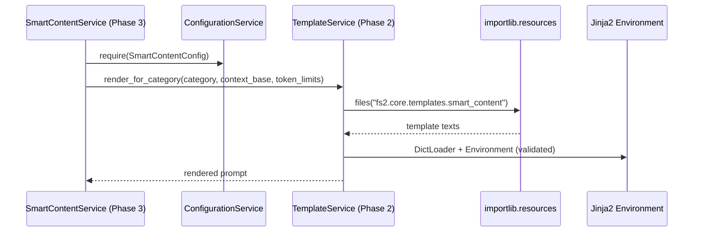

# Phase 2: Template System – Tasks & Alignment Brief

**Spec**: [smart-content-spec.md](../../smart-content-spec.md)  
**Plan**: [smart-content-plan.md](../../smart-content-plan.md)  
**Date**: 2025-12-18

## Executive Briefing

### Purpose
This phase introduces a package-safe Jinja2 template system for Smart Content prompt generation.
It standardizes how we turn a `CodeNode` into a prompt and ensures the correct token limit is injected per category.

### What We’re Building
A `TemplateService` plus a `fs2.core.templates.smart_content` template package that:
- Loads templates via `importlib.resources` (works when installed as a wheel)
- Validates template syntax at initialization
- Maps node categories to template names (per AC11)
- Renders templates with a stable context contract (per AC8), including `max_tokens` from `SmartContentConfig.token_limits`

### User Value
Smart content generation becomes consistent and testable: every node category reliably produces a deterministic prompt shape, and prompt budgets are centralized in config instead of hard-coded across services.

### Example
**Input**: `category="callable"`, `qualified_name="MyClass.my_func"`, `content="def my_func(): ..."`  
**Output**: Rendered prompt from `smart_content_callable.j2` containing `MyClass.my_func` and a `max_tokens` value pulled from config (default `150` for `callable`).

---

## Objectives & Scope

### Objective
Implement the template infrastructure and `TemplateService` so later phases can generate prompts correctly.

### Goals
- ✅ Package templates under `src/fs2/core/templates/smart_content/` and load them via `importlib.resources` (Critical Discovery 04)
- ✅ Provide a `TemplateService` that maps categories→templates (AC11) and renders with required context vars (AC8)
- ✅ Validate templates at initialization and fail early with a service-layer `TemplateError` (Critical Discovery 09)
- ✅ Keep token limit injection config-driven via `SmartContentConfig.token_limits` (Phase 1 dependency)
- ✅ Add/lock `jinja2` as a required dependency installed via `uv` (per repo convention)

### Non-Goals
- ❌ SmartContentService prompt orchestration and LLM calls (Phase 3)
- ❌ Batch processing / worker pool (Phase 4)
- ❌ Relationship context injection (imports/call graphs) in templates (deferred in spec)
- ❌ Prompt quality tuning beyond a sensible baseline (tune later if needed)
- ❌ Repo-wide lint cleanup unrelated to Phase 2 touched files

---

## Architecture Map

### Component Diagram

```mermaid
flowchart TD
    classDef pending fill:#9E9E9E,stroke:#757575,color:#fff
    classDef inprogress fill:#FF9800,stroke:#F57C00,color:#fff
    classDef completed fill:#4CAF50,stroke:#388E3C,color:#fff
    classDef blocked fill:#F44336,stroke:#D32F2F,color:#fff

    style Phase fill:#F5F5F5,stroke:#E0E0E0
    style Files fill:#F5F5F5,stroke:#E0E0E0

    subgraph Phase["Phase 2: Template System"]
        T001["T001: Review Phase 1 exports"]:::pending
        T002["T002: Add Jinja2 dependency + package data"]:::pending
        T003["T003: Add templates package structure"]:::pending
        T004["T004: Write TemplateService init tests"]:::pending
        T005["T005: Write category mapping tests (AC11)"]:::pending
        T006["T006: Write rendering context tests (AC8)"]:::pending
        T007["T007: Implement TemplateService loader + API"]:::pending
        T008["T008: Implement template syntax validation"]:::pending
        T009["T009: Add template files (6)"]:::pending
        T010["T010: Integration test: load+render all templates"]:::pending

        T001 --> T002 --> T003 --> T004 --> T007 --> T008 --> T009 --> T010
        T004 --> T005 --> T007
        T004 --> T006 --> T007
    end

    subgraph Files["Files"]
        F1["/workspaces/flow_squared/pyproject.toml"]:::pending
        F2["/workspaces/flow_squared/uv.lock"]:::pending

        F3["/workspaces/flow_squared/src/fs2/core/templates/__init__.py"]:::pending
        F4["/workspaces/flow_squared/src/fs2/core/templates/smart_content/__init__.py"]:::pending
        F5["/workspaces/flow_squared/src/fs2/core/templates/smart_content/smart_content_file.j2"]:::pending
        F6["/workspaces/flow_squared/src/fs2/core/templates/smart_content/smart_content_type.j2"]:::pending
        F7["/workspaces/flow_squared/src/fs2/core/templates/smart_content/smart_content_callable.j2"]:::pending
        F8["/workspaces/flow_squared/src/fs2/core/templates/smart_content/smart_content_section.j2"]:::pending
        F9["/workspaces/flow_squared/src/fs2/core/templates/smart_content/smart_content_block.j2"]:::pending
        F10["/workspaces/flow_squared/src/fs2/core/templates/smart_content/smart_content_base.j2"]:::pending

        F11["/workspaces/flow_squared/src/fs2/core/services/smart_content/template_service.py"]:::pending
        F12["/workspaces/flow_squared/src/fs2/core/services/smart_content/__init__.py"]:::pending

        F13["/workspaces/flow_squared/tests/unit/services/test_template_service.py"]:::pending
    end

    T002 -.-> F1
    T002 -.-> F2
    T002 -.-> F3
    T002 -.-> F4

    T003 -.-> F3
    T003 -.-> F4

    T004 -.-> F13
    T005 -.-> F13
    T006 -.-> F13

    T007 -.-> F11
    T007 -.-> F12
    T008 -.-> F11

    T009 -.-> F5
    T009 -.-> F6
    T009 -.-> F7
    T009 -.-> F8
    T009 -.-> F9
    T009 -.-> F10

    T010 -.-> F13
    T010 -.-> F5
    T010 -.-> F6
    T010 -.-> F7
    T010 -.-> F8
    T010 -.-> F9
    T010 -.-> F10
```

<!-- Status: grey=pending, orange=in-progress, green=completed, red=blocked -->
<!-- Updated by plan-6 during implementation -->



### Task-to-Component Mapping

<!-- Status: ⬜ Pending | 🟧 In Progress | ✅ Complete | 🔴 Blocked -->

| Task | Component(s) | Files | Status | Comment |
|------|-------------|-------|--------|---------|
| T001 | Alignment | Phase 1 artifacts | ⬜ Pending | Confirm Phase 1 exports (config, exceptions) we build on |
| T002 | Dependencies + Packaging | Packaging | ⬜ Pending | Add `jinja2` and ensure `.j2` templates ship in wheel |
| T003 | Templates Package | Templates | ⬜ Pending | Add Python packages required for `importlib.resources` loading |
| T004 | Tests | TemplateService | ⬜ Pending | TDD: init + loading + missing template + syntax errors |
| T005 | Tests | Mapping | ⬜ Pending | TDD: category→template mapping contract (AC11) |
| T006 | Tests | Rendering | ⬜ Pending | TDD: context variables + `max_tokens` injection (AC8) |
| T007 | Core | TemplateService | ⬜ Pending | Implement loader + mapping + render APIs |
| T008 | Core | Validation | ⬜ Pending | Fail early on invalid templates via `TemplateError` |
| T009 | Templates | Prompt files | ⬜ Pending | Create 6 category templates used by later phases |
| T010 | Integration | End-to-end | ⬜ Pending | Prove all templates load+render with representative contexts |

---

## Tasks

| Status | ID | Task | CS | Type | Dependencies | Absolute Path(s) | Validation | Subtasks | Notes |
|--------|----|------|----|------|--------------|------------------|------------|----------|-------|
| [ ] | T001 | Review Phase 1 deliverables for reuse (SmartContentConfig defaults, `TemplateError` availability, conventions) | 1 | Setup | – | /workspaces/flow_squared/src/fs2/config/objects.py, /workspaces/flow_squared/src/fs2/core/services/smart_content/exceptions.py, /workspaces/flow_squared/docs/plans/008-smart-content/tasks/phase-1-foundation-and-infrastructure/tasks.md, /workspaces/flow_squared/docs/plans/008-smart-content/tasks/phase-1-foundation-and-infrastructure/execution.log.md | Alignment brief includes the reused symbols + constraints to follow | – | Links to prior phase are captured in Alignment Brief |
| [ ] | T002 | Add `jinja2` dependency and ensure templates are included in wheel builds | 3 | Setup | T001 | /workspaces/flow_squared/pyproject.toml, /workspaces/flow_squared/uv.lock | `uv run python -c "import jinja2"` succeeds; templates are declared as package data under Hatch config so `importlib.resources` can read `.j2` | – | Per spec dependency note; per Critical Discovery 04 (package-safe loading) |
| [ ] | T003 | Create templates package structure for `fs2.core.templates.smart_content` | 2 | Core | T002 | /workspaces/flow_squared/src/fs2/core/templates/__init__.py, /workspaces/flow_squared/src/fs2/core/templates/smart_content/__init__.py | `importlib.resources.files(\"fs2.core.templates.smart_content\")` resolves without error | – | Package structure is required before adding `.j2` files |
| [ ] | T004 | Write failing tests: TemplateService init loads templates, raises `TemplateError` for missing templates, validates syntax at init | 3 | Test | T001, T002, T003 | /workspaces/flow_squared/tests/unit/services/test_template_service.py | Tests fail with clear messages until TemplateService exists and enforces validation behavior | – | Per Critical Discovery 04 + 09; errors must be service-layer `TemplateError` (no leaking `jinja2.TemplateNotFound`) |
| [ ] | T005 | Write failing tests: category→template mapping + token limit mapping (AC11) | 2 | Test | T001, T004 | /workspaces/flow_squared/tests/unit/services/test_template_service.py | Tests prove all 9 categories map to correct template name and default token limit per `SmartContentConfig.token_limits` | – | Per AC11 |
| [ ] | T006 | Write failing tests: render contract exposes AC8 context variables and injects `max_tokens` | 2 | Test | T001, T004 | /workspaces/flow_squared/tests/unit/services/test_template_service.py | Tests verify rendered prompt includes key fields and `max_tokens` is present for each category render path | – | Per AC8; keep tests deterministic (no network) |
| [ ] | T007 | Implement TemplateService: load templates via `importlib.resources` + `jinja2.DictLoader`, map categories, render templates | 3 | Core | T004, T005, T006 | /workspaces/flow_squared/src/fs2/core/services/smart_content/template_service.py, /workspaces/flow_squared/src/fs2/core/services/smart_content/__init__.py | All TemplateService unit tests pass; public API does not require filesystem paths | – | Per Critical Discovery 04; follow strict layering (service uses service exceptions only) |
| [ ] | T008 | Implement syntax validation: pre-compile/parse all templates at init; wrap failures as `TemplateError` including template name | 3 | Core | T007 | /workspaces/flow_squared/src/fs2/core/services/smart_content/template_service.py | Dedicated tests prove syntax errors are caught at init (not first render) and surfaced as `TemplateError` | – | Per Critical Discovery 09 |
| [ ] | T009 | Add 6 Jinja2 template files (file/type/callable/section/block/base) with a stable prompt baseline and `max_tokens` placeholder | 2 | Doc | T003 | /workspaces/flow_squared/src/fs2/core/templates/smart_content/smart_content_file.j2, /workspaces/flow_squared/src/fs2/core/templates/smart_content/smart_content_type.j2, /workspaces/flow_squared/src/fs2/core/templates/smart_content/smart_content_callable.j2, /workspaces/flow_squared/src/fs2/core/templates/smart_content/smart_content_section.j2, /workspaces/flow_squared/src/fs2/core/templates/smart_content/smart_content_block.j2, /workspaces/flow_squared/src/fs2/core/templates/smart_content/smart_content_base.j2 | Each template renders for representative context without undefined-variable errors; prompt text references `max_tokens` and primary context vars | – | Keep template content simple and policy-neutral; quality tuning later |
| [ ] | T010 | Write integration test: all templates load and render end-to-end for representative categories | 2 | Integration | T007, T008, T009 | /workspaces/flow_squared/tests/unit/services/test_template_service.py | A single test iterates through template names + categories and asserts render does not raise and includes minimal expected markers | – | Mirrors plan task 2.12; proves package-data + importlib loading |

---

## Alignment Brief

### Prior Phases Review (Phase 1: Foundation & Infrastructure)

This Phase 2 work builds directly on Phase 1’s config + exception layering + model constraints.

**Source artifacts**
- Dossier: `/workspaces/flow_squared/docs/plans/008-smart-content/tasks/phase-1-foundation-and-infrastructure/tasks.md`
- Execution log: `/workspaces/flow_squared/docs/plans/008-smart-content/tasks/phase-1-foundation-and-infrastructure/execution.log.md`

**A) Deliverables Created (Phase 1)**
- Config:
  - `/workspaces/flow_squared/src/fs2/config/objects.py` — `class:fs2.config.objects.SmartContentConfig`
    - Key fields used by Phase 2: `token_limits` (category→tokens) and future `max_workers`/`max_input_tokens`
- Adapter layer:
  - `/workspaces/flow_squared/src/fs2/core/adapters/token_counter_adapter.py` — `TokenCounterAdapter` (ABC)
  - `/workspaces/flow_squared/src/fs2/core/adapters/token_counter_adapter_fake.py` — `FakeTokenCounterAdapter`
  - `/workspaces/flow_squared/src/fs2/core/adapters/token_counter_adapter_tiktoken.py` — `TiktokenTokenCounterAdapter`
  - `/workspaces/flow_squared/src/fs2/core/adapters/exceptions.py` — `TokenCounterError`
- Model layer:
  - `/workspaces/flow_squared/src/fs2/core/models/code_node.py` — required `content_hash` field (frozen dataclass)
- Utilities:
  - `/workspaces/flow_squared/src/fs2/core/utils/hash.py` — `compute_content_hash(text)->sha256`
- Service layer:
  - `/workspaces/flow_squared/src/fs2/core/services/smart_content/exceptions.py` — `SmartContentError`, `TemplateError`, `SmartContentProcessingError`
  - `/workspaces/flow_squared/src/fs2/core/services/smart_content/__init__.py` — exports for later imports

**B) Lessons Learned**
- `uv` needs `UV_CACHE_DIR` set to a workspace-writable directory in this environment (captured in Phase 1 Discoveries table).
- For installed-package compatibility, Phase 2 must not rely on filesystem paths for templates; use `importlib.resources` (Critical Discovery 04).

**C) Technical Discoveries / Gotchas**
- Layering is strict: adapter exceptions remain in adapter layer; service layer defines service exceptions and may wrap adapter errors (Critical Discovery 12).
- `CodeNode` is frozen: later phases must use `dataclasses.replace()` for updates (Critical Discovery 03).

**D) Dependencies Exported (Phase 1 → Phase 2)**
- `SmartContentConfig.token_limits` is the single source of truth for per-category token limits (used by TemplateService render paths in Phase 2).
- `TemplateError` exists as the service-layer template failure type (Phase 2 should raise this, not `jinja2` exceptions).

**E) Critical Findings Applied in Phase 1**
- CD01/02/03/05/12 were implemented or codified via Phase 1 tasks; Phase 2 must maintain the same conventions and boundaries.

**F) Incomplete/Blocked Items**
- None for Phase 1 dossier tasks; Phase 1 is marked complete in plan checklist.

**G) Test Infrastructure**
- Repo uses `tests/unit/...` structure and ruff for import sorting; Phase 2 tests should follow the same pattern.

**H) Technical Debt**
- None introduced intentionally for Phase 1 that impacts Phase 2; Phase 2 should avoid adding filesystem-path template loading which would create packaging debt.

**I) Architectural Decisions**
- Prefer factories for `CodeNode`; allow direct constructors in tests only when the test’s purpose is dataclass structure coverage.
- “Plan footnotes ledger is authority”: every touched file should be represented in plan ledger and mirrored in dossier stubs during implementation updates.

**J) Scope Changes**
- None recorded for Phase 1 that alter Phase 2 requirements.

**K) Key Log References**
- `docs/plans/008-smart-content/tasks/phase-1-foundation-and-infrastructure/execution.log.md#task-t002-implement-smartcontentconfig`
- `docs/plans/008-smart-content/tasks/phase-1-foundation-and-infrastructure/execution.log.md#task-t011-smart-content-exceptions`

### Critical Findings Affecting This Phase
- **Critical Discovery 04: Jinja2 Template Loading from Package**
  - Constraint: no filesystem template paths; use `importlib.resources` + `jinja2.DictLoader`.
  - Addressed by: T003, T007, T010.
- **Critical Discovery 09: Template validation at init**
  - Constraint: syntax errors detected at initialization (fail early), not at first render.
  - Addressed by: T004, T008.
- **Critical Discovery 12: Exception translation boundary**
  - Constraint: Template failures should surface as service-layer `TemplateError`.
  - Addressed by: T004, T007, T008.

### ADR Decision Constraints
- N/A (no feature-relevant ADRs found under `/workspaces/flow_squared/docs/adr/`).

### Invariants & Guardrails
- Templates must be loadable from package resources in an installed wheel environment.
- Template rendering must be deterministic and offline-safe (no network calls).
- Template selection and token limits are contract-driven via tests (AC8/AC11).
- Do not introduce new architecture patterns; follow established repo conventions.

### Inputs to Read (Exact Paths)
- `/workspaces/flow_squared/docs/plans/008-smart-content/smart-content-spec.md` (AC8, AC11)
- `/workspaces/flow_squared/docs/plans/008-smart-content/smart-content-plan.md` (Phase 2 tasks + Critical Discoveries 04/09/12)
- `/workspaces/flow_squared/src/fs2/config/objects.py` (`SmartContentConfig.token_limits`)
- `/workspaces/flow_squared/src/fs2/core/services/smart_content/exceptions.py` (`TemplateError`)

### Visual Alignment Aids

```mermaid
flowchart LR
    A[CodeNode] --> B[Category→Template mapping]
    B --> C[Resolve max_tokens via SmartContentConfig.token_limits]
    C --> D[Build render context (AC8)]
    D --> E[TemplateService.render(...)]
    E --> F[Rendered prompt string]
```



### Test Plan (Full TDD, targeted mocks)
Planned tests in `/workspaces/flow_squared/tests/unit/services/test_template_service.py`:
- `test_given_template_service_when_constructed_then_loads_all_required_templates`
- `test_given_missing_template_when_constructed_then_raises_template_error`
- `test_given_invalid_template_syntax_when_constructed_then_raises_template_error`
- `test_given_category_when_resolving_template_then_matches_ac11_mapping`
- `test_given_category_when_resolving_max_tokens_then_uses_smart_content_config_defaults`
- `test_given_required_context_vars_when_rendering_then_all_ac8_vars_are_supported`
- `test_given_all_templates_when_rendering_then_no_template_raises` (integration-style loop)

### Step-by-Step Implementation Outline (maps 1:1 to tasks)
- T001: Confirm which Phase 1 exports are the canonical sources for Phase 2 (config + exceptions).
- T002–T003: Add `jinja2` and ensure templates are distributable and importable as package resources.
- T004–T006: Lock TemplateService contract via failing tests (loading, mapping, rendering).
- T007–T008: Implement TemplateService (loader + API + validation) to satisfy tests.
- T009–T010: Add actual `.j2` templates and prove they render end-to-end.

### Commands to Run (copy/paste)
- `export UV_CACHE_DIR=/workspaces/flow_squared/.uv_cache`
- `UV_CACHE_DIR=/workspaces/flow_squared/.uv_cache uv run pytest -q /workspaces/flow_squared/tests/unit/services/test_template_service.py`
- `UV_CACHE_DIR=/workspaces/flow_squared/.uv_cache uv run ruff check /workspaces/flow_squared/src/fs2/core/services/smart_content/template_service.py /workspaces/flow_squared/tests/unit/services/test_template_service.py`
- `UV_CACHE_DIR=/workspaces/flow_squared/.uv_cache just test-unit`

### Risks / Unknowns
- **Packaging risk (severity: high)**: `.j2` templates may not be included in wheel unless explicitly declared in Hatch config.
  - Mitigation: T002 includes package-data wiring + a test that reads templates via `importlib.resources`.
- **Undefined variables (severity: medium)**: Jinja2’s default undefined behavior may hide missing context vars.
  - Mitigation: configure Jinja2 with strict undefined behavior (or explicit checks) and lock it with tests in T006.

### Ready Check (await explicit GO/NO-GO)
- [ ] Phase objective and non-goals accepted
- [ ] Critical findings mapped to tasks (T003/T007/T008 explicitly reference CD04/CD09/CD12)
- [ ] Tasks include absolute paths and measurable validation
- [ ] ADR constraints mapped to tasks (N/A)
- [ ] No time estimates or duration language present

---

## Phase Footnote Stubs

_Populated during implementation by plan-6._

| ID | Footnote | Type | Affects | Notes |
|----|----------|------|---------|-------|
| | | | | |

---

## Evidence Artifacts

- Execution log (written by plan-6): `/workspaces/flow_squared/docs/plans/008-smart-content/tasks/phase-2-template-system/execution.log.md`
- This dossier: `/workspaces/flow_squared/docs/plans/008-smart-content/tasks/phase-2-template-system/tasks.md`

---

## Discoveries & Learnings

_Populated during implementation by plan-6. Log anything of interest to your future self._

| Date | Task | Type | Discovery | Resolution | References |
|------|------|------|-----------|------------|------------|
| | | | | | |

**Types**: `gotcha` | `research-needed` | `unexpected-behavior` | `workaround` | `decision` | `debt` | `insight`

**What to log**:
- Things that didn’t work as expected
- External research that was required
- Implementation troubles and how they were resolved
- Gotchas and edge cases discovered
- Decisions made during implementation
- Technical debt introduced (and why)
- Insights that future phases should know about

_See also: `execution.log.md` for detailed narrative._

---

## Directory Layout

```
docs/plans/008-smart-content/
  ├── smart-content-plan.md
  ├── smart-content-spec.md
  └── tasks/
      ├── phase-1-foundation-and-infrastructure/
      │   ├── tasks.md
      │   └── execution.log.md
      └── phase-2-template-system/
          ├── tasks.md
          └── execution.log.md  # created by /plan-6
```
