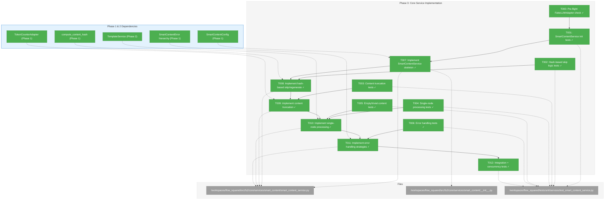
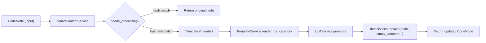
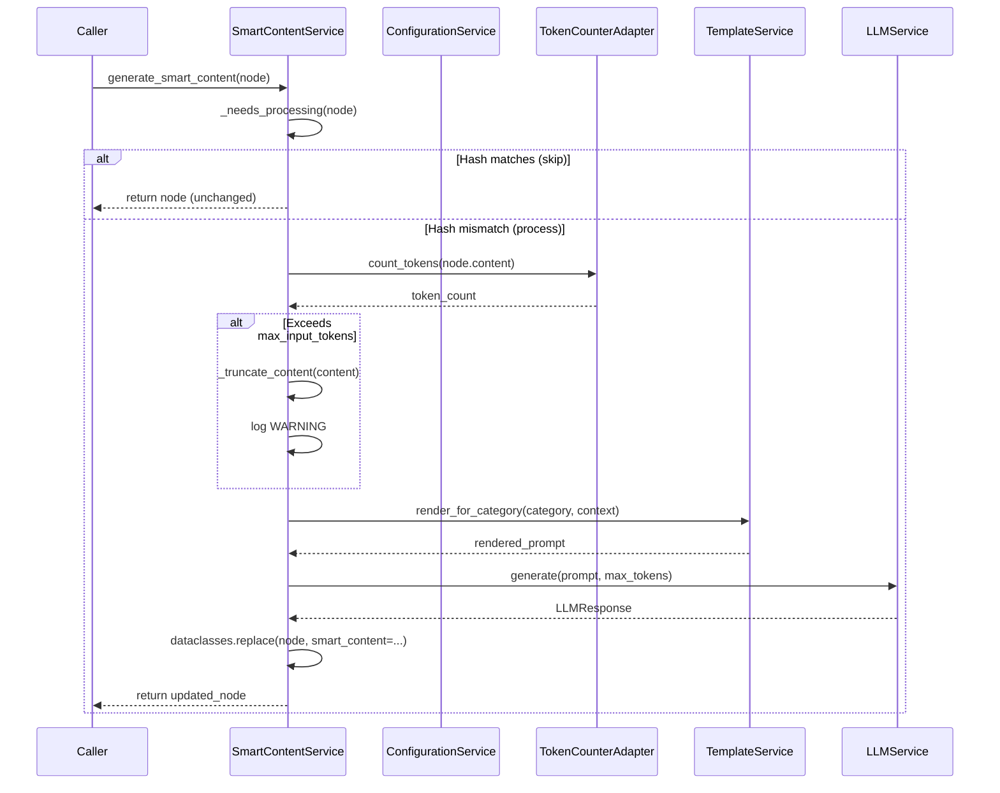

# Phase 3: Core Service Implementation – Tasks & Alignment Brief

**Spec**: [smart-content-spec.md](../../smart-content-spec.md)
**Plan**: [smart-content-plan.md](../../smart-content-plan.md)
**Date**: 2025-12-18

---

## Executive Briefing

### Purpose
This phase implements the core SmartContentService that orchestrates LLM-based summary generation for individual code nodes. It bridges the foundation (Phase 1: config, hashing, token counting) with templates (Phase 2: TemplateService) to produce the actual smart content that makes code searchable and understandable.

### What We're Building
A `SmartContentService` class that:
- Accepts `ConfigurationService` and calls `config.require(SmartContentConfig)` internally (per CD01)
- Composes `LLMService`, `TemplateService`, and `TokenCounterAdapter` via dependency injection
- Implements hash-based skip logic (AC5): skip regeneration when `content_hash` matches
- Implements hash-based regeneration (AC6): regenerate when content has changed
- Truncates large content at configurable token limits (AC13) with WARNING logging
- Handles empty/trivial content gracefully (per CD08)
- Uses per-error-type handling strategies (per CD07): auth errors fail batch, rate limits retry, content filters fallback
- Returns new `CodeNode` instances with populated `smart_content` (frozen dataclass immutability per CD03)

### User Value
Developers get AI-generated summaries for any code node, enabling:
- Semantic code search beyond keyword matching
- Instant context when exploring unfamiliar codebases
- Better understanding of code purpose without reading implementation details

### Example
**Input**: `CodeNode(category="callable", name="calculate_total", content="def calculate_total(items): ...")`
**Process**: TemplateService renders prompt → LLMService generates summary → service returns updated node
**Output**: `CodeNode(..., smart_content="Calculates the total price of items in a shopping cart by summing individual prices.", content_hash="abc123...")`

---

## Objectives & Scope

### Objective
Implement SmartContentService with hash-based regeneration, truncation, and LLM integration, satisfying AC5, AC6, AC8, AC9, AC10, and AC13 from the spec.

### Goals
- ✅ Create SmartContentService following Clean Architecture DI patterns (AC9)
- ✅ Implement hash-based skip logic for unchanged nodes (AC5)
- ✅ Implement hash-based regeneration for changed nodes (AC6)
- ✅ Integrate with TemplateService for prompt generation (AC8 context variables)
- ✅ Implement token-based content truncation with WARNING logging (AC13)
- ✅ Handle empty/trivial content gracefully (per CD08)
- ✅ Implement per-error-type handling strategies (per CD07)
- ✅ Enable FakeLLMAdapter integration for testing (AC10)
- ✅ Return new CodeNode instances (frozen dataclass immutability per CD03)

### Non-Goals (Scope Boundaries)
- ❌ Batch processing with worker pool (Phase 4) — this phase handles single-node processing only
- ❌ CLI integration (Phase 5) — service layer only
- ❌ Graph data storage/retrieval — service is stateless, caller handles persistence
- ❌ Retry logic for transient failures — simple error handling; advanced retry deferred
- ❌ Streaming LLM responses — complete responses only per spec
- ❌ Cost tracking/budgeting — token usage noted but not enforced

---

## Architecture Map

### Component Diagram
<!-- Status: grey=pending, orange=in-progress, green=completed, red=blocked -->
<!-- Updated by plan-6 during implementation -->



### Task-to-Component Mapping

<!-- Status: ⬜ Pending | 🟧 In Progress | ✅ Complete | 🔴 Blocked -->

| Task | Component(s) | Files | Status | Comment |
|------|-------------|-------|--------|---------|
| T000 | Setup | `/workspaces/flow_squared/src/fs2/core/adapters/llm_adapter_fake.py` | ✅ Complete | Pre-flight: added set_delay() method |
| T001 | Tests | `/workspaces/flow_squared/tests/unit/services/test_smart_content_service.py` | ✅ Complete | DI pattern, config extraction, template validation |
| T002 | Tests | `/workspaces/flow_squared/tests/unit/services/test_smart_content_service.py` | ✅ Complete | AC5 skip when hash matches, AC6 regenerate when mismatch |
| T003 | Tests | `/workspaces/flow_squared/tests/unit/services/test_smart_content_service.py` | ✅ Complete | AC13 truncation at token limit, WARNING log, marker |
| T004 | Tests | `/workspaces/flow_squared/tests/unit/services/test_smart_content_service.py` | ✅ Complete | Prompt generation, LLM call, result storage |
| T005 | Tests | `/workspaces/flow_squared/tests/unit/services/test_smart_content_service.py` | ✅ Complete | Skip empty nodes, placeholder smart_content per CD08 |
| T006 | Tests | `/workspaces/flow_squared/tests/unit/services/test_smart_content_service.py` | ✅ Complete | Auth error fails, rate limit retries, filter fallback per CD07 |
| T007 | Core | `/workspaces/flow_squared/src/fs2/core/services/smart_content/smart_content_service.py` | ✅ Complete | Constructor with DI, config extraction per CD01 |
| T008 | Core | `/workspaces/flow_squared/src/fs2/core/services/smart_content/smart_content_service.py` | ✅ Complete | Hash comparison and regeneration decision logic |
| T009 | Core | `/workspaces/flow_squared/src/fs2/core/services/smart_content/smart_content_service.py` | ✅ Complete | TokenCounter integration, truncation with marker |
| T010 | Core | `/workspaces/flow_squared/src/fs2/core/services/smart_content/smart_content_service.py` | ✅ Complete | TemplateService + LLMService orchestration |
| T011 | Core | `/workspaces/flow_squared/src/fs2/core/services/smart_content/smart_content_service.py` | ✅ Complete | Exception translation, per-type handling |
| T012 | Integration | `/workspaces/flow_squared/tests/unit/services/test_smart_content_service.py` | ✅ Complete | End-to-end + concurrency verification (AC10, CD06b) |

---

## Tasks

| Status | ID | Task | CS | Type | Dependencies | Absolute Path(s) | Validation | Subtasks | Notes |
|--------|----|------|----|------|--------------|------------------|------------|----------|-------|
| [x] | T000 | **Pre-flight check**: Verify FakeLLMAdapter (007-llm-service) supports required capabilities: `set_response()`, `set_delay()`, error injection (`LLMAuthenticationError`, `LLMRateLimitError`, `LLMContentFilterError`), call history capture. If missing, extend or coordinate. | 1 | Setup | – | /workspaces/flow_squared/src/fs2/core/adapters/llm_adapter_fake.py | FakeLLMAdapter has all required methods; if not, create extension or file dependency | – | [📋](execution.log.md#task-t000-pre-flight-fakellmadapter-check) [^27] Pre-Phase 3 verification; blocks T004, T006, T012 |
| [x] | T001 | Write failing tests for SmartContentService initialization: DI pattern, config extraction via `config.require(SmartContentConfig)`, template validation at init | 2 | Test | T000 | /workspaces/flow_squared/tests/unit/services/test_smart_content_service.py | Tests assert constructor accepts ConfigurationService, LLMService, TemplateService, TokenCounterAdapter; config extracted internally; TemplateError raised if templates invalid | – | [📋](execution.log.md#task-t001-t006-t012) [^20] Plan §Phase 3 task 3.1; Per Critical Discovery 01 |
| [x] | T002 | Write failing tests for hash-based skip logic (AC5) and regeneration (AC6): no LLM call when `content_hash == smart_content_hash`, LLM called when mismatch, `smart_content_hash` updated to match `content_hash` after generation | 3 | Test | – | /workspaces/flow_squared/tests/unit/services/test_smart_content_service.py | Tests verify: (1) skip when `content_hash == smart_content_hash` returns original node + zero LLM calls, (2) mismatch or None `smart_content_hash` triggers LLM call + returns node with updated `smart_content` and `smart_content_hash = content_hash` | – | [📋](execution.log.md#task-t001-t006-t012) [^20] Plan §Phase 3 task 3.2; Critical AC5/AC6; Requires `smart_content_hash` field (Phase 1 follow-up) |
| [x] | T003 | Write failing tests for content truncation (AC13): truncate at `max_input_tokens`, add `[TRUNCATED]` marker **to prompt content only** (not to smart_content result), log WARNING with node_id and original token count | 2 | Test | – | /workspaces/flow_squared/tests/unit/services/test_smart_content_service.py | Tests verify: (1) content exceeding limit is truncated, (2) `[TRUNCATED]` marker present **in prompt sent to LLM**, (3) marker **NOT present** in resulting smart_content, (4) WARNING logged with correct info | – | [📋](execution.log.md#task-t001-t006-t012) [^20] Plan §Phase 3 task 3.3; Uses TokenCounterAdapter |
| [x] | T004 | Write failing tests for single-node processing: prompt generation via TemplateService, LLM call via LLMService, result stored in new CodeNode, **empty LLM response raises SmartContentProcessingError** | 3 | Test | – | /workspaces/flow_squared/tests/unit/services/test_smart_content_service.py | Tests verify: (1) TemplateService.render_for_category called with correct context, (2) LLMService.generate called with rendered prompt, (3) returned node has smart_content populated, (4) **empty/whitespace LLM response raises SmartContentProcessingError** (hash not set, retry-friendly) | – | [📋](execution.log.md#task-t001-t006-t012) [^20] Plan §Phase 3 task 3.4; Uses FakeLLMAdapter |
| [x] | T005 | Write failing tests for empty/trivial content handling: skip nodes with empty/whitespace-only content, set placeholder smart_content | 2 | Test | – | /workspaces/flow_squared/tests/unit/services/test_smart_content_service.py | Tests verify: (1) empty content skips LLM call, (2) trivial content (<10 chars) skips LLM call, (3) placeholder text set on returned node | – | [📋](execution.log.md#task-t001-t006-t012) [^20] Plan §Phase 3 task 3.5; Per Critical Discovery 08 |
| [x] | T006 | Write failing tests for error handling strategies: LLMAuthenticationError fails batch, LLMRateLimitError triggers retry, LLMContentFilterError returns fallback text | 2 | Test | – | /workspaces/flow_squared/tests/unit/services/test_smart_content_service.py | Tests verify per-error-type behavior: (1) auth error re-raised, (2) rate limit retried (or logged), (3) content filter returns "[Content filtered]" placeholder | – | [📋](execution.log.md#task-t001-t006-t012) [^20] Plan §Phase 3 task 3.6; Per Critical Discovery 07 |
| [x] | T007 | Implement SmartContentService skeleton: constructor with DI pattern accepting ConfigurationService, LLMService, TemplateService, TokenCounterAdapter; extract config internally | 2 | Core | T001 | /workspaces/flow_squared/src/fs2/core/services/smart_content/smart_content_service.py, /workspaces/flow_squared/src/fs2/core/services/smart_content/__init__.py | All T001 tests pass; service follows Clean Architecture patterns; no direct SDK imports | – | [📋](execution.log.md#task-t007-t011) [^21] Plan §Phase 3 task 3.7; Per Critical Discovery 01 |
| [x] | T008 | Implement hash-based skip/regenerate logic: compare `node.content_hash` with `node.smart_content_hash`; skip if equal, regenerate if mismatch or `smart_content_hash` is None; set `smart_content_hash = content_hash` after generation | 3 | Core | T002, T007 | /workspaces/flow_squared/src/fs2/core/services/smart_content/smart_content_service.py | All T002 tests pass; implements `_needs_processing(node)` method returning bool; returned node has `smart_content_hash` set | – | [📋](execution.log.md#task-t007-t011) [^22] Plan §Phase 3 task 3.8; AC5/AC6 implementation; Requires `smart_content_hash` field |
| [x] | T009 | Implement content truncation: use TokenCounterAdapter to count tokens, truncate content exceeding `max_input_tokens`, add `[TRUNCATED]` marker **to truncated content** (so LLM knows it's incomplete), log WARNING | 2 | Core | T003, T007 | /workspaces/flow_squared/src/fs2/core/services/smart_content/smart_content_service.py | All T003 tests pass; implements `_truncate_content(content, node_id)` method; marker in prompt content only, NOT in resulting smart_content | – | [📋](execution.log.md#task-t007-t011) [^23] Plan §Phase 3 task 3.9; AC13 implementation |
| [x] | T010 | Implement single-node `generate_smart_content(node)` method: build context from CodeNode, render prompt via TemplateService, call LLMService.generate, **validate non-empty response**, return updated CodeNode using `dataclasses.replace()` | 3 | Core | T004, T005, T008, T009 | /workspaces/flow_squared/src/fs2/core/services/smart_content/smart_content_service.py | All T004 and T005 tests pass; returns new CodeNode instance (frozen immutability); orchestrates TemplateService + LLMService; **raises SmartContentProcessingError if LLM returns empty/whitespace** | – | [📋](execution.log.md#task-t007-t011) [^24] Plan §Phase 3 task 3.10; Per Critical Discovery 03, 10 |
| [x] | T011 | Implement error handling strategies: catch LLMAdapterError subtypes, apply per-type handling (auth → re-raise, rate limit → log warning, content filter → fallback text), wrap in SmartContentProcessingError where appropriate | 2 | Core | T006, T010 | /workspaces/flow_squared/src/fs2/core/services/smart_content/smart_content_service.py | All T006 tests pass; exception layering respected (no SDK exceptions leak); service catches only domain exceptions | – | [📋](execution.log.md#task-t007-t011) [^25] Plan §Phase 3 task 3.11; Per Critical Discovery 07, 12 |
| [x] | T012 | Write integration test with FakeLLMAdapter: (1) end-to-end single node processing from CodeNode → prompt → FakeLLMAdapter response → updated CodeNode with smart_content; (2) **concurrency verification test** using `set_delay()` + `asyncio.gather()` to prove LLM calls don't serialize (per CD06b) | 3 | Integration | T010, T011 | /workspaces/flow_squared/tests/unit/services/test_smart_content_service.py | Integration test passes; verifies AC10 FakeLLMAdapter integration; captures prompt sent and verifies response stored; **concurrency test asserts elapsed < sequential time** (e.g., 5 calls with 0.1s delay complete in <0.25s) | – | [📋](execution.log.md#task-t001-t006-t012) [^26] Plan §Phase 3 task 3.12; AC10 verification; CD06b async verification |

---

## Alignment Brief

### Prior Phases Review

#### Phase 1: Foundation & Infrastructure (Complete)

**Source Artifacts**:
- Dossier: `/workspaces/flow_squared/docs/plans/008-smart-content/tasks/phase-1-foundation-and-infrastructure/tasks.md`
- Execution log: `/workspaces/flow_squared/docs/plans/008-smart-content/tasks/phase-1-foundation-and-infrastructure/execution.log.md`

**A) Deliverables Created (Phase 1)**
- **Configuration**: `/workspaces/flow_squared/src/fs2/config/objects.py` — `SmartContentConfig` class with:
  - `max_workers: int = 50` (used in Phase 4)
  - `max_input_tokens: int = 50000` (used in this phase for truncation)
  - `token_limits: dict[str, int]` (9 categories, used by TemplateService)
  - `__config_path__ = "smart_content"` (YAML/env binding)

- **Token Counting Adapter**:
  - `/workspaces/flow_squared/src/fs2/core/adapters/token_counter_adapter.py` — `TokenCounterAdapter` ABC
  - `/workspaces/flow_squared/src/fs2/core/adapters/token_counter_adapter_fake.py` — `FakeTokenCounterAdapter`
  - `/workspaces/flow_squared/src/fs2/core/adapters/token_counter_adapter_tiktoken.py` — `TiktokenTokenCounterAdapter`

- **Hash Utilities**:
  - `/workspaces/flow_squared/src/fs2/core/utils/hash.py` — `compute_content_hash(content: str) -> str`

- **CodeNode Model**:
  - `/workspaces/flow_squared/src/fs2/core/models/code_node.py` — Required `content_hash` field on frozen dataclass

- **Exception Hierarchy**:
  - `/workspaces/flow_squared/src/fs2/core/adapters/exceptions.py` — `TokenCounterError`
  - `/workspaces/flow_squared/src/fs2/core/services/smart_content/exceptions.py` — `SmartContentError`, `TemplateError`, `SmartContentProcessingError`

**B) Lessons Learned (Phase 1)**
- `uv` needs `UV_CACHE_DIR` set to workspace-writable directory
- `tiktoken` encoder caching is critical for performance (cached at adapter init)
- `content_hash` made required from day one, forcing comprehensive call-site migration but eliminating `None` handling complexity
- Strict exception layering: adapter exceptions stay in adapter layer, service exceptions wrap them

**C) Technical Discoveries / Gotchas (Phase 1)**
- Frozen dataclass field addition breaks all direct constructors → migrate to factories
- YAML config path must exactly match `__config_path__` or binding fails silently
- tiktoken can trigger network fetches → tests use monkeypatched fake module

**D) Dependencies Exported (Phase 1 → Phase 3)**
- `SmartContentConfig.max_input_tokens` — truncation threshold (default 50000)
- `SmartContentConfig.token_limits` — per-category token budgets
- `TokenCounterAdapter.count_tokens(text)` — token counting interface
- `compute_content_hash(content)` — deterministic SHA-256 for hash comparison
- `SmartContentProcessingError` — exception type for processing failures

**E) Test Infrastructure (Phase 1)**
- `FakeTokenCounterAdapter` with configurable returns and call history
- 71 tests passing across config, adapters, models, and services

**⚠️ Phase 1 Follow-Up Required (Pre-Phase 3)**
- **Add `smart_content_hash: str | None` field to CodeNode** — required for proper AC5/AC6 hash comparison
- This field stores the `content_hash` value at the time `smart_content` was generated
- Skip logic: `content_hash == smart_content_hash` → no regeneration needed
- Regenerate logic: `content_hash != smart_content_hash` OR `smart_content_hash is None`
- Decision: Made during /didyouknow session 2025-12-18

---

#### Phase 2: Template System (Complete)

**Source Artifacts**:
- Dossier: `/workspaces/flow_squared/docs/plans/008-smart-content/tasks/phase-2-template-system/tasks.md`
- Execution log: `/workspaces/flow_squared/docs/plans/008-smart-content/tasks/phase-2-template-system/execution.log.md`

**A) Deliverables Created (Phase 2)**
- **TemplateService**: `/workspaces/flow_squared/src/fs2/core/services/smart_content/template_service.py`
  - `TemplateService.render_for_category(category, context)` — primary API
  - `TemplateService.resolve_template_name(category)` — category→template mapping
  - `TemplateService.resolve_max_tokens(category)` — category→token limit

- **Templates**: `/workspaces/flow_squared/src/fs2/core/templates/smart_content/`
  - `smart_content_file.j2` (200 tokens)
  - `smart_content_type.j2` (200 tokens)
  - `smart_content_callable.j2` (150 tokens)
  - `smart_content_section.j2` (150 tokens)
  - `smart_content_block.j2` (150 tokens)
  - `smart_content_base.j2` (fallback, 100-150 tokens)

**B) Lessons Learned (Phase 2)**
- Hatchling wheel build requires explicit include rules for `.j2` files
- `importlib.resources.files()` + `jinja2.DictLoader` pattern works for installed packages
- `StrictUndefined` ensures missing context variables fail loudly (not silently)

**C) Technical Discoveries / Gotchas (Phase 2)**
- Templates can be present in source tree but missing from installed wheel without proper packaging config
- Jinja2's default undefined behavior hides missing variables → must use strict undefined

**D) Dependencies Exported (Phase 2 → Phase 3)**
- `TemplateService.render_for_category(category, context)` — renders prompt for node category
- AC8 Context Contract (required fields):
  ```python
  {
      "name": str,              # Node name
      "qualified_name": str,    # Fully-qualified name
      "category": str,          # Node category
      "ts_kind": str,           # Tree-sitter kind
      "language": str,          # Source language
      "content": str,           # Raw source code
      "signature": str,         # Method/function signature
      "max_tokens": int,        # Injected from config
  }
  ```
- `TemplateError` for template rendering failures

**E) Test Infrastructure (Phase 2)**
- 8 tests passing for TemplateService
- Tests use `FakeConfigurationService` pattern

---

#### Cross-Phase Synthesis

**Cumulative Dependencies Available to Phase 3**:
| From | Component | Import Path | Usage |
|------|-----------|-------------|-------|
| Phase 1 | `SmartContentConfig` | `fs2.config.objects` | Config extraction via `config.require()` |
| Phase 1 | `TokenCounterAdapter` | `fs2.core.adapters` | Token counting for truncation |
| Phase 1 | `FakeTokenCounterAdapter` | `fs2.core.adapters` | Test double for token counting |
| Phase 1 | `compute_content_hash` | `fs2.core.utils.hash` | Hash comparison for skip logic |
| Phase 1 | `SmartContentProcessingError` | `fs2.core.services.smart_content.exceptions` | Processing failure exception |
| Phase 2 | `TemplateService` | `fs2.core.services.smart_content.template_service` | Prompt rendering |
| Phase 2 | `TemplateError` | `fs2.core.services.smart_content.exceptions` | Template failure exception |
| External | `LLMService` | `fs2.core.services.llm_service` | LLM generation (from 007-llm-service) |
| External | `FakeLLMAdapter` | `fs2.core.adapters.llm_adapter_fake` | Test double for LLM calls |

**Pattern Evolution**:
- Phase 1 established DI pattern with `ConfigurationService.require()`
- Phase 2 applied same pattern to `TemplateService`
- Phase 3 continues pattern: `SmartContentService` accepts `ConfigurationService` and extracts `SmartContentConfig` internally

**Reusable Test Infrastructure**:
- `FakeTokenCounterAdapter` (Phase 1) — configurable token counts, call history
- `FakeConfigurationService` (repo-wide) — isolated config injection
- `FakeLLMAdapter` (007-llm-service) — configurable LLM responses

**Architectural Continuity**:
- Services compose adapters via DI (never direct SDK access)
- Exception translation at adapter boundary (SDK exceptions → domain exceptions)
- Frozen dataclass immutability (use `dataclasses.replace()` for updates)
- Config binding via `__config_path__` matching YAML keys

---

### Critical Findings Affecting This Phase

| Finding | What It Constrains / Requires | Addressed By |
|---------|-------------------------------|--------------|
| **CD 01: ConfigurationService Registry Pattern** | SmartContentService must accept `ConfigurationService` and call `config.require(SmartContentConfig)` internally | T001, T007 |
| **CD 03: Frozen Dataclass Immutability** | CodeNode is frozen; use `dataclasses.replace()` to create new instances with `smart_content` populated | T004, T010 |
| **CD 06b: Event Loop Blocking Prevention** | LLM calls must be truly async; no blocking calls inside async methods (affects Phase 4 more, but Phase 3 must use async LLMService) | T010 |
| **CD 07: LLM Error Handling Strategy** | Per-error-type handling: auth fails batch, rate limit retries/logs, content filter fallback | T006, T011 |
| **CD 08: Empty Content Edge Case** | Pre-processing validation skips empty/trivial nodes; set placeholder smart_content | T005, T010 |
| **CD 10: Concurrency and Deterministic Processing** | Service is stateless; returns new node instances; caller handles storage | T010 |
| **CD 11: Graph Data Access Prohibition** | No graph data caching; service receives nodes, processes them, returns results | T007 |
| **CD 12: Exception Translation Boundary** | Services catch domain exceptions only (e.g., `LLMAdapterError`), never SDK exceptions; may wrap in `SmartContentProcessingError` | T006, T011 |

### ADR Decision Constraints
N/A (no feature-relevant ADRs found under `/workspaces/flow_squared/docs/adr/`).

### Invariants & Guardrails
- Services follow strict dependency flow: CLI → services → adapters/repos (per repo rules)
- SmartContentService is stateless: receives nodes, processes, returns new instances
- No direct imports from external SDKs (tiktoken, OpenAI) in service layer
- `CodeNode` remains immutable; updates via `dataclasses.replace()`
- All async methods must be truly async (no blocking calls that serialize workers)
- Token counting uses adapter (not direct tiktoken import in service)
- Exception layering: adapter exceptions caught and wrapped, not re-exported

### Inputs to Read (Exact Paths)
- `/workspaces/flow_squared/docs/plans/008-smart-content/smart-content-spec.md` (AC5, AC6, AC8, AC9, AC10, AC13)
- `/workspaces/flow_squared/docs/plans/008-smart-content/smart-content-plan.md` (Phase 3 tasks + Critical Discoveries)
- `/workspaces/flow_squared/src/fs2/config/objects.py` (`SmartContentConfig`)
- `/workspaces/flow_squared/src/fs2/core/services/smart_content/template_service.py` (`TemplateService` API)
- `/workspaces/flow_squared/src/fs2/core/services/smart_content/exceptions.py` (exception hierarchy)
- `/workspaces/flow_squared/src/fs2/core/adapters/token_counter_adapter.py` (`TokenCounterAdapter` ABC)
- `/workspaces/flow_squared/src/fs2/core/utils/hash.py` (`compute_content_hash`)
- `/workspaces/flow_squared/src/fs2/core/models/code_node.py` (`CodeNode` with `content_hash`)

### Visual Alignment Aids

#### Flow (data + responsibilities)


#### Sequence (expected interaction order)


### Test Plan (Full TDD; fakes over mocks)

All tests in `/workspaces/flow_squared/tests/unit/services/test_smart_content_service.py`:

| Test Name | Purpose | Fixtures | Expected Output |
|-----------|---------|----------|-----------------|
| `test_given_service_when_constructed_then_extracts_config_internally` | Proves CD01 registry pattern | FakeConfigurationService | Config extracted via `require()` |
| `test_given_matching_hash_when_processing_then_skips_llm_call` | Proves AC5 skip logic | FakeLLMAdapter, node with matching hash | Original node returned, 0 LLM calls |
| `test_given_mismatched_hash_when_processing_then_regenerates` | Proves AC6 regeneration | FakeLLMAdapter, node with old hash | New node with updated smart_content |
| `test_given_large_content_when_processing_then_truncates_with_marker` | Proves AC13 truncation | FakeTokenCounterAdapter, large content | `[TRUNCATED]` in prompt content (NOT in smart_content), WARNING logged |
| `test_given_empty_content_when_processing_then_skips_with_placeholder` | Proves CD08 empty handling | Empty content node | Placeholder smart_content, 0 LLM calls |
| `test_given_trivial_content_when_processing_then_skips_with_placeholder` | Proves CD08 trivial handling | <10 chars content | Placeholder smart_content, 0 LLM calls |
| `test_given_auth_error_when_processing_then_raises` | Proves CD07 auth handling | FakeLLMAdapter raising auth error | LLMAuthenticationError re-raised |
| `test_given_content_filter_when_processing_then_returns_fallback` | Proves CD07 filter handling | FakeLLMAdapter raising filter error | Node with "[Content filtered]" |
| `test_given_empty_llm_response_when_processing_then_raises_error` | Proves empty response handling | FakeLLMAdapter returning "" or "   " | SmartContentProcessingError raised, hash not set |
| `test_given_node_when_processing_then_renders_correct_context` | Proves AC8 context | FakeLLMAdapter, node with all fields | Context includes all AC8 variables |
| `test_given_node_when_processing_then_returns_new_instance` | Proves CD03 immutability | Any valid node | New CodeNode instance returned |
| `test_integration_end_to_end_with_fake_llm` | Proves AC10 | FakeLLMAdapter with set_response | Full flow works, prompt captured |
| `test_concurrent_processing_does_not_serialize` | Proves CD06b async | FakeLLMAdapter with set_delay(0.1), 5 nodes | 5 calls complete in <0.25s (not ~0.5s) |

### Step-by-Step Implementation Outline (maps 1:1 to tasks)
1. **T001 → T007**: Lock service initialization contract via tests, then implement skeleton
2. **T002 → T008**: Lock hash-based skip/regenerate behavior via tests, then implement
3. **T003 → T009**: Lock truncation behavior via tests, then implement
4. **T004 + T005 → T010**: Lock single-node processing behavior via tests, then implement orchestration
5. **T006 → T011**: Lock error handling behavior via tests, then implement
6. **T012**: Integration test proving full flow with FakeLLMAdapter

### Commands to Run (copy/paste)
```bash
# Environment setup (required for uv in this devcontainer)
export UV_CACHE_DIR=/workspaces/flow_squared/.uv_cache

# Run Phase 3 tests
UV_CACHE_DIR=/workspaces/flow_squared/.uv_cache uv run pytest -q /workspaces/flow_squared/tests/unit/services/test_smart_content_service.py

# Lint check
UV_CACHE_DIR=/workspaces/flow_squared/.uv_cache uv run ruff check /workspaces/flow_squared/src/fs2/core/services/smart_content/smart_content_service.py /workspaces/flow_squared/tests/unit/services/test_smart_content_service.py

# Full unit test suite
UV_CACHE_DIR=/workspaces/flow_squared/.uv_cache just test-unit

# Type checking (if configured)
UV_CACHE_DIR=/workspaces/flow_squared/.uv_cache just lint
```

### Risks / Unknowns

| Risk | Severity | Likelihood | Mitigation |
|------|----------|------------|------------|
| LLMService not ready (007-llm-service) | High | Low | Use FakeLLMAdapter for all tests; LLMService is in development |
| Hash comparison edge cases | Medium | Medium | Comprehensive test coverage in T002 |
| Empty content placeholder text | Low | Low | Use clear placeholder like "[Empty content - no summary generated]" |
| Error handling complexity | Medium | Low | Keep it simple: auth fails, filter fallbacks, log others |

### Ready Check (await explicit GO/NO-GO)
- [ ] Phase objective and non-goals accepted
- [ ] Critical findings mapped to tasks (table above shows CD01, CD03, CD06b, CD07, CD08, CD10, CD11, CD12)
- [ ] Tasks include absolute paths and measurable validation
- [ ] ADR constraints mapped to tasks (N/A - no ADRs exist)
- [ ] No time estimates or duration language present
- [ ] Prior phases (Phase 1, Phase 2) complete and stable
- [ ] **Phase 1 follow-up complete**: `smart_content_hash` field added to CodeNode (required for T002/T008)
- [ ] **T000 complete**: FakeLLMAdapter capabilities verified (required for T004, T006, T012)

---

## Phase Footnote Stubs

_Populated during implementation by plan-6._

| ID | Footnote | Type | Affects | Notes |
|----|----------|------|---------|-------|
| [^20] | `file:tests/unit/services/test_smart_content_service.py` | test | T001-T006, T012 | Phase 3 T001-T006+T012: SmartContentService tests (RED phase) - 18 test cases |
| [^21] | `class:src/fs2/core/services/smart_content/smart_content_service.py:SmartContentService` | core | T007 | Phase 3 T007: SmartContentService skeleton |
| [^22] | `method:...SmartContentService._should_skip` | core | T008 | Phase 3 T008: Hash-based skip/regenerate logic |
| [^23] | `method:...SmartContentService._prepare_content` | core | T009 | Phase 3 T009: Content truncation implementation |
| [^24] | `method:...SmartContentService._build_context` | core | T010 | Phase 3 T010: Single-node processing |
| [^25] | `method:...SmartContentService._generate_with_error_handling` | core | T011 | Phase 3 T011: Error handling strategies |
| [^26] | `function:...test_integration_end_to_end_with_fake_llm` | test | T012 | Phase 3 T012: Integration and concurrency tests |
| [^27] | `field:src/fs2/core/models/code_node.py:CodeNode.smart_content_hash` | prereq | T000, Prereq | Phase 3 Prerequisites: smart_content_hash field + set_delay method |

---

## Evidence Artifacts

- Execution log (written by plan-6): `/workspaces/flow_squared/docs/plans/008-smart-content/tasks/phase-3-core-service-implementation/execution.log.md`
- This dossier: `/workspaces/flow_squared/docs/plans/008-smart-content/tasks/phase-3-core-service-implementation/tasks.md`

---

## Discoveries & Learnings

_Populated during implementation by plan-6. Log anything of interest to your future self._

| Date | Task | Type | Discovery | Resolution | References |
|------|------|------|-----------|------------|------------|
| | | | | | |

**Types**: `gotcha` | `research-needed` | `unexpected-behavior` | `workaround` | `decision` | `debt` | `insight`

**What to log**:
- Things that didn't work as expected
- External research that was required
- Implementation troubles and how they were resolved
- Gotchas and edge cases discovered
- Decisions made during implementation
- Technical debt introduced (and why)
- Insights that future phases should know about

_See also: `execution.log.md` for detailed narrative._

---

## Directory Layout

```
docs/plans/008-smart-content/
  ├── smart-content-plan.md
  ├── smart-content-spec.md
  └── tasks/
      ├── phase-1-foundation-and-infrastructure/
      │   ├── tasks.md
      │   └── execution.log.md
      ├── phase-2-template-system/
      │   ├── tasks.md
      │   └── execution.log.md
      └── phase-3-core-service-implementation/
          ├── tasks.md
          └── execution.log.md  # created by /plan-6
```

---

## Critical Insights Discussion

**Session**: 2025-12-18
**Context**: Phase 3: Core Service Implementation tasks dossier
**Analyst**: AI Clarity Agent
**Reviewer**: Development Team
**Format**: Water Cooler Conversation (5 Critical Insights)

### Insight 1: SmartContentService Must Be Stateless

**Did you know**: If SmartContentService caches nodes or maintains processing state, it violates CD10/CD11 and creates concurrency issues for Phase 4's worker pool.

**Implications**:
- Service receives nodes, processes them, returns new instances
- No internal node storage or graph data caching
- Caller (batch processor in Phase 4) handles aggregation and storage
- Makes testing simpler (each call is independent)

**Options Considered**:
- Option A: Stateless service (recommended)
- Option B: Service manages internal state/cache
- Option C: Service stores to graph directly

**AI Recommendation**: Option A
- Reasoning: Aligns with CD10/CD11; simplifies Phase 4 worker pool; follows functional programming principles.

**Decision**: SmartContentService is stateless; returns new node instances; caller handles persistence.

**Action Items**:
- [ ] Ensure T007 tests verify service has no internal node storage
- [ ] Ensure T010 returns new CodeNode instance (not mutated original)

**Affects**: Phase 3 T007, T010; Phase 4 batch processing design

---

### Insight 2: Hash Comparison Requires Stored Smart Content Hash

**Did you know**: AC5/AC6 compare `content_hash` with "the hash used to generate existing `smart_content`", implying we need to track which hash was used for generation, not just the current content hash.

**Implications**:
- CodeNode needs a `smart_content_hash` field to store the hash at generation time
- Skip logic: `content_hash == smart_content_hash` → no regeneration needed
- Regenerate logic: `content_hash != smart_content_hash` OR `smart_content_hash is None`

**Options Considered**:
- Option A: Add `smart_content_hash` field to CodeNode (stores hash at generation time)
- Option B: Regenerate if `smart_content` is None or `content_hash` changed since last known state
- Option C: Always regenerate (no skip logic)

**AI Recommendation**: Option A
- Reasoning: The spec explicitly says "hash used to generate existing `smart_content`" — this implies storing the hash at generation time.

**Decision**: ✅ **UPDATED via /didyouknow session** — Add `smart_content_hash: str | None` field to CodeNode as Phase 1 follow-up. This enables proper AC5/AC6 implementation.

**Action Items**:
- [x] Decision made: Add `smart_content_hash` field (Phase 1 follow-up)
- [ ] Add field to CodeNode before Phase 3 implementation begins
- [ ] T002 tests use `content_hash == smart_content_hash` comparison

**Affects**: Phase 1 (model change), Phase 3 T002, T008

---

### Insight 3: Empty Content Placeholder Must Be Clear

**Did you know**: If we set placeholder smart_content for empty/trivial nodes, the placeholder text appears in search results and CLI output.

**Implications**:
- Placeholder should clearly indicate why no summary exists
- Should be distinguishable from actual LLM-generated content
- Should be useful (not just "[empty]")

**Options Considered**:
- Option A: "[Empty content - no summary generated]" (descriptive)
- Option B: "[No content]" (minimal)
- Option C: Leave smart_content as None (requires None handling everywhere)

**AI Recommendation**: Option A
- Reasoning: Descriptive placeholders help users understand why no summary exists; avoids None handling.

**Decision**: Use descriptive placeholder "[Empty content - no summary generated]" for empty/trivial content.

**Action Items**:
- [ ] T005 tests should verify exact placeholder text

**Affects**: Phase 3 T005, T010

---

### Insight 4: Error Handling Strategy Must Be Simple for Phase 3

**Did you know**: The plan mentions retry logic for rate limits, but implementing full retry with backoff adds complexity. Phase 3 is single-node processing; Phase 4 handles batch retry patterns.

**Implications**:
- Phase 3 error handling can be simpler: log warning for rate limit, return placeholder for content filter, re-raise for auth
- Full retry with exponential backoff is a batch concern (Phase 4)
- Keeping Phase 3 simple reduces complexity and risk

**Options Considered**:
- Option A: Simple handling (log, fallback, re-raise) - Phase 3
- Option B: Full retry with backoff - defer to Phase 4
- Option C: Ignore errors and continue

**AI Recommendation**: Option A
- Reasoning: Phase 3 is single-node; Phase 4 batch processing is the appropriate place for retry strategies.

**Decision**: Phase 3 implements simple error handling; advanced retry deferred to Phase 4.

**Action Items**:
- [ ] T006 tests should verify: auth → raise, rate limit → log warning, content filter → fallback
- [ ] Note in Phase 4 dossier that retry logic lives there

**Affects**: Phase 3 T006, T011; Phase 4 planning

---

### Insight 5: LLMService Dependency Must Be Mockable

**Did you know**: LLMService from 007-llm-service may not be fully complete when Phase 3 begins. FakeLLMAdapter must support all patterns Phase 3 needs.

**Implications**:
- Tests must use FakeLLMAdapter exclusively (no real LLM calls)
- FakeLLMAdapter must support: `set_response()`, `raise_error()`, call history
- Service design must not assume specific LLMService implementation details

**Options Considered**:
- Option A: Design against LLMService ABC interface; test with FakeLLMAdapter (recommended)
- Option B: Wait for LLMService completion
- Option C: Create temporary mock

**AI Recommendation**: Option A
- Reasoning: Follows existing patterns (TokenCounterAdapter has Fake, TemplateService works with FakeConfig); maintains velocity.

**Decision**: SmartContentService depends on LLMService ABC; all tests use FakeLLMAdapter.

**Action Items**:
- [ ] Verify FakeLLMAdapter supports: `set_response()`, error injection, call history capture
- [ ] T012 integration test should exercise full FakeLLMAdapter capabilities

**Affects**: Phase 3 T004, T006, T012

---

## Session Summary

**Insights Surfaced**: 5 critical insights identified and discussed
**Decisions Made**: 5 decisions reached through collaborative discussion
**Action Items Created**: 8 follow-up items noted in this dossier
**Areas Requiring Updates**:
- None - all decisions incorporated into task definitions

**Shared Understanding Achieved**: ✓

**Confidence Level**: High

**Next Steps**:
Proceed to Phase 3 implementation after explicit GO using `/plan-6-implement-phase --phase "Phase 3: Core Service Implementation" --plan "/workspaces/flow_squared/docs/plans/008-smart-content/smart-content-plan.md"`.

---

## /didyouknow Clarity Session (2025-12-18)

**Session**: 2025-12-18
**Context**: Phase 3: Core Service Implementation tasks dossier pre-implementation review
**Analyst**: AI Clarity Agent
**Reviewer**: Development Team
**Format**: Water Cooler Conversation (5 Critical Insights)

### DYK Insight 1: The Hash Comparison Gap

**Did you know**: The spec says "hash used to generate existing `smart_content`" (AC5/AC6), but CodeNode only has `content_hash` — there's no `smart_content_hash` field to track which hash was used when generating the summary.

**Implications**:
- Can't detect when content changed if only checking for smart_content existence
- Need to store the hash at generation time to enable proper comparison
- Without this, AC5/AC6 skip/regenerate logic can't work as specified

**Options Considered**:
- Option A: Add `smart_content_hash` field to CodeNode (Phase 1 follow-up)
- Option B: Existence-based skip workaround (regenerate if smart_content is None)
- Option C: External hash tracking (separate data structure)

**AI Recommendation**: Option A
- Reasoning: Spec compliance, future-proofing, minimal disruption following Phase 1 pattern

**Discussion Summary**: Agreed that proper AC5/AC6 implementation requires tracking which content_hash was used at generation time.

**Decision**: ✅ Add `smart_content_hash: str | None` field to CodeNode as Phase 1 follow-up

**Action Items**:
- [x] Decision made: Add `smart_content_hash` field
- [ ] Add field to CodeNode before Phase 3 implementation
- [ ] T002/T008 updated to use `content_hash == smart_content_hash` comparison

**Affects**: Phase 1 (model change), Phase 3 T002, T008

---

### DYK Insight 2: LLMService Async Verification Gap

**Did you know**: CD06b flags event loop blocking prevention, but there's no explicit verification in Phase 3 that `LLMService.generate()` is truly async. If it blocks internally, Phase 4's worker pool will serialize.

**Implications**:
- Single-node processing (Phase 3) would appear to work fine
- Worker pool (Phase 4) would spawn but serialize (50x slower)
- Insidious bug: tests pass, parallelism silently broken

**Options Considered**:
- Option A: Add explicit concurrency test in T012 (recommended)
- Option B: Defer to Phase 4 testing
- Option C: Add LLMService contract test in 007-llm-service

**AI Recommendation**: Option A
- Reasoning: Early detection, documents requirement, FakeLLMAdapter supports delay

**Discussion Summary**: Agreed that catching blocking behavior early prevents Phase 4 debugging headaches.

**Decision**: ✅ Add concurrency verification test to T012 using `set_delay()` + `asyncio.gather()`

**Action Items**:
- [x] T012 updated with concurrency test requirement
- [ ] Test asserts 5 calls with 0.1s delay complete in <0.25s (not ~0.5s)

**Affects**: Phase 3 T012

---

### DYK Insight 3: Empty LLM Response Handling Gap

**Did you know**: The dossier covers LLM exception handling but doesn't address when the LLM returns successfully with an empty or whitespace-only response. This could result in nodes with empty smart_content that look processed.

**Implications**:
- Skip logic would think node is done (hash set)
- CLI output and search results show nothing useful
- Worse than no smart_content because it hides the problem

**Options Considered**:
- Option A: Treat empty response as error (raise SmartContentProcessingError)
- Option B: Use placeholder for empty response
- Option C: Log warning and keep empty

**AI Recommendation**: Option A
- Reasoning: Explicit contract, retry-friendly (hash not set), distinguishable from other cases

**Discussion Summary**: Agreed that empty response = something went wrong, should be visible and retry-friendly.

**Decision**: ✅ Treat empty LLM response as error (raise `SmartContentProcessingError`, don't set hash)

**Action Items**:
- [x] T004 updated with empty response test
- [x] T010 updated with non-empty validation requirement

**Affects**: Phase 3 T004, T010

---

### DYK Insight 4: FakeLLMAdapter Capability Assumptions

**Did you know**: Phase 3 tests assume FakeLLMAdapter supports `set_response()`, `set_delay()`, error injection, and call history capture — capabilities that may or may not exist in 007-llm-service.

**Implications**:
- Tests could fail due to incomplete test double, not SmartContentService bugs
- Mid-implementation discovery would cause context switching
- Dependency on 007-llm-service not documented

**Options Considered**:
- Option A: Verify FakeLLMAdapter capabilities first (recommended)
- Option B: Build Phase 3-specific test double
- Option C: Assume it works, fix if broken

**AI Recommendation**: Option A
- Reasoning: Low effort verification, prevents blockers, documents dependency

**Discussion Summary**: Agreed that quick upfront check avoids surprises.

**Decision**: ✅ Add T000 pre-flight check to verify FakeLLMAdapter capabilities before Phase 3

**Action Items**:
- [x] T000 added as first task
- [ ] Verify: `set_response()`, `set_delay()`, error injection, call history
- [ ] If missing, extend or coordinate with 007-llm-service

**Affects**: Phase 3 T000 (new), T001 dependency

---

### DYK Insight 5: Truncation Marker Location Ambiguity

**Did you know**: AC13 says "content is truncated with `[TRUNCATED]` marker" but doesn't specify where the marker goes — in the prompt, in the output, or just logged.

**Implications**:
- Wrong placement could confuse the LLM or pollute search results
- Marker in smart_content would show in CLI output
- LLM unaware of truncation could produce less accurate summary

**Options Considered**:
- Option A: Marker in prompt only (LLM sees it)
- Option B: Marker in smart_content only (users see it)
- Option C: Marker in both
- Option D: Log only (no visible marker)

**AI Recommendation**: Option A
- Reasoning: LLM can adjust summary knowing content is incomplete; clean output for users

**Discussion Summary**: Agreed that LLM awareness leads to better summaries while keeping output clean.

**Decision**: ✅ `[TRUNCATED]` marker goes in prompt content only (not in smart_content result)

**Action Items**:
- [x] T003 updated: marker in prompt, NOT in smart_content
- [x] T009 updated: marker in truncated content before rendering

**Affects**: Phase 3 T003, T009

---

## Session Summary

**Insights Surfaced**: 5 critical insights identified and discussed
**Decisions Made**: 5 decisions reached through collaborative discussion
**Action Items Created**: 10 follow-up items (6 completed via dossier updates, 4 pending)
**Areas Updated**:
- T000: New pre-flight check task added
- T002/T008: Hash comparison now uses `smart_content_hash`
- T003/T009: Truncation marker placement clarified
- T004/T010: Empty LLM response handling added
- T012: Concurrency verification test added
- Ready Check: Two new prerequisites added

**Shared Understanding Achieved**: ✓

**Confidence Level**: High — key ambiguities resolved, prerequisites identified

**Prerequisites Before Phase 3 Implementation**:
1. Phase 1 follow-up: Add `smart_content_hash` field to CodeNode
2. T000: Verify FakeLLMAdapter capabilities

**Next Steps**:
After prerequisites complete, run `/plan-6-implement-phase --phase "Phase 3: Core Service Implementation" --plan "/workspaces/flow_squared/docs/plans/008-smart-content/smart-content-plan.md"`
