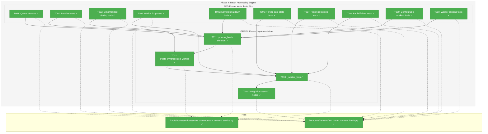
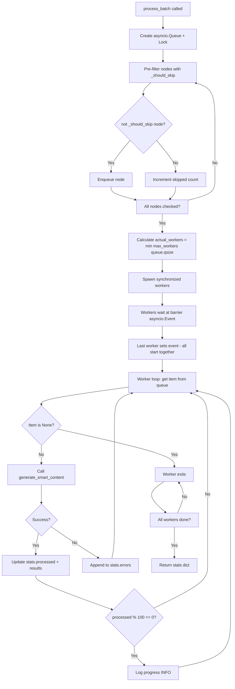
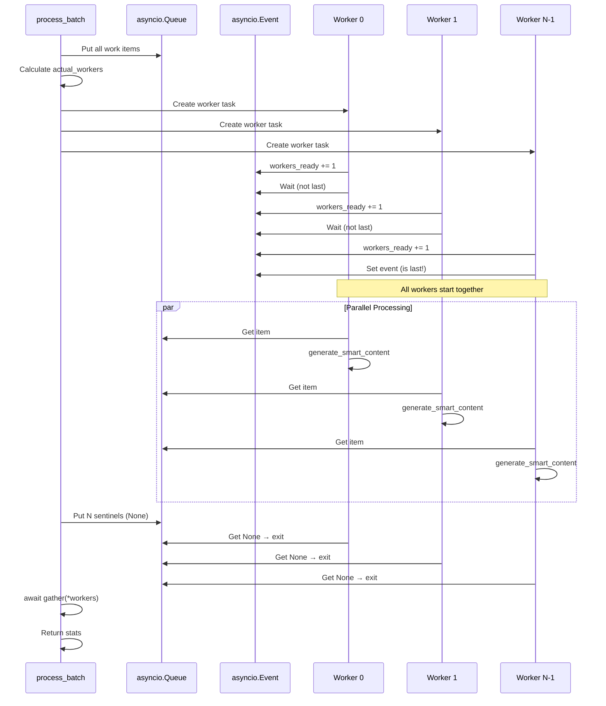

# Phase 4: Batch Processing Engine – Tasks & Alignment Brief

**Spec**: [smart-content-spec.md](../../smart-content-spec.md)
**Plan**: [smart-content-plan.md](../../smart-content-plan.md)
**Date**: 2025-12-18
**Phase Slug**: `phase-4-batch-processing-engine`

---

## Executive Briefing

### Purpose
This phase implements high-throughput parallel batch processing for smart content generation using an asyncio Queue + Worker Pool pattern. Without this, processing thousands of code nodes would be prohibitively slow (sequential LLM calls). This is the performance-critical component that makes smart content generation practical at scale.

### What We're Building
A `process_batch()` method on `SmartContentService` that:
- Creates an asyncio.Queue for work distribution
- Pre-filters nodes using hash-based skip logic (AC5) before enqueueing
- Spawns configurable worker pool (default 50 workers via `SmartContentConfig.max_workers`)
- Uses synchronized worker startup (asyncio.Event barrier) for fair work distribution
- Implements sentinel-based graceful shutdown (one `None` per worker)
- Tracks stats with asyncio.Lock (thread-safe processed/skipped/errors counts)
- Logs progress every 100 processed items

### User Value
Large codebases with thousands of nodes can generate smart content efficiently. A 1000-node codebase that would take ~17 minutes sequentially (1s per LLM call) completes in ~20 seconds with 50 parallel workers.

### Example
**Input**: `await service.process_batch(nodes)` where `nodes` is a list of 500 CodeNodes
**Output**:
```python
{
    "processed": 450,      # Successfully generated smart content
    "skipped": 40,         # Hash matched, no regeneration needed
    "errors": [            # Nodes that failed (rate limit, etc.)
        ("callable:lib.py:process", "Rate limit exceeded"),
    ],
    "results": {           # Updated CodeNode instances
        "file:lib.py": <CodeNode with smart_content>,
        "callable:lib.py:foo": <CodeNode with smart_content>,
        ...
    },
    "total": 500
}
```

---

## Objectives & Scope

### Objective
Implement AC7 (batch processing with configurable workers) using the asyncio Queue + Worker Pool pattern from Critical Discovery 06. Ensure workers are truly concurrent (CD06b) and handle partial failures gracefully (CD07).

### Goals

- ✅ Implement `process_batch(nodes: list[CodeNode]) -> dict` method
- ✅ Use asyncio.Queue for work distribution
- ✅ Pre-filter nodes using `_should_skip()` before enqueueing (efficiency optimization)
- ✅ Implement synchronized worker startup via asyncio.Event barrier
- ✅ Implement sentinel-based worker shutdown (one `None` per worker)
- ✅ Track stats with asyncio.Lock (processed, skipped, errors, results)
- ✅ Cap actual_workers to min(max_workers, work_items) to avoid idle workers
- ✅ Log progress every 50 processed items (INFO level) with total and remaining count
- ✅ Handle partial failures without stopping other workers (per CD07)
- ✅ Use `SmartContentConfig.max_workers` (default 50) for worker count

### Non-Goals (Scope Boundaries)

- ❌ Retry logic with exponential backoff (deferred - simple error handling sufficient for Phase 4)
- ❌ Circuit breaker pattern (not needed at this scale)
- ❌ Bounded queue with backpressure (unbounded queue sufficient for batch processing)
- ❌ Worker health monitoring (overkill for single-batch processing)
- ❌ Distributed processing across machines (single-process asyncio sufficient)
- ❌ Graph persistence of results (caller handles storage - stateless service pattern)
- ❌ Progress callbacks or event emission (INFO logging is sufficient)
- ❌ Cancellation/timeout of individual workers (entire batch runs to completion)

---

## Architecture Map

### Component Diagram
<!-- Status: grey=pending, orange=in-progress, green=completed, red=blocked -->
<!-- Updated by plan-6 during implementation -->



### Task-to-Component Mapping

<!-- Status: ⬜ Pending | 🟧 In Progress | ✅ Complete | 🔴 Blocked -->

| Task | Component(s) | Files | Status | Comment |
|------|-------------|-------|--------|---------|
| T001 | Test: Queue init | test_smart_content_batch.py | ✅ Complete | Verify Queue created, items enqueued |
| T002 | Test: Pre-filter | test_smart_content_batch.py | ✅ Complete | Only needing-processing nodes enqueued |
| T003 | Test: Synchronized startup | test_smart_content_batch.py | ✅ Complete | All workers start within 10ms |
| T004 | Test: Worker loop | test_smart_content_batch.py | ✅ Complete | Workers pull from queue, update stats |
| T005 | Test: Sentinel shutdown | test_smart_content_batch.py | ✅ Complete | Workers exit on None, queue empty |
| T006 | Test: Thread-safe stats | test_smart_content_batch.py | ✅ Complete | Stats consistent under concurrency |
| T007 | Test: Progress logging | test_smart_content_batch.py | ✅ Complete | INFO logged every 50 items |
| T008 | Test: Partial failures | test_smart_content_batch.py | ✅ Complete | Errors don't stop other workers |
| T009 | Test: Configurable workers | test_smart_content_batch.py | ✅ Complete | max_workers from config used |
| T010 | Test: Worker capping | test_smart_content_batch.py | ✅ Complete | actual_workers <= queue.qsize() |
| T011 | Impl: process_batch | smart_content_service.py | ✅ Complete | Main orchestration method |
| T012 | Impl: create_synchronized_worker | smart_content_service.py | ✅ Complete | asyncio.Event barrier |
| T013 | Impl: _worker_loop | smart_content_service.py | ✅ Complete | Core worker processing |
| T014 | Test: Integration 500 nodes | test_smart_content_batch.py | ✅ Complete | High-throughput validation |

---

## Tasks

| Status | ID | Task | CS | Type | Dependencies | Absolute Path(s) | Validation | Subtasks | Notes |
|--------|------|--------------------------------------|-----|------|--------------|------------------|------------|----------|-------|
| [x] | T001 | Write tests for asyncio.Queue initialization and item enqueueing | 2 | Test | – | /workspaces/flow_squared/tests/unit/services/test_smart_content_batch.py | Tests cover: queue created, items enqueued correctly, queue.qsize() matches work count | [log#task-t001-t010-red-phase](./execution.log.md#task-t001-t010-red-phase) | Plan 4.1 [^28] |
| [x] | T002 | Write tests for pre-filter hash check before enqueueing | 2 | Test | – | /workspaces/flow_squared/tests/unit/services/test_smart_content_batch.py | Tests cover: only nodes needing processing enqueued, skipped count accurate | [log#task-t001-t010-red-phase](./execution.log.md#task-t001-t010-red-phase) | Plan 4.2 [^28] |
| [x] | T003 | Write tests for synchronized worker startup via asyncio.Event barrier | 3 | Test | – | /workspaces/flow_squared/tests/unit/services/test_smart_content_batch.py | Tests cover: (1) all workers start within 10ms of each other, (2) work distributed fairly (no worker gets 0 items when work > workers) | [log#task-t001-t010-red-phase](./execution.log.md#task-t001-t010-red-phase) | Plan 4.3 [^28]; Critical for fairness |
| [x] | T004 | Write tests for worker processing loop (_worker_loop) | 3 | Test | – | /workspaces/flow_squared/tests/unit/services/test_smart_content_batch.py | Tests cover: workers pull from queue, call generate_smart_content, update stats | [log#task-t001-t010-red-phase](./execution.log.md#task-t001-t010-red-phase) | Plan 4.4 [^28] |
| [x] | T005 | Write tests for sentinel-based shutdown pattern | 2 | Test | – | /workspaces/flow_squared/tests/unit/services/test_smart_content_batch.py | Tests cover: workers exit on None sentinel, no hanging workers, queue empty | [log#task-t001-t010-red-phase](./execution.log.md#task-t001-t010-red-phase) | Plan 4.5 [^28] |
| [x] | T006 | Write tests for thread-safe stats tracking with asyncio.Lock | 2 | Test | – | /workspaces/flow_squared/tests/unit/services/test_smart_content_batch.py | Tests cover: stats accurate under 50+ concurrent workers, no race conditions | [log#task-t001-t010-red-phase](./execution.log.md#task-t001-t010-red-phase) | Plan 4.6 [^28] |
| [x] | T007 | Write tests for progress logging every 50 items | 2 | Test | – | /workspaces/flow_squared/tests/unit/services/test_smart_content_batch.py | Tests cover: INFO log at 50, 100, 150, etc with total and remaining count using caplog | [log#task-t001-t010-red-phase](./execution.log.md#task-t001-t010-red-phase) | Plan 4.7 [^28]; Changed from 100→50 |
| [x] | T008 | Write tests for partial failure handling (worker errors don't stop others) | 2 | Test | – | /workspaces/flow_squared/tests/unit/services/test_smart_content_batch.py | Tests cover: some nodes fail but batch continues, errors list populated | [log#task-t001-t010-red-phase](./execution.log.md#task-t001-t010-red-phase) | Plan 4.8 [^28]; Per CD07 |
| [x] | T009 | Write tests for configurable worker count via SmartContentConfig | 2 | Test | – | /workspaces/flow_squared/tests/unit/services/test_smart_content_batch.py | Tests cover: max_workers=10 spawns 10 workers, max_workers=100 spawns 100 | [log#task-t001-t010-red-phase](./execution.log.md#task-t001-t010-red-phase) | Plan 4.9 [^28] |
| [x] | T010 | Write tests for worker count capping (min of max_workers and queue size) | 2 | Test | – | /workspaces/flow_squared/tests/unit/services/test_smart_content_batch.py | Tests cover: 3 nodes with max_workers=50 spawns only 3 workers | [log#task-t001-t010-red-phase](./execution.log.md#task-t001-t010-red-phase) | Plan 4.10 [^28] |
| [x] | T011 | Implement process_batch with Queue + Worker Pool skeleton | 4 | Core | T001-T010 | /workspaces/flow_squared/src/fs2/core/services/smart_content/smart_content_service.py | Tests T001, T002, T005, T009, T010 pass; queue and sentinel logic works | [log#task-t011-t014-green-phase](./execution.log.md#task-t011-t014-green-phase) | Plan 4.11 [^29] |
| [x] | T012 | Implement create_synchronized_worker with asyncio.Event barrier | 2 | Core | T011 | /workspaces/flow_squared/src/fs2/core/services/smart_content/smart_content_service.py | Test T003 passes; workers synchronized within 10ms | [log#task-t011-t014-green-phase](./execution.log.md#task-t011-t014-green-phase) | Plan 4.12 [^30] |
| [x] | T013 | Implement _worker_loop with stats tracking and progress logging | 3 | Core | T012 | /workspaces/flow_squared/src/fs2/core/services/smart_content/smart_content_service.py | Tests T004, T006, T007, T008 pass; stats accurate, logging correct | [log#task-t011-t014-green-phase](./execution.log.md#task-t011-t014-green-phase) | Plan 4.13 [^31] |
| [x] | T014 | Write integration test with 500 nodes validating parallel throughput | 2 | Integration | T013 | /workspaces/flow_squared/tests/unit/services/test_smart_content_batch.py | 500 nodes processed in < 2s with 50ms delay per node (parallel proof) | [log#task-t011-t014-green-phase](./execution.log.md#task-t011-t014-green-phase) | Plan 4.14 [^32] |

---

## Alignment Brief

### Prior Phases Review

#### Phase-by-Phase Summary: Evolution of Implementation

**Phase 1 → Phase 2 → Phase 3**: The Smart Content system was built incrementally, with each phase establishing foundations for the next.

**Phase 1 (Foundation & Infrastructure)** established:
- `SmartContentConfig` with `max_workers=50` (default), `max_input_tokens=50000`, category-specific `token_limits`
- `TokenCounterAdapter` ABC + `FakeTokenCounterAdapter` + `TiktokenTokenCounterAdapter` (with cached encoder)
- `compute_content_hash()` utility for SHA-256 content hashing
- `content_hash` field on `CodeNode` (required, computed by factories)
- Exception hierarchy: `TokenCounterError` (adapter layer), `SmartContentError`/`TemplateError`/`SmartContentProcessingError` (service layer)

**Phase 2 (Template System)** established:
- `TemplateService` class with `render_for_category(category, context)` API
- 6 Jinja2 templates: file, type, callable, section, block, base (fallback)
- `importlib.resources` package-safe loading with `jinja2.DictLoader`
- Init-time template validation (fail-fast on missing/invalid templates)
- `StrictUndefined` behavior for AC8 context variable enforcement

**Phase 3 (Core Service Implementation)** established:
- `SmartContentService` class with `generate_smart_content(node)` single-node API
- `_should_skip(node)` for AC5 hash-based skip logic (requires `smart_content_hash` field)
- `_is_empty_or_trivial(node)` for CD08 empty content detection
- `_prepare_content(node)` for AC13 token-based truncation with `[TRUNCATED]` marker
- `_generate_with_error_handling(node, prompt)` for CD07 per-error-type handling
- `smart_content_hash: str | None` field added to `CodeNode`
- `FakeLLMAdapter.set_delay(seconds)` for concurrency testing

#### Cumulative Deliverables (Organized by Phase)

**From Phase 1**:
- `/workspaces/flow_squared/src/fs2/config/objects.py` → `SmartContentConfig`
- `/workspaces/flow_squared/src/fs2/core/adapters/token_counter_adapter.py` → `TokenCounterAdapter` ABC
- `/workspaces/flow_squared/src/fs2/core/adapters/token_counter_adapter_fake.py` → `FakeTokenCounterAdapter`
- `/workspaces/flow_squared/src/fs2/core/adapters/token_counter_adapter_tiktoken.py` → `TiktokenTokenCounterAdapter`
- `/workspaces/flow_squared/src/fs2/core/utils/hash.py` → `compute_content_hash()`
- `/workspaces/flow_squared/src/fs2/core/adapters/exceptions.py` → `TokenCounterError`
- `/workspaces/flow_squared/src/fs2/core/services/smart_content/exceptions.py` → `SmartContentError`, `TemplateError`, `SmartContentProcessingError`

**From Phase 2**:
- `/workspaces/flow_squared/src/fs2/core/services/smart_content/template_service.py` → `TemplateService`
- `/workspaces/flow_squared/src/fs2/core/templates/smart_content/*.j2` → 6 template files

**From Phase 3**:
- `/workspaces/flow_squared/src/fs2/core/services/smart_content/smart_content_service.py` → `SmartContentService.generate_smart_content()`
- `/workspaces/flow_squared/src/fs2/core/models/code_node.py` → `smart_content_hash` field
- `/workspaces/flow_squared/src/fs2/core/adapters/llm_adapter_fake.py` → `set_delay()` method

#### Complete Dependency Tree

```
Phase 4 (Batch Processing)
├── Phase 3 (Core Service)
│   ├── SmartContentService.generate_smart_content(node)  # Single-node API
│   ├── SmartContentService._should_skip(node)            # Hash-based skip check
│   └── FakeLLMAdapter.set_delay(seconds)                 # Concurrency testing
├── Phase 2 (Templates)
│   └── TemplateService.render_for_category(category, context)
├── Phase 1 (Foundation)
│   ├── SmartContentConfig.max_workers                    # Worker pool size
│   ├── SmartContentConfig.max_input_tokens               # Truncation threshold
│   ├── TokenCounterAdapter.count_tokens(text)            # Token counting
│   ├── compute_content_hash(content)                     # SHA-256 hashing
│   └── SmartContentProcessingError                       # Recoverable errors
└── External
    ├── asyncio.Queue                                     # Work distribution
    ├── asyncio.Event                                     # Worker synchronization
    ├── asyncio.Lock                                      # Stats thread-safety
    └── asyncio.gather                                    # Worker completion
```

#### Reusable Test Infrastructure

**From Phase 1**:
- `FakeTokenCounterAdapter` with `set_default_count()`, `set_count_for_text()`, `set_error()`, `call_history`
- `FakeConfigurationService` pattern for injecting config objects

**From Phase 3**:
- `FakeLLMAdapter.set_delay(seconds)` for simulating async delays
- `FakeLLMAdapter.set_response(content)` for controlling LLM output
- `FakeLLMAdapter.set_error(exception)` for error injection
- `caplog` fixture pattern for log verification
- GWT test naming: `test_given_X_when_Y_then_Z`

#### Architectural Patterns to Maintain

1. **ConfigurationService Registry Pattern** (CD01): Accept `ConfigurationService`, call `config.require(SmartContentConfig)` internally
2. **Frozen Dataclass Immutability** (CD03): Use `dataclasses.replace()` to return new `CodeNode` instances
3. **Stateless Service Design** (CD10): No instance state; each method call independent
4. **Exception Translation** (CD12): Catch adapter exceptions, wrap in service exceptions
5. **Fakes Over Mocks**: Use `FakeLLMAdapter`, `FakeTokenCounterAdapter` instead of `unittest.mock`

#### Anti-Patterns to Avoid

1. ❌ Blocking calls in async worker loop (serializes workers - CD06b)
2. ❌ Direct field mutation on frozen CodeNode
3. ❌ SDK exceptions leaking to callers
4. ❌ State accumulation in service instance
5. ❌ `unittest.mock.Mock` for adapters

### Critical Findings Affecting This Phase

| Finding | Constraint/Requirement | Tasks Addressing It |
|---------|------------------------|---------------------|
| **CD06: Async Queue + Worker Pool** | Use asyncio.Queue for work distribution, asyncio.Event for synchronized startup, sentinel-based shutdown | T001, T003, T005, T011, T012 |
| **CD06b: Event Loop Blocking Prevention** | Ensure all I/O in worker loops is truly async; blocking calls serialize workers | T003, T014 (concurrency verification) |
| **CD07: LLM Error Handling Strategy** | Auth errors fail batch, rate limit errors are recoverable, content filter returns fallback | T008, T013 |
| **CD10: Stateless Service Design** | Service returns new CodeNode instances; caller handles storage | T011, T013 |
| **CD03: Frozen Dataclass Immutability** | Use `dataclasses.replace()` for all CodeNode updates | Inherited from Phase 3 |

### ADR Decision Constraints

**N/A** - No ADRs exist for this project.

### Invariants & Guardrails

| Constraint | Value | Enforcement |
|------------|-------|-------------|
| Max workers | Configurable, default 50 | `SmartContentConfig.max_workers` |
| Worker capping | `min(max_workers, queue.qsize())` | T010, T011 |
| Progress logging | Every 50 items (with total + remaining) | T007, T013 |
| Stats thread-safety | asyncio.Lock | T006, T013 |
| Graceful shutdown | One sentinel per worker | T005, T011 |

### Inputs to Read

- `/workspaces/flow_squared/src/fs2/core/services/smart_content/smart_content_service.py` - Existing service (extend with `process_batch`)
- `/workspaces/flow_squared/src/fs2/config/objects.py` - `SmartContentConfig.max_workers`
- `/workspaces/flow_squared/tests/unit/services/test_smart_content_service.py` - Phase 3 test patterns

### Visual Alignment: System Flow Diagram



### Visual Alignment: Worker Synchronization Sequence



### Test Plan (Full TDD)

| Test ID | Test Name | Fixtures | Expected Output | Rationale |
|---------|-----------|----------|-----------------|-----------|
| T001-1 | `test_given_batch_when_started_then_queue_created` | FakeLLMAdapter, 5 nodes | Queue instance exists | Verify Queue initialization |
| T001-2 | `test_given_nodes_when_processing_then_items_enqueued` | FakeLLMAdapter, 5 nodes | queue.qsize() matches work count | Verify enqueueing |
| T002-1 | `test_given_hash_match_nodes_when_processing_then_not_enqueued` | 3 unchanged nodes | skipped=3, queue.qsize()=0 | Hash-based pre-filter |
| T002-2 | `test_given_mixed_nodes_when_processing_then_only_changed_enqueued` | 2 changed + 2 unchanged | skipped=2, queue.qsize()=2 | Partial skip |
| T003-1 | `test_given_workers_when_started_then_all_start_within_10ms` | 10 workers, start time tracking | max(times) - min(times) < 0.01 | Synchronized startup |
| T003-2 | `test_given_100_items_10_workers_then_work_distributed_fairly` | 100 items, 10 workers, per-worker counters | min(items_per_worker) >= 5 | Fair distribution (no starvation) |
| T004-1 | `test_given_worker_when_processing_then_calls_generate_smart_content` | FakeLLMAdapter | LLM called for each node | Worker invokes single-node API |
| T004-2 | `test_given_worker_when_processing_then_updates_stats_results` | FakeLLMAdapter | results dict populated | Stats tracking |
| T005-1 | `test_given_sentinel_when_received_then_worker_exits` | FakeLLMAdapter, 3 nodes | All workers completed | Graceful shutdown |
| T005-2 | `test_given_batch_complete_when_checked_then_queue_empty` | FakeLLMAdapter | queue.empty() == True | No leftover work |
| T006-1 | `test_given_50_workers_when_processing_1000_nodes_then_stats_consistent` | FakeLLMAdapter | processed + skipped + errors = 1000 | Thread-safe stats |
| T007-1 | `test_given_250_nodes_when_processing_then_progress_logged_at_50_100_150_200` | FakeLLMAdapter, caplog | 4+ progress logs with total/remaining | Progress logging every 50 |
| T008-1 | `test_given_flaky_llm_when_processing_then_errors_captured_batch_continues` | Flaky FakeLLMAdapter | 3 errors, 6 processed | Partial failure handling |
| T009-1 | `test_given_max_workers_10_when_processing_then_10_workers_spawned` | Config(max_workers=10), tracking | 10 worker IDs seen | Configurable workers |
| T010-1 | `test_given_3_nodes_and_max_workers_50_then_only_3_workers_spawned` | Config(max_workers=50), 3 nodes | 3 worker IDs seen | Worker capping |
| T014-1 | `test_given_500_nodes_with_50ms_delay_then_completes_under_2s` | 50 workers, 0.05s delay | elapsed < 2.0 | Parallel throughput proof |

### Step-by-Step Implementation Outline

1. **T001-T010 (RED Phase)**: Create `tests/unit/services/test_smart_content_batch.py` with all test cases. Tests will fail with `AttributeError: 'SmartContentService' object has no attribute 'process_batch'`.

2. **T011 (GREEN: process_batch skeleton)**:
   - **IMPORTANT (CD10 Statelessness)**: Use LOCAL variables for `queue` and `stats_lock`, NOT instance attributes. This prevents race conditions when multiple batches run concurrently on the same service instance.
   - Implement `process_batch(nodes: list[CodeNode]) -> dict` with:
     - Queue creation
     - Pre-filter loop with `_should_skip()` check
     - Worker spawning with `actual_workers = min(max_workers, work_count)`
     - Sentinel enqueueing with explicit comment block (see below)
     - `await asyncio.gather(*workers)`
   - **SENTINEL ORDERING COMMENT** (must include in implementation):
     ```python
     # SENTINEL SHUTDOWN PATTERN
     # -------------------------
     # Sentinels (None) MUST be enqueued:
     #   1. AFTER all work items (so workers process work first)
     #   2. BEFORE gather() (so workers can receive them)
     # One sentinel per worker ensures all workers exit cleanly.
     ```
     - Stats return

3. **T012 (GREEN: create_synchronized_worker)**:
   - Create `worker_ready_event = asyncio.Event()` and `workers_ready = [0]`
   - Implement `async def create_synchronized_worker(worker_id)` closure:
     - Increment `workers_ready[0]`
     - If last worker, set event; else wait for event
     - Call `await self._worker_loop(worker_id, queue, stats_lock, stats)` (pass local vars as params)

4. **T013 (GREEN: _worker_loop)**:
   - Implement `async def _worker_loop(self, worker_id: int, queue: asyncio.Queue, stats_lock: asyncio.Lock, stats: dict) -> None`
   - `while True` loop:
     - `item = await queue.get()` (use parameter, not self._queue)
     - If `item is None`, break (sentinel)
     - Try: `updated = await self.generate_smart_content(item)`, update stats
     - Except: append to `stats["errors"]`
     - Progress logging: `if stats["processed"] % 50 == 0: log INFO` with total and remaining

5. **T014 (Integration Test)**: Verify 500 nodes with 50ms FakeLLMAdapter delay complete in < 2s (proves parallelism).

### Commands to Run

```bash
# Environment setup (if needed)
cd /workspaces/flow_squared
UV_CACHE_DIR=/workspaces/flow_squared/.uv_cache uv sync

# Run Phase 4 tests (RED then GREEN)
UV_CACHE_DIR=/workspaces/flow_squared/.uv_cache uv run pytest tests/unit/services/test_smart_content_batch.py -v

# Run full test suite (verify no regressions)
UV_CACHE_DIR=/workspaces/flow_squared/.uv_cache uv run pytest tests/unit -v

# Lint check
UV_CACHE_DIR=/workspaces/flow_squared/.uv_cache uv run ruff check src/fs2/core/services/smart_content/

# Type check (if configured)
UV_CACHE_DIR=/workspaces/flow_squared/.uv_cache uv run mypy src/fs2/core/services/smart_content/smart_content_service.py
```

### Risks/Unknowns

| Risk | Severity | Mitigation |
|------|----------|------------|
| Workers serialize due to blocking call | High | T003 + T014 verify parallel execution; use only async operations in worker loop |
| Stats race condition | Medium | T006 verifies consistency; use `async with self._stats_lock` for all updates |
| Test flakiness with timing | Medium | Use generous margins (10ms for sync, 2s for 500-node test) |
| Memory pressure with large batches | Low | Not bounded queue, but batch sizes are typically <10k nodes |

### Ready Check

- [ ] All prior phase deliverables available (Phase 1-3 complete)
- [ ] SmartContentService.generate_smart_content() tested and working
- [ ] FakeLLMAdapter.set_delay() available for concurrency testing
- [ ] SmartContentConfig.max_workers accessible
- [ ] Test file path confirmed: `/workspaces/flow_squared/tests/unit/services/test_smart_content_batch.py`
- [ ] ADR constraints mapped to tasks (N/A - no ADRs exist)

---

## Phase Footnote Stubs

_Populated from Plan § "Change Footnotes Ledger" (plan is authority). Each footnote links implementation to tasks._

| Footnote | Node ID | Type | Tasks | Description |
|----------|---------|------|-------|-------------|
| [^28] | `file:tests/unit/services/test_smart_content_batch.py` | Test File | T001-T010 | Batch processing tests (RED phase) - 18 test cases |
| [^29] | `method:src/fs2/core/services/smart_content/smart_content_service.py:SmartContentService.process_batch` | Method | T011 | Main batch processing orchestration method |
| [^30] | `function:src/fs2/core/services/smart_content/smart_content_service.py:create_synchronized_worker` | Function | T012 | Inner function with asyncio.Event barrier |
| [^31] | `method:src/fs2/core/services/smart_content/smart_content_service.py:SmartContentService._worker_loop` | Method | T013 | Core worker processing loop |
| [^32] | `function:tests/unit/services/test_smart_content_batch.py:test_given_500_nodes_with_50ms_delay_then_completes_under_2s` | Test | T014 | Integration test validating parallel throughput |

---

## Evidence Artifacts

**Execution Log**: `./execution.log.md` (created by /plan-6 during implementation)

**Supporting Files**:
- Test file: `/workspaces/flow_squared/tests/unit/services/test_smart_content_batch.py`
- Implementation: `/workspaces/flow_squared/src/fs2/core/services/smart_content/smart_content_service.py` (extended)

---

## Discoveries & Learnings

_Populated during implementation by plan-6. Log anything of interest to your future self._

| Date | Task | Type | Discovery | Resolution | References |
|------|------|------|-----------|------------|------------|
| 2025-12-18 | T011 | decision | Instance attributes (`self._queue`, `self._stats_lock`) violate CD10 stateless design and cause race conditions when concurrent batches run on same service | Use LOCAL variables and pass as parameters to `_worker_loop` | /didyouknow Insight #1 |
| 2025-12-18 | T002/T011 | decision | Pre-filter should reuse existing `_should_skip()` from Phase 3, not introduce new `_needs_processing()` method | Use `if not self._should_skip(node):` for single source of truth | /didyouknow Insight #2 |
| 2025-12-18 | T007/T013 | decision | Progress logging every 100 items provides poor UX for small batches (zero feedback) | Log every 50 items with total and remaining count | /didyouknow Insight #3 |
| 2025-12-18 | T003 | insight | T003 timing test verifies workers START together but doesn't prove fair work distribution | Add T003-2 distribution test: verify no worker gets 0 items when work > workers | /didyouknow Insight #4 |
| 2025-12-18 | T011 | gotcha | Sentinel shutdown pattern has implicit ordering: sentinels MUST come after work items but before gather() | Add explicit comment block in implementation documenting the ordering constraint | /didyouknow Insight #5 |

**Types**: `gotcha` | `research-needed` | `unexpected-behavior` | `workaround` | `decision` | `debt` | `insight`

**What to log**:
- Things that didn't work as expected
- External research that was required
- Implementation troubles and how they were resolved
- Gotchas and edge cases discovered
- Decisions made during implementation
- Technical debt introduced (and why)
- Insights that future phases should know about

_See also: `execution.log.md` for detailed narrative._

---

## Directory Layout

```
docs/plans/008-smart-content/
├── smart-content-spec.md
├── smart-content-plan.md
└── tasks/
    ├── phase-1-foundation-and-infrastructure/
    │   ├── tasks.md
    │   └── execution.log.md
    ├── phase-2-template-system/
    │   ├── tasks.md
    │   └── execution.log.md
    ├── phase-3-core-service-implementation/
    │   ├── tasks.md
    │   └── execution.log.md
    └── phase-4-batch-processing-engine/
        ├── tasks.md          # This file
        └── execution.log.md  # Created by /plan-6
```

---

**Dossier Status**: READY FOR IMPLEMENTATION
**Next Step**: Proceed with `/plan-6-implement-phase --phase 4`

---

## Critical Insights Discussion

**Session**: 2025-12-18
**Context**: Phase 4: Batch Processing Engine - Tasks & Alignment Brief
**Analyst**: AI Clarity Agent
**Reviewer**: Development Team
**Format**: Water Cooler Conversation (5 Critical Insights)

### Insight 1: Concurrent Batch Race Condition

**Did you know**: The planned implementation using instance attributes (`self._queue`, `self._stats_lock`) violates CD10 stateless design and causes race conditions when multiple batches run concurrently on the same service instance.

**Implications**:
- Production scenarios with concurrent processing produce corrupted results
- Debugging would be extremely difficult (intermittent, timing-dependent)
- Violates explicitly stated architectural principle (CD10)

**Options Considered**:
- Option A: Local Variables Only - Use local vars, pass as parameters
- Option B: Dataclass for Batch Context - Encapsulate in BatchContext
- Option C: Service-per-Batch - Document caller must create new instances
- Option D: Mutex on process_batch - Prevent concurrent calls

**AI Recommendation**: Option A (Local Variables Only)
- Reasoning: Matches CD10 exactly, zero new code, single source of truth

**Discussion Summary**: User agreed with local variables approach. Simpler is better.

**Decision**: Use local variables for `queue` and `stats_lock`, pass as parameters to `_worker_loop`

**Action Items**:
- [x] Update T011 implementation notes to specify local variables
- [x] Update T012/T013 signatures to accept queue/lock as parameters

**Affects**: T011, T012, T013

---

### Insight 2: Pre-filter Logic Method Name Inconsistency

**Did you know**: The Phase 4 plan introduces `_needs_processing(node)` but Phase 3 already has `_should_skip(node)` — these are logical inverses that create confusion and potential bugs.

**Implications**:
- Two methods for same concept = confusion about which to use
- If hash logic changes in one but not other = subtle bugs
- Violates DRY principle

**Options Considered**:
- Option A: Reuse `_should_skip` with negation
- Option B: Create `_needs_processing` that calls `_should_skip` internally
- Option C: Rename `_should_skip` to `_should_process` everywhere

**AI Recommendation**: Option A (Reuse with Negation)
- Reasoning: Zero new code, single source of truth, already tested

**Discussion Summary**: User agreed. `if not self._should_skip(node):` is clear enough.

**Decision**: Use `if not self._should_skip(node):` for pre-filter

**Action Items**:
- [x] Update flowchart to show `not _should_skip` condition

**Affects**: T002, T011

---

### Insight 3: Progress Logging Threshold Hardcoded

**Did you know**: The hardcoded "log every 100 items" threshold means batches <100 nodes get ZERO progress feedback, while 100K batches produce 1000 log lines.

**Implications**:
- Small batch users get no visibility into progress
- Large batch users may have log file clutter
- Threshold doesn't scale with batch size

**Options Considered**:
- Option A: Percentage-based logging (10%, 25%, 50%, 75%, 90%, 100%)
- Option B: Configurable threshold via SmartContentConfig
- Option C: Adaptive threshold (log ~10 times per batch)
- Option D: Keep hardcoded 100, add start/end logs

**AI Recommendation**: Option A (Percentage-Based)
- Reasoning: Consistent UX, not too noisy, always shows something

**Discussion Summary**: User preferred logging every 50 items with total and remaining count.

**Decision**: Log progress every 50 items with total and remaining count

**Action Items**:
- [x] Update T007 test criteria to 50 items
- [x] Update T013 implementation notes
- [x] Update Goals section and Invariants table

**Affects**: T007, T013

---

### Insight 4: Synchronized Startup Test May Test Wrong Thing

**Did you know**: T003 tests when workers BEGIN PROCESSING, not when they pass the barrier — and these can differ if work items are consumed quickly.

**Implications**:
- Test proves workers start together but not barrier correctness in isolation
- Could pass even with broken barrier if workers enter loop quickly
- Timing tests are inherently flaky

**Options Considered**:
- Option A: Test barrier directly with timestamp inside barrier
- Option B: Keep timing test, add work distribution test
- Option C: Use longer delay to amplify timing differences
- Option D: Accept current test as "good enough"

**AI Recommendation**: Option B (Add Distribution Test)
- Reasoning: Tests actual goal (fair distribution), deterministic, complements T003

**Discussion Summary**: User agreed. Testing outcome (fair distribution) is more valuable than mechanism.

**Decision**: Keep T003 timing test, add T003-2 for work distribution fairness

**Action Items**:
- [x] Add T003-2 test case in Test Plan table
- [x] Update T003 validation criteria

**Affects**: T003

---

### Insight 5: Sentinel Shutdown Pattern Ordering is Fragile

**Did you know**: The sentinel pattern MUST add sentinels AFTER work items but BEFORE `gather()` — this ordering is non-obvious and easy to break during refactoring.

**Implications**:
- Wrong order causes workers to hang indefinitely or exit early
- No compiler/type checker catches the mistake
- Future refactoring could easily break this

**Options Considered**:
- Option A: Add explicit comment block explaining ordering
- Option B: Extract to named helper method
- Option C: Add runtime assertion
- Option D: All of the above

**AI Recommendation**: Option A (Comment Block)
- Reasoning: Proportionate response, low overhead, educates maintainers

**Discussion Summary**: User agreed. Comment is sufficient for this known pattern.

**Decision**: Add explicit comment block documenting sentinel ordering constraint

**Action Items**:
- [x] Add sentinel comment template to T011 implementation notes

**Affects**: T011

---

## Session Summary

**Insights Surfaced**: 5 critical insights identified and discussed
**Decisions Made**: 5 decisions reached through collaborative discussion
**Action Items Created**: 10 follow-up items (all completed during session)
**Areas Updated**:
- Tasks table (T003, T007)
- Test Plan table (T003-2, T007-1)
- Step-by-Step Implementation Outline (T011, T012, T013)
- Goals section
- Invariants table
- Flowchart
- Discoveries & Learnings table (5 entries added)

**Shared Understanding Achieved**: ✓

**Confidence Level**: High - Key architectural risks identified and mitigated before implementation

**Next Steps**:
Proceed with `/plan-6-implement-phase --phase 4` - the dossier is now ready for implementation with all critical insights incorporated.
