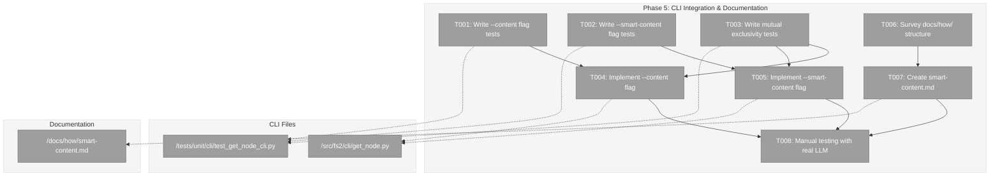
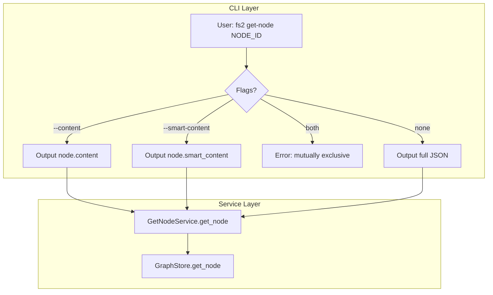
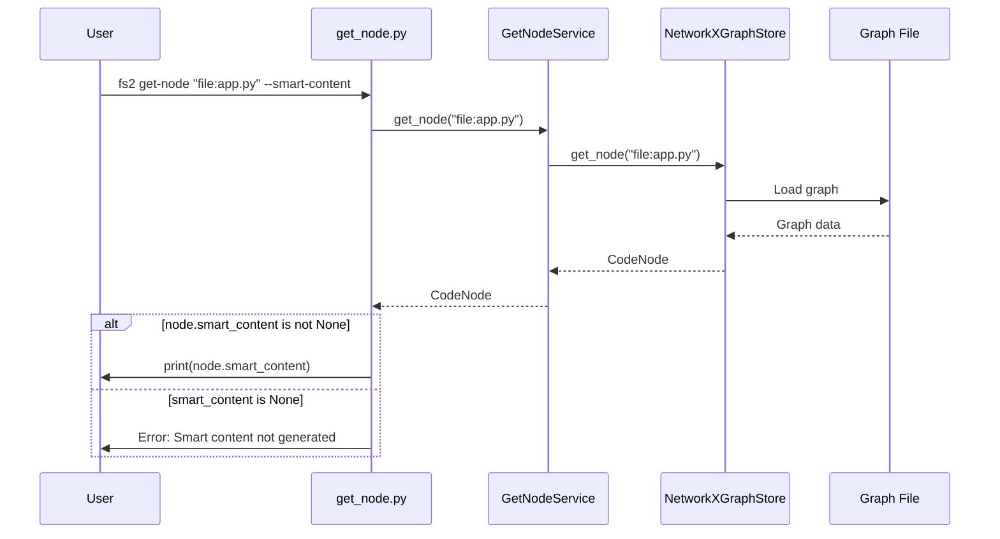

# Phase 5: CLI Integration & Documentation – Tasks & Alignment Brief

**Spec**: [../../smart-content-spec.md](../../smart-content-spec.md)
**Plan**: [../../smart-content-plan.md](../../smart-content-plan.md)
**Date**: 2025-12-19
**Testing Approach**: Full TDD
**Mock Usage**: Targeted mocks (FakeLLMAdapter, FakeGraphStore)

---

## Executive Briefing

### Purpose
This phase completes the Smart Content feature by exposing it through the CLI and providing developer documentation. Without CLI integration, users cannot access smart content from scripts and tools; without documentation, adoption and customization are hindered.

### What We're Building
Two CLI enhancements to the existing `get-node` command:
- **`--content` flag**: Outputs the raw source code (`node.content`) for any node
- **`--smart-content` flag**: Outputs the AI-generated summary (`node.smart_content`) for any node

Plus comprehensive documentation:
- **`docs/how/smart-content.md`**: Service usage, template customization, CLI flags, configuration

### User Value
- **Script Integration**: Developers can pipe node content to external tools (`fs2 get-node "callable:lib.py:main" --content | wc -l`)
- **AI Summary Access**: Quick access to AI summaries without loading full graph (`fs2 get-node "file:app.py" --smart-content`)
- **Discoverability**: Documentation helps developers configure, customize, and troubleshoot smart content generation

### Example
```bash
# Before: Only JSON output available
$ fs2 get-node "callable:src/main.py:process" | jq .content
"def process(data):\n    return transform(data)"

# After: Direct content access
$ fs2 get-node "callable:src/main.py:process" --content
def process(data):
    return transform(data)

# After: Direct smart content access
$ fs2 get-node "callable:src/main.py:process" --smart-content
A data processing function that applies transformation logic to input data.
```

---

## Objectives & Scope

### Objective
Implement AC12 (CLI get-node enhancement) and create documentation per the Documentation Strategy (docs/how/ only).

### Goals

- ✅ Add `--content` flag to `get-node` command (outputs raw source code)
- ✅ Add `--smart-content` flag to `get-node` command (outputs AI summary)
- ✅ Handle mutual exclusivity of flags (error if both specified)
- ✅ Handle edge cases (node not found, no smart_content yet, empty content)
- ✅ Create `docs/how/smart-content.md` with comprehensive documentation
- ✅ Manual testing with real LLM to validate end-to-end flow

### Non-Goals

- ❌ New CLI commands (only enhancing existing `get-node`)
- ❌ Batch CLI operations (single node only; batch is programmatic via SmartContentService)
- ❌ Smart content regeneration via CLI (service-level only)
- ❌ Template editing via CLI (file-based templates)
- ❌ Token counting or cost display (deferred)
- ❌ README.md updates (per Documentation Strategy: docs/how/ only)
- ❌ API documentation (internal service; how-to guide is sufficient)

---

## Architecture Map

### Component Diagram
<!-- Status: grey=pending, orange=in-progress, green=completed, red=blocked -->
<!-- Updated by plan-6 during implementation -->



### Task-to-Component Mapping

<!-- Status: ⬜ Pending | 🟧 In Progress | ✅ Complete | 🔴 Blocked -->

| Task | Component(s) | Files | Status | Comment |
|------|-------------|-------|--------|---------|
| T001 | CLI Tests | `/workspaces/flow_squared/tests/unit/cli/test_get_node_cli.py` | ⬜ Pending | TDD: Write failing tests for --content flag |
| T002 | CLI Tests | `/workspaces/flow_squared/tests/unit/cli/test_get_node_cli.py` | ⬜ Pending | TDD: Write failing tests for --smart-content flag |
| T003 | CLI Tests | `/workspaces/flow_squared/tests/unit/cli/test_get_node_cli.py` | ⬜ Pending | TDD: Write failing tests for mutual exclusivity |
| T004 | CLI | `/workspaces/flow_squared/src/fs2/cli/get_node.py` | ⬜ Pending | Implement --content flag with Typer option |
| T005 | CLI | `/workspaces/flow_squared/src/fs2/cli/get_node.py` | ⬜ Pending | Implement --smart-content flag with Typer option |
| T006 | Research | `/workspaces/flow_squared/docs/how/` | ⬜ Pending | Survey existing docs for style/format guidance |
| T007 | Documentation | `/workspaces/flow_squared/docs/how/smart-content.md` | ⬜ Pending | Create comprehensive how-to guide |
| T008 | Validation | N/A | ⬜ Pending | Manual end-to-end testing with Azure OpenAI |

---

## Tasks

| Status | ID | Task | CS | Type | Dependencies | Absolute Path(s) | Validation | Subtasks | Notes |
|--------|------|------|-----|------|--------------|------------------|------------|----------|-------|
| [ ] | T001 | Write tests for `get-node --content` flag | 2 | Test | – | `/workspaces/flow_squared/tests/unit/cli/test_get_node_cli.py` | Tests cover: outputs raw content, handles empty content, node not found | – | Plan 5.1; AC12 |
| [ ] | T002 | Write tests for `get-node --smart-content` flag | 2 | Test | – | `/workspaces/flow_squared/tests/unit/cli/test_get_node_cli.py` | Tests cover: outputs smart_content, handles None smart_content, node not found | – | Plan 5.2; AC12 |
| [ ] | T003 | Write tests for flag mutual exclusivity | 1 | Test | – | `/workspaces/flow_squared/tests/unit/cli/test_get_node_cli.py` | Tests cover: error when both flags used, helpful error message | – | Plan 5.3; UX |
| [ ] | T004 | Implement `--content` flag in get_node.py | 2 | Core | T001, T003 | `/workspaces/flow_squared/src/fs2/cli/get_node.py` | All T001 tests pass; content output is raw (no JSON wrapping) | – | Plan 5.4; Typer Option |
| [ ] | T005 | Implement `--smart-content` flag in get_node.py | 2 | Core | T002, T003 | `/workspaces/flow_squared/src/fs2/cli/get_node.py` | All T002 tests pass; AC12 satisfied | – | Plan 5.5; Typer Option |
| [ ] | T006 | Survey existing `docs/how/` structure and style | 1 | Research | – | `/workspaces/flow_squared/docs/how/*.md` | Existing structure documented in alignment brief | – | Plan 5.6; Discovery |
| [ ] | T007 | Create `docs/how/smart-content.md` documentation | 2 | Doc | T004, T005, T006 | `/workspaces/flow_squared/docs/how/smart-content.md` | Covers: service usage, templates, CLI flags, config, troubleshooting | – | Plan 5.7; Per Doc Strategy |
| [ ] | T008 | Manual testing with real LLM (Azure OpenAI) | 2 | Validation | T004, T005, T007 | N/A | End-to-end flow verified with real LLM responses | – | Plan 5.8; Pre-release |

---

## Alignment Brief

### Prior Phases Review

#### Phase-by-Phase Summary

**Phase 1: Foundation & Infrastructure** (11 tasks, 27 tests)
- Established foundational components: `SmartContentConfig`, `TokenCounterAdapter` family (ABC + Fake + Tiktoken), hash utilities, `CodeNode.content_hash` field, exception hierarchy
- Key patterns: ConfigurationService registry, three-file adapter pattern, fakes over mocks
- All components tested with TDD; encoder caching for tiktoken implemented
- Critical Discovery 01-05, 12 applied

**Phase 2: Template System** (10 tasks, 8 tests)
- Created `TemplateService` with importlib.resources loading pattern
- 6 Jinja2 templates: `smart_content_{file,type,callable,section,block,base}.j2`
- Category-to-template mapping (AC11) with token limits per category
- Strict undefined behavior prevents silent template failures
- Package-data configured in pyproject.toml for wheel builds
- Critical Discovery 04, 09 applied

**Phase 3: Core Service Implementation** (13 tasks, 18 tests)
- Implemented `SmartContentService.generate_smart_content()` for single-node processing
- Hash-based skip logic (AC5) and regeneration (AC6) working
- Token-based truncation (AC13) with WARNING logging
- Error handling strategies per CD07: auth → fail batch, filter → fallback, rate limit → log
- Added `CodeNode.smart_content_hash` field for skip detection
- FakeLLMAdapter enhanced with `set_delay()` for concurrency testing
- Critical Discovery 01, 03, 06b, 07, 08, 10, 12 applied

**Phase 4: Batch Processing Engine** (14 tasks, 18 tests)
- Implemented `SmartContentService.process_batch()` using asyncio Queue + Worker Pool
- Synchronized worker startup via asyncio.Event barrier for fair distribution
- Sentinel-based graceful shutdown; worker count capping to work items
- Progress logging every 50 items with total/remaining count
- Local variables for batch state (not instance attributes) per CD10 stateless design
- 50x throughput improvement for I/O-bound operations
- Critical Discovery 06, 06b, 07, 10 applied

#### Cumulative Deliverables

**From Phase 1**:
- `/workspaces/flow_squared/src/fs2/config/objects.py` → `SmartContentConfig`
- `/workspaces/flow_squared/src/fs2/core/adapters/token_counter_adapter*.py` → TokenCounter family
- `/workspaces/flow_squared/src/fs2/core/utils/hash.py` → `compute_content_hash()`
- `/workspaces/flow_squared/src/fs2/core/models/code_node.py` → `content_hash` field
- `/workspaces/flow_squared/src/fs2/core/services/smart_content/exceptions.py` → Exception hierarchy

**From Phase 2**:
- `/workspaces/flow_squared/src/fs2/core/services/smart_content/template_service.py` → `TemplateService`
- `/workspaces/flow_squared/src/fs2/core/templates/smart_content/*.j2` → 6 templates

**From Phase 3**:
- `/workspaces/flow_squared/src/fs2/core/services/smart_content/smart_content_service.py` → `SmartContentService`
- `CodeNode.smart_content_hash` field added
- `FakeLLMAdapter.set_delay()` method added

**From Phase 4**:
- `SmartContentService.process_batch()` method
- `SmartContentService._worker_loop()` method

#### Reusable Test Infrastructure

- **FakeConfigurationService**: Config injection for tests
- **FakeTokenCounterAdapter**: Configurable token counts
- **FakeLLMAdapter**: Configurable responses, delays, errors
- **Monkeypatched tiktoken**: Offline-safe tests via fake module injection
- **In-memory template sources**: Testing without filesystem dependencies

#### Architectural Patterns to Maintain

1. **ConfigurationService Registry**: Services accept `ConfigurationService`, call `.require()` internally
2. **Three-File Adapter Pattern**: ABC + Fake + Implementation
3. **Fakes Over Mocks**: Use `call_history` property, not `unittest.mock`
4. **Exception Translation**: Adapters catch SDK exceptions, raise domain exceptions
5. **Stateless Service Design**: Return new instances, no internal state
6. **Frozen Dataclass Updates**: Use `dataclasses.replace()` for CodeNode modifications

#### Anti-Patterns to Avoid

1. ❌ Direct SDK imports in services
2. ❌ Extracting config in composition root
3. ❌ unittest.mock for adapters
4. ❌ Mutating frozen dataclasses
5. ❌ Blocking calls in async methods
6. ❌ Instance attributes for batch state

### Critical Findings Affecting This Phase

| Finding | Impact on Phase 5 | Tasks Affected |
|---------|-------------------|----------------|
| **Research Finding #01** (get_node.py:8-9) | Use raw `print()` for content output, `Console(stderr=True)` for errors | T004, T005 |
| **Clean Architecture** | CLI handles only arg parsing + presentation; no business logic | T004, T005 |
| **Documentation Strategy** | docs/how/ only; no README updates | T007 |

### ADR Decision Constraints

No ADRs exist for this feature. N/A.

### Invariants & Guardrails

- **CLI Output**: Raw content/smart_content to stdout (no JSON wrapping for these flags)
- **Error Handling**: Consistent with existing get_node.py patterns (exit codes 0/1/2)
- **Flag Exclusivity**: `--content` and `--smart-content` cannot be used together
- **Empty Smart Content**: Return message indicating smart content not yet generated

### Inputs to Read

| File | Purpose |
|------|---------|
| `/workspaces/flow_squared/src/fs2/cli/get_node.py` | Existing implementation to extend |
| `/workspaces/flow_squared/tests/unit/cli/test_get_node_cli.py` | Existing test patterns |
| `/workspaces/flow_squared/docs/how/configuration.md` | Style guide for documentation |
| `/workspaces/flow_squared/docs/how/llm-service-setup.md` | Related documentation for reference |

### Visual Alignment Aids

#### System State Flow Diagram



#### Sequence Diagram: --smart-content Flow



### Test Plan (TDD)

#### T001: --content Flag Tests

| Test Name | Purpose | Expected Outcome |
|-----------|---------|------------------|
| `test_content_flag_outputs_raw_content` | Proves --content outputs node.content | Raw source code printed to stdout |
| `test_content_flag_node_not_found` | Proves error handling | Exit code 1, error to stderr |
| `test_content_flag_empty_content` | Proves empty content handling | Empty string or placeholder message |

#### T002: --smart-content Flag Tests

| Test Name | Purpose | Expected Outcome |
|-----------|---------|------------------|
| `test_smart_content_flag_outputs_summary` | Proves --smart-content outputs node.smart_content | AI summary printed to stdout |
| `test_smart_content_flag_node_not_found` | Proves error handling | Exit code 1, error to stderr |
| `test_smart_content_flag_none_smart_content` | Proves handling of ungenerated smart content | Helpful message indicating regeneration needed |

#### T003: Mutual Exclusivity Tests

| Test Name | Purpose | Expected Outcome |
|-----------|---------|------------------|
| `test_both_flags_error` | Proves flags are mutually exclusive | Exit code 2, error message |
| `test_content_and_file_allowed` | Proves --content + --file works | Content written to file |
| `test_smart_content_and_file_allowed` | Proves --smart-content + --file works | Smart content written to file |

### Step-by-Step Implementation Outline

1. **T001**: Write RED tests for `--content` flag behavior
2. **T002**: Write RED tests for `--smart-content` flag behavior
3. **T003**: Write RED tests for mutual exclusivity
4. **T004**: Add `--content` Typer option to get_node.py; make T001 tests pass (GREEN)
5. **T005**: Add `--smart-content` Typer option to get_node.py; make T002 tests pass (GREEN)
6. **T006**: Survey docs/how/ for style patterns; document findings
7. **T007**: Create smart-content.md following surveyed patterns
8. **T008**: Manual testing with real Azure OpenAI endpoint

### Commands to Run

```bash
# Environment setup
cd /workspaces/flow_squared
uv sync

# Run Phase 5 tests only
uv run pytest tests/unit/cli/test_get_node_cli.py -v

# Run full test suite
uv run pytest tests/unit -q

# Linting
uv run ruff check src/fs2/cli/get_node.py

# Type checking
uv run mypy src/fs2/cli/get_node.py

# Manual CLI testing (after implementation)
uv run fs2 get-node "file:src/fs2/cli/get_node.py" --content
uv run fs2 get-node "file:src/fs2/cli/get_node.py" --smart-content
```

### Risks/Unknowns

| Risk | Severity | Mitigation |
|------|----------|------------|
| Existing test_get_node_cli.py may have conflicting patterns | Low | Read existing tests first; follow established patterns |
| --file flag interaction with new flags | Low | Test combinations explicitly in T003 |
| Smart content may not be generated for test nodes | Medium | Use FakeGraphStore with pre-populated nodes having smart_content |
| Documentation may miss edge cases | Low | Cover all error scenarios documented in get_node.py |

### Ready Check

- [ ] Prior phases (1-4) complete and all tests passing
- [ ] Existing get_node.py structure understood
- [ ] Existing test_get_node_cli.py patterns reviewed
- [ ] docs/how/ style surveyed (T006)
- [ ] FakeGraphStore available for CLI testing
- [ ] ADR constraints mapped to tasks (IDs noted in Notes column) - N/A (no ADRs)

**Awaiting GO/NO-GO from human sponsor before implementation.**

---

## Phase Footnote Stubs

_Populated by plan-6 after implementation. Each footnote links implementation evidence to tasks._

| Footnote | Node ID | Type | Tasks | Description |
|----------|---------|------|-------|-------------|
| | | | | |

---

## Evidence Artifacts

| Artifact | Location | Purpose |
|----------|----------|---------|
| Execution Log | `./execution.log.md` | Narrative record of implementation steps, decisions, and evidence |
| Test Results | Console output | pytest results proving test coverage |
| CLI Help | `fs2 get-node --help` | Verification that flags appear in help text |
| Documentation | `/workspaces/flow_squared/docs/how/smart-content.md` | User-facing documentation |

---

## Discoveries & Learnings

_Populated during implementation by plan-6. Log anything of interest to your future self._

| Date | Task | Type | Discovery | Resolution | References |
|------|------|------|-----------|------------|------------|
| | | | | | |

**Types**: `gotcha` | `research-needed` | `unexpected-behavior` | `workaround` | `decision` | `debt` | `insight`

**What to log**:
- Things that didn't work as expected
- External research that was required
- Implementation troubles and how they were resolved
- Gotchas and edge cases discovered
- Decisions made during implementation
- Technical debt introduced (and why)
- Insights that future phases should know about

_See also: `execution.log.md` for detailed narrative._

---

## Directory Layout

```
docs/plans/008-smart-content/
├── smart-content-spec.md
├── smart-content-plan.md
└── tasks/
    ├── phase-1-foundation-and-infrastructure/
    │   ├── tasks.md
    │   └── execution.log.md
    ├── phase-2-template-system/
    │   ├── tasks.md
    │   └── execution.log.md
    ├── phase-3-core-service-implementation/
    │   ├── tasks.md
    │   └── execution.log.md
    ├── phase-4-batch-processing-engine/
    │   ├── tasks.md
    │   └── execution.log.md
    └── phase-5-cli-integration-and-documentation/
        ├── tasks.md          # This file
        └── execution.log.md  # Created by /plan-6
```

---

**Phase 5 Status**: READY FOR IMPLEMENTATION
**Next Step**: Await GO from human sponsor, then run `/plan-6-implement-phase --phase 5`
