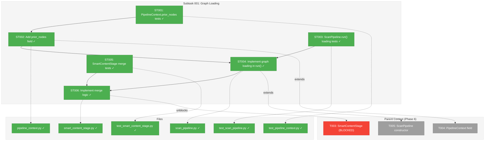
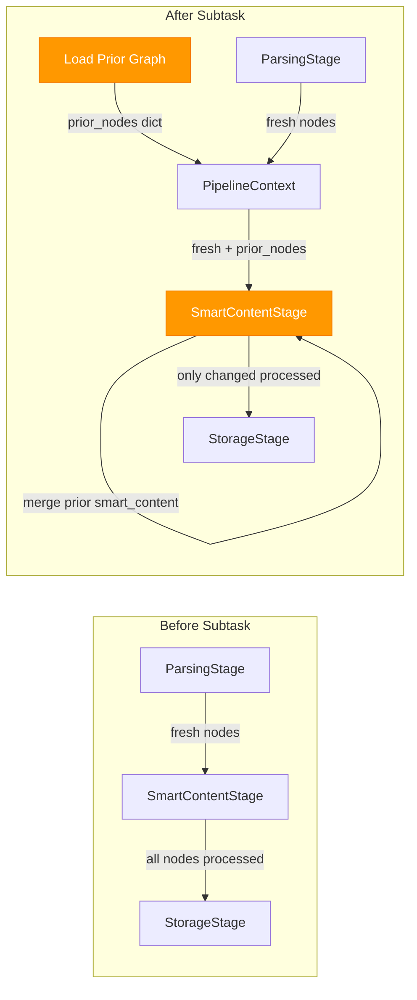
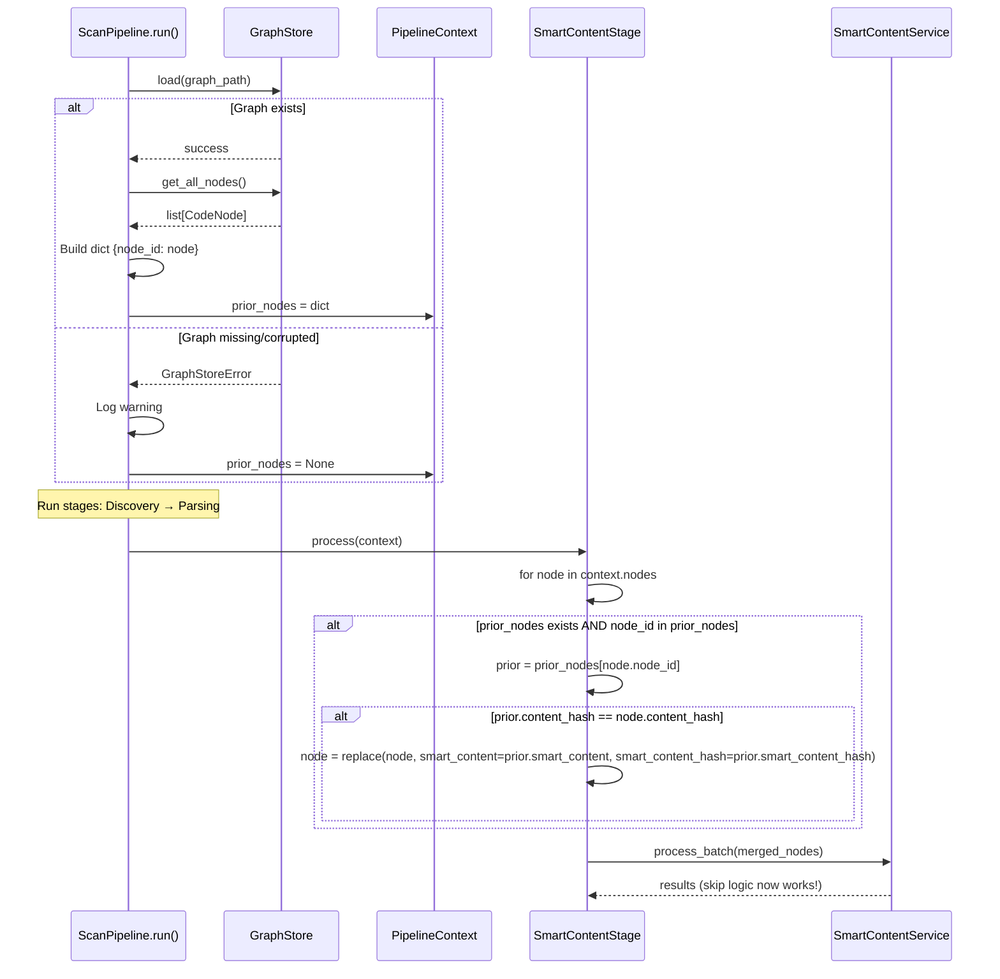

# Subtask 001: Graph Loading for Smart Content Preservation

**Parent Plan:** [View Plan](../../smart-content-plan.md)
**Parent Phase:** Phase 6: Scan Pipeline Integration
**Parent Task(s):** [T003](../tasks.md#t003), [T004](../tasks.md#t004), [T005](../tasks.md#t005)
**Plan Task Reference:** [Task 6.3, 6.4, 6.5 in Plan](../../smart-content-plan.md#phase-6-scan-pipeline-integration)

**Why This Subtask:**
Hash-based skip logic (AC5) requires access to prior `smart_content` and `smart_content_hash` values from previous scans. However, the current pipeline creates fresh `CodeNode` objects from source parsing on each scan—these fresh nodes have `smart_content = None` and `smart_content_hash = None`, causing the skip logic to fail (all nodes re-processed every scan). This subtask adds graph loading to `ScanPipeline.run()` and merge logic to `SmartContentStage` to preserve prior smart content across scans.

**Created:** 2025-12-19
**Requested By:** Development Team (via /didyouknow Insight #1 discussion)

---

## Executive Briefing

### Purpose
This subtask enables hash-based skip logic (AC5/AC6) to actually work across scans. Without it, every `fs2 scan` regenerates smart content for ALL nodes—defeating the cost optimization and causing unnecessary LLM API calls.

### What We're Building
Pipeline infrastructure that preserves smart content across scans:

1. **PipelineContext.prior_nodes** - New field holding `dict[str, CodeNode]` from previous graph
2. **ScanPipeline.run() graph loading** - Loads existing graph at scan start (if exists)
3. **SmartContentStage merge logic** - Copies prior `smart_content`/`smart_content_hash` to fresh nodes before processing

### Unblocks
- **T003**: SmartContentStage implementation - needs prior_nodes for merge logic
- **T004**: PipelineContext update - needs prior_nodes field in addition to smart_content_service
- **T005**: ScanPipeline constructor - run() needs to load graph before stages execute

### Example

**Before (broken skip logic)**:
```
Scan 1: Parse files → 500 nodes (all have smart_content=None) → Generate smart content for ALL 500 → Save
Scan 2: Parse files → 500 nodes (all have smart_content=None) → Generate smart content for ALL 500 again!
Cost: $50 per scan (500 nodes × $0.10/call)
```

**After (working skip logic)**:
```
Scan 1: Parse files → 500 nodes → Load prior graph (empty) → No merge → Generate ALL 500 → Save
Scan 2: Parse files → 500 nodes → Load prior graph (500 nodes) → Merge prior smart_content → Only 5 changed → Generate 5 → Save
Cost: Scan 1 = $50, Scan 2 = $0.50 (5 changed nodes × $0.10/call)
```

---

## Objectives & Scope

### Objective
Enable hash-based skip logic (AC5/AC6) by loading prior graph state and merging `smart_content`/`smart_content_hash` to freshly parsed nodes before SmartContentStage processing.

### Goals

- ✅ Add `prior_nodes: dict[str, CodeNode] | None` field to `PipelineContext`
- ✅ Update `ScanPipeline.run()` to load existing graph before running stages
- ✅ Build `prior_nodes` dict from loaded graph for efficient O(1) lookup
- ✅ Add merge logic to SmartContentStage: copy prior smart_content if content_hash matches
- ✅ Handle first-scan case gracefully (no prior graph exists)
- ✅ Handle corrupted graph case gracefully (log warning, continue with empty prior_nodes)
- ✅ Write tests for all scenarios (TDD)

### Non-Goals

- ❌ Delta file scanning (only parse changed files) - out of scope per spec
- ❌ Deleted node tracking/logging - nodes just vanish (per workshop decision)
- ❌ Graph migration between format versions - existing load() handles this
- ❌ Caching prior_nodes between pipeline runs - fresh load each time

---

## Architecture Map

### Component Diagram
<!-- Status: grey=pending, orange=in-progress, green=completed, red=blocked -->
<!-- Updated by plan-6 during implementation -->



### Task-to-Component Mapping

<!-- Status: ⬜ Pending | 🟧 In Progress | ✅ Complete | 🔴 Blocked -->

| Task | Component(s) | Files | Status | Comment |
|------|-------------|-------|--------|---------|
| ST001 | PipelineContext Tests | test_pipeline_context.py | ✅ Complete | TDD: Test prior_nodes field existence and typing |
| ST002 | PipelineContext | pipeline_context.py | ✅ Complete | Add prior_nodes: dict[str, CodeNode] \| None field |
| ST003 | ScanPipeline Loading Tests | test_scan_pipeline.py | ✅ Complete | TDD: Test graph loading before stages, first-scan case |
| ST004 | ScanPipeline | scan_pipeline.py | ✅ Complete | Load graph in run(), build prior_nodes dict |
| ST005 | SmartContentStage Merge Tests | test_smart_content_stage.py | ✅ Complete | TDD: Test merge logic, hash matching |
| ST006 | SmartContentStage | smart_content_stage.py | ✅ Complete | Merge prior smart_content before processing |

---

## Tasks

| Status | ID | Task | CS | Type | Dependencies | Absolute Path(s) | Validation | Subtasks | Notes |
|--------|------|------|-----|------|--------------|------------------|------------|----------|-------|
| [x] | ST001 | Write tests for PipelineContext.prior_nodes field | 1 | Test | – | `/workspaces/flow_squared/tests/unit/services/test_pipeline_context.py` | Tests cover: field exists, optional typing, None default | – | TDD RED |
| [x] | ST002 | Add prior_nodes field to PipelineContext | 1 | Core | ST001 | `/workspaces/flow_squared/src/fs2/core/services/pipeline_context.py` | All ST001 tests pass; field typed as `dict[str, CodeNode] \| None` | – | Extends T004 |
| [x] | ST003 | Write tests for ScanPipeline.run() graph loading | 2 | Test | – | `/workspaces/flow_squared/tests/unit/services/test_scan_pipeline.py` | Tests cover: loads existing graph, first-scan (no graph), corrupted graph | – | TDD RED |
| [x] | ST004 | Implement graph loading in ScanPipeline.run() | 2 | Core | ST002, ST003 | `/workspaces/flow_squared/src/fs2/core/services/scan_pipeline.py` | All ST003 tests pass; prior_nodes built as dict; handles missing/corrupted gracefully | – | Extends T005 |
| [x] | ST005 | Write tests for SmartContentStage merge logic | 2 | Test | – | `/workspaces/flow_squared/tests/unit/services/stages/test_smart_content_stage.py` | Tests cover: merge when hash matches, skip merge when hash differs, no prior_nodes | – | TDD RED |
| [x] | ST006 | Implement merge logic in SmartContentStage.process() | 2 | Core | ST004, ST005 | `/workspaces/flow_squared/src/fs2/core/services/stages/smart_content_stage.py` | All ST005 tests pass; merge before calling service.process_batch() | – | Unblocks T003 |

---

## Alignment Brief

### Objective Recap
Enable hash-based skip logic (AC5/AC6) to work across scans by loading prior graph state and preserving `smart_content`/`smart_content_hash` on unchanged nodes.

### Prior Phase Dependencies
- **Phase 1-4**: SmartContentService with `_should_skip()` logic expects nodes to have prior `smart_content_hash`
- **Phase 6 T003**: SmartContentStage calls `process_batch()` which uses skip logic internally

### Critical Findings Affecting This Subtask

| Finding | Constraint/Requirement | Tasks Affected |
|---------|------------------------|----------------|
| **CD03**: Frozen Dataclass Immutability | Use `dataclasses.replace()` for merge | ST006 |
| **CD10**: Stateless Service Design | prior_nodes passed via context, not stored on stage | ST006 |
| **Workshop Decision**: Pipeline owns loading | ScanPipeline.run() loads graph, not CLI | ST004 |
| **Workshop Decision**: Node matching by node_id | Dict keyed by node_id for O(1) lookup | ST004, ST006 |
| **Workshop Decision**: Deleted nodes vanish | No explicit tracking needed | ST004 |

### ADR Decision Constraints

N/A - No ADRs exist for this feature.

### Invariants & Guardrails

- **First-scan safety**: If no graph exists, `prior_nodes = None` (not empty dict)
- **Corrupted graph safety**: Log warning and continue with `prior_nodes = None`
- **Node identity**: Match by `node_id` string (e.g., `callable:src/foo.py:bar`)
- **Hash comparison**: Only copy `smart_content` if `prior.content_hash == fresh.content_hash`
- **Immutability**: Use `dataclasses.replace()` for all CodeNode modifications

### Inputs to Read

| File | Purpose |
|------|---------|
| `/workspaces/flow_squared/src/fs2/core/services/scan_pipeline.py` | Current run() implementation |
| `/workspaces/flow_squared/src/fs2/core/services/pipeline_context.py` | Current context fields |
| `/workspaces/flow_squared/src/fs2/core/repos/graph_store.py` | GraphStore.load() and get_all_nodes() API |
| `/workspaces/flow_squared/src/fs2/core/services/smart_content/smart_content_service.py` | _should_skip() logic reference |

### Visual Alignment Aids

#### Data Flow Diagram



#### Merge Logic Sequence



### Test Plan (TDD)

#### ST001: PipelineContext.prior_nodes Tests

| Test Name | Purpose | Expected Outcome |
|-----------|---------|------------------|
| `test_prior_nodes_field_exists` | Field is defined | `prior_nodes` attribute exists on PipelineContext |
| `test_prior_nodes_default_none` | Default value | `prior_nodes` defaults to None when not provided |
| `test_prior_nodes_accepts_dict` | Type checking | Can set `prior_nodes` to `dict[str, CodeNode]` |

#### ST003: ScanPipeline Graph Loading Tests

| Test Name | Purpose | Expected Outcome |
|-----------|---------|------------------|
| `test_run_loads_existing_graph` | Loads prior graph | `context.prior_nodes` populated with nodes from graph |
| `test_run_first_scan_no_graph` | First scan graceful | `context.prior_nodes = None`, no error |
| `test_run_corrupted_graph_continues` | Corrupted graph graceful | Warning logged, `prior_nodes = None`, scan continues |
| `test_prior_nodes_is_dict_by_node_id` | Dict structure | Keys are node_id strings, values are CodeNode |

#### ST005: SmartContentStage Merge Tests

| Test Name | Purpose | Expected Outcome |
|-----------|---------|------------------|
| `test_merge_copies_smart_content_when_hash_matches` | Happy path | Node gets prior smart_content/hash when content_hash matches |
| `test_merge_skips_when_hash_differs` | Content changed | Node keeps smart_content=None when hash differs |
| `test_merge_skips_when_no_prior_node` | New file | Node keeps smart_content=None when not in prior_nodes |
| `test_merge_skips_when_prior_nodes_none` | First scan | Works without error when prior_nodes=None |

### Step-by-Step Implementation Outline

1. **ST001** (RED): Write failing tests for `PipelineContext.prior_nodes`
2. **ST002** (GREEN): Add field to PipelineContext dataclass
3. **ST003** (RED): Write failing tests for `ScanPipeline.run()` graph loading
4. **ST004** (GREEN): Implement loading in run(), build dict, set context.prior_nodes
5. **ST005** (RED): Write failing tests for SmartContentStage merge logic
6. **ST006** (GREEN): Implement merge in stage.process() before calling service

### Commands to Run

```bash
# Environment setup
cd /workspaces/flow_squared
uv sync

# Run subtask tests
uv run pytest tests/unit/services/test_pipeline_context.py -v -k prior_nodes
uv run pytest tests/unit/services/test_scan_pipeline.py -v -k prior_nodes
uv run pytest tests/unit/services/stages/test_smart_content_stage.py -v -k merge

# Run all Phase 6 tests
uv run pytest tests/unit/services/stages/test_smart_content_stage.py -v
uv run pytest tests/unit/services/test_scan_pipeline.py -v

# Linting
uv run ruff check src/fs2/core/services/pipeline_context.py src/fs2/core/services/scan_pipeline.py

# Type checking
uv run mypy src/fs2/core/services/
```

### Risks/Unknowns

| Risk | Severity | Mitigation |
|------|----------|------------|
| Graph loading slows down scan start | Low | get_all_nodes() is O(n) but n is typically <10k; log timing |
| Memory usage with large prior_nodes dict | Low | Dict of CodeNode references, not copies; Python handles this |
| Race condition if graph modified during scan | Very Low | Single-process CLI; graph_store.load() is atomic file read |

### Ready Check

- [x] GraphStore.load() and get_all_nodes() API understood
- [x] SmartContentService._should_skip() logic understood
- [x] PipelineContext is mutable dataclass (not frozen)
- [x] CD03 (frozen dataclass) applies to CodeNode, not context
- [x] Workshop decisions captured (pipeline owns loading, node_id matching, vanish deleted)
- [ ] Tests written (ST001, ST003, ST005) – created by this subtask

**Awaiting GO/NO-GO from human sponsor before implementation.**

---

## Phase Footnote Stubs

_Populated by plan-6 after implementation. Each footnote links implementation evidence to tasks._

| Footnote | Node ID | Type | Tasks | Description |
|----------|---------|------|-------|-------------|
| | | | | |

_Reserved footnotes: Per plan ledger._

---

## Evidence Artifacts

| Artifact | Location | Purpose |
|----------|----------|---------|
| Execution Log | `./001-subtask-graph-loading-for-smart-content-preservation.execution.log.md` | Narrative record of implementation |
| Test Results | Console output | pytest results proving coverage |

---

## Discoveries & Learnings

_Populated during implementation by plan-6. Log anything of interest to your future self._

| Date | Task | Type | Discovery | Resolution | References |
|------|------|------|-----------|------------|------------|
| | | | | | |

**Types**: `gotcha` | `research-needed` | `unexpected-behavior` | `workaround` | `decision` | `debt` | `insight`

**What to log**:
- Things that didn't work as expected
- External research that was required
- Implementation troubles and how they were resolved
- Gotchas and edge cases discovered
- Decisions made during implementation
- Technical debt introduced (and why)
- Insights that future phases should know about

_See also: `execution.log.md` for detailed narrative._

---

## After Subtask Completion

**This subtask resolves a blocker for:**
- Parent Tasks: [T003: SmartContentStage](../tasks.md#t003), [T004: PipelineContext](../tasks.md#t004), [T005: ScanPipeline](../tasks.md#t005)
- Plan Tasks: [6.3, 6.4, 6.5 in Plan](../../smart-content-plan.md#phase-6-scan-pipeline-integration)

**When all ST### tasks complete:**

1. **Record completion** in parent execution log:
   ```
   ### Subtask 001-subtask-graph-loading-for-smart-content-preservation Complete

   Resolved: Hash-based skip logic now works across scans. Prior smart_content
   preserved for unchanged nodes. Tested with FakeGraphStore.
   See detailed log: [subtask execution log](./001-subtask-graph-loading-for-smart-content-preservation.execution.log.md)
   ```

2. **Update parent tasks** (if blocked):
   - Open: [`tasks.md`](./tasks.md)
   - Find: T003, T004, T005
   - Update Notes: Add "Subtask 001 complete - prior_nodes available"

3. **Resume parent phase work:**
   ```bash
   /plan-6-implement-phase --phase "Phase 6: Scan Pipeline Integration" \
     --plan "/workspaces/flow_squared/docs/plans/008-smart-content/smart-content-plan.md"
   ```
   (Note: NO `--subtask` flag to resume main phase)

**Quick Links:**
- 📋 [Parent Dossier](./tasks.md)
- 📄 [Parent Plan](../../smart-content-plan.md)
- 📊 [Parent Execution Log](./execution.log.md)

---

## Directory Layout

```
docs/plans/008-smart-content/
├── smart-content-spec.md
├── smart-content-plan.md
└── tasks/
    └── phase-6-scan-pipeline-integration/
        ├── tasks.md                                              # Parent dossier
        ├── execution.log.md                                       # Created by /plan-6
        ├── 001-subtask-graph-loading-for-smart-content-preservation.md           # This file
        └── 001-subtask-graph-loading-for-smart-content-preservation.execution.log.md  # Created by /plan-6
```

---

**Subtask Status**: ✅ COMPLETE
**Completed**: 2025-12-19
**All 6 ST tasks passed TDD verification**
