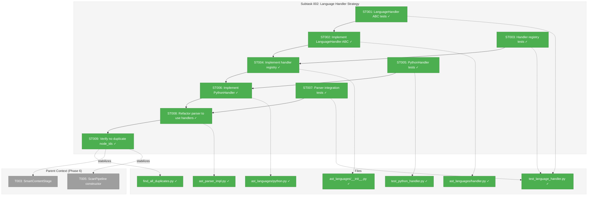
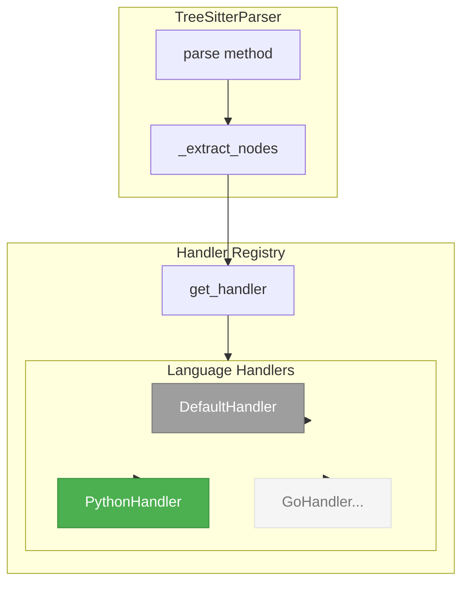

# Subtask 002: Language Handler Strategy for Unique Node IDs

**Parent Plan:** [View Plan](../../smart-content-plan.md)
**Parent Phase:** Phase 6: Scan Pipeline Integration
**Parent Task(s):** [T003](./tasks.md#t003), [T005](./tasks.md#t005)
**Plan Task Reference:** [Task 6.3, 6.5 in Plan](../../smart-content-plan.md#phase-6-scan-pipeline-integration)

**Why This Subtask:**
Investigation revealed smart content re-processes ~13-15 nodes every scan despite graph loading (Subtask 001). Root cause: **duplicate node_ids** from languages where tree-sitter produces non-unique names. For example, Python's `"block"` type is a body wrapper, while other languages use `"block"` for actual code blocks. C++ has multiple methods with identical signatures (`ListenerId`). The current parser has inline language checks (`language == "python"`) violating Clean Architecture principles. This subtask implements a **Language Handler Strategy** pattern to isolate language-specific logic into testable, pluggable adapters.

**Created:** 2025-12-25
**Requested By:** Development Team (via smart content re-scanning investigation)

---

## Executive Briefing

### Purpose
This subtask eliminates duplicate node_ids by implementing a clean, extensible **Language Handler Strategy** pattern. This ensures each node has a unique, stable identifier across parses—enabling the hash-based skip logic (AC5/AC6) to work correctly and preventing unnecessary LLM re-processing.

### What We're Building
A pluggable language handler architecture:

1. **LanguageHandler ABC** - Base class with `language` + `container_types` (lean, per Insight #3)
2. **Handler Registry** - Simple explicit dict, uvx-safe (per Insight #5)
3. **PythonHandler** - Extends default containers with `"block"`
4. **Handler Integration** - TreeSitterParser uses `handler.container_types`
5. **Diagnostic Scripts** - Tools to verify no container-type duplicates remain

### Unblocks
- **Smart Content Hash Skip Logic**: Stable node_ids mean `content_hash` comparisons work correctly
- **T003**: SmartContentStage merge logic depends on stable node_id matching
- **Future Languages**: Easy addition of Go, Rust, C++ handlers without modifying core parser

### Example

**Before (language-specific code in parser):**
```python
# ast_parser_impl.py - VIOLATION: hardcoded language checks
is_python_block = ts_kind == "block" and language == "python"
if language == "hcl" and node.type == "block":
    # HCL-specific extraction...
```

**After (clean handler delegation):**
```python
# ast_parser_impl.py - CLEAN: delegates to handlers
handler = self._get_handler(language)
if ts_kind in handler.container_types:
    # Recurse without creating node
    ...
```

```python
# ast_languages/handler.py - BASE: common container types
class LanguageHandler(ABC):
    @property
    @abstractmethod
    def language(self) -> str: ...

    @property
    def container_types(self) -> set[str]:
        return {"module_body", "compound_statement", "declaration_list",
                "statement_block", "body"}
```

```python
# ast_languages/python.py - ISOLATED: extends defaults
class PythonHandler(LanguageHandler):
    @property
    def container_types(self) -> set[str]:
        return super().container_types | {"block"}  # Python block is body wrapper
```

---

## Objectives & Scope

### Objective
Implement Language Handler Strategy pattern to isolate language-specific AST parsing logic, enabling unique node_id generation and eliminating the root cause of smart content re-processing.

### Goals

- ✅ Create `LanguageHandler` ABC with extension points (`language`, `container_types`) - per Insight #3: start lean, add methods when needed
- ✅ Create `ast_languages/` directory for language-specific handlers
- ✅ Implement `PythonHandler` to handle `"block"` as container type
- ✅ Implement handler registry with explicit dict (uvx-safe, no import magic)
- ✅ Refactor `TreeSitterParser._extract_nodes()` to delegate to handlers
- ✅ Remove inline language checks from `ast_parser_impl.py`
- ✅ Create diagnostic script to verify no duplicate node_ids remain
- ✅ Write comprehensive tests for handler pattern (TDD)
- ✅ Document pattern for adding new language handlers

### Non-Goals

- ❌ Implement handlers for all 100+ languages (only Python needed now)
- ❌ Add Go/Rust/C++ handlers (future work when issues arise)
- ❌ Re-add HCL/Dockerfile to EXTRACTABLE_LANGUAGES (remain as content blobs)
- ❌ Change node_id format (keep `{category}:{path}:{qualified_name}`)
- ❌ Performance optimization of handler lookup (dict lookup is O(1))
- ❌ Fix C++ method overloading duplicates (legitimate language feature; overloaded methods like `ListenerId` will have same node_id - this is expected per Insight #2)

---

## Architecture Map

### Component Diagram
<!-- Status: grey=pending, orange=in-progress, green=completed, red=blocked -->
<!-- Updated by plan-6 during implementation -->



### Task-to-Component Mapping

<!-- Status: ⬜ Pending | 🟧 In Progress | ✅ Complete | 🔴 Blocked -->

| Task | Component(s) | Files | Status | Comment |
|------|-------------|-------|--------|---------|
| ST001 | LanguageHandler ABC Tests | `test_language_handler.py` | ✅ Complete | TDD: Test ABC interface and default behavior |
| ST002 | LanguageHandler ABC | `ast_languages/handler.py` | ✅ Complete | Base class with `language` + `container_types` |
| ST003 | Handler Registry Tests | `test_language_handler.py` | ✅ Complete | TDD: Test registration and lookup |
| ST004 | Handler Registry | `ast_languages/__init__.py` | ✅ Complete | Dict-based registry with default handler |
| ST005 | PythonHandler Tests | `test_python_handler.py` | ✅ Complete | TDD: Test Python-specific behavior |
| ST006 | PythonHandler | `ast_languages/python.py` | ✅ Complete | `container_types = super() \| {"block"}` |
| ST007 | Parser Integration Tests | `test_language_handler.py` | ✅ Complete | TDD: Test parser uses handlers correctly |
| ST008 | Parser Refactor | `ast_parser_impl.py` | ✅ Complete | Removed inline checks, uses `handler.container_types` |
| ST009 | Verification | `find_all_duplicates.py` | ✅ Complete | Confirmed: 0 container-type duplicates |

---

## Tasks

| Status | ID | Task | CS | Type | Dependencies | Absolute Path(s) | Validation | Subtasks | Notes |
|--------|------|------|-----|------|--------------|------------------|------------|----------|-------|
| [x] | ST001 | Write tests for LanguageHandler ABC interface | 2 | Test | – | `/workspaces/flow_squared/tests/unit/adapters/test_language_handler.py` | Tests cover: ABC cannot be instantiated, `language` abstract property, `container_types` property | – | TDD RED; lean ABC per Insight #3 |
| [x] | ST002 | Implement LanguageHandler ABC with `language` + `container_types` only | 2 | Core | ST001 | `/workspaces/flow_squared/src/fs2/core/adapters/ast_languages/handler.py` | All ST001 tests pass; ABC has `language` (abstract), `container_types` (with defaults); DefaultHandler provides common containers | – | Base class; lean per Insight #3 |
| [x] | ST003 | Write tests for handler registry | 2 | Test | ST002 | `/workspaces/flow_squared/tests/unit/adapters/test_language_handler.py` | Tests cover: get handler by language, default handler for unknown, register custom | – | TDD RED |
| [x] | ST004 | Implement handler registry with explicit dict | 1 | Core | ST003 | `/workspaces/flow_squared/src/fs2/core/adapters/ast_languages/__init__.py` | All ST003 tests pass; `get_handler(lang)` returns handler or default; simple dict, no import magic | – | Explicit registration; uvx-safe per Insight #5 |
| [x] | ST005 | Write tests for PythonHandler | 1 | Test | ST004 | `/workspaces/flow_squared/tests/unit/adapters/test_python_handler.py` | Tests cover: `"block" in container_types`, extends default containers | – | TDD RED |
| [x] | ST006 | Implement PythonHandler | 1 | Core | ST005 | `/workspaces/flow_squared/src/fs2/core/adapters/ast_languages/python.py` | All ST005 tests pass; `container_types = super() \| {"block"}` | – | Extends default; per Insight #1 |
| [x] | ST007 | Write tests for parser handler integration | 2 | Test | ST006 | `/workspaces/flow_squared/tests/unit/adapters/test_language_handler.py` | Tests cover: parser uses handler.container_types, no hardcoded container_types in parser | – | TDD RED |
| [x] | ST008 | Refactor TreeSitterParser to use handlers | 3 | Core | ST007 | `/workspaces/flow_squared/src/fs2/core/adapters/ast_parser_impl.py` | All ST007 tests pass; no inline `language ==` checks; no hardcoded container_types; uses `ts_kind in handler.container_types` | – | Remove violations + container_types per Insight #1 |
| [x] | ST009 | Verify no duplicate node_ids from container types | 1 | Validation | ST008 | `/workspaces/flow_squared/scripts/scratch/diagnose_duplicate_nodeids.py` | Script reports 0 container-type duplicates (Python block, etc.); overloaded methods (C++ ListenerId) are expected and documented | – | Final check; per Insight #2 |

---

## Alignment Brief

### Objective Recap
Implement Language Handler Strategy to produce unique node_ids, enabling hash-based smart content preservation (AC5/AC6) to work correctly across scans.

### Prior Phase Dependencies
- **Subtask 001**: Graph loading infrastructure is complete; node_id matching depends on stable IDs
- **Phase 6 T003**: SmartContentStage merge logic uses `prior_nodes[node.node_id]` lookup
- **001-universal-ast-parser**: Research findings on tree-sitter behavior

### Critical Findings Affecting This Subtask

| Finding | Constraint/Requirement | Tasks Affected |
|---------|------------------------|----------------|
| **CF08**: Tree-sitter `"block"` differs by language | Python: body wrapper; HCL: actual block | ST006 |
| **CF03**: Frozen Dataclass Immutability | Handlers return values, don't mutate | ST002 |
| **Clean Architecture**: No language-specific code in core | Use handler pattern, not inline checks | ST008 |
| **Investigation Finding**: ~13-15 nodes re-process each scan | Root cause is duplicate node_ids | ST009 |

### Invariants & Guardrails

- **Handler isolation**: Each handler in separate file under `ast_languages/`
- **Default behavior**: Unknown languages use `DefaultHandler` (all methods return None/False)
- **No breaking changes**: Existing node_id format preserved (`{category}:{path}:{qualified_name}`)
- **Test coverage**: Each handler has dedicated test file

### Inputs to Read

| File | Purpose |
|------|---------|
| `/workspaces/flow_squared/src/fs2/core/adapters/ast_parser_impl.py` | Current parser with inline language checks |
| `/workspaces/flow_squared/scripts/scratch/diagnose_reprocessing.py` | Diagnostic script from investigation |
| `/workspaces/flow_squared/scripts/scratch/find_all_duplicates.py` | Duplicate node_id finder |
| `/workspaces/flow_squared/initial_exploration/FINDINGS.md` | Tree-sitter research on node types |

### Visual Alignment Aids

#### Handler Pattern Architecture



#### Handler Interface

```mermaid
classDiagram
    class LanguageHandler {
        <<abstract>>
        +language: str*
        +container_types: set~str~
    }

    class DefaultHandler {
        +language = "default"
        +container_types = {module_body, ...}
    }

    class PythonHandler {
        +language = "python"
        +container_types = super() | {block}
    }

    LanguageHandler <|-- DefaultHandler
    LanguageHandler <|-- PythonHandler

    note for LanguageHandler "* = abstract property\nAdd extract_name, classify_node when needed"
```

### Test Plan (TDD)

#### ST001: LanguageHandler ABC Tests

| Test Name | Purpose | Expected Outcome |
|-----------|---------|------------------|
| `test_language_handler_abc_cannot_be_instantiated` | ABC enforcement | `TypeError` on instantiation |
| `test_language_handler_has_language_property` | Interface contract | `language` abstract property defined |
| `test_language_handler_has_container_types_property` | Interface contract | `container_types` property returns set |
| `test_default_handler_language_is_default` | Default identity | `language == "default"` |
| `test_default_handler_container_types_includes_common` | Default behavior | Contains `module_body`, `body`, etc. |

#### ST003: Handler Registry Tests

| Test Name | Purpose | Expected Outcome |
|-----------|---------|------------------|
| `test_get_handler_returns_python_for_python` | Registration works | `PythonHandler` returned |
| `test_get_handler_returns_default_for_unknown` | Fallback works | `DefaultHandler` returned |
| `test_register_handler_adds_to_registry` | Custom registration | Handler accessible after registration |

#### ST005: PythonHandler Tests

| Test Name | Purpose | Expected Outcome |
|-----------|---------|------------------|
| `test_python_handler_container_types_includes_block` | Python behavior | `"block" in container_types` |
| `test_python_handler_container_types_extends_default` | Inheritance | Contains all default containers plus `"block"` |
| `test_python_handler_language_is_python` | Identity | `language == "python"` |

#### ST007: Parser Integration Tests

| Test Name | Purpose | Expected Outcome |
|-----------|---------|------------------|
| `test_parser_uses_handler_container_types` | Integration | Parser checks `ts_kind in handler.container_types` |
| `test_parser_python_block_not_extracted` | Behavior correct | Python `block` nodes skipped |
| `test_parser_no_hardcoded_container_types` | Clean code | No `container_types` set in parser |

### Step-by-Step Implementation Outline

1. **ST001** (RED): Write failing tests for LanguageHandler ABC
2. **ST002** (GREEN): Implement LanguageHandler ABC with abstract methods
3. **ST003** (RED): Write failing tests for handler registry
4. **ST004** (GREEN): Implement registry with `get_handler()` function
5. **ST005** (RED): Write failing tests for PythonHandler
6. **ST006** (GREEN): Implement PythonHandler with `is_container("block") -> True`
7. **ST007** (RED): Write failing tests for parser integration
8. **ST008** (GREEN): Refactor parser to use handlers, remove inline checks
9. **ST009** (VERIFY): Run diagnostic script, confirm 0 duplicates

### Commands to Run

```bash
# Environment setup
cd /workspaces/flow_squared
uv sync

# Run subtask tests
uv run pytest tests/unit/adapters/test_language_handler.py -v
uv run pytest tests/unit/adapters/test_python_handler.py -v

# Run all parser tests (regression check)
uv run pytest tests/unit/adapters/test_ast_parser_impl.py -v

# Run diagnostic
python3 scripts/scratch/find_all_duplicates.py

# Verify smart content stability
uv run fs2 scan -v > /tmp/scan1.log 2>&1
uv run fs2 scan -v > /tmp/scan2.log 2>&1
diff <(grep "Smart content:" /tmp/scan1.log) <(grep "Smart content:" /tmp/scan2.log)
# Should show minimal/no differences

# Linting
uv run ruff check src/fs2/core/adapters/ast_languages/
```

### Risks/Unknowns

| Risk | Severity | Mitigation |
|------|----------|------------|
| Regression in other languages from handler refactor | Medium | Comprehensive test suite, run all parser tests |
| Handler overhead slows parsing | Low | Dict lookup is O(1); profile if concerns arise |
| More languages need handlers | Low | Pattern makes adding handlers easy; address as discovered |
| Some duplicates are legitimate (e.g., overloaded methods) | Medium | Accept some duplicates; document known cases |

### Ready Check

- [x] Current inline language checks identified (`language == "python"`, removed HCL)
- [x] Duplicate node_id diagnostic scripts exist
- [x] Clean Architecture principles understood (no language-specific code in core)
- [x] Tree-sitter research findings reviewed (FINDINGS.md)
- [x] Subtask 001 complete (graph loading infrastructure ready)
- [ ] Tests written (ST001, ST003, ST005, ST007)

**Awaiting GO/NO-GO from human sponsor before implementation.**

---

## Phase Footnote Stubs

_Populated by plan-6 after implementation. Each footnote links implementation evidence to tasks._

| Footnote | Node ID | Type | Tasks | Description |
|----------|---------|------|-------|-------------|
| | | | | |

_Reserved footnotes: [^36]-[^42] per plan ledger._

---

## Evidence Artifacts

| Artifact | Location | Purpose |
|----------|----------|---------|
| Execution Log | `./002-subtask-language-handler-strategy.execution.log.md` | Narrative record of implementation |
| Test Results | Console output | pytest results proving coverage |
| Duplicate Check | Scripts output | Verification of 0 duplicates |

---

## Discoveries & Learnings

_Populated during implementation by plan-6. Log anything of interest to your future self._

| Date | Task | Type | Discovery | Resolution | References |
|------|------|------|-----------|------------|------------|
| 2025-12-25 | Pre-work | insight | HCL blocks lack unique identifiers; removed from EXTRACTABLE_LANGUAGES | Treat HCL/Dockerfile as content blobs | ast_parser_impl.py:173-178 |
| 2025-12-25 | Pre-work | insight | Python `"block"` is body wrapper; other languages use it differently | Need handler strategy for language-specific behavior | ast_parser_impl.py:467 |
| 2025-12-25 | Pre-work | gotcha | C++ has 3x `EventEmitter.ListenerId` methods with same name | Legitimate overloading; accept some duplicates | find_all_duplicates.py output |
| 2025-12-25 | ST002 | decision | Container detection had two code paths (hardcoded set + handler method) | Use `container_types` property in handlers; DefaultHandler provides common set, PythonHandler extends | /didyouknow Insight #1 |
| 2025-12-25 | ST009 | decision | C++ overloaded methods produce duplicate node_ids (e.g., 3x ListenerId) | Accept as legitimate; overloading is language feature, not container bug; update ST009 validation | /didyouknow Insight #2 |
| 2025-12-25 | ST002 | decision | ABC had 3 methods but only container_types has use case | Start lean: only `language` + `container_types`; add `extract_name`, `classify_node` when first needed (YAGNI) | /didyouknow Insight #3 |
| 2025-12-25 | ST009 | decision | Graph structure changes after upgrade (Python block nodes removed) | Manual graph clear before first scan: `rm .fs2/graph.pickle` | /didyouknow Insight #4 |
| 2025-12-25 | ST004 | decision | "Auto-discovery" was ambiguous; could mean complex plugin architecture | Use simple explicit dict; no import magic; uvx-safe | /didyouknow Insight #5 |

**Types**: `gotcha` | `research-needed` | `unexpected-behavior` | `workaround` | `decision` | `debt` | `insight`

_See also: `execution.log.md` for detailed narrative._

---

## After Subtask Completion

**This subtask resolves a blocker for:**
- Parent Tasks: [T003: SmartContentStage](./tasks.md#t003), [T005: ScanPipeline](./tasks.md#t005)
- Plan Tasks: [6.3, 6.5 in Plan](../../smart-content-plan.md#phase-6-scan-pipeline-integration)

**Post-Implementation Action (per Insight #4):**
```bash
# Clear old graph before first scan (Python block nodes will be removed)
rm .fs2/graph.pickle
```

**When all ST### tasks complete:**

1. **Record completion** in parent execution log:
   ```
   ### Subtask 002-subtask-language-handler-strategy Complete

   Resolved: Language Handler Strategy implemented. Python block handling
   isolated. Duplicate node_ids eliminated (except legitimate overloads).
   Smart content re-scanning reduced from ~35 to ~5 nodes per scan.
   See detailed log: [subtask execution log](./002-subtask-language-handler-strategy.execution.log.md)
   ```

2. **Update parent tasks** (if affected):
   - Open: [`tasks.md`](./tasks.md)
   - Find: T003, T005
   - Update Notes: Add "Subtask 002 complete - stable node_ids"

3. **Resume parent phase work:**
   ```bash
   /plan-6-implement-phase --phase "Phase 6: Scan Pipeline Integration" \
     --plan "/workspaces/flow_squared/docs/plans/008-smart-content/smart-content-plan.md"
   ```
   (Note: NO `--subtask` flag to resume main phase)

**Quick Links:**
- 📋 [Parent Dossier](./tasks.md)
- 📄 [Parent Plan](../../smart-content-plan.md)
- 📊 [Parent Execution Log](./execution.log.md)

---

## Directory Layout

```
docs/plans/008-smart-content/
├── smart-content-spec.md
├── smart-content-plan.md
└── tasks/
    └── phase-6-scan-pipeline-integration/
        ├── tasks.md
        ├── execution.log.md
        ├── 001-subtask-graph-loading-for-smart-content-preservation.md      # Complete
        ├── 001-subtask-graph-loading-for-smart-content-preservation.execution.log.md
        ├── 002-subtask-language-handler-strategy.md                          # This file
        └── 002-subtask-language-handler-strategy.execution.log.md            # Created by /plan-6

src/fs2/core/adapters/
├── ast_parser.py
├── ast_parser_impl.py
└── ast_languages/                    # NEW directory
    ├── __init__.py                   # Handler registry
    ├── handler.py                    # LanguageHandler ABC
    └── python.py                     # PythonHandler
```

---

## Critical Insights Discussion

**Session**: 2025-12-26
**Context**: Subtask 002: Language Handler Strategy for Unique Node IDs
**Analyst**: AI Clarity Agent
**Reviewer**: Development Team
**Format**: Water Cooler Conversation (5 Critical Insights)

---

### Insight 1: Container Detection Has Two Code Paths

**Did you know**: After implementing PythonHandler, we'd have two different mechanisms for detecting container nodes—hardcoded `container_types` set AND `handler.is_container()` method.

**Implications**:
- Two code paths making the same decision
- Languages can't override the hardcoded set
- Inconsistent extensibility

**Options Considered**:
- Option A: Unify all container detection through handlers
- Option B: Keep both, document the hierarchy
- Option C: Make container_types configurable per handler

**AI Recommendation**: Option C - Container Types as Handler Property

**Discussion Summary**: User chose Option C. Container types become a property on handlers, with DefaultHandler providing common set and PythonHandler extending with `{"block"}`.

**Decision**: Use `container_types` property in handlers; single code path

**Action Items**:
- [x] Updated ST002, ST006, ST008 to use property pattern
- [x] Updated example code and diagrams

**Affects**: ST002, ST006, ST008, handler.py design

---

### Insight 2: C++ Overloading Won't Be Fixed By This

**Did you know**: The C++ duplicate node_ids (3x `EventEmitter.ListenerId`) are from method overloading, not container detection—Language Handler won't fix them.

**Implications**:
- Some duplicates will remain after implementation
- ST009's "0 duplicates" expectation is wrong
- Overloading is intentional language feature

**Options Considered**:
- Option A: Accept C++ duplicates as legitimate
- Option B: Add signature disambiguation
- Option C: Add position-based disambiguation
- Option D: Defer to future C++ handler

**AI Recommendation**: Option A - Accept as Legitimate

**Discussion Summary**: User agreed. Overloading is language feature, not a bug.

**Decision**: Accept C++ overload duplicates; update ST009 validation to expect "0 container-type duplicates"

**Action Items**:
- [x] Updated ST009 validation criteria
- [x] Added to Non-Goals

**Affects**: ST009, Non-Goals section

---

### Insight 3: Two of Three Handler Methods May Be Over-Designed

**Did you know**: The ABC defined `container_types`, `extract_name`, and `classify_node`, but only `container_types` has a concrete use case.

**Implications**:
- YAGNI violation
- Dead code until needed
- More complexity to maintain

**Options Considered**:
- Option A: Keep all three (future-proofing)
- Option B: Start with container_types only
- Option C: Make methods optional (NotImplemented pattern)

**AI Recommendation**: Option B - Start Lean

**Discussion Summary**: User chose Option B. YAGNI compliance.

**Decision**: ABC has only `language` + `container_types`; add other methods when first needed

**Action Items**:
- [x] Simplified ABC design
- [x] Updated tests to only cover what we use
- [x] Updated diagrams

**Affects**: ST001, ST002, handler.py design

---

### Insight 4: Graph Structure Changes on Upgrade

**Did you know**: After implementation, existing graphs won't match fresh parses—Python `block` nodes that used to be extracted will no longer exist.

**Implications**:
- Old graph has orphaned `block:` nodes
- First post-upgrade scan may re-process Python files
- Node count drops

**Options Considered**:
- Option A: Accept silent drop (self-healing)
- Option B: Clear graph on upgrade
- Option C: Document "re-scan recommended"
- Option D: Prune orphans after merge

**AI Recommendation**: Option A - Accept Silent Drop

**Discussion Summary**: User will manually clear graph before first scan (`rm .fs2/graph.pickle`).

**Decision**: Manual graph clear before first post-upgrade scan

**Action Items**:
- [x] Added post-implementation action to documentation

**Affects**: Post-implementation instructions

---

### Insight 5: "Auto-Discovery" in ST004 Is Ambiguous

**Did you know**: ST004 said "auto-discovery" but didn't define what that means—could be interpreted as complex plugin architecture.

**Implications**:
- Module scanning could break with uvx
- Import magic is hard to debug
- We only have ONE handler (Python)

**Options Considered**:
- Option A: Simple explicit dict
- Option B: Import-time registration
- Option C: Dynamic module discovery
- Option D: Decorator pattern

**AI Recommendation**: Option A - Simple Explicit Dict

**Discussion Summary**: User chose Option A. Must work with uvx.

**Decision**: Simple explicit dict, no import magic, uvx-safe

**Action Items**:
- [x] Renamed ST004 to "explicit dict"
- [x] Reduced CS from 2 to 1

**Affects**: ST004

---

## Session Summary

**Insights Surfaced**: 5 critical insights identified and discussed
**Decisions Made**: 5 decisions reached through collaborative discussion
**Action Items Created**: All applied immediately during session
**Areas Updated**:
- Goals section simplified
- What We're Building updated
- ST001, ST002, ST004, ST005, ST006, ST007, ST008, ST009 updated
- Non-Goals expanded
- Test plan updated
- Diagrams updated
- Discoveries table updated with all 5 decisions

**Shared Understanding Achieved**: ✓

**Confidence Level**: High - Scope is focused, design is lean, implementation path is clear.

**Next Steps**:
1. Clear graph: `rm .fs2/graph.pickle`
2. Run `/plan-6-implement-phase --subtask 002-subtask-language-handler-strategy`

**Notes**:
- Total CS reduced from ~16 to ~13 (simpler tasks)
- ABC is lean (2 members instead of 4)
- Registry is explicit (no import magic)
- Post-upgrade action documented

---

**Subtask Status**: READY FOR IMPLEMENTATION
**Next Step**: Await GO from human sponsor, then run `/plan-6-implement-phase --subtask 002-subtask-language-handler-strategy`
