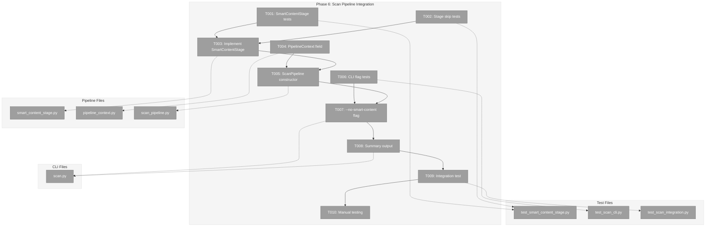
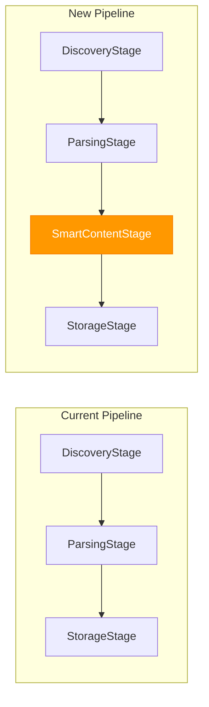
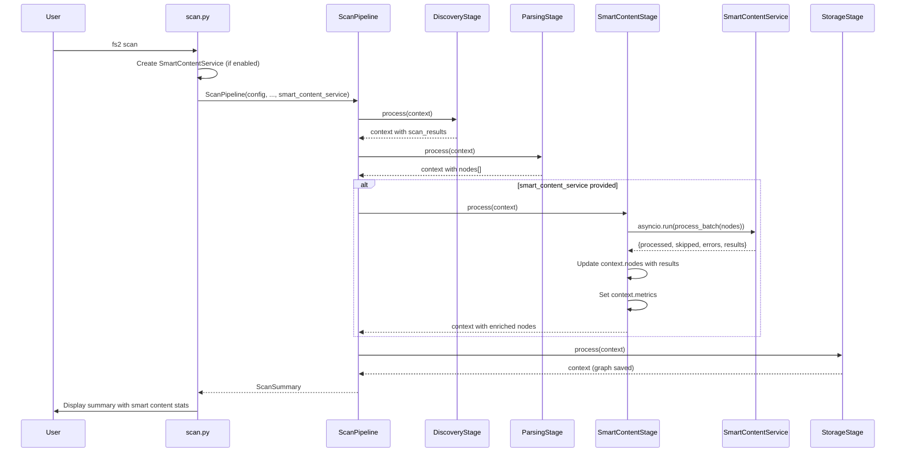

# Phase 6: Scan Pipeline Integration – Tasks & Alignment Brief

**Spec**: [../../smart-content-spec.md](../../smart-content-spec.md)
**Plan**: [../../smart-content-plan.md](../../smart-content-plan.md)
**Date**: 2025-12-19
**Testing Approach**: Full TDD
**Mock Usage**: Targeted mocks (FakeLLMAdapter, FakeGraphStore)

---

## Executive Briefing

### Purpose
This phase wires SmartContentService into the scan pipeline so that AI-powered summaries are automatically generated for every code node during `fs2 scan`. Without this integration, the SmartContentService built in Phases 1-4 is never invoked, and nodes remain without smart content.

### What We're Building
A new **SmartContentStage** that:
- Inserts between ParsingStage and StorageStage in the scan pipeline
- Calls `SmartContentService.process_batch()` on all parsed nodes
- Updates nodes with AI-generated `smart_content` before graph persistence
- Tracks metrics (processed, skipped, errors) in scan summary

Plus supporting infrastructure:
- **PipelineContext.smart_content_service** field for DI
- **ScanPipeline** constructor update to accept SmartContentService
- **`--no-smart-content`** CLI flag for opt-out fast scans
- **Scan summary** output showing smart content statistics

### User Value
After this phase, running `fs2 scan` will automatically:
- Generate AI summaries for every code node (file, class, function, etc.)
- Skip unchanged nodes on re-scans (hash-based optimization)
- Report progress: "✓ Scanned 50 files, created 200 nodes (180 enriched, 20 skipped)"

Users can access these summaries via CLI (`fs2 get-node --smart-content`) or programmatically.

### Example
```bash
# Before (no smart content generated)
$ fs2 scan
✓ Scanned 50 files, created 200 nodes
  Graph saved to .fs2/graph.pickle

# After (smart content integrated)
$ fs2 scan
✓ Scanned 50 files, created 200 nodes
  Smart content: 180 enriched, 15 skipped, 5 errors
  Graph saved to .fs2/graph.pickle

# Fast scan without AI processing
$ fs2 scan --no-smart-content
✓ Scanned 50 files, created 200 nodes (smart content: skipped)
  Graph saved to .fs2/graph.pickle
```

---

## Objectives & Scope

### Objective
Wire SmartContentService into the scan pipeline so smart content is generated automatically during `fs2 scan`, completing the spec's original Phase 5 requirement ("Wire to scan pipeline, end-to-end testing").

### Goals

- ✅ Create SmartContentStage that calls `process_batch()` on parsed nodes
- ✅ Update PipelineContext with `smart_content_service` field
- ✅ Update ScanPipeline constructor to accept SmartContentService
- ✅ Add `--no-smart-content` CLI flag for opt-out
- ✅ Update scan summary to show smart content statistics
- ✅ Handle async→sync bridge via `asyncio.run()`
- ✅ Graceful degradation on LLM errors (don't fail entire scan)
- ✅ Integration test proving end-to-end flow
- ✅ Manual testing with real Azure OpenAI

### Non-Goals

- ❌ Retry logic with exponential backoff (simple error handling sufficient)
- ❌ Circuit breaker pattern (not needed at this scale)
- ❌ Bounded queue with backpressure (unbounded sufficient)
- ❌ Distributed processing (single-process asyncio)
- ❌ Progress callbacks/event emission (logging sufficient)
- ❌ Worker health monitoring (error handling covers this)
- ❌ CLI `--content` and `--smart-content` flags (Phase 5)
- ❌ Documentation in docs/how/ (Phase 5)

---

## Architecture Map

### Component Diagram
<!-- Status: grey=pending, orange=in-progress, green=completed, red=blocked -->
<!-- Updated by plan-6 during implementation -->



### Task-to-Component Mapping

<!-- Status: ⬜ Pending | 🟧 In Progress | ✅ Complete | 🔴 Blocked -->

| Task | Component(s) | Files | Status | Comment |
|------|-------------|-------|--------|---------|
| T001 | SmartContentStage Tests | `test_smart_content_stage.py` | ⬜ Pending | TDD: RED tests for stage.process() |
| T002 | Stage Skip Tests | `test_smart_content_stage.py` | ⬜ Pending | TDD: RED tests for graceful skip |
| T003 | SmartContentStage | `smart_content_stage.py` | ⬜ Pending | GREEN: Implement stage with asyncio.run bridge |
| T004 | PipelineContext | `pipeline_context.py` | ⬜ Pending | Add smart_content_service field |
| T005 | ScanPipeline | `scan_pipeline.py` | ⬜ Pending | Accept service, inject into context |
| T006 | CLI Flag Tests | `test_scan_cli.py` | ⬜ Pending | TDD: RED tests for --no-smart-content |
| T007 | CLI Integration | `scan.py` | ⬜ Pending | Add flag, conditional DI wiring |
| T008 | Summary Output | `scan.py` | ⬜ Pending | Show smart content stats |
| T009 | Integration Test | `test_scan_integration.py` | ⬜ Pending | End-to-end with FakeLLMAdapter |
| T010 | Manual Validation | N/A | ⬜ Pending | Real Azure OpenAI testing |

---

## Tasks

| Status | ID | Task | CS | Type | Dependencies | Absolute Path(s) | Validation | Subtasks | Notes |
|--------|------|------|-----|------|--------------|------------------|------------|----------|-------|
| [ ] | T001 | Write tests for SmartContentStage.process() | 2 | Test | – | `/workspaces/flow_squared/tests/unit/services/stages/test_smart_content_stage.py` | Tests cover: service validation, batch call, node updates, metrics recording | – | Plan 6.1 |
| [ ] | T002 | Write tests for stage behavior when service is None | 1 | Test | – | `/workspaces/flow_squared/tests/unit/services/stages/test_smart_content_stage.py` | Tests cover: stage raises ValueError if service None | – | Plan 6.2 |
| [ ] | T003 | Implement SmartContentStage with asyncio.run() bridge | 2 | Core | T001, T002 | `/workspaces/flow_squared/src/fs2/core/services/stages/smart_content_stage.py` | All T001/T002 tests pass; asyncio.run() bridges sync pipeline to async service; catch nested loop RuntimeError with helpful message | 001-subtask-graph-loading, 002-subtask-language-handler-strategy | Plan 6.3; +error handling per Insight #3 |
| [ ] | T004 | Update PipelineContext with smart_content_service field | 1 | Core | – | `/workspaces/flow_squared/src/fs2/core/services/pipeline_context.py` | Field added with Optional type; existing tests pass | 001-subtask-graph-loading | Plan 6.4 |
| [ ] | T005 | Update ScanPipeline constructor to accept SmartContentService | 2 | Core | T003, T004 | `/workspaces/flow_squared/src/fs2/core/services/scan_pipeline.py` | Accepts optional service; injects into context; conditionally adds stage | 001-subtask-graph-loading, 002-subtask-language-handler-strategy | Plan 6.5 |
| [ ] | T006 | Write tests for --no-smart-content CLI flag | 2 | Test | – | `/workspaces/flow_squared/tests/unit/cli/test_scan_cli.py` | Tests cover: flag skips stage, summary reflects skip, graph saved | – | Plan 6.6 |
| [ ] | T007 | Add --no-smart-content flag to scan.py CLI | 2 | Core | T005, T006 | `/workspaces/flow_squared/src/fs2/cli/scan.py` | Flag works; DI wiring conditional; SmartContentService created only if LLM configured AND flag not set; skip gracefully if no LLM config | – | Plan 6.7; +LLM config gate per Insight #4 |
| [ ] | T008 | Update scan summary output for smart content stats | 2 | Core | T007 | `/workspaces/flow_squared/src/fs2/cli/scan.py` | Summary shows: enriched, skipped, errors counts; progress line during processing; auth errors exit 1 with clear message; rate limit errors warn but exit 0 | – | Plan 6.8; +progress per Insight #2; +error semantics per Insight #5 |
| [ ] | T009 | Write integration test: scan → smart content → graph | 3 | Test | T007, T008 | `/workspaces/flow_squared/tests/integration/test_scan_with_smart_content.py` | End-to-end: scan files, generate smart content, load graph, verify smart_content persisted | – | Plan 6.9 |
| [ ] | T010 | Manual testing with real Azure OpenAI | 2 | Validation | T009 | N/A | Scan real codebase, verify smart content quality, check performance | – | Plan 6.10 |

---

## Alignment Brief

### Prior Phases Review

#### Phase-by-Phase Summary

**Phase 1: Foundation & Infrastructure** (11 tasks, 27 tests) ✅
- Established `SmartContentConfig` with `max_workers`, `max_input_tokens`, `token_limits`
- Created `TokenCounterAdapter` family (ABC + Fake + Tiktoken) with encoder caching
- Added `compute_content_hash()` utility for SHA-256 hashing
- Extended `CodeNode` with `content_hash` field (required)
- Created exception hierarchy: `SmartContentError`, `TemplateError`, `SmartContentProcessingError`
- Key patterns: ConfigurationService registry, three-file adapter pattern, fakes over mocks

**Phase 2: Template System** (10 tasks, 8 tests) ✅
- Created `TemplateService` with importlib.resources loading pattern
- 6 Jinja2 templates: `smart_content_{file,type,callable,section,block,base}.j2`
- Category-to-template mapping (AC11) with token limits per category
- Strict undefined behavior (StrictUndefined) prevents silent template failures
- Package-data configured in pyproject.toml for wheel builds

**Phase 3: Core Service Implementation** (13 tasks, 18 tests) ✅
- Implemented `SmartContentService.generate_smart_content()` for single-node processing
- Hash-based skip logic (AC5) and regeneration (AC6)
- Token-based truncation (AC13) with WARNING logging
- Error handling strategies: auth → fail batch, filter → fallback, rate limit → log
- Added `CodeNode.smart_content_hash` field for skip detection
- Enhanced `FakeLLMAdapter` with `set_delay()` for concurrency testing

**Phase 4: Batch Processing Engine** (14 tasks, 18 tests) ✅
- Implemented `SmartContentService.process_batch(nodes: list[CodeNode]) -> dict`
- asyncio Queue + Worker Pool pattern with synchronized startup (asyncio.Event barrier)
- Sentinel-based graceful shutdown; worker count capping to `min(max_workers, work_count)`
- Progress logging every 50 items with total/remaining count
- Local variables for batch state (stateless design per CD10)
- Returns: `{"processed": int, "skipped": int, "errors": list, "results": dict, "total": int}`

**Phase 5: CLI Integration & Documentation** (8 tasks) ⏸️ NOT IMPLEMENTED
- Dossier generated but execution blocked pending Phase 6
- Adds `--content` and `--smart-content` flags to `get-node` command
- Creates `docs/how/smart-content.md` documentation
- Depends on Phase 6 (smart content must be generated before CLI can display it)

#### Cumulative Deliverables (Available to Phase 6)

**Configuration**:
- `/workspaces/flow_squared/src/fs2/config/objects.py` → `SmartContentConfig`

**Adapters**:
- `/workspaces/flow_squared/src/fs2/core/adapters/token_counter_adapter.py` → `TokenCounterAdapter` ABC
- `/workspaces/flow_squared/src/fs2/core/adapters/token_counter_adapter_tiktoken.py` → `TiktokenTokenCounterAdapter`
- `/workspaces/flow_squared/src/fs2/core/adapters/token_counter_adapter_fake.py` → `FakeTokenCounterAdapter`

**Services**:
- `/workspaces/flow_squared/src/fs2/core/services/smart_content/template_service.py` → `TemplateService`
- `/workspaces/flow_squared/src/fs2/core/services/smart_content/smart_content_service.py` → `SmartContentService`
  - `generate_smart_content(node: CodeNode) -> CodeNode`
  - `process_batch(nodes: list[CodeNode]) -> dict`

**Templates**:
- `/workspaces/flow_squared/src/fs2/core/templates/smart_content/*.j2` → 6 templates

**Utilities**:
- `/workspaces/flow_squared/src/fs2/core/utils/hash.py` → `compute_content_hash()`

**Models**:
- `/workspaces/flow_squared/src/fs2/core/models/code_node.py` → `CodeNode` with `content_hash`, `smart_content_hash`

**Exceptions**:
- `/workspaces/flow_squared/src/fs2/core/services/smart_content/exceptions.py` → `SmartContentError`, `TemplateError`, `SmartContentProcessingError`

#### Reusable Test Infrastructure

- **FakeConfigurationService**: Config injection for isolated tests
- **FakeTokenCounterAdapter**: Configurable token counts, `call_history`
- **FakeLLMAdapter**: Configurable responses, delays, errors via `set_response()`, `set_delay()`, `set_error()`
- **Monkeypatched tiktoken**: Offline-safe tests via fake module injection in `sys.modules`
- **In-memory template sources**: Testing without filesystem dependencies

#### Architectural Patterns to Maintain

1. **ConfigurationService Registry**: Services accept `ConfigurationService`, call `.require()` internally
2. **Three-File Adapter Pattern**: ABC + Fake + Implementation
3. **Fakes Over Mocks**: Use `call_history` property, not `unittest.mock`
4. **Exception Translation**: Adapters catch SDK exceptions, raise domain exceptions
5. **Stateless Service Design**: Return new instances via `dataclasses.replace()`
6. **Frozen Dataclass Updates**: Use `dataclasses.replace()` for CodeNode modifications
7. **Pipeline Stage Pattern**: Stage has `name` property and `process(context)` method

#### Anti-Patterns to Avoid

1. ❌ Direct SDK imports in services
2. ❌ Extracting config in composition root (services extract internally)
3. ❌ unittest.mock for adapters (use fakes)
4. ❌ Mutating frozen dataclasses (use `dataclasses.replace()`)
5. ❌ Blocking calls in async methods (per CD06b)
6. ❌ Instance attributes for batch state (per CD10)

### Critical Findings Affecting This Phase

| Finding | Constraint/Requirement | Tasks Affected |
|---------|------------------------|----------------|
| **CD01**: ConfigurationService registry | SmartContentService accepts ConfigurationService, extracts SmartContentConfig internally | T007 (DI wiring) |
| **CD06**: Async Queue + Worker Pool | `process_batch()` is async; must use `asyncio.run()` in sync pipeline | T003 (asyncio bridge) |
| **CD06b**: Event Loop Blocking | All LLM calls must be truly async | T003 (implementation) |
| **CD07**: LLM Error Handling | Auth → fail, filter → fallback, rate limit → log/continue | T003 (error handling) |
| **CD10**: Stateless Service Design | SmartContentStage must not store state; use local variables | T003 (implementation) |
| **CD12**: Exception Translation | Catch SmartContentProcessingError, append to context.errors | T003 (error handling) |

### ADR Decision Constraints

No ADRs exist for this feature. N/A.

### Invariants & Guardrails

- **Pipeline Order**: SmartContentStage MUST be between ParsingStage and StorageStage
- **Default Behavior**: Smart content enabled by default (opt-out via `--no-smart-content`)
- **Error Continuity**: LLM errors don't fail entire scan; errors appended to `context.errors`
- **Metrics Required**: Stage must set `smart_content_processed`, `smart_content_skipped`, `smart_content_errors` in `context.metrics`
- **Node Update Pattern**: Stage replaces `context.nodes` list with enriched nodes

### Inputs to Read

| File | Purpose |
|------|---------|
| `/workspaces/flow_squared/src/fs2/core/services/scan_pipeline.py` | Current pipeline structure |
| `/workspaces/flow_squared/src/fs2/core/services/pipeline_context.py` | Context fields to extend |
| `/workspaces/flow_squared/src/fs2/cli/scan.py` | Composition root to modify |
| `/workspaces/flow_squared/src/fs2/core/services/stages/storage_stage.py` | Reference for stage pattern |
| `/workspaces/flow_squared/src/fs2/core/services/smart_content/smart_content_service.py` | Service API to call |

### Visual Alignment Aids

#### Pipeline Flow Diagram



#### Sequence Diagram: Scan with Smart Content



### Test Plan (TDD)

#### T001: SmartContentStage.process() Tests

| Test Name | Purpose | Fixtures | Expected Outcome |
|-----------|---------|----------|------------------|
| `test_given_nodes_when_process_then_calls_batch_processing` | Proves stage calls service | FakeLLMAdapter, nodes | `process_batch()` called with nodes |
| `test_given_nodes_when_process_then_updates_context_nodes` | Proves node enrichment | FakeLLMAdapter | `context.nodes` contain smart_content |
| `test_given_nodes_when_process_then_records_metrics` | Proves metrics tracking | FakeLLMAdapter | `context.metrics` has processed/skipped/errors |
| `test_given_service_error_when_process_then_appends_to_errors` | Proves error handling | FakeLLMAdapter with error | Error in `context.errors`, processing continues |

#### T002: Stage Skip Tests

| Test Name | Purpose | Expected Outcome |
|-----------|---------|------------------|
| `test_given_no_service_when_process_then_raises_value_error` | Proves service validation | `ValueError` raised |
| `test_given_empty_nodes_when_process_then_returns_immediately` | Proves empty handling | Metrics set to 0, no service call |

#### T006: CLI Flag Tests

| Test Name | Purpose | Expected Outcome |
|-----------|---------|------------------|
| `test_no_smart_content_flag_skips_stage` | Proves flag disables stage | No SmartContentStage in pipeline |
| `test_default_scan_includes_smart_content` | Proves default behavior | SmartContentStage in pipeline |
| `test_no_smart_content_summary_shows_skipped` | Proves summary message | "smart content: skipped" in output |

#### T009: Integration Test

| Test Name | Purpose | Expected Outcome |
|-----------|---------|------------------|
| `test_scan_generates_smart_content_end_to_end` | Proves full pipeline | Graph nodes have smart_content |

### Step-by-Step Implementation Outline

1. **T001-T002** (RED): Write failing tests for SmartContentStage
2. **T003** (GREEN): Implement SmartContentStage with asyncio.run() bridge
3. **T004**: Add `smart_content_service` field to PipelineContext
4. **T005**: Update ScanPipeline constructor to accept and inject service
5. **T006** (RED): Write failing tests for `--no-smart-content` flag
6. **T007** (GREEN): Implement flag in scan.py with conditional DI
7. **T008**: Update `_display_summary()` to show smart content stats
8. **T009**: Write integration test with FakeLLMAdapter
9. **T010**: Manual testing with Azure OpenAI

### Commands to Run

```bash
# Environment setup
cd /workspaces/flow_squared
uv sync

# Run Phase 6 stage tests
uv run pytest tests/unit/services/stages/test_smart_content_stage.py -v

# Run Phase 6 CLI tests
uv run pytest tests/unit/cli/test_scan_cli.py -v

# Run integration tests
uv run pytest tests/integration/test_scan_with_smart_content.py -v

# Run full test suite
uv run pytest tests/unit -q

# Linting
uv run ruff check src/fs2/core/services/stages/ src/fs2/cli/scan.py

# Type checking
uv run mypy src/fs2/core/services/stages/ src/fs2/cli/scan.py

# Manual CLI testing (after implementation)
uv run fs2 scan
uv run fs2 scan --no-smart-content
uv run fs2 scan --verbose
```

### Risks/Unknowns

| Risk | Severity | Mitigation |
|------|----------|------------|
| asyncio.run() in already-running loop | Medium | Unlikely in CLI context; add try/except with helpful error |
| LLM rate limiting for large codebases | High | `--no-smart-content` flag; hash-based skip on re-scans |
| Scan time increase | Medium | Parallel processing (50 workers); progress in summary |
| LLM unavailable/auth failure | High | Graceful degradation; scan completes, errors logged |
| Test isolation with FakeLLMAdapter | Low | Established pattern from Phase 3/4 |

### Ready Check

- [x] Prior phases (1-4) complete and all tests passing (690 tests)
- [x] SmartContentService.process_batch() API available
- [x] Pipeline stage pattern understood (DiscoveryStage, ParsingStage, StorageStage)
- [x] scan.py composition root structure understood
- [x] FakeLLMAdapter available for testing
- [ ] ADR constraints mapped to tasks (IDs noted in Notes column) - N/A (no ADRs)

**Awaiting GO/NO-GO from human sponsor before implementation.**

---

## Phase Footnote Stubs

_Populated by plan-6 after implementation. Each footnote links implementation evidence to tasks._

| Footnote | Node ID | Type | Tasks | Description |
|----------|---------|------|-------|-------------|
| | | | | |

_Reserved footnotes: [^33]-[^39] per plan ledger._

---

## Evidence Artifacts

| Artifact | Location | Purpose |
|----------|----------|---------|
| Execution Log | `./execution.log.md` | Narrative record of implementation steps, decisions, and evidence |
| Test Results | Console output | pytest results proving test coverage |
| Scan Output | Console output | Example `fs2 scan` with smart content stats |

---

## Discoveries & Learnings

_Populated during implementation by plan-6. Log anything of interest to your future self._

| Date | Task | Type | Discovery | Resolution | References |
|------|------|------|-----------|------------|------------|
| | | | | | |

**Types**: `gotcha` | `research-needed` | `unexpected-behavior` | `workaround` | `decision` | `debt` | `insight`

**What to log**:
- Things that didn't work as expected
- External research that was required
- Implementation troubles and how they were resolved
- Gotchas and edge cases discovered
- Decisions made during implementation
- Technical debt introduced (and why)
- Insights that future phases should know about

_See also: `execution.log.md` for detailed narrative._

---

## Directory Layout

```
docs/plans/008-smart-content/
├── smart-content-spec.md
├── smart-content-plan.md
└── tasks/
    ├── phase-1-foundation-and-infrastructure/
    │   ├── tasks.md
    │   └── execution.log.md
    ├── phase-2-template-system/
    │   ├── tasks.md
    │   └── execution.log.md
    ├── phase-3-core-service-implementation/
    │   ├── tasks.md
    │   └── execution.log.md
    ├── phase-4-batch-processing-engine/
    │   ├── tasks.md
    │   └── execution.log.md
    ├── phase-5-cli-integration-and-documentation/
    │   └── tasks.md              # Generated, not implemented (blocked on Phase 6)
    └── phase-6-scan-pipeline-integration/
        ├── tasks.md              # This file
        └── execution.log.md      # Created by /plan-6
```

---

**Phase 6 Status**: READY FOR IMPLEMENTATION
**Next Step**: Await GO from human sponsor, then run `/plan-6-implement-phase --phase 6`

---

## Critical Insights Discussion

**Session**: 2025-12-19
**Context**: Phase 6: Scan Pipeline Integration Tasks Dossier
**Analyst**: AI Clarity Agent
**Reviewer**: Development Team
**Format**: Water Cooler Conversation (5 Critical Insights)

---

### Insight 1: Hash-Based Skip Logic Won't Work Without Graph Loading

**Did you know**: Fresh CodeNode objects are created on each scan with `smart_content=None`, so hash-based skip logic (AC5/AC6) never triggers—causing full regeneration every scan.

**Implications**:
- Cost optimization completely broken without fix
- Every scan = full LLM cost (no incremental savings)
- User expectation of "fast re-scan" not met

**Options Considered**:
- Option A: Merge in SmartContentStage (individual lookups)
- Option B: New stage for graph loading
- Option C: ParsingStage loads and merges
- Option D: Batch lookup in SmartContentStage

**AI Recommendation**: Option D - Batch Lookup in SmartContentStage

**Discussion Summary**: Workshopped extensively. User clarified: pipeline owns loading (not CLI), node_id matching is correct, deleted nodes vanish naturally. Decision to create subtask.

**Decision**: Create Subtask 001 for graph loading infrastructure

**Action Items**:
- [x] Created `001-subtask-graph-loading-for-smart-content-preservation.md`
- [x] Updated plan with Subtasks Registry
- [x] Linked T003, T004, T005 to subtask

**Affects**: T003, T004, T005; new subtask with 6 tasks (ST001-ST006)

---

### Insight 2: First Scan Time/Cost Shock

**Did you know**: First scan with smart content may take 5-15 minutes for a medium codebase, vs ~5 seconds without—users will think it's frozen.

**Implications**:
- Jarring UX change on upgrade
- Users may Ctrl+C thinking it's hung
- No visibility into progress

**Options Considered**:
- Option A: Rich progress bar with ETA
- Option B: Simple status line with updates
- Option C: First-run warning + confirmation
- Option D: Default off (opt-in)

**AI Recommendation**: Option B - Simple Status Line

**Discussion Summary**: User chose simple approach—status line updates are sufficient.

**Decision**: Add progress output during processing ("Smart content: 300/1000...")

**Action Items**:
- [x] Updated T008 validation criteria

**Affects**: T008 (scan summary output)

---

### Insight 3: asyncio.run() Breaks in Async Contexts

**Did you know**: `asyncio.run()` in SmartContentStage will crash with RuntimeError if fs2 is called from Jupyter notebooks, async tests, or future MCP server.

**Implications**:
- Cannot embed fs2 in async applications
- Jupyter users blocked
- MCP server integration would fail

**Options Considered**:
- Option A: Detect and use existing loop
- Option B: nest_asyncio library
- Option C: Make pipeline async-first
- Option D: Accept limitation, document it

**AI Recommendation**: Option D - Accept and Document

**Discussion Summary**: CLI is sync context; async needs can be addressed when MCP integration happens.

**Decision**: Accept sync-only; add helpful error message when nested loop detected

**Action Items**:
- [x] Updated T003 to catch nested loop RuntimeError with clear message

**Affects**: T003 (SmartContentStage implementation)

---

### Insight 4: Default On = Surprise Azure Bills

**Did you know**: With smart content default-on, a user's first scan could trigger $25-250 in LLM costs without any warning or consent.

**Implications**:
- Surprise costs on upgrade
- CI pipelines could rack up charges
- No informed consent

**Options Considered**:
- Option A: Require LLM config before enabling
- Option B: First-run cost estimate + confirm
- Option C: Default off, explicit enable
- Option D: Document + trust user

**AI Recommendation**: Option A - Require LLM Config

**Discussion Summary**: User agreed—natural gate. No config = no cost.

**Decision**: Smart content only runs if LLM is configured; silently skips otherwise

**Action Items**:
- [x] Updated T007 to check for LLM config before creating SmartContentService

**Affects**: T007 (CLI flag implementation)

---

### Insight 5: High Error Rate Should Fail the Scan

**Did you know**: If Azure OpenAI is down, current design "succeeds" with 2500 errors and 0 enriched nodes—CI sees success when nothing useful happened.

**Implications**:
- CI can't detect LLM failures automatically
- Useless scans appear successful
- Config issues go unnoticed

**Options Considered**:
- Option A: Error threshold → exit 1
- Option B: Auth errors fatal, others warn
- Option C: Configurable min success rate
- Option D: Keep current, improve output

**AI Recommendation**: Option B - Auth Fatal, Others Warn

**Discussion Summary**: Auth = config problem (fail); rate limit = transient (warn but continue).

**Decision**: LLMAuthenticationError exits 1; rate limit errors warn but exit 0

**Action Items**:
- [x] Updated T008 with error exit code semantics

**Affects**: T003, T008 (error handling and output)

---

## Session Summary

**Insights Surfaced**: 5 critical insights identified and discussed
**Decisions Made**: 5 decisions reached through collaborative discussion
**Action Items Created**: 1 subtask + 4 task updates
**Areas Updated**:
- T003: +error handling for nested loop + auth errors
- T007: +LLM config gate
- T008: +progress output + error semantics
- New subtask: 001-subtask-graph-loading-for-smart-content-preservation

**Shared Understanding Achieved**: ✓

**Confidence Level**: High - Key architectural gap (Insight #1) addressed with subtask; UX and operational concerns addressed with task updates.

**Next Steps**:
1. Implement Subtask 001 (graph loading) first
2. Then proceed with Phase 6 main tasks (T001-T010)

**Notes**:
- Subtask must complete before T003 can fully implement merge logic
- Consider running `/plan-6-implement-phase --subtask 001-subtask-graph-loading-for-smart-content-preservation` first

---

## Critical Insights Discussion - Session 2 (Pre-Implementation)

**Session**: 2025-12-19
**Context**: Phase 6 T001-T010 Implementation Readiness
**Analyst**: AI Clarity Agent
**Reviewer**: Development Team
**Format**: Water Cooler Conversation (5 Critical Insights)
**Prerequisite**: Subtask 001 complete, ready for main phase implementation

---

### Insight 1: Results Dict → List Reconstruction Pattern

**Did you know**: After `process_batch()` returns `{node_id: CodeNode}`, we must overlay results onto `context.nodes` list—getting this wrong could lose enriched nodes or create duplicates.

**Implications**:
- Results dict keyed by node_id, context.nodes is ordered list
- Some nodes have prior smart_content (from merge), some are in results, some errored
- Order preservation matters for deterministic output

**Options Considered**:
- Option A: Simple overlay - iterate list, replace if in results dict
- Option B: In-place mutation - modify list during iteration
- Option C: Build from results + preserved - loses order

**AI Recommendation**: Option A - Simple Overlay

**Discussion Summary**: Simple overlay preserves order, handles all cases uniformly, easy to test.

**Decision**: Use simple overlay pattern for results reconstruction

**Action Items**:
- [x] Implementation guidance for T003

**Affects**: T003 (SmartContentStage implementation)

---

### Insight 2: Metrics Have Two Skip Sources

**Did you know**: "Skipped" means different things at stage level (merged from prior) vs service level (batch internal skip)—could lead to confusing or double-counted metrics.

**Implications**:
- Stage merge: nodes with content_hash match get prior smart_content
- Batch skip: nodes passed to batch that already have smart_content_hash
- If we filter before batch, batch.skipped should be 0
- User-facing metrics need clear semantics

**Options Considered**:
- Option A: Stage-level only - "skipped" = preserved from prior
- Option B: Combine both - total skipped from all sources
- Option C: Separate metrics - preserved vs skipped vs processed

**AI Recommendation**: Option A - Stage-Level Only

**Discussion Summary**: User-relevant meaning, batch.skipped should be 0 with filtering.

**Decision**: Use stage-level metrics; "skipped" = preserved from prior scan

**Action Items**:
- [x] T008 summary: "X enriched, Y preserved, Z errors"

**Affects**: T003 (metrics recording), T008 (summary output wording)

---

### Insight 3: Stage Gets Service via Context, Not Constructor

**Did you know**: SmartContentStage needs SmartContentService access, and the DI pattern choice affects how the entire pipeline flows.

**Implications**:
- StorageStage uses context.graph_store pattern
- Constructor injection would break stateless stage pattern
- Context injection enables graceful skip when service is None

**Options Considered**:
- Option A: Context injection - stage reads context.smart_content_service
- Option B: Constructor injection - stage owns service reference
- Option C: Hybrid - optional constructor with context fallback

**AI Recommendation**: Option A - Context Injection

**Discussion Summary**: Consistent with graph_store pattern, enables graceful skip for --no-smart-content.

**Decision**: SmartContentService accessed via context.smart_content_service

**Action Items**:
- [x] T004: Add smart_content_service field to PipelineContext
- [x] T003: Stage reads from context, skips gracefully if None
- [x] T007: CLI sets or omits service based on flag

**Affects**: T003, T004, T005, T007

---

### Insight 4: Error Classification Is Incomplete

**Did you know**: While auth=fatal and rate limit=warn, TemplateError isn't caught—a template bug would crash the entire scan.

**Implications**:
- LLMAuthenticationError: re-raise (fatal)
- LLMRateLimitError: wrap, continue
- LLMContentFilterError: placeholder, continue
- TemplateError: NOT CAUGHT → crash

**Options Considered**:
- Option A: Catch TemplateError in stage
- Option B: Catch TemplateError in service worker
- Option C: Let template errors crash (fail fast)
- Option D: Validate templates at startup

**AI Recommendation**: Option B + D (Belt and Suspenders)

**Discussion Summary**: Validate at startup for obvious bugs, catch in worker for edge cases.

**Decision**: Catch TemplateError in worker + consider startup validation

**Action Items**:
- [x] T003: Add TemplateError to worker catch block

**Affects**: T003 (error handling)

---

### Insight 5: No Stage Order Validation

**Did you know**: If custom stages put SmartContentStage after StorageStage, nodes save without smart content—silently.

**Implications**:
- Default order is correct (we control it)
- Custom stages could be misordered
- No error or warning for wrong order

**Options Considered**:
- Option A: Runtime order validation
- Option B: Document the requirement
- Option C: Stage dependency declarations
- Option D: Accept the risk

**AI Recommendation**: Option B (Document)

**Discussion Summary**: Default order is correct; custom stages = custom responsibility.

**Decision**: Document stage ordering requirement, no runtime validation

**Action Items**:
- [x] T005: Add docstring explaining order requirement

**Affects**: T005 (ScanPipeline documentation)

---

## Session 2 Summary

**Insights Surfaced**: 5 implementation-focused insights
**Decisions Made**: 5 decisions for T001-T010 implementation
**Action Items Created**: Implementation guidance integrated into task notes
**Areas Updated**:
- T003: +overlay pattern, +metrics semantics, +context injection, +TemplateError handling
- T004: +smart_content_service field (in addition to prior_nodes)
- T005: +stage order documentation
- T007: +context-based service injection
- T008: +metrics wording ("enriched, preserved, errors")

**Shared Understanding Achieved**: ✓

**Confidence Level**: High - Implementation patterns clarified, error handling complete, DI flow decided.

**Next Steps**:
1. Proceed with `/plan-6-implement-phase` for T001-T010
2. Follow TDD: T001/T002 (RED) → T003 (GREEN) → T004 → T005 → T006 (RED) → T007 (GREEN) → T008 → T009 → T010

**Notes**:
- Subtask 001 is complete - prior_nodes infrastructure ready
- All 5 insights affect T003 primarily - it's the critical implementation task
- Context injection pattern matches existing graph_store/file_scanner patterns
