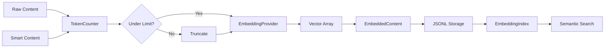

# Research Report: Embeddings System for Flowspace2

**Generated**: 2025-12-19
**Research Query**: "Research how embedding system works in original Flowspace, including chunking strategy, search implementation, and parallel processing"
**Mode**: Pre-Plan Research
**Location**: docs/plans/009-embeddings/research-dossier.md
**FlowSpace**: Available (flowspace repo: 6282 nodes)
**Findings**: 70 findings across 7 research areas

## Executive Summary

### What It Does
The embedding system converts code content and AI-generated summaries into dense vector representations that enable semantic similarity search. Users can search conceptually ("authentication flow", "error handling") rather than by exact text matches.

### Business Purpose
Embeddings power FlowSpace's semantic search capability, allowing developers to find relevant code by meaning rather than keywords. This is critical for codebase exploration, onboarding, and AI-assisted development workflows.

### Key Insights
1. **Dual embedding architecture**: Both raw content AND smart content get independent embeddings for richer search
2. **Token limit handling**: 8000 tokens (Azure) / 8191 tokens (OpenAI) - truncation not chunking
3. **Parallel processing**: AsyncIO queue + worker pool pattern (identical to SmartContentService)
4. **Hash-based skip logic**: Content hash comparison prevents re-embedding unchanged content

### Quick Stats
- **Token Limits**: 8000 (Azure), 8191 (OpenAI-compatible)
- **Batch Size**: Configurable, default 32-128
- **Vector Dimensions**: 384-3072 depending on model
- **Storage Format**: JSONL with List[float] vectors
- **Providers**: Azure OpenAI, OpenAI-compatible, local Transformers

---

## How It Currently Works (Original Flowspace)

### Entry Points

| Entry Point | Type | Location | Purpose |
|------------|------|----------|---------|
| `EmbeddingGenerator.generate()` | Service | `src/modules/embeddings/generator.py` | Main embedding orchestration |
| `EmbeddingIndex.search_by_text()` | Query | `src/core/query/embedding_index.py` | Semantic search entry |
| `EmbeddingProviderFactory.create()` | Factory | `src/modules/embeddings/embedding_factory.py` | Provider instantiation |

### Core Execution Flow

```
1. Content Collection
   └── Walk FileHierarchy → collect EmbeddedContent objects
   └── Check hash: skip if content unchanged
   └── Collect into BatchItem list

2. Token Enforcement
   └── TokenCounter.truncate_to_limit()
   └── Azure: 8000 tokens, OpenAI: 8191 tokens
   └── Uses tiktoken cl100k_base encoder

3. Batch Processing
   └── Group items by batch_size (default 32)
   └── Call provider.embed_batch()
   └── On batch failure: fallback to single-item

4. Vector Storage
   └── Store as EmbeddingData in EmbeddedContent
   └── Include provenance (model, timestamp, hash)
   └── Serialize to JSONL (vectors as List[float])

5. Search (Query Time)
   └── Embed query text using same provider
   └── Compute cosine similarity against all vectors
   └── Filter by content_type, node_type, file_pattern
   └── Return top-k results sorted by score
```

### Data Flow


---

## Architecture & Design

### Component Map

#### Core Components
- **EmbeddingGenerator**: Orchestrates batch embedding generation for FileHierarchy
- **TokenCounter**: Centralized tiktoken wrapper with model-aware limits
- **EmbeddingProviderFactory**: Creates providers from configuration
- **EmbeddingIndex**: In-memory vector index for similarity search
- **EmbeddingCache**: File-based cache for computed embeddings

### Design Patterns Identified

1. **Factory Pattern**: `EmbeddingProviderFactory` creates providers based on config mode
2. **Strategy Pattern**: `IEmbeddingProvider` interface with Azure/OpenAI/Transformers implementations
3. **Queue + Worker Pool**: AsyncIO queue with configurable workers for parallel processing
4. **Hash-Based Deduplication**: Content hash comparison prevents re-embedding

### Provider Architecture

```python
# Provider interface (simplified)
class IEmbeddingProvider(ABC):
    @abstractmethod
    def embed_text(self, text: str) -> np.ndarray: ...

    @abstractmethod
    def embed_batch(self, texts: list[str]) -> list[np.ndarray]: ...

    @abstractmethod
    def get_model_info(self) -> dict: ...

# Concrete implementations
class AzureOpenAIProvider(IEmbeddingProvider): ...     # Azure OpenAI
class OpenAICompatibleProvider(IEmbeddingProvider): ... # Generic OpenAI API
class TransformersProvider(IEmbeddingProvider): ...     # Local sentence-transformers
```

---

## Token Counting & Chunking Strategy

### Critical Finding: Truncation, Not Chunking

The original Flowspace does **NOT** chunk content into multiple embeddings. Instead:
- Content exceeding token limit is **truncated** at token boundary
- Single embedding per content element
- Warning logged when truncation occurs

### Token Limits

| Provider | Default Limit | Configurable |
|----------|---------------|--------------|
| Azure OpenAI | 8000 tokens | Yes, via `max_tokens` |
| OpenAI-compatible | 8191 tokens | Yes, via `max_tokens` |
| Transformers (local) | Model-specific | Yes |

### TokenCounter Implementation

```python
class TokenCounter:
    """Centralized tiktoken-based token counting."""

    def __init__(self, model_name: str = "cl100k_base"):
        self._encoder = tiktoken.get_encoding(model_name)

    def count_tokens(self, text: str) -> int:
        return len(self._encoder.encode(text))

    def truncate_to_limit(self, text: str, max_tokens: int) -> str:
        tokens = self._encoder.encode(text)
        if len(tokens) <= max_tokens:
            return text
        truncated = self._encoder.decode(tokens[:max_tokens])
        logger.warning(f"Truncated {len(tokens)} -> {max_tokens} tokens")
        return truncated
```

### Chunking Decision for fs2

**User requirement**: "We will need to split our content into 8000 (or 7500) token chunks and embed each one and store them in an array."

This is a **different approach** than original Flowspace. For fs2, we should implement:
- Split content into overlapping chunks (e.g., 7500 tokens with 500 overlap)
- Store multiple embeddings per content element as `List[List[float]]`
- During search: match against any chunk, return best score

---

## Batch Processing & Parallelism

### Original Flowspace Pattern (from SmartContentService analysis)

The batch processing pattern in `SmartContentService` is directly applicable:

```python
async def process_batch(self, nodes: list[CodeNode]) -> dict:
    queue: asyncio.Queue[CodeNode | None] = asyncio.Queue()
    stats = {"processed": 0, "skipped": 0, "errors": 0, "results": {}}
    stats_lock = asyncio.Lock()

    # Enqueue work items (skip unchanged via hash)
    for node in nodes:
        if not self._should_skip(node):
            await queue.put(node)

    # Create workers
    actual_workers = min(self._config.max_workers, work_count)
    workers = [asyncio.create_task(worker(i)) for i in range(actual_workers)]

    # Enqueue sentinels for clean shutdown
    for _ in range(actual_workers):
        await queue.put(None)

    await asyncio.gather(*workers)
    return stats
```

### Rate Limiting

```python
# Exponential backoff for HTTP 429/502/503
delay = 2 * (2 ** attempt) + random.uniform(0, 1)
await asyncio.sleep(delay)
```

### Configuration for fs2

```yaml
embedding:
  mode: azure  # or "openai_compatible" or "transformers"
  max_workers: 50  # Parallel embedding workers
  batch_size: 128  # Items per API batch call
  azure:
    endpoint: "${FS2_AZURE__EMBEDDING__ENDPOINT}"
    api_key: "${FS2_AZURE__EMBEDDING__API_KEY}"
    model: "text-embedding-3-small"
    dimensions: 1024
    max_tokens: 8000
```

---

## Storage Format

### EmbeddedContent Model

```python
class EmbeddingData(BaseModel):
    """Single embedding with metadata."""
    vector: list[float]           # The embedding array
    model: str                    # Model name (e.g., "text-embedding-3-small")
    engine: str                   # Provider (e.g., "azure-openai")
    dimensions: int               # Vector dimensionality
    timestamp: datetime           # When generated
    content_hash: str             # Hash of source content

class EmbeddedContent(BaseModel):
    """Content with optional embeddings."""
    raw_content: str
    content_embedding: EmbeddingData | None = None
    smart_content: str | None = None
    smart_content_embedding: EmbeddingData | None = None
```

### For Chunked Embeddings (fs2 extension)

```python
class ChunkedEmbeddingData(BaseModel):
    """Multiple embeddings for chunked content."""
    chunks: list[EmbeddingData]   # One embedding per chunk
    chunk_size: int               # Tokens per chunk
    overlap: int                  # Token overlap between chunks
    total_chunks: int             # Number of chunks
```

### JSONL Serialization

Embeddings are stored in `.fs2/graph.pickle` alongside nodes:
```python
# In CodeNode
class CodeNode:
    content: str
    smart_content: str | None
    content_embedding: list[float] | list[list[float]] | None  # Single or chunked
    smart_content_embedding: list[float] | list[list[float]] | None
    embedding_model: str | None
    embedding_hash: str | None
```

---

## Search Implementation

### Cosine Similarity

```python
def search_by_embedding(
    self,
    query_embedding: np.ndarray,
    top_k: int = 10,
    min_similarity: float = 0.5,
    content_types: list[str] | None = None,
    node_types: list[str] | None = None,
    file_patterns: list[str] | None = None,
) -> list[SearchResult]:
    """Find similar content using cosine similarity."""

    # Build vectors matrix if needed
    vectors = self.get_vectors_matrix()  # Shape: [n_entries, dim]

    # Compute similarities
    similarities = np.dot(vectors, query_embedding)  # Normalized vectors

    # Filter and rank
    results = []
    for idx, score in enumerate(similarities):
        if score < min_similarity:
            continue
        entry = self.entries[idx]
        if content_types and entry.content_type not in content_types:
            continue
        if node_types and entry.node_type not in node_types:
            continue
        # ... file_patterns filtering
        results.append(SearchResult(entry=entry, score=score))

    return sorted(results, key=lambda r: r.score, reverse=True)[:top_k]
```

### Query Pipeline

```python
def search_by_text(self, query: str, **kwargs) -> list[SearchResult]:
    """Embed query text and search."""
    query_embedding = self.provider.embed_text(query)
    return self.search_by_embedding(query_embedding, **kwargs)
```

---

## Configuration Schema for fs2

Based on original Flowspace patterns, aligned with fs2 conventions:

```yaml
# .fs2/config.yaml
embedding:
  # Provider mode
  mode: azure  # "azure" | "openai_compatible" | "transformers"

  # Batch processing (aligned with smart_content)
  max_workers: 50
  batch_size: 128

  # Chunking (NEW for fs2)
  chunk_size: 7500          # Tokens per chunk
  chunk_overlap: 500        # Token overlap between chunks

  # Azure OpenAI provider
  azure:
    endpoint: "${FS2_AZURE__EMBEDDING__ENDPOINT}"
    api_key: "${FS2_AZURE__EMBEDDING__API_KEY}"
    model: "text-embedding-3-small"
    dimensions: 1024
    max_tokens: 8000

  # OpenAI-compatible provider
  openai_compatible:
    endpoint: "http://localhost:8000/v1"
    api_key: "${FS2_EMBEDDING__API_KEY}"
    model: "nomic-embed-text"
    max_tokens: 8191

  # Local transformers provider
  transformers:
    model: "sentence-transformers/all-mpnet-base-v2"
    cache_dir: "${HOME}/.fs2/embeddings"
```

### Environment Variables

| Variable | Purpose |
|----------|---------|
| `FS2_AZURE__EMBEDDING__ENDPOINT` | Azure OpenAI endpoint URL |
| `FS2_AZURE__EMBEDDING__API_KEY` | Azure API key |
| `FS2_EMBEDDING__API_KEY` | Generic embedding API key |
| `FS2_EMBEDDING__MAX_WORKERS` | Override max workers |
| `FS2_EMBEDDING__BATCH_SIZE` | Override batch size |

---

## Implementation Recommendations for fs2

### 1. EmbeddingService Architecture

```python
# src/fs2/core/services/embedding/embedding_service.py
class EmbeddingService:
    """Parallel embedding generation service."""

    def __init__(
        self,
        provider: EmbeddingProvider,  # ABC
        config: EmbeddingConfig,
    ):
        self._provider = provider
        self._config = config
        self._token_counter = TokenCounter()

    async def process_batch(
        self,
        nodes: list[CodeNode],
        progress_callback: Callable[[EmbeddingProgress], None] | None = None,
    ) -> EmbeddingResult:
        """Process nodes in parallel, similar to SmartContentService."""
        ...
```

### 2. Adapter Pattern (following fs2 conventions)

```
src/fs2/core/adapters/
├── embedding_adapter.py           # ABC
├── embedding_adapter_azure.py     # Azure OpenAI impl
├── embedding_adapter_openai.py    # OpenAI-compatible impl
├── embedding_adapter_transformers.py  # Local impl
└── embedding_adapter_fake.py      # Test fake
```

### 3. Chunking Strategy

```python
def chunk_content(self, content: str) -> list[str]:
    """Split content into overlapping chunks."""
    tokens = self._token_counter.encode(content)
    chunks = []
    start = 0
    while start < len(tokens):
        end = min(start + self._config.chunk_size, len(tokens))
        chunk_tokens = tokens[start:end]
        chunks.append(self._token_counter.decode(chunk_tokens))
        start += self._config.chunk_size - self._config.chunk_overlap
    return chunks
```

### 4. Storage in CodeNode

```python
@dataclass(frozen=True)
class CodeNode:
    # Existing fields...
    content: str
    smart_content: str | None

    # Embedding fields (NEW)
    content_embeddings: tuple[tuple[float, ...], ...] | None = None  # Chunked
    smart_content_embeddings: tuple[tuple[float, ...], ...] | None = None
    embedding_model: str | None = None
    embedding_hash: str | None = None
```

### 5. Pipeline Stage

```python
# src/fs2/core/services/stages/embedding_stage.py
class EmbeddingStage(ScanStage):
    """Generate embeddings for nodes."""

    def __init__(self, embedding_service: EmbeddingService):
        self._service = embedding_service

    async def execute(self, context: PipelineContext) -> None:
        nodes = list(context.nodes.values())
        result = await self._service.process_batch(
            nodes,
            progress_callback=context.progress_callback,
        )
        # Update nodes with embeddings
        for node_id, updated_node in result.results.items():
            context.nodes[node_id] = updated_node
```

---

## Key Design Decisions Required

### Decision 1: Chunking vs Truncation
- **Original Flowspace**: Truncation (single embedding per content)
- **User Requirement**: Chunking (multiple embeddings per content)
- **Recommendation**: Implement chunking with configurable chunk_size and overlap

### Decision 2: What Gets Embedded
- **Original Flowspace**: Both raw content AND smart content
- **Recommendation**: Same - embed both for richer search

### Decision 3: Storage Location
- **Option A**: Store in CodeNode (frozen dataclass)
- **Option B**: Store in separate embedding index file
- **Recommendation**: Store in CodeNode for consistency with smart_content

### Decision 4: Search Integration
- **Phase 1**: Basic cosine similarity search
- **Phase 2**: Hybrid search (text + semantic)
- **Phase 3**: Re-ranking with cross-encoder

---

## Prior Learnings (From SmartContentService Implementation)

### PL-01: Hash-Based Skip Logic
**Source**: Phase 6 implementation
**Finding**: Content hash comparison prevents re-processing unchanged content
**Action**: Apply same pattern - compare content_hash before embedding

### PL-02: Stateless Service Design
**Source**: CD10 in SmartContentService
**Finding**: Batch state must be local variables, not instance attributes
**Action**: Queue, stats, lock should be method-local for concurrent batch support

### PL-03: Worker Pool Sizing
**Source**: SmartContentService config
**Finding**: `actual_workers = min(max_workers, work_count)` prevents idle workers
**Action**: Apply same optimization

### PL-04: Progress Callback Pattern
**Source**: SmartContentService
**Finding**: Callback every N items (10) with Progress dataclass
**Action**: Use identical pattern for embedding progress

---

## TransformersProvider (Local Embeddings)

### Overview
Original Flowspace includes a `TransformersProvider` that uses HuggingFace sentence-transformers for local embedding generation. This is critical for:
- **Unit testing** without API calls
- **Offline development**
- **Cost-free experimentation**

### Implementation Details

**Class**: `src/modules/embeddings/providers.py:TransformersProvider`

```python
class TransformersProvider(EmbeddingProvider, IEmbeddingProvider):
    """Local Sentence-Transformers embedding service."""

    def __init__(
        self,
        model_name: str = "sentence-transformers/all-MiniLM-L6-v2",
        cache: EmbeddingCache | None = None,
    ):
        self.model_name = model_name
        self.cache = cache
        self.device = self._detect_device()  # cuda/mps/cpu

    def embed_text(self, text: str | list[str]) -> torch.Tensor:
        """Generate normalized embeddings."""
        # Uses TransformerModelCache singleton for model reuse
        # Supports per-text caching via EmbeddingCache
        # Returns CPU tensors (shape: [batch, dimensions])
```

### Configuration

```yaml
embedding:
  mode: transformers
  transformers:
    model: "sentence-transformers/all-MiniLM-L6-v2"  # 384 dims
    cache_dir: "${HOME}/.fs2/embeddings"
```

### Key Features
1. **Thread-safe model caching** via `TransformerModelCache` singleton
2. **Device detection**: CUDA > MPS > CPU
3. **Per-text embedding cache** integration
4. **Normalized vectors** (unit L2 norm)
5. **Batch support** for efficiency

### Popular Models
| Model | Dimensions | Notes |
|-------|------------|-------|
| all-MiniLM-L6-v2 | 384 | Fast, good quality (default) |
| all-mpnet-base-v2 | 768 | Higher quality, slower |
| multi-qa-MiniLM-L6-cos-v1 | 384 | Optimized for Q&A |

### Testing Benefits
- **No API keys required**
- **Deterministic**: Same input → same embedding
- **Fast after first load**: Model cached in memory
- **Works offline**: No network needed after model download

### fs2 Implementation Notes
For fs2, the TransformersAdapter should:
1. Follow ABC pattern: `embedding_adapter.py` + `embedding_adapter_transformers.py`
2. Use lazy model loading (don't load until first embed call)
3. Support configurable model name
4. Integrate with fs2 config system (`FS2_EMBEDDING__TRANSFORMERS__MODEL`)

---

## External Research Opportunities

### Research 1: Optimal Chunk Size and Overlap
**Why Needed**: Literature suggests various chunk sizes (256-1024 tokens) with different overlap ratios
**Impact**: Affects search quality and storage size

**Ready-to-use prompt:**
```
/deepresearch "What are current best practices (2024-2025) for chunking text
for embedding-based semantic search? Specifically:
- Optimal chunk sizes for code vs documentation
- Overlap ratios and their tradeoffs
- Sentence-boundary vs token-boundary chunking
- Impact on retrieval quality metrics
Context: Building code search for Python/TypeScript repositories"
```

### Research 2: Embedding Model Selection
**Why Needed**: Many embedding models available with different tradeoffs
**Impact**: Affects search quality, cost, and latency

**Ready-to-use prompt:**
```
/deepresearch "Compare embedding models for code semantic search (2024-2025):
- text-embedding-3-small vs text-embedding-3-large
- Code-specific models (CodeBERT, StarCoder embeddings)
- Local models (sentence-transformers, nomic-embed)
- Dimension reduction techniques
Context: Need to embed Python/TypeScript code and documentation"
```

---

## Next Steps

1. **Run external research** (optional): Execute `/deepresearch` prompts above
2. **Create specification**: Run `/plan-1b-specify "embedding service for fs2"`
3. **Clarify decisions**: Chunking strategy, what gets embedded, storage format

---

**Research Complete**: 2025-12-19
**Report Location**: /workspaces/flow_squared/docs/plans/009-embeddings/research-dossier.md
