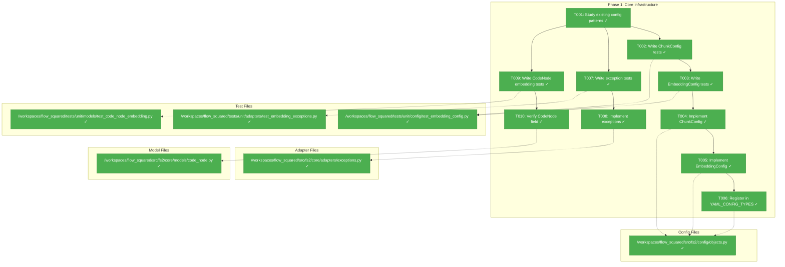
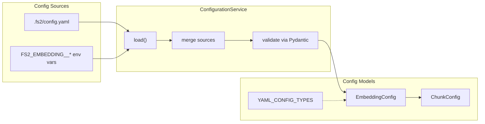
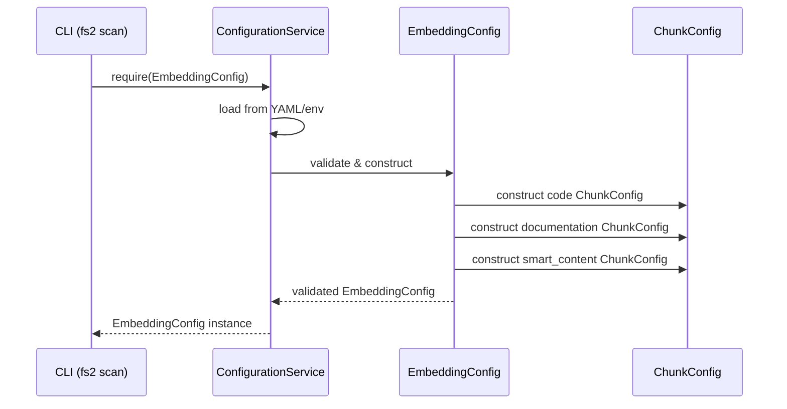

# Phase 1: Core Infrastructure – Tasks & Alignment Brief

**Spec**: [../../embeddings-spec.md](../../embeddings-spec.md)
**Plan**: [../../embeddings-plan.md](../../embeddings-plan.md)
**Date**: 2025-12-19
**Phase Slug**: `phase-1-core-infrastructure`
**Complexity**: CS-4 (Large) - Updated per DYK clarity session

---

## Executive Briefing

### Purpose

This phase establishes the foundational configuration and model infrastructure required for the embedding service. Without these building blocks, subsequent phases cannot implement the embedding adapters, service logic, or pipeline integration.

### What We're Building

1. **ChunkConfig model** - A Pydantic model defining per-content-type chunking parameters (`max_tokens`, `overlap_tokens`) with validation. Per DYK-3: `overlap_tokens >= 0` (0 is valid for smart_content).

2. **EmbeddingConfig model** - A Pydantic config class with:
   - Nested `ChunkConfig` for code, documentation, and smart_content content types
   - Retry configuration: `max_retries=3`, `base_delay=2.0`, `max_delay=60.0` (per DYK-4: Flowspace pattern)

3. **Embedding exception hierarchy** - Domain exceptions with retry metadata:
   - `EmbeddingAdapterError` base class
   - `EmbeddingRateLimitError` with `retry_after: float | None` and `attempts_made: int` (per DYK-4)
   - `EmbeddingAuthenticationError`

4. **CodeNode embedding field updates** (per DYK-1, DYK-2):
   - Change `embedding` type from `list[float] | None` to `tuple[tuple[float, ...], ...] | None` (chunk-level storage per spec AC11)
   - Add new `smart_content_embedding: tuple[tuple[float, ...], ...] | None` field (dual embedding architecture)
   - Update all factory methods (create_file, create_type, create_callable, etc.)

### User Value

Developers can configure embedding generation through `.fs2/config.yaml` with content-type specific chunking parameters. Proper exception handling ensures clear error messages when embedding operations fail. The verified CodeNode field enables storing embeddings alongside code analysis.

### Example

**Input** (`.fs2/config.yaml`):
```yaml
embedding:
  mode: azure
  max_workers: 50
  # Retry configuration (per DYK-4: Flowspace pattern)
  max_retries: 3
  base_delay: 2.0
  max_delay: 60.0
  # Chunking configuration
  code:
    max_tokens: 400
    overlap_tokens: 50
  documentation:
    max_tokens: 800
    overlap_tokens: 120
  smart_content:
    max_tokens: 8000
    overlap_tokens: 0  # Per DYK-3: 0 is valid
```

**Result**: EmbeddingConfig loads with validated per-content-type chunk settings and retry configuration, ready for use by EmbeddingService.

---

## Objectives & Scope

### Objective

Create foundational configuration and extend CodeNode support for embeddings per Plan Phase 1 acceptance criteria:
- [ ] EmbeddingConfig registered in YAML_CONFIG_TYPES
- [ ] Exception hierarchy follows existing pattern
- [ ] CodeNode.embedding field verified via tests
- [ ] All tests passing (3 test files)

### Goals

- ✅ Create `ChunkConfig` Pydantic model with `max_tokens` and `overlap_tokens` fields
- ✅ Create `EmbeddingConfig` Pydantic model with nested `ChunkConfig` for each content type
- ✅ Register `EmbeddingConfig` in `YAML_CONFIG_TYPES` for auto-loading
- ✅ Add `EmbeddingAdapterError` base exception with specialized subclasses
- ✅ Verify `CodeNode.embedding` field works with `replace()` and pickle
- ✅ Full TDD: tests written before implementation

### Non-Goals

- ❌ Embedding adapter implementations (Phase 2)
- ❌ Embedding service logic (Phase 3)
- ❌ Pipeline integration (Phase 4)
- ❌ Azure/OpenAI-specific configuration validation (Phase 2 - adapter config)
- ❌ Rate limiting or backoff logic (Phase 2/3)
- ❌ Fixture generation (Phase 2)

---

## Architecture Map

### Component Diagram
<!-- Status: grey=pending, orange=in-progress, green=completed, red=blocked -->
<!-- Updated by plan-6 during implementation -->



### Task-to-Component Mapping

<!-- Status: ⬜ Pending | 🟧 In Progress | ✅ Complete | 🔴 Blocked -->

| Task | Component(s) | Files | Status | Comment |
|------|-------------|-------|--------|---------|
| T001 | Pattern Research | objects.py, exceptions.py | ✅ Complete | Study SmartContentConfig and LLMAdapterError patterns |
| T002 | ChunkConfig Tests | test_embedding_config.py | ✅ Complete | TDD: Write failing tests for ChunkConfig validation |
| T003 | EmbeddingConfig Tests | test_embedding_config.py | ✅ Complete | TDD: Write failing tests for EmbeddingConfig with nested configs |
| T004 | ChunkConfig Model | objects.py | ✅ Complete | Implement ChunkConfig to pass T002 tests |
| T005 | EmbeddingConfig Model | objects.py | ✅ Complete | Implement EmbeddingConfig to pass T003 tests |
| T006 | Config Registration | objects.py | ✅ Complete | Add EmbeddingConfig to YAML_CONFIG_TYPES |
| T007 | Exception Tests | test_embedding_exceptions.py | ✅ Complete | TDD: Write failing tests for exception hierarchy |
| T008 | Exception Hierarchy | exceptions.py | ✅ Complete | Implement embedding exceptions following LLM pattern |
| T009 | CodeNode Embedding Tests | test_code_node_embedding.py | ✅ Complete | TDD: Write tests for replace() and pickle |
| T010 | CodeNode Verification | code_node.py | ✅ Complete | Updated embedding type + added smart_content_embedding |

---

## Tasks

| Status | ID | Task | CS | Type | Dependencies | Absolute Path(s) | Validation | Subtasks | Notes |
|--------|------|-----------------------------------|-----|------|--------------|-------------------------------|-------------------------------|----------|-------|
| [x] | T001 | Study existing SmartContentConfig and LLMAdapterError patterns | 1 | Setup | – | /workspaces/flow_squared/src/fs2/config/objects.py, /workspaces/flow_squared/src/fs2/core/adapters/exceptions.py | Patterns documented in alignment brief | – | [📋](./execution.log.md#task-t001) Foundation for consistent implementation |
| [x] | T002 | Write failing tests for ChunkConfig validation | 2 | Test | T001 | /workspaces/flow_squared/tests/unit/config/test_embedding_config.py | Tests exist and fail with ImportError | – | [📋](./execution.log.md#task-t002-t003) Per Plan 1.1, per Finding 04 [^8] |
| [x] | T003 | Write failing tests for EmbeddingConfig with nested ChunkConfigs | 2 | Test | T002 | /workspaces/flow_squared/tests/unit/config/test_embedding_config.py | Tests exist and fail with ImportError | – | [📋](./execution.log.md#task-t002-t003) Per Plan 1.1, per Finding 04 [^8] |
| [x] | T004 | Implement ChunkConfig Pydantic model | 2 | Core | T002 | /workspaces/flow_squared/src/fs2/config/objects.py | T002 tests pass | – | [📋](./execution.log.md#task-t004-t006) Validators: max_tokens > 0, overlap_tokens >= 0, overlap < max_tokens (per DYK-3) [^1] |
| [x] | T005 | Implement EmbeddingConfig Pydantic model with code/documentation/smart_content | 3 | Core | T003, T004 | /workspaces/flow_squared/src/fs2/config/objects.py | T003 tests pass | – | [📋](./execution.log.md#task-t004-t006) Per Finding 04 + DYK-4 + dimensions=1024 [^2] |
| [x] | T006 | Register EmbeddingConfig in YAML_CONFIG_TYPES | 1 | Core | T005 | /workspaces/flow_squared/src/fs2/config/objects.py | Config loads from YAML | – | [📋](./execution.log.md#task-t004-t006) Per Plan AC: registered in YAML_CONFIG_TYPES [^2] |
| [x] | T007 | Write failing tests for embedding exception hierarchy | 2 | Test | T001 | /workspaces/flow_squared/tests/unit/adapters/test_embedding_exceptions.py | Tests exist and fail with ImportError | – | [📋](./execution.log.md#task-t007-t008) Per Plan 1.3 + DYK-4: retry metadata tests [^9] |
| [x] | T008 | Add EmbeddingAdapterError hierarchy to exceptions.py | 2 | Core | T007 | /workspaces/flow_squared/src/fs2/core/adapters/exceptions.py | T007 tests pass | – | [📋](./execution.log.md#task-t007-t008) Per DYK-4: EmbeddingRateLimitError has retry_after, attempts_made [^3][^4][^5] |
| [x] | T009 | Write tests for CodeNode embedding fields (dual: raw + smart content) | 3 | Test | T001 | /workspaces/flow_squared/tests/unit/models/test_code_node_embedding.py | Tests cover: both embedding fields as tuple-of-tuples, replace(), pickle, factory methods | – | [📋](./execution.log.md#task-t009-t010) Per DYK-1 + DYK-2: dual embedding architecture [^10] |
| [x] | T010 | Update CodeNode with embedding + smart_content_embedding fields | 3 | Core | T009 | /workspaces/flow_squared/src/fs2/core/models/code_node.py | T009 tests pass, both fields are tuple[tuple[float, ...], ...] \| None | – | [📋](./execution.log.md#task-t009-t010) CS-3: two fields + all factory method updates [^6][^7] |

---

## Alignment Brief

### Critical Findings Affecting This Phase

| Finding | Title | Constraint/Requirement | Addressed By |
|---------|-------|------------------------|--------------|
| **04** | Content-Type Aware Configuration Pattern | EmbeddingConfig must define ChunkConfig per content type (code=400/50, documentation=800/120, smart_content=8000/0) | T003, T005 |
| **10** | Embedding Vector Storage Optimization | Default to 1024 dimensions | T005 (dimensions field) |
| **DYK-1** | Embedding Field Type Mismatch | CodeNode.embedding must be `tuple[tuple[float, ...], ...] \| None` per spec AC11, not `list[float] \| None`. Supports chunk-level search precision. | T009, T010 |
| **DYK-2** | Smart Content Embeddings Need Separate Field | Add `smart_content_embedding: tuple[tuple[float, ...], ...] \| None` for dual embedding architecture. Enables search by code similarity AND semantic description. | T009, T010 |
| **DYK-3** | Overlap Zero Edge Case | `overlap_tokens=0` is valid for smart_content. Add explicit `>= 0` validation AND test to document intent and prevent regressions. | T002, T004 |
| **DYK-4** | 429 Retry Strategy | Per Flowspace pattern: (1) EmbeddingRateLimitError carries `retry_after` and `attempts_made` metadata; (2) EmbeddingConfig has `max_retries=3`, `base_delay=2.0`, `max_delay=60.0` for configurable retry behavior. Never blocks forever. | T003, T005, T007, T008 |

### ADR Decision Constraints

No ADRs exist for this feature. ADR seeds are defined in spec but not yet formalized.

### Invariants & Guardrails

| Invariant | Enforcement |
|-----------|-------------|
| ChunkConfig.overlap_tokens >= 0 | Pydantic @field_validator (per DYK-3: 0 is valid for smart_content) |
| ChunkConfig.overlap_tokens < ChunkConfig.max_tokens | Pydantic @model_validator |
| ChunkConfig.max_tokens > 0 | Pydantic @field_validator |
| EmbeddingConfig follows __config_path__ pattern | Use "embedding" as path |
| Exceptions follow AdapterError hierarchy | Inherit from AdapterError base |

### Inputs to Read

| File | Purpose |
|------|---------|
| `/workspaces/flow_squared/src/fs2/config/objects.py` | Study SmartContentConfig pattern, YAML_CONFIG_TYPES registry |
| `/workspaces/flow_squared/src/fs2/core/adapters/exceptions.py` | Study LLMAdapterError hierarchy |
| `/workspaces/flow_squared/src/fs2/core/models/code_node.py` | Verify existing `embedding` field at line 170 |
| `/workspaces/flow_squared/tests/unit/config/test_*.py` | Study existing config test patterns |

### Visual Alignment Aids

#### Flow Diagram: Config Loading



#### Sequence Diagram: Config Usage



### Test Plan (Full TDD)

| Test File | Test Class/Function | Purpose | Fixtures | Expected Outcome |
|-----------|---------------------|---------|----------|------------------|
| `test_embedding_config.py` | `TestChunkConfig::test_default_values` | Verify ChunkConfig can be constructed with defaults | None | ChunkConfig(max_tokens=100, overlap_tokens=10) succeeds |
| `test_embedding_config.py` | `TestChunkConfig::test_max_tokens_must_be_positive` | Validate max_tokens > 0 | None | ValueError raised for max_tokens=0 or negative |
| `test_embedding_config.py` | `TestChunkConfig::test_overlap_cannot_exceed_max_tokens` | Validate overlap < max_tokens | None | ValueError raised when overlap >= max_tokens |
| `test_embedding_config.py` | `TestChunkConfig::test_overlap_zero_is_valid` | Per DYK-3: overlap=0 valid for smart_content | None | ChunkConfig(max_tokens=8000, overlap_tokens=0) succeeds |
| `test_embedding_config.py` | `TestChunkConfig::test_overlap_negative_rejected` | Per DYK-3: overlap must be >= 0 | None | ValueError raised for overlap_tokens=-1 |
| `test_embedding_config.py` | `TestEmbeddingConfig::test_default_code_chunk_config` | Verify code defaults: 400/50 | None | config.code.max_tokens == 400, config.code.overlap_tokens == 50 |
| `test_embedding_config.py` | `TestEmbeddingConfig::test_default_documentation_chunk_config` | Verify docs defaults: 800/120 | None | config.documentation.max_tokens == 800 |
| `test_embedding_config.py` | `TestEmbeddingConfig::test_default_smart_content_chunk_config` | Verify smart_content defaults: 8000/0 | None | config.smart_content.max_tokens == 8000 |
| `test_embedding_config.py` | `TestEmbeddingConfig::test_config_path_is_embedding` | Verify __config_path__ | None | EmbeddingConfig.__config_path__ == "embedding" |
| `test_embedding_config.py` | `TestEmbeddingConfig::test_custom_chunk_config_override` | Custom values override defaults | None | Custom ChunkConfig values preserved |
| `test_embedding_config.py` | `TestEmbeddingConfig::test_default_retry_config` | Per DYK-4: verify retry defaults | None | max_retries=3, base_delay=2.0, max_delay=60.0 |
| `test_embedding_config.py` | `TestEmbeddingConfig::test_max_retries_validation` | max_retries >= 0 | None | ValueError for negative max_retries |
| `test_embedding_config.py` | `TestEmbeddingConfig::test_base_delay_validation` | base_delay > 0 | None | ValueError for base_delay <= 0 |
| `test_embedding_config.py` | `TestEmbeddingConfig::test_max_delay_validation` | max_delay >= base_delay | None | ValueError if max_delay < base_delay |
| `test_embedding_exceptions.py` | `TestEmbeddingExceptions::test_inheritance_hierarchy` | Verify exception inheritance | None | All exceptions inherit from EmbeddingAdapterError → AdapterError |
| `test_embedding_exceptions.py` | `TestEmbeddingExceptions::test_rate_limit_error_with_retry_after` | Per DYK-4: EmbeddingRateLimitError carries retry metadata | None | Exception has retry_after: float, attempts_made: int attributes |
| `test_embedding_exceptions.py` | `TestEmbeddingExceptions::test_rate_limit_error_retry_after_optional` | retry_after can be None | None | EmbeddingRateLimitError(msg, retry_after=None) works |
| `test_embedding_exceptions.py` | `TestEmbeddingExceptions::test_authentication_error` | EmbeddingAuthenticationError instantiates | None | Exception with message created |
| `test_code_node_embedding.py` | `TestCodeNodeEmbedding::test_replace_with_embedding` | Verify replace() works with tuple-of-tuples | CodeNode fixture | Updated node has embedding, original unchanged |
| `test_code_node_embedding.py` | `TestCodeNodeEmbedding::test_replace_with_smart_content_embedding` | Verify replace() works for smart_content_embedding | CodeNode fixture | Updated node has smart_content_embedding, original unchanged |
| `test_code_node_embedding.py` | `TestCodeNodeEmbedding::test_pickle_roundtrip_both_embeddings` | Verify pickle serialization of both fields | CodeNode with both embeddings | Deserialized node equals original |
| `test_code_node_embedding.py` | `TestCodeNodeEmbedding::test_embedding_is_tuple_of_tuples` | Type checking per spec AC11 | CodeNode fixture | embedding is tuple[tuple[float, ...], ...] |
| `test_code_node_embedding.py` | `TestCodeNodeEmbedding::test_smart_content_embedding_is_tuple_of_tuples` | Type checking for smart_content_embedding | CodeNode fixture | smart_content_embedding is tuple[tuple[float, ...], ...] |
| `test_code_node_embedding.py` | `TestCodeNodeEmbedding::test_single_chunk_embedding` | Single chunk stored as 1-element tuple | CodeNode fixture | len(embedding) == 1, embedding[0] is tuple of floats |
| `test_code_node_embedding.py` | `TestCodeNodeEmbedding::test_multi_chunk_embedding` | Multiple chunks stored as n-element tuple | CodeNode fixture | len(embedding) == n, each element is tuple of floats |
| `test_code_node_embedding.py` | `TestCodeNodeEmbedding::test_factory_methods_accept_both_embedding_types` | Factory methods handle both embedding fields | None | create_file/type/callable accept both embedding params |
| `test_code_node_embedding.py` | `TestCodeNodeEmbedding::test_independent_embedding_fields` | Both fields can be set independently | CodeNode fixture | Can have embedding without smart_content_embedding and vice versa |

### Step-by-Step Implementation Outline

1. **T001 (Setup)**: Read and understand existing patterns
   - Study SmartContentConfig in objects.py (lines 384-424)
   - Study LLMAdapterError hierarchy in exceptions.py (lines 161-234)
   - Document key patterns in execution log

2. **T002-T003 (Test First)**: Write failing config tests
   - Create test_embedding_config.py
   - Write TestChunkConfig class with validation tests
   - Write TestEmbeddingConfig class with nested config tests
   - Run tests → expect ImportError (classes don't exist yet)

3. **T004-T006 (Implement Config)**: Make tests pass
   - Add ChunkConfig class to objects.py (after SmartContentConfig)
   - Add EmbeddingConfig class with code/documentation/smart_content ChunkConfigs
   - Add EmbeddingConfig to YAML_CONFIG_TYPES list
   - Run tests → all pass

4. **T007 (Test First)**: Write failing exception tests
   - Create test_embedding_exceptions.py
   - Write tests for inheritance hierarchy
   - Run tests → expect ImportError

5. **T008 (Implement Exceptions)**: Make tests pass
   - Add EmbeddingAdapterError base class (after LLMContentFilterError)
   - Add EmbeddingRateLimitError subclass
   - Add EmbeddingAuthenticationError subclass
   - Run tests → all pass

6. **T009-T010 (Update CodeNode)**: Add dual embedding fields per spec AC11 + DYK-2
   - Create test_code_node_embedding.py
   - Write tests for BOTH fields: `embedding` and `smart_content_embedding`
   - Tests cover: tuple-of-tuples type, replace(), pickle, factory methods, independent fields
   - Run tests → expect fail (current type is list[float], no smart_content_embedding)
   - Update CodeNode:
     - Change `embedding: list[float] | None` to `embedding: tuple[tuple[float, ...], ...] | None`
     - Add `smart_content_embedding: tuple[tuple[float, ...], ...] | None = None`
   - Update all factory methods (create_file, create_type, create_callable, etc.) to accept both params
   - Run tests → all pass

### Commands to Run

```bash
# Environment setup (if needed)
cd /workspaces/flow_squared

# Run all tests for this phase
uv run pytest tests/unit/config/test_embedding_config.py -v
uv run pytest tests/unit/adapters/test_embedding_exceptions.py -v
uv run pytest tests/unit/models/test_code_node_embedding.py -v

# Run all phase tests together
uv run pytest tests/unit/config/test_embedding_config.py tests/unit/adapters/test_embedding_exceptions.py tests/unit/models/test_code_node_embedding.py -v

# Type checking
uv run python -m mypy src/fs2/config/objects.py
uv run python -m mypy src/fs2/core/adapters/exceptions.py

# Linting
uv run ruff check src/fs2/config/objects.py src/fs2/core/adapters/exceptions.py
```

### Risks & Unknowns

| Risk | Severity | Mitigation |
|------|----------|------------|
| Pydantic nested model validation complexity | Low | Follow SmartContentConfig.token_limits pattern |
| YAML_CONFIG_TYPES registration order matters | Low | Add at end of list |
| CodeNode pickle compatibility | Low | Field already exists, just verify |

### Ready Check

- [ ] Critical Findings 04 and 10 understood and addressed in tasks
- [ ] SmartContentConfig pattern studied for config implementation
- [ ] LLMAdapterError pattern studied for exception hierarchy
- [ ] CodeNode.embedding field location verified (line 170)
- [ ] Test files identified and paths confirmed
- [ ] ADR constraints mapped to tasks (IDs noted in Notes column) - N/A (no ADRs exist)

**Awaiting GO/NO-GO from human sponsor.**

---

## Phase Footnote Stubs

_Synced from plan ledger. See [../../embeddings-plan.md#change-footnotes-ledger](../../embeddings-plan.md#change-footnotes-ledger) for authority._

| Footnote | Task | Description | Resolution |
|----------|------|-------------|------------|
| [^1] | T004-T006 | ChunkConfig model with validation | ✅ Implemented |
| [^2] | T004-T006 | EmbeddingConfig with dimensions=1024 | ✅ Implemented |
| [^3] | T007-T008 | EmbeddingAdapterError base class | ✅ Implemented |
| [^4] | T007-T008 | EmbeddingRateLimitError with retry metadata (DYK-4) | ✅ Implemented |
| [^5] | T007-T008 | EmbeddingAuthenticationError | ✅ Implemented |
| [^6] | T009-T010 | CodeNode.embedding type change (DYK-1) | ✅ Implemented |
| [^7] | T009-T010 | CodeNode.smart_content_embedding field (DYK-2) | ✅ Implemented |
| [^8] | T002-T003 | Config tests (26 tests) | ✅ Created |
| [^9] | T007-T008 | Exception tests (11 tests) | ✅ Created |
| [^10] | T009-T010 | CodeNode embedding tests (15 tests) | ✅ Created |

---

## Evidence Artifacts

| Artifact | Purpose | Location |
|----------|---------|----------|
| Execution Log | Detailed implementation narrative | `/workspaces/flow_squared/docs/plans/009-embeddings/tasks/phase-1-core-infrastructure/execution.log.md` |
| Test Results | pytest output | Captured in execution log |
| Coverage Report | Code coverage metrics | Captured in execution log |

---

## Discoveries & Learnings

_Populated during implementation by plan-6. Log anything of interest to your future self._

| Date | Task | Type | Discovery | Resolution | References |
|------|------|------|-----------|------------|------------|
| | | | | | |

**Types**: `gotcha` | `research-needed` | `unexpected-behavior` | `workaround` | `decision` | `debt` | `insight`

**What to log**:
- Things that didn't work as expected
- External research that was required
- Implementation troubles and how they were resolved
- Gotchas and edge cases discovered
- Decisions made during implementation
- Technical debt introduced (and why)
- Insights that future phases should know about

_See also: `execution.log.md` for detailed narrative._

---

## Directory Layout

```
docs/plans/009-embeddings/
├── embeddings-spec.md
├── embeddings-plan.md
├── research-dossier.md
└── tasks/
    └── phase-1-core-infrastructure/
        ├── tasks.md                    # This file
        └── execution.log.md            # Created by plan-6
```

---

## Critical Insights Discussion

**Session**: 2025-12-20
**Context**: Phase 1: Core Infrastructure Tasks & Alignment Brief
**Analyst**: AI Clarity Agent
**Reviewer**: Development Team
**Format**: Water Cooler Conversation (5 Critical Insights)

### Insight 1: Embedding Field Type Mismatch

**Did you know**: Spec AC11 requires `tuple[tuple[float, ...], ...]` for chunk-level storage, but CodeNode.embedding was `list[float] | None`.

**Implications**:
- Chunked content produces multiple embeddings per node (one per chunk)
- `list[float]` cannot represent array of arrays
- Search quality requires chunk-level granularity

**Options Considered**:
- Option A: Update to tuple[tuple[float, ...], ...] - matches spec, supports chunking
- Option B: Keep list[float], average embeddings - simpler but loses precision
- Option C: Use list[list[float]] - mutable, not hashable

**AI Recommendation**: Option A
- Reasoning: Matches spec AC11, enables chunk-level search, maintains frozen/hashable design

**Decision**: Update CodeNode.embedding to `tuple[tuple[float, ...], ...] | None`

**Affects**: T009, T010, all factory methods

---

### Insight 2: Smart Content Embeddings Need Separate Field

**Did you know**: Plan mentions dual embedding (raw + smart content), but CodeNode only had one `embedding` field.

**Implications**:
- Cannot search by both code similarity AND semantic description
- Phase 7 fixture graph expects separate raw/smart embeddings
- Search flexibility requires both fields

**Options Considered**:
- Option A: Add smart_content_embedding field - full dual support
- Option B: Concatenate into single field - awkward indexing
- Option C: Only embed raw content - loses semantic search
- Option D: Only embed smart content - loses code similarity

**AI Recommendation**: Option A
- Reasoning: Spec expects dual embedding; enables flexible search

**Decision**: Add `smart_content_embedding: tuple[tuple[float, ...], ...] | None`

**Affects**: T009, T010, all factory methods

---

### Insight 3: ChunkConfig Overlap Zero Edge Case

**Did you know**: Smart content uses `overlap_tokens=0`, but there was no explicit test that 0 is valid.

**Implications**:
- Without explicit test, future validator changes could break smart_content
- Chunking logic must handle overlap=0 without division issues

**Options Considered**:
- Option A: Add test for overlap=0 validity
- Option B: Add explicit >= 0 validation
- Option C: Both A and B (belt and suspenders)

**AI Recommendation**: Option C
- Reasoning: Defense in depth; documents intent; minimal cost

**Decision**: Add `overlap_tokens >= 0` validation AND explicit test

**Affects**: T002, T004

---

### Insight 4: 429 Retry Strategy (Flowspace Pattern)

**Did you know**: Azure/OpenAI APIs return Retry-After headers, but the exception had no field to capture this.

**Implications**:
- Without retry_after, we'd use blind exponential backoff
- Flowspace uses: max_retries=3, exponential backoff with jitter, max 60s cap
- Never blocks forever - raises after retries exhausted

**Options Considered**:
- Option A: Add retry_after + attempts_made to exception
- Option B: Handle retry_after in adapter only
- Option C: Full solution - rich exception + configurable retry params

**AI Recommendation**: Option C
- Reasoning: Matches Flowspace pattern; gives configurability; rich diagnostics

**Decision**:
- EmbeddingRateLimitError gets `retry_after: float | None`, `attempts_made: int`
- EmbeddingConfig gets `max_retries=3`, `base_delay=2.0`, `max_delay=60.0`

**Affects**: T003, T005, T007, T008

---

### Insight 5: Phase 1 Complexity Underestimated

**Did you know**: With all DYK decisions, Phase 1 grew from ~CS-2 to CS-4 (Large).

**Implications**:
- Original: ~9 complexity points
- Actual: ~15 complexity points (+67%)
- More tests, more factory method updates, more validation

**Options Considered**:
- Option A: Accept increased scope, proceed as single phase
- Option B: Split into Phase 1A and 1B
- Option C: Defer some decisions to later phases

**AI Recommendation**: Option A
- Reasoning: All changes are foundational and interconnected; splitting would be artificial

**Decision**: Accept CS-4 complexity, proceed as single cohesive phase

**Affects**: Plan complexity tracking, phase description

---

## Session Summary

**Insights Surfaced**: 5 critical insights identified and discussed
**Decisions Made**: 5 decisions reached through collaborative discussion
**Action Items Created**: All incorporated into existing tasks
**Areas Updated**:
- tasks.md: Executive briefing, Critical Findings table, Test Plan, Tasks table
- embeddings-plan.md: Phase 1 description, task CS scores, Complexity Tracking

**Shared Understanding Achieved**: ✓

**Confidence Level**: High - All insights address foundational design decisions before implementation

**Next Steps**:
Proceed to implementation with `/plan-6-implement-phase --phase "Phase 1: Core Infrastructure"`

---

**Phase 1 Dossier Complete**: 2025-12-19
**DYK Clarity Session**: 2025-12-20
**Next Step**: Await human **GO**, then run `/plan-6-implement-phase --phase "Phase 1: Core Infrastructure"`
