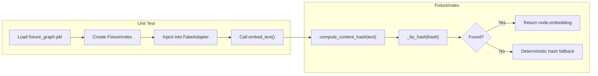
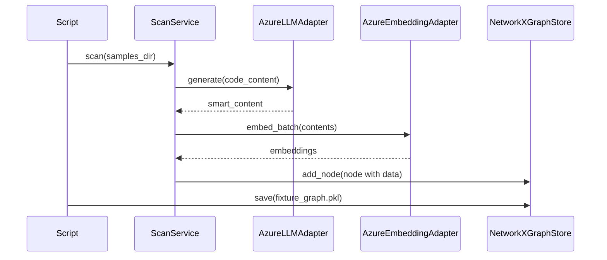

# Subtask 001: Fixture Graph-Backed Fakes

**Parent Plan:** [embeddings-plan.md](../../embeddings-plan.md)
**Parent Phase:** Phase 2: Embedding Adapters
**Parent Task(s):** [T009: Generate fixture graph](./tasks.md#t009), [T011: Implement FakeEmbeddingAdapter](./tasks.md#t011)
**Created:** 2025-12-20

## Parent Context

**Why This Subtask:**
Phase 2 completed with FakeEmbeddingAdapter using hash-based deterministic fallback instead of real pre-computed embeddings. For robust search implementation (next plan), we need stable, rich fakes that return real embeddings and smart content from a fixture graph. This also establishes the shared infrastructure for content-hash-based lookups that will be used across testing utilities.

---

## Executive Briefing

### Purpose

This subtask creates a fixture graph system that enables deterministic integration testing with real AI-generated content. By scanning sample files with real APIs and storing the results, our fakes can return authentic embeddings and smart content without live API calls. This is critical infrastructure for the upcoming Search feature.

### What We're Building

1. **Fixture Samples Directory** - Comprehensive file type coverage matching fs2's supported parsers:

   **Source Code (12 languages):**
   - Python: `.py` - authentication handler, data parser
   - JavaScript/TypeScript: `.js`, `.ts`, `.tsx` - React component, utility functions
   - Go: `.go` - HTTP server with handlers
   - Rust: `.rs` - trait and implementation
   - Java: `.java` - service class
   - C/C++: `.c`, `.cpp` - algorithm implementation
   - Ruby: `.rb` - Rake task
   - Shell: `.sh` - deployment script

   **Query & Database:**
   - SQL: `.sql` - schema and queries

   **Infrastructure & Config:**
   - Terraform: `.tf` - AWS resources
   - Dockerfile: `Dockerfile` - multi-stage build
   - YAML: `.yaml` - Kubernetes deployment
   - TOML: `.toml` - config file
   - JSON: `.json` - package.json

   **Documentation:**
   - Markdown: `.md` - README with code blocks

2. **Fixture Graph Generation Script** - One-time script that:
   - Scans fixture samples using real fs2 pipeline
   - Calls real Azure OpenAI APIs for smart content and embeddings
   - Saves complete graph to `tests/fixtures/fixture_graph.pkl`

3. **FixtureIndex Utility** - Shared lookup infrastructure:
   - Loads fixture graph from disk
   - Builds O(1) indexes by content_hash
   - Provides `get_embedding(content_hash)` and `get_smart_content(content_hash)`
   - Used by both FakeEmbeddingAdapter and FakeLLMAdapter

4. **Enhanced Fakes**:
   - FakeEmbeddingAdapter: Uses FixtureIndex for real embedding lookup, falls back to deterministic hash
   - FakeLLMAdapter: Uses FixtureIndex for real smart_content lookup, falls back to placeholder

5. **Justfile Command** - `just generate-fixtures` for easy regeneration

### Unblocks

- Search feature implementation (requires stable, realistic embeddings for similarity testing)
- Integration tests that need deterministic, reproducible results
- Local development without API credentials (once fixtures are generated)

### Example

**Before (hash-based fallback):**
```python
adapter = FakeEmbeddingAdapter()
embedding = await adapter.embed_text("def add(a, b): return a + b")
# Returns: Deterministic but meaningless hash-based vector
```

**After (fixture-backed):**
```python
graph = NetworkXGraphStore.load("tests/fixtures/fixture_graph.pkl")
index = FixtureIndex.from_graph_store(graph)
adapter = FakeEmbeddingAdapter(fixture_index=index)
embedding = await adapter.embed_text("def add(a, b): return a + b")
# Returns: Real embedding from Azure OpenAI (if content matches fixture)
# Falls back: Deterministic hash-based vector (if content unknown)
```

---

## Objectives & Scope

### Objective

Create fixture graph infrastructure enabling fakes to return real pre-computed embeddings and smart content via content-hash lookup, providing stable test doubles for Search feature development.

### Goals

- ✅ Create fixture samples directory with 15+ files covering major parser categories (Python, JS/TS, Go, Rust, Java, C/C++, Ruby, Shell, SQL, Terraform, Dockerfile, YAML, TOML, JSON, Markdown)
- ✅ Implement fixture graph generation script using existing fs2 services
- ✅ Create FixtureIndex model class for O(1) content-hash lookup
- ✅ Update FakeEmbeddingAdapter to use FixtureIndex (preserving existing set_response/set_error API)
- ✅ Update FakeLLMAdapter to use FixtureIndex for smart content lookup
- ✅ Add `just generate-fixtures` command to Justfile
- ✅ Document regeneration process in tests/fixtures/README.md

### Non-Goals

- ❌ Modifying the scan pipeline (uses existing infrastructure)
- ❌ Creating new adapters (extends existing fakes)
- ❌ Search implementation (enabled by this subtask, implemented in next plan)
- ❌ Fixture versioning system (simple file regeneration is sufficient)
- ❌ CI/CD integration for fixture generation (manual/developer process)

---

## Architecture Map

### Component Diagram

```mermaid
flowchart TD
    classDef pending fill:#9E9E9E,stroke:#757575,color:#fff
    classDef inprogress fill:#FF9800,stroke:#F57C00,color:#fff
    classDef completed fill:#4CAF50,stroke:#388E3C,color:#fff
    classDef blocked fill:#F44336,stroke:#D32F2F,color:#fff

    style Parent fill:#F5F5F5,stroke:#E0E0E0
    style Subtask fill:#F5F5F5,stroke:#E0E0E0
    style Files fill:#F5F5F5,stroke:#E0E0E0
    style Tests fill:#F5F5F5,stroke:#E0E0E0

    subgraph Parent["Parent Context"]
        T009["T009: Generate fixture graph (Optional→Required)"]:::completed
        T011["T011: FakeEmbeddingAdapter (Hash-based→Graph-backed)"]:::completed
    end

    subgraph Subtask["Subtask 001: Fixture Graph Fakes"]
        ST001["ST001: Create fixture samples ✓"]:::completed
        ST002["ST002: Write FixtureIndex tests"]:::inprogress
        ST003["ST003: Implement FixtureIndex"]:::pending
        ST004["ST004: Write generation script"]:::pending
        ST005["ST005: Update FakeEmbeddingAdapter tests"]:::pending
        ST006["ST006: Update FakeEmbeddingAdapter"]:::pending
        ST007["ST007: Update FakeLLMAdapter tests"]:::pending
        ST008["ST008: Update FakeLLMAdapter"]:::pending
        ST009["ST009: Add Justfile command"]:::pending
        ST010["ST010: Generate fixture graph"]:::pending
        ST011["ST011: Document in README"]:::pending

        ST001 --> ST004
        ST002 --> ST003
        ST003 --> ST004
        ST003 --> ST006
        ST003 --> ST008
        ST004 --> ST010
        ST005 --> ST006
        ST007 --> ST008
        ST009 --> ST010
        ST010 --> ST011
    end

    subgraph Files["Implementation Files"]
        F1["/tests/fixtures/samples/** ✓"]:::completed
        F2["/src/fs2/core/models/fixture_index.py"]:::pending
        F3["/scripts/generate_fixture_graph.py"]:::pending
        F4["/src/fs2/core/adapters/embedding_adapter_fake.py"]:::pending
        F5["/src/fs2/core/adapters/llm_adapter_fake.py"]:::pending
        F6["/tests/fixtures/fixture_graph.pkl"]:::pending
    end

    subgraph Tests["Test Files"]
        TF1["/tests/unit/models/test_fixture_index.py"]:::pending
        TF2["/tests/unit/adapters/test_embedding_adapter_fake.py"]:::pending
        TF3["/tests/unit/adapters/test_llm_adapter_fake.py"]:::pending
    end

    ST001 -.-> F1
    ST003 -.-> F2
    ST004 -.-> F3
    ST006 -.-> F4
    ST008 -.-> F5
    ST010 -.-> F6
    ST002 -.-> TF1
    ST005 -.-> TF2
    ST007 -.-> TF3

    ST011 -.->|unblocks| Search["Search Feature (Next Plan)"]:::pending
```

<!-- Status: grey=pending, orange=in-progress, green=completed, red=blocked -->
<!-- Updated by plan-6 during implementation -->



### Task-to-Component Mapping

<!-- Status: ⬜ Pending | 🟧 In Progress | ✅ Complete | 🔴 Blocked -->

| Task | Component(s) | Files | Status | Comment |
|------|-------------|-------|--------|---------|
| ST001 | Fixture Samples | /tests/fixtures/samples/{python,javascript,go,rust,java,c,ruby,bash,sql,terraform,docker,yaml,toml,json,markdown}/ | ✅ Complete | 19 sample files created covering 15 parser categories |
| ST002 | FixtureIndex Tests | /tests/unit/models/test_fixture_index.py | 🟧 In Progress | TDD: Tests for content-hash lookup |
| ST003 | FixtureIndex Model | /src/fs2/core/models/fixture_index.py | ⬜ Pending | Shared utility for O(1) lookup by content_hash |
| ST004 | Generation Script | /scripts/generate_fixture_graph.py | ⬜ Pending | Uses existing scan pipeline with real adapters |
| ST005 | FakeEmbedding Tests | /tests/unit/adapters/test_embedding_adapter_fake.py | ⬜ Pending | Extend tests for fixture_index parameter |
| ST006 | FakeEmbeddingAdapter | /src/fs2/core/adapters/embedding_adapter_fake.py | ⬜ Pending | Add fixture_index lookup, preserve existing API |
| ST007 | FakeLLM Tests | /tests/unit/adapters/test_llm_adapter_fake.py | ⬜ Pending | Add tests for smart_content fixture lookup |
| ST008 | FakeLLMAdapter | /src/fs2/core/adapters/llm_adapter_fake.py | ⬜ Pending | Add fixture_index lookup for smart content |
| ST009 | Justfile | /justfile | ⬜ Pending | Add `generate-fixtures` command |
| ST010 | Fixture Graph | /tests/fixtures/fixture_graph.pkl | ⬜ Pending | One-time generation with real APIs |
| ST011 | Documentation | /tests/fixtures/README.md | ⬜ Pending | Document regeneration process |

---

## Tasks

| Status | ID    | Task                                              | CS | Type  | Dependencies | Absolute Path(s)                                                  | Validation                                           | Subtasks | Notes |
|--------|-------|---------------------------------------------------|----|-------|--------------|-------------------------------------------------------------------|------------------------------------------------------|----------|-------|
| [x]    | ST001 | Create fixture samples directory with code files  | 3  | Setup | –            | /workspaces/flow_squared/tests/fixtures/samples/                  | 15+ files across major parser categories, 50-150 lines each | – | log#task-st001-create-fixture-samples |
| [x]    | ST002 | Write tests for FixtureIndex model                | 2  | Test  | –            | /workspaces/flow_squared/tests/unit/models/test_fixture_index.py  | Tests cover: from_graph_store, get_embedding, get_smart_content, missing returns None | – | log#task-st002-write-fixtureindex-tests |
| [x]    | ST003 | Implement FixtureIndex model class                | 2  | Core  | ST002        | /workspaces/flow_squared/src/fs2/core/models/fixture_index.py     | ST002 tests pass, O(1) lookup via dict               | –        | log#task-st003-implement-fixtureindex |
| [x]    | ST004 | Create fixture graph generation script            | 3  | Setup | ST001, ST003 | /workspaces/flow_squared/scripts/generate_fixture_graph.py        | Script runs, produces fixture_graph.pkl with ~50-100 nodes | – | log#task-st004-create-generation-script |
| [x]    | ST005 | Write tests for FakeEmbeddingAdapter with index   | 2  | Test  | ST003        | /workspaces/flow_squared/tests/unit/adapters/test_embedding_adapter_fake.py | Tests cover: fixture_index param, lookup, fallback | – | log#task-st005-write-fakeembeddingadapter-tests |
| [x]    | ST006 | Update FakeEmbeddingAdapter with FixtureIndex     | 2  | Core  | ST005        | /workspaces/flow_squared/src/fs2/core/adapters/embedding_adapter_fake.py | ST005 tests pass, preserves set_response API        | –        | log#task-st006-update-fakeembeddingadapter |
| [x]    | ST007 | Write tests for FakeLLMAdapter with fixture index | 2  | Test  | ST003        | /workspaces/flow_squared/tests/unit/adapters/test_llm_adapter_fake.py | Tests cover: fixture_index param, smart_content lookup | – | log#task-st007-write-fakellmadapter-tests |
| [x]    | ST008 | Update FakeLLMAdapter with FixtureIndex           | 2  | Core  | ST007        | /workspaces/flow_squared/src/fs2/core/adapters/llm_adapter_fake.py | ST007 tests pass, preserves set_response API        | –        | log#task-st008-update-fakellmadapter |
| [x]    | ST009 | Add generate-fixtures command to Justfile         | 1  | Setup | ST004        | /workspaces/flow_squared/justfile                                  | `just generate-fixtures` runs successfully           | –        | log#task-st009-add-justfile-command |
| [x]    | ST010 | Generate fixture graph with real APIs             | 2  | Integration | ST004, ST009 | /workspaces/flow_squared/tests/fixtures/fixture_graph.pkl    | Graph has ~30 nodes with embeddings and smart_content | – | log#task-st010-generate-fixture-graph |
| [x]    | ST011 | Document fixture system in README                 | 1  | Docs  | ST010        | /workspaces/flow_squared/tests/fixtures/README.md                  | README explains generation, usage, regeneration      | –        | log#task-st011-document-fixture-system |
| [x]    | ST012 | Create pytest fixtures in conftest.py             | 2  | Test  | ST006, ST008 | /workspaces/flow_squared/tests/conftest.py                         | Session-scoped fixtures: fixture_index, fake_embedding_adapter, fake_llm_adapter | – | log#task-st012-create-pytest-fixtures |

---

## Alignment Brief

### Objective Recap

Per Phase 2 completion: FakeEmbeddingAdapter works with hash-based deterministic fallback. This subtask upgrades it (and FakeLLMAdapter) to use real pre-computed data from a fixture graph, enabling robust testing for the Search feature.

### Acceptance Criteria Delta

This subtask adds the following to Phase 2's acceptance criteria:

- [x] ~~All adapter files follow naming convention~~ (already complete)
- [x] ~~Azure adapter handles rate limits~~ (already complete)
- [ ] **NEW:** FakeEmbeddingAdapter supports fixture_index parameter for real embedding lookup
- [ ] **NEW:** FakeLLMAdapter supports fixture_index parameter for smart_content lookup
- [ ] **NEW:** Fixture samples exist covering 15+ file types (major parser categories)
- [ ] **NEW:** `just generate-fixtures` command works
- [ ] **NEW:** fixture_graph.pkl contains ~50-100 nodes with real data

### Critical Findings Affecting This Subtask

| Finding | Title | Constraint/Requirement | Addressed By |
|---------|-------|------------------------|--------------|
| **05** | Pickle Security Constraints | Embeddings must be `list[float]`, not numpy | FixtureIndex stores as plain lists |
| **DYK-5** | FakeEmbeddingAdapter Strategy | Content-hash lookup with deterministic fallback | ST003, ST006 |
| **08** | Hash-Based Skip Logic | Use content_hash for comparison | FixtureIndex uses content_hash as key |

### ADR Decision Constraints

No ADRs exist for this feature.

### Invariants & Guardrails

| Invariant | Enforcement |
|-----------|-------------|
| Fixture graph uses standard fs2 format | Uses NetworkXGraphStore.save() directly |
| Fakes preserve existing API | set_response/set_error still work; fixture_index is optional |
| Content-hash lookup is O(1) | FixtureIndex builds dict on load |
| Unknown content returns fallback | No exceptions for cache miss; deterministic behavior |
| Graph file is committed to repo | Small size (~50-100 nodes), NOT in .gitignore (per DYK-5) |
| Missing graph fails fast | conftest.py raises FileNotFoundError with "Run just generate-fixtures" message (per DYK-5) |

### Inputs to Read

| File | Purpose |
|------|---------|
| `/workspaces/flow_squared/src/fs2/core/adapters/embedding_adapter_fake.py` | Current implementation to extend |
| `/workspaces/flow_squared/src/fs2/core/adapters/llm_adapter_fake.py` | Current implementation to extend |
| `/workspaces/flow_squared/src/fs2/core/repos/graph_store_impl.py` | NetworkXGraphStore for loading/saving |
| `/workspaces/flow_squared/src/fs2/core/models/code_node.py` | CodeNode structure with content_hash |
| `/workspaces/flow_squared/src/fs2/core/utils/hash.py` | compute_content_hash function |

### Visual Alignment Aids

#### Flow Diagram: Fixture Lookup



#### Sequence Diagram: Generation Script



### Test Plan (Full TDD)

| Test File | Test Class/Function | Purpose | Fixtures | Expected Outcome |
|-----------|---------------------|---------|----------|------------------|
| `test_fixture_index.py` | `test_from_graph_store_builds_index` | Index built from graph | Mock graph | Index has entries for all nodes |
| `test_fixture_index.py` | `test_get_embedding_known_hash` | Known content returns embedding | Mock graph | Returns node.embedding |
| `test_fixture_index.py` | `test_get_embedding_unknown_hash` | Unknown content returns None | Mock graph | Returns None |
| `test_fixture_index.py` | `test_get_smart_content_known_hash` | Known content returns smart_content | Mock graph | Returns node.smart_content |
| `test_fixture_index.py` | `test_empty_graph_returns_empty_index` | Empty graph handled | Empty graph | Index has no entries |
| `test_embedding_adapter_fake.py` | `test_with_fixture_index_returns_real_embedding` | Fixture lookup works | fixture_graph.pkl | Returns real embedding |
| `test_embedding_adapter_fake.py` | `test_without_fixture_index_uses_hash_fallback` | Backward compatible | None | Deterministic hash embedding |
| `test_embedding_adapter_fake.py` | `test_set_response_overrides_fixture_index` | Explicit control wins | fixture_graph.pkl | set_response value used |
| `test_llm_adapter_fake.py` | `test_with_fixture_index_returns_smart_content` | Smart content lookup works | fixture_graph.pkl | Returns real smart_content |
| `test_llm_adapter_fake.py` | `test_without_fixture_index_uses_placeholder` | Backward compatible | None | Placeholder response |

### Step-by-Step Implementation Outline

1. **ST001 (Samples)**: Create comprehensive fixture samples
   - Create directories for all major parser categories
   - **Source Code:**
     - Python: auth_handler.py, data_parser.py (classes, methods, type hints)
     - JavaScript/TypeScript: utils.js, app.ts, component.tsx (React, hooks, types)
     - Go: server.go (HTTP handlers, goroutines)
     - Rust: lib.rs (trait, impl, lifetimes)
     - Java: UserService.java (class, methods, annotations)
     - C/C++: algorithm.c, main.cpp (functions, structs)
     - Ruby: tasks.rb (Rake task, blocks)
     - Shell: deploy.sh (functions, conditionals)
   - **Query/Config:**
     - SQL: schema.sql (CREATE TABLE, queries)
     - Terraform: main.tf (AWS resources)
     - Dockerfile: multi-stage build
     - YAML: deployment.yaml (Kubernetes)
     - TOML: config.toml (app config)
     - JSON: package.json (dependencies)
   - **Docs:**
     - Markdown: README.md with code blocks

2. **ST002-ST003 (FixtureIndex)**: Create shared utility
   - Write TDD tests for FixtureIndex class
   - Implement FixtureIndex with:
     - `from_graph_store(store: GraphStore) -> FixtureIndex`
     - `get_embedding(content_hash: str) -> tuple[tuple[float, ...], ...] | None`
     - `get_smart_content(content_hash: str) -> str | None`
     - `extract_code_from_prompt(prompt: str) -> str | None` - extracts markdown code block (per DYK-1)

3. **ST004 (Script)**: Create generation script
   - Use existing ConfigurationService, ScanService, real adapters
   - Scan `tests/fixtures/samples/` directory
   - Save result to `tests/fixtures/fixture_graph.pkl`

4. **ST005-ST006 (FakeEmbeddingAdapter)**: Update adapter
   - Add optional `fixture_index: FixtureIndex | None` parameter
   - In `embed_text()`: Check fixture_index before hash fallback
   - Per DYK-2: Convert tuple-of-tuples to list[float] (use first chunk: `list(embedding[0])`)
   - Preserve existing set_response/set_error behavior

5. **ST007-ST008 (FakeLLMAdapter)**: Update adapter
   - Add optional `fixture_index: FixtureIndex | None` parameter
   - In `generate()`: **Extract code block from prompt** (markdown fence), hash that, look up smart_content
   - Preserve existing set_response/set_error behavior
   - Per DYK-1: Prompt contains templates; must extract raw code for hash match

6. **ST009-ST010 (Generation)**: Generate fixtures
   - Add `just generate-fixtures` command
   - Run with Azure credentials to generate real graph

7. **ST011 (Documentation)**: Document system
   - Create/update tests/fixtures/README.md
   - Explain: what the fixture graph is, how to regenerate, when to regenerate

8. **ST012 (Pytest Fixtures)**: Create injectable test fixtures
   - Add to tests/conftest.py:
     - `fixture_index` (session-scoped) - loads FixtureIndex from pickle
     - `fake_embedding_adapter` (session-scoped) - pre-configured with fixture_index
     - `fake_llm_adapter` (session-scoped) - pre-configured with fixture_index
   - Tests just inject the adapter they need - no setup code
   - Per DYK-5: Fail fast with actionable error if fixture_graph.pkl missing:
     ```python
     if not path.exists():
         raise FileNotFoundError(
             f"Fixture graph not found at {path}. "
             f"Run 'just generate-fixtures' to create it."
         )
     ```

### Commands to Run

```bash
# Environment setup
cd /workspaces/flow_squared

# Run FixtureIndex tests
uv run pytest tests/unit/models/test_fixture_index.py -v

# Run updated fake adapter tests
uv run pytest tests/unit/adapters/test_embedding_adapter_fake.py -v
uv run pytest tests/unit/adapters/test_llm_adapter_fake.py -v

# Generate fixtures (requires Azure credentials)
export AZURE_OPENAI_API_KEY="..."
export AZURE_EMBEDDING_API_KEY="..."
just generate-fixtures

# Verify fixture graph
uv run python -c "from fs2.core.repos.graph_store_impl import NetworkXGraphStore; from fs2.config.service import ConfigurationService; s = NetworkXGraphStore(ConfigurationService()); s.load('tests/fixtures/fixture_graph.pkl'); print(f'{len(s.get_all_nodes())} nodes')"

# Linting
uv run ruff check src/fs2/core/models/fixture_index.py
uv run ruff check src/fs2/core/adapters/*_fake.py
```

### Risks & Unknowns

| Risk | Severity | Mitigation |
|------|----------|------------|
| Azure credentials not available during CI | Low | fixture_graph.pkl committed to repo; regeneration is manual |
| Fixture samples become stale | Low | Document regeneration process; ~30 nodes is manageable |
| Graph format changes break fixtures | Low | Same format as production graph; version in metadata |
| Content-hash collision | Very Low | SHA-256 has negligible collision probability |

### Ready Check

- [x] Phase 2 complete (fakes exist and work)
- [x] FakeLLMAdapter pattern studied for extension
- [x] FakeEmbeddingAdapter pattern studied for extension
- [x] NetworkXGraphStore pattern studied for loading
- [x] CodeNode content_hash field available
- [ ] All test file paths confirmed (to be created)

**Awaiting GO/NO-GO from human sponsor.**

---

## Phase Footnote Stubs

_Will be populated during implementation. See [../../embeddings-plan.md#change-footnotes-ledger](../../embeddings-plan.md#change-footnotes-ledger) for authority._

| Footnote | Task | Description | Resolution |
|----------|------|-------------|------------|
| [^11] | ST001-ST012 | Subtask 001 - Fixture Graph Fakes (12 tasks completed) | Complete - Added FixtureIndex model, updated FakeEmbeddingAdapter and FakeLLMAdapter with fixture_index support, generated fixture graph with 19 sample files across 15 languages |

[^11]: Subtask 001 - Fixture Graph Fakes (12 tasks completed)
  - `file:src/fs2/core/models/fixture_index.py` - FixtureIndex model
  - `file:src/fs2/core/adapters/embedding_adapter_fake.py` - FakeEmbeddingAdapter with fixture_index
  - `file:src/fs2/core/adapters/llm_adapter_fake.py` - FakeLLMAdapter with fixture_index
  - `file:scripts/generate_fixture_graph.py` - Fixture generation script
  - `file:tests/fixtures/fixture_graph.pkl` - Pre-computed embeddings
  - `file:tests/fixtures/README.md` - Documentation
  - `file:tests/conftest.py` - Pytest fixtures (lines 429-603)
  - `file:tests/integration/test_fixture_graph_integration.py` - Integration tests
  - `file:tests/unit/models/test_fixture_index.py` - FixtureIndex unit tests
  - `file:tests/unit/adapters/test_embedding_adapter_fake.py` - FakeEmbeddingAdapter tests
  - `file:tests/unit/adapters/test_llm_adapter_fake.py` - FakeLLMAdapter tests
  - `dir:tests/fixtures/samples/` - 19 sample files across 15 languages

---

## Evidence Artifacts

| Artifact | Purpose | Location |
|----------|---------|----------|
| Execution Log | Detailed implementation narrative | `/workspaces/flow_squared/docs/plans/009-embeddings/tasks/phase-2-embedding-adapters/001-subtask-fixture-graph-fakes.execution.log.md` |
| Fixture Graph | Pre-computed embeddings and smart content | `/workspaces/flow_squared/tests/fixtures/fixture_graph.pkl` |
| Fixture Samples | Source code for fixture generation | `/workspaces/flow_squared/tests/fixtures/samples/` |

---

## Discoveries & Learnings

_Populated during implementation by plan-6. Log anything of interest to your future self._

| Date | Task | Type | Discovery | Resolution | References |
|------|------|------|-----------|------------|------------|
| | | | | | |

**Types**: `gotcha` | `research-needed` | `unexpected-behavior` | `workaround` | `decision` | `debt` | `insight`

**What to log**:
- Things that didn't work as expected
- External research that was required
- Implementation troubles and how they were resolved
- Gotchas and edge cases discovered
- Decisions made during implementation
- Technical debt introduced (and why)
- Insights that future phases should know about

_See also: `execution.log.md` for detailed narrative._

---

## After Subtask Completion

**This subtask resolves a blocker for:**
- Parent Task: [T009: Generate fixture graph](./tasks.md#t009)
- Parent Task: [T011: Implement FakeEmbeddingAdapter](./tasks.md#t011)
- Future: Search Feature (next plan)

**When all ST### tasks complete:**

1. **Record completion** in parent execution log:
   ```
   ### Subtask 001-subtask-fixture-graph-fakes Complete

   Resolved: Fixture graph infrastructure created. FakeEmbeddingAdapter and FakeLLMAdapter
   now support real pre-computed data lookup via content_hash.
   See detailed log: [subtask execution log](./001-subtask-fixture-graph-fakes.execution.log.md)
   ```

2. **Update parent task** (T009):
   - Open: [`tasks.md`](./tasks.md)
   - Find: T009
   - Update Notes: Add "Subtask 001 complete - now mandatory"

3. **Resume parent phase work** (if applicable):
   ```bash
   /plan-6-implement-phase --phase "Phase 2: Embedding Adapters" \
     --plan "/workspaces/flow_squared/docs/plans/009-embeddings/embeddings-plan.md"
   ```
   (Note: Phase 2 is already complete; proceed to Phase 3 or Search plan)

**Quick Links:**
- [Parent Dossier](./tasks.md)
- [Parent Plan](../../embeddings-plan.md)
- [Parent Execution Log](./execution.log.md)

---

## Directory Layout

```
docs/plans/009-embeddings/
├── embeddings-spec.md
├── embeddings-plan.md
└── tasks/
    └── phase-2-embedding-adapters/
        ├── tasks.md
        ├── execution.log.md
        ├── 001-subtask-fixture-graph-fakes.md           # This file
        └── 001-subtask-fixture-graph-fakes.execution.log.md  # Created by plan-6

tests/fixtures/
├── samples/
│   ├── python/
│   │   ├── auth_handler.py
│   │   └── data_parser.py
│   ├── javascript/
│   │   ├── utils.js
│   │   ├── app.ts
│   │   └── component.tsx
│   ├── go/
│   │   └── server.go
│   ├── rust/
│   │   └── lib.rs
│   ├── java/
│   │   └── UserService.java
│   ├── c/
│   │   ├── algorithm.c
│   │   └── main.cpp
│   ├── ruby/
│   │   └── tasks.rb
│   ├── bash/
│   │   └── deploy.sh
│   ├── sql/
│   │   └── schema.sql
│   ├── terraform/
│   │   └── main.tf
│   ├── docker/
│   │   └── Dockerfile
│   ├── yaml/
│   │   └── deployment.yaml
│   ├── toml/
│   │   └── config.toml
│   ├── json/
│   │   └── package.json
│   └── markdown/
│       └── README.md
├── fixture_graph.pkl
└── README.md
```

---

**Subtask Dossier Complete**: 2025-12-20
**Next Step**: Await human **GO**, then run `/plan-6-implement-phase --subtask 001-subtask-fixture-graph-fakes`

---

## Critical Insights Discussion

**Session**: 2025-12-20
**Context**: Subtask 001: Fixture Graph-Backed Fakes - Pre-implementation review
**Analyst**: AI Clarity Agent
**Reviewer**: Development Team
**Format**: Water Cooler Conversation (5 Critical Insights)

### Insight 1: FakeLLMAdapter Lookup Design Flaw

**Did you know**: The plan to look up smart_content by "content hash of prompt" won't work because prompts contain templates/instructions, not raw content. The hash will never match node.content_hash in the graph.

**Implications**:
- Every lookup would miss
- FakeLLMAdapter would always fall back to placeholder
- Fixture graph smart_content would be useless

**Options Considered**:
- Option A: Extract code block from prompt, hash that
- Option B: Store additional smart_content_hash index
- Option C: Don't use FixtureIndex for FakeLLMAdapter
- Option D: Substring search in prompts

**AI Recommendation**: Option A - Extract and hash code from prompt
- Reasoning: Prompts have consistent format; extraction is straightforward; test failures catch format drift

**Discussion Summary**:
User agreed that TDD provides the safety net - if prompt format changes, tests fail and we update.

**Decision**: Extract code content from markdown code blocks in prompt, hash that for lookup

**Action Items**:
- [x] Updated ST003 to add `extract_code_from_prompt()` helper
- [x] Updated ST007-ST008 notes

**Affects**: ST003, ST007, ST008

---

### Insight 2: Embedding Type Conversion Gap

**Did you know**: FixtureIndex stores `tuple[tuple[float, ...], ...]` (chunk-level) but FakeEmbeddingAdapter.embed_text() must return `list[float]` (single vector).

**Implications**:
- Type mismatch between storage and API contract
- Someone must convert
- Conversion strategy affects behavior

**Options Considered**:
- Option A: FixtureIndex returns first chunk only
- Option B: FixtureIndex returns averaged embedding
- Option C: FakeEmbeddingAdapter handles conversion
- Option D: Store flat embeddings in fixture graph

**AI Recommendation**: Option C - Adapter handles conversion
- Reasoning: FixtureIndex stays true to data model; adapter knows its return contract

**Discussion Summary**:
Quick decision - adapter converts with `list(embedding[0])` for first chunk.

**Decision**: FakeEmbeddingAdapter converts tuple-of-tuples to list[float] using first chunk

**Action Items**:
- [x] Updated ST005-ST006 notes

**Affects**: ST006

---

### Insight 3: Test Fixture Loading Pattern

**Did you know**: The dossier didn't specify how tests would actually load and share the fixture graph, leading to potential boilerplate and repeated I/O.

**Implications**:
- Every test loading graph = slow
- ConfigurationService ceremony in each test
- Inconsistent patterns

**Options Considered**:
- Option A: Module-scoped pytest fixture
- Option B: Session-scoped pytest fixture
- Option C: FixtureIndex static cache
- Option D: Direct load bypassing GraphStore

**AI Recommendation**: Session-scoped pytest fixtures for direct injection

**Discussion Summary**:
User asked for injectable fixtures - inject the fake adapter directly, not the index. Tests shouldn't need to know about FixtureIndex. Discussed how Search will compose services - fixtures serve tests, TDD keeps them in sync.

**Decision**: Create session-scoped pytest fixtures in conftest.py for direct injection of pre-configured fakes

**Action Items**:
- [x] Added ST012: Create pytest fixtures in tests/conftest.py

**Affects**: Added new task ST012

---

### Insight 4: FixtureIndex Load Path

**Did you know**: NetworkXGraphStore requires ConfigurationService, creating ceremony for test fixture loading.

**Implications**:
- Tests need config setup just to load fixtures
- Extra complexity in test infrastructure

**Options Considered**:
- Option A: FixtureIndex.load() does direct pickle load
- Option B: Add static load to GraphStore
- Option C: Helper function wraps config ceremony
- Option D: Use existing test config, hide in pytest fixture

**AI Recommendation**: Option D - Use existing patterns, hide in fixture

**Discussion Summary**:
User pointed out tests probably already have config patterns. The pytest fixture can encapsulate all setup; tests never see the complexity.

**Decision**: Use existing GraphStore pattern; conftest.py fixture hides the setup ceremony

**Action Items**: None - ST012 already covers this

**Affects**: ST012 implementation

---

### Insight 5: Missing Fixture Graph Handling

**Did you know**: If fixture_graph.pkl doesn't exist (fresh clone, CI, deleted), the plan gave no guidance on behavior.

**Implications**:
- Cryptic errors for developers
- CI could fail mysteriously
- No clear path to fix

**Options Considered**:
- Option A: pytest.skip() with message
- Option B: Fail hard with actionable error
- Option C: Graceful degradation (None index)
- Option D: Commit fixture_graph.pkl to repo

**AI Recommendation**: Option D + B - Commit file, fail hard if missing

**Discussion Summary**:
Quick decision on D + B.

**Decision**: Commit fixture_graph.pkl to repo; fail fast with "Run just generate-fixtures" message if missing

**Action Items**:
- [x] Updated invariants to note file is NOT gitignored
- [x] Updated ST012 with fail-fast error handling

**Affects**: ST010, ST012

---

## Session Summary

**Insights Surfaced**: 5 critical insights identified and discussed
**Decisions Made**: 5 decisions reached through collaborative discussion
**Action Items Created**: 1 new task (ST012), multiple task updates
**Areas Updated**:
- ST003: Added extract_code_from_prompt() helper
- ST005-ST006: Added type conversion note
- ST007-ST008: Added prompt extraction note
- ST012: New task for pytest fixtures
- Invariants: Added commit and fail-fast requirements

**Shared Understanding Achieved**: ✓

**Confidence Level**: High - Key design decisions clarified before implementation

**Next Steps**:
Proceed to implementation with `/plan-6-implement-phase --subtask 001-subtask-fixture-graph-fakes`

**Notes**:
- TDD approach means fixtures evolve with test requirements
- Search feature will compose services using these injectable fakes
- Prompt format changes caught by test failures
