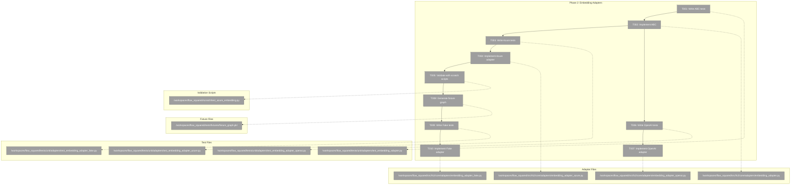
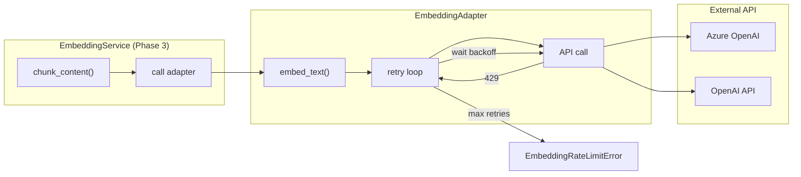
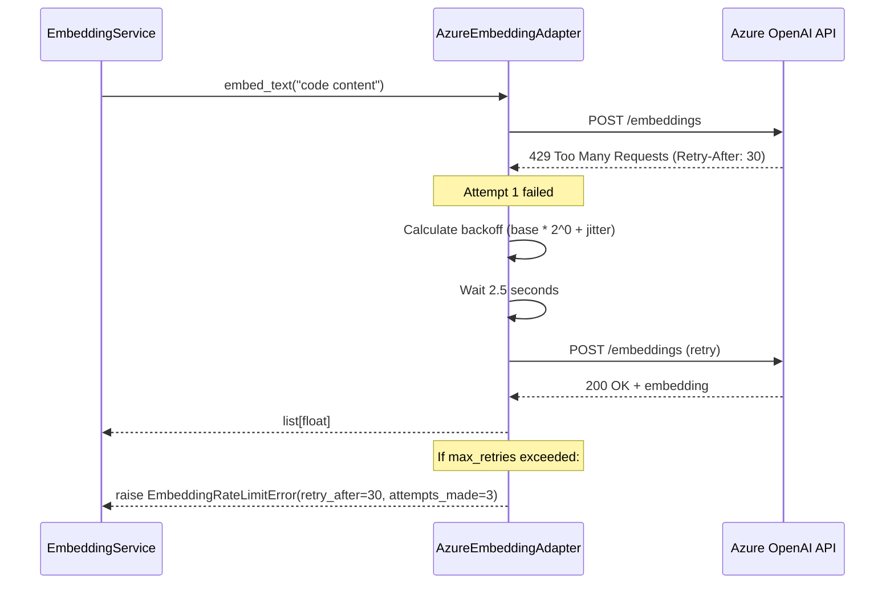

# Phase 2: Embedding Adapters – Tasks & Alignment Brief

**Spec**: [../../embeddings-spec.md](../../embeddings-spec.md)
**Plan**: [../../embeddings-plan.md](../../embeddings-plan.md)
**Date**: 2025-12-20
**Phase Slug**: `phase-2-embedding-adapters`
**Complexity**: CS-4 (Large)

---

## Executive Briefing

### Purpose

This phase implements the embedding adapter layer that translates between the embedding service and external embedding providers (Azure OpenAI, OpenAI-compatible APIs). The adapters handle API communication, authentication, rate limiting, and error translation, providing a clean abstraction for the service layer.

### What We're Building

1. **EmbeddingAdapter ABC** - Abstract base class defining the embedding contract:
   - `embed_text(text: str) -> list[float]` - Single text embedding
   - `embed_batch(texts: list[str]) -> list[list[float]]` - Batch embedding
   - `provider_name` property for identification

2. **AzureEmbeddingAdapter** - Production adapter for Azure OpenAI:
   - Uses `text-embedding-3-small` model with 1024 dimensions
   - Implements exponential backoff with retry logic (per Critical Finding 03)
   - Raises domain exceptions with retry metadata (per DYK-4 from Phase 1)

3. **OpenAICompatibleEmbeddingAdapter** - Generic OpenAI API adapter:
   - Works with OpenAI API and compatible providers
   - Similar retry logic to Azure adapter

4. **FakeEmbeddingAdapter** - Test double with graph support (built last):
   - Loads pre-computed embeddings from a real `CodeGraph` (generated from real scans)
   - Content-based lookup: finds node by content → returns `node.embedding`
   - Hash-based deterministic fallback for unknown content
   - `set_response()` and `set_error()` patterns following FakeLLMAdapter

### Implementation Strategy

**Build real first, then test infrastructure:**
1. Create ABC and real Azure adapter
2. Validate with scratch scripts and real API calls
3. Do real scans to generate fixture graphs
4. Build FakeEmbeddingAdapter last, using real graph data

### User Value

Developers can run semantic search without being locked to a single embedding provider. The test infrastructure enables reliable CI/CD without API credentials, while the fake adapter supports local development and testing.

### Example

**API Call (Azure)**:
```python
adapter = AzureEmbeddingAdapter(config_service)
embedding = await adapter.embed_text("def add(a, b): return a + b")
# Returns: [0.123, -0.456, ...] (1024 floats)
```

**Test (Fake - built from real graph)**:
```python
from fs2.core.models.code_graph import CodeGraph

graph = CodeGraph.load("tests/fixtures/fixture_graph.pkl")
adapter = FakeEmbeddingAdapter(fixture_graph=graph)
embedding = await adapter.embed_text("def add(a, b): return a + b")
# Returns: Pre-computed embedding from graph node, or deterministic hash-based fallback
```

---

## Objectives & Scope

### Objective

Create embedding adapter ABC and provider implementations per Plan Phase 2 acceptance criteria:
- [ ] All adapter files follow naming convention (`embedding_adapter_*.py`)
- [ ] Azure adapter handles rate limits with backoff
- [ ] FakeEmbeddingAdapter works with real fixture graph
- [ ] All tests passing (4 adapter test files)
- [ ] Embeddings returned as `list[float]` (not numpy, per Critical Finding 05)

### Goals

- ✅ Create `EmbeddingAdapter` ABC with async `embed_text` and `embed_batch` methods
- ✅ Implement `AzureEmbeddingAdapter` with retry logic and rate limit handling
- ✅ Validate real adapter with scratch scripts before building tests
- ✅ Implement `OpenAICompatibleEmbeddingAdapter` for generic OpenAI API
- ✅ Implement `FakeEmbeddingAdapter` with graph loading (last - uses real fixtures)
- ✅ Full TDD for unit tests; real validation for integration

### Non-Goals

- ❌ EmbeddingService logic (Phase 3)
- ❌ Content chunking (Phase 3)
- ❌ Pipeline integration (Phase 4)
- ❌ Global rate limit coordination across workers (Phase 3 - service level)

---

## Architecture Map

### Component Diagram
<!-- Status: grey=pending, orange=in-progress, green=completed, red=blocked -->
<!-- Updated by plan-6 during implementation -->



### Task-to-Component Mapping

<!-- Status: ⬜ Pending | 🟧 In Progress | ✅ Complete | 🔴 Blocked -->

| Task | Component(s) | Files | Status | Comment |
|------|-------------|-------|--------|---------|
| T001 | ABC Tests | test_embedding_adapter.py | ⬜ Pending | TDD: Write failing tests for interface compliance |
| T002 | EmbeddingAdapter ABC | embedding_adapter.py | ⬜ Pending | ABC definition with embed_text, embed_batch |
| T003 | Azure Adapter Tests | test_embedding_adapter_azure.py | ⬜ Pending | TDD: Auth, embed, rate limit, backoff |
| T004 | AzureEmbeddingAdapter | embedding_adapter_azure.py | ⬜ Pending | Azure OpenAI integration with retry |
| T005 | Validation | scratch/test_azure_embedding.py | ⬜ Pending | Real API calls to validate adapter works |
| T006 | OpenAI Adapter Tests | test_embedding_adapter_openai.py | ⬜ Pending | TDD: Generic OpenAI API compliance |
| T007 | OpenAICompatibleAdapter | embedding_adapter_openai.py | ⬜ Pending | OpenAI-compatible API integration |
| T008 | Fixture Generation | tests/fixtures/ | ⬜ Pending | Generate real graph with embeddings |
| T009 | Fake Adapter Tests | test_embedding_adapter_fake.py | ⬜ Pending | TDD: Graph loading, content lookup |
| T010 | FakeEmbeddingAdapter | embedding_adapter_fake.py | ⬜ Pending | Test double using real fixture graph |

---

## Tasks

| Status | ID | Task | CS | Type | Dependencies | Absolute Path(s) | Validation | Subtasks | Notes |
|--------|------|-----------------------------------|-----|------|--------------|-------------------------------|-------------------------------|----------|-------|
| [ ] | T001 | Add AzureEmbeddingConfig nested in EmbeddingConfig | 2 | Core | – | /workspaces/flow_squared/src/fs2/config/objects.py, /workspaces/flow_squared/tests/unit/config/test_embedding_config.py | Tests pass for nested azure config, mode=azure requires azure.endpoint | – | Per DYK-1: Missing connection config. Fields: endpoint, api_key, deployment_name, api_version |
| [ ] | T002 | Write failing tests for EmbeddingAdapter ABC | 2 | Test | T001 | /workspaces/flow_squared/tests/unit/adapters/test_embedding_adapter.py | Tests exist and fail with ImportError | – | Per Plan 2.1, interface compliance tests |
| [ ] | T003 | Implement EmbeddingAdapter ABC | 2 | Core | T002 | /workspaces/flow_squared/src/fs2/core/adapters/embedding_adapter.py | T002 tests pass, ABC has embed_text + embed_batch | – | Follow LLMAdapter pattern |
| [ ] | T004 | Write failing tests for AzureEmbeddingAdapter | 3 | Test | T003 | /workspaces/flow_squared/tests/unit/adapters/test_embedding_adapter_azure.py | Tests exist and cover auth, embed, rate limit, backoff | – | Per Plan 2.5, uses exceptions from Phase 1 |
| [ ] | T005 | Implement AzureEmbeddingAdapter | 3 | Core | T004 | /workspaces/flow_squared/src/fs2/core/adapters/embedding_adapter_azure.py | T004 tests pass, retry logic with DYK-4 metadata | – | Per Plan 2.6, max 60s backoff cap. Per DYK-2: pass dimensions to API, warn if response length mismatches |
| [ ] | T006 | Validate Azure adapter with scratch script | 2 | Integration | T005 | /workspaces/flow_squared/scratch/test_azure_embedding.py | Real API call returns 1024-dim embedding | – | Manual validation before building fake |
| [ ] | T007 | Write failing tests for OpenAICompatibleAdapter | 2 | Test | T003 | /workspaces/flow_squared/tests/unit/adapters/test_embedding_adapter_openai.py | Tests exist and cover OpenAI API compliance | – | Per Plan 2.7, generic OpenAI API |
| [ ] | T008 | Implement OpenAICompatibleEmbeddingAdapter | 2 | Core | T007 | /workspaces/flow_squared/src/fs2/core/adapters/embedding_adapter_openai.py | T007 tests pass, OpenAI API integration | – | Per Plan 2.8 |
| [ ] | T009 | Generate fixture graph with real embeddings | 2 | Setup | T006 | /workspaces/flow_squared/tests/fixtures/fixture_graph.pkl | Graph contains nodes with real embeddings | – | Use real Azure adapter to scan samples |
| [ ] | T010 | Write failing tests for FakeEmbeddingAdapter | 2 | Test | T003, T009 | /workspaces/flow_squared/tests/unit/adapters/test_embedding_adapter_fake.py | Tests exist and fail with ImportError | – | Uses fixture_graph.pkl for lookup |
| [ ] | T011 | Implement FakeEmbeddingAdapter | 2 | Core | T010 | /workspaces/flow_squared/src/fs2/core/adapters/embedding_adapter_fake.py | T010 tests pass, graph content lookup works | – | Per DYK-5: Use content_hash lookup (build _by_hash index), deterministic fallback for unknown |

---

## Alignment Brief

### Prior Phases Review

#### Phase 1: Core Infrastructure (Completed 2025-12-20)

**A. Deliverables Created**:

| File | Component | Lines |
|------|-----------|-------|
| `/workspaces/flow_squared/src/fs2/config/objects.py` | ChunkConfig | 443-494 |
| `/workspaces/flow_squared/src/fs2/config/objects.py` | EmbeddingConfig | 497-591 |
| `/workspaces/flow_squared/src/fs2/core/adapters/exceptions.py` | EmbeddingAdapterError hierarchy | 236-314 |
| `/workspaces/flow_squared/src/fs2/core/models/code_node.py` | embedding + smart_content_embedding fields | Updated |
| `/workspaces/flow_squared/tests/unit/config/test_embedding_config.py` | 26 tests | Full file |
| `/workspaces/flow_squared/tests/unit/adapters/test_embedding_exceptions.py` | 11 tests | Full file |
| `/workspaces/flow_squared/tests/unit/models/test_code_node_embedding.py` | 15 tests | Full file |

**B. Lessons Learned**:
- TDD approach worked exceptionally well (RED → GREEN → REFACTOR)
- Following existing patterns (SmartContentConfig, LLMAdapterError) reduced implementation time
- DYK session revealed scope increase from CS-2 to CS-4 (dual embedding fields, retry metadata)

**C. Technical Discoveries**:
- `overlap_tokens=0` is valid for smart_content (DYK-3)
- Embedding type must be `tuple[tuple[float, ...], ...]` for chunk-level storage
- Retry metadata (`retry_after`, `attempts_made`) in exceptions enables respecting API guidance

**D. Dependencies Exported** (available for Phase 2):

1. **Exception classes** to raise in adapters:
   - `EmbeddingAdapterError(message: str)` - Base exception
   - `EmbeddingAuthenticationError(message: str)` - HTTP 401 errors
   - `EmbeddingRateLimitError(message: str, retry_after: float | None, attempts_made: int)` - HTTP 429 errors

2. **Config model** to read in adapters:
   - `EmbeddingConfig.mode` → `Literal["azure", "openai_compatible", "fake"]`
   - `EmbeddingConfig.dimensions` → `int` (default 1024)
   - `EmbeddingConfig.max_retries` → `int` (default 3)
   - `EmbeddingConfig.base_delay` → `float` (default 2.0 seconds)
   - `EmbeddingConfig.max_delay` → `float` (default 60.0 seconds)

**E. Critical Findings Applied**:
- Finding 04: Content-type aware ChunkConfig created
- Finding 10: dimensions=1024 default implemented
- DYK-1: embedding type changed to tuple-of-tuples
- DYK-2: smart_content_embedding field added
- DYK-3: overlap >= 0 validation with explicit test
- DYK-4: Retry config and exception metadata implemented

**F. Incomplete/Blocked Items**: None - Phase 1 fully completed

**G. Test Infrastructure**: 52 tests across 3 files, all with AAA comments

**H. Technical Debt**: SmartContentConfig docstring/code mismatch noted (not blocking)

**I. Architectural Decisions**:
- Dual embedding architecture (raw + smart content)
- Tuple-of-tuples for chunk storage
- Content-type aware chunking config
- Retry metadata in exceptions

**J. Scope Changes**: dimensions field added during review fix

**K. Key Log References**:
- [T001 Pattern Study](../phase-1-core-infrastructure/execution.log.md#task-t001)
- [T004-T006 Config Implementation](../phase-1-core-infrastructure/execution.log.md#task-t004-t006)
- [T007-T008 Exception Implementation](../phase-1-core-infrastructure/execution.log.md#task-t007-t008)
- [T009-T010 CodeNode Updates](../phase-1-core-infrastructure/execution.log.md#task-t009-t010)

---

### Critical Findings Affecting This Phase

| Finding | Title | Constraint/Requirement | Addressed By |
|---------|-------|------------------------|--------------|
| **03** | Rate Limit Handling with Global Backoff | Workers hitting rate limit create cascading backoff. Adapter implements per-request retry. | T003, T004 |
| **05** | Pickle Security Constraints | Embeddings must be `list[float]`, not numpy arrays (RestrictedUnpickler whitelist) | T002, T004, T007, T010 |
| **DYK-4** | 429 Retry Strategy | Use EmbeddingRateLimitError with `retry_after`, `attempts_made`. Config has `max_retries`, `base_delay`, `max_delay`. | T003, T004, T006, T007 |

### ADR Decision Constraints

No ADRs exist for this feature. ADR seeds are defined in spec but not yet formalized:
- ADR-001: Chunking vs Truncation Strategy
- ADR-002: Embedding Provider Architecture

### Invariants & Guardrails

| Invariant | Enforcement |
|-----------|-------------|
| Embeddings returned as `list[float]` | Type annotation + tests (per Finding 05: no numpy) |
| Adapter follows ABC interface | Abstract methods enforced at class definition |
| Rate limit uses exponential backoff | Tests verify delay calculation, max 60s cap |
| Retry metadata populated on rate limit | EmbeddingRateLimitError constructor enforces |
| Fake adapter provides deterministic results | Same input → same output tests |

### Inputs to Read

| File | Purpose |
|------|---------|
| `/workspaces/flow_squared/src/fs2/core/adapters/llm_adapter.py` | Study ABC pattern for EmbeddingAdapter |
| `/workspaces/flow_squared/src/fs2/core/adapters/llm_adapter_azure.py` | Study Azure integration pattern |
| `/workspaces/flow_squared/src/fs2/core/adapters/llm_adapter_fake.py` | Study Fake adapter pattern |
| `/workspaces/flow_squared/src/fs2/core/adapters/exceptions.py` | Use EmbeddingAdapterError hierarchy |
| `/workspaces/flow_squared/src/fs2/config/objects.py` | Use EmbeddingConfig for retry params |

### Visual Alignment Aids

#### Flow Diagram: Embedding Request



#### Sequence Diagram: Rate Limit Handling



### Test Plan (Full TDD)

| Test File | Test Class/Function | Purpose | Fixtures | Expected Outcome |
|-----------|---------------------|---------|----------|------------------|
| `test_embedding_adapter.py` | `TestEmbeddingAdapterABC::test_cannot_instantiate_abc` | Verify ABC cannot be instantiated | None | TypeError on instantiation |
| `test_embedding_adapter.py` | `TestEmbeddingAdapterABC::test_must_implement_embed_text` | Verify embed_text is abstract | None | TypeError if not implemented |
| `test_embedding_adapter.py` | `TestEmbeddingAdapterABC::test_must_implement_embed_batch` | Verify embed_batch is abstract | None | TypeError if not implemented |
| `test_embedding_adapter.py` | `TestEmbeddingAdapterABC::test_must_implement_provider_name` | Verify provider_name is abstract | None | TypeError if not implemented |
| `test_embedding_adapter_azure.py` | `TestAzureEmbeddingAdapter::test_auth_error_raises_authentication_error` | HTTP 401 handling | Mock | EmbeddingAuthenticationError raised |
| `test_embedding_adapter_azure.py` | `TestAzureEmbeddingAdapter::test_rate_limit_retries_with_backoff` | HTTP 429 retry logic | Mock | Retries with increasing delay |
| `test_embedding_adapter_azure.py` | `TestAzureEmbeddingAdapter::test_rate_limit_max_retries_exceeded` | Max retries limit | Mock | EmbeddingRateLimitError after max_retries |
| `test_embedding_adapter_azure.py` | `TestAzureEmbeddingAdapter::test_rate_limit_error_has_retry_metadata` | DYK-4 metadata | Mock | retry_after and attempts_made populated |
| `test_embedding_adapter_azure.py` | `TestAzureEmbeddingAdapter::test_backoff_capped_at_max_delay` | Max 60s cap | Mock | Backoff never exceeds config.max_delay |
| `test_embedding_adapter_azure.py` | `TestAzureEmbeddingAdapter::test_returns_list_float_not_numpy` | Finding 05 compliance | Mock | Returns `list[float]`, not numpy array |
| `test_embedding_adapter_azure.py` | `TestAzureEmbeddingAdapter::test_embed_batch_parallel_requests` | Batch efficiency | Mock | Multiple embeddings in single call |
| `test_embedding_adapter_azure.py` | `TestAzureEmbeddingAdapter::test_dimensions_match_config` | Config dimensions used | Mock | Returned embedding has config.dimensions length |
| `test_embedding_adapter_openai.py` | `TestOpenAICompatibleAdapter::test_embed_text_returns_list_float` | Return type | Mock | Returns `list[float]` |
| `test_embedding_adapter_openai.py` | `TestOpenAICompatibleAdapter::test_auth_error_raises_authentication_error` | HTTP 401 handling | Mock | EmbeddingAuthenticationError raised |
| `test_embedding_adapter_openai.py` | `TestOpenAICompatibleAdapter::test_rate_limit_retries` | Retry logic | Mock | Retries on HTTP 429 |
| `test_embedding_adapter_fake.py` | `TestFakeEmbeddingAdapter::test_embed_text_returns_list_float` | Verify return type | fixture_graph.pkl | Returns `list[float]` with 1024 elements |
| `test_embedding_adapter_fake.py` | `TestFakeEmbeddingAdapter::test_same_input_same_output` | Verify determinism | fixture_graph.pkl | Identical input → identical output |
| `test_embedding_adapter_fake.py` | `TestFakeEmbeddingAdapter::test_graph_content_returns_node_embedding` | Known content returns pre-computed | fixture_graph.pkl | Returns node.embedding from graph |
| `test_embedding_adapter_fake.py` | `TestFakeEmbeddingAdapter::test_unknown_content_returns_hash_fallback` | Unknown content uses hash | fixture_graph.pkl | Deterministic hash-based vector |
| `test_embedding_adapter_fake.py` | `TestFakeEmbeddingAdapter::test_set_response_overrides_graph` | Explicit control pattern | fixture_graph.pkl | set_response() value used |
| `test_embedding_adapter_fake.py` | `TestFakeEmbeddingAdapter::test_set_error_raises_exception` | Error simulation | fixture_graph.pkl | Configured exception raised |
| `test_embedding_adapter_fake.py` | `TestFakeEmbeddingAdapter::test_call_history_tracked` | Call verification | fixture_graph.pkl | call_history populated |
| `test_embedding_adapter_fake.py` | `TestFakeEmbeddingAdapter::test_embed_batch_returns_list_of_list_float` | Batch return type | fixture_graph.pkl | Returns `list[list[float]]` |

### Step-by-Step Implementation Outline

1. **T001-T002 (ABC)**: EmbeddingAdapter ABC
   - Create test_embedding_adapter.py with ABC compliance tests
   - Run tests → expect ImportError
   - Implement EmbeddingAdapter ABC in embedding_adapter.py
   - Run tests → all pass

2. **T003-T004 (Azure)**: AzureEmbeddingAdapter - the real adapter
   - Create test_embedding_adapter_azure.py with auth/retry tests
   - Use mocks to avoid real API calls in unit tests
   - Run tests → expect ImportError
   - Implement AzureEmbeddingAdapter following LLMAdapter pattern
   - Run tests → all pass

3. **T005 (Validation)**: Validate with real API
   - Create `scratch/test_azure_embedding.py`
   - Real API calls with actual Azure credentials
   - Verify: returns 1024 floats, handles errors correctly
   - **Manual checkpoint before building fake adapter**

4. **T006-T007 (OpenAI)**: OpenAICompatibleEmbeddingAdapter
   - Create test_embedding_adapter_openai.py
   - Use mocks for unit tests
   - Implement OpenAICompatibleEmbeddingAdapter
   - Run tests → all pass

5. **T008 (Fixtures)**: Generate fixture graph
   - Use real Azure adapter to scan sample files
   - Save graph with real embeddings to `tests/fixtures/fixture_graph.pkl`
   - This becomes the source of truth for fake adapter

6. **T009-T010 (Fake)**: FakeEmbeddingAdapter - built last
   - Create test_embedding_adapter_fake.py using fixture_graph.pkl
   - Implement FakeEmbeddingAdapter with graph content lookup
   - Hash-based fallback for unknown content
   - Run tests → all pass

### Commands to Run

```bash
# Environment setup
cd /workspaces/flow_squared

# Run all Phase 2 tests
uv run pytest tests/unit/adapters/test_embedding_adapter.py -v
uv run pytest tests/unit/adapters/test_embedding_adapter_azure.py -v
uv run pytest tests/unit/adapters/test_embedding_adapter_openai.py -v
uv run pytest tests/unit/adapters/test_embedding_adapter_fake.py -v

# Run all adapter tests together
uv run pytest tests/unit/adapters/test_embedding_adapter*.py -v

# Validation with real API (T005)
export FS2_AZURE__EMBEDDING__ENDPOINT="your-endpoint"
export FS2_AZURE__EMBEDDING__API_KEY="your-key"
uv run python scratch/test_azure_embedding.py

# Linting
uv run ruff check src/fs2/core/adapters/embedding_adapter*.py

# Type checking (if mypy configured)
uv run python -m mypy src/fs2/core/adapters/embedding_adapter*.py
```

### Risks & Unknowns

| Risk | Severity | Mitigation |
|------|----------|------------|
| Azure API unavailable during development | Medium | Scratch scripts validate early; mocks for unit tests |
| openai SDK version incompatibility | Low | Pin version in pyproject.toml |
| Rate limit during fixture generation | Low | Generate from small sample set |
| Async test complexity | Medium | Use pytest-asyncio; follow existing test patterns |

### Ready Check

- [ ] Phase 1 complete (exceptions, config available)
- [ ] LLMAdapter pattern studied for embedding adapter design
- [ ] FakeLLMAdapter pattern studied for fake adapter design
- [ ] AzureOpenAIAdapter pattern studied for Azure adapter design
- [ ] Test file paths confirmed
- [ ] ADR constraints mapped to tasks (IDs noted in Notes column) - N/A (no ADRs exist)

**Awaiting GO/NO-GO from human sponsor.**

---

## Phase Footnote Stubs

_Will be populated during implementation. See [../../embeddings-plan.md#change-footnotes-ledger](../../embeddings-plan.md#change-footnotes-ledger) for authority._

| Footnote | Task | Description | Resolution |
|----------|------|-------------|------------|
| – | – | – | – |

---

## Evidence Artifacts

| Artifact | Purpose | Location |
|----------|---------|----------|
| Execution Log | Detailed implementation narrative | `/workspaces/flow_squared/docs/plans/009-embeddings/tasks/phase-2-embedding-adapters/execution.log.md` |
| Test Results | pytest output | Captured in execution log |
| Fixture Graph | Pre-computed embeddings in CodeGraph | `/workspaces/flow_squared/tests/fixtures/fixture_graph.pkl` |
| Validation Script | Real API validation | `/workspaces/flow_squared/scratch/test_azure_embedding.py` |

---

## Discoveries & Learnings

_Populated during implementation by plan-6. Log anything of interest to your future self._

| Date | Task | Type | Discovery | Resolution | References |
|------|------|------|-----------|------------|------------|
| | | | | | |

**Types**: `gotcha` | `research-needed` | `unexpected-behavior` | `workaround` | `decision` | `debt` | `insight`

**What to log**:
- Things that didn't work as expected
- External research that was required
- Implementation troubles and how they were resolved
- Gotchas and edge cases discovered
- Decisions made during implementation
- Technical debt introduced (and why)
- Insights that future phases should know about

_See also: `execution.log.md` for detailed narrative._

---

## Directory Layout

```
docs/plans/009-embeddings/
├── embeddings-spec.md
├── embeddings-plan.md
├── research-dossier.md
└── tasks/
    ├── phase-1-core-infrastructure/
    │   ├── tasks.md
    │   └── execution.log.md
    └── phase-2-embedding-adapters/
        ├── tasks.md                    # This file
        └── execution.log.md            # Created by plan-6
```

---

**Phase 2 Dossier Complete**: 2025-12-20
**Next Step**: Await human **GO**, then run `/plan-6-implement-phase --phase "Phase 2: Embedding Adapters"`

---

## Critical Insights Discussion

**Session**: 2025-12-20
**Context**: Phase 2: Embedding Adapters Tasks & Alignment Brief
**Analyst**: AI Clarity Agent
**Reviewer**: Development Team
**Format**: Water Cooler Conversation (5 Critical Insights)

### Insight 1: Missing Azure Connection Config

**Did you know**: EmbeddingConfig has `mode: "azure"` but no fields for endpoint, API key, or deployment name. The adapter cannot connect.

**Implications**:
- AzureEmbeddingAdapter.__init__() has nothing to read for connection details
- Cannot configure separate embedding endpoints from LLM endpoints
- Adapter literally cannot connect to Azure

**Options Considered**:
- Option A: Add azure-specific fields to EmbeddingConfig directly
- Option B: Reuse LLMConfig's Azure settings
- Option C: Add nested AzureEmbeddingConfig (like existing ChunkConfig pattern)

**AI Recommendation**: Option C - Nested AzureEmbeddingConfig
- Reasoning: Follows existing pattern with ChunkConfig; supports separate endpoints; config nesting already works

**Discussion Summary**:
User confirmed Option C. Subagent investigation verified config system fully supports nested models with YAML and env vars (`FS2_EMBEDDING__AZURE__ENDPOINT`).

**Decision**: Add `AzureEmbeddingConfig` nested in `EmbeddingConfig` with endpoint, api_key, deployment_name, api_version fields

**Action Items**:
- [x] Added T001: Create AzureEmbeddingConfig nested config

**Affects**: T001 (new task), EmbeddingConfig in objects.py

---

### Insight 2: Dimensions Parameter Required for API Call

**Did you know**: For text-embedding-3-* models, you must pass the `dimensions` parameter to the API. Otherwise it returns 3072 dimensions instead of 1024.

**Implications**:
- Config stores dimensions=1024 but adapter must pass it to API
- Without it, embeddings are 3x larger than expected
- Mixed dimension graphs break similarity search

**Options Considered**:
- Option A: Pass dimensions to API (required)
- Option B: Also validate response length matches config

**AI Recommendation**: Both A + B
- Reasoning: A is mandatory; B catches silent failures

**Discussion Summary**:
User confirmed A + B, preferring warnings over hard errors for dimension mismatch.

**Decision**: Pass dimensions to API, warn (don't error) if response length mismatches

**Action Items**:
- [x] Updated T005 notes with dimensions requirement

**Affects**: T005 (AzureEmbeddingAdapter implementation)

---

### Insight 3: embed_batch() Semantics - One Call or Many?

**Did you know**: The OpenAI/Azure API supports batching multiple texts in a single request, but there's a token limit.

**Implications**:
- Need to decide if embed_batch makes one API call or many
- Affects rate limiting, latency, error handling

**Options Considered**:
- Option A: Single API call (naive batching)
- Option B: Chunked API calls (smart batching)
- Option C: One API call per text (no real batching)

**AI Recommendation**: Option A - follow Flowspace pattern
- Reasoning: Flowspace uses two-level batching: service chunks work, adapter makes one API call per batch

**Discussion Summary**:
Investigated Flowspace via MCP. Confirmed pattern: Generator (service) has batch_size and splits work; Provider (adapter) takes array and makes one API call. Adapter is simple, service handles chunking.

**Decision**: Adapter takes array, makes one API call. Service (Phase 3) handles batch sizing.

**Action Items**: None - confirms existing design

**Affects**: T003 (ABC design), T005 (Azure impl)

---

### Insight 4: Return Type Mismatch Between Adapter and CodeNode

**Did you know**: Adapter returns `list[float]` but CodeNode.embedding is `tuple[tuple[float, ...], ...]`. Someone must convert.

**Implications**:
- Adapter returns what API gives (list[float])
- Service collects embeddings from chunks
- Service must convert to tuple-of-tuples for storage

**Options Considered**:
- Option A: Adapter returns list[float], service converts
- Option B: Adapter returns tuple[float, ...], service wraps

**AI Recommendation**: Option A
- Reasoning: Clean separation - adapter is pure API wrapper, service handles storage format

**Discussion Summary**:
User confirmed Option A. Adapter stays simple, conversion is Phase 3 responsibility.

**Decision**: Adapter returns `list[float]`, service (Phase 3) converts to storage format

**Action Items**: None - Phase 3 responsibility

**Affects**: Phase 3 design (document for handoff)

---

### Insight 5: FakeEmbeddingAdapter Graph Lookup Strategy

**Did you know**: Looking up embeddings by content in fixture graph requires exact string match, but text passed to embed_text() may not match node.content exactly.

**Implications**:
- Exact content match is fragile (whitespace, formatting)
- Need robust lookup strategy
- Unknown content needs deterministic fallback

**Options Considered**:
- Option A: Exact match + hash-based fallback
- Option B: Content hash lookup (primary) + fallback
- Option C: Multiple lookup strategies

**AI Recommendation**: Option B - content_hash lookup
- Reasoning: Already have content_hash infrastructure; handles exact matching robustly

**Discussion Summary**:
User confirmed Option B. Build _by_hash index from graph nodes, lookup by compute_content_hash(text).

**Decision**: Use content_hash lookup with deterministic fallback for unknown content

**Action Items**:
- [x] Updated T011 notes with content_hash lookup strategy

**Affects**: T011 (FakeEmbeddingAdapter implementation)

---

## Session Summary

**Insights Surfaced**: 5 critical insights identified and discussed
**Decisions Made**: 5 decisions reached through collaborative discussion
**Action Items Created**: 3 task updates applied
**Areas Updated**:
- tasks.md: Added T001, updated T005, updated T011, renumbered all tasks

**Shared Understanding Achieved**: ✓

**Confidence Level**: High - Key design decisions clarified before implementation

**Next Steps**:
Proceed to implementation with `/plan-6-implement-phase --phase "Phase 2: Embedding Adapters"`
