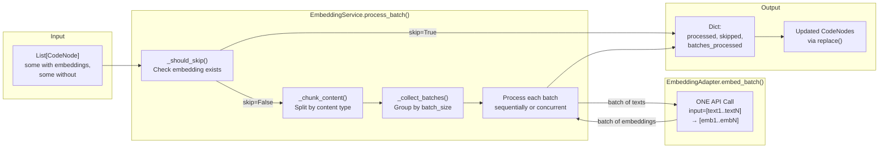
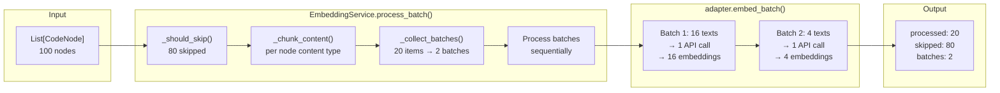
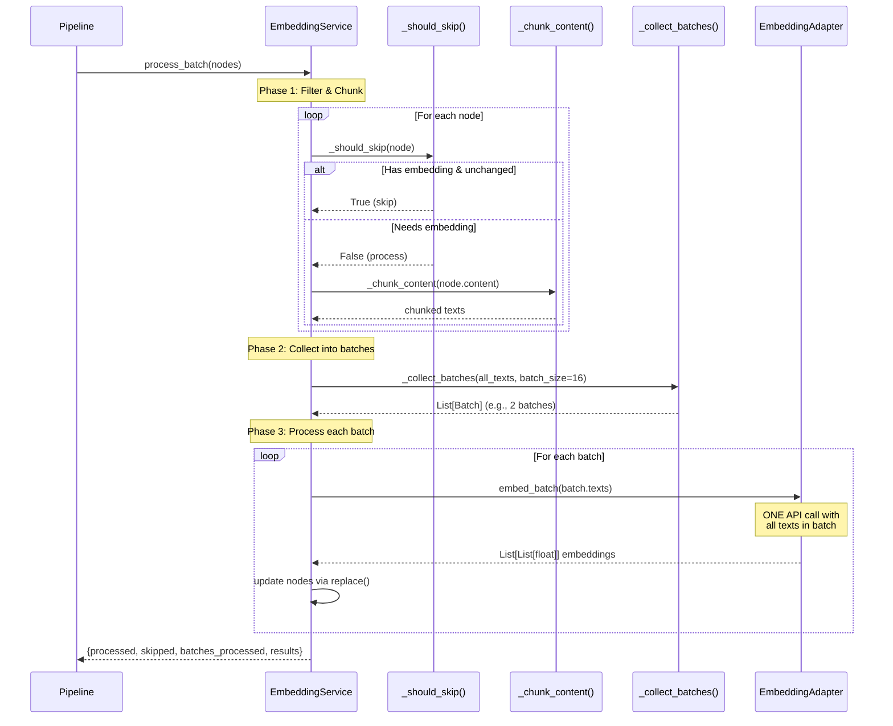

# Phase 3: Embedding Service – Tasks & Alignment Brief

**Spec**: [embeddings-spec.md](../../embeddings-spec.md)
**Plan**: [embeddings-plan.md](../../embeddings-plan.md)
**Phase Slug**: `phase-3-embedding-service`
**Date**: 2025-12-21
**Updated**: 2025-12-21 (Corrected batching architecture per FlowSpace pattern)

---

## Executive Briefing

### Purpose

This phase implements the `EmbeddingService` that orchestrates embedding generation for CodeNode batches. The service acts as the composition layer between the CLI/pipeline and the embedding adapters, handling content chunking, **API-level batch processing**, hash-based skip logic, and rate limit coordination. Without this service, the pipeline cannot generate embeddings—this is the engine that drives the embedding feature.

### What We're Building

An `EmbeddingService` class that:
- Chunks content based on content-type parameters (code=400, docs=800, smart_content=8000 tokens)
- **Collects items and splits into fixed-size batches** (default: 16 texts per API call)
- **Sends ONE API call per batch** (not parallel individual calls) - this is the FlowSpace pattern
- Skips unchanged content using hash-based detection to minimize API calls
- Coordinates rate limit backoff globally across batches
- Reports progress via callback for pipeline integration
- Follows stateless design (CD10): all batch state local to method, no instance mutation

### Batching Architecture (Critical Distinction)

**WRONG approach** (what SmartContentService does for LLMs):
```
50 Workers → 50 parallel API calls (1 prompt each) → 50 responses
```

**CORRECT approach** (what FlowSpace uses for embeddings):
```
Collect items → Split into batches (16 items each) → 1 API call per batch
Batch 1: [text1..text16] → 1 API call → [emb1..emb16]
Batch 2: [text17..text32] → 1 API call → [emb17..emb32]
```

The embedding API natively supports batch input - sending multiple texts in ONE HTTP request is much more efficient than parallel individual calls.

### User Value

Users running `fs2 scan` get embeddings generated for their code without manual intervention. The service handles:
- **Incremental updates**: Only changed files get re-embedded (cost savings)
- **Resilience**: Rate limits don't crash the scan—service pauses and resumes
- **Efficiency**: API-level batching maximizes throughput with minimal requests
- **Cost optimization**: Fewer API calls = lower costs

### Example

**Input**: 100 CodeNodes (80 unchanged, 20 new/modified)

**Processing** (with batch_size=16):
```python
# Service collects 20 items needing embedding
# Splits into 2 batches: [16 items] + [4 items]
# Makes 2 API calls total (not 20!)

result = await embedding_service.process_batch(nodes)
# result = {
#     "processed": 20,     # New embeddings generated
#     "skipped": 80,       # Hash-based skip
#     "errors": 0,
#     "batches_processed": 2,  # Only 2 API calls
#     "results": {node_id: updated_node for all nodes}
# }
```

**Output**: All nodes updated with `embedding` and `smart_content_embedding` fields (tuple-of-tuples for chunk-level storage).

---

## Objectives & Scope

### Objective

Implement `EmbeddingService` with **API-level batch processing** (FlowSpace pattern), content-type aware chunking, hash-based skip logic, and rate limit coordination as specified in plan § Phase 3.

### Goals

- ✅ Implement content-type aware chunking logic (`_chunk_content()`)
- ✅ Implement hash-based skip logic (`_should_skip()`) for incremental updates
- ✅ Implement batch collection and splitting (`_collect_batches()`)
- ✅ Implement `process_batch()` with **API-level batching** (one `embed_batch()` call per batch)
- ✅ Implement rate limit coordination across batches
- ✅ Support optional concurrent batch processing (`max_concurrent_batches`)
- ✅ Support progress reporting callback for pipeline integration
- ✅ Handle tiktoken fallback for unknown models with warning log
- ✅ All implementations follow TDD: tests first, then implementation

### Non-Goals

- ❌ Pipeline integration (Phase 4) – Service is standalone, pipeline adds EmbeddingStage
- ❌ CLI flags (Phase 4) – `--no-embeddings` flag added in Phase 4
- ❌ Graph config node with embedding metadata (Phase 4) – Stored in EmbeddingStage
- ❌ Integration tests with full pipeline (Phase 5) – This phase creates unit tests only
- ❌ Documentation (Phase 6) – User-facing docs created after testing validation
- ❌ Parallel individual API calls – Use batch API, not parallel single calls
- ❌ Complex retry orchestration – Adapter handles per-request retries; service handles batch-level coordination

---

## Architecture Map

### Component Diagram

```mermaid
flowchart TD
    classDef pending fill:#9E9E9E,stroke:#757575,color:#fff
    classDef inprogress fill:#FF9800,stroke:#F57C00,color:#fff
    classDef completed fill:#4CAF50,stroke:#388E3C,color:#fff
    classDef blocked fill:#F44336,stroke:#D32F2F,color:#fff

    subgraph Phase3["Phase 3: Embedding Service"]
        T001["T001: Write chunking tests"]:::pending
        T002["T002: Implement _chunk_content"]:::pending
        T003["T003: Write skip logic tests"]:::pending
        T004["T004: Implement _should_skip"]:::pending
        T005["T005: Write batch collection tests"]:::pending
        T006["T006: Implement _collect_batches"]:::pending
        T007["T007: Write process_batch tests"]:::pending
        T008["T008: Implement process_batch"]:::pending
        T009["T009: Write rate limit tests"]:::pending
        T010["T010: Implement rate limit coord"]:::pending
        T011["T011: Write tiktoken fallback test"]:::pending

        T001 --> T002
        T003 --> T004
        T005 --> T006
        T002 --> T007
        T004 --> T007
        T006 --> T007
        T007 --> T008
        T009 --> T010
        T008 --> T010
        T011 -.-> T002
    end

    subgraph Dependencies["Dependencies (from Phase 1 & 2)"]
        EmbeddingConfig["EmbeddingConfig<br/>(batch_size, max_concurrent_batches)"]:::completed
        ChunkConfig["ChunkConfig"]:::completed
        EmbeddingAdapter["EmbeddingAdapter ABC<br/>(embed_batch)"]:::completed
        TokenCounter["TokenCounterAdapter"]:::completed
        Exceptions["Exception Hierarchy"]:::completed
        CodeNode["CodeNode (dual fields)"]:::completed
    end

    subgraph Files["Files to Create"]
        SVC["/src/fs2/core/services/embedding/embedding_service.py"]:::pending
        TST1["/tests/unit/services/test_embedding_chunking.py"]:::pending
        TST2["/tests/unit/services/test_embedding_skip.py"]:::pending
        TST3["/tests/unit/services/test_embedding_batch_collection.py"]:::pending
        TST4["/tests/unit/services/test_embedding_service.py"]:::pending
        TST5["/tests/unit/services/test_embedding_rate_limit.py"]:::pending
        TST6["/tests/unit/services/test_token_counter_fallback.py"]:::pending
    end

    T001 -.-> TST1
    T002 -.-> SVC
    T003 -.-> TST2
    T005 -.-> TST3
    T007 -.-> TST4
    T009 -.-> TST5
    T011 -.-> TST6

    EmbeddingConfig --> T006
    EmbeddingConfig --> T008
    ChunkConfig --> T002
    TokenCounter --> T002
    EmbeddingAdapter --> T008
    Exceptions --> T010
    CodeNode --> T008
```

<!-- Status: grey=pending, orange=in-progress, green=completed, red=blocked -->
<!-- Updated by plan-6 during implementation -->



### Batching Flow Diagram



### Task-to-Component Mapping

<!-- Status: ⬜ Pending | 🟧 In Progress | ✅ Complete | 🔴 Blocked -->

| Task | Component(s) | Files | Status | Comment |
|------|-------------|-------|--------|---------|
| T001 | Chunking Tests | `/workspaces/flow_squared/tests/unit/services/test_embedding_chunking.py` | ⬜ Pending | TDD RED: tests for content-type chunking |
| T002 | Chunking Logic | `/workspaces/flow_squared/src/fs2/core/services/embedding/embedding_service.py` | ⬜ Pending | TDD GREEN: `_chunk_content()` implementation |
| T003 | Skip Logic Tests | `/workspaces/flow_squared/tests/unit/services/test_embedding_skip.py` | ⬜ Pending | TDD RED: tests for hash-based skip |
| T004 | Skip Logic | `/workspaces/flow_squared/src/fs2/core/services/embedding/embedding_service.py` | ⬜ Pending | TDD GREEN: `_should_skip()` implementation |
| T005 | Batch Collection Tests | `/workspaces/flow_squared/tests/unit/services/test_embedding_batch_collection.py` | ⬜ Pending | TDD RED: tests for splitting into fixed batches |
| T006 | Batch Collection | `/workspaces/flow_squared/src/fs2/core/services/embedding/embedding_service.py` | ⬜ Pending | TDD GREEN: `_collect_batches()` using config.batch_size |
| T007 | Batch Processing Tests | `/workspaces/flow_squared/tests/unit/services/test_embedding_service.py` | ⬜ Pending | TDD RED: tests for `process_batch()`, stateless CD10 |
| T008 | Batch Processing | `/workspaces/flow_squared/src/fs2/core/services/embedding/embedding_service.py` | ⬜ Pending | TDD GREEN: `process_batch()` calls `embed_batch()` per batch |
| T009 | Rate Limit Tests | `/workspaces/flow_squared/tests/unit/services/test_embedding_rate_limit.py` | ⬜ Pending | TDD RED: tests for batch-level rate limit handling |
| T010 | Rate Limit Coordination | `/workspaces/flow_squared/src/fs2/core/services/embedding/embedding_service.py` | ⬜ Pending | TDD GREEN: Handle rate limits across batches |
| T011 | Tiktoken Fallback Test | `/workspaces/flow_squared/tests/unit/services/test_token_counter_fallback.py` | ⬜ Pending | Test for cl100k_base fallback with warning |

---

## Tasks

| Status | ID | Task | CS | Type | Dependencies | Absolute Path(s) | Validation | Subtasks | Notes |
|--------|------|------|-----|------|--------------|------------------|------------|----------|-------|
| [ ] | T001 | Write tests for content chunking (code vs docs vs smart_content, overlap, token boundaries) | 3 | Test | – | `/workspaces/flow_squared/tests/unit/services/test_embedding_chunking.py` | Tests fail with ModuleNotFoundError, cover all content types | – | Per Plan 3.1, Per Finding 04 |
| [ ] | T002 | Implement `_chunk_content()` with content-type aware parameters | 3 | Core | T001 | `/workspaces/flow_squared/src/fs2/core/services/embedding/embedding_service.py` | All T001 tests pass, uses `TokenCounterAdapter` | – | Per Plan 3.2, Uses `config.code.max_tokens`, etc. |
| [ ] | T003 | Write tests for hash-based skip logic (skip unchanged, process changed, edge cases) | 2 | Test | – | `/workspaces/flow_squared/tests/unit/services/test_embedding_skip.py` | Tests fail with ModuleNotFoundError | – | Per Plan 3.3, Per Finding 08 |
| [ ] | T004 | Implement `_should_skip()` for unchanged content detection | 2 | Core | T003 | `/workspaces/flow_squared/src/fs2/core/services/embedding/embedding_service.py` | All T003 tests pass, returns bool based on embedding existence | – | Per Plan 3.4 |
| [ ] | T005 | Write tests for batch collection (`_collect_batches()` using config.batch_size) | 2 | Test | – | `/workspaces/flow_squared/tests/unit/services/test_embedding_batch_collection.py` | Tests cover: 100 items with batch_size=16 → 7 batches | – | FlowSpace pattern |
| [ ] | T006 | Implement `_collect_batches()` to split items into fixed-size batches | 2 | Core | T005 | `/workspaces/flow_squared/src/fs2/core/services/embedding/embedding_service.py` | All T005 tests pass, uses `config.batch_size` | – | Per FlowSpace pattern |
| [ ] | T007 | Write tests for `process_batch()` (**API-level batching**, progress callback, stats, stateless CD10) | 3 | Test | T001, T003, T005 | `/workspaces/flow_squared/tests/unit/services/test_embedding_service.py` | Tests verify adapter.embed_batch() called once per batch, not per item | – | Per Finding 02 |
| [ ] | T008 | Implement `process_batch()` calling `adapter.embed_batch()` per batch | 3 | Core | T002, T004, T006, T007 | `/workspaces/flow_squared/src/fs2/core/services/embedding/embedding_service.py` | All T007 tests pass, **all batch state local to method (no instance mutation)** | – | Per Finding 01 (use replace()) |
| [ ] | T009 | Write tests for rate limit handling across batches | 2 | Test | – | `/workspaces/flow_squared/tests/unit/services/test_embedding_rate_limit.py` | Tests: rate limit on batch N pauses, resumes with backoff | – | Per Finding 03 |
| [ ] | T010 | Implement rate limit coordination across batches | 2 | Core | T008, T009 | `/workspaces/flow_squared/src/fs2/core/services/embedding/embedding_service.py` | All T009 tests pass, respects retry_after from exception | – | max backoff 60s |
| [ ] | T011 | Write test for tiktoken model fallback with warning log | 2 | Test | – | `/workspaces/flow_squared/tests/unit/services/test_token_counter_fallback.py` | Unknown model logs warning, uses cl100k_base fallback | – | Per Finding 11 |

---

## Alignment Brief

### Prior Phases Review

#### Phase 1: Core Infrastructure (Completed 2025-12-20)

**A. Deliverables Created**

| File | Component | Lines |
|------|-----------|-------|
| `/workspaces/flow_squared/src/fs2/config/objects.py` | `ChunkConfig`, `EmbeddingConfig`, `AzureEmbeddingConfig` | 179 |
| `/workspaces/flow_squared/src/fs2/core/adapters/exceptions.py` | `EmbeddingAdapterError`, `EmbeddingRateLimitError`, `EmbeddingAuthenticationError` | 79 |
| `/workspaces/flow_squared/src/fs2/core/models/code_node.py` | Dual embedding fields (`embedding`, `smart_content_embedding`) | Updated |
| `/workspaces/flow_squared/tests/unit/config/test_embedding_config.py` | 35 tests | 726 |
| `/workspaces/flow_squared/tests/unit/adapters/test_embedding_exceptions.py` | 11 tests | 223 |
| `/workspaces/flow_squared/tests/unit/models/test_code_node_embedding.py` | 15 tests | 454 |

**B. Key Lessons Learned**

1. **TDD Methodology Worked**: RED → GREEN → REFACTOR strictly followed
2. **Pattern Following Reduced Time**: SmartContentConfig → ChunkConfig pattern reuse

**C. Dependencies Exported to Phase 3**

```python
# Configuration API (UPDATED)
from fs2.config.objects import EmbeddingConfig, ChunkConfig
config = config_service.require(EmbeddingConfig)
# config.batch_size (16) - texts per API call
# config.max_concurrent_batches (1) - concurrent batch processing
# config.code.max_tokens (400), config.documentation.max_tokens (800), etc.

# Exception API
from fs2.core.adapters.exceptions import EmbeddingRateLimitError
# EmbeddingRateLimitError(message, retry_after: float | None, attempts_made: int)

# CodeNode Storage Pattern
from dataclasses import replace
updated_node = replace(node, embedding=((0.1, 0.2, ...), ...), smart_content_embedding=...)
```

---

#### Phase 2: Embedding Adapters (Completed 2025-12-21)

**A. Deliverables Created**

| File | Component | Lines |
|------|-----------|-------|
| `/workspaces/flow_squared/src/fs2/core/adapters/embedding_adapter.py` | `EmbeddingAdapter` ABC | ~100 |
| `/workspaces/flow_squared/src/fs2/core/adapters/embedding_adapter_azure.py` | `AzureEmbeddingAdapter` | ~200 |
| `/workspaces/flow_squared/src/fs2/core/adapters/embedding_adapter_openai.py` | `OpenAICompatibleEmbeddingAdapter` | ~150 |
| `/workspaces/flow_squared/src/fs2/core/adapters/embedding_adapter_fake.py` | `FakeEmbeddingAdapter` with fixture support | ~200 |
| `/workspaces/flow_squared/tests/fixtures/fixture_graph.pkl` | 397 nodes, real embeddings | 3.9 MB |

**B. Critical API Design for Phase 3**

The adapters are **already correctly designed** for API-level batching:

```python
class EmbeddingAdapter(ABC):
    async def embed_batch(self, texts: list[str]) -> list[list[float]]:
        """Generate embeddings for multiple texts in a SINGLE API call.

        Per DYK-3: This method makes a single API call with all texts.
        The service layer (Phase 3) handles batch sizing/chunking.
        """

# Azure implementation (line 155-159):
response = await client.embeddings.create(
    model=self._azure_config.deployment_name,
    input=texts,  # <-- ALL texts in ONE call
    dimensions=self._embedding_config.dimensions,
)
```

**C. Dependencies Exported to Phase 3**

```python
# EmbeddingAdapter ABC Contract
class EmbeddingAdapter(ABC):
    async def embed_text(self, text: str) -> list[float]:
        """Single text → single embedding"""

    async def embed_batch(self, texts: list[str]) -> list[list[float]]:
        """Multiple texts → ONE API call → multiple embeddings"""

# Service should call embed_batch() per batch, NOT embed_text() per item!
# This is the FlowSpace pattern for efficiency.
```

---

#### Cross-Phase Synthesis

**Cumulative Deliverables Available to Phase 3:**

| Category | Files/Components | Origin Phase |
|----------|------------------|--------------|
| Configuration | `EmbeddingConfig` (batch_size, max_concurrent_batches) | Phase 1 (updated) |
| Exceptions | `EmbeddingRateLimitError` with retry metadata | Phase 1 |
| Models | `CodeNode` with dual embedding fields | Phase 1 |
| Adapters | `EmbeddingAdapter.embed_batch()` - ONE API call per batch | Phase 2 |
| Test Infrastructure | 75 tests, `fixture_graph` pytest fixture | Phase 1 + 2 |

**Key Architecture Insight:**

The adapter layer already supports the correct batching pattern. Phase 3 service must:
1. Collect items needing embedding
2. Split into batches of `config.batch_size` (default: 16)
3. For each batch, call `adapter.embed_batch(texts)` - **ONE** API call
4. Optionally process batches concurrently (`max_concurrent_batches`)

---

### Critical Findings Affecting This Phase

| Finding | Title | Constraint/Requirement | Addressed By |
|---------|-------|------------------------|--------------|
| 01 | Frozen CodeNode Extension Pattern | Use `dataclasses.replace()` for all updates | T008: `process_batch()` returns updated nodes via replace() |
| 02 | Proven Async Batch Processing Pattern | All batch state LOCAL to method (no instance mutation) | T007, T008: Stateless design tests and implementation |
| 03 | Rate Limit Handling with Global Backoff | Coordinate backoff across batches | T009, T010: Rate limit coordination |
| 08 | Hash-Based Skip Logic | Compare `content_hash` before embedding | T003, T004: Skip logic tests and implementation |
| 11 | Token Counter Fallback Handling | Log warning, use cl100k_base for unknown models | T011: Tiktoken fallback test |

**NEW Critical Insight: API-Level Batching**

| Finding | Title | Constraint/Requirement | Addressed By |
|---------|-------|------------------------|--------------|
| NEW | FlowSpace Batching Pattern | Use `embed_batch()` per batch, NOT parallel `embed_text()` calls | T005, T006, T007, T008: Batch collection and processing |

---

### Invariants & Guardrails

| Type | Constraint | Enforcement |
|------|------------|-------------|
| Memory | 1024 dimensions per embedding (not 3072) | `config.dimensions` default |
| Batch Size | 1-2048 texts per API call | `config.batch_size` validation |
| Concurrency | 1+ concurrent batches (default: 1) | `config.max_concurrent_batches` |
| Rate Limit | Max backoff 60 seconds | `config.max_delay` |
| Security | `list[float]` only, no numpy | Type annotations + tests |
| Stateless | No instance mutation in `process_batch()` | Test: concurrent batches don't interfere |

---

### Inputs to Read

| File | Purpose |
|------|---------|
| `/workspaces/flow_squared/src/fs2/core/services/smart_content_service.py` | Pattern reference for stateless batch processing |
| `/workspaces/flow_squared/src/fs2/core/adapters/token_counter_adapter_tiktoken.py` | TokenCounterAdapter implementation |
| `/workspaces/flow_squared/src/fs2/config/objects.py` | EmbeddingConfig with batch_size, max_concurrent_batches |
| `/workspaces/flow_squared/src/fs2/core/adapters/embedding_adapter.py` | EmbeddingAdapter ABC - note `embed_batch()` semantics |
| `/workspaces/flow_squared/src/fs2/core/adapters/embedding_adapter_azure.py` | Reference implementation - ONE API call per batch |

---

### Visual Alignment Aids

#### System State Flow Diagram



#### Sequence Diagram: Process Batch Flow (Corrected)



---

### Test Plan (Full TDD)

**Testing Approach**: Full TDD per plan specification.

**Mock Usage**: Targeted mocks for adapter calls only; real implementations for internal logic.

| Test File | Test Class | Purpose | Fixtures | Key Assertions |
|-----------|------------|---------|----------|----------------|
| `test_embedding_chunking.py` | `TestContentChunking` | Validates content-type specific chunk sizes | `EmbeddingConfig` with custom `ChunkConfig` | code=400 tokens, docs=800 tokens, overlap respected |
| `test_embedding_skip.py` | `TestHashBasedSkip` | Validates unchanged content skipped | `CodeNode` with/without embeddings | Returns True for unchanged, False for new |
| `test_embedding_batch_collection.py` | `TestBatchCollection` | Validates items split into fixed batches | List of texts, batch_size=16 | 100 items → 7 batches (6×16 + 1×4) |
| `test_embedding_service.py` | `TestProcessBatch` | Validates API-level batching | `fake_embedding_adapter` | `embed_batch()` called once per batch, NOT per item |
| `test_embedding_service.py` | `TestProcessBatchStateless` | Validates CD10 stateless design | Two concurrent batches | No interference, independent stats |
| `test_embedding_rate_limit.py` | `TestRateLimitCoordination` | Validates rate limit handling | Mock adapter with `EmbeddingRateLimitError` | Pause, respect retry_after, resume |
| `test_token_counter_fallback.py` | `TestTokenCounterFallback` | Validates cl100k_base fallback | Unknown model name | Warning logged, fallback used |

**Critical Test: API-Level Batching Verification**

```python
# test_embedding_service.py
class TestAPILevelBatching:
    """
    Purpose: Validates service uses embed_batch() per batch, NOT embed_text() per item.
    Quality Contribution: Ensures efficient API usage (FlowSpace pattern).
    Acceptance Criteria: With 20 items and batch_size=16, exactly 2 embed_batch() calls.
    """

    async def test_process_batch_calls_embed_batch_per_batch_not_per_item(
        self, embedding_service, fake_embedding_adapter
    ):
        """20 items with batch_size=16 → exactly 2 embed_batch() calls."""
        nodes = [create_code_node(f"content_{i}") for i in range(20)]

        await embedding_service.process_batch(nodes)

        # Verify embed_batch was called exactly twice (not 20 times)
        batch_calls = [c for c in fake_embedding_adapter.call_history if "texts" in c]
        assert len(batch_calls) == 2

        # First batch has 16 items, second has 4
        assert len(batch_calls[0]["texts"]) == 16
        assert len(batch_calls[1]["texts"]) == 4
```

---

### Step-by-Step Implementation Outline

| Step | Task | Action | Validation |
|------|------|--------|------------|
| 1 | T001 | Write chunking tests (code, docs, smart_content, overlap) | Tests fail with `ModuleNotFoundError` |
| 2 | T002 | Implement `_chunk_content()` using `TokenCounterAdapter` | T001 tests pass |
| 3 | T003 | Write skip logic tests (skip unchanged, process new) | Tests fail with `ModuleNotFoundError` |
| 4 | T004 | Implement `_should_skip()` checking `node.embedding` | T003 tests pass |
| 5 | T005 | Write batch collection tests (split into fixed batches) | Tests fail with `ModuleNotFoundError` |
| 6 | T006 | Implement `_collect_batches()` using `config.batch_size` | T005 tests pass |
| 7 | T007 | Write process_batch tests (API-level batching, stats, stateless) | Tests fail with `ModuleNotFoundError` |
| 8 | T008 | Implement `process_batch()` calling `embed_batch()` per batch | T007 tests pass |
| 9 | T009 | Write rate limit tests (batch-level handling) | Tests fail with `ModuleNotFoundError` |
| 10 | T010 | Integrate rate limit handling across batches | T009 tests pass, T007 tests still pass |
| 11 | T011 | Write tiktoken fallback test | Test fails, then passes with implementation |

---

### Commands to Run

```bash
# Environment setup
cd /workspaces/flow_squared
uv sync

# Run Phase 3 tests (as they're created)
uv run pytest tests/unit/services/test_embedding_chunking.py -v
uv run pytest tests/unit/services/test_embedding_skip.py -v
uv run pytest tests/unit/services/test_embedding_batch_collection.py -v
uv run pytest tests/unit/services/test_embedding_service.py -v
uv run pytest tests/unit/services/test_embedding_rate_limit.py -v
uv run pytest tests/unit/services/test_token_counter_fallback.py -v

# Run all Phase 3 tests
uv run pytest tests/unit/services/test_embedding*.py -v

# Linting and type checks
uv run ruff check src/fs2/core/services/embedding/
uv run mypy src/fs2/core/services/embedding/

# Verify Phase 1 + 2 regression
uv run pytest tests/unit/config/test_embedding_config.py tests/unit/adapters/test_embedding_exceptions.py tests/unit/models/test_code_node_embedding.py tests/unit/adapters/test_embedding_adapter*.py -v
```

---

### Risks/Unknowns

| Risk | Severity | Likelihood | Mitigation |
|------|----------|------------|------------|
| Batch size too large for API | Medium | Low | Validate batch_size <= 2048 in config |
| Rate limit handling complexity | Medium | Medium | Simple pause-and-resume per batch |
| Memory pressure with large batches | Low | Low | batch_size=16 default is conservative |
| Token boundaries for chunking | Medium | Low | Comprehensive chunking tests with real content |

---

### Ready Check

- [x] Prior phases reviewed (Phase 1 + Phase 2 synthesis complete)
- [x] Critical findings mapped to tasks (Findings 01, 02, 03, 08, 11 + NEW batching insight)
- [x] ADR constraints mapped to tasks - N/A (no ADRs exist)
- [x] Test plan defined with named tests
- [x] Commands documented for validation
- [x] **Batching architecture corrected** - API-level batching per FlowSpace pattern
- [ ] **Awaiting explicit GO/NO-GO from human sponsor**

---

## Phase Footnote Stubs

_Populated during implementation by plan-6. Footnotes link specific code changes to tasks._

| Tag | File | Description |
|-----|------|-------------|
| | | |

---

## Evidence Artifacts

**Execution Log**: `./execution.log.md` (created by plan-6 during implementation)

**Test Evidence**:
- `uv run pytest tests/unit/services/test_embedding_chunking.py -v`
- `uv run pytest tests/unit/services/test_embedding_skip.py -v`
- `uv run pytest tests/unit/services/test_embedding_batch_collection.py -v`
- `uv run pytest tests/unit/services/test_embedding_service.py -v`
- `uv run pytest tests/unit/services/test_embedding_rate_limit.py -v`
- `uv run pytest tests/unit/services/test_token_counter_fallback.py -v`

---

## Discoveries & Learnings

_Populated during implementation by plan-6. Log anything of interest to your future self._

| Date | Task | Type | Discovery | Resolution | References |
|------|------|------|-----------|------------|------------|
| 2025-12-21 | Pre-phase | insight | API-level batching is more efficient than parallel workers | Updated dossier with FlowSpace pattern | FlowSpace generator.py |
| 2025-12-21 | Pre-phase | decision | Changed max_workers to batch_size in EmbeddingConfig | Renamed field, updated tests | objects.py, test_embedding_config.py |

**Types**: `gotcha` | `research-needed` | `unexpected-behavior` | `workaround` | `decision` | `debt` | `insight`

_See also: `execution.log.md` for detailed narrative._

---

## Directory Layout

```
docs/plans/009-embeddings/
├── embeddings-spec.md
├── embeddings-plan.md
└── tasks/
    ├── phase-1-core-infrastructure/
    │   ├── tasks.md
    │   └── execution.log.md
    ├── phase-2-embedding-adapters/
    │   ├── tasks.md
    │   ├── execution.log.md
    │   ├── 001-subtask-fixture-graph-fakes.md
    │   └── 001-subtask-fixture-graph-fakes.execution.log.md
    └── phase-3-embedding-service/
        ├── tasks.md                    # This file
        └── execution.log.md            # Created by plan-6
```
