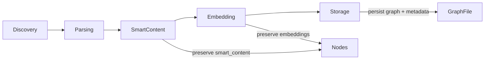
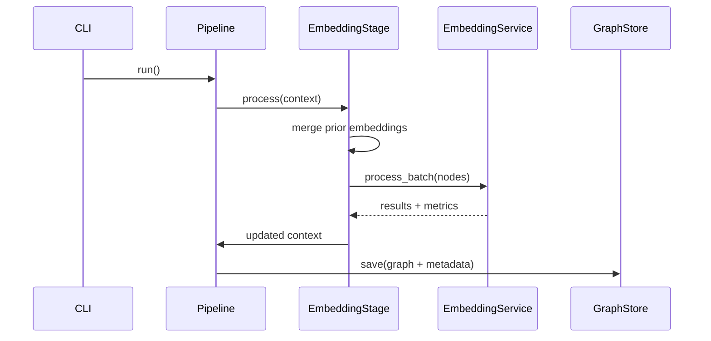

# Phase 4: Pipeline Integration – Tasks & Alignment Brief

**Spec**: [../../embeddings-spec.md](../../embeddings-spec.md)
**Plan**: [../../embeddings-plan.md](../../embeddings-plan.md)
**Date**: 2025-12-22
**Phase Slug**: `phase-4-pipeline-integration`

---

## Executive Briefing

### Purpose
This phase integrates embedding generation into the scan pipeline so embeddings are produced during `fs2 scan` and stored alongside the code graph. It ensures embeddings can be enabled or skipped in a consistent, user-controlled way without breaking pipeline ordering or graph persistence.

### What We're Building
- An `EmbeddingStage` that runs after SmartContent and before Storage, merging prior embeddings and enriching nodes via `EmbeddingService`.
- A PipelineContext extension to carry `embedding_service` and an optional progress callback.
- A CLI `--no-embeddings` flag and service construction that wires adapters, config, and token counter.
- Graph metadata that records embedding model details and chunk configuration for validation on load.

### User Value
Developers can run `fs2 scan` once to generate semantic embeddings, while retaining the option to skip embeddings for quicker scans or offline workflows. The graph records which embedding model and chunk parameters were used, enabling consistency checks in later search and indexing phases.

### Example
**Command**: `fs2 scan --no-embeddings`
**Behavior**: Pipeline skips EmbeddingStage, graph persists without embedding metadata updates, and CLI summary reports embeddings as skipped.

---

## Objectives & Scope

### Objective
Integrate the embedding workflow into the scan pipeline with correct stage ordering, metadata persistence, and CLI control.

### Goals
- ✅ Add `EmbeddingStage` implementing PipelineStage protocol
- ✅ Extend PipelineContext with `embedding_service` and progress callback
- ✅ Insert EmbeddingStage after SmartContentStage and before StorageStage
- ✅ Persist embedding model metadata into graph metadata
- ✅ Add `--no-embeddings` flag and summary reporting

### Non-Goals
- ❌ New embedding adapters (already complete in Phase 2)
- ❌ Embedding chunking or batching logic changes (Phase 3 scope)
- ❌ Integration test suite expansion beyond CLI flag behavior (Phase 5)
- ❌ Documentation updates (Phase 6)
- ❌ Search-time model validation (future search plan)

---

## Architecture Map

### Component Diagram

```mermaid
flowchart TD
    classDef pending fill:#9E9E9E,stroke:#757575,color:#fff
    classDef inprogress fill:#FF9800,stroke:#F57C00,color:#fff
    classDef completed fill:#4CAF50,stroke:#388E3C,color:#fff
    classDef blocked fill:#F44336,stroke:#D32F2F,color:#fff

    style Phase fill:#F5F5F5,stroke:#E0E0E0
    style Files fill:#F5F5F5,stroke:#E0E0E0

    subgraph Phase["Phase 4: Pipeline Integration"]
        T001["T001: Review pipeline + graph metadata patterns ✓"]:::completed
        T002["T002: Write PipelineContext tests ✓"]:::completed
        T003["T003: Extend PipelineContext ✓"]:::completed
        T004["T004: Write EmbeddingStage tests ✓"]:::completed
        T005["T005: Implement EmbeddingStage ✓"]:::completed
        T006["T006: Wire EmbeddingStage into ScanPipeline ✓"]:::completed
        T007["T007: Write graph metadata tests ✓"]:::completed
        T008["T008: Implement graph metadata persistence ✓"]:::completed
        T009["T009: Write CLI flag tests ✓"]:::completed
        T010["T010: Implement CLI flag + service wiring ✓"]:::completed

        T001 --> T002 --> T003
        T001 --> T004 --> T005 --> T006
        T001 --> T007 --> T008
        T006 --> T009 --> T010
    end

    subgraph Files["Files"]
        F1["/workspaces/flow_squared/src/fs2/core/services/pipeline_context.py ✓"]:::completed
        F2["/workspaces/flow_squared/tests/unit/services/test_pipeline_context.py ✓"]:::completed
        F3["/workspaces/flow_squared/tests/unit/services/test_embedding_stage.py ✓"]:::completed
        F4["/workspaces/flow_squared/src/fs2/core/services/stages/embedding_stage.py ✓"]:::completed
        F5["/workspaces/flow_squared/src/fs2/core/services/scan_pipeline.py ✓"]:::completed
        F6["/workspaces/flow_squared/src/fs2/core/services/stages/__init__.py ✓"]:::completed
        F7["/workspaces/flow_squared/src/fs2/core/services/__init__.py ✓"]:::completed
        F8["/workspaces/flow_squared/tests/unit/services/test_graph_config.py ✓"]:::completed
        F9["/workspaces/flow_squared/src/fs2/core/repos/graph_store.py ✓"]:::completed
        F10["/workspaces/flow_squared/src/fs2/core/repos/graph_store_impl.py ✓"]:::completed
        F11["/workspaces/flow_squared/src/fs2/core/repos/graph_store_fake.py ✓"]:::completed
        F12["/workspaces/flow_squared/src/fs2/core/services/stages/storage_stage.py ✓"]:::completed
        F13["/workspaces/flow_squared/tests/integration/test_cli_embeddings.py ✓"]:::completed
        F14["/workspaces/flow_squared/src/fs2/cli/scan.py ✓"]:::completed
        F15["/workspaces/flow_squared/src/fs2/core/adapters/__init__.py ✓"]:::completed
        F16["/workspaces/flow_squared/src/fs2/core/services/embedding/embedding_service.py ✓"]:::completed
    end

    T002 -.-> F2
    T003 -.-> F1
    T004 -.-> F3
    T005 -.-> F4
    T006 -.-> F5
    T006 -.-> F6
    T006 -.-> F7
    T007 -.-> F8
    T008 -.-> F9
    T008 -.-> F10
    T008 -.-> F11
    T008 -.-> F12
    T009 -.-> F13
    T010 -.-> F14
    T010 -.-> F15
    T010 -.-> F16
```

<!-- Status: grey=pending, orange=in-progress, green=completed, red=blocked -->
<!-- Updated by plan-6 during implementation -->



### Task-to-Component Mapping

<!-- Status: ⬜ Pending | 🟧 In Progress | ✅ Complete | 🔴 Blocked -->

| Task | Component(s) | Files | Status | Comment |
|------|-------------|-------|--------|---------|
| T001 | Pipeline + GraphStore review | pipeline_context, stages, graph_store | ✅ Complete | Confirm patterns and metadata flow before tests |
| T002 | PipelineContext tests | test_pipeline_context.py | ✅ Complete | TDD: add embedding fields + defaults |
| T003 | PipelineContext extension | pipeline_context.py | ✅ Complete | Add embedding_service + progress callback |
| T004 | EmbeddingStage tests | test_embedding_stage.py | ✅ Complete | TDD: merge prior embeddings + metrics |
| T005 | EmbeddingStage implementation | embedding_stage.py | ✅ Complete | Async bridge + merge logic |
| T006 | Pipeline integration | scan_pipeline.py, stages/__init__.py, services/__init__.py | ✅ Complete | Insert stage and inject service |
| T007 | Graph metadata tests | test_graph_config.py | ✅ Complete | Validate embedding metadata persisted |
| T008 | Graph metadata persistence | graph_store + storage_stage | ✅ Complete | Store embedding model info in metadata |
| T009 | CLI flag tests | test_cli_embeddings.py | ✅ Complete | Verify --no-embeddings skips stage |
| T010 | CLI flag + service wiring | scan.py, adapters/__init__.py, embedding_service.py | ✅ Complete | Build EmbeddingService and report metrics |

---

## Tasks

| Status | ID | Task | CS | Type | Dependencies | Absolute Path(s) | Validation | Subtasks | Notes |
|--------|------|------|----|------|--------------|-----------------|------------|----------|-------|
| [x] | T001 | Review pipeline stage patterns and graph metadata flow | 1 | Setup | – | /workspaces/flow_squared/src/fs2/core/services/pipeline_context.py, /workspaces/flow_squared/src/fs2/core/services/scan_pipeline.py, /workspaces/flow_squared/src/fs2/core/services/stages/smart_content_stage.py, /workspaces/flow_squared/src/fs2/core/services/stages/storage_stage.py, /workspaces/flow_squared/src/fs2/core/repos/graph_store_impl.py | Notes captured in alignment brief | – | Supports plan task 4.1–4.6 · log#task-t001-review-pipeline-stage-patterns-and-graph-metadata-flow |
| [x] | T002 | Write failing tests for PipelineContext embedding fields | 2 | Test | T001 | /workspaces/flow_squared/tests/unit/services/test_pipeline_context.py | Tests fail for missing embedding_service and embedding_progress_callback | – | Plan 4.1; per Critical Discovery 07 · log#task-t002-write-failing-tests-for-pipelinecontext-embedding-fields [^14] |
| [x] | T003 | Extend PipelineContext with embedding_service and progress callback | 2 | Core | T002 | /workspaces/flow_squared/src/fs2/core/services/pipeline_context.py | T002 tests pass; defaults are None | – | Plan 4.2; mirror smart_content fields · log#task-t003-extend-pipelinecontext-with-embedding_service-and-progress-callback [^15] |
| [x] | T004 | Write failing tests for EmbeddingStage behavior | 3 | Test | T001 | /workspaces/flow_squared/tests/unit/services/test_embedding_stage.py | Tests fail for missing stage implementation | – | Plan 4.3; per Critical Discovery 07, 08 · log#task-t004-write-failing-tests-for-embeddingstage-behavior [^16] |
| [x] | T005 | Implement EmbeddingStage with prior-embedding merge + async bridge | 3 | Core | T004 | /workspaces/flow_squared/src/fs2/core/services/stages/embedding_stage.py, /workspaces/flow_squared/src/fs2/core/services/stages/__init__.py | T004 tests pass; metrics recorded (enriched, preserved, errors) | – | Decision: merge prior embeddings + mirror SmartContentStage async loop error handling (Option A); use dataclasses.replace() per Critical Discovery 01 · log#task-t005-implement-embeddingstage-with-prior-embedding-merge--async-bridge [^16] |
| [x] | T006 | Wire EmbeddingStage into ScanPipeline and public exports | 3 | Integration | T003, T005 | /workspaces/flow_squared/src/fs2/core/services/scan_pipeline.py, /workspaces/flow_squared/src/fs2/core/services/stages/__init__.py, /workspaces/flow_squared/src/fs2/core/services/__init__.py | ScanPipeline inserts EmbeddingStage after SmartContentStage; context injects embedding_service | – | Plan 4.4; per Critical Discovery 07 · log#task-t006-wire-embeddingstage-into-scanpipeline-and-public-exports [^16] |
| [x] | T007 | Write failing tests for embedding graph metadata | 3 | Test | T001 | /workspaces/flow_squared/tests/unit/services/test_graph_config.py | Tests fail for missing metadata persistence and validation | – | Plan 4.5; per Critical Discovery 09 · log#task-t007-write-failing-tests-for-embedding-graph-metadata [^17] |
| [x] | T008 | Implement graph metadata persistence via GraphStore.set_metadata and validation | 3 | Core | T007 | /workspaces/flow_squared/src/fs2/core/repos/graph_store.py, /workspaces/flow_squared/src/fs2/core/repos/graph_store_impl.py, /workspaces/flow_squared/src/fs2/core/repos/graph_store_fake.py, /workspaces/flow_squared/src/fs2/core/services/stages/storage_stage.py, /workspaces/flow_squared/src/fs2/core/services/stages/embedding_stage.py | Metadata includes embedding model + chunk config; load validates mismatch | – | Decision: add GraphStore.set_metadata API (Option A); per Critical Discovery 09, 12 · log#task-t008-implement-graph-metadata-persistence-via-graphstore-set_metadata-and-validation [^17] |
| [x] | T009 | Write failing tests for --no-embeddings CLI behavior | 3 | Test | T006 | /workspaces/flow_squared/tests/integration/test_cli_embeddings.py | Tests fail for missing flag and wiring | – | Plan 4.7 · log#task-t009-write-failing-tests-for--no-embeddings-cli-behavior [^18] |
| [x] | T010 | Implement CLI flag with lazy EmbeddingService construction + factory wiring | 3 | Integration | T006, T009 | /workspaces/flow_squared/src/fs2/cli/scan.py, /workspaces/flow_squared/src/fs2/core/services/embedding/embedding_service.py, /workspaces/flow_squared/src/fs2/core/adapters/__init__.py | CLI honors --no-embeddings; EmbeddingService created only when enabled; factory selects adapter + token counter | – | Decision: lazy construction + factory (Option A); follow CLI option naming rules · log#task-t010-implement-cli-flag-with-lazy-embeddingservice-construction---factory-wiring [^18] |

---

## Alignment Brief

### Prior Phases Review

Note: Subagent tool is unavailable in this environment; manual review performed for Phases 1–3 using the phase dossiers, execution logs, and plan ledger.

#### Phase 1 Review (Core Infrastructure)

A. Deliverables Created
- `/workspaces/flow_squared/src/fs2/config/objects.py` (ChunkConfig, EmbeddingConfig)
- `/workspaces/flow_squared/src/fs2/core/adapters/exceptions.py` (EmbeddingAdapterError hierarchy)
- `/workspaces/flow_squared/src/fs2/core/models/code_node.py` (embedding fields)
- `/workspaces/flow_squared/tests/unit/config/test_embedding_config.py`
- `/workspaces/flow_squared/tests/unit/adapters/test_embedding_exceptions.py`
- `/workspaces/flow_squared/tests/unit/models/test_code_node_embedding.py`

B. Lessons Learned
- Follow SmartContentConfig validation patterns precisely to avoid schema drift.

C. Technical Discoveries
- SmartContentConfig docstring and defaults diverged; use code as source of truth.

D. Dependencies Exported
- EmbeddingConfig + ChunkConfig for service and adapters
- EmbeddingAdapterError hierarchy for adapter and service error handling
- CodeNode embedding fields + smart_content_embedding

E. Critical Findings Applied
- DYK-1/2/3/4 implemented in config and model layers.

F. Incomplete/Blocked Items
- None

G. Test Infrastructure
- Config validation tests + embedding field tests with pickle/replace.

H. Technical Debt
- None noted.

I. Architectural Decisions
- Config extraction via ConfigurationService, frozen models updated via replace().

J. Scope Changes
- None recorded.

K. Key Log References
- `/workspaces/flow_squared/docs/plans/009-embeddings/tasks/phase-1-core-infrastructure/execution.log.md#task-t001`
- `/workspaces/flow_squared/docs/plans/009-embeddings/tasks/phase-1-core-infrastructure/execution.log.md#task-t004-t006`

#### Phase 2 Review (Embedding Adapters)

A. Deliverables Created
- `/workspaces/flow_squared/src/fs2/core/adapters/embedding_adapter.py`
- `/workspaces/flow_squared/src/fs2/core/adapters/embedding_adapter_azure.py`
- `/workspaces/flow_squared/src/fs2/core/adapters/embedding_adapter_openai.py`
- `/workspaces/flow_squared/src/fs2/core/adapters/embedding_adapter_fake.py`
- `/workspaces/flow_squared/tests/unit/adapters/test_embedding_adapter*.py`
- `/workspaces/flow_squared/tests/fixtures/fixture_graph.pkl`

B. Lessons Learned
- YAML dates must be quoted when used as strings in config tests.

C. Technical Discoveries
- YAML parses `2024-06-01` as date, not string; quote in tests.

D. Dependencies Exported
- EmbeddingAdapter ABC and implementations
- Fixture graph for fake adapter

E. Critical Findings Applied
- Finding 05 enforced list[float] storage in adapters.

F. Incomplete/Blocked Items
- None

G. Test Infrastructure
- Adapter unit tests for Azure/OpenAI/Fake behaviors.

H. Technical Debt
- None noted.

I. Architectural Decisions
- Adapter constructor uses ConfigurationService and extracts config internally.

J. Scope Changes
- Fixture generation moved to subtask but completed.

K. Key Log References
- `/workspaces/flow_squared/docs/plans/009-embeddings/tasks/phase-2-embedding-adapters/execution.log.md#task-t002-t003`
- `/workspaces/flow_squared/docs/plans/009-embeddings/tasks/phase-2-embedding-adapters/execution.log.md#task-t004-t005`

#### Phase 3 Review (Embedding Service)

A. Deliverables Created
- `/workspaces/flow_squared/src/fs2/core/services/embedding/embedding_service.py`
- `/workspaces/flow_squared/src/fs2/core/services/embedding/__init__.py`
- `/workspaces/flow_squared/src/fs2/core/models/content_type.py`
- `/workspaces/flow_squared/tests/unit/services/test_embedding_*.py`
- `/workspaces/flow_squared/tests/unit/models/test_content_type.py`

B. Lessons Learned
- API-level batch embedding requires batch grouping, not per-item parallel calls.

C. Technical Discoveries
- ContentType classification is separate from extractable language detection.

D. Dependencies Exported
- EmbeddingService with process_batch, progress callback, skip logic
- ContentType enum (CODE/CONTENT)
- embedding_hash field in CodeNode for staleness detection

E. Critical Findings Applied
- Finding 08: hash-based skip logic implemented in service.

F. Incomplete/Blocked Items
- None

G. Test Infrastructure
- Chunking, batch collection, skip, and rate-limit coordination tests.

H. Technical Debt
- None noted.

I. Architectural Decisions
- Stateless service design; no shared mutable state across batches.

J. Scope Changes
- Added ContentType + parser updates to support content-aware chunking.

K. Key Log References
- `/workspaces/flow_squared/docs/plans/009-embeddings/tasks/phase-3-embedding-service/execution.log.md`

#### Cross-Phase Synthesis

Phase-by-Phase Summary
- Phase 1 established config and CodeNode storage primitives.
- Phase 2 implemented embedding adapters and test fixtures.
- Phase 3 added EmbeddingService with content-type chunking and batch orchestration.

Cumulative Deliverables
- Config: `/workspaces/flow_squared/src/fs2/config/objects.py`
- Models: `/workspaces/flow_squared/src/fs2/core/models/code_node.py`, `/workspaces/flow_squared/src/fs2/core/models/content_type.py`
- Adapters: `/workspaces/flow_squared/src/fs2/core/adapters/embedding_adapter*.py`
- Services: `/workspaces/flow_squared/src/fs2/core/services/embedding/embedding_service.py`
- Tests: `tests/unit/{config,adapters,services,models}/test_embedding_*`

Cumulative Dependencies
- EmbeddingStage will depend on EmbeddingService, EmbeddingConfig, CodeNode embedding_hash, and GraphStore metadata behavior.

Pattern Evolution
- Pipeline stages follow SmartContentStage patterns: merge prior data, async bridge, metrics.

Recurring Issues
- Config parsing pitfalls (YAML date coercion) and immutability requirements.

Reusable Test Infrastructure
- Fake adapters and fixture graph for deterministic embedding tests.

Architectural Continuity
- Keep stage ordering invariants and avoid storing graph copies (GraphStore access only).

Critical Findings Timeline
- Findings 01/04/05 shaped model/config and adapter data types; findings 07/08/09 dictate pipeline integration and metadata storage in this phase.

### Critical Findings Affecting This Phase

| Finding | Constraint | Tasks |
|---------|------------|-------|
| 01: Frozen CodeNode Extension Pattern | Use dataclasses.replace() when merging prior embeddings | T005 |
| 07: Pipeline Stage Protocol Integration | EmbeddingStage must implement PipelineStage and be ordered after SmartContentStage | T005, T006 |
| 08: Hash-Based Skip Logic | Prior embeddings must be merged so EmbeddingService can skip | T005 |
| 09: Graph Config Node for Model Tracking | Persist embedding model metadata and validate on load | T007, T008 |
| 12: Atomic Graph Writes | Do not bypass StorageStage save path; ensure metadata flows into save | T008 |

### ADR Decision Constraints
No ADRs found under `docs/adr/` for this phase.

### Invariants & Guardrails
- Stage order: Discovery → Parsing → SmartContent → Embedding → Storage
- No graph data copying; only GraphStore access (R3.5)
- Use dataclasses.replace() for immutable CodeNode updates (Finding 01)
- Embeddings stored as tuple-of-tuples; avoid numpy (Finding 05)
- CLI options use Typer Annotated pattern (R9.3)

### Inputs to Read
- `/workspaces/flow_squared/src/fs2/core/services/pipeline_context.py`
- `/workspaces/flow_squared/src/fs2/core/services/scan_pipeline.py`
- `/workspaces/flow_squared/src/fs2/core/services/stages/smart_content_stage.py`
- `/workspaces/flow_squared/src/fs2/core/services/stages/storage_stage.py`
- `/workspaces/flow_squared/src/fs2/core/repos/graph_store_impl.py`
- `/workspaces/flow_squared/src/fs2/core/services/embedding/embedding_service.py`
- `/workspaces/flow_squared/src/fs2/cli/scan.py`

### Visual Alignment Aids

#### Flow Diagram (Pipeline State)


#### Sequence Diagram (Embedding Stage Integration)


### Test Plan (TDD)
- `tests/unit/services/test_pipeline_context.py`: add tests for embedding_service and embedding_progress_callback fields.
- `tests/unit/services/test_embedding_stage.py`: verify skip when service None, merge prior embeddings, batch results overlay, metrics set.
- `tests/unit/services/test_graph_config.py`: validate metadata stored in graph and mismatch detection.
- `tests/integration/test_cli_embeddings.py`: verify `--no-embeddings` skips EmbeddingStage and summary reports skipped.

### Step-by-Step Implementation Outline (Mapped to Tasks)
- T001: Review pipeline patterns and graph metadata handling to mirror SmartContentStage conventions.
- T002: Add RED tests for PipelineContext embedding fields.
- T003: Add PipelineContext fields and update docstring to make T002 green.
- T004: Add RED tests for EmbeddingStage behavior (merge, process_batch, metrics).
- T005: Implement EmbeddingStage with merge + async bridge + metrics.
- T006: Inject EmbeddingStage into ScanPipeline and exports.
- T007: Add RED tests for embedding metadata persistence and load validation.
- T008: Implement metadata persistence in GraphStore + StorageStage pipeline.
- T009: Add RED tests for CLI flag and skip behavior.
- T010: Implement CLI flag, EmbeddingService construction, and summary output.

### Commands to Run
- `uv run pytest /workspaces/flow_squared/tests/unit/services/test_pipeline_context.py -v`
- `uv run pytest /workspaces/flow_squared/tests/unit/services/test_embedding_stage.py -v`
- `uv run pytest /workspaces/flow_squared/tests/unit/services/test_graph_config.py -v`
- `uv run pytest /workspaces/flow_squared/tests/integration/test_cli_embeddings.py -v`
- `uv run pytest /workspaces/flow_squared/tests/unit/services -v`

### Risks / Unknowns
- High: GraphStore metadata interface may require an API extension; align with existing save/load constraints.
- Medium: EmbeddingStage async bridge must mirror SmartContentStage error handling for nested event loops.
- Medium: CLI wiring needs to select adapter based on EmbeddingConfig.mode without leaking adapter impls into services.

### Ready Check
- [ ] Prior phase deliverables reviewed and understood
- [ ] Critical findings mapped to tasks
- [ ] Task dependencies validated
- [ ] ADR constraints mapped to tasks (N/A)
- [ ] Test plan matches TDD rules and fake adapter policy

### Complexity Assessment
```json
{
  "complexity": {
    "score": 3,
    "label": "medium",
    "breakdown": {
      "surface": 1,
      "integration": 2,
      "data_state": 1,
      "novelty": 0,
      "nfr": 1,
      "testing_rollout": 1
    },
    "confidence": 0.63
  }
}
```

---

## Phase Footnote Stubs

| ID | Footnote | Status |
|----|----------|--------|
| 14 | [^14] | Complete |
| 15 | [^15] | Complete |
| 16 | [^16] | Complete |
| 17 | [^17] | Complete |
| 18 | [^18] | Complete |

[^14]: Task 4.1 - PipelineContext embedding field tests
  - `file:tests/unit/services/test_pipeline_context.py`

[^15]: Task 4.2 - PipelineContext embedding fields
  - `class:src/fs2/core/services/pipeline_context.py:PipelineContext`
  - `file:src/fs2/core/services/pipeline_context.py`

[^16]: Task 4.3-4.4 - EmbeddingStage + pipeline integration
  - `class:src/fs2/core/services/stages/embedding_stage.py:EmbeddingStage`
  - `file:src/fs2/core/services/stages/embedding_stage.py`
  - `file:tests/unit/services/test_embedding_stage.py`
  - `file:src/fs2/core/services/scan_pipeline.py`
  - `file:src/fs2/core/services/stages/__init__.py`
  - `file:src/fs2/core/services/__init__.py`

[^17]: Task 4.5-4.6 - Graph metadata persistence + validation
  - `file:src/fs2/core/repos/graph_store.py`
  - `file:src/fs2/core/repos/graph_store_impl.py`
  - `file:src/fs2/core/repos/graph_store_fake.py`
  - `file:src/fs2/core/services/stages/storage_stage.py`
  - `method:src/fs2/core/services/stages/embedding_stage.py:EmbeddingStage._detect_metadata_mismatch`
  - `method:src/fs2/core/services/embedding/embedding_service.py:EmbeddingService.get_metadata`
  - `file:tests/unit/services/test_graph_config.py`

[^18]: Task 4.7-4.8 - CLI embeddings flag + service wiring
  - `file:src/fs2/cli/scan.py`
  - `method:src/fs2/core/services/embedding/embedding_service.py:EmbeddingService.create`
  - `file:src/fs2/core/adapters/__init__.py`
  - `file:tests/integration/test_cli_embeddings.py`

---

## Evidence Artifacts

- Execution log: `/workspaces/flow_squared/docs/plans/009-embeddings/tasks/phase-4-pipeline-integration/execution.log.md`
- Supporting artifacts will be added alongside the execution log as needed.

---

## Discoveries & Learnings

_Populated during implementation by plan-6. Log anything of interest to your future self._

| Date | Task | Type | Discovery | Resolution | References |
|------|------|------|-----------|------------|------------|
| | | | | | |

**Types**: `gotcha` | `research-needed` | `unexpected-behavior` | `workaround` | `decision` | `debt` | `insight`

**What to log**:
- Things that didn't work as expected
- External research that was required
- Implementation troubles and how they were resolved
- Gotchas and edge cases discovered
- Decisions made during implementation
- Technical debt introduced (and why)
- Insights that future phases should know about

_See also: `execution.log.md` for detailed narrative._

---

## Directory Layout

```
docs/plans/009-embeddings/
  ├── embeddings-plan.md
  └── tasks/phase-4-pipeline-integration/
      ├── tasks.md
      └── execution.log.md
```

---

## Critical Insights Discussion

**Session**: 2025-12-22 23:36
**Context**: Phase 4 Pipeline Integration Tasks & Alignment Brief
**Analyst**: AI Clarity Agent
**Reviewer**: Development Team
**Format**: Water Cooler Conversation (5 Critical Insights)

### Insight 1: Graph Metadata Needs an Explicit API

**Did you know**: embedding metadata will not persist unless we add an explicit GraphStore metadata API or rework save signatures?

**Implications**:
- Embedding model metadata is currently inaccessible to StorageStage.
- Graph metadata persistence cannot be tested reliably without a contract.
- Search-time model validation risks missing its inputs.

**Options Considered**:
- Option A: GraphStore.set_metadata API
- Option B: save(path, metadata=...) signature
- Option C: config node in graph

**AI Recommendation**: Option A - GraphStore.set_metadata
- Reasoning: Clean contract, consistent with storage boundaries, avoids polluting graph nodes.

**Discussion Summary**:
We aligned that StorageStage cannot pass metadata today and a dedicated GraphStore API is the cleanest path.

**Decision**: Add GraphStore.set_metadata API for embedding metadata persistence

**Action Items**:
- [ ] Update Phase 4 tasks to require GraphStore.set_metadata (completed)

**Affects**: Phase 4 tasks T008; graph store ABC and implementations

---

### Insight 2: Prior Embeddings Must Be Merged for Skip Logic

**Did you know**: without a prior-embedding merge in EmbeddingStage, every scan will re-embed because embedding_hash is missing on fresh nodes?

**Implications**:
- Skip logic in EmbeddingService never triggers.
- API usage and scan cost rise on every run.
- Tests may miss the regression unless they cover prior-merge behavior.

**Options Considered**:
- Option A: Merge in EmbeddingStage
- Option B: Merge in ScanPipeline
- Option C: Do nothing (always re-embed)

**AI Recommendation**: Option A - Merge in EmbeddingStage
- Reasoning: Mirrors SmartContentStage, isolates responsibility, preserves skip logic.

**Discussion Summary**:
We agreed to follow the SmartContentStage pattern and merge prior embeddings in the EmbeddingStage.

**Decision**: Add prior-embedding merge to EmbeddingStage

**Action Items**:
- [ ] Update Phase 4 tasks to include merge step (completed)

**Affects**: Phase 4 tasks T005; EmbeddingStage behavior

---

### Insight 3: Provider Selection Should Be Centralized

**Did you know**: CLI wiring could duplicate provider selection logic unless EmbeddingService gets a factory like LLMService?

**Implications**:
- Provider selection risks divergence across CLI and tests.
- CLI could accidentally violate adapter import rules.
- Future entry points would need to reimplement selection logic.

**Options Considered**:
- Option A: EmbeddingService.create factory
- Option B: CLI-only selection logic
- Option C: Manual wiring everywhere

**AI Recommendation**: Option A - EmbeddingService.create factory
- Reasoning: Centralizes selection and matches existing service patterns.

**Discussion Summary**:
We agreed to add an EmbeddingService factory to keep CLI thin and consistent with LLMService.

**Decision**: Add EmbeddingService factory for provider selection

**Action Items**:
- [ ] Update Phase 4 tasks to include factory wiring (completed)

**Affects**: Phase 4 tasks T010; EmbeddingService API surface

---

### Insight 4: --no-embeddings Must Be Lazy

**Did you know**: if EmbeddingService is constructed before checking `--no-embeddings`, the flag can still trigger config errors?

**Implications**:
- Users can hit embedding config errors even when opting out.
- `--no-embeddings` would fail to deliver a fast, safe skip path.
- Tests might pass only when embedding config exists.

**Options Considered**:
- Option A: Lazy construction
- Option B: Safe defaults for config
- Option C: Try/except around construction

**AI Recommendation**: Option A - Lazy construction
- Reasoning: Preserves flag intent and avoids unintended side effects.

**Discussion Summary**:
We agreed that EmbeddingService should only be constructed when embeddings are enabled.

**Decision**: Enforce lazy EmbeddingService construction

**Action Items**:
- [ ] Update Phase 4 tasks to require lazy construction (completed)

**Affects**: Phase 4 tasks T010; CLI wiring behavior

---

### Insight 5: Async Bridge Needs Friendly Error Handling

**Did you know**: EmbeddingStage will hit the same nested event loop error as SmartContentStage unless we mirror its error handling?

**Implications**:
- Async contexts (notebooks/tests) can fail with opaque RuntimeError.
- UX becomes inconsistent across smart content vs embeddings.
- Users may resort to `--no-embeddings` without understanding why.

**Options Considered**:
- Option A: Mirror SmartContentStage error handling
- Option B: Make pipeline async
- Option C: Ignore issue

**AI Recommendation**: Option A - Mirror SmartContentStage handling
- Reasoning: Consistent UX with minimal additional logic.

**Discussion Summary**:
We agreed EmbeddingStage should mirror SmartContentStage’s async error guidance.

**Decision**: Add SmartContentStage-style error handling to EmbeddingStage

**Action Items**:
- [ ] Update Phase 4 tasks to include error handling requirement (completed)

**Affects**: Phase 4 tasks T005; EmbeddingStage error handling

---

## Session Summary

**Insights Surfaced**: 5 critical insights identified and discussed
**Decisions Made**: 5 decisions reached through collaborative discussion
**Action Items Created**: 5 follow-up updates captured in Phase 4 tasks
**Areas Requiring Updates**:
- Phase 4 task definitions in this dossier (completed)

**Shared Understanding Achieved**: ✓

**Confidence Level**: High

**Next Steps**:
Proceed to Phase 4 implementation using `/plan-6-implement-phase` after confirming GO/NO-GO.

**Notes**:
This session focused on integrating EmbeddingStage and metadata persistence safely within existing pipeline and CLI patterns.
