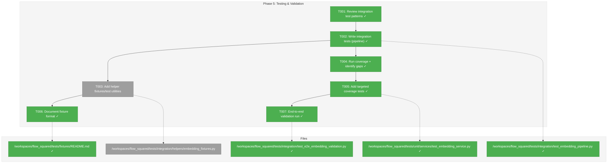
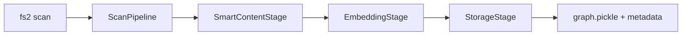
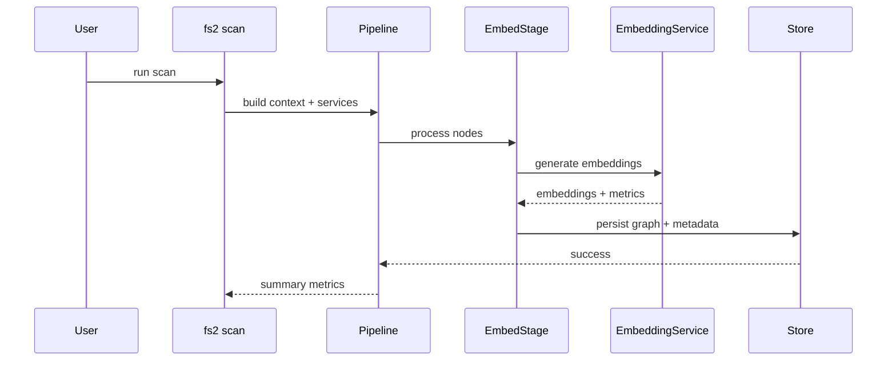

# Phase 5: Testing & Validation – Tasks & Alignment Brief

**Spec**: [../../embeddings-spec.md](../../embeddings-spec.md)
**Plan**: [../../embeddings-plan.md](../../embeddings-plan.md)
**Date**: 2025-12-23
**Phase Slug**: `phase-5-testing--validation`
**Complexity**: CS-3 (Medium)

---

## Executive Briefing

### Purpose
This phase validates the full embedding pipeline end-to-end and ensures the test suite meaningfully covers the embedding stack. It is the quality gate that proves embeddings are generated, stored, and persisted correctly before we proceed to documentation and fixture-graph work.

### What We're Building
- Integration tests that run the full scan pipeline with embeddings enabled using FakeEmbeddingAdapter fixtures.
- Coverage checks and targeted tests for uncovered embedding paths.
- Fixture format documentation for deterministic embedding tests.
- A manual validation pass on a real project to confirm embeddings are present in the graph.

### User Value
Developers gain confidence that embeddings are reliably produced and stored, that regression coverage exists for embedding workflows, and that fixture-based tests are reproducible without live API calls.

### Example
**Input**: `fs2 scan /workspaces/flow_squared` (embeddings enabled)
**Expected**: Graph metadata includes embedding model + chunk config, and code nodes contain `embedding` vectors.

---

## Objectives & Scope

### Objective
Validate embedding pipeline behavior and test coverage per Phase 5 acceptance criteria:
- [ ] Integration tests pass with FakeEmbeddingAdapter fixtures
- [ ] Coverage exceeds 80% for embedding code
- [ ] Fixture format documented
- [ ] End-to-end scan validates embeddings in graph

### Goals

- ✅ Add integration tests for the full embedding pipeline
- ✅ Run coverage checks and close critical gaps
- ✅ Document fixture format and regeneration steps
- ✅ Complete manual end-to-end validation on a real scan

### Non-Goals

- ❌ Adapter implementation changes (Phase 2 already complete)
- ❌ Embedding service logic changes (Phase 3 already complete)
- ❌ Pipeline stage wiring changes (Phase 4 already complete)
- ❌ Search-time embedding validation (out of scope for this plan)
- ❌ Fixture graph generation (Phase 7 scope)

---

## Architecture Map

### Component Diagram
<!-- Status: grey=pending, orange=in-progress, green=completed, red=blocked -->
<!-- Updated by plan-6 during implementation -->



### Task-to-Component Mapping

<!-- Status: ⬜ Pending | 🟧 In Progress | ✅ Complete | 🔴 Blocked -->

| Task | Component(s) | Files | Status | Comment |
|------|-------------|-------|--------|---------|
| T001 | Integration test review | tests/integration | ✅ Complete | Reviewed patterns: fixture_graph, fake adapters, pipeline tests |
| T002 | Integration tests | test_embedding_pipeline.py | ✅ Complete | 8 tests: pipeline, metadata, hash preservation, dual embedding |
| T003 | Test utilities | embedding_fixtures.py | ⬜ Pending | Helpers for fixture-based adapter and temp project scaffolding |
| T004 | Coverage scan | coverage report | ✅ Complete | 80% total; gaps: embedding_service.py (67%), embedding_stage.py (86%) |
| T005 | Coverage tests | test_embedding_service.py | ✅ Complete | Added 9 tests: chunking, overlap, char fallback, metadata, skip logic |
| T006 | Fixture docs | tests/fixtures/README.md | ✅ Complete | Added: Embedding Schema, Graph Metadata, pytest Fixtures, CI Considerations |
| T007 | End-to-end validation | test_e2e_embedding_validation.py | ✅ Complete | 19 files, 451 nodes embedded (100%), metadata validated |

---

## Tasks

| Status | ID | Task | CS | Type | Dependencies | Absolute Path(s) | Validation | Subtasks | Notes |
|--------|----|------|----|------|--------------|-----------------|------------|----------|-------|
| [x] | T001 | Review existing integration test patterns and fixture helpers | 1 | Setup | – | /workspaces/flow_squared/tests/integration, /workspaces/flow_squared/tests/fixtures | Notes captured in execution.log.md | – | Plan 5.1 prep |
| [x] | T002 | Write failing integration tests for full pipeline embedding generation | 3 | Test | T001 | /workspaces/flow_squared/tests/integration/test_embedding_pipeline.py | 8 tests passing; validates embeddings + metadata; **DYK-1: tested both layers**; **DYK-4: tests "embeddings enabled" path** | – | Plan 5.1; per Critical Findings 07, 09 |
| [N/A] | T003 | ~~Add or extend fixture helpers for embedding integration tests~~ | – | – | – | – | – | – | **DYK-5: SKIPPED - conftest.py already has FixtureGraphContext + FakeEmbeddingAdapter + FakeLLMAdapter from Phase 2 Subtask 001** |
| [x] | T004 | Run coverage for embedding code and record gaps | 1 | Test | T002 | /workspaces/flow_squared/coverage.txt | 80% total coverage; gaps in _chunk_by_tokens (248-296), _split_long_line (303-319), _get_overlap_lines (325-337), create factory (124-148); **DYK-3: scoped to embedding modules** | – | Plan 5.2 |
| [x] | T005 | Add targeted tests to close critical embedding coverage gaps | 2 | Test | T004 | /workspaces/flow_squared/tests/unit/services/test_embedding_service.py | 80% coverage maintained; 9 new tests: TestChunkingBehavior, TestChunkOverlapBehavior, TestLongLineSplitting, TestCharFallbackChunking, TestMetadataExtraction, TestSkipLogic; **DYK-1: chunked content tested** | – | Plan 5.2 |
| [x] | T006 | Document embedding fixture format and regeneration steps | 1 | Doc | T002 | /workspaces/flow_squared/tests/fixtures/README.md | README updated: Embedding Schema (tuple format), Graph Metadata, pytest Fixtures, CI Considerations (DYK-2) | – | Plan 5.3 |
| [x] | T007 | Perform end-to-end scan validation and record results | 2 | Validation | T005, T006 | /workspaces/flow_squared/tests/integration/test_e2e_embedding_validation.py | E2E test: 19 files scanned, 451 nodes embedded (100%), embedding_model=fake, dimensions=1024; **DYK-2: uses FakeEmbeddingAdapter + FakeLLMAdapter (no real services)** | – | Plan 5.4 |

---

## Alignment Brief

### Prior Phases Review

Note: Subagent tool is unavailable in this environment; manual review performed for Phases 1–4 using the phase dossiers, execution logs, and plan ledger.

#### Phase 1 Review (Core Infrastructure)

A. Deliverables Created
- `/workspaces/flow_squared/src/fs2/config/objects.py` (ChunkConfig, EmbeddingConfig)
- `/workspaces/flow_squared/src/fs2/core/adapters/exceptions.py` (EmbeddingAdapterError hierarchy)
- `/workspaces/flow_squared/src/fs2/core/models/code_node.py` (embedding + smart_content_embedding fields)
- `/workspaces/flow_squared/tests/unit/config/test_embedding_config.py`
- `/workspaces/flow_squared/tests/unit/adapters/test_embedding_exceptions.py`
- `/workspaces/flow_squared/tests/unit/models/test_code_node_embedding.py`

B. Lessons Learned
- Pydantic validation must mirror SmartContentConfig patterns to avoid schema drift.

C. Technical Discoveries
- YAML parses date-like strings; quote api_version values in tests.

D. Dependencies Exported
- EmbeddingConfig + ChunkConfig for adapters and service configuration.
- Embedding exception hierarchy used by adapters and services.
- CodeNode dual embedding fields used by pipeline and tests.

E. Critical Findings Applied
- Finding 04 (per-content chunk config), Finding 05 (list[float] storage), DYK-1/2 (dual embeddings).

F. Incomplete/Blocked Items
- None.

G. Test Infrastructure
- Unit test suites for config, exceptions, and CodeNode embedding fields.

H. Technical Debt
- None recorded.

I. Architectural Decisions
- Dual embedding fields stored as tuple-of-tuples for pickle safety and chunk-level precision.

J. Scope Changes
- None recorded.

K. Key Log References
- `docs/plans/009-embeddings/tasks/phase-1-core-infrastructure/execution.log.md`

#### Phase 2 Review (Embedding Adapters)

A. Deliverables Created
- `/workspaces/flow_squared/src/fs2/core/adapters/embedding_adapter.py`
- `/workspaces/flow_squared/src/fs2/core/adapters/embedding_adapter_azure.py`
- `/workspaces/flow_squared/src/fs2/core/adapters/embedding_adapter_openai.py`
- `/workspaces/flow_squared/src/fs2/core/adapters/embedding_adapter_fake.py`
- `/workspaces/flow_squared/tests/unit/adapters/test_embedding_adapter.py`
- `/workspaces/flow_squared/tests/unit/adapters/test_embedding_adapter_azure.py`
- `/workspaces/flow_squared/tests/unit/adapters/test_embedding_adapter_openai.py`
- `/workspaces/flow_squared/tests/unit/adapters/test_embedding_adapter_fake.py`
- Fixture graph generation scripts and scratch validation

B. Lessons Learned
- Real adapter validation before FakeAdapter avoids spec drift.

C. Technical Discoveries
- YAML date parsing gotcha for api_version values.

D. Dependencies Exported
- FakeEmbeddingAdapter + fixtures for deterministic tests (critical for Phase 5).
- Adapter ABC + provider implementations for service integration.

E. Critical Findings Applied
- Finding 03 (rate limit backoff), Finding 05 (list[float] storage).

F. Incomplete/Blocked Items
- None.

G. Test Infrastructure
- Adapter unit tests and fixture graph support.

H. Technical Debt
- None recorded.

I. Architectural Decisions
- FakeEmbeddingAdapter uses fixture graph lookups with hash fallback for unknown content.

J. Scope Changes
- Fixture generation moved to Phase 2 (Plan note).

K. Key Log References
- `docs/plans/009-embeddings/tasks/phase-2-embedding-adapters/execution.log.md`

#### Phase 3 Review (Embedding Service)

A. Deliverables Created
- `/workspaces/flow_squared/src/fs2/core/models/content_type.py` (ContentType enum)
- `/workspaces/flow_squared/src/fs2/core/services/embedding/embedding_service.py`
- `/workspaces/flow_squared/src/fs2/core/services/embedding/embedding_chunker.py`
- `/workspaces/flow_squared/src/fs2/core/services/embedding/embedding_rate_limiter.py`
- `/workspaces/flow_squared/tests/unit/services/test_embedding_service.py`
- `/workspaces/flow_squared/tests/unit/services/test_embedding_chunker.py`
- `/workspaces/flow_squared/tests/unit/services/test_embedding_rate_limiter.py`

B. Lessons Learned
- ContentType should be set once at scan time to avoid duplicated language checks.

C. Technical Discoveries
- Content extraction and embedding content type are separate concerns; markdown extraction inflated node counts prior to adjustment.

D. Dependencies Exported
- EmbeddingService public API, chunking logic, rate-limit coordination, skip logic based on embedding_hash.

E. Critical Findings Applied
- Findings 01, 02, 03, 05, 06, 08, 11 (frozen CodeNode, stateless batches, rate limits, list storage, DI pattern, skip logic, token fallback warning).

F. Incomplete/Blocked Items
- None.

G. Test Infrastructure
- Unit tests for content type, chunking, rate limiting, and skip logic.

H. Technical Debt
- None recorded.

I. Architectural Decisions
- ContentType enum + embedding_hash for staleness detection.

J. Scope Changes
- ContentType added by request to make content classification explicit.

K. Key Log References
- `docs/plans/009-embeddings/tasks/phase-3-embedding-service/execution.log.md`

#### Phase 4 Review (Pipeline Integration)

A. Deliverables Created
- `/workspaces/flow_squared/src/fs2/core/services/stages/embedding_stage.py`
- `/workspaces/flow_squared/src/fs2/core/services/pipeline_context.py` (embedding_service + progress callback)
- `/workspaces/flow_squared/src/fs2/core/services/scan_pipeline.py` (EmbeddingStage inserted)
- `/workspaces/flow_squared/src/fs2/core/repos/graph_store.py` + impls (`set_metadata`)
- `/workspaces/flow_squared/src/fs2/cli/scan.py` (`--no-embeddings` + progress reporting)
- `/workspaces/flow_squared/tests/unit/services/test_embedding_stage.py`
- `/workspaces/flow_squared/tests/unit/services/test_graph_config.py`
- `/workspaces/flow_squared/tests/integration/test_cli_embeddings.py`

B. Lessons Learned
- Graph metadata must be merged on save to preserve existing config entries.

C. Technical Discoveries
- Markdown extraction in TreeSitter created node explosion; excluded from extractable languages to restore expected counts.

D. Dependencies Exported
- EmbeddingStage for pipeline execution and metadata persistence.
- GraphStore.set_metadata used by StorageStage.
- CLI flag + progress output for operational validation.

E. Critical Findings Applied
- Findings 07, 08, 09, 12 (stage protocol, skip logic, metadata, atomic writes).

F. Incomplete/Blocked Items
- None.

G. Test Infrastructure
- Unit tests for EmbeddingStage and graph metadata, CLI integration tests for `--no-embeddings`.

H. Technical Debt
- None recorded.

I. Architectural Decisions
- Stage order: SmartContentStage → EmbeddingStage → StorageStage.

J. Scope Changes
- Added EmbeddingService factory and progress callbacks for CLI reporting.

K. Key Log References
- `docs/plans/009-embeddings/tasks/phase-4-pipeline-integration/execution.log.md`

### Cumulative Deliverables (Phases 1–4)

- Config + exceptions: `/workspaces/flow_squared/src/fs2/config/objects.py`, `/workspaces/flow_squared/src/fs2/core/adapters/exceptions.py`
- Adapters: `/workspaces/flow_squared/src/fs2/core/adapters/embedding_adapter*.py`
- Service: `/workspaces/flow_squared/src/fs2/core/services/embedding/`
- Pipeline integration: `/workspaces/flow_squared/src/fs2/core/services/stages/embedding_stage.py`, `/workspaces/flow_squared/src/fs2/core/services/scan_pipeline.py`
- Graph metadata: `/workspaces/flow_squared/src/fs2/core/repos/graph_store*.py`, `/workspaces/flow_squared/src/fs2/core/services/stages/storage_stage.py`
- CLI control: `/workspaces/flow_squared/src/fs2/cli/scan.py`
- Tests: `tests/unit/services/test_embedding_*.py`, `tests/integration/test_cli_embeddings.py`, adapter tests, config tests

### Cumulative Dependencies

- FakeEmbeddingAdapter fixtures from Phase 2
- ContentType and CodeNode embedding fields from Phase 3
- EmbeddingStage + metadata persistence from Phase 4

### Pattern Evolution

- Consistent use of `dataclasses.replace()` for frozen CodeNode updates
- Stateless async batch processing with local state in service methods
- Metadata persisted via GraphStore.set_metadata to avoid model mismatch

### Recurring Issues

- Node explosion when markdown is treated as extractable AST content (resolved by exclusion)
- YAML date parsing in tests (quote api_version strings)

### Cross-Phase Learnings

- Integration tests should favor FakeEmbeddingAdapter + fixtures to avoid API rate limits.
- Metadata validation needs to be part of integration tests to prevent silent model drift.

### Foundation for Current Phase

- Phase 5 builds on EmbeddingStage, metadata persistence, and FakeEmbeddingAdapter fixtures.
- Coverage and integration tests should reuse existing fixtures and helper patterns from Phases 2–4.

### Reusable Infrastructure

- `tests/fixtures/embedding_fixtures.json`
- Adapter fakes and GraphStoreFake
- CLI integration helpers from `tests/integration/test_cli_embeddings.py`

### Architectural Continuity

- Maintain stage ordering and metadata persistence patterns established in Phase 4.
- Avoid reintroducing mutable state inside EmbeddingService.

### Critical Findings Timeline

- Phase 1: Findings 01, 04, 05 applied (frozen CodeNode, config patterns, list storage)
- Phase 2: Findings 03, 05 applied (rate limiting, list storage)
- Phase 3: Findings 01, 02, 03, 05, 06, 08, 11 applied (frozen CodeNode, stateless batches, rate limits, DI, skip logic)
- Phase 4: Findings 07, 08, 09, 12 applied (pipeline integration, metadata, atomic writes)

### Critical Findings Affecting This Phase

| Finding | Title | Constraint/Requirement | Addressed By |
|---------|-------|------------------------|--------------|
| **05** | Pickle Security Constraints | Tests must ensure embeddings remain `list[float]` compatible and avoid numpy arrays | T002, T005 |
| **07** | Pipeline Stage Protocol Integration | Integration tests must verify stage ordering and optional skip behavior | T002 |
| **08** | Hash-Based Skip Logic | Tests should validate embedding preservation for unchanged content | T002, T005 |
| **09** | Graph Config Node for Model Tracking | Integration tests must assert graph metadata persisted | T002 |
| **12** | Atomic Graph Writes | End-to-end validation should confirm graph persistence without corruption | T007 |

### ADR Decision Constraints

No ADRs exist for this feature.

### Invariants & Guardrails

- Embedding vectors stored as `list[float]` in adapters and persistence paths.
- Integration tests use FakeEmbeddingAdapter fixtures (no live API calls).
- Coverage goal: > 80% for embedding modules.
- Preserve pipeline order: SmartContentStage → EmbeddingStage → StorageStage.

### Inputs to Read

- `/workspaces/flow_squared/tests/integration/test_cli_embeddings.py`
- `/workspaces/flow_squared/tests/unit/services/test_embedding_stage.py`
- `/workspaces/flow_squared/tests/unit/services/test_embedding_service.py`
- `/workspaces/flow_squared/tests/fixtures/embedding_fixtures.json`
- `/workspaces/flow_squared/src/fs2/core/services/embedding/embedding_service.py`
- `/workspaces/flow_squared/src/fs2/core/services/stages/embedding_stage.py`
- `/workspaces/flow_squared/src/fs2/core/repos/graph_store_impl.py`

### Visual Alignment Aids





### Test Plan (Full TDD, Targeted Mocks)

- `tests/integration/test_embedding_pipeline.py::test_scan_generates_embeddings`
  - Why: End-to-end pipeline validation.
  - Contract: Embeddings exist for nodes with content and metadata stored.
  - Fixtures: FakeEmbeddingAdapter fixtures + temp project.

- `tests/integration/test_embedding_pipeline.py::test_scan_skips_embeddings_when_disabled`
  - Why: Guard against accidental embedding runs when disabled.
  - Contract: EmbeddingStage skipped; metadata unchanged.

- `tests/unit/services/test_embedding_service.py::test_should_skip_when_embedding_hash_matches`
  - Why: Skip logic regression coverage.
  - Contract: Existing embeddings preserved if content unchanged.

### Step-by-Step Implementation Outline

1. T001: Review existing integration patterns and fixtures.
2. T002: Write failing integration tests (pipeline + metadata checks).
3. T003: Add fixture helpers to power integration tests.
4. T004: Run coverage and log gaps.
5. T005: Add targeted tests for uncovered embedding logic.
6. T006: Update fixture README with schema + regeneration.
7. T007: Run manual scan validation and record evidence.

### Commands to Run

- `uv run pytest tests/integration/test_embedding_pipeline.py -v`
- `uv run pytest tests/unit/services/test_embedding_service.py -v`
- `uv run pytest --cov=fs2.core.services.embedding --cov=fs2.core.adapters.embedding_adapter --cov=fs2.core.services.stages.embedding_stage --cov-report=term-missing`  # DYK-3: scoped to embedding-only modules
- `uv run python -m fs2 scan /workspaces/flow_squared`

### Risks / Unknowns

- **Medium**: Integration tests may rely on fixture alignment with FakeEmbeddingAdapter; mitigate by validating fixture schema before test run.
- **Low**: Coverage threshold may require additional tests beyond current plan; mitigate by scoping to embedding modules only.
- **Low**: Manual validation depends on local graph state; mitigate by documenting expected metadata keys.

### Ready Check

- [x] Prior phase context reviewed and summarized
- [x] Critical findings mapped to tasks
- [x] Test plan and fixtures confirmed
- [x] ADR constraints mapped to tasks (N/A)
- [x] Ready for implementation (GO) - DYK session completed 2025-12-23

---

## Phase Footnote Stubs

| Footnote | Description | Nodes |
|----------|-------------|-------|
| | | |

---

## Evidence Artifacts

Implementation will write evidence to:
- `/workspaces/flow_squared/docs/plans/009-embeddings/tasks/phase-5-testing--validation/execution.log.md`
- `/workspaces/flow_squared/coverage.txt` (coverage output capture)
- `/workspaces/flow_squared/scratch/e2e_embedding_validation.md` (manual validation notes)

---

## Discoveries & Learnings

_Populated during implementation by plan-6. Log anything of interest to your future self._

| Date | Task | Type | Discovery | Resolution | References |
|------|------|------|-----------|------------|------------|
| | | | | | |

**Types**: `gotcha` | `research-needed` | `unexpected-behavior` | `workaround` | `decision` | `debt` | `insight`

**What to log**:
- Things that didn't work as expected
- External research that was required
- Implementation troubles and how they were resolved
- Gotchas and edge cases discovered
- Decisions made during implementation
- Technical debt introduced (and why)
- Insights that future phases should know about

_See also: `execution.log.md` for detailed narrative._

---

## Directory Layout

```
docs/plans/009-embeddings/
  ├── embeddings-plan.md
  └── tasks/phase-5-testing--validation/
      ├── tasks.md
      └── execution.log.md  # created by /plan-6
```

---

## Critical Insights Discussion

**Session**: 2025-12-23
**Context**: Phase 5: Testing & Validation - Tasks & Alignment Brief
**Analyst**: AI Clarity Agent
**Reviewer**: Development Team
**Format**: Water Cooler Conversation (5 Critical Insights)

### Insight 1: Multi-Chunk Embedding Format vs Test Assertions

**Did you know**: Phase 5 test plan examples assume single-vector embeddings (`list[float]`), but Phase 3 implemented multi-chunk storage as `tuple[tuple[float, ...], ...]`.

**Implications**:
- Content exceeding chunk limits produces MULTIPLE embedding vectors
- Tests asserting `len(result) == 1024` will fail for chunked content
- Adapters return `list[float]` per-chunk, service aggregates to tuple-of-tuples

**Options Considered**:
- Option A: Update test examples in dossier
- Option B: Test both layers explicitly
- Option C: Proceed as-is, let tests reveal issues

**AI Recommendation**: Option B - Test Both Layers
- Reasoning: Adapter and service have different contracts; both need validation

**Discussion Summary**: User agreed testing both layers provides proper contract validation.

**Decision**: Test adapter layer (`list[float]`) AND service layer (`tuple[tuple[float, ...], ...]`)

**Action Items**:
- [x] T002: Updated with DYK-1 note about testing both layers
- [x] T005: Updated with DYK-1 note about chunked content test

**Affects**: T002, T005

---

### Insight 2: E2E Validation Target Undefined

**Did you know**: T007 doesn't specify which project to scan for end-to-end validation.

**Implications**:
- Ambiguous scope could lead to incomplete validation
- Different targets have different pros/cons (speed, reproducibility, realism)
- Success criteria lacked specifics

**Options Considered**:
- Option A: Scan this repo with sampling
- Option B: Scan fixture samples with full verification
- Option C: Both - fixtures for baseline, repo for smoke test
- Option D: Define criteria, let implementer choose

**AI Recommendation**: Option C - Both
- Reasoning: Deterministic baseline + realistic smoke test

**Discussion Summary**: User chose Option B for simplicity and CI-safety. Emphasized using fakes for both smart content and embeddings - no real services in CI.

**Decision**: Scan `tests/fixtures/samples/` with FakeEmbeddingAdapter + FakeLLMAdapter; verify all 19 files

**Action Items**:
- [x] T007: Updated with DYK-2 specifying target, fake adapters, and success criteria

**Affects**: T007

---

### Insight 3: Coverage Scope Includes Non-Embedding Modules

**Did you know**: The coverage command includes `scan_pipeline` and `graph_store_impl` which dilute the 80% threshold for embedding-specific code.

**Implications**:
- Low coverage in unrelated modules could fail the threshold
- The 80% target becomes less meaningful for embedding code quality

**Options Considered**:
- Option A: Narrow coverage scope to embedding-only modules
- Option B: Keep broad scope, lower threshold to 70%
- Option C: Separate reports for each scope
- Option D: Keep as-is, document why

**AI Recommendation**: Option A - Narrow Scope
- Reasoning: 80% should measure embedding code, not unrelated modules

**Discussion Summary**: User agreed to narrow scope for cleaner signal.

**Decision**: Remove `scan_pipeline` and `graph_store_impl` from coverage command

**Action Items**:
- [x] T004: Updated with DYK-3 note about narrowed scope
- [x] Commands to Run: Updated coverage command

**Affects**: T004, Commands to Run

---

### Insight 4: test_cli_embeddings.py Already Exists - T002 Overlap Risk

**Did you know**: Phase 4 created `test_cli_embeddings.py` for the disabled path, while T002 creates `test_embedding_pipeline.py` for the enabled path.

**Implications**:
- Without documentation, implementer might duplicate work
- The files are complementary, not overlapping

**Options Considered**:
- Option A: Document the boundary in T002
- Option B: Merge into single file
- Option C: Keep separate, no changes

**AI Recommendation**: Option A - Document the Boundary
- Reasoning: Quick win, prevents confusion

**Discussion Summary**: User agreed to document the boundary.

**Decision**: Add note to T002 clarifying it tests "embeddings enabled" path

**Action Items**:
- [x] T002: Updated with DYK-4 referencing test_cli_embeddings.py

**Affects**: T002

---

### Insight 5: T003 Creates New Helper File But Fixtures Already Exist

**Did you know**: T003 targets a new file path, but Phase 2 Subtask 001 already created comprehensive fixture infrastructure in `conftest.py`.

**Implications**:
- `FixtureGraphContext` already provides FakeEmbeddingAdapter + FakeLLMAdapter
- Creating new file would duplicate existing infrastructure

**Options Considered**:
- Option A: Skip T003, use existing fixtures
- Option B: Keep T003 for integration-specific helpers
- Option C: Merge T003 into T002

**AI Recommendation**: Option A - Skip T003
- Reasoning: conftest.py already has everything needed

**Discussion Summary**: User agreed T003 is redundant given Phase 2 Subtask 001 work.

**Decision**: Mark T003 as N/A; update T006 dependency to T002

**Action Items**:
- [x] T003: Marked as N/A with DYK-5 explanation
- [x] T006: Dependency updated from T003 → T002

**Affects**: T003, T006

---

## Session Summary

**Insights Surfaced**: 5 critical insights identified and discussed
**Decisions Made**: 5 decisions reached through collaborative discussion
**Action Items Created**: All action items completed inline
**Tasks Modified**: T002, T003, T004, T005, T006, T007

**Shared Understanding Achieved**: ✓

**Confidence Level**: High - All risks identified and mitigated, CI-safe approach confirmed

**Next Steps**: Proceed with `/plan-6-implement-phase --phase "Phase 5: Testing & Validation" --task "T001"`

**Notes**:
- T003 marked N/A reduces Phase 5 to 6 active tasks
- All integration tests will use fakes (no real API calls)
- Coverage scoped to embedding-only modules for meaningful 80% threshold
