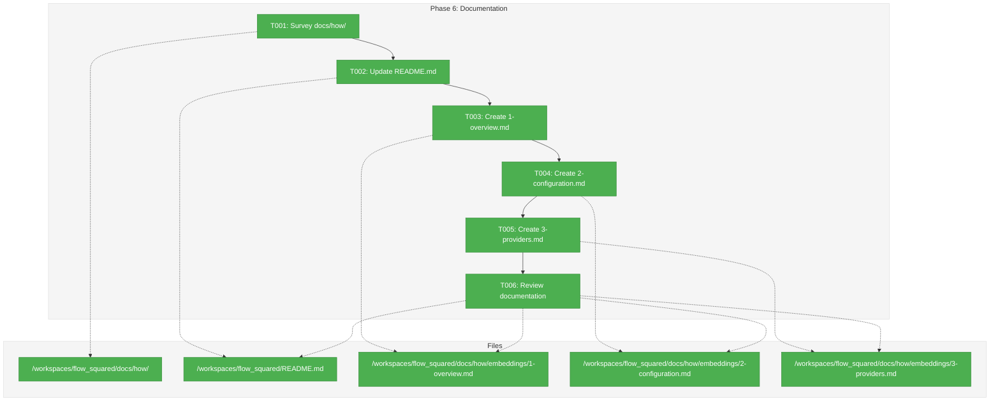
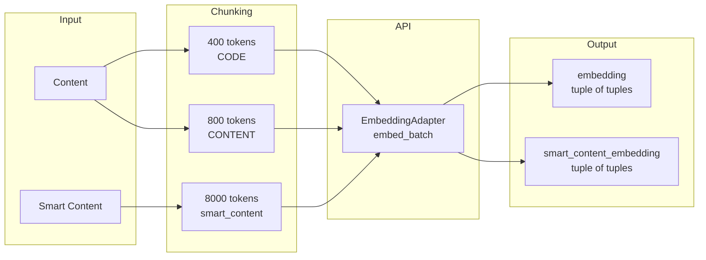
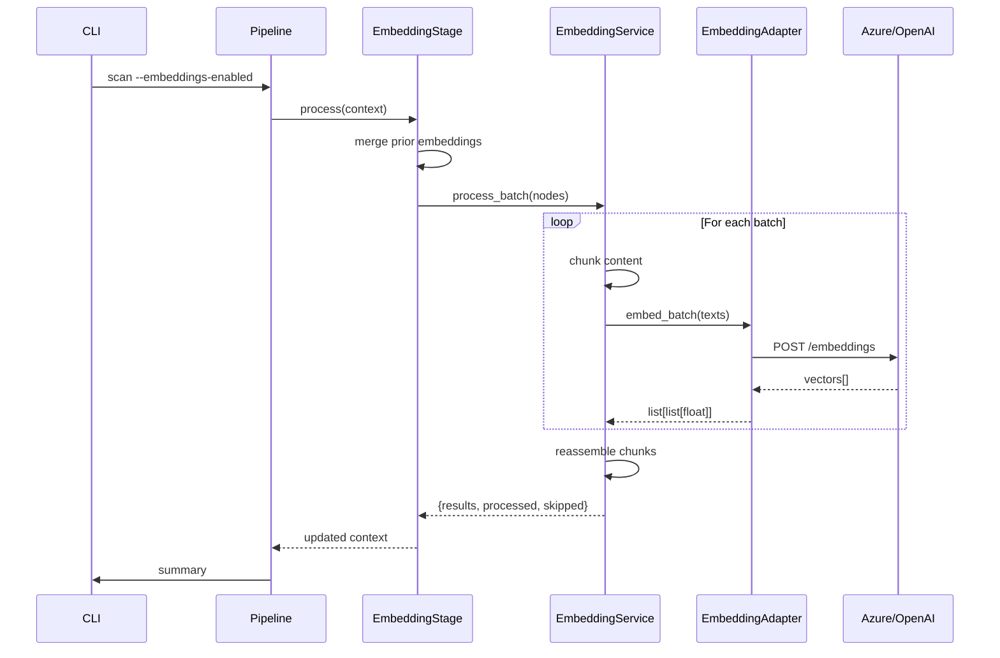

# Phase 6: Documentation – Tasks & Alignment Brief

**Spec**: [../../embeddings-spec.md](../../embeddings-spec.md)
**Plan**: [../../embeddings-plan.md](../../embeddings-plan.md)
**Date**: 2025-12-23
**Phase Slug**: `phase-6-documentation`

---

## Executive Briefing

### Purpose
This phase documents the embedding service for users and maintainers. The implementation is complete (Phases 1-5); now users need clear guidance on how to configure and use embeddings for semantic code search.

### What We're Building
User-facing documentation explaining:
- How to enable and configure embeddings in `.fs2/config.yaml`
- How to set up Azure OpenAI or OpenAI-compatible providers
- Content-type specific chunking strategies (code vs documentation)
- CLI usage (`--no-embeddings` flag)

### User Value
Users can enable semantic search in their codebases by following clear, concise documentation with copy-paste examples. No need to read source code or guess configuration options.

### Example
**Before**: User doesn't know embedding configuration exists
**After**: User follows `docs/how/embeddings/` guide, adds config, runs `fs2 scan`, and gets semantic search capabilities

---

## Objectives & Scope

### Objective
Document the embedding service per plan acceptance criteria:
- [ ] README.md updated with embeddings section
- [ ] docs/how/embeddings/ created with 3 files
- [ ] Code examples tested and working
- [ ] No broken links

### Goals

- ✅ Survey existing docs/how/ structure for consistency
- ✅ Add embeddings getting-started section to README.md
- ✅ Create 1-overview.md with architecture diagram
- ✅ Create 2-configuration.md with all config options
- ✅ Create 3-providers.md with Azure/OpenAI/Fake setup guides
- ✅ Review all documentation for clarity and accuracy

### Non-Goals (Scope Boundaries)

- ❌ API documentation generation (docstrings already exist)
- ❌ Search feature documentation (out of scope - separate plan)
- ❌ Fixture graph regeneration documentation (already in tests/fixtures/README.md)
- ❌ Detailed code walkthrough (users need config, not implementation)
- ❌ Troubleshooting guide (defer until common issues identified)
- ❌ Performance tuning guide (defer to future optimization phase)

---

## Architecture Map

### Component Diagram
<!-- Status: grey=pending, orange=in-progress, green=completed, red=blocked -->
<!-- Updated by plan-6 during implementation -->



### Task-to-Component Mapping

<!-- Status: ⬜ Pending | 🟧 In Progress | ✅ Complete | 🔴 Blocked -->

| Task | Component(s) | Files | Status | Comment |
|------|-------------|-------|--------|---------|
| T001 | Documentation survey | /workspaces/flow_squared/docs/how/ | ✅ Complete | Surveyed 10 existing files, identified patterns |
| T002 | README embeddings section | /workspaces/flow_squared/README.md | ✅ Complete | Added section + doc table link |
| T003 | Overview documentation | /workspaces/flow_squared/docs/how/embeddings/1-overview.md | ✅ Complete | Architecture, chunking, dual embedding |
| T004 | Configuration documentation | /workspaces/flow_squared/docs/how/embeddings/2-configuration.md | ✅ Complete | Full schema, env vars, validation |
| T005 | Provider documentation | /workspaces/flow_squared/docs/how/embeddings/3-providers.md | ✅ Complete | Azure, OpenAI, Fake setup guides |
| T006 | Documentation review | All docs | ✅ Complete | Fixed 2 inaccuracies (api_version, openai_compatible) |

---

## Tasks

| Status | ID | Task | CS | Type | Dependencies | Absolute Path(s) | Validation | Subtasks | Notes |
|--------|------|------|-----|------|--------------|------------------|------------|----------|-------|
| [x] | T001 | Survey existing docs/how/ directory structure and patterns | 1 | Setup | – | /workspaces/flow_squared/docs/how/ | Directory listing and structure documented in log | – | [log#task-t001](execution.log.md#task-t001-survey-existing-docshow-directory-structure) |
| [x] | T002 | Update README.md with embeddings configuration section | 2 | Doc | T001 | /workspaces/flow_squared/README.md | Embeddings section with config example added; link to docs/how/embeddings/ | – | [log#task-t002](execution.log.md#task-t002-update-readmemd-with-embeddings-section) [^20] |
| [x] | T003 | Create docs/how/embeddings/1-overview.md | 2 | Doc | T002 | /workspaces/flow_squared/docs/how/embeddings/1-overview.md | Overview with architecture diagram and chunking explanation | – | [log#task-t003](execution.log.md#task-t003-create-docshowembeddings1-overviewmd) [^20] |
| [x] | T004 | Create docs/how/embeddings/2-configuration.md | 2 | Doc | T003 | /workspaces/flow_squared/docs/how/embeddings/2-configuration.md | Full config.yaml options, env vars, chunk parameters | – | [log#task-t004](execution.log.md#task-t004-create-docshowembeddings2-configurationmd) [^20] |
| [x] | T005 | Create docs/how/embeddings/3-providers.md | 2 | Doc | T004 | /workspaces/flow_squared/docs/how/embeddings/3-providers.md | Azure, OpenAI-compatible, Fake adapter setup guides | – | [log#task-t005](execution.log.md#task-t005-create-docshowembeddings3-providersmd) [^20] |
| [x] | T006 | Review all documentation for clarity and accuracy | 1 | Review | T005 | /workspaces/flow_squared/README.md, /workspaces/flow_squared/docs/how/embeddings/*.md | All links valid, examples tested, no typos | – | [log#task-t006](execution.log.md#task-t006-review-documentation-for-clarity) |

---

## Alignment Brief

### Prior Phases Review

#### Phase-by-Phase Summary (Evolution)

**Phase 1: Core Infrastructure** (2025-12-20)
- Created `ChunkConfig` and `EmbeddingConfig` pydantic models with per-content-type chunking
- Added `AzureEmbeddingConfig` for Azure connection parameters
- Established exception hierarchy: `EmbeddingAdapterError`, `EmbeddingRateLimitError`, `EmbeddingAuthenticationError`
- Extended `CodeNode` with dual embedding fields: `embedding`, `smart_content_embedding`, `embedding_hash`
- 61 tests validating all configuration and model changes

**Phase 2: Embedding Adapters** (2025-12-21)
- Implemented `EmbeddingAdapter` ABC with `embed_text()`, `embed_batch()` methods
- Created `AzureEmbeddingAdapter` with retry logic and rate limit handling
- Created `OpenAICompatibleEmbeddingAdapter` for generic OpenAI API
- Created `FakeEmbeddingAdapter` with fixture_index support for deterministic testing
- Built fixture infrastructure: `FixtureIndex`, `fixture_graph.pkl` (397 nodes, 1024-dim embeddings)
- 84 tests across all adapters

**Phase 3: Embedding Service** (2025-12-22)
- Implemented `EmbeddingService` with `process_batch()` orchestration
- Created `ChunkItem` dataclass for explicit chunk tracking through batching
- Content-type aware chunking: CODE (400 tokens), CONTENT (800 tokens), smart_content (8000 tokens)
- Hash-based skip logic with `embedding_hash` staleness detection
- Added `ContentType` enum set at scan time in TreeSitterParser
- 73 tests validating chunking, batching, and dual embedding

**Phase 4: Pipeline Integration** (2025-12-23)
- Implemented `EmbeddingStage` following `PipelineStage` protocol
- Extended `PipelineContext` with `embedding_service` and `embedding_progress_callback`
- Added `GraphStore.set_metadata()` for embedding model persistence
- Integrated `--no-embeddings` CLI flag with lazy service construction
- Progress reporting and summary in CLI output
- 7 new tests for stage, metadata, and CLI integration

**Phase 5: Testing & Validation** (2025-12-23)
- Created 8 integration tests in `test_embedding_pipeline.py`
- Created 2 E2E tests in `test_e2e_embedding_validation.py` (19 files, 451 nodes, 100% rate)
- Added 9 targeted tests for coverage gaps (chunking, overlap, metadata, skip logic)
- Documented fixture format in `tests/fixtures/README.md`
- Achieved 80% coverage for embedding modules

#### Cumulative Deliverables (Available to Document)

**Configuration Layer** (Phase 1):
| Component | Location | Purpose |
|-----------|----------|---------|
| `EmbeddingConfig` | `src/fs2/config/objects.py:544-658` | Main embedding configuration |
| `ChunkConfig` | `src/fs2/config/objects.py:490-541` | Per-content-type chunk parameters |
| `AzureEmbeddingConfig` | `src/fs2/config/objects.py:443-488` | Azure connection parameters |
| `__config_path__ = "embedding"` | Config path | YAML: `embedding:`, Env: `FS2_EMBEDDING__*` |

**Adapter Layer** (Phase 2):
| Component | Location | Purpose |
|-----------|----------|---------|
| `EmbeddingAdapter` | `src/fs2/core/adapters/embedding_adapter.py` | Abstract base class |
| `AzureEmbeddingAdapter` | `src/fs2/core/adapters/embedding_adapter_azure.py` | Azure OpenAI integration |
| `OpenAICompatibleEmbeddingAdapter` | `src/fs2/core/adapters/embedding_adapter_openai.py` | Generic OpenAI API |
| `FakeEmbeddingAdapter` | `src/fs2/core/adapters/embedding_adapter_fake.py` | Testing with fixture support |

**Service Layer** (Phase 3):
| Component | Location | Purpose |
|-----------|----------|---------|
| `EmbeddingService` | `src/fs2/core/services/embedding/embedding_service.py` | Main service class |
| `EmbeddingService.process_batch()` | Method | Async batch processing |
| `EmbeddingService.get_metadata()` | Method | Returns model, dimensions, chunk_params |
| `EmbeddingService.create()` | Factory | Constructs service with adapter wiring |

**Pipeline Layer** (Phase 4):
| Component | Location | Purpose |
|-----------|----------|---------|
| `EmbeddingStage` | `src/fs2/core/services/stages/embedding_stage.py` | Pipeline stage |
| `--no-embeddings` flag | `src/fs2/cli/scan.py` | CLI opt-out |
| `GraphStore.set_metadata()` | `src/fs2/core/repos/graph_store.py` | Metadata persistence |

#### Configuration Schema (Document in Phase 6)

```yaml
# .fs2/config.yaml
embedding:
  mode: azure  # azure | openai_compatible | fake
  dimensions: 1024  # Embedding vector dimensions
  batch_size: 16  # Texts per API call
  max_concurrent_batches: 1  # Parallel batch limit

  # Retry configuration
  max_retries: 3
  base_delay: 2.0  # seconds
  max_delay: 60.0  # seconds (cap)

  # Content-type specific chunking
  code:
    max_tokens: 400
    overlap_tokens: 50
  documentation:
    max_tokens: 800
    overlap_tokens: 120
  smart_content:
    max_tokens: 8000
    overlap_tokens: 0

  # Azure configuration (when mode: azure)
  azure:
    endpoint: "${FS2_AZURE__EMBEDDING__ENDPOINT}"
    api_key: "${FS2_AZURE__EMBEDDING__API_KEY}"
    deployment_name: "text-embedding-3-small"
    api_version: "2024-06-01"
```

#### Environment Variables (Document in Phase 6)

| Variable | Purpose | Example |
|----------|---------|---------|
| `FS2_EMBEDDING__MODE` | Provider selection | `azure` |
| `FS2_EMBEDDING__DIMENSIONS` | Vector dimensions | `1024` |
| `FS2_AZURE__EMBEDDING__ENDPOINT` | Azure endpoint URL | `https://your-resource.openai.azure.com/` |
| `FS2_AZURE__EMBEDDING__API_KEY` | Azure API key | `sk-...` |
| `FS2_AZURE__EMBEDDING__DEPLOYMENT_NAME` | Azure deployment | `text-embedding-3-small` |

#### CLI Usage (Document in Phase 6)

```bash
# Enable embeddings (default when config exists)
fs2 scan /path/to/project

# Disable embeddings
fs2 scan --no-embeddings /path/to/project
```

#### Architecture Diagram (for 1-overview.md)

```
┌─────────────────────────────────────────────────────────────────┐
│  Scan Pipeline                                                   │
│                                                                  │
│  DiscoveryStage → ParsingStage → SmartContentStage              │
│                                        ↓                         │
│                                  EmbeddingStage                  │
│                                        ↓                         │
│                                   StorageStage                   │
└─────────────────────────────────────────────────────────────────┘
                                        ↓
┌─────────────────────────────────────────────────────────────────┐
│  EmbeddingService                                                │
│                                                                  │
│  1. Content-type classification (CODE vs CONTENT)               │
│  2. Chunking (400/800/8000 tokens based on type)                │
│  3. Batch API calls via EmbeddingAdapter                        │
│  4. Reassemble chunks → CodeNode.embedding                      │
└─────────────────────────────────────────────────────────────────┘
                                        ↓
┌─────────────────────────────────────────────────────────────────┐
│  EmbeddingAdapter (ABC)                                          │
│                                                                  │
│  ├── AzureEmbeddingAdapter (Azure OpenAI)                       │
│  ├── OpenAICompatibleEmbeddingAdapter (Generic)                 │
│  └── FakeEmbeddingAdapter (Testing)                             │
└─────────────────────────────────────────────────────────────────┘
```

#### Cross-Phase Learnings (Inform Documentation)

1. **Content-type chunking is critical** (Phase 1, Finding 04)
   - Code: Small chunks (400 tokens) for search precision
   - Docs: Larger chunks (800 tokens) for narrative context
   - Document these defaults and rationale

2. **Dual embedding architecture** (Phase 1, DYK-2)
   - Both raw content and AI descriptions get embeddings
   - Enables hybrid search strategies
   - Document in overview

3. **Azure-specific configuration** (Phase 2)
   - `api_version` must be quoted in YAML (date parsing gotcha)
   - `deployment_name` required (not model name)
   - Document these specifics in providers guide

4. **Hash-based skip logic** (Phase 3, Phase 4)
   - Unchanged content preserves embeddings
   - Mention this efficiency in overview

5. **--no-embeddings flag** (Phase 4)
   - Useful for quick scans without embedding overhead
   - Document in CLI section

#### Reusable Infrastructure (from Prior Phases)

- **Fixture graph** (`tests/fixtures/fixture_graph.pkl`): 397 nodes with real embeddings
- **FakeEmbeddingAdapter**: For testing without API calls
- **Regeneration command**: `just generate-fixtures`
- Already documented in `tests/fixtures/README.md`

### Critical Findings Affecting This Phase

| Finding | Title | Impact on Documentation | Addressed By |
|---------|-------|-------------------------|--------------|
| **04** | Content-Type Aware Configuration | Document code=400, docs=800, smart_content=8000 defaults and rationale | T004 (2-configuration.md) |
| **05** | Pickle Security Constraints | Mention embeddings stored as `list[float]` (no numpy) in overview | T003 (1-overview.md) |
| **09** | Graph Config Node for Model Tracking | Document metadata structure in configuration | T004 (2-configuration.md) |
| **10** | Embedding Vector Storage Optimization | Document 1024 default dimensions and memory implications | T004 (2-configuration.md) |

### ADR Decision Constraints

**None** - No ADRs exist for this feature. ADR seeds mentioned in plan for future consideration:
- ADR-001: Chunking vs Truncation Strategy (recommend: chunking)
- ADR-002: Embedding Provider Architecture (recommend: ABC pattern)

### Invariants & Guardrails

- **No secrets in docs**: Use environment variable placeholders, never actual keys
- **Config examples must match code**: Validate against `src/fs2/config/objects.py`
- **Links must be relative**: Ensure docs work when moved/copied

### Inputs to Read

| Purpose | File Path |
|---------|-----------|
| Existing doc patterns | `/workspaces/flow_squared/docs/how/*.md` |
| README structure | `/workspaces/flow_squared/README.md` |
| Config implementation | `/workspaces/flow_squared/src/fs2/config/objects.py` |
| Adapter implementations | `/workspaces/flow_squared/src/fs2/core/adapters/embedding_adapter_*.py` |
| Service implementation | `/workspaces/flow_squared/src/fs2/core/services/embedding/embedding_service.py` |
| CLI implementation | `/workspaces/flow_squared/src/fs2/cli/scan.py` |
| Existing fixture docs | `/workspaces/flow_squared/tests/fixtures/README.md` |

### Visual Alignment Aids

#### Flow Diagram: Embedding Pipeline



#### Sequence Diagram: Embedding Generation



### Test Plan (Lightweight Approach)

Documentation phase uses **Lightweight testing** (not Full TDD):
- **Validation method**: Manual review and link checking
- **No automated tests**: Documentation files don't require pytest
- **Verification**: Config examples validated against implementation

| Task | Validation |
|------|------------|
| T001 | Directory listing documented |
| T002 | README section renders correctly in GitHub |
| T003 | Mermaid diagrams render |
| T004 | Config examples match objects.py |
| T005 | Provider setup steps are complete |
| T006 | All links resolve, no 404s |

### Step-by-Step Implementation Outline

1. **T001: Survey docs/how/**
   - List all existing files
   - Note naming conventions (numbered files vs descriptive)
   - Note structure patterns (headers, code blocks, links)
   - Record findings in execution log

2. **T002: Update README.md**
   - Find appropriate section (after existing feature sections)
   - Add "### Embeddings" subsection
   - Add minimal config.yaml example
   - Add link to docs/how/embeddings/
   - Keep concise (10-20 lines)

3. **T003: Create 1-overview.md**
   - Intro: What are embeddings and why they matter for code search
   - Architecture diagram (Mermaid)
   - Content-type aware chunking explanation
   - Dual embedding concept (raw + smart_content)
   - Link to configuration and providers docs

4. **T004: Create 2-configuration.md**
   - Full config.yaml template with all options
   - Environment variables table
   - Chunk parameters explanation (Finding 04)
   - Dimensions and memory implications (Finding 10)
   - Graph metadata structure (Finding 09)

5. **T005: Create 3-providers.md**
   - Azure OpenAI setup (endpoint, key, deployment)
   - OpenAI-compatible setup (endpoint, key)
   - Fake adapter for testing
   - Error handling and troubleshooting tips

6. **T006: Review documentation**
   - Check all links resolve
   - Verify config examples match code
   - Check Mermaid diagrams render
   - Spell check and grammar review

### Commands to Run

```bash
# Survey docs/how/
ls -la /workspaces/flow_squared/docs/how/

# Create embeddings directory
mkdir -p /workspaces/flow_squared/docs/how/embeddings

# Verify links (manual)
# Open README.md and docs/how/embeddings/*.md in browser/preview

# Validate config examples against implementation
grep -A 50 "class EmbeddingConfig" /workspaces/flow_squared/src/fs2/config/objects.py
```

### Risks/Unknowns

| Risk | Severity | Likelihood | Mitigation |
|------|----------|------------|------------|
| Config examples outdated | Medium | Low | Cross-reference with objects.py during T006 |
| Mermaid diagrams don't render | Low | Low | Use simple diagram syntax; test in GitHub preview |
| Missing env vars | Medium | Low | Extract from implementation, not memory |
| README section placement unclear | Low | Medium | Follow existing section ordering patterns |

### Ready Check

- [ ] docs/how/ structure surveyed
- [ ] README.md section location identified
- [ ] Config schema documented from objects.py
- [ ] Provider setup steps verified against adapters
- [ ] ADR constraints mapped to tasks (N/A - no ADRs exist)

---

## Phase Footnote Stubs

_Populated by plan-6 during implementation._

| Footnote | File | Component | Description |
|----------|------|-----------|-------------|
| [^20] | README.md | Embeddings section | Added config example + doc table link |
| [^20] | docs/how/embeddings/1-overview.md | Full doc | Architecture, chunking, dual embedding |
| [^20] | docs/how/embeddings/2-configuration.md | Full doc | Full config schema, env vars, validation |
| [^20] | docs/how/embeddings/3-providers.md | Full doc | Azure, OpenAI-compatible, Fake guides |

---

## Evidence Artifacts

| Artifact | Purpose | Location |
|----------|---------|----------|
| Execution log | Implementation narrative | `/workspaces/flow_squared/docs/plans/009-embeddings/tasks/phase-6-documentation/execution.log.md` |
| README.md diff | README changes | Git diff |
| docs/how/embeddings/ | New documentation files | `/workspaces/flow_squared/docs/how/embeddings/` |

---

## Discoveries & Learnings

_Populated during implementation by plan-6. Log anything of interest to your future self._

| Date | Task | Type | Discovery | Resolution | References |
|------|------|------|-----------|------------|------------|
| | | | | | |

**Types**: `gotcha` | `research-needed` | `unexpected-behavior` | `workaround` | `decision` | `debt` | `insight`

**What to log**:
- Things that didn't work as expected
- External research that was required
- Implementation troubles and how they were resolved
- Gotchas and edge cases discovered
- Decisions made during implementation
- Technical debt introduced (and why)
- Insights that future phases should know about

_See also: `execution.log.md` for detailed narrative._

---

## Directory Layout

```
docs/plans/009-embeddings/
├── embeddings-spec.md
├── embeddings-plan.md
└── tasks/
    ├── phase-1-core-infrastructure/
    │   ├── tasks.md
    │   └── execution.log.md
    ├── phase-2-embedding-adapters/
    │   ├── tasks.md
    │   ├── execution.log.md
    │   ├── 001-subtask-fixture-graph-fakes.md
    │   └── 001-subtask-fixture-graph-fakes.execution.log.md
    ├── phase-3-embedding-service/
    │   ├── tasks.md
    │   └── execution.log.md
    ├── phase-4-pipeline-integration/
    │   ├── tasks.md
    │   └── execution.log.md
    ├── phase-5-testing--validation/
    │   ├── tasks.md
    │   └── execution.log.md
    └── phase-6-documentation/          # ← Current phase
        ├── tasks.md                    # ← This file
        └── execution.log.md            # ← Created by plan-6
```

---

**Phase 6 Status**: READY FOR IMPLEMENTATION
**Testing Approach**: Lightweight (documentation, not code)
**Next Step**: Run `/plan-6-implement-phase --phase "Phase 6: Documentation" --plan "/workspaces/flow_squared/docs/plans/009-embeddings/embeddings-plan.md"`
