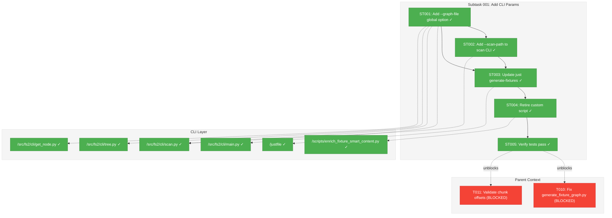
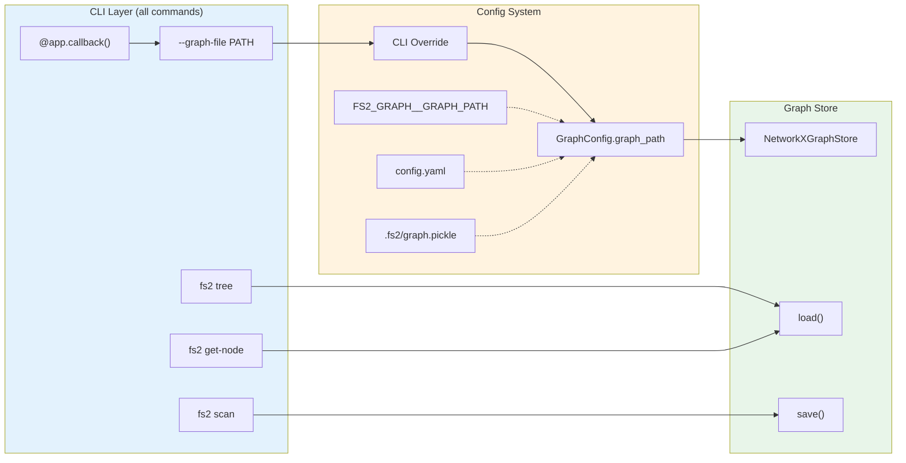
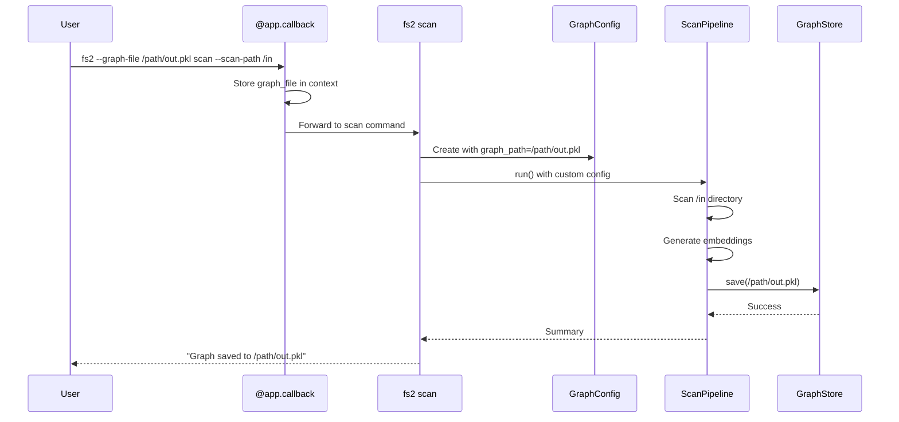

# Subtask 001: Add CLI graph-file and scan-path params

**Parent Plan:** [View Plan](../../search-plan.md)
**Parent Phase:** Phase 0: Chunk Offset Tracking
**Parent Task(s):** [T010: Fix generate_fixture_graph.py](../tasks.md#task-t010), [T011: Validate chunk offsets](../tasks.md#task-t011)
**Plan Task Reference:** [Task 0.10 in Plan](../../search-plan.md#phase-0-chunk-offset-tracking)

**Why This Subtask:**
T010/T011 blocked—fixture generation requires a special script because `fs2 scan` lacks params for custom input/output paths. Adding `--graph-file` and `--scan-path` params enables using the normal CLI flow, making fixture generation (and other use cases) simpler and more maintainable.

**Created:** 2025-12-24
**Requested By:** Development Team

---

## Executive Briefing

### Purpose
Add `--graph-file` as a **global CLI option** available on ALL graph-using commands (scan, tree, get-node), plus `--scan-path` for the scan command specifically. This enables fixture generation via standard CLI and establishes the foundation for all graph operations to use consistent path handling.

### What We're Building
CLI enhancements with proper config integration:
- `--graph-file PATH`: **Global option** for ALL graph-using commands (scan, tree, get-node)
  - Bidirectional: works for save (scan) AND load (tree, get-node)
  - Uses existing `GraphConfig.graph_path` - NO new config class needed
- `--scan-path PATH`: Override input directory to scan (scan command only)
- Updated `just generate-fixtures` to use `fs2 scan` directly
- Ensure FakeEmbeddingAdapter and test fixtures work with the new flow

### Key Design Decisions
- **Leverage existing GraphConfig**: `GraphConfig.graph_path` already exists with default `.fs2/graph.pickle`
- **Global option pattern**: Use Typer callback to apply `--graph-file` to all commands
- **CLI overrides config**: When `--graph-file` provided, it overrides GraphConfig.graph_path

### Unblocks
- T010: Fixture generation can use `fs2 scan --scan-path tests/fixtures/samples --graph-file tests/fixtures/fixture_graph.pkl`
- T011: Validation can rely on standard CLI workflow
- All graph commands immediately support custom paths

### Example
**Before** (custom script):
```bash
python scripts/generate_fixture_graph.py
```

**After** (standard CLI):
```bash
# Generate fixtures (single path, relative)
fs2 scan --scan-path tests/fixtures/samples --graph-file tests/fixtures/fixture_graph.pkl

# Scan multiple paths (--scan-path is repeatable)
fs2 scan --scan-path src --scan-path tests --scan-path lib --graph-file .fs2/graph.pkl

# Absolute paths work too
fs2 scan --scan-path /workspaces/flow_squared/src --graph-file /tmp/graph.pkl

# Mixed relative and absolute
fs2 scan --scan-path src --scan-path /other/project/lib --graph-file .fs2/graph.pkl

# View fixture tree (same --graph-file works!)
fs2 tree --graph-file tests/fixtures/fixture_graph.pkl

# Get node from fixture (same --graph-file works!)
fs2 get-node file:samples/calculator.py --graph-file tests/fixtures/fixture_graph.pkl
```

**Config precedence** (standard fs2 pattern):
```
CLI --graph-file > FS2_GRAPH__GRAPH_PATH env var > .fs2/config.yaml graph.graph_path > default
```

---

## Objectives & Scope

### Objective
Add `--graph-file` as a global option for all graph-using commands, plus `--scan-path` for scan, enabling fixture generation via standard CLI and consistent graph path handling everywhere.

### Goals

- ✅ Add `--graph-file` as **global option** on all graph commands (scan, tree, get-node)
- ✅ Add `--scan-path` param to `fs2 scan` command
- ✅ Use **existing GraphConfig** (no new config class)
- ✅ Update NetworkXGraphStore to accept path override
- ✅ Update `just generate-fixtures` to use `fs2 scan` directly
- ✅ Retire/simplify `scripts/generate_fixture_graph.py`
- ✅ Ensure FakeEmbeddingAdapter works with newly generated fixtures
- ✅ All existing tests pass

### Non-Goals

- ❌ Changing fixture content or structure (just generation method)
- ❌ Performance optimization of scan process
- ❌ Adding new fixture files beyond what T010 requires

---

## Architecture Map

### Component Diagram
<!-- Status: grey=pending, orange=in-progress, green=completed, red=blocked -->
<!-- Updated by plan-6 during implementation -->



### Task-to-Component Mapping

<!-- Status: ⬜ Pending | 🟧 In Progress | ✅ Complete | 🔴 Blocked -->

| Task | Component(s) | Files | Status | Comment |
|------|-------------|-------|--------|---------|
| ST001 | CLI (all commands) | main.py, scan.py, tree.py, get_node.py | ✅ Complete | Global --graph-file option via Typer callback |
| ST002 | CLI (scan only) | scan.py | ✅ Complete | Add --scan-path param (repeatable) |
| ST003 | Build | justfile | ✅ Complete | Update generate-fixtures recipe |
| ST004 | Scripts | enrich_fixture_smart_content.py | ✅ Complete | Simplify or retire script |
| ST005 | Tests | All embedding tests | ✅ Complete | Verify no regressions |

---

## Tasks

| Status | ID | Task | CS | Type | Dependencies | Absolute Path(s) | Validation | Subtasks | Notes |
|--------|------|------|-----|------|--------------|------------------|------------|----------|-------|
| [x] | ST001 | Add `--graph-file` as **global option** to all graph commands (scan, tree, get-node) via Typer callback | 3 | CLI | – | /workspaces/flow_squared/src/fs2/cli/main.py, /workspaces/flow_squared/src/fs2/cli/scan.py, /workspaces/flow_squared/src/fs2/cli/tree.py, /workspaces/flow_squared/src/fs2/cli/get_node.py | All three commands show `--graph-file` in `--help`; uses existing GraphConfig | – | Use context object pattern. **Fix scan.py:201** - show actual path. **Create parent dirs** for --graph-file if missing. |
| [x] | ST002 | Add `--scan-path` param to `fs2 scan` command (repeatable for multiple paths) | 2 | CLI | ST001 | /workspaces/flow_squared/src/fs2/cli/scan.py | `fs2 scan --help` shows new param | – | Override ScanConfig.scan_paths with list[str]. **Path validation in FileSystemScanner**, not CLI (Clean Architecture). |
| [x] | ST003 | Update `just generate-fixtures` with two-step recipe: fs2 scan + enrich script | 1 | Build | ST001, ST002 | /workspaces/flow_squared/justfile | `just generate-fixtures` runs scan then enrichment | – | Two-step: scan for structure/embeddings, then enrich smart_content |
| [x] | ST004 | Refactor script → `enrich_fixture_smart_content.py` (smart_content only) | 2 | Refactor | ST003 | /workspaces/flow_squared/scripts/generate_fixture_graph.py → /workspaces/flow_squared/scripts/enrich_fixture_smart_content.py | Script loads graph, adds smart_content, saves | – | Remove scan logic, keep LLM enrichment with rate limiting |
| [x] | ST005 | Verify all embedding tests pass with new fixture generation flow | 1 | Validation | ST004 | /workspaces/flow_squared/tests/unit/services/test_embedding_*.py, /workspaces/flow_squared/tests/unit/adapters/test_embedding_*.py | All 140+ tests pass | – | Regression check |

---

## Alignment Brief

### Objective Recap
Add `--graph-file` as a **global option** for all graph-using commands (scan, tree, get-node), plus `--scan-path` for scan. This unblocks T010 (fixture regeneration) and T011 (validation) by enabling fixture generation via standard CLI, and establishes consistent graph path handling across all commands.

### Acceptance Criteria Checklist

- [x] `fs2 scan --graph-file PATH` saves graph to specified path (relative or absolute)
- [x] `fs2 tree --graph-file PATH` loads graph from specified path (relative or absolute)
- [x] `fs2 get-node NODE_ID --graph-file PATH` loads graph from specified path (relative or absolute)
- [x] `fs2 scan --scan-path PATH` scans specified directory:
  - Repeatable for multiple paths (`--scan-path src --scan-path tests`)
  - Supports relative paths (resolved from cwd)
  - Supports absolute paths
  - Supports mixed relative and absolute
- [x] Config precedence: CLI flag > FS2_GRAPH__GRAPH_PATH env > YAML > default
- [x] `just generate-fixtures` works with new CLI params
- [x] FakeEmbeddingAdapter works with regenerated fixtures
- [x] All existing embedding tests pass (140+)
- [x] No regression in existing behavior (defaults work)

### Critical Findings Affecting This Subtask

**DYK-01: Fixture Script Bypasses EmbeddingService** (from Phase 0)
- **Constrains**: Current script manually calls `adapter.embed_text()` instead of ScanPipeline
- **Addressed by**: ST003, ST004 - Use standard CLI which uses real EmbeddingService path

**GraphConfig Already Exists**
- **Informs**: `GraphConfig.graph_path` already exists with default `.fs2/graph.pickle`
- **Leveraged by**: ST001 - No new config class needed, just pass CLI override to existing config

**Research Finding: GraphStore Integration Ready** (Discovery 07 from plan)
- **Informs**: GraphStore already has `get_all_nodes()` and save/load methods
- **Leveraged by**: Just need to pass path override to existing infrastructure

### Invariants/Guardrails

| Invariant | Validation |
|-----------|------------|
| Existing command behavior unchanged when no overrides | Run each command without params, verify default paths used |
| Config precedence follows standard pattern | Test CLI > env > YAML priority |
| FakeEmbeddingAdapter loads fixture correctly | Unit tests use fixture, verify pass |
| Graph format unchanged | T011 validation script works on new graph |
| All three commands accept --graph-file | Verify via `--help` on each |

### Inputs to Read

| File | Purpose |
|------|---------|
| `/workspaces/flow_squared/src/fs2/cli/main.py` | App callback for global options |
| `/workspaces/flow_squared/src/fs2/cli/scan.py` | Current scan CLI implementation |
| `/workspaces/flow_squared/src/fs2/cli/tree.py` | Current tree CLI implementation |
| `/workspaces/flow_squared/src/fs2/cli/get_node.py` | Current get-node CLI implementation |
| `/workspaces/flow_squared/src/fs2/config/objects.py` | Existing GraphConfig |
| `/workspaces/flow_squared/justfile` | Current generate-fixtures recipe |

### Visual Alignment: Flow Diagram



### Visual Alignment: Sequence Diagram



### Test Plan

| Test Name | File | Purpose | Expected Output |
|-----------|------|---------|-----------------|
| `test_scan_with_graph_file_override` | test_scan_cli.py | Proves --graph-file works for scan | Graph saved to custom path |
| `test_tree_with_graph_file_override` | test_tree_cli.py | Proves --graph-file works for tree | Tree loads from custom path |
| `test_get_node_with_graph_file_override` | test_get_node_cli.py | Proves --graph-file works for get-node | Node loaded from custom path |
| `test_scan_with_scan_path_override` | test_scan_cli.py | Proves --scan-path works | Only specified dir scanned |
| `test_existing_behavior_unchanged` | test_cli.py | Proves defaults work | Default paths used |
| `test_generate_fixtures_via_cli` | integration | Proves justfile works | Fixtures generated correctly |

### Implementation Outline

1. **ST001**: Add `--graph-file` global option via Typer callback in `cli/main.py`:
   ```python
   # Context object to pass options between callback and commands
   @dataclass
   class CLIContext:
       graph_file: str | None = None

   @app.callback()
   def main(
       ctx: typer.Context,
       graph_file: Annotated[
           str | None,
           typer.Option("--graph-file", help="Graph file path (overrides config)"),
       ] = None,
   ) -> None:
       ctx.obj = CLIContext(graph_file=graph_file)
   ```

   Update each command to accept context and use override:
   ```python
   def scan(ctx: typer.Context, ...):
       graph_path = ctx.obj.graph_file if ctx.obj else None
       # Create config with override if provided
       if graph_path:
           config = replace(config, graph_config=GraphConfig(graph_path=graph_path))
   ```

2. **ST002**: Add `--scan-path` to `cli/scan.py` (repeatable):
   ```python
   scan_path: Annotated[
       list[str] | None,
       typer.Option("--scan-path", help="Directory to scan (repeatable, overrides config)"),
   ] = None
   ```

   Usage:
   ```bash
   fs2 scan --scan-path src --scan-path tests --scan-path lib
   ```

3. **ST003**: Update justfile with two-step recipe:
   ```just
   generate-fixtures:
       # Step 1: Scan with embeddings (no smart_content - handled separately)
       uv run fs2 --graph-file tests/fixtures/fixture_graph.pkl scan \
           --no-smart-content \
           --scan-path tests/fixtures/samples
       # Step 2: Enrich with smart_content via LLM
       uv run python scripts/enrich_fixture_smart_content.py
   ```

4. **ST004**: Refactor `generate_fixture_graph.py` → `enrich_fixture_smart_content.py`:
   - Remove all scanning logic (now handled by fs2 scan)
   - Keep only smart_content generation via Azure LLM
   - Load graph, enrich nodes, save graph
   - Preserves existing rate limiting and prompt logic that tests depend on

5. **ST005**: Run full test suite:
   ```bash
   UV_CACHE_DIR=.uv_cache uv run pytest tests/unit/services/test_embedding_*.py tests/unit/adapters/test_embedding_*.py -v
   ```

### Commands to Run

```bash
# After ST001: Verify global option on all commands
uv run fs2 --help
uv run fs2 scan --help
uv run fs2 tree --help
uv run fs2 get-node --help

# After ST002: Test with overrides
uv run fs2 --graph-file /tmp/test_graph.pkl scan --scan-path tests/fixtures/samples

# Test tree with custom graph
uv run fs2 --graph-file tests/fixtures/fixture_graph.pkl tree

# After ST003: Test justfile recipe
just generate-fixtures

# After ST005: Full regression test
UV_CACHE_DIR=.uv_cache uv run pytest \
    tests/unit/services/test_embedding_*.py \
    tests/unit/adapters/test_embedding_*.py \
    -v --tb=short

# Validate generated fixtures
UV_CACHE_DIR=.uv_cache uv run python tests/scratch/validate_chunk_offsets.py
```

### Risks & Mitigations

| Risk | Severity | Likelihood | Mitigation |
|------|----------|------------|------------|
| Breaking existing command behavior | High | Low | Test defaults explicitly in ST005 |
| Typer context passing issues | Medium | Medium | Test context object pattern carefully |
| Fixture format incompatibility | Medium | Low | Use same GraphStore.save() method |
| Smart content generation lost | Medium | Medium | May need to keep separate script for LLM calls |

### Ready Check

- [x] Typer global option pattern understood (callback + context)
- [x] GraphConfig already exists - no new config needed
- [x] All three commands need updates (scan, tree, get-node)
- [x] justfile recipe syntax understood
- [x] Smart content generation requirements clarified
- [x] All absolute paths verified

**✅ Subtask Complete**

---

## Phase Footnote Stubs

| Footnote | Description | Added By | Date |
|----------|-------------|----------|------|
| [^1] | ST001-ST005 - Added CLI params for fixture generation (7 files modified) | plan-6a | 2025-12-25 |

_Footnotes synchronized with plan Change Footnotes Ledger._

---

## Evidence Artifacts

| Artifact | Location | Created By |
|----------|----------|------------|
| Execution Log | `./001-subtask-add-cli-graph-file-and-scan-path-params.execution.log.md` | plan-6 during implementation |
| Test Output | Captured in execution log | plan-6 |
| CLI Help Output | Captured in execution log | ST002, ST003 |
| Generated Fixtures | `tests/fixtures/fixture_graph.pkl` | ST005 |

---

## Discoveries & Learnings

_Populated during implementation by plan-6. Log anything of interest to your future self._

| Date | Task | Type | Discovery | Resolution | References |
|------|------|------|-----------|------------|------------|
| 2024-12-24 | ST003/ST004 | decision | Smart content generation differs between custom script and SmartContentService. Tests check exact string equality (`==`), not just presence. FakeLLMAdapter looks up smart_content by content hash from fixtures. | Two-step approach: (1) `fs2 scan --no-smart-content` for structure/embeddings, (2) `enrich_fixture_smart_content.py` for smart_content with original rate limiting and prompts. | DYK Session Insight #1 |
| 2024-12-24 | ST001 | decision | Typer global options must come BEFORE subcommand (`fs2 --graph-file PATH scan`), not after. This is standard Typer behavior. | Accept convention, ensure examples in --help and docs use correct order. No code changes needed. | DYK Session Insight #3 |
| 2024-12-24 | ST001 | decision | If `--graph-file /new/path/graph.pkl` parent dir doesn't exist, save will fail. Current script does `mkdir(parents=True)`. | Auto-create parent directories in CLI layer before pipeline runs. One-liner: `Path(graph_file).parent.mkdir(parents=True, exist_ok=True)` | DYK Session Insight #4 |
| 2024-12-24 | ST002 | decision | --scan-path validation (exists, is directory) should NOT be in CLI layer per Clean Architecture. | Validate in FileSystemScanner (adapter layer), raise clear error that bubbles up. CLI just displays it. | DYK Session Insight #5 |

**Types**: `gotcha` | `research-needed` | `unexpected-behavior` | `workaround` | `decision` | `debt` | `insight`

**What to log**:
- Things that didn't work as expected
- External research that was required
- Implementation troubles and how they were resolved
- Gotchas and edge cases discovered
- Decisions made during implementation
- Technical debt introduced (and why)
- Insights that future phases should know about

_See also: `execution.log.md` for detailed narrative._

---

## After Subtask Completion

**This subtask resolves a blocker for:**
- Parent Task: [T010: Fix generate_fixture_graph.py](../tasks.md#task-t010)
- Parent Task: [T011: Validate chunk offsets](../tasks.md#task-t011)
- Plan Task: [0.10: Regenerate fixture_graph.pkl](../../search-plan.md#phase-0-chunk-offset-tracking)

**When all ST001-ST005 tasks complete:**

1. **Record completion** in parent execution log:
   ```
   ### Subtask 001-subtask-add-cli-graph-file-and-scan-path-params Complete

   Resolved: Added --graph-file global option to all commands and --scan-path to scan, fixture generation now uses standard fs2 scan
   See detailed log: [subtask execution log](./001-subtask-add-cli-graph-file-and-scan-path-params.execution.log.md)
   ```

2. **Update parent task** (if it was blocked):
   - Open: [`tasks.md`](../tasks.md)
   - Find: T010, T011
   - Update Status: `[ ]` → `[x]` (complete, not just unblocked)
   - Update Notes: Add "Subtask 001-subtask complete"

3. **Resume parent phase work:**
   ```bash
   /plan-6-implement-phase --phase "Phase 0: Chunk Offset Tracking" \
     --plan "/workspaces/flow_squared/docs/plans/010-search/search-plan.md"
   ```
   (Note: NO `--subtask` flag to resume main phase)

**Quick Links:**
- [Parent Dossier](../tasks.md)
- [Parent Plan](../../search-plan.md)
- [Parent Execution Log](../execution.log.md)

---

## Directory Layout

```
docs/plans/010-search/
├── search-spec.md
├── search-plan.md
└── tasks/
    └── phase-0-chunk-offset-tracking/
        ├── tasks.md
        ├── execution.log.md
        ├── 001-subtask-add-cli-graph-file-and-scan-path-params.md        # This file
        └── 001-subtask-add-cli-graph-file-and-scan-path-params.execution.log.md  # Created by plan-6
```
