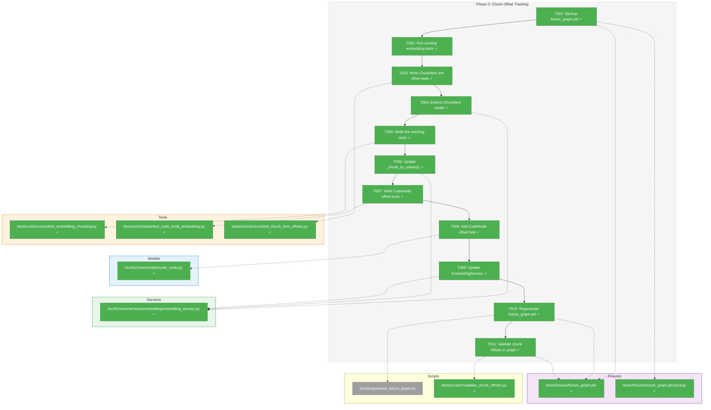
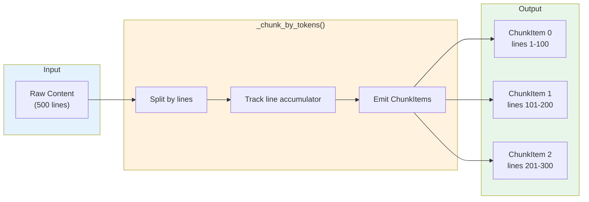
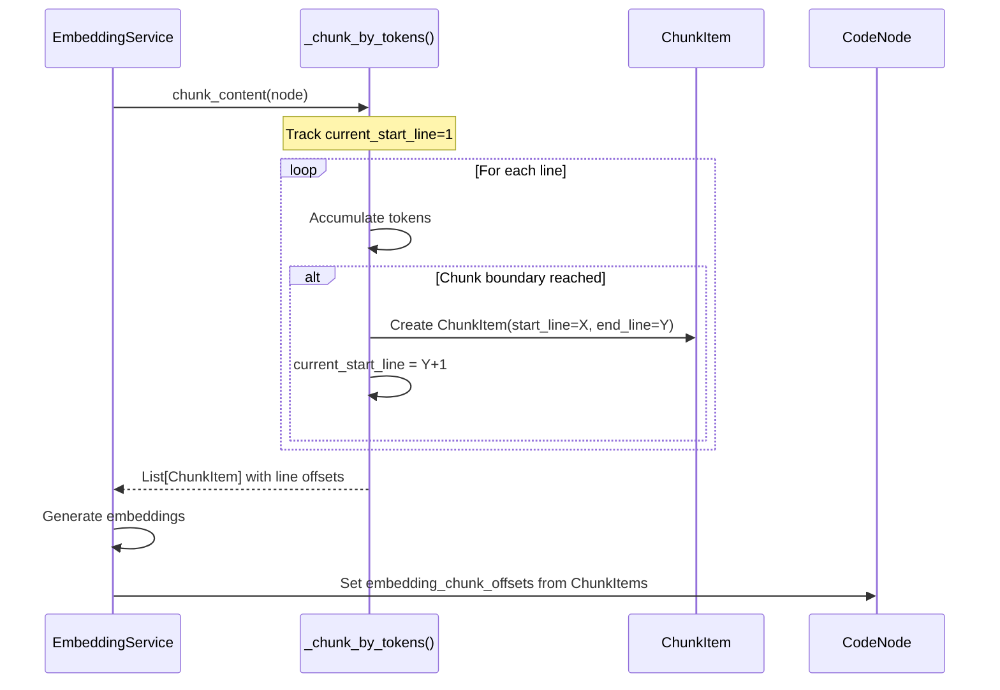

# Phase 0: Chunk Offset Tracking – Tasks & Alignment Brief

**Spec**: [../../search-spec.md](../../search-spec.md)
**Plan**: [../../search-plan.md](../../search-plan.md)
**Date**: 2025-12-24
**Phase Slug**: phase-0-chunk-offset-tracking

---

## Executive Briefing

### Purpose
This phase adds line offset metadata to the chunking system, enabling semantic search results to report accurate source line ranges. Currently, when content is chunked for embedding, we lose track of which lines each chunk spans. Phase 0 solves this foundational problem.

### What We're Building
Three interconnected enhancements:
1. **Extended ChunkItem**: Add optional `start_line`/`end_line` fields to track line boundaries per chunk
2. **Line-tracking chunking**: Update `_chunk_by_tokens()` to compute line offsets as it splits content
3. **CodeNode chunk offsets**: New `embedding_chunk_offsets` field storing chunk→line mappings for later lookup

### User Value
When semantic search finds a match in chunk 3 of 5, the system can report "lines 45-67" instead of just the node's full line range. This is critical for large nodes (multi-hundred-line classes/functions) where chunk-level precision matters.

### Example
**Before**: Semantic match returns `start_line: 1, end_line: 500` (full class range)
**After**: Semantic match returns `match_start_line: 145, match_end_line: 187` (chunk 3's actual lines)

**Data Flow**:
```
Content → _chunk_by_tokens() → ChunkItem(start_line=145, end_line=187, chunk_index=3)
                                    ↓
                            EmbeddingService populates
                                    ↓
            CodeNode.embedding_chunk_offsets = ((145, 187), (188, 230), ...)
```

---

## Objectives & Scope

### Objective
Add start_line/end_line tracking to ChunkItem and store chunk offsets on CodeNode for semantic search detail mode, per plan acceptance criteria AC21.

### Goals

- ✅ Extend ChunkItem with optional `start_line`/`end_line` fields (backward compatible)
- ✅ Update `_chunk_by_tokens()` to compute line boundaries during chunking
- ✅ Add `embedding_chunk_offsets` field to CodeNode for chunk→line lookup
- ✅ Update EmbeddingService to populate chunk offset metadata
- ✅ Ensure all existing embedding tests pass (no regressions)
- ✅ Ensure fixture_graph.pkl loads without regeneration

### Non-Goals

- ❌ Smart content chunk offsets (smart_content is already a summary, line offsets less meaningful)
- ❌ Changing chunk size parameters (that's configuration, not this phase)
- ❌ Integrating with SearchService (that's Phase 3)
- ❌ Regenerating fixture_graph.pkl (backward compatibility required)
- ❌ Performance optimization of chunking (not needed, keep it simple)

---

## Architecture Map

### Component Diagram
<!-- Status: grey=pending, orange=in-progress, green=completed, red=blocked -->
<!-- Updated by plan-6 during implementation -->



### Task-to-Component Mapping

<!-- Status: ⬜ Pending | 🟧 In Progress | ✅ Complete | 🔴 Blocked -->

| Task | Component(s) | Files | Status | Comment |
|------|-------------|-------|--------|---------|
| T001 | Fixtures | fixture_graph.pkl, backup | ✅ Complete | Safety backup before modifications |
| T002 | Test Suite | All embedding tests | ✅ Complete | Baseline: 131 tests passing |
| T003 | ChunkItem Tests | test_chunk_item_offsets.py | ✅ Complete | TDD RED: 9 tests failing |
| T004 | ChunkItem Model | embedding_service.py | ✅ Complete | TDD GREEN: 9 new + 131 existing pass |
| T005 | Chunking Tests | test_embedding_chunking.py | ✅ Complete | TDD RED: 6 tests failing |
| T006 | Chunking Logic | embedding_service.py | ✅ Complete | Return type changed + line tracking |
| T007 | CodeNode Tests | test_code_node_embedding.py | ✅ Complete | TDD RED: 9 tests failing |
| T008 | CodeNode Model | code_node.py | ✅ Complete | TDD GREEN: 9 new + 41 existing pass |
| T009 | EmbeddingService | embedding_service.py | ✅ Complete | Offsets wired + 3 integration tests |
| T010 | Fixture Generation | fixture_graph.pkl, generate_fixture_graph.py | ✅ Complete | 486 nodes, 451 with offsets |
| T011 | Validation Script | validate_chunk_offsets.py | ✅ Complete | 451 nodes validated, 28 multi-chunk |

---

## Tasks

| Status | ID | Task | CS | Type | Dependencies | Absolute Path(s) | Validation | Subtasks | Notes |
|--------|------|------|-----|------|--------------|------------------|------------|----------|-------|
| [x] | T001 | Backup fixture_graph.pkl before any schema changes | 1 | Setup | – | /workspaces/flow_squared/tests/fixtures/fixture_graph.pkl, /workspaces/flow_squared/tests/fixtures/fixture_graph.pkl.backup | Backup file exists with same size/checksum | – | Safety first |
| [x] | T002 | Run all existing embedding tests to establish baseline | 1 | Setup | T001 | /workspaces/flow_squared/tests/unit/services/test_embedding_*.py, /workspaces/flow_squared/tests/unit/adapters/test_embedding_*.py, /workspaces/flow_squared/tests/integration/test_*embedding*.py | All tests pass (record count) | – | Baseline verification |
| [x] | T003 | Write tests for ChunkItem with start_line/end_line fields | 2 | Test | T002 | /workspaces/flow_squared/tests/unit/services/test_chunk_item_offsets.py | Tests verify: optional fields, None defaults, value storage | – | TDD: tests fail initially |
| [x] | T004 | Extend ChunkItem with optional start_line/end_line fields | 2 | Core | T003 | /workspaces/flow_squared/src/fs2/core/services/embedding/embedding_service.py | Tests from T003 pass, all existing tests still pass | – | Per Discovery 01: None defaults |
| [x] | T005 | Write tests for line boundary tracking in _chunk_by_tokens() | 2 | Test | T004 | /workspaces/flow_squared/tests/unit/services/test_embedding_chunking.py | Tests verify: line accumulator, multi-chunk offsets, edge cases | – | TDD: tests fail initially |
| [x] | T006 | Update _chunk_by_tokens() to return `list[tuple[str, int, int]]` (text, start_line, end_line), update _chunk_content() caller | 3 | Core | T005 | /workspaces/flow_squared/src/fs2/core/services/embedding/embedding_service.py | Tests from T005 pass, ChunkItems include line offsets | – | DYK-02: Return type change required |
| [x] | T007 | Write tests for CodeNode.embedding_chunk_offsets field | 2 | Test | T006 | /workspaces/flow_squared/tests/unit/models/test_code_node_embedding.py | Tests verify: new field, serialization, None default | – | TDD: tests fail initially |
| [x] | T008 | Add embedding_chunk_offsets field to CodeNode | 2 | Core | T007 | /workspaces/flow_squared/src/fs2/core/models/code_node.py | Tests from T007 pass, pickle load still works | – | Per Discovery 01: None default |
| [x] | T009 | Update EmbeddingService to populate chunk offsets on CodeNode | 3 | Integration | T008 | /workspaces/flow_squared/src/fs2/core/services/embedding/embedding_service.py | Integration test shows offsets populated correctly | – | Wire _chunk_content → CodeNode |
| [x] | T010 | Fix generate_fixture_graph.py to use ScanPipeline with EmbeddingService, then regenerate fixtures | 3 | Integration | T009 | /workspaces/flow_squared/tests/fixtures/fixture_graph.pkl, /workspaces/flow_squared/scripts/generate_fixture_graph.py | `just generate-fixtures` succeeds, uses real EmbeddingService code path | 001-subtask ✅ | DYK-01: Script bypasses EmbeddingService · Subtask 001 complete [^1] |
| [x] | T011 | Create validation script to verify chunk offsets in generated graph | 2 | Validation | T010 | /workspaces/flow_squared/tests/scratch/validate_chunk_offsets.py | Script confirms: nodes have offsets, offsets are valid tuples, line ranges make sense | – | Manual validation gate |

---

## Alignment Brief

### Critical Findings Affecting This Phase

**Discovery 01: ChunkItem Schema Change Risk** (Critical)
- **What it constrains**: ChunkItem must remain backward compatible with existing code
- **What it requires**: Use optional fields with `None` defaults, NOT required fields
- **Tasks addressing it**: T003, T004, T007, T008

```python
# ❌ WRONG - Breaking change
start_line: int  # Required field breaks existing code

# ✅ CORRECT - Backward compatible
start_line: int | None = None  # Optional with default
```

**Discovery 05: Dual Embedding Arrays (Chunked)** (Critical)
- **What it informs**: Why chunk offsets matter — semantic search iterates all chunks and needs to report matched chunk's line range
- **Relationship to this phase**: Phase 0 enables Phase 3's chunk-level line reporting

**DYK-01: Fixture Script Bypasses EmbeddingService** (Critical - discovered in clarity session)
- **What it constrains**: `generate_fixture_graph.py` manually calls `adapter.embed_text()` instead of using ScanPipeline with EmbeddingService
- **What it requires**: T010 must fix the script to inject EmbeddingService into ScanPipeline (like `fs2 scan` does)
- **Tasks addressing it**: T010 (CS increased from 2 to 3)

**DYK-02: _chunk_by_tokens() Return Type Change** (High - discovered in clarity session)
- **What it constrains**: `_chunk_by_tokens()` currently returns `list[str]`, line info is lost before ChunkItem creation
- **What it requires**: Change return type to `list[tuple[str, int, int]]` (text, start_line, end_line)
- **Tasks addressing it**: T006

**DYK-03: Overlap Lines in Multiple Chunks** (Medium - discovered in clarity session)
- **What it means**: With `overlap_tokens > 0`, same lines appear in consecutive chunks (e.g., lines 90-100 in both chunk 0 and chunk 1)
- **Decision**: Report actual chunk ranges including overlap — this honestly represents what's embedded
- **Implication**: A line may map to multiple chunk ranges; this is expected and correct
- **Tasks addressing it**: T005 (tests should verify overlapping ranges), T006 (implementation)

**DYK-04: Long Line Character Splits Have Same Line Range** (Low - discovered in clarity session)
- **What it means**: When a single line exceeds max_tokens, `_split_long_line()` splits by characters — all resulting chunks report `start_line == end_line` (the same line)
- **Decision**: Accept this limitation — it's rare, and knowing the line is still useful
- **Implication**: Edge case (minified code, long data literals) has less granular offsets
- **Tasks addressing it**: T005 (include test for this edge case)

**DYK-05: No Chunk Offsets for smart_content (Asymmetry by Design)** (Medium - discovered in clarity session)
- **What it means**: `embedding_chunk_offsets` only covers raw content chunks, not smart_content chunks
- **Decision**: Accept asymmetry — smart_content is AI-generated summary, line offsets don't make sense for it
- **Implication for Phase 3**: When `ChunkMatch.field == "smart_content_embedding"`, use node's full `(start_line, end_line)` range instead of chunk offset
- **Tasks addressing it**: None in Phase 0 (document for Phase 3 implementation)

### Invariants & Guardrails

| Invariant | Validation |
|-----------|------------|
| ChunkItem remains frozen dataclass | Tests verify `@dataclass(frozen=True)` |
| Existing embedding tests unchanged | T002 records baseline, run after T009 to verify no regression |
| fixture_graph.pkl regenerated with offsets | T010 regenerates via `just generate-fixtures` |
| Chunk offsets correctly populated | T011 validation script verifies offsets in generated graph |
| No breaking changes to existing APIs | All ChunkItem usages continue working with None defaults |

### Inputs to Read

| File | Purpose |
|------|---------|
| `/workspaces/flow_squared/src/fs2/core/services/embedding/embedding_service.py` | ChunkItem, _chunk_by_tokens() |
| `/workspaces/flow_squared/src/fs2/core/models/code_node.py` | CodeNode model |
| `/workspaces/flow_squared/tests/unit/services/test_embedding_chunking.py` | Existing chunking tests |
| `/workspaces/flow_squared/tests/unit/models/test_code_node_embedding.py` | Existing CodeNode embedding tests |
| `/workspaces/flow_squared/scripts/generate_fixture_graph.py` | Fixture generation script (for T010) |

### Visual Alignment: Flow Diagram



### Visual Alignment: Sequence Diagram



### Test Plan (Full TDD)

| Test Name | File | Purpose | Fixtures | Expected Output |
|-----------|------|---------|----------|-----------------|
| `test_chunk_item_accepts_line_offsets` | test_chunk_item_offsets.py | Proves line offset fields work | None | ChunkItem stores start_line=10, end_line=20 |
| `test_chunk_item_backward_compatible` | test_chunk_item_offsets.py | Proves existing usage works | None | ChunkItem without offsets has None defaults |
| `test_chunk_by_tokens_tracks_line_boundaries` | test_embedding_chunking.py | Proves line tracking works | Multi-line content | ChunkItem[0].start_line=1, end_line=50 |
| `test_chunk_by_tokens_multi_chunk_offsets` | test_embedding_chunking.py | Proves consecutive chunks have correct offsets | Large content | Chunk[1].start_line == Chunk[0].end_line + 1 |
| `test_code_node_embedding_chunk_offsets_field` | test_code_node_embedding.py | Proves new field exists | None | Field accepts tuple[tuple[int,int],...] |
| `test_code_node_embedding_chunk_offsets_default_none` | test_code_node_embedding.py | Proves backward compatibility | None | Field defaults to None |
| `test_embedding_service_populates_chunk_offsets` | test_embedding_service.py | Proves integration works | Node with content | embedding_chunk_offsets populated correctly |
| `validate_chunk_offsets.py` (script) | tests/scratch/ | Manual validation of generated graph | fixture_graph.pkl | Offsets valid, line ranges sensible, statistics printed |

### Implementation Outline

1. **T001**: `cp fixture_graph.pkl fixture_graph.pkl.backup` + verify checksum
2. **T002**: `pytest tests/unit/services/test_embedding_*.py tests/unit/adapters/test_embedding_*.py -v` → record pass count
3. **T003**: Create `test_chunk_item_offsets.py` with failing tests for new fields
4. **T004**: Add `start_line: int | None = None` and `end_line: int | None = None` to ChunkItem
5. **T005**: Add tests to `test_embedding_chunking.py` for line boundary tracking
6. **T006**: Change `_chunk_by_tokens()` return type to `list[tuple[str, int, int]]`, track `current_start_line` as loop variable, update `_chunk_content()` to unpack tuples into ChunkItem fields
7. **T007**: Add tests to `test_code_node_embedding.py` for new field
8. **T008**: Add `embedding_chunk_offsets: tuple[tuple[int, int], ...] | None = None` to CodeNode
9. **T009**: Update `_chunk_content()` to return offsets, update `process_batch()` to populate CodeNode field
10. **T010**: Fix `generate_fixture_graph.py` to inject EmbeddingService into ScanPipeline (like `fs2 scan` does), removing manual embedding logic. Then run `just generate-fixtures` to regenerate with real code path
11. **T011**: Create `tests/scratch/validate_chunk_offsets.py` script that loads graph and validates:
    - Nodes with embeddings have `embedding_chunk_offsets` populated
    - Offsets are valid `tuple[tuple[int, int], ...]` format
    - Line ranges are sensible (start <= end, within node's line range)
    - Print summary statistics and any anomalies

### Commands to Run

```bash
# Setup verification
cp /workspaces/flow_squared/tests/fixtures/fixture_graph.pkl \
   /workspaces/flow_squared/tests/fixtures/fixture_graph.pkl.backup

# Baseline test run
UV_CACHE_DIR=/workspaces/flow_squared/.uv_cache uv run pytest \
    tests/unit/services/test_embedding_*.py \
    tests/unit/adapters/test_embedding_*.py \
    -v --tb=short

# Run new tests (TDD - expect failures initially)
UV_CACHE_DIR=/workspaces/flow_squared/.uv_cache uv run pytest \
    tests/unit/services/test_chunk_item_offsets.py -v

# Full regression after changes
UV_CACHE_DIR=/workspaces/flow_squared/.uv_cache uv run pytest \
    tests/unit/services/test_embedding_*.py \
    tests/unit/models/test_code_node_embedding.py \
    -v

# Regenerate fixture graph with new chunk offset fields (T010)
just generate-fixtures

# Run validation script to verify chunk offsets (T011)
UV_CACHE_DIR=/workspaces/flow_squared/.uv_cache uv run python \
    tests/scratch/validate_chunk_offsets.py

# Type checking
UV_CACHE_DIR=/workspaces/flow_squared/.uv_cache uv run python -m ruff check \
    src/fs2/core/services/embedding/embedding_service.py \
    src/fs2/core/models/code_node.py
```

### Risks & Mitigations

| Risk | Severity | Likelihood | Mitigation |
|------|----------|------------|------------|
| ChunkItem schema breaks existing tests | High | High | Use `None` defaults per Discovery 01; run T002 baseline first |
| CodeNode pickle incompatibility | High | Medium | Add field with `None` default; test load in T010 before committing |
| Line tracking logic incorrect | Medium | Medium | Comprehensive tests in T005 with edge cases (empty, single-line, huge) |
| Performance regression from line tracking | Low | Low | Simple integer accumulator; no significant overhead |

### Ready Check

- [x] Discovery 01 constraints understood (None defaults, backward compat)
- [x] Plan tasks 0.1-0.10 mapped to T001-T011 (with regeneration + validation)
- [x] All absolute paths verified
- [x] Test files identified for each validation
- [x] Backup strategy in place (T001) ✓
- [x] Baseline test count recorded (T002): 131 → 190 tests
- [x] Fixture regeneration via `just generate-fixtures-quick` (T010) ✓
- [x] Manual validation script for chunk offsets (T011) ✓
- [x] ADR constraints mapped to tasks - N/A (no ADRs exist)

**Phase Complete** - All tasks executed and validated.

---

## Phase Footnote Stubs

| Footnote | Description | Added By | Date |
|----------|-------------|----------|------|
| [^1] | Subtask 001 ST001-ST005 complete - Added CLI params for fixture generation (7 files modified) | plan-6a | 2025-12-25 |
| [^2] | T010-T011 - Fixture regeneration and validation (451 nodes, 28 multi-chunk, all validated) | plan-6 | 2025-12-25 |

_Footnotes synchronized with plan Change Footnotes Ledger._

---

## Evidence Artifacts

| Artifact | Location | Created By |
|----------|----------|------------|
| Execution Log | `./execution.log.md` | plan-6 during implementation |
| Test Output | Captured in execution log | plan-6 |
| Backup Verification | `fixture_graph.pkl.backup` | T001 |
| Regenerated Fixtures | `tests/fixtures/fixture_graph.pkl` | T010 via `just generate-fixtures` |
| Validation Script Output | Captured in execution log | T011 via `validate_chunk_offsets.py` |

---

## Discoveries & Learnings

_Populated during implementation by plan-6. Log anything of interest to your future self._

| Date | Task | Type | Discovery | Resolution | References |
|------|------|------|-----------|------------|------------|
| | | | | | |

**Types**: `gotcha` | `research-needed` | `unexpected-behavior` | `workaround` | `decision` | `debt` | `insight`

**What to log**:
- Things that didn't work as expected
- External research that was required
- Implementation troubles and how they were resolved
- Gotchas and edge cases discovered
- Decisions made during implementation
- Technical debt introduced (and why)
- Insights that future phases should know about

_See also: `execution.log.md` for detailed narrative._

---

## Directory Layout

```
docs/plans/010-search/
├── search-spec.md
├── search-plan.md
└── tasks/
    └── phase-0-chunk-offset-tracking/
        ├── tasks.md              # This file
        └── execution.log.md      # Created by plan-6 during implementation

tests/scratch/
└── validate_chunk_offsets.py     # Created by T011 for manual validation
```

---

## Critical Insights Discussion

**Session**: 2025-12-24
**Context**: Phase 0: Chunk Offset Tracking - Tasks & Alignment Brief
**Analyst**: AI Clarity Agent
**Reviewer**: Development Team
**Format**: Water Cooler Conversation (5 Critical Insights)

### Insight 1: Fixture Script Bypasses EmbeddingService

**Did you know**: `generate_fixture_graph.py` manually calls `adapter.embed_text()` instead of using ScanPipeline with EmbeddingService — T010 would have produced fixtures with zero chunk offsets.

**Implications**:
- Script creates ScanPipeline without embedding_service, then manually enriches nodes
- This bypasses all EmbeddingService logic including the new chunk offset tracking
- T010 would "succeed" but produce wrong results; T011 would find no offsets

**Options Considered**:
- Option A: Update script to use EmbeddingService via ScanPipeline
- Option B: Duplicate offset logic in the script
- Option C: Create separate post-processing step

**AI Recommendation**: Option A - Update script to use EmbeddingService
- Reasoning: Tests real code path, no duplication, catches integration bugs

**Discussion Summary**: User noted the script should just work like `fs2 scan` — and indeed `fs2 scan` already uses EmbeddingService properly. The fix is to make the fixture script follow the same pattern.

**Decision**: Update T010 to fix script to inject EmbeddingService into ScanPipeline

**Action Items**:
- [x] Updated T010 task description and CS (2→3)
- [x] Added DYK-01 to Critical Findings

**Affects**: T010

---

### Insight 2: _chunk_by_tokens() Returns Strings, Not ChunkItems

**Did you know**: `_chunk_by_tokens()` returns `list[str]` and the ChunkItem wrapping happens in `_chunk_content()` — line info is lost before ChunkItem creation.

**Implications**:
- Can't just "add line tracking" to _chunk_by_tokens() without changing return type
- Need to return tuples or modify the caller

**Options Considered**:
- Option A: Change return type to `list[tuple[str, int, int]]`
- Option B: Track lines in _chunk_content() after the fact
- Option C: Return a dataclass from _chunk_by_tokens()

**AI Recommendation**: Option A - Return tuples
- Reasoning: Simplest change, keeps line tracking where it belongs, no new types

**Discussion Summary**: User chose Option A for simplicity.

**Decision**: Change `_chunk_by_tokens()` return type to `list[tuple[str, int, int]]`

**Action Items**:
- [x] Updated T006 task description
- [x] Added DYK-02 to Critical Findings
- [x] Updated Implementation Outline step 6

**Affects**: T006

---

### Insight 3: Overlap Lines Appear in Multiple Chunks

**Did you know**: With `overlap_tokens > 0`, the same lines appear in multiple consecutive chunks — creating ambiguity for which chunk "owns" a line.

**Implications**:
- Chunk 0 might cover lines 1-100, Chunk 1 covers lines 90-200
- Lines 90-100 exist in both chunks' embeddings
- Need to decide how to report ranges

**Options Considered**:
- Option A: Report non-overlapping ranges (exclusive ownership)
- Option B: Report actual ranges including overlap
- Option C: Store both inclusive and exclusive ranges

**AI Recommendation**: Option B - Report actual full range
- Reasoning: Matches reality, overlap provides context at boundaries

**Discussion Summary**: User chose Option B — honest representation is best.

**Decision**: Report actual chunk ranges including overlap; lines may appear in multiple ranges

**Action Items**:
- [x] Added DYK-03 to Critical Findings

**Affects**: T005 (tests), T006 (implementation)

---

### Insight 4: Long Line Character Splits Have Same Line Range

**Did you know**: When a single line exceeds max_tokens, `_split_long_line()` splits by characters — all resulting chunks report the same `start_line == end_line`.

**Implications**:
- Minified code, long data literals create this edge case
- All character-split chunks point to the same line
- Less granular than normal line-based chunks

**Options Considered**:
- Option A: Report same line (accurate but unhelpful)
- Option B: Add character offsets for precision
- Option C: Accept limitation, document it

**AI Recommendation**: Option C - Accept and document
- Reasoning: Rare in practice, still useful, KISS principle

**Discussion Summary**: User chose Option C — no need to over-engineer.

**Decision**: Accept that character-split chunks report same line range; document limitation

**Action Items**:
- [x] Added DYK-04 to Critical Findings

**Affects**: T005 (include edge case test)

---

### Insight 5: No Chunk Offsets for smart_content Creates Asymmetry

**Did you know**: `embedding_chunk_offsets` only covers raw content chunks — but Phase 3 iterates BOTH embedding arrays. Smart content matches have no chunk-level line offsets.

**Implications**:
- Raw content match → precise line range from chunk offset
- Smart content match → must fall back to full node range
- Inconsistent granularity between match types

**Options Considered**:
- Option A: Accept asymmetry (current plan)
- Option B: Add smart_content_chunk_offsets field too
- Option C: Accept but document for Phase 3

**AI Recommendation**: Option C - Accept but document
- Reasoning: Smart content is AI summary, line offsets don't make conceptual sense

**Discussion Summary**: User chose Option C — smart content is generated text, not source.

**Decision**: Accept asymmetry; Phase 3 uses full node range for smart_content matches

**Action Items**:
- [x] Added DYK-05 to Critical Findings
- [x] Updated Phase 3 in search-plan.md with note

**Affects**: Phase 3 implementation

---

## Session Summary

**Insights Surfaced**: 5 critical insights identified and discussed
**Decisions Made**: 5 decisions reached through collaborative discussion
**Action Items Created**: 5 documentation updates applied immediately
**Areas Requiring Updates**:
- T006: Return type change specified
- T010: Script fix added, CS increased
- Phase 3 (search-plan.md): DYK-05 note added

**Shared Understanding Achieved**: ✓

**Confidence Level**: High - Key risks identified and mitigated, implementation approach clarified

**Next Steps**:
Proceed with `/plan-6-implement-phase` after GO approval

**Notes**:
All 5 insights surfaced non-obvious implementation details that would have caused confusion or bugs during implementation. The clarity session increased T010 complexity score and refined T006 approach.
