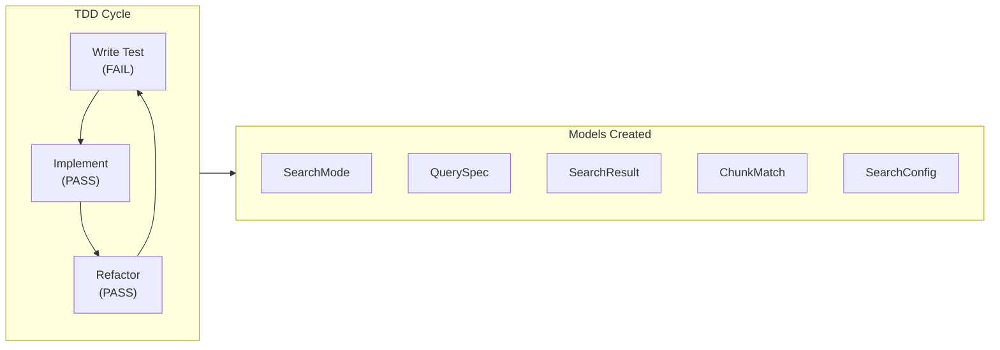
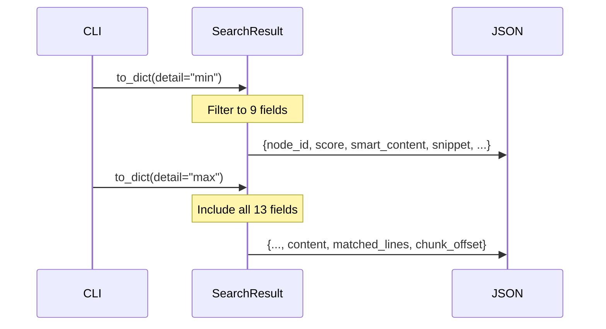

# Phase 1: Core Models – Tasks & Alignment Brief

**Spec**: [../../search-spec.md](../../search-spec.md)
**Plan**: [../../search-plan.md](../../search-plan.md)
**Date**: 2025-12-25

---

## Executive Briefing

### Purpose
This phase creates the foundational domain models for the search capability. These frozen dataclasses define the contract between CLI, service, and matcher layers. Without these models, no search functionality can be implemented.

### What We're Building
Four core domain models:
- **SearchMode** enum: Type-safe search mode selection (TEXT, REGEX, SEMANTIC, AUTO)
- **QuerySpec**: Value object encapsulating search parameters with validation
- **SearchResult**: Result model with min/max detail level support via `to_dict()`
- **ChunkMatch**: Tracks which embedding chunk matched during semantic search (per Discovery 05)
- **SearchConfig**: Pydantic configuration for search defaults

### User Value
These models enable type-safe, validated search requests and structured results that can be filtered by detail level (min/max) for different use cases (quick scanning vs. deep inspection).

### Example
```python
# QuerySpec with validation
spec = QuerySpec(pattern="EmbeddingAdapter", mode=SearchMode.TEXT)
assert spec.limit == 20  # default
assert spec.min_similarity == 0.5  # default

# SearchResult with detail filtering
result = SearchResult(node_id="callable:...", score=0.85, content="...", ...)
min_dict = result.to_dict(detail="min")  # 9 fields
max_dict = result.to_dict(detail="max")  # 13 fields (includes content)

# ChunkMatch for semantic search
match = ChunkMatch(field="embedding", chunk_index=2, score=0.92)
```

---

## Objectives & Scope

### Objective
Create QuerySpec, SearchResult, ChunkMatch, SearchMode, and SearchConfig models as specified in the plan with comprehensive TDD coverage and proper validation.

### Goals

- ✅ Create SearchMode enum with TEXT, REGEX, SEMANTIC, AUTO values
- ✅ Create QuerySpec frozen dataclass with pattern validation (empty pattern rejected)
- ✅ Create SearchResult with `to_dict(detail)` method for min/max filtering
- ✅ Create ChunkMatch for tracking matched chunks (Discovery 05)
- ✅ Create SearchConfig Pydantic model for defaults
- ✅ All models follow @dataclass(frozen=True) pattern
- ✅ 100% TDD: Write tests FIRST, then implement

### Non-Goals

- ❌ Implementing search logic (Phase 2 and 3)
- ❌ CLI integration (Phase 5)
- ❌ Regex timeout handling (Phase 2)
- ❌ Embedding similarity calculation (Phase 3)
- ❌ Documentation (Phase 6)
- ❌ to_dict() implementation in CodeNode (not needed, using SearchResult)

---

## Architecture Map

### Component Diagram

```mermaid
flowchart TD
    classDef pending fill:#9E9E9E,stroke:#757575,color:#fff
    classDef inprogress fill:#FF9800,stroke:#F57C00,color:#fff
    classDef completed fill:#4CAF50,stroke:#388E3C,color:#fff
    classDef blocked fill:#F44336,stroke:#D32F2F,color:#fff

    style Phase fill:#F5F5F5,stroke:#E0E0E0
    style Models fill:#F5F5F5,stroke:#E0E0E0
    style Tests fill:#F5F5F5,stroke:#E0E0E0
    style Config fill:#F5F5F5,stroke:#E0E0E0

    subgraph Phase["Phase 1: Core Models"]
        T001["T001: Write QuerySpec tests ✓"]:::completed
        T002["T002: Write SearchResult.to_dict tests ✓"]:::completed
        T003["T003: Create SearchMode enum ✓"]:::completed
        T004["T004: Implement QuerySpec ✓"]:::completed
        T005["T005: Implement SearchResult ✓"]:::completed
        T006["T006: Write ChunkMatch tests ✓"]:::completed
        T007["T007: Implement ChunkMatch ✓"]:::completed
        T008["T008: Write SearchConfig tests ✓"]:::completed
        T009["T009: Implement SearchConfig ✓"]:::completed
        T010["T010: Create module exports ✓"]:::completed

        T001 --> T004
        T002 --> T005
        T003 --> T004
        T003 --> T005
        T006 --> T007
        T008 --> T009
        T004 --> T010
        T005 --> T010
        T007 --> T010
        T009 --> T010
    end

    subgraph Models["Models (src/fs2/core/models/search/)"]
        M1["__init__.py ✓"]:::completed
        M2["search_mode.py ✓"]:::completed
        M3["query_spec.py ✓"]:::completed
        M4["search_result.py ✓"]:::completed
        M5["chunk_match.py ✓"]:::completed
    end

    subgraph Config["Config (src/fs2/config/)"]
        C1["objects.py (SearchConfig) ✓"]:::completed
    end

    subgraph Tests["Tests (tests/unit/models/)"]
        U1["test_search_mode.py"]:::pending
        U2["test_query_spec.py ✓"]:::completed
        U3["test_search_result.py ✓"]:::completed
        U4["test_chunk_match.py ✓"]:::completed
        U5["test_search_config.py ✓"]:::completed
    end

    T001 -.-> U2
    T002 -.-> U3
    T003 -.-> M2
    T004 -.-> M3
    T005 -.-> M4
    T006 -.-> U4
    T007 -.-> M5
    T008 -.-> U5
    T009 -.-> C1
    T010 -.-> M1
```

<!-- Status: grey=pending, orange=in-progress, green=completed, red=blocked -->
<!-- Updated by plan-6 during implementation -->



### Task-to-Component Mapping

<!-- Status: ⬜ Pending | 🟧 In Progress | ✅ Complete | 🔴 Blocked -->

| Task | Component(s) | Files | Status | Comment |
|------|-------------|-------|--------|---------|
| T001 | QuerySpec Tests | /workspaces/flow_squared/tests/unit/models/test_query_spec.py | ✅ Complete | TDD: Write comprehensive tests first |
| T002 | SearchResult Tests | /workspaces/flow_squared/tests/unit/models/test_search_result.py | ✅ Complete | TDD: Test to_dict(detail) behavior |
| T003 | SearchMode Enum | /workspaces/flow_squared/src/fs2/core/models/search/search_mode.py | ✅ Complete | Simple enum, no tests needed |
| T004 | QuerySpec Model | /workspaces/flow_squared/src/fs2/core/models/search/query_spec.py | ✅ Complete | Implement to pass T001 tests |
| T005 | SearchResult Model | /workspaces/flow_squared/src/fs2/core/models/search/search_result.py | ✅ Complete | Implement to pass T002 tests |
| T006 | ChunkMatch Tests | /workspaces/flow_squared/tests/unit/models/test_chunk_match.py | ✅ Complete | TDD: Test field/chunk_index/score |
| T007 | ChunkMatch Model | /workspaces/flow_squared/src/fs2/core/models/search/chunk_match.py | ✅ Complete | Per Discovery 05 |
| T008 | SearchConfig Tests | /workspaces/flow_squared/tests/unit/models/test_search_config.py | ✅ Complete | TDD: Test defaults and validation |
| T009 | SearchConfig Model | /workspaces/flow_squared/src/fs2/config/objects.py | ✅ Complete | Add to existing objects.py |
| T010 | Module Exports | /workspaces/flow_squared/src/fs2/core/models/search/__init__.py | ✅ Complete | Clean public API |

---

## Tasks

| Status | ID | Task | CS | Type | Dependencies | Absolute Path(s) | Validation | Subtasks | Notes |
|--------|------|------|-----|------|--------------|------------------|------------|----------|-------|
| [x] | T001 | Write comprehensive tests for QuerySpec covering: empty pattern rejection (AC10), whitespace rejection, mode enum validation, default limit=20, default min_similarity=0.5, frozen immutability | 2 | Test | – | /workspaces/flow_squared/tests/unit/models/test_query_spec.py | Tests run and FAIL (no implementation yet) | – | TDD first |
| [x] | T002 | Write tests for SearchResult.to_dict(detail) covering: min mode returns 9 fields (AC19), max mode returns ALL 13 fields (AC20) with null for mode-irrelevant fields, content excluded in min mode, matched_lines/chunk_offset in max mode. Per DYK-01: null = "not applicable for this mode" | 2 | Test | – | /workspaces/flow_squared/tests/unit/models/test_search_result.py | Tests run and FAIL (no implementation yet) | – | Per Discovery 08, DYK-01 |
| [x] | T003 | Create SearchMode enum with TEXT, REGEX, SEMANTIC, AUTO values | 1 | Core | – | /workspaces/flow_squared/src/fs2/core/models/search/search_mode.py | Enum importable, has 4 values | – | Type safety |
| [x] | T004 | Implement QuerySpec frozen dataclass with __post_init__ validation to pass tests from T001. Document in docstring that min_similarity only applies to SEMANTIC mode (per DYK-05). | 2 | Core | T001, T003 | /workspaces/flow_squared/src/fs2/core/models/search/query_spec.py | All tests from T001 pass | – | Frozen dataclass, DYK-05 |
| [x] | T005 | Implement SearchResult frozen dataclass with to_dict(detail) method to pass tests from T002 | 2 | Core | T002, T003 | /workspaces/flow_squared/src/fs2/core/models/search/search_result.py | All tests from T002 pass | – | Per Discovery 08, get_node.py idiom |
| [x] | T006 | Write tests for ChunkMatch covering: field is EmbeddingField enum (EMBEDDING or SMART_CONTENT), chunk_index is int >= 0, score is float 0.0-1.0, frozen immutability, invalid field rejected | 1 | Test | – | /workspaces/flow_squared/tests/unit/models/test_chunk_match.py | Tests run and FAIL | – | Per Discovery 05, DYK-03 |
| [x] | T007 | Implement ChunkMatch frozen dataclass with EmbeddingField enum for field attribute, chunk_index/score attributes. Enum defined in same file. | 1 | Core | T006 | /workspaces/flow_squared/src/fs2/core/models/search/chunk_match.py | All tests from T006 pass | – | For Phase 3 semantic search, DYK-03 |
| [x] | T008 | Write tests for SearchConfig covering: default_limit=20, min_similarity=0.5, regex_timeout=2.0, validation of limits (positive), Pydantic model behavior | 1 | Test | – | /workspaces/flow_squared/tests/unit/models/test_search_config.py | Tests run and FAIL | – | TDD |
| [x] | T009 | Implement SearchConfig Pydantic model with __config_path__="search" and add to YAML_CONFIG_TYPES registry | 1 | Core | T008 | /workspaces/flow_squared/src/fs2/config/objects.py | All tests from T008 pass | – | Follow existing config patterns |
| [x] | T010 | Create search module __init__.py with clean exports: SearchMode, QuerySpec, SearchResult, ChunkMatch, EmbeddingField. Verify imports work from fs2.core.models.search | 1 | Core | T004, T005, T007 | /workspaces/flow_squared/src/fs2/core/models/search/__init__.py | Can import all models from module | – | Clean public API |

---

## Alignment Brief

### Critical Findings Affecting This Phase

**Discovery 05: Dual Embedding Arrays (Chunked)** - CRITICAL
- Affects: ChunkMatch model (T006, T007)
- CodeNode has `embedding` and `smart_content_embedding` as `tuple[tuple[float, ...], ...]`
- Each field is an **array of chunk embeddings**, not a single embedding
- Semantic search must iterate ALL chunks to find best match
- ChunkMatch tracks which chunk matched: `field`, `chunk_index`, `score`
- Required for Phase 3 semantic matcher

**Discovery 08: Frozen Dataclass Pattern with to_dict()**
- Affects: SearchResult model (T002, T005)
- All fs2 models use `@dataclass(frozen=True)`
- For JSON output, use `to_dict(detail)` method
- Pattern from get_node.py idiom
- Min mode: 9 fields (quick scanning)
- Max mode: 13 fields (deep inspection with content)

### SearchResult Field Reference (DYK-02)

**Normative field list for to_dict() implementation** (derived from AC19/AC20):

| # | Field | Min Mode | Max Mode | Type | Notes |
|---|-------|----------|----------|------|-------|
| 1 | `node_id` | ✅ | ✅ | `str` | Node identifier |
| 2 | `start_line` | ✅ | ✅ | `int` | Node start line |
| 3 | `end_line` | ✅ | ✅ | `int` | Node end line |
| 4 | `match_start_line` | ✅ | ✅ | `int` | Match start line |
| 5 | `match_end_line` | ✅ | ✅ | `int` | Match end line |
| 6 | `smart_content` | ✅ | ✅ | `str \| None` | AI summary |
| 7 | `snippet` | ✅ | ✅ | `str` | ~50 char context |
| 8 | `score` | ✅ | ✅ | `float` | 0.0-1.0 |
| 9 | `match_field` | ✅ | ✅ | `str` | Which field matched |
| 10 | `content` | ❌ | ✅ | `str` | Full node content |
| 11 | `matched_lines` | ❌ | ✅ | `list[int] \| None` | Text/regex only (null for semantic) |
| 12 | `chunk_offset` | ❌ | ✅ | `tuple[int,int] \| None` | Semantic only (null for text/regex) |
| 13 | `embedding_chunk_index` | ❌ | ✅ | `int \| None` | Semantic only (null for text/regex) |

**Per DYK-01**: Max mode always returns all 13 fields; mode-irrelevant fields are `null`.

### Semantic Search Line Range Population (DYK-04)

**For Phase 3 implementers**: When creating SearchResult for semantic matches, `match_start_line` and `match_end_line` must be populated from chunk offset data:

```python
# Phase 3 EmbeddingMatcher logic (not implemented in Phase 1):
chunk_match = _find_best_chunk_match(query_embedding, node)

if chunk_match.field == EmbeddingField.EMBEDDING:
    # Raw content chunks have per-chunk offsets from Phase 0
    offsets = node.embedding_chunk_offsets[chunk_match.chunk_index]
    match_start_line, match_end_line = offsets
elif chunk_match.field == EmbeddingField.SMART_CONTENT:
    # Smart content has no per-chunk offsets (per plan DYK-05)
    # Use node's full range
    match_start_line = node.start_line
    match_end_line = node.end_line
```

**Key dependencies**:
- `CodeNode.embedding_chunk_offsets`: `tuple[tuple[int, int], ...] | None` (added in Phase 0)
- Only raw content (`embedding` field) has chunk offsets
- Smart content (`smart_content_embedding`) uses node's full line range

### Invariants & Guardrails

- All domain models are frozen dataclasses (immutable)
- SearchConfig is Pydantic model with validation
- Empty/whitespace patterns rejected with clear error message
- No external dependencies (pure Python + Pydantic)

### Inputs to Read

| File | Purpose |
|------|---------|
| `/workspaces/flow_squared/src/fs2/core/models/code_node.py` | Reference for frozen dataclass pattern |
| `/workspaces/flow_squared/src/fs2/core/models/scan_result.py` | Reference for simple frozen dataclass |
| `/workspaces/flow_squared/src/fs2/config/objects.py` | Reference for Pydantic config pattern |
| `/workspaces/flow_squared/docs/plans/010-search/search-spec.md` | AC19, AC20 for detail level fields |

### Visual Alignment Aids

#### Model Creation Flow


#### SearchResult Detail Levels


### Test Plan (Full TDD)

| Test File | Test Name | Purpose | Fixtures |
|-----------|-----------|---------|----------|
| test_query_spec.py | test_empty_pattern_raises_validation_error | AC10: Empty patterns rejected | None |
| test_query_spec.py | test_whitespace_pattern_raises_validation_error | AC10: Whitespace patterns rejected | None |
| test_query_spec.py | test_valid_spec_with_defaults | Default limit=20, min_similarity=0.5 | None |
| test_query_spec.py | test_query_spec_is_frozen | Immutability verification | None |
| test_query_spec.py | test_mode_enum_validation | Mode must be SearchMode enum | None |
| test_search_result.py | test_min_detail_returns_required_fields_only | AC19: 9 fields in min mode | Sample result |
| test_search_result.py | test_max_detail_returns_all_fields | AC20: 13 fields in max mode | Sample result |
| test_search_result.py | test_min_detail_excludes_content | content absent in min mode | Sample result |
| test_search_result.py | test_search_result_is_frozen | Immutability verification | None |
| test_chunk_match.py | test_chunk_match_fields | field, chunk_index, score present | None |
| test_chunk_match.py | test_chunk_match_is_frozen | Immutability verification | None |
| test_search_config.py | test_default_values | default_limit=20, min_similarity=0.5 | None |
| test_search_config.py | test_validation | Positive values required | None |

### Step-by-Step Implementation Outline

1. **T001**: Create test file `test_query_spec.py` with 5+ tests for QuerySpec
2. **T002**: Create test file `test_search_result.py` with 4+ tests for SearchResult
3. **T003**: Create `search_mode.py` with SearchMode enum
4. **T004**: Create `query_spec.py` implementing QuerySpec to pass tests
5. **T005**: Create `search_result.py` implementing SearchResult with to_dict()
6. **T006**: Create test file `test_chunk_match.py` with 2+ tests
7. **T007**: Create `chunk_match.py` implementing ChunkMatch
8. **T008**: Create test file `test_search_config.py` with 2+ tests
9. **T009**: Add SearchConfig to `objects.py` and YAML_CONFIG_TYPES
10. **T010**: Create `__init__.py` with clean exports, verify imports

### Commands to Run

```bash
# Create search module directory
mkdir -p src/fs2/core/models/search

# Run specific test file (during TDD)
UV_CACHE_DIR=.uv_cache uv run pytest tests/unit/models/test_query_spec.py -v

# Run all search model tests
UV_CACHE_DIR=.uv_cache uv run pytest tests/unit/models/test_query_spec.py tests/unit/models/test_search_result.py tests/unit/models/test_chunk_match.py tests/unit/models/test_search_config.py -v

# Run linting
UV_CACHE_DIR=.uv_cache uv run ruff check src/fs2/core/models/search/ --fix

# Type checking
UV_CACHE_DIR=.uv_cache uv run mypy src/fs2/core/models/search/

# Verify imports
python -c "from fs2.core.models.search import SearchMode, QuerySpec, SearchResult, ChunkMatch; print('Imports OK')"
```

### Risks/Unknowns

| Risk | Severity | Mitigation |
|------|----------|------------|
| to_dict() field list mismatch with spec | Medium | Review AC19/AC20 carefully, test both modes |
| SearchConfig not loading from YAML | Low | Follow existing config pattern exactly |
| Circular imports in search module | Low | Use TYPE_CHECKING imports if needed |

### Ready Check

- [ ] Reviewed Discovery 05 (Dual Embedding Arrays) and ChunkMatch design
- [ ] Reviewed Discovery 08 (Frozen Dataclass Pattern with to_dict())
- [ ] Reviewed AC19 and AC20 for detail level field lists
- [ ] Confirmed TDD approach: tests FIRST, then implementation
- [ ] ADR constraints mapped to tasks - N/A (no ADRs affect this phase)

---

## Phase Footnote Stubs

| ID | Phase | Tasks | Summary | Files Changed |
|----|-------|-------|---------|---------------|
| [^6] | Phase 1 | T001-T010 | Core search models (69 tests) | 5 new files in src/fs2/core/models/search/, 4 test files, 1 modified |

_Populated by plan-6a during/after implementation._

[^6]: Phase 1 T001-T010 - Core search models (69 tests)
  - `file:src/fs2/core/models/search/__init__.py` - Module exports (SearchMode, QuerySpec, SearchResult, ChunkMatch, EmbeddingField)
  - `class:src/fs2/core/models/search/search_mode.py:SearchMode` - Enum: TEXT, REGEX, SEMANTIC, AUTO
  - `class:src/fs2/core/models/search/query_spec.py:QuerySpec` - Frozen dataclass with pattern, mode, limit, min_similarity
  - `class:src/fs2/core/models/search/search_result.py:SearchResult` - Frozen dataclass with to_dict(detail) for min/max
  - `class:src/fs2/core/models/search/chunk_match.py:ChunkMatch` - Tracks field, chunk_index, score for semantic
  - `class:src/fs2/core/models/search/chunk_match.py:EmbeddingField` - Enum: EMBEDDING, SMART_CONTENT
  - `class:src/fs2/config/objects.py:SearchConfig` - Pydantic config with default_limit, min_similarity, regex_timeout
  - `file:tests/unit/models/test_query_spec.py` - 18 tests for QuerySpec validation
  - `file:tests/unit/models/test_search_result.py` - 19 tests for SearchResult.to_dict()
  - `file:tests/unit/models/test_chunk_match.py` - 16 tests for ChunkMatch validation
  - `file:tests/unit/models/test_search_config.py` - 16 tests for SearchConfig defaults

---

## Evidence Artifacts

Implementation evidence will be written to:
- **Execution Log**: `docs/plans/010-search/tasks/phase-1-core-models/execution.log.md`
- **Test Results**: Captured in execution log

---

## Discoveries & Learnings

_Populated during implementation by plan-6. Log anything of interest to your future self._

| Date | Task | Type | Discovery | Resolution | References |
|------|------|------|-----------|------------|------------|
| 2025-12-25 | T002 | decision | DYK-01: SearchResult.to_dict() field handling for mode-irrelevant fields | Always include all 13 fields in max mode; use null for mode-irrelevant fields (e.g., chunk_offset=null for text search). Provides consistent JSON schema for downstream tools. | /didyouknow session |
| 2025-12-25 | T002 | insight | DYK-02: Consolidated SearchResult field reference table | Created normative 13-field table in Alignment Brief section derived from AC19/AC20. Single source of truth for T002 test implementation. | /didyouknow session |
| 2025-12-25 | T006, T007 | decision | DYK-03: ChunkMatch.field should be EmbeddingField enum, not string | Create EmbeddingField(str, Enum) with EMBEDDING and SMART_CONTENT values. Prevents typos, enables IDE autocomplete, consistent with ContentType/LogLevel patterns. Enum lives in chunk_match.py. | /didyouknow session |
| 2025-12-25 | T005 | insight | DYK-04: Semantic match_start_line/match_end_line requires Phase 0 chunk offsets | Phase 3 EmbeddingMatcher must use node.embedding_chunk_offsets[chunk_index] for raw content matches, or node's full range for smart_content matches. Documented in Alignment Brief for Phase 3 implementers. | /didyouknow session |
| 2025-12-25 | T004 | decision | DYK-05: min_similarity is semantic-only, no runtime validation needed | QuerySpec.min_similarity only applies to SEMANTIC mode but silently ignored for other modes (KISS). Document in docstring instead of adding runtime warnings/errors. Follows precedent of mode-specific parameters in other APIs. | /didyouknow session |

**Types**: `gotcha` | `research-needed` | `unexpected-behavior` | `workaround` | `decision` | `debt` | `insight`

**What to log**:
- Things that didn't work as expected
- External research that was required
- Implementation troubles and how they were resolved
- Gotchas and edge cases discovered
- Decisions made during implementation
- Technical debt introduced (and why)
- Insights that future phases should know about

_See also: `execution.log.md` for detailed narrative._

---

## Directory Layout

```
docs/plans/010-search/
├── search-spec.md
├── search-plan.md
└── tasks/
    ├── phase-0-chunk-offset-tracking/
    │   ├── tasks.md
    │   └── execution.log.md  # Complete
    └── phase-1-core-models/
        ├── tasks.md           # This file
        └── execution.log.md   # Created by plan-6
```

**Files to Create**:
```
src/fs2/core/models/search/
├── __init__.py        # T010: Module exports
├── search_mode.py     # T003: SearchMode enum
├── query_spec.py      # T004: QuerySpec dataclass
├── search_result.py   # T005: SearchResult dataclass
└── chunk_match.py     # T007: ChunkMatch dataclass

tests/unit/models/
├── test_query_spec.py    # T001: QuerySpec tests
├── test_search_result.py # T002: SearchResult tests
├── test_chunk_match.py   # T006: ChunkMatch tests
└── test_search_config.py # T008: SearchConfig tests

src/fs2/config/objects.py # T009: Add SearchConfig (existing file)
```

---

**Generated**: 2025-12-25
**Next Step**: Run `/plan-6-implement-phase --phase "Phase 1: Core Models" --plan "/workspaces/flow_squared/docs/plans/010-search/search-plan.md"` after GO

---

## Critical Insights Discussion

**Session**: 2025-12-25
**Context**: Phase 1: Core Models tasks dossier for search capability
**Analyst**: AI Clarity Agent
**Reviewer**: Development Team
**Format**: Water Cooler Conversation (5 Critical Insights)

### Insight 1: SearchResult field list is ambiguous across modes

**Did you know**: SearchResult needs to handle three different search modes but some fields only make sense for specific modes, and the handling of mode-irrelevant fields wasn't explicitly defined.

**Implications**:
- `matched_lines` only for text/regex, `chunk_offset` only for semantic
- JSON schema could vary by mode, breaking downstream tools
- Consumers wouldn't know what fields to expect

**Options Considered**:
- Option A: Always include all fields (null for irrelevant) - consistent schema
- Option B: Mode-conditional inclusion - cleaner but variable schema
- Option C: Hybrid approach - core always, extras conditional

**AI Recommendation**: Option A (Always include all fields)
- Reasoning: Consistent JSON schema enables reliable downstream parsing and type checking

**Discussion Summary**: Quick decision - consistent schema is better for tooling.

**Decision**: Always include all 13 fields in max mode; use null for mode-irrelevant fields (DYK-01)

**Affects**: T002, T005

---

### Insight 2: The exact 9 min-mode fields weren't explicitly listed

**Did you know**: The spec says "min mode returns 9 fields" but the actual field list was scattered across AC19/AC20 and never consolidated in the dossier.

**Implications**:
- Implementers would need to reconstruct from scattered spec text
- Risk of testing wrong fields in T002
- No single source of truth

**Options Considered**:
- Option A: Add consolidated table to tasks.md
- Option B: Trust the spec, don't duplicate

**AI Recommendation**: Option A (Add table to tasks.md)
- Reasoning: Single source of truth prevents implementation errors

**Discussion Summary**: Added normative 13-field reference table to Alignment Brief.

**Decision**: Created "SearchResult Field Reference (DYK-02)" section with complete field table

**Affects**: T002, T005

---

### Insight 3: ChunkMatch.field should be an enum, not a string

**Did you know**: ChunkMatch.field was specified as a string that must be "embedding" or "smart_content_embedding" - a classic stringly-typed bug waiting to happen.

**Implications**:
- Typos like "embeddings" would compile but fail silently
- No IDE autocomplete for valid values
- Inconsistent with fs2 patterns (ContentType, LogLevel are enums)

**Options Considered**:
- Option A: Create EmbeddingField enum
- Option B: String with __post_init__ validation
- Option C: Literal type annotation

**AI Recommendation**: Option A (Create EmbeddingField enum)
- Reasoning: Runtime + static safety, consistent with fs2 patterns, self-documenting

**Discussion Summary**: Enum aligns with codebase patterns and prevents bugs.

**Decision**: Create EmbeddingField(str, Enum) with EMBEDDING and SMART_CONTENT values (DYK-03)

**Affects**: T006, T007, T010

---

### Insight 4: match_start_line/match_end_line for semantic search requires Phase 0 chunk offsets

**Did you know**: For semantic search results, populating match line ranges requires looking up the matched chunk's line range from CodeNode.embedding_chunk_offsets - and this cross-phase dependency wasn't documented.

**Implications**:
- Phase 3 implementer might not know where to get line ranges
- Smart content matches have no per-chunk offsets (use node's full range)
- Phase 0 work is a prerequisite for Phase 3 correctness

**Options Considered**:
- Option A: Document the Phase 3 requirement in Phase 1 dossier
- Option B: Add helper method to SearchResult
- Option C: Leave for Phase 3 to discover

**AI Recommendation**: Option A (Document the requirement)
- Reasoning: Phase 1 defines contract, Phase 3 fulfills it, but HOW should be documented

**Discussion Summary**: Added code example showing how Phase 3 should populate match lines.

**Decision**: Added "Semantic Search Line Range Population (DYK-04)" section with implementation guidance

**Affects**: Phase 3 implementation

---

### Insight 5: QuerySpec.min_similarity is semantic-only but no validation enforces this

**Did you know**: min_similarity only applies to semantic search, but if someone sets it for TEXT mode, there's no warning - it's silently ignored.

**Implications**:
- User might expect filtering behavior that doesn't happen
- Could lead to confusion during debugging
- Question of whether to validate or document

**Options Considered**:
- Option A: Warn at construction for non-semantic mode
- Option B: Ignore silently (current design)
- Option C: Raise error for invalid combinations
- Option D: Make min_similarity Optional

**AI Recommendation**: Option B (Ignore silently)
- Reasoning: KISS principle - many APIs have mode-specific parameters; documentation is sufficient

**Discussion Summary**: Over-engineering validation for "you can set this but it won't do anything" is unnecessary.

**Decision**: Document in QuerySpec docstring that min_similarity is semantic-only (DYK-05)

**Affects**: T004

---

## Session Summary

**Insights Surfaced**: 5 critical insights identified and discussed
**Decisions Made**: 5 decisions reached through collaborative discussion
**Action Items Created**: 5 documentation/implementation clarifications
**Areas Updated**:
- Task descriptions: T002, T004, T006, T007, T010
- Alignment Brief: Added DYK-02 field table, DYK-04 semantic line range section
- Discoveries table: Added DYK-01 through DYK-05

**Shared Understanding Achieved**: ✓

**Confidence Level**: High - Key model contracts are now explicit and documented

**Next Steps**:
Ready to proceed with `/plan-6-implement-phase` - all critical design decisions captured

**Notes**:
All 5 insights addressed model contract clarity, cross-phase dependencies, and type safety - foundational concerns for Phase 1 that prevent downstream bugs.
