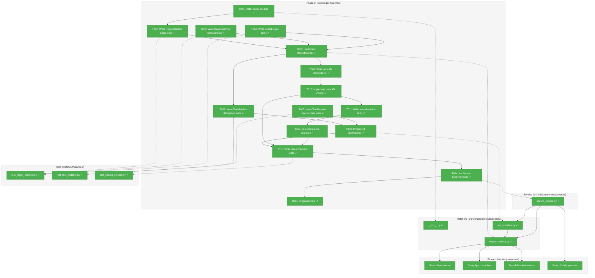
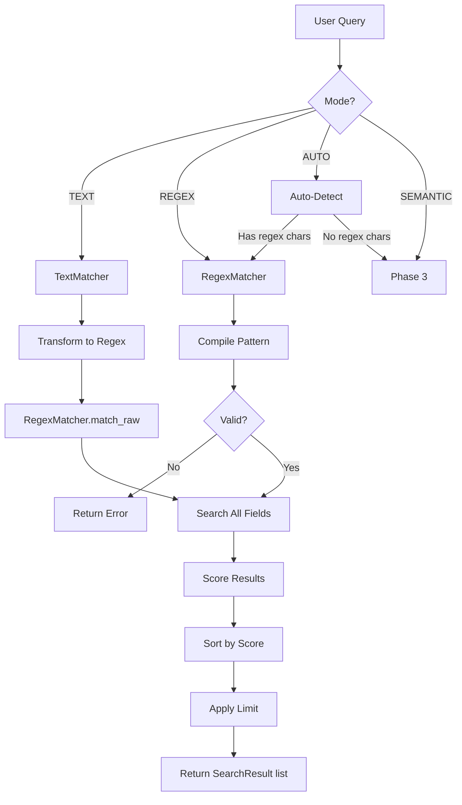
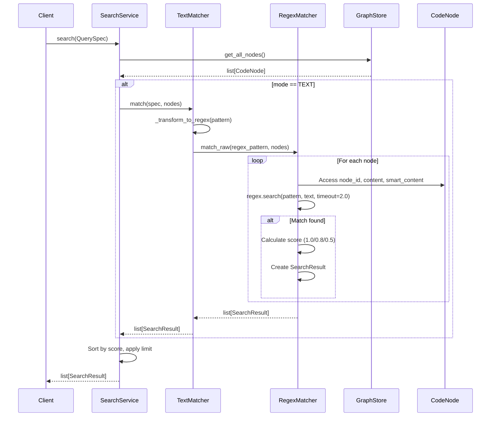

# Phase 2: Text/Regex Matchers – Tasks & Alignment Brief

**Spec**: [../../search-spec.md](../../search-spec.md)
**Plan**: [../../search-plan.md](../../search-plan.md)
**Date**: 2025-12-25

---

## Executive Briefing

### Purpose
This phase implements text and regex search capabilities that allow users to find code by exact string matches or pattern matching. These are the primary search modes for users who know what they're looking for by name or pattern.

### What We're Building
Three core components:
- **RegexMatcher**: Pattern matching with the `regex` module's timeout protection against catastrophic backtracking
- **TextMatcher**: Case-insensitive substring search that delegates to RegexMatcher after escaping special characters (KISS principle from Discovery 03)
- **SearchService**: Orchestration layer that routes queries to appropriate matchers based on mode and implements auto-detection

### User Value
Developers can quickly find code by:
- **Text mode**: Simple substring search like `"config.py"` or `"EmbeddingService"` (case-insensitive)
- **Regex mode**: Pattern matching like `"class.*Service"` or `"def test_.*"` with timeout protection
- **Auto mode**: Automatic detection of intent (regex chars → regex, else → semantic)

Node ID exact matches score 1.0 (highest priority), enabling predictable `fs2 search "EmbeddingService"` results.

### Example
```bash
# Text search (case-insensitive substring)
fs2 search "embedding" --mode text
# → Returns nodes with "embedding" in node_id, content, or smart_content

# Regex search (pattern matching)
fs2 search "class.*Adapter" --mode regex
# → Returns nodes matching the regex pattern

# Auto-detection
fs2 search "^def " --mode auto
# → Detects regex chars (^), uses regex mode
```

---

## Objectives & Scope

### Objective
Implement text and regex search with scoring, timeout protection, and auto-detection as specified in the plan (AC01-AC04, AC08, AC18).

### Goals

- ✅ Install `regex` module dependency for timeout protection
- ✅ Create RegexMatcher with pattern matching and timeout handling
- ✅ Create TextMatcher that delegates to RegexMatcher (KISS)
- ✅ Implement node ID priority scoring (exact=1.0, partial=0.8)
- ✅ Search all text fields: node_id, content, smart_content
- ✅ Implement auto-detection heuristics (regex chars → regex, else → semantic)
- ✅ Create SearchService to orchestrate matchers
- ✅ Integration test with fixture_graph.pkl

### Non-Goals

- ❌ Semantic/embedding search (Phase 3)
- ❌ CLI command implementation (Phase 5)
- ❌ Query embedding fixtures (Phase 4)
- ❌ Documentation (Phase 6)
- ❌ Performance optimization beyond timeout protection
- ❌ Advanced scoring algorithms (current plan: 1.0 exact, 0.8 partial, 0.5 content match)
- ❌ Caching or indexing (using in-memory iteration)

---

## ⚠️ TEMPORARY BEHAVIOR: Auto-Detection Fallback (DYK-P2-01)

> **IMPORTANT: This behavior MUST be updated in Phase 3!**
>
> **Current (Phase 2)**: AUTO mode routes to:
> - Regex chars detected → REGEX mode
> - No regex chars → **TEXT mode** (temporary fallback)
>
> **Target (Phase 3)**: AUTO mode should route to:
> - Regex chars detected → REGEX mode
> - No regex chars → **SEMANTIC mode** (final behavior)
>
> **Why temporary?** Phase 3 (Semantic Matcher) doesn't exist yet. Routing to
> unimplemented SEMANTIC would fail. TEXT provides sensible fallback until then.
>
> **Action Required in Phase 3:**
> 1. Change auto-detection else branch: `TEXT` → `SEMANTIC`
> 2. Update test: `test_auto_fallback_to_text_temporary` → `test_auto_fallback_to_semantic`
> 3. Remove this warning box
>
> **Decision**: DYK session 2025-12-25, Option A selected

---

## Architecture Map

### Component Diagram
<!-- Status: grey=pending, orange=in-progress, green=completed, red=blocked -->
<!-- Updated by plan-6 during implementation -->



### Task-to-Component Mapping

<!-- Status: ⬜ Pending | 🟧 In Progress | ✅ Complete | 🔴 Blocked -->

| Task | Component(s) | Files | Status | Comment |
|------|-------------|-------|--------|---------|
| T001 | Dependency | pyproject.toml | ✅ Complete | Install regex module with `uv add regex` |
| T002 | RegexMatcher Tests | /workspaces/flow_squared/tests/unit/services/test_regex_matcher.py | ✅ Complete | TDD: Basic pattern matching tests |
| T003 | RegexMatcher Tests | /workspaces/flow_squared/tests/unit/services/test_regex_matcher.py | ✅ Complete | TDD: Timeout handling tests |
| T004 | RegexMatcher Tests | /workspaces/flow_squared/tests/unit/services/test_regex_matcher.py | ✅ Complete | TDD: Invalid regex error handling |
| T005 | RegexMatcher | /workspaces/flow_squared/src/fs2/core/services/search/regex_matcher.py | ✅ Complete | Core implementation with regex module |
| T006 | TextMatcher Tests | /workspaces/flow_squared/tests/unit/services/test_text_matcher.py | ✅ Complete | TDD: Delegation to RegexMatcher |
| T007 | TextMatcher Tests | /workspaces/flow_squared/tests/unit/services/test_text_matcher.py | ✅ Complete | TDD: Special character escaping |
| T008 | TextMatcher | /workspaces/flow_squared/src/fs2/core/services/search/text_matcher.py | ✅ Complete | Delegates to RegexMatcher (Discovery 03) |
| T009 | Scoring Tests | /workspaces/flow_squared/tests/unit/services/test_regex_matcher.py | ✅ Complete | TDD: Node ID priority scoring |
| T010 | RegexMatcher | /workspaces/flow_squared/src/fs2/core/services/search/regex_matcher.py | ✅ Complete | Add node ID scoring logic |
| T011 | Auto-detection Tests | /workspaces/flow_squared/tests/unit/services/test_search_service.py | ✅ Complete | TDD: Regex char detection heuristics |
| T012 | SearchService | /workspaces/flow_squared/src/fs2/core/services/search/search_service.py | ✅ Complete | Auto-detection implementation |
| T013 | SearchService Tests | /workspaces/flow_squared/tests/unit/services/test_search_service.py | ✅ Complete | TDD: Mode routing and orchestration |
| T014 | SearchService | /workspaces/flow_squared/src/fs2/core/services/search/search_service.py | ✅ Complete | Full orchestration (Discovery 02 pattern) |
| T015 | Integration | /workspaces/flow_squared/tests/integration/test_search_integration.py | ✅ Complete | End-to-end with fixture_graph.pkl |

---

## Tasks

| Status | ID | Task | CS | Type | Dependencies | Absolute Path(s) | Validation | Subtasks | Notes |
|--------|------|------|-----|------|--------------|------------------|------------|----------|-------|
| [x] | T001 | Install regex module dependency | 1 | Setup | – | /workspaces/flow_squared/pyproject.toml | `uv add regex` succeeds, `import regex` works | – | Prerequisite for Discovery 04 |
| [x] | T002 | Write tests for RegexMatcher basic matching | 2 | Test | T001 | /workspaces/flow_squared/tests/unit/services/test_regex_matcher.py | Tests cover: simple patterns, field matching, case sensitivity | – | TDD first |
| [x] | T003 | Write tests for RegexMatcher timeout handling | 2 | Test | T001 | /workspaces/flow_squared/tests/unit/services/test_regex_matcher.py | Tests verify graceful timeout on ReDoS patterns | – | Per Discovery 04 |
| [x] | T004 | Write tests for invalid regex error handling | 1 | Test | T001 | /workspaces/flow_squared/tests/unit/services/test_regex_matcher.py | Tests verify clear error message for invalid patterns | – | AC03 error handling |
| [x] | T005 | Implement RegexMatcher to pass tests | 3 | Core | T002, T003, T004 | /workspaces/flow_squared/src/fs2/core/services/search/regex_matcher.py, /workspaces/flow_squared/src/fs2/core/services/search/__init__.py | All tests from T002-T004 pass | – | Compile once (DYK-P2-06), timeout per search, DYK-P2-02 line extraction |
| [x] | T006 | Write tests for TextMatcher delegation to RegexMatcher | 2 | Test | T005 | /workspaces/flow_squared/tests/unit/services/test_text_matcher.py | Tests verify text pattern transforms to regex | – | TDD |
| [x] | T007 | Write tests for TextMatcher special character escaping | 2 | Test | T005 | /workspaces/flow_squared/tests/unit/services/test_text_matcher.py | Tests: "file.py" matches literal dot, not any char | – | Discovery 03, R1-09 |
| [x] | T008 | Implement TextMatcher to pass tests | 2 | Core | T006, T007 | /workspaces/flow_squared/src/fs2/core/services/search/text_matcher.py | All tests from T006-T007 pass | – | Delegates per Discovery 03 |
| [x] | T009 | Write tests for node ID scoring priority | 2 | Test | T005 | /workspaces/flow_squared/tests/unit/services/test_regex_matcher.py | Tests verify: exact=1.0, partial=0.8, content=smart_content=0.5, highest wins | – | AC02, DYK-P2-03 |
| [x] | T010 | Implement node ID scoring in RegexMatcher | 2 | Core | T009 | /workspaces/flow_squared/src/fs2/core/services/search/regex_matcher.py | Tests from T009 pass | – | Score hierarchy, DYK-P2-03 |
| [x] | T011 | Write tests for auto-detection heuristics | 2 | Test | T010 | /workspaces/flow_squared/tests/unit/services/test_search_service.py | Regex chars → REGEX mode, else → TEXT (temporary) | – | AC18, DYK-P2-01 |
| [x] | T012 | Implement auto-detection in SearchService | 2 | Core | T011 | /workspaces/flow_squared/src/fs2/core/services/search/search_service.py | Tests from T011 pass | – | Mode routing, DYK-P2-01 |
| [x] | T013 | Write tests for SearchService orchestration | 2 | Test | T008, T010, T012 | /workspaces/flow_squared/tests/unit/services/test_search_service.py | Tests verify mode routing, limit enforcement | – | TDD |
| [x] | T014 | Implement SearchService orchestration | 3 | Core | T013 | /workspaces/flow_squared/src/fs2/core/services/search/search_service.py | All tests from T013 pass, follows Discovery 02 pattern | – | Per Discovery 02 |
| [x] | T015 | Integration test with fixture_graph.pkl | 2 | Integration | T014 | /workspaces/flow_squared/tests/integration/test_search_integration.py | Text/regex search on real nodes returns expected results | – | End-to-end validation |

---

## Alignment Brief

### Prior Phases Review

#### Cross-Phase Summary

**Phase 0 (Chunk Offset Tracking) → Phase 1 (Core Models) → Phase 2 (Text/Regex Matchers)**

The search capability builds incrementally:
1. **Phase 0** laid infrastructure for semantic search (chunk line offsets)
2. **Phase 1** defined the data contracts (QuerySpec, SearchResult, etc.)
3. **Phase 2** implements the first search modes (text, regex)

#### Phase 0: Chunk Offset Tracking (Complete)

**A. Deliverables Created:**
- Extended ChunkItem with `start_line`/`end_line` optional fields
- Added `embedding_chunk_offsets` field to CodeNode
- Updated `_chunk_by_tokens()` to return `list[tuple[str, int, int]]`
- CLI infrastructure: `--graph-file`, `--scan-path` parameters
- Regenerated fixture_graph.pkl with 451 nodes (28 multi-chunk)

**B. Key Lessons:**
- CLI-first infrastructure > custom scripts (retired generate_fixture_graph.py)
- Optional fields with None defaults maintain backward compatibility
- Tuple return types preserve metadata through transformation pipelines

**C. Technical Discoveries (DYK):**
- DYK-01: Script bypass led to Subtask 001 (CLI params)
- DYK-02: `_chunk_by_tokens()` needed return type change for line tracking
- DYK-03: Overlap lines appear in multiple chunks (honest representation)
- DYK-04: Long line character splits all report same line number
- DYK-05: Smart content has no per-chunk offsets (use node's full range)

**D. Dependencies Exported:**
- `ChunkItem.start_line`/`end_line` (for Phase 3 line range reporting)
- `CodeNode.embedding_chunk_offsets` (for Phase 3 max detail mode)
- fixture_graph.pkl with chunk offsets (for integration tests)

**E. Test Infrastructure:**
- 59 new tests (9 ChunkItem, 6 chunking, 9 CodeNode, 3 integration)
- Validation script for fixture verification

**F. Key Log References:**
- [execution.log.md T006](../phase-0-chunk-offset-tracking/execution.log.md#task-t006) - Return type change
- [Subtask 001](../phase-0-chunk-offset-tracking/001-subtask-add-cli-graph-file-and-scan-path-params.md) - CLI infrastructure

---

#### Phase 1: Core Models (Complete)

**A. Deliverables Created:**
- `/workspaces/flow_squared/src/fs2/core/models/search/search_mode.py` - SearchMode enum
- `/workspaces/flow_squared/src/fs2/core/models/search/query_spec.py` - QuerySpec frozen dataclass
- `/workspaces/flow_squared/src/fs2/core/models/search/search_result.py` - SearchResult with to_dict(detail)
- `/workspaces/flow_squared/src/fs2/core/models/search/chunk_match.py` - ChunkMatch + EmbeddingField
- `/workspaces/flow_squared/src/fs2/config/objects.py` - SearchConfig added

**B. Key Lessons:**
- Pre-implementation DYK sessions resolved 5 ambiguities before coding
- TDD discipline caught validation edge cases early
- Frozen dataclass pattern from CodeNode scales well

**C. Technical Discoveries (DYK-01 through DYK-05):**
- DYK-01: Always include all 13 fields in max mode; null for mode-irrelevant
- DYK-02: Consolidated 13-field reference table created
- DYK-03: EmbeddingField enum for type-safe field identification
- DYK-04: Semantic match lines require chunk offsets (Phase 3)
- DYK-05: min_similarity is semantic-only (document, don't validate)

**D. Dependencies Exported for Phase 2:**
```python
from fs2.core.models.search import SearchMode, QuerySpec, SearchResult
from fs2.config.objects import SearchConfig

# Matcher signature
def match(spec: QuerySpec, nodes: list[CodeNode]) -> list[SearchResult]

# SearchConfig defaults
SearchConfig.default_limit = 20
SearchConfig.regex_timeout = 2.0  # For regex module timeout
```

**E. Test Infrastructure:**
- 69 tests (18 QuerySpec, 19 SearchResult, 16 ChunkMatch, 16 SearchConfig)
- All tests have Purpose/Quality/Acceptance docstrings
- No mocks needed - pure dataclass unit tests

**F. Key Log References:**
- [execution.log.md T001](../phase-1-core-models/execution.log.md#task-t001-write-comprehensive-tests-for-queryspec) - QuerySpec TDD
- [execution.log.md T005](../phase-1-core-models/execution.log.md#task-t005-implement-searchresult-to-pass-tests) - SearchResult to_dict()

---

### Critical Findings Affecting This Phase

#### Discovery 02: Service Pattern Precedent
**Impact**: High
**What it constrains**: SearchService must follow established Clean Architecture patterns.

**Pattern from existing services:**
```python
class SearchService:
    def __init__(
        self,
        config: ConfigurationService,
        graph_store: GraphStore,
        embedding_adapter: EmbeddingAdapter | None = None,
    ) -> None:
        self._config = config.require(SearchConfig)
        self._graph_store = graph_store
        self._embedding_adapter = embedding_adapter
```

**Addressed by**: T014 (SearchService implementation)

---

#### Discovery 03: Text Mode Delegation (KISS)
**Impact**: High
**What it constrains**: TextMatcher delegates to RegexMatcher; avoid double escaping.

**Pattern:**
```python
class TextMatcher:
    def _transform_to_regex(self, pattern: str) -> str:
        escaped = re.escape(pattern)  # Escape special chars ONCE
        return f"(?i){escaped}"  # Case-insensitive prefix

    def match(self, spec: QuerySpec, nodes: list[CodeNode]) -> list[SearchResult]:
        regex_pattern = self._transform_to_regex(spec.pattern)
        return self._regex_matcher.match_raw(regex_pattern, nodes)
```

**Addressed by**: T006, T007, T008 (TextMatcher implementation)

---

#### Discovery 04: Regex Timeout Protection
**Impact**: High
**What it constrains**: Must use `regex` module (not `re`) with timeout parameter.

**Pattern (compile once, search many):**
```python
import regex  # NOT import re

class RegexMatcher:
    def match(self, spec: QuerySpec, nodes: list[CodeNode]) -> list[SearchResult]:
        # Compile pattern ONCE before iterating nodes
        flags = regex.IGNORECASE if not spec.case_sensitive else 0
        try:
            compiled = regex.compile(spec.pattern, flags)
        except regex.error as e:
            raise SearchError(f"Invalid regex pattern: {e}")

        results = []
        for node in nodes:
            # Use compiled pattern with timeout for each field
            match = self._search_field(compiled, node.content)
            if match:
                results.append(self._build_result(node, match))
        return results

    def _search_field(self, compiled: regex.Pattern, text: str) -> regex.Match | None:
        """Search with timeout protection."""
        if not text:
            return None
        try:
            return compiled.search(text, timeout=self._timeout)
        except TimeoutError:
            return None  # Graceful degradation
```

**Why compile once?** Flowspace research (2025-12-25) showed that compiling the pattern once before iterating nodes is standard practice. Avoids re-parsing the regex for each of 451+ nodes.

**Addressed by**: T001 (install), T003 (tests), T005 (implementation)

---

#### DYK-P2-02: Absolute File-Level Line Extraction
**Impact**: Medium
**What it constrains**: `match_start_line`/`match_end_line` must be absolute file lines, not relative to node.

**Pattern (for RegexMatcher):**
```python
def _extract_match_lines(
    self, node: CodeNode, match: regex.Match
) -> tuple[int, int]:
    """Convert character offsets to absolute file line numbers.

    Args:
        node: The CodeNode being searched (has start_line from TreeSitter)
        match: The regex Match object with start()/end() char offsets

    Returns:
        (match_start_line, match_end_line) as absolute file line numbers
    """
    content = node.content or ""

    # Count newlines BEFORE match start
    lines_before_start = content[:match.start()].count('\n')
    match_start_line = node.start_line + lines_before_start

    # Count newlines BEFORE match end
    lines_before_end = content[:match.end()].count('\n')
    match_end_line = node.start_line + lines_before_end

    return match_start_line, match_end_line
```

**Why absolute?** Users expect `sed -n '142p' file.py` to show the exact matched line.

**Special case (DYK-P2-04):** For smart_content matches, use node's full range since AI summaries don't map to specific file lines:
```python
if match_field == "smart_content":
    # AI summary doesn't map to file lines - use node's range
    return node.start_line, node.end_line
else:
    # node_id or content - extract precise line from match position
    return self._extract_match_lines(node, match)
```

**Addressed by**: T002 (tests), T005 (implementation)

---

#### DYK-P2-05: Snippet Extraction
**Impact**: Low
**What it constrains**: `snippet` field contains the full line where match starts.

**Pattern:**
```python
def _extract_snippet(self, content: str, match: regex.Match) -> str:
    """Extract the full line containing the match start position."""
    lines = content.split('\n')
    line_index = content[:match.start()].count('\n')
    return lines[line_index] if line_index < len(lines) else ""
```

For node_id matches, use the node_id itself as the snippet.
For smart_content matches, extract line from smart_content text.

**Addressed by**: T005 (implementation)

---

#### Discovery 07: GraphStore Integration Ready
**Impact**: Medium
**What it constrains**: SearchService receives GraphStore via DI for node access.

**Pattern:**
```python
def search(self, spec: QuerySpec) -> list[SearchResult]:
    nodes = self._graph_store.get_all_nodes()
    # ... matching logic ...
```

**Addressed by**: T014 (SearchService), T015 (integration test)

---

### ADR Decision Constraints

N/A - No ADRs affect this phase.

---

### Invariants & Guardrails

| Constraint | Value | Enforced By |
|------------|-------|-------------|
| Regex timeout | 2.0s (from SearchConfig.regex_timeout) | RegexMatcher |
| Result limit | 20 (from QuerySpec.limit or SearchConfig.default_limit) | SearchService |
| Mode exclusivity | One mode per search | SearchService routing |
| Score range | 0.0 - 1.0 | SearchResult validation |

---

### Inputs to Read

**Phase 1 Models (consume):**
- `/workspaces/flow_squared/src/fs2/core/models/search/search_mode.py`
- `/workspaces/flow_squared/src/fs2/core/models/search/query_spec.py`
- `/workspaces/flow_squared/src/fs2/core/models/search/search_result.py`
- `/workspaces/flow_squared/src/fs2/config/objects.py` (SearchConfig)

**Existing Service Patterns (reference):**
- `/workspaces/flow_squared/src/fs2/core/services/embedding/embedding_service.py`
- `/workspaces/flow_squared/src/fs2/core/services/sample_service.py`

**Fixture Graph (integration tests):**
- `/workspaces/flow_squared/tests/fixtures/fixture_graph.pkl`

---

### Visual Alignment Aids

#### Flow Diagram: Search Request Processing



#### Sequence Diagram: Text Search Execution



---

### Test Plan (TDD)

#### RegexMatcher Tests (`test_regex_matcher.py`)

| Test Name | Purpose | Fixture | Expected Output |
|-----------|---------|---------|-----------------|
| `test_simple_pattern_matches_node_id` | AC03 basic regex | Node with id `"callable:test.py:func"` | Match found |
| `test_pattern_matches_content` | AC04 field search | Node with content containing pattern | Match in content field |
| `test_pattern_matches_smart_content` | AC04 field search | Node with smart_content | Match in smart_content field |
| `test_case_insensitive_flag_honored` | Regex mode respects flags | Pattern `(?i)test` | Case-insensitive match |
| `test_timeout_returns_empty_not_exception` | Discovery 04 | ReDoS pattern `(a+)+$` | Empty results, no hang |
| `test_invalid_regex_raises_clear_error` | AC03 error handling | Pattern `[invalid` | SearchError with message |
| `test_empty_results_when_no_matches` | Edge case | Non-matching pattern | Empty list |
| `test_match_start_line_is_absolute_file_line` | DYK-P2-02 | Match in method at file line 142 | match_start_line == 142 |
| `test_match_end_line_for_multiline_match` | DYK-P2-02 | Regex spans 3 lines | match_end_line == match_start_line + 2 |
| `test_node_id_exact_match_scores_1_0` | AC02 priority | Exact node_id match | score == 1.0 |
| `test_node_id_partial_match_scores_0_8` | AC02 priority | Partial node_id match | score == 0.8 |
| `test_content_only_match_scores_0_5` | AC02 priority | Match only in content | score == 0.5 |
| `test_smart_content_match_scores_0_5` | DYK-P2-03 | Match only in smart_content | score == 0.5 |
| `test_multi_field_match_uses_highest_score` | DYK-P2-03 | Match in node_id AND content | score == 1.0 (highest wins) |
| `test_match_field_reports_highest_scoring_field` | DYK-P2-03 | Match in content AND smart_content | match_field == "content" (first among equals) |
| `test_smart_content_match_uses_node_full_range` | DYK-P2-04 | Match only in smart_content | match_start_line == node.start_line, match_end_line == node.end_line |
| `test_none_content_handled_gracefully` | DYK-P2-04 | Node with content=None | No crash, searches smart_content only |
| `test_snippet_contains_full_matched_line` | DYK-P2-05 | Match at line 5 of 10-line content | snippet == full line 5 text |
| `test_snippet_multiline_match_shows_first_line` | DYK-P2-05 | Regex matches 3 lines | snippet == first matched line only |

#### TextMatcher Tests (`test_text_matcher.py`)

| Test Name | Purpose | Fixture | Expected Output |
|-----------|---------|---------|-----------------|
| `test_case_insensitive_substring` | AC01 | Pattern `"test"`, node has `"TestClass"` | Match found |
| `test_dot_in_pattern_is_literal` | Discovery 03 | Pattern `"file.py"` | Matches `file.py`, not `fileXpy` |
| `test_asterisk_in_pattern_is_literal` | Discovery 03 | Pattern `"func*"` | Literal asterisk |
| `test_delegates_to_regex_matcher` | KISS design | Any pattern | RegexMatcher.match_raw called |
| `test_transforms_pattern_once_no_double_escape` | Discovery 03 | Pattern `"\\.py"` | Correct escaping |

#### SearchService Tests (`test_search_service.py`)

| Test Name | Purpose | Fixture | Expected Output |
|-----------|---------|---------|-----------------|
| `test_routes_text_mode_to_text_matcher` | Orchestration | mode=TEXT | TextMatcher used |
| `test_routes_regex_mode_to_regex_matcher` | Orchestration | mode=REGEX | RegexMatcher used |
| `test_auto_detects_regex_chars` | AC18 | Pattern with `^`, `$`, `.*` | REGEX mode selected |
| `test_auto_fallback_to_text_temporary` | AC18, DYK-P2-01 | Pattern without regex chars | TEXT mode (temporary until Phase 3) |
| `test_applies_limit_from_spec` | Limit enforcement | limit=5 | Max 5 results |
| `test_sorts_by_score_descending` | Result ordering | Multiple matches | Highest score first |
| `test_requires_graph_store` | DI validation | No GraphStore | Error raised |

---

### Step-by-Step Implementation Outline

| Step | Task ID | Action | Validation |
|------|---------|--------|------------|
| 1 | T001 | `uv add regex` | `import regex` succeeds |
| 2 | T002 | Create test_regex_matcher.py with basic tests | Tests fail (RED) |
| 3 | T003 | Add timeout tests to test_regex_matcher.py | Tests fail (RED) |
| 4 | T004 | Add invalid regex tests | Tests fail (RED) |
| 5 | T005 | Implement RegexMatcher | T002-T004 tests pass (GREEN) |
| 6 | T006 | Create test_text_matcher.py with delegation tests | Tests fail (RED) |
| 7 | T007 | Add special char tests | Tests fail (RED) |
| 8 | T008 | Implement TextMatcher | T006-T007 tests pass (GREEN) |
| 9 | T009 | Add scoring tests to test_regex_matcher.py | Tests fail (RED) |
| 10 | T010 | Implement scoring in RegexMatcher | T009 tests pass (GREEN) |
| 11 | T011 | Create test_search_service.py with auto-detection tests | Tests fail (RED) |
| 12 | T012 | Implement auto-detection | T011 tests pass (GREEN) |
| 13 | T013 | Add orchestration tests | Tests fail (RED) |
| 14 | T014 | Implement SearchService | T013 tests pass (GREEN) |
| 15 | T015 | Create integration test | End-to-end validation |

---

### Commands to Run

```bash
# Step 1: Install dependency
uv add regex

# Run single test file during development
UV_CACHE_DIR=.uv_cache uv run pytest tests/unit/services/test_regex_matcher.py -v

# Run all Phase 2 tests
UV_CACHE_DIR=.uv_cache uv run pytest tests/unit/services/test_regex_matcher.py tests/unit/services/test_text_matcher.py tests/unit/services/test_search_service.py -v

# Run integration test
UV_CACHE_DIR=.uv_cache uv run pytest tests/integration/test_search_integration.py -v

# Type checking
UV_CACHE_DIR=.uv_cache uv run python -m mypy src/fs2/core/services/search/

# Linting
UV_CACHE_DIR=.uv_cache uv run ruff check src/fs2/core/services/search/

# Full test suite (ensure no regressions)
UV_CACHE_DIR=.uv_cache uv run pytest tests/unit/ -v
```

---

### Risks & Unknowns

| Risk | Severity | Likelihood | Mitigation |
|------|----------|------------|------------|
| Double escaping in TextMatcher delegation | Medium | Medium | T007 tests verify "file.py" literal match |
| regex module API differences from re | Low | Low | T003 tests timeout behavior explicitly |
| Scoring algorithm edge cases | Low | Medium | T009 tests all score tiers |
| GraphStore interface mismatch | Low | Low | T015 integration test catches issues |
| Performance on large graphs | Low | Low | Defer optimization (non-goal) |

---

### Ready Check

- [x] Phase 0 review complete - chunk offsets available
- [x] Phase 1 review complete - SearchMode, QuerySpec, SearchResult, SearchConfig available
- [x] Critical findings mapped (Discovery 02, 03, 04, 07)
- [x] ADR constraints mapped - N/A (no ADRs exist)
- [x] Test plan defined with TDD coverage
- [x] File paths are absolute
- [x] Commands are copy-paste ready
- [ ] **Await GO/NO-GO from user**

---

## Phase Footnote Stubs

| ID | Phase | Tasks | Summary | Files Changed |
|----|-------|-------|---------|---------------|
| | | | | |

_Populated by plan-6a during/after implementation._

---

## Evidence Artifacts

Implementation evidence will be written to:
- **Execution Log**: `docs/plans/010-search/tasks/phase-2-textregex-matchers/execution.log.md`
- **Test Results**: Captured in execution log

---

## Discoveries & Learnings

_Populated during implementation by plan-6. Log anything of interest to your future self._

| Date | Task | Type | Discovery | Resolution | References |
|------|------|------|-----------|------------|------------|
| 2025-12-25 | T011, T012 | decision | DYK-P2-01: AUTO mode routes to unimplemented SEMANTIC in Phase 2 | Temporarily route to TEXT mode until Phase 3 implements SemanticMatcher. Must update in Phase 3. | /didyouknow session |
| 2025-12-25 | T002, T005 | insight | DYK-P2-02: match_start_line/match_end_line must be absolute file-level line numbers | Extract line numbers using `node.start_line + content[:match.start()].count('\n')`. Enables `sed -n 'Np'` accuracy. | /didyouknow session |
| 2025-12-25 | T009, T010 | decision | DYK-P2-03: Multi-field match scoring uses "highest wins" strategy | If pattern matches multiple fields, use highest score (node_id=1.0/0.8, content=smart_content=0.5). Report winning field in match_field. No accumulation. | /didyouknow session |
| 2025-12-25 | T005 | decision | DYK-P2-04: smart_content matches use node's full line range | For smart_content matches, set match_start_line=node.start_line, match_end_line=node.end_line. AI summary doesn't map to specific file lines. Consistent with Phase 0 DYK-05. | /didyouknow session |
| 2025-12-25 | T005 | decision | DYK-P2-05: snippet field contains full matched line only | Extract the complete line containing match.start(). For multi-line matches, show first matched line. Simple, predictable, CLI-friendly. | /didyouknow session |
| 2025-12-25 | T005 | research | DYK-P2-06: Pattern compilation optimization from Flowspace | Flowspace uses `re.compile()` once before iterating nodes. Adopted for Phase 2: `compiled = regex.compile(pattern)` then `compiled.search(text, timeout=...)`. Avoids re-parsing regex 451+ times. | FlowSpace MCP research |

**Types**: `gotcha` | `research-needed` | `unexpected-behavior` | `workaround` | `decision` | `debt` | `insight`

**What to log**:
- Things that didn't work as expected
- External research that was required
- Implementation troubles and how they were resolved
- Gotchas and edge cases discovered
- Decisions made during implementation
- Technical debt introduced (and why)
- Insights that future phases should know about

_See also: `execution.log.md` for detailed narrative._

---

## Phase Footnote Stubs

[^7]: Phase 2 T001-T015 - Text/Regex Matchers (63 tests)
  - `file:src/fs2/core/services/search/__init__.py` - Module exports (SearchError, RegexMatcher, TextMatcher, SearchService)
  - `class:src/fs2/core/services/search/exceptions.py:SearchError` - Exception for invalid patterns
  - `class:src/fs2/core/services/search/regex_matcher.py:RegexMatcher` - Pattern matching with `regex` module timeout protection
  - `class:src/fs2/core/services/search/regex_matcher.py:FieldMatch` - Internal dataclass for field match results
  - `class:src/fs2/core/services/search/text_matcher.py:TextMatcher` - Case-insensitive substring via delegation to RegexMatcher
  - `class:src/fs2/core/services/search/search_service.py:SearchService` - Orchestration with auto-detection and mode routing
  - `file:tests/unit/services/test_regex_matcher.py` - 24 tests for RegexMatcher (basic, timeout, error, scoring)
  - `file:tests/unit/services/test_text_matcher.py` - 13 tests for TextMatcher (delegation, escaping)
  - `file:tests/unit/services/test_search_service.py` - 17 tests for SearchService (auto-detection, orchestration)
  - `file:tests/integration/test_search_integration.py` - 9 integration tests with fixture_graph.pkl

---

## Directory Layout

```
docs/plans/010-search/
├── search-spec.md
├── search-plan.md
└── tasks/
    ├── phase-0-chunk-offset-tracking/
    │   ├── tasks.md                    # Complete
    │   └── execution.log.md            # Complete
    ├── phase-1-core-models/
    │   ├── tasks.md                    # Complete
    │   └── execution.log.md            # Complete
    └── phase-2-textregex-matchers/
        ├── tasks.md                    # This file
        └── execution.log.md            # Created by plan-6
```

**Files to Create:**
```
src/fs2/core/services/search/
├── __init__.py         # T001/T005: Module exports
├── regex_matcher.py    # T005, T010: RegexMatcher class
├── text_matcher.py     # T008: TextMatcher class
└── search_service.py   # T012, T014: SearchService class

tests/unit/services/
├── test_regex_matcher.py   # T002-T004, T009: RegexMatcher tests
├── test_text_matcher.py    # T006-T007: TextMatcher tests
└── test_search_service.py  # T011, T013: SearchService tests

tests/integration/
└── test_search_integration.py  # T015: End-to-end test
```

---

**Generated**: 2025-12-25
**Next Step**: Run `/plan-6-implement-phase --phase "Phase 2: Text/Regex Matchers" --plan "/workspaces/flow_squared/docs/plans/010-search/search-plan.md"` after GO

---

## Critical Insights Discussion

**Session**: 2025-12-25
**Context**: Phase 2: Text/Regex Matchers tasks dossier for search capability
**Analyst**: AI Clarity Agent
**Reviewer**: Development Team
**Format**: Water Cooler Conversation (5 Critical Insights)

### Insight 1: Auto-Detection Routes to Unimplemented SEMANTIC Mode

**Did you know**: AUTO mode's else-branch routes to SEMANTIC, but Phase 3 doesn't exist yet, causing undefined behavior for most natural queries.

**Implications**:
- Most searches (simple text like "config", "service") would trigger unimplemented code
- Users trying AUTO before Phase 3 get unpredictable failures
- Common use case broken until Phase 3 ships

**Options Considered**:
- Option A: Temporarily route non-regex to TEXT mode - simple, works immediately
- Option B: Raise clear error for SEMANTIC - explicit but annoying UX
- Option C: Disable AUTO entirely - clean but loses key feature
- Option D: Default AUTO to TEXT with docs - future-proof but confusing

**AI Recommendation**: Option A (Temporarily Route to TEXT)
- Reasoning: Immediate usability, sensible default, minimal complexity, clear upgrade path in Phase 3

**Discussion Summary**: Quick agreement - temporary TEXT fallback is practical.

**Decision**: AUTO mode temporarily falls back to TEXT until Phase 3; must update when SemanticMatcher ships.

**Affects**: T011, T012, Phase 3 dependencies

---

### Insight 2: match_start_line/match_end_line Population Undefined

**Did you know**: SearchResult has line fields for pinpointing WHERE a match occurred, but Phase 2 tasks don't specify how to populate them from regex character offsets.

**Implications**:
- Line extraction algorithm needed: `node.start_line + content[:match.start()].count('\n')`
- Must be absolute file-level lines for `sed -n 'Np'` accuracy
- Need to trace back through parent nodes to file level

**Options Considered**:
- Option A: Add line extraction logic - full functionality
- Option B: Use node's full range - simpler but less precise
- Option C: Set to None - honest but inconsistent
- Option D: First match line only - hybrid approach

**AI Recommendation**: Option A (Full Line Extraction)
- Reasoning: Consistency, user value, low cost, future-proof

**Discussion Summary**: User emphasized lines must be absolute file-level, not method-relative. Agreed.

**Decision**: Extract absolute file-level line numbers; `match_start_line = node.start_line + content[:match.start()].count('\n')`

**Affects**: T002, T005

---

### Insight 3: Multi-Field Match Scoring Strategy

**Did you know**: The scoring hierarchy (node_id 1.0/0.8, content 0.5) doesn't specify what happens when a pattern matches multiple fields, or how smart_content is scored.

**Implications**:
- Need to decide: accumulate scores vs highest wins
- smart_content needs a score assignment
- match_field must report which field won

**Options Considered**:
- Option A: smart_content same as content (0.5) - simple
- Option B: smart_content higher (0.6) - rewards semantic relevance
- Option C: Highest score wins - simple rule
- Option D: Accumulate scores - rewards multiple matches

**AI Recommendation**: Option C (Highest Score Wins)
- Reasoning: KISS principle, predictable, aligns with AC02 "priority" language

**Discussion Summary**: Agreed on simplicity - highest wins, smart_content = content = 0.5

**Decision**: Multi-field matches use highest score; no accumulation; smart_content scores 0.5 same as content

**Affects**: T009, T010

---

### Insight 4: smart_content Matches and None Handling

**Did you know**: `node.content` can be None, and smart_content matches can't use the same line extraction algorithm since AI summaries don't map to file lines.

**Implications**:
- Need graceful handling when content is None
- smart_content matches need different line reporting strategy
- Consistent with Phase 0 DYK-05 (smart_content uses node's full range)

**Options Considered**:
- Option A: Use node's full range for smart_content - honest, consistent with Phase 0
- Option B: Extract lines from smart_content string - consistent algorithm but misleading
- Option C: Set to None - honest but inconsistent output

**AI Recommendation**: Option A (Node's Full Range)
- Reasoning: Honest representation, still useful, consistent with Phase 0 DYK-05

**Discussion Summary**: Quick agreement - aligns with existing Phase 0 decisions.

**Decision**: smart_content matches use (node.start_line, node.end_line); handle content=None gracefully

**Affects**: T005

---

### Insight 5: snippet Field Population

**Did you know**: SearchResult has a required `snippet` field for "relevant context around the match", but tasks don't specify how to generate it.

**Implications**:
- Need to decide: matched text only vs full line vs multi-line context
- Affects CLI display and usability
- Needs to handle multi-line regex matches

**Options Considered**:
- Option A: Full matched line only - simple, predictable
- Option B: Matched text + ±1 line context - rich but verbose
- Option C: Matched text with truncation (max 200 chars) - predictable length
- Option D: Just matched text - simplest but no context

**AI Recommendation**: Option A (Full Matched Line)
- Reasoning: Simple, useful, consistent, CLI-friendly

**Discussion Summary**: Quick agreement - one line is sufficient context.

**Decision**: snippet contains full line where match starts; multi-line matches show first matched line only

**Affects**: T005

---

## Session Summary

**Insights Surfaced**: 5 critical insights identified and discussed
**Decisions Made**: 5 decisions reached through collaborative discussion
**Action Items Created**: 1 follow-up (Phase 3 must update AUTO routing)
**Areas Updated**:
- Task table (T005, T009, T010, T011, T012 notes updated)
- Test plan (12 new tests added)
- Alignment Brief (3 implementation patterns added)
- Discoveries & Learnings table (5 entries)
- Phase 3 dependencies in search-plan.md (DYK-P2-01 reminder)

**Shared Understanding Achieved**: ✓

**Confidence Level**: High - All ambiguities resolved, implementation patterns documented.

**Next Steps**:
Proceed with `/plan-6-implement-phase` - Phase 2 dossier is complete and ready.

**Notes**:
The DYK session surfaced implementation details that weren't obvious from the plan:
- Line extraction algorithm with absolute file offsets
- Scoring strategy for multi-field matches
- Special handling for smart_content and None cases
- Snippet generation approach

All decisions align with existing patterns (Phase 0 DYK-05) and KISS principles.
