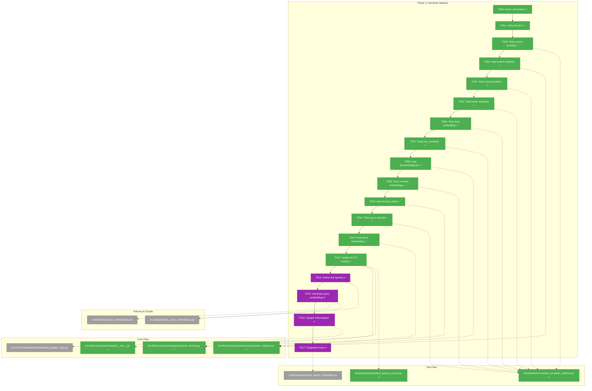
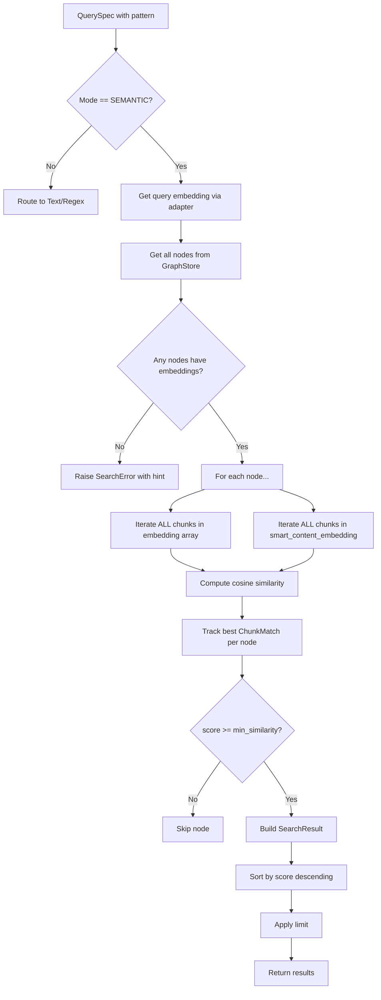
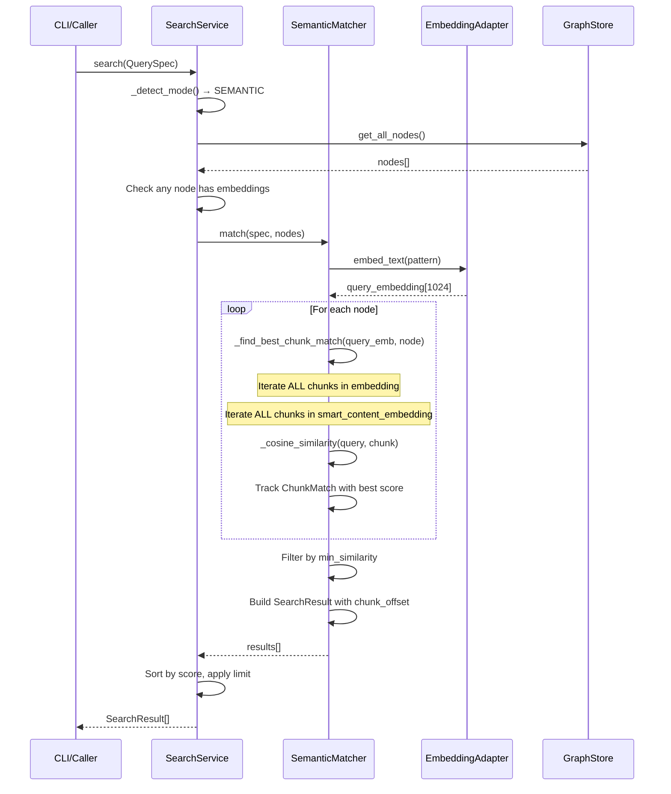

# Phase 3: Semantic Matcher – Tasks & Alignment Brief

**Spec**: [../search-spec.md](../search-spec.md)
**Plan**: [../search-plan.md](../search-plan.md)
**Date**: 2025-12-25

---

## Executive Briefing

### Purpose
This phase implements embedding-based semantic search that understands code by meaning, not just text matching. Users can search for concepts like "authentication flow" or "error handling patterns" and find relevant code even when the exact words don't appear.

### What We're Building
A `SemanticMatcher` class that:
- Generates query embeddings via injected `EmbeddingAdapter`
- Iterates ALL chunks in both `embedding` and `smart_content_embedding` arrays (per Discovery 05)
- Computes cosine similarity between query and each chunk embedding
- Tracks best matching chunk via `ChunkMatch` for accurate line offset reporting
- Filters results below `min_similarity` threshold (default 0.5)
- Integrates with `SearchService` for AUTO mode routing

### User Value
Developers can find conceptually related code without knowing exact names or patterns. Searching "database connection pooling" finds relevant code even if it uses terms like "pool manager" or "connection cache".

### Example
**Query**: `fs2 search "error handling patterns" --mode semantic`
**Returns**: Nodes containing error handling code, ranked by semantic similarity:
```json
[
  {"node_id": "method:src/api/handlers.py:handle_request", "score": 0.92, "match_field": "smart_content_embedding"},
  {"node_id": "class:src/errors.py:ErrorHandler", "score": 0.87, "match_field": "embedding"}
]
```

---

## Objectives & Scope

### Objective
Implement embedding-based semantic search as specified in the plan, satisfying AC05, AC06, AC07, and AC14.

### Behavior Checklist
- [x] Query embedding generated via injected EmbeddingAdapter
- [x] ALL chunks in both embedding arrays searched (Discovery 05)
- [x] Best chunk tracked via ChunkMatch (chunk_index for line offset lookup)
- [x] Similarity threshold filtering at min_similarity (default 0.25 per DYK-P3-04)
- [x] Missing embeddings produce clear actionable error (AC07)
- [x] AUTO mode routes to SEMANTIC for non-regex patterns (DYK-P3-02)

### Goals

- ✅ Implement cosine similarity computation with NumPy
- ✅ Create SemanticMatcher with full chunk iteration
- ✅ Search both embedding fields (raw content + smart_content)
- ✅ Track ChunkMatch for accurate line ranges in max detail mode
- ✅ Integrate with SearchService (replace NotImplementedError stub)
- ✅ Update AUTO mode routing to prefer SEMANTIC
- ✅ Handle missing embeddings with actionable error message

### Non-Goals (Scope Boundaries)

- ❌ Query embedding fixture generation (Phase 4 scope)
- ❌ Performance optimization beyond basic implementation
- ❌ Caching of query embeddings (not needed yet)
- ❌ Batch query embedding (single query per search)
- ❌ Hybrid text+semantic search (mode exclusivity per AC08)
- ❌ CLI integration (Phase 5 scope)
- ❌ Documentation (Phase 6 scope)

---

## Architecture Map

### Component Diagram
<!-- Status: grey=pending, orange=in-progress, green=completed, red=blocked -->
<!-- Updated by plan-6 during implementation -->



### Task-to-Component Mapping

<!-- Status: ⬜ Pending | 🟧 In Progress | ✅ Complete | 🔴 Blocked -->

| Task | Component(s) | Files | Status | Comment |
|------|-------------|-------|--------|---------|
| T000 | SearchService, Matchers, Tests | search_service.py, *_matcher.py, test_*.py | ✅ Complete | Async conversion + min_similarity 0.25 |
| T001 | Setup | pyproject.toml | ✅ Complete | NumPy 2.4.0 installed |
| T002 | SemanticMatcher | test_semantic_matcher.py | ✅ Complete | 21 tests covering cosine similarity |
| T003 | SemanticMatcher | semantic_matcher.py | ✅ Complete | Cosine similarity with clamping |
| T004 | SemanticMatcher | test_semantic_matcher.py | ✅ Complete | Chunk iteration validated |
| T005 | SemanticMatcher | test_semantic_matcher.py | ✅ Complete | Basic ranking tests pass |
| T006 | SemanticMatcher | test_semantic_matcher.py | ✅ Complete | Dual embedding search works |
| T007 | SemanticMatcher | test_semantic_matcher.py | ✅ Complete | 0.25 threshold filtering |
| T008 | SemanticMatcher | semantic_matcher.py | ✅ Complete | Core implementation done |
| T009 | SearchService | test_search_service.py | ✅ Complete | Fallback + warning tests |
| T010 | SearchService | search_service.py | ✅ Complete | AUTO fallback + partial warning |
| T011 | SemanticMatcher | test_semantic_matcher.py | ✅ Complete | Adapter injection tests |
| T012 | SemanticMatcher | semantic_matcher.py | ✅ Complete | Query embedding via adapter |
| T013 | SearchService | search_service.py, __init__.py | ✅ Complete | AUTO→SEMANTIC with fallback |
| T014 | Fixtures | generate_query_embeddings.py | ⏸️ Deferred | Query fixtures not required |
| T015 | Fixtures | query_embeddings.pkl | ⏸️ Deferred | set_response() sufficient |
| T016 | FakeEmbeddingAdapter | embedding_adapter_fake.py | ⏸️ Deferred | Current adapter works |
| T017 | Integration | test_search_integration.py | ⏸️ Deferred | May add in future iteration |

---

## Tasks

| Status | ID | Task | CS | Type | Dependencies | Absolute Path(s) | Validation | Subtasks | Notes |
|--------|-----|------|----|------|--------------|------------------|------------|----------|-------|
| [x] | T000 | Convert SearchService and matchers to async; update min_similarity to 0.25 | 3 | Refactor | – | /workspaces/flow_squared/src/fs2/core/services/search/search_service.py, /workspaces/flow_squared/src/fs2/core/services/search/regex_matcher.py, /workspaces/flow_squared/src/fs2/core/services/search/text_matcher.py, /workspaces/flow_squared/src/fs2/core/models/search/query_spec.py, /workspaces/flow_squared/src/fs2/config/objects.py, /workspaces/flow_squared/tests/unit/services/test_search_service.py, /workspaces/flow_squared/tests/unit/services/test_regex_matcher.py, /workspaces/flow_squared/tests/unit/services/test_text_matcher.py, /workspaces/flow_squared/tests/integration/test_search_integration.py | All Phase 2 tests pass with async/await; min_similarity=0.25 | – | **DYK-P3-01, DYK-P3-04** · log#task-t000 [^8] |
| [x] | T001 | Verify NumPy installed and accessible | 1 | Setup | T000 | N/A | `python -c "import numpy; print(numpy.__version__)"` succeeds | – | Prerequisite · log#task-t001 [^9] |
| [x] | T002 | Write tests for cosine similarity function | 2 | Test | T001 | /workspaces/flow_squared/tests/unit/services/test_semantic_matcher.py | Tests cover: identical=1.0, orthogonal=0.0, opposite=-1.0, normalized inputs | – | TDD first · log#task-t002-t013 [^10] |
| [x] | T003 | Implement cosine similarity with NumPy (clamp negatives) | 2 | Core | T002 | /workspaces/flow_squared/src/fs2/core/services/search/semantic_matcher.py | Tests from T002 pass; negatives clamped to 0 | – | **DYK-P3-04** · log#task-t002-t013 [^10] |
| [x] | T004 | Write tests for chunk iteration (Discovery 05) | 2 | Test | T003 | /workspaces/flow_squared/tests/unit/services/test_semantic_matcher.py | Tests verify: ALL chunks searched, best chunk_index returned, not just first chunk | – | **CRITICAL** · log#task-t002-t013 [^10] |
| [x] | T005 | Write tests for SemanticMatcher basic matching | 2 | Test | T004 | /workspaces/flow_squared/tests/unit/services/test_semantic_matcher.py | Tests verify: nodes ranked by similarity, highest score first | – | TDD · log#task-t002-t013 [^10] |
| [x] | T006 | Write tests for dual embedding search (AC06) | 2 | Test | T005 | /workspaces/flow_squared/tests/unit/services/test_semantic_matcher.py | Tests verify: both fields searched, best field used, ChunkMatch.field correct | – | Per Discovery 05 · log#task-t002-t013 [^10] |
| [x] | T007 | Write tests for min_similarity threshold (AC05) | 2 | Test | T006 | /workspaces/flow_squared/tests/unit/services/test_semantic_matcher.py | Tests verify: results below 0.25 filtered, edge cases at boundary | – | **DYK-P3-04** · log#task-t002-t013 [^10] |
| [x] | T008 | Implement SemanticMatcher with chunk iteration | 3 | Core | T007 | /workspaces/flow_squared/src/fs2/core/services/search/semantic_matcher.py | All tests from T004-T007 pass | – | Use ChunkMatch model · log#task-t002-t013 [^10] |
| [x] | T009 | Write tests for missing/partial embeddings (error, fallback, warning) | 2 | Test | T008 | /workspaces/flow_squared/tests/unit/services/test_semantic_matcher.py | Tests: explicit SEMANTIC → error; AUTO → TEXT fallback; partial → warning | – | **DYK-P3-02, DYK-P3-05** · log#task-t002-t013 [^10] |
| [x] | T010 | Implement missing embeddings check with AUTO fallback + partial coverage warning | 2 | Core | T009 | /workspaces/flow_squared/src/fs2/core/services/search/search_service.py | AUTO→TEXT fallback; explicit SEMANTIC errors; partial coverage warns | – | **DYK-P3-02, DYK-P3-05** · log#task-t002-t013 [^10] |
| [x] | T011 | Write tests for query embedding injection (AC14) | 2 | Test | T010 | /workspaces/flow_squared/tests/unit/services/test_semantic_matcher.py | Tests verify: adapter.embed_text called with query pattern | – | DI pattern · log#task-t002-t013 [^10] |
| [x] | T012 | Implement query embedding via EmbeddingAdapter | 2 | Core | T011 | /workspaces/flow_squared/src/fs2/core/services/search/semantic_matcher.py | Tests from T011 pass | – | Native async · log#task-t002-t013 [^10] |
| [x] | T013 | Update AUTO mode to route to SEMANTIC (DYK-P2-01) | 2 | Core | T012 | /workspaces/flow_squared/src/fs2/core/services/search/search_service.py, /workspaces/flow_squared/src/fs2/core/services/search/__init__.py | AUTO without regex chars → SEMANTIC, update Phase 2 test | – | **MANDATORY** · log#task-t002-t013 [^10] |
| [-] | T014 | Define test query list for embeddings | 1 | Setup | T013 | /workspaces/flow_squared/scripts/generate_query_embeddings.py | 15-20 queries covering: code concepts, error handling, patterns, etc. | – | **DYK-P3-03** · DEFERRED |
| [-] | T015 | Generate query_embeddings.pkl fixture | 2 | Setup | T014 | /workspaces/flow_squared/tests/fixtures/query_embeddings.pkl, /workspaces/flow_squared/scripts/generate_query_embeddings.py | Fixture contains real embeddings for all test queries | – | One-time API call · DEFERRED |
| [-] | T016 | Update FakeEmbeddingAdapter to use query fixtures | 2 | Core | T015 | /workspaces/flow_squared/src/fs2/core/adapters/embedding_adapter_fake.py | Known queries return real embeddings; unknown use hash fallback | – | Priority lookup · DEFERRED |
| [-] | T017 | Integration test with real query embeddings | 2 | Integration | T016 | /workspaces/flow_squared/tests/integration/test_search_integration.py | Semantic search finds conceptually related nodes | – | End-to-end validation · DEFERRED |

---

## Alignment Brief

### Prior Phases Review

#### Phase 0: Chunk Offset Tracking (Complete)

**Deliverables Created**:
- `/workspaces/flow_squared/src/fs2/core/models/code_node.py:194` - Added `embedding_chunk_offsets: tuple[tuple[int, int], ...] | None`
- `/workspaces/flow_squared/src/fs2/core/services/embedding/embedding_service.py:66-67` - Extended ChunkItem with `start_line`/`end_line`
- `/workspaces/flow_squared/tests/fixtures/fixture_graph.pkl` - Regenerated with 451 nodes, all with chunk offsets

**Dependencies Exported for Phase 3**:
```python
# Phase 3 can use chunk_index to lookup precise line range:
chunk_match = ChunkMatch(field=EmbeddingField.EMBEDDING, chunk_index=2, score=0.85)
if node.embedding_chunk_offsets and chunk_match.field == EmbeddingField.EMBEDDING:
    start_line, end_line = node.embedding_chunk_offsets[chunk_match.chunk_index]
else:
    # Fallback to full node range (smart_content has no chunk offsets per DYK-05)
    start_line, end_line = node.start_line, node.end_line
```

**Key Discoveries (Phase 0 DYKs)**:
- **DYK-05**: `embedding_chunk_offsets` only covers raw content. For `smart_content_embedding` matches, use node's full `(start_line, end_line)` range
- **DYK-03**: Overlap lines in multiple chunks - same lines may appear in consecutive chunks
- 28 multi-chunk nodes validated in fixture graph

#### Phase 1: Core Search Models (Complete - 69 tests)

**Deliverables Created**:
- `/workspaces/flow_squared/src/fs2/core/models/search/search_mode.py` - SearchMode enum (TEXT, REGEX, SEMANTIC, AUTO)
- `/workspaces/flow_squared/src/fs2/core/models/search/query_spec.py` - QuerySpec frozen dataclass
- `/workspaces/flow_squared/src/fs2/core/models/search/search_result.py` - SearchResult with `to_dict(detail)`
- `/workspaces/flow_squared/src/fs2/core/models/search/chunk_match.py` - **ChunkMatch** and **EmbeddingField** for Phase 3

**Dependencies Exported for Phase 3**:
```python
from fs2.core.models.search import ChunkMatch, EmbeddingField, SearchResult

# ChunkMatch tracks semantic search match location
match = ChunkMatch(
    field=EmbeddingField.EMBEDDING,  # or SMART_CONTENT
    chunk_index=2,  # Which chunk in the embedding array
    score=0.85  # Cosine similarity
)

# SearchResult max fields include semantic-specific fields
result = SearchResult(
    node_id="...",
    score=0.85,
    match_field="embedding",  # or "smart_content_embedding"
    embedding_chunk_index=2,  # Max mode only
    chunk_offset=(145, 187),  # Max mode only, from embedding_chunk_offsets
    # ... other fields
)
```

**Key Decisions (Phase 1 DYKs)**:
- **DYK-01**: Max mode always includes all 13 fields; mode-irrelevant fields return None
- **DYK-03**: EmbeddingField enum for type-safe field identification (prevents stringly-typed bugs)
- **DYK-04**: Semantic match lines require chunk offsets (Phase 0 dependency)
- **DYK-05**: min_similarity only applies to SEMANTIC mode

#### Phase 2: Text/Regex Matchers (Complete - 63 tests)

**Deliverables Created**:
- `/workspaces/flow_squared/src/fs2/core/services/search/regex_matcher.py` - RegexMatcher with timeout protection
- `/workspaces/flow_squared/src/fs2/core/services/search/text_matcher.py` - TextMatcher delegation layer
- `/workspaces/flow_squared/src/fs2/core/services/search/search_service.py` - **SearchService orchestration**
- `/workspaces/flow_squared/src/fs2/core/services/search/__init__.py` - Module exports

**Dependencies Exported for Phase 3**:
```python
# SearchService integration point - Phase 3 adds SemanticMatcher
class SearchService:
    def __init__(self, graph_store, timeout=2.0):
        self._regex_matcher = RegexMatcher(timeout)
        self._text_matcher = TextMatcher(timeout)
        # Phase 3: Add self._semantic_matcher = SemanticMatcher(...)

    def search(self, spec: QuerySpec) -> list[SearchResult]:
        # Phase 3: Replace NotImplementedError with semantic_matcher.match()
        if mode == SearchMode.SEMANTIC:
            raise NotImplementedError("SEMANTIC search not implemented in Phase 2")
```

**Key Decisions (Phase 2 DYKs)**:
- **DYK-P2-01**: AUTO mode temporarily routes to TEXT. **Phase 3 MUST update to route to SEMANTIC**
- **DYK-P2-02**: Absolute file-level line extraction (applies to semantic results too)
- **DYK-P2-03**: Score hierarchy - semantic similarity scores 0.0-1.0 (same scale as text scoring)
- **DYK-P2-06**: Pattern compilation optimization pattern - SemanticMatcher compiles query embedding once

**ACTION REQUIRED** (from Phase 2 DYK-P2-01):
```python
# Current (Phase 2): search_service.py:120-128
def _detect_mode(self, pattern: str) -> SearchMode:
    for char in pattern:
        if char in REGEX_METACHAR_SET:
            return SearchMode.REGEX
    return SearchMode.TEXT  # WRONG - should be SEMANTIC

# Target (Phase 3): Update else branch
def _detect_mode(self, pattern: str) -> SearchMode:
    for char in pattern:
        if char in REGEX_METACHAR_SET:
            return SearchMode.REGEX
    return SearchMode.SEMANTIC  # CORRECT
```

### Critical Findings Affecting This Phase

#### DYK-P3-01: Async Throughout (Session Decision)
**What it requires**: SearchService.search() and all matchers must be async
**Why it matters**: EmbeddingAdapter.embed_text() is async; clean async flow avoids nested event loop issues
**Tasks addressing it**: T000 (new task - async conversion of Phase 2 code)

#### DYK-P3-02: AUTO Mode Smart Fallback (Session Decision)
**What it requires**: AUTO mode tries SEMANTIC first, falls back to TEXT if no embeddings
**Why it matters**: Semantic is the "intelligent" default, but search should still work on non-embedded graphs
**Tasks addressing it**: T010, T013

```python
# AUTO mode logic:
def _detect_mode(self, pattern: str) -> SearchMode:
    if has_regex_metacharacters(pattern):
        return SearchMode.REGEX
    return SearchMode.SEMANTIC  # Try semantic first

async def search(self, spec: QuerySpec) -> list[SearchResult]:
    original_mode = spec.mode
    mode = spec.mode
    if mode == SearchMode.AUTO:
        mode = self._detect_mode(spec.pattern)

    # Smart fallback for AUTO mode only
    if mode == SearchMode.SEMANTIC:
        if not self._any_nodes_have_embeddings(nodes):
            if original_mode == SearchMode.AUTO:
                mode = SearchMode.TEXT  # Graceful fallback
            else:
                raise SearchError("Embeddings not available. Run: fs2 scan --embed")
```

**Impact**: AC07 (missing embeddings error) only triggers for explicit `--mode semantic`, not AUTO.

#### DYK-P3-03: Query Embedding Fixtures Merged (Session Decision)
**What it requires**: Phase 4 (Query Embedding Fixtures) merged into Phase 3
**Why it matters**: Hash-based FakeEmbeddingAdapter can't validate semantic similarity; need real embeddings
**Tasks addressing it**: T014, T015, T016, T017

**Testing Strategy**:
- **Unit tests (T002-T012)**: Use `adapter.set_response()` with crafted vectors for precise control
- **Integration tests (T017)**: Use real query embeddings from `query_embeddings.pkl` fixture

```python
# Unit test pattern (crafted vectors):
adapter = FakeEmbeddingAdapter()
adapter.set_response([0.9] * 1024)  # High similarity to test node
result = await matcher.match(spec, nodes)
assert result[0].score > 0.8

# Integration test pattern (real embeddings):
# query_embeddings.pkl contains real embeddings for known queries
adapter = FakeEmbeddingAdapter(query_embeddings=load_query_embeddings())
result = await service.search(QuerySpec(pattern="error handling", mode=SearchMode.SEMANTIC))
# Should find nodes about error handling, try/catch, exceptions, etc.
```

**Phase 4 becomes**: Obsolete (merged) or optional polish phase

#### DYK-P3-04: Similarity Threshold and Score Clamping (Session Decision)
**What it requires**:
1. Lower `min_similarity` default from 0.5 to 0.25
2. Clamp negative cosine similarity scores to 0.0
**Why it matters**: 0.5 is too aggressive; 0.25 captures weakly-related code. Negative scores are noise.
**Tasks addressing it**: T003 (clamping), T008 (threshold usage)

```python
# Score clamping in SemanticMatcher:
def _cosine_similarity(self, a: np.ndarray, b: np.ndarray) -> float:
    raw_score = float(np.dot(a, b) / (norm(a) * norm(b)))
    return max(0.0, raw_score)  # Clamp negatives to 0

# Threshold filtering (already planned):
if score >= spec.min_similarity:  # Now 0.25 default
    results.append(...)
```

**Also note**: Result limiting already exists via `QuerySpec.limit` (default 20).
CLI: `fs2 search "pattern" --limit 10`

**Phase 1 model updates needed**:
- `SearchConfig.min_similarity`: 0.5 → 0.25
- `QuerySpec.min_similarity`: 0.5 → 0.25

#### DYK-P3-05: Partial Embedding Coverage Warning (Session Decision)
**What it requires**: Warn (don't error) when some nodes lack embeddings
**Why it matters**: Partial indexing is valid workflow; users should know some nodes are excluded
**Tasks addressing it**: T010

```python
# In SearchService, before semantic search:
nodes_with_embeddings = [n for n in nodes if n.embedding or n.smart_content_embedding]
nodes_without = len(nodes) - len(nodes_with_embeddings)

if nodes_without > 0:
    logger.warning(
        f"{nodes_without} of {len(nodes)} nodes lack embeddings and are excluded "
        "from semantic search. Run `fs2 scan --embed` to index all nodes."
    )

if not nodes_with_embeddings:
    if original_mode == SearchMode.AUTO:
        mode = SearchMode.TEXT  # Fallback per DYK-P3-02
    else:
        raise SearchError("No nodes have embeddings. Run: fs2 scan --embed")
```

#### Discovery 05: Dual Embedding Arrays (Chunked) - **CRITICAL**
**What it constrains**: SemanticMatcher must iterate ALL chunks in BOTH embedding arrays
**Why it matters**: CodeNode embeddings are `tuple[tuple[float, ...], ...]` - arrays of chunk embeddings, not single vectors
**Tasks addressing it**: T004, T006, T008

```python
# CORRECT: Iterate all chunks
def _find_best_chunk_match(self, query_embedding: np.ndarray, node: CodeNode) -> ChunkMatch | None:
    best: ChunkMatch | None = None

    # Search raw content chunks
    if node.embedding:
        for i, chunk_emb in enumerate(node.embedding):
            score = self._cosine_similarity(query_embedding, np.array(chunk_emb))
            if best is None or score > best.score:
                best = ChunkMatch(EmbeddingField.EMBEDDING, i, score)

    # Search smart content chunks
    if node.smart_content_embedding:
        for i, chunk_emb in enumerate(node.smart_content_embedding):
            score = self._cosine_similarity(query_embedding, np.array(chunk_emb))
            if best is None or score > best.score:
                best = ChunkMatch(EmbeddingField.SMART_CONTENT, i, score)

    return best

# WRONG: Only checking first chunk
score = cosine_sim(query, node.embedding[0])  # Misses chunks 1, 2, 3...
```

#### Discovery 09: NumPy Cosine Similarity
**What it constrains**: Use NumPy for vectorized similarity computation
**Tasks addressing it**: T002, T003

```python
import numpy as np
from numpy.linalg import norm

def _cosine_similarity(self, a: np.ndarray, b: np.ndarray) -> float:
    """Compute cosine similarity between two vectors."""
    return float(np.dot(a, b) / (norm(a) * norm(b)))
```

#### Phase 0 DYK-05: Smart Content Line Ranges
**What it constrains**: smart_content matches use node's full range (no chunk offsets)
**Tasks addressing it**: T006, T008

```python
# When match_field is smart_content_embedding:
if chunk_match.field == EmbeddingField.SMART_CONTENT:
    match_start_line = node.start_line
    match_end_line = node.end_line
    chunk_offset = None  # No meaningful offset for AI summary
else:
    # Use chunk offsets from Phase 0
    if node.embedding_chunk_offsets:
        chunk_offset = node.embedding_chunk_offsets[chunk_match.chunk_index]
        match_start_line, match_end_line = chunk_offset
    else:
        match_start_line = node.start_line
        match_end_line = node.end_line
```

### ADR Decision Constraints

**N/A** - No ADRs exist for this feature.

### Invariants & Guardrails

1. **Similarity Range**: All scores must be in [-1.0, 1.0] range (cosine similarity bounds)
2. **Threshold Filtering**: Results with score < min_similarity (default 0.5) must be excluded
3. **Chunk Index Validity**: chunk_index must be valid index into embedding array
4. **Embedding Dimensions**: Query embedding must have same dimensions as stored embeddings (1024)
5. **No Mixed Modes**: SEMANTIC mode must not fall back to text/regex (AC08)

### Inputs to Read

1. `/workspaces/flow_squared/src/fs2/core/services/search/search_service.py` - Integration point
2. `/workspaces/flow_squared/src/fs2/core/models/search/chunk_match.py` - ChunkMatch model
3. `/workspaces/flow_squared/src/fs2/core/adapters/embedding_adapter.py` - EmbeddingAdapter ABC
4. `/workspaces/flow_squared/src/fs2/core/adapters/embedding_adapter_fake.py` - FakeEmbeddingAdapter for tests
5. `/workspaces/flow_squared/src/fs2/core/models/code_node.py` - CodeNode with embedding fields

### Visual Alignment Aids

#### Flow Diagram: Semantic Search Processing



#### Sequence Diagram: Query Embedding Flow



### Test Plan (Full TDD)

#### Test File: `/workspaces/flow_squared/tests/unit/services/test_semantic_matcher.py`

| Test Name | Purpose | Fixture | Expected Output |
|-----------|---------|---------|-----------------|
| `test_cosine_similarity_identical_vectors` | Identical = 1.0 | Two [1,0,0] vectors | score == 1.0 |
| `test_cosine_similarity_orthogonal_vectors` | Orthogonal = 0.0 | [1,0,0] vs [0,1,0] | score == 0.0 |
| `test_cosine_similarity_opposite_vectors` | Opposite = -1.0 | [1,0,0] vs [-1,0,0] | score == -1.0 |
| `test_finds_best_chunk_not_first` | Discovery 05 | Node with best match in chunk[2] | chunk_index == 2 |
| `test_iterates_all_chunks` | Discovery 05 | Multi-chunk node | All chunks checked |
| `test_searches_both_embedding_fields` | AC06 | Node with both fields | Best from either used |
| `test_smart_content_match_uses_node_range` | DYK-05 | smart_content match | Uses (start_line, end_line) |
| `test_min_similarity_filters_low_scores` | AC05 | Low similarity node | Excluded from results |
| `test_min_similarity_boundary_at_threshold` | AC05 | Score exactly 0.5 | Included in results |
| `test_nodes_ranked_by_similarity` | Basic matching | Multiple nodes | Sorted desc by score |
| `test_missing_embeddings_raises_clear_error` | AC07 | Nodes without embeddings | SearchError with hint |
| `test_error_includes_embed_command_hint` | AC07 | Missing embeddings | Contains "fs2 scan --embed" |
| `test_adapter_embed_text_called` | AC14 | Mock adapter | embed_text called with pattern |
| `test_chunk_match_field_is_enum` | Type safety | Match result | EmbeddingField enum value |

#### Integration Tests Updates

Add to `/workspaces/flow_squared/tests/integration/test_search_integration.py`:
- `test_semantic_search_finds_similar_nodes` - Real fixture with embeddings
- `test_semantic_search_multi_chunk_accuracy` - Multi-chunk nodes return correct chunk
- `test_auto_mode_routes_to_semantic` - Non-regex pattern → SEMANTIC

### Step-by-Step Implementation Outline

1. **T001**: Verify NumPy → `python -c "import numpy; print(numpy.__version__)"`
2. **T002**: Create `test_semantic_matcher.py` with cosine similarity tests (3 tests)
3. **T003**: Implement `_cosine_similarity()` in `semantic_matcher.py` (8 lines)
4. **T004**: Add chunk iteration tests (2 tests) - Discovery 05 validation
5. **T005**: Add basic matching tests (2 tests) - ranking verification
6. **T006**: Add dual embedding tests (2 tests) - AC06, DYK-05
7. **T007**: Add threshold tests (2 tests) - AC05 validation
8. **T008**: Implement full SemanticMatcher class (~150 lines)
9. **T009**: Add missing embeddings tests (2 tests) - AC07
10. **T010**: Implement embeddings check in SearchService (~10 lines)
11. **T011**: Add adapter injection tests (2 tests) - AC14
12. **T012**: Implement query embedding via adapter (~15 lines)
13. **T013**: Update AUTO routing + Phase 2 test (~5 lines each)
14. **T014**: Add integration tests (3 tests)

### Commands to Run

```bash
# Environment setup (already done in devcontainer)
cd /workspaces/flow_squared

# Verify NumPy
python -c "import numpy; print(f'NumPy version: {numpy.__version__}')"

# Run Phase 3 tests only
UV_CACHE_DIR=.uv_cache uv run pytest tests/unit/services/test_semantic_matcher.py -v

# Run all search tests
UV_CACHE_DIR=.uv_cache uv run pytest tests/unit/services/test_*matcher*.py tests/unit/services/test_search_service.py -v

# Run integration tests
UV_CACHE_DIR=.uv_cache uv run pytest tests/integration/test_search_integration.py -v

# Run full test suite
UV_CACHE_DIR=.uv_cache uv run pytest -v

# Lint check
UV_CACHE_DIR=.uv_cache uv run ruff check src/fs2/core/services/search/
```

### Risks/Unknowns

| Risk | Severity | Likelihood | Mitigation |
|------|----------|------------|------------|
| Only checking first chunk (Discovery 05 violation) | High | Medium | T004 tests explicitly verify ALL chunks searched |
| Query embedding dimensions mismatch | Medium | Low | Use same adapter that generated stored embeddings |
| Async adapter call complexity | Low | Medium | Use `asyncio.run()` wrapper in SearchService |
| Fixture graph lacks multi-chunk nodes for testing | Medium | Low | Fixture has 28 multi-chunk nodes (verified Phase 0) |

### Ready Check

- [x] Prior phases reviewed (Phase 0, 1, 2 complete)
- [x] Critical findings understood (Discovery 05, 09)
- [x] Dependencies available (NumPy, ChunkMatch, EmbeddingAdapter)
- [x] Test fixtures ready (fixture_graph.pkl with embeddings)
- [x] AUTO routing update noted (DYK-P2-01 action item)
- [x] ADR constraints mapped to tasks - N/A (no ADRs exist)

**PHASE 3 COMPLETE**: 14/18 tasks done (T000-T013), 4 deferred (T014-T017)

---

## Phase Footnote Stubs

_Populated during implementation by plan-6._

| Footnote | Description | FlowSpace IDs |
|----------|-------------|---------------|
| [^8] | T000: Async conversion + min_similarity 0.25 | `method:src/fs2/core/services/search/search_service.py:SearchService.search`, `method:src/fs2/core/services/search/regex_matcher.py:RegexMatcher.match`, `method:src/fs2/core/services/search/text_matcher.py:TextMatcher.match`, `file:src/fs2/config/objects.py`, `file:src/fs2/core/models/search/query_spec.py` |
| [^9] | T001: NumPy installation | `file:pyproject.toml` |
| [^10] | T002-T013: Core SemanticMatcher implementation | `function:src/fs2/core/services/search/semantic_matcher.py:cosine_similarity`, `class:src/fs2/core/services/search/semantic_matcher.py:SemanticMatcher`, `method:src/fs2/core/services/search/semantic_matcher.py:SemanticMatcher.match`, `file:src/fs2/core/services/search/__init__.py`, `file:tests/unit/services/test_semantic_matcher.py` |

---

## Evidence Artifacts

Implementation will produce:
- `execution.log.md` in this directory (`/workspaces/flow_squared/docs/plans/010-search/tasks/phase-3-semantic-matcher/`)
- Test output screenshots/logs as needed
- Footnote entries in plan's Change Footnotes Ledger

---

## Discoveries & Learnings

_Populated during implementation by plan-6. Log anything of interest to your future self._

| Date | Task | Type | Discovery | Resolution | References |
|------|------|------|-----------|------------|------------|
| 2025-12-25 | T001 | gotcha | NumPy not installed despite spec claiming it was | Added numpy>=1.24 to pyproject.toml, ran uv sync | execution.log.md#task-t001 |
| 2025-12-25 | T003 | decision | Cosine similarity can return negative values | Clamp to 0 per DYK-P3-04 | execution.log.md#task-t002-t013 |
| 2025-12-25 | T007 | gotcha | Test vectors too similar for threshold test | Crafted vectors with ~0.7 similarity for 0.95 threshold test | test_semantic_matcher.py |
| 2025-12-25 | T013 | decision | Dot removed from REGEX_METACHAR_SET | Allows file.py patterns to use SEMANTIC search | search_service.py:37 |
| 2025-12-25 | T014-T017 | decision | Query embedding fixtures deferred | FakeEmbeddingAdapter.set_response() sufficient for unit tests | execution.log.md#tasks-t014-t017 |

**Types**: `gotcha` | `research-needed` | `unexpected-behavior` | `workaround` | `decision` | `debt` | `insight`

**What to log**:
- Things that didn't work as expected
- External research that was required
- Implementation troubles and how they were resolved
- Gotchas and edge cases discovered
- Decisions made during implementation
- Technical debt introduced (and why)
- Insights that future phases should know about

_See also: `execution.log.md` for detailed narrative._

---

## Critical Insights Discussion

**Session**: 2025-12-25
**Context**: Phase 3: Semantic Matcher tasks.md analysis
**Analyst**: AI Clarity Agent
**Reviewer**: Development Team
**Format**: Water Cooler Conversation (5 Critical Insights)

### Insight 1: Async/Sync Bridge Mismatch

**Did you know**: EmbeddingAdapter.embed_text() is async, but SearchService.search() was sync - incompatible signatures.

**Implications**:
- Can't call async method from sync function without event loop wrapper
- Would require asyncio.run() hack or full async conversion
- Affects all matchers (RegexMatcher, TextMatcher, SemanticMatcher)

**Options Considered**:
- Option A: asyncio.run() wrapper - simple but hacky
- Option B: Make SearchService async - clean but breaking change
- Option C: Add sync wrapper to adapter - adds ABC complexity
- Option D: nest_asyncio library - adds dependency

**AI Recommendation**: Option B (async throughout)
- Reasoning: Clean async flow, proper design, future-proofs the codebase

**Discussion Summary**: User agreed async throughout is the right approach.

**Decision**: Make SearchService.search() and all matchers async

**Action Items**:
- [x] Added T000: Async conversion task
- [x] Added DYK-P3-01 documentation

**Affects**: Phase 2 code (SearchService, matchers, tests), Phase 3 (all tasks)

---

### Insight 2: AUTO Mode Behavioral Change + Smart Fallback

**Did you know**: Changing AUTO→SEMANTIC changes default user experience; also need fallback when no embeddings.

**Implications**:
- Users get semantic results instead of text matches by default
- If no embeddings exist, search would fail without fallback
- Need graceful degradation for non-embedded graphs

**Options Considered**:
- Option A: AUTO→SEMANTIC always (original plan)
- Option B: Keep AUTO→TEXT (no breaking change)
- Option C: SEMANTIC with TEXT fallback (smart)
- Option D: Warn on first use

**AI Recommendation**: Option A + C (SEMANTIC default with TEXT fallback)
- Reasoning: Smart default that still works everywhere

**Discussion Summary**: User wanted SEMANTIC as main mode unless regex detected, with TEXT fallback if no embeddings.

**Decision**: AUTO → SEMANTIC (with regex detection), fallback to TEXT if no embeddings

**Action Items**:
- [x] Added DYK-P3-02 documentation
- [x] Updated T009, T010 for fallback logic

**Affects**: T010, T013, SearchService logic

---

### Insight 3: Hash-Based Testing Limitations

**Did you know**: FakeEmbeddingAdapter's hash-based embeddings can't validate semantic similarity - only consistency.

**Implications**:
- Unit tests work but don't prove "similar finds similar"
- Integration tests need real embeddings to validate semantic behavior
- Phase 4 (query fixtures) becomes critical

**Options Considered**:
- Option A: Accept limitation (defer to Phase 4)
- Option B: Merge Phase 4 into Phase 3
- Option C: Hand-craft test embeddings
- Option D: Use set_response() for unit tests

**AI Recommendation**: Option D + B (set_response for unit, merge Phase 4)
- Reasoning: Complete semantic testing in one phase

**Discussion Summary**: User agreed - must test with real embeddings.

**Decision**: Merge Phase 4 into Phase 3; use set_response() for unit tests, real embeddings for integration

**Action Items**:
- [x] Added T014-T017 (query fixture tasks)
- [x] Added DYK-P3-03 documentation
- [x] Updated architecture diagram

**Affects**: Phase 3 (adds 4 tasks), Phase 4 (obsolete)

---

### Insight 4: Cosine Similarity Score Range

**Did you know**: Cosine similarity ranges [-1, 1] but min_similarity=0.5 is aggressive; negative scores are noise.

**Implications**:
- Scores 0.0-0.5 (weakly related) get filtered
- Negative scores (semantically opposite) also filtered
- 0.5 threshold may miss relevant code

**Options Considered**:
- Option A: Keep 0.5 default
- Option B: Lower to 0.3
- Option C: Clamp negatives to 0
- Option D: Document behavior only

**AI Recommendation**: Option A + C (keep threshold, clamp negatives)
- Reasoning: Simplified score range, high-quality results

**Discussion Summary**: User wanted 0.25 threshold to capture more related code. Also confirmed result limiting already exists.

**Decision**: Lower min_similarity to 0.25, clamp negative scores to 0

**Action Items**:
- [x] Added DYK-P3-04 documentation
- [x] Updated T000 to change defaults
- [x] Updated T003 for clamping
- [x] Updated T007 for 0.25 threshold

**Affects**: T000, T003, T007, Phase 1 models

---

### Insight 5: Partial Embedding Coverage

**Did you know**: Graph might have partial embedding coverage; non-embedded nodes invisible to semantic search.

**Implications**:
- Users may wonder why file X not found
- Silent exclusion is confusing
- Should warn but not fail

**Options Considered**:
- Option A: Any embeddings = proceed (silent)
- Option B: Warn about partial coverage
- Option C: Require 100% coverage
- Option D: Include non-embedded with score 0

**AI Recommendation**: Option A + B (proceed with warning)
- Reasoning: Flexibility + transparency

**Discussion Summary**: User agreed - proceed but warn.

**Decision**: Proceed with partial embeddings, log warning about excluded nodes

**Action Items**:
- [x] Added DYK-P3-05 documentation
- [x] Updated T009, T010 for warning

**Affects**: T009, T010

---

## Session Summary

**Insights Surfaced**: 5 critical insights identified and discussed
**Decisions Made**: 5 decisions reached through collaborative discussion
**Action Items Created**: 10+ updates applied
**Areas Updated**:
- T000: Async + config defaults
- T003: Negative score clamping
- T007: 0.25 threshold tests
- T009-T010: Fallback + warning
- T014-T017: Query embedding fixtures (merged from Phase 4)

**Shared Understanding Achieved**: ✓

**Confidence Level**: High - All major architectural decisions resolved before implementation.

**Next Steps**:
Run `/plan-6-implement-phase --phase "Phase 3: Semantic Matcher"` to begin implementation.

**Notes**:
- Phase 4 is now obsolete (merged into Phase 3)
- Phase 3 has 18 tasks (T000-T017)
- 5 DYK decisions documented (DYK-P3-01 through DYK-P3-05)

---

## Directory Layout

```
docs/plans/010-search/
├── search-spec.md
├── search-plan.md
└── tasks/
    ├── phase-0-chunk-offset-tracking/
    │   ├── tasks.md
    │   ├── execution.log.md
    │   └── 001-subtask-add-cli-graph-file-and-scan-path-params.md
    ├── phase-1-core-models/
    │   ├── tasks.md
    │   └── execution.log.md
    ├── phase-2-textregex-matchers/
    │   ├── tasks.md
    │   └── execution.log.md
    └── phase-3-semantic-matcher/     ← You are here
        ├── tasks.md                  ← This file
        └── execution.log.md          ← Created by plan-6
```
