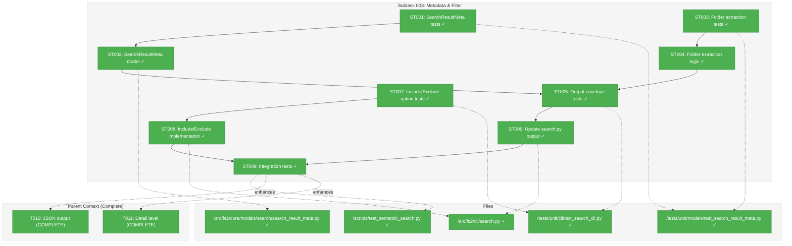
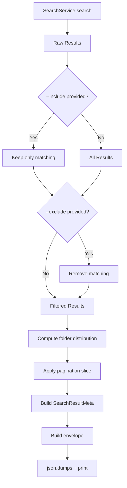
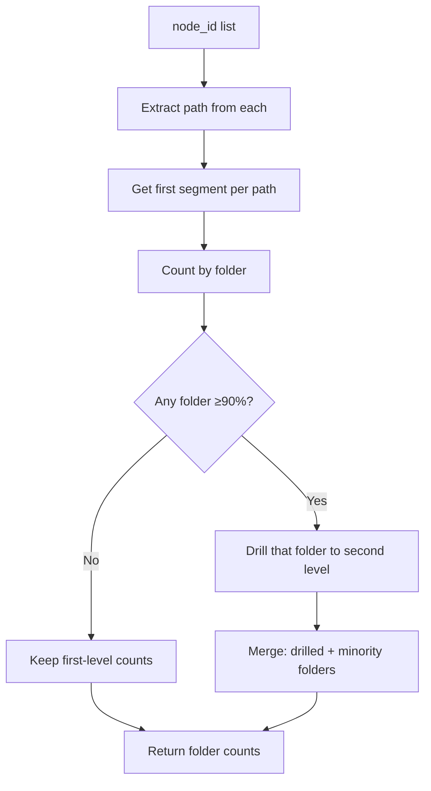

# Subtask 003: Search Result Metadata and Include/Exclude Filters

**Parent Plan:** [View Plan](../../search-plan.md)
**Parent Phase:** Phase 5: CLI Integration
**Parent Task(s):** [T010: Implement JSON output](./tasks.md#t010), [T011: Implement detail level](./tasks.md#t011)
**Plan Task Reference:** [Task 5.7-5.8 in Plan](../../search-plan.md#phase-5-cli-integration)

**Why This Subtask:**
Enhance search output to include metadata (total matches, pagination info, folder distribution) and add `--include`/`--exclude` options for post-search node ID filtering. This aids discovery of result distribution and enables filtering without re-running searches.

**Created:** 2025-12-26
**Requested By:** User

---

## Executive Briefing

### Purpose
This subtask enriches the `fs2 search` JSON output with a metadata envelope containing pagination state, total match counts, and folder distribution analytics. Additionally, it adds `--include` and `--exclude` options for filtering node IDs by text or regex pattern without re-running the search.

### What We're Building
1. **Search Result Metadata Envelope** - Transform JSON output from `[...results...]` to:
   ```json
   {
     "meta": {
       "total": 47,
       "showing": {"from": 0, "to": 20, "count": 20},
       "pagination": {"limit": 20, "offset": 0},
       "folders": {"tests/": 36, "src/": 11}
     },
     "results": [...]
   }
   ```

2. **Folder Distribution Logic**:
   - Extract top-level folder from each result's `node_id` (e.g., `file:tests/unit/foo.py` → `tests/`)
   - **Threshold-based drilling**: If ≥90% of results are from one folder, drill into second-level for that folder (e.g., `tests/unit/`, `tests/integration/`) while still showing minority folders
   - Threshold defined as tunable constant `FOLDER_DRILL_THRESHOLD = 0.9` (not CLI param)
   - Count distinct occurrences per folder

3. **`--include` / `--exclude` Options** - CLI flags accepting text or regex patterns (multiple allowed, OR logic):
   ```bash
   fs2 search "auth" --include "src/"                        # Keep only src/ results
   fs2 search "auth" --include "src/" --include "lib/"       # Keep src/ OR lib/ (multiple)
   fs2 search "auth" --exclude "tests/"                      # Remove test results
   fs2 search "auth" --exclude "test" --exclude "fixture"    # Remove tests OR fixtures
   fs2 search "config" --include "src/" --exclude "fixture"  # Combine both
   ```

### Unblocks
- Improved UX for understanding search result distribution
- Easier filtering without modifying search parameters
- Machine-readable pagination metadata for scripting

### Example

**Before (current output)**:
```json
[
  {"node_id": "callable:tests/unit/test_foo.py:test_bar", "score": 0.85, ...},
  {"node_id": "callable:src/services/auth.py:login", "score": 0.82, ...}
]
```

**After (with metadata envelope)**:
```json
{
  "meta": {
    "total": 47,
    "showing": {"from": 0, "to": 20, "count": 20},
    "pagination": {"limit": 20, "offset": 0},
    "folders": {"tests/": 36, "src/": 11}
  },
  "results": [
    {"node_id": "callable:tests/unit/test_foo.py:test_bar", "score": 0.85, ...},
    {"node_id": "callable:src/services/auth.py:login", "score": 0.82, ...}
  ]
}
```

**With exclude applied** (`--exclude "tests/"`):
```json
{
  "meta": {
    "total": 47,
    "filtered": 11,
    "showing": {"from": 0, "to": 11, "count": 11},
    "pagination": {"limit": 20, "offset": 0},
    "exclude": ["tests/"],
    "folders": {"src/": 11}
  },
  "results": [
    {"node_id": "callable:src/services/auth.py:login", "score": 0.82, ...}
  ]
}
```

**With include applied** (`--include "src/"`):
```json
{
  "meta": {
    "total": 47,
    "filtered": 11,
    "showing": {"from": 0, "to": 11, "count": 11},
    "pagination": {"limit": 20, "offset": 0},
    "include": ["src/"],
    "folders": {"src/": 11}
  },
  "results": [
    {"node_id": "callable:src/services/auth.py:login", "score": 0.82, ...}
  ]
}
```

**With multiple patterns** (`--include "src/" --include "lib/" --exclude "test"`):
```json
{
  "meta": {
    "total": 47,
    "filtered": 15,
    "showing": {"from": 0, "to": 15, "count": 15},
    "pagination": {"limit": 20, "offset": 0},
    "include": ["src/", "lib/"],
    "exclude": ["test"],
    "folders": {"src/": 12, "lib/": 3}
  },
  "results": [...]
}
```

---

## Objectives & Scope

### Objective
Enhance `fs2 search` output with metadata envelope and node ID filtering to improve usability for analyzing search result distribution and refining results.

### Goals

- ✅ Create `SearchResultMeta` model with total, showing, pagination, folders fields
- ✅ Update search output from array to envelope with meta + results
- ✅ Implement folder distribution extraction from node IDs
- ✅ Implement threshold-based drilling (≥90% from one folder → drill into second-level)
- ✅ Add `--include` CLI option for text/regex node ID inclusion (keep only matching)
- ✅ Add `--exclude` CLI option for text/regex node ID exclusion (remove matching)
- ✅ Support multiple patterns per flag with OR logic (`--include A --include B` keeps A or B)
- ✅ Support combining `--include` and `--exclude` (include applied first, then exclude)
- ✅ Update tests and integration tests for new output format
- ✅ Maintain backward compatibility via optional `--no-meta` flag (or consider breaking change)

### Non-Goals

- ❌ Changing the SearchService internal logic (filtering happens at CLI level)
- ❌ Adding folder-based search mode (out of scope - filtering only)
- ❌ Caching or persisting filter results
- ❌ Complex filter expressions (AND logic, nested groups - only OR via multiple flags)
- ❌ Interactive filtering (CLI only)

---

## Architecture Map

### Component Diagram
<!-- Status: grey=pending, orange=in-progress, green=completed, red=blocked -->
<!-- Updated by plan-6 during implementation -->



### Task-to-Component Mapping

<!-- Status: ⬜ Pending | 🟧 In Progress | ✅ Complete | 🔴 Blocked -->

| Task | Component(s) | Files | Status | Comment |
|------|-------------|-------|--------|---------|
| ST001 | Model Tests | test_search_result_meta.py | ✅ Complete | TDD: meta structure, to_dict() |
| ST002 | SearchResultMeta | search_result_meta.py | ✅ Complete | Frozen dataclass with meta fields |
| ST003 | Folder Extraction Tests | test_search_result_meta.py | ✅ Complete | TDD: all node_id formats + threshold + root→"(root)" |
| ST004 | Folder Extraction | search_result_meta.py | ✅ Complete | Extract folder + FOLDER_DRILL_THRESHOLD=0.9 |
| ST005 | CLI Output Tests | test_search_cli.py | ✅ Complete | TDD: envelope structure |
| ST006 | CLI Output | search.py | ✅ Complete | Update output to envelope |
| ST007 | Include/Exclude Tests | test_search_cli.py | ✅ Complete | TDD: single + multi-pattern OR logic |
| ST008 | Include/Exclude Implementation | search.py | ✅ Complete | list[str] type + any() OR matching |
| ST009 | Integration | test_search_cli_integration.py | ✅ Complete | E2E envelope + filter |

---

## Tasks

| Status | ID | Task | CS | Type | Dependencies | Absolute Path(s) | Validation | Subtasks | Notes |
|--------|-----|------|-----|------|--------------|------------------|------------|----------|-------|
| [x] | ST001 | Write tests for SearchResultMeta model (total, showing, pagination, folders) | 2 | Test | – | /workspaces/flow_squared/tests/unit/models/test_search_result_meta.py | Tests cover: field defaults, to_dict(), validation | – | TDD first |
| [x] | ST002 | Create SearchResultMeta frozen dataclass | 2 | Core | ST001 | /workspaces/flow_squared/src/fs2/core/models/search/search_result_meta.py | Tests from ST001 pass | – | New model file |
| [x] | ST003 | Write tests for folder extraction from node_id (all formats, threshold drilling) | 2 | Test | – | /workspaces/flow_squared/tests/unit/models/test_search_result_meta.py | Tests cover: file:, callable:, class:, chunk:, content:, root files → "(root)", threshold drilling | – | TDD; comprehensive format coverage (DYK-003-03) |
| [x] | ST004 | Implement folder extraction with threshold-based drilling | 2 | Core | ST003 | /workspaces/flow_squared/src/fs2/core/models/search/search_result_meta.py | Tests from ST003 pass | – | FOLDER_DRILL_THRESHOLD=0.9 const (DYK-003-02) |
| [x] | ST005 | Write tests for envelope output format (meta + results) | 2 | Test | ST002, ST004 | /workspaces/flow_squared/tests/unit/cli/test_search_cli.py | Tests verify: dict with meta, results keys | – | TDD, update existing |
| [x] | ST006 | Update search.py to output envelope instead of array | 3 | Core | ST005 | /workspaces/flow_squared/src/fs2/cli/search.py | Tests from ST005 pass | – | Breaking change to output |
| [x] | ST007 | Write tests for --include/--exclude options (text, regex, multiple, combining) | 2 | Test | – | /workspaces/flow_squared/tests/unit/cli/test_search_cli.py | Tests cover: single, multiple (OR), combined, regex | – | TDD; multi-pattern OR logic (DYK-003-04) |
| [x] | ST008 | Implement --include/--exclude options with multi-pattern OR | 3 | Core | ST007 | /workspaces/flow_squared/src/fs2/cli/search.py | Tests from ST007 pass | – | list[str] type; any() for OR; include first, then exclude |
| [x] | ST009 | Update integration tests for envelope + filter | 2 | Integration | ST006, ST008 | /workspaces/flow_squared/tests/integration/test_search_cli_integration.py, /workspaces/flow_squared/scripts/test_semantic_search.py | E2E tests pass with new format | – | Final validation; also update test_semantic_search.py to parse envelope format (DYK-003-01) |

---

## Alignment Brief

### Objective Recap
Enhance search CLI output with metadata envelope (pagination, folder distribution) and post-search filtering, building on the complete Phase 5 CLI implementation.

### Behavior Checklist (New)
- [x] BC-09: Output is envelope `{"meta": {...}, "results": [...]}`
- [x] BC-10: `meta.total` shows total matches before pagination
- [x] BC-11: `meta.showing` shows `{from, to, count}` of current page
- [x] BC-12: `meta.pagination` shows `{limit, offset}` passed in
- [x] BC-13: `meta.folders` shows distinct folder counts
- [x] BC-14: If ≥90% results from one folder, drill into second-level for that folder (threshold const)
- [x] BC-15: `--include` accepts text or regex pattern(s); multiple allowed with OR logic
- [x] BC-16: `--exclude` accepts text or regex pattern(s); multiple allowed with OR logic
- [x] BC-17: When both used, `--include` applied first, then `--exclude`
- [x] BC-18: `meta.include` and/or `meta.exclude` are arrays of patterns (omit key when empty)
- [x] BC-19: `meta.filtered` shows count after filtering (when filters applied)

### Critical Findings Affecting This Subtask

#### Discovery 10: CLI JSON Output Idiom
**Constrains**: Output format change must maintain jq compatibility
**Requires**: Envelope structure should work with existing piping patterns
**Pattern**: `fs2 search "auth" | jq '.results[] | .node_id'` must work

#### DYK-P5-01: Graph Loading
**Constrains**: Results come after graph is loaded
**Requires**: Total count must be computed before pagination slice

#### DYK-003-01: Breaking Change Accepted
**Decision**: Accept breaking change from array to envelope (pre-1.0 software)
**Requires**: Update `scripts/test_semantic_search.py` line 53 to parse `.results` from envelope
**Scope**: Include script update in ST009

#### DYK-003-02: Threshold-Based Folder Drilling
**Decision**: Use threshold (≥90%) instead of binary (100%) for drilling into dominant folder
**Implementation**: `FOLDER_DRILL_THRESHOLD = 0.9` constant in search_result_meta.py
**Behavior**: If any folder has ≥90% of results, drill into second-level; show minority folders alongside

#### DYK-003-03: Node ID Format Edge Cases
**Discovery**: node_id has multiple formats requiring prefix stripping and suffix handling
**Formats**: `file:`, `callable:`, `class:`, `chunk:`, `content:` prefixes; `:symbol` and `:line-range` suffixes
**Root files**: `file:README.md` or `content:CHANGELOG.md` have no folder → return `"(root)"`
**Testing**: Comprehensive tests for all formats in ST003

#### DYK-003-04: Multiple Patterns with OR Logic
**Decision**: Support multiple `--include` and `--exclude` flags with OR logic
**Implementation**: Typer `list[str]` type; `any(re.search(p, node_id) for p in patterns)`
**Behavior**: `--include A --include B` keeps results matching A OR B; same for exclude
**Precedent**: Matches `grep -e PAT1 -e PAT2`, `rg -e`, etc.

#### DYK-003-05: Metadata Pattern Fields Are Always Arrays
**Decision**: `meta.include` and `meta.exclude` are always arrays, even for single pattern
**Behavior**: Omit key entirely when no patterns provided (cleaner than empty array)
**Rationale**: Consistent type for consumers; `jq '.meta.include[]'` always works

### Invariants & Guardrails

**Output Format**:
- JSON output MUST remain valid JSON
- Envelope structure is NOT optional (breaking change)
- `results` key contains the same array format as before
- `meta` key contains only metadata (no result data)

**Include/Exclude Behavior**:
- Filters are applied AFTER search, BEFORE pagination display
- Order: `--include` applied first (keep matching), then `--exclude` (remove matching)
- Multiple patterns per flag: OR logic (`--include A --include B` keeps A or B)
- Uses Python `re` module for regex matching; `any(re.search(p, node_id) for p in patterns)`
- Empty pattern list = no filtering for that flag
- Invalid regex in any pattern = user error with clear message

### Inputs to Read

**Implementation References**:
- `/workspaces/flow_squared/src/fs2/cli/search.py` - Current implementation (line 182-188)
- `/workspaces/flow_squared/src/fs2/core/models/search/search_result.py` - to_dict() pattern

**Test References**:
- `/workspaces/flow_squared/tests/unit/cli/test_search_cli.py` - Existing CLI tests
- `/workspaces/flow_squared/tests/integration/test_search_cli_integration.py` - Integration tests

### Visual Alignment Aids

#### Metadata Computation Flow



#### Folder Extraction Logic



### Test Plan (Full TDD)

**Model Tests**: `/workspaces/flow_squared/tests/unit/models/test_search_result_meta.py` (NEW)

| Test Name | Rationale | Fixtures | Expected Output |
|-----------|-----------|----------|-----------------|
| `test_meta_has_required_fields` | Model structure | None | total, showing, pagination, folders exist |
| `test_meta_to_dict_includes_all_fields` | Serialization | None | Dict with all fields |
| `test_showing_from_to_count` | Pagination display | None | Correct from/to/count |
| `test_folders_distribution` | Folder counting | None | Dict of folder→count |
| `test_extract_folder_from_file_node` | Folder parsing | `file:src/foo.py` | `src/` |
| `test_extract_folder_from_callable_node` | Callable parsing | `callable:tests/x.py:f` | `tests/` |
| `test_extract_folder_from_class_node` | Class parsing | `class:src/models/u.py:User` | `src/` |
| `test_extract_folder_from_chunk_node` | Chunk parsing | `chunk:docs/api.md:10-20` | `docs/` |
| `test_extract_folder_from_content_node` | Content parsing | `content:docs/guide.md` | `docs/` |
| `test_extract_folder_root_file` | Root file | `file:README.md` | `(root)` |
| `test_extract_folder_root_content` | Root content | `content:CHANGELOG.md` | `(root)` |
| `test_threshold_drilling_at_90_percent` | BC-14 | 90% tests/ | `tests/unit/`, etc. + minority |
| `test_no_drilling_below_threshold` | BC-14 inverse | 80% tests/ | `tests/`, `src/` (no drill) |
| `test_threshold_const_is_tunable` | Const check | None | FOLDER_DRILL_THRESHOLD = 0.9 |
| `test_include_pattern_stored` | Include metadata | --include provided | meta.include set |
| `test_exclude_pattern_stored` | Exclude metadata | --exclude provided | meta.exclude set |
| `test_filtered_count_computed` | Filter count | After filtering | meta.filtered set |

**CLI Tests**: `/workspaces/flow_squared/tests/unit/cli/test_search_cli.py` (additions)

| Test Name | Rationale | Fixtures | Expected Output |
|-----------|-----------|----------|-----------------|
| `test_output_is_envelope_not_array` | BC-09 | Mock service | `{"meta": ..., "results": ...}` |
| `test_meta_total_before_pagination` | BC-10 | 50 results, limit 10 | meta.total == 50 |
| `test_meta_showing_current_page` | BC-11 | offset=10, limit=10 | showing.from == 10 |
| `test_meta_pagination_mirrors_input` | BC-12 | limit=5, offset=15 | pagination matches |
| `test_meta_folders_counted` | BC-13 | Mixed nodes | folders dict present |
| `test_include_flag_accepts_text` | BC-15 | `--include "src/"` | No error |
| `test_include_flag_accepts_regex` | BC-15 | `--include "src.*"` | No error |
| `test_include_keeps_only_matching` | BC-15 | Include src | Only src/ nodes |
| `test_include_multiple_or_logic` | BC-15 multi | `--include src --include lib` | src/ OR lib/ kept |
| `test_exclude_flag_accepts_text` | BC-16 | `--exclude "tests/"` | No error |
| `test_exclude_flag_accepts_regex` | BC-16 | `--exclude "test.*"` | No error |
| `test_exclude_removes_matching` | BC-16 | Exclude tests | tests/ nodes removed |
| `test_exclude_multiple_or_logic` | BC-16 multi | `--exclude test --exclude fix` | test OR fixture removed |
| `test_include_exclude_combined` | BC-17 | Both flags | Include first, exclude second |
| `test_invalid_regex_errors` | Error case | `--include "["` | Exit 1 |
| `test_meta_include_is_array` | BC-18 type | Single include | meta.include is list |
| `test_meta_exclude_is_array` | BC-18 type | Single exclude | meta.exclude is list |
| `test_meta_omits_empty_filters` | BC-18 omit | No filters | no include/exclude keys |
| `test_meta_filtered_count_correct` | BC-19 | 50→30 after filter | filtered == 30 |

**Integration Tests**: `/workspaces/flow_squared/tests/integration/test_search_cli_integration.py` (additions)

| Test Name | Rationale | Fixtures | Expected Output |
|-----------|-----------|----------|-----------------|
| `test_envelope_format_e2e` | Output structure | fixture_graph | Valid envelope |
| `test_include_keeps_src_e2e` | Include works | fixture_graph | Only src/ in results |
| `test_exclude_removes_tests_e2e` | Exclude works | fixture_graph | No tests/ in results |
| `test_include_exclude_combined_e2e` | Both flags | fixture_graph | src/ without fixture |
| `test_jq_results_extraction` | Backward compat | fixture_graph | `.results[]` works |

### Step-by-Step Implementation Outline

**Phase A: Model Layer**

1. **ST001**: Write SearchResultMeta tests
   - Test structure: total, showing, pagination, folders
   - Test to_dict() serialization
   - Tests will fail (model doesn't exist)

2. **ST002**: Create SearchResultMeta model
   - Frozen dataclass with fields
   - to_dict() method
   - Tests from ST001 pass

3. **ST003**: Write folder extraction tests
   - Test node_id parsing for file:, callable:, class:
   - Test tests-only second-level logic
   - Tests will fail

4. **ST004**: Implement folder extraction
   - Static method `extract_folder(node_id: str) -> str`
   - Static method `compute_folder_distribution(results: list) -> dict`
   - Tests from ST003 pass

**Phase B: CLI Updates**

5. **ST005**: Write envelope output tests
   - Test output structure has meta + results
   - Update existing tests that expect array
   - Tests will fail

6. **ST006**: Update search.py output
   - Compute total before pagination
   - Build meta from results
   - Output envelope dict
   - Tests from ST005 pass

7. **ST007**: Write include/exclude tests
   - Test --include flag parsing and matching
   - Test --exclude flag parsing and matching
   - Test combining both flags (include first, then exclude)
   - Test regex patterns
   - Tests will fail

8. **ST008**: Implement include/exclude
   - Add --include and --exclude options
   - Apply --include first (keep only matching)
   - Apply --exclude second (remove matching)
   - Update meta with filter info
   - Tests from ST007 pass

**Phase C: Integration**

9. **ST009**: Update integration tests
   - Verify envelope format E2E
   - Test filter with real graph
   - Verify jq compatibility

### Commands to Run

```bash
# Environment setup
cd /workspaces/flow_squared
export UV_CACHE_DIR=.uv_cache

# Run new model tests
uv run pytest tests/unit/models/test_search_result_meta.py -v

# Run CLI tests (updated)
uv run pytest tests/unit/cli/test_search_cli.py -v

# Run all search tests
uv run pytest tests/unit/services/test_*search*.py tests/unit/models/test_*search*.py tests/unit/cli/test_search_cli.py -v

# Run integration tests
uv run pytest tests/integration/test_search*.py -v

# Type checking
uv run mypy src/fs2/cli/search.py src/fs2/core/models/search/search_result_meta.py

# Linting
uv run ruff check src/fs2/cli/search.py src/fs2/core/models/search/

# Manual tests
uv run fs2 search "Calculator" --limit 5                                    # Envelope format
uv run fs2 search "auth" --include "src/"                                   # Only src/ results
uv run fs2 search "auth" --include "src/" --include "lib/"                  # src/ OR lib/ (multi)
uv run fs2 search "test" --exclude "fixture"                                # Remove fixtures
uv run fs2 search "test" --exclude "fixture" --exclude "mock"               # Remove fixture OR mock
uv run fs2 search "config" --include "src/" --exclude "test"                # Combine both
uv run fs2 search "config" | jq '.results[] | .node_id'                     # jq compat
```

### Risks/Unknowns

| Risk | Severity | Likelihood | Mitigation |
|------|----------|------------|------------|
| Breaking change to output format | Medium | Certain | Update all consumers; consider --no-meta flag |
| Folder extraction edge cases | Low | Medium | Comprehensive tests for all node_id types |
| Regex performance on large results | Low | Low | Post-search filtering is fast |
| jq compatibility | Medium | Low | Test common patterns; results array unchanged |

### Ready Check

- [x] Parent phase reviewed (Phase 5 complete with 106 tests)
- [x] Critical findings documented (Discovery 10, DYK-P5-01)
- [x] New behavior checklist defined (BC-09 through BC-18)
- [x] Test plan complete with 23 tests
- [x] Implementation outline mapped 1:1 to tasks (ST001-ST009)
- [x] Commands to run documented
- [x] Risks identified with mitigations
- [ ] **Awaiting human GO/NO-GO**

---

## Phase Footnote Stubs

_Footnotes added by plan-6a during implementation._

| Footnote | Date | Task(s) | Description | FlowSpace Node IDs |
|----------|------|---------|-------------|-------------------|
| | | | | |

---

## Evidence Artifacts

**Execution Log Location**: `/workspaces/flow_squared/docs/plans/010-search/tasks/phase-5-cli-integration/003-subtask-search-result-metadata-and-filter.execution.log.md`

**New Files**:
- Model: `/workspaces/flow_squared/src/fs2/core/models/search/search_result_meta.py`
- Tests: `/workspaces/flow_squared/tests/unit/models/test_search_result_meta.py`

**Modified Files**:
- `/workspaces/flow_squared/src/fs2/cli/search.py`
- `/workspaces/flow_squared/tests/unit/cli/test_search_cli.py`
- `/workspaces/flow_squared/tests/integration/test_search_cli_integration.py`
- `/workspaces/flow_squared/src/fs2/core/models/search/__init__.py`

---

## Discoveries & Learnings

_Populated during implementation by plan-6. Log anything of interest to your future self._

| Date | Task | Type | Discovery | Resolution | References |
|------|------|------|-----------|------------|------------|
| 2025-12-26 | ST009 | decision | DYK-003-01: Breaking change from array to envelope output breaks existing scripts (test_semantic_search.py line 53 parses stdout as array) | Accept breaking change - pre-1.0 software. Update test_semantic_search.py as part of ST009 to parse `.results` from envelope | /didyouknow session |
| 2025-12-26 | ST003, ST004 | decision | DYK-003-02: Tests-only drilling too binary (100% threshold). 90% tests + 10% src still shows unhelpful `tests/: 90` | Use threshold-based drilling with FOLDER_DRILL_THRESHOLD=0.9 const. If ≥90% from one folder, drill into it while showing minority folders | /didyouknow session |
| 2025-12-26 | ST003 | gotcha | DYK-003-03: node_id has multiple formats (file:, callable:, class:, chunk:, content:) with prefix/suffix variations. Root files have no folder. | Comprehensive tests for all formats. Root files return `"(root)"`. Strip prefix before path extraction. | /didyouknow session |
| 2025-12-26 | ST007, ST008 | decision | DYK-003-04: Single pattern per flag limits OR filtering (users want `--include A --include B`). Regex workaround is less intuitive. | Support multiple patterns per flag with OR logic. Typer list[str] type; any() matching. Matches grep/rg precedent. | /didyouknow session |
| 2025-12-26 | ST002 | decision | DYK-003-05: With multi-pattern support, meta.include/exclude need array type not string. Polymorphic (str or list) adds consumer complexity. | Always use arrays for meta.include/exclude, even for single pattern. Omit key when empty. Consistent type for jq/consumers. | /didyouknow session |

**Types**: `gotcha` | `research-needed` | `unexpected-behavior` | `workaround` | `decision` | `debt` | `insight`

**What to log**:
- Things that didn't work as expected
- External research that was required
- Implementation troubles and how they were resolved
- Gotchas and edge cases discovered
- Decisions made during implementation
- Technical debt introduced (and why)
- Insights that future phases should know about

_See also: `execution.log.md` for detailed narrative._

---

## After Subtask Completion

**This subtask enhances:**
- Parent Task: [T010: Implement JSON output](./tasks.md#t010)
- Parent Task: [T011: Implement detail level](./tasks.md#t011)
- Plan Task: [5.7-5.8 in Plan](../../search-plan.md#phase-5-cli-integration)

**When all ST### tasks complete:**

1. **Record completion** in parent execution log:
   ```
   ### Subtask 003-subtask-search-result-metadata-and-filter Complete

   Resolved: Added metadata envelope and --filter option to search output
   See detailed log: [subtask execution log](./003-subtask-search-result-metadata-and-filter.execution.log.md)
   ```

2. **Update plan** (Phase 5 enhancements):
   - Note subtask completion in Progress Tracking
   - Update acceptance criteria if needed

3. **Consider documentation update:**
   - Update `docs/how/search/` if created in Phase 6
   - Update README search examples

**Quick Links:**
- [Parent Dossier](./tasks.md)
- [Parent Plan](../../search-plan.md)
- [Parent Execution Log](./execution.log.md)

---

## Directory Layout

```
docs/plans/010-search/
  ├── search-spec.md
  ├── search-plan.md
  └── tasks/
      ├── phase-0-chunk-offset-tracking/
      │   └── ...
      ├── phase-1-core-models/
      │   └── ...
      ├── phase-2-textregex-matchers/
      │   └── ...
      ├── phase-3-semantic-matcher/
      │   └── ...
      └── phase-5-cli-integration/
          ├── tasks.md
          ├── execution.log.md
          ├── 003-subtask-search-result-metadata-and-filter.md           # THIS SUBTASK
          └── 003-subtask-search-result-metadata-and-filter.execution.log.md  # Created by plan-6
```

---

**STOP**: Do **not** edit code. Awaiting human **GO/NO-GO** for implementation.

---

## Critical Insights Discussion

**Session**: 2025-12-26
**Context**: Subtask 003 - Search Result Metadata and Include/Exclude Filters
**Analyst**: AI Clarity Agent
**Reviewer**: Development Team
**Format**: Water Cooler Conversation (5 Critical Insights)

### Insight 1: Breaking Change Has No Migration Path

**Did you know**: The output format change from `[...]` to `{"meta": ..., "results": [...]}` will immediately break existing scripts and jq commands.

**Implications**:
- `scripts/test_semantic_search.py` line 53 parses stdout as JSON array
- All jq commands like `.[]` become `.results[]`
- External users (if any) get no warning

**Options Considered**:
- Option A: Accept Breaking Change - pre-1.0, just update our scripts
- Option B: Add `--format` Flag - backward compat with deprecation
- Option C: Separate Command - `fs2 search-meta` for envelope

**AI Recommendation**: Option A (Accept Breaking Change)
- Reasoning: Pre-1.0 software, we control affected code, clean API design

**Discussion Summary**: User confirmed Option A. Breaking changes expected in pre-1.0.

**Decision**: Accept breaking change; update test_semantic_search.py in ST009

**Action Items**:
- [x] Update ST009 to include test_semantic_search.py in scope

**Affects**: ST009

---

### Insight 2: Tests-Only Drilling Threshold Is Binary

**Did you know**: The "drill if ALL results from tests/" logic rarely triggers - 90% tests + 10% src still shows unhelpful `tests/: 90`.

**Implications**:
- 36/40 results from tests/ (90%) gets no drill-down
- Feature only useful in 100% tests case (rare)
- Common saturation scenarios unhelpful

**Options Considered**:
- Option A: Keep Binary - simple, rarely triggers
- Option B: Threshold-Based (90%+) - handles real saturation
- Option C: Always Two Levels - maximum detail
- Option D: Defer - ship binary, iterate later

**AI Recommendation**: Option D (Defer)
- Reasoning: YAGNI, ship feature first, iterate with real data

**Discussion Summary**: User chose Option B with tunable threshold as const.

**Decision**: Use FOLDER_DRILL_THRESHOLD = 0.9 constant; drill if ≥90% from one folder

**Action Items**:
- [x] Update ST003/ST004 with threshold logic

**Affects**: ST003, ST004, folder extraction logic

---

### Insight 3: Node ID Format Edge Cases

**Did you know**: node_id has multiple formats (file:, callable:, class:, chunk:, content:) requiring prefix stripping, and root files have no folder.

**Implications**:
- Naive split fails: `file:src/foo.py`.split('/')[0] → `file:src` ❌
- Root files like `file:README.md` have no folder segment
- Callable/class have `:symbol` suffix after path

**Options Considered**:
- Option A: Comprehensive Tests - all formats + root files
- Option B: Regex-Based Extraction - single pattern
- Option C: Defer Edge Cases - handle common cases only

**AI Recommendation**: Option A (Comprehensive Tests)
- Reasoning: TDD catches edge cases early, all types exist in fixture_graph

**Discussion Summary**: User confirmed Option A.

**Decision**: Comprehensive tests for all node_id formats; root files return "(root)"

**Action Items**:
- [x] Add tests for file:, callable:, class:, chunk:, content: formats
- [x] Add tests for root files → "(root)"

**Affects**: ST003 test coverage

---

### Insight 4: Include/Exclude Multiple Pattern Support

**Did you know**: Users expect `--include A --include B` for OR logic (like grep -e), but current plan limits to single pattern.

**Implications**:
- Users must use regex workaround: `--include "^(src|lib)/"`
- Typer natively supports list[str] for multiple flags
- CLI tool precedent (grep, rg) sets expectation

**Options Considered**:
- Option A: Keep Single Pattern - simpler, regex workaround exists
- Option B: Support Multiple (OR) - intuitive, trivial in Typer
- Option C: Defer - ship single, add multi later

**AI Recommendation**: Option B (Support Multiple Patterns)
- Reasoning: Trivial in Typer, matches CLI conventions, better UX

**Discussion Summary**: User confirmed Option B.

**Decision**: Support multiple patterns per flag with OR logic using list[str]

**Action Items**:
- [x] Update ST007/ST008 with multi-pattern tests and implementation

**Affects**: ST007, ST008, Goals, Non-Goals, BC-15, BC-16

---

### Insight 5: Metadata Pattern Fields Type

**Did you know**: With multi-pattern support, meta.include/exclude should be arrays, not strings, for type consistency.

**Implications**:
- Single string becomes `["src/"]` not `"src/"`
- Consumers always expect array type
- `jq '.meta.include[]'` always works

**Options Considered**:
- Option A: Always Arrays - consistent type, omit when empty
- Option B: Polymorphic - string or array based on count

**AI Recommendation**: Option A (Always Arrays)
- Reasoning: Type consistency for consumers, no special casing

**Discussion Summary**: User confirmed Option A.

**Decision**: meta.include and meta.exclude are always arrays; omit key when empty

**Action Items**:
- [x] Update example outputs with array syntax
- [x] Update BC-18 to specify array type

**Affects**: ST002, example outputs, BC-18

---

## Session Summary

**Insights Surfaced**: 5 critical insights identified and discussed
**Decisions Made**: 5 decisions reached through collaborative discussion
**Action Items Created**: All items completed inline (dossier updated)
**Areas Updated**:
- Executive Briefing examples
- Goals and Non-Goals
- Behavior Checklist (BC-14, BC-15, BC-16, BC-18)
- Tasks table (ST003, ST004, ST007, ST008, ST009)
- Test Plan (added 10+ new tests)
- Critical Findings (DYK-003-01 through DYK-003-05)
- Discoveries table (5 entries)
- Invariants section
- Folder extraction diagram
- Manual test commands

**Shared Understanding Achieved**: ✓

**Confidence Level**: High - All ambiguities resolved, comprehensive test coverage defined

**Next Steps**:
Proceed with implementation after human GO. Start with ST001 (SearchResultMeta tests).
