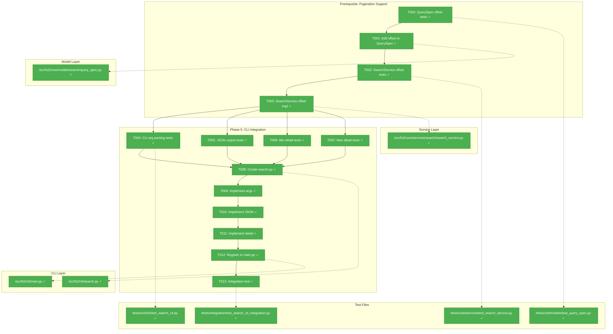
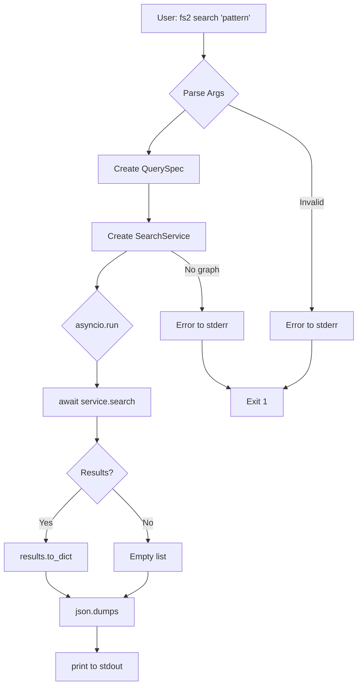
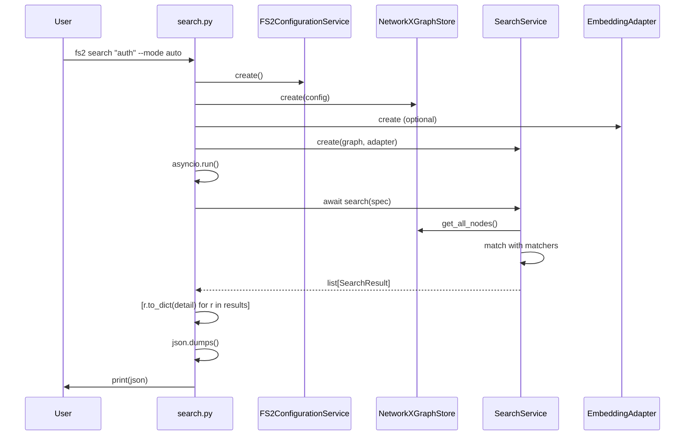

# Phase 5: CLI Integration – Tasks & Alignment Brief

**Spec**: [../search-spec.md](../search-spec.md)
**Plan**: [../search-plan.md](../search-plan.md)
**Date**: 2025-12-25

---

## Executive Briefing

### Purpose
This phase creates the `fs2 search` CLI command that exposes all search functionality (text, regex, semantic, auto) to users via the command line. Without this, the powerful search infrastructure built in Phases 1-3 remains inaccessible to users.

### What We're Building
A `fs2 search` Typer command that:
- Accepts a search pattern as the primary argument
- Supports `--mode` flag for text, regex, semantic, auto (default)
- Supports `--limit` flag (default 20)
- Supports `--offset` flag for pagination (default 0)
- Supports `--detail` flag for min/max output levels
- Outputs JSON to stdout, errors to stderr
- Enables piping to `jq` and other tools

### User Value
Users can search their indexed codebase directly from the terminal:
- Find code by name, content, or concept
- Filter results with familiar Unix piping (`| jq`)
- Integrate with scripts and automation tools
- Get semantic search for conceptual queries without knowing exact terms

### Example
**Command**: `fs2 search "authentication" --limit 10`

**Pagination Example**: `fs2 search "config" --limit 10 --offset 10` (page 2)

**Explicit Mode**: `fs2 search "def.*test" --mode regex` (when auto-detection isn't desired)

**Output (stdout)**:
```json
[
  {
    "node_id": "callable:src/auth/service.py:AuthService.authenticate",
    "score": 0.92,
    "smart_content": "Authenticates user with credentials",
    "snippet": "def authenticate(self, username: str, password: str):",
    "start_line": 45,
    "end_line": 78,
    "match_start_line": 45,
    "match_end_line": 45,
    "match_field": "smart_content_embedding"
  }
]
```

---

## Objectives & Scope

### Objective
Implement the `fs2 search` CLI command as specified in the plan, satisfying AC11, AC19, AC20, and AC22.

### Behavior Checklist (from Plan + Enhancement)
- [ ] BC-01: CLI accepts pattern as positional argument
- [ ] BC-02: `--mode` flag supports text, regex, semantic, auto (default: auto)
- [ ] BC-03: `--limit` flag with default 20
- [ ] BC-04: `--offset` flag for pagination with default 0 (NEW)
- [ ] BC-05: `--detail` flag supports min (default) and max
- [ ] BC-06: JSON output to stdout, errors to stderr
- [ ] BC-07: Exit codes: 0 success, 1 user error, 2 system error
- [ ] BC-08: Command registered as `fs2 search`

### Goals

- ✅ Add `offset` field to QuerySpec for pagination support (prerequisite)
- ✅ Update SearchService to apply offset in result slicing (prerequisite)
- ✅ Create `/workspaces/flow_squared/src/fs2/cli/search.py` with search command
- ✅ Register command in main.py as `fs2 search`
- ✅ Implement all CLI flags (--mode, --limit, --offset, --detail)
- ✅ Output JSON via `SearchResult.to_dict(detail)` (Phase 1 API)
- ✅ Use `Console(stderr=True)` pattern (per get_node.py idiom)
- ✅ Handle async SearchService via `asyncio.run()` (Phase 3 change)
- ✅ Comprehensive TDD test coverage

### Non-Goals (Scope Boundaries)

- ❌ Pretty-printing search results (JSON only per spec)
- ❌ Interactive mode or fuzzy finding (out of scope)
- ❌ Performance optimization beyond existing implementation
- ❌ Custom output formats (CSV, YAML, etc.)
- ❌ Streaming large result sets (standard list is sufficient)
- ❌ Plugin architecture for search modes
- ❌ Configuration file for default search options (use CLI flags)

---

## Architecture Map

### Component Diagram
<!-- Status: grey=pending, orange=in-progress, green=completed, red=blocked -->
<!-- Updated by plan-6 during implementation -->



### Task-to-Component Mapping

<!-- Status: ⬜ Pending | 🟧 In Progress | ✅ Complete | 🔴 Blocked -->

**Prerequisite Tasks (Pagination)**

| Task | Component(s) | Files | Status | Comment |
|------|-------------|-------|--------|---------|
| T000 | Model Tests | test_query_spec.py | ✅ Complete | TDD: offset field tests (default, validation) |
| T001 | QuerySpec | query_spec.py | ✅ Complete | Add offset: int = 0 with >= 0 validation |
| T002 | Service Tests | test_search_service.py | ✅ Complete | TDD: offset slicing tests |
| T003 | SearchService | search_service.py | ✅ Complete | Apply offset: results[offset:offset+limit] |

**CLI Tasks**

| Task | Component(s) | Files | Status | Comment |
|------|-------------|-------|--------|---------|
| T004 | CLI Tests | test_search_cli.py | ✅ Complete | TDD: argument parsing (incl --offset) |
| T005 | CLI Tests | test_search_cli.py | ✅ Complete | TDD: JSON output + stderr tests |
| T006 | CLI Tests | test_search_cli.py | ✅ Complete | TDD: min detail (9 fields) |
| T007 | CLI Tests | test_search_cli.py | ✅ Complete | TDD: max detail (13 fields) |
| T008 | CLI Command | search.py | ✅ Complete | Create skeleton with Console(stderr=True) |
| T009 | CLI Command | search.py | ✅ Complete | Implement Typer args/options (incl --offset) |
| T010 | CLI Command | search.py | ✅ Complete | JSON output via print() |
| T011 | CLI Command | search.py | ✅ Complete | to_dict(detail) integration |
| T012 | CLI Main | main.py | ✅ Complete | Register search command |
| T013 | Integration | test_search_cli_integration.py | ✅ Complete | End-to-end subprocess test with pagination |

---

## Tasks

### Prerequisite Tasks (Pagination Support)

These tasks add `offset` to the model and service layers before CLI implementation.

| Status | ID | Task | CS | Type | Dependencies | Absolute Path(s) | Validation | Subtasks | Notes |
|--------|-----|------|-----|------|--------------|------------------|------------|----------|-------|
| [x] | T000 | Write tests for QuerySpec.offset field (default 0, validation >= 0) | 2 | Test | – | /workspaces/flow_squared/tests/unit/models/test_query_spec.py | Tests cover: default, custom, negative rejected | – | Pagination prerequisite |
| [x] | T001 | Add offset field to QuerySpec with validation | 2 | Core | T000 | /workspaces/flow_squared/src/fs2/core/models/search/query_spec.py | Tests from T000 pass | – | offset: int = 0 |
| [x] | T002 | Write tests for SearchService offset slicing | 2 | Test | T001 | /workspaces/flow_squared/tests/unit/services/test_search_service.py | Tests verify: offset applied after sort | – | results[offset:offset+limit] |
| [x] | T003 | Update SearchService to apply offset in result slicing | 2 | Core | T002 | /workspaces/flow_squared/src/fs2/core/services/search/search_service.py | Tests from T002 pass | – | Slice: [offset:offset+limit] |

### CLI Tasks

| Status | ID | Task | CS | Type | Dependencies | Absolute Path(s) | Validation | Subtasks | Notes |
|--------|-----|------|-----|------|--------------|------------------|------------|----------|-------|
| [x] | T004 | Write tests for CLI argument parsing (pattern, --mode, --limit, --offset, --detail) | 2 | Test | T003 | /workspaces/flow_squared/tests/unit/cli/test_search_cli.py | Tests cover: all flags, defaults, invalid values | – | Plan task 5.1 |
| [x] | T005 | Write tests for JSON stdout + stderr error handling | 2 | Test | T003 | /workspaces/flow_squared/tests/unit/cli/test_search_cli.py | Tests verify: valid JSON on stdout, errors on stderr only | – | Plan task 5.2, Discovery 10 |
| [x] | T006 | Write tests for min detail level (content excluded) | 2 | Test | T003 | /workspaces/flow_squared/tests/unit/cli/test_search_cli.py | Tests verify: 9 fields present, content absent | – | Plan task 5.3, AC19 |
| [x] | T007 | Write tests for max detail level (content included) | 2 | Test | T003 | /workspaces/flow_squared/tests/unit/cli/test_search_cli.py | Tests verify: 13 fields present per DYK-02 | – | Plan task 5.4, AC20 |
| [x] | T008 | Create search.py skeleton with Console(stderr=True) idiom | 2 | Core | T004, T005, T006, T007 | /workspaces/flow_squared/src/fs2/cli/search.py | File exists, imports work | – | Plan task 5.5, per get_node.py |
| [x] | T009 | Implement argument handling with Typer annotations (incl --offset) | 2 | Core | T008 | /workspaces/flow_squared/src/fs2/cli/search.py | Tests from T004 pass | – | Plan task 5.6 |
| [x] | T010 | Implement JSON output with raw print() | 2 | Core | T009 | /workspaces/flow_squared/src/fs2/cli/search.py | Tests from T005 pass, json.dumps(default=str) | – | Plan task 5.7, Discovery 10 |
| [x] | T011 | Implement detail level via SearchResult.to_dict(detail) | 2 | Core | T010 | /workspaces/flow_squared/src/fs2/cli/search.py | Tests from T006, T007 pass | – | Plan task 5.8, Phase 1 API |
| [x] | T012 | Register search command in CLI main.py | 1 | Integration | T011 | /workspaces/flow_squared/src/fs2/cli/main.py | `fs2 search --help` works | – | Plan task 5.9 |
| [x] | T013 | Integration test: full CLI workflow via subprocess (incl pagination) | 2 | Integration | T012 | /workspaces/flow_squared/tests/integration/test_search_cli_integration.py | Search via subprocess returns valid JSON, pagination works | – | Plan task 5.10 |

---

## Alignment Brief

### Prior Phases Review

This phase builds upon the complete search infrastructure established in Phases 0-3:

#### Phase-by-Phase Summary

**Phase 0: Chunk Offset Tracking** (Complete)
- Added `embedding_chunk_offsets` to CodeNode for semantic search line ranges
- Established CLI infrastructure patterns (`--graph-file`, `CLIContext`)
- Key deliverables: ChunkItem with `start_line`/`end_line`, fixture regeneration
- [Execution Log](../phase-0-chunk-offset-tracking/execution.log.md)

**Phase 1: Core Models** (Complete, 69 tests)
- Created all search domain models: `SearchMode`, `QuerySpec`, `SearchResult`, `ChunkMatch`
- Established `to_dict(detail)` pattern for JSON serialization (AC19/AC20)
- Key insight (DYK-01): Max mode always includes all 13 fields; null for mode-irrelevant
- Key insight (DYK-02): Normative 13-field reference table
- [Execution Log](../phase-1-core-models/execution.log.md) · [^6]

**Phase 2: Text/Regex Matchers** (Complete, 63 tests)
- Implemented `RegexMatcher`, `TextMatcher`, `SearchService` orchestration
- Established scoring hierarchy: node_id exact=1.0, partial=0.8, content=0.5 (DYK-P2-03)
- Added `regex` module for timeout protection (Discovery 04)
- Key insight: Text delegates to Regex after pattern transformation (Discovery 03)
- [Execution Log](../phase-2-textregex-matchers/execution.log.md) · [^7]

**Phase 3: Semantic Matcher** (Complete, 89 tests)
- Implemented `SemanticMatcher` with NumPy cosine similarity
- Converted entire stack to async for `EmbeddingAdapter.embed_text()` (DYK-P3-01)
- AUTO mode now routes to SEMANTIC with TEXT fallback (DYK-P3-02)
- Key insight: Must iterate ALL chunks in both embedding fields (Discovery 05)
- [Execution Log](../phase-3-semantic-matcher/execution.log.md) · [^8], [^9], [^10]

#### Cumulative Deliverables Available to Phase 5

**From Phase 1** (Models):
- `SearchMode` enum: TEXT, REGEX, SEMANTIC, AUTO
- `QuerySpec` frozen dataclass with validation
- `SearchResult.to_dict(detail)` for min/max JSON output
- `SearchConfig` with defaults (limit=20, min_similarity=0.25)

**From Phase 2** (Text/Regex):
- `SearchService.search(spec)` orchestration
- `SearchError` exception with clear messages
- `GraphStoreProtocol` for dependency injection

**From Phase 3** (Semantic):
- Async `SearchService.search()` - **CLI must use asyncio.run()**
- `SemanticMatcher` with embedding support
- AUTO mode smart fallback behavior

**From Phase 0** (Infrastructure):
- `CLIContext` dataclass for global options
- `--graph-file` global option pattern

#### Architectural Continuity

**Patterns to Maintain:**
1. `Console(stderr=True)` for errors (get_node.py idiom)
2. `json.dumps(..., default=str)` + raw `print()` for stdout
3. Exit codes: 0 success, 1 user error, 2 system error
4. Typer annotations for arguments/options
5. Composition root pattern for DI

**Anti-Patterns to Avoid:**
1. ❌ `console.print()` for JSON output (breaks piping)
2. ❌ Sync wrapper inside async code (use `asyncio.run()` at CLI level)
3. ❌ Hardcoded paths (use config service)
4. ❌ Missing error handling for GraphNotFoundError

#### Reusable Test Infrastructure

**From Prior Phases:**
- `tests/fixtures/fixture_graph.pkl` - 451 nodes with embeddings
- `FakeEmbeddingAdapter.set_response()` for controlled testing
- Pytest async markers: `@pytest.mark.asyncio`
- CLI test patterns from existing tests

### Critical Findings Affecting This Phase

#### Discovery 10: CLI JSON Output Idiom (from get_node.py)
**Constrains**: How search command outputs results
**Requires**:
1. `Console(stderr=True)` for error messages
2. `json.dumps(output, indent=2, default=str)` for serialization
3. Raw `print()` for stdout (not `console.print()`)
4. `to_dict(detail=detail)` for field filtering

**Addressed by**: T005 (skeleton), T007 (JSON output), T008 (detail level)

#### DYK-P3-01: Async Throughout
**Constrains**: SearchService.search() is async
**Requires**: CLI must use `asyncio.run()` wrapper
**Pattern**:
```python
import asyncio

def search(...):
    results = asyncio.run(_search_async(spec))
```

**Addressed by**: T006 (implementation)

#### Discovery 08: Frozen Dataclass Pattern with to_dict()
**Constrains**: How results are serialized
**Requires**: Call `SearchResult.to_dict(detail)` for each result
**Pattern**:
```python
output = [r.to_dict(detail=args.detail) for r in results]
```

**Addressed by**: T008 (detail level)

### ADR Decision Constraints

**N/A** - No ADRs exist in `docs/adr/`.

### Invariants & Guardrails

**Performance**:
- No additional performance requirements beyond Phase 2/3 targets
- AC12: Text/regex <1s (already satisfied)
- AC13: Semantic <2s (already satisfied)

**Security**:
- Pattern validation via QuerySpec (AC10: empty pattern rejected)
- Regex timeout protection (Discovery 04)

### Inputs to Read

**Implementation References**:
- `/workspaces/flow_squared/src/fs2/cli/get_node.py` - JSON output idiom
- `/workspaces/flow_squared/src/fs2/cli/tree.py` - `--detail` flag pattern
- `/workspaces/flow_squared/src/fs2/cli/main.py` - Command registration

**Service APIs**:
- `/workspaces/flow_squared/src/fs2/core/services/search/search_service.py` - SearchService
- `/workspaces/flow_squared/src/fs2/core/models/search/search_result.py` - to_dict()
- `/workspaces/flow_squared/src/fs2/core/models/search/query_spec.py` - QuerySpec
- `/workspaces/flow_squared/src/fs2/core/models/search/search_mode.py` - SearchMode

### Visual Alignment Aids

#### CLI Flow Diagram



#### CLI Sequence Diagram



### Test Plan (Full TDD)

**Prerequisite Tests**: `/workspaces/flow_squared/tests/unit/models/test_query_spec.py` (additions)

| Test Name | Rationale | Fixtures | Expected Output |
|-----------|-----------|----------|-----------------|
| `test_offset_default_0` | Pagination: default offset | None | QuerySpec.offset == 0 |
| `test_offset_custom_value` | Pagination: custom offset | None | QuerySpec.offset == 10 |
| `test_offset_negative_rejected` | Validation: >= 0 | None | ValueError raised |
| `test_offset_zero_accepted` | Boundary: 0 is valid | None | No error |

**Prerequisite Tests**: `/workspaces/flow_squared/tests/unit/services/test_search_service.py` (additions)

| Test Name | Rationale | Fixtures | Expected Output |
|-----------|-----------|----------|-----------------|
| `test_offset_skips_first_n_results` | Pagination works | Mock nodes | First N skipped |
| `test_offset_with_limit_pages_correctly` | Pagination: offset+limit | Mock nodes | Returns page slice |
| `test_offset_beyond_results_returns_empty` | Edge case | Mock nodes | Empty list |
| `test_offset_zero_returns_from_start` | Default behavior | Mock nodes | Same as no offset |

**CLI Test File**: `/workspaces/flow_squared/tests/unit/cli/test_search_cli.py`

| Test Name | Rationale | Fixtures | Expected Output |
|-----------|-----------|----------|-----------------|
| `test_pattern_argument_required` | Validates positional arg | None | Exit 1 if missing |
| `test_mode_flag_accepts_valid_values` | AC11: mode flag | None | Parses text/regex/semantic/auto |
| `test_mode_flag_rejects_invalid` | Error handling | None | Exit 1 with error message |
| `test_limit_flag_default_20` | AC11: default limit | None | QuerySpec.limit == 20 |
| `test_limit_flag_custom_value` | Custom limits work | None | QuerySpec.limit == value |
| `test_offset_flag_default_0` | BC-04: default offset | None | QuerySpec.offset == 0 |
| `test_offset_flag_custom_value` | Pagination works | None | QuerySpec.offset == value |
| `test_offset_negative_shows_error` | Validation | None | Exit 1 with error |
| `test_detail_flag_default_min` | AC19: default min | None | 9 fields in output |
| `test_detail_flag_max` | AC20: max detail | None | 13 fields in output |
| `test_json_output_valid` | AC22: valid JSON | Mock service | json.loads succeeds |
| `test_json_output_pipeable` | AC22: stdout clean | Mock service | No extra text in stdout |
| `test_errors_go_to_stderr` | Discovery 10 | Invalid input | Error on stderr only |
| `test_empty_pattern_shows_error` | AC10 via QuerySpec | None | Exit 1 with message |
| `test_no_graph_shows_helpful_error` | UX | No fixture | "Run fs2 scan first" |
| `test_min_detail_excludes_content` | AC19 | Mock results | content not in output |
| `test_max_detail_includes_content` | AC20 | Mock results | content in output |
| `test_exit_code_0_on_success` | Exit codes | Mock service | return_code == 0 |
| `test_exit_code_1_on_user_error` | Exit codes | No graph | return_code == 1 |

**Integration Test File**: `/workspaces/flow_squared/tests/integration/test_search_cli_integration.py`

| Test Name | Rationale | Fixtures | Expected Output |
|-----------|-----------|----------|-----------------|
| `test_cli_subprocess_returns_json` | E2E validation | fixture_graph.pkl | Valid JSON array |
| `test_cli_text_mode_finds_nodes` | Text search works | fixture_graph.pkl | Results with scores |
| `test_cli_auto_mode_works` | AUTO routing | fixture_graph.pkl | Results returned |
| `test_cli_pagination_with_offset` | Pagination E2E | fixture_graph.pkl | Different results for offset 0 vs 10 |

### Step-by-Step Implementation Outline

**Phase A: Prerequisite - Pagination Support**

1. **T000**: Write QuerySpec offset tests
   - Add tests for default 0, custom values, negative rejection
   - Tests will fail (offset field doesn't exist)

2. **T001**: Add offset to QuerySpec
   - Add `offset: int = 0` field
   - Add validation in `__post_init__`: `if self.offset < 0: raise ValueError`
   - Tests from T000 pass

3. **T002**: Write SearchService offset tests
   - Test offset skipping, offset+limit pagination
   - Tests will fail (offset not applied)

4. **T003**: Update SearchService
   - Change `results[: spec.limit]` to `results[spec.offset : spec.offset + spec.limit]`
   - Tests from T002 pass

**Phase B: CLI Implementation**

5. **T004-T007**: Write all CLI test cases (RED phase)
   - Create test file with 19+ unit tests (incl offset tests)
   - Tests will fail (module doesn't exist)

6. **T008**: Create search.py skeleton
   - Import Console, typer, json
   - `console = Console(stderr=True)`
   - Empty `def search()` function

7. **T009**: Implement argument handling
   - Add Typer annotations for pattern, --mode, --limit, --offset, --detail
   - Create QuerySpec from arguments (incl offset)
   - Validate mode against SearchMode enum

8. **T010**: Implement JSON output
   - Create config, graph_store, embedding_adapter
   - Use `asyncio.run()` to call SearchService.search()
   - `json.dumps(output, indent=2, default=str)`
   - `print(json_str)` for stdout

9. **T011**: Implement detail level filtering
   - `output = [r.to_dict(detail=detail) for r in results]`
   - Pass detail from CLI flag

10. **T012**: Register in main.py
    - `from fs2.cli.search import search`
    - `app.command(name="search")(search)`

11. **T013**: Integration test
    - Run via subprocess with fixture_graph.pkl
    - Verify JSON output is parseable
    - Test pagination with --offset flag

### Commands to Run

```bash
# Environment setup
cd /workspaces/flow_squared
export UV_CACHE_DIR=.uv_cache

# Run unit tests for CLI
uv run pytest tests/unit/cli/test_search_cli.py -v

# Run all search tests
uv run pytest tests/unit/services/test_*search*.py tests/unit/models/test_*search*.py tests/unit/cli/test_search_cli.py -v

# Run integration tests
uv run pytest tests/integration/test_search*.py -v

# Type checking
uv run mypy src/fs2/cli/search.py

# Linting
uv run ruff check src/fs2/cli/search.py

# Verify CLI help
uv run python -m fs2 search --help

# Manual test
uv run python -m fs2 search "Calculator" --mode text --limit 5

# Manual test with pagination (page 2)
uv run python -m fs2 search "Calculator" --mode text --limit 5 --offset 5
```

### Risks/Unknowns

| Risk | Severity | Likelihood | Mitigation |
|------|----------|------------|------------|
| Async wrapper complexity | Low | Low | `asyncio.run()` is standard pattern, well-documented |
| Typer test runner issues | Low | Medium | Use `typer.testing.CliRunner` per existing patterns |
| Graph file not found handling | Low | Low | Follow get_node.py error handling pattern |
| Detail level confusion | Low | Low | Clear help text, test coverage |

### Ready Check

- [x] Prior phases reviewed (Phases 0, 1, 2, 3 complete with 89 tests)
- [x] Critical findings documented (Discovery 10, DYK-P3-01, Discovery 08)
- [x] ADR constraints mapped to tasks (N/A - no ADRs exist)
- [x] Test plan complete with 27+ tests (8 prerequisite + 19 CLI unit + 4 integration)
- [x] Implementation outline mapped 1:1 to tasks (14 total: T000-T013)
- [x] Commands to run documented
- [x] Risks identified with mitigations
- [x] **Enhancement Added**: Pagination support via `--offset` flag (BC-04)
- [ ] **Awaiting human GO/NO-GO**

---

## Phase Footnote Stubs

_Footnotes added by plan-6a during implementation._

| Footnote | Date | Task(s) | Description | FlowSpace Node IDs |
|----------|------|---------|-------------|-------------------|
| [^11] | 2025-12-25 | T000-T013 | Phase 5 CLI Integration complete (106 tests) | See plan.md § 12 for full list |

---

## Evidence Artifacts

**Execution Log Location**: `/workspaces/flow_squared/docs/plans/010-search/tasks/phase-5-cli-integration/execution.log.md`

**Supporting Files**:
- Test file: `/workspaces/flow_squared/tests/unit/cli/test_search_cli.py`
- Integration test: `/workspaces/flow_squared/tests/integration/test_search_cli_integration.py`
- Implementation: `/workspaces/flow_squared/src/fs2/cli/search.py`

---

## Discoveries & Learnings

_Populated during implementation by plan-6. Log anything of interest to your future self._

| Date | Task | Type | Discovery | Resolution | References |
|------|------|------|-----------|------------|------------|
| 2025-12-25 | T008-T010 | gotcha | NetworkXGraphStore requires explicit `load()` call before `get_all_nodes()` - initial implementation returned empty results | Added graph loading logic following GetNodeService pattern in get_node.py | [^11] DYK-P5-01 |
| 2025-12-25 | T005 | gotcha | CliRunner cannot capture Rich `Console(stderr=True)` output - tests checking `result.stdout` for errors fail | Verify `result.stdout == ""` for error cases instead of checking stderr content | [^11] DYK-P5-02 |
| 2025-12-25 | T011 | insight | Semantic search requires embedding adapter to be wired up - user testing revealed `--mode semantic` failed without adapter | Added `_create_embedding_adapter()` helper to optionally create adapter when configured | [^11] DYK-P5-03 |

**Types**: `gotcha` | `research-needed` | `unexpected-behavior` | `workaround` | `decision` | `debt` | `insight`

**What to log**:
- Things that didn't work as expected
- External research that was required
- Implementation troubles and how they were resolved
- Gotchas and edge cases discovered
- Decisions made during implementation
- Technical debt introduced (and why)
- Insights that future phases should know about

_See also: `execution.log.md` for detailed narrative._

---

## Directory Layout

```
docs/plans/010-search/
  ├── search-spec.md
  ├── search-plan.md
  └── tasks/
      ├── phase-0-chunk-offset-tracking/
      │   ├── tasks.md
      │   └── execution.log.md
      ├── phase-1-core-models/
      │   ├── tasks.md
      │   └── execution.log.md
      ├── phase-2-textregex-matchers/
      │   ├── tasks.md
      │   └── execution.log.md
      ├── phase-3-semantic-matcher/
      │   ├── tasks.md
      │   └── execution.log.md
      └── phase-5-cli-integration/    # THIS PHASE
          ├── tasks.md                 # This file
          └── execution.log.md         # Created by plan-6
```

---

**STOP**: Do **not** edit code. Awaiting human **GO/NO-GO** for implementation.
