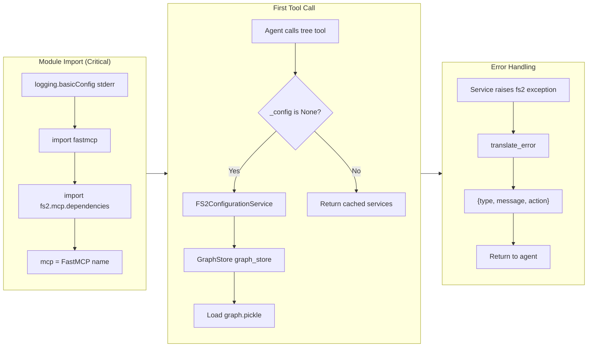
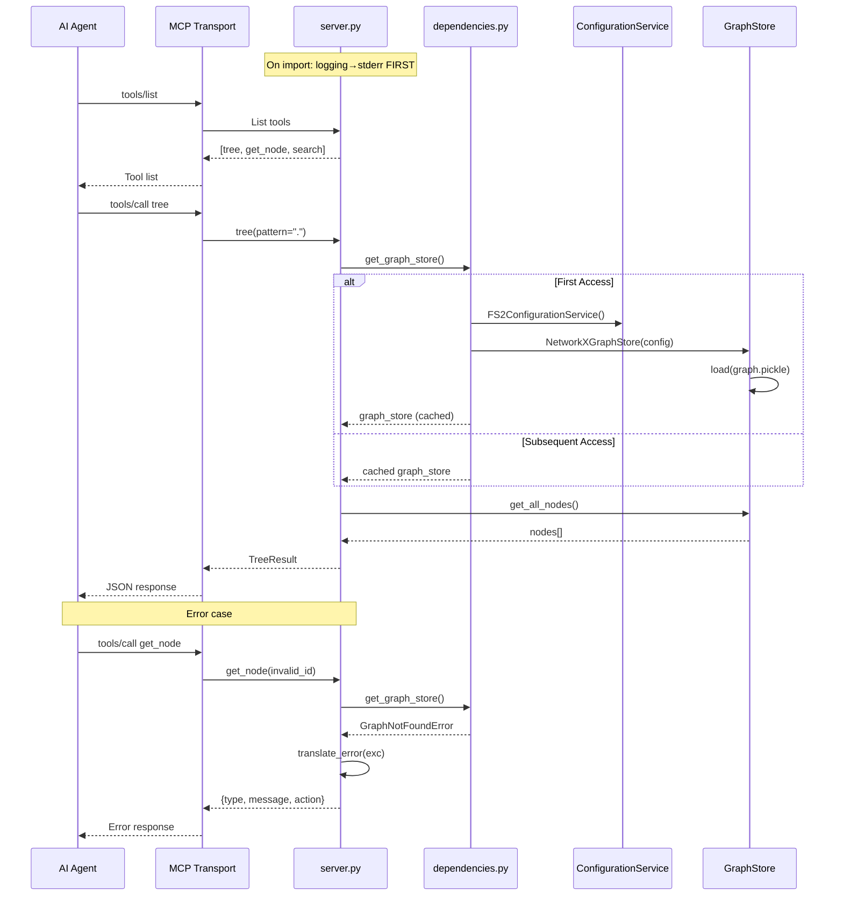

# Phase 1: Core Infrastructure – Tasks & Alignment Brief

**Spec**: [../../mcp-spec.md](../../mcp-spec.md)
**Plan**: [../../mcp-plan.md](../../mcp-plan.md)
**Date**: 2025-12-27
**Phase Slug**: `phase-1-core-infrastructure`

---

## Executive Briefing

### Purpose

This phase establishes the foundational MCP server infrastructure that all tool implementations will build upon. It creates the FastMCP server instance, dependency injection pattern, error translation layer, and test fixtures—ensuring protocol compliance from the very first line of code.

### What We're Building

A core MCP server module (`src/fs2/mcp/`) containing:
- **`dependencies.py`**: Lazy service initialization providing `ConfigurationService`, `GraphStore`, and `EmbeddingAdapter` on first access with singleton caching
- **`server.py`**: FastMCP server instance with stderr-only logging configuration (CRITICAL for MCP protocol)
- **Error translation layer**: Converts fs2 domain exceptions to agent-friendly structured responses
- **Test infrastructure**: Reusable fixtures with existing `FakeConfigurationService`, `FakeGraphStore`, and `FakeEmbeddingAdapter`

### User Value

AI coding agents gain reliable, protocol-compliant access to fs2's code intelligence services. The foundation ensures:
- Zero stdout pollution (MCP protocol requirement)
- Consistent error responses that help agents self-correct
- Fast startup via lazy loading

### Example

**Before**: Agent attempts to use fs2 but import causes Rich console output to stdout, breaking MCP JSON-RPC communication.

**After**:
```python
# server.py loads with zero stdout output
import fs2.mcp.server  # stdout remains empty
mcp = fs2.mcp.server.mcp  # FastMCP instance ready
```

---

## Objectives & Scope

### Objective

Establish MCP server core infrastructure with protocol-compliant logging, lazy service initialization, and error translation per plan acceptance criteria.

### Goals

- ✅ Add `fastmcp>=0.4.0` dependency to `pyproject.toml`
- ✅ Create `src/fs2/mcp/` module structure (NOT under `core/` per Doctrine validator)
- ✅ Implement lazy service initialization with singleton caching
- ✅ Configure stderr-only logging BEFORE any imports (Critical Discovery 01)
- ✅ Create FastMCP server instance without tools (tools added in Phase 2-4)
- ✅ Implement error translation to agent-friendly format
- ✅ Establish test fixtures reusing existing Fakes

### Non-Goals

- ❌ Implementing any MCP tools (Phase 2-4)
- ❌ CLI integration (`fs2 mcp` command) (Phase 5)
- ❌ Documentation or README (Phase 6)
- ❌ Authentication or authorization mechanisms
- ❌ Performance optimization or caching beyond singleton pattern
- ❌ Support for HTTP/SSE transport (STDIO only for MVP)

---

## Architecture Map

### Component Diagram

```mermaid
flowchart TD
    classDef pending fill:#9E9E9E,stroke:#757575,color:#fff
    classDef inprogress fill:#FF9800,stroke:#F57C00,color:#fff
    classDef completed fill:#4CAF50,stroke:#388E3C,color:#fff
    classDef blocked fill:#F44336,stroke:#D32F2F,color:#fff

    style Phase fill:#F5F5F5,stroke:#E0E0E0
    style Files fill:#F5F5F5,stroke:#E0E0E0
    style Tests fill:#F5F5F5,stroke:#E0E0E0
    style Fakes fill:#F5F5F5,stroke:#E0E0E0

    subgraph Phase["Phase 1: Core Infrastructure"]
        T001["T001: Test stdout isolation ✓"]:::completed
        T002["T002: Test lazy init ✓"]:::completed
        T003["T003: Test error translation ✓"]:::completed
        T004["T004: Add fastmcp dep ✓"]:::completed
        T005["T005: Create module structure ✓"]:::completed
        T006["T006: Impl dependencies.py ✓"]:::completed
        T007["T007: Impl server.py ✓"]:::completed
        T008["T008: Impl error translation ✓"]:::completed
        T009["T009: Create conftest fixtures ✓"]:::completed
        T010["T010: MCPLoggingConfig adapter ✓"]:::completed

        T001 --> T007
        T002 --> T006
        T003 --> T008
        T004 --> T005
        T004 --> T010
        T005 --> T006
        T005 --> T007
        T006 --> T007
        T010 --> T007
        T007 --> T008
        T009 --> T001
        T009 --> T002
        T009 --> T003
    end

    subgraph Files["Implementation Files"]
        F1["/workspaces/flow_squared/pyproject.toml ✓"]:::completed
        F2["/workspaces/flow_squared/src/fs2/mcp/__init__.py ✓"]:::completed
        F3["/workspaces/flow_squared/src/fs2/mcp/dependencies.py ✓"]:::completed
        F4["/workspaces/flow_squared/src/fs2/mcp/server.py ✓"]:::completed
        F5["/workspaces/flow_squared/src/fs2/core/adapters/logging_config.py ✓"]:::completed
    end

    subgraph Tests["Test Files"]
        T_proto["/workspaces/flow_squared/tests/mcp_tests/test_protocol.py ✓"]:::completed
        T_deps["/workspaces/flow_squared/tests/mcp_tests/test_dependencies.py ✓"]:::completed
        T_err["/workspaces/flow_squared/tests/mcp_tests/test_errors.py ✓"]:::completed
        T_conf["/workspaces/flow_squared/tests/mcp_tests/conftest.py ✓"]:::completed
    end

    subgraph Fakes["Existing Fakes (Reuse)"]
        FK1["/workspaces/flow_squared/src/fs2/config/service.py::FakeConfigurationService"]
        FK2["/workspaces/flow_squared/src/fs2/core/repos/graph_store_fake.py::FakeGraphStore"]
        FK3["/workspaces/flow_squared/src/fs2/core/adapters/embedding_adapter_fake.py::FakeEmbeddingAdapter"]
    end

    T004 -.-> F1
    T005 -.-> F2
    T006 -.-> F3
    T007 -.-> F4
    T008 -.-> F4
    T010 -.-> F5
    T001 -.-> T_proto
    T002 -.-> T_deps
    T003 -.-> T_err
    T009 -.-> T_conf

    T_conf -.-> FK1
    T_conf -.-> FK2
    T_conf -.-> FK3
```

<!-- Status: grey=pending, orange=in-progress, green=completed, red=blocked -->
<!-- Updated by plan-6 during implementation -->



### Task-to-Component Mapping

<!-- Status: ⬜ Pending | 🟧 In Progress | ✅ Complete | 🔴 Blocked -->

| Task | Component(s) | Files | Status | Comment |
|------|-------------|-------|--------|---------|
| T001 | Protocol Compliance | test_protocol.py | ✅ Complete | TDD: Verify zero stdout on import (Critical Discovery 01) |
| T002 | Lazy Initialization | test_dependencies.py | ✅ Complete | TDD: Services created on first access, cached after |
| T003 | Error Translation | test_errors.py | ✅ Complete | TDD: fs2 exceptions → agent-friendly dicts |
| T004 | Dependencies | pyproject.toml | ✅ Complete | Add fastmcp>=0.4.0 |
| T005 | Module Structure | src/fs2/mcp/__init__.py | ✅ Complete | Create mcp package (NOT under core/) |
| T006 | Service Dependencies | dependencies.py | ✅ Complete | Lazy init with singleton pattern |
| T007 | FastMCP Server | server.py | ✅ Complete | MCP instance with stderr logging |
| T008 | Error Handler | server.py | ✅ Complete | translate_error() function |
| T009 | Test Fixtures | conftest.py | ✅ Complete | Reuse existing Fakes |
| T010 | Logging Config | logging_config.py | ✅ Complete | MCPLoggingConfig adapter - routes all fs2 logs to stderr |

---

## Tasks

| Status | ID | Task | CS | Type | Dependencies | Absolute Path(s) | Validation | Subtasks | Notes |
|--------|------|------|-----|------|--------------|------------------|------------|----------|-------|
| [x] | T001 | Write test for stdout isolation during import | 2 | Test | T009 | `/workspaces/flow_squared/tests/mcp_tests/test_protocol.py` | Test captures stdout during import, asserts empty | – | Per Critical Discovery 01 · log#task-t001 [^3] |
| [x] | T002 | Write tests for lazy service initialization | 2 | Test | T009 | `/workspaces/flow_squared/tests/mcp_tests/test_dependencies.py` | Tests verify: services None before access, created on first access, cached after | – | 11 tests · log#task-t002 [^4] |
| [x] | T003 | Write test for error translation | 2 | Test | T009 | `/workspaces/flow_squared/tests/mcp_tests/test_errors.py` | Tests verify fs2 exceptions translate to {type, message, action} dicts | – | Per Critical Discovery 05 · log#task-t003 [^10] |
| [x] | T004 | Add fastmcp>=0.4.0 to pyproject.toml | 1 | Setup | – | `/workspaces/flow_squared/pyproject.toml` | `uv sync` succeeds, `import fastmcp` works | – | Updated to >=2.0.0 · log#task-t004 [^5] |
| [x] | T005 | Create src/fs2/mcp/ module structure | 1 | Setup | T004 | `/workspaces/flow_squared/src/fs2/mcp/__init__.py` | Module importable: `import fs2.mcp` | – | Peer to cli/ · log#task-t005 [^6] |
| [x] | T006 | Implement dependencies.py with lazy init | 3 | Core | T002, T005 | `/workspaces/flow_squared/src/fs2/mcp/dependencies.py` | All tests from T002 pass | – | Singleton pattern · log#task-t006 [^7] |
| [x] | T007 | Implement server.py with FastMCP instance | 3 | Core | T001, T005, T006, T010 | `/workspaces/flow_squared/src/fs2/mcp/server.py` | mcp instance created; T001 test passes (zero stdout) | – | CRITICAL: logging before imports · log#task-t007 [^8] |
| [x] | T008 | Implement error translation in server.py | 2 | Core | T003, T007 | `/workspaces/flow_squared/src/fs2/mcp/server.py` | All error tests from T003 pass | – | translate_error() · log#task-t008 [^11] |
| [x] | T009 | Create tests/mcp_tests/conftest.py with fixtures | 2 | Setup | T004 | `/workspaces/flow_squared/tests/mcp_tests/conftest.py` | Fixtures available: fake_config, fake_graph_store, fake_embedding_adapter | – | make_code_node() helper · log#task-t009 [^9] |
| [x] | T010 | Create MCPLoggingConfig adapter | 2 | Core | T004 | `/workspaces/flow_squared/src/fs2/core/adapters/logging_config.py` | Adapter configures stderr-only logging; test verifies no stdout | – | stderr-only logging · log#task-t010 [^12] |

---

## Discoveries & Learnings

| Date | Task | Type | Discovery | Resolution | References |
|------|------|------|-----------|------------|------------|
| 2025-12-28 | T004 | insight | FastMCP is now at v2.14.1, much newer than 0.4.0 in original plan | Pinned to `>=2.0.0` to use modern API | log#task-t004 |
| 2025-12-28 | T006 | gotcha | NetworkXGraphStore is in `graph_store_impl.py`, not `graph_store_networkx.py` | Fixed import path | log#task-t006 |
| 2025-12-28 | T007 | **unexpected-behavior** | `tests/mcp/` directory shadows installed `mcp` package! Tests failed with `ModuleNotFoundError: No module named 'mcp.types'` even though the package was installed | Renamed to `tests/mcp_tests/` to avoid namespace collision | log#task-t007 |
| 2025-12-28 | T009 | gotcha | CodeNode has many required fields (ts_kind, qualified_name, start_column, etc.) | Created `make_code_node()` helper for easier test fixture creation | log#task-t002 |

---

## Alignment Brief

### Critical Findings Affecting This Phase

| Finding | Impact | Tasks Addressing |
|---------|--------|------------------|
| **Critical Discovery 01**: STDIO protocol requires stderr-only logging BEFORE first import | CRITICAL: Any stdout during import breaks MCP JSON-RPC | T001, T007 |
| **High Discovery 03**: GraphStore requires ConfigurationService injection | Service composition pattern must be correct | T006 |
| **High Discovery 05**: Error translation at MCP boundary | Domain exceptions must become agent-friendly responses | T003, T008 |
| **High Discovery 07**: File creation order depends on import chain | server.py must configure logging before importing dependencies | T007 |
| **Medium Discovery 08**: Test fixtures should use existing Fakes | Reuse FakeConfigurationService, FakeGraphStore, FakeEmbeddingAdapter | T009 |

### ADR Decision Constraints

No ADRs exist for this project. N/A.

### Invariants & Guardrails

1. **Protocol Compliance**: Zero stdout during module import or tool execution
2. **Singleton Pattern**: Services must be created once and cached
3. **Error Format**: All errors must include `{type, message, action}` keys
4. **Dependency Flow**: `mcp/` → `core/services/` → `core/repos/` + `core/adapters/`
5. **No External SDK Leakage**: FastMCP types should not leak into domain services

### Inputs to Read

| Path | Purpose |
|------|---------|
| `/workspaces/flow_squared/src/fs2/core/services/tree_service.py` | Reference `_ensure_loaded()` pattern for lazy init |
| `/workspaces/flow_squared/src/fs2/config/service.py` | `FakeConfigurationService`, `FS2ConfigurationService` usage |
| `/workspaces/flow_squared/src/fs2/core/repos/graph_store_fake.py` | `FakeGraphStore` interface |
| `/workspaces/flow_squared/src/fs2/core/adapters/embedding_adapter_fake.py` | `FakeEmbeddingAdapter` interface |
| `/workspaces/flow_squared/src/fs2/core/adapters/exceptions.py` | Domain exception hierarchy |

### Visual Alignment: Flow Diagram



### Visual Alignment: Sequence Diagram



### Test Plan

**Testing Approach**: Full TDD (tests written before implementation)
**Mock Policy**: Targeted mocks (use existing Fakes; mock only MCP transport internals if needed)

| Test File | Test Name | Purpose | Fixtures | Expected Output |
|-----------|-----------|---------|----------|-----------------|
| `test_protocol.py` | `test_no_stdout_on_import` | Verify zero stdout pollution | monkeypatch sys.stdout | `captured == ""` |
| `test_protocol.py` | `test_logging_goes_to_stderr` | Verify logs hit stderr | monkeypatch sys.stderr | `"INFO" in captured` |
| `test_dependencies.py` | `test_config_none_before_first_access` | Lazy init - not created until needed | – | `_config is None` |
| `test_dependencies.py` | `test_config_created_on_first_access` | Config created when accessed | – | `isinstance(config, ConfigurationService)` |
| `test_dependencies.py` | `test_config_cached_after_first_access` | Singleton pattern | – | `config1 is config2` |
| `test_dependencies.py` | `test_graph_store_created_on_first_access` | Graph store lazy init | – | `isinstance(store, GraphStore)` |
| `test_dependencies.py` | `test_graph_store_receives_config` | DI pattern | – | store created with config |
| `test_errors.py` | `test_graph_not_found_error_translation` | GraphNotFoundError → dict | – | `{type: "GraphNotFoundError", action: "Run fs2 scan..."}` |
| `test_errors.py` | `test_search_error_translation` | SearchError → dict | – | `{type: "SearchError", message: "..."}` |
| `test_errors.py` | `test_unknown_error_translation` | Unknown exception → generic dict | – | `{type: "Exception", action: None}` |

### Step-by-Step Implementation Outline

1. **T009**: Create `tests/mcp/conftest.py` with fixtures that import existing Fakes
2. **T001**: Write `test_protocol.py::test_no_stdout_on_import` (MUST FAIL initially)
3. **T002**: Write `test_dependencies.py` tests for lazy init (MUST FAIL initially)
4. **T003**: Write `test_errors.py` tests for error translation (MUST FAIL initially)
5. **T004**: Add `fastmcp>=0.4.0` to `pyproject.toml`, run `uv sync`
6. **T005**: Create `src/fs2/mcp/__init__.py` (empty, enables import)
7. **T006**: Implement `dependencies.py` with lazy init → T002 tests pass
8. **T007**: Implement `server.py` with stderr logging first → T001 tests pass
9. **T008**: Implement `translate_error()` in `server.py` → T003 tests pass

### Commands to Run

```bash
# Environment setup
cd /workspaces/flow_squared
uv sync

# Run Phase 1 tests (should fail initially, then pass)
uv run pytest tests/mcp/ -v

# Run specific test files
uv run pytest tests/mcp/test_protocol.py -v
uv run pytest tests/mcp/test_dependencies.py -v
uv run pytest tests/mcp/test_errors.py -v

# Type checking (if enabled)
uv run ruff check src/fs2/mcp/

# Lint
uv run ruff check src/fs2/mcp/ tests/mcp/ --fix

# Full test suite to ensure no regressions
uv run pytest tests/ -v --ignore=tests/integration/
```

### Risks & Unknowns

| Risk | Severity | Likelihood | Mitigation |
|------|----------|------------|------------|
| FastMCP version incompatibility | HIGH | LOW | Pin `>=0.4.0`, test import |
| Import chain triggers stdout before logging configured | HIGH | MEDIUM | Test first (T001); configure logging as FIRST statement in server.py |
| Singleton pattern breaks test isolation | MEDIUM | MEDIUM | Use `reset_services()` function in fixtures |
| Rich console auto-imports cause stdout | MEDIUM | MEDIUM | Avoid importing Rich in mcp module; or configure Console(stderr=True) |

### Ready Check

- [x] Critical Findings mapped to tasks (T001→CD01, T006→CD03, T008→CD05)
- [x] Existing Fakes identified (FakeConfigurationService, FakeGraphStore, FakeEmbeddingAdapter)
- [x] Module placement confirmed (`src/fs2/mcp/` NOT `src/fs2/core/mcp/`)
- [x] TDD order verified (test tasks T001-T003 before implementation tasks T006-T008)
- [x] Dependencies chain clear (T009 → T001-T003 → T004-T005 → T006-T008)
- [ ] **Awaiting explicit GO/NO-GO from user**

---

## Phase Footnote Stubs

<!-- Populated by plan-6a during implementation -->

| Footnote | Task | Description | Reference |
|----------|------|-------------|-----------|
| [^3] | T001 | Stdout isolation tests | 3 tests in test_protocol.py |
| [^4] | T002 | Lazy service initialization tests | 11 tests in test_dependencies.py |
| [^5] | T004 | FastMCP dependency | fastmcp>=2.0.0 in pyproject.toml |
| [^6] | T005 | MCP module structure | src/fs2/mcp/__init__.py |
| [^7] | T006 | Lazy init implementation | 5 functions in dependencies.py |
| [^8] | T007 | FastMCP server instance | mcp instance in server.py |
| [^9] | T009 | Test fixtures | conftest.py with make_code_node() |
| [^10] | T003 | Error translation tests | 7 tests in test_errors.py |
| [^11] | T008 | Error translation implementation | translate_error() function |
| [^12] | T010 | MCPLoggingConfig adapter | Logging adapter for stderr |

**See**: [../../mcp-plan.md#change-footnotes-ledger](../../mcp-plan.md#change-footnotes-ledger) for full FlowSpace node IDs

---

## Evidence Artifacts

Implementation evidence will be written to:
- **Execution Log**: `/workspaces/flow_squared/docs/plans/011-mcp/tasks/phase-1-core-infrastructure/execution.log.md`
- **Test Results**: pytest output captured in execution log
- **Code Diffs**: Referenced in execution log entries

---

## Discoveries & Learnings

_Populated during implementation by plan-6. Log anything of interest to your future self._

| Date | Task | Type | Discovery | Resolution | References |
|------|------|------|-----------|------------|------------|
| | | | | | |

**Types**: `gotcha` | `research-needed` | `unexpected-behavior` | `workaround` | `decision` | `debt` | `insight`

**What to log**:
- Things that didn't work as expected
- External research that was required
- Implementation troubles and how they were resolved
- Gotchas and edge cases discovered
- Decisions made during implementation
- Technical debt introduced (and why)
- Insights that future phases should know about

_See also: `execution.log.md` for detailed narrative._

---

## Directory Layout

```
docs/plans/011-mcp/
├── mcp-spec.md
├── mcp-plan.md
├── research-dossier.md
└── tasks/
    └── phase-1-core-infrastructure/
        ├── tasks.md                 # This file
        └── execution.log.md         # Created by plan-6 during implementation
```

---

## Test Code Examples

### T001: test_protocol.py

```python
"""Tests for MCP protocol compliance - stdout isolation.

Per Critical Discovery 01: STDIO protocol requires stderr-only logging.
Any stdout during import breaks MCP JSON-RPC communication.
"""
import sys
from io import StringIO


class TestProtocolCompliance:
    """Verify MCP protocol requirements."""

    def test_no_stdout_on_import(self, monkeypatch):
        """Importing fs2.mcp.server produces zero stdout output.

        This is CRITICAL for MCP protocol compliance. The JSON-RPC
        transport uses stdout exclusively for protocol messages.
        Any other output (logs, Rich formatting, print statements)
        will corrupt the protocol stream.

        Per Critical Discovery 01.
        """
        # Capture stdout
        captured = StringIO()
        monkeypatch.setattr(sys, "stdout", captured)

        # Force reimport to test import-time behavior
        import importlib

        # Remove cached module if present
        for mod_name in list(sys.modules.keys()):
            if mod_name.startswith("fs2.mcp"):
                del sys.modules[mod_name]

        # Import should produce ZERO stdout
        import fs2.mcp.server  # noqa: F401

        assert captured.getvalue() == "", (
            f"Expected zero stdout on import, got: {captured.getvalue()!r}"
        )

    def test_logging_goes_to_stderr(self, monkeypatch, capfd):
        """Verify logging output goes to stderr, not stdout.

        Per Critical Discovery 01: All logging must use stderr.
        """
        import importlib
        import logging

        # Clear any cached modules
        for mod_name in list(sys.modules.keys()):
            if mod_name.startswith("fs2.mcp"):
                del sys.modules[mod_name]

        import fs2.mcp.server

        # Trigger a log message
        logging.getLogger("fs2.mcp").info("Test log message")

        captured = capfd.readouterr()
        assert captured.out == "", "Logs should not appear on stdout"
        # stderr may or may not have the message depending on log level config
```

### T002: test_dependencies.py

```python
"""Tests for lazy service initialization.

Services should be created on first access and cached thereafter.
This enables fast server startup and proper resource management.
"""
import pytest


class TestLazyInitialization:
    """Verify lazy initialization and singleton pattern."""

    def test_config_none_before_first_access(self):
        """Config singleton is None before first access.

        Services should not be created until explicitly requested.
        This enables fast server startup.
        """
        from fs2.mcp import dependencies

        # Reset state
        dependencies.reset_services()

        assert dependencies._config is None

    def test_config_created_on_first_access(self):
        """Config is created when get_config() is called."""
        from fs2.config.service import ConfigurationService
        from fs2.mcp import dependencies

        dependencies.reset_services()

        config = dependencies.get_config()

        assert isinstance(config, ConfigurationService)

    def test_config_cached_after_first_access(self):
        """Config is cached (singleton pattern)."""
        from fs2.mcp import dependencies

        dependencies.reset_services()

        config1 = dependencies.get_config()
        config2 = dependencies.get_config()

        assert config1 is config2, "Config should be cached singleton"

    def test_graph_store_created_on_first_access(self):
        """GraphStore is created when get_graph_store() is called."""
        from fs2.core.repos.graph_store import GraphStore
        from fs2.mcp import dependencies

        dependencies.reset_services()

        store = dependencies.get_graph_store()

        assert isinstance(store, GraphStore)

    def test_graph_store_receives_config(self):
        """GraphStore is constructed with ConfigurationService.

        Per Critical Discovery 03: GraphStore requires ConfigurationService
        injection, not extracted config objects.
        """
        from fs2.mcp import dependencies

        dependencies.reset_services()

        config = dependencies.get_config()
        store = dependencies.get_graph_store()

        # GraphStore should have been created with the same config
        # This is verified by the store being functional
        assert store is not None

    def test_services_reset_clears_cache(self):
        """reset_services() clears all cached singletons."""
        from fs2.mcp import dependencies

        # Create services
        dependencies.get_config()
        dependencies.get_graph_store()

        # Reset
        dependencies.reset_services()

        # Should be None again
        assert dependencies._config is None
        assert dependencies._graph_store is None
```

### FastMCP Client Integration Test Pattern (from Flowspace)

Based on Flowspace's test patterns, we can write **full integration tests** that exercise the real MCP server via FastMCP Client:

```python
"""Integration test pattern for MCP server using FastMCP Client.

This pattern allows testing the complete MCP protocol flow including:
- Tool registration and discovery
- Tool invocation and response handling
- Error translation and protocol compliance

Key imports from fastmcp:
- Client: Async context manager for MCP client
- Server connections: Direct server.mcp access or StdioTransport for subprocess
"""
import json
import pytest
from mcp import Client


class TestMCPServerIntegration:
    """Integration tests using FastMCP Client against real server."""

    @pytest.fixture
    def mcp_server(self):
        """Create MCP server with test configuration.

        Uses FakeGraphStore and FakeConfigurationService to provide
        deterministic test data without external dependencies.
        """
        from fs2.config.service import FakeConfigurationService
        from fs2.config.objects import ScanConfig, GraphConfig
        from fs2.core.repos.graph_store_fake import FakeGraphStore
        from fs2.mcp.server import create_mcp_server

        # Create fake config
        config = FakeConfigurationService(
            ScanConfig(),
            GraphConfig(graph_path="/tmp/test-graph.pickle")
        )

        # Create fake graph store with test nodes
        graph_store = FakeGraphStore(config)
        # graph_store.set_nodes([...])  # Add test data

        # Create server with injected dependencies
        server = create_mcp_server(config=config, graph_store=graph_store)
        return server

    @pytest.mark.asyncio
    async def test_list_tools_returns_expected_tools(self, mcp_server):
        """Verify all expected tools are registered.

        Pattern from Flowspace: async with Client(server.mcp) as client
        """
        async with Client(mcp_server.mcp) as client:
            tools = await client.list_tools()
            tool_names = {tool.name for tool in tools}

            # After Phase 2-4, these tools should exist
            # assert "tree" in tool_names
            # assert "get_node" in tool_names
            # assert "search" in tool_names

            # For Phase 1, verify server starts without tools
            assert isinstance(tool_names, set)

    @pytest.mark.asyncio
    async def test_call_tool_returns_json_response(self, mcp_server):
        """Verify tool calls return parseable JSON responses.

        Pattern from Flowspace:
        result = await client.call_tool("tool_name", {params})
        data = json.loads(result.content[0].text)
        """
        async with Client(mcp_server.mcp) as client:
            # Example for Phase 2+ when tree tool exists:
            # result = await client.call_tool("tree", {"pattern": "."})
            # data = json.loads(result.content[0].text)
            # assert "results" in data or "nodes" in data
            pass  # Phase 1 has no tools yet


class TestMCPCliSubprocess:
    """Test MCP server via CLI subprocess (real protocol test).

    This tests the actual `fs2 mcp` command over STDIO transport.
    Added in Phase 5 after CLI integration is complete.
    """

    @pytest.mark.asyncio
    async def test_mcp_cli_protocol_compliance(self, tmp_path):
        """Test MCP CLI subprocess with FastMCP StdioTransport.

        Pattern from Flowspace test_logger_streams.py:
        """
        from mcp import Client, StdioTransport
        import sys

        transport = StdioTransport(
            command=sys.executable,
            args=["-m", "fs2.cli.main", "mcp"],
            env={"PYTHONUNBUFFERED": "1"},
            cwd=str(tmp_path),
        )

        async with Client(transport) as client:
            # Verify connection works
            assert client is not None

            # List tools to verify server responds
            tools = await client.list_tools()
            assert isinstance(tools, list)
```

### T003: test_errors.py

```python
"""Tests for error translation at MCP boundary.

Per Critical Discovery 05: Domain exceptions must be translated
to agent-friendly structured responses at the MCP boundary.
"""
import pytest

from fs2.core.adapters.exceptions import GraphStoreError


class TestErrorTranslation:
    """Verify error translation produces agent-friendly responses."""

    def test_graph_not_found_error_translation(self):
        """GraphStoreError translates to actionable response.

        Agent should know to run 'fs2 scan' to fix the problem.
        """
        from fs2.mcp.server import translate_error

        exc = GraphStoreError("Graph file not found at .fs2/graph.pickle")
        result = translate_error(exc)

        assert result["type"] == "GraphStoreError"
        assert "not found" in result["message"].lower()
        assert result["action"] is not None
        assert "fs2 scan" in result["action"].lower()

    def test_search_error_translation(self):
        """SearchError translates with appropriate message."""
        from fs2.mcp.server import translate_error

        # Create a search-related error
        exc = ValueError("Invalid regex pattern: [unclosed")
        result = translate_error(exc)

        assert result["type"] == "ValueError"
        assert "regex" in result["message"].lower() or "pattern" in result["message"].lower()

    def test_unknown_error_translation(self):
        """Unknown exceptions get generic translation."""
        from fs2.mcp.server import translate_error

        exc = RuntimeError("Something unexpected happened")
        result = translate_error(exc)

        assert result["type"] == "RuntimeError"
        assert result["message"] == "Something unexpected happened"
        # Unknown errors may not have actionable guidance
        assert "action" in result

    def test_error_response_has_required_keys(self):
        """All error responses have type, message, action keys."""
        from fs2.mcp.server import translate_error

        exc = Exception("Test error")
        result = translate_error(exc)

        assert "type" in result
        assert "message" in result
        assert "action" in result
```

---

**STOP**: Implementation tasks should NOT proceed until explicit **GO** from user.
