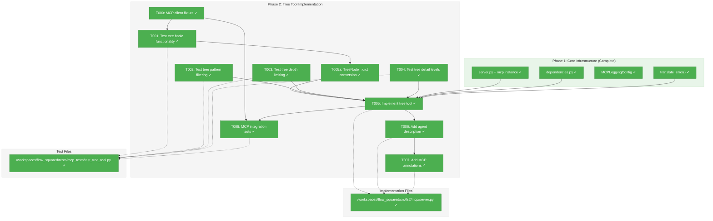
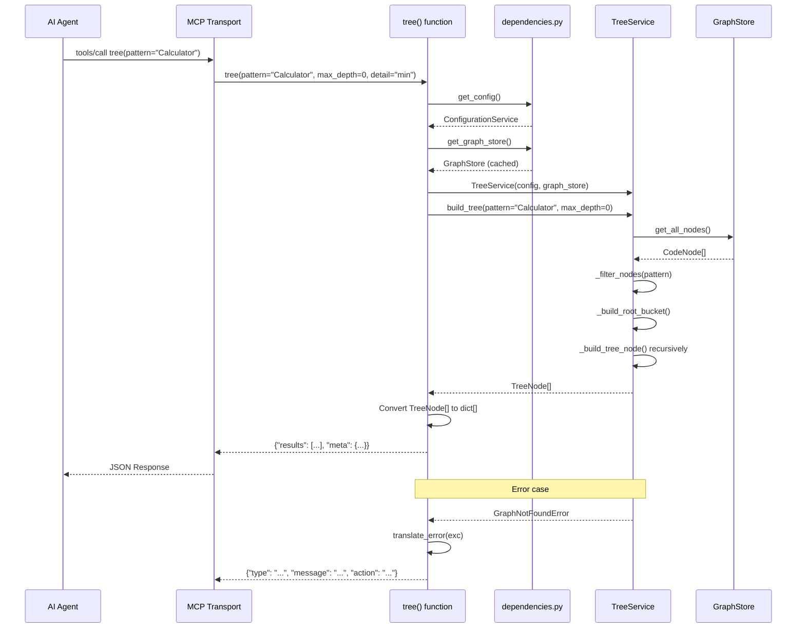

# Phase 2: Tree Tool Implementation – Tasks & Alignment Brief

**Spec**: [../../mcp-spec.md](../../mcp-spec.md)
**Plan**: [../../mcp-plan.md](../../mcp-plan.md)
**Date**: 2025-12-30
**Phase Slug**: `phase-2-tree-tool-implementation`

---

## Executive Briefing

### Purpose

This phase implements the first MCP tool (`tree`) that enables AI agents to explore the hierarchical structure of indexed codebases. It transforms the existing TreeService into an agent-accessible tool with proper annotations, schema generation, and agent-optimized descriptions.

### What We're Building

The `tree` MCP tool registered in `server.py` that:
- Accepts filtering patterns (glob, substring, exact match)
- Supports depth limiting for scoped exploration
- Returns structured JSON with node hierarchy
- Includes agent-optimized description with prerequisites and workflow hints
- Uses MCP annotations (`readOnlyHint=true`, etc.) for proper client behavior

### User Value

AI agents gain the ability to programmatically explore codebase structure before diving into specifics. An agent can:
1. Call `tree(pattern=".")` to see the entire codebase architecture
2. Call `tree(pattern="Calculator", max_depth=2)` to focus on specific components
3. Use returned `node_id` values with `get_node` (Phase 3) for full source code

### Example

**Agent Request**:
```json
{"method": "tools/call", "params": {"name": "tree", "arguments": {"pattern": "Calculator", "max_depth": 2, "detail": "max"}}}
```

**Response**:
```json
{
  "results": [
    {
      "node_id": "class:src/calculator.py:Calculator",
      "name": "Calculator",
      "category": "class",
      "start_line": 5,
      "end_line": 45,
      "signature": "class Calculator",
      "children": [
        {
          "node_id": "callable:src/calculator.py:Calculator.add",
          "name": "add",
          "category": "callable",
          "start_line": 10,
          "end_line": 15,
          "signature": "def add(self, a: int, b: int) -> int",
          "children": []
        }
      ]
    }
  ],
  "meta": {"total_nodes": 2, "pattern": "Calculator", "depth": 2}
}
```

---

## Objectives & Scope

### Objective

Implement the `tree` MCP tool following the plan acceptance criteria (AC1, AC2, AC3) with agent-optimized descriptions and protocol compliance.

### Goals

- ✅ Implement tree tool in server.py using `@mcp.tool()` decorator
- ✅ Support pattern filtering (exact, glob, substring per TreeService)
- ✅ Support max_depth limiting (0 = unlimited)
- ✅ Support detail levels (min/max output formatting)
- ✅ Add MCP annotations (readOnlyHint, destructiveHint, etc.)
- ✅ Copy agent-optimized description from research dossier
- ✅ Return structured JSON matching tool specification
- ✅ Write comprehensive TDD tests (tests first)

### Non-Goals

- ❌ Modifying TreeService (use as-is via composition)
- ❌ Implementing get_node or search tools (Phase 3-4)
- ❌ CLI integration (Phase 5)
- ❌ Adding caching or performance optimization
- ❌ HTTP transport (STDIO only)
- ❌ Rich formatting (JSON responses only)

---

## Architecture Map

### Component Diagram

<!-- Status: grey=pending, orange=in-progress, green=completed, red=blocked -->
<!-- Updated by plan-6 during implementation -->



### Task-to-Component Mapping

<!-- Status: ⬜ Pending | 🟧 In Progress | ✅ Complete | 🔴 Blocked -->

| Task | Component(s) | Files | Status | Comment |
|------|-------------|-------|--------|---------|
| T000 | MCP Client Fixture | conftest.py | ✅ Complete | CRITICAL: async MCP client with injected fakes |
| T001 | Tree Tool Tests | test_tree_tool.py | ✅ Complete | TDD: Verify tree returns hierarchical list |
| T002 | Tree Tool Tests | test_tree_tool.py | ✅ Complete | TDD: Verify pattern filtering (glob, substring) |
| T003 | Tree Tool Tests | test_tree_tool.py | ✅ Complete | TDD: Verify max_depth limiting |
| T004 | Tree Tool Tests | test_tree_tool.py | ✅ Complete | TDD: node_id always present; min vs max detail levels |
| T005a | Conversion Helper | server.py | ✅ Complete | _tree_node_to_dict() recursive converter |
| T005 | Tree Tool | server.py | ✅ Complete | Implement tree() function with @mcp.tool() |
| T006 | Tool Description | server.py | ✅ Complete | Add agent-optimized docstring from research |
| T007 | MCP Annotations | server.py | ✅ Complete | Add readOnlyHint, destructiveHint, etc. |
| T008 | MCP Integration | test_tree_tool.py | ✅ Complete | CRITICAL: Test via client.call_tool(), not direct Python |

---

## Tasks

| Status | ID | Task | CS | Type | Dependencies | Absolute Path(s) | Validation | Subtasks | Notes |
|--------|------|------|-----|------|--------------|------------------|------------|----------|-------|
| [x] | T000 | Add mcp_client fixture to conftest.py | 2 | Setup | – | `/workspaces/flow_squared/tests/mcp_tests/conftest.py` | Fixture provides async MCP client with injected fakes; `async with Client(mcp)` pattern works | – | CRITICAL: Enables protocol-level testing; documented in Phase 1 but not implemented |
| [x] | T001 | Write tests for tree tool basic functionality | 2 | Test | T000 | `/workspaces/flow_squared/tests/mcp_tests/test_tree_tool.py` | Test verifies: pattern "." returns hierarchical list with node_id, name, category, children | – | Per plan 2.1; uses fake_graph_store fixture |
| [x] | T002 | Write tests for tree tool pattern filtering | 2 | Test | T001 | `/workspaces/flow_squared/tests/mcp_tests/test_tree_tool.py` | Test verifies: pattern "Calculator" returns only matching nodes | – | Per plan 2.2; tests glob and substring |
| [x] | T003 | Write tests for tree tool depth limiting | 2 | Test | T001 | `/workspaces/flow_squared/tests/mcp_tests/test_tree_tool.py` | Test verifies: max_depth=1 returns root nodes only; hidden_children_count populated | – | Per plan 2.3 |
| [x] | T004 | Write tests for tree tool detail levels | 2 | Test | T001 | `/workspaces/flow_squared/tests/mcp_tests/test_tree_tool.py` | Test verifies: node_id ALWAYS present; min excludes signature; max includes signature + smart_content | – | Per plan 2.4; node_id required for get_node workflow |
| [x] | T005 | Implement tree tool in server.py | 3 | Core | T001, T002, T003, T004, T005a | `/workspaces/flow_squared/src/fs2/mcp/server.py` | All tests from T001-T004 pass | – | Per plan 2.5; sync function; composes TreeService |
| [x] | T005a | Implement _tree_node_to_dict() conversion helper | 2 | Core | T001 | `/workspaces/flow_squared/src/fs2/mcp/server.py` | Converts TreeNode→dict with correct fields per detail level; recursive for children | – | Fields: node_id, name, category, start_line, end_line, children (always); signature, smart_content (max only); hidden_children_count (when >0) |
| [x] | T006 | Add agent-optimized description to tree tool | 1 | Doc | T005 | `/workspaces/flow_squared/src/fs2/mcp/server.py` | Description matches research dossier template; includes prerequisites, workflow hints, return format | – | Per plan 2.6; per Critical Discovery 02 |
| [x] | T007 | Add MCP annotations to tree tool | 1 | Core | T005 | `/workspaces/flow_squared/src/fs2/mcp/server.py` | Annotations set: readOnlyHint=True, destructiveHint=False, idempotentHint=True, openWorldHint=False | – | Per plan 2.7 |
| [x] | T008 | Write MCP protocol integration tests | 3 | Test | T000, T005 | `/workspaces/flow_squared/tests/mcp_tests/test_tree_tool.py` | Tests use mcp_client fixture; tool callable via `client.call_tool()`; response parses as JSON; isError=False on success | – | CRITICAL: Must test via actual MCP protocol, not direct Python calls |

---

## Alignment Brief

### Prior Phase Review (Phase 1)

#### Phase 1 Summary: Core Infrastructure

**Status**: COMPLETE (10/10 tasks, 21 tests passing)

**Deliverables Created**:
| File | Purpose |
|------|---------|
| `/workspaces/flow_squared/src/fs2/mcp/__init__.py` | Module marker |
| `/workspaces/flow_squared/src/fs2/mcp/server.py` | FastMCP instance `mcp`, `translate_error()` |
| `/workspaces/flow_squared/src/fs2/mcp/dependencies.py` | `get_config()`, `get_graph_store()`, `set_*()`, `reset_services()` |
| `/workspaces/flow_squared/src/fs2/core/adapters/logging_config.py` | `MCPLoggingConfig` for stderr-only logging |
| `/workspaces/flow_squared/tests/mcp_tests/conftest.py` | `make_code_node()`, `fake_config`, `fake_graph_store`, `reset_mcp_dependencies` |
| `/workspaces/flow_squared/tests/mcp_tests/test_protocol.py` | 3 protocol compliance tests |
| `/workspaces/flow_squared/tests/mcp_tests/test_dependencies.py` | 11 lazy init tests |
| `/workspaces/flow_squared/tests/mcp_tests/test_errors.py` | 7 error translation tests |

**Dependencies Exported (Phase 1 → Phase 2)**:
```python
# Use these imports in tree tool implementation
from fs2.mcp.server import mcp, translate_error
from fs2.mcp.dependencies import get_config, get_graph_store
```

**Key Lessons Learned**:
1. **Test directory naming**: Use `tests/mcp_tests/` not `tests/mcp/` to avoid shadowing `mcp` package
2. **Logging order critical**: MCPLoggingConfig MUST be configured before any fs2 imports
3. **FastMCP v2.14.1**: API differs from researched v0.4.0 but compatible
4. **GraphStore import**: Use `from fs2.core.repos.graph_store_impl import NetworkXGraphStore`
5. **Thread safety**: RLock in dependencies.py for singleton safety

**Patterns to Follow**:
```python
# Tool implementation pattern (using FastMCP native error handling)
from fastmcp.exceptions import ToolError
from fs2.mcp.server import mcp
from fs2.mcp.dependencies import get_config, get_graph_store
from fs2.core.adapters.exceptions import GraphNotFoundError, GraphStoreError

@mcp.tool()
def tree(pattern: str = ".") -> list[dict]:
    """[Agent-optimized description]"""
    try:
        config = get_config()
        store = get_graph_store()
        service = TreeService(config=config, graph_store=store)
        result = service.build_tree(pattern=pattern)
        return [_tree_node_to_dict(tn) for tn in result]
    except GraphNotFoundError:
        raise ToolError("Graph not found. Run 'fs2 scan' to create the graph.")
    except GraphStoreError as e:
        raise ToolError(f"Graph error: {e}. The graph file may be corrupted.")
    except Exception as e:
        raise ToolError(f"Unexpected error: {e}")
```

**Note**: FastMCP's `ToolError` sets `isError=True` in the MCP response, which is the
protocol-standard way to signal errors. This keeps return type clean (`list[dict]`)
and follows JSON-RPC error conventions. The `translate_error()` function from Phase 1
remains available for other use cases but is not needed in tool implementations.

**Anti-Patterns to Avoid**:
- ❌ Using `print()` - always use logging
- ❌ Importing fs2 before MCPLoggingConfig - causes stdout pollution
- ❌ Creating services manually - use `get_config()` / `get_graph_store()`
- ❌ Mocking in tests - use FakeConfigurationService, FakeGraphStore
- ❌ Returning `translate_error()` in tools - raise `ToolError` instead (type-safe, protocol-native)

**Test Infrastructure Available**:
```python
# Reuse from conftest.py (Phase 1)
fake_config: FakeConfigurationService     # Pre-configured config
fake_graph_store: FakeGraphStore          # Pre-loaded with 3 test nodes
fake_embedding_adapter: FakeEmbeddingAdapter
sample_node: CodeNode
reset_mcp_dependencies                    # Autouse fixture, clears singletons
make_code_node()                          # Helper for creating test CodeNodes
```

**MCP Test Fixtures (T000 - to be added)**:
```python
# Update conftest.py - follows proven pattern from test_tree_service.py

import pytest
from mcp import Client

@pytest.fixture
def fake_graph_store(tmp_path) -> FakeGraphStore:
    """Create FakeGraphStore with temp file for TreeService compatibility.

    CRITICAL: TreeService._ensure_loaded() checks Path.exists() before calling
    load(). We must create an empty file to satisfy this check. This is the
    proven pattern used in 13+ existing TreeService tests.

    The file can be empty (0 bytes) because FakeGraphStore.load() is a no-op
    that doesn't actually read the file - it just records the call.
    """
    # Create empty graph file to satisfy TreeService._ensure_loaded() check
    graph_path = tmp_path / "graph.pickle"
    graph_path.touch()  # 0-byte file is sufficient

    # Config must point to the temp file location
    config = FakeConfigurationService(
        ScanConfig(),
        GraphConfig(graph_path=str(graph_path)),
    )

    store = FakeGraphStore(config)
    # Pre-load test nodes (FakeGraphStore stores in-memory, ignores file)
    store.set_nodes([
        make_code_node(
            node_id="file:src/calculator.py",
            category="file",
            name="calculator.py",
            content="# Calculator module",
        ),
        make_code_node(
            node_id="class:src/calculator.py:Calculator",
            category="class",
            name="Calculator",
            content="class Calculator:\n    pass",
        ),
        make_code_node(
            node_id="callable:src/calculator.py:Calculator.add",
            category="callable",
            name="add",
            content="def add(self, a, b):\n    return a + b",
            signature="def add(self, a: int, b: int) -> int",
        ),
    ])
    return store, config  # Return both for injection

@pytest.fixture
async def mcp_client(fake_graph_store):
    """Async MCP client connected to server with injected fakes.

    CRITICAL: This fixture enables testing via actual MCP protocol,
    not just direct Python function calls. Tests using this fixture
    validate JSON serialization, schema generation, and protocol framing.
    """
    from fs2.mcp import dependencies
    from fs2.mcp.server import mcp

    store, config = fake_graph_store

    # Inject fakes before creating client
    dependencies.reset_services()
    dependencies.set_config(config)
    dependencies.set_graph_store(store)

    # Yield client connected to server
    async with Client(mcp) as client:
        yield client

    # Cleanup handled by reset_mcp_dependencies autouse fixture

def parse_tool_response(result) -> dict | list:
    """Parse MCP tool call response to Python object."""
    import json
    return json.loads(result.content[0].text)
```

**Why tmp_path.touch() is required**:
TreeService._ensure_loaded() checks `Path(graph_path).exists()` on the REAL filesystem
before calling `graph_store.load()`. If the file doesn't exist, it raises GraphNotFoundError
BEFORE FakeGraphStore is used. The empty file satisfies the existence check, then
FakeGraphStore.load() is a no-op that ignores the file contents. This is the proven
pattern used in all 13+ existing TreeService tests.

---

### Critical Findings Affecting This Phase

| Finding | Impact | Tasks Addressing |
|---------|--------|------------------|
| **Critical Discovery 02**: Tool descriptions drive agent tool selection | CRITICAL: Description must include prerequisites, workflow hints, return format | T006 |
| **High Discovery 04**: Async/Sync pattern separation | HIGH: TreeService is SYNC; use `def tree(...)` not `async def` | T005 |
| **High Discovery 05**: Error translation at boundary | HIGH: Wrap service calls in try/except, use translate_error() | T005 |
| **High Discovery 06**: Don't modify CLI commands | HIGH: Compose TreeService in MCP tool; don't touch tree.py | T005 |
| **Medium Discovery 08**: Use existing Fakes | MEDIUM: Use FakeGraphStore for testing | T001-T004 |

---

### ADR Decision Constraints

No ADRs exist for this project. N/A.

---

### Invariants & Guardrails

1. **Protocol Compliance**: Zero stdout during tool execution
2. **Sync Function**: TreeService is sync; tool must be sync (`def tree(...)`)
3. **Error Format**: All errors via `translate_error()` → `{type, message, action}`
4. **Immutable TreeNodes**: TreeNode is frozen dataclass; convert to dict for JSON
5. **Lazy Loading**: Services accessed via `get_config()` / `get_graph_store()`
6. **No Rich Console**: MCP context uses JSON only; no Rich formatting

---

### Inputs to Read

| Path | Purpose |
|------|---------|
| `/workspaces/flow_squared/src/fs2/core/services/tree_service.py` | TreeService.build_tree() signature and behavior |
| `/workspaces/flow_squared/src/fs2/core/models/tree_node.py` | TreeNode dataclass (frozen, recursive) |
| `/workspaces/flow_squared/src/fs2/core/models/code_node.py` | CodeNode fields for dict conversion |
| `/workspaces/flow_squared/src/fs2/cli/tree.py` | Reference CLI implementation (don't modify) |
| `/workspaces/flow_squared/docs/plans/011-mcp/mcp-plan.md` § 4 | Tool Specifications (description template) |
| `/workspaces/flow_squared/docs/plans/011-mcp/research-dossier.md` § MCP Tool Specifications | Agent-optimized description |

---

### Visual Alignment: Flow Diagram

```mermaid
flowchart LR
    subgraph Agent["AI Agent"]
        A[Call tree tool] --> B[JSON-RPC Request]
    end

    subgraph MCP["MCP Server"]
        B --> C{tree function}
        C --> D[get_config]
        D --> E[get_graph_store]
        E --> F[TreeService.build_tree]
        F --> G[TreeNode list]
        G --> H[Convert to dict list]
        H --> I[JSON Response]
    end

    subgraph Error["Error Path"]
        F -.->|Exception| J[translate_error]
        J --> K[{type, message, action}]
        K --> I
    end

    I --> L[Agent receives results]
```

### Visual Alignment: Sequence Diagram



---

### Test Plan

**Testing Approach**: Full TDD (tests written before implementation)
**Mock Policy**: Use existing Fakes (FakeGraphStore, FakeConfigurationService); no mocking

| Test File | Test Name | Purpose | Fixtures | Expected Output |
|-----------|-----------|---------|----------|-----------------|
| `test_tree_tool.py` | `test_tree_returns_hierarchical_list` | Verify basic structure | fake_graph_store | List with node_id, name, category, children |
| `test_tree_tool.py` | `test_tree_filters_by_pattern` | Verify pattern filtering | fake_graph_store | Only matching nodes returned |
| `test_tree_tool.py` | `test_tree_filters_by_glob_pattern` | Verify glob pattern | fake_graph_store | `*.py` matches Python files |
| `test_tree_tool.py` | `test_tree_respects_max_depth` | Verify depth limiting | fake_graph_store | max_depth=1 → root only, hidden_count populated |
| `test_tree_tool.py` | `test_tree_min_detail_excludes_signature` | Verify min detail | fake_graph_store | No signature in output |
| `test_tree_tool.py` | `test_tree_max_detail_includes_signature` | Verify max detail | fake_graph_store | Signature included |
| `test_tree_tool.py` | `test_tree_handles_graph_not_found` | Verify error handling | – (no graph) | translate_error response |
| `test_tree_tool.py` | `test_tree_no_stdout_pollution` | Protocol compliance | monkeypatch stdout | stdout empty after call |
| `test_tree_tool.py` | `test_tree_returns_valid_json` | JSON serialization | fake_graph_store | json.dumps() succeeds |

---

### Step-by-Step Implementation Outline

1. **T001**: Create `test_tree_tool.py` with `test_tree_returns_hierarchical_list` (MUST FAIL)
2. **T002**: Add pattern filtering tests (MUST FAIL)
3. **T003**: Add depth limiting tests (MUST FAIL)
4. **T004**: Add detail level tests (MUST FAIL)
5. **T005**: Implement `tree()` function in `server.py`:
   - Add `@mcp.tool()` decorator
   - Get services via `get_config()`, `get_graph_store()`
   - Create TreeService, call `build_tree()`
   - Convert TreeNode list to dict list
   - Wrap in try/except with `translate_error()`
6. **T006**: Add agent-optimized description (copy from research dossier)
7. **T007**: Add MCP annotations (readOnlyHint, etc.)
8. **T008**: Add protocol compliance tests (JSON validity, no stdout)

---

### Commands to Run

```bash
# Environment setup
cd /workspaces/flow_squared
uv sync

# Run Phase 2 tests only (should fail initially)
uv run pytest tests/mcp_tests/test_tree_tool.py -v

# Run all MCP tests
uv run pytest tests/mcp_tests/ -v

# Run specific test
uv run pytest tests/mcp_tests/test_tree_tool.py::TestTreeTool::test_tree_returns_hierarchical_list -v

# Lint
uv run ruff check src/fs2/mcp/ tests/mcp_tests/ --fix

# Type checking
uv run mypy src/fs2/mcp/

# Full test suite to ensure no regressions
uv run pytest tests/ -v --ignore=tests/integration/
```

---

### Risks & Unknowns

| Risk | Severity | Likelihood | Mitigation |
|------|----------|------------|------------|
| TreeNode → dict conversion incomplete | MEDIUM | LOW | Enumerate all CodeNode fields in conversion |
| FastMCP decorator API mismatch | LOW | LOW | Test with minimal decorator first |
| Async event loop conflicts from test client | MEDIUM | LOW | Use sync tests where possible |
| TreeService raises unexpected exceptions | LOW | LOW | Use generic translate_error fallback |
| Max detail output too large | LOW | LOW | Document size limitations |

---

### Ready Check

- [x] Critical Findings mapped to tasks (T005→CD04, CD05, CD06; T006→CD02)
- [x] Phase 1 deliverables reviewed and understood
- [x] TreeService API studied (build_tree, TreeNode structure)
- [x] Test fixtures available (fake_graph_store with 3 nodes)
- [x] Agent-optimized description template available (research dossier)
- [x] TDD order verified (T001-T004 tests first, then T005 implementation)
- [ ] **Awaiting explicit GO/NO-GO from user**

---

## Phase Footnote Stubs

<!-- Populated by plan-6a during implementation -->

| Footnote | Task | Description | Reference |
|----------|------|-------------|-----------|
| [^13] | T001-T004 | Tree tool TDD test suite (20 tests) | test_tree_tool.py, conftest.py |
| [^14] | T005-T007 | Tree tool implementation + description + annotations | server.py:tree, _tree_node_to_dict |
| [^15] | T000, T008 | MCP protocol integration tests (8 async tests) | conftest.py:mcp_client, TestMCPProtocolIntegration |

**See**: [../../mcp-plan.md#change-footnotes-ledger](../../mcp-plan.md#change-footnotes-ledger) for FlowSpace node IDs

---

## Evidence Artifacts

Implementation evidence will be written to:
- **Execution Log**: `/workspaces/flow_squared/docs/plans/011-mcp/tasks/phase-2-tree-tool-implementation/execution.log.md`
- **Test Results**: pytest output captured in execution log
- **Code Diffs**: Referenced in execution log entries

---

## Discoveries & Learnings

_Populated during implementation by plan-6. Log anything of interest to your future self._

| Date | Task | Type | Discovery | Resolution | References |
|------|------|------|-----------|------------|------------|
| 2026-01-01 | T000 | gotcha | TreeService._ensure_loaded() checks Path.exists() before calling load() | Use tmp_path.touch() to create empty file for FakeGraphStore | execution.log.md#task-t000 |
| 2026-01-01 | T000 | insight | FastMCP provides fastmcp.client.Client for in-memory testing | Use Client(mcp) instead of stdio transport for tests | execution.log.md#task-t000 |
| 2026-01-01 | T001-T004 | gotcha | FakeGraphStore.set_nodes() doesn't populate edges | Must call add_edge() separately for parent→child relationships | execution.log.md#task-t001-t004 |
| 2026-01-01 | T003 | unexpected-behavior | max_depth=1 shows root + immediate children, not just root | TreeService uses current_depth >= max_depth check at each level | execution.log.md#task-t001-t004 |
| 2026-01-01 | T005 | decision | Define function separately, then apply @mcp.tool() decorator | FastMCP decorator returns FunctionTool wrapper, not callable function | execution.log.md#task-t005a-t005 |

**Types**: `gotcha` | `research-needed` | `unexpected-behavior` | `workaround` | `decision` | `debt` | `insight`

**What to log**:
- Things that didn't work as expected
- External research that was required
- Implementation troubles and how they were resolved
- Gotchas and edge cases discovered
- Decisions made during implementation
- Technical debt introduced (and why)
- Insights that future phases should know about

_See also: `execution.log.md` for detailed narrative._

---

## Directory Layout

```
docs/plans/011-mcp/
├── mcp-spec.md
├── mcp-plan.md
├── research-dossier.md
└── tasks/
    ├── phase-1-core-infrastructure/
    │   ├── tasks.md
    │   └── execution.log.md
    └── phase-2-tree-tool-implementation/
        ├── tasks.md                 # This file
        └── execution.log.md         # Created by plan-6 during implementation
```

---

## Test Code Examples

### T001-T004: test_tree_tool.py

```python
"""Tests for tree MCP tool.

Phase 2 implements the tree tool for codebase exploration.
Per Critical Discovery 02: Tool descriptions drive agent tool selection.
Per High Discovery 04: TreeService is SYNC; tool must be sync.
"""

import json
import pytest

from tests.mcp_tests.conftest import make_code_node


class TestTreeTool:
    """Tests for tree MCP tool functionality."""

    def test_tree_returns_hierarchical_list(self, fake_graph_store):
        """
        Purpose: Proves tree tool returns correct structure
        Quality Contribution: Ensures agents receive expected format
        Acceptance Criteria:
        - Returns list of nodes
        - Each node has node_id, name, category, children
        """
        from fs2.mcp.server import tree
        from fs2.mcp import dependencies

        dependencies.reset_services()
        dependencies.set_graph_store(fake_graph_store)

        result = tree(pattern=".")

        assert isinstance(result, list)
        assert len(result) > 0
        for node in result:
            assert "node_id" in node
            assert "name" in node
            assert "category" in node
            assert "children" in node

    def test_tree_filters_by_pattern(self, fake_graph_store):
        """
        Purpose: Proves pattern filtering works
        Quality Contribution: Enables targeted codebase exploration
        Acceptance Criteria: Only matching nodes returned
        """
        from fs2.mcp.server import tree
        from fs2.mcp import dependencies

        dependencies.reset_services()
        dependencies.set_graph_store(fake_graph_store)

        result = tree(pattern="Calculator")

        # All returned nodes should contain "Calculator" in node_id
        for node in _flatten_tree(result):
            assert "Calculator" in node["node_id"] or node["node_id"].startswith("class:")

    def test_tree_respects_max_depth(self, fake_graph_store):
        """
        Purpose: Proves depth limiting works
        Quality Contribution: Prevents overwhelming output
        Acceptance Criteria: max_depth=1 returns only root nodes, no expanded children
        """
        from fs2.mcp.server import tree
        from fs2.mcp import dependencies

        dependencies.reset_services()
        dependencies.set_graph_store(fake_graph_store)

        result = tree(pattern=".", max_depth=1)

        # Children should be empty or have hidden_count
        for node in result:
            assert node.get("children", []) == [] or node.get("hidden_children_count", 0) > 0

    def test_tree_node_id_always_present(self, fake_graph_store):
        """
        Purpose: CRITICAL - node_id must be present in ALL detail levels
        Quality Contribution: Enables agent workflow (tree → get_node)
        Acceptance Criteria: node_id in every node at every detail level
        """
        from fs2.mcp.server import tree
        from fs2.mcp import dependencies

        dependencies.reset_services()
        dependencies.set_graph_store(fake_graph_store)

        # Test both detail levels
        for detail in ["min", "max"]:
            result = tree(pattern=".", detail=detail)
            for node in _flatten_tree(result):
                assert "node_id" in node, f"node_id missing in {detail} detail"

    def test_tree_min_detail_excludes_signature(self, fake_graph_store):
        """
        Purpose: Proves min detail is compact (but still has node_id!)
        Quality Contribution: Reduces response size while keeping workflow
        Acceptance Criteria: signature not in min; node_id IS present
        """
        from fs2.mcp.server import tree
        from fs2.mcp import dependencies

        dependencies.reset_services()
        dependencies.set_graph_store(fake_graph_store)

        result = tree(pattern=".", detail="min")

        for node in _flatten_tree(result):
            assert "node_id" in node, "node_id must always be present"
            # signature should not be in min detail
            # (or if present, it's optional - implementation decides)

    def test_tree_max_detail_includes_signature(self, fake_graph_store):
        """
        Purpose: Proves max detail includes full metadata
        Quality Contribution: Enables agents to see signatures
        Acceptance Criteria: signature included for callables
        """
        from fs2.mcp.server import tree
        from fs2.mcp import dependencies

        dependencies.reset_services()
        dependencies.set_graph_store(fake_graph_store)

        result = tree(pattern="add", detail="max")

        # Find the callable node
        callables = [n for n in _flatten_tree(result) if n.get("category") == "callable"]
        if callables:
            assert "signature" in callables[0]

    def test_tree_handles_graph_not_found(self):
        """
        Purpose: Proves error handling works via FastMCP ToolError
        Quality Contribution: Agent receives actionable error via isError=True
        Acceptance Criteria: Raises ToolError with actionable message
        """
        import pytest
        from fastmcp.exceptions import ToolError
        from fs2.mcp.server import tree
        from fs2.mcp import dependencies

        dependencies.reset_services()
        # Don't set any graph store - will use real one which fails

        with pytest.raises(ToolError) as exc_info:
            tree(pattern=".")

        # Should have actionable message
        assert "fs2 scan" in str(exc_info.value).lower()

    def test_tree_no_stdout_pollution(self, fake_graph_store, monkeypatch, capsys):
        """
        Purpose: Proves protocol compliance
        Quality Contribution: No stdout pollution
        Acceptance Criteria: stdout empty after call
        """
        import sys
        from io import StringIO

        from fs2.mcp.server import tree
        from fs2.mcp import dependencies

        dependencies.reset_services()
        dependencies.set_graph_store(fake_graph_store)

        captured = StringIO()
        monkeypatch.setattr(sys, "stdout", captured)

        tree(pattern=".")

        assert captured.getvalue() == "", "Tree tool should not print to stdout"

    def test_tree_returns_valid_json(self, fake_graph_store):
        """
        Purpose: Proves JSON serialization works
        Quality Contribution: Response is parseable by agent
        Acceptance Criteria: json.dumps() succeeds
        """
        from fs2.mcp.server import tree
        from fs2.mcp import dependencies

        dependencies.reset_services()
        dependencies.set_graph_store(fake_graph_store)

        result = tree(pattern=".")

        # Should be JSON-serializable
        json_str = json.dumps(result)
        assert json_str is not None
        assert len(json_str) > 2  # Not empty


def _flatten_tree(nodes: list[dict]) -> list[dict]:
    """Flatten tree structure for easier testing."""
    result = []
    for node in nodes:
        result.append(node)
        if "children" in node and node["children"]:
            result.extend(_flatten_tree(node["children"]))
    return result
```

---

### T008: MCP Protocol Integration Tests

```python
"""MCP protocol integration tests for tree tool.

CRITICAL: These tests use the actual MCP protocol via mcp_client fixture.
They validate that the tool works correctly when called through the
protocol stack, not just as a Python function.
"""

import json
import pytest


class TestTreeToolMCPIntegration:
    """Integration tests using MCP client."""

    @pytest.mark.asyncio
    async def test_tree_tool_callable_via_mcp(self, mcp_client):
        """
        Purpose: CRITICAL - Verify tool works via actual MCP protocol
        Quality Contribution: Catches serialization, schema, framing issues
        Acceptance Criteria: client.call_tool succeeds, response parses
        """
        result = await mcp_client.call_tool("tree", {"pattern": "."})

        # Response should not be an error
        assert not result.isError, f"Tool returned error: {result.content}"

        # Response should parse as JSON
        data = json.loads(result.content[0].text)
        assert isinstance(data, list), "tree should return list"

    @pytest.mark.asyncio
    async def test_tree_tool_returns_node_ids_via_mcp(self, mcp_client):
        """
        Purpose: Verify node_id always present when called via protocol
        Quality Contribution: Ensures agent workflow works
        Acceptance Criteria: Every node has node_id field
        """
        result = await mcp_client.call_tool("tree", {"pattern": ".", "detail": "min"})
        data = json.loads(result.content[0].text)

        def check_node_ids(nodes):
            for node in nodes:
                assert "node_id" in node, "node_id must be in every node"
                if node.get("children"):
                    check_node_ids(node["children"])

        check_node_ids(data)

    @pytest.mark.asyncio
    async def test_tree_tool_error_via_mcp(self, mcp_client):
        """
        Purpose: Verify errors return isError=True via protocol
        Quality Contribution: Agent can detect and handle errors
        Acceptance Criteria: isError=True when graph missing
        """
        from fs2.mcp import dependencies

        # Clear graph store to trigger error
        dependencies.reset_services()
        # Don't inject fake - let it fail

        result = await mcp_client.call_tool("tree", {"pattern": "."})

        # Should be an error response
        assert result.isError, "Missing graph should return isError=True"

    @pytest.mark.asyncio
    async def test_tree_tool_schema_validates_via_mcp(self, mcp_client):
        """
        Purpose: Verify FastMCP validates parameters
        Quality Contribution: Invalid params rejected at protocol level
        Acceptance Criteria: Invalid max_depth type rejected
        """
        # This tests that FastMCP's Pydantic validation works
        result = await mcp_client.call_tool("tree", {"pattern": ".", "max_depth": "invalid"})

        # Should be validation error
        assert result.isError, "Invalid param type should fail validation"
```

---

**STOP**: Implementation tasks should NOT proceed until explicit **GO** from user.

---

## Critical Insights Discussion

**Session**: 2025-12-30
**Context**: Phase 2: Tree Tool Implementation - Tasks & Alignment Brief
**Analyst**: AI Clarity Agent
**Reviewer**: Development Team
**Format**: Water Cooler Conversation (5 Critical Insights)

### Insight 1: TreeNode-to-Dict Conversion Gap

**Did you know**: T005 hides significant complexity because we hadn't specified HOW to convert TreeNode (frozen dataclass with 15+ field CodeNode inside) to the JSON dict format.

**Implications**:
- Need explicit `_tree_node_to_dict()` helper function
- Must decide which CodeNode fields to include/exclude
- Recursive conversion for arbitrary tree depth
- Different field sets for min vs max detail levels

**Options Considered**:
- Option A: Add T005a - TreeNode Conversion Helper (explicit sub-task)
- Option B: Document Field Mapping in T005 Notes
- Option C: Create Models File with Pydantic Schema

**AI Recommendation**: Option A - explicit sub-task for testability

**Decision**: Added T005a to tasks table with explicit field mapping:
- Always: node_id, name, category, start_line, end_line, children
- Max only: signature, smart_content
- When >0: hidden_children_count

**Action Items**: ✅ Completed
- Added T005a to tasks table
- Updated T005 dependencies to include T005a
- Updated architecture diagram

**Affects**: Tasks table, T005 dependencies, architecture diagram

---

### Insight 2: Detail Level Semantics Differ Between CLI and MCP

**Did you know**: The CLI's "min" detail level excludes `node_id` from display, but MCP agents ALWAYS need node_id to call `get_node` afterward?

**Implications**:
- node_id must be present in BOTH min and max detail levels for MCP
- Semantic difference: CLI is for human display, MCP is for agent workflow
- T004 validation was incorrectly stating "max includes node_id"

**Options Considered**:
- Option A: Redefine MCP Detail Levels (node_id always present)
- Option B: Remove Detail Parameter from MCP
- Option C: Add "node_id" to Both Levels Explicitly

**AI Recommendation**: Option A - node_id always present

**Decision**: node_id MUST always be present in both min and max detail levels

**Action Items**: ✅ Completed
- Fixed T004 validation: "node_id ALWAYS present"
- Fixed mcp-plan.md workflow hint (removed "detail=max" requirement)
- Fixed research-dossier.md detail description
- Added explicit `test_tree_node_id_always_present` test

**Affects**: T004, T005a, mcp-plan.md, research-dossier.md

---

### Insight 3: Error Response Type Mismatch

**Did you know**: The tree function signature says `-> list[dict]` but `translate_error()` returns a single `dict`, making them incompatible return types?

**Implications**:
- Type checker complaints
- FastMCP schema generation confusion
- Agent parsing expects list, gets dict on error

**Options Considered**:
- Option A: Use FastMCP's Native Error Handling (raise ToolError)
- Option B: Return Union Type
- Option C: Wrap Error in List
- Option D: Response Envelope Pattern

**AI Recommendation**: Option A - FastMCP native ToolError

**Decision**: Use FastMCP's `ToolError` which sets `isError=True` in MCP response

**Action Items**: ✅ Completed
- Updated implementation pattern to use `raise ToolError(...)`
- Updated error handling test to use `pytest.raises(ToolError)`
- Added anti-pattern note about translate_error() in tools

**Affects**: T005 implementation pattern, error handling tests

---

### Insight 4: No MCP Client Integration Test

**Did you know**: All test examples call `tree()` as a Python function directly, but this doesn't test the actual MCP protocol flow (JSON serialization, schema validation, transport)?

**Implications**:
- Direct function tests don't catch serialization issues
- No validation of FastMCP decorator processing
- Passing unit tests could still fail when called via MCP

**Options Considered**:
- Option A: Add T008a - MCP Client Integration Test
- Option B: Expand T008 Scope to include MCP client tests
- Option C: Defer to Phase 5 CLI Integration

**AI Recommendation**: Add T000 for fixture + expand T008

**Decision**:
- Added T000 as foundational task for MCP client fixture
- Expanded T008 to require protocol-level testing via `client.call_tool()`

**Action Items**: ✅ Completed
- Added T000 to tasks table (MCP client fixture)
- Updated T008 to require MCP protocol testing (CS-2 → CS-3)
- Added mcp_client fixture code to Test Infrastructure section
- Added TestTreeToolMCPIntegration test examples

**Affects**: T000 (new), T001 dependencies, T008 scope, conftest.py

---

### Insight 5: TreeService Requires Filesystem Check

**Did you know**: TreeService._ensure_loaded() checks `Path(graph_path).exists()` on the REAL filesystem BEFORE calling FakeGraphStore.load()? If the file doesn't exist, it raises GraphNotFoundError before FakeGraphStore is even used.

**Implications**:
- Tests need actual file on disk (can be empty)
- FakeGraphStore.load() is a no-op that doesn't read the file
- Must follow existing pattern from test_tree_service.py

**Options Considered**:
- Option A: Create Temp Graph File in Fixture
- Option B: Use tmp_path and Point Config There (proven pattern)
- Option C: Add "pre-loaded" Flag to FakeGraphStore (not feasible)

**AI Recommendation**: Option B - follow proven tmp_path.touch() pattern

**Decision**: Follow exact pattern from 13+ existing TreeService tests

**Action Items**: ✅ Completed
- Updated fake_graph_store fixture to use tmp_path
- Fixture creates empty file via `tmp_path.touch()`
- Added explanation of WHY this is required
- Fixture now returns (store, config) tuple

**Affects**: T000 implementation, fake_graph_store fixture

---

## Session Summary

**Insights Surfaced**: 5 critical insights identified and discussed
**Decisions Made**: 5 decisions reached through collaborative discussion
**Action Items Created**: All completed during session
**Areas Updated**:
- tasks.md: T000, T004, T005, T005a, T008, fixtures, test examples
- mcp-plan.md: workflow hint correction
- research-dossier.md: detail level description correction

**Shared Understanding Achieved**: ✓

**Confidence Level**: High - All patterns validated against existing codebase

**Next Steps**:
Run `/plan-6-implement-phase --phase 2` to begin implementation with Full TDD
