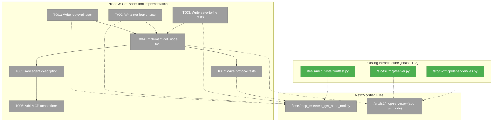
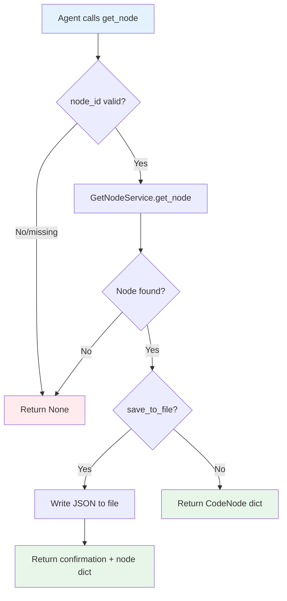
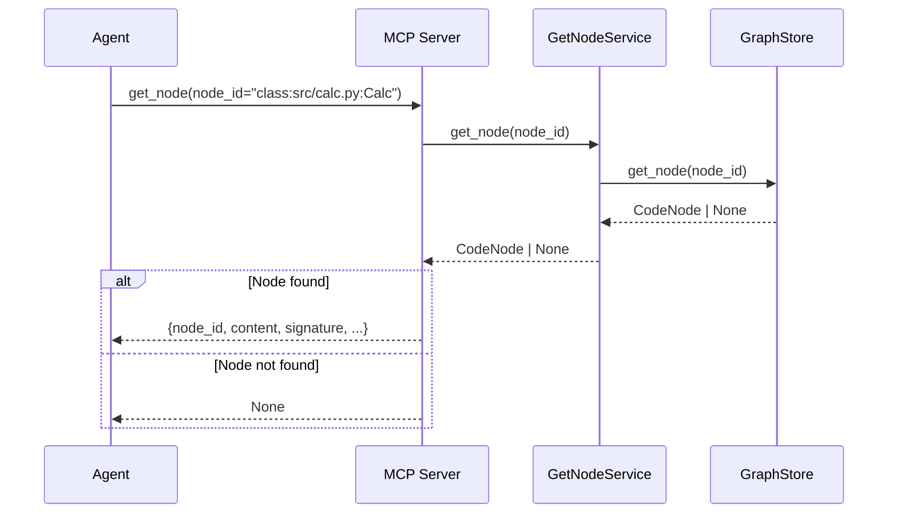

# Phase 3: Get-Node Tool Implementation – Tasks & Alignment Brief

**Spec**: [mcp-spec.md](../../mcp-spec.md)
**Plan**: [mcp-plan.md](../../mcp-plan.md)
**Date**: 2026-01-01
**Phase Slug**: `phase-3-get-node-tool-implementation`
**Testing Approach**: Full TDD

---

## Executive Briefing

### Purpose

This phase implements the `get_node` MCP tool that retrieves complete source code and metadata for a specific code element by its unique identifier. Without this tool, agents can discover what exists (via `tree`) but cannot retrieve the actual source code to understand implementation details.

### What We're Building

A `get_node()` MCP tool function that:
- Accepts a `node_id` from `tree()` or `search()` results
- Retrieves the complete CodeNode data including full source content
- Optionally saves the node data to a JSON file
- Returns `None` (not error) when a node_id doesn't exist

### User Value

Agents can complete the discovery → retrieval workflow:
1. Use `tree()` to explore codebase structure and get `node_id` values
2. Use `get_node(node_id)` to retrieve full source code for inspection
3. Optionally save node data to a file for further processing

### Example

**Request**: `get_node(node_id="class:src/calculator.py:Calculator")`
**Response**:
```json
{
  "node_id": "class:src/calculator.py:Calculator",
  "name": "Calculator",
  "category": "class",
  "file_path": "src/calculator.py",
  "start_line": 5,
  "end_line": 45,
  "content": "class Calculator:\n    \"\"\"A simple calculator...\"\"\"\n    def add(self, a, b):\n        return a + b\n    ...",
  "signature": "class Calculator",
  "smart_content": "Calculator class providing basic arithmetic operations",
  "docstring": "A simple calculator..."
}
```

---

## Objectives & Scope

### Objective

Implement the `get_node` MCP tool as specified in the plan, satisfying acceptance criteria AC4, AC5, and AC6.

**Behavior Checklist**:
- [ ] Valid node_id returns complete CodeNode with full source content (AC4)
- [ ] Invalid node_id returns `None`, not an error (AC5)
- [ ] `save_to_file` parameter writes JSON to specified path (AC6)
- [ ] No stdout pollution (protocol compliance)
- [ ] Agent-optimized description with prerequisites and workflow hints (AC15)

### Goals

- ✅ Create `get_node()` tool function with `node_id` and `save_to_file` parameters
- ✅ Return full CodeNode data including `content` (full source code)
- ✅ Handle missing nodes gracefully by returning `None`
- ✅ Implement file save functionality with JSON output
- ✅ Add agent-optimized description with WHEN TO USE and WORKFLOW sections
- ✅ Add MCP annotations (readOnlyHint varies based on save_to_file usage)
- ✅ Write comprehensive tests following TDD approach

### Non-Goals

- ❌ Partial node_id matching (only exact matches)
- ❌ Returning multiple nodes (that's what `tree` is for)
- ❌ Modifying node content or graph data
- ❌ Creating nodes that don't exist
- ❌ Validating save_to_file path (filesystem handles errors)
- ❌ Async implementation (GetNodeService is sync)

---

## Architecture Map

### Component Diagram

<!-- Status: grey=pending, orange=in-progress, green=completed, red=blocked -->
<!-- Updated by plan-6 during implementation -->



### Task-to-Component Mapping

<!-- Status: ⬜ Pending | 🟧 In Progress | ✅ Complete | 🔴 Blocked -->

| Task | Component(s) | Files | Status | Comment |
|------|-------------|-------|--------|---------|
| T001 | Test Suite | `/workspaces/flow_squared/tests/mcp_tests/test_get_node_tool.py` | ⬜ Pending | TDD: Write retrieval tests first |
| T002 | Test Suite | `/workspaces/flow_squared/tests/mcp_tests/test_get_node_tool.py` | ⬜ Pending | TDD: Test None return for missing node |
| T003 | Test Suite | `/workspaces/flow_squared/tests/mcp_tests/test_get_node_tool.py` | ⬜ Pending | TDD: Test file save with tmp_path |
| T004 | MCP Server | `/workspaces/flow_squared/src/fs2/mcp/server.py` | ⬜ Pending | Implement get_node function |
| T005 | MCP Server | `/workspaces/flow_squared/src/fs2/mcp/server.py` | ⬜ Pending | Agent-optimized docstring |
| T006 | MCP Server | `/workspaces/flow_squared/src/fs2/mcp/server.py` | ⬜ Pending | MCP annotations per plan 3.6 |
| T007 | Test Suite | `/workspaces/flow_squared/tests/mcp_tests/test_get_node_tool.py` | ⬜ Pending | Protocol-level tests via mcp_client |

---

## Tasks

| Status | ID | Task | CS | Type | Dependencies | Absolute Path(s) | Validation | Subtasks | Notes |
|--------|------|---------------------------------------|-----|------|--------------|-----------------------------------------------------|----------------------------------------|----------|-------|
| [ ] | T001 | Write tests for get_node retrieval | 2 | Test | – | `/workspaces/flow_squared/tests/mcp_tests/test_get_node_tool.py` | Tests fail with missing get_node (RED phase) | – | Plan 3.1: valid node_id → full CodeNode |
| [ ] | T002 | Write tests for get_node not found | 2 | Test | – | `/workspaces/flow_squared/tests/mcp_tests/test_get_node_tool.py` | Tests fail with missing get_node (RED phase) | – | Plan 3.2: AC5 - returns None, not error |
| [ ] | T003 | Write tests for get_node save to file | 2 | Test | – | `/workspaces/flow_squared/tests/mcp_tests/test_get_node_tool.py` | Tests fail with missing get_node (RED phase) | – | Plan 3.3: AC6 - use tmp_path fixture |
| [ ] | T004 | Implement get_node tool in server.py | 3 | Core | T001, T002, T003 | `/workspaces/flow_squared/src/fs2/mcp/server.py` | All tests from T001-T003 pass (GREEN phase) | – | Plan 3.4: Sync function, compose GetNodeService |
| [ ] | T005 | Add agent-optimized description | 1 | Doc | T004 | `/workspaces/flow_squared/src/fs2/mcp/server.py` | Description matches plan § Tool Specifications | – | Plan 3.5: Per Critical Discovery 02 |
| [ ] | T006 | Add MCP annotations | 1 | Core | T005 | `/workspaces/flow_squared/src/fs2/mcp/server.py` | Annotations present in tool registration | – | Plan 3.6: readOnlyHint varies by save_to_file |
| [ ] | T007 | Write protocol compliance tests | 2 | Test | T004 | `/workspaces/flow_squared/tests/mcp_tests/test_get_node_tool.py` | MCP client tests pass, no stdout pollution | – | Plan 3.7: via mcp_client fixture |

---

## Alignment Brief

### Prior Phases Review

#### Cross-Phase Synthesis

This section synthesizes the complete landscape from Phases 1 and 2 that Phase 3 builds upon.

#### Phase-by-Phase Summary

**Phase 1: Core Infrastructure** (Complete, 10 tasks, 21 tests)
- Established MCP server foundation with lazy service initialization
- Created error translation and protocol-compliant logging
- Built test fixture infrastructure with Fakes

**Phase 2: Tree Tool Implementation** (Complete, 8+1 tasks, 28 tests, 54 total)
- Implemented first MCP tool following Full TDD approach
- Established tool implementation pattern: function-then-decorator
- Created protocol-level testing via `mcp_client` fixture

#### Cumulative Deliverables from Prior Phases

**Implementation Files (by phase of origin)**:

| File | Phase | Key Exports | Phase 3 Usage |
|------|-------|-------------|---------------|
| `/workspaces/flow_squared/src/fs2/mcp/__init__.py` | 1 | Module marker | Import path |
| `/workspaces/flow_squared/src/fs2/mcp/dependencies.py` | 1 | `get_config()`, `get_graph_store()`, `set_*()`, `reset_services()` | Service composition |
| `/workspaces/flow_squared/src/fs2/mcp/server.py` | 1+2 | `mcp`, `translate_error()`, `tree()`, `_tree_node_to_dict()` | Tool registration, error handling |
| `/workspaces/flow_squared/src/fs2/core/adapters/logging_config.py` | 1 | `MCPLoggingConfig` | Already configured in server.py |
| `/workspaces/flow_squared/pyproject.toml` | 1 | `fastmcp>=2.0.0` | Dependency available |

**Test Infrastructure (from any phase)**:

| Component | Location | Purpose |
|-----------|----------|---------|
| `reset_mcp_dependencies` | conftest.py:37 | Autouse fixture - clears singletons after each test |
| `fake_config` | conftest.py:97 | FakeConfigurationService with ScanConfig + GraphConfig |
| `fake_graph_store` | conftest.py:110 | FakeGraphStore with 3 sample nodes |
| `tree_test_graph_store` | conftest.py:155 | FakeGraphStore + tmp file for TreeService compatibility |
| `mcp_client` | conftest.py:220 | Async FastMCP Client for protocol-level tests |
| `fake_embedding_adapter` | conftest.py:272 | FakeEmbeddingAdapter (1024 dimensions) |
| `sample_node` | conftest.py:282 | Single CodeNode for simple tests |
| `make_code_node()` | conftest.py:60 | Helper function to create CodeNode with defaults |
| `parse_tool_response()` | test_tree_tool.py:24 | Helper to parse MCP tool JSON responses |

#### Cumulative Dependencies from Prior Phases

```python
# Phase 3 can import these directly
from fs2.mcp.dependencies import (
    get_config,        # -> ConfigurationService
    get_graph_store,   # -> GraphStore (with DI for tests)
    set_config,        # For test injection
    set_graph_store,   # For test injection
    reset_services,    # For test cleanup
)

from fs2.mcp.server import (
    mcp,               # FastMCP instance for tool registration
    translate_error,   # Exception -> {type, message, action} dict (optional, prefer ToolError)
)

from fastmcp.exceptions import ToolError  # Preferred for error handling
```

#### Pattern Evolution Across Phases

| Pattern | Phase 1 | Phase 2 | Phase 3 Recommendation |
|---------|---------|---------|------------------------|
| Error handling | `translate_error()` returns dict | `raise ToolError()` for type safety | Use `ToolError` pattern |
| Tool registration | N/A | `_tree_tool = mcp.tool(...)(tree)` | Same pattern for `get_node` |
| Test fixtures | Basic fakes, no MCP client | Added `mcp_client`, `tree_test_graph_store` | Reuse existing fixtures |
| Detail levels | N/A | `min`/`max` with conditional fields | Consider similar for get_node output |

#### Reusable Infrastructure for Phase 3

1. **`mcp_client` fixture**: Already works for any tool - use for protocol tests
2. **`tree_test_graph_store` fixture**: Has 3 nodes with edges - perfect for get_node tests
3. **`make_code_node()` helper**: Can create additional test nodes if needed
4. **`parse_tool_response()` helper**: Parse MCP call_tool result to Python dict
5. **`fake_graph_store` fixture**: Simpler fixture if full tree structure not needed

#### Architectural Continuity

**Patterns to Maintain**:
1. Function-then-decorator: Define `get_node()`, then apply `mcp.tool()(get_node)`
2. Sync implementation: GetNodeService is synchronous (like tree)
3. ToolError for errors: Raise `ToolError` instead of returning error dicts
4. Agent-optimized docstrings: WHEN TO USE, PREREQUISITES, WORKFLOW sections

**Anti-Patterns to Avoid**:
1. Never return `translate_error()` dict from tools - breaks return type
2. Never use `@mcp.tool()` directly on function if you need direct Python testing
3. Never skip FakeGraphStore edge setup if testing hierarchical relationships
4. Never put tests in `tests/mcp/` - use `tests/mcp_tests/` to avoid package shadowing

#### Critical Findings Timeline

| Finding | Phase Applied | How It Affects Phase 3 |
|---------|---------------|------------------------|
| CD01: Stderr-only logging | Phase 1 | Already configured in server.py |
| CD02: Tool descriptions drive selection | Phase 2 | Must write agent-optimized description |
| HD03: GraphStore needs ConfigurationService | Phase 1 | Use `get_graph_store()` which handles this |
| HD04: Async/sync separation | Phase 2 | get_node is SYNC (like tree) |
| HD05: Error translation at boundary | Phase 1+2 | Use `ToolError` pattern |
| MD08: Use existing Fakes | Phase 1+2 | Use fixtures from conftest.py |

### Critical Findings Affecting This Phase

| Finding | Constrains/Requires | Tasks Addressing |
|---------|---------------------|------------------|
| **CD02**: Tool descriptions drive agent tool selection | Description must include WHEN TO USE, PREREQUISITES, WORKFLOW | T005 |
| **HD04**: GetNodeService is SYNC | Use `def get_node(...)` not `async def` | T004 |
| **HD05**: Error translation at MCP boundary | Use `ToolError` for errors, return `None` for not-found | T004 |
| **HD06**: Don't modify CLI commands | Compose GetNodeService in MCP tool; get_node.py untouched | T004 |
| **MD08**: Use existing Fakes | Use `tree_test_graph_store`, `mcp_client` fixtures | T001, T002, T003, T007 |

### ADR Decision Constraints

No ADRs currently exist. N/A.

### Invariants & Guardrails

- **Protocol compliance**: Zero stdout pollution - all output via JSON-RPC
- **Return type consistency**: `get_node()` returns `dict | None` (not `dict | error_dict`)
- **None vs error**: Missing node_id returns `None`; graph errors raise `ToolError`

### Inputs to Read (Exact File Paths)

| File | What to Study |
|------|---------------|
| `/workspaces/flow_squared/src/fs2/cli/get_node.py` | GetNodeService composition pattern |
| `/workspaces/flow_squared/src/fs2/core/services/get_node_service.py` | Service interface and return type |
| `/workspaces/flow_squared/src/fs2/mcp/server.py` | tree() implementation pattern to follow |
| `/workspaces/flow_squared/tests/mcp_tests/conftest.py` | Available fixtures |
| `/workspaces/flow_squared/tests/mcp_tests/test_tree_tool.py` | Test patterns to follow |

### Visual Alignment Aids

#### Flow Diagram: get_node Tool Flow



#### Sequence Diagram: Agent Workflow



### Test Plan (Full TDD)

Following the established Phase 2 TDD pattern: write tests first (RED), then implement (GREEN).

#### Test Classes and Cases

**Class: TestGetNodeRetrieval (T001)**

| Test Name | Purpose | Fixture | Expected |
|-----------|---------|---------|----------|
| `test_get_node_returns_dict_for_valid_id` | Valid node_id returns dict | `tree_test_graph_store` | isinstance(result, dict) |
| `test_get_node_returns_content_field` | Response includes full source | `tree_test_graph_store` | "content" in result |
| `test_get_node_returns_all_code_node_fields` | Response has required fields | `tree_test_graph_store` | node_id, name, category, content, etc. |
| `test_get_node_content_matches_source` | content field is actual source | `tree_test_graph_store` | result["content"] == expected_content |
| `test_get_node_returns_signature` | signature field present | `tree_test_graph_store` | "signature" in result |
| `test_get_node_returns_smart_content` | smart_content field present | `tree_test_graph_store` | "smart_content" in result if exists |

**Class: TestGetNodeNotFound (T002)**

| Test Name | Purpose | Fixture | Expected |
|-----------|---------|---------|----------|
| `test_get_node_returns_none_for_invalid_id` | Invalid ID returns None | `tree_test_graph_store` | result is None |
| `test_get_node_returns_none_not_error` | Not-found is not an error | `tree_test_graph_store` | No exception raised |
| `test_get_node_handles_empty_string_id` | Edge case: empty string | `tree_test_graph_store` | result is None |
| `test_get_node_handles_malformed_id` | Edge case: bad format | `tree_test_graph_store` | result is None |

**Class: TestGetNodeSaveToFile (T003)**

| Test Name | Purpose | Fixture | Expected |
|-----------|---------|---------|----------|
| `test_get_node_save_creates_file` | File created at path | `tmp_path` | output_path.exists() |
| `test_get_node_save_writes_valid_json` | File contains valid JSON | `tmp_path` | json.loads succeeds |
| `test_get_node_save_json_has_content` | JSON has content field | `tmp_path` | "content" in loaded_data |
| `test_get_node_save_returns_confirmation` | Returns confirmation message | `tmp_path` | "saved" in result or result has node data |
| `test_get_node_save_with_none_returns_none` | No file for missing node | `tmp_path` | result is None, file not created |

**Class: TestGetNodeMCPProtocol (T007)**

| Test Name | Purpose | Fixture | Expected |
|-----------|---------|---------|----------|
| `test_get_node_callable_via_mcp_client` | Tool works via protocol | `mcp_client` | No exception |
| `test_get_node_response_is_json_parseable` | Response is valid JSON | `mcp_client` | json.loads succeeds |
| `test_get_node_listed_in_available_tools` | Tool discoverable | `mcp_client` | "get_node" in tools |
| `test_get_node_has_annotations` | Annotations present | `mcp_client` | annotations not empty |
| `test_get_node_no_stdout_pollution` | Protocol compliance | capture stdout | stdout is empty |

### Step-by-Step Implementation Outline

1. **T001-T003**: Write all test classes (RED phase)
   - Create `/workspaces/flow_squared/tests/mcp_tests/test_get_node_tool.py`
   - Import from `conftest.py`: `tree_test_graph_store`, `mcp_client`, `make_code_node`
   - All tests should fail with ImportError (get_node doesn't exist)

2. **T004**: Implement get_node tool (GREEN phase)
   - Study `src/fs2/cli/get_node.py` for GetNodeService composition
   - Add `get_node()` function to `server.py`
   - Add `_code_node_to_dict()` helper for CodeNode → dict conversion
   - Handle save_to_file with `json.dump()`
   - Register with `mcp.tool()` decorator
   - Run tests until all pass

3. **T005**: Add agent-optimized description
   - Follow plan § Tool Specifications for get_node
   - Include WHEN TO USE, PREREQUISITES, WORKFLOW, RETURNS sections
   - Document that None is returned for missing nodes

4. **T006**: Add MCP annotations
   - `title`: "Get Code Node"
   - `readOnlyHint`: True (but note save_to_file writes)
   - `destructiveHint`: False
   - `idempotentHint`: True
   - `openWorldHint`: False

5. **T007**: Add protocol compliance tests
   - Test via `mcp_client` fixture
   - Verify JSON serialization
   - Check tool listing and annotations

### Commands to Run

```bash
# Run Phase 3 tests only
UV_CACHE_DIR=/workspaces/flow_squared/.uv_cache uv run pytest tests/mcp_tests/test_get_node_tool.py -v

# Run all MCP tests
UV_CACHE_DIR=/workspaces/flow_squared/.uv_cache uv run pytest tests/mcp_tests/ -v

# Type checking
UV_CACHE_DIR=/workspaces/flow_squared/.uv_cache uv run python -m mypy src/fs2/mcp/server.py

# Linting
UV_CACHE_DIR=/workspaces/flow_squared/.uv_cache uv run ruff check src/fs2/mcp/
```

### Risks / Unknowns

| Risk | Severity | Likelihood | Mitigation |
|------|----------|------------|------------|
| GetNodeService interface differs from expectation | Medium | Low | Study CLI get_node.py composition first |
| save_to_file permission errors | Low | Low | Use tmp_path in tests; document limitation |
| Large content exceeds response size | Low | Low | Document as known limitation |
| CodeNode has new/changed fields | Low | Low | Use make_code_node() helper to verify |

### Ready Check

- [ ] Prior phase deliverables identified and accessible
- [ ] Critical findings affecting this phase documented
- [ ] Test fixtures identified and available
- [ ] GetNodeService composition pattern studied
- [ ] Implementation pattern from tree() understood
- [ ] ADR constraints mapped to tasks (IDs noted in Notes column) - N/A (no ADRs exist)

**Await explicit GO/NO-GO before implementation.**

---

## Phase Footnote Stubs

_Populated during implementation by plan-6a-update-progress._

| Footnote | Plan Task | Dossier Task(s) | Summary | Node IDs |
|----------|-----------|-----------------|---------|----------|
| | | | | |

---

## Evidence Artifacts

Implementation will write the following to this phase directory:

- `execution.log.md` — Detailed narrative of implementation with task anchors
- Any additional evidence files as needed

---

## Discoveries & Learnings

_Populated during implementation by plan-6. Log anything of interest to your future self._

| Date | Task | Type | Discovery | Resolution | References |
|------|------|------|-----------|------------|------------|
| | | | | | |

**Types**: `gotcha` | `research-needed` | `unexpected-behavior` | `workaround` | `decision` | `debt` | `insight`

**What to log**:
- Things that didn't work as expected
- External research that was required
- Implementation troubles and how they were resolved
- Gotchas and edge cases discovered
- Decisions made during implementation
- Technical debt introduced (and why)
- Insights that future phases should know about

_See also: `execution.log.md` for detailed narrative._

---

## Directory Layout

```
docs/plans/011-mcp/
├── mcp-plan.md
├── mcp-spec.md
├── research-dossier.md
└── tasks/
    ├── phase-1-core-infrastructure/
    │   ├── tasks.md
    │   └── execution.log.md
    ├── phase-2-tree-tool-implementation/
    │   ├── tasks.md
    │   └── execution.log.md
    └── phase-3-get-node-tool-implementation/
        ├── tasks.md            # This file
        └── execution.log.md    # Created by /plan-6
```
