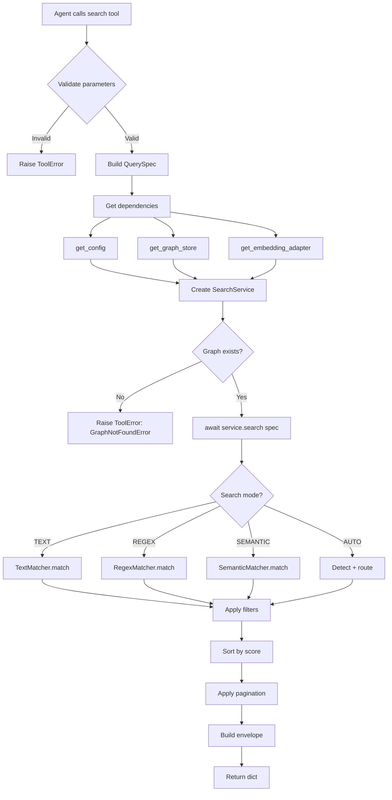
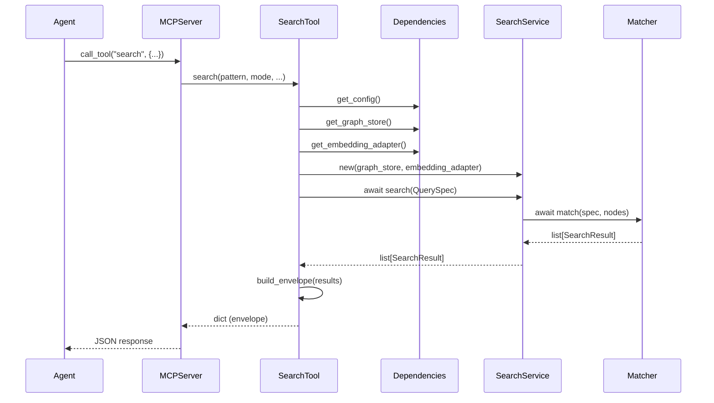

# Phase 4: Search Tool Implementation – Tasks & Alignment Brief

**Spec**: [../mcp-spec.md](../../mcp-spec.md)
**Plan**: [../mcp-plan.md](../../mcp-plan.md)
**Date**: 2026-01-01
**Phase Slug**: `phase-4-search-tool-implementation`

---

## Executive Briefing

### Purpose

This phase implements the async `search` MCP tool, enabling AI agents to find code elements by text pattern, regex, or semantic meaning. The search tool is the most powerful discovery tool in the suite, allowing concept-based code exploration that goes beyond structural navigation.

### What We're Building

An async `search` MCP tool that:
- Accepts patterns for text substring, regex, or semantic (embedding-based) search
- Routes to appropriate matcher based on search mode (TEXT, REGEX, SEMANTIC, AUTO)
- Returns ranked results with scores, snippets, and metadata envelope
- Supports path filtering via include/exclude regex patterns
- Provides pagination via limit/offset parameters

### User Value

Agents can find code by **what it does** rather than **where it is**. Semantic search enables natural language queries like "authentication flow" or "error handling logic" to discover relevant code across the entire codebase.

### Example

**Request**: `search(pattern="authentication", mode="semantic", limit=5)`
**Response**:
```json
{
  "meta": {"total": 23, "showing": {"from": 0, "to": 5, "count": 5}},
  "results": [
    {"node_id": "callable:src/auth/login.py:authenticate_user", "score": 0.92, "snippet": "def authenticate_user(credentials)..."},
    {"node_id": "class:src/auth/session.py:SessionManager", "score": 0.87, ...}
  ]
}
```

---

## Objectives & Scope

### Objective

Implement the async `search` MCP tool as specified in plan § Tool Specifications with all four search modes (TEXT, REGEX, SEMANTIC, AUTO) and filtering capabilities.

### Behavior Checklist (from spec AC7-AC10)

- [ ] AC7: search() returns ranked SearchResult list with scores
- [ ] AC8: Text mode matches substring in content/node_id/smart_content
- [ ] AC9: Semantic mode uses embeddings (requires indexed codebase)
- [ ] AC10: Empty pattern raises appropriate error

### Goals

- ✅ Implement async `search` MCP tool with all search modes
- ✅ Support include/exclude path filters (regex patterns)
- ✅ Return envelope format with meta + results
- ✅ Add min/max detail levels consistent with tree/get_node
- ✅ Add MCP annotations (readOnlyHint=True, etc.)
- ✅ Write comprehensive TDD test suite
- ✅ Document async handling patterns

### Non-Goals (Scope Boundaries)

- ❌ Modifying existing CLI search.py command
- ❌ Implementing new search modes beyond TEXT/REGEX/SEMANTIC/AUTO
- ❌ Adding caching for search results (defer to future optimization)
- ❌ Real embedding generation (use FakeEmbeddingAdapter in tests)
- ❌ Performance optimization (focus on correctness first)
- ❌ min_similarity parameter (keep default 0.25, per existing QuerySpec)

---

## Architecture Map

### Component Diagram

```mermaid
flowchart TD
    classDef pending fill:#9E9E9E,stroke:#757575,color:#fff
    classDef inprogress fill:#FF9800,stroke:#F57C00,color:#fff
    classDef completed fill:#4CAF50,stroke:#388E3C,color:#fff
    classDef blocked fill:#F44336,stroke:#D32F2F,color:#fff

    subgraph Phase4["Phase 4: Search Tool Implementation"]
        T001["T001: Text mode tests ✓"]:::completed
        T002["T002: Regex mode tests ✓"]:::completed
        T003["T003: Semantic mode tests ✓"]:::completed
        T004["T004: Filter tests ✓"]:::completed
        T005["T005: Pagination tests ✓"]:::completed
        T006a["T006a: get_embedding_adapter() ✓"]:::completed
        T006b["T006b: search fixtures ✓"]:::completed
        T006c["T006c: Implement search tool ✓"]:::completed
        T006d["T006d: Fix ReDoS filters (SKIPPED)"]:::pending
        T007["T007: Agent description ✓"]:::completed
        T008["T008: MCP annotations ✓"]:::completed
        T009["T009: Protocol tests ✓"]:::completed

        T001 --> T006c
        T002 --> T006c
        T003 --> T006c
        T004 --> T006c
        T005 --> T006c
        T006a --> T006c
        T006b --> T006c
        T006c --> T007 --> T008
        T006c --> T009
    end

    subgraph Files["Files"]
        F1["/tests/mcp_tests/test_search_tool.py ✓"]:::completed
        F2["/src/fs2/mcp/server.py ✓"]:::completed
        F3["/src/fs2/mcp/dependencies.py ✓"]:::completed
        F4["/tests/mcp_tests/conftest.py ✓"]:::completed
        F5["/src/fs2/core/services/search/search_service.py (skipped)"]:::pending
    end

    T001 -.-> F1
    T002 -.-> F1
    T003 -.-> F1
    T004 -.-> F1
    T005 -.-> F1
    T006a -.-> F3
    T006b -.-> F4
    T006c -.-> F2
    T006d -.-> F5
    T009 -.-> F1
```

<!-- Status: grey=pending, orange=in-progress, green=completed, red=blocked -->
<!-- Updated by plan-6 during implementation -->



### Task-to-Component Mapping

<!-- Status: ⬜ Pending | 🟧 In Progress | ✅ Complete | 🔴 Blocked -->

| Task | Component(s) | Files | Status | Comment |
|------|-------------|-------|--------|---------|
| T001 | Test Suite | test_search_tool.py | ✅ Complete | TDD tests for text mode search |
| T002 | Test Suite | test_search_tool.py | ✅ Complete | TDD tests for regex mode search |
| T003 | Test Suite | test_search_tool.py | ✅ Complete | TDD tests for semantic mode (with FakeEmbeddingAdapter) |
| T004 | Test Suite | test_search_tool.py | ✅ Complete | TDD tests for include/exclude filters |
| T005 | Test Suite | test_search_tool.py | ✅ Complete | TDD tests for limit/offset pagination |
| T006a | Dependencies | dependencies.py | ✅ Complete | Add get_embedding_adapter() + set_embedding_adapter() |
| T006b | Test Fixtures | conftest.py | ✅ Complete | Add search_test_graph_store with embeddings |
| T006c | MCP Tool | server.py | ✅ Complete | Implement async search tool - 34 tests pass |
| T006d | SearchService | search_service.py | ⬜ Skipped | Fix ReDoS vulnerability - deferred per user |
| T007 | Documentation | server.py | ✅ Complete | Agent-optimized docstring |
| T008 | MCP Annotations | server.py | ✅ Complete | Tool annotations for clients |
| T009 | Test Suite | test_search_tool.py | ✅ Complete | Async handling and MCP protocol tests |

---

## Tasks

| Status | ID | Task | CS | Type | Dependencies | Absolute Path(s) | Validation | Subtasks | Notes |
|--------|-----|------|-----|------|--------------|------------------|------------|----------|-------|
| [x] | T001 | Write TDD tests for search text mode (substring matching) | 2 | Test | – | `/workspaces/flow_squared/tests/mcp_tests/test_search_tool.py` | Tests fail with ImportError (RED phase) | – | Plan 4.1 |
| [x] | T002 | Write TDD tests for search regex mode (pattern matching) | 2 | Test | – | `/workspaces/flow_squared/tests/mcp_tests/test_search_tool.py` | Tests fail with ImportError (RED phase) | – | Plan 4.2 |
| [x] | T003 | Write TDD tests for search semantic mode (embedding similarity) | 3 | Test | – | `/workspaces/flow_squared/tests/mcp_tests/test_search_tool.py` | Tests fail with ImportError (RED phase) | – | Plan 4.3; Use FakeEmbeddingAdapter |
| [x] | T004 | Write TDD tests for include/exclude path filters | 2 | Test | – | `/workspaces/flow_squared/tests/mcp_tests/test_search_tool.py` | Tests fail with ImportError (RED phase) | – | Plan 4.4; Regex patterns, OR logic |
| [x] | T005 | Write TDD tests for limit/offset pagination | 2 | Test | – | `/workspaces/flow_squared/tests/mcp_tests/test_search_tool.py` | Tests fail with ImportError (RED phase) | – | Plan 4.5 |
| [x] | T006a | Add get_embedding_adapter() to dependencies.py | 2 | Core | – | `/workspaces/flow_squared/src/fs2/mcp/dependencies.py` | Function returns FakeEmbeddingAdapter or None | – | Lazy init, set_embedding_adapter() for testing |
| [x] | T006b | Update mcp_client + make_code_node + add search fixture | 2 | Test | T006a | `/workspaces/flow_squared/tests/mcp_tests/conftest.py` | mcp_client injects embedding_adapter; make_code_node has embedding params; search fixture exists | – | DYK#1+#2 |
| [x] | T006c | Implement async search tool in server.py | 3 | Core | T001-T005, T006a, T006b | `/workspaces/flow_squared/src/fs2/mcp/server.py` | All tests from T001-T005 pass | – | Plan 4.6; async def, per CD04; DYK#9+#10: Handle SearchError + EmbeddingAdapter exceptions |
| [S] | T006d | Fix include/exclude filter ReDoS vulnerability in SearchService | 2 | Security | – | `/workspaces/flow_squared/src/fs2/core/services/search/search_service.py` | SKIPPED per user | – | DYK#6: Deferred |
| [x] | T007 | Add agent-optimized description to search tool | 1 | Doc | T006 | `/workspaces/flow_squared/src/fs2/mcp/server.py` | Description includes WHEN TO USE, PREREQUISITES, WORKFLOW, RETURNS | – | Plan 4.7; per CD02 |
| [x] | T008 | Add MCP annotations to search tool | 1 | Core | T006 | `/workspaces/flow_squared/src/fs2/mcp/server.py` | readOnlyHint=True, idempotentHint=True, openWorldHint=True | – | Plan 4.8; DYK#8: openWorldHint=True for SEMANTIC API calls |
| [x] | T009 | Write async handling and MCP protocol tests | 2 | Test | T006 | `/workspaces/flow_squared/tests/mcp_tests/test_search_tool.py` | Tests pass via mcp_client.call_tool() | – | Plan 4.9 |

---

## Alignment Brief

### Prior Phases Review

#### Phase-by-Phase Summary

**Phase 1 (Core Infrastructure)** established the foundational MCP module with:
- FastMCP server instance (`mcp = FastMCP(name="fs2")`)
- Lazy service initialization via dependencies.py (singleton pattern with RLock)
- MCPLoggingConfig adapter for stderr-only logging (STDIO protocol compliance)
- Error translation via `translate_error()` function
- 21 tests passing across protocol, dependencies, and error translation

**Phase 2 (Tree Tool)** implemented the first MCP tool with:
- `tree()` function with pattern, max_depth, detail parameters
- `_tree_node_to_dict()` recursive converter
- Function-then-decorator pattern for testability
- Agent-optimized docstring with WHEN TO USE, PREREQUISITES, WORKFLOW sections
- 28 tests passing (20 TDD + 8 protocol integration)

**Phase 3 (Get-Node Tool)** implemented node retrieval with:
- `get_node()` function with node_id, save_to_file, detail parameters
- `_code_node_to_dict()` explicit field selection (prevents embedding leakage)
- `_validate_save_path()` security helper for PWD-relative paths
- DYK session decisions: readOnlyHint=False, None for not-found, explicit fields
- 26 tests passing (19 TDD + 7 protocol integration)

#### Cumulative Deliverables (by Phase of Origin)

**From Phase 1**:
- `/workspaces/flow_squared/src/fs2/mcp/__init__.py` - Module marker
- `/workspaces/flow_squared/src/fs2/mcp/dependencies.py` - `get_config()`, `get_graph_store()`, `set_*()`, `reset_services()`
- `/workspaces/flow_squared/src/fs2/mcp/server.py` - `mcp` FastMCP instance, `translate_error()`
- `/workspaces/flow_squared/src/fs2/core/adapters/logging_config.py` - MCPLoggingConfig
- `/workspaces/flow_squared/tests/mcp_tests/conftest.py` - Core fixtures

**From Phase 2**:
- `tree()` function in server.py
- `_tree_node_to_dict()` helper in server.py
- `tree_test_graph_store` fixture, `mcp_client` async fixture
- `parse_tool_response()` helper

**From Phase 3**:
- `get_node()` function in server.py
- `_code_node_to_dict()` helper in server.py
- `_validate_save_path()` security helper
- ToolError handling pattern established

#### Reusable Test Infrastructure

| Fixture | Source | Purpose |
|---------|--------|---------|
| `reset_mcp_dependencies` | conftest.py | Clears singleton state between tests |
| `fake_config` | conftest.py | FakeConfigurationService |
| `fake_graph_store` | conftest.py | FakeGraphStore with 3 sample nodes |
| `tree_test_graph_store` | conftest.py | Tuple (store, config) with temp file |
| `mcp_client` | conftest.py | Async FastMCP Client for protocol tests |
| `fake_embedding_adapter` | conftest.py | FakeEmbeddingAdapter(dimensions=1024) |
| `make_code_node()` | conftest.py | Helper to create CodeNode with defaults |
| `parse_tool_response()` | conftest.py | Parse MCP tool response JSON |

#### Pattern Evolution Across Phases

1. **Tool Registration**: All phases use function-then-decorator pattern
2. **Error Handling**: Evolved from translate_error() (Phase 1) to ToolError (Phase 2+)
3. **Field Selection**: Phase 2 used recursive dict conversion, Phase 3 added explicit filtering
4. **Testing**: Progressed from sync tests to async mcp_client protocol tests

#### Architectural Continuity

**Patterns to Maintain**:
- Function-then-decorator for MCP tools
- ToolError for error handling (not translate_error return)
- Explicit field selection in *_to_dict() helpers
- WHEN TO USE, PREREQUISITES, WORKFLOW in docstrings
- Async mcp_client fixture for protocol-level tests

**Anti-Patterns to Avoid**:
- Using `asdict()` on CodeNode (leaks embeddings)
- Returning error dicts from tools (breaks typing)
- Testing only via direct Python calls (miss serialization issues)
- Naming test directories same as packages (shadows imports)

---

### Critical Findings Affecting This Phase

#### Critical Discovery 02: Tool descriptions drive agent tool selection
**Constrains**: Tool docstring must be agent-optimized
**Addressed by**: T007 (add agent-optimized description)

#### High Discovery 04: Async/Sync pattern separation
**Constrains**: SearchService.search() is ASYNC - tool must use `async def`
**Addressed by**: T006 (implement as async def search)

#### High Discovery 05: Error translation at MCP boundary
**Constrains**: Domain exceptions must raise ToolError with actionable messages
**Addressed by**: T006 (wrap in try/except, raise ToolError)

#### Medium Discovery 08: Test fixtures should use existing Fakes
**Constrains**: Use FakeEmbeddingAdapter for semantic search tests
**Addressed by**: T003 (semantic mode tests with fake adapter)

---

### Invariants & Guardrails

| Constraint | Value | Validation |
|------------|-------|------------|
| No stdout pollution | 0 bytes | Protocol compliance test |
| Return type | dict (envelope) | JSON serializable |
| SearchService composition | GraphStore + EmbeddingAdapter | Same as CLI pattern |
| Score range | 0.0-1.0 | All results have valid scores |

---

### Inputs to Read

| File | Purpose |
|------|---------|
| `/workspaces/flow_squared/src/fs2/core/services/search/search_service.py` | SearchService.search() async signature |
| `/workspaces/flow_squared/src/fs2/core/models/search/query_spec.py` | QuerySpec parameters |
| `/workspaces/flow_squared/src/fs2/core/models/search/search_result.py` | SearchResult.to_dict(detail) |
| `/workspaces/flow_squared/src/fs2/core/models/search/search_result_meta.py` | SearchResultMeta envelope |
| `/workspaces/flow_squared/src/fs2/cli/search.py` | CLI composition pattern reference |
| `/workspaces/flow_squared/tests/mcp_tests/conftest.py` | Existing fixtures |
| `/workspaces/flow_squared/tests/unit/services/test_search_service.py` | **DYK#3**: Reuse patterns, don't duplicate tests |

---

### Visual Alignment Aids

#### Flow Diagram: Search Tool Request Processing



#### Sequence Diagram: Async Search Flow



---

### Fixture Strategy for Semantic Search Testing

**CRITICAL**: Semantic search tests must work WITHOUT real LLM/embedding API calls.

#### The Two-Layer Testing Strategy

**Layer 1: FakeEmbeddingAdapter with `set_response()`**
For unit tests requiring precise control over similarity scores:

```python
from fs2.core.adapters.embedding_adapter_fake import FakeEmbeddingAdapter

adapter = FakeEmbeddingAdapter()
# set_response() controls what embedding is returned for ANY query
adapter.set_response([1.0, 0.0, 0.0, 0.0])  # Returns this exact vector

# Now when SearchService calls adapter.embed_text("auth"),
# it gets [1.0, 0.0, 0.0, 0.0] regardless of input text
```

**Layer 2: Pre-computed Embeddings in Fixture Nodes**
Create test nodes with controlled embedding vectors:

```python
# CRITICAL: Embeddings are multi-chunk tuples, NOT simple lists!
# Format: tuple[tuple[float, ...], ...] - tuple of tuples

node_with_embedding = make_code_node(
    node_id="callable:src/auth.py:login",
    content="def login(): ...",
    embedding=(
        (0.9, 0.1, 0.0, 0.0),  # Chunk 0: similar to query
        (0.0, 0.0, 0.9, 0.1),  # Chunk 1: different
    ),
)
```

#### Priority System (from 010-search plan)

```
Priority 1: set_response()  →  Always wins (for unit tests)
Priority 2: fixture_index   →  Real embedding lookup by content_hash
Priority 3: Deterministic   →  Hash-based fallback for unknown content
```

#### SearchService Injection Pattern

```python
from fs2.core.services.search import SearchService

# Create service WITH embedding adapter for semantic search
service = SearchService(
    graph_store=store,
    embedding_adapter=adapter,  # <-- REQUIRED for SEMANTIC mode
)

# WITHOUT adapter, AUTO mode falls back to TEXT (per DYK-P3-02)
service_no_semantic = SearchService(graph_store=store)  # SEMANTIC will fail
```

#### Key Gotchas from 010-search

| Gotcha | Impact | Solution |
|--------|--------|----------|
| Embeddings are `tuple[tuple[float, ...], ...]` | Wrong type causes matcher failures | Always use tuple-of-tuples format |
| FakeGraphStore requires explicit `load()` call | Empty results | Call `store.load(path)` after creation |
| SearchService without adapter | SEMANTIC mode raises error | Always inject adapter for semantic tests |
| All search methods are async | Tests hang without await | Use `@pytest.mark.asyncio` and `await` |

**DYK Decision #3**: Don't duplicate SearchService tests - reuse patterns instead:
- **Existing tests**: `/workspaces/flow_squared/tests/unit/services/test_search_service.py` (730+ lines)
- **Already covered**: AUTO mode fallback logic, pagination, semantic search, error handling
- **MCP tests focus**: Tool registration, parameter mapping, envelope format, protocol compliance
- **Pattern to copy**: `FakeGraphStore` class, `create_node()` helper, `set_response()` for embeddings

#### Required Updates to conftest.py

**DYK Decision #1**: Update `mcp_client` to always inject ALL dependencies:
```python
# Update existing mcp_client fixture to inject embedding adapter
dependencies.set_config(config)
dependencies.set_graph_store(store)
dependencies.set_embedding_adapter(fake_embedding_adapter)  # ← ADD THIS
```

**DYK Decision #2**: Extend existing `make_code_node()` with embedding parameters (no separate helper):
```python
def make_code_node(
    node_id: str,
    category: str,
    name: str | None,
    content: str,
    start_line: int = 1,
    end_line: int = 10,
    signature: str | None = None,
    language: str = "python",
    parent_node_id: str | None = None,
    # DYK#2: Added embedding support
    embedding: tuple[tuple[float, ...], ...] | None = None,
    smart_content: str | None = None,
    smart_content_embedding: tuple[tuple[float, ...], ...] | None = None,
) -> CodeNode:
```

@pytest.fixture
def search_test_graph_store(tmp_path):
    """FakeGraphStore with nodes containing embeddings for search tests."""
    # Similar query embedding: [0.9, 0.1, 0.0, 0.0]
    similar_emb = ((0.9, 0.1, 0.0, 0.0),)
    different_emb = ((0.0, 0.0, 0.9, 0.1),)

    nodes = [
        make_code_node(  # Uses extended helper per DYK#2
            node_id="callable:src/auth/login.py:authenticate",
            category="callable",
            name="authenticate",
            content="def authenticate(user, password): ...",
            smart_content="Authenticates user with credentials",
            embedding=similar_emb,  # Will match "auth" query
        ),
        make_code_node(
            node_id="callable:src/utils/math.py:calculate",
            category="callable",
            name="calculate",
            content="def calculate(x, y): return x + y",
            smart_content="Performs mathematical calculation",
            embedding=different_emb,  # Won't match "auth" query
        ),
    ]

    graph_path = tmp_path / "graph.pickle"
    graph_path.touch()

    config = FakeConfigurationService(
        ScanConfig(),
        GraphConfig(graph_path=str(graph_path)),
    )

    store = FakeGraphStore(config)
    store.set_nodes(nodes)

    return store, config
```

---

### Test Plan (Full TDD)

#### Test Structure

```
tests/mcp_tests/test_search_tool.py
├── TestSearchToolTextMode (T001)
│   ├── test_search_text_returns_envelope
│   ├── test_search_text_matches_substring_in_content
│   ├── test_search_text_matches_in_node_id
│   ├── test_search_text_matches_in_smart_content
│   ├── test_search_text_case_insensitive
│   └── test_search_text_no_matches_returns_empty
├── TestSearchToolRegexMode (T002)
│   ├── test_search_regex_pattern_matching
│   ├── test_search_regex_invalid_pattern_raises_error
│   ├── test_search_regex_groups_work
│   └── test_search_regex_special_chars
├── TestSearchToolSemanticMode (T003)
│   ├── test_search_semantic_requires_embeddings
│   ├── test_search_semantic_returns_scored_results
│   ├── test_search_semantic_no_embeddings_raises_error
│   └── test_search_semantic_auto_fallback_to_text
├── TestSearchToolFilters (T004)
│   ├── test_search_include_filter_keeps_matching
│   ├── test_search_exclude_filter_removes_matching
│   ├── test_search_include_exclude_combined
│   ├── test_search_include_or_logic
│   └── test_search_invalid_filter_regex_raises_error
├── TestSearchToolPagination (T005)
│   ├── test_search_limit_restricts_results
│   ├── test_search_offset_skips_results
│   ├── test_search_limit_offset_combined
│   └── test_search_default_limit_is_20
├── TestSearchToolCore (T006)
│   ├── test_search_min_detail_has_9_fields
│   ├── test_search_max_detail_has_13_fields
│   ├── test_search_envelope_has_meta_and_results
│   ├── test_search_empty_pattern_raises_error
│   └── test_search_returns_scores_in_range
│   # NOTE: AUTO mode logic already tested in tests/unit/services/test_search_service.py
│   # DYK#3: Don't duplicate - MCP tests focus on integration, not search logic
└── TestSearchToolMCPProtocol (T009)
    ├── test_search_callable_via_mcp_client
    ├── test_search_async_execution_works
    ├── test_search_listed_in_available_tools
    ├── test_search_has_annotations
    ├── test_search_no_stdout_pollution
    └── test_search_graph_not_found_raises_tool_error
```

#### Fixtures Required

```python
# Additional fixtures for search tests (add to conftest.py if needed)

@pytest.fixture
def search_test_graph_store(tmp_path):
    """FakeGraphStore with nodes containing varied content for search tests."""
    nodes = [
        make_code_node(
            node_id="callable:src/auth/login.py:authenticate_user",
            content="def authenticate_user(credentials): ...",
            smart_content="Authenticates user with provided credentials",
            embedding=((0.1, 0.2, ...),),  # Fake embedding
        ),
        make_code_node(
            node_id="callable:src/auth/session.py:create_session",
            content="def create_session(user_id): ...",
            smart_content="Creates a new session for authenticated user",
            embedding=((0.15, 0.25, ...),),
        ),
        make_code_node(
            node_id="callable:tests/test_auth.py:test_login",
            content="def test_login(): assert login() works",
            smart_content="Tests the login functionality",
        ),
    ]
    store = FakeGraphStore()
    store.set_nodes(nodes)
    # Touch file for TreeService compatibility
    graph_file = tmp_path / "graph.pickle"
    graph_file.touch()
    return store, tmp_path
```

---

### Step-by-Step Implementation Outline

| Step | Task | Action | Validation |
|------|------|--------|------------|
| 1 | T001-T005 | Write all TDD tests (RED phase) | Tests fail with ImportError (search not defined) |
| 2 | T006a | Add `get_embedding_adapter()` + `set_embedding_adapter()` to dependencies.py | Functions exist, follow singleton pattern |
| 3 | T006b | Update `mcp_client` + `make_code_node()` + add `search_test_graph_store` fixture | Per DYK#1 and DYK#2 |
| 4 | T006c-1 | Add `_build_search_envelope()` helper to server.py | Builds `{meta: {...}, results: [...]}` dict |
| 5 | T006c-2 | Implement `async def search()` in server.py | Uses `await service.search(spec)`, `r.to_dict(detail)` per DYK#4 |
| 6 | T007 | Add agent-optimized docstring with WHEN TO USE, PREREQUISITES, WORKFLOW | Docstring matches plan § Tool Specifications |
| 7 | T008 | Add MCP annotations | `readOnlyHint=True`, `idempotentHint=True` |
| 8 | T009 | Write async protocol tests via mcp_client | All protocol tests pass via `client.call_tool()` |
| 9 | Verify | Run full test suite | All MCP tests pass (80+ Phase 1-3 + Phase 4) |

**DYK Decision #4**: Use `SearchResult.to_dict(detail)` directly - no custom helper needed.
Unlike CodeNode (which has embeddings to filter), SearchResult is safe to serialize as-is.

**DYK Decision #5**: Use `SearchResultMeta` for envelope, not plan's proposed schema.
- Plan § Tool Specifications has outdated schema (`total_count`, `returned_count`, `mode`, `pattern`)
- CLI uses `SearchResultMeta` with richer schema (`total`, `showing`, `pagination`, `folders`)
- **Use CLI's SearchResultMeta** - it's the tested, working implementation
- Pattern: `envelope = {"meta": SearchResultMeta(...).to_dict(), "results": [...]}`

**DYK Decision #9**: Handle EmbeddingAdapter exceptions with actionable messages.
```python
from fs2.core.adapters.exceptions import (
    EmbeddingAdapterError,
    EmbeddingAuthenticationError,
    EmbeddingRateLimitError,
)
from fs2.core.services.search.exceptions import SearchError

# In search() exception handling:
except SearchError as e:
    # DYK#10: Explicit SEMANTIC mode failures (no embeddings, etc.)
    # Message already actionable, pass through
    raise ToolError(str(e)) from None
except EmbeddingAuthenticationError:
    raise ToolError(
        "Embedding API authentication failed. "
        "Check FS2_AZURE__OPENAI__API_KEY configuration."
    ) from None
except EmbeddingRateLimitError as e:
    retry_msg = f" Retry after {e.retry_after}s." if e.retry_after else ""
    raise ToolError(
        f"Embedding API rate limited.{retry_msg} Try TEXT/REGEX mode."
    ) from None
except EmbeddingAdapterError as e:
    raise ToolError(f"Embedding service error: {e}. Try TEXT/REGEX mode.") from None
```

---

### Commands to Run

```bash
# Environment setup
cd /workspaces/flow_squared
uv sync

# Run only Phase 4 search tests (during development)
uv run pytest tests/mcp_tests/test_search_tool.py -v

# Run all MCP tests (after implementation)
uv run pytest tests/mcp_tests/ -v

# Lint check
uv run ruff check src/fs2/mcp/ tests/mcp_tests/

# Type check (optional)
uv run mypy src/fs2/mcp/
```

---

### Risks/Unknowns

| Risk | Severity | Likelihood | Mitigation |
|------|----------|------------|------------|
| Async event loop conflicts | High | Medium | Test in isolated async context; use pytest-asyncio |
| Semantic search requires real embeddings | Medium | Low | Use FakeEmbeddingAdapter with fixture embeddings |
| Large search results exceed response size | Low | Low | Document limitation; limit default is 20 |
| Include/exclude regex complexity | Low | Low | Reuse existing QuerySpec validation |

---

### Ready Check

- [ ] Prior phases reviewed (Phase 1, 2, 3 complete)
- [ ] SearchService API understood (async, QuerySpec, SearchResult)
- [ ] Test fixtures available (fake_embedding_adapter, mcp_client)
- [ ] Envelope format understood (meta + results)
- [ ] Async pattern understood (async def, await service.search())
- [ ] ADR constraints mapped to tasks (N/A - no ADRs exist)

**Awaiting GO/NO-GO from human sponsor.**

---

## Phase Footnote Stubs

_Populated during implementation by plan-6a-update-progress._

| Footnote | Task | Description |
|----------|------|-------------|
| [^19] | T001-T005 | TDD tests written (34 tests in 7 test classes) |
| [^20] | T006a-T009 | search() tool implementation with dependencies and fixtures |

---

## Evidence Artifacts

Implementation artifacts will be created in this directory:

| Artifact | Path | Purpose |
|----------|------|---------|
| Execution Log | `./execution.log.md` | Detailed implementation narrative |
| Test File | `/workspaces/flow_squared/tests/mcp_tests/test_search_tool.py` | TDD test suite |
| Server Updates | `/workspaces/flow_squared/src/fs2/mcp/server.py` | search() tool implementation |
| Dependencies Updates | `/workspaces/flow_squared/src/fs2/mcp/dependencies.py` | get_embedding_adapter() |

---

## Critical Insights Discussion

**Session**: 2026-01-01
**Context**: Phase 4 Search Tool Implementation Dossier
**Analyst**: AI Clarity Agent
**Reviewer**: Development Team
**Format**: Water Cooler Conversation (5 Critical Insights)

### Insight 1: mcp_client Fixture Missing EmbeddingAdapter

**Did you know**: The existing `mcp_client` fixture only injects config and graph_store, not embedding_adapter - semantic search tests via MCP protocol would fail.

**Options Considered**:
- Option A: Create separate `search_mcp_client` fixture
- Option B: Add optional embedding_adapter parameter to existing fixture
- Option C: Always inject all three dependencies (config, graph_store, embedding_adapter)

**AI Recommendation**: Option C
- Reasoning: Simplest approach, future-proof for any new tools, harmless for existing tools

**Decision**: Update `mcp_client` to always inject ALL dependencies including embedding_adapter

**Affects**: T006b (fixture updates)

---

### Insight 2: make_code_node() Helper Lacks Embedding Support

**Did you know**: The existing `make_code_node()` helper has no embedding parameter - can't create test nodes with embeddings for semantic search tests.

**Options Considered**:
- Option A: Create separate `make_code_node_with_embedding()` helper
- Option B: Extend existing `make_code_node()` with optional embedding parameters
- Option C: Use CodeNode constructor directly

**AI Recommendation**: Option B
- Reasoning: DRY, backward compatible, single helper to maintain

**Decision**: Extend existing `make_code_node()` with embedding, smart_content, smart_content_embedding parameters

**Affects**: T006b (fixture updates)

---

### Insight 3: SearchService Already Has Comprehensive Tests

**Did you know**: `test_search_service.py` has 730+ lines covering AUTO mode, fallbacks, pagination, semantic search - we don't need to duplicate this in MCP tests.

**Options Considered**:
- Option A: Create dedicated TestSearchToolAutoMode class
- Option B: Expand TestSearchToolCore with fallback tests
- Option C: Rely on existing SearchService tests, focus MCP tests on integration

**AI Recommendation**: Option C
- Reasoning: Don't duplicate test coverage; SearchService is source of truth for search behavior

**Decision**: MCP tests focus on tool-level concerns (registration, parameters, envelope, protocol) - not search logic

**Affects**: Test plan structure, reduced test scope

---

### Insight 4: SearchResult.to_dict() Already Exists

**Did you know**: `SearchResult` already has a `to_dict(detail)` method that handles min/max field selection - no custom helper needed.

**Options Considered**:
- Option A: Create custom `_search_result_to_dict()` helper
- Option B: Use `SearchResult.to_dict(detail)` directly
- Option C: Start with Option B, add wrapper later if needed

**AI Recommendation**: Option B
- Reasoning: DRY, tested code, matches CLI pattern, no embedding leakage risk (unlike CodeNode)

**Decision**: Use `SearchResult.to_dict(detail)` directly in search tool

**Affects**: T006c (simpler implementation)

---

### Insight 5: Envelope Format Has Two Sources (Plan vs CLI)

**Did you know**: The plan's Tool Specifications has an outdated schema (`total_count`) while CLI uses `SearchResultMeta` with richer schema (`total`, `showing`, `folders`).

**Options Considered**:
- Option A: Match CLI exactly - reuse SearchResultMeta
- Option B: Match plan's simplified schema
- Option C: Use SearchResultMeta but add plan's extra fields

**AI Recommendation**: Option A
- Reasoning: Plan spec is stale; CLI implementation is tested reality; consistency between CLI and MCP

**Decision**: Use `SearchResultMeta` for envelope format - CLI implementation is source of truth

**Affects**: T006c (envelope format)

---

## Session 1 Summary

**Insights Surfaced**: 5 critical insights identified and discussed
**Decisions Made**: 5 decisions reached through collaborative discussion
**Action Items Created**: 5 updates to tasks.md applied immediately

**Key Simplifications**:
1. Reuse existing tests (don't duplicate SearchService coverage)
2. Reuse existing helpers (SearchResult.to_dict, SearchResultMeta)
3. Extend existing fixtures (make_code_node, mcp_client)

**Confidence Level**: High - All decisions simplify implementation while maintaining correctness

---

## Critical Insights Discussion (Session 2)

**Session**: 2026-01-01
**Context**: Phase 4 Search Tool - Deep Analysis Before Implementation
**Analyst**: AI Clarity Agent (5 parallel subagents: error handling, performance, async, security, integration)
**Reviewer**: Development Team
**Format**: Water Cooler Conversation (5 Critical Insights)

### Insight 6: SECURITY - Include/Exclude Filters Have No ReDoS Protection

**Did you know**: While the main search pattern has 2.0s timeout protection via the `regex` module, include/exclude filters use Python's `re.search()` with NO timeout - a malicious filter like `(a+)+$` could freeze the server.

**Implications**:
- Main pattern search is protected (regex_matcher.py uses timeout)
- Filter patterns in SearchService use `re.search()` without timeout
- Catastrophic backtracking possible with pathological patterns

**Options Considered**:
- Option A: Fix in SearchService (proper fix) - CS-3
- Option B: Add validation in MCP tool (quick fix) - CS-2
- Option C: Add overall request timeout (defense in depth) - CS-1
- Option D: Document as known limitation (defer) - CS-1

**AI Recommendation**: Option A (fix in SearchService)
- Reasoning: Security vulnerability must be fixed at the source, not just mitigated

**Decision**: Fix ReDoS vulnerability in SearchService include/exclude filters

**Action Items**:
- [x] Added T006d: Fix include/exclude filter ReDoS vulnerability

**Affects**: T006d (new task), SearchService

---

### Insight 7: Performance - Pagination is O(n) Regardless of Limit

**Did you know**: Requesting `limit=10` still processes ALL nodes, creates ALL SearchResults, sorts ALL, then slices.

**Discussion Summary**: User explained this is intentional - search-all-then-sort ensures fair ranking across matchers. If you early-exit after 10 semantic matches, you might miss a text match that scores higher. Quality over speed is the right trade-off.

**Decision**: No action needed - current design is intentional for result quality

**Affects**: Nothing - existing design is correct

---

### Insight 8: openWorldHint Should Be True (Unlike tree/get_node)

**Did you know**: The planned annotations had `openWorldHint=False`, but SEMANTIC mode calls external embedding APIs. This is misleading to MCP clients.

**Implications**:
- tree/get_node are purely local (openWorldHint=False correct)
- search with SEMANTIC mode calls Azure OpenAI API
- MCP clients may use this hint for cost/latency warnings

**Options Considered**:
- Option A: Set openWorldHint=True unconditionally
- Option B: Document in description instead
- Option C: Accept annotations are hints, keep as-is

**AI Recommendation**: Option A
- Reasoning: Annotation applies to tool as a whole; since it CAN make external calls, True is correct

**Decision**: Set `openWorldHint=True` for search tool

**Action Items**:
- [x] Updated T008 validation to include openWorldHint=True

**Affects**: T008 (MCP annotations)

---

### Insight 9: EmbeddingAdapter Exceptions Not in Error Handling Plan

**Did you know**: When SEMANTIC search fails due to API issues (401 auth error, 429 rate limit), the tool would crash with unhelpful "Unexpected error" message.

**Implications**:
- EmbeddingAuthenticationError (bad API key) not handled
- EmbeddingRateLimitError (429 with retry_after) not handled
- EmbeddingAdapterError (generic API failure) not handled

**Options Considered**:
- Option A: Add specific handlers with actionable messages
- Option B: Catch in generic handler with message detection
- Option C: Let generic handler catch all

**AI Recommendation**: Option A
- Reasoning: Agent-friendly messages with guidance ("use TEXT/REGEX mode" as fallback, retry timing)

**Decision**: Add specific exception handlers for embedding API errors

**Action Items**:
- [x] Added exception handling code pattern to implementation outline
- [x] Updated T006c notes

**Affects**: T006c (search tool implementation)

---

### Insight 10: SearchError Not Handled - Explicit SEMANTIC Mode Failures

**Did you know**: When agent explicitly requests `mode="semantic"` but codebase has no embeddings, `SearchService` raises `SearchError` - but this wasn't in the error handling plan.

**Implications**:
- AUTO mode gracefully falls back to TEXT (no error)
- Explicit SEMANTIC with no embeddings raises SearchError
- SearchError messages are already actionable ("Run `fs2 scan --embed`...")

**Options Considered**:
- Option A: Add SearchError handler with passthrough message
- Option B: Customize the message at MCP layer

**AI Recommendation**: Option A
- Reasoning: SearchError messages already well-crafted, just pass through

**Decision**: Add `SearchError` handler that passes through actionable message

**Action Items**:
- [x] Added SearchError to exception handling code pattern
- [x] Updated T006c notes

**Affects**: T006c (search tool implementation)

---

## Session 2 Summary

**Insights Surfaced**: 5 critical insights across security, performance, protocol, and error handling
**Decisions Made**: 4 actionable decisions (1 was "no action - design is correct")
**Action Items Created**: 4 updates applied immediately

**Key Findings**:
1. **Security fix required**: T006d added to fix ReDoS in include/exclude filters
2. **Annotation correction**: openWorldHint=True for SEMANTIC API calls
3. **Error handling expansion**: SearchError + EmbeddingAdapter exceptions with actionable messages
4. **Performance is intentional**: Search-all-then-sort ensures best results aren't missed

**Confidence Level**: High - Security issue identified and task created, error handling comprehensive

---

## Discoveries & Learnings

_Populated during implementation by plan-6. Log anything of interest to your future self._

| Date | Task | Type | Discovery | Resolution | References |
|------|------|------|-----------|------------|------------|
| | | | | | |

**Types**: `gotcha` | `research-needed` | `unexpected-behavior` | `workaround` | `decision` | `debt` | `insight`

**What to log**:
- Things that didn't work as expected
- External research that was required
- Implementation troubles and how they were resolved
- Gotchas and edge cases discovered
- Decisions made during implementation
- Technical debt introduced (and why)
- Insights that future phases should know about

_See also: `execution.log.md` for detailed narrative._

---

## Directory Layout

```
docs/plans/011-mcp/
├── mcp-plan.md
├── mcp-spec.md
└── tasks/
    ├── phase-1-core-infrastructure/
    │   ├── tasks.md
    │   └── execution.log.md
    ├── phase-2-tree-tool-implementation/
    │   ├── tasks.md
    │   └── execution.log.md
    ├── phase-3-get-node-tool-implementation/
    │   ├── tasks.md
    │   └── execution.log.md
    └── phase-4-search-tool-implementation/
        ├── tasks.md              # ← This file
        └── execution.log.md      # ← Created by plan-6
```
